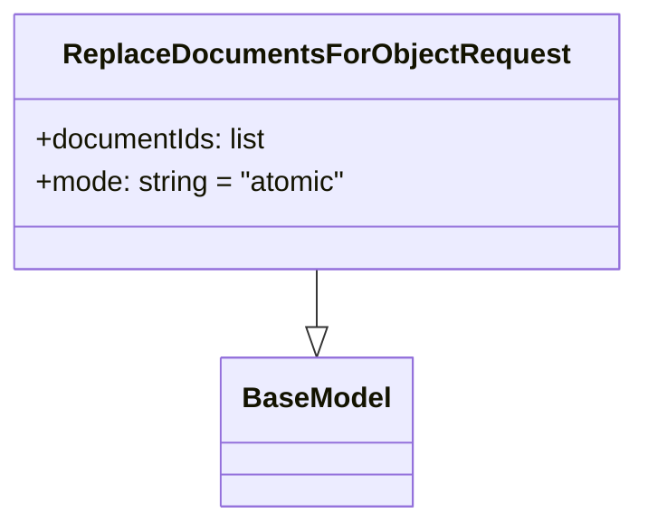

# Diagram: common/document_service/src/api/schemas/requests/replace_documents_for_object_request.py

> Auto-generated by Obscura crawlers

## Mermaid

### SVG

<svg id="container" width="352.6484375" xmlns="http://www.w3.org/2000/svg" class="classDiagram" height="294" viewBox="0 0 352.6484375 294" role="graphics-document document" aria-roledescription="class"><g><defs><marker id="container_class-aggregationStart" class="marker aggregation class" refX="18" refY="7" markerWidth="190" markerHeight="240" orient="auto"><path d="M 18,7 L9,13 L1,7 L9,1 Z"></path></marker></defs><defs><marker id="container_class-aggregationEnd" class="marker aggregation class" refX="1" refY="7" markerWidth="20" markerHeight="28" orient="auto"><path d="M 18,7 L9,13 L1,7 L9,1 Z"></path></marker></defs><defs><marker id="container_class-extensionStart" class="marker extension class" refX="18" refY="7" markerWidth="190" markerHeight="240" orient="auto"><path d="M 1,7 L18,13 V 1 Z"></path></marker></defs><defs><marker id="container_class-extensionEnd" class="marker extension class" refX="1" refY="7" markerWidth="20" markerHeight="28" orient="auto"><path d="M 1,1 V 13 L18,7 Z"></path></marker></defs><defs><marker id="container_class-compositionStart" class="marker composition class" refX="18" refY="7" markerWidth="190" markerHeight="240" orient="auto"><path d="M 18,7 L9,13 L1,7 L9,1 Z"></path></marker></defs><defs><marker id="container_class-compositionEnd" class="marker composition class" refX="1" refY="7" markerWidth="20" markerHeight="28" orient="auto"><path d="M 18,7 L9,13 L1,7 L9,1 Z"></path></marker></defs><defs><marker id="container_class-dependencyStart" class="marker dependency class" refX="6" refY="7" markerWidth="190" markerHeight="240" orient="auto"><path d="M 5,7 L9,13 L1,7 L9,1 Z"></path></marker></defs><defs><marker id="container_class-dependencyEnd" class="marker dependency class" refX="13" refY="7" markerWidth="20" markerHeight="28" orient="auto"><path d="M 18,7 L9,13 L14,7 L9,1 Z"></path></marker></defs><defs><marker id="container_class-lollipopStart" class="marker lollipop class" refX="13" refY="7" markerWidth="190" markerHeight="240" orient="auto"><circle stroke="black" fill="transparent" cx="7" cy="7" r="6"></circle></marker></defs><defs><marker id="container_class-lollipopEnd" class="marker lollipop class" refX="1" refY="7" markerWidth="190" markerHeight="240" orient="auto"><circle stroke="black" fill="transparent" cx="7" cy="7" r="6"></circle></marker></defs><g class="root"><g class="clusters"></g><g class="edgePaths"><path d="M176.324,152L176.324,156.167C176.324,160.333,176.324,168.667,176.324,174.125C176.324,179.583,176.324,182.167,176.324,183.458L176.324,184.75" id="id_ReplaceDocumentsForObjectRequest_BaseModel_1" class="edge-thickness-normal edge-pattern-solid relation" style=";;;" data-edge="true" data-et="edge" data-id="id_ReplaceDocumentsForObjectRequest_BaseModel_1" data-points="W3sieCI6MTc2LjMyNDIxODc1LCJ5IjoxNTJ9LHsieCI6MTc2LjMyNDIxODc1LCJ5IjoxNzd9LHsieCI6MTc2LjMyNDIxODc1LCJ5IjoyMDJ9XQ==" marker-end="url(#container_class-extensionEnd)"></path></g><g class="edgeLabels"><g class="edgeLabel"><g class="label" data-id="id_ReplaceDocumentsForObjectRequest_BaseModel_1" transform="translate(0, 0)"><foreignObject width="0" height="0">

</foreignObject></g></g></g><g class="nodes"><g class="node default" id="classId-BaseModel-0" transform="translate(176.32421875, 244)"><g class="basic label-container"><path d="M-52.078125 -42 L52.078125 -42 L52.078125 42 L-52.078125 42" stroke="none" stroke-width="0" fill="#ECECFF" style=""></path><path d="M-52.078125 -42 C-24.676927603377283 -42, 2.7242697932454334 -42, 52.078125 -42 M-52.078125 -42 C-26.882820544349215 -42, -1.6875160886984304 -42, 52.078125 -42 M52.078125 -42 C52.078125 -9.338758369647358, 52.078125 23.322483260705283, 52.078125 42 M52.078125 -42 C52.078125 -25.13604611110485, 52.078125 -8.2720922222097, 52.078125 42 M52.078125 42 C25.148061294651402 42, -1.7820024106971957 42, -52.078125 42 M52.078125 42 C18.83133637112588 42, -14.415452257748242 42, -52.078125 42 M-52.078125 42 C-52.078125 23.478179447788044, -52.078125 4.956358895576088, -52.078125 -42 M-52.078125 42 C-52.078125 19.751722486391234, -52.078125 -2.496555027217532, -52.078125 -42" stroke="#9370DB" stroke-width="1.3" fill="none" stroke-dasharray="0 0" style=""></path></g><g class="annotation-group text" transform="translate(0, -18)"></g><g class="label-group text" transform="translate(-40.078125, -18)"><g class="label" style="font-weight: bolder" transform="translate(0,-12)"><foreignObject width="80.15625" height="24">

BaseModel

</foreignObject></g></g><g class="members-group text" transform="translate(-40.078125, 30)"></g><g class="methods-group text" transform="translate(-40.078125, 60)"></g><g class="divider" style=""><path d="M-52.078125 6 C-22.069346169616495 6, 7.939432660767011 6, 52.078125 6 M-52.078125 6 C-16.026182246367142 6, 20.025760507265716 6, 52.078125 6" stroke="#9370DB" stroke-width="1.3" fill="none" stroke-dasharray="0 0" style=""></path></g><g class="divider" style=""><path d="M-52.078125 24 C-24.972780224984913 24, 2.1325645500301746 24, 52.078125 24 M-52.078125 24 C-12.777797969480709 24, 26.522529061038583 24, 52.078125 24" stroke="#9370DB" stroke-width="1.3" fill="none" stroke-dasharray="0 0" style=""></path></g></g><g class="node default" id="classId-ReplaceDocumentsForObjectRequest-1" transform="translate(176.32421875, 80)"><g class="basic label-container"><path d="M-168.32421875 -72 L168.32421875 -72 L168.32421875 72 L-168.32421875 72" stroke="none" stroke-width="0" fill="#ECECFF" style=""></path><path d="M-168.32421875 -72 C-52.291729419952915 -72, 63.74075991009417 -72, 168.32421875 -72 M-168.32421875 -72 C-86.87786598043957 -72, -5.431513210879132 -72, 168.32421875 -72 M168.32421875 -72 C168.32421875 -43.195375482422456, 168.32421875 -14.390750964844912, 168.32421875 72 M168.32421875 -72 C168.32421875 -22.10160152173618, 168.32421875 27.796796956527643, 168.32421875 72 M168.32421875 72 C80.06235181465408 72, -8.199515120691842 72, -168.32421875 72 M168.32421875 72 C57.04150096858781 72, -54.241216812824376 72, -168.32421875 72 M-168.32421875 72 C-168.32421875 40.35358316913725, -168.32421875 8.707166338274497, -168.32421875 -72 M-168.32421875 72 C-168.32421875 20.852508473176677, -168.32421875 -30.294983053646646, -168.32421875 -72" stroke="#9370DB" stroke-width="1.3" fill="none" stroke-dasharray="0 0" style=""></path></g><g class="annotation-group text" transform="translate(0, -48)"></g><g class="label-group text" transform="translate(-135.1328125, -48)"><g class="label" style="font-weight: bolder" transform="translate(0,-12)"><foreignObject width="270.265625" height="24">

ReplaceDocumentsForObjectRequest

</foreignObject></g></g><g class="members-group text" transform="translate(-156.32421875, 0)"><g class="label" style="" transform="translate(0,-12)"><foreignObject width="133.578125" height="24">

+documentIds: list

</foreignObject></g><g class="label" style="" transform="translate(0,12)"><foreignObject width="177.515625" height="24">

+mode: string = "atomic"

</foreignObject></g></g><g class="methods-group text" transform="translate(-156.32421875, 72)"></g><g class="divider" style=""><path d="M-168.32421875 -24 C-34.87012918198707 -24, 98.58396038602586 -24, 168.32421875 -24 M-168.32421875 -24 C-73.3560247332887 -24, 21.61216928342259 -24, 168.32421875 -24" stroke="#9370DB" stroke-width="1.3" fill="none" stroke-dasharray="0 0" style=""></path></g><g class="divider" style=""><path d="M-168.32421875 48 C-64.36959027848711 48, 39.58503819302578 48, 168.32421875 48 M-168.32421875 48 C-43.45969781257894 48, 81.40482312484212 48, 168.32421875 48" stroke="#9370DB" stroke-width="1.3" fill="none" stroke-dasharray="0 0" style=""></path></g></g></g></g></g></svg>
