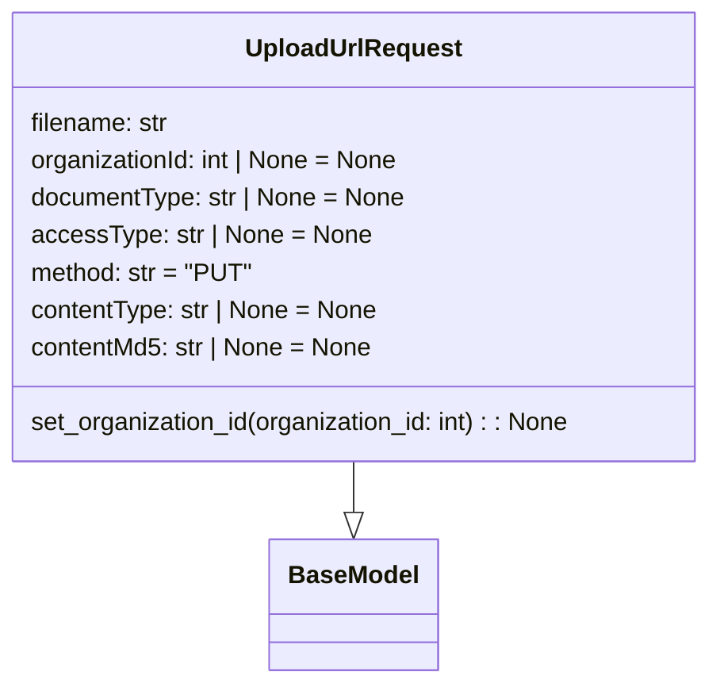

# Diagram: common/document_service/src/api/schemas/requests/upload_url_request.py

> Auto-generated by Obscura crawlers

## Mermaid

### SVG

<svg id="container" width="459.2265625" xmlns="http://www.w3.org/2000/svg" class="classDiagram" height="438" viewBox="0 0 459.2265625 438" role="graphics-document document" aria-roledescription="class"><g><defs><marker id="container_class-aggregationStart" class="marker aggregation class" refX="18" refY="7" markerWidth="190" markerHeight="240" orient="auto"><path d="M 18,7 L9,13 L1,7 L9,1 Z"></path></marker></defs><defs><marker id="container_class-aggregationEnd" class="marker aggregation class" refX="1" refY="7" markerWidth="20" markerHeight="28" orient="auto"><path d="M 18,7 L9,13 L1,7 L9,1 Z"></path></marker></defs><defs><marker id="container_class-extensionStart" class="marker extension class" refX="18" refY="7" markerWidth="190" markerHeight="240" orient="auto"><path d="M 1,7 L18,13 V 1 Z"></path></marker></defs><defs><marker id="container_class-extensionEnd" class="marker extension class" refX="1" refY="7" markerWidth="20" markerHeight="28" orient="auto"><path d="M 1,1 V 13 L18,7 Z"></path></marker></defs><defs><marker id="container_class-compositionStart" class="marker composition class" refX="18" refY="7" markerWidth="190" markerHeight="240" orient="auto"><path d="M 18,7 L9,13 L1,7 L9,1 Z"></path></marker></defs><defs><marker id="container_class-compositionEnd" class="marker composition class" refX="1" refY="7" markerWidth="20" markerHeight="28" orient="auto"><path d="M 18,7 L9,13 L1,7 L9,1 Z"></path></marker></defs><defs><marker id="container_class-dependencyStart" class="marker dependency class" refX="6" refY="7" markerWidth="190" markerHeight="240" orient="auto"><path d="M 5,7 L9,13 L1,7 L9,1 Z"></path></marker></defs><defs><marker id="container_class-dependencyEnd" class="marker dependency class" refX="13" refY="7" markerWidth="20" markerHeight="28" orient="auto"><path d="M 18,7 L9,13 L14,7 L9,1 Z"></path></marker></defs><defs><marker id="container_class-lollipopStart" class="marker lollipop class" refX="13" refY="7" markerWidth="190" markerHeight="240" orient="auto"><circle stroke="black" fill="transparent" cx="7" cy="7" r="6"></circle></marker></defs><defs><marker id="container_class-lollipopEnd" class="marker lollipop class" refX="1" refY="7" markerWidth="190" markerHeight="240" orient="auto"><circle stroke="black" fill="transparent" cx="7" cy="7" r="6"></circle></marker></defs><g class="root"><g class="clusters"></g><g class="edgePaths"><path d="M229.613,296L229.613,300.167C229.613,304.333,229.613,312.667,229.613,318.125C229.613,323.583,229.613,326.167,229.613,327.458L229.613,328.75" id="id_UploadUrlRequest_BaseModel_1" class="edge-thickness-normal edge-pattern-solid relation" style=";;;" data-edge="true" data-et="edge" data-id="id_UploadUrlRequest_BaseModel_1" data-points="W3sieCI6MjI5LjYxMzI4MTI1LCJ5IjoyOTZ9LHsieCI6MjI5LjYxMzI4MTI1LCJ5IjozMjF9LHsieCI6MjI5LjYxMzI4MTI1LCJ5IjozNDZ9XQ==" marker-end="url(#container_class-extensionEnd)"></path></g><g class="edgeLabels"><g class="edgeLabel"><g class="label" data-id="id_UploadUrlRequest_BaseModel_1" transform="translate(0, 0)"><foreignObject width="0" height="0">

</foreignObject></g></g></g><g class="nodes"><g class="node default" id="classId-BaseModel-0" transform="translate(229.61328125, 388)"><g class="basic label-container"><path d="M-52.078125 -42 L52.078125 -42 L52.078125 42 L-52.078125 42" stroke="none" stroke-width="0" fill="#ECECFF" style=""></path><path d="M-52.078125 -42 C-30.03866289236291 -42, -7.999200784725822 -42, 52.078125 -42 M-52.078125 -42 C-15.01945723213862 -42, 22.03921053572276 -42, 52.078125 -42 M52.078125 -42 C52.078125 -18.780242947535278, 52.078125 4.439514104929444, 52.078125 42 M52.078125 -42 C52.078125 -18.254958292960346, 52.078125 5.490083414079308, 52.078125 42 M52.078125 42 C30.006635680686735 42, 7.935146361373469 42, -52.078125 42 M52.078125 42 C28.80614023741632 42, 5.534155474832637 42, -52.078125 42 M-52.078125 42 C-52.078125 23.720602203373794, -52.078125 5.4412044067475875, -52.078125 -42 M-52.078125 42 C-52.078125 10.756292222372618, -52.078125 -20.487415555254763, -52.078125 -42" stroke="#9370DB" stroke-width="1.3" fill="none" stroke-dasharray="0 0" style=""></path></g><g class="annotation-group text" transform="translate(0, -18)"></g><g class="label-group text" transform="translate(-40.078125, -18)"><g class="label" style="font-weight: bolder" transform="translate(0,-12)"><foreignObject width="80.15625" height="24">

BaseModel

</foreignObject></g></g><g class="members-group text" transform="translate(-40.078125, 30)"></g><g class="methods-group text" transform="translate(-40.078125, 60)"></g><g class="divider" style=""><path d="M-52.078125 6 C-25.853660589795073 6, 0.37080382040985427 6, 52.078125 6 M-52.078125 6 C-23.722109507153363 6, 4.633905985693275 6, 52.078125 6" stroke="#9370DB" stroke-width="1.3" fill="none" stroke-dasharray="0 0" style=""></path></g><g class="divider" style=""><path d="M-52.078125 24 C-17.771668900377982 24, 16.534787199244036 24, 52.078125 24 M-52.078125 24 C-22.111811227027577 24, 7.854502545944847 24, 52.078125 24" stroke="#9370DB" stroke-width="1.3" fill="none" stroke-dasharray="0 0" style=""></path></g></g><g class="node default" id="classId-UploadUrlRequest-1" transform="translate(229.61328125, 152)"><g class="basic label-container"><path d="M-221.61328125 -144 L221.61328125 -144 L221.61328125 144 L-221.61328125 144" stroke="none" stroke-width="0" fill="#ECECFF" style=""></path><path d="M-221.61328125 -144 C-72.2555251909314 -144, 77.10223086813721 -144, 221.61328125 -144 M-221.61328125 -144 C-82.18321880606732 -144, 57.24684363786537 -144, 221.61328125 -144 M221.61328125 -144 C221.61328125 -62.77471654470209, 221.61328125 18.450566910595825, 221.61328125 144 M221.61328125 -144 C221.61328125 -47.25666582506801, 221.61328125 49.486668349863976, 221.61328125 144 M221.61328125 144 C94.63416996248613 144, -32.34494132502775 144, -221.61328125 144 M221.61328125 144 C122.39267123733511 144, 23.172061224670216 144, -221.61328125 144 M-221.61328125 144 C-221.61328125 34.83969551678635, -221.61328125 -74.3206089664273, -221.61328125 -144 M-221.61328125 144 C-221.61328125 72.86391267183076, -221.61328125 1.7278253436615216, -221.61328125 -144" stroke="#9370DB" stroke-width="1.3" fill="none" stroke-dasharray="0 0" style=""></path></g><g class="annotation-group text" transform="translate(0, -120)"></g><g class="label-group text" transform="translate(-66.8671875, -120)"><g class="label" style="font-weight: bolder" transform="translate(0,-12)"><foreignObject width="133.734375" height="24">

UploadUrlRequest

</foreignObject></g></g><g class="members-group text" transform="translate(-209.61328125, -72)"><g class="label" style="" transform="translate(0,-12)"><foreignObject width="90.546875" height="24">

filename: str

</foreignObject></g><g class="label" style="" transform="translate(0,12)"><foreignObject width="240.53125" height="24">

organizationId: int | None = None

</foreignObject></g><g class="label" style="" transform="translate(0,36)"><foreignObject width="242.6875" height="24">

documentType: str | None = None

</foreignObject></g><g class="label" style="" transform="translate(0,60)"><foreignObject width="216.25" height="24">

accessType: str | None = None

</foreignObject></g><g class="label" style="" transform="translate(0,84)"><foreignObject width="141.578125" height="24">

method: str = "PUT"

</foreignObject></g><g class="label" style="" transform="translate(0,108)"><foreignObject width="224.84375" height="24">

contentType: str | None = None

</foreignObject></g><g class="label" style="" transform="translate(0,132)"><foreignObject width="221.140625" height="24">

contentMd5: str | None = None

</foreignObject></g></g><g class="methods-group text" transform="translate(-209.61328125, 120)"><g class="label" style="" transform="translate(0,-12)"><foreignObject width="352.359375" height="24">

set_organization_id(organization_id: int) : : None

</foreignObject></g></g><g class="divider" style=""><path d="M-221.61328125 -96 C-100.4465679350577 -96, 20.7201453798846 -96, 221.61328125 -96 M-221.61328125 -96 C-61.41083484506862 -96, 98.79161155986276 -96, 221.61328125 -96" stroke="#9370DB" stroke-width="1.3" fill="none" stroke-dasharray="0 0" style=""></path></g><g class="divider" style=""><path d="M-221.61328125 96 C-129.20489313938154 96, -36.79650502876308 96, 221.61328125 96 M-221.61328125 96 C-79.48838233482363 96, 62.63651658035275 96, 221.61328125 96" stroke="#9370DB" stroke-width="1.3" fill="none" stroke-dasharray="0 0" style=""></path></g></g></g></g></g></svg>
