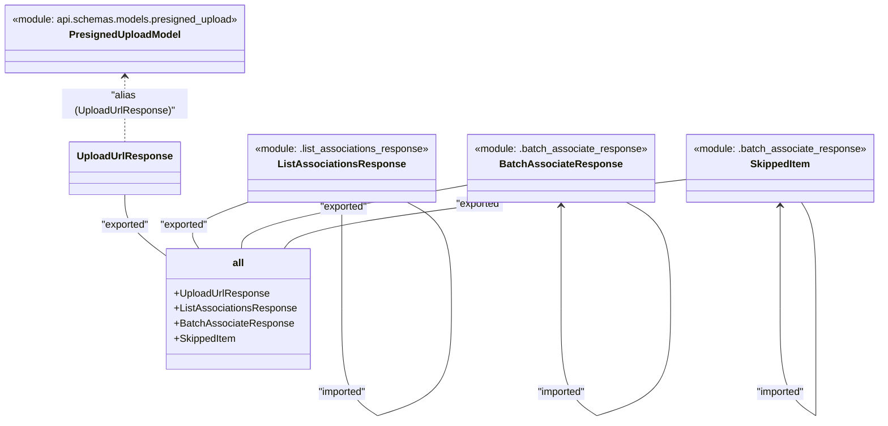

# Diagram: common/document_service/src/api/schemas/responses/__init__.py

> Auto-generated by Obscura crawlers

## Mermaid

### SVG

<svg id="container" width="1417.0152587890625" xmlns="http://www.w3.org/2000/svg" class="classDiagram" height="670.1499633789062" viewBox="0 0 1417.0152587890625 670.1499633789062" role="graphics-document document" aria-roledescription="class"><g><defs><marker id="container_class-aggregationStart" class="marker aggregation class" refX="18" refY="7" markerWidth="190" markerHeight="240" orient="auto"><path d="M 18,7 L9,13 L1,7 L9,1 Z"></path></marker></defs><defs><marker id="container_class-aggregationEnd" class="marker aggregation class" refX="1" refY="7" markerWidth="20" markerHeight="28" orient="auto"><path d="M 18,7 L9,13 L1,7 L9,1 Z"></path></marker></defs><defs><marker id="container_class-extensionStart" class="marker extension class" refX="18" refY="7" markerWidth="190" markerHeight="240" orient="auto"><path d="M 1,7 L18,13 V 1 Z"></path></marker></defs><defs><marker id="container_class-extensionEnd" class="marker extension class" refX="1" refY="7" markerWidth="20" markerHeight="28" orient="auto"><path d="M 1,1 V 13 L18,7 Z"></path></marker></defs><defs><marker id="container_class-compositionStart" class="marker composition class" refX="18" refY="7" markerWidth="190" markerHeight="240" orient="auto"><path d="M 18,7 L9,13 L1,7 L9,1 Z"></path></marker></defs><defs><marker id="container_class-compositionEnd" class="marker composition class" refX="1" refY="7" markerWidth="20" markerHeight="28" orient="auto"><path d="M 18,7 L9,13 L1,7 L9,1 Z"></path></marker></defs><defs><marker id="container_class-dependencyStart" class="marker dependency class" refX="6" refY="7" markerWidth="190" markerHeight="240" orient="auto"><path d="M 5,7 L9,13 L1,7 L9,1 Z"></path></marker></defs><defs><marker id="container_class-dependencyEnd" class="marker dependency class" refX="13" refY="7" markerWidth="20" markerHeight="28" orient="auto"><path d="M 18,7 L9,13 L14,7 L9,1 Z"></path></marker></defs><defs><marker id="container_class-lollipopStart" class="marker lollipop class" refX="13" refY="7" markerWidth="190" markerHeight="240" orient="auto"><circle stroke="black" fill="transparent" cx="7" cy="7" r="6"></circle></marker></defs><defs><marker id="container_class-lollipopEnd" class="marker lollipop class" refX="1" refY="7" markerWidth="190" markerHeight="240" orient="auto"><circle stroke="black" fill="transparent" cx="7" cy="7" r="6"></circle></marker></defs><g class="root"><g class="clusters"></g><g class="edgePaths"><path d="M201.563,122L201.563,129.167C201.563,136.333,201.563,150.667,201.563,168C201.563,185.333,201.563,205.667,201.563,215.833L201.563,226" id="id_PresignedUploadModel_UploadUrlResponse_1" class="edge-thickness-normal edge-pattern-dashed relation" style=";;;" data-edge="true" data-et="edge" data-id="id_PresignedUploadModel_UploadUrlResponse_1" data-points="W3sieCI6MjAxLjU2MjUsInkiOjExNn0seyJ4IjoyMDEuNTYyNSwieSI6MTY1fSx7IngiOjIwMS41NjI1LCJ5IjoyMjZ9XQ==" marker-start="url(#container_class-dependencyStart)"></path><path d="M557.414,328L557.414,333.167C557.414,338.333,557.414,348.667,557.414,375.992C557.414,403.317,557.414,447.633,557.414,469.792L557.414,491.95" id="ListAssociationsResponse-cyclic-special-1" class="edge-thickness-normal edge-pattern-solid relation" style=";;;" data-edge="true" data-et="edge" data-id="ListAssociationsResponse-cyclic-special-1" data-points="W3sieCI6NTU3LjQxMzY3MTg3NTM3MjUsInkiOjMyMn0seyJ4Ijo1NTcuNDEzNjcxODc1MzcyNSwieSI6MzU5fSx7IngiOjU1Ny40MTM2NzE4NzUzNzI1LCJ5Ijo0OTEuOTQ5OTk5OTk5MjU0OTR9XQ==" marker-start="url(#container_class-dependencyStart)"></path><path d="M557.414,492.05L557.414,514.208C557.414,536.367,557.414,580.683,567.392,609.012C577.371,637.34,597.328,649.679,607.307,655.849L617.286,662.019" id="ListAssociationsResponse-cyclic-special-mid" class="edge-thickness-normal edge-pattern-solid relation" style=";;;" data-edge="true" data-et="edge" data-id="ListAssociationsResponse-cyclic-special-mid" data-points="W3sieCI6NTU3LjQxMzY3MTg3NTM3MjUsInkiOjQ5Mi4wNTAwMDAwMDA3NDUwNn0seyJ4Ijo1NTcuNDEzNjcxODc1MzcyNSwieSI6NjI1fSx7IngiOjYxNy4yODU1NDY4NzQ2Mjc1LCJ5Ijo2NjIuMDE5MDg0NzQ2MDQ2NX1d"></path><path d="M617.386,662.034L636.712,655.862C656.038,649.689,694.691,637.345,714.017,609.006C733.343,580.667,733.343,536.333,733.343,492C733.343,447.667,733.343,403.333,721.421,375C709.499,346.667,685.655,334.333,673.733,328.167L661.812,322" id="ListAssociationsResponse-cyclic-special-2" class="edge-thickness-normal edge-pattern-solid relation" style=";;;" data-edge="true" data-et="edge" data-id="ListAssociationsResponse-cyclic-special-2" data-points="W3sieCI6NjE3LjM4NTU0Njg3NjExNzYsInkiOjY2Mi4wMzQwMzEyNDg0MDIyfSx7IngiOjczMy4zNDMzNTkzNzUzNzI1LCJ5Ijo2MjV9LHsieCI6NzMzLjM0MzM1OTM3NTM3MjUsInkiOjQ5Mn0seyJ4Ijo3MzMuMzQzMzU5Mzc1MzcyNSwieSI6MzU5fSx7IngiOjY2MS44MTE1MDg0MTM4MzQxLCJ5IjozMjJ9XQ=="></path><path d="M909.273,328L909.273,333.167C909.273,338.333,909.273,348.667,909.273,375.992C909.273,403.317,909.273,447.633,909.273,469.792L909.273,491.95" id="BatchAssociateResponse-cyclic-special-1" class="edge-thickness-normal edge-pattern-solid relation" style=";;;" data-edge="true" data-et="edge" data-id="BatchAssociateResponse-cyclic-special-1" data-points="W3sieCI6OTA5LjI3MzA0Njg3NTM3MjUsInkiOjMyMn0seyJ4Ijo5MDkuMjczMDQ2ODc1MzcyNSwieSI6MzU5fSx7IngiOjkwOS4yNzMwNDY4NzUzNzI1LCJ5Ijo0OTEuOTQ5OTk5OTk5MjU0OTR9XQ==" marker-start="url(#container_class-dependencyStart)"></path><path d="M909.273,492.05L909.273,514.208C909.273,536.367,909.273,580.683,919.252,609.012C929.23,637.34,949.188,649.679,959.166,655.849L969.145,662.019" id="BatchAssociateResponse-cyclic-special-mid" class="edge-thickness-normal edge-pattern-solid relation" style=";;;" data-edge="true" data-et="edge" data-id="BatchAssociateResponse-cyclic-special-mid" data-points="W3sieCI6OTA5LjI3MzA0Njg3NTM3MjUsInkiOjQ5Mi4wNTAwMDAwMDA3NDUwNn0seyJ4Ijo5MDkuMjczMDQ2ODc1MzcyNSwieSI6NjI1fSx7IngiOjk2OS4xNDQ5MjE4NzQ2Mjc1LCJ5Ijo2NjIuMDE5MDg0NzQ2MDQ2NX1d"></path><path d="M969.245,662.034L988.402,655.862C1007.559,649.689,1045.873,637.345,1065.03,609.006C1084.187,580.667,1084.187,536.333,1084.187,492C1084.187,447.667,1084.187,403.333,1072.334,375C1060.481,346.667,1036.775,334.333,1024.921,328.167L1013.068,322" id="BatchAssociateResponse-cyclic-special-2" class="edge-thickness-normal edge-pattern-solid relation" style=";;;" data-edge="true" data-et="edge" data-id="BatchAssociateResponse-cyclic-special-2" data-points="W3sieCI6OTY5LjI0NDkyMTg3NjExNzYsInkiOjY2Mi4wMzM4OTAyMTA0Mzc0fSx7IngiOjEwODQuMTg3MTA5Mzc1MzcyNSwieSI6NjI1fSx7IngiOjEwODQuMTg3MTA5Mzc1MzcyNSwieSI6NDkyfSx7IngiOjEwODQuMTg3MTA5Mzc1MzcyNSwieSI6MzU5fSx7IngiOjEwMTMuMDY4MjA0ODQyNDA1NSwieSI6MzIyfV0="></path><path d="M1259.101,328L1259.101,333.167C1259.101,338.333,1259.101,348.667,1259.101,375.992C1259.101,403.317,1259.101,447.633,1259.101,469.792L1259.101,491.95" id="SkippedItem-cyclic-special-1" class="edge-thickness-normal edge-pattern-solid relation" style=";;;" data-edge="true" data-et="edge" data-id="SkippedItem-cyclic-special-1" data-points="W3sieCI6MTI1OS4xMDExNzE4NzUzNzI1LCJ5IjozMjJ9LHsieCI6MTI1OS4xMDExNzE4NzUzNzI1LCJ5IjozNTl9LHsieCI6MTI1OS4xMDExNzE4NzUzNzI1LCJ5Ijo0OTEuOTQ5OTk5OTk5MjU0OTR9XQ==" marker-start="url(#container_class-dependencyStart)"></path><path d="M1259.101,492.05L1259.101,514.208C1259.101,536.367,1259.101,580.683,1269.08,609.012C1279.058,637.34,1299.016,649.679,1308.994,655.849L1318.973,662.019" id="SkippedItem-cyclic-special-mid" class="edge-thickness-normal edge-pattern-solid relation" style=";;;" data-edge="true" data-et="edge" data-id="SkippedItem-cyclic-special-mid" data-points="W3sieCI6MTI1OS4xMDExNzE4NzUzNzI1LCJ5Ijo0OTIuMDUwMDAwMDAwNzQ1MDZ9LHsieCI6MTI1OS4xMDExNzE4NzUzNzI1LCJ5Ijo2MjV9LHsieCI6MTMxOC45NzMwNDY4NzQ2Mjc1LCJ5Ijo2NjIuMDE5MDg0NzQ2MDQ2NX1d"></path><path d="M1319.023,662L1319.023,655.833C1319.023,649.667,1319.023,637.333,1319.023,609C1319.023,580.667,1319.023,536.333,1319.023,492C1319.023,447.667,1319.023,403.333,1314.962,375C1310.902,346.667,1302.78,334.333,1298.72,328.167L1294.659,322" id="SkippedItem-cyclic-special-2" class="edge-thickness-normal edge-pattern-solid relation" style=";;;" data-edge="true" data-et="edge" data-id="SkippedItem-cyclic-special-2" data-points="W3sieCI6MTMxOS4wMjMwNDY4NzUzNzI1LCJ5Ijo2NjJ9LHsieCI6MTMxOS4wMjMwNDY4NzUzNzI1LCJ5Ijo2MjV9LHsieCI6MTMxOS4wMjMwNDY4NzUzNzI1LCJ5Ijo0OTJ9LHsieCI6MTMxOS4wMjMwNDY4NzUzNzI1LCJ5IjozNTl9LHsieCI6MTI5NC42NTkyMDc1ODk2NTgzLCJ5IjozMjJ9XQ=="></path><path d="M201.563,310L201.563,318.167C201.563,326.333,201.563,342.667,214.606,359.867C227.65,377.068,253.737,395.136,266.781,404.17L279.825,413.204" id="id_UploadUrlResponse___all___5" class="edge-thickness-normal edge-pattern-solid relation" style=";;;" data-edge="true" data-et="edge" data-id="id_UploadUrlResponse___all___5" data-points="W3sieCI6MjAxLjU2MjUsInkiOjMxMH0seyJ4IjoyMDEuNTYyNSwieSI6MzU5fSx7IngiOjI3OS44MjQ2MDkzNzQ2Mjc0NywieSI6NDEzLjIwMzg4MjgyMzUxOTE3fV0="></path><path d="M405.468,321.582L387.784,327.818C370.099,334.055,334.729,346.527,321.413,358.93C308.098,371.333,316.836,383.667,321.206,389.833L325.575,396" id="id_ListAssociationsResponse___all___6" class="edge-thickness-normal edge-pattern-solid relation" style=";;;" data-edge="true" data-et="edge" data-id="id_ListAssociationsResponse___all___6" data-points="W3sieCI6NDA1LjQ2ODM1OTM3NTM3MjUzLCJ5IjozMjEuNTgxODM3NjQwMDc1MjZ9LHsieCI6Mjk5LjM1OTM3NSwieSI6MzU5fSx7IngiOjMyNS41NzUwNjE2Nzc1Mjc5NywieSI6Mzk2fV0="></path><path d="M759.359,294.639L698.992,305.366C638.625,316.093,517.89,337.546,457.358,354.44C396.826,371.333,396.496,383.667,396.33,389.833L396.165,396" id="id_BatchAssociateResponse___all___7" class="edge-thickness-normal edge-pattern-solid relation" style=";;;" data-edge="true" data-et="edge" data-id="id_BatchAssociateResponse___all___7" data-points="W3sieCI6NzU5LjM1ODk4NDM3NTM3MjUsInkiOjI5NC42Mzg4MDUzODcyNDA0NH0seyJ4IjozOTcuMTU2MjUsInkiOjM1OX0seyJ4IjozOTYuMTY1Mjg3MjQxNDM3NzQsInkiOjM5Nn1d"></path><path d="M1109.187,285.853L1006.815,298.044C904.442,310.235,699.698,334.618,592.626,352.975C485.554,371.333,476.155,383.667,471.455,389.833L466.756,396" id="id_SkippedItem___all___8" class="edge-thickness-normal edge-pattern-solid relation" style=";;;" data-edge="true" data-et="edge" data-id="id_SkippedItem___all___8" data-points="W3sieCI6MTEwOS4xODcxMDkzNzUzNzI1LCJ5IjoyODUuODUyNzk2NjQ0OTQ3N30seyJ4Ijo0OTQuOTUzMTI1LCJ5IjozNTl9LHsieCI6NDY2Ljc1NTUxMjgwNTM0NzUsInkiOjM5Nn1d"></path></g><g class="edgeLabels"><g class="edgeLabel" transform="translate(201.5625, 165)"><g class="label" data-id="id_PresignedUploadModel_UploadUrlResponse_1" transform="translate(-100, -24)"><foreignObject width="200" height="48">

"alias (UploadUrlResponse)"

</foreignObject></g></g><g class="edgeLabel"><g class="label" data-id="ListAssociationsResponse-cyclic-special-1" transform="translate(0, 0)"><foreignObject width="0" height="0">

</foreignObject></g></g><g class="edgeLabel" transform="translate(557.4136718753725, 625)"><g class="label" data-id="ListAssociationsResponse-cyclic-special-mid" transform="translate(-39.921875, -12)"><foreignObject width="79.84375" height="24">

"imported"

</foreignObject></g></g><g class="edgeLabel"><g class="label" data-id="ListAssociationsResponse-cyclic-special-2" transform="translate(0, 0)"><foreignObject width="0" height="0">

</foreignObject></g></g><g class="edgeLabel"><g class="label" data-id="BatchAssociateResponse-cyclic-special-1" transform="translate(0, 0)"><foreignObject width="0" height="0">

</foreignObject></g></g><g class="edgeLabel" transform="translate(909.2730468753725, 625)"><g class="label" data-id="BatchAssociateResponse-cyclic-special-mid" transform="translate(-39.921875, -12)"><foreignObject width="79.84375" height="24">

"imported"

</foreignObject></g></g><g class="edgeLabel"><g class="label" data-id="BatchAssociateResponse-cyclic-special-2" transform="translate(0, 0)"><foreignObject width="0" height="0">

</foreignObject></g></g><g class="edgeLabel"><g class="label" data-id="SkippedItem-cyclic-special-1" transform="translate(0, 0)"><foreignObject width="0" height="0">

</foreignObject></g></g><g class="edgeLabel" transform="translate(1259.1011718753725, 625)"><g class="label" data-id="SkippedItem-cyclic-special-mid" transform="translate(-39.921875, -12)"><foreignObject width="79.84375" height="24">

"imported"

</foreignObject></g></g><g class="edgeLabel"><g class="label" data-id="SkippedItem-cyclic-special-2" transform="translate(0, 0)"><foreignObject width="0" height="0">

</foreignObject></g></g><g class="edgeLabel" transform="translate(201.5625, 359)"><g class="label" data-id="id_UploadUrlResponse___all___5" transform="translate(-38.8984375, -12)"><foreignObject width="77.796875" height="24">

"exported"

</foreignObject></g></g><g class="edgeLabel" transform="translate(299.359375, 359)"><g class="label" data-id="id_ListAssociationsResponse___all___6" transform="translate(-38.8984375, -12)"><foreignObject width="77.796875" height="24">

"exported"

</foreignObject></g></g><g class="edgeLabel" transform="translate(397.15625, 359)"><g class="label" data-id="id_BatchAssociateResponse___all___7" transform="translate(-38.8984375, -12)"><foreignObject width="77.796875" height="24">

"exported"

</foreignObject></g></g><g class="edgeLabel" transform="translate(778.97334, 325.17692)"><g class="label" data-id="id_SkippedItem___all___8" transform="translate(-38.8984375, -12)"><foreignObject width="77.796875" height="24">

"exported"

</foreignObject></g></g></g><g class="nodes"><g class="node default" id="classId-PresignedUploadModel-0" transform="translate(201.5625, 62)"><g class="basic label-container"><path d="M-193.5625 -54 L193.5625 -54 L193.5625 54 L-193.5625 54" stroke="none" stroke-width="0" fill="#ECECFF" style=""></path><path d="M-193.5625 -54 C-86.74179140088869 -54, 20.078917198222626 -54, 193.5625 -54 M-193.5625 -54 C-97.8532172565186 -54, -2.143934513037209 -54, 193.5625 -54 M193.5625 -54 C193.5625 -12.524287228244326, 193.5625 28.95142554351135, 193.5625 54 M193.5625 -54 C193.5625 -28.182030808385317, 193.5625 -2.364061616770634, 193.5625 54 M193.5625 54 C97.2543701268117 54, 0.9462402536233867 54, -193.5625 54 M193.5625 54 C51.40817288703968 54, -90.74615422592063 54, -193.5625 54 M-193.5625 54 C-193.5625 19.619701421719455, -193.5625 -14.76059715656109, -193.5625 -54 M-193.5625 54 C-193.5625 32.116345683815, -193.5625 10.232691367630004, -193.5625 -54" stroke="#9370DB" stroke-width="1.3" fill="none" stroke-dasharray="0 0" style=""></path></g><g class="annotation-group text" transform="translate(-181.5625, -30)"><g class="label" style="" transform="translate(0,-12)"><foreignObject width="363.125" height="24">

«module: api.schemas.models.presigned_upload»

</foreignObject></g></g><g class="label-group text" transform="translate(-85.0390625, -6)"><g class="label" style="font-weight: bolder" transform="translate(0,-12)"><foreignObject width="170.078125" height="24">

PresignedUploadModel

</foreignObject></g></g><g class="members-group text" transform="translate(-181.5625, 42)"></g><g class="methods-group text" transform="translate(-181.5625, 72)"></g><g class="divider" style=""><path d="M-193.5625 18 C-55.338873801953866 18, 82.88475239609227 18, 193.5625 18 M-193.5625 18 C-111.57775940775855 18, -29.593018815517098 18, 193.5625 18" stroke="#9370DB" stroke-width="1.3" fill="none" stroke-dasharray="0 0" style=""></path></g><g class="divider" style=""><path d="M-193.5625 36 C-76.47264669456463 36, 40.61720661087074 36, 193.5625 36 M-193.5625 36 C-76.3583876939684 36, 40.84572461206321 36, 193.5625 36" stroke="#9370DB" stroke-width="1.3" fill="none" stroke-dasharray="0 0" style=""></path></g></g><g class="node default" id="classId-UploadUrlResponse-1" transform="translate(201.5625, 268)"><g class="basic label-container"><path d="M-84.3359375 -42 L84.3359375 -42 L84.3359375 42 L-84.3359375 42" stroke="none" stroke-width="0" fill="#ECECFF" style=""></path><path d="M-84.3359375 -42 C-39.9050201546807 -42, 4.525897190638602 -42, 84.3359375 -42 M-84.3359375 -42 C-30.071800236543112 -42, 24.192337026913776 -42, 84.3359375 -42 M84.3359375 -42 C84.3359375 -13.90191823245086, 84.3359375 14.196163535098279, 84.3359375 42 M84.3359375 -42 C84.3359375 -23.545573537879584, 84.3359375 -5.091147075759167, 84.3359375 42 M84.3359375 42 C24.65797048214752 42, -35.01999653570496 42, -84.3359375 42 M84.3359375 42 C26.982476725888176 42, -30.370984048223647 42, -84.3359375 42 M-84.3359375 42 C-84.3359375 21.04409837220431, -84.3359375 0.08819674440862002, -84.3359375 -42 M-84.3359375 42 C-84.3359375 14.258382015455606, -84.3359375 -13.483235969088788, -84.3359375 -42" stroke="#9370DB" stroke-width="1.3" fill="none" stroke-dasharray="0 0" style=""></path></g><g class="annotation-group text" transform="translate(0, -18)"></g><g class="label-group text" transform="translate(-72.3359375, -18)"><g class="label" style="font-weight: bolder" transform="translate(0,-12)"><foreignObject width="144.671875" height="24">

UploadUrlResponse

</foreignObject></g></g><g class="members-group text" transform="translate(-72.3359375, 30)"></g><g class="methods-group text" transform="translate(-72.3359375, 60)"></g><g class="divider" style=""><path d="M-84.3359375 6 C-26.212474116920937 6, 31.910989266158126 6, 84.3359375 6 M-84.3359375 6 C-29.92399123803277 6, 24.48795502393446 6, 84.3359375 6" stroke="#9370DB" stroke-width="1.3" fill="none" stroke-dasharray="0 0" style=""></path></g><g class="divider" style=""><path d="M-84.3359375 24 C-19.509348046298115 24, 45.31724140740377 24, 84.3359375 24 M-84.3359375 24 C-25.493215146592476 24, 33.34950720681505 24, 84.3359375 24" stroke="#9370DB" stroke-width="1.3" fill="none" stroke-dasharray="0 0" style=""></path></g></g><g class="node default" id="classId-ListAssociationsResponse-2" transform="translate(557.4136718753725, 268)"><g class="basic label-container"><path d="M-151.9453125 -54 L151.9453125 -54 L151.9453125 54 L-151.9453125 54" stroke="none" stroke-width="0" fill="#ECECFF" style=""></path><path d="M-151.9453125 -54 C-33.21940411859664 -54, 85.50650426280671 -54, 151.9453125 -54 M-151.9453125 -54 C-48.953023074106056 -54, 54.03926635178789 -54, 151.9453125 -54 M151.9453125 -54 C151.9453125 -15.187722124952778, 151.9453125 23.624555750094444, 151.9453125 54 M151.9453125 -54 C151.9453125 -31.476516073437562, 151.9453125 -8.953032146875124, 151.9453125 54 M151.9453125 54 C68.7904826790969 54, -14.364347141806206 54, -151.9453125 54 M151.9453125 54 C65.4598980981831 54, -21.025516303633793 54, -151.9453125 54 M-151.9453125 54 C-151.9453125 11.372369855338277, -151.9453125 -31.255260289323445, -151.9453125 -54 M-151.9453125 54 C-151.9453125 17.177080743526112, -151.9453125 -19.645838512947776, -151.9453125 -54" stroke="#9370DB" stroke-width="1.3" fill="none" stroke-dasharray="0 0" style=""></path></g><g class="annotation-group text" transform="translate(-139.9453125, -30)"><g class="label" style="" transform="translate(0,-12)"><foreignObject width="279.890625" height="24">

«module: .list_associations_response»

</foreignObject></g></g><g class="label-group text" transform="translate(-94.7890625, -6)"><g class="label" style="font-weight: bolder" transform="translate(0,-12)"><foreignObject width="189.578125" height="24">

ListAssociationsResponse

</foreignObject></g></g><g class="members-group text" transform="translate(-139.9453125, 42)"></g><g class="methods-group text" transform="translate(-139.9453125, 72)"></g><g class="divider" style=""><path d="M-151.9453125 18 C-75.95317951745999 18, 0.03895346508002717 18, 151.9453125 18 M-151.9453125 18 C-51.98429303164656 18, 47.97672643670688 18, 151.9453125 18" stroke="#9370DB" stroke-width="1.3" fill="none" stroke-dasharray="0 0" style=""></path></g><g class="divider" style=""><path d="M-151.9453125 36 C-40.72144582286157 36, 70.50242085427686 36, 151.9453125 36 M-151.9453125 36 C-59.18581732163334 36, 33.573677856733326 36, 151.9453125 36" stroke="#9370DB" stroke-width="1.3" fill="none" stroke-dasharray="0 0" style=""></path></g></g><g class="node default" id="classId-BatchAssociateResponse-3" transform="translate(909.2730468753725, 268)"><g class="basic label-container"><path d="M-149.9140625 -54 L149.9140625 -54 L149.9140625 54 L-149.9140625 54" stroke="none" stroke-width="0" fill="#ECECFF" style=""></path><path d="M-149.9140625 -54 C-73.15536727444626 -54, 3.603327951107474 -54, 149.9140625 -54 M-149.9140625 -54 C-39.15211250785735 -54, 71.6098374842853 -54, 149.9140625 -54 M149.9140625 -54 C149.9140625 -19.099370314653683, 149.9140625 15.801259370692634, 149.9140625 54 M149.9140625 -54 C149.9140625 -31.793804432408162, 149.9140625 -9.587608864816325, 149.9140625 54 M149.9140625 54 C45.1626038678572 54, -59.5888547642856 54, -149.9140625 54 M149.9140625 54 C43.122615600569546 54, -63.66883129886091 54, -149.9140625 54 M-149.9140625 54 C-149.9140625 24.744595291108727, -149.9140625 -4.510809417782546, -149.9140625 -54 M-149.9140625 54 C-149.9140625 26.151117225965955, -149.9140625 -1.6977655480680909, -149.9140625 -54" stroke="#9370DB" stroke-width="1.3" fill="none" stroke-dasharray="0 0" style=""></path></g><g class="annotation-group text" transform="translate(-137.9140625, -30)"><g class="label" style="" transform="translate(0,-12)"><foreignObject width="275.828125" height="24">

«module: .batch_associate_response»

</foreignObject></g></g><g class="label-group text" transform="translate(-91.0546875, -6)"><g class="label" style="font-weight: bolder" transform="translate(0,-12)"><foreignObject width="182.109375" height="24">

BatchAssociateResponse

</foreignObject></g></g><g class="members-group text" transform="translate(-137.9140625, 42)"></g><g class="methods-group text" transform="translate(-137.9140625, 72)"></g><g class="divider" style=""><path d="M-149.9140625 18 C-67.38147532575242 18, 15.151111848495162 18, 149.9140625 18 M-149.9140625 18 C-32.87896235067362 18, 84.15613779865276 18, 149.9140625 18" stroke="#9370DB" stroke-width="1.3" fill="none" stroke-dasharray="0 0" style=""></path></g><g class="divider" style=""><path d="M-149.9140625 36 C-43.1594171306907 36, 63.5952282386186 36, 149.9140625 36 M-149.9140625 36 C-64.22022554360016 36, 21.47361141279967 36, 149.9140625 36" stroke="#9370DB" stroke-width="1.3" fill="none" stroke-dasharray="0 0" style=""></path></g></g><g class="node default" id="classId-SkippedItem-4" transform="translate(1259.1011718753725, 268)"><g class="basic label-container"><path d="M-149.9140625 -54 L149.9140625 -54 L149.9140625 54 L-149.9140625 54" stroke="none" stroke-width="0" fill="#ECECFF" style=""></path><path d="M-149.9140625 -54 C-57.8705443655286 -54, 34.172973768942796 -54, 149.9140625 -54 M-149.9140625 -54 C-47.687956778954685 -54, 54.53814894209063 -54, 149.9140625 -54 M149.9140625 -54 C149.9140625 -25.770373691367094, 149.9140625 2.459252617265811, 149.9140625 54 M149.9140625 -54 C149.9140625 -14.538926375652224, 149.9140625 24.922147248695552, 149.9140625 54 M149.9140625 54 C68.06178975748705 54, -13.790482985025903 54, -149.9140625 54 M149.9140625 54 C55.67689278646233 54, -38.560276927075336 54, -149.9140625 54 M-149.9140625 54 C-149.9140625 19.74830671251751, -149.9140625 -14.503386574964978, -149.9140625 -54 M-149.9140625 54 C-149.9140625 25.426389963063663, -149.9140625 -3.147220073872674, -149.9140625 -54" stroke="#9370DB" stroke-width="1.3" fill="none" stroke-dasharray="0 0" style=""></path></g><g class="annotation-group text" transform="translate(-137.9140625, -30)"><g class="label" style="" transform="translate(0,-12)"><foreignObject width="275.828125" height="24">

«module: .batch_associate_response»

</foreignObject></g></g><g class="label-group text" transform="translate(-46.484375, -6)"><g class="label" style="font-weight: bolder" transform="translate(0,-12)"><foreignObject width="92.96875" height="24">

SkippedItem

</foreignObject></g></g><g class="members-group text" transform="translate(-137.9140625, 42)"></g><g class="methods-group text" transform="translate(-137.9140625, 72)"></g><g class="divider" style=""><path d="M-149.9140625 18 C-81.17275498798246 18, -12.431447475964916 18, 149.9140625 18 M-149.9140625 18 C-50.62212016987938 18, 48.66982216024124 18, 149.9140625 18" stroke="#9370DB" stroke-width="1.3" fill="none" stroke-dasharray="0 0" style=""></path></g><g class="divider" style=""><path d="M-149.9140625 36 C-84.8774189407311 36, -19.84077538146221 36, 149.9140625 36 M-149.9140625 36 C-44.5651310153264 36, 60.7838004693472 36, 149.9140625 36" stroke="#9370DB" stroke-width="1.3" fill="none" stroke-dasharray="0 0" style=""></path></g></g><g class="node default" id="classId-__all__-5" transform="translate(393.59414062462747, 492)"><g class="basic label-container"><path d="M-113.76953125 -96 L113.76953125 -96 L113.76953125 96 L-113.76953125 96" stroke="none" stroke-width="0" fill="#ECECFF" style=""></path><path d="M-113.76953125 -96 C-60.54586096442188 -96, -7.322190678843754 -96, 113.76953125 -96 M-113.76953125 -96 C-36.77063131712029 -96, 40.22826861575942 -96, 113.76953125 -96 M113.76953125 -96 C113.76953125 -22.6130842233149, 113.76953125 50.7738315533702, 113.76953125 96 M113.76953125 -96 C113.76953125 -47.252516412716616, 113.76953125 1.4949671745667672, 113.76953125 96 M113.76953125 96 C54.00497083666033 96, -5.759589576679346 96, -113.76953125 96 M113.76953125 96 C65.93965514496116 96, 18.109779039922316 96, -113.76953125 96 M-113.76953125 96 C-113.76953125 21.611265150530528, -113.76953125 -52.777469698938944, -113.76953125 -96 M-113.76953125 96 C-113.76953125 41.121662897925184, -113.76953125 -13.756674204149633, -113.76953125 -96" stroke="#9370DB" stroke-width="1.3" fill="none" stroke-dasharray="0 0" style=""></path></g><g class="annotation-group text" transform="translate(0, -72)"></g><g class="label-group text" transform="translate(-9.1328125, -72)"><g class="label" style="font-weight: bolder" transform="translate(0,-12)"><foreignObject width="18.265625" height="24">

<strong>all</strong>

</foreignObject></g></g><g class="members-group text" transform="translate(-101.76953125, -24)"><g class="label" style="" transform="translate(0,-12)"><foreignObject width="151.65625" height="24">

+UploadUrlResponse

</foreignObject></g><g class="label" style="" transform="translate(0,12)"><foreignObject width="194.40625" height="24">

+ListAssociationsResponse

</foreignObject></g><g class="label" style="" transform="translate(0,36)"><foreignObject width="187.453125" height="24">

+BatchAssociateResponse

</foreignObject></g><g class="label" style="" transform="translate(0,60)"><foreignObject width="98.765625" height="24">

+SkippedItem

</foreignObject></g></g><g class="methods-group text" transform="translate(-101.76953125, 96)"></g><g class="divider" style=""><path d="M-113.76953125 -48 C-63.13132154976678 -48, -12.493111849533562 -48, 113.76953125 -48 M-113.76953125 -48 C-49.309839142464824 -48, 15.149852965070352 -48, 113.76953125 -48" stroke="#9370DB" stroke-width="1.3" fill="none" stroke-dasharray="0 0" style=""></path></g><g class="divider" style=""><path d="M-113.76953125 72 C-50.379668565519495 72, 13.01019411896101 72, 113.76953125 72 M-113.76953125 72 C-30.639913366088237 72, 52.489704517823526 72, 113.76953125 72" stroke="#9370DB" stroke-width="1.3" fill="none" stroke-dasharray="0 0" style=""></path></g></g><g class="label edgeLabel" id="ListAssociationsResponse---ListAssociationsResponse---1" transform="translate(557.4136718753725, 492)"><rect width="0.1" height="0.1"></rect><g class="label" style="" transform="translate(0, 0)"><rect></rect><foreignObject width="0" height="0">

</foreignObject></g></g><g class="label edgeLabel" id="ListAssociationsResponse---ListAssociationsResponse---2" transform="translate(617.3355468753725, 662.0500000007451)"><rect width="0.1" height="0.1"></rect><g class="label" style="" transform="translate(0, 0)"><rect></rect><foreignObject width="0" height="0">

</foreignObject></g></g><g class="label edgeLabel" id="BatchAssociateResponse---BatchAssociateResponse---1" transform="translate(909.2730468753725, 492)"><rect width="0.1" height="0.1"></rect><g class="label" style="" transform="translate(0, 0)"><rect></rect><foreignObject width="0" height="0">

</foreignObject></g></g><g class="label edgeLabel" id="BatchAssociateResponse---BatchAssociateResponse---2" transform="translate(969.1949218753725, 662.0500000007451)"><rect width="0.1" height="0.1"></rect><g class="label" style="" transform="translate(0, 0)"><rect></rect><foreignObject width="0" height="0">

</foreignObject></g></g><g class="label edgeLabel" id="SkippedItem---SkippedItem---1" transform="translate(1259.1011718753725, 492)"><rect width="0.1" height="0.1"></rect><g class="label" style="" transform="translate(0, 0)"><rect></rect><foreignObject width="0" height="0">

</foreignObject></g></g><g class="label edgeLabel" id="SkippedItem---SkippedItem---2" transform="translate(1319.0230468753725, 662.0500000007451)"><rect width="0.1" height="0.1"></rect><g class="label" style="" transform="translate(0, 0)"><rect></rect><foreignObject width="0" height="0">

</foreignObject></g></g></g></g></g></svg>
