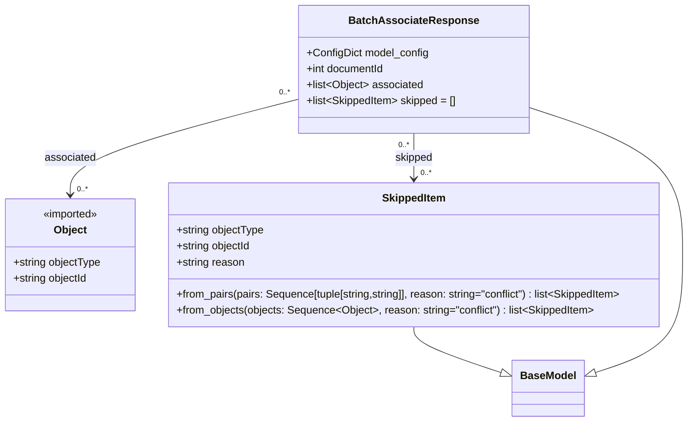

# Diagram: common/document_service/src/api/schemas/responses/batch_associate_response.py

> Auto-generated by Obscura crawlers

## Mermaid

### SVG

<svg id="container" width="1050.7340087890625" xmlns="http://www.w3.org/2000/svg" class="classDiagram" height="632" viewBox="0 0 1050.7340087890625 632" role="graphics-document document" aria-roledescription="class"><g><defs><marker id="container_class-aggregationStart" class="marker aggregation class" refX="18" refY="7" markerWidth="190" markerHeight="240" orient="auto"><path d="M 18,7 L9,13 L1,7 L9,1 Z"></path></marker></defs><defs><marker id="container_class-aggregationEnd" class="marker aggregation class" refX="1" refY="7" markerWidth="20" markerHeight="28" orient="auto"><path d="M 18,7 L9,13 L1,7 L9,1 Z"></path></marker></defs><defs><marker id="container_class-extensionStart" class="marker extension class" refX="18" refY="7" markerWidth="190" markerHeight="240" orient="auto"><path d="M 1,7 L18,13 V 1 Z"></path></marker></defs><defs><marker id="container_class-extensionEnd" class="marker extension class" refX="1" refY="7" markerWidth="20" markerHeight="28" orient="auto"><path d="M 1,1 V 13 L18,7 Z"></path></marker></defs><defs><marker id="container_class-compositionStart" class="marker composition class" refX="18" refY="7" markerWidth="190" markerHeight="240" orient="auto"><path d="M 18,7 L9,13 L1,7 L9,1 Z"></path></marker></defs><defs><marker id="container_class-compositionEnd" class="marker composition class" refX="1" refY="7" markerWidth="20" markerHeight="28" orient="auto"><path d="M 18,7 L9,13 L1,7 L9,1 Z"></path></marker></defs><defs><marker id="container_class-dependencyStart" class="marker dependency class" refX="6" refY="7" markerWidth="190" markerHeight="240" orient="auto"><path d="M 5,7 L9,13 L1,7 L9,1 Z"></path></marker></defs><defs><marker id="container_class-dependencyEnd" class="marker dependency class" refX="13" refY="7" markerWidth="20" markerHeight="28" orient="auto"><path d="M 18,7 L9,13 L14,7 L9,1 Z"></path></marker></defs><defs><marker id="container_class-lollipopStart" class="marker lollipop class" refX="13" refY="7" markerWidth="190" markerHeight="240" orient="auto"><circle stroke="black" fill="transparent" cx="7" cy="7" r="6"></circle></marker></defs><defs><marker id="container_class-lollipopEnd" class="marker lollipop class" refX="1" refY="7" markerWidth="190" markerHeight="240" orient="auto"><circle stroke="black" fill="transparent" cx="7" cy="7" r="6"></circle></marker></defs><g class="root"><g class="clusters"></g><g class="edgePaths"><path d="M632.734,490L632.734,494.167C632.734,498.333,632.734,506.667,655.489,518.27C678.243,529.873,723.751,544.747,746.506,552.184L769.26,559.62" id="id_SkippedItem_BaseModel_1" class="edge-thickness-normal edge-pattern-solid relation" style=";;;" data-edge="true" data-et="edge" data-id="id_SkippedItem_BaseModel_1" data-points="W3sieCI6NjMyLjczNDM3NSwieSI6NDkwfSx7IngiOjYzMi43MzQzNzUsInkiOjUxNX0seyJ4Ijo3ODUuNjU2MjUsInkiOjU2NC45NzkzNDQ1MTIxOTUxfV0=" marker-end="url(#container_class-extensionEnd)"></path><path d="M803.434,159.373L843.317,172.311C883.201,185.249,962.967,211.124,1002.851,248.229C1042.734,285.333,1042.734,333.667,1042.734,380C1042.734,426.333,1042.734,470.667,1019.98,500.27C997.226,529.873,951.717,544.747,928.963,552.184L906.209,559.62" id="id_BatchAssociateResponse_BaseModel_2" class="edge-thickness-normal edge-pattern-solid relation" style=";;;" data-edge="true" data-et="edge" data-id="id_BatchAssociateResponse_BaseModel_2" data-points="W3sieCI6ODAzLjQzMzU5Mzc1LCJ5IjoxNTkuMzczMTYxMjA0MjY4Mjl9LHsieCI6MTA0Mi43MzQzNzUsInkiOjIzN30seyJ4IjoxMDQyLjczNDM3NSwieSI6MzgyfSx7IngiOjEwNDIuNzM0Mzc1LCJ5Ijo1MTV9LHsieCI6ODg5LjgxMjUsInkiOjU2NC45NzkzNDQ1MTIxOTUxfV0=" marker-end="url(#container_class-extensionEnd)"></path><path d="M462.035,147.255L403.007,162.212C343.979,177.17,225.923,207.085,166.895,231.209C107.867,255.333,107.867,273.667,107.867,282.833L107.867,292" id="id_BatchAssociateResponse_Object_3" class="edge-thickness-normal edge-pattern-solid relation" style=";;;" data-edge="true" data-et="edge" data-id="id_BatchAssociateResponse_Object_3" data-points="W3sieCI6NDYyLjAzNTE1NjI1LCJ5IjoxNDcuMjU0NzQ0NTAzODE3OTN9LHsieCI6MTA3Ljg2NzE4NzUsInkiOjIzN30seyJ4IjoxMDcuODY3MTg3NSwieSI6Mjk4fV0=" marker-end="url(#container_class-dependencyEnd)"></path><path d="M632.734,200L632.734,206.167C632.734,212.333,632.734,224.667,632.734,236C632.734,247.333,632.734,257.667,632.734,262.833L632.734,268" id="id_BatchAssociateResponse_SkippedItem_4" class="edge-thickness-normal edge-pattern-solid relation" style=";;;" data-edge="true" data-et="edge" data-id="id_BatchAssociateResponse_SkippedItem_4" data-points="W3sieCI6NjMyLjczNDM3NSwieSI6MjAwfSx7IngiOjYzMi43MzQzNzUsInkiOjIzN30seyJ4Ijo2MzIuNzM0Mzc1LCJ5IjoyNzR9XQ==" marker-end="url(#container_class-dependencyEnd)"></path></g><g class="edgeLabels"><g class="edgeLabel"><g class="label" data-id="id_SkippedItem_BaseModel_1" transform="translate(0, 0)"><foreignObject width="0" height="0">

</foreignObject></g></g><g class="edgeLabel"><g class="label" data-id="id_BatchAssociateResponse_BaseModel_2" transform="translate(0, 0)"><foreignObject width="0" height="0">

</foreignObject></g></g><g class="edgeLabel" transform="translate(107.8671875, 237)"><g class="label" data-id="id_BatchAssociateResponse_Object_3" transform="translate(-38.6875, -12)"><foreignObject width="77.375" height="24">

associated

</foreignObject></g></g><g class="edgeLabel" transform="translate(632.734375, 237)"><g class="label" data-id="id_BatchAssociateResponse_SkippedItem_4" transform="translate(-28.7421875, -12)"><foreignObject width="57.484375" height="24">

skipped

</foreignObject></g></g><g class="edgeTerminals" transform="translate(441.3868003128044, 137.01289701848174)"><g class="inner" transform="translate(0, 0)"><foreignObject style="width: 36px; height: 12px;">
0..*
</foreignObject></g></g><g class="edgeTerminals" transform="translate(617.7343775, 217.50000214285714)"><g class="inner" transform="translate(0, 0)"><foreignObject style="width: 36px; height: 12px;">
0..*
</foreignObject></g></g><g class="edgeTerminals" transform="translate(117.86718874999995, 275.5000010714286)"><g class="inner" transform="translate(0, 0)"></g><foreignObject style="width: 36px; height: 12px;">
0..*
</foreignObject></g><g class="edgeTerminals" transform="translate(642.7343774999998, 251.5000021428571)"><g class="inner" transform="translate(0, 0)"></g><foreignObject style="width: 36px; height: 12px;">
0..*
</foreignObject></g></g><g class="nodes"><g class="node default" id="classId-BaseModel-0" transform="translate(837.734375, 582)"><g class="basic label-container"><path d="M-52.078125 -42 L52.078125 -42 L52.078125 42 L-52.078125 42" stroke="none" stroke-width="0" fill="#ECECFF" style=""></path><path d="M-52.078125 -42 C-25.70878156441315 -42, 0.660561871173698 -42, 52.078125 -42 M-52.078125 -42 C-27.324653416587047 -42, -2.5711818331740943 -42, 52.078125 -42 M52.078125 -42 C52.078125 -22.970506796661677, 52.078125 -3.9410135933233548, 52.078125 42 M52.078125 -42 C52.078125 -17.723628389322304, 52.078125 6.552743221355392, 52.078125 42 M52.078125 42 C20.80851243469997 42, -10.461100130600059 42, -52.078125 42 M52.078125 42 C29.360195609684517 42, 6.642266219369034 42, -52.078125 42 M-52.078125 42 C-52.078125 24.345457266738354, -52.078125 6.6909145334767075, -52.078125 -42 M-52.078125 42 C-52.078125 14.59112200761082, -52.078125 -12.817755984778358, -52.078125 -42" stroke="#9370DB" stroke-width="1.3" fill="none" stroke-dasharray="0 0" style=""></path></g><g class="annotation-group text" transform="translate(0, -18)"></g><g class="label-group text" transform="translate(-40.078125, -18)"><g class="label" style="font-weight: bolder" transform="translate(0,-12)"><foreignObject width="80.15625" height="24">

BaseModel

</foreignObject></g></g><g class="members-group text" transform="translate(-40.078125, 30)"></g><g class="methods-group text" transform="translate(-40.078125, 60)"></g><g class="divider" style=""><path d="M-52.078125 6 C-27.404879099973606 6, -2.731633199947211 6, 52.078125 6 M-52.078125 6 C-22.583285059743773 6, 6.911554880512455 6, 52.078125 6" stroke="#9370DB" stroke-width="1.3" fill="none" stroke-dasharray="0 0" style=""></path></g><g class="divider" style=""><path d="M-52.078125 24 C-29.28120859330264 24, -6.4842921866052805 24, 52.078125 24 M-52.078125 24 C-22.926570866651836 24, 6.224983266696327 24, 52.078125 24" stroke="#9370DB" stroke-width="1.3" fill="none" stroke-dasharray="0 0" style=""></path></g></g><g class="node default" id="classId-Object-1" transform="translate(107.8671875, 382)"><g class="basic label-container"><path d="M-99.8671875 -84 L99.8671875 -84 L99.8671875 84 L-99.8671875 84" stroke="none" stroke-width="0" fill="#ECECFF" style=""></path><path d="M-99.8671875 -84 C-34.10920129917693 -84, 31.648784901646138 -84, 99.8671875 -84 M-99.8671875 -84 C-23.67132541007868 -84, 52.52453667984264 -84, 99.8671875 -84 M99.8671875 -84 C99.8671875 -20.338801550001037, 99.8671875 43.322396899997926, 99.8671875 84 M99.8671875 -84 C99.8671875 -38.32791216533024, 99.8671875 7.344175669339521, 99.8671875 84 M99.8671875 84 C36.59339376679204 84, -26.68039996641592 84, -99.8671875 84 M99.8671875 84 C22.902844150938776 84, -54.06149919812245 84, -99.8671875 84 M-99.8671875 84 C-99.8671875 39.07207878714855, -99.8671875 -5.855842425702903, -99.8671875 -84 M-99.8671875 84 C-99.8671875 26.917288348303707, -99.8671875 -30.165423303392586, -99.8671875 -84" stroke="#9370DB" stroke-width="1.3" fill="none" stroke-dasharray="0 0" style=""></path></g><g class="annotation-group text" transform="translate(-42.671875, -60)"><g class="label" style="" transform="translate(0,-12)"><foreignObject width="85.34375" height="24">

«imported»

</foreignObject></g></g><g class="label-group text" transform="translate(-23.890625, -36)"><g class="label" style="font-weight: bolder" transform="translate(0,-12)"><foreignObject width="47.78125" height="24">

Object

</foreignObject></g></g><g class="members-group text" transform="translate(-87.8671875, 12)"><g class="label" style="" transform="translate(0,-12)"><foreignObject width="133.0625" height="24">

+string objectType

</foreignObject></g><g class="label" style="" transform="translate(0,12)"><foreignObject width="113.625" height="24">

+string objectId

</foreignObject></g></g><g class="methods-group text" transform="translate(-87.8671875, 84)"></g><g class="divider" style=""><path d="M-99.8671875 -12 C-49.72428977043786 -12, 0.41860795912427307 -12, 99.8671875 -12 M-99.8671875 -12 C-29.622851759300985 -12, 40.62148398139803 -12, 99.8671875 -12" stroke="#9370DB" stroke-width="1.3" fill="none" stroke-dasharray="0 0" style=""></path></g><g class="divider" style=""><path d="M-99.8671875 60 C-31.276216610181976 60, 37.31475427963605 60, 99.8671875 60 M-99.8671875 60 C-34.01806236522148 60, 31.831062769557036 60, 99.8671875 60" stroke="#9370DB" stroke-width="1.3" fill="none" stroke-dasharray="0 0" style=""></path></g></g><g class="node default" id="classId-SkippedItem-2" transform="translate(632.734375, 382)"><g class="basic label-container"><path d="M-375 -108 L375 -108 L375 108 L-375 108" stroke="none" stroke-width="0" fill="#ECECFF" style=""></path><path d="M-375 -108 C-221.00712701491472 -108, -67.01425402982943 -108, 375 -108 M-375 -108 C-202.11522994085487 -108, -29.23045988170975 -108, 375 -108 M375 -108 C375 -57.62223984914129, 375 -7.244479698282575, 375 108 M375 -108 C375 -60.441670396088526, 375 -12.883340792177052, 375 108 M375 108 C89.77197125798278 108, -195.45605748403443 108, -375 108 M375 108 C207.962621453995 108, 40.925242907990025 108, -375 108 M-375 108 C-375 58.22698853786905, -375 8.453977075738095, -375 -108 M-375 108 C-375 43.1820717083439, -375 -21.635856583312204, -375 -108" stroke="#9370DB" stroke-width="1.3" fill="none" stroke-dasharray="0 0" style=""></path></g><g class="annotation-group text" transform="translate(0, -84)"></g><g class="label-group text" transform="translate(-46.484375, -84)"><g class="label" style="font-weight: bolder" transform="translate(0,-12)"><foreignObject width="92.96875" height="24">

SkippedItem

</foreignObject></g></g><g class="members-group text" transform="translate(-363, -36)"><g class="label" style="" transform="translate(0,-12)"><foreignObject width="133.0625" height="24">

+string objectType

</foreignObject></g><g class="label" style="" transform="translate(0,12)"><foreignObject width="113.625" height="24">

+string objectId

</foreignObject></g><g class="label" style="" transform="translate(0,36)"><foreignObject width="102.859375" height="24">

+string reason

</foreignObject></g></g><g class="methods-group text" transform="translate(-363, 60)"><g class="label" style="" transform="translate(0,-12)"><foreignObject width="679.515625" height="24">

+from_pairs(pairs: Sequence[tuple[string,string]], reason: string="conflict") : list&lt;SkippedItem&gt;

</foreignObject></g><g class="label" style="" transform="translate(0,12)"><foreignObject width="630.65625" height="24">

+from_objects(objects: Sequence&lt;Object&gt;, reason: string="conflict") : list&lt;SkippedItem&gt;

</foreignObject></g></g><g class="divider" style=""><path d="M-375 -60 C-188.21732849716722 -60, -1.434656994334432 -60, 375 -60 M-375 -60 C-210.88312612165942 -60, -46.76625224331883 -60, 375 -60" stroke="#9370DB" stroke-width="1.3" fill="none" stroke-dasharray="0 0" style=""></path></g><g class="divider" style=""><path d="M-375 36 C-150.06070397630532 36, 74.87859204738936 36, 375 36 M-375 36 C-152.54768669392416 36, 69.90462661215167 36, 375 36" stroke="#9370DB" stroke-width="1.3" fill="none" stroke-dasharray="0 0" style=""></path></g></g><g class="node default" id="classId-BatchAssociateResponse-3" transform="translate(632.734375, 104)"><g class="basic label-container"><path d="M-170.69921875 -96 L170.69921875 -96 L170.69921875 96 L-170.69921875 96" stroke="none" stroke-width="0" fill="#ECECFF" style=""></path><path d="M-170.69921875 -96 C-92.38226835115081 -96, -14.065317952301626 -96, 170.69921875 -96 M-170.69921875 -96 C-45.56325910209695 -96, 79.5727005458061 -96, 170.69921875 -96 M170.69921875 -96 C170.69921875 -56.061679514750665, 170.69921875 -16.12335902950133, 170.69921875 96 M170.69921875 -96 C170.69921875 -57.181553002962865, 170.69921875 -18.36310600592573, 170.69921875 96 M170.69921875 96 C78.51075882319672 96, -13.677701103606552 96, -170.69921875 96 M170.69921875 96 C62.012673999628376 96, -46.67387075074325 96, -170.69921875 96 M-170.69921875 96 C-170.69921875 34.708652796051645, -170.69921875 -26.58269440789671, -170.69921875 -96 M-170.69921875 96 C-170.69921875 22.427655701642024, -170.69921875 -51.14468859671595, -170.69921875 -96" stroke="#9370DB" stroke-width="1.3" fill="none" stroke-dasharray="0 0" style=""></path></g><g class="annotation-group text" transform="translate(0, -72)"></g><g class="label-group text" transform="translate(-91.0546875, -72)"><g class="label" style="font-weight: bolder" transform="translate(0,-12)"><foreignObject width="182.109375" height="24">

BatchAssociateResponse

</foreignObject></g></g><g class="members-group text" transform="translate(-158.69921875, -24)"><g class="label" style="" transform="translate(0,-12)"><foreignObject width="182.953125" height="24">

+ConfigDict model_config

</foreignObject></g><g class="label" style="" transform="translate(0,12)"><foreignObject width="119.484375" height="24">

+int documentId

</foreignObject></g><g class="label" style="" transform="translate(0,36)"><foreignObject width="175.234375" height="24">

+list&lt;Object&gt; associated

</foreignObject></g><g class="label" style="" transform="translate(0,60)"><foreignObject width="226.34375" height="24">

+list&lt;SkippedItem&gt; skipped = []

</foreignObject></g></g><g class="methods-group text" transform="translate(-158.69921875, 96)"></g><g class="divider" style=""><path d="M-170.69921875 -48 C-55.00422899659969 -48, 60.690760756800614 -48, 170.69921875 -48 M-170.69921875 -48 C-94.15287199605561 -48, -17.606525242111218 -48, 170.69921875 -48" stroke="#9370DB" stroke-width="1.3" fill="none" stroke-dasharray="0 0" style=""></path></g><g class="divider" style=""><path d="M-170.69921875 72 C-51.04857395201218 72, 68.60207084597565 72, 170.69921875 72 M-170.69921875 72 C-82.83321215936313 72, 5.032794431273743 72, 170.69921875 72" stroke="#9370DB" stroke-width="1.3" fill="none" stroke-dasharray="0 0" style=""></path></g></g></g></g></g></svg>
