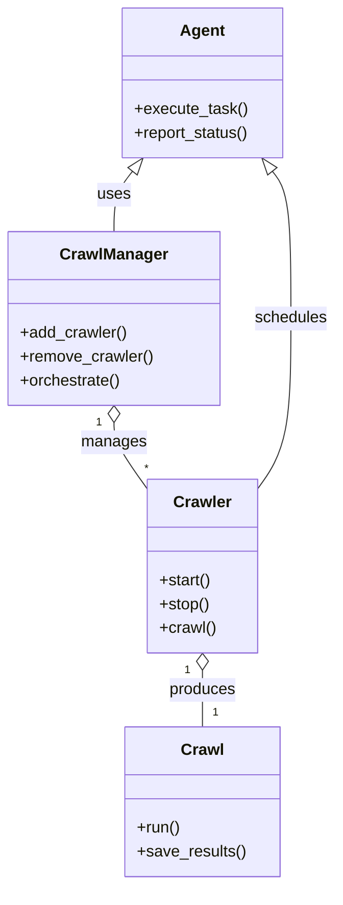
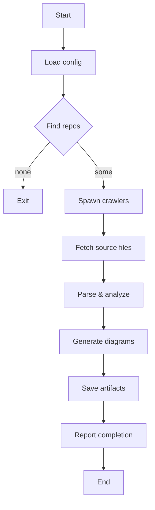

# Diagram: common/document_service/src/api/schemas/responses/get_create_document_response.py

> Auto-generated by Obscura crawlers

## Diagram 1

### SVG

<svg id="container" width="332.34375" xmlns="http://www.w3.org/2000/svg" class="classDiagram" height="886" viewBox="0 0 332.34375 886" role="graphics-document document" aria-roledescription="class"><g><defs><marker id="container_class-aggregationStart" class="marker aggregation class" refX="18" refY="7" markerWidth="190" markerHeight="240" orient="auto"><path d="M 18,7 L9,13 L1,7 L9,1 Z"></path></marker></defs><defs><marker id="container_class-aggregationEnd" class="marker aggregation class" refX="1" refY="7" markerWidth="20" markerHeight="28" orient="auto"><path d="M 18,7 L9,13 L1,7 L9,1 Z"></path></marker></defs><defs><marker id="container_class-extensionStart" class="marker extension class" refX="18" refY="7" markerWidth="190" markerHeight="240" orient="auto"><path d="M 1,7 L18,13 V 1 Z"></path></marker></defs><defs><marker id="container_class-extensionEnd" class="marker extension class" refX="1" refY="7" markerWidth="20" markerHeight="28" orient="auto"><path d="M 1,1 V 13 L18,7 Z"></path></marker></defs><defs><marker id="container_class-compositionStart" class="marker composition class" refX="18" refY="7" markerWidth="190" markerHeight="240" orient="auto"><path d="M 18,7 L9,13 L1,7 L9,1 Z"></path></marker></defs><defs><marker id="container_class-compositionEnd" class="marker composition class" refX="1" refY="7" markerWidth="20" markerHeight="28" orient="auto"><path d="M 18,7 L9,13 L1,7 L9,1 Z"></path></marker></defs><defs><marker id="container_class-dependencyStart" class="marker dependency class" refX="6" refY="7" markerWidth="190" markerHeight="240" orient="auto"><path d="M 5,7 L9,13 L1,7 L9,1 Z"></path></marker></defs><defs><marker id="container_class-dependencyEnd" class="marker dependency class" refX="13" refY="7" markerWidth="20" markerHeight="28" orient="auto"><path d="M 18,7 L9,13 L14,7 L9,1 Z"></path></marker></defs><defs><marker id="container_class-lollipopStart" class="marker lollipop class" refX="13" refY="7" markerWidth="190" markerHeight="240" orient="auto"><circle stroke="black" fill="transparent" cx="7" cy="7" r="6"></circle></marker></defs><defs><marker id="container_class-lollipopEnd" class="marker lollipop class" refX="1" refY="7" markerWidth="190" markerHeight="240" orient="auto"><circle stroke="black" fill="transparent" cx="7" cy="7" r="6"></circle></marker></defs><g class="root"><g class="clusters"></g><g class="edgePaths"><path d="M112.219,423.25L112.219,426.542C112.219,429.833,112.219,436.417,117.846,447.653C123.474,458.889,134.729,474.778,140.357,482.723L145.984,490.668" id="id_CrawlManager_Crawler_1" class="edge-thickness-normal edge-pattern-solid relation" style=";;;" data-edge="true" data-et="edge" data-id="id_CrawlManager_Crawler_1" data-points="W3sieCI6MTEyLjIxODc1LCJ5Ijo0MDZ9LHsieCI6MTEyLjIxODc1LCJ5Ijo0NDN9LHsieCI6MTQ1Ljk4NDM3NSwieSI6NDkwLjY2NzcwNDM0OTM3Mjl9XQ==" marker-start="url(#container_class-aggregationStart)"></path><path d="M200.055,671.25L200.055,674.542C200.055,677.833,200.055,684.417,200.055,693.875C200.055,703.333,200.055,715.667,200.055,721.833L200.055,728" id="id_Crawler_Crawl_2" class="edge-thickness-normal edge-pattern-solid relation" style=";;;" data-edge="true" data-et="edge" data-id="id_Crawler_Crawl_2" data-points="W3sieCI6MjAwLjA1NDY4NzUsInkiOjY1NH0seyJ4IjoyMDAuMDU0Njg3NSwieSI6NjkxfSx7IngiOjIwMC4wNTQ2ODc1LCJ5Ijo3Mjh9XQ==" marker-start="url(#container_class-aggregationStart)"></path><path d="M130.591,171.574L127.529,175.478C124.467,179.382,118.343,187.191,115.281,197.262C112.219,207.333,112.219,219.667,112.219,225.833L112.219,232" id="id_Agent_CrawlManager_3" class="edge-thickness-normal edge-pattern-solid relation" style=";;;" data-edge="true" data-et="edge" data-id="id_Agent_CrawlManager_3" data-points="W3sieCI6MTQxLjIzNTk3OTM1MjY3ODU2LCJ5IjoxNTh9LHsieCI6MTEyLjIxODc1LCJ5IjoxOTV9LHsieCI6MTEyLjIxODc1LCJ5IjoyMzJ9XQ==" marker-start="url(#container_class-extensionStart)"></path><path d="M269.519,171.574L272.581,175.478C275.643,179.382,281.767,187.191,284.829,211.762C287.891,236.333,287.891,277.667,287.891,319C287.891,360.333,287.891,401.667,282.263,430.278C276.635,458.889,265.38,474.778,259.753,482.723L254.125,490.668" id="id_Agent_Crawler_4" class="edge-thickness-normal edge-pattern-solid relation" style=";;;" data-edge="true" data-et="edge" data-id="id_Agent_Crawler_4" data-points="W3sieCI6MjU4Ljg3MzM5NTY0NzMyMTQ0LCJ5IjoxNTh9LHsieCI6Mjg3Ljg5MDYyNSwieSI6MTk1fSx7IngiOjI4Ny44OTA2MjUsInkiOjMxOX0seyJ4IjoyODcuODkwNjI1LCJ5Ijo0NDN9LHsieCI6MjU0LjEyNSwieSI6NDkwLjY2NzcwNDM0OTM3Mjl9XQ==" marker-start="url(#container_class-extensionStart)"></path></g><g class="edgeLabels"><g class="edgeLabel" transform="translate(112.21875, 443)"><g class="label" data-id="id_CrawlManager_Crawler_1" transform="translate(-32.296875, -12)"><foreignObject width="64.59375" height="24">

manages

</foreignObject></g></g><g class="edgeLabel" transform="translate(200.0546875, 691)"><g class="label" data-id="id_Crawler_Crawl_2" transform="translate(-33.4765625, -12)"><foreignObject width="66.953125" height="24">

produces

</foreignObject></g></g><g class="edgeLabel" transform="translate(112.21875, 195)"><g class="label" data-id="id_Agent_CrawlManager_3" transform="translate(-16.4921875, -12)"><foreignObject width="32.984375" height="24">

uses

</foreignObject></g></g><g class="edgeLabel" transform="translate(287.890625, 319)"><g class="label" data-id="id_Agent_Crawler_4" transform="translate(-36.453125, -12)"><foreignObject width="72.90625" height="24">

schedules

</foreignObject></g></g><g class="edgeTerminals" transform="translate(97.21875, 423.5)"><g class="inner" transform="translate(0, 0)"><foreignObject style="width: 9px; height: 12px;">
1
</foreignObject></g></g><g class="edgeTerminals" transform="translate(185.05468875000003, 671.5000010714285)"><g class="inner" transform="translate(0, 0)"><foreignObject style="width: 9px; height: 12px;">
1
</foreignObject></g></g><g class="edgeTerminals" transform="translate(143.1091187972333, 462.716986355917)"><g class="inner" transform="translate(0, 0)"></g><foreignObject style="width: 9px; height: 12px;">
*
</foreignObject></g><g class="edgeTerminals" transform="translate(210.05468874999997, 705.5000010714285)"><g class="inner" transform="translate(0, 0)"></g><foreignObject style="width: 9px; height: 12px;">
1
</foreignObject></g></g><g class="nodes"><g class="node default" id="classId-Crawl-0" transform="translate(200.0546875, 803)"><g class="basic label-container"><path d="M-75.97265625 -75 L75.97265625 -75 L75.97265625 75 L-75.97265625 75" stroke="none" stroke-width="0" fill="#ECECFF" style=""></path><path d="M-75.97265625 -75 C-18.509074017690317 -75, 38.954508214619366 -75, 75.97265625 -75 M-75.97265625 -75 C-25.177776234416562 -75, 25.617103781166875 -75, 75.97265625 -75 M75.97265625 -75 C75.97265625 -27.2521534565751, 75.97265625 20.495693086849798, 75.97265625 75 M75.97265625 -75 C75.97265625 -19.818373454411145, 75.97265625 35.36325309117771, 75.97265625 75 M75.97265625 75 C33.838782214341954 75, -8.295091821316092 75, -75.97265625 75 M75.97265625 75 C27.291741607792474 75, -21.38917303441505 75, -75.97265625 75 M-75.97265625 75 C-75.97265625 19.211193830933233, -75.97265625 -36.577612338133534, -75.97265625 -75 M-75.97265625 75 C-75.97265625 21.05154569212707, -75.97265625 -32.89690861574586, -75.97265625 -75" stroke="#9370DB" stroke-width="1.3" fill="none" stroke-dasharray="0 0" style=""></path></g><g class="annotation-group text" transform="translate(0, -51)"></g><g class="label-group text" transform="translate(-20.1484375, -51)"><g class="label" style="font-weight: bolder" transform="translate(0,-12)"><foreignObject width="40.296875" height="24">

Crawl

</foreignObject></g></g><g class="members-group text" transform="translate(-63.97265625, -3)"></g><g class="methods-group text" transform="translate(-63.97265625, 27)"><g class="label" style="" transform="translate(0,-12)"><foreignObject width="43.21875" height="24">

+run()

</foreignObject></g><g class="label" style="" transform="translate(0,12)"><foreignObject width="107.796875" height="24">

+save_results()

</foreignObject></g></g><g class="divider" style=""><path d="M-75.97265625 -27 C-33.37811370659566 -27, 9.216428836808674 -27, 75.97265625 -27 M-75.97265625 -27 C-31.924370328966603 -27, 12.123915592066794 -27, 75.97265625 -27" stroke="#9370DB" stroke-width="1.3" fill="none" stroke-dasharray="0 0" style=""></path></g><g class="divider" style=""><path d="M-75.97265625 -3 C-26.612297833487588 -3, 22.748060583024824 -3, 75.97265625 -3 M-75.97265625 -3 C-29.762889757216577 -3, 16.446876735566846 -3, 75.97265625 -3" stroke="#9370DB" stroke-width="1.3" fill="none" stroke-dasharray="0 0" style=""></path></g></g><g class="node default" id="classId-Crawler-1" transform="translate(200.0546875, 567)"><g class="basic label-container"><path d="M-54.0703125 -87 L54.0703125 -87 L54.0703125 87 L-54.0703125 87" stroke="none" stroke-width="0" fill="#ECECFF" style=""></path><path d="M-54.0703125 -87 C-29.867580754130003 -87, -5.664849008260006 -87, 54.0703125 -87 M-54.0703125 -87 C-27.162410562667514 -87, -0.2545086253350277 -87, 54.0703125 -87 M54.0703125 -87 C54.0703125 -34.107912234329596, 54.0703125 18.784175531340807, 54.0703125 87 M54.0703125 -87 C54.0703125 -28.358178972991503, 54.0703125 30.283642054016994, 54.0703125 87 M54.0703125 87 C27.168075564959196 87, 0.2658386299183917 87, -54.0703125 87 M54.0703125 87 C19.38498912272329 87, -15.30033425455342 87, -54.0703125 87 M-54.0703125 87 C-54.0703125 23.973995226685652, -54.0703125 -39.052009546628696, -54.0703125 -87 M-54.0703125 87 C-54.0703125 51.40941985273006, -54.0703125 15.818839705460121, -54.0703125 -87" stroke="#9370DB" stroke-width="1.3" fill="none" stroke-dasharray="0 0" style=""></path></g><g class="annotation-group text" transform="translate(0, -63)"></g><g class="label-group text" transform="translate(-27.734375, -63)"><g class="label" style="font-weight: bolder" transform="translate(0,-12)"><foreignObject width="55.46875" height="24">

Crawler

</foreignObject></g></g><g class="members-group text" transform="translate(-42.0703125, -15)"></g><g class="methods-group text" transform="translate(-42.0703125, 15)"><g class="label" style="" transform="translate(0,-12)"><foreignObject width="52.15625" height="24">

+start()

</foreignObject></g><g class="label" style="" transform="translate(0,12)"><foreignObject width="50.21875" height="24">

+stop()

</foreignObject></g><g class="label" style="" transform="translate(0,36)"><foreignObject width="56.40625" height="24">

+crawl()

</foreignObject></g></g><g class="divider" style=""><path d="M-54.0703125 -39 C-23.54916941872589 -39, 6.971973662548223 -39, 54.0703125 -39 M-54.0703125 -39 C-17.721475867480727 -39, 18.627360765038546 -39, 54.0703125 -39" stroke="#9370DB" stroke-width="1.3" fill="none" stroke-dasharray="0 0" style=""></path></g><g class="divider" style=""><path d="M-54.0703125 -15 C-10.84463526526855 -15, 32.3810419694629 -15, 54.0703125 -15 M-54.0703125 -15 C-20.770381410370064 -15, 12.529549679259873 -15, 54.0703125 -15" stroke="#9370DB" stroke-width="1.3" fill="none" stroke-dasharray="0 0" style=""></path></g></g><g class="node default" id="classId-CrawlManager-2" transform="translate(112.21875, 319)"><g class="basic label-container"><path d="M-104.21875 -87 L104.21875 -87 L104.21875 87 L-104.21875 87" stroke="none" stroke-width="0" fill="#ECECFF" style=""></path><path d="M-104.21875 -87 C-47.253251658703576 -87, 9.712246682592848 -87, 104.21875 -87 M-104.21875 -87 C-46.647058522259705 -87, 10.92463295548059 -87, 104.21875 -87 M104.21875 -87 C104.21875 -31.875045774404875, 104.21875 23.24990845119025, 104.21875 87 M104.21875 -87 C104.21875 -31.472886094137607, 104.21875 24.054227811724786, 104.21875 87 M104.21875 87 C28.521572023835233 87, -47.17560595232953 87, -104.21875 87 M104.21875 87 C61.70070054175136 87, 19.18265108350272 87, -104.21875 87 M-104.21875 87 C-104.21875 33.48174484978906, -104.21875 -20.03651030042188, -104.21875 -87 M-104.21875 87 C-104.21875 31.208070527312564, -104.21875 -24.58385894537487, -104.21875 -87" stroke="#9370DB" stroke-width="1.3" fill="none" stroke-dasharray="0 0" style=""></path></g><g class="annotation-group text" transform="translate(0, -63)"></g><g class="label-group text" transform="translate(-51.59375, -63)"><g class="label" style="font-weight: bolder" transform="translate(0,-12)"><foreignObject width="103.1875" height="24">

CrawlManager

</foreignObject></g></g><g class="members-group text" transform="translate(-92.21875, -15)"></g><g class="methods-group text" transform="translate(-92.21875, 15)"><g class="label" style="" transform="translate(0,-12)"><foreignObject width="106.828125" height="24">

+add_crawler()

</foreignObject></g><g class="label" style="" transform="translate(0,12)"><foreignObject width="132.84375" height="24">

+remove_crawler()

</foreignObject></g><g class="label" style="" transform="translate(0,36)"><foreignObject width="100.96875" height="24">

+orchestrate()

</foreignObject></g></g><g class="divider" style=""><path d="M-104.21875 -39 C-34.22685352974486 -39, 35.765042940510284 -39, 104.21875 -39 M-104.21875 -39 C-31.003163943506408 -39, 42.212422112987184 -39, 104.21875 -39" stroke="#9370DB" stroke-width="1.3" fill="none" stroke-dasharray="0 0" style=""></path></g><g class="divider" style=""><path d="M-104.21875 -15 C-42.223637866819395 -15, 19.77147426636121 -15, 104.21875 -15 M-104.21875 -15 C-57.538537105034166 -15, -10.858324210068332 -15, 104.21875 -15" stroke="#9370DB" stroke-width="1.3" fill="none" stroke-dasharray="0 0" style=""></path></g></g><g class="node default" id="classId-Agent-3" transform="translate(200.0546875, 83)"><g class="basic label-container"><path d="M-80.6875 -75 L80.6875 -75 L80.6875 75 L-80.6875 75" stroke="none" stroke-width="0" fill="#ECECFF" style=""></path><path d="M-80.6875 -75 C-25.919113147685707 -75, 28.849273704628587 -75, 80.6875 -75 M-80.6875 -75 C-40.775129422059315 -75, -0.8627588441186305 -75, 80.6875 -75 M80.6875 -75 C80.6875 -18.820202605135094, 80.6875 37.35959478972981, 80.6875 75 M80.6875 -75 C80.6875 -33.746589928413826, 80.6875 7.506820143172348, 80.6875 75 M80.6875 75 C29.252855108288408 75, -22.181789783423184 75, -80.6875 75 M80.6875 75 C25.79612099020612 75, -29.09525801958776 75, -80.6875 75 M-80.6875 75 C-80.6875 33.20695028669394, -80.6875 -8.586099426612122, -80.6875 -75 M-80.6875 75 C-80.6875 23.081800793059344, -80.6875 -28.836398413881312, -80.6875 -75" stroke="#9370DB" stroke-width="1.3" fill="none" stroke-dasharray="0 0" style=""></path></g><g class="annotation-group text" transform="translate(0, -51)"></g><g class="label-group text" transform="translate(-21.078125, -51)"><g class="label" style="font-weight: bolder" transform="translate(0,-12)"><foreignObject width="42.15625" height="24">

Agent

</foreignObject></g></g><g class="members-group text" transform="translate(-68.6875, -3)"></g><g class="methods-group text" transform="translate(-68.6875, 27)"><g class="label" style="" transform="translate(0,-12)"><foreignObject width="111.875" height="24">

+execute_task()

</foreignObject></g><g class="label" style="" transform="translate(0,12)"><foreignObject width="116.296875" height="24">

+report_status()

</foreignObject></g></g><g class="divider" style=""><path d="M-80.6875 -27 C-20.137141995467573 -27, 40.413216009064854 -27, 80.6875 -27 M-80.6875 -27 C-44.55968440751206 -27, -8.431868815024117 -27, 80.6875 -27" stroke="#9370DB" stroke-width="1.3" fill="none" stroke-dasharray="0 0" style=""></path></g><g class="divider" style=""><path d="M-80.6875 -3 C-41.79139706786161 -3, -2.895294135723219 -3, 80.6875 -3 M-80.6875 -3 C-32.58931421753041 -3, 15.508871564939184 -3, 80.6875 -3" stroke="#9370DB" stroke-width="1.3" fill="none" stroke-dasharray="0 0" style=""></path></g></g></g></g></g></svg>

## Diagram 2

### SVG

<svg id="container" width="336.640625" xmlns="http://www.w3.org/2000/svg" class="flowchart" height="1105.734375" viewBox="0 0 336.640625 1105.734375" role="graphics-document document" aria-roledescription="flowchart-v2"><g><marker id="container_flowchart-v2-pointEnd" class="marker flowchart-v2" viewBox="0 0 10 10" refX="5" refY="5" markerUnits="userSpaceOnUse" markerWidth="8" markerHeight="8" orient="auto"><path d="M 0 0 L 10 5 L 0 10 z" class="arrowMarkerPath" style="stroke-width: 1; stroke-dasharray: 1, 0;"></path></marker><marker id="container_flowchart-v2-pointStart" class="marker flowchart-v2" viewBox="0 0 10 10" refX="4.5" refY="5" markerUnits="userSpaceOnUse" markerWidth="8" markerHeight="8" orient="auto"><path d="M 0 5 L 10 10 L 10 0 z" class="arrowMarkerPath" style="stroke-width: 1; stroke-dasharray: 1, 0;"></path></marker><marker id="container_flowchart-v2-circleEnd" class="marker flowchart-v2" viewBox="0 0 10 10" refX="11" refY="5" markerUnits="userSpaceOnUse" markerWidth="11" markerHeight="11" orient="auto"><circle cx="5" cy="5" r="5" class="arrowMarkerPath" style="stroke-width: 1; stroke-dasharray: 1, 0;"></circle></marker><marker id="container_flowchart-v2-circleStart" class="marker flowchart-v2" viewBox="0 0 10 10" refX="-1" refY="5" markerUnits="userSpaceOnUse" markerWidth="11" markerHeight="11" orient="auto"><circle cx="5" cy="5" r="5" class="arrowMarkerPath" style="stroke-width: 1; stroke-dasharray: 1, 0;"></circle></marker><marker id="container_flowchart-v2-crossEnd" class="marker cross flowchart-v2" viewBox="0 0 11 11" refX="12" refY="5.2" markerUnits="userSpaceOnUse" markerWidth="11" markerHeight="11" orient="auto"><path d="M 1,1 l 9,9 M 10,1 l -9,9" class="arrowMarkerPath" style="stroke-width: 2; stroke-dasharray: 1, 0;"></path></marker><marker id="container_flowchart-v2-crossStart" class="marker cross flowchart-v2" viewBox="0 0 11 11" refX="-1" refY="5.2" markerUnits="userSpaceOnUse" markerWidth="11" markerHeight="11" orient="auto"><path d="M 1,1 l 9,9 M 10,1 l -9,9" class="arrowMarkerPath" style="stroke-width: 2; stroke-dasharray: 1, 0;"></path></marker><g class="root"><g class="clusters"></g><g class="edgePaths"><path d="M140.926,62L140.926,66.167C140.926,70.333,140.926,78.667,140.926,86.333C140.926,94,140.926,101,140.926,104.5L140.926,108" id="L_A_B_0" class="edge-thickness-normal edge-pattern-solid edge-thickness-normal edge-pattern-solid flowchart-link" style=";" data-edge="true" data-et="edge" data-id="L_A_B_0" data-points="W3sieCI6MTQwLjkyNTc4MTI1LCJ5Ijo2Mn0seyJ4IjoxNDAuOTI1NzgxMjUsInkiOjg3fSx7IngiOjE0MC45MjU3ODEyNSwieSI6MTEyfV0=" marker-end="url(#container_flowchart-v2-pointEnd)"></path><path d="M140.926,166L140.926,170.167C140.926,174.333,140.926,182.667,140.926,190.333C140.926,198,140.926,205,140.926,208.5L140.926,212" id="L_B_C_0" class="edge-thickness-normal edge-pattern-solid edge-thickness-normal edge-pattern-solid flowchart-link" style=";" data-edge="true" data-et="edge" data-id="L_B_C_0" data-points="W3sieCI6MTQwLjkyNTc4MTI1LCJ5IjoxNjZ9LHsieCI6MTQwLjkyNTc4MTI1LCJ5IjoxOTF9LHsieCI6MTQwLjkyNTc4MTI1LCJ5IjoyMTZ9XQ==" marker-end="url(#container_flowchart-v2-pointEnd)"></path><path d="M110.566,315.375L100.689,326.602C90.812,337.828,71.059,360.281,61.182,377.008C51.305,393.734,51.305,404.734,51.305,410.234L51.305,415.734" id="L_C_D_0" class="edge-thickness-normal edge-pattern-solid edge-thickness-normal edge-pattern-solid flowchart-link" style=";" data-edge="true" data-et="edge" data-id="L_C_D_0" data-points="W3sieCI6MTEwLjU2NjM4NjY0NzQzMTcxLCJ5IjozMTUuMzc0OTgwMzk3NDMxN30seyJ4Ijo1MS4zMDQ2ODc1LCJ5IjozODIuNzM0Mzc1fSx7IngiOjUxLjMwNDY4NzUsInkiOjQxOS43MzQzNzV9XQ==" marker-end="url(#container_flowchart-v2-pointEnd)"></path><path d="M171.285,315.375L181.162,326.602C191.039,337.828,210.793,360.281,220.67,377.008C230.547,393.734,230.547,404.734,230.547,410.234L230.547,415.734" id="L_C_E_0" class="edge-thickness-normal edge-pattern-solid edge-thickness-normal edge-pattern-solid flowchart-link" style=";" data-edge="true" data-et="edge" data-id="L_C_E_0" data-points="W3sieCI6MTcxLjI4NTE3NTg1MjU2ODMsInkiOjMxNS4zNzQ5ODAzOTc0MzE3fSx7IngiOjIzMC41NDY4NzUsInkiOjM4Mi43MzQzNzV9LHsieCI6MjMwLjU0Njg3NSwieSI6NDE5LjczNDM3NX1d" marker-end="url(#container_flowchart-v2-pointEnd)"></path><path d="M230.547,473.734L230.547,477.901C230.547,482.068,230.547,490.401,230.547,498.068C230.547,505.734,230.547,512.734,230.547,516.234L230.547,519.734" id="L_E_F_0" class="edge-thickness-normal edge-pattern-solid edge-thickness-normal edge-pattern-solid flowchart-link" style=";" data-edge="true" data-et="edge" data-id="L_E_F_0" data-points="W3sieCI6MjMwLjU0Njg3NSwieSI6NDczLjczNDM3NX0seyJ4IjoyMzAuNTQ2ODc1LCJ5Ijo0OTguNzM0Mzc1fSx7IngiOjIzMC41NDY4NzUsInkiOjUyMy43MzQzNzV9XQ==" marker-end="url(#container_flowchart-v2-pointEnd)"></path><path d="M230.547,577.734L230.547,581.901C230.547,586.068,230.547,594.401,230.547,602.068C230.547,609.734,230.547,616.734,230.547,620.234L230.547,623.734" id="L_F_G_0" class="edge-thickness-normal edge-pattern-solid edge-thickness-normal edge-pattern-solid flowchart-link" style=";" data-edge="true" data-et="edge" data-id="L_F_G_0" data-points="W3sieCI6MjMwLjU0Njg3NSwieSI6NTc3LjczNDM3NX0seyJ4IjoyMzAuNTQ2ODc1LCJ5Ijo2MDIuNzM0Mzc1fSx7IngiOjIzMC41NDY4NzUsInkiOjYyNy43MzQzNzV9XQ==" marker-end="url(#container_flowchart-v2-pointEnd)"></path><path d="M230.547,681.734L230.547,685.901C230.547,690.068,230.547,698.401,230.547,706.068C230.547,713.734,230.547,720.734,230.547,724.234L230.547,727.734" id="L_G_H_0" class="edge-thickness-normal edge-pattern-solid edge-thickness-normal edge-pattern-solid flowchart-link" style=";" data-edge="true" data-et="edge" data-id="L_G_H_0" data-points="W3sieCI6MjMwLjU0Njg3NSwieSI6NjgxLjczNDM3NX0seyJ4IjoyMzAuNTQ2ODc1LCJ5Ijo3MDYuNzM0Mzc1fSx7IngiOjIzMC41NDY4NzUsInkiOjczMS43MzQzNzV9XQ==" marker-end="url(#container_flowchart-v2-pointEnd)"></path><path d="M230.547,785.734L230.547,789.901C230.547,794.068,230.547,802.401,230.547,810.068C230.547,817.734,230.547,824.734,230.547,828.234L230.547,831.734" id="L_H_I_0" class="edge-thickness-normal edge-pattern-solid edge-thickness-normal edge-pattern-solid flowchart-link" style=";" data-edge="true" data-et="edge" data-id="L_H_I_0" data-points="W3sieCI6MjMwLjU0Njg3NSwieSI6Nzg1LjczNDM3NX0seyJ4IjoyMzAuNTQ2ODc1LCJ5Ijo4MTAuNzM0Mzc1fSx7IngiOjIzMC41NDY4NzUsInkiOjgzNS43MzQzNzV9XQ==" marker-end="url(#container_flowchart-v2-pointEnd)"></path><path d="M230.547,889.734L230.547,893.901C230.547,898.068,230.547,906.401,230.547,914.068C230.547,921.734,230.547,928.734,230.547,932.234L230.547,935.734" id="L_I_J_0" class="edge-thickness-normal edge-pattern-solid edge-thickness-normal edge-pattern-solid flowchart-link" style=";" data-edge="true" data-et="edge" data-id="L_I_J_0" data-points="W3sieCI6MjMwLjU0Njg3NSwieSI6ODg5LjczNDM3NX0seyJ4IjoyMzAuNTQ2ODc1LCJ5Ijo5MTQuNzM0Mzc1fSx7IngiOjIzMC41NDY4NzUsInkiOjkzOS43MzQzNzV9XQ==" marker-end="url(#container_flowchart-v2-pointEnd)"></path><path d="M230.547,993.734L230.547,997.901C230.547,1002.068,230.547,1010.401,230.547,1018.068C230.547,1025.734,230.547,1032.734,230.547,1036.234L230.547,1039.734" id="L_J_K_0" class="edge-thickness-normal edge-pattern-solid edge-thickness-normal edge-pattern-solid flowchart-link" style=";" data-edge="true" data-et="edge" data-id="L_J_K_0" data-points="W3sieCI6MjMwLjU0Njg3NSwieSI6OTkzLjczNDM3NX0seyJ4IjoyMzAuNTQ2ODc1LCJ5IjoxMDE4LjczNDM3NX0seyJ4IjoyMzAuNTQ2ODc1LCJ5IjoxMDQzLjczNDM3NX1d" marker-end="url(#container_flowchart-v2-pointEnd)"></path></g><g class="edgeLabels"><g class="edgeLabel"><g class="label" data-id="L_A_B_0" transform="translate(0, 0)"><foreignObject width="0" height="0">

</foreignObject></g></g><g class="edgeLabel"><g class="label" data-id="L_B_C_0" transform="translate(0, 0)"><foreignObject width="0" height="0">

</foreignObject></g></g><g class="edgeLabel" transform="translate(51.3046875, 382.734375)"><g class="label" data-id="L_C_D_0" transform="translate(-18.4140625, -12)"><foreignObject width="36.828125" height="24">

none

</foreignObject></g></g><g class="edgeLabel" transform="translate(230.546875, 382.734375)"><g class="label" data-id="L_C_E_0" transform="translate(-19.625, -12)"><foreignObject width="39.25" height="24">

some

</foreignObject></g></g><g class="edgeLabel"><g class="label" data-id="L_E_F_0" transform="translate(0, 0)"><foreignObject width="0" height="0">

</foreignObject></g></g><g class="edgeLabel"><g class="label" data-id="L_F_G_0" transform="translate(0, 0)"><foreignObject width="0" height="0">

</foreignObject></g></g><g class="edgeLabel"><g class="label" data-id="L_G_H_0" transform="translate(0, 0)"><foreignObject width="0" height="0">

</foreignObject></g></g><g class="edgeLabel"><g class="label" data-id="L_H_I_0" transform="translate(0, 0)"><foreignObject width="0" height="0">

</foreignObject></g></g><g class="edgeLabel"><g class="label" data-id="L_I_J_0" transform="translate(0, 0)"><foreignObject width="0" height="0">

</foreignObject></g></g><g class="edgeLabel"><g class="label" data-id="L_J_K_0" transform="translate(0, 0)"><foreignObject width="0" height="0">

</foreignObject></g></g></g><g class="nodes"><g class="node default" id="flowchart-A-0" transform="translate(140.92578125, 35)"><rect class="basic label-container" style="" x="-47.5234375" y="-27" width="95.046875" height="54"></rect><g class="label" style="" transform="translate(-17.5234375, -12)"><rect></rect><foreignObject width="35.046875" height="24">

Start

</foreignObject></g></g><g class="node default" id="flowchart-B-1" transform="translate(140.92578125, 139)"><rect class="basic label-container" style="" x="-71.421875" y="-27" width="142.84375" height="54"></rect><g class="label" style="" transform="translate(-41.421875, -12)"><rect></rect><foreignObject width="82.84375" height="24">

Load config

</foreignObject></g></g><g class="node default" id="flowchart-C-3" transform="translate(140.92578125, 280.8671875)"><polygon points="64.8671875,0 129.734375,-64.8671875 64.8671875,-129.734375 0,-64.8671875" class="label-container" transform="translate(-64.3671875, 64.8671875)"></polygon><g class="label" style="" transform="translate(-37.8671875, -12)"><rect></rect><foreignObject width="75.734375" height="24">

Find repos

</foreignObject></g></g><g class="node default" id="flowchart-D-5" transform="translate(51.3046875, 446.734375)"><rect class="basic label-container" style="" x="-43.3046875" y="-27" width="86.609375" height="54"></rect><g class="label" style="" transform="translate(-13.3046875, -12)"><rect></rect><foreignObject width="26.609375" height="24">

Exit

</foreignObject></g></g><g class="node default" id="flowchart-E-7" transform="translate(230.546875, 446.734375)"><rect class="basic label-container" style="" x="-85.9375" y="-27" width="171.875" height="54"></rect><g class="label" style="" transform="translate(-55.9375, -12)"><rect></rect><foreignObject width="111.875" height="24">

Spawn crawlers

</foreignObject></g></g><g class="node default" id="flowchart-F-9" transform="translate(230.546875, 550.734375)"><rect class="basic label-container" style="" x="-92.46875" y="-27" width="184.9375" height="54"></rect><g class="label" style="" transform="translate(-62.46875, -12)"><rect></rect><foreignObject width="124.9375" height="24">

Fetch source files

</foreignObject></g></g><g class="node default" id="flowchart-G-11" transform="translate(230.546875, 654.734375)"><rect class="basic label-container" style="" x="-87.015625" y="-27" width="174.03125" height="54"></rect><g class="label" style="" transform="translate(-57.015625, -12)"><rect></rect><foreignObject width="114.03125" height="24">

Parse &amp; analyze

</foreignObject></g></g><g class="node default" id="flowchart-H-13" transform="translate(230.546875, 758.734375)"><rect class="basic label-container" style="" x="-98.09375" y="-27" width="196.1875" height="54"></rect><g class="label" style="" transform="translate(-68.09375, -12)"><rect></rect><foreignObject width="136.1875" height="24">

Generate diagrams

</foreignObject></g></g><g class="node default" id="flowchart-I-15" transform="translate(230.546875, 862.734375)"><rect class="basic label-container" style="" x="-78.8671875" y="-27" width="157.734375" height="54"></rect><g class="label" style="" transform="translate(-48.8671875, -12)"><rect></rect><foreignObject width="97.734375" height="24">

Save artifacts

</foreignObject></g></g><g class="node default" id="flowchart-J-17" transform="translate(230.546875, 966.734375)"><rect class="basic label-container" style="" x="-97.71875" y="-27" width="195.4375" height="54"></rect><g class="label" style="" transform="translate(-67.71875, -12)"><rect></rect><foreignObject width="135.4375" height="24">

Report completion

</foreignObject></g></g><g class="node default" id="flowchart-K-19" transform="translate(230.546875, 1070.734375)"><rect class="basic label-container" style="" x="-43.6796875" y="-27" width="87.359375" height="54"></rect><g class="label" style="" transform="translate(-13.6796875, -12)"><rect></rect><foreignObject width="27.359375" height="24">

End

</foreignObject></g></g></g></g></g></svg>
