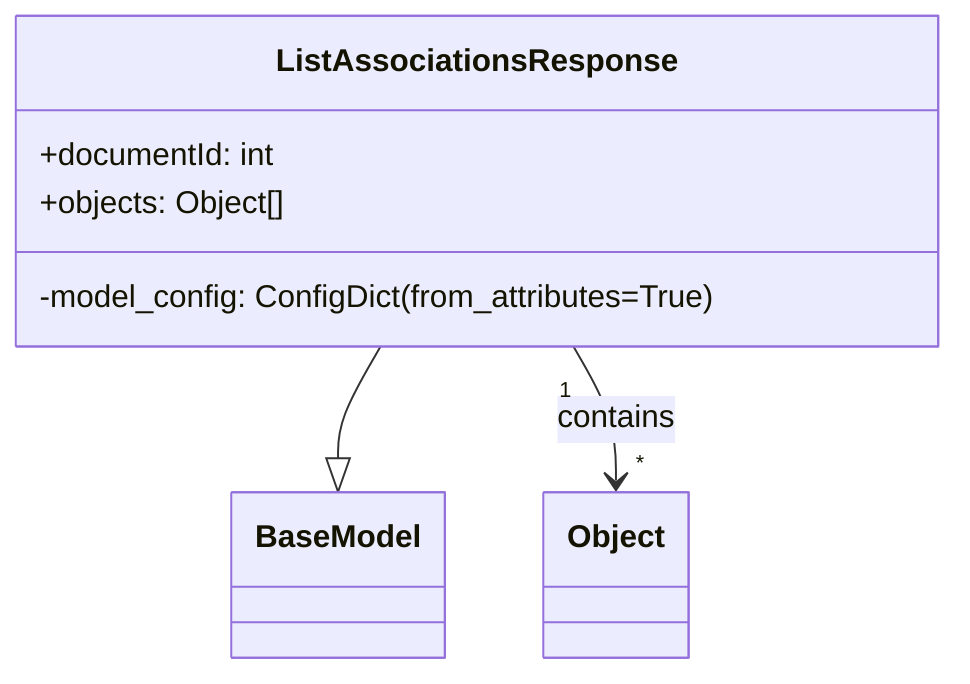

# Diagram: common/document_service/src/api/schemas/responses/list_associations_response.py

> Auto-generated by Obscura crawlers

## Mermaid

### SVG

<svg id="container" width="484.0078125" xmlns="http://www.w3.org/2000/svg" class="classDiagram" height="342" viewBox="0 0 484.0078125 342" role="graphics-document document" aria-roledescription="class"><g><defs><marker id="container_class-aggregationStart" class="marker aggregation class" refX="18" refY="7" markerWidth="190" markerHeight="240" orient="auto"><path d="M 18,7 L9,13 L1,7 L9,1 Z"></path></marker></defs><defs><marker id="container_class-aggregationEnd" class="marker aggregation class" refX="1" refY="7" markerWidth="20" markerHeight="28" orient="auto"><path d="M 18,7 L9,13 L1,7 L9,1 Z"></path></marker></defs><defs><marker id="container_class-extensionStart" class="marker extension class" refX="18" refY="7" markerWidth="190" markerHeight="240" orient="auto"><path d="M 1,7 L18,13 V 1 Z"></path></marker></defs><defs><marker id="container_class-extensionEnd" class="marker extension class" refX="1" refY="7" markerWidth="20" markerHeight="28" orient="auto"><path d="M 1,1 V 13 L18,7 Z"></path></marker></defs><defs><marker id="container_class-compositionStart" class="marker composition class" refX="18" refY="7" markerWidth="190" markerHeight="240" orient="auto"><path d="M 18,7 L9,13 L1,7 L9,1 Z"></path></marker></defs><defs><marker id="container_class-compositionEnd" class="marker composition class" refX="1" refY="7" markerWidth="20" markerHeight="28" orient="auto"><path d="M 18,7 L9,13 L1,7 L9,1 Z"></path></marker></defs><defs><marker id="container_class-dependencyStart" class="marker dependency class" refX="6" refY="7" markerWidth="190" markerHeight="240" orient="auto"><path d="M 5,7 L9,13 L1,7 L9,1 Z"></path></marker></defs><defs><marker id="container_class-dependencyEnd" class="marker dependency class" refX="13" refY="7" markerWidth="20" markerHeight="28" orient="auto"><path d="M 18,7 L9,13 L14,7 L9,1 Z"></path></marker></defs><defs><marker id="container_class-lollipopStart" class="marker lollipop class" refX="13" refY="7" markerWidth="190" markerHeight="240" orient="auto"><circle stroke="black" fill="transparent" cx="7" cy="7" r="6"></circle></marker></defs><defs><marker id="container_class-lollipopEnd" class="marker lollipop class" refX="1" refY="7" markerWidth="190" markerHeight="240" orient="auto"><circle stroke="black" fill="transparent" cx="7" cy="7" r="6"></circle></marker></defs><g class="root"><g class="clusters"></g><g class="edgePaths"><path d="M194.114,176L190.598,182.167C187.082,188.333,180.051,200.667,176.535,210.125C173.02,219.583,173.02,226.167,173.02,229.458L173.02,232.75" id="id_ListAssociationsResponse_BaseModel_1" class="edge-thickness-normal edge-pattern-solid relation" style=";;;" data-edge="true" data-et="edge" data-id="id_ListAssociationsResponse_BaseModel_1" data-points="W3sieCI6MTk0LjExMzkyNjkxMTE1NzAyLCJ5IjoxNzZ9LHsieCI6MTczLjAxOTUzMTI1LCJ5IjoyMTN9LHsieCI6MTczLjAxOTUzMTI1LCJ5IjoyNTB9XQ==" marker-end="url(#container_class-extensionEnd)"></path><path d="M289.894,176L293.41,182.167C296.925,188.333,303.957,200.667,307.473,212C310.988,223.333,310.988,233.667,310.988,238.833L310.988,244" id="id_ListAssociationsResponse_Object_2" class="edge-thickness-normal edge-pattern-solid relation" style=";;;" data-edge="true" data-et="edge" data-id="id_ListAssociationsResponse_Object_2" data-points="W3sieCI6Mjg5Ljg5Mzg4NTU4ODg0MywieSI6MTc2fSx7IngiOjMxMC45ODgyODEyNSwieSI6MjEzfSx7IngiOjMxMC45ODgyODEyNSwieSI6MjUwfV0=" marker-end="url(#container_class-dependencyEnd)"></path></g><g class="edgeLabels"><g class="edgeLabel"><g class="label" data-id="id_ListAssociationsResponse_BaseModel_1" transform="translate(0, 0)"><foreignObject width="0" height="0">

</foreignObject></g></g><g class="edgeLabel" transform="translate(310.98828125, 213)"><g class="label" data-id="id_ListAssociationsResponse_Object_2" transform="translate(-30.890625, -12)"><foreignObject width="61.78125" height="24">

contains

</foreignObject></g></g><g class="edgeTerminals" transform="translate(285.53031012867325, 198.63203963852106)"><g class="inner" transform="translate(0, 0)"><foreignObject style="width: 9px; height: 12px;">
1
</foreignObject></g></g><g class="edgeTerminals" transform="translate(320.988280625, 227.4999994642857)"><g class="inner" transform="translate(0, 0)"></g><foreignObject style="width: 9px; height: 12px;">
*
</foreignObject></g></g><g class="nodes"><g class="node default" id="classId-BaseModel-0" transform="translate(173.01953125, 292)"><g class="basic label-container"><path d="M-52.078125 -42 L52.078125 -42 L52.078125 42 L-52.078125 42" stroke="none" stroke-width="0" fill="#ECECFF" style=""></path><path d="M-52.078125 -42 C-25.686202942228903 -42, 0.7057191155421947 -42, 52.078125 -42 M-52.078125 -42 C-15.662671166988723 -42, 20.752782666022554 -42, 52.078125 -42 M52.078125 -42 C52.078125 -18.095724917276797, 52.078125 5.808550165446405, 52.078125 42 M52.078125 -42 C52.078125 -13.56951207563058, 52.078125 14.860975848738839, 52.078125 42 M52.078125 42 C24.655516537495085 42, -2.7670919250098294 42, -52.078125 42 M52.078125 42 C10.481576901462716 42, -31.114971197074567 42, -52.078125 42 M-52.078125 42 C-52.078125 15.401635928950814, -52.078125 -11.196728142098372, -52.078125 -42 M-52.078125 42 C-52.078125 23.002187970767373, -52.078125 4.004375941534747, -52.078125 -42" stroke="#9370DB" stroke-width="1.3" fill="none" stroke-dasharray="0 0" style=""></path></g><g class="annotation-group text" transform="translate(0, -18)"></g><g class="label-group text" transform="translate(-40.078125, -18)"><g class="label" style="font-weight: bolder" transform="translate(0,-12)"><foreignObject width="80.15625" height="24">

BaseModel

</foreignObject></g></g><g class="members-group text" transform="translate(-40.078125, 30)"></g><g class="methods-group text" transform="translate(-40.078125, 60)"></g><g class="divider" style=""><path d="M-52.078125 6 C-19.178188338529438 6, 13.721748322941124 6, 52.078125 6 M-52.078125 6 C-28.686186932956872 6, -5.294248865913744 6, 52.078125 6" stroke="#9370DB" stroke-width="1.3" fill="none" stroke-dasharray="0 0" style=""></path></g><g class="divider" style=""><path d="M-52.078125 24 C-14.722635080256737 24, 22.632854839486527 24, 52.078125 24 M-52.078125 24 C-22.194227715580002 24, 7.689669568839996 24, 52.078125 24" stroke="#9370DB" stroke-width="1.3" fill="none" stroke-dasharray="0 0" style=""></path></g></g><g class="node default" id="classId-Object-1" transform="translate(310.98828125, 292)"><g class="basic label-container"><path d="M-35.890625 -42 L35.890625 -42 L35.890625 42 L-35.890625 42" stroke="none" stroke-width="0" fill="#ECECFF" style=""></path><path d="M-35.890625 -42 C-16.191036180158513 -42, 3.508552639682975 -42, 35.890625 -42 M-35.890625 -42 C-20.788383051939658 -42, -5.686141103879315 -42, 35.890625 -42 M35.890625 -42 C35.890625 -9.913481493614299, 35.890625 22.173037012771402, 35.890625 42 M35.890625 -42 C35.890625 -18.8316206662141, 35.890625 4.3367586675718, 35.890625 42 M35.890625 42 C11.592572549029029 42, -12.705479901941942 42, -35.890625 42 M35.890625 42 C14.781461459522447 42, -6.327702080955106 42, -35.890625 42 M-35.890625 42 C-35.890625 17.00623340573109, -35.890625 -7.987533188537817, -35.890625 -42 M-35.890625 42 C-35.890625 24.06665215904622, -35.890625 6.133304318092442, -35.890625 -42" stroke="#9370DB" stroke-width="1.3" fill="none" stroke-dasharray="0 0" style=""></path></g><g class="annotation-group text" transform="translate(0, -18)"></g><g class="label-group text" transform="translate(-23.890625, -18)"><g class="label" style="font-weight: bolder" transform="translate(0,-12)"><foreignObject width="47.78125" height="24">

Object

</foreignObject></g></g><g class="members-group text" transform="translate(-23.890625, 30)"></g><g class="methods-group text" transform="translate(-23.890625, 60)"></g><g class="divider" style=""><path d="M-35.890625 6 C-16.328441630162892 6, 3.2337417396742154 6, 35.890625 6 M-35.890625 6 C-12.228547458370713 6, 11.433530083258574 6, 35.890625 6" stroke="#9370DB" stroke-width="1.3" fill="none" stroke-dasharray="0 0" style=""></path></g><g class="divider" style=""><path d="M-35.890625 24 C-9.521544773625415 24, 16.84753545274917 24, 35.890625 24 M-35.890625 24 C-16.09196362112661 24, 3.706697757746781 24, 35.890625 24" stroke="#9370DB" stroke-width="1.3" fill="none" stroke-dasharray="0 0" style=""></path></g></g><g class="node default" id="classId-ListAssociationsResponse-2" transform="translate(242.00390625, 92)"><g class="basic label-container"><path d="M-234.00390625 -84 L234.00390625 -84 L234.00390625 84 L-234.00390625 84" stroke="none" stroke-width="0" fill="#ECECFF" style=""></path><path d="M-234.00390625 -84 C-115.01282842497993 -84, 3.9782494000401414 -84, 234.00390625 -84 M-234.00390625 -84 C-116.74580548604239 -84, 0.5122952779152286 -84, 234.00390625 -84 M234.00390625 -84 C234.00390625 -19.57794933054764, 234.00390625 44.84410133890472, 234.00390625 84 M234.00390625 -84 C234.00390625 -39.09812735089523, 234.00390625 5.8037452982095346, 234.00390625 84 M234.00390625 84 C52.83021825939801 84, -128.34346973120398 84, -234.00390625 84 M234.00390625 84 C65.50766791178086 84, -102.98857042643829 84, -234.00390625 84 M-234.00390625 84 C-234.00390625 35.149094010028755, -234.00390625 -13.701811979942491, -234.00390625 -84 M-234.00390625 84 C-234.00390625 41.12748432408183, -234.00390625 -1.7450313518363458, -234.00390625 -84" stroke="#9370DB" stroke-width="1.3" fill="none" stroke-dasharray="0 0" style=""></path></g><g class="annotation-group text" transform="translate(0, -60)"></g><g class="label-group text" transform="translate(-94.7890625, -60)"><g class="label" style="font-weight: bolder" transform="translate(0,-12)"><foreignObject width="189.578125" height="24">

ListAssociationsResponse

</foreignObject></g></g><g class="members-group text" transform="translate(-222.00390625, -12)"><g class="label" style="" transform="translate(0,-12)"><foreignObject width="123.3125" height="24">

+documentId: int

</foreignObject></g><g class="label" style="" transform="translate(0,12)"><foreignObject width="126.515625" height="24">

+objects: Object[]

</foreignObject></g></g><g class="methods-group text" transform="translate(-222.00390625, 60)"><g class="label" style="" transform="translate(0,-12)"><foreignObject width="349.21875" height="24">

-model_config: ConfigDict(from_attributes=True)

</foreignObject></g></g><g class="divider" style=""><path d="M-234.00390625 -36 C-74.42440978975554 -36, 85.15508667048891 -36, 234.00390625 -36 M-234.00390625 -36 C-85.11086842163988 -36, 63.78216940672024 -36, 234.00390625 -36" stroke="#9370DB" stroke-width="1.3" fill="none" stroke-dasharray="0 0" style=""></path></g><g class="divider" style=""><path d="M-234.00390625 36 C-56.30098931182732 36, 121.40192762634535 36, 234.00390625 36 M-234.00390625 36 C-78.65328582034755 36, 76.6973346093049 36, 234.00390625 36" stroke="#9370DB" stroke-width="1.3" fill="none" stroke-dasharray="0 0" style=""></path></g></g></g></g></g></svg>
