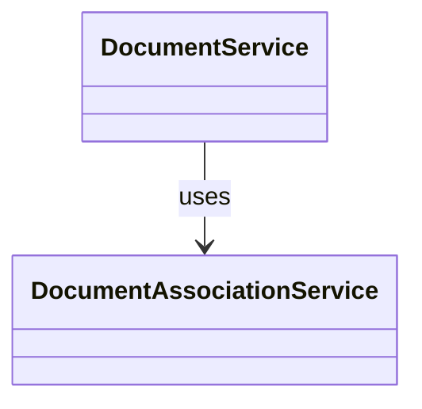

# Diagram: common/document_service/src/api/services/__init__.py

> Auto-generated by Obscura crawlers

## Mermaid

### SVG

<svg id="container" width="251.8125" xmlns="http://www.w3.org/2000/svg" class="classDiagram" height="258" viewBox="0 0 251.8125 258" role="graphics-document document" aria-roledescription="class"><g><defs><marker id="container_class-aggregationStart" class="marker aggregation class" refX="18" refY="7" markerWidth="190" markerHeight="240" orient="auto"><path d="M 18,7 L9,13 L1,7 L9,1 Z"></path></marker></defs><defs><marker id="container_class-aggregationEnd" class="marker aggregation class" refX="1" refY="7" markerWidth="20" markerHeight="28" orient="auto"><path d="M 18,7 L9,13 L1,7 L9,1 Z"></path></marker></defs><defs><marker id="container_class-extensionStart" class="marker extension class" refX="18" refY="7" markerWidth="190" markerHeight="240" orient="auto"><path d="M 1,7 L18,13 V 1 Z"></path></marker></defs><defs><marker id="container_class-extensionEnd" class="marker extension class" refX="1" refY="7" markerWidth="20" markerHeight="28" orient="auto"><path d="M 1,1 V 13 L18,7 Z"></path></marker></defs><defs><marker id="container_class-compositionStart" class="marker composition class" refX="18" refY="7" markerWidth="190" markerHeight="240" orient="auto"><path d="M 18,7 L9,13 L1,7 L9,1 Z"></path></marker></defs><defs><marker id="container_class-compositionEnd" class="marker composition class" refX="1" refY="7" markerWidth="20" markerHeight="28" orient="auto"><path d="M 18,7 L9,13 L1,7 L9,1 Z"></path></marker></defs><defs><marker id="container_class-dependencyStart" class="marker dependency class" refX="6" refY="7" markerWidth="190" markerHeight="240" orient="auto"><path d="M 5,7 L9,13 L1,7 L9,1 Z"></path></marker></defs><defs><marker id="container_class-dependencyEnd" class="marker dependency class" refX="13" refY="7" markerWidth="20" markerHeight="28" orient="auto"><path d="M 18,7 L9,13 L14,7 L9,1 Z"></path></marker></defs><defs><marker id="container_class-lollipopStart" class="marker lollipop class" refX="13" refY="7" markerWidth="190" markerHeight="240" orient="auto"><circle stroke="black" fill="transparent" cx="7" cy="7" r="6"></circle></marker></defs><defs><marker id="container_class-lollipopEnd" class="marker lollipop class" refX="1" refY="7" markerWidth="190" markerHeight="240" orient="auto"><circle stroke="black" fill="transparent" cx="7" cy="7" r="6"></circle></marker></defs><g class="root"><g class="clusters"></g><g class="edgePaths"><path d="M125.906,92L125.906,98.167C125.906,104.333,125.906,116.667,125.906,128C125.906,139.333,125.906,149.667,125.906,154.833L125.906,160" id="id_DocumentService_DocumentAssociationService_1" class="edge-thickness-normal edge-pattern-solid relation" style=";;;" data-edge="true" data-et="edge" data-id="id_DocumentService_DocumentAssociationService_1" data-points="W3sieCI6MTI1LjkwNjI1LCJ5Ijo5Mn0seyJ4IjoxMjUuOTA2MjUsInkiOjEyOX0seyJ4IjoxMjUuOTA2MjUsInkiOjE2Nn1d" marker-end="url(#container_class-dependencyEnd)"></path></g><g class="edgeLabels"><g class="edgeLabel" transform="translate(125.90625, 129)"><g class="label" data-id="id_DocumentService_DocumentAssociationService_1" transform="translate(-16.4921875, -12)"><foreignObject width="32.984375" height="24">

uses

</foreignObject></g></g></g><g class="nodes"><g class="node default" id="classId-DocumentService-0" transform="translate(125.90625, 50)"><g class="basic label-container"><path d="M-75.7421875 -42 L75.7421875 -42 L75.7421875 42 L-75.7421875 42" stroke="none" stroke-width="0" fill="#ECECFF" style=""></path><path d="M-75.7421875 -42 C-28.806735781398366 -42, 18.128715937203268 -42, 75.7421875 -42 M-75.7421875 -42 C-42.75432144125401 -42, -9.766455382508013 -42, 75.7421875 -42 M75.7421875 -42 C75.7421875 -14.338318067690942, 75.7421875 13.323363864618116, 75.7421875 42 M75.7421875 -42 C75.7421875 -22.145710358072584, 75.7421875 -2.2914207161451685, 75.7421875 42 M75.7421875 42 C27.11004798282044 42, -21.52209153435912 42, -75.7421875 42 M75.7421875 42 C41.45913036909942 42, 7.176073238198839 42, -75.7421875 42 M-75.7421875 42 C-75.7421875 21.06667695552034, -75.7421875 0.13335391104067895, -75.7421875 -42 M-75.7421875 42 C-75.7421875 22.478873435342777, -75.7421875 2.957746870685554, -75.7421875 -42" stroke="#9370DB" stroke-width="1.3" fill="none" stroke-dasharray="0 0" style=""></path></g><g class="annotation-group text" transform="translate(0, -18)"></g><g class="label-group text" transform="translate(-63.7421875, -18)"><g class="label" style="font-weight: bolder" transform="translate(0,-12)"><foreignObject width="127.484375" height="24">

DocumentService

</foreignObject></g></g><g class="members-group text" transform="translate(-63.7421875, 30)"></g><g class="methods-group text" transform="translate(-63.7421875, 60)"></g><g class="divider" style=""><path d="M-75.7421875 6 C-44.67190363519083 6, -13.601619770381667 6, 75.7421875 6 M-75.7421875 6 C-39.55627638360162 6, -3.3703652672032405 6, 75.7421875 6" stroke="#9370DB" stroke-width="1.3" fill="none" stroke-dasharray="0 0" style=""></path></g><g class="divider" style=""><path d="M-75.7421875 24 C-20.37633279371368 24, 34.98952191257264 24, 75.7421875 24 M-75.7421875 24 C-34.38535639003139 24, 6.97147471993722 24, 75.7421875 24" stroke="#9370DB" stroke-width="1.3" fill="none" stroke-dasharray="0 0" style=""></path></g></g><g class="node default" id="classId-DocumentAssociationService-1" transform="translate(125.90625, 208)"><g class="basic label-container"><path d="M-117.90625 -42 L117.90625 -42 L117.90625 42 L-117.90625 42" stroke="none" stroke-width="0" fill="#ECECFF" style=""></path><path d="M-117.90625 -42 C-37.74985580699412 -42, 42.40653838601176 -42, 117.90625 -42 M-117.90625 -42 C-40.65788448376723 -42, 36.59048103246553 -42, 117.90625 -42 M117.90625 -42 C117.90625 -24.519029323408024, 117.90625 -7.038058646816047, 117.90625 42 M117.90625 -42 C117.90625 -13.64145533551671, 117.90625 14.71708932896658, 117.90625 42 M117.90625 42 C67.95855695661547 42, 18.01086391323095 42, -117.90625 42 M117.90625 42 C27.99916051872465 42, -61.9079289625507 42, -117.90625 42 M-117.90625 42 C-117.90625 11.089268980619277, -117.90625 -19.821462038761446, -117.90625 -42 M-117.90625 42 C-117.90625 14.96395820339393, -117.90625 -12.072083593212142, -117.90625 -42" stroke="#9370DB" stroke-width="1.3" fill="none" stroke-dasharray="0 0" style=""></path></g><g class="annotation-group text" transform="translate(0, -18)"></g><g class="label-group text" transform="translate(-105.90625, -18)"><g class="label" style="font-weight: bolder" transform="translate(0,-12)"><foreignObject width="211.8125" height="24">

DocumentAssociationService

</foreignObject></g></g><g class="members-group text" transform="translate(-105.90625, 30)"></g><g class="methods-group text" transform="translate(-105.90625, 60)"></g><g class="divider" style=""><path d="M-117.90625 6 C-48.66791340703635 6, 20.570423185927297 6, 117.90625 6 M-117.90625 6 C-31.09188803483761 6, 55.72247393032478 6, 117.90625 6" stroke="#9370DB" stroke-width="1.3" fill="none" stroke-dasharray="0 0" style=""></path></g><g class="divider" style=""><path d="M-117.90625 24 C-67.98273807419062 24, -18.059226148381242 24, 117.90625 24 M-117.90625 24 C-66.55769348659234 24, -15.20913697318467 24, 117.90625 24" stroke="#9370DB" stroke-width="1.3" fill="none" stroke-dasharray="0 0" style=""></path></g></g></g></g></g></svg>
