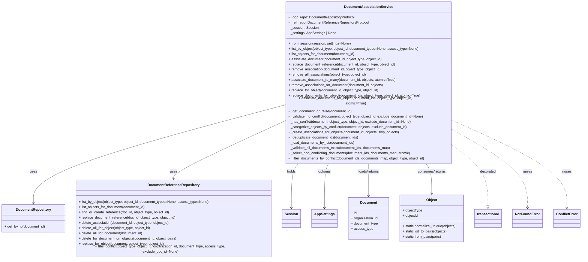

# Diagram: common/document_service/src/api/services/document_association_service.py

> Auto-generated by Obscura crawlers

## Mermaid

### SVG

<svg id="container" width="2661.8828125" xmlns="http://www.w3.org/2000/svg" class="classDiagram" height="1152" viewBox="0 0 2661.8828125 1152" role="graphics-document document" aria-roledescription="class"><g><defs><marker id="container_class-aggregationStart" class="marker aggregation class" refX="18" refY="7" markerWidth="190" markerHeight="240" orient="auto"><path d="M 18,7 L9,13 L1,7 L9,1 Z"></path></marker></defs><defs><marker id="container_class-aggregationEnd" class="marker aggregation class" refX="1" refY="7" markerWidth="20" markerHeight="28" orient="auto"><path d="M 18,7 L9,13 L1,7 L9,1 Z"></path></marker></defs><defs><marker id="container_class-extensionStart" class="marker extension class" refX="18" refY="7" markerWidth="190" markerHeight="240" orient="auto"><path d="M 1,7 L18,13 V 1 Z"></path></marker></defs><defs><marker id="container_class-extensionEnd" class="marker extension class" refX="1" refY="7" markerWidth="20" markerHeight="28" orient="auto"><path d="M 1,1 V 13 L18,7 Z"></path></marker></defs><defs><marker id="container_class-compositionStart" class="marker composition class" refX="18" refY="7" markerWidth="190" markerHeight="240" orient="auto"><path d="M 18,7 L9,13 L1,7 L9,1 Z"></path></marker></defs><defs><marker id="container_class-compositionEnd" class="marker composition class" refX="1" refY="7" markerWidth="20" markerHeight="28" orient="auto"><path d="M 18,7 L9,13 L1,7 L9,1 Z"></path></marker></defs><defs><marker id="container_class-dependencyStart" class="marker dependency class" refX="6" refY="7" markerWidth="190" markerHeight="240" orient="auto"><path d="M 5,7 L9,13 L1,7 L9,1 Z"></path></marker></defs><defs><marker id="container_class-dependencyEnd" class="marker dependency class" refX="13" refY="7" markerWidth="20" markerHeight="28" orient="auto"><path d="M 18,7 L9,13 L14,7 L9,1 Z"></path></marker></defs><defs><marker id="container_class-lollipopStart" class="marker lollipop class" refX="13" refY="7" markerWidth="190" markerHeight="240" orient="auto"><circle stroke="black" fill="transparent" cx="7" cy="7" r="6"></circle></marker></defs><defs><marker id="container_class-lollipopEnd" class="marker lollipop class" refX="1" refY="7" markerWidth="190" markerHeight="240" orient="auto"><circle stroke="black" fill="transparent" cx="7" cy="7" r="6"></circle></marker></defs><g class="root"><g class="clusters"></g><g class="edgePaths"><path d="M1310.797,466.852L1117.77,516.543C924.742,566.235,538.688,665.617,345.66,738.475C152.633,811.333,152.633,857.667,152.633,880.833L152.633,904" id="id_DocumentAssociationService_DocumentRepository_1" class="edge-thickness-normal edge-pattern-solid relation" style=";;;" data-edge="true" data-et="edge" data-id="id_DocumentAssociationService_DocumentRepository_1" data-points="W3sieCI6MTMxMC43OTY4NzUsInkiOjQ2Ni44NTE3ODUyNDM4NzUyN30seyJ4IjoxNTIuNjMyODEyNSwieSI6NzY1fSx7IngiOjE1Mi42MzI4MTI1LCJ5Ijo5MTB9XQ==" marker-end="url(#container_class-dependencyEnd)"></path><path d="M1310.797,538.885L1226.114,576.571C1141.431,614.257,972.065,689.628,887.382,732.481C802.699,775.333,802.699,785.667,802.699,790.833L802.699,796" id="id_DocumentAssociationService_DocumentReferenceRepository_2" class="edge-thickness-normal edge-pattern-solid relation" style=";;;" data-edge="true" data-et="edge" data-id="id_DocumentAssociationService_DocumentReferenceRepository_2" data-points="W3sieCI6MTMxMC43OTY4NzUsInkiOjUzOC44ODUxNDA2Njc3NjEzfSx7IngiOjgwMi42OTkyMTg3NSwieSI6NzY1fSx7IngiOjgwMi42OTkyMTg3NSwieSI6ODAyfV0=" marker-end="url(#container_class-dependencyEnd)"></path><path d="M1380.632,728L1375.251,734.167C1369.869,740.333,1359.107,752.667,1353.725,785.5C1348.344,818.333,1348.344,871.667,1348.344,898.333L1348.344,925" id="id_DocumentAssociationService_Session_3" class="edge-thickness-normal edge-pattern-solid relation" style=";;;" data-edge="true" data-et="edge" data-id="id_DocumentAssociationService_Session_3" data-points="W3sieCI6MTM4MC42MzIxMDQwNjE3MTI5LCJ5Ijo3Mjh9LHsieCI6MTM0OC4zNDM3NSwieSI6NzY1fSx7IngiOjEzNDguMzQzNzUsInkiOjkzMX1d" marker-end="url(#container_class-dependencyEnd)"></path><path d="M1513.684,728L1510.582,734.167C1507.479,740.333,1501.275,752.667,1498.173,785.5C1495.07,818.333,1495.07,871.667,1495.07,898.333L1495.07,925" id="id_DocumentAssociationService_AppSettings_4" class="edge-thickness-normal edge-pattern-solid relation" style=";;;" data-edge="true" data-et="edge" data-id="id_DocumentAssociationService_AppSettings_4" data-points="W3sieCI6MTUxMy42ODM4OTg3NzIwNDAzLCJ5Ijo3Mjh9LHsieCI6MTQ5NS4wNzAzMTI1LCJ5Ijo3NjV9LHsieCI6MTQ5NS4wNzAzMTI1LCJ5Ijo5MzF9XQ==" marker-end="url(#container_class-dependencyEnd)"></path><path d="M1694.789,728L1694.789,734.167C1694.789,740.333,1694.789,752.667,1694.789,776.5C1694.789,800.333,1694.789,835.667,1694.789,853.333L1694.789,871" id="id_DocumentAssociationService_Document_5" class="edge-thickness-normal edge-pattern-solid relation" style=";;;" data-edge="true" data-et="edge" data-id="id_DocumentAssociationService_Document_5" data-points="W3sieCI6MTY5NC43ODkwNjI1LCJ5Ijo3Mjh9LHsieCI6MTY5NC43ODkwNjI1LCJ5Ijo3NjV9LHsieCI6MTY5NC43ODkwNjI1LCJ5Ijo4Nzd9XQ==" marker-end="url(#container_class-dependencyEnd)"></path><path d="M1959.71,728L1964.248,734.167C1968.786,740.333,1977.862,752.667,1982.4,774.5C1986.938,796.333,1986.938,827.667,1986.938,843.333L1986.938,859" id="id_DocumentAssociationService_Object_6" class="edge-thickness-normal edge-pattern-solid relation" style=";;;" data-edge="true" data-et="edge" data-id="id_DocumentAssociationService_Object_6" data-points="W3sieCI6MTk1OS43MDk1NTk5ODExMDgyLCJ5Ijo3Mjh9LHsieCI6MTk4Ni45Mzc1LCJ5Ijo3NjV9LHsieCI6MTk4Ni45Mzc1LCJ5Ijo4NjV9XQ==" marker-end="url(#container_class-dependencyEnd)"></path><path d="M2078.781,644.458L2106.686,664.548C2134.591,684.639,2190.401,724.819,2218.306,769.701C2246.211,814.583,2246.211,864.167,2246.211,888.958L2246.211,913.75" id="id_DocumentAssociationService_transactional_7" class="edge-thickness-normal edge-pattern-dashed relation" style=";;;" data-edge="true" data-et="edge" data-id="id_DocumentAssociationService_transactional_7" data-points="W3sieCI6MjA3OC43ODEyNSwieSI6NjQ0LjQ1NzgzNjI3NTUzNzZ9LHsieCI6MjI0Ni4yMTA5Mzc1LCJ5Ijo3NjV9LHsieCI6MjI0Ni4yMTA5Mzc1LCJ5Ijo5MzF9XQ==" marker-end="url(#container_class-extensionEnd)"></path><path d="M2078.781,577.609L2135.996,608.841C2193.211,640.073,2307.641,702.536,2364.855,760.435C2422.07,818.333,2422.07,871.667,2422.07,898.333L2422.07,925" id="id_DocumentAssociationService_NotFoundError_8" class="edge-thickness-normal edge-pattern-dashed relation" style=";;;" data-edge="true" data-et="edge" data-id="id_DocumentAssociationService_NotFoundError_8" data-points="W3sieCI6MjA3OC43ODEyNSwieSI6NTc3LjYwOTI3ODk5MjgyNDN9LHsieCI6MjQyMi4wNzAzMTI1LCJ5Ijo3NjV9LHsieCI6MjQyMi4wNzAzMTI1LCJ5Ijo5MzF9XQ==" marker-end="url(#container_class-dependencyEnd)"></path><path d="M2078.781,537.204L2164.941,575.17C2251.102,613.136,2423.422,689.068,2509.582,753.701C2595.742,818.333,2595.742,871.667,2595.742,898.333L2595.742,925" id="id_DocumentAssociationService_ConflictError_9" class="edge-thickness-normal edge-pattern-dashed relation" style=";;;" data-edge="true" data-et="edge" data-id="id_DocumentAssociationService_ConflictError_9" data-points="W3sieCI6MjA3OC43ODEyNSwieSI6NTM3LjIwNDAyODcxOTU4NTJ9LHsieCI6MjU5NS43NDIxODc1LCJ5Ijo3NjV9LHsieCI6MjU5NS43NDIxODc1LCJ5Ijo5MzF9XQ==" marker-end="url(#container_class-dependencyEnd)"></path></g><g class="edgeLabels"><g class="edgeLabel" transform="translate(152.6328125, 765)"><g class="label" data-id="id_DocumentAssociationService_DocumentRepository_1" transform="translate(-16.4921875, -12)"><foreignObject width="32.984375" height="24">

uses

</foreignObject></g></g><g class="edgeLabel" transform="translate(802.69921875, 765)"><g class="label" data-id="id_DocumentAssociationService_DocumentReferenceRepository_2" transform="translate(-16.4921875, -12)"><foreignObject width="32.984375" height="24">

uses

</foreignObject></g></g><g class="edgeLabel" transform="translate(1348.34375, 765)"><g class="label" data-id="id_DocumentAssociationService_Session_3" transform="translate(-20.1875, -12)"><foreignObject width="40.375" height="24">

holds

</foreignObject></g></g><g class="edgeLabel" transform="translate(1495.0703125, 765)"><g class="label" data-id="id_DocumentAssociationService_AppSettings_4" transform="translate(-30.546875, -12)"><foreignObject width="61.09375" height="24">

optional

</foreignObject></g></g><g class="edgeLabel" transform="translate(1694.7890625, 765)"><g class="label" data-id="id_DocumentAssociationService_Document_5" transform="translate(-49.953125, -12)"><foreignObject width="99.90625" height="24">

loads/returns

</foreignObject></g></g><g class="edgeLabel" transform="translate(1986.9375, 765)"><g class="label" data-id="id_DocumentAssociationService_Object_6" transform="translate(-66.5546875, -12)"><foreignObject width="133.109375" height="24">

consumes/returns

</foreignObject></g></g><g class="edgeLabel" transform="translate(2246.2109375, 765)"><g class="label" data-id="id_DocumentAssociationService_transactional_7" transform="translate(-36.5546875, -12)"><foreignObject width="73.109375" height="24">

decorated

</foreignObject></g></g><g class="edgeLabel" transform="translate(2422.0703125, 765)"><g class="label" data-id="id_DocumentAssociationService_NotFoundError_8" transform="translate(-21.25, -12)"><foreignObject width="42.5" height="24">

raises

</foreignObject></g></g><g class="edgeLabel" transform="translate(2595.7421875, 765)"><g class="label" data-id="id_DocumentAssociationService_ConflictError_9" transform="translate(-21.25, -12)"><foreignObject width="42.5" height="24">

raises

</foreignObject></g></g></g><g class="nodes"><g class="node default" id="classId-DocumentAssociationService-0" transform="translate(1694.7890625, 368)"><g class="basic label-container"><path d="M-383.9921875 -360 L383.9921875 -360 L383.9921875 360 L-383.9921875 360" stroke="none" stroke-width="0" fill="#ECECFF" style=""></path><path d="M-383.9921875 -360 C-160.25073392969372 -360, 63.490719640612554 -360, 383.9921875 -360 M-383.9921875 -360 C-132.31157438110054 -360, 119.36903873779892 -360, 383.9921875 -360 M383.9921875 -360 C383.9921875 -180.22610524569467, 383.9921875 -0.4522104913893372, 383.9921875 360 M383.9921875 -360 C383.9921875 -129.30983228317643, 383.9921875 101.38033543364713, 383.9921875 360 M383.9921875 360 C85.24357505667768 360, -213.50503738664463 360, -383.9921875 360 M383.9921875 360 C210.21522201235567 360, 36.438256524711335 360, -383.9921875 360 M-383.9921875 360 C-383.9921875 156.1469261994069, -383.9921875 -47.70614760118622, -383.9921875 -360 M-383.9921875 360 C-383.9921875 214.07369801408242, -383.9921875 68.14739602816485, -383.9921875 -360" stroke="#9370DB" stroke-width="1.3" fill="none" stroke-dasharray="0 0" style=""></path></g><g class="annotation-group text" transform="translate(0, -336)"></g><g class="label-group text" transform="translate(-105.90625, -336)"><g class="label" style="font-weight: bolder" transform="translate(0,-12)"><foreignObject width="211.8125" height="24">

DocumentAssociationService

</foreignObject></g></g><g class="members-group text" transform="translate(-371.9921875, -288)"><g class="label" style="" transform="translate(0,-12)"><foreignObject width="307.125" height="24">

- _doc_repo: DocumentRepositoryProtocol

</foreignObject></g><g class="label" style="" transform="translate(0,12)"><foreignObject width="372.109375" height="24">

- _ref_repo: DocumentReferenceRepositoryProtocol

</foreignObject></g><g class="label" style="" transform="translate(0,36)"><foreignObject width="136.765625" height="24">

- _session: Session

</foreignObject></g><g class="label" style="" transform="translate(0,60)"><foreignObject width="224.4375" height="24">

- _settings: AppSettings | None

</foreignObject></g></g><g class="methods-group text" transform="translate(-371.9921875, -168)"><g class="label" style="" transform="translate(0,-12)"><foreignObject width="285.203125" height="24">

+ from_session(session, settings=None)

</foreignObject></g><g class="label" style="" transform="translate(0,12)"><foreignObject width="600.359375" height="24">

+ list_by_object(object_type, object_id, document_types=None, access_type=None)

</foreignObject></g><g class="label" style="" transform="translate(0,36)"><foreignObject width="310.109375" height="24">

+ list_objects_for_document(document_id)

</foreignObject></g><g class="label" style="" transform="translate(0,60)"><foreignObject width="436.203125" height="24">

+ associate_document(document_id, object_type, object_id)

</foreignObject></g><g class="label" style="" transform="translate(0,84)"><foreignObject width="498.1875" height="24">

+ replace_document_reference(document_id, object_type, object_id)

</foreignObject></g><g class="label" style="" transform="translate(0,108)"><foreignObject width="431.59375" height="24">

+ remove_association(document_id, object_type, object_id)

</foreignObject></g><g class="label" style="" transform="translate(0,132)"><foreignObject width="361.203125" height="24">

+ remove_all_associations(object_type, object_id)

</foreignObject></g><g class="label" style="" transform="translate(0,156)"><foreignObject width="495.734375" height="24">

+ associate_document_to_many(document_id, objects, atomic=True)

</foreignObject></g><g class="label" style="" transform="translate(0,180)"><foreignObject width="439.375" height="24">

+ remove_associations_for_document(document_id, objects)

</foreignObject></g><g class="label" style="" transform="translate(0,204)"><foreignObject width="421.296875" height="24">

+ replace_for_object(document_id, object_type, object_id)

</foreignObject></g><g class="label" style="" transform="translate(0,228)"><foreignObject width="614.4375" height="24">

+ replace_documents_for_object(document_ids, object_type, object_id, atomic=True)

</foreignObject></g><g class="label" style="" transform="translate(0,252)"><foreignObject width="628.953125" height="24">

+ associate_documents_for_object(document_ids, object_type, object_id, atomic=True)

</foreignObject></g><g class="label" style="" transform="translate(0,276)"><foreignObject width="294.671875" height="24">

- _get_document_or_raise(document_id)

</foreignObject></g><g class="label" style="" transform="translate(0,300)"><foreignObject width="631.09375" height="24">

- _validate_no_conflict(document, object_type, object_id, exclude_document_id=None)

</foreignObject></g><g class="label" style="" transform="translate(0,324)"><foreignObject width="572.359375" height="24">

- _has_conflict(document, object_type, object_id, exclude_document_id=None)

</foreignObject></g><g class="label" style="" transform="translate(0,348)"><foreignObject width="552.09375" height="24">

- _categorize_objects_by_conflict(document, objects, exclude_document_id)

</foreignObject></g><g class="label" style="" transform="translate(0,372)"><foreignObject width="514.796875" height="24">

- _create_associations_for_objects(document_id, objects, skip_objects)

</foreignObject></g><g class="label" style="" transform="translate(0,396)"><foreignObject width="329.40625" height="24">

- _deduplicate_document_ids(document_ids)

</foreignObject></g><g class="label" style="" transform="translate(0,420)"><foreignObject width="307.921875" height="24">

- _load_documents_by_ids(document_ids)

</foreignObject></g><g class="label" style="" transform="translate(0,444)"><foreignObject width="474.875" height="24">

- _validate_all_documents_exist(document_ids, documents_map)

</foreignObject></g><g class="label" style="" transform="translate(0,468)"><foreignObject width="570.546875" height="24">

- _select_non_conflicting_documents(document_ids, documents_map, atomic)

</foreignObject></g><g class="label" style="" transform="translate(0,492)"><foreignObject width="638.078125" height="24">

- _filter_documents_by_conflict(document_ids, documents_map, object_type, object_id)

</foreignObject></g></g><g class="divider" style=""><path d="M-383.9921875 -312 C-96.46150323421551 -312, 191.06918103156897 -312, 383.9921875 -312 M-383.9921875 -312 C-82.12358738853362 -312, 219.74501272293276 -312, 383.9921875 -312" stroke="#9370DB" stroke-width="1.3" fill="none" stroke-dasharray="0 0" style=""></path></g><g class="divider" style=""><path d="M-383.9921875 -192 C-133.83551930907464 -192, 116.32114888185072 -192, 383.9921875 -192 M-383.9921875 -192 C-108.1399124009485 -192, 167.712362698103 -192, 383.9921875 -192" stroke="#9370DB" stroke-width="1.3" fill="none" stroke-dasharray="0 0" style=""></path></g></g><g class="node default" id="classId-DocumentRepository-1" transform="translate(152.6328125, 973)"><g class="basic label-container"><path d="M-144.6328125 -63 L144.6328125 -63 L144.6328125 63 L-144.6328125 63" stroke="none" stroke-width="0" fill="#ECECFF" style=""></path><path d="M-144.6328125 -63 C-36.65704107679636 -63, 71.31873034640728 -63, 144.6328125 -63 M-144.6328125 -63 C-52.300334827938755 -63, 40.03214284412249 -63, 144.6328125 -63 M144.6328125 -63 C144.6328125 -25.68198319956626, 144.6328125 11.636033600867478, 144.6328125 63 M144.6328125 -63 C144.6328125 -21.678479307162824, 144.6328125 19.64304138567435, 144.6328125 63 M144.6328125 63 C85.19751368420737 63, 25.76221486841473 63, -144.6328125 63 M144.6328125 63 C50.39175447630744 63, -43.84930354738512 63, -144.6328125 63 M-144.6328125 63 C-144.6328125 35.74325342266168, -144.6328125 8.486506845323362, -144.6328125 -63 M-144.6328125 63 C-144.6328125 34.86615524061645, -144.6328125 6.732310481232901, -144.6328125 -63" stroke="#9370DB" stroke-width="1.3" fill="none" stroke-dasharray="0 0" style=""></path></g><g class="annotation-group text" transform="translate(0, -39)"></g><g class="label-group text" transform="translate(-76.859375, -39)"><g class="label" style="font-weight: bolder" transform="translate(0,-12)"><foreignObject width="153.71875" height="24">

DocumentRepository

</foreignObject></g></g><g class="members-group text" transform="translate(-132.6328125, 9)"></g><g class="methods-group text" transform="translate(-132.6328125, 39)"><g class="label" style="" transform="translate(0,-12)"><foreignObject width="188.40625" height="24">

+ get_by_id(document_id)

</foreignObject></g></g><g class="divider" style=""><path d="M-144.6328125 -15 C-75.25128048627407 -15, -5.869748472548139 -15, 144.6328125 -15 M-144.6328125 -15 C-33.02034653066305 -15, 78.5921194386739 -15, 144.6328125 -15" stroke="#9370DB" stroke-width="1.3" fill="none" stroke-dasharray="0 0" style=""></path></g><g class="divider" style=""><path d="M-144.6328125 9 C-86.57887908690346 9, -28.52494567380691 9, 144.6328125 9 M-144.6328125 9 C-56.496020851182195 9, 31.64077079763561 9, 144.6328125 9" stroke="#9370DB" stroke-width="1.3" fill="none" stroke-dasharray="0 0" style=""></path></g></g><g class="node default" id="classId-DocumentReferenceRepository-2" transform="translate(802.69921875, 973)"><g class="basic label-container"><path d="M-455.43359375 -171 L455.43359375 -171 L455.43359375 171 L-455.43359375 171" stroke="none" stroke-width="0" fill="#ECECFF" style=""></path><path d="M-455.43359375 -171 C-159.85989580996699 -171, 135.71380213006603 -171, 455.43359375 -171 M-455.43359375 -171 C-219.38098411888163 -171, 16.671625512236744 -171, 455.43359375 -171 M455.43359375 -171 C455.43359375 -102.29578105657855, 455.43359375 -33.591562113157096, 455.43359375 171 M455.43359375 -171 C455.43359375 -80.1750546484795, 455.43359375 10.649890703040995, 455.43359375 171 M455.43359375 171 C149.16599292053542 171, -157.10160790892917 171, -455.43359375 171 M455.43359375 171 C107.17010112631124 171, -241.09339149737752 171, -455.43359375 171 M-455.43359375 171 C-455.43359375 77.3558220339158, -455.43359375 -16.2883559321684, -455.43359375 -171 M-455.43359375 171 C-455.43359375 89.67606306726093, -455.43359375 8.352126134521853, -455.43359375 -171" stroke="#9370DB" stroke-width="1.3" fill="none" stroke-dasharray="0 0" style=""></path></g><g class="annotation-group text" transform="translate(0, -147)"></g><g class="label-group text" transform="translate(-113.3671875, -147)"><g class="label" style="font-weight: bolder" transform="translate(0,-12)"><foreignObject width="226.734375" height="24">

DocumentReferenceRepository

</foreignObject></g></g><g class="members-group text" transform="translate(-443.43359375, -99)"></g><g class="methods-group text" transform="translate(-443.43359375, -69)"><g class="label" style="" transform="translate(0,-12)"><foreignObject width="600.359375" height="24">

+ list_by_object(object_type, object_id, document_types=None, access_type=None)

</foreignObject></g><g class="label" style="" transform="translate(0,12)"><foreignObject width="310.109375" height="24">

+ list_objects_for_document(document_id)

</foreignObject></g><g class="label" style="" transform="translate(0,36)"><foreignObject width="420.125" height="24">

+ find_or_create_reference(doc_id, object_type, object_id)

</foreignObject></g><g class="label" style="" transform="translate(0,60)"><foreignObject width="451.453125" height="24">

+ replace_document_reference(doc_id, object_type, object_id)

</foreignObject></g><g class="label" style="" transform="translate(0,84)"><foreignObject width="423.53125" height="24">

+ delete_association(document_id, object_type, object_id)

</foreignObject></g><g class="label" style="" transform="translate(0,108)"><foreignObject width="336.046875" height="24">

+ delete_all_for_object(object_type, object_id)

</foreignObject></g><g class="label" style="" transform="translate(0,132)"><foreignObject width="298.5" height="24">

+ delete_all_for_document(document_id)

</foreignObject></g><g class="label" style="" transform="translate(0,156)"><foreignObject width="458.09375" height="24">

+ delete_for_document_on_objects(document_id, object_pairs)

</foreignObject></g><g class="label" style="" transform="translate(0,180)"><foreignObject width="398.96875" height="24">

+ replace_for_object(document, object_type, object_id)

</foreignObject></g><g class="label" style="" transform="translate(0,204)"><foreignObject width="773.5" height="24">

+ has_conflict(object_type, object_id, organization_id, document_type, access_type, exclude_doc_id=None)

</foreignObject></g></g><g class="divider" style=""><path d="M-455.43359375 -123 C-123.25438799361979 -123, 208.92481776276043 -123, 455.43359375 -123 M-455.43359375 -123 C-151.6608930478912 -123, 152.1118076542176 -123, 455.43359375 -123" stroke="#9370DB" stroke-width="1.3" fill="none" stroke-dasharray="0 0" style=""></path></g><g class="divider" style=""><path d="M-455.43359375 -99 C-233.49619894838366 -99, -11.55880414676733 -99, 455.43359375 -99 M-455.43359375 -99 C-134.30926852544638 -99, 186.81505669910723 -99, 455.43359375 -99" stroke="#9370DB" stroke-width="1.3" fill="none" stroke-dasharray="0 0" style=""></path></g></g><g class="node default" id="classId-Document-3" transform="translate(1694.7890625, 973)"><g class="basic label-container"><path d="M-93.203125 -96 L93.203125 -96 L93.203125 96 L-93.203125 96" stroke="none" stroke-width="0" fill="#ECECFF" style=""></path><path d="M-93.203125 -96 C-37.99786697520258 -96, 17.207391049594847 -96, 93.203125 -96 M-93.203125 -96 C-31.312478070699456 -96, 30.57816885860109 -96, 93.203125 -96 M93.203125 -96 C93.203125 -44.88724368458567, 93.203125 6.225512630828661, 93.203125 96 M93.203125 -96 C93.203125 -24.562447942224694, 93.203125 46.87510411555061, 93.203125 96 M93.203125 96 C49.524715710464115 96, 5.846306420928229 96, -93.203125 96 M93.203125 96 C23.159959165674195 96, -46.88320666865161 96, -93.203125 96 M-93.203125 96 C-93.203125 28.797413078569235, -93.203125 -38.40517384286153, -93.203125 -96 M-93.203125 96 C-93.203125 38.43723796597085, -93.203125 -19.125524068058297, -93.203125 -96" stroke="#9370DB" stroke-width="1.3" fill="none" stroke-dasharray="0 0" style=""></path></g><g class="annotation-group text" transform="translate(0, -72)"></g><g class="label-group text" transform="translate(-37.09375, -72)"><g class="label" style="font-weight: bolder" transform="translate(0,-12)"><foreignObject width="74.1875" height="24">

Document

</foreignObject></g></g><g class="members-group text" transform="translate(-81.203125, -24)"><g class="label" style="" transform="translate(0,-12)"><foreignObject width="26.3125" height="24">

+ id

</foreignObject></g><g class="label" style="" transform="translate(0,12)"><foreignObject width="124.984375" height="24">

+ organization_id

</foreignObject></g><g class="label" style="" transform="translate(0,36)"><foreignObject width="125.3125" height="24">

+ document_type

</foreignObject></g><g class="label" style="" transform="translate(0,60)"><foreignObject width="98.5625" height="24">

+ access_type

</foreignObject></g></g><g class="methods-group text" transform="translate(-81.203125, 96)"></g><g class="divider" style=""><path d="M-93.203125 -48 C-32.30415552866099 -48, 28.594813942678016 -48, 93.203125 -48 M-93.203125 -48 C-28.796619066399515 -48, 35.60988686720097 -48, 93.203125 -48" stroke="#9370DB" stroke-width="1.3" fill="none" stroke-dasharray="0 0" style=""></path></g><g class="divider" style=""><path d="M-93.203125 72 C-24.07557619518593 72, 45.05197260962814 72, 93.203125 72 M-93.203125 72 C-42.09402494869262 72, 9.015075102614759 72, 93.203125 72" stroke="#9370DB" stroke-width="1.3" fill="none" stroke-dasharray="0 0" style=""></path></g></g><g class="node default" id="classId-Object-4" transform="translate(1986.9375, 973)"><g class="basic label-container"><path d="M-148.9453125 -108 L148.9453125 -108 L148.9453125 108 L-148.9453125 108" stroke="none" stroke-width="0" fill="#ECECFF" style=""></path><path d="M-148.9453125 -108 C-72.7515817149581 -108, 3.4421490700837865 -108, 148.9453125 -108 M-148.9453125 -108 C-46.47690269351115 -108, 55.9915071129777 -108, 148.9453125 -108 M148.9453125 -108 C148.9453125 -33.197432490425854, 148.9453125 41.60513501914829, 148.9453125 108 M148.9453125 -108 C148.9453125 -57.29522960421832, 148.9453125 -6.590459208436641, 148.9453125 108 M148.9453125 108 C68.0802732117892 108, -12.78476607642159 108, -148.9453125 108 M148.9453125 108 C69.45840657346037 108, -10.028499353079269 108, -148.9453125 108 M-148.9453125 108 C-148.9453125 34.92369852897217, -148.9453125 -38.152602942055665, -148.9453125 -108 M-148.9453125 108 C-148.9453125 47.58908664251704, -148.9453125 -12.821826714965923, -148.9453125 -108" stroke="#9370DB" stroke-width="1.3" fill="none" stroke-dasharray="0 0" style=""></path></g><g class="annotation-group text" transform="translate(0, -84)"></g><g class="label-group text" transform="translate(-23.890625, -84)"><g class="label" style="font-weight: bolder" transform="translate(0,-12)"><foreignObject width="47.78125" height="24">

Object

</foreignObject></g></g><g class="members-group text" transform="translate(-136.9453125, -36)"><g class="label" style="" transform="translate(0,-12)"><foreignObject width="91.4375" height="24">

+ objectType

</foreignObject></g><g class="label" style="" transform="translate(0,12)"><foreignObject width="71.984375" height="24">

+ objectId

</foreignObject></g></g><g class="methods-group text" transform="translate(-136.9453125, 36)"><g class="label" style="" transform="translate(0,-12)"><foreignObject width="250" height="24">

+ static normalize_unique(objects)

</foreignObject></g><g class="label" style="" transform="translate(0,12)"><foreignObject width="208.859375" height="24">

+ static list_to_pairs(objects)

</foreignObject></g><g class="label" style="" transform="translate(0,36)"><foreignObject width="180.984375" height="24">

+ static from_pairs(pairs)

</foreignObject></g></g><g class="divider" style=""><path d="M-148.9453125 -60 C-53.00848543952077 -60, 42.92834162095846 -60, 148.9453125 -60 M-148.9453125 -60 C-35.27572209732692 -60, 78.39386830534616 -60, 148.9453125 -60" stroke="#9370DB" stroke-width="1.3" fill="none" stroke-dasharray="0 0" style=""></path></g><g class="divider" style=""><path d="M-148.9453125 12 C-77.6879912335664 12, -6.430669967132786 12, 148.9453125 12 M-148.9453125 12 C-80.50320021548904 12, -12.06108793097809 12, 148.9453125 12" stroke="#9370DB" stroke-width="1.3" fill="none" stroke-dasharray="0 0" style=""></path></g></g><g class="node default" id="classId-AppSettings-5" transform="translate(1495.0703125, 973)"><g class="basic label-container"><path d="M-56.515625 -42 L56.515625 -42 L56.515625 42 L-56.515625 42" stroke="none" stroke-width="0" fill="#ECECFF" style=""></path><path d="M-56.515625 -42 C-15.347630963088925 -42, 25.82036307382215 -42, 56.515625 -42 M-56.515625 -42 C-12.37371101938841 -42, 31.76820296122318 -42, 56.515625 -42 M56.515625 -42 C56.515625 -11.7754959757008, 56.515625 18.4490080485984, 56.515625 42 M56.515625 -42 C56.515625 -19.935329186471012, 56.515625 2.1293416270579755, 56.515625 42 M56.515625 42 C32.19134677672552 42, 7.867068553451034 42, -56.515625 42 M56.515625 42 C21.343763838110064 42, -13.828097323779872 42, -56.515625 42 M-56.515625 42 C-56.515625 18.866884826116525, -56.515625 -4.26623034776695, -56.515625 -42 M-56.515625 42 C-56.515625 12.256588768360544, -56.515625 -17.486822463278912, -56.515625 -42" stroke="#9370DB" stroke-width="1.3" fill="none" stroke-dasharray="0 0" style=""></path></g><g class="annotation-group text" transform="translate(0, -18)"></g><g class="label-group text" transform="translate(-44.515625, -18)"><g class="label" style="font-weight: bolder" transform="translate(0,-12)"><foreignObject width="89.03125" height="24">

AppSettings

</foreignObject></g></g><g class="members-group text" transform="translate(-44.515625, 30)"></g><g class="methods-group text" transform="translate(-44.515625, 60)"></g><g class="divider" style=""><path d="M-56.515625 6 C-21.299109919033008 6, 13.917405161933985 6, 56.515625 6 M-56.515625 6 C-24.4671718387675 6, 7.581281322465003 6, 56.515625 6" stroke="#9370DB" stroke-width="1.3" fill="none" stroke-dasharray="0 0" style=""></path></g><g class="divider" style=""><path d="M-56.515625 24 C-32.08312309305792 24, -7.650621186115835 24, 56.515625 24 M-56.515625 24 C-12.654768679186596 24, 31.20608764162681 24, 56.515625 24" stroke="#9370DB" stroke-width="1.3" fill="none" stroke-dasharray="0 0" style=""></path></g></g><g class="node default" id="classId-Session-6" transform="translate(1348.34375, 973)"><g class="basic label-container"><path d="M-40.2109375 -42 L40.2109375 -42 L40.2109375 42 L-40.2109375 42" stroke="none" stroke-width="0" fill="#ECECFF" style=""></path><path d="M-40.2109375 -42 C-12.92397208033826 -42, 14.36299333932348 -42, 40.2109375 -42 M-40.2109375 -42 C-17.56416966133745 -42, 5.082598177325103 -42, 40.2109375 -42 M40.2109375 -42 C40.2109375 -16.57611270728829, 40.2109375 8.847774585423423, 40.2109375 42 M40.2109375 -42 C40.2109375 -19.46258828631781, 40.2109375 3.074823427364379, 40.2109375 42 M40.2109375 42 C19.842942079336 42, -0.5250533413279967 42, -40.2109375 42 M40.2109375 42 C11.514341877106688 42, -17.182253745786625 42, -40.2109375 42 M-40.2109375 42 C-40.2109375 25.055800921954784, -40.2109375 8.111601843909568, -40.2109375 -42 M-40.2109375 42 C-40.2109375 23.02525358261913, -40.2109375 4.050507165238258, -40.2109375 -42" stroke="#9370DB" stroke-width="1.3" fill="none" stroke-dasharray="0 0" style=""></path></g><g class="annotation-group text" transform="translate(0, -18)"></g><g class="label-group text" transform="translate(-28.2109375, -18)"><g class="label" style="font-weight: bolder" transform="translate(0,-12)"><foreignObject width="56.421875" height="24">

Session

</foreignObject></g></g><g class="members-group text" transform="translate(-28.2109375, 30)"></g><g class="methods-group text" transform="translate(-28.2109375, 60)"></g><g class="divider" style=""><path d="M-40.2109375 6 C-22.569172785737265 6, -4.927408071474531 6, 40.2109375 6 M-40.2109375 6 C-20.435242292022757 6, -0.6595470840455135 6, 40.2109375 6" stroke="#9370DB" stroke-width="1.3" fill="none" stroke-dasharray="0 0" style=""></path></g><g class="divider" style=""><path d="M-40.2109375 24 C-23.508720175534556 24, -6.806502851069112 24, 40.2109375 24 M-40.2109375 24 C-9.201519663404419 24, 21.807898173191163 24, 40.2109375 24" stroke="#9370DB" stroke-width="1.3" fill="none" stroke-dasharray="0 0" style=""></path></g></g><g class="node default" id="classId-NotFoundError-7" transform="translate(2422.0703125, 973)"><g class="basic label-container"><path d="M-65.53125 -42 L65.53125 -42 L65.53125 42 L-65.53125 42" stroke="none" stroke-width="0" fill="#ECECFF" style=""></path><path d="M-65.53125 -42 C-38.16838965123101 -42, -10.805529302462013 -42, 65.53125 -42 M-65.53125 -42 C-26.342258377390323 -42, 12.846733245219355 -42, 65.53125 -42 M65.53125 -42 C65.53125 -24.27363444570809, 65.53125 -6.547268891416181, 65.53125 42 M65.53125 -42 C65.53125 -20.923576100937122, 65.53125 0.15284779812575522, 65.53125 42 M65.53125 42 C34.067475316000845 42, 2.60370063200169 42, -65.53125 42 M65.53125 42 C20.577873513632525 42, -24.37550297273495 42, -65.53125 42 M-65.53125 42 C-65.53125 11.996061066927496, -65.53125 -18.00787786614501, -65.53125 -42 M-65.53125 42 C-65.53125 11.255855978554052, -65.53125 -19.488288042891895, -65.53125 -42" stroke="#9370DB" stroke-width="1.3" fill="none" stroke-dasharray="0 0" style=""></path></g><g class="annotation-group text" transform="translate(0, -18)"></g><g class="label-group text" transform="translate(-53.53125, -18)"><g class="label" style="font-weight: bolder" transform="translate(0,-12)"><foreignObject width="107.0625" height="24">

NotFoundError

</foreignObject></g></g><g class="members-group text" transform="translate(-53.53125, 30)"></g><g class="methods-group text" transform="translate(-53.53125, 60)"></g><g class="divider" style=""><path d="M-65.53125 6 C-24.39528220228182 6, 16.74068559543636 6, 65.53125 6 M-65.53125 6 C-29.33981020261197 6, 6.851629594776057 6, 65.53125 6" stroke="#9370DB" stroke-width="1.3" fill="none" stroke-dasharray="0 0" style=""></path></g><g class="divider" style=""><path d="M-65.53125 24 C-25.71187280688695 24, 14.107504386226097 24, 65.53125 24 M-65.53125 24 C-37.70632967974598 24, -9.881409359491947 24, 65.53125 24" stroke="#9370DB" stroke-width="1.3" fill="none" stroke-dasharray="0 0" style=""></path></g></g><g class="node default" id="classId-ConflictError-8" transform="translate(2595.7421875, 973)"><g class="basic label-container"><path d="M-58.140625 -42 L58.140625 -42 L58.140625 42 L-58.140625 42" stroke="none" stroke-width="0" fill="#ECECFF" style=""></path><path d="M-58.140625 -42 C-22.27805287709161 -42, 13.584519245816779 -42, 58.140625 -42 M-58.140625 -42 C-16.89033443842476 -42, 24.359956123150482 -42, 58.140625 -42 M58.140625 -42 C58.140625 -14.648096713603362, 58.140625 12.703806572793276, 58.140625 42 M58.140625 -42 C58.140625 -9.693559402744299, 58.140625 22.612881194511402, 58.140625 42 M58.140625 42 C16.26479663260399 42, -25.61103173479202 42, -58.140625 42 M58.140625 42 C29.497451659435274 42, 0.8542783188705485 42, -58.140625 42 M-58.140625 42 C-58.140625 9.142280164205992, -58.140625 -23.715439671588015, -58.140625 -42 M-58.140625 42 C-58.140625 24.106963650988668, -58.140625 6.213927301977336, -58.140625 -42" stroke="#9370DB" stroke-width="1.3" fill="none" stroke-dasharray="0 0" style=""></path></g><g class="annotation-group text" transform="translate(0, -18)"></g><g class="label-group text" transform="translate(-46.140625, -18)"><g class="label" style="font-weight: bolder" transform="translate(0,-12)"><foreignObject width="92.28125" height="24">

ConflictError

</foreignObject></g></g><g class="members-group text" transform="translate(-46.140625, 30)"></g><g class="methods-group text" transform="translate(-46.140625, 60)"></g><g class="divider" style=""><path d="M-58.140625 6 C-27.797141188349556 6, 2.5463426233008875 6, 58.140625 6 M-58.140625 6 C-19.707513191459398 6, 18.725598617081204 6, 58.140625 6" stroke="#9370DB" stroke-width="1.3" fill="none" stroke-dasharray="0 0" style=""></path></g><g class="divider" style=""><path d="M-58.140625 24 C-25.529551496659735 24, 7.08152200668053 24, 58.140625 24 M-58.140625 24 C-29.07889547917779 24, -0.01716595835557655 24, 58.140625 24" stroke="#9370DB" stroke-width="1.3" fill="none" stroke-dasharray="0 0" style=""></path></g></g><g class="node default" id="classId-transactional-9" transform="translate(2246.2109375, 973)"><g class="basic label-container"><path d="M-60.328125 -42 L60.328125 -42 L60.328125 42 L-60.328125 42" stroke="none" stroke-width="0" fill="#ECECFF" style=""></path><path d="M-60.328125 -42 C-14.10441742785816 -42, 32.11929014428368 -42, 60.328125 -42 M-60.328125 -42 C-30.6057047384545 -42, -0.8832844769089974 -42, 60.328125 -42 M60.328125 -42 C60.328125 -22.831912656385413, 60.328125 -3.6638253127708253, 60.328125 42 M60.328125 -42 C60.328125 -14.091083347746668, 60.328125 13.817833304506664, 60.328125 42 M60.328125 42 C22.1709496218875 42, -15.986225756224997 42, -60.328125 42 M60.328125 42 C19.927757317920225 42, -20.47261036415955 42, -60.328125 42 M-60.328125 42 C-60.328125 10.357697419237887, -60.328125 -21.284605161524226, -60.328125 -42 M-60.328125 42 C-60.328125 24.021697574098905, -60.328125 6.04339514819781, -60.328125 -42" stroke="#9370DB" stroke-width="1.3" fill="none" stroke-dasharray="0 0" style=""></path></g><g class="annotation-group text" transform="translate(0, -18)"></g><g class="label-group text" transform="translate(-48.328125, -18)"><g class="label" style="font-weight: bolder" transform="translate(0,-12)"><foreignObject width="96.65625" height="24">

transactional

</foreignObject></g></g><g class="members-group text" transform="translate(-48.328125, 30)"></g><g class="methods-group text" transform="translate(-48.328125, 60)"></g><g class="divider" style=""><path d="M-60.328125 6 C-15.200755417260133 6, 29.926614165479734 6, 60.328125 6 M-60.328125 6 C-13.218031234520069 6, 33.89206253095986 6, 60.328125 6" stroke="#9370DB" stroke-width="1.3" fill="none" stroke-dasharray="0 0" style=""></path></g><g class="divider" style=""><path d="M-60.328125 24 C-33.76870476998414 24, -7.209284539968287 24, 60.328125 24 M-60.328125 24 C-12.819850103540723 24, 34.68842479291855 24, 60.328125 24" stroke="#9370DB" stroke-width="1.3" fill="none" stroke-dasharray="0 0" style=""></path></g></g></g></g></g></svg>
