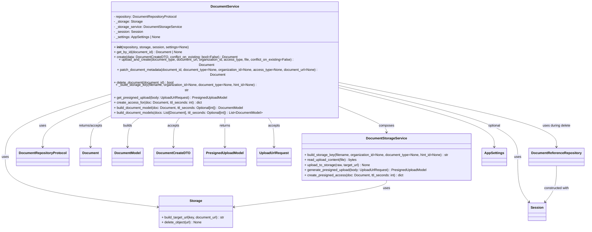
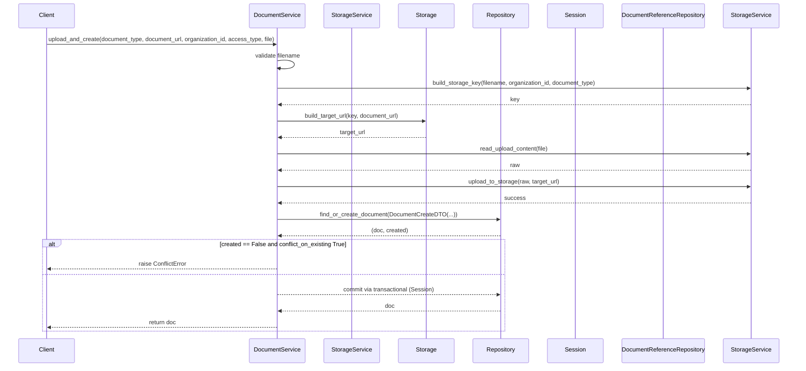
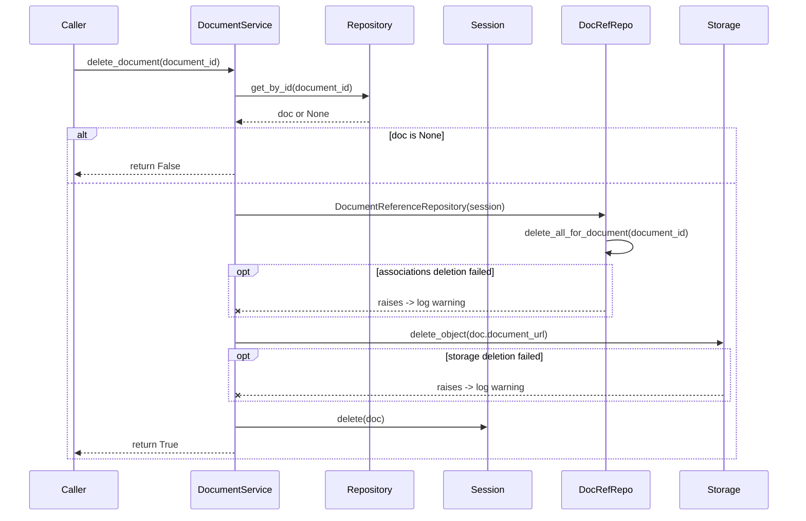

# Diagram: common/document_service/src/api/services/document_service.py

> Auto-generated by Obscura crawlers

## Diagram 1

### SVG

<svg id="container" width="2712.28125" xmlns="http://www.w3.org/2000/svg" class="classDiagram" height="1016" viewBox="0 0 2712.28125 1016" role="graphics-document document" aria-roledescription="class"><g><defs><marker id="container_class-aggregationStart" class="marker aggregation class" refX="18" refY="7" markerWidth="190" markerHeight="240" orient="auto"><path d="M 18,7 L9,13 L1,7 L9,1 Z"></path></marker></defs><defs><marker id="container_class-aggregationEnd" class="marker aggregation class" refX="1" refY="7" markerWidth="20" markerHeight="28" orient="auto"><path d="M 18,7 L9,13 L1,7 L9,1 Z"></path></marker></defs><defs><marker id="container_class-extensionStart" class="marker extension class" refX="18" refY="7" markerWidth="190" markerHeight="240" orient="auto"><path d="M 1,7 L18,13 V 1 Z"></path></marker></defs><defs><marker id="container_class-extensionEnd" class="marker extension class" refX="1" refY="7" markerWidth="20" markerHeight="28" orient="auto"><path d="M 1,1 V 13 L18,7 Z"></path></marker></defs><defs><marker id="container_class-compositionStart" class="marker composition class" refX="18" refY="7" markerWidth="190" markerHeight="240" orient="auto"><path d="M 18,7 L9,13 L1,7 L9,1 Z"></path></marker></defs><defs><marker id="container_class-compositionEnd" class="marker composition class" refX="1" refY="7" markerWidth="20" markerHeight="28" orient="auto"><path d="M 18,7 L9,13 L1,7 L9,1 Z"></path></marker></defs><defs><marker id="container_class-dependencyStart" class="marker dependency class" refX="6" refY="7" markerWidth="190" markerHeight="240" orient="auto"><path d="M 5,7 L9,13 L1,7 L9,1 Z"></path></marker></defs><defs><marker id="container_class-dependencyEnd" class="marker dependency class" refX="13" refY="7" markerWidth="20" markerHeight="28" orient="auto"><path d="M 18,7 L9,13 L14,7 L9,1 Z"></path></marker></defs><defs><marker id="container_class-lollipopStart" class="marker lollipop class" refX="13" refY="7" markerWidth="190" markerHeight="240" orient="auto"><circle stroke="black" fill="transparent" cx="7" cy="7" r="6"></circle></marker></defs><defs><marker id="container_class-lollipopEnd" class="marker lollipop class" refX="1" refY="7" markerWidth="190" markerHeight="240" orient="auto"><circle stroke="black" fill="transparent" cx="7" cy="7" r="6"></circle></marker></defs><g class="root"><g class="clusters"></g><g class="edgePaths"><path d="M466.215,434.886L421.089,449.905C375.964,464.924,285.712,494.962,240.587,526.648C195.461,558.333,195.461,591.667,195.461,608.333L195.461,625" id="id_DocumentService_DocumentRepositoryProtocol_1" class="edge-thickness-normal edge-pattern-solid relation" style=";;;" data-edge="true" data-et="edge" data-id="id_DocumentService_DocumentRepositoryProtocol_1" data-points="W3sieCI6NDY2LjIxNDg0Mzc1LCJ5Ijo0MzQuODg1OTQyOTI2ODc1MDN9LHsieCI6MTk1LjQ2MDkzNzUsInkiOjUyNX0seyJ4IjoxOTUuNDYwOTM3NSwieSI6NjMxfV0=" marker-end="url(#container_class-dependencyEnd)"></path><path d="M466.215,403.037L392.594,423.364C318.974,443.692,171.733,484.346,98.113,529.34C24.492,574.333,24.492,623.667,24.492,673C24.492,722.333,24.492,771.667,140.506,811.094C256.52,850.522,488.548,880.044,604.561,894.805L720.575,909.566" id="id_DocumentService_Storage_2" class="edge-thickness-normal edge-pattern-solid relation" style=";;;" data-edge="true" data-et="edge" data-id="id_DocumentService_Storage_2" data-points="W3sieCI6NDY2LjIxNDg0Mzc1LCJ5Ijo0MDMuMDM3Mjk3MzM1MTgxNX0seyJ4IjoyNC40OTIxODc1LCJ5Ijo1MjV9LHsieCI6MjQuNDkyMTg3NSwieSI6NjczfSx7IngiOjI0LjQ5MjE4NzUsInkiOjgyMX0seyJ4Ijo3MjYuNTI3MzQzNzUsInkiOjkxMC4zMjMzNjM1MjM4MDk5fV0=" marker-end="url(#container_class-dependencyEnd)"></path><path d="M1589.238,453.389L1621.868,465.324C1654.497,477.259,1719.757,501.13,1752.386,518.231C1785.016,535.333,1785.016,545.667,1785.016,550.833L1785.016,556" id="id_DocumentService_DocumentStorageService_3" class="edge-thickness-normal edge-pattern-solid relation" style=";;;" data-edge="true" data-et="edge" data-id="id_DocumentService_DocumentStorageService_3" data-points="W3sieCI6MTU4OS4yMzgyODEyNSwieSI6NDUzLjM4ODg3MTY5NDg4Mn0seyJ4IjoxNzg1LjAxNTYyNSwieSI6NTI1fSx7IngiOjE3ODUuMDE1NjI1LCJ5Ijo1NjJ9XQ==" marker-end="url(#container_class-dependencyEnd)"></path><path d="M1589.238,361.174L1724.708,388.479C1860.177,415.783,2131.116,470.391,2266.585,522.362C2402.055,574.333,2402.055,623.667,2402.055,673C2402.055,722.333,2402.055,771.667,2410.646,807.215C2419.238,842.764,2436.422,864.527,2445.013,875.409L2453.605,886.291" id="id_DocumentService_Session_4" class="edge-thickness-normal edge-pattern-solid relation" style=";;;" data-edge="true" data-et="edge" data-id="id_DocumentService_Session_4" data-points="W3sieCI6MTU4OS4yMzgyODEyNSwieSI6MzYxLjE3NDM4OTE5MDE3MjQ2fSx7IngiOjI0MDIuMDU0Njg3NSwieSI6NTI1fSx7IngiOjI0MDIuMDU0Njg3NSwieSI6NjczfSx7IngiOjI0MDIuMDU0Njg3NSwieSI6ODIxfSx7IngiOjI0NTcuMzIzMjQyMTg3NSwieSI6ODkxfV0=" marker-end="url(#container_class-dependencyEnd)"></path><path d="M1589.238,370.827L1706.706,396.523C1824.174,422.218,2059.111,473.609,2176.579,515.971C2294.047,558.333,2294.047,591.667,2294.047,608.333L2294.047,625" id="id_DocumentService_AppSettings_5" class="edge-thickness-normal edge-pattern-solid relation" style=";;;" data-edge="true" data-et="edge" data-id="id_DocumentService_AppSettings_5" data-points="W3sieCI6MTU4OS4yMzgyODEyNSwieSI6MzcwLjgyNzMzMjUxNDg1Mjk3fSx7IngiOjIyOTQuMDQ2ODc1LCJ5Ijo1MjV9LHsieCI6MjI5NC4wNDY4NzUsInkiOjYzMX1d" marker-end="url(#container_class-dependencyEnd)"></path><path d="M496.005,488L482.343,494.167C468.68,500.333,441.356,512.667,427.694,535.5C414.031,558.333,414.031,591.667,414.031,608.333L414.031,625" id="id_DocumentService_Document_6" class="edge-thickness-normal edge-pattern-solid relation" style=";;;" data-edge="true" data-et="edge" data-id="id_DocumentService_Document_6" data-points="W3sieCI6NDk2LjAwNDk5MjEwMjg4ODEsInkiOjQ4OH0seyJ4Ijo0MTQuMDMxMjUsInkiOjUyNX0seyJ4Ijo0MTQuMDMxMjUsInkiOjYzMX1d" marker-end="url(#container_class-dependencyEnd)"></path><path d="M643.934,488L634.072,494.167C624.211,500.333,604.488,512.667,594.627,535.5C584.766,558.333,584.766,591.667,584.766,608.333L584.766,625" id="id_DocumentService_DocumentModel_7" class="edge-thickness-normal edge-pattern-solid relation" style=";;;" data-edge="true" data-et="edge" data-id="id_DocumentService_DocumentModel_7" data-points="W3sieCI6NjQzLjkzMzY5MjQ2Mzg5OSwieSI6NDg4fSx7IngiOjU4NC43NjU2MjUsInkiOjUyNX0seyJ4Ijo1ODQuNzY1NjI1LCJ5Ijo2MzF9XQ==" marker-end="url(#container_class-dependencyEnd)"></path><path d="M824.827,488L819.614,494.167C814.4,500.333,803.974,512.667,798.76,535.5C793.547,558.333,793.547,591.667,793.547,608.333L793.547,625" id="id_DocumentService_DocumentCreateDTO_8" class="edge-thickness-normal edge-pattern-solid relation" style=";;;" data-edge="true" data-et="edge" data-id="id_DocumentService_DocumentCreateDTO_8" data-points="W3sieCI6ODI0LjgyNzE5NDI2ODk1MywieSI6NDg4fSx7IngiOjc5My41NDY4NzUsInkiOjUyNX0seyJ4Ijo3OTMuNTQ2ODc1LCJ5Ijo2MzF9XQ==" marker-end="url(#container_class-dependencyEnd)"></path><path d="M1027.727,488L1027.727,494.167C1027.727,500.333,1027.727,512.667,1027.727,535.5C1027.727,558.333,1027.727,591.667,1027.727,608.333L1027.727,625" id="id_DocumentService_PresignedUploadModel_9" class="edge-thickness-normal edge-pattern-solid relation" style=";;;" data-edge="true" data-et="edge" data-id="id_DocumentService_PresignedUploadModel_9" data-points="W3sieCI6MTAyNy43MjY1NjI1LCJ5Ijo0ODh9LHsieCI6MTAyNy43MjY1NjI1LCJ5Ijo1MjV9LHsieCI6MTAyNy43MjY1NjI1LCJ5Ijo2MzF9XQ==" marker-end="url(#container_class-dependencyEnd)"></path><path d="M1223.458,488L1228.487,494.167C1233.516,500.333,1243.574,512.667,1248.604,535.5C1253.633,558.333,1253.633,591.667,1253.633,608.333L1253.633,625" id="id_DocumentService_UploadUrlRequest_10" class="edge-thickness-normal edge-pattern-solid relation" style=";;;" data-edge="true" data-et="edge" data-id="id_DocumentService_UploadUrlRequest_10" data-points="W3sieCI6MTIyMy40NTc2MDk0MzE0MDgsInkiOjQ4OH0seyJ4IjoxMjUzLjYzMjgxMjUsInkiOjUyNX0seyJ4IjoxMjUzLjYzMjgxMjUsInkiOjYzMX1d" marker-end="url(#container_class-dependencyEnd)"></path><path d="M1589.238,348.271L1754.184,377.726C1919.13,407.181,2249.022,466.09,2413.968,512.212C2578.914,558.333,2578.914,591.667,2578.914,608.333L2578.914,625" id="id_DocumentService_DocumentReferenceRepository_11" class="edge-thickness-normal edge-pattern-solid relation" style=";;;" data-edge="true" data-et="edge" data-id="id_DocumentService_DocumentReferenceRepository_11" data-points="W3sieCI6MTU4OS4yMzgyODEyNSwieSI6MzQ4LjI3MDc1Nzc4NjM3MzM0fSx7IngiOjI1NzguOTE0MDYyNSwieSI6NTI1fSx7IngiOjI1NzguOTE0MDYyNSwieSI6NjMxfV0=" marker-end="url(#container_class-dependencyEnd)"></path><path d="M1785.016,784L1785.016,790.167C1785.016,796.333,1785.016,808.667,1669.002,829.594C1552.988,850.522,1320.96,880.044,1204.946,894.805L1088.932,909.566" id="id_DocumentStorageService_Storage_12" class="edge-thickness-normal edge-pattern-solid relation" style=";;;" data-edge="true" data-et="edge" data-id="id_DocumentStorageService_Storage_12" data-points="W3sieCI6MTc4NS4wMTU2MjUsInkiOjc4NH0seyJ4IjoxNzg1LjAxNTYyNSwieSI6ODIxfSx7IngiOjEwODIuOTgwNDY4NzUsInkiOjkxMC4zMjMzNjM1MjM4MDk5fV0=" marker-end="url(#container_class-dependencyEnd)"></path><path d="M2578.914,715L2578.914,732.667C2578.914,750.333,2578.914,785.667,2570.322,814.215C2561.731,842.764,2544.547,864.527,2535.955,875.409L2527.364,886.291" id="id_DocumentReferenceRepository_Session_13" class="edge-thickness-normal edge-pattern-solid relation" style=";;;" data-edge="true" data-et="edge" data-id="id_DocumentReferenceRepository_Session_13" data-points="W3sieCI6MjU3OC45MTQwNjI1LCJ5Ijo3MTV9LHsieCI6MjU3OC45MTQwNjI1LCJ5Ijo4MjF9LHsieCI6MjUyMy42NDU1MDc4MTI1LCJ5Ijo4OTF9XQ==" marker-end="url(#container_class-dependencyEnd)"></path></g><g class="edgeLabels"><g class="edgeLabel" transform="translate(195.4609375, 525)"><g class="label" data-id="id_DocumentService_DocumentRepositoryProtocol_1" transform="translate(-16.4921875, -12)"><foreignObject width="32.984375" height="24">

uses

</foreignObject></g></g><g class="edgeLabel" transform="translate(24.4921875, 673)"><g class="label" data-id="id_DocumentService_Storage_2" transform="translate(-16.4921875, -12)"><foreignObject width="32.984375" height="24">

uses

</foreignObject></g></g><g class="edgeLabel" transform="translate(1785.015625, 525)"><g class="label" data-id="id_DocumentService_DocumentStorageService_3" transform="translate(-36.453125, -12)"><foreignObject width="72.90625" height="24">

composes

</foreignObject></g></g><g class="edgeLabel" transform="translate(2402.0546875, 673)"><g class="label" data-id="id_DocumentService_Session_4" transform="translate(-16.4921875, -12)"><foreignObject width="32.984375" height="24">

uses

</foreignObject></g></g><g class="edgeLabel" transform="translate(2294.046875, 525)"><g class="label" data-id="id_DocumentService_AppSettings_5" transform="translate(-30.546875, -12)"><foreignObject width="61.09375" height="24">

optional

</foreignObject></g></g><g class="edgeLabel" transform="translate(414.03125, 525)"><g class="label" data-id="id_DocumentService_Document_6" transform="translate(-57.4453125, -12)"><foreignObject width="114.890625" height="24">

returns/accepts

</foreignObject></g></g><g class="edgeLabel" transform="translate(584.765625, 525)"><g class="label" data-id="id_DocumentService_DocumentModel_7" transform="translate(-22.4921875, -12)"><foreignObject width="44.984375" height="24">

builds

</foreignObject></g></g><g class="edgeLabel" transform="translate(793.546875, 525)"><g class="label" data-id="id_DocumentService_DocumentCreateDTO_8" transform="translate(-27.421875, -12)"><foreignObject width="54.84375" height="24">

accepts

</foreignObject></g></g><g class="edgeLabel" transform="translate(1027.7265625, 525)"><g class="label" data-id="id_DocumentService_PresignedUploadModel_9" transform="translate(-26.265625, -12)"><foreignObject width="52.53125" height="24">

returns

</foreignObject></g></g><g class="edgeLabel" transform="translate(1253.6328125, 525)"><g class="label" data-id="id_DocumentService_UploadUrlRequest_10" transform="translate(-27.421875, -12)"><foreignObject width="54.84375" height="24">

accepts

</foreignObject></g></g><g class="edgeLabel" transform="translate(2578.9140625, 525)"><g class="label" data-id="id_DocumentService_DocumentReferenceRepository_11" transform="translate(-67.296875, -12)"><foreignObject width="134.59375" height="24">

uses during delete

</foreignObject></g></g><g class="edgeLabel" transform="translate(1785.015625, 821)"><g class="label" data-id="id_DocumentStorageService_Storage_12" transform="translate(-16.4921875, -12)"><foreignObject width="32.984375" height="24">

uses

</foreignObject></g></g><g class="edgeLabel" transform="translate(2578.9140625, 821)"><g class="label" data-id="id_DocumentReferenceRepository_Session_13" transform="translate(-60.8203125, -12)"><foreignObject width="121.640625" height="24">

constructed with

</foreignObject></g></g></g><g class="nodes"><g class="node default" id="classId-DocumentService-0" transform="translate(1027.7265625, 248)"><g class="basic label-container"><path d="M-561.51171875 -240 L561.51171875 -240 L561.51171875 240 L-561.51171875 240" stroke="none" stroke-width="0" fill="#ECECFF" style=""></path><path d="M-561.51171875 -240 C-204.44895816269616 -240, 152.61380242460768 -240, 561.51171875 -240 M-561.51171875 -240 C-252.92933487103977 -240, 55.65304900792046 -240, 561.51171875 -240 M561.51171875 -240 C561.51171875 -87.94148435590984, 561.51171875 64.11703128818033, 561.51171875 240 M561.51171875 -240 C561.51171875 -77.0986869331202, 561.51171875 85.80262613375959, 561.51171875 240 M561.51171875 240 C198.34030184443537 240, -164.83111506112925 240, -561.51171875 240 M561.51171875 240 C155.90778080621533 240, -249.69615713756934 240, -561.51171875 240 M-561.51171875 240 C-561.51171875 78.68310691382939, -561.51171875 -82.63378617234122, -561.51171875 -240 M-561.51171875 240 C-561.51171875 118.20910734252878, -561.51171875 -3.5817853149424366, -561.51171875 -240" stroke="#9370DB" stroke-width="1.3" fill="none" stroke-dasharray="0 0" style=""></path></g><g class="annotation-group text" transform="translate(0, -216)"></g><g class="label-group text" transform="translate(-63.7421875, -216)"><g class="label" style="font-weight: bolder" transform="translate(0,-12)"><foreignObject width="127.484375" height="24">

DocumentService

</foreignObject></g></g><g class="members-group text" transform="translate(-549.51171875, -168)"><g class="label" style="" transform="translate(0,-12)"><foreignObject width="305.21875" height="24">

- repository: DocumentRepositoryProtocol

</foreignObject></g><g class="label" style="" transform="translate(0,12)"><foreignObject width="134.9375" height="24">

- _storage: Storage

</foreignObject></g><g class="label" style="" transform="translate(0,36)"><foreignObject width="319.8125" height="24">

- _storage_service: DocumentStorageService

</foreignObject></g><g class="label" style="" transform="translate(0,60)"><foreignObject width="136.765625" height="24">

- _session: Session

</foreignObject></g><g class="label" style="" transform="translate(0,84)"><foreignObject width="224.4375" height="24">

- _settings: AppSettings | None

</foreignObject></g></g><g class="methods-group text" transform="translate(-549.51171875, -24)"><g class="label" style="" transform="translate(0,-12)"><foreignObject width="355.84375" height="24">

+ <strong>init</strong>(repository, storage, session, settings=None)

</foreignObject></g><g class="label" style="" transform="translate(0,12)"><foreignObject width="328.0625" height="24">

+ get_by_id(document_id) : Document | None

</foreignObject></g><g class="label" style="" transform="translate(0,36)"><foreignObject width="580.546875" height="24">

+ create(data: DocumentCreateDTO, conflict_on_existing: bool=False) : Document

</foreignObject></g><g class="label" style="" transform="translate(0,60)"><foreignObject width="913.3125" height="24">

+ upload_and_create(document_type, document_url, organization_id, access_type, file, conflict_on_existing=False) : Document

</foreignObject></g><g class="label" style="" transform="translate(0,84)"><foreignObject width="1035.28125" height="24">

+ patch_document_metadata(document_id, document_type=None, organization_id=None, access_type=None, document_url=None) : Document

</foreignObject></g><g class="label" style="" transform="translate(0,108)"><foreignObject width="290.34375" height="24">

+ delete_document(document_id) : bool

</foreignObject></g><g class="label" style="" transform="translate(0,132)"><foreignObject width="697.546875" height="24">

+ _build_storage_key(filename, organization_id=None, document_type=None, hint_id=None) : str

</foreignObject></g><g class="label" style="" transform="translate(0,156)"><foreignObject width="541.90625" height="24">

+ get_presigned_upload(body: UploadUrlRequest) : PresignedUploadModel

</foreignObject></g><g class="label" style="" transform="translate(0,180)"><foreignObject width="418.53125" height="24">

+ create_access_for(doc: Document, ttl_seconds: int) : dict

</foreignObject></g><g class="label" style="" transform="translate(0,204)"><foreignObject width="628.453125" height="24">

+ build_document_model(doc: Document, ttl_seconds: Optional[int]) : DocumentModel

</foreignObject></g><g class="label" style="" transform="translate(0,228)"><foreignObject width="721.1875" height="24">

+ build_document_models(docs: List[Document], ttl_seconds: Optional[int]) : List&lt;DocumentModel&gt;

</foreignObject></g></g><g class="divider" style=""><path d="M-561.51171875 -192 C-299.3416954159703 -192, -37.17167208194064 -192, 561.51171875 -192 M-561.51171875 -192 C-220.83341340392656 -192, 119.84489194214689 -192, 561.51171875 -192" stroke="#9370DB" stroke-width="1.3" fill="none" stroke-dasharray="0 0" style=""></path></g><g class="divider" style=""><path d="M-561.51171875 -48 C-266.7884983080667 -48, 27.934722133866558 -48, 561.51171875 -48 M-561.51171875 -48 C-137.21886747928812 -48, 287.07398379142376 -48, 561.51171875 -48" stroke="#9370DB" stroke-width="1.3" fill="none" stroke-dasharray="0 0" style=""></path></g></g><g class="node default" id="classId-DocumentStorageService-1" transform="translate(1785.015625, 673)"><g class="basic label-container"><path d="M-402.515625 -111 L402.515625 -111 L402.515625 111 L-402.515625 111" stroke="none" stroke-width="0" fill="#ECECFF" style=""></path><path d="M-402.515625 -111 C-153.21930327932392 -111, 96.07701844135215 -111, 402.515625 -111 M-402.515625 -111 C-148.42617207143493 -111, 105.66328085713013 -111, 402.515625 -111 M402.515625 -111 C402.515625 -56.00383007391133, 402.515625 -1.0076601478226621, 402.515625 111 M402.515625 -111 C402.515625 -27.856215934270622, 402.515625 55.287568131458755, 402.515625 111 M402.515625 111 C126.29699393673673 111, -149.92163712652655 111, -402.515625 111 M402.515625 111 C227.02955723015785 111, 51.5434894603157 111, -402.515625 111 M-402.515625 111 C-402.515625 39.07100354589039, -402.515625 -32.85799290821922, -402.515625 -111 M-402.515625 111 C-402.515625 54.10181573450378, -402.515625 -2.7963685309924387, -402.515625 -111" stroke="#9370DB" stroke-width="1.3" fill="none" stroke-dasharray="0 0" style=""></path></g><g class="annotation-group text" transform="translate(0, -87)"></g><g class="label-group text" transform="translate(-91.8125, -87)"><g class="label" style="font-weight: bolder" transform="translate(0,-12)"><foreignObject width="183.625" height="24">

DocumentStorageService

</foreignObject></g></g><g class="members-group text" transform="translate(-390.515625, -39)"></g><g class="methods-group text" transform="translate(-390.515625, -9)"><g class="label" style="" transform="translate(0,-12)"><foreignObject width="689.21875" height="24">

+ build_storage_key(filename, organization_id=None, document_type=None, hint_id=None) : str

</foreignObject></g><g class="label" style="" transform="translate(0,12)"><foreignObject width="251.359375" height="24">

+ read_upload_content(file) : bytes

</foreignObject></g><g class="label" style="" transform="translate(0,36)"><foreignObject width="312.859375" height="24">

+ upload_to_storage(raw, target_url) : None

</foreignObject></g><g class="label" style="" transform="translate(0,60)"><foreignObject width="582.484375" height="24">

+ generate_presigned_upload(body: UploadUrlRequest) : PresignedUploadModel

</foreignObject></g><g class="label" style="" transform="translate(0,84)"><foreignObject width="470.34375" height="24">

+ create_presigned_access(doc: Document, ttl_seconds: int) : dict

</foreignObject></g></g><g class="divider" style=""><path d="M-402.515625 -63 C-194.84520950343494 -63, 12.825205993130112 -63, 402.515625 -63 M-402.515625 -63 C-114.2023621113994 -63, 174.1109007772012 -63, 402.515625 -63" stroke="#9370DB" stroke-width="1.3" fill="none" stroke-dasharray="0 0" style=""></path></g><g class="divider" style=""><path d="M-402.515625 -39 C-139.94265392195138 -39, 122.63031715609725 -39, 402.515625 -39 M-402.515625 -39 C-219.49029448093458 -39, -36.46496396186916 -39, 402.515625 -39" stroke="#9370DB" stroke-width="1.3" fill="none" stroke-dasharray="0 0" style=""></path></g></g><g class="node default" id="classId-Storage-2" transform="translate(904.75390625, 933)"><g class="basic label-container"><path d="M-178.2265625 -75 L178.2265625 -75 L178.2265625 75 L-178.2265625 75" stroke="none" stroke-width="0" fill="#ECECFF" style=""></path><path d="M-178.2265625 -75 C-40.07510927528298 -75, 98.07634394943403 -75, 178.2265625 -75 M-178.2265625 -75 C-40.57651025929454 -75, 97.07354198141093 -75, 178.2265625 -75 M178.2265625 -75 C178.2265625 -39.3041603237392, 178.2265625 -3.6083206474783935, 178.2265625 75 M178.2265625 -75 C178.2265625 -33.90264699051521, 178.2265625 7.194706018969583, 178.2265625 75 M178.2265625 75 C88.57216992132285 75, -1.0822226573542935 75, -178.2265625 75 M178.2265625 75 C90.14408048405069 75, 2.06159846810138 75, -178.2265625 75 M-178.2265625 75 C-178.2265625 44.28721341583176, -178.2265625 13.574426831663516, -178.2265625 -75 M-178.2265625 75 C-178.2265625 31.448171582245983, -178.2265625 -12.103656835508033, -178.2265625 -75" stroke="#9370DB" stroke-width="1.3" fill="none" stroke-dasharray="0 0" style=""></path></g><g class="annotation-group text" transform="translate(0, -51)"></g><g class="label-group text" transform="translate(-28.078125, -51)"><g class="label" style="font-weight: bolder" transform="translate(0,-12)"><foreignObject width="56.15625" height="24">

Storage

</foreignObject></g></g><g class="members-group text" transform="translate(-166.2265625, -3)"></g><g class="methods-group text" transform="translate(-166.2265625, 27)"><g class="label" style="" transform="translate(0,-12)"><foreignObject width="304.375" height="24">

+ build_target_url(key, document_url) : str

</foreignObject></g><g class="label" style="" transform="translate(0,12)"><foreignObject width="192.484375" height="24">

+ delete_object(url) : None

</foreignObject></g></g><g class="divider" style=""><path d="M-178.2265625 -27 C-71.49319450985136 -27, 35.24017348029727 -27, 178.2265625 -27 M-178.2265625 -27 C-102.83035756666162 -27, -27.434152633323237 -27, 178.2265625 -27" stroke="#9370DB" stroke-width="1.3" fill="none" stroke-dasharray="0 0" style=""></path></g><g class="divider" style=""><path d="M-178.2265625 -3 C-80.80365055010948 -3, 16.61926139978104 -3, 178.2265625 -3 M-178.2265625 -3 C-92.62810698383143 -3, -7.029651467662859 -3, 178.2265625 -3" stroke="#9370DB" stroke-width="1.3" fill="none" stroke-dasharray="0 0" style=""></path></g></g><g class="node default" id="classId-DocumentRepositoryProtocol-3" transform="translate(195.4609375, 673)"><g class="basic label-container"><path d="M-119.4765625 -42 L119.4765625 -42 L119.4765625 42 L-119.4765625 42" stroke="none" stroke-width="0" fill="#ECECFF" style=""></path><path d="M-119.4765625 -42 C-28.995284105220477 -42, 61.485994289559045 -42, 119.4765625 -42 M-119.4765625 -42 C-32.66080489968482 -42, 54.15495270063036 -42, 119.4765625 -42 M119.4765625 -42 C119.4765625 -9.176160224412783, 119.4765625 23.647679551174434, 119.4765625 42 M119.4765625 -42 C119.4765625 -19.105029655277793, 119.4765625 3.789940689444414, 119.4765625 42 M119.4765625 42 C59.951732949899366 42, 0.42690339979873215 42, -119.4765625 42 M119.4765625 42 C51.979531112043716 42, -15.517500275912568 42, -119.4765625 42 M-119.4765625 42 C-119.4765625 18.339297685377463, -119.4765625 -5.321404629245073, -119.4765625 -42 M-119.4765625 42 C-119.4765625 20.382206931466925, -119.4765625 -1.23558613706615, -119.4765625 -42" stroke="#9370DB" stroke-width="1.3" fill="none" stroke-dasharray="0 0" style=""></path></g><g class="annotation-group text" transform="translate(0, -18)"></g><g class="label-group text" transform="translate(-107.4765625, -18)"><g class="label" style="font-weight: bolder" transform="translate(0,-12)"><foreignObject width="214.953125" height="24">

DocumentRepositoryProtocol

</foreignObject></g></g><g class="members-group text" transform="translate(-107.4765625, 30)"></g><g class="methods-group text" transform="translate(-107.4765625, 60)"></g><g class="divider" style=""><path d="M-119.4765625 6 C-54.50707533087284 6, 10.462411838254326 6, 119.4765625 6 M-119.4765625 6 C-50.66998536242572 6, 18.13659177514856 6, 119.4765625 6" stroke="#9370DB" stroke-width="1.3" fill="none" stroke-dasharray="0 0" style=""></path></g><g class="divider" style=""><path d="M-119.4765625 24 C-47.618855044480384 24, 24.238852411039232 24, 119.4765625 24 M-119.4765625 24 C-46.69304058522563 24, 26.090481329548737 24, 119.4765625 24" stroke="#9370DB" stroke-width="1.3" fill="none" stroke-dasharray="0 0" style=""></path></g></g><g class="node default" id="classId-Document-4" transform="translate(414.03125, 673)"><g class="basic label-container"><path d="M-49.09375 -42 L49.09375 -42 L49.09375 42 L-49.09375 42" stroke="none" stroke-width="0" fill="#ECECFF" style=""></path><path d="M-49.09375 -42 C-26.73257811788553 -42, -4.371406235771062 -42, 49.09375 -42 M-49.09375 -42 C-18.5673506482198 -42, 11.959048703560399 -42, 49.09375 -42 M49.09375 -42 C49.09375 -22.16191084983087, 49.09375 -2.3238216996617425, 49.09375 42 M49.09375 -42 C49.09375 -18.476230568588786, 49.09375 5.047538862822428, 49.09375 42 M49.09375 42 C23.190563180082364 42, -2.7126236398352717 42, -49.09375 42 M49.09375 42 C11.98722639797014 42, -25.11929720405972 42, -49.09375 42 M-49.09375 42 C-49.09375 16.830192999321945, -49.09375 -8.33961400135611, -49.09375 -42 M-49.09375 42 C-49.09375 22.533003918776064, -49.09375 3.066007837552128, -49.09375 -42" stroke="#9370DB" stroke-width="1.3" fill="none" stroke-dasharray="0 0" style=""></path></g><g class="annotation-group text" transform="translate(0, -18)"></g><g class="label-group text" transform="translate(-37.09375, -18)"><g class="label" style="font-weight: bolder" transform="translate(0,-12)"><foreignObject width="74.1875" height="24">

Document

</foreignObject></g></g><g class="members-group text" transform="translate(-37.09375, 30)"></g><g class="methods-group text" transform="translate(-37.09375, 60)"></g><g class="divider" style=""><path d="M-49.09375 6 C-20.17613044436085 6, 8.741489111278298 6, 49.09375 6 M-49.09375 6 C-11.56888539602793 6, 25.95597920794414 6, 49.09375 6" stroke="#9370DB" stroke-width="1.3" fill="none" stroke-dasharray="0 0" style=""></path></g><g class="divider" style=""><path d="M-49.09375 24 C-11.787448474682535 24, 25.51885305063493 24, 49.09375 24 M-49.09375 24 C-17.422980994806775 24, 14.24778801038645 24, 49.09375 24" stroke="#9370DB" stroke-width="1.3" fill="none" stroke-dasharray="0 0" style=""></path></g></g><g class="node default" id="classId-DocumentModel-5" transform="translate(584.765625, 673)"><g class="basic label-container"><path d="M-71.640625 -42 L71.640625 -42 L71.640625 42 L-71.640625 42" stroke="none" stroke-width="0" fill="#ECECFF" style=""></path><path d="M-71.640625 -42 C-42.02587149212843 -42, -12.411117984256869 -42, 71.640625 -42 M-71.640625 -42 C-31.085753307871556 -42, 9.469118384256888 -42, 71.640625 -42 M71.640625 -42 C71.640625 -20.360387973701865, 71.640625 1.2792240525962697, 71.640625 42 M71.640625 -42 C71.640625 -13.227040739739302, 71.640625 15.545918520521397, 71.640625 42 M71.640625 42 C24.964849894200896 42, -21.71092521159821 42, -71.640625 42 M71.640625 42 C39.284902249594985 42, 6.929179499189971 42, -71.640625 42 M-71.640625 42 C-71.640625 19.43931662365184, -71.640625 -3.121366752696318, -71.640625 -42 M-71.640625 42 C-71.640625 14.051395983312808, -71.640625 -13.897208033374383, -71.640625 -42" stroke="#9370DB" stroke-width="1.3" fill="none" stroke-dasharray="0 0" style=""></path></g><g class="annotation-group text" transform="translate(0, -18)"></g><g class="label-group text" transform="translate(-59.640625, -18)"><g class="label" style="font-weight: bolder" transform="translate(0,-12)"><foreignObject width="119.28125" height="24">

DocumentModel

</foreignObject></g></g><g class="members-group text" transform="translate(-59.640625, 30)"></g><g class="methods-group text" transform="translate(-59.640625, 60)"></g><g class="divider" style=""><path d="M-71.640625 6 C-42.490391233315606 6, -13.340157466631204 6, 71.640625 6 M-71.640625 6 C-39.34847162320098 6, -7.056318246401958 6, 71.640625 6" stroke="#9370DB" stroke-width="1.3" fill="none" stroke-dasharray="0 0" style=""></path></g><g class="divider" style=""><path d="M-71.640625 24 C-21.140853507578584 24, 29.358917984842833 24, 71.640625 24 M-71.640625 24 C-24.56071005904922 24, 22.51920488190156 24, 71.640625 24" stroke="#9370DB" stroke-width="1.3" fill="none" stroke-dasharray="0 0" style=""></path></g></g><g class="node default" id="classId-DocumentCreateDTO-6" transform="translate(793.546875, 673)"><g class="basic label-container"><path d="M-87.140625 -42 L87.140625 -42 L87.140625 42 L-87.140625 42" stroke="none" stroke-width="0" fill="#ECECFF" style=""></path><path d="M-87.140625 -42 C-39.58144600761759 -42, 7.977732984764813 -42, 87.140625 -42 M-87.140625 -42 C-41.80117991175439 -42, 3.5382651764912225 -42, 87.140625 -42 M87.140625 -42 C87.140625 -23.58010271729076, 87.140625 -5.1602054345815205, 87.140625 42 M87.140625 -42 C87.140625 -19.770235783460013, 87.140625 2.4595284330799743, 87.140625 42 M87.140625 42 C47.65150875352396 42, 8.162392507047926 42, -87.140625 42 M87.140625 42 C49.815645783437795 42, 12.49066656687559 42, -87.140625 42 M-87.140625 42 C-87.140625 12.979777690491211, -87.140625 -16.040444619017578, -87.140625 -42 M-87.140625 42 C-87.140625 23.150407734438872, -87.140625 4.300815468877744, -87.140625 -42" stroke="#9370DB" stroke-width="1.3" fill="none" stroke-dasharray="0 0" style=""></path></g><g class="annotation-group text" transform="translate(0, -18)"></g><g class="label-group text" transform="translate(-75.140625, -18)"><g class="label" style="font-weight: bolder" transform="translate(0,-12)"><foreignObject width="150.28125" height="24">

DocumentCreateDTO

</foreignObject></g></g><g class="members-group text" transform="translate(-75.140625, 30)"></g><g class="methods-group text" transform="translate(-75.140625, 60)"></g><g class="divider" style=""><path d="M-87.140625 6 C-21.294884931414416 6, 44.55085513717117 6, 87.140625 6 M-87.140625 6 C-20.675869280909055 6, 45.78888643818189 6, 87.140625 6" stroke="#9370DB" stroke-width="1.3" fill="none" stroke-dasharray="0 0" style=""></path></g><g class="divider" style=""><path d="M-87.140625 24 C-22.805413603435085 24, 41.52979779312983 24, 87.140625 24 M-87.140625 24 C-47.611823759984276 24, -8.083022519968551 24, 87.140625 24" stroke="#9370DB" stroke-width="1.3" fill="none" stroke-dasharray="0 0" style=""></path></g></g><g class="node default" id="classId-PresignedUploadModel-7" transform="translate(1027.7265625, 673)"><g class="basic label-container"><path d="M-97.0390625 -42 L97.0390625 -42 L97.0390625 42 L-97.0390625 42" stroke="none" stroke-width="0" fill="#ECECFF" style=""></path><path d="M-97.0390625 -42 C-21.58825506716566 -42, 53.86255236566868 -42, 97.0390625 -42 M-97.0390625 -42 C-27.564736459248977 -42, 41.90958958150205 -42, 97.0390625 -42 M97.0390625 -42 C97.0390625 -12.35713224630468, 97.0390625 17.28573550739064, 97.0390625 42 M97.0390625 -42 C97.0390625 -14.078422331936814, 97.0390625 13.843155336126372, 97.0390625 42 M97.0390625 42 C38.36688759671246 42, -20.30528730657508 42, -97.0390625 42 M97.0390625 42 C43.14400890952562 42, -10.751044680948766 42, -97.0390625 42 M-97.0390625 42 C-97.0390625 22.2005345423481, -97.0390625 2.4010690846962035, -97.0390625 -42 M-97.0390625 42 C-97.0390625 11.983292131935833, -97.0390625 -18.033415736128333, -97.0390625 -42" stroke="#9370DB" stroke-width="1.3" fill="none" stroke-dasharray="0 0" style=""></path></g><g class="annotation-group text" transform="translate(0, -18)"></g><g class="label-group text" transform="translate(-85.0390625, -18)"><g class="label" style="font-weight: bolder" transform="translate(0,-12)"><foreignObject width="170.078125" height="24">

PresignedUploadModel

</foreignObject></g></g><g class="members-group text" transform="translate(-85.0390625, 30)"></g><g class="methods-group text" transform="translate(-85.0390625, 60)"></g><g class="divider" style=""><path d="M-97.0390625 6 C-50.700933515608035 6, -4.362804531216071 6, 97.0390625 6 M-97.0390625 6 C-47.71570607077501 6, 1.6076503584499733 6, 97.0390625 6" stroke="#9370DB" stroke-width="1.3" fill="none" stroke-dasharray="0 0" style=""></path></g><g class="divider" style=""><path d="M-97.0390625 24 C-48.552086498550224 24, -0.06511049710044858 24, 97.0390625 24 M-97.0390625 24 C-40.89950152121055 24, 15.240059457578894 24, 97.0390625 24" stroke="#9370DB" stroke-width="1.3" fill="none" stroke-dasharray="0 0" style=""></path></g></g><g class="node default" id="classId-UploadUrlRequest-8" transform="translate(1253.6328125, 673)"><g class="basic label-container"><path d="M-78.8671875 -42 L78.8671875 -42 L78.8671875 42 L-78.8671875 42" stroke="none" stroke-width="0" fill="#ECECFF" style=""></path><path d="M-78.8671875 -42 C-39.881459581774 -42, -0.8957316635480055 -42, 78.8671875 -42 M-78.8671875 -42 C-27.354774598079942 -42, 24.157638303840116 -42, 78.8671875 -42 M78.8671875 -42 C78.8671875 -10.144853310853875, 78.8671875 21.71029337829225, 78.8671875 42 M78.8671875 -42 C78.8671875 -12.810367791241564, 78.8671875 16.379264417516872, 78.8671875 42 M78.8671875 42 C27.961727046180236 42, -22.943733407639527 42, -78.8671875 42 M78.8671875 42 C29.169497474000934 42, -20.52819255199813 42, -78.8671875 42 M-78.8671875 42 C-78.8671875 18.110964349547327, -78.8671875 -5.778071300905346, -78.8671875 -42 M-78.8671875 42 C-78.8671875 24.647268345007394, -78.8671875 7.294536690014787, -78.8671875 -42" stroke="#9370DB" stroke-width="1.3" fill="none" stroke-dasharray="0 0" style=""></path></g><g class="annotation-group text" transform="translate(0, -18)"></g><g class="label-group text" transform="translate(-66.8671875, -18)"><g class="label" style="font-weight: bolder" transform="translate(0,-12)"><foreignObject width="133.734375" height="24">

UploadUrlRequest

</foreignObject></g></g><g class="members-group text" transform="translate(-66.8671875, 30)"></g><g class="methods-group text" transform="translate(-66.8671875, 60)"></g><g class="divider" style=""><path d="M-78.8671875 6 C-46.502509810282554 6, -14.137832120565108 6, 78.8671875 6 M-78.8671875 6 C-17.298885058995808 6, 44.269417382008385 6, 78.8671875 6" stroke="#9370DB" stroke-width="1.3" fill="none" stroke-dasharray="0 0" style=""></path></g><g class="divider" style=""><path d="M-78.8671875 24 C-22.331597384106473 24, 34.203992731787054 24, 78.8671875 24 M-78.8671875 24 C-37.16518987030935 24, 4.536807759381304 24, 78.8671875 24" stroke="#9370DB" stroke-width="1.3" fill="none" stroke-dasharray="0 0" style=""></path></g></g><g class="node default" id="classId-DocumentReferenceRepository-9" transform="translate(2578.9140625, 673)"><g class="basic label-container"><path d="M-125.3671875 -42 L125.3671875 -42 L125.3671875 42 L-125.3671875 42" stroke="none" stroke-width="0" fill="#ECECFF" style=""></path><path d="M-125.3671875 -42 C-28.118745418815365 -42, 69.12969666236927 -42, 125.3671875 -42 M-125.3671875 -42 C-57.28222340983109 -42, 10.80274068033782 -42, 125.3671875 -42 M125.3671875 -42 C125.3671875 -10.431999536052569, 125.3671875 21.136000927894862, 125.3671875 42 M125.3671875 -42 C125.3671875 -9.389881146137618, 125.3671875 23.220237707724763, 125.3671875 42 M125.3671875 42 C28.355824376243135 42, -68.65553874751373 42, -125.3671875 42 M125.3671875 42 C56.316630520708614 42, -12.733926458582772 42, -125.3671875 42 M-125.3671875 42 C-125.3671875 16.91357090282012, -125.3671875 -8.172858194359762, -125.3671875 -42 M-125.3671875 42 C-125.3671875 8.468374376535799, -125.3671875 -25.063251246928402, -125.3671875 -42" stroke="#9370DB" stroke-width="1.3" fill="none" stroke-dasharray="0 0" style=""></path></g><g class="annotation-group text" transform="translate(0, -18)"></g><g class="label-group text" transform="translate(-113.3671875, -18)"><g class="label" style="font-weight: bolder" transform="translate(0,-12)"><foreignObject width="226.734375" height="24">

DocumentReferenceRepository

</foreignObject></g></g><g class="members-group text" transform="translate(-113.3671875, 30)"></g><g class="methods-group text" transform="translate(-113.3671875, 60)"></g><g class="divider" style=""><path d="M-125.3671875 6 C-46.56769334894231 6, 32.23180080211537 6, 125.3671875 6 M-125.3671875 6 C-70.31357869336375 6, -15.25996988672749 6, 125.3671875 6" stroke="#9370DB" stroke-width="1.3" fill="none" stroke-dasharray="0 0" style=""></path></g><g class="divider" style=""><path d="M-125.3671875 24 C-34.647392655578685 24, 56.07240218884263 24, 125.3671875 24 M-125.3671875 24 C-30.584121692934758 24, 64.19894411413048 24, 125.3671875 24" stroke="#9370DB" stroke-width="1.3" fill="none" stroke-dasharray="0 0" style=""></path></g></g><g class="node default" id="classId-Session-10" transform="translate(2490.484375, 933)"><g class="basic label-container"><path d="M-40.2109375 -42 L40.2109375 -42 L40.2109375 42 L-40.2109375 42" stroke="none" stroke-width="0" fill="#ECECFF" style=""></path><path d="M-40.2109375 -42 C-23.238910086751293 -42, -6.266882673502586 -42, 40.2109375 -42 M-40.2109375 -42 C-22.073137541105684 -42, -3.9353375822113676 -42, 40.2109375 -42 M40.2109375 -42 C40.2109375 -18.605267765407707, 40.2109375 4.789464469184587, 40.2109375 42 M40.2109375 -42 C40.2109375 -23.850742384643937, 40.2109375 -5.701484769287873, 40.2109375 42 M40.2109375 42 C22.64065129267379 42, 5.070365085347582 42, -40.2109375 42 M40.2109375 42 C22.848851550296178 42, 5.486765600592356 42, -40.2109375 42 M-40.2109375 42 C-40.2109375 14.83788324319811, -40.2109375 -12.32423351360378, -40.2109375 -42 M-40.2109375 42 C-40.2109375 16.845122196578927, -40.2109375 -8.309755606842145, -40.2109375 -42" stroke="#9370DB" stroke-width="1.3" fill="none" stroke-dasharray="0 0" style=""></path></g><g class="annotation-group text" transform="translate(0, -18)"></g><g class="label-group text" transform="translate(-28.2109375, -18)"><g class="label" style="font-weight: bolder" transform="translate(0,-12)"><foreignObject width="56.421875" height="24">

Session

</foreignObject></g></g><g class="members-group text" transform="translate(-28.2109375, 30)"></g><g class="methods-group text" transform="translate(-28.2109375, 60)"></g><g class="divider" style=""><path d="M-40.2109375 6 C-19.00121335693271 6, 2.208510786134582 6, 40.2109375 6 M-40.2109375 6 C-23.60991506992695 6, -7.008892639853897 6, 40.2109375 6" stroke="#9370DB" stroke-width="1.3" fill="none" stroke-dasharray="0 0" style=""></path></g><g class="divider" style=""><path d="M-40.2109375 24 C-14.586132657499743 24, 11.038672185000515 24, 40.2109375 24 M-40.2109375 24 C-21.321361774934605 24, -2.43178604986921 24, 40.2109375 24" stroke="#9370DB" stroke-width="1.3" fill="none" stroke-dasharray="0 0" style=""></path></g></g><g class="node default" id="classId-AppSettings-11" transform="translate(2294.046875, 673)"><g class="basic label-container"><path d="M-56.515625 -42 L56.515625 -42 L56.515625 42 L-56.515625 42" stroke="none" stroke-width="0" fill="#ECECFF" style=""></path><path d="M-56.515625 -42 C-32.855774944013525 -42, -9.19592488802705 -42, 56.515625 -42 M-56.515625 -42 C-29.69714607206147 -42, -2.878667144122943 -42, 56.515625 -42 M56.515625 -42 C56.515625 -13.172916192388193, 56.515625 15.654167615223614, 56.515625 42 M56.515625 -42 C56.515625 -18.829900682584622, 56.515625 4.340198634830756, 56.515625 42 M56.515625 42 C30.738789669584733 42, 4.961954339169466 42, -56.515625 42 M56.515625 42 C18.107007735357342 42, -20.301609529285315 42, -56.515625 42 M-56.515625 42 C-56.515625 24.285659427339493, -56.515625 6.571318854678985, -56.515625 -42 M-56.515625 42 C-56.515625 23.33132887036517, -56.515625 4.662657740730339, -56.515625 -42" stroke="#9370DB" stroke-width="1.3" fill="none" stroke-dasharray="0 0" style=""></path></g><g class="annotation-group text" transform="translate(0, -18)"></g><g class="label-group text" transform="translate(-44.515625, -18)"><g class="label" style="font-weight: bolder" transform="translate(0,-12)"><foreignObject width="89.03125" height="24">

AppSettings

</foreignObject></g></g><g class="members-group text" transform="translate(-44.515625, 30)"></g><g class="methods-group text" transform="translate(-44.515625, 60)"></g><g class="divider" style=""><path d="M-56.515625 6 C-16.771840494120816 6, 22.971944011758367 6, 56.515625 6 M-56.515625 6 C-19.80001914035305 6, 16.9155867192939 6, 56.515625 6" stroke="#9370DB" stroke-width="1.3" fill="none" stroke-dasharray="0 0" style=""></path></g><g class="divider" style=""><path d="M-56.515625 24 C-19.6216375406379 24, 17.272349918724203 24, 56.515625 24 M-56.515625 24 C-29.980824165096358 24, -3.446023330192716 24, 56.515625 24" stroke="#9370DB" stroke-width="1.3" fill="none" stroke-dasharray="0 0" style=""></path></g></g></g></g></g></svg>

## Diagram 2

### SVG

<svg id="container" width="2232" xmlns="http://www.w3.org/2000/svg" height="1049" viewBox="-50 -10 2232 1049" role="graphics-document document" aria-roledescription="sequence"><g><rect x="1982" y="963" fill="#eaeaea" stroke="#666" width="150" height="65" name="StorageService" rx="3" ry="3" class="actor actor-bottom"></rect><text x="2057" y="995.5" dominant-baseline="central" alignment-baseline="central" class="actor actor-box" style="text-anchor: middle; font-size: 16px; font-weight: 400;"><tspan x="2057" dy="0">StorageService</tspan></text></g><g><rect x="1688" y="963" fill="#eaeaea" stroke="#666" width="244" height="65" name="DocRefRepo" rx="3" ry="3" class="actor actor-bottom"></rect><text x="1810" y="995.5" dominant-baseline="central" alignment-baseline="central" class="actor actor-box" style="text-anchor: middle; font-size: 16px; font-weight: 400;"><tspan x="1810" dy="0">DocumentReferenceRepository</tspan></text></g><g><rect x="1488" y="963" fill="#eaeaea" stroke="#666" width="150" height="65" name="Session" rx="3" ry="3" class="actor actor-bottom"></rect><text x="1563" y="995.5" dominant-baseline="central" alignment-baseline="central" class="actor actor-box" style="text-anchor: middle; font-size: 16px; font-weight: 400;"><tspan x="1563" dy="0">Session</tspan></text></g><g><rect x="1288" y="963" fill="#eaeaea" stroke="#666" width="150" height="65" name="Repository" rx="3" ry="3" class="actor actor-bottom"></rect><text x="1363" y="995.5" dominant-baseline="central" alignment-baseline="central" class="actor actor-box" style="text-anchor: middle; font-size: 16px; font-weight: 400;"><tspan x="1363" dy="0">Repository</tspan></text></g><g><rect x="1088" y="963" fill="#eaeaea" stroke="#666" width="150" height="65" name="Storage" rx="3" ry="3" class="actor actor-bottom"></rect><text x="1163" y="995.5" dominant-baseline="central" alignment-baseline="central" class="actor actor-box" style="text-anchor: middle; font-size: 16px; font-weight: 400;"><tspan x="1163" dy="0">Storage</tspan></text></g><g><rect x="888" y="963" fill="#eaeaea" stroke="#666" width="150" height="65" name="DocStorageService" rx="3" ry="3" class="actor actor-bottom"></rect><text x="963" y="995.5" dominant-baseline="central" alignment-baseline="central" class="actor actor-box" style="text-anchor: middle; font-size: 16px; font-weight: 400;"><tspan x="963" dy="0">StorageService</tspan></text></g><g><rect x="688" y="963" fill="#eaeaea" stroke="#666" width="150" height="65" name="DocumentService" rx="3" ry="3" class="actor actor-bottom"></rect><text x="763" y="995.5" dominant-baseline="central" alignment-baseline="central" class="actor actor-box" style="text-anchor: middle; font-size: 16px; font-weight: 400;"><tspan x="763" dy="0">DocumentService</tspan></text></g><g><rect x="0" y="963" fill="#eaeaea" stroke="#666" width="150" height="65" name="Client" rx="3" ry="3" class="actor actor-bottom"></rect><text x="75" y="995.5" dominant-baseline="central" alignment-baseline="central" class="actor actor-box" style="text-anchor: middle; font-size: 16px; font-weight: 400;"><tspan x="75" dy="0">Client</tspan></text></g><g><line id="actor7" x1="2057" y1="65" x2="2057" y2="963" class="actor-line 200" stroke-width="0.5px" stroke="#999" name="StorageService"></line><g id="root-7"><rect x="1982" y="0" fill="#eaeaea" stroke="#666" width="150" height="65" name="StorageService" rx="3" ry="3" class="actor actor-top"></rect><text x="2057" y="32.5" dominant-baseline="central" alignment-baseline="central" class="actor actor-box" style="text-anchor: middle; font-size: 16px; font-weight: 400;"><tspan x="2057" dy="0">StorageService</tspan></text></g></g><g><line id="actor6" x1="1810" y1="65" x2="1810" y2="963" class="actor-line 200" stroke-width="0.5px" stroke="#999" name="DocRefRepo"></line><g id="root-6"><rect x="1688" y="0" fill="#eaeaea" stroke="#666" width="244" height="65" name="DocRefRepo" rx="3" ry="3" class="actor actor-top"></rect><text x="1810" y="32.5" dominant-baseline="central" alignment-baseline="central" class="actor actor-box" style="text-anchor: middle; font-size: 16px; font-weight: 400;"><tspan x="1810" dy="0">DocumentReferenceRepository</tspan></text></g></g><g><line id="actor5" x1="1563" y1="65" x2="1563" y2="963" class="actor-line 200" stroke-width="0.5px" stroke="#999" name="Session"></line><g id="root-5"><rect x="1488" y="0" fill="#eaeaea" stroke="#666" width="150" height="65" name="Session" rx="3" ry="3" class="actor actor-top"></rect><text x="1563" y="32.5" dominant-baseline="central" alignment-baseline="central" class="actor actor-box" style="text-anchor: middle; font-size: 16px; font-weight: 400;"><tspan x="1563" dy="0">Session</tspan></text></g></g><g><line id="actor4" x1="1363" y1="65" x2="1363" y2="963" class="actor-line 200" stroke-width="0.5px" stroke="#999" name="Repository"></line><g id="root-4"><rect x="1288" y="0" fill="#eaeaea" stroke="#666" width="150" height="65" name="Repository" rx="3" ry="3" class="actor actor-top"></rect><text x="1363" y="32.5" dominant-baseline="central" alignment-baseline="central" class="actor actor-box" style="text-anchor: middle; font-size: 16px; font-weight: 400;"><tspan x="1363" dy="0">Repository</tspan></text></g></g><g><line id="actor3" x1="1163" y1="65" x2="1163" y2="963" class="actor-line 200" stroke-width="0.5px" stroke="#999" name="Storage"></line><g id="root-3"><rect x="1088" y="0" fill="#eaeaea" stroke="#666" width="150" height="65" name="Storage" rx="3" ry="3" class="actor actor-top"></rect><text x="1163" y="32.5" dominant-baseline="central" alignment-baseline="central" class="actor actor-box" style="text-anchor: middle; font-size: 16px; font-weight: 400;"><tspan x="1163" dy="0">Storage</tspan></text></g></g><g><line id="actor2" x1="963" y1="65" x2="963" y2="963" class="actor-line 200" stroke-width="0.5px" stroke="#999" name="DocStorageService"></line><g id="root-2"><rect x="888" y="0" fill="#eaeaea" stroke="#666" width="150" height="65" name="DocStorageService" rx="3" ry="3" class="actor actor-top"></rect><text x="963" y="32.5" dominant-baseline="central" alignment-baseline="central" class="actor actor-box" style="text-anchor: middle; font-size: 16px; font-weight: 400;"><tspan x="963" dy="0">StorageService</tspan></text></g></g><g><line id="actor1" x1="763" y1="65" x2="763" y2="963" class="actor-line 200" stroke-width="0.5px" stroke="#999" name="DocumentService"></line><g id="root-1"><rect x="688" y="0" fill="#eaeaea" stroke="#666" width="150" height="65" name="DocumentService" rx="3" ry="3" class="actor actor-top"></rect><text x="763" y="32.5" dominant-baseline="central" alignment-baseline="central" class="actor actor-box" style="text-anchor: middle; font-size: 16px; font-weight: 400;"><tspan x="763" dy="0">DocumentService</tspan></text></g></g><g><line id="actor0" x1="75" y1="65" x2="75" y2="963" class="actor-line 200" stroke-width="0.5px" stroke="#999" name="Client"></line><g id="root-0"><rect x="0" y="0" fill="#eaeaea" stroke="#666" width="150" height="65" name="Client" rx="3" ry="3" class="actor actor-top"></rect><text x="75" y="32.5" dominant-baseline="central" alignment-baseline="central" class="actor actor-box" style="text-anchor: middle; font-size: 16px; font-weight: 400;"><tspan x="75" dy="0">Client</tspan></text></g></g><g></g><defs><symbol id="computer" width="24" height="24"><path transform="scale(.5)" d="M2 2v13h20v-13h-20zm18 11h-16v-9h16v9zm-10.228 6l.466-1h3.524l.467 1h-4.457zm14.228 3h-24l2-6h2.104l-1.33 4h18.45l-1.297-4h2.073l2 6zm-5-10h-14v-7h14v7z"></path></symbol></defs><defs><symbol id="database" fill-rule="evenodd" clip-rule="evenodd"><path transform="scale(.5)" d="M12.258.001l.256.004.255.005.253.008.251.01.249.012.247.015.246.016.242.019.241.02.239.023.236.024.233.027.231.028.229.031.225.032.223.034.22.036.217.038.214.04.211.041.208.043.205.045.201.046.198.048.194.05.191.051.187.053.183.054.18.056.175.057.172.059.168.06.163.061.16.063.155.064.15.066.074.033.073.033.071.034.07.034.069.035.068.035.067.035.066.035.064.036.064.036.062.036.06.036.06.037.058.037.058.037.055.038.055.038.053.038.052.038.051.039.05.039.048.039.047.039.045.04.044.04.043.04.041.04.04.041.039.041.037.041.036.041.034.041.033.042.032.042.03.042.029.042.027.042.026.043.024.043.023.043.021.043.02.043.018.044.017.043.015.044.013.044.012.044.011.045.009.044.007.045.006.045.004.045.002.045.001.045v17l-.001.045-.002.045-.004.045-.006.045-.007.045-.009.044-.011.045-.012.044-.013.044-.015.044-.017.043-.018.044-.02.043-.021.043-.023.043-.024.043-.026.043-.027.042-.029.042-.03.042-.032.042-.033.042-.034.041-.036.041-.037.041-.039.041-.04.041-.041.04-.043.04-.044.04-.045.04-.047.039-.048.039-.05.039-.051.039-.052.038-.053.038-.055.038-.055.038-.058.037-.058.037-.06.037-.06.036-.062.036-.064.036-.064.036-.066.035-.067.035-.068.035-.069.035-.07.034-.071.034-.073.033-.074.033-.15.066-.155.064-.16.063-.163.061-.168.06-.172.059-.175.057-.18.056-.183.054-.187.053-.191.051-.194.05-.198.048-.201.046-.205.045-.208.043-.211.041-.214.04-.217.038-.22.036-.223.034-.225.032-.229.031-.231.028-.233.027-.236.024-.239.023-.241.02-.242.019-.246.016-.247.015-.249.012-.251.01-.253.008-.255.005-.256.004-.258.001-.258-.001-.256-.004-.255-.005-.253-.008-.251-.01-.249-.012-.247-.015-.245-.016-.243-.019-.241-.02-.238-.023-.236-.024-.234-.027-.231-.028-.228-.031-.226-.032-.223-.034-.22-.036-.217-.038-.214-.04-.211-.041-.208-.043-.204-.045-.201-.046-.198-.048-.195-.05-.19-.051-.187-.053-.184-.054-.179-.056-.176-.057-.172-.059-.167-.06-.164-.061-.159-.063-.155-.064-.151-.066-.074-.033-.072-.033-.072-.034-.07-.034-.069-.035-.068-.035-.067-.035-.066-.035-.064-.036-.063-.036-.062-.036-.061-.036-.06-.037-.058-.037-.057-.037-.056-.038-.055-.038-.053-.038-.052-.038-.051-.039-.049-.039-.049-.039-.046-.039-.046-.04-.044-.04-.043-.04-.041-.04-.04-.041-.039-.041-.037-.041-.036-.041-.034-.041-.033-.042-.032-.042-.03-.042-.029-.042-.027-.042-.026-.043-.024-.043-.023-.043-.021-.043-.02-.043-.018-.044-.017-.043-.015-.044-.013-.044-.012-.044-.011-.045-.009-.044-.007-.045-.006-.045-.004-.045-.002-.045-.001-.045v-17l.001-.045.002-.045.004-.045.006-.045.007-.045.009-.044.011-.045.012-.044.013-.044.015-.044.017-.043.018-.044.02-.043.021-.043.023-.043.024-.043.026-.043.027-.042.029-.042.03-.042.032-.042.033-.042.034-.041.036-.041.037-.041.039-.041.04-.041.041-.04.043-.04.044-.04.046-.04.046-.039.049-.039.049-.039.051-.039.052-.038.053-.038.055-.038.056-.038.057-.037.058-.037.06-.037.061-.036.062-.036.063-.036.064-.036.066-.035.067-.035.068-.035.069-.035.07-.034.072-.034.072-.033.074-.033.151-.066.155-.064.159-.063.164-.061.167-.06.172-.059.176-.057.179-.056.184-.054.187-.053.19-.051.195-.05.198-.048.201-.046.204-.045.208-.043.211-.041.214-.04.217-.038.22-.036.223-.034.226-.032.228-.031.231-.028.234-.027.236-.024.238-.023.241-.02.243-.019.245-.016.247-.015.249-.012.251-.01.253-.008.255-.005.256-.004.258-.001.258.001zm-9.258 20.499v.01l.001.021.003.021.004.022.005.021.006.022.007.022.009.023.01.022.011.023.012.023.013.023.015.023.016.024.017.023.018.024.019.024.021.024.022.025.023.024.024.025.052.049.056.05.061.051.066.051.07.051.075.051.079.052.084.052.088.052.092.052.097.052.102.051.105.052.11.052.114.051.119.051.123.051.127.05.131.05.135.05.139.048.144.049.147.047.152.047.155.047.16.045.163.045.167.043.171.043.176.041.178.041.183.039.187.039.19.037.194.035.197.035.202.033.204.031.209.03.212.029.216.027.219.025.222.024.226.021.23.02.233.018.236.016.24.015.243.012.246.01.249.008.253.005.256.004.259.001.26-.001.257-.004.254-.005.25-.008.247-.011.244-.012.241-.014.237-.016.233-.018.231-.021.226-.021.224-.024.22-.026.216-.027.212-.028.21-.031.205-.031.202-.034.198-.034.194-.036.191-.037.187-.039.183-.04.179-.04.175-.042.172-.043.168-.044.163-.045.16-.046.155-.046.152-.047.148-.048.143-.049.139-.049.136-.05.131-.05.126-.05.123-.051.118-.052.114-.051.11-.052.106-.052.101-.052.096-.052.092-.052.088-.053.083-.051.079-.052.074-.052.07-.051.065-.051.06-.051.056-.05.051-.05.023-.024.023-.025.021-.024.02-.024.019-.024.018-.024.017-.024.015-.023.014-.024.013-.023.012-.023.01-.023.01-.022.008-.022.006-.022.006-.022.004-.022.004-.021.001-.021.001-.021v-4.127l-.077.055-.08.053-.083.054-.085.053-.087.052-.09.052-.093.051-.095.05-.097.05-.1.049-.102.049-.105.048-.106.047-.109.047-.111.046-.114.045-.115.045-.118.044-.12.043-.122.042-.124.042-.126.041-.128.04-.13.04-.132.038-.134.038-.135.037-.138.037-.139.035-.142.035-.143.034-.144.033-.147.032-.148.031-.15.03-.151.03-.153.029-.154.027-.156.027-.158.026-.159.025-.161.024-.162.023-.163.022-.165.021-.166.02-.167.019-.169.018-.169.017-.171.016-.173.015-.173.014-.175.013-.175.012-.177.011-.178.01-.179.008-.179.008-.181.006-.182.005-.182.004-.184.003-.184.002h-.37l-.184-.002-.184-.003-.182-.004-.182-.005-.181-.006-.179-.008-.179-.008-.178-.01-.176-.011-.176-.012-.175-.013-.173-.014-.172-.015-.171-.016-.17-.017-.169-.018-.167-.019-.166-.02-.165-.021-.163-.022-.162-.023-.161-.024-.159-.025-.157-.026-.156-.027-.155-.027-.153-.029-.151-.03-.15-.03-.148-.031-.146-.032-.145-.033-.143-.034-.141-.035-.14-.035-.137-.037-.136-.037-.134-.038-.132-.038-.13-.04-.128-.04-.126-.041-.124-.042-.122-.042-.12-.044-.117-.043-.116-.045-.113-.045-.112-.046-.109-.047-.106-.047-.105-.048-.102-.049-.1-.049-.097-.05-.095-.05-.093-.052-.09-.051-.087-.052-.085-.053-.083-.054-.08-.054-.077-.054v4.127zm0-5.654v.011l.001.021.003.021.004.021.005.022.006.022.007.022.009.022.01.022.011.023.012.023.013.023.015.024.016.023.017.024.018.024.019.024.021.024.022.024.023.025.024.024.052.05.056.05.061.05.066.051.07.051.075.052.079.051.084.052.088.052.092.052.097.052.102.052.105.052.11.051.114.051.119.052.123.05.127.051.131.05.135.049.139.049.144.048.147.048.152.047.155.046.16.045.163.045.167.044.171.042.176.042.178.04.183.04.187.038.19.037.194.036.197.034.202.033.204.032.209.03.212.028.216.027.219.025.222.024.226.022.23.02.233.018.236.016.24.014.243.012.246.01.249.008.253.006.256.003.259.001.26-.001.257-.003.254-.006.25-.008.247-.01.244-.012.241-.015.237-.016.233-.018.231-.02.226-.022.224-.024.22-.025.216-.027.212-.029.21-.03.205-.032.202-.033.198-.035.194-.036.191-.037.187-.039.183-.039.179-.041.175-.042.172-.043.168-.044.163-.045.16-.045.155-.047.152-.047.148-.048.143-.048.139-.05.136-.049.131-.05.126-.051.123-.051.118-.051.114-.052.11-.052.106-.052.101-.052.096-.052.092-.052.088-.052.083-.052.079-.052.074-.051.07-.052.065-.051.06-.05.056-.051.051-.049.023-.025.023-.024.021-.025.02-.024.019-.024.018-.024.017-.024.015-.023.014-.023.013-.024.012-.022.01-.023.01-.023.008-.022.006-.022.006-.022.004-.021.004-.022.001-.021.001-.021v-4.139l-.077.054-.08.054-.083.054-.085.052-.087.053-.09.051-.093.051-.095.051-.097.05-.1.049-.102.049-.105.048-.106.047-.109.047-.111.046-.114.045-.115.044-.118.044-.12.044-.122.042-.124.042-.126.041-.128.04-.13.039-.132.039-.134.038-.135.037-.138.036-.139.036-.142.035-.143.033-.144.033-.147.033-.148.031-.15.03-.151.03-.153.028-.154.028-.156.027-.158.026-.159.025-.161.024-.162.023-.163.022-.165.021-.166.02-.167.019-.169.018-.169.017-.171.016-.173.015-.173.014-.175.013-.175.012-.177.011-.178.009-.179.009-.179.007-.181.007-.182.005-.182.004-.184.003-.184.002h-.37l-.184-.002-.184-.003-.182-.004-.182-.005-.181-.007-.179-.007-.179-.009-.178-.009-.176-.011-.176-.012-.175-.013-.173-.014-.172-.015-.171-.016-.17-.017-.169-.018-.167-.019-.166-.02-.165-.021-.163-.022-.162-.023-.161-.024-.159-.025-.157-.026-.156-.027-.155-.028-.153-.028-.151-.03-.15-.03-.148-.031-.146-.033-.145-.033-.143-.033-.141-.035-.14-.036-.137-.036-.136-.037-.134-.038-.132-.039-.13-.039-.128-.04-.126-.041-.124-.042-.122-.043-.12-.043-.117-.044-.116-.044-.113-.046-.112-.046-.109-.046-.106-.047-.105-.048-.102-.049-.1-.049-.097-.05-.095-.051-.093-.051-.09-.051-.087-.053-.085-.052-.083-.054-.08-.054-.077-.054v4.139zm0-5.666v.011l.001.02.003.022.004.021.005.022.006.021.007.022.009.023.01.022.011.023.012.023.013.023.015.023.016.024.017.024.018.023.019.024.021.025.022.024.023.024.024.025.052.05.056.05.061.05.066.051.07.051.075.052.079.051.084.052.088.052.092.052.097.052.102.052.105.051.11.052.114.051.119.051.123.051.127.05.131.05.135.05.139.049.144.048.147.048.152.047.155.046.16.045.163.045.167.043.171.043.176.042.178.04.183.04.187.038.19.037.194.036.197.034.202.033.204.032.209.03.212.028.216.027.219.025.222.024.226.021.23.02.233.018.236.017.24.014.243.012.246.01.249.008.253.006.256.003.259.001.26-.001.257-.003.254-.006.25-.008.247-.01.244-.013.241-.014.237-.016.233-.018.231-.02.226-.022.224-.024.22-.025.216-.027.212-.029.21-.03.205-.032.202-.033.198-.035.194-.036.191-.037.187-.039.183-.039.179-.041.175-.042.172-.043.168-.044.163-.045.16-.045.155-.047.152-.047.148-.048.143-.049.139-.049.136-.049.131-.051.126-.05.123-.051.118-.052.114-.051.11-.052.106-.052.101-.052.096-.052.092-.052.088-.052.083-.052.079-.052.074-.052.07-.051.065-.051.06-.051.056-.05.051-.049.023-.025.023-.025.021-.024.02-.024.019-.024.018-.024.017-.024.015-.023.014-.024.013-.023.012-.023.01-.022.01-.023.008-.022.006-.022.006-.022.004-.022.004-.021.001-.021.001-.021v-4.153l-.077.054-.08.054-.083.053-.085.053-.087.053-.09.051-.093.051-.095.051-.097.05-.1.049-.102.048-.105.048-.106.048-.109.046-.111.046-.114.046-.115.044-.118.044-.12.043-.122.043-.124.042-.126.041-.128.04-.13.039-.132.039-.134.038-.135.037-.138.036-.139.036-.142.034-.143.034-.144.033-.147.032-.148.032-.15.03-.151.03-.153.028-.154.028-.156.027-.158.026-.159.024-.161.024-.162.023-.163.023-.165.021-.166.02-.167.019-.169.018-.169.017-.171.016-.173.015-.173.014-.175.013-.175.012-.177.01-.178.01-.179.009-.179.007-.181.006-.182.006-.182.004-.184.003-.184.001-.185.001-.185-.001-.184-.001-.184-.003-.182-.004-.182-.006-.181-.006-.179-.007-.179-.009-.178-.01-.176-.01-.176-.012-.175-.013-.173-.014-.172-.015-.171-.016-.17-.017-.169-.018-.167-.019-.166-.02-.165-.021-.163-.023-.162-.023-.161-.024-.159-.024-.157-.026-.156-.027-.155-.028-.153-.028-.151-.03-.15-.03-.148-.032-.146-.032-.145-.033-.143-.034-.141-.034-.14-.036-.137-.036-.136-.037-.134-.038-.132-.039-.13-.039-.128-.041-.126-.041-.124-.041-.122-.043-.12-.043-.117-.044-.116-.044-.113-.046-.112-.046-.109-.046-.106-.048-.105-.048-.102-.048-.1-.05-.097-.049-.095-.051-.093-.051-.09-.052-.087-.052-.085-.053-.083-.053-.08-.054-.077-.054v4.153zm8.74-8.179l-.257.004-.254.005-.25.008-.247.011-.244.012-.241.014-.237.016-.233.018-.231.021-.226.022-.224.023-.22.026-.216.027-.212.028-.21.031-.205.032-.202.033-.198.034-.194.036-.191.038-.187.038-.183.04-.179.041-.175.042-.172.043-.168.043-.163.045-.16.046-.155.046-.152.048-.148.048-.143.048-.139.049-.136.05-.131.05-.126.051-.123.051-.118.051-.114.052-.11.052-.106.052-.101.052-.096.052-.092.052-.088.052-.083.052-.079.052-.074.051-.07.052-.065.051-.06.05-.056.05-.051.05-.023.025-.023.024-.021.024-.02.025-.019.024-.018.024-.017.023-.015.024-.014.023-.013.023-.012.023-.01.023-.01.022-.008.022-.006.023-.006.021-.004.022-.004.021-.001.021-.001.021.001.021.001.021.004.021.004.022.006.021.006.023.008.022.01.022.01.023.012.023.013.023.014.023.015.024.017.023.018.024.019.024.02.025.021.024.023.024.023.025.051.05.056.05.06.05.065.051.07.052.074.051.079.052.083.052.088.052.092.052.096.052.101.052.106.052.11.052.114.052.118.051.123.051.126.051.131.05.136.05.139.049.143.048.148.048.152.048.155.046.16.046.163.045.168.043.172.043.175.042.179.041.183.04.187.038.191.038.194.036.198.034.202.033.205.032.21.031.212.028.216.027.22.026.224.023.226.022.231.021.233.018.237.016.241.014.244.012.247.011.25.008.254.005.257.004.26.001.26-.001.257-.004.254-.005.25-.008.247-.011.244-.012.241-.014.237-.016.233-.018.231-.021.226-.022.224-.023.22-.026.216-.027.212-.028.21-.031.205-.032.202-.033.198-.034.194-.036.191-.038.187-.038.183-.04.179-.041.175-.042.172-.043.168-.043.163-.045.16-.046.155-.046.152-.048.148-.048.143-.048.139-.049.136-.05.131-.05.126-.051.123-.051.118-.051.114-.052.11-.052.106-.052.101-.052.096-.052.092-.052.088-.052.083-.052.079-.052.074-.051.07-.052.065-.051.06-.05.056-.05.051-.05.023-.025.023-.024.021-.024.02-.025.019-.024.018-.024.017-.023.015-.024.014-.023.013-.023.012-.023.01-.023.01-.022.008-.022.006-.023.006-.021.004-.022.004-.021.001-.021.001-.021-.001-.021-.001-.021-.004-.021-.004-.022-.006-.021-.006-.023-.008-.022-.01-.022-.01-.023-.012-.023-.013-.023-.014-.023-.015-.024-.017-.023-.018-.024-.019-.024-.02-.025-.021-.024-.023-.024-.023-.025-.051-.05-.056-.05-.06-.05-.065-.051-.07-.052-.074-.051-.079-.052-.083-.052-.088-.052-.092-.052-.096-.052-.101-.052-.106-.052-.11-.052-.114-.052-.118-.051-.123-.051-.126-.051-.131-.05-.136-.05-.139-.049-.143-.048-.148-.048-.152-.048-.155-.046-.16-.046-.163-.045-.168-.043-.172-.043-.175-.042-.179-.041-.183-.04-.187-.038-.191-.038-.194-.036-.198-.034-.202-.033-.205-.032-.21-.031-.212-.028-.216-.027-.22-.026-.224-.023-.226-.022-.231-.021-.233-.018-.237-.016-.241-.014-.244-.012-.247-.011-.25-.008-.254-.005-.257-.004-.26-.001-.26.001z"></path></symbol></defs><defs><symbol id="clock" width="24" height="24"><path transform="scale(.5)" d="M12 2c5.514 0 10 4.486 10 10s-4.486 10-10 10-10-4.486-10-10 4.486-10 10-10zm0-2c-6.627 0-12 5.373-12 12s5.373 12 12 12 12-5.373 12-12-5.373-12-12-12zm5.848 12.459c.202.038.202.333.001.372-1.907.361-6.045 1.111-6.547 1.111-.719 0-1.301-.582-1.301-1.301 0-.512.77-5.447 1.125-7.445.034-.192.312-.181.343.014l.985 6.238 5.394 1.011z"></path></symbol></defs><defs><marker id="arrowhead" refX="7.9" refY="5" markerUnits="userSpaceOnUse" markerWidth="12" markerHeight="12" orient="auto-start-reverse"><path d="M -1 0 L 10 5 L 0 10 z"></path></marker></defs><defs><marker id="crosshead" markerWidth="15" markerHeight="8" orient="auto" refX="4" refY="4.5"><path fill="none" stroke="#000000" stroke-width="1pt" d="M 1,2 L 6,7 M 6,2 L 1,7" style="stroke-dasharray: 0, 0;"></path></marker></defs><defs><marker id="filled-head" refX="15.5" refY="7" markerWidth="20" markerHeight="28" orient="auto"><path d="M 18,7 L9,13 L14,7 L9,1 Z"></path></marker></defs><defs><marker id="sequencenumber" refX="15" refY="15" markerWidth="60" markerHeight="40" orient="auto"><circle cx="15" cy="15" r="6"></circle></marker></defs><g><line x1="64" y1="681" x2="1374" y2="681" class="loopLine"></line><line x1="1374" y1="681" x2="1374" y2="943" class="loopLine"></line><line x1="64" y1="943" x2="1374" y2="943" class="loopLine"></line><line x1="64" y1="681" x2="64" y2="943" class="loopLine"></line><line x1="64" y1="779" x2="1374" y2="779" class="loopLine" style="stroke-dasharray: 3, 3;"></line><polygon points="64,681 114,681 114,694 105.6,701 64,701" class="labelBox"></polygon><text x="89" y="694" text-anchor="middle" dominant-baseline="middle" alignment-baseline="middle" class="labelText" style="font-size: 16px; font-weight: 400;">alt</text><text x="744" y="699" text-anchor="middle" class="loopText" style="font-size: 16px; font-weight: 400;"><tspan x="744">[created == False and conflict_on_existing True]</tspan></text></g><text x="418" y="80" text-anchor="middle" dominant-baseline="middle" alignment-baseline="middle" class="messageText" dy="1em" style="font-size: 16px; font-weight: 400;">upload_and_create(document_type, document_url, organization_id, access_type, file)</text><line x1="76" y1="113" x2="759" y2="113" class="messageLine0" stroke-width="2" stroke="none" marker-end="url(#arrowhead)" style="fill: none;"></line><text x="764" y="128" text-anchor="middle" dominant-baseline="middle" alignment-baseline="middle" class="messageText" dy="1em" style="font-size: 16px; font-weight: 400;">validate filename</text><path d="M 764,161 C 824,151 824,191 764,181" class="messageLine0" stroke-width="2" stroke="none" marker-end="url(#arrowhead)" style="fill: none;"></path><text x="1409" y="206" text-anchor="middle" dominant-baseline="middle" alignment-baseline="middle" class="messageText" dy="1em" style="font-size: 16px; font-weight: 400;">build_storage_key(filename, organization_id, document_type)</text><line x1="764" y1="239" x2="2053" y2="239" class="messageLine0" stroke-width="2" stroke="none" marker-end="url(#arrowhead)" style="fill: none;"></line><text x="1412" y="254" text-anchor="middle" dominant-baseline="middle" alignment-baseline="middle" class="messageText" dy="1em" style="font-size: 16px; font-weight: 400;">key</text><line x1="2056" y1="287" x2="767" y2="287" class="messageLine1" stroke-width="2" stroke="none" marker-end="url(#arrowhead)" style="stroke-dasharray: 3, 3; fill: none;"></line><text x="962" y="302" text-anchor="middle" dominant-baseline="middle" alignment-baseline="middle" class="messageText" dy="1em" style="font-size: 16px; font-weight: 400;">build_target_url(key, document_url)</text><line x1="764" y1="335" x2="1159" y2="335" class="messageLine0" stroke-width="2" stroke="none" marker-end="url(#arrowhead)" style="fill: none;"></line><text x="965" y="350" text-anchor="middle" dominant-baseline="middle" alignment-baseline="middle" class="messageText" dy="1em" style="font-size: 16px; font-weight: 400;">target_url</text><line x1="1162" y1="383" x2="767" y2="383" class="messageLine1" stroke-width="2" stroke="none" marker-end="url(#arrowhead)" style="stroke-dasharray: 3, 3; fill: none;"></line><text x="1409" y="398" text-anchor="middle" dominant-baseline="middle" alignment-baseline="middle" class="messageText" dy="1em" style="font-size: 16px; font-weight: 400;">read_upload_content(file)</text><line x1="764" y1="431" x2="2053" y2="431" class="messageLine0" stroke-width="2" stroke="none" marker-end="url(#arrowhead)" style="fill: none;"></line><text x="1412" y="446" text-anchor="middle" dominant-baseline="middle" alignment-baseline="middle" class="messageText" dy="1em" style="font-size: 16px; font-weight: 400;">raw</text><line x1="2056" y1="479" x2="767" y2="479" class="messageLine1" stroke-width="2" stroke="none" marker-end="url(#arrowhead)" style="stroke-dasharray: 3, 3; fill: none;"></line><text x="1409" y="494" text-anchor="middle" dominant-baseline="middle" alignment-baseline="middle" class="messageText" dy="1em" style="font-size: 16px; font-weight: 400;">upload_to_storage(raw, target_url)</text><line x1="764" y1="527" x2="2053" y2="527" class="messageLine0" stroke-width="2" stroke="none" marker-end="url(#arrowhead)" style="fill: none;"></line><text x="1412" y="542" text-anchor="middle" dominant-baseline="middle" alignment-baseline="middle" class="messageText" dy="1em" style="font-size: 16px; font-weight: 400;">success</text><line x1="2056" y1="575" x2="767" y2="575" class="messageLine1" stroke-width="2" stroke="none" marker-end="url(#arrowhead)" style="stroke-dasharray: 3, 3; fill: none;"></line><text x="1062" y="590" text-anchor="middle" dominant-baseline="middle" alignment-baseline="middle" class="messageText" dy="1em" style="font-size: 16px; font-weight: 400;">find_or_create_document(DocumentCreateDTO(...))</text><line x1="764" y1="623" x2="1359" y2="623" class="messageLine0" stroke-width="2" stroke="none" marker-end="url(#arrowhead)" style="fill: none;"></line><text x="1065" y="638" text-anchor="middle" dominant-baseline="middle" alignment-baseline="middle" class="messageText" dy="1em" style="font-size: 16px; font-weight: 400;">(doc, created)</text><line x1="1362" y1="671" x2="767" y2="671" class="messageLine1" stroke-width="2" stroke="none" marker-end="url(#arrowhead)" style="stroke-dasharray: 3, 3; fill: none;"></line><text x="421" y="731" text-anchor="middle" dominant-baseline="middle" alignment-baseline="middle" class="messageText" dy="1em" style="font-size: 16px; font-weight: 400;">raise ConflictError</text><line x1="762" y1="764" x2="79" y2="764" class="messageLine1" stroke-width="2" stroke="none" marker-end="url(#arrowhead)" style="stroke-dasharray: 3, 3; fill: none;"></line><text x="1062" y="804" text-anchor="middle" dominant-baseline="middle" alignment-baseline="middle" class="messageText" dy="1em" style="font-size: 16px; font-weight: 400;">commit via transactional (Session)</text><line x1="764" y1="837" x2="1359" y2="837" class="messageLine1" stroke-width="2" stroke="none" marker-end="url(#arrowhead)" style="stroke-dasharray: 3, 3; fill: none;"></line><text x="1065" y="852" text-anchor="middle" dominant-baseline="middle" alignment-baseline="middle" class="messageText" dy="1em" style="font-size: 16px; font-weight: 400;">doc</text><line x1="1362" y1="885" x2="767" y2="885" class="messageLine1" stroke-width="2" stroke="none" marker-end="url(#arrowhead)" style="stroke-dasharray: 3, 3; fill: none;"></line><text x="421" y="900" text-anchor="middle" dominant-baseline="middle" alignment-baseline="middle" class="messageText" dy="1em" style="font-size: 16px; font-weight: 400;">return doc</text><line x1="762" y1="933" x2="79" y2="933" class="messageLine1" stroke-width="2" stroke="none" marker-end="url(#arrowhead)" style="stroke-dasharray: 3, 3; fill: none;"></line></svg>

## Diagram 3

### SVG

<svg id="container" width="1402" xmlns="http://www.w3.org/2000/svg" height="919" viewBox="-50 -10 1402 919" role="graphics-document document" aria-roledescription="sequence"><g><rect x="1152" y="833" fill="#eaeaea" stroke="#666" width="150" height="65" name="Storage" rx="3" ry="3" class="actor actor-bottom"></rect><text x="1227" y="865.5" dominant-baseline="central" alignment-baseline="central" class="actor actor-box" style="text-anchor: middle; font-size: 16px; font-weight: 400;"><tspan x="1227" dy="0">Storage</tspan></text></g><g><rect x="949" y="833" fill="#eaeaea" stroke="#666" width="150" height="65" name="DocRefRepo" rx="3" ry="3" class="actor actor-bottom"></rect><text x="1024" y="865.5" dominant-baseline="central" alignment-baseline="central" class="actor actor-box" style="text-anchor: middle; font-size: 16px; font-weight: 400;"><tspan x="1024" dy="0">DocRefRepo</tspan></text></g><g><rect x="749" y="833" fill="#eaeaea" stroke="#666" width="150" height="65" name="Session" rx="3" ry="3" class="actor actor-bottom"></rect><text x="824" y="865.5" dominant-baseline="central" alignment-baseline="central" class="actor actor-box" style="text-anchor: middle; font-size: 16px; font-weight: 400;"><tspan x="824" dy="0">Session</tspan></text></g><g><rect x="549" y="833" fill="#eaeaea" stroke="#666" width="150" height="65" name="Repository" rx="3" ry="3" class="actor actor-bottom"></rect><text x="624" y="865.5" dominant-baseline="central" alignment-baseline="central" class="actor actor-box" style="text-anchor: middle; font-size: 16px; font-weight: 400;"><tspan x="624" dy="0">Repository</tspan></text></g><g><rect x="303" y="833" fill="#eaeaea" stroke="#666" width="150" height="65" name="DocumentService" rx="3" ry="3" class="actor actor-bottom"></rect><text x="378" y="865.5" dominant-baseline="central" alignment-baseline="central" class="actor actor-box" style="text-anchor: middle; font-size: 16px; font-weight: 400;"><tspan x="378" dy="0">DocumentService</tspan></text></g><g><rect x="0" y="833" fill="#eaeaea" stroke="#666" width="150" height="65" name="Caller" rx="3" ry="3" class="actor actor-bottom"></rect><text x="75" y="865.5" dominant-baseline="central" alignment-baseline="central" class="actor actor-box" style="text-anchor: middle; font-size: 16px; font-weight: 400;"><tspan x="75" dy="0">Caller</tspan></text></g><g><line id="actor5" x1="1227" y1="65" x2="1227" y2="833" class="actor-line 200" stroke-width="0.5px" stroke="#999" name="Storage"></line><g id="root-5"><rect x="1152" y="0" fill="#eaeaea" stroke="#666" width="150" height="65" name="Storage" rx="3" ry="3" class="actor actor-top"></rect><text x="1227" y="32.5" dominant-baseline="central" alignment-baseline="central" class="actor actor-box" style="text-anchor: middle; font-size: 16px; font-weight: 400;"><tspan x="1227" dy="0">Storage</tspan></text></g></g><g><line id="actor4" x1="1024" y1="65" x2="1024" y2="833" class="actor-line 200" stroke-width="0.5px" stroke="#999" name="DocRefRepo"></line><g id="root-4"><rect x="949" y="0" fill="#eaeaea" stroke="#666" width="150" height="65" name="DocRefRepo" rx="3" ry="3" class="actor actor-top"></rect><text x="1024" y="32.5" dominant-baseline="central" alignment-baseline="central" class="actor actor-box" style="text-anchor: middle; font-size: 16px; font-weight: 400;"><tspan x="1024" dy="0">DocRefRepo</tspan></text></g></g><g><line id="actor3" x1="824" y1="65" x2="824" y2="833" class="actor-line 200" stroke-width="0.5px" stroke="#999" name="Session"></line><g id="root-3"><rect x="749" y="0" fill="#eaeaea" stroke="#666" width="150" height="65" name="Session" rx="3" ry="3" class="actor actor-top"></rect><text x="824" y="32.5" dominant-baseline="central" alignment-baseline="central" class="actor actor-box" style="text-anchor: middle; font-size: 16px; font-weight: 400;"><tspan x="824" dy="0">Session</tspan></text></g></g><g><line id="actor2" x1="624" y1="65" x2="624" y2="833" class="actor-line 200" stroke-width="0.5px" stroke="#999" name="Repository"></line><g id="root-2"><rect x="549" y="0" fill="#eaeaea" stroke="#666" width="150" height="65" name="Repository" rx="3" ry="3" class="actor actor-top"></rect><text x="624" y="32.5" dominant-baseline="central" alignment-baseline="central" class="actor actor-box" style="text-anchor: middle; font-size: 16px; font-weight: 400;"><tspan x="624" dy="0">Repository</tspan></text></g></g><g><line id="actor1" x1="378" y1="65" x2="378" y2="833" class="actor-line 200" stroke-width="0.5px" stroke="#999" name="DocumentService"></line><g id="root-1"><rect x="303" y="0" fill="#eaeaea" stroke="#666" width="150" height="65" name="DocumentService" rx="3" ry="3" class="actor actor-top"></rect><text x="378" y="32.5" dominant-baseline="central" alignment-baseline="central" class="actor actor-box" style="text-anchor: middle; font-size: 16px; font-weight: 400;"><tspan x="378" dy="0">DocumentService</tspan></text></g></g><g><line id="actor0" x1="75" y1="65" x2="75" y2="833" class="actor-line 200" stroke-width="0.5px" stroke="#999" name="Caller"></line><g id="root-0"><rect x="0" y="0" fill="#eaeaea" stroke="#666" width="150" height="65" name="Caller" rx="3" ry="3" class="actor actor-top"></rect><text x="75" y="32.5" dominant-baseline="central" alignment-baseline="central" class="actor actor-box" style="text-anchor: middle; font-size: 16px; font-weight: 400;"><tspan x="75" dy="0">Caller</tspan></text></g></g><g></g><defs><symbol id="computer" width="24" height="24"><path transform="scale(.5)" d="M2 2v13h20v-13h-20zm18 11h-16v-9h16v9zm-10.228 6l.466-1h3.524l.467 1h-4.457zm14.228 3h-24l2-6h2.104l-1.33 4h18.45l-1.297-4h2.073l2 6zm-5-10h-14v-7h14v7z"></path></symbol></defs><defs><symbol id="database" fill-rule="evenodd" clip-rule="evenodd"><path transform="scale(.5)" d="M12.258.001l.256.004.255.005.253.008.251.01.249.012.247.015.246.016.242.019.241.02.239.023.236.024.233.027.231.028.229.031.225.032.223.034.22.036.217.038.214.04.211.041.208.043.205.045.201.046.198.048.194.05.191.051.187.053.183.054.18.056.175.057.172.059.168.06.163.061.16.063.155.064.15.066.074.033.073.033.071.034.07.034.069.035.068.035.067.035.066.035.064.036.064.036.062.036.06.036.06.037.058.037.058.037.055.038.055.038.053.038.052.038.051.039.05.039.048.039.047.039.045.04.044.04.043.04.041.04.04.041.039.041.037.041.036.041.034.041.033.042.032.042.03.042.029.042.027.042.026.043.024.043.023.043.021.043.02.043.018.044.017.043.015.044.013.044.012.044.011.045.009.044.007.045.006.045.004.045.002.045.001.045v17l-.001.045-.002.045-.004.045-.006.045-.007.045-.009.044-.011.045-.012.044-.013.044-.015.044-.017.043-.018.044-.02.043-.021.043-.023.043-.024.043-.026.043-.027.042-.029.042-.03.042-.032.042-.033.042-.034.041-.036.041-.037.041-.039.041-.04.041-.041.04-.043.04-.044.04-.045.04-.047.039-.048.039-.05.039-.051.039-.052.038-.053.038-.055.038-.055.038-.058.037-.058.037-.06.037-.06.036-.062.036-.064.036-.064.036-.066.035-.067.035-.068.035-.069.035-.07.034-.071.034-.073.033-.074.033-.15.066-.155.064-.16.063-.163.061-.168.06-.172.059-.175.057-.18.056-.183.054-.187.053-.191.051-.194.05-.198.048-.201.046-.205.045-.208.043-.211.041-.214.04-.217.038-.22.036-.223.034-.225.032-.229.031-.231.028-.233.027-.236.024-.239.023-.241.02-.242.019-.246.016-.247.015-.249.012-.251.01-.253.008-.255.005-.256.004-.258.001-.258-.001-.256-.004-.255-.005-.253-.008-.251-.01-.249-.012-.247-.015-.245-.016-.243-.019-.241-.02-.238-.023-.236-.024-.234-.027-.231-.028-.228-.031-.226-.032-.223-.034-.22-.036-.217-.038-.214-.04-.211-.041-.208-.043-.204-.045-.201-.046-.198-.048-.195-.05-.19-.051-.187-.053-.184-.054-.179-.056-.176-.057-.172-.059-.167-.06-.164-.061-.159-.063-.155-.064-.151-.066-.074-.033-.072-.033-.072-.034-.07-.034-.069-.035-.068-.035-.067-.035-.066-.035-.064-.036-.063-.036-.062-.036-.061-.036-.06-.037-.058-.037-.057-.037-.056-.038-.055-.038-.053-.038-.052-.038-.051-.039-.049-.039-.049-.039-.046-.039-.046-.04-.044-.04-.043-.04-.041-.04-.04-.041-.039-.041-.037-.041-.036-.041-.034-.041-.033-.042-.032-.042-.03-.042-.029-.042-.027-.042-.026-.043-.024-.043-.023-.043-.021-.043-.02-.043-.018-.044-.017-.043-.015-.044-.013-.044-.012-.044-.011-.045-.009-.044-.007-.045-.006-.045-.004-.045-.002-.045-.001-.045v-17l.001-.045.002-.045.004-.045.006-.045.007-.045.009-.044.011-.045.012-.044.013-.044.015-.044.017-.043.018-.044.02-.043.021-.043.023-.043.024-.043.026-.043.027-.042.029-.042.03-.042.032-.042.033-.042.034-.041.036-.041.037-.041.039-.041.04-.041.041-.04.043-.04.044-.04.046-.04.046-.039.049-.039.049-.039.051-.039.052-.038.053-.038.055-.038.056-.038.057-.037.058-.037.06-.037.061-.036.062-.036.063-.036.064-.036.066-.035.067-.035.068-.035.069-.035.07-.034.072-.034.072-.033.074-.033.151-.066.155-.064.159-.063.164-.061.167-.06.172-.059.176-.057.179-.056.184-.054.187-.053.19-.051.195-.05.198-.048.201-.046.204-.045.208-.043.211-.041.214-.04.217-.038.22-.036.223-.034.226-.032.228-.031.231-.028.234-.027.236-.024.238-.023.241-.02.243-.019.245-.016.247-.015.249-.012.251-.01.253-.008.255-.005.256-.004.258-.001.258.001zm-9.258 20.499v.01l.001.021.003.021.004.022.005.021.006.022.007.022.009.023.01.022.011.023.012.023.013.023.015.023.016.024.017.023.018.024.019.024.021.024.022.025.023.024.024.025.052.049.056.05.061.051.066.051.07.051.075.051.079.052.084.052.088.052.092.052.097.052.102.051.105.052.11.052.114.051.119.051.123.051.127.05.131.05.135.05.139.048.144.049.147.047.152.047.155.047.16.045.163.045.167.043.171.043.176.041.178.041.183.039.187.039.19.037.194.035.197.035.202.033.204.031.209.03.212.029.216.027.219.025.222.024.226.021.23.02.233.018.236.016.24.015.243.012.246.01.249.008.253.005.256.004.259.001.26-.001.257-.004.254-.005.25-.008.247-.011.244-.012.241-.014.237-.016.233-.018.231-.021.226-.021.224-.024.22-.026.216-.027.212-.028.21-.031.205-.031.202-.034.198-.034.194-.036.191-.037.187-.039.183-.04.179-.04.175-.042.172-.043.168-.044.163-.045.16-.046.155-.046.152-.047.148-.048.143-.049.139-.049.136-.05.131-.05.126-.05.123-.051.118-.052.114-.051.11-.052.106-.052.101-.052.096-.052.092-.052.088-.053.083-.051.079-.052.074-.052.07-.051.065-.051.06-.051.056-.05.051-.05.023-.024.023-.025.021-.024.02-.024.019-.024.018-.024.017-.024.015-.023.014-.024.013-.023.012-.023.01-.023.01-.022.008-.022.006-.022.006-.022.004-.022.004-.021.001-.021.001-.021v-4.127l-.077.055-.08.053-.083.054-.085.053-.087.052-.09.052-.093.051-.095.05-.097.05-.1.049-.102.049-.105.048-.106.047-.109.047-.111.046-.114.045-.115.045-.118.044-.12.043-.122.042-.124.042-.126.041-.128.04-.13.04-.132.038-.134.038-.135.037-.138.037-.139.035-.142.035-.143.034-.144.033-.147.032-.148.031-.15.03-.151.03-.153.029-.154.027-.156.027-.158.026-.159.025-.161.024-.162.023-.163.022-.165.021-.166.02-.167.019-.169.018-.169.017-.171.016-.173.015-.173.014-.175.013-.175.012-.177.011-.178.01-.179.008-.179.008-.181.006-.182.005-.182.004-.184.003-.184.002h-.37l-.184-.002-.184-.003-.182-.004-.182-.005-.181-.006-.179-.008-.179-.008-.178-.01-.176-.011-.176-.012-.175-.013-.173-.014-.172-.015-.171-.016-.17-.017-.169-.018-.167-.019-.166-.02-.165-.021-.163-.022-.162-.023-.161-.024-.159-.025-.157-.026-.156-.027-.155-.027-.153-.029-.151-.03-.15-.03-.148-.031-.146-.032-.145-.033-.143-.034-.141-.035-.14-.035-.137-.037-.136-.037-.134-.038-.132-.038-.13-.04-.128-.04-.126-.041-.124-.042-.122-.042-.12-.044-.117-.043-.116-.045-.113-.045-.112-.046-.109-.047-.106-.047-.105-.048-.102-.049-.1-.049-.097-.05-.095-.05-.093-.052-.09-.051-.087-.052-.085-.053-.083-.054-.08-.054-.077-.054v4.127zm0-5.654v.011l.001.021.003.021.004.021.005.022.006.022.007.022.009.022.01.022.011.023.012.023.013.023.015.024.016.023.017.024.018.024.019.024.021.024.022.024.023.025.024.024.052.05.056.05.061.05.066.051.07.051.075.052.079.051.084.052.088.052.092.052.097.052.102.052.105.052.11.051.114.051.119.052.123.05.127.051.131.05.135.049.139.049.144.048.147.048.152.047.155.046.16.045.163.045.167.044.171.042.176.042.178.04.183.04.187.038.19.037.194.036.197.034.202.033.204.032.209.03.212.028.216.027.219.025.222.024.226.022.23.02.233.018.236.016.24.014.243.012.246.01.249.008.253.006.256.003.259.001.26-.001.257-.003.254-.006.25-.008.247-.01.244-.012.241-.015.237-.016.233-.018.231-.02.226-.022.224-.024.22-.025.216-.027.212-.029.21-.03.205-.032.202-.033.198-.035.194-.036.191-.037.187-.039.183-.039.179-.041.175-.042.172-.043.168-.044.163-.045.16-.045.155-.047.152-.047.148-.048.143-.048.139-.05.136-.049.131-.05.126-.051.123-.051.118-.051.114-.052.11-.052.106-.052.101-.052.096-.052.092-.052.088-.052.083-.052.079-.052.074-.051.07-.052.065-.051.06-.05.056-.051.051-.049.023-.025.023-.024.021-.025.02-.024.019-.024.018-.024.017-.024.015-.023.014-.023.013-.024.012-.022.01-.023.01-.023.008-.022.006-.022.006-.022.004-.021.004-.022.001-.021.001-.021v-4.139l-.077.054-.08.054-.083.054-.085.052-.087.053-.09.051-.093.051-.095.051-.097.05-.1.049-.102.049-.105.048-.106.047-.109.047-.111.046-.114.045-.115.044-.118.044-.12.044-.122.042-.124.042-.126.041-.128.04-.13.039-.132.039-.134.038-.135.037-.138.036-.139.036-.142.035-.143.033-.144.033-.147.033-.148.031-.15.03-.151.03-.153.028-.154.028-.156.027-.158.026-.159.025-.161.024-.162.023-.163.022-.165.021-.166.02-.167.019-.169.018-.169.017-.171.016-.173.015-.173.014-.175.013-.175.012-.177.011-.178.009-.179.009-.179.007-.181.007-.182.005-.182.004-.184.003-.184.002h-.37l-.184-.002-.184-.003-.182-.004-.182-.005-.181-.007-.179-.007-.179-.009-.178-.009-.176-.011-.176-.012-.175-.013-.173-.014-.172-.015-.171-.016-.17-.017-.169-.018-.167-.019-.166-.02-.165-.021-.163-.022-.162-.023-.161-.024-.159-.025-.157-.026-.156-.027-.155-.028-.153-.028-.151-.03-.15-.03-.148-.031-.146-.033-.145-.033-.143-.033-.141-.035-.14-.036-.137-.036-.136-.037-.134-.038-.132-.039-.13-.039-.128-.04-.126-.041-.124-.042-.122-.043-.12-.043-.117-.044-.116-.044-.113-.046-.112-.046-.109-.046-.106-.047-.105-.048-.102-.049-.1-.049-.097-.05-.095-.051-.093-.051-.09-.051-.087-.053-.085-.052-.083-.054-.08-.054-.077-.054v4.139zm0-5.666v.011l.001.02.003.022.004.021.005.022.006.021.007.022.009.023.01.022.011.023.012.023.013.023.015.023.016.024.017.024.018.023.019.024.021.025.022.024.023.024.024.025.052.05.056.05.061.05.066.051.07.051.075.052.079.051.084.052.088.052.092.052.097.052.102.052.105.051.11.052.114.051.119.051.123.051.127.05.131.05.135.05.139.049.144.048.147.048.152.047.155.046.16.045.163.045.167.043.171.043.176.042.178.04.183.04.187.038.19.037.194.036.197.034.202.033.204.032.209.03.212.028.216.027.219.025.222.024.226.021.23.02.233.018.236.017.24.014.243.012.246.01.249.008.253.006.256.003.259.001.26-.001.257-.003.254-.006.25-.008.247-.01.244-.013.241-.014.237-.016.233-.018.231-.02.226-.022.224-.024.22-.025.216-.027.212-.029.21-.03.205-.032.202-.033.198-.035.194-.036.191-.037.187-.039.183-.039.179-.041.175-.042.172-.043.168-.044.163-.045.16-.045.155-.047.152-.047.148-.048.143-.049.139-.049.136-.049.131-.051.126-.05.123-.051.118-.052.114-.051.11-.052.106-.052.101-.052.096-.052.092-.052.088-.052.083-.052.079-.052.074-.052.07-.051.065-.051.06-.051.056-.05.051-.049.023-.025.023-.025.021-.024.02-.024.019-.024.018-.024.017-.024.015-.023.014-.024.013-.023.012-.023.01-.022.01-.023.008-.022.006-.022.006-.022.004-.022.004-.021.001-.021.001-.021v-4.153l-.077.054-.08.054-.083.053-.085.053-.087.053-.09.051-.093.051-.095.051-.097.05-.1.049-.102.048-.105.048-.106.048-.109.046-.111.046-.114.046-.115.044-.118.044-.12.043-.122.043-.124.042-.126.041-.128.04-.13.039-.132.039-.134.038-.135.037-.138.036-.139.036-.142.034-.143.034-.144.033-.147.032-.148.032-.15.03-.151.03-.153.028-.154.028-.156.027-.158.026-.159.024-.161.024-.162.023-.163.023-.165.021-.166.02-.167.019-.169.018-.169.017-.171.016-.173.015-.173.014-.175.013-.175.012-.177.01-.178.01-.179.009-.179.007-.181.006-.182.006-.182.004-.184.003-.184.001-.185.001-.185-.001-.184-.001-.184-.003-.182-.004-.182-.006-.181-.006-.179-.007-.179-.009-.178-.01-.176-.01-.176-.012-.175-.013-.173-.014-.172-.015-.171-.016-.17-.017-.169-.018-.167-.019-.166-.02-.165-.021-.163-.023-.162-.023-.161-.024-.159-.024-.157-.026-.156-.027-.155-.028-.153-.028-.151-.03-.15-.03-.148-.032-.146-.032-.145-.033-.143-.034-.141-.034-.14-.036-.137-.036-.136-.037-.134-.038-.132-.039-.13-.039-.128-.041-.126-.041-.124-.041-.122-.043-.12-.043-.117-.044-.116-.044-.113-.046-.112-.046-.109-.046-.106-.048-.105-.048-.102-.048-.1-.05-.097-.049-.095-.051-.093-.051-.09-.052-.087-.052-.085-.053-.083-.053-.08-.054-.077-.054v4.153zm8.74-8.179l-.257.004-.254.005-.25.008-.247.011-.244.012-.241.014-.237.016-.233.018-.231.021-.226.022-.224.023-.22.026-.216.027-.212.028-.21.031-.205.032-.202.033-.198.034-.194.036-.191.038-.187.038-.183.04-.179.041-.175.042-.172.043-.168.043-.163.045-.16.046-.155.046-.152.048-.148.048-.143.048-.139.049-.136.05-.131.05-.126.051-.123.051-.118.051-.114.052-.11.052-.106.052-.101.052-.096.052-.092.052-.088.052-.083.052-.079.052-.074.051-.07.052-.065.051-.06.05-.056.05-.051.05-.023.025-.023.024-.021.024-.02.025-.019.024-.018.024-.017.023-.015.024-.014.023-.013.023-.012.023-.01.023-.01.022-.008.022-.006.023-.006.021-.004.022-.004.021-.001.021-.001.021.001.021.001.021.004.021.004.022.006.021.006.023.008.022.01.022.01.023.012.023.013.023.014.023.015.024.017.023.018.024.019.024.02.025.021.024.023.024.023.025.051.05.056.05.06.05.065.051.07.052.074.051.079.052.083.052.088.052.092.052.096.052.101.052.106.052.11.052.114.052.118.051.123.051.126.051.131.05.136.05.139.049.143.048.148.048.152.048.155.046.16.046.163.045.168.043.172.043.175.042.179.041.183.04.187.038.191.038.194.036.198.034.202.033.205.032.21.031.212.028.216.027.22.026.224.023.226.022.231.021.233.018.237.016.241.014.244.012.247.011.25.008.254.005.257.004.26.001.26-.001.257-.004.254-.005.25-.008.247-.011.244-.012.241-.014.237-.016.233-.018.231-.021.226-.022.224-.023.22-.026.216-.027.212-.028.21-.031.205-.032.202-.033.198-.034.194-.036.191-.038.187-.038.183-.04.179-.041.175-.042.172-.043.168-.043.163-.045.16-.046.155-.046.152-.048.148-.048.143-.048.139-.049.136-.05.131-.05.126-.051.123-.051.118-.051.114-.052.11-.052.106-.052.101-.052.096-.052.092-.052.088-.052.083-.052.079-.052.074-.051.07-.052.065-.051.06-.05.056-.05.051-.05.023-.025.023-.024.021-.024.02-.025.019-.024.018-.024.017-.023.015-.024.014-.023.013-.023.012-.023.01-.023.01-.022.008-.022.006-.023.006-.021.004-.022.004-.021.001-.021.001-.021-.001-.021-.001-.021-.004-.021-.004-.022-.006-.021-.006-.023-.008-.022-.01-.022-.01-.023-.012-.023-.013-.023-.014-.023-.015-.024-.017-.023-.018-.024-.019-.024-.02-.025-.021-.024-.023-.024-.023-.025-.051-.05-.056-.05-.06-.05-.065-.051-.07-.052-.074-.051-.079-.052-.083-.052-.088-.052-.092-.052-.096-.052-.101-.052-.106-.052-.11-.052-.114-.052-.118-.051-.123-.051-.126-.051-.131-.05-.136-.05-.139-.049-.143-.048-.148-.048-.152-.048-.155-.046-.16-.046-.163-.045-.168-.043-.172-.043-.175-.042-.179-.041-.183-.04-.187-.038-.191-.038-.194-.036-.198-.034-.202-.033-.205-.032-.21-.031-.212-.028-.216-.027-.22-.026-.224-.023-.226-.022-.231-.021-.233-.018-.237-.016-.241-.014-.244-.012-.247-.011-.25-.008-.254-.005-.257-.004-.26-.001-.26.001z"></path></symbol></defs><defs><symbol id="clock" width="24" height="24"><path transform="scale(.5)" d="M12 2c5.514 0 10 4.486 10 10s-4.486 10-10 10-10-4.486-10-10 4.486-10 10-10zm0-2c-6.627 0-12 5.373-12 12s5.373 12 12 12 12-5.373 12-12-5.373-12-12-12zm5.848 12.459c.202.038.202.333.001.372-1.907.361-6.045 1.111-6.547 1.111-.719 0-1.301-.582-1.301-1.301 0-.512.77-5.447 1.125-7.445.034-.192.312-.181.343.014l.985 6.238 5.394 1.011z"></path></symbol></defs><defs><marker id="arrowhead" refX="7.9" refY="5" markerUnits="userSpaceOnUse" markerWidth="12" markerHeight="12" orient="auto-start-reverse"><path d="M -1 0 L 10 5 L 0 10 z"></path></marker></defs><defs><marker id="crosshead" markerWidth="15" markerHeight="8" orient="auto" refX="4" refY="4.5"><path fill="none" stroke="#000000" stroke-width="1pt" d="M 1,2 L 6,7 M 6,2 L 1,7" style="stroke-dasharray: 0, 0;"></path></marker></defs><defs><marker id="filled-head" refX="15.5" refY="7" markerWidth="20" markerHeight="28" orient="auto"><path d="M 18,7 L9,13 L14,7 L9,1 Z"></path></marker></defs><defs><marker id="sequencenumber" refX="15" refY="15" markerWidth="60" markerHeight="40" orient="auto"><circle cx="15" cy="15" r="6"></circle></marker></defs><g><line x1="367" y1="463" x2="1035" y2="463" class="loopLine"></line><line x1="1035" y1="463" x2="1035" y2="556" class="loopLine"></line><line x1="367" y1="556" x2="1035" y2="556" class="loopLine"></line><line x1="367" y1="463" x2="367" y2="556" class="loopLine"></line><polygon points="367,463 417,463 417,476 408.6,483 367,483" class="labelBox"></polygon><text x="392" y="476" text-anchor="middle" dominant-baseline="middle" alignment-baseline="middle" class="labelText" style="font-size: 16px; font-weight: 400;">opt</text><text x="726" y="481" text-anchor="middle" class="loopText" style="font-size: 16px; font-weight: 400;"><tspan x="726">[associations deletion failed]</tspan></text></g><g><line x1="367" y1="614" x2="1238" y2="614" class="loopLine"></line><line x1="1238" y1="614" x2="1238" y2="707" class="loopLine"></line><line x1="367" y1="707" x2="1238" y2="707" class="loopLine"></line><line x1="367" y1="614" x2="367" y2="707" class="loopLine"></line><polygon points="367,614 417,614 417,627 408.6,634 367,634" class="labelBox"></polygon><text x="392" y="627" text-anchor="middle" dominant-baseline="middle" alignment-baseline="middle" class="labelText" style="font-size: 16px; font-weight: 400;">opt</text><text x="827.5" y="632" text-anchor="middle" class="loopText" style="font-size: 16px; font-weight: 400;"><tspan x="827.5">[storage deletion failed]</tspan></text></g><g><line x1="64" y1="219" x2="1248" y2="219" class="loopLine"></line><line x1="1248" y1="219" x2="1248" y2="813" class="loopLine"></line><line x1="64" y1="813" x2="1248" y2="813" class="loopLine"></line><line x1="64" y1="219" x2="64" y2="813" class="loopLine"></line><line x1="64" y1="317" x2="1248" y2="317" class="loopLine" style="stroke-dasharray: 3, 3;"></line><polygon points="64,219 114,219 114,232 105.6,239 64,239" class="labelBox"></polygon><text x="89" y="232" text-anchor="middle" dominant-baseline="middle" alignment-baseline="middle" class="labelText" style="font-size: 16px; font-weight: 400;">alt</text><text x="681" y="237" text-anchor="middle" class="loopText" style="font-size: 16px; font-weight: 400;"><tspan x="681">[doc is None]</tspan></text></g><text x="225" y="80" text-anchor="middle" dominant-baseline="middle" alignment-baseline="middle" class="messageText" dy="1em" style="font-size: 16px; font-weight: 400;">delete_document(document_id)</text><line x1="76" y1="113" x2="374" y2="113" class="messageLine0" stroke-width="2" stroke="none" marker-end="url(#arrowhead)" style="fill: none;"></line><text x="500" y="128" text-anchor="middle" dominant-baseline="middle" alignment-baseline="middle" class="messageText" dy="1em" style="font-size: 16px; font-weight: 400;">get_by_id(document_id)</text><line x1="379" y1="161" x2="620" y2="161" class="messageLine0" stroke-width="2" stroke="none" marker-end="url(#arrowhead)" style="fill: none;"></line><text x="503" y="176" text-anchor="middle" dominant-baseline="middle" alignment-baseline="middle" class="messageText" dy="1em" style="font-size: 16px; font-weight: 400;">doc or None</text><line x1="623" y1="209" x2="382" y2="209" class="messageLine1" stroke-width="2" stroke="none" marker-end="url(#arrowhead)" style="stroke-dasharray: 3, 3; fill: none;"></line><text x="228" y="269" text-anchor="middle" dominant-baseline="middle" alignment-baseline="middle" class="messageText" dy="1em" style="font-size: 16px; font-weight: 400;">return False</text><line x1="377" y1="302" x2="79" y2="302" class="messageLine1" stroke-width="2" stroke="none" marker-end="url(#arrowhead)" style="stroke-dasharray: 3, 3; fill: none;"></line><text x="700" y="342" text-anchor="middle" dominant-baseline="middle" alignment-baseline="middle" class="messageText" dy="1em" style="font-size: 16px; font-weight: 400;">DocumentReferenceRepository(session)</text><line x1="379" y1="375" x2="1020" y2="375" class="messageLine0" stroke-width="2" stroke="none" marker-end="url(#arrowhead)" style="fill: none;"></line><text x="1025" y="390" text-anchor="middle" dominant-baseline="middle" alignment-baseline="middle" class="messageText" dy="1em" style="font-size: 16px; font-weight: 400;">delete_all_for_document(document_id)</text><path d="M 1025,423 C 1085,413 1085,453 1025,443" class="messageLine0" stroke-width="2" stroke="none" marker-end="url(#arrowhead)" style="fill: none;"></path><text x="703" y="513" text-anchor="middle" dominant-baseline="middle" alignment-baseline="middle" class="messageText" dy="1em" style="font-size: 16px; font-weight: 400;">raises -&gt; log warning</text><line x1="1023" y1="546" x2="382" y2="546" class="messageLine1" stroke-width="2" stroke="none" marker-end="url(#crosshead)" style="stroke-dasharray: 3, 3; fill: none;"></line><text x="801" y="571" text-anchor="middle" dominant-baseline="middle" alignment-baseline="middle" class="messageText" dy="1em" style="font-size: 16px; font-weight: 400;">delete_object(doc.document_url)</text><line x1="379" y1="604" x2="1223" y2="604" class="messageLine0" stroke-width="2" stroke="none" marker-end="url(#arrowhead)" style="fill: none;"></line><text x="804" y="664" text-anchor="middle" dominant-baseline="middle" alignment-baseline="middle" class="messageText" dy="1em" style="font-size: 16px; font-weight: 400;">raises -&gt; log warning</text><line x1="1226" y1="697" x2="382" y2="697" class="messageLine1" stroke-width="2" stroke="none" marker-end="url(#crosshead)" style="stroke-dasharray: 3, 3; fill: none;"></line><text x="600" y="722" text-anchor="middle" dominant-baseline="middle" alignment-baseline="middle" class="messageText" dy="1em" style="font-size: 16px; font-weight: 400;">delete(doc)</text><line x1="379" y1="755" x2="820" y2="755" class="messageLine0" stroke-width="2" stroke="none" marker-end="url(#arrowhead)" style="fill: none;"></line><text x="228" y="770" text-anchor="middle" dominant-baseline="middle" alignment-baseline="middle" class="messageText" dy="1em" style="font-size: 16px; font-weight: 400;">return True</text><line x1="377" y1="803" x2="79" y2="803" class="messageLine1" stroke-width="2" stroke="none" marker-end="url(#arrowhead)" style="stroke-dasharray: 3, 3; fill: none;"></line></svg>
