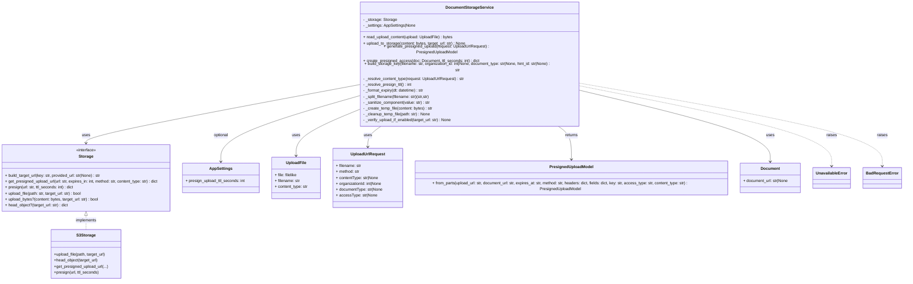

# Diagram: common/document_service/src/api/services/document_storage_service.py

> Auto-generated by Obscura crawlers

## Mermaid

### SVG

<svg id="container" width="3725.2265625" xmlns="http://www.w3.org/2000/svg" class="classDiagram" height="1088" viewBox="0 0 3725.2265625 1088" role="graphics-document document" aria-roledescription="class"><g><defs><marker id="container_class-aggregationStart" class="marker aggregation class" refX="18" refY="7" markerWidth="190" markerHeight="240" orient="auto"><path d="M 18,7 L9,13 L1,7 L9,1 Z"></path></marker></defs><defs><marker id="container_class-aggregationEnd" class="marker aggregation class" refX="1" refY="7" markerWidth="20" markerHeight="28" orient="auto"><path d="M 18,7 L9,13 L1,7 L9,1 Z"></path></marker></defs><defs><marker id="container_class-extensionStart" class="marker extension class" refX="18" refY="7" markerWidth="190" markerHeight="240" orient="auto"><path d="M 1,7 L18,13 V 1 Z"></path></marker></defs><defs><marker id="container_class-extensionEnd" class="marker extension class" refX="1" refY="7" markerWidth="20" markerHeight="28" orient="auto"><path d="M 1,1 V 13 L18,7 Z"></path></marker></defs><defs><marker id="container_class-compositionStart" class="marker composition class" refX="18" refY="7" markerWidth="190" markerHeight="240" orient="auto"><path d="M 18,7 L9,13 L1,7 L9,1 Z"></path></marker></defs><defs><marker id="container_class-compositionEnd" class="marker composition class" refX="1" refY="7" markerWidth="20" markerHeight="28" orient="auto"><path d="M 18,7 L9,13 L1,7 L9,1 Z"></path></marker></defs><defs><marker id="container_class-dependencyStart" class="marker dependency class" refX="6" refY="7" markerWidth="190" markerHeight="240" orient="auto"><path d="M 5,7 L9,13 L1,7 L9,1 Z"></path></marker></defs><defs><marker id="container_class-dependencyEnd" class="marker dependency class" refX="13" refY="7" markerWidth="20" markerHeight="28" orient="auto"><path d="M 18,7 L9,13 L14,7 L9,1 Z"></path></marker></defs><defs><marker id="container_class-lollipopStart" class="marker lollipop class" refX="13" refY="7" markerWidth="190" markerHeight="240" orient="auto"><circle stroke="black" fill="transparent" cx="7" cy="7" r="6"></circle></marker></defs><defs><marker id="container_class-lollipopEnd" class="marker lollipop class" refX="1" refY="7" markerWidth="190" markerHeight="240" orient="auto"><circle stroke="black" fill="transparent" cx="7" cy="7" r="6"></circle></marker></defs><g class="root"><g class="clusters"></g><g class="edgePaths"><path d="M1478.176,312.408L1291.102,343.84C1104.029,375.272,729.882,438.136,542.808,474.735C355.734,511.333,355.734,521.667,355.734,526.833L355.734,532" id="id_DocumentStorageService_Storage_1" class="edge-thickness-normal edge-pattern-solid relation" style=";;;" data-edge="true" data-et="edge" data-id="id_DocumentStorageService_Storage_1" data-points="W3sieCI6MTQ3OC4xNzU3ODEyNSwieSI6MzEyLjQwODExNTY1MjAwMzc0fSx7IngiOjM1NS43MzQzNzUsInkiOjUwMX0seyJ4IjozNTUuNzM0Mzc1LCJ5Ijo1Mzh9XQ==" marker-end="url(#container_class-dependencyEnd)"></path><path d="M1478.176,353.786L1383.446,378.321C1288.716,402.857,1099.257,451.929,1004.527,494.131C909.797,536.333,909.797,571.667,909.797,589.333L909.797,607" id="id_DocumentStorageService_AppSettings_2" class="edge-thickness-normal edge-pattern-solid relation" style=";;;" data-edge="true" data-et="edge" data-id="id_DocumentStorageService_AppSettings_2" data-points="W3sieCI6MTQ3OC4xNzU3ODEyNSwieSI6MzUzLjc4NTY0NjkyNjc2ODU1fSx7IngiOjkwOS43OTY4NzUsInkiOjUwMX0seyJ4Ijo5MDkuNzk2ODc1LCJ5Ijo2MTN9XQ==" marker-end="url(#container_class-dependencyEnd)"></path><path d="M1478.176,403.859L1434.314,420.049C1390.452,436.239,1302.728,468.62,1258.866,498.476C1215.004,528.333,1215.004,555.667,1215.004,569.333L1215.004,583" id="id_DocumentStorageService_UploadFile_3" class="edge-thickness-normal edge-pattern-solid relation" style=";;;" data-edge="true" data-et="edge" data-id="id_DocumentStorageService_UploadFile_3" data-points="W3sieCI6MTQ3OC4xNzU3ODEyNSwieSI6NDAzLjg1ODgwNjI0NjI1OTN9LHsieCI6MTIxNS4wMDM5MDYyNSwieSI6NTAxfSx7IngiOjEyMTUuMDAzOTA2MjUsInkiOjU4OX1d" marker-end="url(#container_class-dependencyEnd)"></path><path d="M1564.84,464L1554.884,470.167C1544.928,476.333,1525.017,488.667,1515.061,502.5C1505.105,516.333,1505.105,531.667,1505.105,539.333L1505.105,547" id="id_DocumentStorageService_UploadUrlRequest_4" class="edge-thickness-normal edge-pattern-solid relation" style=";;;" data-edge="true" data-et="edge" data-id="id_DocumentStorageService_UploadUrlRequest_4" data-points="W3sieCI6MTU2NC44Mzk5NjE2NzQ1MjgyLCJ5Ijo0NjR9LHsieCI6MTUwNS4xMDU0Njg3NSwieSI6NTAxfSx7IngiOjE1MDUuMTA1NDY4NzUsInkiOjU1M31d" marker-end="url(#container_class-dependencyEnd)"></path><path d="M2301.027,464L2310.983,470.167C2320.939,476.333,2340.85,488.667,2350.806,512C2360.762,535.333,2360.762,569.667,2360.762,586.833L2360.762,604" id="id_DocumentStorageService_PresignedUploadModel_5" class="edge-thickness-normal edge-pattern-solid relation" style=";;;" data-edge="true" data-et="edge" data-id="id_DocumentStorageService_PresignedUploadModel_5" data-points="W3sieCI6MjMwMS4wMjcyMjU4MjU0NzE4LCJ5Ijo0NjR9LHsieCI6MjM2MC43NjE3MTg3NSwieSI6NTAxfSx7IngiOjIzNjAuNzYxNzE4NzUsInkiOjYxMH1d" marker-end="url(#container_class-dependencyEnd)"></path><path d="M2387.691,331.198L2522.882,359.498C2658.073,387.798,2928.454,444.399,3063.645,490.366C3198.836,536.333,3198.836,571.667,3198.836,589.333L3198.836,607" id="id_DocumentStorageService_Document_6" class="edge-thickness-normal edge-pattern-solid relation" style=";;;" data-edge="true" data-et="edge" data-id="id_DocumentStorageService_Document_6" data-points="W3sieCI6MjM4Ny42OTE0MDYyNSwieSI6MzMxLjE5NzU2NDczMTE4NTV9LHsieCI6MzE5OC44MzU5Mzc1LCJ5Ijo1MDF9LHsieCI6MzE5OC44MzU5Mzc1LCJ5Ijo2MTN9XQ==" marker-end="url(#container_class-dependencyEnd)"></path><path d="M2387.691,315.669L2564.005,346.558C2740.318,377.446,3092.944,439.223,3269.257,490.778C3445.57,542.333,3445.57,583.667,3445.57,604.333L3445.57,625" id="id_DocumentStorageService_UnavailableError_7" class="edge-thickness-normal edge-pattern-dashed relation" style=";;;" data-edge="true" data-et="edge" data-id="id_DocumentStorageService_UnavailableError_7" data-points="W3sieCI6MjM4Ny42OTE0MDYyNSwieSI6MzE1LjY2OTM3Mzg5NDQwNTJ9LHsieCI6MzQ0NS41NzAzMTI1LCJ5Ijo1MDF9LHsieCI6MzQ0NS41NzAzMTI1LCJ5Ijo2MzF9XQ==" marker-end="url(#container_class-dependencyEnd)"></path><path d="M2387.691,306.474L2596.9,338.895C2806.109,371.316,3224.527,436.158,3433.736,489.246C3642.945,542.333,3642.945,583.667,3642.945,604.333L3642.945,625" id="id_DocumentStorageService_BadRequestError_8" class="edge-thickness-normal edge-pattern-dashed relation" style=";;;" data-edge="true" data-et="edge" data-id="id_DocumentStorageService_BadRequestError_8" data-points="W3sieCI6MjM4Ny42OTE0MDYyNSwieSI6MzA2LjQ3MzY4MDk2NDM1NzR9LHsieCI6MzY0Mi45NDUzMTI1LCJ5Ijo1MDF9LHsieCI6MzY0Mi45NDUzMTI1LCJ5Ijo2MzF9XQ==" marker-end="url(#container_class-dependencyEnd)"></path><path d="M355.734,825.25L355.734,828.542C355.734,831.833,355.734,838.417,355.734,847.875C355.734,857.333,355.734,869.667,355.734,875.833L355.734,882" id="id_Storage_S3Storage_9" class="edge-thickness-normal edge-pattern-dashed relation" style=";;;" data-edge="true" data-et="edge" data-id="id_Storage_S3Storage_9" data-points="W3sieCI6MzU1LjczNDM3NSwieSI6ODA4fSx7IngiOjM1NS43MzQzNzUsInkiOjg0NX0seyJ4IjozNTUuNzM0Mzc1LCJ5Ijo4ODJ9XQ==" marker-start="url(#container_class-extensionStart)"></path></g><g class="edgeLabels"><g class="edgeLabel" transform="translate(355.734375, 501)"><g class="label" data-id="id_DocumentStorageService_Storage_1" transform="translate(-16.4921875, -12)"><foreignObject width="32.984375" height="24">

uses

</foreignObject></g></g><g class="edgeLabel" transform="translate(909.796875, 501)"><g class="label" data-id="id_DocumentStorageService_AppSettings_2" transform="translate(-30.546875, -12)"><foreignObject width="61.09375" height="24">

optional

</foreignObject></g></g><g class="edgeLabel" transform="translate(1215.00390625, 501)"><g class="label" data-id="id_DocumentStorageService_UploadFile_3" transform="translate(-16.4921875, -12)"><foreignObject width="32.984375" height="24">

uses

</foreignObject></g></g><g class="edgeLabel" transform="translate(1505.10546875, 501)"><g class="label" data-id="id_DocumentStorageService_UploadUrlRequest_4" transform="translate(-16.4921875, -12)"><foreignObject width="32.984375" height="24">

uses

</foreignObject></g></g><g class="edgeLabel" transform="translate(2360.76171875, 501)"><g class="label" data-id="id_DocumentStorageService_PresignedUploadModel_5" transform="translate(-26.265625, -12)"><foreignObject width="52.53125" height="24">

returns

</foreignObject></g></g><g class="edgeLabel" transform="translate(3198.8359375, 501)"><g class="label" data-id="id_DocumentStorageService_Document_6" transform="translate(-16.4921875, -12)"><foreignObject width="32.984375" height="24">

uses

</foreignObject></g></g><g class="edgeLabel" transform="translate(3445.5703125, 501)"><g class="label" data-id="id_DocumentStorageService_UnavailableError_7" transform="translate(-21.25, -12)"><foreignObject width="42.5" height="24">

raises

</foreignObject></g></g><g class="edgeLabel" transform="translate(3642.9453125, 501)"><g class="label" data-id="id_DocumentStorageService_BadRequestError_8" transform="translate(-21.25, -12)"><foreignObject width="42.5" height="24">

raises

</foreignObject></g></g><g class="edgeLabel" transform="translate(355.734375, 845)"><g class="label" data-id="id_Storage_S3Storage_9" transform="translate(-43.0625, -12)"><foreignObject width="86.125" height="24">

implements

</foreignObject></g></g></g><g class="nodes"><g class="node default" id="classId-DocumentStorageService-0" transform="translate(1932.93359375, 236)"><g class="basic label-container"><path d="M-454.7578125 -228 L454.7578125 -228 L454.7578125 228 L-454.7578125 228" stroke="none" stroke-width="0" fill="#ECECFF" style=""></path><path d="M-454.7578125 -228 C-174.55843201441297 -228, 105.64094847117406 -228, 454.7578125 -228 M-454.7578125 -228 C-106.05724472659108 -228, 242.64332304681784 -228, 454.7578125 -228 M454.7578125 -228 C454.7578125 -49.3326872613207, 454.7578125 129.3346254773586, 454.7578125 228 M454.7578125 -228 C454.7578125 -118.22481218159953, 454.7578125 -8.449624363199064, 454.7578125 228 M454.7578125 228 C195.22532402871167 228, -64.30716444257666 228, -454.7578125 228 M454.7578125 228 C137.13211699933845 228, -180.4935785013231 228, -454.7578125 228 M-454.7578125 228 C-454.7578125 70.17517685234208, -454.7578125 -87.64964629531585, -454.7578125 -228 M-454.7578125 228 C-454.7578125 101.92655838232582, -454.7578125 -24.146883235348355, -454.7578125 -228" stroke="#9370DB" stroke-width="1.3" fill="none" stroke-dasharray="0 0" style=""></path></g><g class="annotation-group text" transform="translate(0, -204)"></g><g class="label-group text" transform="translate(-91.8125, -204)"><g class="label" style="font-weight: bolder" transform="translate(0,-12)"><foreignObject width="183.625" height="24">

DocumentStorageService

</foreignObject></g></g><g class="members-group text" transform="translate(-442.7578125, -156)"><g class="label" style="" transform="translate(0,-12)"><foreignObject width="134.9375" height="24">

- _storage: Storage

</foreignObject></g><g class="label" style="" transform="translate(0,12)"><foreignObject width="215.953125" height="24">

- _settings: AppSettings|None

</foreignObject></g></g><g class="methods-group text" transform="translate(-442.7578125, -84)"><g class="label" style="" transform="translate(0,-12)"><foreignObject width="365.078125" height="24">

+ read_upload_content(upload: UploadFile) : bytes

</foreignObject></g><g class="label" style="" transform="translate(0,12)"><foreignObject width="417.765625" height="24">

+ upload_to_storage(content: bytes, target_url: str) : None

</foreignObject></g><g class="label" style="" transform="translate(0,36)"><foreignObject width="601.46875" height="24">

+ generate_presigned_upload(request: UploadUrlRequest) : PresignedUploadModel

</foreignObject></g><g class="label" style="" transform="translate(0,60)"><foreignObject width="470.34375" height="24">

+ create_presigned_access(doc: Document, ttl_seconds: int) : dict

</foreignObject></g><g class="label" style="" transform="translate(0,84)"><foreignObject width="793.703125" height="24">

+ build_storage_key(filename: str, organization_id: int|None, document_type: str|None, hint_id: str|None) : str

</foreignObject></g><g class="label" style="" transform="translate(0,108)"><foreignObject width="412.375" height="24">

- _resolve_content_type(request: UploadUrlRequest) : str

</foreignObject></g><g class="label" style="" transform="translate(0,132)"><foreignObject width="199.34375" height="24">

- _resolve_presign_ttl() : int

</foreignObject></g><g class="label" style="" transform="translate(0,156)"><foreignObject width="250.859375" height="24">

- _format_expiry(dt: datetime) : str

</foreignObject></g><g class="label" style="" transform="translate(0,180)"><foreignObject width="274.765625" height="24">

- _split_filename(filename: str)(str,str)

</foreignObject></g><g class="label" style="" transform="translate(0,204)"><foreignObject width="273.46875" height="24">

- _sanitize_component(value: str) : str

</foreignObject></g><g class="label" style="" transform="translate(0,228)"><foreignObject width="283.671875" height="24">

- _create_temp_file(content: bytes) : str

</foreignObject></g><g class="label" style="" transform="translate(0,252)"><foreignObject width="273.53125" height="24">

- _cleanup_temp_file(path: str) : None

</foreignObject></g><g class="label" style="" transform="translate(0,276)"><foreignObject width="362.0625" height="24">

- _verify_upload_if_enabled(target_url: str) : None

</foreignObject></g></g><g class="divider" style=""><path d="M-454.7578125 -180 C-209.08581009313374 -180, 36.58619231373251 -180, 454.7578125 -180 M-454.7578125 -180 C-234.02626059805928 -180, -13.294708696118562 -180, 454.7578125 -180" stroke="#9370DB" stroke-width="1.3" fill="none" stroke-dasharray="0 0" style=""></path></g><g class="divider" style=""><path d="M-454.7578125 -108 C-238.52862909406065 -108, -22.299445688121295 -108, 454.7578125 -108 M-454.7578125 -108 C-181.26580860528793 -108, 92.22619528942414 -108, 454.7578125 -108" stroke="#9370DB" stroke-width="1.3" fill="none" stroke-dasharray="0 0" style=""></path></g></g><g class="node default" id="classId-Storage-1" transform="translate(355.734375, 673)"><g class="basic label-container"><path d="M-347.734375 -135 L347.734375 -135 L347.734375 135 L-347.734375 135" stroke="none" stroke-width="0" fill="#ECECFF" style=""></path><path d="M-347.734375 -135 C-157.68999538206103 -135, 32.354384235877944 -135, 347.734375 -135 M-347.734375 -135 C-203.1585813791418 -135, -58.58278775828359 -135, 347.734375 -135 M347.734375 -135 C347.734375 -70.69276102991739, 347.734375 -6.385522059834784, 347.734375 135 M347.734375 -135 C347.734375 -71.62183486852994, 347.734375 -8.24366973705989, 347.734375 135 M347.734375 135 C184.11278118873645 135, 20.491187377472897 135, -347.734375 135 M347.734375 135 C184.4153392334149 135, 21.096303466829795 135, -347.734375 135 M-347.734375 135 C-347.734375 64.10391129012137, -347.734375 -6.792177419757252, -347.734375 -135 M-347.734375 135 C-347.734375 48.36260810966155, -347.734375 -38.2747837806769, -347.734375 -135" stroke="#9370DB" stroke-width="1.3" fill="none" stroke-dasharray="0 0" style=""></path></g><g class="annotation-group text" transform="translate(-41.015625, -111)"><g class="label" style="" transform="translate(0,-12)"><foreignObject width="82.03125" height="24">

«interface»

</foreignObject></g></g><g class="label-group text" transform="translate(-28.078125, -87)"><g class="label" style="font-weight: bolder" transform="translate(0,-12)"><foreignObject width="56.15625" height="24">

Storage

</foreignObject></g></g><g class="members-group text" transform="translate(-335.734375, -39)"></g><g class="methods-group text" transform="translate(-335.734375, -9)"><g class="label" style="" transform="translate(0,-12)"><foreignObject width="395.203125" height="24">

+ build_target_url(key: str, provided_url: str|None) : str

</foreignObject></g><g class="label" style="" transform="translate(0,12)"><foreignObject width="630.453125" height="24">

+ get_presigned_upload_url(url: str, expires_in: int, method: str, content_type: str) : dict

</foreignObject></g><g class="label" style="" transform="translate(0,36)"><foreignObject width="282.09375" height="24">

+ presign(url: str, ttl_seconds: int) : dict

</foreignObject></g><g class="label" style="" transform="translate(0,60)"><foreignObject width="315.421875" height="24">

+ upload_file(path: str, target_url: str) : bool

</foreignObject></g><g class="label" style="" transform="translate(0,84)"><foreignObject width="382.328125" height="24">

+ upload_bytes?(content: bytes, target_url: str) : bool

</foreignObject></g><g class="label" style="" transform="translate(0,108)"><foreignObject width="257.671875" height="24">

+ head_object?(target_url: str) : dict

</foreignObject></g></g><g class="divider" style=""><path d="M-347.734375 -63 C-190.10485975104768 -63, -32.47534450209537 -63, 347.734375 -63 M-347.734375 -63 C-146.79835801207406 -63, 54.13765897585188 -63, 347.734375 -63" stroke="#9370DB" stroke-width="1.3" fill="none" stroke-dasharray="0 0" style=""></path></g><g class="divider" style=""><path d="M-347.734375 -39 C-152.37136041129887 -39, 42.99165417740227 -39, 347.734375 -39 M-347.734375 -39 C-106.70472733814049 -39, 134.32492032371903 -39, 347.734375 -39" stroke="#9370DB" stroke-width="1.3" fill="none" stroke-dasharray="0 0" style=""></path></g></g><g class="node default" id="classId-AppSettings-2" transform="translate(909.796875, 673)"><g class="basic label-container"><path d="M-156.328125 -60 L156.328125 -60 L156.328125 60 L-156.328125 60" stroke="none" stroke-width="0" fill="#ECECFF" style=""></path><path d="M-156.328125 -60 C-85.98030287074187 -60, -15.632480741483732 -60, 156.328125 -60 M-156.328125 -60 C-39.24325121108633 -60, 77.84162257782734 -60, 156.328125 -60 M156.328125 -60 C156.328125 -25.534623392018993, 156.328125 8.930753215962014, 156.328125 60 M156.328125 -60 C156.328125 -25.881386216134075, 156.328125 8.23722756773185, 156.328125 60 M156.328125 60 C49.98164190886345 60, -56.364841182273096 60, -156.328125 60 M156.328125 60 C37.821522135000095 60, -80.68508072999981 60, -156.328125 60 M-156.328125 60 C-156.328125 32.8165339730818, -156.328125 5.6330679461635995, -156.328125 -60 M-156.328125 60 C-156.328125 13.46683271930997, -156.328125 -33.06633456138006, -156.328125 -60" stroke="#9370DB" stroke-width="1.3" fill="none" stroke-dasharray="0 0" style=""></path></g><g class="annotation-group text" transform="translate(0, -36)"></g><g class="label-group text" transform="translate(-44.515625, -36)"><g class="label" style="font-weight: bolder" transform="translate(0,-12)"><foreignObject width="89.03125" height="24">

AppSettings

</foreignObject></g></g><g class="members-group text" transform="translate(-144.328125, 12)"><g class="label" style="" transform="translate(0,-12)"><foreignObject width="244.140625" height="24">

+ presign_upload_ttl_seconds: int

</foreignObject></g></g><g class="methods-group text" transform="translate(-144.328125, 60)"></g><g class="divider" style=""><path d="M-156.328125 -12 C-70.13161984953939 -12, 16.06488530092122 -12, 156.328125 -12 M-156.328125 -12 C-75.08787577358017 -12, 6.152373452839669 -12, 156.328125 -12" stroke="#9370DB" stroke-width="1.3" fill="none" stroke-dasharray="0 0" style=""></path></g><g class="divider" style=""><path d="M-156.328125 36 C-49.12527710515613 36, 58.07757078968774 36, 156.328125 36 M-156.328125 36 C-60.70417740388939 36, 34.91977019222122 36, 156.328125 36" stroke="#9370DB" stroke-width="1.3" fill="none" stroke-dasharray="0 0" style=""></path></g></g><g class="node default" id="classId-UploadFile-3" transform="translate(1215.00390625, 673)"><g class="basic label-container"><path d="M-98.87890625 -84 L98.87890625 -84 L98.87890625 84 L-98.87890625 84" stroke="none" stroke-width="0" fill="#ECECFF" style=""></path><path d="M-98.87890625 -84 C-27.815708877134398 -84, 43.247488495731204 -84, 98.87890625 -84 M-98.87890625 -84 C-43.249536332075614 -84, 12.379833585848772 -84, 98.87890625 -84 M98.87890625 -84 C98.87890625 -48.73548134656164, 98.87890625 -13.470962693123283, 98.87890625 84 M98.87890625 -84 C98.87890625 -47.60833047784283, 98.87890625 -11.216660955685654, 98.87890625 84 M98.87890625 84 C47.290391832217814 84, -4.298122585564371 84, -98.87890625 84 M98.87890625 84 C34.319188210629875 84, -30.24052982874025 84, -98.87890625 84 M-98.87890625 84 C-98.87890625 20.352705937275545, -98.87890625 -43.29458812544891, -98.87890625 -84 M-98.87890625 84 C-98.87890625 35.22348540332114, -98.87890625 -13.553029193357716, -98.87890625 -84" stroke="#9370DB" stroke-width="1.3" fill="none" stroke-dasharray="0 0" style=""></path></g><g class="annotation-group text" transform="translate(0, -60)"></g><g class="label-group text" transform="translate(-38.7734375, -60)"><g class="label" style="font-weight: bolder" transform="translate(0,-12)"><foreignObject width="77.546875" height="24">

UploadFile

</foreignObject></g></g><g class="members-group text" transform="translate(-86.87890625, -12)"><g class="label" style="" transform="translate(0,-12)"><foreignObject width="91.34375" height="24">

+ file: filelike

</foreignObject></g><g class="label" style="" transform="translate(0,12)"><foreignObject width="102.78125" height="24">

+ filename: str

</foreignObject></g><g class="label" style="" transform="translate(0,36)"><foreignObject width="134.984375" height="24">

+ content_type: str

</foreignObject></g></g><g class="methods-group text" transform="translate(-86.87890625, 84)"></g><g class="divider" style=""><path d="M-98.87890625 -36 C-48.20192224534727 -36, 2.4750617593054614 -36, 98.87890625 -36 M-98.87890625 -36 C-32.32915620391714 -36, 34.22059384216573 -36, 98.87890625 -36" stroke="#9370DB" stroke-width="1.3" fill="none" stroke-dasharray="0 0" style=""></path></g><g class="divider" style=""><path d="M-98.87890625 60 C-51.47878825430499 60, -4.078670258609975 60, 98.87890625 60 M-98.87890625 60 C-27.742634204573946 60, 43.39363784085211 60, 98.87890625 60" stroke="#9370DB" stroke-width="1.3" fill="none" stroke-dasharray="0 0" style=""></path></g></g><g class="node default" id="classId-UploadUrlRequest-4" transform="translate(1505.10546875, 673)"><g class="basic label-container"><path d="M-141.22265625 -120 L141.22265625 -120 L141.22265625 120 L-141.22265625 120" stroke="none" stroke-width="0" fill="#ECECFF" style=""></path><path d="M-141.22265625 -120 C-43.96075002486327 -120, 53.301156200273454 -120, 141.22265625 -120 M-141.22265625 -120 C-31.448629398968222 -120, 78.32539745206356 -120, 141.22265625 -120 M141.22265625 -120 C141.22265625 -52.36756258450315, 141.22265625 15.264874830993705, 141.22265625 120 M141.22265625 -120 C141.22265625 -61.36544950069514, 141.22265625 -2.7308990013902843, 141.22265625 120 M141.22265625 120 C56.97376811807375 120, -27.2751200138525 120, -141.22265625 120 M141.22265625 120 C39.55122704457274 120, -62.12020216085452 120, -141.22265625 120 M-141.22265625 120 C-141.22265625 24.0382024676328, -141.22265625 -71.9235950647344, -141.22265625 -120 M-141.22265625 120 C-141.22265625 59.49578375687116, -141.22265625 -1.008432486257675, -141.22265625 -120" stroke="#9370DB" stroke-width="1.3" fill="none" stroke-dasharray="0 0" style=""></path></g><g class="annotation-group text" transform="translate(0, -96)"></g><g class="label-group text" transform="translate(-66.8671875, -96)"><g class="label" style="font-weight: bolder" transform="translate(0,-12)"><foreignObject width="133.734375" height="24">

UploadUrlRequest

</foreignObject></g></g><g class="members-group text" transform="translate(-129.22265625, -48)"><g class="label" style="" transform="translate(0,-12)"><foreignObject width="102.78125" height="24">

+ filename: str

</foreignObject></g><g class="label" style="" transform="translate(0,12)"><foreignObject width="96.234375" height="24">

+ method: str

</foreignObject></g><g class="label" style="" transform="translate(0,36)"><foreignObject width="173.734375" height="24">

+ contentType: str|None

</foreignObject></g><g class="label" style="" transform="translate(0,60)"><foreignObject width="189.4375" height="24">

+ organizationId: int|None

</foreignObject></g><g class="label" style="" transform="translate(0,84)"><foreignObject width="191.578125" height="24">

+ documentType: str|None

</foreignObject></g><g class="label" style="" transform="translate(0,108)"><foreignObject width="165.140625" height="24">

+ accessType: str|None

</foreignObject></g></g><g class="methods-group text" transform="translate(-129.22265625, 120)"></g><g class="divider" style=""><path d="M-141.22265625 -72 C-78.47977057163672 -72, -15.73688489327344 -72, 141.22265625 -72 M-141.22265625 -72 C-32.183926618194945 -72, 76.85480301361011 -72, 141.22265625 -72" stroke="#9370DB" stroke-width="1.3" fill="none" stroke-dasharray="0 0" style=""></path></g><g class="divider" style=""><path d="M-141.22265625 96 C-58.579244830253344 96, 24.06416658949331 96, 141.22265625 96 M-141.22265625 96 C-83.36525687579245 96, -25.507857501584894 96, 141.22265625 96" stroke="#9370DB" stroke-width="1.3" fill="none" stroke-dasharray="0 0" style=""></path></g></g><g class="node default" id="classId-PresignedUploadModel-5" transform="translate(2360.76171875, 673)"><g class="basic label-container"><path d="M-664.43359375 -63 L664.43359375 -63 L664.43359375 63 L-664.43359375 63" stroke="none" stroke-width="0" fill="#ECECFF" style=""></path><path d="M-664.43359375 -63 C-183.82042200417072 -63, 296.79274974165855 -63, 664.43359375 -63 M-664.43359375 -63 C-356.8440065222746 -63, -49.254419294549166 -63, 664.43359375 -63 M664.43359375 -63 C664.43359375 -28.134900599216323, 664.43359375 6.730198801567354, 664.43359375 63 M664.43359375 -63 C664.43359375 -29.615820650086825, 664.43359375 3.7683586998263507, 664.43359375 63 M664.43359375 63 C242.86010381182098 63, -178.71338612635805 63, -664.43359375 63 M664.43359375 63 C167.88175553534757 63, -328.67008267930487 63, -664.43359375 63 M-664.43359375 63 C-664.43359375 25.443564605665912, -664.43359375 -12.112870788668175, -664.43359375 -63 M-664.43359375 63 C-664.43359375 25.662633773745682, -664.43359375 -11.674732452508636, -664.43359375 -63" stroke="#9370DB" stroke-width="1.3" fill="none" stroke-dasharray="0 0" style=""></path></g><g class="annotation-group text" transform="translate(0, -39)"></g><g class="label-group text" transform="translate(-85.0390625, -39)"><g class="label" style="font-weight: bolder" transform="translate(0,-12)"><foreignObject width="170.078125" height="24">

PresignedUploadModel

</foreignObject></g></g><g class="members-group text" transform="translate(-652.43359375, 9)"></g><g class="methods-group text" transform="translate(-652.43359375, 39)"><g class="label" style="" transform="translate(0,-12)"><foreignObject width="1219.828125" height="24">

+ from_parts(upload_url: str, document_url: str, expires_at: str, method: str, headers: dict, fields: dict, key: str, access_type: str, content_type: str) : PresignedUploadModel

</foreignObject></g></g><g class="divider" style=""><path d="M-664.43359375 -15 C-214.96129486495516 -15, 234.51100402008967 -15, 664.43359375 -15 M-664.43359375 -15 C-277.8012531907334 -15, 108.83108736853319 -15, 664.43359375 -15" stroke="#9370DB" stroke-width="1.3" fill="none" stroke-dasharray="0 0" style=""></path></g><g class="divider" style=""><path d="M-664.43359375 9 C-206.64415782477244 9, 251.14527810045513 9, 664.43359375 9 M-664.43359375 9 C-250.00546236932 9, 164.42266901135997 9, 664.43359375 9" stroke="#9370DB" stroke-width="1.3" fill="none" stroke-dasharray="0 0" style=""></path></g></g><g class="node default" id="classId-Document-6" transform="translate(3198.8359375, 673)"><g class="basic label-container"><path d="M-123.640625 -60 L123.640625 -60 L123.640625 60 L-123.640625 60" stroke="none" stroke-width="0" fill="#ECECFF" style=""></path><path d="M-123.640625 -60 C-56.842931833371495 -60, 9.95476133325701 -60, 123.640625 -60 M-123.640625 -60 C-65.67126151248561 -60, -7.701898024971243 -60, 123.640625 -60 M123.640625 -60 C123.640625 -27.4782308763835, 123.640625 5.043538247233002, 123.640625 60 M123.640625 -60 C123.640625 -12.11627648573608, 123.640625 35.76744702852784, 123.640625 60 M123.640625 60 C30.119033036837138 60, -63.402558926325725 60, -123.640625 60 M123.640625 60 C56.57051370903294 60, -10.499597581934125 60, -123.640625 60 M-123.640625 60 C-123.640625 22.967534419120042, -123.640625 -14.064931161759915, -123.640625 -60 M-123.640625 60 C-123.640625 24.612430858396444, -123.640625 -10.775138283207113, -123.640625 -60" stroke="#9370DB" stroke-width="1.3" fill="none" stroke-dasharray="0 0" style=""></path></g><g class="annotation-group text" transform="translate(0, -36)"></g><g class="label-group text" transform="translate(-37.09375, -36)"><g class="label" style="font-weight: bolder" transform="translate(0,-12)"><foreignObject width="74.1875" height="24">

Document

</foreignObject></g></g><g class="members-group text" transform="translate(-111.640625, 12)"><g class="label" style="" transform="translate(0,-12)"><foreignObject width="186.1875" height="24">

+ document_url: str|None

</foreignObject></g></g><g class="methods-group text" transform="translate(-111.640625, 60)"></g><g class="divider" style=""><path d="M-123.640625 -12 C-48.221036935134904 -12, 27.19855112973019 -12, 123.640625 -12 M-123.640625 -12 C-33.74064396860378 -12, 56.159337062792446 -12, 123.640625 -12" stroke="#9370DB" stroke-width="1.3" fill="none" stroke-dasharray="0 0" style=""></path></g><g class="divider" style=""><path d="M-123.640625 36 C-55.640567097517206 36, 12.359490804965588 36, 123.640625 36 M-123.640625 36 C-32.40605376497804 36, 58.82851747004392 36, 123.640625 36" stroke="#9370DB" stroke-width="1.3" fill="none" stroke-dasharray="0 0" style=""></path></g></g><g class="node default" id="classId-UnavailableError-7" transform="translate(3445.5703125, 673)"><g class="basic label-container"><path d="M-73.09375 -42 L73.09375 -42 L73.09375 42 L-73.09375 42" stroke="none" stroke-width="0" fill="#ECECFF" style=""></path><path d="M-73.09375 -42 C-29.63903782764362 -42, 13.815674344712761 -42, 73.09375 -42 M-73.09375 -42 C-18.74063770843101 -42, 35.61247458313798 -42, 73.09375 -42 M73.09375 -42 C73.09375 -9.633634047118228, 73.09375 22.732731905763544, 73.09375 42 M73.09375 -42 C73.09375 -15.805584724392787, 73.09375 10.388830551214426, 73.09375 42 M73.09375 42 C40.7781027180521 42, 8.462455436104193 42, -73.09375 42 M73.09375 42 C19.60335698855969 42, -33.88703602288062 42, -73.09375 42 M-73.09375 42 C-73.09375 11.95263357891378, -73.09375 -18.09473284217244, -73.09375 -42 M-73.09375 42 C-73.09375 18.58239030698721, -73.09375 -4.835219386025578, -73.09375 -42" stroke="#9370DB" stroke-width="1.3" fill="none" stroke-dasharray="0 0" style=""></path></g><g class="annotation-group text" transform="translate(0, -18)"></g><g class="label-group text" transform="translate(-61.09375, -18)"><g class="label" style="font-weight: bolder" transform="translate(0,-12)"><foreignObject width="122.1875" height="24">

UnavailableError

</foreignObject></g></g><g class="members-group text" transform="translate(-61.09375, 30)"></g><g class="methods-group text" transform="translate(-61.09375, 60)"></g><g class="divider" style=""><path d="M-73.09375 6 C-32.74234933670772 6, 7.609051326584563 6, 73.09375 6 M-73.09375 6 C-35.559701797105234 6, 1.9743464057895324 6, 73.09375 6" stroke="#9370DB" stroke-width="1.3" fill="none" stroke-dasharray="0 0" style=""></path></g><g class="divider" style=""><path d="M-73.09375 24 C-16.219270206051746 24, 40.65520958789651 24, 73.09375 24 M-73.09375 24 C-39.45519115452616 24, -5.8166323090523235 24, 73.09375 24" stroke="#9370DB" stroke-width="1.3" fill="none" stroke-dasharray="0 0" style=""></path></g></g><g class="node default" id="classId-BadRequestError-8" transform="translate(3642.9453125, 673)"><g class="basic label-container"><path d="M-74.28125 -42 L74.28125 -42 L74.28125 42 L-74.28125 42" stroke="none" stroke-width="0" fill="#ECECFF" style=""></path><path d="M-74.28125 -42 C-33.10391421051966 -42, 8.073421578960676 -42, 74.28125 -42 M-74.28125 -42 C-20.957616757853287 -42, 32.366016484293425 -42, 74.28125 -42 M74.28125 -42 C74.28125 -20.54043482233057, 74.28125 0.9191303553388579, 74.28125 42 M74.28125 -42 C74.28125 -14.92131315045578, 74.28125 12.157373699088438, 74.28125 42 M74.28125 42 C37.03219335177183 42, -0.21686329645633862 42, -74.28125 42 M74.28125 42 C39.861112981627954 42, 5.440975963255909 42, -74.28125 42 M-74.28125 42 C-74.28125 14.25692993519258, -74.28125 -13.486140129614839, -74.28125 -42 M-74.28125 42 C-74.28125 16.205496158478304, -74.28125 -9.589007683043391, -74.28125 -42" stroke="#9370DB" stroke-width="1.3" fill="none" stroke-dasharray="0 0" style=""></path></g><g class="annotation-group text" transform="translate(0, -18)"></g><g class="label-group text" transform="translate(-62.28125, -18)"><g class="label" style="font-weight: bolder" transform="translate(0,-12)"><foreignObject width="124.5625" height="24">

BadRequestError

</foreignObject></g></g><g class="members-group text" transform="translate(-62.28125, 30)"></g><g class="methods-group text" transform="translate(-62.28125, 60)"></g><g class="divider" style=""><path d="M-74.28125 6 C-18.267121556150997 6, 37.74700688769801 6, 74.28125 6 M-74.28125 6 C-18.675179870428394 6, 36.93089025914321 6, 74.28125 6" stroke="#9370DB" stroke-width="1.3" fill="none" stroke-dasharray="0 0" style=""></path></g><g class="divider" style=""><path d="M-74.28125 24 C-24.962546186047696 24, 24.356157627904608 24, 74.28125 24 M-74.28125 24 C-38.00037070807169 24, -1.7194914161433843 24, 74.28125 24" stroke="#9370DB" stroke-width="1.3" fill="none" stroke-dasharray="0 0" style=""></path></g></g><g class="node default" id="classId-S3Storage-9" transform="translate(355.734375, 981)"><g class="basic label-container"><path d="M-140.2578125 -99 L140.2578125 -99 L140.2578125 99 L-140.2578125 99" stroke="none" stroke-width="0" fill="#ECECFF" style=""></path><path d="M-140.2578125 -99 C-28.551194374570287 -99, 83.15542375085943 -99, 140.2578125 -99 M-140.2578125 -99 C-53.221297612588856 -99, 33.81521727482229 -99, 140.2578125 -99 M140.2578125 -99 C140.2578125 -57.77910858120369, 140.2578125 -16.558217162407374, 140.2578125 99 M140.2578125 -99 C140.2578125 -56.82883069234189, 140.2578125 -14.657661384683777, 140.2578125 99 M140.2578125 99 C29.480378192915666 99, -81.29705611416867 99, -140.2578125 99 M140.2578125 99 C41.89509049732928 99, -56.467631505341444 99, -140.2578125 99 M-140.2578125 99 C-140.2578125 37.164764672192824, -140.2578125 -24.670470655614352, -140.2578125 -99 M-140.2578125 99 C-140.2578125 47.11427086369582, -140.2578125 -4.771458272608356, -140.2578125 -99" stroke="#9370DB" stroke-width="1.3" fill="none" stroke-dasharray="0 0" style=""></path></g><g class="annotation-group text" transform="translate(0, -75)"></g><g class="label-group text" transform="translate(-36.8125, -75)"><g class="label" style="font-weight: bolder" transform="translate(0,-12)"><foreignObject width="73.625" height="24">

S3Storage

</foreignObject></g></g><g class="members-group text" transform="translate(-128.2578125, -27)"></g><g class="methods-group text" transform="translate(-128.2578125, 3)"><g class="label" style="" transform="translate(0,-12)"><foreignObject width="212.09375" height="24">

+upload_file(path, target_url)

</foreignObject></g><g class="label" style="" transform="translate(0,12)"><foreignObject width="179.078125" height="24">

+head_object(target_url)

</foreignObject></g><g class="label" style="" transform="translate(0,36)"><foreignObject width="219.703125" height="24">

+get_presigned_upload_url(...)

</foreignObject></g><g class="label" style="" transform="translate(0,60)"><foreignObject width="183.953125" height="24">

+presign(url, ttl_seconds)

</foreignObject></g></g><g class="divider" style=""><path d="M-140.2578125 -51 C-45.802925379030114 -51, 48.65196174193977 -51, 140.2578125 -51 M-140.2578125 -51 C-40.11593564771802 -51, 60.02594120456396 -51, 140.2578125 -51" stroke="#9370DB" stroke-width="1.3" fill="none" stroke-dasharray="0 0" style=""></path></g><g class="divider" style=""><path d="M-140.2578125 -27 C-31.365755260475552 -27, 77.5263019790489 -27, 140.2578125 -27 M-140.2578125 -27 C-35.67774455678888 -27, 68.90232338642224 -27, 140.2578125 -27" stroke="#9370DB" stroke-width="1.3" fill="none" stroke-dasharray="0 0" style=""></path></g></g></g></g></g></svg>
