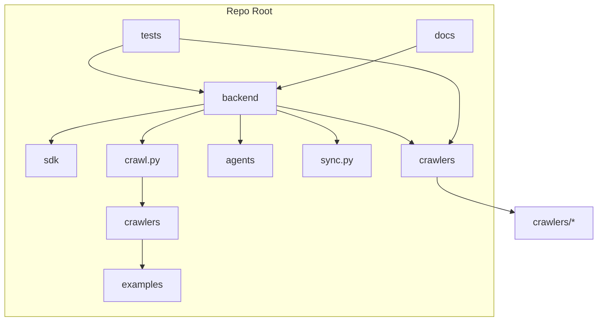

# Diagram: common/document_service/src/api/tests/__init__.py

> Auto-generated by Obscura crawlers

## Mermaid

### SVG

<svg id="container" width="1002.4375" xmlns="http://www.w3.org/2000/svg" class="flowchart" height="536" viewBox="0 0 1002.4375 536" role="graphics-document document" aria-roledescription="flowchart-v2"><g><marker id="container_flowchart-v2-pointEnd" class="marker flowchart-v2" viewBox="0 0 10 10" refX="5" refY="5" markerUnits="userSpaceOnUse" markerWidth="8" markerHeight="8" orient="auto"><path d="M 0 0 L 10 5 L 0 10 z" class="arrowMarkerPath" style="stroke-width: 1; stroke-dasharray: 1, 0;"></path></marker><marker id="container_flowchart-v2-pointStart" class="marker flowchart-v2" viewBox="0 0 10 10" refX="4.5" refY="5" markerUnits="userSpaceOnUse" markerWidth="8" markerHeight="8" orient="auto"><path d="M 0 5 L 10 10 L 10 0 z" class="arrowMarkerPath" style="stroke-width: 1; stroke-dasharray: 1, 0;"></path></marker><marker id="container_flowchart-v2-circleEnd" class="marker flowchart-v2" viewBox="0 0 10 10" refX="11" refY="5" markerUnits="userSpaceOnUse" markerWidth="11" markerHeight="11" orient="auto"><circle cx="5" cy="5" r="5" class="arrowMarkerPath" style="stroke-width: 1; stroke-dasharray: 1, 0;"></circle></marker><marker id="container_flowchart-v2-circleStart" class="marker flowchart-v2" viewBox="0 0 10 10" refX="-1" refY="5" markerUnits="userSpaceOnUse" markerWidth="11" markerHeight="11" orient="auto"><circle cx="5" cy="5" r="5" class="arrowMarkerPath" style="stroke-width: 1; stroke-dasharray: 1, 0;"></circle></marker><marker id="container_flowchart-v2-crossEnd" class="marker cross flowchart-v2" viewBox="0 0 11 11" refX="12" refY="5.2" markerUnits="userSpaceOnUse" markerWidth="11" markerHeight="11" orient="auto"><path d="M 1,1 l 9,9 M 10,1 l -9,9" class="arrowMarkerPath" style="stroke-width: 2; stroke-dasharray: 1, 0;"></path></marker><marker id="container_flowchart-v2-crossStart" class="marker cross flowchart-v2" viewBox="0 0 11 11" refX="-1" refY="5.2" markerUnits="userSpaceOnUse" markerWidth="11" markerHeight="11" orient="auto"><path d="M 1,1 l 9,9 M 10,1 l -9,9" class="arrowMarkerPath" style="stroke-width: 2; stroke-dasharray: 1, 0;"></path></marker><g class="root"><g class="clusters"><g class="cluster" id="subGraph0" data-look="classic"><rect style="" x="8" y="8" width="815.984375" height="520"></rect><g class="cluster-label" transform="translate(378.4140625, 8)"><foreignObject width="75.15625" height="24">

Repo Root

</foreignObject></g></g></g><g class="edgePaths"><path d="M340.766,173.995L298.241,180.996C255.716,187.997,170.667,201.998,128.142,212.499C85.617,223,85.617,230,85.617,233.5L85.617,237" id="L_A_B_0" class="edge-thickness-normal edge-pattern-solid edge-thickness-normal edge-pattern-solid flowchart-link" style=";" data-edge="true" data-et="edge" data-id="L_A_B_0" data-points="W3sieCI6MzQwLjc2NTYyNSwieSI6MTczLjk5NDg1NTMwNTQ2NjI1fSx7IngiOjg1LjYxNzE4NzUsInkiOjIxNn0seyJ4Ijo4NS42MTcxODc1LCJ5IjoyNDF9XQ==" marker-end="url(#container_flowchart-v2-pointEnd)"></path><path d="M462.188,176.426L494.414,183.021C526.641,189.617,591.094,202.809,628.656,213.185C666.219,223.562,676.891,231.125,682.227,234.906L687.563,238.687" id="L_A_C_0" class="edge-thickness-normal edge-pattern-solid edge-thickness-normal edge-pattern-solid flowchart-link" style=";" data-edge="true" data-et="edge" data-id="L_A_C_0" data-points="W3sieCI6NDYyLjE4NzUsInkiOjE3Ni40MjU1NzExNjkzOTgyNH0seyJ4Ijo2NTUuNTQ2ODc1LCJ5IjoyMTZ9LHsieCI6NjkwLjgyNzA3MzMxNzMwNzcsInkiOjI0MX1d" marker-end="url(#container_flowchart-v2-pointEnd)"></path><path d="M728.93,295L728.93,299.167C728.93,303.333,728.93,311.667,749.961,321.363C770.992,331.059,813.054,342.118,834.085,347.647L855.116,353.176" id="L_C_D_0" class="edge-thickness-normal edge-pattern-solid edge-thickness-normal edge-pattern-solid flowchart-link" style=";" data-edge="true" data-et="edge" data-id="L_C_D_0" data-points="W3sieCI6NzI4LjkyOTY4NzUsInkiOjI5NX0seyJ4Ijo3MjguOTI5Njg3NSwieSI6MzIwfSx7IngiOjg1OC45ODQzNzUsInkiOjM1NC4xOTM1NTM0ODM5NjI3fV0=" marker-end="url(#container_flowchart-v2-pointEnd)"></path><path d="M401.477,191L401.477,195.167C401.477,199.333,401.477,207.667,401.477,215.333C401.477,223,401.477,230,401.477,233.5L401.477,237" id="L_A_E_0" class="edge-thickness-normal edge-pattern-solid edge-thickness-normal edge-pattern-solid flowchart-link" style=";" data-edge="true" data-et="edge" data-id="L_A_E_0" data-points="W3sieCI6NDAxLjQ3NjU2MjUsInkiOjE5MX0seyJ4Ijo0MDEuNDc2NTYyNSwieSI6MjE2fSx7IngiOjQwMS40NzY1NjI1LCJ5IjoyNDF9XQ==" marker-end="url(#container_flowchart-v2-pointEnd)"></path><path d="M462.188,183.647L478.85,189.039C495.513,194.431,528.839,205.216,545.501,214.108C562.164,223,562.164,230,562.164,233.5L562.164,237" id="L_A_F_0" class="edge-thickness-normal edge-pattern-solid edge-thickness-normal edge-pattern-solid flowchart-link" style=";" data-edge="true" data-et="edge" data-id="L_A_F_0" data-points="W3sieCI6NDYyLjE4NzUsInkiOjE4My42NDY2MzU1NTAzNjk1fSx7IngiOjU2Mi4xNjQwNjI1LCJ5IjoyMTZ9LHsieCI6NTYyLjE2NDA2MjUsInkiOjI0MX1d" marker-end="url(#container_flowchart-v2-pointEnd)"></path><path d="M340.766,183.296L323.616,188.746C306.466,194.197,272.167,205.099,255.017,214.049C237.867,223,237.867,230,237.867,233.5L237.867,237" id="L_A_G_0" class="edge-thickness-normal edge-pattern-solid edge-thickness-normal edge-pattern-solid flowchart-link" style=";" data-edge="true" data-et="edge" data-id="L_A_G_0" data-points="W3sieCI6MzQwLjc2NTYyNSwieSI6MTgzLjI5NTc2OTI2NzUwMDd9LHsieCI6MjM3Ljg2NzE4NzUsInkiOjIxNn0seyJ4IjoyMzcuODY3MTg3NSwieSI6MjQxfV0=" marker-end="url(#container_flowchart-v2-pointEnd)"></path><path d="M237.867,295L237.867,299.167C237.867,303.333,237.867,311.667,237.867,319.333C237.867,327,237.867,334,237.867,337.5L237.867,341" id="L_G_H_0" class="edge-thickness-normal edge-pattern-solid edge-thickness-normal edge-pattern-solid flowchart-link" style=";" data-edge="true" data-et="edge" data-id="L_G_H_0" data-points="W3sieCI6MjM3Ljg2NzE4NzUsInkiOjI5NX0seyJ4IjoyMzcuODY3MTg3NSwieSI6MzIwfSx7IngiOjIzNy44NjcxODc1LCJ5IjozNDV9XQ==" marker-end="url(#container_flowchart-v2-pointEnd)"></path><path d="M237.867,399L237.867,403.167C237.867,407.333,237.867,415.667,237.867,423.333C237.867,431,237.867,438,237.867,441.5L237.867,445" id="L_H_I_0" class="edge-thickness-normal edge-pattern-solid edge-thickness-normal edge-pattern-solid flowchart-link" style=";" data-edge="true" data-et="edge" data-id="L_H_I_0" data-points="W3sieCI6MjM3Ljg2NzE4NzUsInkiOjM5OX0seyJ4IjoyMzcuODY3MTg3NSwieSI6NDI0fSx7IngiOjIzNy44NjcxODc1LCJ5Ijo0NDl9XQ==" marker-end="url(#container_flowchart-v2-pointEnd)"></path><path d="M205.102,75.882L187.102,81.902C169.102,87.922,133.102,99.961,155.055,112.806C177.009,125.651,256.916,139.303,296.869,146.129L336.823,152.954" id="L_J_A_0" class="edge-thickness-normal edge-pattern-solid edge-thickness-normal edge-pattern-solid flowchart-link" style=";" data-edge="true" data-et="edge" data-id="L_J_A_0" data-points="W3sieCI6MjA1LjEwMTU2MjUsInkiOjc1Ljg4MjQyOTc4NDQ1NDZ9LHsieCI6OTcuMTAxNTYyNSwieSI6MTEyfSx7IngiOjM0MC43NjU2MjUsInkiOjE1My42MjgwMjg3NDc0MzMyNn1d" marker-end="url(#container_flowchart-v2-pointEnd)"></path><path d="M300.086,64.806L377.814,72.672C455.543,80.537,611,96.269,688.729,112.801C766.457,129.333,766.457,146.667,766.457,164C766.457,181.333,766.457,198.667,763.84,210.959C761.223,223.252,755.99,230.504,753.373,234.13L750.756,237.756" id="L_J_C_0" class="edge-thickness-normal edge-pattern-solid edge-thickness-normal edge-pattern-solid flowchart-link" style=";" data-edge="true" data-et="edge" data-id="L_J_C_0" data-points="W3sieCI6MzAwLjA4NTkzNzUsInkiOjY0LjgwNTkzNTQzMDkwNDA3fSx7IngiOjc2Ni40NTcwMzEyNSwieSI6MTEyfSx7IngiOjc2Ni40NTcwMzEyNSwieSI6MTY0fSx7IngiOjc2Ni40NTcwMzEyNSwieSI6MjE2fSx7IngiOjc0OC40MTUwMzkwNjI1LCJ5IjoyNDF9XQ==" marker-end="url(#container_flowchart-v2-pointEnd)"></path><path d="M694.938,76.789L678.501,82.658C662.065,88.526,629.193,100.263,591.045,111.926C552.898,123.589,509.475,135.177,487.764,140.972L466.052,146.766" id="L_K_A_0" class="edge-thickness-normal edge-pattern-solid edge-thickness-normal edge-pattern-solid flowchart-link" style=";" data-edge="true" data-et="edge" data-id="L_K_A_0" data-points="W3sieCI6Njk0LjkzNzUsInkiOjc2Ljc4OTQwMDI3ODk0MDA0fSx7IngiOjU5Ni4zMjAzMTI1LCJ5IjoxMTJ9LHsieCI6NDYyLjE4NzUsInkiOjE0Ny43OTc0MzM4NDEyMTg5Mn1d" marker-end="url(#container_flowchart-v2-pointEnd)"></path></g><g class="edgeLabels"><g class="edgeLabel"><g class="label" data-id="L_A_B_0" transform="translate(0, 0)"><foreignObject width="0" height="0">

</foreignObject></g></g><g class="edgeLabel"><g class="label" data-id="L_A_C_0" transform="translate(0, 0)"><foreignObject width="0" height="0">

</foreignObject></g></g><g class="edgeLabel"><g class="label" data-id="L_C_D_0" transform="translate(0, 0)"><foreignObject width="0" height="0">

</foreignObject></g></g><g class="edgeLabel"><g class="label" data-id="L_A_E_0" transform="translate(0, 0)"><foreignObject width="0" height="0">

</foreignObject></g></g><g class="edgeLabel"><g class="label" data-id="L_A_F_0" transform="translate(0, 0)"><foreignObject width="0" height="0">

</foreignObject></g></g><g class="edgeLabel"><g class="label" data-id="L_A_G_0" transform="translate(0, 0)"><foreignObject width="0" height="0">

</foreignObject></g></g><g class="edgeLabel"><g class="label" data-id="L_G_H_0" transform="translate(0, 0)"><foreignObject width="0" height="0">

</foreignObject></g></g><g class="edgeLabel"><g class="label" data-id="L_H_I_0" transform="translate(0, 0)"><foreignObject width="0" height="0">

</foreignObject></g></g><g class="edgeLabel"><g class="label" data-id="L_J_A_0" transform="translate(0, 0)"><foreignObject width="0" height="0">

</foreignObject></g></g><g class="edgeLabel"><g class="label" data-id="L_J_C_0" transform="translate(0, 0)"><foreignObject width="0" height="0">

</foreignObject></g></g><g class="edgeLabel"><g class="label" data-id="L_K_A_0" transform="translate(0, 0)"><foreignObject width="0" height="0">

</foreignObject></g></g></g><g class="nodes"><g class="node default" id="flowchart-A-0" transform="translate(401.4765625, 164)"><rect class="basic label-container" style="" x="-60.7109375" y="-27" width="121.421875" height="54"></rect><g class="label" style="" transform="translate(-30.7109375, -12)"><rect></rect><foreignObject width="61.421875" height="24">

backend

</foreignObject></g></g><g class="node default" id="flowchart-B-1" transform="translate(85.6171875, 268)"><rect class="basic label-container" style="" x="-42.6171875" y="-27" width="85.234375" height="54"></rect><g class="label" style="" transform="translate(-12.6171875, -12)"><rect></rect><foreignObject width="25.234375" height="24">

sdk

</foreignObject></g></g><g class="node default" id="flowchart-C-3" transform="translate(728.9296875, 268)"><rect class="basic label-container" style="" x="-60.0546875" y="-27" width="120.109375" height="54"></rect><g class="label" style="" transform="translate(-30.0546875, -12)"><rect></rect><foreignObject width="60.109375" height="24">

crawlers

</foreignObject></g></g><g class="node default" id="flowchart-D-5" transform="translate(926.7109375, 372)"><rect class="basic label-container" style="" x="-67.7265625" y="-27" width="135.453125" height="54"></rect><g class="label" style="" transform="translate(-37.7265625, -12)"><rect></rect><foreignObject width="75.453125" height="24">

crawlers/*

</foreignObject></g></g><g class="node default" id="flowchart-E-7" transform="translate(401.4765625, 268)"><rect class="basic label-container" style="" x="-53.9765625" y="-27" width="107.953125" height="54"></rect><g class="label" style="" transform="translate(-23.9765625, -12)"><rect></rect><foreignObject width="47.953125" height="24">

agents

</foreignObject></g></g><g class="node default" id="flowchart-F-9" transform="translate(562.1640625, 268)"><rect class="basic label-container" style="" x="-56.7109375" y="-27" width="113.421875" height="54"></rect><g class="label" style="" transform="translate(-26.7109375, -12)"><rect></rect><foreignObject width="53.421875" height="24">

sync.py

</foreignObject></g></g><g class="node default" id="flowchart-G-11" transform="translate(237.8671875, 268)"><rect class="basic label-container" style="" x="-59.6328125" y="-27" width="119.265625" height="54"></rect><g class="label" style="" transform="translate(-29.6328125, -12)"><rect></rect><foreignObject width="59.265625" height="24">

crawl.py

</foreignObject></g></g><g class="node default" id="flowchart-H-13" transform="translate(237.8671875, 372)"><rect class="basic label-container" style="" x="-60.0546875" y="-27" width="120.109375" height="54"></rect><g class="label" style="" transform="translate(-30.0546875, -12)"><rect></rect><foreignObject width="60.109375" height="24">

crawlers

</foreignObject></g></g><g class="node default" id="flowchart-I-15" transform="translate(237.8671875, 476)"><rect class="basic label-container" style="" x="-64.4140625" y="-27" width="128.828125" height="54"></rect><g class="label" style="" transform="translate(-34.4140625, -12)"><rect></rect><foreignObject width="68.828125" height="24">

examples

</foreignObject></g></g><g class="node default" id="flowchart-J-16" transform="translate(252.59375, 60)"><rect class="basic label-container" style="" x="-47.4921875" y="-27" width="94.984375" height="54"></rect><g class="label" style="" transform="translate(-17.4921875, -12)"><rect></rect><foreignObject width="34.984375" height="24">

tests

</foreignObject></g></g><g class="node default" id="flowchart-K-20" transform="translate(741.9609375, 60)"><rect class="basic label-container" style="" x="-47.0234375" y="-27" width="94.046875" height="54"></rect><g class="label" style="" transform="translate(-17.0234375, -12)"><rect></rect><foreignObject width="34.046875" height="24">

docs

</foreignObject></g></g></g></g></g></svg>
