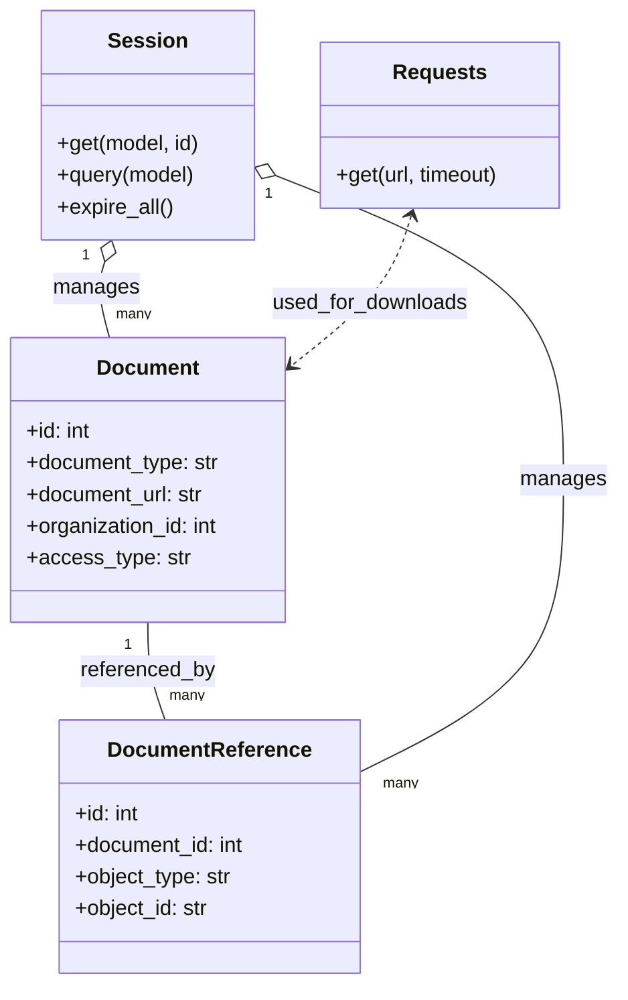

# Diagram: common/document_service/src/api/tests/integration/assertions.py


> Auto-generated by Obscura crawlers

## Diagram 1



### SVG

<svg id="container" width="470.84765625" xmlns="http://www.w3.org/2000/svg" class="classDiagram" height="746" viewBox="0 0 470.84765625 746" role="graphics-document document" aria-roledescription="class"><style>#container{font-family:"trebuchet ms",verdana,arial,sans-serif;font-size:16px;fill:#333;}@keyframes edge-animation-frame{from{stroke-dashoffset:0;}}@keyframes dash{to{stroke-dashoffset:0;}}#container .edge-animation-slow{stroke-dasharray:9,5!important;stroke-dashoffset:900;animation:dash 50s linear infinite;stroke-linecap:round;}#container .edge-animation-fast{stroke-dasharray:9,5!important;stroke-dashoffset:900;animation:dash 20s linear infinite;stroke-linecap:round;}#container .error-icon{fill:#552222;}#container .error-text{fill:#552222;stroke:#552222;}#container .edge-thickness-normal{stroke-width:1px;}#container .edge-thickness-thick{stroke-width:3.5px;}#container .edge-pattern-solid{stroke-dasharray:0;}#container .edge-thickness-invisible{stroke-width:0;fill:none;}#container .edge-pattern-dashed{stroke-dasharray:3;}#container .edge-pattern-dotted{stroke-dasharray:2;}#container .marker{fill:#333333;stroke:#333333;}#container .marker.cross{stroke:#333333;}#container svg{font-family:"trebuchet ms",verdana,arial,sans-serif;font-size:16px;}#container p{margin:0;}#container g.classGroup text{fill:#9370DB;stroke:none;font-family:"trebuchet ms",verdana,arial,sans-serif;font-size:10px;}#container g.classGroup text .title{font-weight:bolder;}#container .nodeLabel,#container .edgeLabel{color:#131300;}#container .edgeLabel .label rect{fill:#ECECFF;}#container .label text{fill:#131300;}#container .labelBkg{background:#ECECFF;}#container .edgeLabel .label span{background:#ECECFF;}#container .classTitle{font-weight:bolder;}#container .node rect,#container .node circle,#container .node ellipse,#container .node polygon,#container .node path{fill:#ECECFF;stroke:#9370DB;stroke-width:1px;}#container .divider{stroke:#9370DB;stroke-width:1;}#container g.clickable{cursor:pointer;}#container g.classGroup rect{fill:#ECECFF;stroke:#9370DB;}#container g.classGroup line{stroke:#9370DB;stroke-width:1;}#container .classLabel .box{stroke:none;stroke-width:0;fill:#ECECFF;opacity:0.5;}#container .classLabel .label{fill:#9370DB;font-size:10px;}#container .relation{stroke:#333333;stroke-width:1;fill:none;}#container .dashed-line{stroke-dasharray:3;}#container .dotted-line{stroke-dasharray:1 2;}#container #compositionStart,#container .composition{fill:#333333!important;stroke:#333333!important;stroke-width:1;}#container #compositionEnd,#container .composition{fill:#333333!important;stroke:#333333!important;stroke-width:1;}#container #dependencyStart,#container .dependency{fill:#333333!important;stroke:#333333!important;stroke-width:1;}#container #dependencyStart,#container .dependency{fill:#333333!important;stroke:#333333!important;stroke-width:1;}#container #extensionStart,#container .extension{fill:transparent!important;stroke:#333333!important;stroke-width:1;}#container #extensionEnd,#container .extension{fill:transparent!important;stroke:#333333!important;stroke-width:1;}#container #aggregationStart,#container .aggregation{fill:transparent!important;stroke:#333333!important;stroke-width:1;}#container #aggregationEnd,#container .aggregation{fill:transparent!important;stroke:#333333!important;stroke-width:1;}#container #lollipopStart,#container .lollipop{fill:#ECECFF!important;stroke:#333333!important;stroke-width:1;}#container #lollipopEnd,#container .lollipop{fill:#ECECFF!important;stroke:#333333!important;stroke-width:1;}#container .edgeTerminals{font-size:11px;line-height:initial;}#container .classTitleText{text-anchor:middle;font-size:18px;fill:#333;}#container .label-icon{display:inline-block;height:1em;overflow:visible;vertical-align:-0.125em;}#container .node .label-icon path{fill:currentColor;stroke:revert;stroke-width:revert;}#container :root{--mermaid-font-family:"trebuchet ms",verdana,arial,sans-serif;}</style><g><defs><marker id="container_class-aggregationStart" class="marker aggregation class" refX="18" refY="7" markerWidth="190" markerHeight="240" orient="auto"><path d="M 18,7 L9,13 L1,7 L9,1 Z"></path></marker></defs><defs><marker id="container_class-aggregationEnd" class="marker aggregation class" refX="1" refY="7" markerWidth="20" markerHeight="28" orient="auto"><path d="M 18,7 L9,13 L1,7 L9,1 Z"></path></marker></defs><defs><marker id="container_class-extensionStart" class="marker extension class" refX="18" refY="7" markerWidth="190" markerHeight="240" orient="auto"><path d="M 1,7 L18,13 V 1 Z"></path></marker></defs><defs><marker id="container_class-extensionEnd" class="marker extension class" refX="1" refY="7" markerWidth="20" markerHeight="28" orient="auto"><path d="M 1,1 V 13 L18,7 Z"></path></marker></defs><defs><marker id="container_class-compositionStart" class="marker composition class" refX="18" refY="7" markerWidth="190" markerHeight="240" orient="auto"><path d="M 18,7 L9,13 L1,7 L9,1 Z"></path></marker></defs><defs><marker id="container_class-compositionEnd" class="marker composition class" refX="1" refY="7" markerWidth="20" markerHeight="28" orient="auto"><path d="M 18,7 L9,13 L1,7 L9,1 Z"></path></marker></defs><defs><marker id="container_class-dependencyStart" class="marker dependency class" refX="6" refY="7" markerWidth="190" markerHeight="240" orient="auto"><path d="M 5,7 L9,13 L1,7 L9,1 Z"></path></marker></defs><defs><marker id="container_class-dependencyEnd" class="marker dependency class" refX="13" refY="7" markerWidth="20" markerHeight="28" orient="auto"><path d="M 18,7 L9,13 L14,7 L9,1 Z"></path></marker></defs><defs><marker id="container_class-lollipopStart" class="marker lollipop class" refX="13" refY="7" markerWidth="190" markerHeight="240" orient="auto"><circle stroke="black" fill="transparent" cx="7" cy="7" r="6"></circle></marker></defs><defs><marker id="container_class-lollipopEnd" class="marker lollipop class" refX="1" refY="7" markerWidth="190" markerHeight="240" orient="auto"><circle stroke="black" fill="transparent" cx="7" cy="7" r="6"></circle></marker></defs><g class="root"><g class="clusters"></g><g class="edgePaths"><path d="M112.836,472L112.836,478.167C112.836,484.333,112.836,496.667,115.036,509C117.236,521.333,121.637,533.667,123.837,539.833L126.037,546" id="id_Document_DocumentReference_1" class="edge-thickness-normal edge-pattern-solid relation" style=";;;" data-edge="true" data-et="edge" data-id="id_Document_DocumentReference_1" data-points="W3sieCI6MTEyLjgzNTkzNzUsInkiOjQ3Mn0seyJ4IjoxMTIuODM1OTM3NSwieSI6NTA5fSx7IngiOjEyNi4wMzcxODI4MDA3NTE4OCwieSI6NTQ2fV0="></path><path d="M80.616,198.47L79.55,201.892C78.485,205.313,76.354,212.157,76.93,221.745C77.507,231.333,80.791,243.667,82.434,249.833L84.076,256" id="id_Session_Document_2" class="edge-thickness-normal edge-pattern-solid relation" style=";;;" data-edge="true" data-et="edge" data-id="id_Session_Document_2" data-points="W3sieCI6ODUuNzQ0MzYxMTM5MTEyOSwieSI6MTgyfSx7IngiOjc0LjIyMjY1NjI1LCJ5IjoyMTl9LHsieCI6ODQuMDc1NzAwNDMxMDM0NDgsInkiOjI1Nn1d" marker-start="url(#container_class-aggregationStart)"></path><path d="M209.597,132.765L246.422,147.137C283.248,161.51,356.899,190.255,393.725,228.794C430.551,267.333,430.551,315.667,430.551,364C430.551,412.333,430.551,460.667,404.593,497.608C378.635,534.548,326.72,560.097,300.762,572.871L274.805,585.645" id="id_Session_DocumentReference_3" class="edge-thickness-normal edge-pattern-solid relation" style=";;;" data-edge="true" data-et="edge" data-id="id_Session_DocumentReference_3" data-points="W3sieCI6MTkzLjUyNzM0Mzc1LCJ5IjoxMjYuNDkyODEzNjcxODUwOTh9LHsieCI6NDMwLjU1MDc4MTI1LCJ5IjoyMTl9LHsieCI6NDMwLjU1MDc4MTI1LCJ5IjozNjR9LHsieCI6NDMwLjU1MDc4MTI1LCJ5Ijo1MDl9LHsieCI6Mjc0LjgwNDY4NzUsInkiOjU4NS42NDUwNzc4MzI1NDA4fV0=" marker-start="url(#container_class-aggregationStart)"></path><path d="M314.243,163.729L311.374,172.941C308.505,182.152,302.768,200.576,287.459,219.582C272.15,238.587,247.268,258.174,234.827,267.968L222.386,277.761" id="id_Requests_Document_4" class="edge-thickness-normal edge-pattern-dashed relation" style=";;;" data-edge="true" data-et="edge" data-id="id_Requests_Document_4" data-points="W3sieCI6MzE2LjAyNjQ5MzE5NTU2NDUsInkiOjE1OH0seyJ4IjoyOTcuMDMxMjUsInkiOjIxOX0seyJ4IjoyMTcuNjcxODc1LCJ5IjoyODEuNDcyMzI0NzIzMjQ3Mn1d" marker-start="url(#container_class-dependencyStart)" marker-end="url(#container_class-dependencyEnd)"></path></g><g class="edgeLabels"><g class="edgeLabel" transform="translate(112.8359375, 509)"><g class="label" data-id="id_Document_DocumentReference_1" transform="translate(-51.6953125, -12)"><foreignObject width="103.390625" height="24"><div xmlns="http://www.w3.org/1999/xhtml" class="labelBkg" style="display: table-cell; white-space: nowrap; line-height: 1.5; max-width: 200px; text-align: center;"><span class="edgeLabel"><p>referenced_by</p></span></div></foreignObject></g></g><g class="edgeLabel" transform="translate(74.29148, 218.77899)"><g class="label" data-id="id_Session_Document_2" transform="translate(-32.296875, -12)"><foreignObject width="64.59375" height="24"><div xmlns="http://www.w3.org/1999/xhtml" class="labelBkg" style="display: table-cell; white-space: nowrap; line-height: 1.5; max-width: 200px; text-align: center;"><span class="edgeLabel"><p>manages</p></span></div></foreignObject></g></g><g class="edgeLabel" transform="translate(430.55078125, 364)"><g class="label" data-id="id_Session_DocumentReference_3" transform="translate(-32.296875, -12)"><foreignObject width="64.59375" height="24"><div xmlns="http://www.w3.org/1999/xhtml" class="labelBkg" style="display: table-cell; white-space: nowrap; line-height: 1.5; max-width: 200px; text-align: center;"><span class="edgeLabel"><p>manages</p></span></div></foreignObject></g></g><g class="edgeLabel" transform="translate(282.45193, 230.47695)"><g class="label" data-id="id_Requests_Document_4" transform="translate(-74.90625, -12)"><foreignObject width="149.8125" height="24"><div xmlns="http://www.w3.org/1999/xhtml" class="labelBkg" style="display: table-cell; white-space: nowrap; line-height: 1.5; max-width: 200px; text-align: center;"><span class="edgeLabel"><p>used_for_downloads</p></span></div></foreignObject></g></g><g class="edgeTerminals" transform="translate(97.83593875000004, 489.5000010714286)"><g class="inner" transform="translate(0, 0)"><foreignObject style="width: 9px; height: 12px;"><div xmlns="http://www.w3.org/1999/xhtml" style="display: inline-block; padding-right: 1px; white-space: nowrap;"><span class="edgeLabel">1</span></div></foreignObject></g></g><g class="edgeTerminals" transform="translate(66.21964745962134, 194.2488984963775)"><g class="inner" transform="translate(0, 0)"><foreignObject style="width: 9px; height: 12px;"><div xmlns="http://www.w3.org/1999/xhtml" style="display: inline-block; padding-right: 1px; white-space: nowrap;"><span class="edgeLabel">1</span></div></foreignObject></g></g><g class="edgeTerminals" transform="translate(204.37605135679368, 146.82887692826333)"><g class="inner" transform="translate(0, 0)"><foreignObject style="width: 9px; height: 12px;"><div xmlns="http://www.w3.org/1999/xhtml" style="display: inline-block; padding-right: 1px; white-space: nowrap;"><span class="edgeLabel">1</span></div></foreignObject></g></g><g class="edgeTerminals" transform="translate(129.28415128242378, 519.477044606313)"><g class="inner" transform="translate(0, 0)"></g><foreignObject style="width: 36px; height: 12px;"><div xmlns="http://www.w3.org/1999/xhtml" style="display: inline-block; padding-right: 1px; white-space: nowrap;"><span class="edgeLabel">many</span></div></foreignObject></g><g class="edgeTerminals" transform="translate(89.06726665904745, 230.22938123985887)"><g class="inner" transform="translate(0, 0)"></g><foreignObject style="width: 36px; height: 12px;"><div xmlns="http://www.w3.org/1999/xhtml" style="display: inline-block; padding-right: 1px; white-space: nowrap;"><span class="edgeLabel">many</span></div></foreignObject></g><g class="edgeTerminals" transform="translate(292.1295492306226, 586.3766178061563)"><g class="inner" transform="translate(0, 0)"></g><foreignObject style="width: 36px; height: 12px;"><div xmlns="http://www.w3.org/1999/xhtml" style="display: inline-block; padding-right: 1px; white-space: nowrap;"><span class="edgeLabel">many</span></div></foreignObject></g></g><g class="nodes"><g class="node default" id="classId-Document-0" transform="translate(112.8359375, 364)"><g class="basic label-container"><path d="M-104.8359375 -108 L104.8359375 -108 L104.8359375 108 L-104.8359375 108" stroke="none" stroke-width="0" fill="#ECECFF" style=""></path><path d="M-104.8359375 -108 C-55.90889129716005 -108, -6.981845094320093 -108, 104.8359375 -108 M-104.8359375 -108 C-47.1695866029796 -108, 10.496764294040801 -108, 104.8359375 -108 M104.8359375 -108 C104.8359375 -35.600943946789485, 104.8359375 36.79811210642103, 104.8359375 108 M104.8359375 -108 C104.8359375 -29.510611074718327, 104.8359375 48.97877785056335, 104.8359375 108 M104.8359375 108 C22.995763977643037 108, -58.844409544713926 108, -104.8359375 108 M104.8359375 108 C30.227016273812026 108, -44.38190495237595 108, -104.8359375 108 M-104.8359375 108 C-104.8359375 63.61460092256312, -104.8359375 19.22920184512624, -104.8359375 -108 M-104.8359375 108 C-104.8359375 52.5352718304918, -104.8359375 -2.9294563390163972, -104.8359375 -108" stroke="#9370DB" stroke-width="1.3" fill="none" stroke-dasharray="0 0" style=""></path></g><g class="annotation-group text" transform="translate(0, -84)"></g><g class="label-group text" transform="translate(-37.09375, -84)"><g class="label" style="font-weight: bolder" transform="translate(0,-12)"><foreignObject width="74.1875" height="24"><div xmlns="http://www.w3.org/1999/xhtml" style="display: table-cell; white-space: nowrap; line-height: 1.5; max-width: 124px; text-align: center;"><span class="nodeLabel markdown-node-label" style=""><p>Document</p></span></div></foreignObject></g></g><g class="members-group text" transform="translate(-92.8359375, -36)"><g class="label" style="" transform="translate(0,-12)"><foreignObject width="49.8125" height="24"><div xmlns="http://www.w3.org/1999/xhtml" style="display: table-cell; white-space: nowrap; line-height: 1.5; max-width: 107px; text-align: center;"><span class="nodeLabel markdown-node-label" style=""><p>+id: int</p></span></div></foreignObject></g><g class="label" style="" transform="translate(0,12)"><foreignObject width="148.578125" height="24"><div xmlns="http://www.w3.org/1999/xhtml" style="display: table-cell; white-space: nowrap; line-height: 1.5; max-width: 207px; text-align: center;"><span class="nodeLabel markdown-node-label" style=""><p>+document_type: str</p></span></div></foreignObject></g><g class="label" style="" transform="translate(0,36)"><foreignObject width="137.125" height="24"><div xmlns="http://www.w3.org/1999/xhtml" style="display: table-cell; white-space: nowrap; line-height: 1.5; max-width: 195px; text-align: center;"><span class="nodeLabel markdown-node-label" style=""><p>+document_url: str</p></span></div></foreignObject></g><g class="label" style="" transform="translate(0,60)"><foreignObject width="148.484375" height="24"><div xmlns="http://www.w3.org/1999/xhtml" style="display: table-cell; white-space: nowrap; line-height: 1.5; max-width: 206px; text-align: center;"><span class="nodeLabel markdown-node-label" style=""><p>+organization_id: int</p></span></div></foreignObject></g><g class="label" style="" transform="translate(0,84)"><foreignObject width="121.59375" height="24"><div xmlns="http://www.w3.org/1999/xhtml" style="display: table-cell; white-space: nowrap; line-height: 1.5; max-width: 180px; text-align: center;"><span class="nodeLabel markdown-node-label" style=""><p>+access_type: str</p></span></div></foreignObject></g></g><g class="methods-group text" transform="translate(-92.8359375, 108)"></g><g class="divider" style=""><path d="M-104.8359375 -60 C-55.85711361653286 -60, -6.878289733065714 -60, 104.8359375 -60 M-104.8359375 -60 C-35.38550141515471 -60, 34.06493466969059 -60, 104.8359375 -60" stroke="#9370DB" stroke-width="1.3" fill="none" stroke-dasharray="0 0" style=""></path></g><g class="divider" style=""><path d="M-104.8359375 84 C-54.502353651362704 84, -4.168769802725407 84, 104.8359375 84 M-104.8359375 84 C-47.3305722897638 84, 10.174792920472399 84, 104.8359375 84" stroke="#9370DB" stroke-width="1.3" fill="none" stroke-dasharray="0 0" style=""></path></g></g><g class="node default" id="classId-DocumentReference-1" transform="translate(160.2890625, 642)"><g class="basic label-container"><path d="M-114.515625 -96 L114.515625 -96 L114.515625 96 L-114.515625 96" stroke="none" stroke-width="0" fill="#ECECFF" style=""></path><path d="M-114.515625 -96 C-51.398913737665225 -96, 11.71779752466955 -96, 114.515625 -96 M-114.515625 -96 C-28.81385287011129 -96, 56.88791925977742 -96, 114.515625 -96 M114.515625 -96 C114.515625 -36.62094190838524, 114.515625 22.758116183229518, 114.515625 96 M114.515625 -96 C114.515625 -24.29394312619924, 114.515625 47.41211374760152, 114.515625 96 M114.515625 96 C49.423412703211284 96, -15.668799593577432 96, -114.515625 96 M114.515625 96 C66.55610140617577 96, 18.596577812351555 96, -114.515625 96 M-114.515625 96 C-114.515625 48.7060395963708, -114.515625 1.4120791927416008, -114.515625 -96 M-114.515625 96 C-114.515625 31.01023290744824, -114.515625 -33.97953418510352, -114.515625 -96" stroke="#9370DB" stroke-width="1.3" fill="none" stroke-dasharray="0 0" style=""></path></g><g class="annotation-group text" transform="translate(0, -72)"></g><g class="label-group text" transform="translate(-73.59375, -72)"><g class="label" style="font-weight: bolder" transform="translate(0,-12)"><foreignObject width="147.1875" height="24"><div xmlns="http://www.w3.org/1999/xhtml" style="display: table-cell; white-space: nowrap; line-height: 1.5; max-width: 196px; text-align: center;"><span class="nodeLabel markdown-node-label" style=""><p>DocumentReference</p></span></div></foreignObject></g></g><g class="members-group text" transform="translate(-102.515625, -24)"><g class="label" style="" transform="translate(0,-12)"><foreignObject width="49.8125" height="24"><div xmlns="http://www.w3.org/1999/xhtml" style="display: table-cell; white-space: nowrap; line-height: 1.5; max-width: 107px; text-align: center;"><span class="nodeLabel markdown-node-label" style=""><p>+id: int</p></span></div></foreignObject></g><g class="label" style="" transform="translate(0,12)"><foreignObject width="131.4375" height="24"><div xmlns="http://www.w3.org/1999/xhtml" style="display: table-cell; white-space: nowrap; line-height: 1.5; max-width: 189px; text-align: center;"><span class="nodeLabel markdown-node-label" style=""><p>+document_id: int</p></span></div></foreignObject></g><g class="label" style="" transform="translate(0,36)"><foreignObject width="120.765625" height="24"><div xmlns="http://www.w3.org/1999/xhtml" style="display: table-cell; white-space: nowrap; line-height: 1.5; max-width: 179px; text-align: center;"><span class="nodeLabel markdown-node-label" style=""><p>+object_type: str</p></span></div></foreignObject></g><g class="label" style="" transform="translate(0,60)"><foreignObject width="103.375" height="24"><div xmlns="http://www.w3.org/1999/xhtml" style="display: table-cell; white-space: nowrap; line-height: 1.5; max-width: 162px; text-align: center;"><span class="nodeLabel markdown-node-label" style=""><p>+object_id: str</p></span></div></foreignObject></g></g><g class="methods-group text" transform="translate(-102.515625, 96)"></g><g class="divider" style=""><path d="M-114.515625 -48 C-42.48282625927045 -48, 29.549972481459093 -48, 114.515625 -48 M-114.515625 -48 C-23.33415235542897 -48, 67.84732028914206 -48, 114.515625 -48" stroke="#9370DB" stroke-width="1.3" fill="none" stroke-dasharray="0 0" style=""></path></g><g class="divider" style=""><path d="M-114.515625 72 C-48.789752442748494 72, 16.936120114503012 72, 114.515625 72 M-114.515625 72 C-49.045759275515024 72, 16.42410644896995 72, 114.515625 72" stroke="#9370DB" stroke-width="1.3" fill="none" stroke-dasharray="0 0" style=""></path></g></g><g class="node default" id="classId-Session-2" transform="translate(112.8359375, 95)"><g class="basic label-container"><path d="M-80.69140625 -87 L80.69140625 -87 L80.69140625 87 L-80.69140625 87" stroke="none" stroke-width="0" fill="#ECECFF" style=""></path><path d="M-80.69140625 -87 C-47.755586429392224 -87, -14.819766608784448 -87, 80.69140625 -87 M-80.69140625 -87 C-25.69736961525176 -87, 29.296667019496482 -87, 80.69140625 -87 M80.69140625 -87 C80.69140625 -36.17687935399583, 80.69140625 14.646241292008341, 80.69140625 87 M80.69140625 -87 C80.69140625 -34.171283943254366, 80.69140625 18.657432113491268, 80.69140625 87 M80.69140625 87 C44.32422642304658 87, 7.957046596093164 87, -80.69140625 87 M80.69140625 87 C46.60504011235306 87, 12.518673974706118 87, -80.69140625 87 M-80.69140625 87 C-80.69140625 20.374786367501443, -80.69140625 -46.250427264997114, -80.69140625 -87 M-80.69140625 87 C-80.69140625 45.574038014088146, -80.69140625 4.148076028176291, -80.69140625 -87" stroke="#9370DB" stroke-width="1.3" fill="none" stroke-dasharray="0 0" style=""></path></g><g class="annotation-group text" transform="translate(0, -63)"></g><g class="label-group text" transform="translate(-28.2109375, -63)"><g class="label" style="font-weight: bolder" transform="translate(0,-12)"><foreignObject width="56.421875" height="24"><div xmlns="http://www.w3.org/1999/xhtml" style="display: table-cell; white-space: nowrap; line-height: 1.5; max-width: 105px; text-align: center;"><span class="nodeLabel markdown-node-label" style=""><p>Session</p></span></div></foreignObject></g></g><g class="members-group text" transform="translate(-68.69140625, -15)"></g><g class="methods-group text" transform="translate(-68.69140625, 15)"><g class="label" style="" transform="translate(0,-12)"><foreignObject width="109.171875" height="24"><div xmlns="http://www.w3.org/1999/xhtml" style="display: table-cell; white-space: nowrap; line-height: 1.5; max-width: 167px; text-align: center;"><span class="nodeLabel markdown-node-label" style=""><p>+get(model, id)</p></span></div></foreignObject></g><g class="label" style="" transform="translate(0,12)"><foreignObject width="106.046875" height="24"><div xmlns="http://www.w3.org/1999/xhtml" style="display: table-cell; white-space: nowrap; line-height: 1.5; max-width: 163px; text-align: center;"><span class="nodeLabel markdown-node-label" style=""><p>+query(model)</p></span></div></foreignObject></g><g class="label" style="" transform="translate(0,36)"><foreignObject width="88.734375" height="24"><div xmlns="http://www.w3.org/1999/xhtml" style="display: table-cell; white-space: nowrap; line-height: 1.5; max-width: 146px; text-align: center;"><span class="nodeLabel markdown-node-label" style=""><p>+expire_all()</p></span></div></foreignObject></g></g><g class="divider" style=""><path d="M-80.69140625 -39 C-48.31192198493812 -39, -15.932437719876233 -39, 80.69140625 -39 M-80.69140625 -39 C-27.301041104740612 -39, 26.089324040518775 -39, 80.69140625 -39" stroke="#9370DB" stroke-width="1.3" fill="none" stroke-dasharray="0 0" style=""></path></g><g class="divider" style=""><path d="M-80.69140625 -15 C-40.744526655361376 -15, -0.7976470607227526 -15, 80.69140625 -15 M-80.69140625 -15 C-25.377455331313108 -15, 29.936495587373784 -15, 80.69140625 -15" stroke="#9370DB" stroke-width="1.3" fill="none" stroke-dasharray="0 0" style=""></path></g></g><g class="node default" id="classId-Requests-3" transform="translate(335.64453125, 95)"><g class="basic label-container"><path d="M-92.1171875 -63 L92.1171875 -63 L92.1171875 63 L-92.1171875 63" stroke="none" stroke-width="0" fill="#ECECFF" style=""></path><path d="M-92.1171875 -63 C-38.75155960169328 -63, 14.61406829661344 -63, 92.1171875 -63 M-92.1171875 -63 C-28.057522391418786 -63, 36.00214271716243 -63, 92.1171875 -63 M92.1171875 -63 C92.1171875 -36.06407148183891, 92.1171875 -9.128142963677817, 92.1171875 63 M92.1171875 -63 C92.1171875 -21.099731423591386, 92.1171875 20.800537152817228, 92.1171875 63 M92.1171875 63 C21.68250093776311 63, -48.75218562447378 63, -92.1171875 63 M92.1171875 63 C45.54236082474603 63, -1.032465850507947 63, -92.1171875 63 M-92.1171875 63 C-92.1171875 23.729606440869738, -92.1171875 -15.540787118260525, -92.1171875 -63 M-92.1171875 63 C-92.1171875 25.054956800239935, -92.1171875 -12.89008639952013, -92.1171875 -63" stroke="#9370DB" stroke-width="1.3" fill="none" stroke-dasharray="0 0" style=""></path></g><g class="annotation-group text" transform="translate(0, -39)"></g><g class="label-group text" transform="translate(-33.84375, -39)"><g class="label" style="font-weight: bolder" transform="translate(0,-12)"><foreignObject width="67.6875" height="24"><div xmlns="http://www.w3.org/1999/xhtml" style="display: table-cell; white-space: nowrap; line-height: 1.5; max-width: 116px; text-align: center;"><span class="nodeLabel markdown-node-label" style=""><p>Requests</p></span></div></foreignObject></g></g><g class="members-group text" transform="translate(-80.1171875, 9)"></g><g class="methods-group text" transform="translate(-80.1171875, 39)"><g class="label" style="" transform="translate(0,-12)"><foreignObject width="126.390625" height="24"><div xmlns="http://www.w3.org/1999/xhtml" style="display: table-cell; white-space: nowrap; line-height: 1.5; max-width: 184px; text-align: center;"><span class="nodeLabel markdown-node-label" style=""><p>+get(url, timeout)</p></span></div></foreignObject></g></g><g class="divider" style=""><path d="M-92.1171875 -15 C-22.226402793612706 -15, 47.66438191277459 -15, 92.1171875 -15 M-92.1171875 -15 C-48.13265972045382 -15, -4.148131940907646 -15, 92.1171875 -15" stroke="#9370DB" stroke-width="1.3" fill="none" stroke-dasharray="0 0" style=""></path></g><g class="divider" style=""><path d="M-92.1171875 9 C-34.764833069321625 9, 22.58752136135675 9, 92.1171875 9 M-92.1171875 9 C-33.96423586624275 9, 24.188715767514495 9, 92.1171875 9" stroke="#9370DB" stroke-width="1.3" fill="none" stroke-dasharray="0 0" style=""></path></g></g></g></g></g></svg>

## Diagram 2

```mermaid
flowchart TD
    A[assert_document_row(session, doc_id, expected)] --> B[session.get(Document, doc_id)]
    B --> C{doc is not None}
    C -->|no| D[assert fail: Document not found]
    C -->|yes| E{expected contains keys}
    E --> E1[check documentType -> compare doc.document_type]
    E --> E2[check documentUrl -> compare doc.document_url]
    E --> E3[check organizationId -> compare int(doc.organization_id)]
    E --> E4[check accessType -> compare uppercased access_type]
    A --> F[assert_association_exists(session, doc_id, object_type, object_id)]
    F --> G[session.query(DocumentReference).filter_by(...).count()]
    G --> H{count == 1}
    H -->|no| I[assert fail: Expected association]
    H -->|yes| J[pass]
    K[assert_download_matches(url, expected_bytes)] --> L[Requests.get(url, timeout)]
    L --> M{r.status_code == 200}
    M -->|no| N[assert fail: GET failed]
    M -->|yes| O{r.content == expected_bytes}
    O -->|no| P[assert fail: Downloaded content mismatch]
    O -->|yes| Q[pass]
```

> SVG rendering failed for this diagram.
