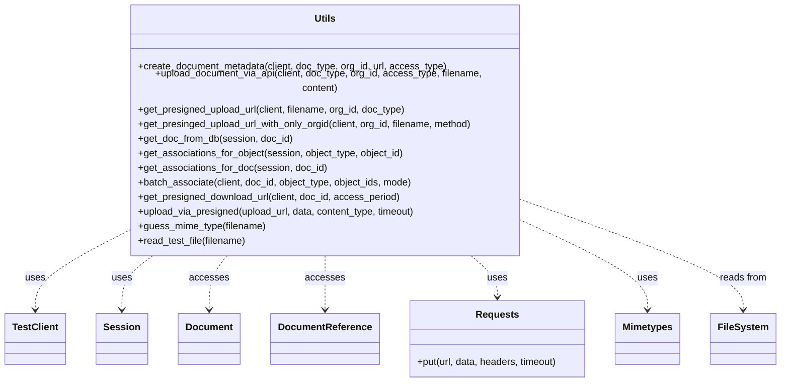

# Diagram: common/document_service/src/api/tests/integration/helpers.py


> Auto-generated by Obscura crawlers

## Diagram 1

```mermaid
flowchart TD
  Client[TestClient] -->|POST /document/metadata| create_document_metadata
  Client -->|POST /document/upload| upload_document_via_api
  Client -->|POST /document/upload-url| get_presigned_upload_url
  Client -->|POST /document/upload-url (org only)| get_presinged_upload_url_with_only_orgid
  Client -->|POST /document/{doc_id}/associations| batch_associate
  Client -->|GET /document/{doc_id}| get_presigned_download_url

  get_presigned_upload_url -->|returns URL| upload_via_presigned
  get_presinged_upload_url_with_only_orgid -->|returns URL| upload_via_presigned
  upload_via_presigned -->|HTTP PUT| Requests[requests.put]
  upload_document_via_api -->|sends file| guess_mime_type
  read_test_file -->|reads bytes| guess_mime_type

  DBSession[Session] -->|get| get_doc_from_db
  DBSession -->|query DocumentReference| get_associations_for_object
  DBSession -->|query DocumentReference| get_associations_for_doc

  guess_mime_type -->|uses| Mimetypes[mimetypes]
  read_test_file -->|reads from| FileSystem[./data/*]
```

> SVG rendering failed for this diagram.

## Diagram 2



### SVG

<svg id="container" width="1262.640625" xmlns="http://www.w3.org/2000/svg" class="classDiagram" height="606" viewBox="0 0 1262.640625 606" role="graphics-document document" aria-roledescription="class"><style>#container{font-family:"trebuchet ms",verdana,arial,sans-serif;font-size:16px;fill:#333;}@keyframes edge-animation-frame{from{stroke-dashoffset:0;}}@keyframes dash{to{stroke-dashoffset:0;}}#container .edge-animation-slow{stroke-dasharray:9,5!important;stroke-dashoffset:900;animation:dash 50s linear infinite;stroke-linecap:round;}#container .edge-animation-fast{stroke-dasharray:9,5!important;stroke-dashoffset:900;animation:dash 20s linear infinite;stroke-linecap:round;}#container .error-icon{fill:#552222;}#container .error-text{fill:#552222;stroke:#552222;}#container .edge-thickness-normal{stroke-width:1px;}#container .edge-thickness-thick{stroke-width:3.5px;}#container .edge-pattern-solid{stroke-dasharray:0;}#container .edge-thickness-invisible{stroke-width:0;fill:none;}#container .edge-pattern-dashed{stroke-dasharray:3;}#container .edge-pattern-dotted{stroke-dasharray:2;}#container .marker{fill:#333333;stroke:#333333;}#container .marker.cross{stroke:#333333;}#container svg{font-family:"trebuchet ms",verdana,arial,sans-serif;font-size:16px;}#container p{margin:0;}#container g.classGroup text{fill:#9370DB;stroke:none;font-family:"trebuchet ms",verdana,arial,sans-serif;font-size:10px;}#container g.classGroup text .title{font-weight:bolder;}#container .nodeLabel,#container .edgeLabel{color:#131300;}#container .edgeLabel .label rect{fill:#ECECFF;}#container .label text{fill:#131300;}#container .labelBkg{background:#ECECFF;}#container .edgeLabel .label span{background:#ECECFF;}#container .classTitle{font-weight:bolder;}#container .node rect,#container .node circle,#container .node ellipse,#container .node polygon,#container .node path{fill:#ECECFF;stroke:#9370DB;stroke-width:1px;}#container .divider{stroke:#9370DB;stroke-width:1;}#container g.clickable{cursor:pointer;}#container g.classGroup rect{fill:#ECECFF;stroke:#9370DB;}#container g.classGroup line{stroke:#9370DB;stroke-width:1;}#container .classLabel .box{stroke:none;stroke-width:0;fill:#ECECFF;opacity:0.5;}#container .classLabel .label{fill:#9370DB;font-size:10px;}#container .relation{stroke:#333333;stroke-width:1;fill:none;}#container .dashed-line{stroke-dasharray:3;}#container .dotted-line{stroke-dasharray:1 2;}#container #compositionStart,#container .composition{fill:#333333!important;stroke:#333333!important;stroke-width:1;}#container #compositionEnd,#container .composition{fill:#333333!important;stroke:#333333!important;stroke-width:1;}#container #dependencyStart,#container .dependency{fill:#333333!important;stroke:#333333!important;stroke-width:1;}#container #dependencyStart,#container .dependency{fill:#333333!important;stroke:#333333!important;stroke-width:1;}#container #extensionStart,#container .extension{fill:transparent!important;stroke:#333333!important;stroke-width:1;}#container #extensionEnd,#container .extension{fill:transparent!important;stroke:#333333!important;stroke-width:1;}#container #aggregationStart,#container .aggregation{fill:transparent!important;stroke:#333333!important;stroke-width:1;}#container #aggregationEnd,#container .aggregation{fill:transparent!important;stroke:#333333!important;stroke-width:1;}#container #lollipopStart,#container .lollipop{fill:#ECECFF!important;stroke:#333333!important;stroke-width:1;}#container #lollipopEnd,#container .lollipop{fill:#ECECFF!important;stroke:#333333!important;stroke-width:1;}#container .edgeTerminals{font-size:11px;line-height:initial;}#container .classTitleText{text-anchor:middle;font-size:18px;fill:#333;}#container .label-icon{display:inline-block;height:1em;overflow:visible;vertical-align:-0.125em;}#container .node .label-icon path{fill:currentColor;stroke:revert;stroke-width:revert;}#container :root{--mermaid-font-family:"trebuchet ms",verdana,arial,sans-serif;}</style><g><defs><marker id="container_class-aggregationStart" class="marker aggregation class" refX="18" refY="7" markerWidth="190" markerHeight="240" orient="auto"><path d="M 18,7 L9,13 L1,7 L9,1 Z"></path></marker></defs><defs><marker id="container_class-aggregationEnd" class="marker aggregation class" refX="1" refY="7" markerWidth="20" markerHeight="28" orient="auto"><path d="M 18,7 L9,13 L1,7 L9,1 Z"></path></marker></defs><defs><marker id="container_class-extensionStart" class="marker extension class" refX="18" refY="7" markerWidth="190" markerHeight="240" orient="auto"><path d="M 1,7 L18,13 V 1 Z"></path></marker></defs><defs><marker id="container_class-extensionEnd" class="marker extension class" refX="1" refY="7" markerWidth="20" markerHeight="28" orient="auto"><path d="M 1,1 V 13 L18,7 Z"></path></marker></defs><defs><marker id="container_class-compositionStart" class="marker composition class" refX="18" refY="7" markerWidth="190" markerHeight="240" orient="auto"><path d="M 18,7 L9,13 L1,7 L9,1 Z"></path></marker></defs><defs><marker id="container_class-compositionEnd" class="marker composition class" refX="1" refY="7" markerWidth="20" markerHeight="28" orient="auto"><path d="M 18,7 L9,13 L1,7 L9,1 Z"></path></marker></defs><defs><marker id="container_class-dependencyStart" class="marker dependency class" refX="6" refY="7" markerWidth="190" markerHeight="240" orient="auto"><path d="M 5,7 L9,13 L1,7 L9,1 Z"></path></marker></defs><defs><marker id="container_class-dependencyEnd" class="marker dependency class" refX="13" refY="7" markerWidth="20" markerHeight="28" orient="auto"><path d="M 18,7 L9,13 L14,7 L9,1 Z"></path></marker></defs><defs><marker id="container_class-lollipopStart" class="marker lollipop class" refX="13" refY="7" markerWidth="190" markerHeight="240" orient="auto"><circle stroke="black" fill="transparent" cx="7" cy="7" r="6"></circle></marker></defs><defs><marker id="container_class-lollipopEnd" class="marker lollipop class" refX="1" refY="7" markerWidth="190" markerHeight="240" orient="auto"><circle stroke="black" fill="transparent" cx="7" cy="7" r="6"></circle></marker></defs><g class="root"><g class="clusters"></g><g class="edgePaths"><path d="M194.781,365.681L171.738,377.234C148.695,388.787,102.609,411.894,79.566,432.113C56.523,452.333,56.523,469.667,56.523,478.333L56.523,487" id="id_Utils_TestClient_1" class="edge-thickness-normal edge-pattern-dashed relation" style=";;;" data-edge="true" data-et="edge" data-id="id_Utils_TestClient_1" data-points="W3sieCI6MTk0Ljc4MTI1LCJ5IjozNjUuNjgwODQ4OTA4NDczOX0seyJ4Ijo1Ni41MjM0Mzc1LCJ5Ijo0MzV9LHsieCI6NTYuNTIzNDM3NSwieSI6NDkzfV0=" marker-end="url(#container_class-dependencyEnd)"></path><path d="M246.929,398L238.317,404.167C229.705,410.333,212.482,422.667,203.87,437.5C195.258,452.333,195.258,469.667,195.258,478.333L195.258,487" id="id_Utils_Session_2" class="edge-thickness-normal edge-pattern-dashed relation" style=";;;" data-edge="true" data-et="edge" data-id="id_Utils_Session_2" data-points="W3sieCI6MjQ2LjkyODk4MDMzNDA1MTc0LCJ5IjozOTh9LHsieCI6MTk1LjI1NzgxMjUsInkiOjQzNX0seyJ4IjoxOTUuMjU3ODEyNSwieSI6NDkzfV0=" marker-end="url(#container_class-dependencyEnd)"></path><path d="M364.017,398L359.108,404.167C354.199,410.333,344.381,422.667,339.472,437.5C334.563,452.333,334.563,469.667,334.563,478.333L334.563,487" id="id_Utils_Document_3" class="edge-thickness-normal edge-pattern-dashed relation" style=";;;" data-edge="true" data-et="edge" data-id="id_Utils_Document_3" data-points="W3sieCI6MzY0LjAxNjk3MTk4Mjc1ODYsInkiOjM5OH0seyJ4IjozMzQuNTYyNSwieSI6NDM1fSx7IngiOjMzNC41NjI1LCJ5Ijo0OTN9XQ==" marker-end="url(#container_class-dependencyEnd)"></path><path d="M519.25,398L519.25,404.167C519.25,410.333,519.25,422.667,519.25,437.5C519.25,452.333,519.25,469.667,519.25,478.333L519.25,487" id="id_Utils_DocumentReference_4" class="edge-thickness-normal edge-pattern-dashed relation" style=";;;" data-edge="true" data-et="edge" data-id="id_Utils_DocumentReference_4" data-points="W3sieCI6NTE5LjI1LCJ5IjozOTh9LHsieCI6NTE5LjI1LCJ5Ijo0MzV9LHsieCI6NTE5LjI1LCJ5Ijo0OTN9XQ==" marker-end="url(#container_class-dependencyEnd)"></path><path d="M756.525,398L764.029,404.167C771.533,410.333,786.54,422.667,794.043,434C801.547,445.333,801.547,455.667,801.547,460.833L801.547,466" id="id_Utils_Requests_5" class="edge-thickness-normal edge-pattern-dashed relation" style=";;;" data-edge="true" data-et="edge" data-id="id_Utils_Requests_5" data-points="W3sieCI6NzU2LjUyNTM5MDYyNSwieSI6Mzk4fSx7IngiOjgwMS41NDY4NzUsInkiOjQzNX0seyJ4Ijo4MDEuNTQ2ODc1LCJ5Ijo0NzJ9XQ==" marker-end="url(#container_class-dependencyEnd)"></path><path d="M843.719,344.772L878.135,359.81C912.552,374.848,981.385,404.924,1015.802,428.629C1050.219,452.333,1050.219,469.667,1050.219,478.333L1050.219,487" id="id_Utils_Mimetypes_6" class="edge-thickness-normal edge-pattern-dashed relation" style=";;;" data-edge="true" data-et="edge" data-id="id_Utils_Mimetypes_6" data-points="W3sieCI6ODQzLjcxODc1LCJ5IjozNDQuNzcyNDY3Nzc3MDU4NH0seyJ4IjoxMDUwLjIxODc1LCJ5Ijo0MzV9LHsieCI6MTA1MC4yMTg3NSwieSI6NDkzfV0=" marker-end="url(#container_class-dependencyEnd)"></path><path d="M843.719,313.027L903.668,333.356C963.617,353.685,1083.516,394.342,1143.465,423.338C1203.414,452.333,1203.414,469.667,1203.414,478.333L1203.414,487" id="id_Utils_FileSystem_7" class="edge-thickness-normal edge-pattern-dashed relation" style=";;;" data-edge="true" data-et="edge" data-id="id_Utils_FileSystem_7" data-points="W3sieCI6ODQzLjcxODc1LCJ5IjozMTMuMDI3MzM3MTkyOTcwNDR9LHsieCI6MTIwMy40MTQwNjI1LCJ5Ijo0MzV9LHsieCI6MTIwMy40MTQwNjI1LCJ5Ijo0OTN9XQ==" marker-end="url(#container_class-dependencyEnd)"></path></g><g class="edgeLabels"><g class="edgeLabel" transform="translate(56.5234375, 435)"><g class="label" data-id="id_Utils_TestClient_1" transform="translate(-16.4921875, -12)"><foreignObject width="32.984375" height="24"><div xmlns="http://www.w3.org/1999/xhtml" class="labelBkg" style="display: table-cell; white-space: nowrap; line-height: 1.5; max-width: 200px; text-align: center;"><span class="edgeLabel"><p>uses</p></span></div></foreignObject></g></g><g class="edgeLabel" transform="translate(195.2578125, 435)"><g class="label" data-id="id_Utils_Session_2" transform="translate(-16.4921875, -12)"><foreignObject width="32.984375" height="24"><div xmlns="http://www.w3.org/1999/xhtml" class="labelBkg" style="display: table-cell; white-space: nowrap; line-height: 1.5; max-width: 200px; text-align: center;"><span class="edgeLabel"><p>uses</p></span></div></foreignObject></g></g><g class="edgeLabel" transform="translate(334.5625, 435)"><g class="label" data-id="id_Utils_Document_3" transform="translate(-31.53125, -12)"><foreignObject width="63.0625" height="24"><div xmlns="http://www.w3.org/1999/xhtml" class="labelBkg" style="display: table-cell; white-space: nowrap; line-height: 1.5; max-width: 200px; text-align: center;"><span class="edgeLabel"><p>accesses</p></span></div></foreignObject></g></g><g class="edgeLabel" transform="translate(519.25, 435)"><g class="label" data-id="id_Utils_DocumentReference_4" transform="translate(-31.53125, -12)"><foreignObject width="63.0625" height="24"><div xmlns="http://www.w3.org/1999/xhtml" class="labelBkg" style="display: table-cell; white-space: nowrap; line-height: 1.5; max-width: 200px; text-align: center;"><span class="edgeLabel"><p>accesses</p></span></div></foreignObject></g></g><g class="edgeLabel" transform="translate(801.546875, 435)"><g class="label" data-id="id_Utils_Requests_5" transform="translate(-16.4921875, -12)"><foreignObject width="32.984375" height="24"><div xmlns="http://www.w3.org/1999/xhtml" class="labelBkg" style="display: table-cell; white-space: nowrap; line-height: 1.5; max-width: 200px; text-align: center;"><span class="edgeLabel"><p>uses</p></span></div></foreignObject></g></g><g class="edgeLabel" transform="translate(1050.21875, 435)"><g class="label" data-id="id_Utils_Mimetypes_6" transform="translate(-16.4921875, -12)"><foreignObject width="32.984375" height="24"><div xmlns="http://www.w3.org/1999/xhtml" class="labelBkg" style="display: table-cell; white-space: nowrap; line-height: 1.5; max-width: 200px; text-align: center;"><span class="edgeLabel"><p>uses</p></span></div></foreignObject></g></g><g class="edgeLabel" transform="translate(1203.4140625, 435)"><g class="label" data-id="id_Utils_FileSystem_7" transform="translate(-39.1796875, -12)"><foreignObject width="78.359375" height="24"><div xmlns="http://www.w3.org/1999/xhtml" class="labelBkg" style="display: table-cell; white-space: nowrap; line-height: 1.5; max-width: 200px; text-align: center;"><span class="edgeLabel"><p>reads from</p></span></div></foreignObject></g></g></g><g class="nodes"><g class="node default" id="classId-Document-0" transform="translate(334.5625, 535)"><g class="basic label-container"><path d="M-49.09375 -42 L49.09375 -42 L49.09375 42 L-49.09375 42" stroke="none" stroke-width="0" fill="#ECECFF" style=""></path><path d="M-49.09375 -42 C-27.171170424421348 -42, -5.248590848842696 -42, 49.09375 -42 M-49.09375 -42 C-21.740718147836 -42, 5.6123137043280025 -42, 49.09375 -42 M49.09375 -42 C49.09375 -14.596739474012274, 49.09375 12.806521051975452, 49.09375 42 M49.09375 -42 C49.09375 -20.374191020886183, 49.09375 1.2516179582276337, 49.09375 42 M49.09375 42 C23.664917827337582 42, -1.7639143453248352 42, -49.09375 42 M49.09375 42 C14.023643592469732 42, -21.046462815060536 42, -49.09375 42 M-49.09375 42 C-49.09375 24.7222641587871, -49.09375 7.444528317574203, -49.09375 -42 M-49.09375 42 C-49.09375 20.727717134134576, -49.09375 -0.5445657317308488, -49.09375 -42" stroke="#9370DB" stroke-width="1.3" fill="none" stroke-dasharray="0 0" style=""></path></g><g class="annotation-group text" transform="translate(0, -18)"></g><g class="label-group text" transform="translate(-37.09375, -18)"><g class="label" style="font-weight: bolder" transform="translate(0,-12)"><foreignObject width="74.1875" height="24"><div xmlns="http://www.w3.org/1999/xhtml" style="display: table-cell; white-space: nowrap; line-height: 1.5; max-width: 124px; text-align: center;"><span class="nodeLabel markdown-node-label" style=""><p>Document</p></span></div></foreignObject></g></g><g class="members-group text" transform="translate(-37.09375, 30)"></g><g class="methods-group text" transform="translate(-37.09375, 60)"></g><g class="divider" style=""><path d="M-49.09375 6 C-12.462034426514272 6, 24.169681146971456 6, 49.09375 6 M-49.09375 6 C-17.368101565456243 6, 14.357546869087514 6, 49.09375 6" stroke="#9370DB" stroke-width="1.3" fill="none" stroke-dasharray="0 0" style=""></path></g><g class="divider" style=""><path d="M-49.09375 24 C-29.443168582298714 24, -9.792587164597428 24, 49.09375 24 M-49.09375 24 C-18.804770527373194 24, 11.484208945253613 24, 49.09375 24" stroke="#9370DB" stroke-width="1.3" fill="none" stroke-dasharray="0 0" style=""></path></g></g><g class="node default" id="classId-DocumentReference-1" transform="translate(519.25, 535)"><g class="basic label-container"><path d="M-85.59375 -42 L85.59375 -42 L85.59375 42 L-85.59375 42" stroke="none" stroke-width="0" fill="#ECECFF" style=""></path><path d="M-85.59375 -42 C-23.25514747067561 -42, 39.08345505864878 -42, 85.59375 -42 M-85.59375 -42 C-20.193147761992606 -42, 45.20745447601479 -42, 85.59375 -42 M85.59375 -42 C85.59375 -8.636209018867852, 85.59375 24.727581962264296, 85.59375 42 M85.59375 -42 C85.59375 -24.215082457014436, 85.59375 -6.430164914028872, 85.59375 42 M85.59375 42 C23.787420844224336 42, -38.01890831155133 42, -85.59375 42 M85.59375 42 C51.22047787770687 42, 16.84720575541374 42, -85.59375 42 M-85.59375 42 C-85.59375 21.280906195011415, -85.59375 0.5618123900228298, -85.59375 -42 M-85.59375 42 C-85.59375 15.460307680687343, -85.59375 -11.079384638625314, -85.59375 -42" stroke="#9370DB" stroke-width="1.3" fill="none" stroke-dasharray="0 0" style=""></path></g><g class="annotation-group text" transform="translate(0, -18)"></g><g class="label-group text" transform="translate(-73.59375, -18)"><g class="label" style="font-weight: bolder" transform="translate(0,-12)"><foreignObject width="147.1875" height="24"><div xmlns="http://www.w3.org/1999/xhtml" style="display: table-cell; white-space: nowrap; line-height: 1.5; max-width: 196px; text-align: center;"><span class="nodeLabel markdown-node-label" style=""><p>DocumentReference</p></span></div></foreignObject></g></g><g class="members-group text" transform="translate(-73.59375, 30)"></g><g class="methods-group text" transform="translate(-73.59375, 60)"></g><g class="divider" style=""><path d="M-85.59375 6 C-27.56368046103494 6, 30.466389077930117 6, 85.59375 6 M-85.59375 6 C-20.6838554046803 6, 44.2260391906394 6, 85.59375 6" stroke="#9370DB" stroke-width="1.3" fill="none" stroke-dasharray="0 0" style=""></path></g><g class="divider" style=""><path d="M-85.59375 24 C-29.62429886540496 24, 26.34515226919008 24, 85.59375 24 M-85.59375 24 C-20.46406325113074 24, 44.66562349773852 24, 85.59375 24" stroke="#9370DB" stroke-width="1.3" fill="none" stroke-dasharray="0 0" style=""></path></g></g><g class="node default" id="classId-TestClient-2" transform="translate(56.5234375, 535)"><g class="basic label-container"><path d="M-48.5234375 -42 L48.5234375 -42 L48.5234375 42 L-48.5234375 42" stroke="none" stroke-width="0" fill="#ECECFF" style=""></path><path d="M-48.5234375 -42 C-20.60163091458059 -42, 7.320175670838822 -42, 48.5234375 -42 M-48.5234375 -42 C-12.141074739057473 -42, 24.241288021885055 -42, 48.5234375 -42 M48.5234375 -42 C48.5234375 -9.46485887925482, 48.5234375 23.07028224149036, 48.5234375 42 M48.5234375 -42 C48.5234375 -21.07606248421862, 48.5234375 -0.1521249684372421, 48.5234375 42 M48.5234375 42 C18.38237448036049 42, -11.75868853927902 42, -48.5234375 42 M48.5234375 42 C10.236617857523349 42, -28.050201784953302 42, -48.5234375 42 M-48.5234375 42 C-48.5234375 8.870037737546419, -48.5234375 -24.259924524907163, -48.5234375 -42 M-48.5234375 42 C-48.5234375 21.26385484394412, -48.5234375 0.5277096878882404, -48.5234375 -42" stroke="#9370DB" stroke-width="1.3" fill="none" stroke-dasharray="0 0" style=""></path></g><g class="annotation-group text" transform="translate(0, -18)"></g><g class="label-group text" transform="translate(-36.5234375, -18)"><g class="label" style="font-weight: bolder" transform="translate(0,-12)"><foreignObject width="73.046875" height="24"><div xmlns="http://www.w3.org/1999/xhtml" style="display: table-cell; white-space: nowrap; line-height: 1.5; max-width: 121px; text-align: center;"><span class="nodeLabel markdown-node-label" style=""><p>TestClient</p></span></div></foreignObject></g></g><g class="members-group text" transform="translate(-36.5234375, 30)"></g><g class="methods-group text" transform="translate(-36.5234375, 60)"></g><g class="divider" style=""><path d="M-48.5234375 6 C-16.848771664406502 6, 14.825894171186995 6, 48.5234375 6 M-48.5234375 6 C-10.685838685240576 6, 27.15176012951885 6, 48.5234375 6" stroke="#9370DB" stroke-width="1.3" fill="none" stroke-dasharray="0 0" style=""></path></g><g class="divider" style=""><path d="M-48.5234375 24 C-22.498585117380163 24, 3.5262672652396745 24, 48.5234375 24 M-48.5234375 24 C-10.983943011041838 24, 26.555551477916325 24, 48.5234375 24" stroke="#9370DB" stroke-width="1.3" fill="none" stroke-dasharray="0 0" style=""></path></g></g><g class="node default" id="classId-Session-3" transform="translate(195.2578125, 535)"><g class="basic label-container"><path d="M-40.2109375 -42 L40.2109375 -42 L40.2109375 42 L-40.2109375 42" stroke="none" stroke-width="0" fill="#ECECFF" style=""></path><path d="M-40.2109375 -42 C-10.07701740599537 -42, 20.05690268800926 -42, 40.2109375 -42 M-40.2109375 -42 C-12.021294304347222 -42, 16.168348891305556 -42, 40.2109375 -42 M40.2109375 -42 C40.2109375 -20.540364733172822, 40.2109375 0.9192705336543554, 40.2109375 42 M40.2109375 -42 C40.2109375 -20.49760099736003, 40.2109375 1.0047980052799375, 40.2109375 42 M40.2109375 42 C11.242016039386286 42, -17.72690542122743 42, -40.2109375 42 M40.2109375 42 C9.988853860657201 42, -20.233229778685597 42, -40.2109375 42 M-40.2109375 42 C-40.2109375 12.480890648358983, -40.2109375 -17.038218703282034, -40.2109375 -42 M-40.2109375 42 C-40.2109375 17.084969514464767, -40.2109375 -7.830060971070466, -40.2109375 -42" stroke="#9370DB" stroke-width="1.3" fill="none" stroke-dasharray="0 0" style=""></path></g><g class="annotation-group text" transform="translate(0, -18)"></g><g class="label-group text" transform="translate(-28.2109375, -18)"><g class="label" style="font-weight: bolder" transform="translate(0,-12)"><foreignObject width="56.421875" height="24"><div xmlns="http://www.w3.org/1999/xhtml" style="display: table-cell; white-space: nowrap; line-height: 1.5; max-width: 105px; text-align: center;"><span class="nodeLabel markdown-node-label" style=""><p>Session</p></span></div></foreignObject></g></g><g class="members-group text" transform="translate(-28.2109375, 30)"></g><g class="methods-group text" transform="translate(-28.2109375, 60)"></g><g class="divider" style=""><path d="M-40.2109375 6 C-9.370306718030214 6, 21.47032406393957 6, 40.2109375 6 M-40.2109375 6 C-21.372235200515277 6, -2.5335329010305543 6, 40.2109375 6" stroke="#9370DB" stroke-width="1.3" fill="none" stroke-dasharray="0 0" style=""></path></g><g class="divider" style=""><path d="M-40.2109375 24 C-14.733470747084027 24, 10.743996005831946 24, 40.2109375 24 M-40.2109375 24 C-15.598033734729967 24, 9.014870030540067 24, 40.2109375 24" stroke="#9370DB" stroke-width="1.3" fill="none" stroke-dasharray="0 0" style=""></path></g></g><g class="node default" id="classId-Requests-4" transform="translate(801.546875, 535)"><g class="basic label-container"><path d="M-146.703125 -63 L146.703125 -63 L146.703125 63 L-146.703125 63" stroke="none" stroke-width="0" fill="#ECECFF" style=""></path><path d="M-146.703125 -63 C-42.02073663166496 -63, 62.66165173667008 -63, 146.703125 -63 M-146.703125 -63 C-64.5664380090733 -63, 17.57024898185341 -63, 146.703125 -63 M146.703125 -63 C146.703125 -23.785988004561794, 146.703125 15.428023990876412, 146.703125 63 M146.703125 -63 C146.703125 -18.193457550706476, 146.703125 26.613084898587047, 146.703125 63 M146.703125 63 C69.88215330960988 63, -6.938818380780248 63, -146.703125 63 M146.703125 63 C82.53268985025348 63, 18.362254700506952 63, -146.703125 63 M-146.703125 63 C-146.703125 13.062574685777655, -146.703125 -36.87485062844469, -146.703125 -63 M-146.703125 63 C-146.703125 23.807577931681905, -146.703125 -15.38484413663619, -146.703125 -63" stroke="#9370DB" stroke-width="1.3" fill="none" stroke-dasharray="0 0" style=""></path></g><g class="annotation-group text" transform="translate(0, -39)"></g><g class="label-group text" transform="translate(-33.84375, -39)"><g class="label" style="font-weight: bolder" transform="translate(0,-12)"><foreignObject width="67.6875" height="24"><div xmlns="http://www.w3.org/1999/xhtml" style="display: table-cell; white-space: nowrap; line-height: 1.5; max-width: 116px; text-align: center;"><span class="nodeLabel markdown-node-label" style=""><p>Requests</p></span></div></foreignObject></g></g><g class="members-group text" transform="translate(-134.703125, 9)"></g><g class="methods-group text" transform="translate(-134.703125, 39)"><g class="label" style="" transform="translate(0,-12)"><foreignObject width="235.5625" height="24"><div xmlns="http://www.w3.org/1999/xhtml" style="display: table-cell; white-space: nowrap; line-height: 1.5; max-width: 293px; text-align: center;"><span class="nodeLabel markdown-node-label" style=""><p>+put(url, data, headers, timeout)</p></span></div></foreignObject></g></g><g class="divider" style=""><path d="M-146.703125 -15 C-67.00273759406893 -15, 12.697649811862135 -15, 146.703125 -15 M-146.703125 -15 C-51.1141097536585 -15, 44.47490549268301 -15, 146.703125 -15" stroke="#9370DB" stroke-width="1.3" fill="none" stroke-dasharray="0 0" style=""></path></g><g class="divider" style=""><path d="M-146.703125 9 C-84.68800724395655 9, -22.672889487913096 9, 146.703125 9 M-146.703125 9 C-64.76305531953295 9, 17.177014360934095 9, 146.703125 9" stroke="#9370DB" stroke-width="1.3" fill="none" stroke-dasharray="0 0" style=""></path></g></g><g class="node default" id="classId-Utils-5" transform="translate(519.25, 203)"><g class="basic label-container"><path d="M-324.46875 -195 L324.46875 -195 L324.46875 195 L-324.46875 195" stroke="none" stroke-width="0" fill="#ECECFF" style=""></path><path d="M-324.46875 -195 C-141.05492913157548 -195, 42.358891736849046 -195, 324.46875 -195 M-324.46875 -195 C-90.42976317645667 -195, 143.60922364708665 -195, 324.46875 -195 M324.46875 -195 C324.46875 -52.21376849110129, 324.46875 90.57246301779742, 324.46875 195 M324.46875 -195 C324.46875 -90.87692249526978, 324.46875 13.246155009460438, 324.46875 195 M324.46875 195 C151.42652375253297 195, -21.615702494934055 195, -324.46875 195 M324.46875 195 C80.86174364906532 195, -162.74526270186936 195, -324.46875 195 M-324.46875 195 C-324.46875 55.459725374780476, -324.46875 -84.08054925043905, -324.46875 -195 M-324.46875 195 C-324.46875 52.946963364739446, -324.46875 -89.10607327052111, -324.46875 -195" stroke="#9370DB" stroke-width="1.3" fill="none" stroke-dasharray="0 0" style=""></path></g><g class="annotation-group text" transform="translate(0, -171)"></g><g class="label-group text" transform="translate(-16.796875, -171)"><g class="label" style="font-weight: bolder" transform="translate(0,-12)"><foreignObject width="33.59375" height="24"><div xmlns="http://www.w3.org/1999/xhtml" style="display: table-cell; white-space: nowrap; line-height: 1.5; max-width: 83px; text-align: center;"><span class="nodeLabel markdown-node-label" style=""><p>Utils</p></span></div></foreignObject></g></g><g class="members-group text" transform="translate(-312.46875, -123)"></g><g class="methods-group text" transform="translate(-312.46875, -93)"><g class="label" style="" transform="translate(0,-12)"><foreignObject width="513.890625" height="24"><div xmlns="http://www.w3.org/1999/xhtml" style="display: table-cell; white-space: nowrap; line-height: 1.5; max-width: 571px; text-align: center;"><span class="nodeLabel markdown-node-label" style=""><p>+create_document_metadata(client, doc_type, org_id, url, access_type)</p></span></div></foreignObject></g><g class="label" style="" transform="translate(0,12)"><foreignObject width="608.140625" height="24"><div xmlns="http://www.w3.org/1999/xhtml" style="display: table-cell; white-space: nowrap; line-height: 1.5; max-width: 666px; text-align: center;"><span class="nodeLabel markdown-node-label" style=""><p>+upload_document_via_api(client, doc_type, org_id, access_type, filename, content)</p></span></div></foreignObject></g><g class="label" style="" transform="translate(0,36)"><foreignObject width="448.5" height="24"><div xmlns="http://www.w3.org/1999/xhtml" style="display: table-cell; white-space: nowrap; line-height: 1.5; max-width: 506px; text-align: center;"><span class="nodeLabel markdown-node-label" style=""><p>+get_presigned_upload_url(client, filename, org_id, doc_type)</p></span></div></foreignObject></g><g class="label" style="" transform="translate(0,60)"><foreignObject width="561.84375" height="24"><div xmlns="http://www.w3.org/1999/xhtml" style="display: table-cell; white-space: nowrap; line-height: 1.5; max-width: 619px; text-align: center;"><span class="nodeLabel markdown-node-label" style=""><p>+get_presinged_upload_url_with_only_orgid(client, org_id, filename, method)</p></span></div></foreignObject></g><g class="label" style="" transform="translate(0,84)"><foreignObject width="255.90625" height="24"><div xmlns="http://www.w3.org/1999/xhtml" style="display: table-cell; white-space: nowrap; line-height: 1.5; max-width: 313px; text-align: center;"><span class="nodeLabel markdown-node-label" style=""><p>+get_doc_from_db(session, doc_id)</p></span></div></foreignObject></g><g class="label" style="" transform="translate(0,108)"><foreignObject width="442.875" height="24"><div xmlns="http://www.w3.org/1999/xhtml" style="display: table-cell; white-space: nowrap; line-height: 1.5; max-width: 500px; text-align: center;"><span class="nodeLabel markdown-node-label" style=""><p>+get_associations_for_object(session, object_type, object_id)</p></span></div></foreignObject></g><g class="label" style="" transform="translate(0,132)"><foreignObject width="311.859375" height="24"><div xmlns="http://www.w3.org/1999/xhtml" style="display: table-cell; white-space: nowrap; line-height: 1.5; max-width: 369px; text-align: center;"><span class="nodeLabel markdown-node-label" style=""><p>+get_associations_for_doc(session, doc_id)</p></span></div></foreignObject></g><g class="label" style="" transform="translate(0,156)"><foreignObject width="458.609375" height="24"><div xmlns="http://www.w3.org/1999/xhtml" style="display: table-cell; white-space: nowrap; line-height: 1.5; max-width: 516px; text-align: center;"><span class="nodeLabel markdown-node-label" style=""><p>+batch_associate(client, doc_id, object_type, object_ids, mode)</p></span></div></foreignObject></g><g class="label" style="" transform="translate(0,180)"><foreignObject width="437.71875" height="24"><div xmlns="http://www.w3.org/1999/xhtml" style="display: table-cell; white-space: nowrap; line-height: 1.5; max-width: 495px; text-align: center;"><span class="nodeLabel markdown-node-label" style=""><p>+get_presigned_download_url(client, doc_id, access_period)</p></span></div></foreignObject></g><g class="label" style="" transform="translate(0,204)"><foreignObject width="466.609375" height="24"><div xmlns="http://www.w3.org/1999/xhtml" style="display: table-cell; white-space: nowrap; line-height: 1.5; max-width: 524px; text-align: center;"><span class="nodeLabel markdown-node-label" style=""><p>+upload_via_presigned(upload_url, data, content_type, timeout)</p></span></div></foreignObject></g><g class="label" style="" transform="translate(0,228)"><foreignObject width="210.5" height="24"><div xmlns="http://www.w3.org/1999/xhtml" style="display: table-cell; white-space: nowrap; line-height: 1.5; max-width: 268px; text-align: center;"><span class="nodeLabel markdown-node-label" style=""><p>+guess_mime_type(filename)</p></span></div></foreignObject></g><g class="label" style="" transform="translate(0,252)"><foreignObject width="179.953125" height="24"><div xmlns="http://www.w3.org/1999/xhtml" style="display: table-cell; white-space: nowrap; line-height: 1.5; max-width: 237px; text-align: center;"><span class="nodeLabel markdown-node-label" style=""><p>+read_test_file(filename)</p></span></div></foreignObject></g></g><g class="divider" style=""><path d="M-324.46875 -147 C-192.39915636711422 -147, -60.32956273422843 -147, 324.46875 -147 M-324.46875 -147 C-130.8633626380165 -147, 62.742024723967006 -147, 324.46875 -147" stroke="#9370DB" stroke-width="1.3" fill="none" stroke-dasharray="0 0" style=""></path></g><g class="divider" style=""><path d="M-324.46875 -123 C-144.4066539466255 -123, 35.65544210674898 -123, 324.46875 -123 M-324.46875 -123 C-144.28185389680985 -123, 35.9050422063803 -123, 324.46875 -123" stroke="#9370DB" stroke-width="1.3" fill="none" stroke-dasharray="0 0" style=""></path></g></g><g class="node default" id="classId-Mimetypes-6" transform="translate(1050.21875, 535)"><g class="basic label-container"><path d="M-51.96875 -42 L51.96875 -42 L51.96875 42 L-51.96875 42" stroke="none" stroke-width="0" fill="#ECECFF" style=""></path><path d="M-51.96875 -42 C-25.11867438183465 -42, 1.7314012363306972 -42, 51.96875 -42 M-51.96875 -42 C-14.395868770251141 -42, 23.177012459497718 -42, 51.96875 -42 M51.96875 -42 C51.96875 -24.004937240543438, 51.96875 -6.009874481086875, 51.96875 42 M51.96875 -42 C51.96875 -9.495543913302, 51.96875 23.008912173396, 51.96875 42 M51.96875 42 C27.625248575285408 42, 3.2817471505708156 42, -51.96875 42 M51.96875 42 C23.101457592134693 42, -5.765834815730614 42, -51.96875 42 M-51.96875 42 C-51.96875 23.19172833970981, -51.96875 4.3834566794196235, -51.96875 -42 M-51.96875 42 C-51.96875 24.40430084359495, -51.96875 6.808601687189899, -51.96875 -42" stroke="#9370DB" stroke-width="1.3" fill="none" stroke-dasharray="0 0" style=""></path></g><g class="annotation-group text" transform="translate(0, -18)"></g><g class="label-group text" transform="translate(-39.96875, -18)"><g class="label" style="font-weight: bolder" transform="translate(0,-12)"><foreignObject width="79.9375" height="24"><div xmlns="http://www.w3.org/1999/xhtml" style="display: table-cell; white-space: nowrap; line-height: 1.5; max-width: 129px; text-align: center;"><span class="nodeLabel markdown-node-label" style=""><p>Mimetypes</p></span></div></foreignObject></g></g><g class="members-group text" transform="translate(-39.96875, 30)"></g><g class="methods-group text" transform="translate(-39.96875, 60)"></g><g class="divider" style=""><path d="M-51.96875 6 C-13.33539170106097 6, 25.29796659787806 6, 51.96875 6 M-51.96875 6 C-13.092685610038963 6, 25.783378779922074 6, 51.96875 6" stroke="#9370DB" stroke-width="1.3" fill="none" stroke-dasharray="0 0" style=""></path></g><g class="divider" style=""><path d="M-51.96875 24 C-15.53633733910631 24, 20.89607532178738 24, 51.96875 24 M-51.96875 24 C-12.123654778580814 24, 27.72144044283837 24, 51.96875 24" stroke="#9370DB" stroke-width="1.3" fill="none" stroke-dasharray="0 0" style=""></path></g></g><g class="node default" id="classId-FileSystem-7" transform="translate(1203.4140625, 535)"><g class="basic label-container"><path d="M-51.2265625 -42 L51.2265625 -42 L51.2265625 42 L-51.2265625 42" stroke="none" stroke-width="0" fill="#ECECFF" style=""></path><path d="M-51.2265625 -42 C-29.339365687045447 -42, -7.452168874090894 -42, 51.2265625 -42 M-51.2265625 -42 C-17.703170245928554 -42, 15.820222008142892 -42, 51.2265625 -42 M51.2265625 -42 C51.2265625 -13.119589595143644, 51.2265625 15.760820809712712, 51.2265625 42 M51.2265625 -42 C51.2265625 -21.741849326485465, 51.2265625 -1.4836986529709293, 51.2265625 42 M51.2265625 42 C19.164396039490192 42, -12.897770421019615 42, -51.2265625 42 M51.2265625 42 C10.468534759975334 42, -30.28949298004933 42, -51.2265625 42 M-51.2265625 42 C-51.2265625 18.354766324798753, -51.2265625 -5.290467350402494, -51.2265625 -42 M-51.2265625 42 C-51.2265625 18.422085126844696, -51.2265625 -5.155829746310609, -51.2265625 -42" stroke="#9370DB" stroke-width="1.3" fill="none" stroke-dasharray="0 0" style=""></path></g><g class="annotation-group text" transform="translate(0, -18)"></g><g class="label-group text" transform="translate(-39.2265625, -18)"><g class="label" style="font-weight: bolder" transform="translate(0,-12)"><foreignObject width="78.453125" height="24"><div xmlns="http://www.w3.org/1999/xhtml" style="display: table-cell; white-space: nowrap; line-height: 1.5; max-width: 127px; text-align: center;"><span class="nodeLabel markdown-node-label" style=""><p>FileSystem</p></span></div></foreignObject></g></g><g class="members-group text" transform="translate(-39.2265625, 30)"></g><g class="methods-group text" transform="translate(-39.2265625, 60)"></g><g class="divider" style=""><path d="M-51.2265625 6 C-19.86556285949986 6, 11.49543678100028 6, 51.2265625 6 M-51.2265625 6 C-20.885454484024294 6, 9.455653531951413 6, 51.2265625 6" stroke="#9370DB" stroke-width="1.3" fill="none" stroke-dasharray="0 0" style=""></path></g><g class="divider" style=""><path d="M-51.2265625 24 C-16.163871260677446 24, 18.898819978645108 24, 51.2265625 24 M-51.2265625 24 C-15.527306023557124 24, 20.171950452885753 24, 51.2265625 24" stroke="#9370DB" stroke-width="1.3" fill="none" stroke-dasharray="0 0" style=""></path></g></g></g></g></g></svg>
