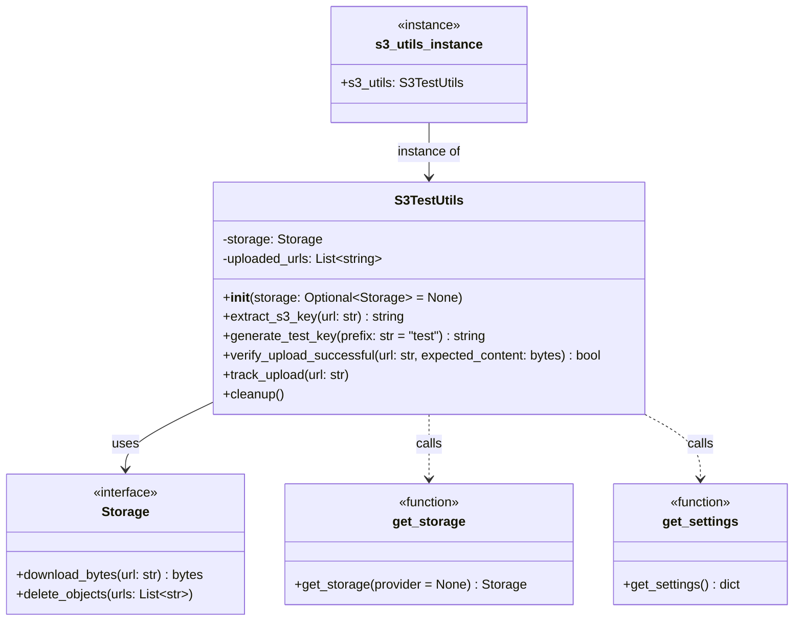

# Diagram: common/document_service/src/api/tests/integration/s3_test_utils.py

> Auto-generated by Obscura crawlers

## Mermaid

```mermaid
classDiagram
    class S3TestUtils {
        -storage: Storage
        -uploaded_urls: List~string~
        +__init__(storage: Optional~Storage~ = None)
        +extract_s3_key(url: str) string
        +generate_test_key(prefix: str = "test") string
        +verify_upload_successful(url: str, expected_content: bytes) bool
        +track_upload(url: str)
        +cleanup()
    }

    class Storage <<interface>> {
        +download_bytes(url: str) bytes
        +delete_objects(urls: List~str~)
    }

    class get_storage <<function>> {
        +get_storage(provider = None) Storage
    }

    class get_settings <<function>> {
        +get_settings() dict
    }

    class s3_utils_instance <<instance>> {
        +s3_utils: S3TestUtils
    }

    S3TestUtils --> Storage : uses
    S3TestUtils ..> get_storage : calls
    S3TestUtils ..> get_settings : calls
    s3_utils_instance --> S3TestUtils : instance of
```

> SVG rendering failed for this diagram.
