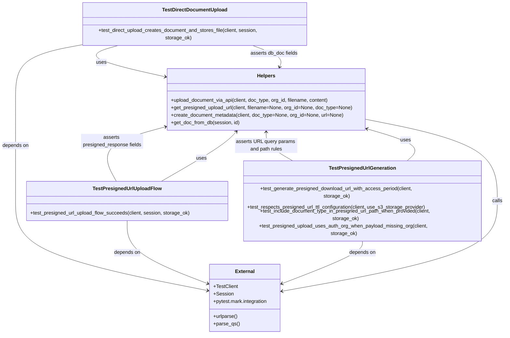

# Diagram: common/document_service/src/api/tests/integration/test_02_document_upload_flows.py

> Auto-generated by Obscura crawlers

## Mermaid

### SVG

<svg id="container" width="1630.84375" xmlns="http://www.w3.org/2000/svg" class="classDiagram" height="1000" viewBox="0 0 1630.84375 1000" role="graphics-document document" aria-roledescription="class"><g><defs><marker id="container_class-aggregationStart" class="marker aggregation class" refX="18" refY="7" markerWidth="190" markerHeight="240" orient="auto"><path d="M 18,7 L9,13 L1,7 L9,1 Z"></path></marker></defs><defs><marker id="container_class-aggregationEnd" class="marker aggregation class" refX="1" refY="7" markerWidth="20" markerHeight="28" orient="auto"><path d="M 18,7 L9,13 L1,7 L9,1 Z"></path></marker></defs><defs><marker id="container_class-extensionStart" class="marker extension class" refX="18" refY="7" markerWidth="190" markerHeight="240" orient="auto"><path d="M 1,7 L18,13 V 1 Z"></path></marker></defs><defs><marker id="container_class-extensionEnd" class="marker extension class" refX="1" refY="7" markerWidth="20" markerHeight="28" orient="auto"><path d="M 1,1 V 13 L18,7 Z"></path></marker></defs><defs><marker id="container_class-compositionStart" class="marker composition class" refX="18" refY="7" markerWidth="190" markerHeight="240" orient="auto"><path d="M 18,7 L9,13 L1,7 L9,1 Z"></path></marker></defs><defs><marker id="container_class-compositionEnd" class="marker composition class" refX="1" refY="7" markerWidth="20" markerHeight="28" orient="auto"><path d="M 18,7 L9,13 L1,7 L9,1 Z"></path></marker></defs><defs><marker id="container_class-dependencyStart" class="marker dependency class" refX="6" refY="7" markerWidth="190" markerHeight="240" orient="auto"><path d="M 5,7 L9,13 L1,7 L9,1 Z"></path></marker></defs><defs><marker id="container_class-dependencyEnd" class="marker dependency class" refX="13" refY="7" markerWidth="20" markerHeight="28" orient="auto"><path d="M 18,7 L9,13 L14,7 L9,1 Z"></path></marker></defs><defs><marker id="container_class-lollipopStart" class="marker lollipop class" refX="13" refY="7" markerWidth="190" markerHeight="240" orient="auto"><circle stroke="black" fill="transparent" cx="7" cy="7" r="6"></circle></marker></defs><defs><marker id="container_class-lollipopEnd" class="marker lollipop class" refX="1" refY="7" markerWidth="190" markerHeight="240" orient="auto"><circle stroke="black" fill="transparent" cx="7" cy="7" r="6"></circle></marker></defs><g class="root"><g class="clusters"></g><g class="edgePaths"><path d="M388.247,134L364.828,140.167C341.41,146.333,294.574,158.667,318.252,175.363C341.929,192.059,436.12,213.117,483.215,223.647L530.311,234.176" id="id_TestDirectDocumentUpload_Helpers_1" class="edge-thickness-normal edge-pattern-solid relation" style=";;;" data-edge="true" data-et="edge" data-id="id_TestDirectDocumentUpload_Helpers_1" data-points="W3sieCI6Mzg4LjI0NjUwMzkwNjI1MDA0LCJ5IjoxMzR9LHsieCI6MjQ3LjczODI4MTI1LCJ5IjoxNzF9LHsieCI6NTM2LjE2NjAxNTYyNSwieSI6MjM1LjQ4NTAzNjA3MzMyMTh9XQ==" marker-end="url(#container_class-dependencyEnd)"></path><path d="M540.64,540L570.457,525.833C600.275,511.667,659.91,483.333,696.581,461.735C733.252,440.137,746.96,425.274,753.813,417.842L760.667,410.411" id="id_TestPresignedUrlUploadFlow_Helpers_2" class="edge-thickness-normal edge-pattern-solid relation" style=";;;" data-edge="true" data-et="edge" data-id="id_TestPresignedUrlUploadFlow_Helpers_2" data-points="W3sieCI6NTQwLjYzOTUyOTY2NjM4NTEsInkiOjU0MH0seyJ4Ijo3MTkuNTQ0OTIxODc1LCJ5Ijo0NTV9LHsieCI6NzY0LjczNDkwMjg3MTYyMTcsInkiOjQwNn1d" marker-end="url(#container_class-dependencyEnd)"></path><path d="M1302.117,504L1313.218,495.833C1324.32,487.667,1346.522,471.333,1326.448,454.167C1306.374,437.001,1244.023,419.002,1212.848,410.002L1181.673,401.003" id="id_TestPresignedUrlGeneration_Helpers_3" class="edge-thickness-normal edge-pattern-solid relation" style=";;;" data-edge="true" data-et="edge" data-id="id_TestPresignedUrlGeneration_Helpers_3" data-points="W3sieCI6MTMwMi4xMTcxNzQzMDMyMDk0LCJ5Ijo1MDR9LHsieCI6MTM2OC43MjQ2MDkzNzUsInkiOjQ1NX0seyJ4IjoxMTc1LjkwODIwMzEyNSwieSI6Mzk5LjMzODc0ODAxOTAxNzQzfV0=" marker-end="url(#container_class-dependencyEnd)"></path><path d="M264.267,134L228.713,140.167C193.16,146.333,122.053,158.667,86.499,187.5C50.945,216.333,50.945,261.667,50.945,309C50.945,356.333,50.945,405.667,50.945,455C50.945,504.333,50.945,553.667,50.945,601C50.945,648.333,50.945,693.667,153.492,736.513C256.038,779.359,461.131,819.718,563.678,839.898L666.224,860.078" id="id_TestDirectDocumentUpload_External_4" class="edge-thickness-normal edge-pattern-solid relation" style=";;;" data-edge="true" data-et="edge" data-id="id_TestDirectDocumentUpload_External_4" data-points="W3sieCI6MjY0LjI2NjkzMzU5Mzc1LCJ5IjoxMzR9LHsieCI6NTAuOTQ1MzEyNSwieSI6MTcxfSx7IngiOjUwLjk0NTMxMjUsInkiOjMwN30seyJ4Ijo1MC45NDUzMTI1LCJ5Ijo0NTV9LHsieCI6NTAuOTQ1MzEyNSwieSI6NjAzfSx7IngiOjUwLjk0NTMxMjUsInkiOjczOX0seyJ4Ijo2NzIuMTExMzI4MTI1LCJ5Ijo4NjEuMjM2MDAxMjE5MzAyMX1d" marker-end="url(#container_class-dependencyEnd)"></path><path d="M408.039,666L408.039,678.167C408.039,690.333,408.039,714.667,451.117,743.282C494.195,771.897,580.35,804.793,623.428,821.242L666.506,837.69" id="id_TestPresignedUrlUploadFlow_External_5" class="edge-thickness-normal edge-pattern-solid relation" style=";;;" data-edge="true" data-et="edge" data-id="id_TestPresignedUrlUploadFlow_External_5" data-points="W3sieCI6NDA4LjAzOTA2MjUsInkiOjY2Nn0seyJ4Ijo0MDguMDM5MDYyNSwieSI6NzM5fSx7IngiOjY3Mi4xMTEzMjgxMjUsInkiOjgzOS44MzAyMzQ1Nzk1MjF9XQ==" marker-end="url(#container_class-dependencyEnd)"></path><path d="M1167.543,702L1167.543,708.167C1167.543,714.333,1167.543,726.667,1124.465,749.282C1081.387,771.897,995.232,804.793,952.154,821.242L909.076,837.69" id="id_TestPresignedUrlGeneration_External_6" class="edge-thickness-normal edge-pattern-solid relation" style=";;;" data-edge="true" data-et="edge" data-id="id_TestPresignedUrlGeneration_External_6" data-points="W3sieCI6MTE2Ny41NDI5Njg3NSwieSI6NzAyfSx7IngiOjExNjcuNTQyOTY4NzUsInkiOjczOX0seyJ4Ijo5MDMuNDcwNzAzMTI1LCJ5Ijo4MzkuODMwMjM0NTc5NTIxfV0=" marker-end="url(#container_class-dependencyEnd)"></path><path d="M1175.908,370.091L1247.657,384.242C1319.405,398.394,1462.902,426.697,1534.65,465.515C1606.398,504.333,1606.398,553.667,1606.398,601C1606.398,648.333,1606.398,693.667,1490.228,736.911C1374.059,780.154,1141.719,821.309,1025.549,841.886L909.379,862.463" id="id_Helpers_External_7" class="edge-thickness-normal edge-pattern-solid relation" style=";;;" data-edge="true" data-et="edge" data-id="id_Helpers_External_7" data-points="W3sieCI6MTE3NS45MDgyMDMxMjUsInkiOjM3MC4wOTA4MzM4NDMwNzA0fSx7IngiOjE2MDYuMzk4NDM3NSwieSI6NDU1fSx7IngiOjE2MDYuMzk4NDM3NSwieSI6NjAzfSx7IngiOjE2MDYuMzk4NDM3NSwieSI6NzM5fSx7IngiOjkwMy40NzA3MDMxMjUsInkiOjg2My41MDk2NDc0MzM4MzI3fV0=" marker-end="url(#container_class-dependencyEnd)"></path><path d="M899.435,202.459L901.611,197.215C903.788,191.972,908.141,181.486,892.742,170.076C877.344,158.667,842.193,146.333,824.618,140.167L807.043,134" id="id_Helpers_TestDirectDocumentUpload_8" class="edge-thickness-normal edge-pattern-solid relation" style=";;;" data-edge="true" data-et="edge" data-id="id_Helpers_TestDirectDocumentUpload_8" data-points="W3sieCI6ODk3LjEzNDUwNzEyMzE2MTcsInkiOjIwOH0seyJ4Ijo5MTIuNDk0MTQwNjI1LCJ5IjoxNzF9LHsieCI6ODA3LjA0MjY5NTMxMjUsInkiOjEzNH1d" marker-start="url(#container_class-dependencyStart)"></path><path d="M530.376,395.425L493.807,405.354C457.239,415.283,384.102,435.142,356.825,459.237C329.549,483.333,348.133,511.667,357.425,525.833L366.717,540" id="id_Helpers_TestPresignedUrlUploadFlow_9" class="edge-thickness-normal edge-pattern-solid relation" style=";;;" data-edge="true" data-et="edge" data-id="id_Helpers_TestPresignedUrlUploadFlow_9" data-points="W3sieCI6NTM2LjE2NjAxNTYyNSwieSI6MzkzLjg1MjU2MDQwNDQ3NjJ9LHsieCI6MzEwLjk2NDg0Mzc1LCJ5Ijo0NTV9LHsieCI6MzY2LjcxNjkyODg0MjkwNTQsInkiOjU0MH1d" marker-start="url(#container_class-dependencyStart)"></path><path d="M856.037,412L856.037,419.167C856.037,426.333,856.037,440.667,873.226,456C890.415,471.333,924.793,487.667,941.982,495.833L959.171,504" id="id_Helpers_TestPresignedUrlGeneration_10" class="edge-thickness-normal edge-pattern-solid relation" style=";;;" data-edge="true" data-et="edge" data-id="id_Helpers_TestPresignedUrlGeneration_10" data-points="W3sieCI6ODU2LjAzNzEwOTM3NSwieSI6NDA2fSx7IngiOjg1Ni4wMzcxMDkzNzUsInkiOjQ1NX0seyJ4Ijo5NTkuMTcwODA2MDU5OTY2MywieSI6NTA0fV0=" marker-start="url(#container_class-dependencyStart)"></path></g><g class="edgeLabels"><g class="edgeLabel" transform="translate(321.05341, 187.39138)"><g class="label" data-id="id_TestDirectDocumentUpload_Helpers_1" transform="translate(-16.4921875, -12)"><foreignObject width="32.984375" height="24">

uses

</foreignObject></g></g><g class="edgeLabel" transform="translate(660.19574, 483.19748)"><g class="label" data-id="id_TestPresignedUrlUploadFlow_Helpers_2" transform="translate(-16.4921875, -12)"><foreignObject width="32.984375" height="24">

uses

</foreignObject></g></g><g class="edgeLabel" transform="translate(1312.03915, 438.63633)"><g class="label" data-id="id_TestPresignedUrlGeneration_Helpers_3" transform="translate(-16.4921875, -12)"><foreignObject width="32.984375" height="24">

uses

</foreignObject></g></g><g class="edgeLabel" transform="translate(50.9453125, 455)"><g class="label" data-id="id_TestDirectDocumentUpload_External_4" transform="translate(-42.9453125, -12)"><foreignObject width="85.890625" height="24">

depends on

</foreignObject></g></g><g class="edgeLabel" transform="translate(408.0390625, 739)"><g class="label" data-id="id_TestPresignedUrlUploadFlow_External_5" transform="translate(-42.9453125, -12)"><foreignObject width="85.890625" height="24">

depends on

</foreignObject></g></g><g class="edgeLabel" transform="translate(1167.54296875, 739)"><g class="label" data-id="id_TestPresignedUrlGeneration_External_6" transform="translate(-42.9453125, -12)"><foreignObject width="85.890625" height="24">

depends on

</foreignObject></g></g><g class="edgeLabel" transform="translate(1606.3984375, 603)"><g class="label" data-id="id_Helpers_External_7" transform="translate(-16.4453125, -12)"><foreignObject width="32.890625" height="24">

calls

</foreignObject></g></g><g class="edgeLabel" transform="translate(878.66943, 159.13184)"><g class="label" data-id="id_Helpers_TestDirectDocumentUpload_8" transform="translate(-76.421875, -12)"><foreignObject width="152.84375" height="24">

asserts db_doc fields

</foreignObject></g></g><g class="edgeLabel" transform="translate(374.51499, 437.74463)"><g class="label" data-id="id_Helpers_TestPresignedUrlUploadFlow_9" transform="translate(-100, -24)"><foreignObject width="200" height="48">

asserts presigned_response fields

</foreignObject></g></g><g class="edgeLabel" transform="translate(856.037109375, 455)"><g class="label" data-id="id_Helpers_TestPresignedUrlGeneration_10" transform="translate(-100, -24)"><foreignObject width="200" height="48">

asserts URL query params and path rules

</foreignObject></g></g></g><g class="nodes"><g class="node default" id="classId-TestDirectDocumentUpload-0" transform="translate(627.490234375, 71)"><g class="basic label-container"><path d="M-364.09375 -63 L364.09375 -63 L364.09375 63 L-364.09375 63" stroke="none" stroke-width="0" fill="#ECECFF" style=""></path><path d="M-364.09375 -63 C-142.88470801265944 -63, 78.32433397468111 -63, 364.09375 -63 M-364.09375 -63 C-144.6805769798826 -63, 74.7325960402348 -63, 364.09375 -63 M364.09375 -63 C364.09375 -37.073066787014206, 364.09375 -11.146133574028411, 364.09375 63 M364.09375 -63 C364.09375 -33.63424319331915, 364.09375 -4.268486386638301, 364.09375 63 M364.09375 63 C190.2699996906458 63, 16.44624938129158 63, -364.09375 63 M364.09375 63 C127.55994348749792 63, -108.97386302500416 63, -364.09375 63 M-364.09375 63 C-364.09375 17.50693964121195, -364.09375 -27.9861207175761, -364.09375 -63 M-364.09375 63 C-364.09375 37.236117370479505, -364.09375 11.472234740959003, -364.09375 -63" stroke="#9370DB" stroke-width="1.3" fill="none" stroke-dasharray="0 0" style=""></path></g><g class="annotation-group text" transform="translate(0, -39)"></g><g class="label-group text" transform="translate(-100.203125, -39)"><g class="label" style="font-weight: bolder" transform="translate(0,-12)"><foreignObject width="200.40625" height="24">

TestDirectDocumentUpload

</foreignObject></g></g><g class="members-group text" transform="translate(-352.09375, 9)"></g><g class="methods-group text" transform="translate(-352.09375, 39)"><g class="label" style="" transform="translate(0,-12)"><foreignObject width="603.984375" height="24">

+test_direct_upload_creates_document_and_stores_file(client, session, storage_ok)

</foreignObject></g></g><g class="divider" style=""><path d="M-364.09375 -15 C-172.99050838361956 -15, 18.11273323276089 -15, 364.09375 -15 M-364.09375 -15 C-166.916653280723 -15, 30.260443438553978 -15, 364.09375 -15" stroke="#9370DB" stroke-width="1.3" fill="none" stroke-dasharray="0 0" style=""></path></g><g class="divider" style=""><path d="M-364.09375 9 C-172.50464559422258 9, 19.08445881155484 9, 364.09375 9 M-364.09375 9 C-164.8160390995835 9, 34.46167180083302 9, 364.09375 9" stroke="#9370DB" stroke-width="1.3" fill="none" stroke-dasharray="0 0" style=""></path></g></g><g class="node default" id="classId-TestPresignedUrlUploadFlow-1" transform="translate(408.0390625, 603)"><g class="basic label-container"><path d="M-322.09375 -63 L322.09375 -63 L322.09375 63 L-322.09375 63" stroke="none" stroke-width="0" fill="#ECECFF" style=""></path><path d="M-322.09375 -63 C-143.2802216861504 -63, 35.533306627699176 -63, 322.09375 -63 M-322.09375 -63 C-112.20423461815585 -63, 97.6852807636883 -63, 322.09375 -63 M322.09375 -63 C322.09375 -31.25417994061005, 322.09375 0.4916401187798982, 322.09375 63 M322.09375 -63 C322.09375 -18.81914110759248, 322.09375 25.361717784815042, 322.09375 63 M322.09375 63 C187.43791372893529 63, 52.78207745787057 63, -322.09375 63 M322.09375 63 C85.47931795379327 63, -151.13511409241346 63, -322.09375 63 M-322.09375 63 C-322.09375 20.076430959705903, -322.09375 -22.847138080588195, -322.09375 -63 M-322.09375 63 C-322.09375 16.55332056685902, -322.09375 -29.893358866281957, -322.09375 -63" stroke="#9370DB" stroke-width="1.3" fill="none" stroke-dasharray="0 0" style=""></path></g><g class="annotation-group text" transform="translate(0, -39)"></g><g class="label-group text" transform="translate(-105.34375, -39)"><g class="label" style="font-weight: bolder" transform="translate(0,-12)"><foreignObject width="210.6875" height="24">

TestPresignedUrlUploadFlow

</foreignObject></g></g><g class="members-group text" transform="translate(-310.09375, 9)"></g><g class="methods-group text" transform="translate(-310.09375, 39)"><g class="label" style="" transform="translate(0,-12)"><foreignObject width="514.84375" height="24">

+test_presigned_url_upload_flow_succeeds(client, session, storage_ok)

</foreignObject></g></g><g class="divider" style=""><path d="M-322.09375 -15 C-76.38663235205158 -15, 169.32048529589684 -15, 322.09375 -15 M-322.09375 -15 C-129.67755168070664 -15, 62.738646638586715 -15, 322.09375 -15" stroke="#9370DB" stroke-width="1.3" fill="none" stroke-dasharray="0 0" style=""></path></g><g class="divider" style=""><path d="M-322.09375 9 C-95.65246900365185 9, 130.7888119926963 9, 322.09375 9 M-322.09375 9 C-185.98975176184945 9, -49.885753523698895 9, 322.09375 9" stroke="#9370DB" stroke-width="1.3" fill="none" stroke-dasharray="0 0" style=""></path></g></g><g class="node default" id="classId-TestPresignedUrlGeneration-2" transform="translate(1167.54296875, 603)"><g class="basic label-container"><path d="M-387.41015625 -99 L387.41015625 -99 L387.41015625 99 L-387.41015625 99" stroke="none" stroke-width="0" fill="#ECECFF" style=""></path><path d="M-387.41015625 -99 C-93.81496771543004 -99, 199.7802208191399 -99, 387.41015625 -99 M-387.41015625 -99 C-202.85617377039014 -99, -18.302191290780286 -99, 387.41015625 -99 M387.41015625 -99 C387.41015625 -32.036494364368, 387.41015625 34.92701127126401, 387.41015625 99 M387.41015625 -99 C387.41015625 -41.62496647738242, 387.41015625 15.750067045235156, 387.41015625 99 M387.41015625 99 C123.85388432025218 99, -139.70238760949564 99, -387.41015625 99 M387.41015625 99 C185.0404525793341 99, -17.3292510913318 99, -387.41015625 99 M-387.41015625 99 C-387.41015625 33.00856526590513, -387.41015625 -32.98286946818973, -387.41015625 -99 M-387.41015625 99 C-387.41015625 32.756315130382774, -387.41015625 -33.48736973923445, -387.41015625 -99" stroke="#9370DB" stroke-width="1.3" fill="none" stroke-dasharray="0 0" style=""></path></g><g class="annotation-group text" transform="translate(0, -75)"></g><g class="label-group text" transform="translate(-102.9765625, -75)"><g class="label" style="font-weight: bolder" transform="translate(0,-12)"><foreignObject width="205.953125" height="24">

TestPresignedUrlGeneration

</foreignObject></g></g><g class="members-group text" transform="translate(-375.41015625, -27)"></g><g class="methods-group text" transform="translate(-375.41015625, 3)"><g class="label" style="" transform="translate(0,-12)"><foreignObject width="582.796875" height="24">

+test_generate_presigned_download_url_with_access_period(client, storage_ok)

</foreignObject></g><g class="label" style="" transform="translate(0,12)"><foreignObject width="579.75" height="24">

+test_respects_presigned_url_ttl_configuration(client, use_s3_storage_provider)

</foreignObject></g><g class="label" style="" transform="translate(0,36)"><foreignObject width="647.84375" height="24">

+test_include_document_type_in_presigned_url_path_when_provided(client, storage_ok)

</foreignObject></g><g class="label" style="" transform="translate(0,60)"><foreignObject width="633.9375" height="24">

+test_presigned_upload_uses_auth_org_when_payload_missing_org(client, storage_ok)

</foreignObject></g></g><g class="divider" style=""><path d="M-387.41015625 -51 C-167.16855703471037 -51, 53.07304218057925 -51, 387.41015625 -51 M-387.41015625 -51 C-98.98628936946955 -51, 189.4375775110609 -51, 387.41015625 -51" stroke="#9370DB" stroke-width="1.3" fill="none" stroke-dasharray="0 0" style=""></path></g><g class="divider" style=""><path d="M-387.41015625 -27 C-186.9059184511847 -27, 13.598319347630593 -27, 387.41015625 -27 M-387.41015625 -27 C-208.38011104079482 -27, -29.35006583158963 -27, 387.41015625 -27" stroke="#9370DB" stroke-width="1.3" fill="none" stroke-dasharray="0 0" style=""></path></g></g><g class="node default" id="classId-Helpers-3" transform="translate(856.037109375, 307)"><g class="basic label-container"><path d="M-319.87109375 -99 L319.87109375 -99 L319.87109375 99 L-319.87109375 99" stroke="none" stroke-width="0" fill="#ECECFF" style=""></path><path d="M-319.87109375 -99 C-123.74809666006718 -99, 72.37490042986565 -99, 319.87109375 -99 M-319.87109375 -99 C-129.80370487842814 -99, 60.26368399314373 -99, 319.87109375 -99 M319.87109375 -99 C319.87109375 -34.926987076341774, 319.87109375 29.14602584731645, 319.87109375 99 M319.87109375 -99 C319.87109375 -39.23356385325607, 319.87109375 20.532872293487856, 319.87109375 99 M319.87109375 99 C160.78672815741578 99, 1.7023625648315601 99, -319.87109375 99 M319.87109375 99 C160.37509363947086 99, 0.8790935289417234 99, -319.87109375 99 M-319.87109375 99 C-319.87109375 51.35907548015066, -319.87109375 3.7181509603013154, -319.87109375 -99 M-319.87109375 99 C-319.87109375 57.245127768488494, -319.87109375 15.490255536976989, -319.87109375 -99" stroke="#9370DB" stroke-width="1.3" fill="none" stroke-dasharray="0 0" style=""></path></g><g class="annotation-group text" transform="translate(0, -75)"></g><g class="label-group text" transform="translate(-28.2890625, -75)"><g class="label" style="font-weight: bolder" transform="translate(0,-12)"><foreignObject width="56.578125" height="24">

Helpers

</foreignObject></g></g><g class="members-group text" transform="translate(-307.87109375, -27)"></g><g class="methods-group text" transform="translate(-307.87109375, 3)"><g class="label" style="" transform="translate(0,-12)"><foreignObject width="513.875" height="24">

+upload_document_via_api(client, doc_type, org_id, filename, content)

</foreignObject></g><g class="label" style="" transform="translate(0,12)"><foreignObject width="587.453125" height="24">

+get_presigned_upload_url(client, filename=None, org_id=None, doc_type=None)

</foreignObject></g><g class="label" style="" transform="translate(0,36)"><foreignObject width="558.359375" height="24">

+create_document_metadata(client, doc_type=None, org_id=None, url=None)

</foreignObject></g><g class="label" style="" transform="translate(0,60)"><foreignObject width="221.03125" height="24">

+get_doc_from_db(session, id)

</foreignObject></g></g><g class="divider" style=""><path d="M-319.87109375 -51 C-176.92607066449483 -51, -33.98104757898966 -51, 319.87109375 -51 M-319.87109375 -51 C-165.3946657284731 -51, -10.918237706946172 -51, 319.87109375 -51" stroke="#9370DB" stroke-width="1.3" fill="none" stroke-dasharray="0 0" style=""></path></g><g class="divider" style=""><path d="M-319.87109375 -27 C-184.65647778736164 -27, -49.441861824723276 -27, 319.87109375 -27 M-319.87109375 -27 C-92.42979220040485 -27, 135.0115093491903 -27, 319.87109375 -27" stroke="#9370DB" stroke-width="1.3" fill="none" stroke-dasharray="0 0" style=""></path></g></g><g class="node default" id="classId-External-4" transform="translate(787.791015625, 884)"><g class="basic label-container"><path d="M-115.6796875 -108 L115.6796875 -108 L115.6796875 108 L-115.6796875 108" stroke="none" stroke-width="0" fill="#ECECFF" style=""></path><path d="M-115.6796875 -108 C-32.301858990521936 -108, 51.07596951895613 -108, 115.6796875 -108 M-115.6796875 -108 C-26.785533320384474 -108, 62.10862085923105 -108, 115.6796875 -108 M115.6796875 -108 C115.6796875 -45.992685386055335, 115.6796875 16.01462922788933, 115.6796875 108 M115.6796875 -108 C115.6796875 -60.862008928934756, 115.6796875 -13.724017857869512, 115.6796875 108 M115.6796875 108 C37.87849489286906 108, -39.922697714261886 108, -115.6796875 108 M115.6796875 108 C37.11786639018558 108, -41.443954719628834 108, -115.6796875 108 M-115.6796875 108 C-115.6796875 37.1756668463172, -115.6796875 -33.6486663073656, -115.6796875 -108 M-115.6796875 108 C-115.6796875 37.19995206358236, -115.6796875 -33.60009587283528, -115.6796875 -108" stroke="#9370DB" stroke-width="1.3" fill="none" stroke-dasharray="0 0" style=""></path></g><g class="annotation-group text" transform="translate(0, -84)"></g><g class="label-group text" transform="translate(-30.171875, -84)"><g class="label" style="font-weight: bolder" transform="translate(0,-12)"><foreignObject width="60.34375" height="24">

External

</foreignObject></g></g><g class="members-group text" transform="translate(-103.6796875, -36)"><g class="label" style="" transform="translate(0,-12)"><foreignObject width="78.421875" height="24">

+TestClient

</foreignObject></g><g class="label" style="" transform="translate(0,12)"><foreignObject width="62.8125" height="24">

+Session

</foreignObject></g><g class="label" style="" transform="translate(0,36)"><foreignObject width="177.1875" height="24">

+pytest.mark.integration

</foreignObject></g></g><g class="methods-group text" transform="translate(-103.6796875, 60)"><g class="label" style="" transform="translate(0,-12)"><foreignObject width="78.71875" height="24">

+urlparse()

</foreignObject></g><g class="label" style="" transform="translate(0,12)"><foreignObject width="83.25" height="24">

+parse_qs()

</foreignObject></g></g><g class="divider" style=""><path d="M-115.6796875 -60 C-41.321235263647424 -60, 33.03721697270515 -60, 115.6796875 -60 M-115.6796875 -60 C-28.89047088209459 -60, 57.89874573581082 -60, 115.6796875 -60" stroke="#9370DB" stroke-width="1.3" fill="none" stroke-dasharray="0 0" style=""></path></g><g class="divider" style=""><path d="M-115.6796875 36 C-51.002759952698355 36, 13.67416759460329 36, 115.6796875 36 M-115.6796875 36 C-43.22013465765194 36, 29.23941818469612 36, 115.6796875 36" stroke="#9370DB" stroke-width="1.3" fill="none" stroke-dasharray="0 0" style=""></path></g></g></g></g></g></svg>
