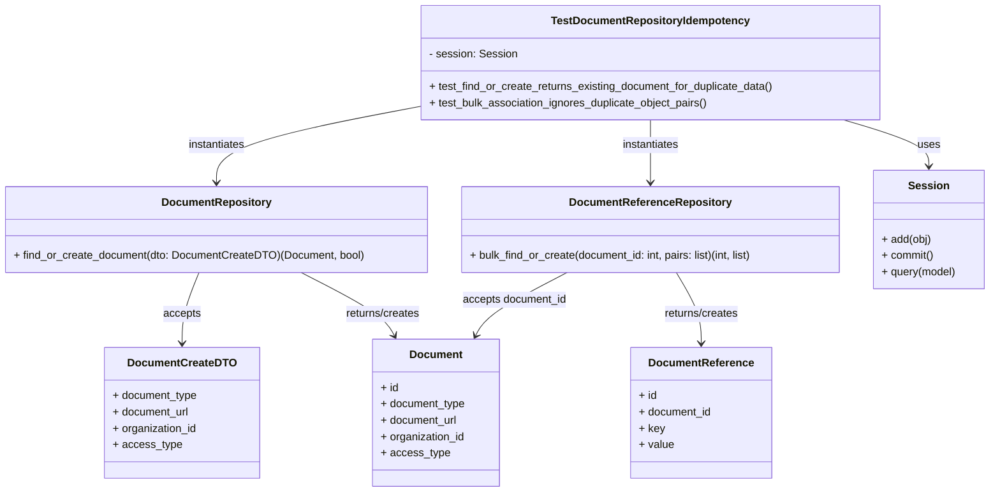
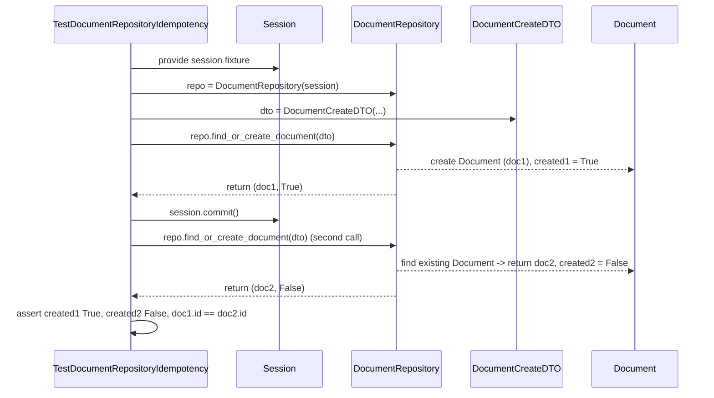

# Diagram: common/document_service/src/api/tests/unit/test_repositories.py


> Auto-generated by Obscura crawlers

## Diagram 1



### SVG

<svg id="container" width="1454.234375" xmlns="http://www.w3.org/2000/svg" class="classDiagram" height="722" viewBox="0 0 1454.234375 722" role="graphics-document document" aria-roledescription="class"><style>#container{font-family:"trebuchet ms",verdana,arial,sans-serif;font-size:16px;fill:#333;}@keyframes edge-animation-frame{from{stroke-dashoffset:0;}}@keyframes dash{to{stroke-dashoffset:0;}}#container .edge-animation-slow{stroke-dasharray:9,5!important;stroke-dashoffset:900;animation:dash 50s linear infinite;stroke-linecap:round;}#container .edge-animation-fast{stroke-dasharray:9,5!important;stroke-dashoffset:900;animation:dash 20s linear infinite;stroke-linecap:round;}#container .error-icon{fill:#552222;}#container .error-text{fill:#552222;stroke:#552222;}#container .edge-thickness-normal{stroke-width:1px;}#container .edge-thickness-thick{stroke-width:3.5px;}#container .edge-pattern-solid{stroke-dasharray:0;}#container .edge-thickness-invisible{stroke-width:0;fill:none;}#container .edge-pattern-dashed{stroke-dasharray:3;}#container .edge-pattern-dotted{stroke-dasharray:2;}#container .marker{fill:#333333;stroke:#333333;}#container .marker.cross{stroke:#333333;}#container svg{font-family:"trebuchet ms",verdana,arial,sans-serif;font-size:16px;}#container p{margin:0;}#container g.classGroup text{fill:#9370DB;stroke:none;font-family:"trebuchet ms",verdana,arial,sans-serif;font-size:10px;}#container g.classGroup text .title{font-weight:bolder;}#container .nodeLabel,#container .edgeLabel{color:#131300;}#container .edgeLabel .label rect{fill:#ECECFF;}#container .label text{fill:#131300;}#container .labelBkg{background:#ECECFF;}#container .edgeLabel .label span{background:#ECECFF;}#container .classTitle{font-weight:bolder;}#container .node rect,#container .node circle,#container .node ellipse,#container .node polygon,#container .node path{fill:#ECECFF;stroke:#9370DB;stroke-width:1px;}#container .divider{stroke:#9370DB;stroke-width:1;}#container g.clickable{cursor:pointer;}#container g.classGroup rect{fill:#ECECFF;stroke:#9370DB;}#container g.classGroup line{stroke:#9370DB;stroke-width:1;}#container .classLabel .box{stroke:none;stroke-width:0;fill:#ECECFF;opacity:0.5;}#container .classLabel .label{fill:#9370DB;font-size:10px;}#container .relation{stroke:#333333;stroke-width:1;fill:none;}#container .dashed-line{stroke-dasharray:3;}#container .dotted-line{stroke-dasharray:1 2;}#container #compositionStart,#container .composition{fill:#333333!important;stroke:#333333!important;stroke-width:1;}#container #compositionEnd,#container .composition{fill:#333333!important;stroke:#333333!important;stroke-width:1;}#container #dependencyStart,#container .dependency{fill:#333333!important;stroke:#333333!important;stroke-width:1;}#container #dependencyStart,#container .dependency{fill:#333333!important;stroke:#333333!important;stroke-width:1;}#container #extensionStart,#container .extension{fill:transparent!important;stroke:#333333!important;stroke-width:1;}#container #extensionEnd,#container .extension{fill:transparent!important;stroke:#333333!important;stroke-width:1;}#container #aggregationStart,#container .aggregation{fill:transparent!important;stroke:#333333!important;stroke-width:1;}#container #aggregationEnd,#container .aggregation{fill:transparent!important;stroke:#333333!important;stroke-width:1;}#container #lollipopStart,#container .lollipop{fill:#ECECFF!important;stroke:#333333!important;stroke-width:1;}#container #lollipopEnd,#container .lollipop{fill:#ECECFF!important;stroke:#333333!important;stroke-width:1;}#container .edgeTerminals{font-size:11px;line-height:initial;}#container .classTitleText{text-anchor:middle;font-size:18px;fill:#333;}#container .label-icon{display:inline-block;height:1em;overflow:visible;vertical-align:-0.125em;}#container .node .label-icon path{fill:currentColor;stroke:revert;stroke-width:revert;}#container :root{--mermaid-font-family:"trebuchet ms",verdana,arial,sans-serif;}</style><g><defs><marker id="container_class-aggregationStart" class="marker aggregation class" refX="18" refY="7" markerWidth="190" markerHeight="240" orient="auto"><path d="M 18,7 L9,13 L1,7 L9,1 Z"></path></marker></defs><defs><marker id="container_class-aggregationEnd" class="marker aggregation class" refX="1" refY="7" markerWidth="20" markerHeight="28" orient="auto"><path d="M 18,7 L9,13 L1,7 L9,1 Z"></path></marker></defs><defs><marker id="container_class-extensionStart" class="marker extension class" refX="18" refY="7" markerWidth="190" markerHeight="240" orient="auto"><path d="M 1,7 L18,13 V 1 Z"></path></marker></defs><defs><marker id="container_class-extensionEnd" class="marker extension class" refX="1" refY="7" markerWidth="20" markerHeight="28" orient="auto"><path d="M 1,1 V 13 L18,7 Z"></path></marker></defs><defs><marker id="container_class-compositionStart" class="marker composition class" refX="18" refY="7" markerWidth="190" markerHeight="240" orient="auto"><path d="M 18,7 L9,13 L1,7 L9,1 Z"></path></marker></defs><defs><marker id="container_class-compositionEnd" class="marker composition class" refX="1" refY="7" markerWidth="20" markerHeight="28" orient="auto"><path d="M 18,7 L9,13 L1,7 L9,1 Z"></path></marker></defs><defs><marker id="container_class-dependencyStart" class="marker dependency class" refX="6" refY="7" markerWidth="190" markerHeight="240" orient="auto"><path d="M 5,7 L9,13 L1,7 L9,1 Z"></path></marker></defs><defs><marker id="container_class-dependencyEnd" class="marker dependency class" refX="13" refY="7" markerWidth="20" markerHeight="28" orient="auto"><path d="M 18,7 L9,13 L14,7 L9,1 Z"></path></marker></defs><defs><marker id="container_class-lollipopStart" class="marker lollipop class" refX="13" refY="7" markerWidth="190" markerHeight="240" orient="auto"><circle stroke="black" fill="transparent" cx="7" cy="7" r="6"></circle></marker></defs><defs><marker id="container_class-lollipopEnd" class="marker lollipop class" refX="1" refY="7" markerWidth="190" markerHeight="240" orient="auto"><circle stroke="black" fill="transparent" cx="7" cy="7" r="6"></circle></marker></defs><g class="root"><g class="clusters"></g><g class="edgePaths"><path d="M1238.988,176L1259.988,182.167C1280.988,188.333,1322.988,200.667,1343.988,212C1364.988,223.333,1364.988,233.667,1364.988,238.833L1364.988,244" id="id_TestDocumentRepositoryIdempotency_Session_1" class="edge-thickness-normal edge-pattern-solid relation" style=";;;" data-edge="true" data-et="edge" data-id="id_TestDocumentRepositoryIdempotency_Session_1" data-points="W3sieCI6MTIzOC45ODgwODc1NTE2NTI4LCJ5IjoxNzZ9LHsieCI6MTM2NC45ODgyODEyNSwieSI6MjEzfSx7IngiOjEzNjQuOTg4MjgxMjUsInkiOjI1MH1d" marker-end="url(#container_class-dependencyEnd)"></path><path d="M615.512,156.007L565.437,165.506C515.362,175.004,415.212,194.002,365.137,212.668C315.063,231.333,315.063,249.667,315.063,258.833L315.063,268" id="id_TestDocumentRepositoryIdempotency_DocumentRepository_2" class="edge-thickness-normal edge-pattern-solid relation" style=";;;" data-edge="true" data-et="edge" data-id="id_TestDocumentRepositoryIdempotency_DocumentRepository_2" data-points="W3sieCI6NjE1LjUxMTcxODc1LCJ5IjoxNTYuMDA2NzM2Mjc0ODQwMDJ9LHsieCI6MzE1LjA2MjUsInkiOjIxM30seyJ4IjozMTUuMDYyNSwieSI6Mjc0fV0=" marker-end="url(#container_class-dependencyEnd)"></path><path d="M952.934,176L952.934,182.167C952.934,188.333,952.934,200.667,952.934,216C952.934,231.333,952.934,249.667,952.934,258.833L952.934,268" id="id_TestDocumentRepositoryIdempotency_DocumentReferenceRepository_3" class="edge-thickness-normal edge-pattern-solid relation" style=";;;" data-edge="true" data-et="edge" data-id="id_TestDocumentRepositoryIdempotency_DocumentReferenceRepository_3" data-points="W3sieCI6OTUyLjkzMzU5Mzc1LCJ5IjoxNzZ9LHsieCI6OTUyLjkzMzU5Mzc1LCJ5IjoyMTN9LHsieCI6OTUyLjkzMzU5Mzc1LCJ5IjoyNzR9XQ==" marker-end="url(#container_class-dependencyEnd)"></path><path d="M288.74,400L284.493,410.167C280.245,420.333,271.749,440.667,267.502,458C263.254,475.333,263.254,489.667,263.254,496.833L263.254,504" id="id_DocumentRepository_DocumentCreateDTO_4" class="edge-thickness-normal edge-pattern-solid relation" style=";;;" data-edge="true" data-et="edge" data-id="id_DocumentRepository_DocumentCreateDTO_4" data-points="W3sieCI6Mjg4Ljc0MDM5MTg4NTA4MDY3LCJ5Ijo0MDB9LHsieCI6MjYzLjI1MzkwNjI1LCJ5Ijo0NjF9LHsieCI6MjYzLjI1MzkwNjI1LCJ5Ijo1MTB9XQ==" marker-end="url(#container_class-dependencyEnd)"></path><path d="M438.087,400L457.94,410.167C477.793,420.333,517.499,440.667,540.15,456.116C562.801,471.566,568.397,482.132,571.195,487.415L573.992,492.698" id="id_DocumentRepository_Document_5" class="edge-thickness-normal edge-pattern-solid relation" style=";;;" data-edge="true" data-et="edge" data-id="id_DocumentRepository_Document_5" data-points="W3sieCI6NDM4LjA4NjU1MTc4OTMxNDUsInkiOjQwMH0seyJ4Ijo1NTcuMjA1MDc4MTI1LCJ5Ijo0NjF9LHsieCI6NTc2LjgwMDUyNTMyMzI3NTksInkiOjQ5OH1d" marker-end="url(#container_class-dependencyEnd)"></path><path d="M829.91,400L810.056,410.167C790.203,420.333,750.497,440.667,727.846,456.116C705.195,471.566,699.599,482.132,696.802,487.415L694.004,492.698" id="id_DocumentReferenceRepository_Document_6" class="edge-thickness-normal edge-pattern-solid relation" style=";;;" data-edge="true" data-et="edge" data-id="id_DocumentReferenceRepository_Document_6" data-points="W3sieCI6ODI5LjkwOTU0MTk2MDY4NTUsInkiOjQwMH0seyJ4Ijo3MTAuNzkxMDE1NjI1LCJ5Ijo0NjF9LHsieCI6NjkxLjE5NTU2ODQyNjcyNDEsInkiOjQ5OH1d" marker-end="url(#container_class-dependencyEnd)"></path><path d="M991.949,400L998.246,410.167C1004.542,420.333,1017.134,440.667,1023.43,458C1029.727,475.333,1029.727,489.667,1029.727,496.833L1029.727,504" id="id_DocumentReferenceRepository_DocumentReference_7" class="edge-thickness-normal edge-pattern-solid relation" style=";;;" data-edge="true" data-et="edge" data-id="id_DocumentReferenceRepository_DocumentReference_7" data-points="W3sieCI6OTkxLjk0OTM3NjI2MDA4MDYsInkiOjQwMH0seyJ4IjoxMDI5LjcyNjU2MjUsInkiOjQ2MX0seyJ4IjoxMDI5LjcyNjU2MjUsInkiOjUxMH1d" marker-end="url(#container_class-dependencyEnd)"></path></g><g class="edgeLabels"><g class="edgeLabel" transform="translate(1364.98828125, 213)"><g class="label" data-id="id_TestDocumentRepositoryIdempotency_Session_1" transform="translate(-16.4921875, -12)"><foreignObject width="32.984375" height="24"><div xmlns="http://www.w3.org/1999/xhtml" class="labelBkg" style="display: table-cell; white-space: nowrap; line-height: 1.5; max-width: 200px; text-align: center;"><span class="edgeLabel"><p>uses</p></span></div></foreignObject></g></g><g class="edgeLabel" transform="translate(315.0625, 213)"><g class="label" data-id="id_TestDocumentRepositoryIdempotency_DocumentRepository_2" transform="translate(-42.9140625, -12)"><foreignObject width="85.828125" height="24"><div xmlns="http://www.w3.org/1999/xhtml" class="labelBkg" style="display: table-cell; white-space: nowrap; line-height: 1.5; max-width: 200px; text-align: center;"><span class="edgeLabel"><p>instantiates</p></span></div></foreignObject></g></g><g class="edgeLabel" transform="translate(952.93359375, 213)"><g class="label" data-id="id_TestDocumentRepositoryIdempotency_DocumentReferenceRepository_3" transform="translate(-42.9140625, -12)"><foreignObject width="85.828125" height="24"><div xmlns="http://www.w3.org/1999/xhtml" class="labelBkg" style="display: table-cell; white-space: nowrap; line-height: 1.5; max-width: 200px; text-align: center;"><span class="edgeLabel"><p>instantiates</p></span></div></foreignObject></g></g><g class="edgeLabel" transform="translate(263.25390625, 461)"><g class="label" data-id="id_DocumentRepository_DocumentCreateDTO_4" transform="translate(-27.421875, -12)"><foreignObject width="54.84375" height="24"><div xmlns="http://www.w3.org/1999/xhtml" class="labelBkg" style="display: table-cell; white-space: nowrap; line-height: 1.5; max-width: 200px; text-align: center;"><span class="edgeLabel"><p>accepts</p></span></div></foreignObject></g></g><g class="edgeLabel" transform="translate(516.27902, 440.04197)"><g class="label" data-id="id_DocumentRepository_Document_5" transform="translate(-56.1953125, -12)"><foreignObject width="112.390625" height="24"><div xmlns="http://www.w3.org/1999/xhtml" class="labelBkg" style="display: table-cell; white-space: nowrap; line-height: 1.5; max-width: 200px; text-align: center;"><span class="edgeLabel"><p>returns/creates</p></span></div></foreignObject></g></g><g class="edgeLabel" transform="translate(751.71708, 440.04197)"><g class="label" data-id="id_DocumentReferenceRepository_Document_6" transform="translate(-77.390625, -12)"><foreignObject width="154.78125" height="24"><div xmlns="http://www.w3.org/1999/xhtml" class="labelBkg" style="display: table-cell; white-space: nowrap; line-height: 1.5; max-width: 200px; text-align: center;"><span class="edgeLabel"><p>accepts document_id</p></span></div></foreignObject></g></g><g class="edgeLabel" transform="translate(1029.7265625, 461)"><g class="label" data-id="id_DocumentReferenceRepository_DocumentReference_7" transform="translate(-56.1953125, -12)"><foreignObject width="112.390625" height="24"><div xmlns="http://www.w3.org/1999/xhtml" class="labelBkg" style="display: table-cell; white-space: nowrap; line-height: 1.5; max-width: 200px; text-align: center;"><span class="edgeLabel"><p>returns/creates</p></span></div></foreignObject></g></g></g><g class="nodes"><g class="node default" id="classId-TestDocumentRepositoryIdempotency-0" transform="translate(952.93359375, 92)"><g class="basic label-container"><path d="M-337.421875 -84 L337.421875 -84 L337.421875 84 L-337.421875 84" stroke="none" stroke-width="0" fill="#ECECFF" style=""></path><path d="M-337.421875 -84 C-97.32918302087236 -84, 142.76350895825527 -84, 337.421875 -84 M-337.421875 -84 C-80.69713736124913 -84, 176.02760027750173 -84, 337.421875 -84 M337.421875 -84 C337.421875 -18.613258496277865, 337.421875 46.77348300744427, 337.421875 84 M337.421875 -84 C337.421875 -37.236682751121634, 337.421875 9.526634497756731, 337.421875 84 M337.421875 84 C92.65027849039726 84, -152.1213180192055 84, -337.421875 84 M337.421875 84 C106.40364932652076 84, -124.61457634695847 84, -337.421875 84 M-337.421875 84 C-337.421875 36.67571973197262, -337.421875 -10.64856053605476, -337.421875 -84 M-337.421875 84 C-337.421875 24.371385225703712, -337.421875 -35.257229548592576, -337.421875 -84" stroke="#9370DB" stroke-width="1.3" fill="none" stroke-dasharray="0 0" style=""></path></g><g class="annotation-group text" transform="translate(0, -60)"></g><g class="label-group text" transform="translate(-139.828125, -60)"><g class="label" style="font-weight: bolder" transform="translate(0,-12)"><foreignObject width="279.65625" height="24"><div xmlns="http://www.w3.org/1999/xhtml" style="display: table-cell; white-space: nowrap; line-height: 1.5; max-width: 326px; text-align: center;"><span class="nodeLabel markdown-node-label" style=""><p>TestDocumentRepositoryIdempotency</p></span></div></foreignObject></g></g><g class="members-group text" transform="translate(-325.421875, -12)"><g class="label" style="" transform="translate(0,-12)"><foreignObject width="128.4375" height="24"><div xmlns="http://www.w3.org/1999/xhtml" style="display: table-cell; white-space: nowrap; line-height: 1.5; max-width: 186px; text-align: center;"><span class="nodeLabel markdown-node-label" style=""><p>- session: Session</p></span></div></foreignObject></g></g><g class="methods-group text" transform="translate(-325.421875, 36)"><g class="label" style="" transform="translate(0,-12)"><foreignObject width="511.015625" height="24"><div xmlns="http://www.w3.org/1999/xhtml" style="display: table-cell; white-space: nowrap; line-height: 1.5; max-width: 568px; text-align: center;"><span class="nodeLabel markdown-node-label" style=""><p>+ test_find_or_create_returns_existing_document_for_duplicate_data()</p></span></div></foreignObject></g><g class="label" style="" transform="translate(0,12)"><foreignObject width="415.578125" height="24"><div xmlns="http://www.w3.org/1999/xhtml" style="display: table-cell; white-space: nowrap; line-height: 1.5; max-width: 473px; text-align: center;"><span class="nodeLabel markdown-node-label" style=""><p>+ test_bulk_association_ignores_duplicate_object_pairs()</p></span></div></foreignObject></g></g><g class="divider" style=""><path d="M-337.421875 -36 C-175.5791916561902 -36, -13.736508312380408 -36, 337.421875 -36 M-337.421875 -36 C-70.97591123712061 -36, 195.47005252575877 -36, 337.421875 -36" stroke="#9370DB" stroke-width="1.3" fill="none" stroke-dasharray="0 0" style=""></path></g><g class="divider" style=""><path d="M-337.421875 12 C-142.24419681726255 12, 52.933481365474904 12, 337.421875 12 M-337.421875 12 C-180.04026298303353 12, -22.658650966067057 12, 337.421875 12" stroke="#9370DB" stroke-width="1.3" fill="none" stroke-dasharray="0 0" style=""></path></g></g><g class="node default" id="classId-DocumentRepository-1" transform="translate(315.0625, 337)"><g class="basic label-container"><path d="M-307.0625 -63 L307.0625 -63 L307.0625 63 L-307.0625 63" stroke="none" stroke-width="0" fill="#ECECFF" style=""></path><path d="M-307.0625 -63 C-154.86269933600465 -63, -2.6628986720093053 -63, 307.0625 -63 M-307.0625 -63 C-131.49386241077937 -63, 44.07477517844126 -63, 307.0625 -63 M307.0625 -63 C307.0625 -24.75495862005537, 307.0625 13.490082759889262, 307.0625 63 M307.0625 -63 C307.0625 -24.256942135916184, 307.0625 14.486115728167633, 307.0625 63 M307.0625 63 C98.24023358210809 63, -110.58203283578382 63, -307.0625 63 M307.0625 63 C81.27461032476211 63, -144.51327935047578 63, -307.0625 63 M-307.0625 63 C-307.0625 31.83927666257631, -307.0625 0.6785533251526203, -307.0625 -63 M-307.0625 63 C-307.0625 18.084791112373615, -307.0625 -26.83041777525277, -307.0625 -63" stroke="#9370DB" stroke-width="1.3" fill="none" stroke-dasharray="0 0" style=""></path></g><g class="annotation-group text" transform="translate(0, -39)"></g><g class="label-group text" transform="translate(-76.859375, -39)"><g class="label" style="font-weight: bolder" transform="translate(0,-12)"><foreignObject width="153.71875" height="24"><div xmlns="http://www.w3.org/1999/xhtml" style="display: table-cell; white-space: nowrap; line-height: 1.5; max-width: 202px; text-align: center;"><span class="nodeLabel markdown-node-label" style=""><p>DocumentRepository</p></span></div></foreignObject></g></g><g class="members-group text" transform="translate(-295.0625, 9)"></g><g class="methods-group text" transform="translate(-295.0625, 39)"><g class="label" style="" transform="translate(0,-12)"><foreignObject width="513.265625" height="24"><div xmlns="http://www.w3.org/1999/xhtml" style="display: table-cell; white-space: nowrap; line-height: 1.5; max-width: 571px; text-align: center;"><span class="nodeLabel markdown-node-label" style=""><p>+ find_or_create_document(dto: DocumentCreateDTO)(Document, bool)</p></span></div></foreignObject></g></g><g class="divider" style=""><path d="M-307.0625 -15 C-161.7322105406877 -15, -16.401921081375406 -15, 307.0625 -15 M-307.0625 -15 C-106.4151387726281 -15, 94.2322224547438 -15, 307.0625 -15" stroke="#9370DB" stroke-width="1.3" fill="none" stroke-dasharray="0 0" style=""></path></g><g class="divider" style=""><path d="M-307.0625 9 C-61.56462815099633 9, 183.93324369800735 9, 307.0625 9 M-307.0625 9 C-149.85660607522252 9, 7.349287849554969 9, 307.0625 9" stroke="#9370DB" stroke-width="1.3" fill="none" stroke-dasharray="0 0" style=""></path></g></g><g class="node default" id="classId-DocumentReferenceRepository-2" transform="translate(952.93359375, 337)"><g class="basic label-container"><path d="M-280.80859375 -63 L280.80859375 -63 L280.80859375 63 L-280.80859375 63" stroke="none" stroke-width="0" fill="#ECECFF" style=""></path><path d="M-280.80859375 -63 C-120.24374930782147 -63, 40.32109513435705 -63, 280.80859375 -63 M-280.80859375 -63 C-154.09139113288938 -63, -27.374188515778798 -63, 280.80859375 -63 M280.80859375 -63 C280.80859375 -15.982676148627732, 280.80859375 31.034647702744536, 280.80859375 63 M280.80859375 -63 C280.80859375 -13.723924822469428, 280.80859375 35.552150355061144, 280.80859375 63 M280.80859375 63 C122.16647744505715 63, -36.47563885988569 63, -280.80859375 63 M280.80859375 63 C76.97381774678954 63, -126.86095825642093 63, -280.80859375 63 M-280.80859375 63 C-280.80859375 19.138345257032157, -280.80859375 -24.723309485935687, -280.80859375 -63 M-280.80859375 63 C-280.80859375 25.836831808529986, -280.80859375 -11.326336382940028, -280.80859375 -63" stroke="#9370DB" stroke-width="1.3" fill="none" stroke-dasharray="0 0" style=""></path></g><g class="annotation-group text" transform="translate(0, -39)"></g><g class="label-group text" transform="translate(-113.3671875, -39)"><g class="label" style="font-weight: bolder" transform="translate(0,-12)"><foreignObject width="226.734375" height="24"><div xmlns="http://www.w3.org/1999/xhtml" style="display: table-cell; white-space: nowrap; line-height: 1.5; max-width: 274px; text-align: center;"><span class="nodeLabel markdown-node-label" style=""><p>DocumentReferenceRepository</p></span></div></foreignObject></g></g><g class="members-group text" transform="translate(-268.80859375, 9)"></g><g class="methods-group text" transform="translate(-268.80859375, 39)"><g class="label" style="" transform="translate(0,-12)"><foreignObject width="424.25" height="24"><div xmlns="http://www.w3.org/1999/xhtml" style="display: table-cell; white-space: nowrap; line-height: 1.5; max-width: 482px; text-align: center;"><span class="nodeLabel markdown-node-label" style=""><p>+ bulk_find_or_create(document_id: int, pairs: list)(int, list)</p></span></div></foreignObject></g></g><g class="divider" style=""><path d="M-280.80859375 -15 C-73.0978868133231 -15, 134.6128201233538 -15, 280.80859375 -15 M-280.80859375 -15 C-111.23708282309454 -15, 58.33442810381092 -15, 280.80859375 -15" stroke="#9370DB" stroke-width="1.3" fill="none" stroke-dasharray="0 0" style=""></path></g><g class="divider" style=""><path d="M-280.80859375 9 C-130.89142468501046 9, 19.025744379979074 9, 280.80859375 9 M-280.80859375 9 C-101.83232278646358 9, 77.14394817707284 9, 280.80859375 9" stroke="#9370DB" stroke-width="1.3" fill="none" stroke-dasharray="0 0" style=""></path></g></g><g class="node default" id="classId-DocumentCreateDTO-3" transform="translate(263.25390625, 606)"><g class="basic label-container"><path d="M-112.2265625 -96 L112.2265625 -96 L112.2265625 96 L-112.2265625 96" stroke="none" stroke-width="0" fill="#ECECFF" style=""></path><path d="M-112.2265625 -96 C-34.10560736008924 -96, 44.015347779821525 -96, 112.2265625 -96 M-112.2265625 -96 C-22.88347291065162 -96, 66.45961667869676 -96, 112.2265625 -96 M112.2265625 -96 C112.2265625 -22.71653913516377, 112.2265625 50.56692172967246, 112.2265625 96 M112.2265625 -96 C112.2265625 -40.629175457411606, 112.2265625 14.741649085176789, 112.2265625 96 M112.2265625 96 C57.574985214810845 96, 2.923407929621689 96, -112.2265625 96 M112.2265625 96 C27.840309536291585 96, -56.54594342741683 96, -112.2265625 96 M-112.2265625 96 C-112.2265625 45.2167887500859, -112.2265625 -5.566422499828207, -112.2265625 -96 M-112.2265625 96 C-112.2265625 27.186128937914205, -112.2265625 -41.62774212417159, -112.2265625 -96" stroke="#9370DB" stroke-width="1.3" fill="none" stroke-dasharray="0 0" style=""></path></g><g class="annotation-group text" transform="translate(0, -72)"></g><g class="label-group text" transform="translate(-75.140625, -72)"><g class="label" style="font-weight: bolder" transform="translate(0,-12)"><foreignObject width="150.28125" height="24"><div xmlns="http://www.w3.org/1999/xhtml" style="display: table-cell; white-space: nowrap; line-height: 1.5; max-width: 199px; text-align: center;"><span class="nodeLabel markdown-node-label" style=""><p>DocumentCreateDTO</p></span></div></foreignObject></g></g><g class="members-group text" transform="translate(-100.2265625, -24)"><g class="label" style="" transform="translate(0,-12)"><foreignObject width="125.3125" height="24"><div xmlns="http://www.w3.org/1999/xhtml" style="display: table-cell; white-space: nowrap; line-height: 1.5; max-width: 183px; text-align: center;"><span class="nodeLabel markdown-node-label" style=""><p>+ document_type</p></span></div></foreignObject></g><g class="label" style="" transform="translate(0,12)"><foreignObject width="113.703125" height="24"><div xmlns="http://www.w3.org/1999/xhtml" style="display: table-cell; white-space: nowrap; line-height: 1.5; max-width: 171px; text-align: center;"><span class="nodeLabel markdown-node-label" style=""><p>+ document_url</p></span></div></foreignObject></g><g class="label" style="" transform="translate(0,36)"><foreignObject width="124.984375" height="24"><div xmlns="http://www.w3.org/1999/xhtml" style="display: table-cell; white-space: nowrap; line-height: 1.5; max-width: 182px; text-align: center;"><span class="nodeLabel markdown-node-label" style=""><p>+ organization_id</p></span></div></foreignObject></g><g class="label" style="" transform="translate(0,60)"><foreignObject width="98.5625" height="24"><div xmlns="http://www.w3.org/1999/xhtml" style="display: table-cell; white-space: nowrap; line-height: 1.5; max-width: 156px; text-align: center;"><span class="nodeLabel markdown-node-label" style=""><p>+ access_type</p></span></div></foreignObject></g></g><g class="methods-group text" transform="translate(-100.2265625, 96)"></g><g class="divider" style=""><path d="M-112.2265625 -48 C-24.86469204766884 -48, 62.49717840466232 -48, 112.2265625 -48 M-112.2265625 -48 C-23.864775046514126 -48, 64.49701240697175 -48, 112.2265625 -48" stroke="#9370DB" stroke-width="1.3" fill="none" stroke-dasharray="0 0" style=""></path></g><g class="divider" style=""><path d="M-112.2265625 72 C-26.4519672368169 72, 59.3226280263662 72, 112.2265625 72 M-112.2265625 72 C-24.597408762038143 72, 63.031744975923715 72, 112.2265625 72" stroke="#9370DB" stroke-width="1.3" fill="none" stroke-dasharray="0 0" style=""></path></g></g><g class="node default" id="classId-Document-4" transform="translate(633.998046875, 606)"><g class="basic label-container"><path d="M-93.203125 -108 L93.203125 -108 L93.203125 108 L-93.203125 108" stroke="none" stroke-width="0" fill="#ECECFF" style=""></path><path d="M-93.203125 -108 C-30.448302154265107 -108, 32.306520691469785 -108, 93.203125 -108 M-93.203125 -108 C-41.872464758834624 -108, 9.458195482330751 -108, 93.203125 -108 M93.203125 -108 C93.203125 -31.827605888015455, 93.203125 44.34478822396909, 93.203125 108 M93.203125 -108 C93.203125 -51.66596738001652, 93.203125 4.668065239966964, 93.203125 108 M93.203125 108 C19.670549720868152 108, -53.862025558263696 108, -93.203125 108 M93.203125 108 C32.0807089429923 108, -29.041707114015395 108, -93.203125 108 M-93.203125 108 C-93.203125 40.70897612177541, -93.203125 -26.582047756449185, -93.203125 -108 M-93.203125 108 C-93.203125 48.527749899024684, -93.203125 -10.944500201950632, -93.203125 -108" stroke="#9370DB" stroke-width="1.3" fill="none" stroke-dasharray="0 0" style=""></path></g><g class="annotation-group text" transform="translate(0, -84)"></g><g class="label-group text" transform="translate(-37.09375, -84)"><g class="label" style="font-weight: bolder" transform="translate(0,-12)"><foreignObject width="74.1875" height="24"><div xmlns="http://www.w3.org/1999/xhtml" style="display: table-cell; white-space: nowrap; line-height: 1.5; max-width: 124px; text-align: center;"><span class="nodeLabel markdown-node-label" style=""><p>Document</p></span></div></foreignObject></g></g><g class="members-group text" transform="translate(-81.203125, -36)"><g class="label" style="" transform="translate(0,-12)"><foreignObject width="26.3125" height="24"><div xmlns="http://www.w3.org/1999/xhtml" style="display: table-cell; white-space: nowrap; line-height: 1.5; max-width: 84px; text-align: center;"><span class="nodeLabel markdown-node-label" style=""><p>+ id</p></span></div></foreignObject></g><g class="label" style="" transform="translate(0,12)"><foreignObject width="125.3125" height="24"><div xmlns="http://www.w3.org/1999/xhtml" style="display: table-cell; white-space: nowrap; line-height: 1.5; max-width: 183px; text-align: center;"><span class="nodeLabel markdown-node-label" style=""><p>+ document_type</p></span></div></foreignObject></g><g class="label" style="" transform="translate(0,36)"><foreignObject width="113.703125" height="24"><div xmlns="http://www.w3.org/1999/xhtml" style="display: table-cell; white-space: nowrap; line-height: 1.5; max-width: 171px; text-align: center;"><span class="nodeLabel markdown-node-label" style=""><p>+ document_url</p></span></div></foreignObject></g><g class="label" style="" transform="translate(0,60)"><foreignObject width="124.984375" height="24"><div xmlns="http://www.w3.org/1999/xhtml" style="display: table-cell; white-space: nowrap; line-height: 1.5; max-width: 182px; text-align: center;"><span class="nodeLabel markdown-node-label" style=""><p>+ organization_id</p></span></div></foreignObject></g><g class="label" style="" transform="translate(0,84)"><foreignObject width="98.5625" height="24"><div xmlns="http://www.w3.org/1999/xhtml" style="display: table-cell; white-space: nowrap; line-height: 1.5; max-width: 156px; text-align: center;"><span class="nodeLabel markdown-node-label" style=""><p>+ access_type</p></span></div></foreignObject></g></g><g class="methods-group text" transform="translate(-81.203125, 108)"></g><g class="divider" style=""><path d="M-93.203125 -60 C-47.96731873395735 -60, -2.7315124679146976 -60, 93.203125 -60 M-93.203125 -60 C-35.9898931749501 -60, 21.223338650099805 -60, 93.203125 -60" stroke="#9370DB" stroke-width="1.3" fill="none" stroke-dasharray="0 0" style=""></path></g><g class="divider" style=""><path d="M-93.203125 84 C-46.73329394654717 84, -0.2634628930943421 84, 93.203125 84 M-93.203125 84 C-21.280634808952826 84, 50.64185538209435 84, 93.203125 84" stroke="#9370DB" stroke-width="1.3" fill="none" stroke-dasharray="0 0" style=""></path></g></g><g class="node default" id="classId-DocumentReference-5" transform="translate(1029.7265625, 606)"><g class="basic label-container"><path d="M-102.7578125 -96 L102.7578125 -96 L102.7578125 96 L-102.7578125 96" stroke="none" stroke-width="0" fill="#ECECFF" style=""></path><path d="M-102.7578125 -96 C-53.332283781761156 -96, -3.9067550635223114 -96, 102.7578125 -96 M-102.7578125 -96 C-41.73227183201257 -96, 19.293268835974857 -96, 102.7578125 -96 M102.7578125 -96 C102.7578125 -27.91528888422107, 102.7578125 40.16942223155786, 102.7578125 96 M102.7578125 -96 C102.7578125 -34.37435863618745, 102.7578125 27.251282727625096, 102.7578125 96 M102.7578125 96 C56.52384584712348 96, 10.289879194246964 96, -102.7578125 96 M102.7578125 96 C54.538441340605715 96, 6.31907018121143 96, -102.7578125 96 M-102.7578125 96 C-102.7578125 29.30587013251923, -102.7578125 -37.38825973496154, -102.7578125 -96 M-102.7578125 96 C-102.7578125 37.027077235027384, -102.7578125 -21.94584552994523, -102.7578125 -96" stroke="#9370DB" stroke-width="1.3" fill="none" stroke-dasharray="0 0" style=""></path></g><g class="annotation-group text" transform="translate(0, -72)"></g><g class="label-group text" transform="translate(-73.59375, -72)"><g class="label" style="font-weight: bolder" transform="translate(0,-12)"><foreignObject width="147.1875" height="24"><div xmlns="http://www.w3.org/1999/xhtml" style="display: table-cell; white-space: nowrap; line-height: 1.5; max-width: 196px; text-align: center;"><span class="nodeLabel markdown-node-label" style=""><p>DocumentReference</p></span></div></foreignObject></g></g><g class="members-group text" transform="translate(-90.7578125, -24)"><g class="label" style="" transform="translate(0,-12)"><foreignObject width="26.3125" height="24"><div xmlns="http://www.w3.org/1999/xhtml" style="display: table-cell; white-space: nowrap; line-height: 1.5; max-width: 84px; text-align: center;"><span class="nodeLabel markdown-node-label" style=""><p>+ id</p></span></div></foreignObject></g><g class="label" style="" transform="translate(0,12)"><foreignObject width="107.921875" height="24"><div xmlns="http://www.w3.org/1999/xhtml" style="display: table-cell; white-space: nowrap; line-height: 1.5; max-width: 165px; text-align: center;"><span class="nodeLabel markdown-node-label" style=""><p>+ document_id</p></span></div></foreignObject></g><g class="label" style="" transform="translate(0,36)"><foreignObject width="36.8125" height="24"><div xmlns="http://www.w3.org/1999/xhtml" style="display: table-cell; white-space: nowrap; line-height: 1.5; max-width: 94px; text-align: center;"><span class="nodeLabel markdown-node-label" style=""><p>+ key</p></span></div></foreignObject></g><g class="label" style="" transform="translate(0,60)"><foreignObject width="51.109375" height="24"><div xmlns="http://www.w3.org/1999/xhtml" style="display: table-cell; white-space: nowrap; line-height: 1.5; max-width: 108px; text-align: center;"><span class="nodeLabel markdown-node-label" style=""><p>+ value</p></span></div></foreignObject></g></g><g class="methods-group text" transform="translate(-90.7578125, 96)"></g><g class="divider" style=""><path d="M-102.7578125 -48 C-59.76954163333778 -48, -16.78127076667556 -48, 102.7578125 -48 M-102.7578125 -48 C-39.342552140395235 -48, 24.07270821920953 -48, 102.7578125 -48" stroke="#9370DB" stroke-width="1.3" fill="none" stroke-dasharray="0 0" style=""></path></g><g class="divider" style=""><path d="M-102.7578125 72 C-33.9569231216003 72, 34.843966256799405 72, 102.7578125 72 M-102.7578125 72 C-53.273949139864854 72, -3.790085779729708 72, 102.7578125 72" stroke="#9370DB" stroke-width="1.3" fill="none" stroke-dasharray="0 0" style=""></path></g></g><g class="node default" id="classId-Session-6" transform="translate(1364.98828125, 337)"><g class="basic label-container"><path d="M-81.24609375 -87 L81.24609375 -87 L81.24609375 87 L-81.24609375 87" stroke="none" stroke-width="0" fill="#ECECFF" style=""></path><path d="M-81.24609375 -87 C-24.098936028087444 -87, 33.04822169382511 -87, 81.24609375 -87 M-81.24609375 -87 C-38.820407598133244 -87, 3.6052785537335126 -87, 81.24609375 -87 M81.24609375 -87 C81.24609375 -47.85634495179546, 81.24609375 -8.712689903590913, 81.24609375 87 M81.24609375 -87 C81.24609375 -38.46884849278761, 81.24609375 10.062303014424785, 81.24609375 87 M81.24609375 87 C24.045526591839128 87, -33.155040566321745 87, -81.24609375 87 M81.24609375 87 C36.29216612009479 87, -8.661761509810418 87, -81.24609375 87 M-81.24609375 87 C-81.24609375 47.19908097780953, -81.24609375 7.398161955619059, -81.24609375 -87 M-81.24609375 87 C-81.24609375 31.733574481079017, -81.24609375 -23.532851037841965, -81.24609375 -87" stroke="#9370DB" stroke-width="1.3" fill="none" stroke-dasharray="0 0" style=""></path></g><g class="annotation-group text" transform="translate(0, -63)"></g><g class="label-group text" transform="translate(-28.2109375, -63)"><g class="label" style="font-weight: bolder" transform="translate(0,-12)"><foreignObject width="56.421875" height="24"><div xmlns="http://www.w3.org/1999/xhtml" style="display: table-cell; white-space: nowrap; line-height: 1.5; max-width: 105px; text-align: center;"><span class="nodeLabel markdown-node-label" style=""><p>Session</p></span></div></foreignObject></g></g><g class="members-group text" transform="translate(-69.24609375, -15)"></g><g class="methods-group text" transform="translate(-69.24609375, 15)"><g class="label" style="" transform="translate(0,-12)"><foreignObject width="73.765625" height="24"><div xmlns="http://www.w3.org/1999/xhtml" style="display: table-cell; white-space: nowrap; line-height: 1.5; max-width: 131px; text-align: center;"><span class="nodeLabel markdown-node-label" style=""><p>+ add(obj)</p></span></div></foreignObject></g><g class="label" style="" transform="translate(0,12)"><foreignObject width="76.984375" height="24"><div xmlns="http://www.w3.org/1999/xhtml" style="display: table-cell; white-space: nowrap; line-height: 1.5; max-width: 134px; text-align: center;"><span class="nodeLabel markdown-node-label" style=""><p>+ commit()</p></span></div></foreignObject></g><g class="label" style="" transform="translate(0,36)"><foreignObject width="110.28125" height="24"><div xmlns="http://www.w3.org/1999/xhtml" style="display: table-cell; white-space: nowrap; line-height: 1.5; max-width: 168px; text-align: center;"><span class="nodeLabel markdown-node-label" style=""><p>+ query(model)</p></span></div></foreignObject></g></g><g class="divider" style=""><path d="M-81.24609375 -39 C-28.96925171091926 -39, 23.30759032816148 -39, 81.24609375 -39 M-81.24609375 -39 C-34.93407749925286 -39, 11.377938751494284 -39, 81.24609375 -39" stroke="#9370DB" stroke-width="1.3" fill="none" stroke-dasharray="0 0" style=""></path></g><g class="divider" style=""><path d="M-81.24609375 -15 C-38.222075024758404 -15, 4.801943700483193 -15, 81.24609375 -15 M-81.24609375 -15 C-44.666102725375275 -15, -8.08611170075055 -15, 81.24609375 -15" stroke="#9370DB" stroke-width="1.3" fill="none" stroke-dasharray="0 0" style=""></path></g></g></g></g></g></svg>

## Diagram 2



### SVG

<svg id="container" width="1284.5" xmlns="http://www.w3.org/2000/svg" height="729" viewBox="-97.5 -10 1284.5 729" role="graphics-document document" aria-roledescription="sequence"><g><rect x="987" y="643" fill="#eaeaea" stroke="#666" width="150" height="65" name="Doc" rx="3" ry="3" class="actor actor-bottom"></rect><text x="1062" y="675.5" dominant-baseline="central" alignment-baseline="central" class="actor actor-box" style="text-anchor: middle; font-size: 16px; font-weight: 400;"><tspan x="1062" dy="0">Document</tspan></text></g><g><rect x="768" y="643" fill="#eaeaea" stroke="#666" width="169" height="65" name="DTO" rx="3" ry="3" class="actor actor-bottom"></rect><text x="852.5" y="675.5" dominant-baseline="central" alignment-baseline="central" class="actor actor-box" style="text-anchor: middle; font-size: 16px; font-weight: 400;"><tspan x="852.5" dy="0">DocumentCreateDTO</tspan></text></g><g><rect x="546" y="643" fill="#eaeaea" stroke="#666" width="172" height="65" name="Repo" rx="3" ry="3" class="actor actor-bottom"></rect><text x="632" y="675.5" dominant-baseline="central" alignment-baseline="central" class="actor actor-box" style="text-anchor: middle; font-size: 16px; font-weight: 400;"><tspan x="632" dy="0">DocumentRepository</tspan></text></g><g><rect x="346" y="643" fill="#eaeaea" stroke="#666" width="150" height="65" name="S" rx="3" ry="3" class="actor actor-bottom"></rect><text x="421" y="675.5" dominant-baseline="central" alignment-baseline="central" class="actor actor-box" style="text-anchor: middle; font-size: 16px; font-weight: 400;"><tspan x="421" dy="0">Session</tspan></text></g><g><rect x="0" y="643" fill="#eaeaea" stroke="#666" width="296" height="65" name="Test" rx="3" ry="3" class="actor actor-bottom"></rect><text x="148" y="675.5" dominant-baseline="central" alignment-baseline="central" class="actor actor-box" style="text-anchor: middle; font-size: 16px; font-weight: 400;"><tspan x="148" dy="0">TestDocumentRepositoryIdempotency</tspan></text></g><g><line id="actor4" x1="1062" y1="65" x2="1062" y2="643" class="actor-line 200" stroke-width="0.5px" stroke="#999" name="Doc"></line><g id="root-4"><rect x="987" y="0" fill="#eaeaea" stroke="#666" width="150" height="65" name="Doc" rx="3" ry="3" class="actor actor-top"></rect><text x="1062" y="32.5" dominant-baseline="central" alignment-baseline="central" class="actor actor-box" style="text-anchor: middle; font-size: 16px; font-weight: 400;"><tspan x="1062" dy="0">Document</tspan></text></g></g><g><line id="actor3" x1="852.5" y1="65" x2="852.5" y2="643" class="actor-line 200" stroke-width="0.5px" stroke="#999" name="DTO"></line><g id="root-3"><rect x="768" y="0" fill="#eaeaea" stroke="#666" width="169" height="65" name="DTO" rx="3" ry="3" class="actor actor-top"></rect><text x="852.5" y="32.5" dominant-baseline="central" alignment-baseline="central" class="actor actor-box" style="text-anchor: middle; font-size: 16px; font-weight: 400;"><tspan x="852.5" dy="0">DocumentCreateDTO</tspan></text></g></g><g><line id="actor2" x1="632" y1="65" x2="632" y2="643" class="actor-line 200" stroke-width="0.5px" stroke="#999" name="Repo"></line><g id="root-2"><rect x="546" y="0" fill="#eaeaea" stroke="#666" width="172" height="65" name="Repo" rx="3" ry="3" class="actor actor-top"></rect><text x="632" y="32.5" dominant-baseline="central" alignment-baseline="central" class="actor actor-box" style="text-anchor: middle; font-size: 16px; font-weight: 400;"><tspan x="632" dy="0">DocumentRepository</tspan></text></g></g><g><line id="actor1" x1="421" y1="65" x2="421" y2="643" class="actor-line 200" stroke-width="0.5px" stroke="#999" name="S"></line><g id="root-1"><rect x="346" y="0" fill="#eaeaea" stroke="#666" width="150" height="65" name="S" rx="3" ry="3" class="actor actor-top"></rect><text x="421" y="32.5" dominant-baseline="central" alignment-baseline="central" class="actor actor-box" style="text-anchor: middle; font-size: 16px; font-weight: 400;"><tspan x="421" dy="0">Session</tspan></text></g></g><g><line id="actor0" x1="148" y1="65" x2="148" y2="643" class="actor-line 200" stroke-width="0.5px" stroke="#999" name="Test"></line><g id="root-0"><rect x="0" y="0" fill="#eaeaea" stroke="#666" width="296" height="65" name="Test" rx="3" ry="3" class="actor actor-top"></rect><text x="148" y="32.5" dominant-baseline="central" alignment-baseline="central" class="actor actor-box" style="text-anchor: middle; font-size: 16px; font-weight: 400;"><tspan x="148" dy="0">TestDocumentRepositoryIdempotency</tspan></text></g></g><style>#container{font-family:"trebuchet ms",verdana,arial,sans-serif;font-size:16px;fill:#333;}@keyframes edge-animation-frame{from{stroke-dashoffset:0;}}@keyframes dash{to{stroke-dashoffset:0;}}#container .edge-animation-slow{stroke-dasharray:9,5!important;stroke-dashoffset:900;animation:dash 50s linear infinite;stroke-linecap:round;}#container .edge-animation-fast{stroke-dasharray:9,5!important;stroke-dashoffset:900;animation:dash 20s linear infinite;stroke-linecap:round;}#container .error-icon{fill:#552222;}#container .error-text{fill:#552222;stroke:#552222;}#container .edge-thickness-normal{stroke-width:1px;}#container .edge-thickness-thick{stroke-width:3.5px;}#container .edge-pattern-solid{stroke-dasharray:0;}#container .edge-thickness-invisible{stroke-width:0;fill:none;}#container .edge-pattern-dashed{stroke-dasharray:3;}#container .edge-pattern-dotted{stroke-dasharray:2;}#container .marker{fill:#333333;stroke:#333333;}#container .marker.cross{stroke:#333333;}#container svg{font-family:"trebuchet ms",verdana,arial,sans-serif;font-size:16px;}#container p{margin:0;}#container .actor{stroke:hsl(259.6261682243, 59.7765363128%, 87.9019607843%);fill:#ECECFF;}#container text.actor&gt;tspan{fill:black;stroke:none;}#container .actor-line{stroke:hsl(259.6261682243, 59.7765363128%, 87.9019607843%);}#container .innerArc{stroke-width:1.5;stroke-dasharray:none;}#container .messageLine0{stroke-width:1.5;stroke-dasharray:none;stroke:#333;}#container .messageLine1{stroke-width:1.5;stroke-dasharray:2,2;stroke:#333;}#container #arrowhead path{fill:#333;stroke:#333;}#container .sequenceNumber{fill:white;}#container #sequencenumber{fill:#333;}#container #crosshead path{fill:#333;stroke:#333;}#container .messageText{fill:#333;stroke:none;}#container .labelBox{stroke:hsl(259.6261682243, 59.7765363128%, 87.9019607843%);fill:#ECECFF;}#container .labelText,#container .labelText&gt;tspan{fill:black;stroke:none;}#container .loopText,#container .loopText&gt;tspan{fill:black;stroke:none;}#container .loopLine{stroke-width:2px;stroke-dasharray:2,2;stroke:hsl(259.6261682243, 59.7765363128%, 87.9019607843%);fill:hsl(259.6261682243, 59.7765363128%, 87.9019607843%);}#container .note{stroke:#aaaa33;fill:#fff5ad;}#container .noteText,#container .noteText&gt;tspan{fill:black;stroke:none;}#container .activation0{fill:#f4f4f4;stroke:#666;}#container .activation1{fill:#f4f4f4;stroke:#666;}#container .activation2{fill:#f4f4f4;stroke:#666;}#container .actorPopupMenu{position:absolute;}#container .actorPopupMenuPanel{position:absolute;fill:#ECECFF;box-shadow:0px 8px 16px 0px rgba(0,0,0,0.2);filter:drop-shadow(3px 5px 2px rgb(0 0 0 / 0.4));}#container .actor-man line{stroke:hsl(259.6261682243, 59.7765363128%, 87.9019607843%);fill:#ECECFF;}#container .actor-man circle,#container line{stroke:hsl(259.6261682243, 59.7765363128%, 87.9019607843%);fill:#ECECFF;stroke-width:2px;}#container :root{--mermaid-font-family:"trebuchet ms",verdana,arial,sans-serif;}</style><g></g><defs><symbol id="computer" width="24" height="24"><path transform="scale(.5)" d="M2 2v13h20v-13h-20zm18 11h-16v-9h16v9zm-10.228 6l.466-1h3.524l.467 1h-4.457zm14.228 3h-24l2-6h2.104l-1.33 4h18.45l-1.297-4h2.073l2 6zm-5-10h-14v-7h14v7z"></path></symbol></defs><defs><symbol id="database" fill-rule="evenodd" clip-rule="evenodd"><path transform="scale(.5)" d="M12.258.001l.256.004.255.005.253.008.251.01.249.012.247.015.246.016.242.019.241.02.239.023.236.024.233.027.231.028.229.031.225.032.223.034.22.036.217.038.214.04.211.041.208.043.205.045.201.046.198.048.194.05.191.051.187.053.183.054.18.056.175.057.172.059.168.06.163.061.16.063.155.064.15.066.074.033.073.033.071.034.07.034.069.035.068.035.067.035.066.035.064.036.064.036.062.036.06.036.06.037.058.037.058.037.055.038.055.038.053.038.052.038.051.039.05.039.048.039.047.039.045.04.044.04.043.04.041.04.04.041.039.041.037.041.036.041.034.041.033.042.032.042.03.042.029.042.027.042.026.043.024.043.023.043.021.043.02.043.018.044.017.043.015.044.013.044.012.044.011.045.009.044.007.045.006.045.004.045.002.045.001.045v17l-.001.045-.002.045-.004.045-.006.045-.007.045-.009.044-.011.045-.012.044-.013.044-.015.044-.017.043-.018.044-.02.043-.021.043-.023.043-.024.043-.026.043-.027.042-.029.042-.03.042-.032.042-.033.042-.034.041-.036.041-.037.041-.039.041-.04.041-.041.04-.043.04-.044.04-.045.04-.047.039-.048.039-.05.039-.051.039-.052.038-.053.038-.055.038-.055.038-.058.037-.058.037-.06.037-.06.036-.062.036-.064.036-.064.036-.066.035-.067.035-.068.035-.069.035-.07.034-.071.034-.073.033-.074.033-.15.066-.155.064-.16.063-.163.061-.168.06-.172.059-.175.057-.18.056-.183.054-.187.053-.191.051-.194.05-.198.048-.201.046-.205.045-.208.043-.211.041-.214.04-.217.038-.22.036-.223.034-.225.032-.229.031-.231.028-.233.027-.236.024-.239.023-.241.02-.242.019-.246.016-.247.015-.249.012-.251.01-.253.008-.255.005-.256.004-.258.001-.258-.001-.256-.004-.255-.005-.253-.008-.251-.01-.249-.012-.247-.015-.245-.016-.243-.019-.241-.02-.238-.023-.236-.024-.234-.027-.231-.028-.228-.031-.226-.032-.223-.034-.22-.036-.217-.038-.214-.04-.211-.041-.208-.043-.204-.045-.201-.046-.198-.048-.195-.05-.19-.051-.187-.053-.184-.054-.179-.056-.176-.057-.172-.059-.167-.06-.164-.061-.159-.063-.155-.064-.151-.066-.074-.033-.072-.033-.072-.034-.07-.034-.069-.035-.068-.035-.067-.035-.066-.035-.064-.036-.063-.036-.062-.036-.061-.036-.06-.037-.058-.037-.057-.037-.056-.038-.055-.038-.053-.038-.052-.038-.051-.039-.049-.039-.049-.039-.046-.039-.046-.04-.044-.04-.043-.04-.041-.04-.04-.041-.039-.041-.037-.041-.036-.041-.034-.041-.033-.042-.032-.042-.03-.042-.029-.042-.027-.042-.026-.043-.024-.043-.023-.043-.021-.043-.02-.043-.018-.044-.017-.043-.015-.044-.013-.044-.012-.044-.011-.045-.009-.044-.007-.045-.006-.045-.004-.045-.002-.045-.001-.045v-17l.001-.045.002-.045.004-.045.006-.045.007-.045.009-.044.011-.045.012-.044.013-.044.015-.044.017-.043.018-.044.02-.043.021-.043.023-.043.024-.043.026-.043.027-.042.029-.042.03-.042.032-.042.033-.042.034-.041.036-.041.037-.041.039-.041.04-.041.041-.04.043-.04.044-.04.046-.04.046-.039.049-.039.049-.039.051-.039.052-.038.053-.038.055-.038.056-.038.057-.037.058-.037.06-.037.061-.036.062-.036.063-.036.064-.036.066-.035.067-.035.068-.035.069-.035.07-.034.072-.034.072-.033.074-.033.151-.066.155-.064.159-.063.164-.061.167-.06.172-.059.176-.057.179-.056.184-.054.187-.053.19-.051.195-.05.198-.048.201-.046.204-.045.208-.043.211-.041.214-.04.217-.038.22-.036.223-.034.226-.032.228-.031.231-.028.234-.027.236-.024.238-.023.241-.02.243-.019.245-.016.247-.015.249-.012.251-.01.253-.008.255-.005.256-.004.258-.001.258.001zm-9.258 20.499v.01l.001.021.003.021.004.022.005.021.006.022.007.022.009.023.01.022.011.023.012.023.013.023.015.023.016.024.017.023.018.024.019.024.021.024.022.025.023.024.024.025.052.049.056.05.061.051.066.051.07.051.075.051.079.052.084.052.088.052.092.052.097.052.102.051.105.052.11.052.114.051.119.051.123.051.127.05.131.05.135.05.139.048.144.049.147.047.152.047.155.047.16.045.163.045.167.043.171.043.176.041.178.041.183.039.187.039.19.037.194.035.197.035.202.033.204.031.209.03.212.029.216.027.219.025.222.024.226.021.23.02.233.018.236.016.24.015.243.012.246.01.249.008.253.005.256.004.259.001.26-.001.257-.004.254-.005.25-.008.247-.011.244-.012.241-.014.237-.016.233-.018.231-.021.226-.021.224-.024.22-.026.216-.027.212-.028.21-.031.205-.031.202-.034.198-.034.194-.036.191-.037.187-.039.183-.04.179-.04.175-.042.172-.043.168-.044.163-.045.16-.046.155-.046.152-.047.148-.048.143-.049.139-.049.136-.05.131-.05.126-.05.123-.051.118-.052.114-.051.11-.052.106-.052.101-.052.096-.052.092-.052.088-.053.083-.051.079-.052.074-.052.07-.051.065-.051.06-.051.056-.05.051-.05.023-.024.023-.025.021-.024.02-.024.019-.024.018-.024.017-.024.015-.023.014-.024.013-.023.012-.023.01-.023.01-.022.008-.022.006-.022.006-.022.004-.022.004-.021.001-.021.001-.021v-4.127l-.077.055-.08.053-.083.054-.085.053-.087.052-.09.052-.093.051-.095.05-.097.05-.1.049-.102.049-.105.048-.106.047-.109.047-.111.046-.114.045-.115.045-.118.044-.12.043-.122.042-.124.042-.126.041-.128.04-.13.04-.132.038-.134.038-.135.037-.138.037-.139.035-.142.035-.143.034-.144.033-.147.032-.148.031-.15.03-.151.03-.153.029-.154.027-.156.027-.158.026-.159.025-.161.024-.162.023-.163.022-.165.021-.166.02-.167.019-.169.018-.169.017-.171.016-.173.015-.173.014-.175.013-.175.012-.177.011-.178.01-.179.008-.179.008-.181.006-.182.005-.182.004-.184.003-.184.002h-.37l-.184-.002-.184-.003-.182-.004-.182-.005-.181-.006-.179-.008-.179-.008-.178-.01-.176-.011-.176-.012-.175-.013-.173-.014-.172-.015-.171-.016-.17-.017-.169-.018-.167-.019-.166-.02-.165-.021-.163-.022-.162-.023-.161-.024-.159-.025-.157-.026-.156-.027-.155-.027-.153-.029-.151-.03-.15-.03-.148-.031-.146-.032-.145-.033-.143-.034-.141-.035-.14-.035-.137-.037-.136-.037-.134-.038-.132-.038-.13-.04-.128-.04-.126-.041-.124-.042-.122-.042-.12-.044-.117-.043-.116-.045-.113-.045-.112-.046-.109-.047-.106-.047-.105-.048-.102-.049-.1-.049-.097-.05-.095-.05-.093-.052-.09-.051-.087-.052-.085-.053-.083-.054-.08-.054-.077-.054v4.127zm0-5.654v.011l.001.021.003.021.004.021.005.022.006.022.007.022.009.022.01.022.011.023.012.023.013.023.015.024.016.023.017.024.018.024.019.024.021.024.022.024.023.025.024.024.052.05.056.05.061.05.066.051.07.051.075.052.079.051.084.052.088.052.092.052.097.052.102.052.105.052.11.051.114.051.119.052.123.05.127.051.131.05.135.049.139.049.144.048.147.048.152.047.155.046.16.045.163.045.167.044.171.042.176.042.178.04.183.04.187.038.19.037.194.036.197.034.202.033.204.032.209.03.212.028.216.027.219.025.222.024.226.022.23.02.233.018.236.016.24.014.243.012.246.01.249.008.253.006.256.003.259.001.26-.001.257-.003.254-.006.25-.008.247-.01.244-.012.241-.015.237-.016.233-.018.231-.02.226-.022.224-.024.22-.025.216-.027.212-.029.21-.03.205-.032.202-.033.198-.035.194-.036.191-.037.187-.039.183-.039.179-.041.175-.042.172-.043.168-.044.163-.045.16-.045.155-.047.152-.047.148-.048.143-.048.139-.05.136-.049.131-.05.126-.051.123-.051.118-.051.114-.052.11-.052.106-.052.101-.052.096-.052.092-.052.088-.052.083-.052.079-.052.074-.051.07-.052.065-.051.06-.05.056-.051.051-.049.023-.025.023-.024.021-.025.02-.024.019-.024.018-.024.017-.024.015-.023.014-.023.013-.024.012-.022.01-.023.01-.023.008-.022.006-.022.006-.022.004-.021.004-.022.001-.021.001-.021v-4.139l-.077.054-.08.054-.083.054-.085.052-.087.053-.09.051-.093.051-.095.051-.097.05-.1.049-.102.049-.105.048-.106.047-.109.047-.111.046-.114.045-.115.044-.118.044-.12.044-.122.042-.124.042-.126.041-.128.04-.13.039-.132.039-.134.038-.135.037-.138.036-.139.036-.142.035-.143.033-.144.033-.147.033-.148.031-.15.03-.151.03-.153.028-.154.028-.156.027-.158.026-.159.025-.161.024-.162.023-.163.022-.165.021-.166.02-.167.019-.169.018-.169.017-.171.016-.173.015-.173.014-.175.013-.175.012-.177.011-.178.009-.179.009-.179.007-.181.007-.182.005-.182.004-.184.003-.184.002h-.37l-.184-.002-.184-.003-.182-.004-.182-.005-.181-.007-.179-.007-.179-.009-.178-.009-.176-.011-.176-.012-.175-.013-.173-.014-.172-.015-.171-.016-.17-.017-.169-.018-.167-.019-.166-.02-.165-.021-.163-.022-.162-.023-.161-.024-.159-.025-.157-.026-.156-.027-.155-.028-.153-.028-.151-.03-.15-.03-.148-.031-.146-.033-.145-.033-.143-.033-.141-.035-.14-.036-.137-.036-.136-.037-.134-.038-.132-.039-.13-.039-.128-.04-.126-.041-.124-.042-.122-.043-.12-.043-.117-.044-.116-.044-.113-.046-.112-.046-.109-.046-.106-.047-.105-.048-.102-.049-.1-.049-.097-.05-.095-.051-.093-.051-.09-.051-.087-.053-.085-.052-.083-.054-.08-.054-.077-.054v4.139zm0-5.666v.011l.001.02.003.022.004.021.005.022.006.021.007.022.009.023.01.022.011.023.012.023.013.023.015.023.016.024.017.024.018.023.019.024.021.025.022.024.023.024.024.025.052.05.056.05.061.05.066.051.07.051.075.052.079.051.084.052.088.052.092.052.097.052.102.052.105.051.11.052.114.051.119.051.123.051.127.05.131.05.135.05.139.049.144.048.147.048.152.047.155.046.16.045.163.045.167.043.171.043.176.042.178.04.183.04.187.038.19.037.194.036.197.034.202.033.204.032.209.03.212.028.216.027.219.025.222.024.226.021.23.02.233.018.236.017.24.014.243.012.246.01.249.008.253.006.256.003.259.001.26-.001.257-.003.254-.006.25-.008.247-.01.244-.013.241-.014.237-.016.233-.018.231-.02.226-.022.224-.024.22-.025.216-.027.212-.029.21-.03.205-.032.202-.033.198-.035.194-.036.191-.037.187-.039.183-.039.179-.041.175-.042.172-.043.168-.044.163-.045.16-.045.155-.047.152-.047.148-.048.143-.049.139-.049.136-.049.131-.051.126-.05.123-.051.118-.052.114-.051.11-.052.106-.052.101-.052.096-.052.092-.052.088-.052.083-.052.079-.052.074-.052.07-.051.065-.051.06-.051.056-.05.051-.049.023-.025.023-.025.021-.024.02-.024.019-.024.018-.024.017-.024.015-.023.014-.024.013-.023.012-.023.01-.022.01-.023.008-.022.006-.022.006-.022.004-.022.004-.021.001-.021.001-.021v-4.153l-.077.054-.08.054-.083.053-.085.053-.087.053-.09.051-.093.051-.095.051-.097.05-.1.049-.102.048-.105.048-.106.048-.109.046-.111.046-.114.046-.115.044-.118.044-.12.043-.122.043-.124.042-.126.041-.128.04-.13.039-.132.039-.134.038-.135.037-.138.036-.139.036-.142.034-.143.034-.144.033-.147.032-.148.032-.15.03-.151.03-.153.028-.154.028-.156.027-.158.026-.159.024-.161.024-.162.023-.163.023-.165.021-.166.02-.167.019-.169.018-.169.017-.171.016-.173.015-.173.014-.175.013-.175.012-.177.01-.178.01-.179.009-.179.007-.181.006-.182.006-.182.004-.184.003-.184.001-.185.001-.185-.001-.184-.001-.184-.003-.182-.004-.182-.006-.181-.006-.179-.007-.179-.009-.178-.01-.176-.01-.176-.012-.175-.013-.173-.014-.172-.015-.171-.016-.17-.017-.169-.018-.167-.019-.166-.02-.165-.021-.163-.023-.162-.023-.161-.024-.159-.024-.157-.026-.156-.027-.155-.028-.153-.028-.151-.03-.15-.03-.148-.032-.146-.032-.145-.033-.143-.034-.141-.034-.14-.036-.137-.036-.136-.037-.134-.038-.132-.039-.13-.039-.128-.041-.126-.041-.124-.041-.122-.043-.12-.043-.117-.044-.116-.044-.113-.046-.112-.046-.109-.046-.106-.048-.105-.048-.102-.048-.1-.05-.097-.049-.095-.051-.093-.051-.09-.052-.087-.052-.085-.053-.083-.053-.08-.054-.077-.054v4.153zm8.74-8.179l-.257.004-.254.005-.25.008-.247.011-.244.012-.241.014-.237.016-.233.018-.231.021-.226.022-.224.023-.22.026-.216.027-.212.028-.21.031-.205.032-.202.033-.198.034-.194.036-.191.038-.187.038-.183.04-.179.041-.175.042-.172.043-.168.043-.163.045-.16.046-.155.046-.152.048-.148.048-.143.048-.139.049-.136.05-.131.05-.126.051-.123.051-.118.051-.114.052-.11.052-.106.052-.101.052-.096.052-.092.052-.088.052-.083.052-.079.052-.074.051-.07.052-.065.051-.06.05-.056.05-.051.05-.023.025-.023.024-.021.024-.02.025-.019.024-.018.024-.017.023-.015.024-.014.023-.013.023-.012.023-.01.023-.01.022-.008.022-.006.023-.006.021-.004.022-.004.021-.001.021-.001.021.001.021.001.021.004.021.004.022.006.021.006.023.008.022.01.022.01.023.012.023.013.023.014.023.015.024.017.023.018.024.019.024.02.025.021.024.023.024.023.025.051.05.056.05.06.05.065.051.07.052.074.051.079.052.083.052.088.052.092.052.096.052.101.052.106.052.11.052.114.052.118.051.123.051.126.051.131.05.136.05.139.049.143.048.148.048.152.048.155.046.16.046.163.045.168.043.172.043.175.042.179.041.183.04.187.038.191.038.194.036.198.034.202.033.205.032.21.031.212.028.216.027.22.026.224.023.226.022.231.021.233.018.237.016.241.014.244.012.247.011.25.008.254.005.257.004.26.001.26-.001.257-.004.254-.005.25-.008.247-.011.244-.012.241-.014.237-.016.233-.018.231-.021.226-.022.224-.023.22-.026.216-.027.212-.028.21-.031.205-.032.202-.033.198-.034.194-.036.191-.038.187-.038.183-.04.179-.041.175-.042.172-.043.168-.043.163-.045.16-.046.155-.046.152-.048.148-.048.143-.048.139-.049.136-.05.131-.05.126-.051.123-.051.118-.051.114-.052.11-.052.106-.052.101-.052.096-.052.092-.052.088-.052.083-.052.079-.052.074-.051.07-.052.065-.051.06-.05.056-.05.051-.05.023-.025.023-.024.021-.024.02-.025.019-.024.018-.024.017-.023.015-.024.014-.023.013-.023.012-.023.01-.023.01-.022.008-.022.006-.023.006-.021.004-.022.004-.021.001-.021.001-.021-.001-.021-.001-.021-.004-.021-.004-.022-.006-.021-.006-.023-.008-.022-.01-.022-.01-.023-.012-.023-.013-.023-.014-.023-.015-.024-.017-.023-.018-.024-.019-.024-.02-.025-.021-.024-.023-.024-.023-.025-.051-.05-.056-.05-.06-.05-.065-.051-.07-.052-.074-.051-.079-.052-.083-.052-.088-.052-.092-.052-.096-.052-.101-.052-.106-.052-.11-.052-.114-.052-.118-.051-.123-.051-.126-.051-.131-.05-.136-.05-.139-.049-.143-.048-.148-.048-.152-.048-.155-.046-.16-.046-.163-.045-.168-.043-.172-.043-.175-.042-.179-.041-.183-.04-.187-.038-.191-.038-.194-.036-.198-.034-.202-.033-.205-.032-.21-.031-.212-.028-.216-.027-.22-.026-.224-.023-.226-.022-.231-.021-.233-.018-.237-.016-.241-.014-.244-.012-.247-.011-.25-.008-.254-.005-.257-.004-.26-.001-.26.001z"></path></symbol></defs><defs><symbol id="clock" width="24" height="24"><path transform="scale(.5)" d="M12 2c5.514 0 10 4.486 10 10s-4.486 10-10 10-10-4.486-10-10 4.486-10 10-10zm0-2c-6.627 0-12 5.373-12 12s5.373 12 12 12 12-5.373 12-12-5.373-12-12-12zm5.848 12.459c.202.038.202.333.001.372-1.907.361-6.045 1.111-6.547 1.111-.719 0-1.301-.582-1.301-1.301 0-.512.77-5.447 1.125-7.445.034-.192.312-.181.343.014l.985 6.238 5.394 1.011z"></path></symbol></defs><defs><marker id="arrowhead" refX="7.9" refY="5" markerUnits="userSpaceOnUse" markerWidth="12" markerHeight="12" orient="auto-start-reverse"><path d="M -1 0 L 10 5 L 0 10 z"></path></marker></defs><defs><marker id="crosshead" markerWidth="15" markerHeight="8" orient="auto" refX="4" refY="4.5"><path fill="none" stroke="#000000" stroke-width="1pt" d="M 1,2 L 6,7 M 6,2 L 1,7" style="stroke-dasharray: 0, 0;"></path></marker></defs><defs><marker id="filled-head" refX="15.5" refY="7" markerWidth="20" markerHeight="28" orient="auto"><path d="M 18,7 L9,13 L14,7 L9,1 Z"></path></marker></defs><defs><marker id="sequencenumber" refX="15" refY="15" markerWidth="60" markerHeight="40" orient="auto"><circle cx="15" cy="15" r="6"></circle></marker></defs><text x="283" y="80" text-anchor="middle" dominant-baseline="middle" alignment-baseline="middle" class="messageText" dy="1em" style="font-size: 16px; font-weight: 400;">provide session fixture</text><line x1="149" y1="113" x2="417" y2="113" class="messageLine0" stroke-width="2" stroke="none" marker-end="url(#arrowhead)" style="fill: none;"></line><text x="389" y="128" text-anchor="middle" dominant-baseline="middle" alignment-baseline="middle" class="messageText" dy="1em" style="font-size: 16px; font-weight: 400;">repo = DocumentRepository(session)</text><line x1="149" y1="161" x2="628" y2="161" class="messageLine0" stroke-width="2" stroke="none" marker-end="url(#arrowhead)" style="fill: none;"></line><text x="499" y="176" text-anchor="middle" dominant-baseline="middle" alignment-baseline="middle" class="messageText" dy="1em" style="font-size: 16px; font-weight: 400;">dto = DocumentCreateDTO(...)</text><line x1="149" y1="209" x2="848.5" y2="209" class="messageLine0" stroke-width="2" stroke="none" marker-end="url(#arrowhead)" style="fill: none;"></line><text x="389" y="224" text-anchor="middle" dominant-baseline="middle" alignment-baseline="middle" class="messageText" dy="1em" style="font-size: 16px; font-weight: 400;">repo.find_or_create_document(dto)</text><line x1="149" y1="257" x2="628" y2="257" class="messageLine0" stroke-width="2" stroke="none" marker-end="url(#arrowhead)" style="fill: none;"></line><text x="846" y="272" text-anchor="middle" dominant-baseline="middle" alignment-baseline="middle" class="messageText" dy="1em" style="font-size: 16px; font-weight: 400;">create Document (doc1), created1 = True</text><line x1="633" y1="305" x2="1058" y2="305" class="messageLine1" stroke-width="2" stroke="none" marker-end="url(#arrowhead)" style="stroke-dasharray: 3, 3; fill: none;"></line><text x="392" y="320" text-anchor="middle" dominant-baseline="middle" alignment-baseline="middle" class="messageText" dy="1em" style="font-size: 16px; font-weight: 400;">return (doc1, True)</text><line x1="631" y1="353" x2="152" y2="353" class="messageLine1" stroke-width="2" stroke="none" marker-end="url(#arrowhead)" style="stroke-dasharray: 3, 3; fill: none;"></line><text x="283" y="368" text-anchor="middle" dominant-baseline="middle" alignment-baseline="middle" class="messageText" dy="1em" style="font-size: 16px; font-weight: 400;">session.commit()</text><line x1="149" y1="401" x2="417" y2="401" class="messageLine0" stroke-width="2" stroke="none" marker-end="url(#arrowhead)" style="fill: none;"></line><text x="389" y="416" text-anchor="middle" dominant-baseline="middle" alignment-baseline="middle" class="messageText" dy="1em" style="font-size: 16px; font-weight: 400;">repo.find_or_create_document(dto) (second call)</text><line x1="149" y1="449" x2="628" y2="449" class="messageLine0" stroke-width="2" stroke="none" marker-end="url(#arrowhead)" style="fill: none;"></line><text x="846" y="464" text-anchor="middle" dominant-baseline="middle" alignment-baseline="middle" class="messageText" dy="1em" style="font-size: 16px; font-weight: 400;">find existing Document -&gt; return doc2, created2 = False</text><line x1="633" y1="497" x2="1058" y2="497" class="messageLine1" stroke-width="2" stroke="none" marker-end="url(#arrowhead)" style="stroke-dasharray: 3, 3; fill: none;"></line><text x="392" y="512" text-anchor="middle" dominant-baseline="middle" alignment-baseline="middle" class="messageText" dy="1em" style="font-size: 16px; font-weight: 400;">return (doc2, False)</text><line x1="631" y1="545" x2="152" y2="545" class="messageLine1" stroke-width="2" stroke="none" marker-end="url(#arrowhead)" style="stroke-dasharray: 3, 3; fill: none;"></line><text x="149" y="560" text-anchor="middle" dominant-baseline="middle" alignment-baseline="middle" class="messageText" dy="1em" style="font-size: 16px; font-weight: 400;">assert created1 True, created2 False, doc1.id == doc2.id</text><path d="M 149,593 C 209,583 209,623 149,613" class="messageLine0" stroke-width="2" stroke="none" marker-end="url(#arrowhead)" style="fill: none;"></path></svg>

## Diagram 3

```mermaid
sequenceDiagram
    participant Test as TestDocumentRepositoryIdempotency
    participant S as Session
    participant RefRepo as DocumentReferenceRepository
    participant Doc as Document
    participant DB as Database

    Test->>Doc: create Document(...) and session.add(doc)
    Test->>S: session.commit()
    Test->>RefRepo: pairs = [...]; ref_repo.bulk_find_or_create(doc.id, pairs)
    RefRepo->>DB: lookup existing references for document_id
    RefRepo->>DB: insert unique pairs ("entity","A"), ("entity","B")
    RefRepo-->>Test: return (created_count=2, created_pairs=[("entity","A"),("entity","B")])
    Test->>S: session.commit()
    Test->>DB: query DocumentReference filter_by(document_id=doc.id).count()
    DB-->>Test: return 2
    Test->>Test: assert created_count == 2 and total_refs == 2
```

> SVG rendering failed for this diagram.
