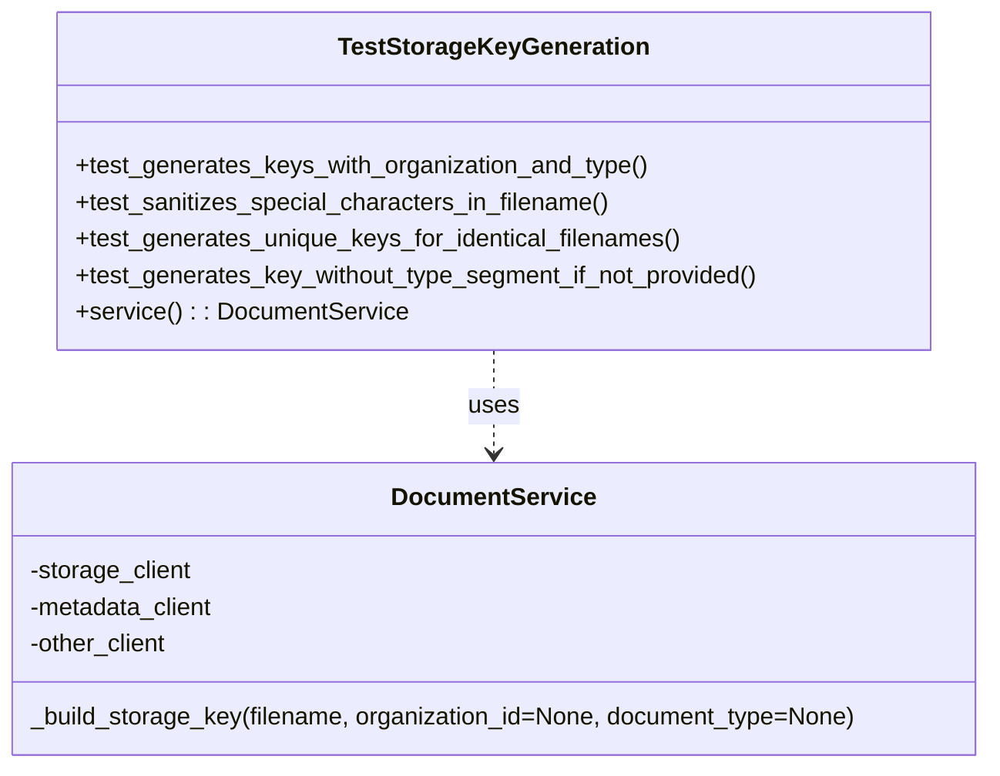

# Diagram: common/document_service/src/api/tests/unit/test_services.py


> Auto-generated by Obscura crawlers

## Diagram 1



### SVG

<svg id="container" width="651.5859375" xmlns="http://www.w3.org/2000/svg" class="classDiagram" height="504" viewBox="0 0 651.5859375 504" role="graphics-document document" aria-roledescription="class"><style>#container{font-family:"trebuchet ms",verdana,arial,sans-serif;font-size:16px;fill:#333;}@keyframes edge-animation-frame{from{stroke-dashoffset:0;}}@keyframes dash{to{stroke-dashoffset:0;}}#container .edge-animation-slow{stroke-dasharray:9,5!important;stroke-dashoffset:900;animation:dash 50s linear infinite;stroke-linecap:round;}#container .edge-animation-fast{stroke-dasharray:9,5!important;stroke-dashoffset:900;animation:dash 20s linear infinite;stroke-linecap:round;}#container .error-icon{fill:#552222;}#container .error-text{fill:#552222;stroke:#552222;}#container .edge-thickness-normal{stroke-width:1px;}#container .edge-thickness-thick{stroke-width:3.5px;}#container .edge-pattern-solid{stroke-dasharray:0;}#container .edge-thickness-invisible{stroke-width:0;fill:none;}#container .edge-pattern-dashed{stroke-dasharray:3;}#container .edge-pattern-dotted{stroke-dasharray:2;}#container .marker{fill:#333333;stroke:#333333;}#container .marker.cross{stroke:#333333;}#container svg{font-family:"trebuchet ms",verdana,arial,sans-serif;font-size:16px;}#container p{margin:0;}#container g.classGroup text{fill:#9370DB;stroke:none;font-family:"trebuchet ms",verdana,arial,sans-serif;font-size:10px;}#container g.classGroup text .title{font-weight:bolder;}#container .nodeLabel,#container .edgeLabel{color:#131300;}#container .edgeLabel .label rect{fill:#ECECFF;}#container .label text{fill:#131300;}#container .labelBkg{background:#ECECFF;}#container .edgeLabel .label span{background:#ECECFF;}#container .classTitle{font-weight:bolder;}#container .node rect,#container .node circle,#container .node ellipse,#container .node polygon,#container .node path{fill:#ECECFF;stroke:#9370DB;stroke-width:1px;}#container .divider{stroke:#9370DB;stroke-width:1;}#container g.clickable{cursor:pointer;}#container g.classGroup rect{fill:#ECECFF;stroke:#9370DB;}#container g.classGroup line{stroke:#9370DB;stroke-width:1;}#container .classLabel .box{stroke:none;stroke-width:0;fill:#ECECFF;opacity:0.5;}#container .classLabel .label{fill:#9370DB;font-size:10px;}#container .relation{stroke:#333333;stroke-width:1;fill:none;}#container .dashed-line{stroke-dasharray:3;}#container .dotted-line{stroke-dasharray:1 2;}#container #compositionStart,#container .composition{fill:#333333!important;stroke:#333333!important;stroke-width:1;}#container #compositionEnd,#container .composition{fill:#333333!important;stroke:#333333!important;stroke-width:1;}#container #dependencyStart,#container .dependency{fill:#333333!important;stroke:#333333!important;stroke-width:1;}#container #dependencyStart,#container .dependency{fill:#333333!important;stroke:#333333!important;stroke-width:1;}#container #extensionStart,#container .extension{fill:transparent!important;stroke:#333333!important;stroke-width:1;}#container #extensionEnd,#container .extension{fill:transparent!important;stroke:#333333!important;stroke-width:1;}#container #aggregationStart,#container .aggregation{fill:transparent!important;stroke:#333333!important;stroke-width:1;}#container #aggregationEnd,#container .aggregation{fill:transparent!important;stroke:#333333!important;stroke-width:1;}#container #lollipopStart,#container .lollipop{fill:#ECECFF!important;stroke:#333333!important;stroke-width:1;}#container #lollipopEnd,#container .lollipop{fill:#ECECFF!important;stroke:#333333!important;stroke-width:1;}#container .edgeTerminals{font-size:11px;line-height:initial;}#container .classTitleText{text-anchor:middle;font-size:18px;fill:#333;}#container .label-icon{display:inline-block;height:1em;overflow:visible;vertical-align:-0.125em;}#container .node .label-icon path{fill:currentColor;stroke:revert;stroke-width:revert;}#container :root{--mermaid-font-family:"trebuchet ms",verdana,arial,sans-serif;}</style><g><defs><marker id="container_class-aggregationStart" class="marker aggregation class" refX="18" refY="7" markerWidth="190" markerHeight="240" orient="auto"><path d="M 18,7 L9,13 L1,7 L9,1 Z"></path></marker></defs><defs><marker id="container_class-aggregationEnd" class="marker aggregation class" refX="1" refY="7" markerWidth="20" markerHeight="28" orient="auto"><path d="M 18,7 L9,13 L1,7 L9,1 Z"></path></marker></defs><defs><marker id="container_class-extensionStart" class="marker extension class" refX="18" refY="7" markerWidth="190" markerHeight="240" orient="auto"><path d="M 1,7 L18,13 V 1 Z"></path></marker></defs><defs><marker id="container_class-extensionEnd" class="marker extension class" refX="1" refY="7" markerWidth="20" markerHeight="28" orient="auto"><path d="M 1,1 V 13 L18,7 Z"></path></marker></defs><defs><marker id="container_class-compositionStart" class="marker composition class" refX="18" refY="7" markerWidth="190" markerHeight="240" orient="auto"><path d="M 18,7 L9,13 L1,7 L9,1 Z"></path></marker></defs><defs><marker id="container_class-compositionEnd" class="marker composition class" refX="1" refY="7" markerWidth="20" markerHeight="28" orient="auto"><path d="M 18,7 L9,13 L1,7 L9,1 Z"></path></marker></defs><defs><marker id="container_class-dependencyStart" class="marker dependency class" refX="6" refY="7" markerWidth="190" markerHeight="240" orient="auto"><path d="M 5,7 L9,13 L1,7 L9,1 Z"></path></marker></defs><defs><marker id="container_class-dependencyEnd" class="marker dependency class" refX="13" refY="7" markerWidth="20" markerHeight="28" orient="auto"><path d="M 18,7 L9,13 L14,7 L9,1 Z"></path></marker></defs><defs><marker id="container_class-lollipopStart" class="marker lollipop class" refX="13" refY="7" markerWidth="190" markerHeight="240" orient="auto"><circle stroke="black" fill="transparent" cx="7" cy="7" r="6"></circle></marker></defs><defs><marker id="container_class-lollipopEnd" class="marker lollipop class" refX="1" refY="7" markerWidth="190" markerHeight="240" orient="auto"><circle stroke="black" fill="transparent" cx="7" cy="7" r="6"></circle></marker></defs><g class="root"><g class="clusters"></g><g class="edgePaths"><path d="M325.793,230L325.793,236.167C325.793,242.333,325.793,254.667,325.793,266C325.793,277.333,325.793,287.667,325.793,292.833L325.793,298" id="id_TestStorageKeyGeneration_DocumentService_1" class="edge-thickness-normal edge-pattern-dashed relation" style=";;;" data-edge="true" data-et="edge" data-id="id_TestStorageKeyGeneration_DocumentService_1" data-points="W3sieCI6MzI1Ljc5Mjk2ODc1LCJ5IjoyMzB9LHsieCI6MzI1Ljc5Mjk2ODc1LCJ5IjoyNjd9LHsieCI6MzI1Ljc5Mjk2ODc1LCJ5IjozMDR9XQ==" marker-end="url(#container_class-dependencyEnd)"></path></g><g class="edgeLabels"><g class="edgeLabel" transform="translate(325.79296875, 267)"><g class="label" data-id="id_TestStorageKeyGeneration_DocumentService_1" transform="translate(-16.4921875, -12)"><foreignObject width="32.984375" height="24"><div xmlns="http://www.w3.org/1999/xhtml" class="labelBkg" style="display: table-cell; white-space: nowrap; line-height: 1.5; max-width: 200px; text-align: center;"><span class="edgeLabel"><p>uses</p></span></div></foreignObject></g></g></g><g class="nodes"><g class="node default" id="classId-DocumentService-0" transform="translate(325.79296875, 400)"><g class="basic label-container"><path d="M-317.79296875 -96 L317.79296875 -96 L317.79296875 96 L-317.79296875 96" stroke="none" stroke-width="0" fill="#ECECFF" style=""></path><path d="M-317.79296875 -96 C-149.32659812819605 -96, 19.139772493607893 -96, 317.79296875 -96 M-317.79296875 -96 C-190.60511032183263 -96, -63.41725189366528 -96, 317.79296875 -96 M317.79296875 -96 C317.79296875 -31.994187806200742, 317.79296875 32.011624387598516, 317.79296875 96 M317.79296875 -96 C317.79296875 -38.49443959931808, 317.79296875 19.011120801363845, 317.79296875 96 M317.79296875 96 C115.5059688753023 96, -86.7810309993954 96, -317.79296875 96 M317.79296875 96 C99.56334198154332 96, -118.66628478691337 96, -317.79296875 96 M-317.79296875 96 C-317.79296875 51.415917415787646, -317.79296875 6.831834831575293, -317.79296875 -96 M-317.79296875 96 C-317.79296875 34.59262688804364, -317.79296875 -26.81474622391272, -317.79296875 -96" stroke="#9370DB" stroke-width="1.3" fill="none" stroke-dasharray="0 0" style=""></path></g><g class="annotation-group text" transform="translate(0, -72)"></g><g class="label-group text" transform="translate(-63.7421875, -72)"><g class="label" style="font-weight: bolder" transform="translate(0,-12)"><foreignObject width="127.484375" height="24"><div xmlns="http://www.w3.org/1999/xhtml" style="display: table-cell; white-space: nowrap; line-height: 1.5; max-width: 176px; text-align: center;"><span class="nodeLabel markdown-node-label" style=""><p>DocumentService</p></span></div></foreignObject></g></g><g class="members-group text" transform="translate(-305.79296875, -24)"><g class="label" style="" transform="translate(0,-12)"><foreignObject width="108.15625" height="24"><div xmlns="http://www.w3.org/1999/xhtml" style="display: table-cell; white-space: nowrap; line-height: 1.5; max-width: 166px; text-align: center;"><span class="nodeLabel markdown-node-label" style=""><p>-storage_client</p></span></div></foreignObject></g><g class="label" style="" transform="translate(0,12)"><foreignObject width="124.609375" height="24"><div xmlns="http://www.w3.org/1999/xhtml" style="display: table-cell; white-space: nowrap; line-height: 1.5; max-width: 182px; text-align: center;"><span class="nodeLabel markdown-node-label" style=""><p>-metadata_client</p></span></div></foreignObject></g><g class="label" style="" transform="translate(0,36)"><foreignObject width="93.28125" height="24"><div xmlns="http://www.w3.org/1999/xhtml" style="display: table-cell; white-space: nowrap; line-height: 1.5; max-width: 151px; text-align: center;"><span class="nodeLabel markdown-node-label" style=""><p>-other_client</p></span></div></foreignObject></g></g><g class="methods-group text" transform="translate(-305.79296875, 72)"><g class="label" style="" transform="translate(0,-12)"><foreignObject width="547.84375" height="24"><div xmlns="http://www.w3.org/1999/xhtml" style="display: table-cell; white-space: nowrap; line-height: 1.5; max-width: 598px; text-align: center;"><span class="nodeLabel markdown-node-label" style=""><p>_build_storage_key(filename, organization_id=None, document_type=None)</p></span></div></foreignObject></g></g><g class="divider" style=""><path d="M-317.79296875 -48 C-104.29919648341956 -48, 109.19457578316087 -48, 317.79296875 -48 M-317.79296875 -48 C-152.30882039826201 -48, 13.175327953475971 -48, 317.79296875 -48" stroke="#9370DB" stroke-width="1.3" fill="none" stroke-dasharray="0 0" style=""></path></g><g class="divider" style=""><path d="M-317.79296875 48 C-144.06413927731904 48, 29.664690195361914 48, 317.79296875 48 M-317.79296875 48 C-75.49293340609637 48, 166.80710193780726 48, 317.79296875 48" stroke="#9370DB" stroke-width="1.3" fill="none" stroke-dasharray="0 0" style=""></path></g></g><g class="node default" id="classId-TestStorageKeyGeneration-1" transform="translate(325.79296875, 119)"><g class="basic label-container"><path d="M-287.79296875 -111 L287.79296875 -111 L287.79296875 111 L-287.79296875 111" stroke="none" stroke-width="0" fill="#ECECFF" style=""></path><path d="M-287.79296875 -111 C-90.74989879081912 -111, 106.29317116836177 -111, 287.79296875 -111 M-287.79296875 -111 C-126.52967340172953 -111, 34.73362194654095 -111, 287.79296875 -111 M287.79296875 -111 C287.79296875 -38.677533733511325, 287.79296875 33.64493253297735, 287.79296875 111 M287.79296875 -111 C287.79296875 -47.92737347543729, 287.79296875 15.145253049125415, 287.79296875 111 M287.79296875 111 C82.80037117451059 111, -122.19222640097883 111, -287.79296875 111 M287.79296875 111 C144.7501914624934 111, 1.707414174986809 111, -287.79296875 111 M-287.79296875 111 C-287.79296875 41.50584240372251, -287.79296875 -27.98831519255498, -287.79296875 -111 M-287.79296875 111 C-287.79296875 24.132780720048075, -287.79296875 -62.73443855990385, -287.79296875 -111" stroke="#9370DB" stroke-width="1.3" fill="none" stroke-dasharray="0 0" style=""></path></g><g class="annotation-group text" transform="translate(0, -87)"></g><g class="label-group text" transform="translate(-97.2890625, -87)"><g class="label" style="font-weight: bolder" transform="translate(0,-12)"><foreignObject width="194.578125" height="24"><div xmlns="http://www.w3.org/1999/xhtml" style="display: table-cell; white-space: nowrap; line-height: 1.5; max-width: 240px; text-align: center;"><span class="nodeLabel markdown-node-label" style=""><p>TestStorageKeyGeneration</p></span></div></foreignObject></g></g><g class="members-group text" transform="translate(-275.79296875, -39)"></g><g class="methods-group text" transform="translate(-275.79296875, -9)"><g class="label" style="" transform="translate(0,-12)"><foreignObject width="377.71875" height="24"><div xmlns="http://www.w3.org/1999/xhtml" style="display: table-cell; white-space: nowrap; line-height: 1.5; max-width: 435px; text-align: center;"><span class="nodeLabel markdown-node-label" style=""><p>+test_generates_keys_with_organization_and_type()</p></span></div></foreignObject></g><g class="label" style="" transform="translate(0,12)"><foreignObject width="352.75" height="24"><div xmlns="http://www.w3.org/1999/xhtml" style="display: table-cell; white-space: nowrap; line-height: 1.5; max-width: 410px; text-align: center;"><span class="nodeLabel markdown-node-label" style=""><p>+test_sanitizes_special_characters_in_filename()</p></span></div></foreignObject></g><g class="label" style="" transform="translate(0,36)"><foreignObject width="400.734375" height="24"><div xmlns="http://www.w3.org/1999/xhtml" style="display: table-cell; white-space: nowrap; line-height: 1.5; max-width: 458px; text-align: center;"><span class="nodeLabel markdown-node-label" style=""><p>+test_generates_unique_keys_for_identical_filenames()</p></span></div></foreignObject></g><g class="label" style="" transform="translate(0,60)"><foreignObject width="454.296875" height="24"><div xmlns="http://www.w3.org/1999/xhtml" style="display: table-cell; white-space: nowrap; line-height: 1.5; max-width: 512px; text-align: center;"><span class="nodeLabel markdown-node-label" style=""><p>+test_generates_key_without_type_segment_if_not_provided()</p></span></div></foreignObject></g><g class="label" style="" transform="translate(0,84)"><foreignObject width="215.640625" height="24"><div xmlns="http://www.w3.org/1999/xhtml" style="display: table-cell; white-space: nowrap; line-height: 1.5; max-width: 273px; text-align: center;"><span class="nodeLabel markdown-node-label" style=""><p>+service() : : DocumentService</p></span></div></foreignObject></g></g><g class="divider" style=""><path d="M-287.79296875 -63 C-89.62102396339688 -63, 108.55092082320624 -63, 287.79296875 -63 M-287.79296875 -63 C-127.87198589980022 -63, 32.048996950399555 -63, 287.79296875 -63" stroke="#9370DB" stroke-width="1.3" fill="none" stroke-dasharray="0 0" style=""></path></g><g class="divider" style=""><path d="M-287.79296875 -39 C-150.68068173025938 -39, -13.56839471051876 -39, 287.79296875 -39 M-287.79296875 -39 C-155.43119156082165 -39, -23.06941437164329 -39, 287.79296875 -39" stroke="#9370DB" stroke-width="1.3" fill="none" stroke-dasharray="0 0" style=""></path></g></g></g></g></g></svg>

## Diagram 2

```mermaid
flowchart TD
    A[Start: _build_storage_key(filename, org_id, document_type)] --> B[Sanitize filename]
    B --> B1{Remove or replace chars}
    B1 -->|spaces| B2[remove spaces]
    B1 -->|slashes/&/special| B3[replace with hyphens]
    B3 --> C[Lowercase and strip extension]
    C --> D{document_type provided?}
    D -->|yes| E[Add type segment to path: /{type_lower}/]
    D -->|no| E2[Omit type segment]
    E --> F[Get current date -> /YYYY/MM/DD/]
    E2 --> F
    F --> G[Generate unique hex suffix: -[a-f0-9]{10}]
    G --> H[Assemble filename: sanitized-[hex].ext]
    H --> I[Prepend uploads/{organization_id}/ and optional type/date segments]
    I --> J[Return storage key string matching pattern]
```

> SVG rendering failed for this diagram.
