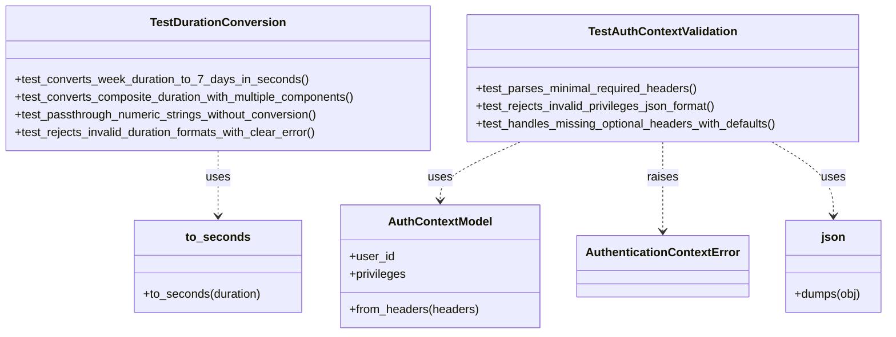

# Diagram: common/document_service/src/api/tests/unit/test_utils.py

> Auto-generated by Obscura crawlers

## Mermaid

### SVG

<svg id="container" width="1214.62890625" xmlns="http://www.w3.org/2000/svg" class="classDiagram" height="456" viewBox="0 0 1214.62890625 456" role="graphics-document document" aria-roledescription="class"><g><defs><marker id="container_class-aggregationStart" class="marker aggregation class" refX="18" refY="7" markerWidth="190" markerHeight="240" orient="auto"><path d="M 18,7 L9,13 L1,7 L9,1 Z"></path></marker></defs><defs><marker id="container_class-aggregationEnd" class="marker aggregation class" refX="1" refY="7" markerWidth="20" markerHeight="28" orient="auto"><path d="M 18,7 L9,13 L1,7 L9,1 Z"></path></marker></defs><defs><marker id="container_class-extensionStart" class="marker extension class" refX="18" refY="7" markerWidth="190" markerHeight="240" orient="auto"><path d="M 1,7 L18,13 V 1 Z"></path></marker></defs><defs><marker id="container_class-extensionEnd" class="marker extension class" refX="1" refY="7" markerWidth="20" markerHeight="28" orient="auto"><path d="M 1,1 V 13 L18,7 Z"></path></marker></defs><defs><marker id="container_class-compositionStart" class="marker composition class" refX="18" refY="7" markerWidth="190" markerHeight="240" orient="auto"><path d="M 18,7 L9,13 L1,7 L9,1 Z"></path></marker></defs><defs><marker id="container_class-compositionEnd" class="marker composition class" refX="1" refY="7" markerWidth="20" markerHeight="28" orient="auto"><path d="M 18,7 L9,13 L1,7 L9,1 Z"></path></marker></defs><defs><marker id="container_class-dependencyStart" class="marker dependency class" refX="6" refY="7" markerWidth="190" markerHeight="240" orient="auto"><path d="M 5,7 L9,13 L1,7 L9,1 Z"></path></marker></defs><defs><marker id="container_class-dependencyEnd" class="marker dependency class" refX="13" refY="7" markerWidth="20" markerHeight="28" orient="auto"><path d="M 18,7 L9,13 L14,7 L9,1 Z"></path></marker></defs><defs><marker id="container_class-lollipopStart" class="marker lollipop class" refX="13" refY="7" markerWidth="190" markerHeight="240" orient="auto"><circle stroke="black" fill="transparent" cx="7" cy="7" r="6"></circle></marker></defs><defs><marker id="container_class-lollipopEnd" class="marker lollipop class" refX="1" refY="7" markerWidth="190" markerHeight="240" orient="auto"><circle stroke="black" fill="transparent" cx="7" cy="7" r="6"></circle></marker></defs><g class="root"><g class="clusters"></g><g class="edgePaths"><path d="M301.129,206L301.129,212.167C301.129,218.333,301.129,230.667,301.129,245.5C301.129,260.333,301.129,277.667,301.129,286.333L301.129,295" id="id_TestDurationConversion_to_seconds_1" class="edge-thickness-normal edge-pattern-dashed relation" style=";;;" data-edge="true" data-et="edge" data-id="id_TestDurationConversion_to_seconds_1" data-points="W3sieCI6MzAxLjEyODkwNjI1LCJ5IjoyMDZ9LHsieCI6MzAxLjEyODkwNjI1LCJ5IjoyNDN9LHsieCI6MzAxLjEyODkwNjI1LCJ5IjozMDF9XQ==" marker-end="url(#container_class-dependencyEnd)"></path><path d="M723.498,194L705.665,202.167C687.832,210.333,652.166,226.667,634.333,240C616.5,253.333,616.5,263.667,616.5,268.833L616.5,274" id="id_TestAuthContextValidation_AuthContextModel_2" class="edge-thickness-normal edge-pattern-dashed relation" style=";;;" data-edge="true" data-et="edge" data-id="id_TestAuthContextValidation_AuthContextModel_2" data-points="W3sieCI6NzIzLjQ5NzUwMTE0ODg5NzEsInkiOjE5NH0seyJ4Ijo2MTYuNSwieSI6MjQzfSx7IngiOjYxNi41LCJ5IjoyODB9XQ==" marker-end="url(#container_class-dependencyEnd)"></path><path d="M913.473,194L913.473,202.167C913.473,210.333,913.473,226.667,913.473,247C913.473,267.333,913.473,291.667,913.473,303.833L913.473,316" id="id_TestAuthContextValidation_AuthenticationContextError_3" class="edge-thickness-normal edge-pattern-dashed relation" style=";;;" data-edge="true" data-et="edge" data-id="id_TestAuthContextValidation_AuthenticationContextError_3" data-points="W3sieCI6OTEzLjQ3MjY1NjI1LCJ5IjoxOTR9LHsieCI6OTEzLjQ3MjY1NjI1LCJ5IjoyNDN9LHsieCI6OTEzLjQ3MjY1NjI1LCJ5IjozMjJ9XQ==" marker-end="url(#container_class-dependencyEnd)"></path><path d="M1059.216,194L1072.897,202.167C1086.577,210.333,1113.939,226.667,1127.62,243.5C1141.301,260.333,1141.301,277.667,1141.301,286.333L1141.301,295" id="id_TestAuthContextValidation_json_4" class="edge-thickness-normal edge-pattern-dashed relation" style=";;;" data-edge="true" data-et="edge" data-id="id_TestAuthContextValidation_json_4" data-points="W3sieCI6MTA1OS4yMTU2NDc5Nzc5NDEyLCJ5IjoxOTR9LHsieCI6MTE0MS4zMDA3ODEyNSwieSI6MjQzfSx7IngiOjExNDEuMzAwNzgxMjUsInkiOjMwMX1d" marker-end="url(#container_class-dependencyEnd)"></path></g><g class="edgeLabels"><g class="edgeLabel" transform="translate(301.12890625, 243)"><g class="label" data-id="id_TestDurationConversion_to_seconds_1" transform="translate(-16.4921875, -12)"><foreignObject width="32.984375" height="24">

uses

</foreignObject></g></g><g class="edgeLabel" transform="translate(616.5, 243)"><g class="label" data-id="id_TestAuthContextValidation_AuthContextModel_2" transform="translate(-16.4921875, -12)"><foreignObject width="32.984375" height="24">

uses

</foreignObject></g></g><g class="edgeLabel" transform="translate(913.47265625, 243)"><g class="label" data-id="id_TestAuthContextValidation_AuthenticationContextError_3" transform="translate(-21.25, -12)"><foreignObject width="42.5" height="24">

raises

</foreignObject></g></g><g class="edgeLabel" transform="translate(1141.30078125, 243)"><g class="label" data-id="id_TestAuthContextValidation_json_4" transform="translate(-16.4921875, -12)"><foreignObject width="32.984375" height="24">

uses

</foreignObject></g></g></g><g class="nodes"><g class="node default" id="classId-TestDurationConversion-0" transform="translate(301.12890625, 107)"><g class="basic label-container"><path d="M-293.12890625 -99 L293.12890625 -99 L293.12890625 99 L-293.12890625 99" stroke="none" stroke-width="0" fill="#ECECFF" style=""></path><path d="M-293.12890625 -99 C-151.40061472053753 -99, -9.672323191075066 -99, 293.12890625 -99 M-293.12890625 -99 C-161.15416117210455 -99, -29.179416094209103 -99, 293.12890625 -99 M293.12890625 -99 C293.12890625 -40.33362774832127, 293.12890625 18.33274450335746, 293.12890625 99 M293.12890625 -99 C293.12890625 -50.14276078538988, 293.12890625 -1.285521570779764, 293.12890625 99 M293.12890625 99 C155.17543082252334 99, 17.221955395046677 99, -293.12890625 99 M293.12890625 99 C72.26980802055746 99, -148.58929020888507 99, -293.12890625 99 M-293.12890625 99 C-293.12890625 56.66638739749769, -293.12890625 14.332774794995373, -293.12890625 -99 M-293.12890625 99 C-293.12890625 33.49012961049945, -293.12890625 -32.0197407790011, -293.12890625 -99" stroke="#9370DB" stroke-width="1.3" fill="none" stroke-dasharray="0 0" style=""></path></g><g class="annotation-group text" transform="translate(0, -75)"></g><g class="label-group text" transform="translate(-87.6328125, -75)"><g class="label" style="font-weight: bolder" transform="translate(0,-12)"><foreignObject width="175.265625" height="24">

TestDurationConversion

</foreignObject></g></g><g class="members-group text" transform="translate(-281.12890625, -27)"></g><g class="methods-group text" transform="translate(-281.12890625, 3)"><g class="label" style="" transform="translate(0,-12)"><foreignObject width="397.796875" height="24">

+test_converts_week_duration_to_7_days_in_seconds()

</foreignObject></g><g class="label" style="" transform="translate(0,12)"><foreignObject width="474.625" height="24">

+test_converts_composite_duration_with_multiple_components()

</foreignObject></g><g class="label" style="" transform="translate(0,36)"><foreignObject width="419.421875" height="24">

+test_passthrough_numeric_strings_without_conversion()

</foreignObject></g><g class="label" style="" transform="translate(0,60)"><foreignObject width="419.25" height="24">

+test_rejects_invalid_duration_formats_with_clear_error()

</foreignObject></g></g><g class="divider" style=""><path d="M-293.12890625 -51 C-160.55207175360079 -51, -27.97523725720157 -51, 293.12890625 -51 M-293.12890625 -51 C-159.07516477448263 -51, -25.02142329896526 -51, 293.12890625 -51" stroke="#9370DB" stroke-width="1.3" fill="none" stroke-dasharray="0 0" style=""></path></g><g class="divider" style=""><path d="M-293.12890625 -27 C-117.22688218127058 -27, 58.675141887458835 -27, 293.12890625 -27 M-293.12890625 -27 C-118.83021853225381 -27, 55.46846918549238 -27, 293.12890625 -27" stroke="#9370DB" stroke-width="1.3" fill="none" stroke-dasharray="0 0" style=""></path></g></g><g class="node default" id="classId-TestAuthContextValidation-1" transform="translate(913.47265625, 107)"><g class="basic label-container"><path d="M-269.21484375 -87 L269.21484375 -87 L269.21484375 87 L-269.21484375 87" stroke="none" stroke-width="0" fill="#ECECFF" style=""></path><path d="M-269.21484375 -87 C-120.38908631606424 -87, 28.436671117871526 -87, 269.21484375 -87 M-269.21484375 -87 C-61.67750143086826 -87, 145.85984088826348 -87, 269.21484375 -87 M269.21484375 -87 C269.21484375 -42.897054661643075, 269.21484375 1.2058906767138495, 269.21484375 87 M269.21484375 -87 C269.21484375 -30.136105786108338, 269.21484375 26.727788427783324, 269.21484375 87 M269.21484375 87 C90.62354537262854 87, -87.96775300474292 87, -269.21484375 87 M269.21484375 87 C63.749746459317294 87, -141.7153508313654 87, -269.21484375 87 M-269.21484375 87 C-269.21484375 22.573027594259145, -269.21484375 -41.85394481148171, -269.21484375 -87 M-269.21484375 87 C-269.21484375 47.9765663417767, -269.21484375 8.953132683553406, -269.21484375 -87" stroke="#9370DB" stroke-width="1.3" fill="none" stroke-dasharray="0 0" style=""></path></g><g class="annotation-group text" transform="translate(0, -63)"></g><g class="label-group text" transform="translate(-97.4140625, -63)"><g class="label" style="font-weight: bolder" transform="translate(0,-12)"><foreignObject width="194.828125" height="24">

TestAuthContextValidation

</foreignObject></g></g><g class="members-group text" transform="translate(-257.21484375, -15)"></g><g class="methods-group text" transform="translate(-257.21484375, 15)"><g class="label" style="" transform="translate(0,-12)"><foreignObject width="305.578125" height="24">

+test_parses_minimal_required_headers()

</foreignObject></g><g class="label" style="" transform="translate(0,12)"><foreignObject width="333.953125" height="24">

+test_rejects_invalid_privileges_json_format()

</foreignObject></g><g class="label" style="" transform="translate(0,36)"><foreignObject width="417.015625" height="24">

+test_handles_missing_optional_headers_with_defaults()

</foreignObject></g></g><g class="divider" style=""><path d="M-269.21484375 -39 C-145.36280397038888 -39, -21.510764190777735 -39, 269.21484375 -39 M-269.21484375 -39 C-101.5752493276834 -39, 66.06434509463321 -39, 269.21484375 -39" stroke="#9370DB" stroke-width="1.3" fill="none" stroke-dasharray="0 0" style=""></path></g><g class="divider" style=""><path d="M-269.21484375 -15 C-141.0284449761588 -15, -12.84204620231759 -15, 269.21484375 -15 M-269.21484375 -15 C-61.48843872708315 -15, 146.2379662958337 -15, 269.21484375 -15" stroke="#9370DB" stroke-width="1.3" fill="none" stroke-dasharray="0 0" style=""></path></g></g><g class="node default" id="classId-to_seconds-2" transform="translate(301.12890625, 364)"><g class="basic label-container"><path d="M-114.08203125 -63 L114.08203125 -63 L114.08203125 63 L-114.08203125 63" stroke="none" stroke-width="0" fill="#ECECFF" style=""></path><path d="M-114.08203125 -63 C-48.15629054336139 -63, 17.769450163277213 -63, 114.08203125 -63 M-114.08203125 -63 C-66.28775825822655 -63, -18.493485266453092 -63, 114.08203125 -63 M114.08203125 -63 C114.08203125 -20.401089530745878, 114.08203125 22.197820938508244, 114.08203125 63 M114.08203125 -63 C114.08203125 -34.226259946121374, 114.08203125 -5.452519892242741, 114.08203125 63 M114.08203125 63 C66.76996069465474 63, 19.457890139309498 63, -114.08203125 63 M114.08203125 63 C63.20383557584719 63, 12.325639901694373 63, -114.08203125 63 M-114.08203125 63 C-114.08203125 29.1147396805883, -114.08203125 -4.770520638823399, -114.08203125 -63 M-114.08203125 63 C-114.08203125 25.450559689934373, -114.08203125 -12.098880620131254, -114.08203125 -63" stroke="#9370DB" stroke-width="1.3" fill="none" stroke-dasharray="0 0" style=""></path></g><g class="annotation-group text" transform="translate(0, -39)"></g><g class="label-group text" transform="translate(-41.5234375, -39)"><g class="label" style="font-weight: bolder" transform="translate(0,-12)"><foreignObject width="83.046875" height="24">

to_seconds

</foreignObject></g></g><g class="members-group text" transform="translate(-102.08203125, 9)"></g><g class="methods-group text" transform="translate(-102.08203125, 39)"><g class="label" style="" transform="translate(0,-12)"><foreignObject width="162.640625" height="24">

+to_seconds(duration)

</foreignObject></g></g><g class="divider" style=""><path d="M-114.08203125 -15 C-39.16147567123164 -15, 35.759079907536716 -15, 114.08203125 -15 M-114.08203125 -15 C-29.697929910029885 -15, 54.68617142994023 -15, 114.08203125 -15" stroke="#9370DB" stroke-width="1.3" fill="none" stroke-dasharray="0 0" style=""></path></g><g class="divider" style=""><path d="M-114.08203125 9 C-52.518605677352284 9, 9.044819895295433 9, 114.08203125 9 M-114.08203125 9 C-47.08639610881711 9, 19.909239032365775 9, 114.08203125 9" stroke="#9370DB" stroke-width="1.3" fill="none" stroke-dasharray="0 0" style=""></path></g></g><g class="node default" id="classId-AuthContextModel-3" transform="translate(616.5, 364)"><g class="basic label-container"><path d="M-134.47265625 -84 L134.47265625 -84 L134.47265625 84 L-134.47265625 84" stroke="none" stroke-width="0" fill="#ECECFF" style=""></path><path d="M-134.47265625 -84 C-65.96653492199567 -84, 2.5395864060086524 -84, 134.47265625 -84 M-134.47265625 -84 C-52.8168582270156 -84, 28.8389397959688 -84, 134.47265625 -84 M134.47265625 -84 C134.47265625 -40.66871405862509, 134.47265625 2.662571882749816, 134.47265625 84 M134.47265625 -84 C134.47265625 -21.521695801870187, 134.47265625 40.956608396259625, 134.47265625 84 M134.47265625 84 C46.34978397948599 84, -41.77308829102802 84, -134.47265625 84 M134.47265625 84 C80.61443589455762 84, 26.75621553911523 84, -134.47265625 84 M-134.47265625 84 C-134.47265625 25.66956375883467, -134.47265625 -32.66087248233066, -134.47265625 -84 M-134.47265625 84 C-134.47265625 42.83066185423929, -134.47265625 1.6613237084785766, -134.47265625 -84" stroke="#9370DB" stroke-width="1.3" fill="none" stroke-dasharray="0 0" style=""></path></g><g class="annotation-group text" transform="translate(0, -60)"></g><g class="label-group text" transform="translate(-67.7265625, -60)"><g class="label" style="font-weight: bolder" transform="translate(0,-12)"><foreignObject width="135.453125" height="24">

AuthContextModel

</foreignObject></g></g><g class="members-group text" transform="translate(-122.47265625, -12)"><g class="label" style="" transform="translate(0,-12)"><foreignObject width="60.796875" height="24">

+user_id

</foreignObject></g><g class="label" style="" transform="translate(0,12)"><foreignObject width="78.15625" height="24">

+privileges

</foreignObject></g></g><g class="methods-group text" transform="translate(-122.47265625, 60)"><g class="label" style="" transform="translate(0,-12)"><foreignObject width="177.21875" height="24">

+from_headers(headers)

</foreignObject></g></g><g class="divider" style=""><path d="M-134.47265625 -36 C-53.822801611517875 -36, 26.82705302696425 -36, 134.47265625 -36 M-134.47265625 -36 C-59.030385720565775 -36, 16.41188480886845 -36, 134.47265625 -36" stroke="#9370DB" stroke-width="1.3" fill="none" stroke-dasharray="0 0" style=""></path></g><g class="divider" style=""><path d="M-134.47265625 36 C-44.9974422791401 36, 44.477771691719795 36, 134.47265625 36 M-134.47265625 36 C-71.01538461575912 36, -7.558112981518235 36, 134.47265625 36" stroke="#9370DB" stroke-width="1.3" fill="none" stroke-dasharray="0 0" style=""></path></g></g><g class="node default" id="classId-AuthenticationContextError-4" transform="translate(913.47265625, 364)"><g class="basic label-container"><path d="M-112.5 -42 L112.5 -42 L112.5 42 L-112.5 42" stroke="none" stroke-width="0" fill="#ECECFF" style=""></path><path d="M-112.5 -42 C-32.41330359625388 -42, 47.673392807492235 -42, 112.5 -42 M-112.5 -42 C-48.29760271994205 -42, 15.904794560115903 -42, 112.5 -42 M112.5 -42 C112.5 -24.72293910213494, 112.5 -7.4458782042698815, 112.5 42 M112.5 -42 C112.5 -14.409641600545015, 112.5 13.18071679890997, 112.5 42 M112.5 42 C49.121361892475434 42, -14.257276215049131 42, -112.5 42 M112.5 42 C40.86259535597797 42, -30.774809288044054 42, -112.5 42 M-112.5 42 C-112.5 23.77405380078664, -112.5 5.548107601573278, -112.5 -42 M-112.5 42 C-112.5 24.329638199987446, -112.5 6.6592763999748925, -112.5 -42" stroke="#9370DB" stroke-width="1.3" fill="none" stroke-dasharray="0 0" style=""></path></g><g class="annotation-group text" transform="translate(0, -18)"></g><g class="label-group text" transform="translate(-100.5, -18)"><g class="label" style="font-weight: bolder" transform="translate(0,-12)"><foreignObject width="201" height="24">

AuthenticationContextError

</foreignObject></g></g><g class="members-group text" transform="translate(-100.5, 30)"></g><g class="methods-group text" transform="translate(-100.5, 60)"></g><g class="divider" style=""><path d="M-112.5 6 C-23.41762057638894 6, 65.66475884722212 6, 112.5 6 M-112.5 6 C-30.91471120890897 6, 50.67057758218206 6, 112.5 6" stroke="#9370DB" stroke-width="1.3" fill="none" stroke-dasharray="0 0" style=""></path></g><g class="divider" style=""><path d="M-112.5 24 C-44.44930595916766 24, 23.60138808166468 24, 112.5 24 M-112.5 24 C-26.80844325333419 24, 58.88311349333162 24, 112.5 24" stroke="#9370DB" stroke-width="1.3" fill="none" stroke-dasharray="0 0" style=""></path></g></g><g class="node default" id="classId-json-5" transform="translate(1141.30078125, 364)"><g class="basic label-container"><path d="M-65.328125 -63 L65.328125 -63 L65.328125 63 L-65.328125 63" stroke="none" stroke-width="0" fill="#ECECFF" style=""></path><path d="M-65.328125 -63 C-14.67264868987563 -63, 35.98282762024874 -63, 65.328125 -63 M-65.328125 -63 C-13.355728636354122 -63, 38.616667727291755 -63, 65.328125 -63 M65.328125 -63 C65.328125 -30.51762377632175, 65.328125 1.9647524473565028, 65.328125 63 M65.328125 -63 C65.328125 -24.011337006578323, 65.328125 14.977325986843354, 65.328125 63 M65.328125 63 C28.051897046381647 63, -9.224330907236705 63, -65.328125 63 M65.328125 63 C25.3038573490821 63, -14.720410301835798 63, -65.328125 63 M-65.328125 63 C-65.328125 34.58075745120334, -65.328125 6.1615149024066795, -65.328125 -63 M-65.328125 63 C-65.328125 30.220435610077082, -65.328125 -2.5591287798458353, -65.328125 -63" stroke="#9370DB" stroke-width="1.3" fill="none" stroke-dasharray="0 0" style=""></path></g><g class="annotation-group text" transform="translate(0, -39)"></g><g class="label-group text" transform="translate(-15.40625, -39)"><g class="label" style="font-weight: bolder" transform="translate(0,-12)"><foreignObject width="30.8125" height="24">

json

</foreignObject></g></g><g class="members-group text" transform="translate(-53.328125, 9)"></g><g class="methods-group text" transform="translate(-53.328125, 39)"><g class="label" style="" transform="translate(0,-12)"><foreignObject width="91.25" height="24">

+dumps(obj)

</foreignObject></g></g><g class="divider" style=""><path d="M-65.328125 -15 C-37.5881559816668 -15, -9.848186963333603 -15, 65.328125 -15 M-65.328125 -15 C-19.85123420496562 -15, 25.625656590068758 -15, 65.328125 -15" stroke="#9370DB" stroke-width="1.3" fill="none" stroke-dasharray="0 0" style=""></path></g><g class="divider" style=""><path d="M-65.328125 9 C-37.98777427339229 9, -10.647423546784587 9, 65.328125 9 M-65.328125 9 C-31.58073429155666 9, 2.1666564168866813 9, 65.328125 9" stroke="#9370DB" stroke-width="1.3" fill="none" stroke-dasharray="0 0" style=""></path></g></g></g></g></g></svg>
