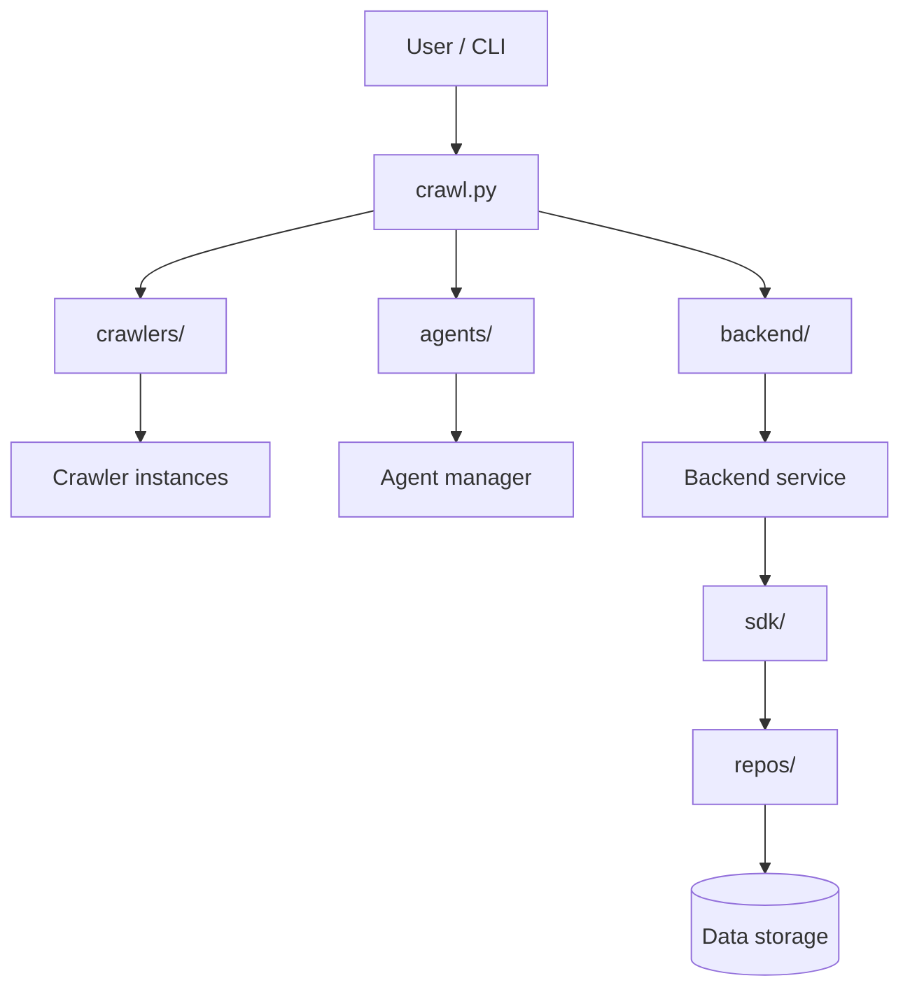
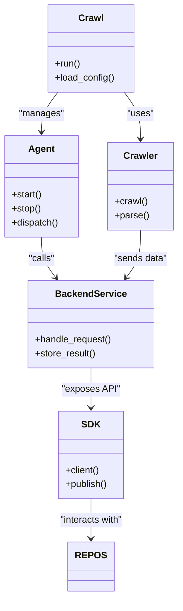

# Diagram: common/filter_service/config/config.dev.yml

> Auto-generated by Obscura crawlers

## Diagram 1

### SVG

<svg id="container" width="648.296875" xmlns="http://www.w3.org/2000/svg" class="flowchart" height="713.3743896484375" viewBox="0 0 648.296875 713.3743896484375" role="graphics-document document" aria-roledescription="flowchart-v2"><g><marker id="container_flowchart-v2-pointEnd" class="marker flowchart-v2" viewBox="0 0 10 10" refX="5" refY="5" markerUnits="userSpaceOnUse" markerWidth="8" markerHeight="8" orient="auto"><path d="M 0 0 L 10 5 L 0 10 z" class="arrowMarkerPath" style="stroke-width: 1; stroke-dasharray: 1, 0;"></path></marker><marker id="container_flowchart-v2-pointStart" class="marker flowchart-v2" viewBox="0 0 10 10" refX="4.5" refY="5" markerUnits="userSpaceOnUse" markerWidth="8" markerHeight="8" orient="auto"><path d="M 0 5 L 10 10 L 10 0 z" class="arrowMarkerPath" style="stroke-width: 1; stroke-dasharray: 1, 0;"></path></marker><marker id="container_flowchart-v2-circleEnd" class="marker flowchart-v2" viewBox="0 0 10 10" refX="11" refY="5" markerUnits="userSpaceOnUse" markerWidth="11" markerHeight="11" orient="auto"><circle cx="5" cy="5" r="5" class="arrowMarkerPath" style="stroke-width: 1; stroke-dasharray: 1, 0;"></circle></marker><marker id="container_flowchart-v2-circleStart" class="marker flowchart-v2" viewBox="0 0 10 10" refX="-1" refY="5" markerUnits="userSpaceOnUse" markerWidth="11" markerHeight="11" orient="auto"><circle cx="5" cy="5" r="5" class="arrowMarkerPath" style="stroke-width: 1; stroke-dasharray: 1, 0;"></circle></marker><marker id="container_flowchart-v2-crossEnd" class="marker cross flowchart-v2" viewBox="0 0 11 11" refX="12" refY="5.2" markerUnits="userSpaceOnUse" markerWidth="11" markerHeight="11" orient="auto"><path d="M 1,1 l 9,9 M 10,1 l -9,9" class="arrowMarkerPath" style="stroke-width: 2; stroke-dasharray: 1, 0;"></path></marker><marker id="container_flowchart-v2-crossStart" class="marker cross flowchart-v2" viewBox="0 0 11 11" refX="-1" refY="5.2" markerUnits="userSpaceOnUse" markerWidth="11" markerHeight="11" orient="auto"><path d="M 1,1 l 9,9 M 10,1 l -9,9" class="arrowMarkerPath" style="stroke-width: 2; stroke-dasharray: 1, 0;"></path></marker><g class="root"><g class="clusters"></g><g class="edgePaths"><path d="M329.133,62L329.133,66.167C329.133,70.333,329.133,78.667,329.133,86.333C329.133,94,329.133,101,329.133,104.5L329.133,108" id="L_U_CP_0" class="edge-thickness-normal edge-pattern-solid edge-thickness-normal edge-pattern-solid flowchart-link" style=";" data-edge="true" data-et="edge" data-id="L_U_CP_0" data-points="W3sieCI6MzI5LjEzMjgxMjUsInkiOjYyfSx7IngiOjMyOS4xMzI4MTI1LCJ5Ijo4N30seyJ4IjozMjkuMTMyODEyNSwieSI6MTEyfV0=" marker-end="url(#container_flowchart-v2-pointEnd)"></path><path d="M269.5,152.617L241.484,159.014C213.469,165.411,157.438,178.206,129.422,188.103C101.406,198,101.406,205,101.406,208.5L101.406,212" id="L_CP_CRL_0" class="edge-thickness-normal edge-pattern-solid edge-thickness-normal edge-pattern-solid flowchart-link" style=";" data-edge="true" data-et="edge" data-id="L_CP_CRL_0" data-points="W3sieCI6MjY5LjUsInkiOjE1Mi42MTY3OTY0NTk1Njk4fSx7IngiOjEwMS40MDYyNSwieSI6MTkxfSx7IngiOjEwMS40MDYyNSwieSI6MjE2fV0=" marker-end="url(#container_flowchart-v2-pointEnd)"></path><path d="M101.406,270L101.406,274.167C101.406,278.333,101.406,286.667,101.406,294.333C101.406,302,101.406,309,101.406,312.5L101.406,316" id="L_CRL_CRAWLER_0" class="edge-thickness-normal edge-pattern-solid edge-thickness-normal edge-pattern-solid flowchart-link" style=";" data-edge="true" data-et="edge" data-id="L_CRL_CRAWLER_0" data-points="W3sieCI6MTAxLjQwNjI1LCJ5IjoyNzB9LHsieCI6MTAxLjQwNjI1LCJ5IjoyOTV9LHsieCI6MTAxLjQwNjI1LCJ5IjozMjB9XQ==" marker-end="url(#container_flowchart-v2-pointEnd)"></path><path d="M329.133,166L329.133,170.167C329.133,174.333,329.133,182.667,329.133,190.333C329.133,198,329.133,205,329.133,208.5L329.133,212" id="L_CP_AG_0" class="edge-thickness-normal edge-pattern-solid edge-thickness-normal edge-pattern-solid flowchart-link" style=";" data-edge="true" data-et="edge" data-id="L_CP_AG_0" data-points="W3sieCI6MzI5LjEzMjgxMjUsInkiOjE2Nn0seyJ4IjozMjkuMTMyODEyNSwieSI6MTkxfSx7IngiOjMyOS4xMzI4MTI1LCJ5IjoyMTZ9XQ==" marker-end="url(#container_flowchart-v2-pointEnd)"></path><path d="M329.133,270L329.133,274.167C329.133,278.333,329.133,286.667,329.133,294.333C329.133,302,329.133,309,329.133,312.5L329.133,316" id="L_AG_AGENT_0" class="edge-thickness-normal edge-pattern-solid edge-thickness-normal edge-pattern-solid flowchart-link" style=";" data-edge="true" data-et="edge" data-id="L_AG_AGENT_0" data-points="W3sieCI6MzI5LjEzMjgxMjUsInkiOjI3MH0seyJ4IjozMjkuMTMyODEyNSwieSI6Mjk1fSx7IngiOjMyOS4xMzI4MTI1LCJ5IjozMjB9XQ==" marker-end="url(#container_flowchart-v2-pointEnd)"></path><path d="M388.766,152.922L415.951,159.268C443.135,165.614,497.505,178.307,524.69,188.154C551.875,198,551.875,205,551.875,208.5L551.875,212" id="L_CP_BK_0" class="edge-thickness-normal edge-pattern-solid edge-thickness-normal edge-pattern-solid flowchart-link" style=";" data-edge="true" data-et="edge" data-id="L_CP_BK_0" data-points="W3sieCI6Mzg4Ljc2NTYyNSwieSI6MTUyLjkyMTUwMzk4MDkxOTY1fSx7IngiOjU1MS44NzUsInkiOjE5MX0seyJ4Ijo1NTEuODc1LCJ5IjoyMTZ9XQ==" marker-end="url(#container_flowchart-v2-pointEnd)"></path><path d="M551.875,270L551.875,274.167C551.875,278.333,551.875,286.667,551.875,294.333C551.875,302,551.875,309,551.875,312.5L551.875,316" id="L_BK_BACKEND_0" class="edge-thickness-normal edge-pattern-solid edge-thickness-normal edge-pattern-solid flowchart-link" style=";" data-edge="true" data-et="edge" data-id="L_BK_BACKEND_0" data-points="W3sieCI6NTUxLjg3NSwieSI6MjcwfSx7IngiOjU1MS44NzUsInkiOjI5NX0seyJ4Ijo1NTEuODc1LCJ5IjozMjB9XQ==" marker-end="url(#container_flowchart-v2-pointEnd)"></path><path d="M551.875,374L551.875,378.167C551.875,382.333,551.875,390.667,551.875,398.333C551.875,406,551.875,413,551.875,416.5L551.875,420" id="L_BACKEND_SDK_0" class="edge-thickness-normal edge-pattern-solid edge-thickness-normal edge-pattern-solid flowchart-link" style=";" data-edge="true" data-et="edge" data-id="L_BACKEND_SDK_0" data-points="W3sieCI6NTUxLjg3NSwieSI6Mzc0fSx7IngiOjU1MS44NzUsInkiOjM5OX0seyJ4Ijo1NTEuODc1LCJ5Ijo0MjR9XQ==" marker-end="url(#container_flowchart-v2-pointEnd)"></path><path d="M551.875,478L551.875,482.167C551.875,486.333,551.875,494.667,551.875,502.333C551.875,510,551.875,517,551.875,520.5L551.875,524" id="L_SDK_REPOS_0" class="edge-thickness-normal edge-pattern-solid edge-thickness-normal edge-pattern-solid flowchart-link" style=";" data-edge="true" data-et="edge" data-id="L_SDK_REPOS_0" data-points="W3sieCI6NTUxLjg3NSwieSI6NDc4fSx7IngiOjU1MS44NzUsInkiOjUwM30seyJ4Ijo1NTEuODc1LCJ5Ijo1Mjh9XQ==" marker-end="url(#container_flowchart-v2-pointEnd)"></path><path d="M551.875,582L551.875,586.167C551.875,590.333,551.875,598.667,551.875,606.333C551.875,614,551.875,621,551.875,624.5L551.875,628" id="L_REPOS_DB_0" class="edge-thickness-normal edge-pattern-solid edge-thickness-normal edge-pattern-solid flowchart-link" style=";" data-edge="true" data-et="edge" data-id="L_REPOS_DB_0" data-points="W3sieCI6NTUxLjg3NSwieSI6NTgyfSx7IngiOjU1MS44NzUsInkiOjYwN30seyJ4Ijo1NTEuODc1LCJ5Ijo2MzJ9XQ==" marker-end="url(#container_flowchart-v2-pointEnd)"></path></g><g class="edgeLabels"><g class="edgeLabel"><g class="label" data-id="L_U_CP_0" transform="translate(0, 0)"><foreignObject width="0" height="0">

</foreignObject></g></g><g class="edgeLabel"><g class="label" data-id="L_CP_CRL_0" transform="translate(0, 0)"><foreignObject width="0" height="0">

</foreignObject></g></g><g class="edgeLabel"><g class="label" data-id="L_CRL_CRAWLER_0" transform="translate(0, 0)"><foreignObject width="0" height="0">

</foreignObject></g></g><g class="edgeLabel"><g class="label" data-id="L_CP_AG_0" transform="translate(0, 0)"><foreignObject width="0" height="0">

</foreignObject></g></g><g class="edgeLabel"><g class="label" data-id="L_AG_AGENT_0" transform="translate(0, 0)"><foreignObject width="0" height="0">

</foreignObject></g></g><g class="edgeLabel"><g class="label" data-id="L_CP_BK_0" transform="translate(0, 0)"><foreignObject width="0" height="0">

</foreignObject></g></g><g class="edgeLabel"><g class="label" data-id="L_BK_BACKEND_0" transform="translate(0, 0)"><foreignObject width="0" height="0">

</foreignObject></g></g><g class="edgeLabel"><g class="label" data-id="L_BACKEND_SDK_0" transform="translate(0, 0)"><foreignObject width="0" height="0">

</foreignObject></g></g><g class="edgeLabel"><g class="label" data-id="L_SDK_REPOS_0" transform="translate(0, 0)"><foreignObject width="0" height="0">

</foreignObject></g></g><g class="edgeLabel"><g class="label" data-id="L_REPOS_DB_0" transform="translate(0, 0)"><foreignObject width="0" height="0">

</foreignObject></g></g></g><g class="nodes"><g class="node default" id="flowchart-U-0" transform="translate(329.1328125, 35)"><rect class="basic label-container" style="" x="-65.671875" y="-27" width="131.34375" height="54"></rect><g class="label" style="" transform="translate(-35.671875, -12)"><rect></rect><foreignObject width="71.34375" height="24">

User / CLI

</foreignObject></g></g><g class="node default" id="flowchart-CP-1" transform="translate(329.1328125, 139)"><rect class="basic label-container" style="" x="-59.6328125" y="-27" width="119.265625" height="54"></rect><g class="label" style="" transform="translate(-29.6328125, -12)"><rect></rect><foreignObject width="59.265625" height="24">

crawl.py

</foreignObject></g></g><g class="node default" id="flowchart-CRL-3" transform="translate(101.40625, 243)"><rect class="basic label-container" style="" x="-64.2109375" y="-27" width="128.421875" height="54"></rect><g class="label" style="" transform="translate(-34.2109375, -12)"><rect></rect><foreignObject width="68.421875" height="24">

crawlers/

</foreignObject></g></g><g class="node default" id="flowchart-CRAWLER-5" transform="translate(101.40625, 347)"><rect class="basic label-container" style="" x="-93.40625" y="-27" width="186.8125" height="54"></rect><g class="label" style="" transform="translate(-63.40625, -12)"><rect></rect><foreignObject width="126.8125" height="24">

Crawler instances

</foreignObject></g></g><g class="node default" id="flowchart-AG-7" transform="translate(329.1328125, 243)"><rect class="basic label-container" style="" x="-58.140625" y="-27" width="116.28125" height="54"></rect><g class="label" style="" transform="translate(-28.140625, -12)"><rect></rect><foreignObject width="56.28125" height="24">

agents/

</foreignObject></g></g><g class="node default" id="flowchart-AGENT-9" transform="translate(329.1328125, 347)"><rect class="basic label-container" style="" x="-84.3203125" y="-27" width="168.640625" height="54"></rect><g class="label" style="" transform="translate(-54.3203125, -12)"><rect></rect><foreignObject width="108.640625" height="24">

Agent manager

</foreignObject></g></g><g class="node default" id="flowchart-BK-11" transform="translate(551.875, 243)"><rect class="basic label-container" style="" x="-64.8671875" y="-27" width="129.734375" height="54"></rect><g class="label" style="" transform="translate(-34.8671875, -12)"><rect></rect><foreignObject width="69.734375" height="24">

backend/

</foreignObject></g></g><g class="node default" id="flowchart-BACKEND-13" transform="translate(551.875, 347)"><rect class="basic label-container" style="" x="-88.421875" y="-27" width="176.84375" height="54"></rect><g class="label" style="" transform="translate(-58.421875, -12)"><rect></rect><foreignObject width="116.84375" height="24">

Backend service

</foreignObject></g></g><g class="node default" id="flowchart-SDK-15" transform="translate(551.875, 451)"><rect class="basic label-container" style="" x="-46.78125" y="-27" width="93.5625" height="54"></rect><g class="label" style="" transform="translate(-16.78125, -12)"><rect></rect><foreignObject width="33.5625" height="24">

sdk/

</foreignObject></g></g><g class="node default" id="flowchart-REPOS-17" transform="translate(551.875, 555)"><rect class="basic label-container" style="" x="-54.53125" y="-27" width="109.0625" height="54"></rect><g class="label" style="" transform="translate(-24.53125, -12)"><rect></rect><foreignObject width="49.0625" height="24">

repos/

</foreignObject></g></g><g class="node default" id="flowchart-DB-19" transform="translate(551.875, 668.687183380127)"><path d="M0,11.458121741485543 a52.8828125,11.458121741485543 0,0,0 105.765625,0 a52.8828125,11.458121741485543 0,0,0 -105.765625,0 l0,50.45812174148554 a52.8828125,11.458121741485543 0,0,0 105.765625,0 l0,-50.45812174148554" class="basic label-container" style="" transform="translate(-52.8828125, -36.68718261222831)"></path><g class="label" style="" transform="translate(-45.3828125, -2)"><rect></rect><foreignObject width="90.765625" height="24">

Data storage

</foreignObject></g></g></g></g></g></svg>

## Diagram 2

### SVG

<svg id="container" width="301.859375" xmlns="http://www.w3.org/2000/svg" class="classDiagram" height="1020" viewBox="0 0 301.859375 1020" role="graphics-document document" aria-roledescription="class"><g><defs><marker id="container_class-aggregationStart" class="marker aggregation class" refX="18" refY="7" markerWidth="190" markerHeight="240" orient="auto"><path d="M 18,7 L9,13 L1,7 L9,1 Z"></path></marker></defs><defs><marker id="container_class-aggregationEnd" class="marker aggregation class" refX="1" refY="7" markerWidth="20" markerHeight="28" orient="auto"><path d="M 18,7 L9,13 L1,7 L9,1 Z"></path></marker></defs><defs><marker id="container_class-extensionStart" class="marker extension class" refX="18" refY="7" markerWidth="190" markerHeight="240" orient="auto"><path d="M 1,7 L18,13 V 1 Z"></path></marker></defs><defs><marker id="container_class-extensionEnd" class="marker extension class" refX="1" refY="7" markerWidth="20" markerHeight="28" orient="auto"><path d="M 1,1 V 13 L18,7 Z"></path></marker></defs><defs><marker id="container_class-compositionStart" class="marker composition class" refX="18" refY="7" markerWidth="190" markerHeight="240" orient="auto"><path d="M 18,7 L9,13 L1,7 L9,1 Z"></path></marker></defs><defs><marker id="container_class-compositionEnd" class="marker composition class" refX="1" refY="7" markerWidth="20" markerHeight="28" orient="auto"><path d="M 18,7 L9,13 L1,7 L9,1 Z"></path></marker></defs><defs><marker id="container_class-dependencyStart" class="marker dependency class" refX="6" refY="7" markerWidth="190" markerHeight="240" orient="auto"><path d="M 5,7 L9,13 L1,7 L9,1 Z"></path></marker></defs><defs><marker id="container_class-dependencyEnd" class="marker dependency class" refX="13" refY="7" markerWidth="20" markerHeight="28" orient="auto"><path d="M 18,7 L9,13 L14,7 L9,1 Z"></path></marker></defs><defs><marker id="container_class-lollipopStart" class="marker lollipop class" refX="13" refY="7" markerWidth="190" markerHeight="240" orient="auto"><circle stroke="black" fill="transparent" cx="7" cy="7" r="6"></circle></marker></defs><defs><marker id="container_class-lollipopEnd" class="marker lollipop class" refX="1" refY="7" markerWidth="190" markerHeight="240" orient="auto"><circle stroke="black" fill="transparent" cx="7" cy="7" r="6"></circle></marker></defs><g class="root"><g class="clusters"></g><g class="edgePaths"><path d="M210.988,158L215.611,164.167C220.234,170.333,229.48,182.667,234.103,196C238.727,209.333,238.727,223.667,238.727,230.833L238.727,238" id="id_Crawl_Crawler_1" class="edge-thickness-normal edge-pattern-solid relation" style=";;;" data-edge="true" data-et="edge" data-id="id_Crawl_Crawler_1" data-points="W3sieCI6MjEwLjk4ODE3NjYxODMwMzU2LCJ5IjoxNTh9LHsieCI6MjM4LjcyNjU2MjUsInkiOjE5NX0seyJ4IjoyMzguNzI2NTYyNSwieSI6MjQ0fV0=" marker-end="url(#container_class-dependencyEnd)"></path><path d="M98.535,158L93.912,164.167C89.289,170.333,80.043,182.667,75.42,194C70.797,205.333,70.797,215.667,70.797,220.833L70.797,226" id="id_Crawl_Agent_2" class="edge-thickness-normal edge-pattern-solid relation" style=";;;" data-edge="true" data-et="edge" data-id="id_Crawl_Agent_2" data-points="W3sieCI6OTguNTM1MjYwODgxNjk2NDMsInkiOjE1OH0seyJ4Ijo3MC43OTY4NzUsInkiOjE5NX0seyJ4Ijo3MC43OTY4NzUsInkiOjIzMn1d" marker-end="url(#container_class-dependencyEnd)"></path><path d="M70.797,406L70.797,412.167C70.797,418.333,70.797,430.667,74.82,442.2C78.843,453.733,86.89,464.466,90.913,469.833L94.936,475.199" id="id_Agent_BackendService_3" class="edge-thickness-normal edge-pattern-solid relation" style=";;;" data-edge="true" data-et="edge" data-id="id_Agent_BackendService_3" data-points="W3sieCI6NzAuNzk2ODc1LCJ5Ijo0MDZ9LHsieCI6NzAuNzk2ODc1LCJ5Ijo0NDN9LHsieCI6OTguNTM1MjYwODgxNjk2NDMsInkiOjQ4MH1d" marker-end="url(#container_class-dependencyEnd)"></path><path d="M154.762,630L154.762,636.167C154.762,642.333,154.762,654.667,154.762,666C154.762,677.333,154.762,687.667,154.762,692.833L154.762,698" id="id_BackendService_SDK_4" class="edge-thickness-normal edge-pattern-solid relation" style=";;;" data-edge="true" data-et="edge" data-id="id_BackendService_SDK_4" data-points="W3sieCI6MTU0Ljc2MTcxODc1LCJ5Ijo2MzB9LHsieCI6MTU0Ljc2MTcxODc1LCJ5Ijo2Njd9LHsieCI6MTU0Ljc2MTcxODc1LCJ5Ijo3MDR9XQ==" marker-end="url(#container_class-dependencyEnd)"></path><path d="M154.762,854L154.762,860.167C154.762,866.333,154.762,878.667,154.762,890C154.762,901.333,154.762,911.667,154.762,916.833L154.762,922" id="id_SDK_REPOS_5" class="edge-thickness-normal edge-pattern-solid relation" style=";;;" data-edge="true" data-et="edge" data-id="id_SDK_REPOS_5" data-points="W3sieCI6MTU0Ljc2MTcxODc1LCJ5Ijo4NTR9LHsieCI6MTU0Ljc2MTcxODc1LCJ5Ijo4OTF9LHsieCI6MTU0Ljc2MTcxODc1LCJ5Ijo5Mjh9XQ==" marker-end="url(#container_class-dependencyEnd)"></path><path d="M238.727,394L238.727,402.167C238.727,410.333,238.727,426.667,234.703,440.2C230.68,453.733,222.634,464.466,218.61,469.833L214.587,475.199" id="id_Crawler_BackendService_6" class="edge-thickness-normal edge-pattern-solid relation" style=";;;" data-edge="true" data-et="edge" data-id="id_Crawler_BackendService_6" data-points="W3sieCI6MjM4LjcyNjU2MjUsInkiOjM5NH0seyJ4IjoyMzguNzI2NTYyNSwieSI6NDQzfSx7IngiOjIxMC45ODgxNzY2MTgzMDM1NiwieSI6NDgwfV0=" marker-end="url(#container_class-dependencyEnd)"></path></g><g class="edgeLabels"><g class="edgeLabel" transform="translate(238.7265625, 195)"><g class="label" data-id="id_Crawl_Crawler_1" transform="translate(-22.7578125, -12)"><foreignObject width="45.515625" height="24">

"uses"

</foreignObject></g></g><g class="edgeLabel" transform="translate(70.796875, 195)"><g class="label" data-id="id_Crawl_Agent_2" transform="translate(-38.5625, -12)"><foreignObject width="77.125" height="24">

"manages"

</foreignObject></g></g><g class="edgeLabel" transform="translate(70.796875, 443)"><g class="label" data-id="id_Agent_BackendService_3" transform="translate(-22.625, -12)"><foreignObject width="45.25" height="24">

"calls"

</foreignObject></g></g><g class="edgeLabel" transform="translate(154.76171875, 667)"><g class="label" data-id="id_BackendService_SDK_4" transform="translate(-49.4453125, -12)"><foreignObject width="98.890625" height="24">

"exposes API"

</foreignObject></g></g><g class="edgeLabel" transform="translate(154.76171875, 891)"><g class="label" data-id="id_SDK_REPOS_5" transform="translate(-55.6796875, -12)"><foreignObject width="111.359375" height="24">

"interacts with"

</foreignObject></g></g><g class="edgeLabel" transform="translate(238.7265625, 443)"><g class="label" data-id="id_Crawler_BackendService_6" transform="translate(-45.96875, -12)"><foreignObject width="91.9375" height="24">

"sends data"

</foreignObject></g></g></g><g class="nodes"><g class="node default" id="classId-Crawl-0" transform="translate(154.76171875, 83)"><g class="basic label-container"><path d="M-73.06640625 -75 L73.06640625 -75 L73.06640625 75 L-73.06640625 75" stroke="none" stroke-width="0" fill="#ECECFF" style=""></path><path d="M-73.06640625 -75 C-25.930464675454367 -75, 21.205476899091266 -75, 73.06640625 -75 M-73.06640625 -75 C-16.428486465027092 -75, 40.209433319945816 -75, 73.06640625 -75 M73.06640625 -75 C73.06640625 -42.05621204587798, 73.06640625 -9.112424091755955, 73.06640625 75 M73.06640625 -75 C73.06640625 -21.507490242705266, 73.06640625 31.985019514589467, 73.06640625 75 M73.06640625 75 C38.21557397052907 75, 3.3647416910581427 75, -73.06640625 75 M73.06640625 75 C40.794021770868646 75, 8.521637291737292 75, -73.06640625 75 M-73.06640625 75 C-73.06640625 16.756116736277754, -73.06640625 -41.48776652744449, -73.06640625 -75 M-73.06640625 75 C-73.06640625 24.685488835427847, -73.06640625 -25.629022329144306, -73.06640625 -75" stroke="#9370DB" stroke-width="1.3" fill="none" stroke-dasharray="0 0" style=""></path></g><g class="annotation-group text" transform="translate(0, -51)"></g><g class="label-group text" transform="translate(-20.1484375, -51)"><g class="label" style="font-weight: bolder" transform="translate(0,-12)"><foreignObject width="40.296875" height="24">

Crawl

</foreignObject></g></g><g class="members-group text" transform="translate(-61.06640625, -3)"></g><g class="methods-group text" transform="translate(-61.06640625, 27)"><g class="label" style="" transform="translate(0,-12)"><foreignObject width="43.21875" height="24">

+run()

</foreignObject></g><g class="label" style="" transform="translate(0,12)"><foreignObject width="101.984375" height="24">

+load_config()

</foreignObject></g></g><g class="divider" style=""><path d="M-73.06640625 -27 C-31.783929655475205 -27, 9.49854693904959 -27, 73.06640625 -27 M-73.06640625 -27 C-40.51600938239052 -27, -7.965612514781043 -27, 73.06640625 -27" stroke="#9370DB" stroke-width="1.3" fill="none" stroke-dasharray="0 0" style=""></path></g><g class="divider" style=""><path d="M-73.06640625 -3 C-27.689296113800125 -3, 17.68781402239975 -3, 73.06640625 -3 M-73.06640625 -3 C-35.06153044994067 -3, 2.943345350118662 -3, 73.06640625 -3" stroke="#9370DB" stroke-width="1.3" fill="none" stroke-dasharray="0 0" style=""></path></g></g><g class="node default" id="classId-Crawler-1" transform="translate(238.7265625, 319)"><g class="basic label-container"><path d="M-55.1328125 -75 L55.1328125 -75 L55.1328125 75 L-55.1328125 75" stroke="none" stroke-width="0" fill="#ECECFF" style=""></path><path d="M-55.1328125 -75 C-26.778372261483582 -75, 1.5760679770328352 -75, 55.1328125 -75 M-55.1328125 -75 C-16.040342273442064 -75, 23.05212795311587 -75, 55.1328125 -75 M55.1328125 -75 C55.1328125 -19.108059337085628, 55.1328125 36.783881325828744, 55.1328125 75 M55.1328125 -75 C55.1328125 -32.17295390723811, 55.1328125 10.65409218552378, 55.1328125 75 M55.1328125 75 C27.939303629822895 75, 0.7457947596457899 75, -55.1328125 75 M55.1328125 75 C31.375062862798522 75, 7.617313225597044 75, -55.1328125 75 M-55.1328125 75 C-55.1328125 32.2921174090645, -55.1328125 -10.415765181870995, -55.1328125 -75 M-55.1328125 75 C-55.1328125 28.503014845031466, -55.1328125 -17.99397030993707, -55.1328125 -75" stroke="#9370DB" stroke-width="1.3" fill="none" stroke-dasharray="0 0" style=""></path></g><g class="annotation-group text" transform="translate(0, -51)"></g><g class="label-group text" transform="translate(-27.734375, -51)"><g class="label" style="font-weight: bolder" transform="translate(0,-12)"><foreignObject width="55.46875" height="24">

Crawler

</foreignObject></g></g><g class="members-group text" transform="translate(-43.1328125, -3)"></g><g class="methods-group text" transform="translate(-43.1328125, 27)"><g class="label" style="" transform="translate(0,-12)"><foreignObject width="56.40625" height="24">

+crawl()

</foreignObject></g><g class="label" style="" transform="translate(0,12)"><foreignObject width="58.53125" height="24">

+parse()

</foreignObject></g></g><g class="divider" style=""><path d="M-55.1328125 -27 C-21.220080210879523 -27, 12.692652078240954 -27, 55.1328125 -27 M-55.1328125 -27 C-15.807431560992057 -27, 23.517949378015885 -27, 55.1328125 -27" stroke="#9370DB" stroke-width="1.3" fill="none" stroke-dasharray="0 0" style=""></path></g><g class="divider" style=""><path d="M-55.1328125 -3 C-32.556928511820075 -3, -9.981044523640143 -3, 55.1328125 -3 M-55.1328125 -3 C-19.785475268492334 -3, 15.561861963015332 -3, 55.1328125 -3" stroke="#9370DB" stroke-width="1.3" fill="none" stroke-dasharray="0 0" style=""></path></g></g><g class="node default" id="classId-Agent-2" transform="translate(70.796875, 319)"><g class="basic label-container"><path d="M-62.796875 -87 L62.796875 -87 L62.796875 87 L-62.796875 87" stroke="none" stroke-width="0" fill="#ECECFF" style=""></path><path d="M-62.796875 -87 C-26.437743890088164 -87, 9.921387219823671 -87, 62.796875 -87 M-62.796875 -87 C-34.5047734457536 -87, -6.212671891507206 -87, 62.796875 -87 M62.796875 -87 C62.796875 -46.11176625811864, 62.796875 -5.2235325162372845, 62.796875 87 M62.796875 -87 C62.796875 -30.730933837413268, 62.796875 25.538132325173464, 62.796875 87 M62.796875 87 C17.079691056336884 87, -28.637492887326232 87, -62.796875 87 M62.796875 87 C20.925758974237574 87, -20.94535705152485 87, -62.796875 87 M-62.796875 87 C-62.796875 30.005347019510616, -62.796875 -26.98930596097877, -62.796875 -87 M-62.796875 87 C-62.796875 31.576950692106053, -62.796875 -23.846098615787895, -62.796875 -87" stroke="#9370DB" stroke-width="1.3" fill="none" stroke-dasharray="0 0" style=""></path></g><g class="annotation-group text" transform="translate(0, -63)"></g><g class="label-group text" transform="translate(-21.078125, -63)"><g class="label" style="font-weight: bolder" transform="translate(0,-12)"><foreignObject width="42.15625" height="24">

Agent

</foreignObject></g></g><g class="members-group text" transform="translate(-50.796875, -15)"></g><g class="methods-group text" transform="translate(-50.796875, 15)"><g class="label" style="" transform="translate(0,-12)"><foreignObject width="52.15625" height="24">

+start()

</foreignObject></g><g class="label" style="" transform="translate(0,12)"><foreignObject width="50.21875" height="24">

+stop()

</foreignObject></g><g class="label" style="" transform="translate(0,36)"><foreignObject width="80.515625" height="24">

+dispatch()

</foreignObject></g></g><g class="divider" style=""><path d="M-62.796875 -39 C-20.85068932781691 -39, 21.095496344366182 -39, 62.796875 -39 M-62.796875 -39 C-13.348540973404965 -39, 36.09979305319007 -39, 62.796875 -39" stroke="#9370DB" stroke-width="1.3" fill="none" stroke-dasharray="0 0" style=""></path></g><g class="divider" style=""><path d="M-62.796875 -15 C-14.130606663626104 -15, 34.53566167274779 -15, 62.796875 -15 M-62.796875 -15 C-29.240793562411255 -15, 4.315287875177489 -15, 62.796875 -15" stroke="#9370DB" stroke-width="1.3" fill="none" stroke-dasharray="0 0" style=""></path></g></g><g class="node default" id="classId-BackendService-3" transform="translate(154.76171875, 555)"><g class="basic label-container"><path d="M-106.95703125 -75 L106.95703125 -75 L106.95703125 75 L-106.95703125 75" stroke="none" stroke-width="0" fill="#ECECFF" style=""></path><path d="M-106.95703125 -75 C-50.87333062351087 -75, 5.210370002978266 -75, 106.95703125 -75 M-106.95703125 -75 C-26.181488083932962 -75, 54.594055082134076 -75, 106.95703125 -75 M106.95703125 -75 C106.95703125 -37.806688591730016, 106.95703125 -0.613377183460031, 106.95703125 75 M106.95703125 -75 C106.95703125 -17.31630186186095, 106.95703125 40.3673962762781, 106.95703125 75 M106.95703125 75 C46.408617947761584 75, -14.139795354476831 75, -106.95703125 75 M106.95703125 75 C61.28324846911512 75, 15.609465688230244 75, -106.95703125 75 M-106.95703125 75 C-106.95703125 31.33501161821478, -106.95703125 -12.329976763570443, -106.95703125 -75 M-106.95703125 75 C-106.95703125 18.6150940686832, -106.95703125 -37.7698118626336, -106.95703125 -75" stroke="#9370DB" stroke-width="1.3" fill="none" stroke-dasharray="0 0" style=""></path></g><g class="annotation-group text" transform="translate(0, -51)"></g><g class="label-group text" transform="translate(-57.9453125, -51)"><g class="label" style="font-weight: bolder" transform="translate(0,-12)"><foreignObject width="115.890625" height="24">

BackendService

</foreignObject></g></g><g class="members-group text" transform="translate(-94.95703125, -3)"></g><g class="methods-group text" transform="translate(-94.95703125, 27)"><g class="label" style="" transform="translate(0,-12)"><foreignObject width="131.96875" height="24">

+handle_request()

</foreignObject></g><g class="label" style="" transform="translate(0,12)"><foreignObject width="104.796875" height="24">

+store_result()

</foreignObject></g></g><g class="divider" style=""><path d="M-106.95703125 -27 C-34.38995034013435 -27, 38.177130569731304 -27, 106.95703125 -27 M-106.95703125 -27 C-55.593068392601026 -27, -4.229105535202052 -27, 106.95703125 -27" stroke="#9370DB" stroke-width="1.3" fill="none" stroke-dasharray="0 0" style=""></path></g><g class="divider" style=""><path d="M-106.95703125 -3 C-58.637348664917596 -3, -10.317666079835192 -3, 106.95703125 -3 M-106.95703125 -3 C-32.077625330359766 -3, 42.80178058928047 -3, 106.95703125 -3" stroke="#9370DB" stroke-width="1.3" fill="none" stroke-dasharray="0 0" style=""></path></g></g><g class="node default" id="classId-SDK-4" transform="translate(154.76171875, 779)"><g class="basic label-container"><path d="M-55.79296875 -75 L55.79296875 -75 L55.79296875 75 L-55.79296875 75" stroke="none" stroke-width="0" fill="#ECECFF" style=""></path><path d="M-55.79296875 -75 C-23.56369143282223 -75, 8.665585884355536 -75, 55.79296875 -75 M-55.79296875 -75 C-13.874627351817708 -75, 28.043714046364585 -75, 55.79296875 -75 M55.79296875 -75 C55.79296875 -30.68754686289256, 55.79296875 13.62490627421488, 55.79296875 75 M55.79296875 -75 C55.79296875 -21.756281091885107, 55.79296875 31.487437816229786, 55.79296875 75 M55.79296875 75 C32.82607813131587 75, 9.859187512631742 75, -55.79296875 75 M55.79296875 75 C32.69467696167433 75, 9.596385173348665 75, -55.79296875 75 M-55.79296875 75 C-55.79296875 20.696469449280308, -55.79296875 -33.607061101439385, -55.79296875 -75 M-55.79296875 75 C-55.79296875 44.18209249303872, -55.79296875 13.36418498607744, -55.79296875 -75" stroke="#9370DB" stroke-width="1.3" fill="none" stroke-dasharray="0 0" style=""></path></g><g class="annotation-group text" transform="translate(0, -51)"></g><g class="label-group text" transform="translate(-14.8515625, -51)"><g class="label" style="font-weight: bolder" transform="translate(0,-12)"><foreignObject width="29.703125" height="24">

SDK

</foreignObject></g></g><g class="members-group text" transform="translate(-43.79296875, -3)"></g><g class="methods-group text" transform="translate(-43.79296875, 27)"><g class="label" style="" transform="translate(0,-12)"><foreignObject width="59.078125" height="24">

+client()

</foreignObject></g><g class="label" style="" transform="translate(0,12)"><foreignObject width="72.734375" height="24">

+publish()

</foreignObject></g></g><g class="divider" style=""><path d="M-55.79296875 -27 C-30.151584791898152 -27, -4.510200833796304 -27, 55.79296875 -27 M-55.79296875 -27 C-29.834082686170937 -27, -3.875196622341875 -27, 55.79296875 -27" stroke="#9370DB" stroke-width="1.3" fill="none" stroke-dasharray="0 0" style=""></path></g><g class="divider" style=""><path d="M-55.79296875 -3 C-28.642824904114935 -3, -1.49268105822987 -3, 55.79296875 -3 M-55.79296875 -3 C-26.752661945684963 -3, 2.287644858630074 -3, 55.79296875 -3" stroke="#9370DB" stroke-width="1.3" fill="none" stroke-dasharray="0 0" style=""></path></g></g><g class="node default" id="classId-REPOS-5" transform="translate(154.76171875, 970)"><g class="basic label-container"><path d="M-36.0546875 -42 L36.0546875 -42 L36.0546875 42 L-36.0546875 42" stroke="none" stroke-width="0" fill="#ECECFF" style=""></path><path d="M-36.0546875 -42 C-16.46375164856883 -42, 3.1271842028623382 -42, 36.0546875 -42 M-36.0546875 -42 C-15.70433629361462 -42, 4.6460149127707595 -42, 36.0546875 -42 M36.0546875 -42 C36.0546875 -11.576291601781275, 36.0546875 18.84741679643745, 36.0546875 42 M36.0546875 -42 C36.0546875 -14.228460063049042, 36.0546875 13.543079873901917, 36.0546875 42 M36.0546875 42 C12.35638476531334 42, -11.34191796937332 42, -36.0546875 42 M36.0546875 42 C16.568783528712423 42, -2.917120442575154 42, -36.0546875 42 M-36.0546875 42 C-36.0546875 11.289199841387127, -36.0546875 -19.421600317225746, -36.0546875 -42 M-36.0546875 42 C-36.0546875 17.386380663856418, -36.0546875 -7.227238672287164, -36.0546875 -42" stroke="#9370DB" stroke-width="1.3" fill="none" stroke-dasharray="0 0" style=""></path></g><g class="annotation-group text" transform="translate(0, -18)"></g><g class="label-group text" transform="translate(-24.0546875, -18)"><g class="label" style="font-weight: bolder" transform="translate(0,-12)"><foreignObject width="48.109375" height="24">

REPOS

</foreignObject></g></g><g class="members-group text" transform="translate(-24.0546875, 30)"></g><g class="methods-group text" transform="translate(-24.0546875, 60)"></g><g class="divider" style=""><path d="M-36.0546875 6 C-14.45149807084977 6, 7.151691358300461 6, 36.0546875 6 M-36.0546875 6 C-8.145787393109696 6, 19.763112713780608 6, 36.0546875 6" stroke="#9370DB" stroke-width="1.3" fill="none" stroke-dasharray="0 0" style=""></path></g><g class="divider" style=""><path d="M-36.0546875 24 C-20.003969627154916 24, -3.9532517543098322 24, 36.0546875 24 M-36.0546875 24 C-8.745779532791609 24, 18.563128434416782 24, 36.0546875 24" stroke="#9370DB" stroke-width="1.3" fill="none" stroke-dasharray="0 0" style=""></path></g></g></g></g></g></svg>
