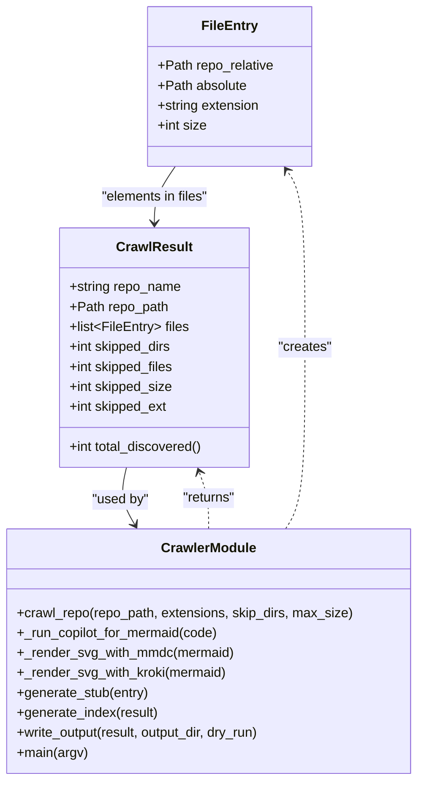

# Diagram: common/filter_service/config/config.dev2.yml


> Auto-generated by Obscura crawlers

## Diagram 1



### SVG

<svg id="container" width="500.5859375" xmlns="http://www.w3.org/2000/svg" class="classDiagram" height="938" viewBox="0 0 500.5859375 938" role="graphics-document document" aria-roledescription="class"><style>#container{font-family:"trebuchet ms",verdana,arial,sans-serif;font-size:16px;fill:#333;}@keyframes edge-animation-frame{from{stroke-dashoffset:0;}}@keyframes dash{to{stroke-dashoffset:0;}}#container .edge-animation-slow{stroke-dasharray:9,5!important;stroke-dashoffset:900;animation:dash 50s linear infinite;stroke-linecap:round;}#container .edge-animation-fast{stroke-dasharray:9,5!important;stroke-dashoffset:900;animation:dash 20s linear infinite;stroke-linecap:round;}#container .error-icon{fill:#552222;}#container .error-text{fill:#552222;stroke:#552222;}#container .edge-thickness-normal{stroke-width:1px;}#container .edge-thickness-thick{stroke-width:3.5px;}#container .edge-pattern-solid{stroke-dasharray:0;}#container .edge-thickness-invisible{stroke-width:0;fill:none;}#container .edge-pattern-dashed{stroke-dasharray:3;}#container .edge-pattern-dotted{stroke-dasharray:2;}#container .marker{fill:#333333;stroke:#333333;}#container .marker.cross{stroke:#333333;}#container svg{font-family:"trebuchet ms",verdana,arial,sans-serif;font-size:16px;}#container p{margin:0;}#container g.classGroup text{fill:#9370DB;stroke:none;font-family:"trebuchet ms",verdana,arial,sans-serif;font-size:10px;}#container g.classGroup text .title{font-weight:bolder;}#container .nodeLabel,#container .edgeLabel{color:#131300;}#container .edgeLabel .label rect{fill:#ECECFF;}#container .label text{fill:#131300;}#container .labelBkg{background:#ECECFF;}#container .edgeLabel .label span{background:#ECECFF;}#container .classTitle{font-weight:bolder;}#container .node rect,#container .node circle,#container .node ellipse,#container .node polygon,#container .node path{fill:#ECECFF;stroke:#9370DB;stroke-width:1px;}#container .divider{stroke:#9370DB;stroke-width:1;}#container g.clickable{cursor:pointer;}#container g.classGroup rect{fill:#ECECFF;stroke:#9370DB;}#container g.classGroup line{stroke:#9370DB;stroke-width:1;}#container .classLabel .box{stroke:none;stroke-width:0;fill:#ECECFF;opacity:0.5;}#container .classLabel .label{fill:#9370DB;font-size:10px;}#container .relation{stroke:#333333;stroke-width:1;fill:none;}#container .dashed-line{stroke-dasharray:3;}#container .dotted-line{stroke-dasharray:1 2;}#container #compositionStart,#container .composition{fill:#333333!important;stroke:#333333!important;stroke-width:1;}#container #compositionEnd,#container .composition{fill:#333333!important;stroke:#333333!important;stroke-width:1;}#container #dependencyStart,#container .dependency{fill:#333333!important;stroke:#333333!important;stroke-width:1;}#container #dependencyStart,#container .dependency{fill:#333333!important;stroke:#333333!important;stroke-width:1;}#container #extensionStart,#container .extension{fill:transparent!important;stroke:#333333!important;stroke-width:1;}#container #extensionEnd,#container .extension{fill:transparent!important;stroke:#333333!important;stroke-width:1;}#container #aggregationStart,#container .aggregation{fill:transparent!important;stroke:#333333!important;stroke-width:1;}#container #aggregationEnd,#container .aggregation{fill:transparent!important;stroke:#333333!important;stroke-width:1;}#container #lollipopStart,#container .lollipop{fill:#ECECFF!important;stroke:#333333!important;stroke-width:1;}#container #lollipopEnd,#container .lollipop{fill:#ECECFF!important;stroke:#333333!important;stroke-width:1;}#container .edgeTerminals{font-size:11px;line-height:initial;}#container .classTitleText{text-anchor:middle;font-size:18px;fill:#333;}#container .label-icon{display:inline-block;height:1em;overflow:visible;vertical-align:-0.125em;}#container .node .label-icon path{fill:currentColor;stroke:revert;stroke-width:revert;}#container :root{--mermaid-font-family:"trebuchet ms",verdana,arial,sans-serif;}</style><g><defs><marker id="container_class-aggregationStart" class="marker aggregation class" refX="18" refY="7" markerWidth="190" markerHeight="240" orient="auto"><path d="M 18,7 L9,13 L1,7 L9,1 Z"></path></marker></defs><defs><marker id="container_class-aggregationEnd" class="marker aggregation class" refX="1" refY="7" markerWidth="20" markerHeight="28" orient="auto"><path d="M 18,7 L9,13 L1,7 L9,1 Z"></path></marker></defs><defs><marker id="container_class-extensionStart" class="marker extension class" refX="18" refY="7" markerWidth="190" markerHeight="240" orient="auto"><path d="M 1,7 L18,13 V 1 Z"></path></marker></defs><defs><marker id="container_class-extensionEnd" class="marker extension class" refX="1" refY="7" markerWidth="20" markerHeight="28" orient="auto"><path d="M 1,1 V 13 L18,7 Z"></path></marker></defs><defs><marker id="container_class-compositionStart" class="marker composition class" refX="18" refY="7" markerWidth="190" markerHeight="240" orient="auto"><path d="M 18,7 L9,13 L1,7 L9,1 Z"></path></marker></defs><defs><marker id="container_class-compositionEnd" class="marker composition class" refX="1" refY="7" markerWidth="20" markerHeight="28" orient="auto"><path d="M 18,7 L9,13 L1,7 L9,1 Z"></path></marker></defs><defs><marker id="container_class-dependencyStart" class="marker dependency class" refX="6" refY="7" markerWidth="190" markerHeight="240" orient="auto"><path d="M 5,7 L9,13 L1,7 L9,1 Z"></path></marker></defs><defs><marker id="container_class-dependencyEnd" class="marker dependency class" refX="13" refY="7" markerWidth="20" markerHeight="28" orient="auto"><path d="M 18,7 L9,13 L14,7 L9,1 Z"></path></marker></defs><defs><marker id="container_class-lollipopStart" class="marker lollipop class" refX="13" refY="7" markerWidth="190" markerHeight="240" orient="auto"><circle stroke="black" fill="transparent" cx="7" cy="7" r="6"></circle></marker></defs><defs><marker id="container_class-lollipopEnd" class="marker lollipop class" refX="1" refY="7" markerWidth="190" markerHeight="240" orient="auto"><circle stroke="black" fill="transparent" cx="7" cy="7" r="6"></circle></marker></defs><g class="root"><g class="clusters"></g><g class="edgePaths"><path d="M210.745,200L206.517,206.167C202.289,212.333,193.834,224.667,189.607,236C185.379,247.333,185.379,257.667,185.379,262.833L185.379,268" id="id_FileEntry_CrawlResult_1" class="edge-thickness-normal edge-pattern-solid relation" style=";;;" data-edge="true" data-et="edge" data-id="id_FileEntry_CrawlResult_1" data-points="W3sieCI6MjEwLjc0NDY4Mzk3NTU2MzkzLCJ5IjoyMDB9LHsieCI6MTg1LjM3ODkwNjI1LCJ5IjoyMzd9LHsieCI6MTg1LjM3ODkwNjI1LCJ5IjoyNzR9XQ==" marker-end="url(#container_class-dependencyEnd)"></path><path d="M150.678,562L149.192,568.167C147.706,574.333,144.734,586.667,146.377,598.139C148.02,609.611,154.279,620.221,157.408,625.527L160.538,630.832" id="id_CrawlResult_CrawlerModule_2" class="edge-thickness-normal edge-pattern-solid relation" style=";;;" data-edge="true" data-et="edge" data-id="id_CrawlResult_CrawlerModule_2" data-points="W3sieCI6MTUwLjY3NzkzOTM5OTE3MTI3LCJ5Ijo1NjJ9LHsieCI6MTQxLjc2MTcxODc1LCJ5Ijo1OTl9LHsieCI6MTYzLjU4NTkzNzUsInkiOjYzNn1d" marker-end="url(#container_class-dependencyEnd)"></path><path d="M344.122,636L348.058,629.833C351.994,623.667,359.866,611.333,363.802,575C367.738,538.667,367.738,478.333,367.738,418C367.738,357.667,367.738,297.333,364.076,261.825C360.414,226.316,353.09,215.632,349.427,210.291L345.765,204.949" id="id_CrawlerModule_FileEntry_3" class="edge-thickness-normal edge-pattern-dashed relation" style=";;;" data-edge="true" data-et="edge" data-id="id_CrawlerModule_FileEntry_3" data-points="W3sieCI6MzQ0LjEyMTU2MDgwMTYzMDQ0LCJ5Ijo2MzZ9LHsieCI6MzY3LjczODI4MTI1LCJ5Ijo1OTl9LHsieCI6MzY3LjczODI4MTI1LCJ5Ijo0MTh9LHsieCI6MzY3LjczODI4MTI1LCJ5IjoyMzd9LHsieCI6MzQyLjM3MjUwMzUyNDQzNjA3LCJ5IjoyMDB9XQ==" marker-end="url(#container_class-dependencyEnd)"></path><path d="M250.293,636L250.293,629.833C250.293,623.667,250.293,611.333,248.419,599.941C246.545,588.549,242.797,578.099,240.923,572.873L239.049,567.648" id="id_CrawlerModule_CrawlResult_4" class="edge-thickness-normal edge-pattern-dashed relation" style=";;;" data-edge="true" data-et="edge" data-id="id_CrawlerModule_CrawlResult_4" data-points="W3sieCI6MjUwLjI5Mjk2ODc1LCJ5Ijo2MzZ9LHsieCI6MjUwLjI5Mjk2ODc1LCJ5Ijo1OTl9LHsieCI6MjM3LjAyMzI0MzI2NjU3NDU4LCJ5Ijo1NjJ9XQ==" marker-end="url(#container_class-dependencyEnd)"></path></g><g class="edgeLabels"><g class="edgeLabel" transform="translate(185.37890625, 237)"><g class="label" data-id="id_FileEntry_CrawlResult_1" transform="translate(-65.921875, -12)"><foreignObject width="131.84375" height="24"><div xmlns="http://www.w3.org/1999/xhtml" class="labelBkg" style="display: table-cell; white-space: nowrap; line-height: 1.5; max-width: 200px; text-align: center;"><span class="edgeLabel"><p>"elements in files"</p></span></div></foreignObject></g></g><g class="edgeLabel" transform="translate(143.00587, 601.10929)"><g class="label" data-id="id_CrawlResult_CrawlerModule_2" transform="translate(-34.703125, -12)"><foreignObject width="69.40625" height="24"><div xmlns="http://www.w3.org/1999/xhtml" class="labelBkg" style="display: table-cell; white-space: nowrap; line-height: 1.5; max-width: 200px; text-align: center;"><span class="edgeLabel"><p>"used by"</p></span></div></foreignObject></g></g><g class="edgeLabel" transform="translate(367.73828125, 418)"><g class="label" data-id="id_CrawlerModule_FileEntry_3" transform="translate(-32.359375, -12)"><foreignObject width="64.71875" height="24"><div xmlns="http://www.w3.org/1999/xhtml" class="labelBkg" style="display: table-cell; white-space: nowrap; line-height: 1.5; max-width: 200px; text-align: center;"><span class="edgeLabel"><p>"creates"</p></span></div></foreignObject></g></g><g class="edgeLabel" transform="translate(250.29296875, 599)"><g class="label" data-id="id_CrawlerModule_CrawlResult_4" transform="translate(-32.53125, -12)"><foreignObject width="65.0625" height="24"><div xmlns="http://www.w3.org/1999/xhtml" class="labelBkg" style="display: table-cell; white-space: nowrap; line-height: 1.5; max-width: 200px; text-align: center;"><span class="edgeLabel"><p>"returns"</p></span></div></foreignObject></g></g></g><g class="nodes"><g class="node default" id="classId-FileEntry-0" transform="translate(276.55859375, 104)"><g class="basic label-container"><path d="M-98.0859375 -96 L98.0859375 -96 L98.0859375 96 L-98.0859375 96" stroke="none" stroke-width="0" fill="#ECECFF" style=""></path><path d="M-98.0859375 -96 C-26.260154858503768 -96, 45.565627782992465 -96, 98.0859375 -96 M-98.0859375 -96 C-40.95152413578682 -96, 16.18288922842636 -96, 98.0859375 -96 M98.0859375 -96 C98.0859375 -40.55199984838451, 98.0859375 14.896000303230977, 98.0859375 96 M98.0859375 -96 C98.0859375 -20.437297703025422, 98.0859375 55.125404593949156, 98.0859375 96 M98.0859375 96 C25.61071318908087 96, -46.86451112183826 96, -98.0859375 96 M98.0859375 96 C55.63172610026887 96, 13.177514700537742 96, -98.0859375 96 M-98.0859375 96 C-98.0859375 44.78905431593576, -98.0859375 -6.421891368128485, -98.0859375 -96 M-98.0859375 96 C-98.0859375 22.85518931628478, -98.0859375 -50.28962136743044, -98.0859375 -96" stroke="#9370DB" stroke-width="1.3" fill="none" stroke-dasharray="0 0" style=""></path></g><g class="annotation-group text" transform="translate(0, -72)"></g><g class="label-group text" transform="translate(-31.859375, -72)"><g class="label" style="font-weight: bolder" transform="translate(0,-12)"><foreignObject width="63.71875" height="24"><div xmlns="http://www.w3.org/1999/xhtml" style="display: table-cell; white-space: nowrap; line-height: 1.5; max-width: 113px; text-align: center;"><span class="nodeLabel markdown-node-label" style=""><p>FileEntry</p></span></div></foreignObject></g></g><g class="members-group text" transform="translate(-86.0859375, -24)"><g class="label" style="" transform="translate(0,-12)"><foreignObject width="140.3125" height="24"><div xmlns="http://www.w3.org/1999/xhtml" style="display: table-cell; white-space: nowrap; line-height: 1.5; max-width: 198px; text-align: center;"><span class="nodeLabel markdown-node-label" style=""><p>+Path repo_relative</p></span></div></foreignObject></g><g class="label" style="" transform="translate(0,12)"><foreignObject width="107.78125" height="24"><div xmlns="http://www.w3.org/1999/xhtml" style="display: table-cell; white-space: nowrap; line-height: 1.5; max-width: 165px; text-align: center;"><span class="nodeLabel markdown-node-label" style=""><p>+Path absolute</p></span></div></foreignObject></g><g class="label" style="" transform="translate(0,36)"><foreignObject width="124.53125" height="24"><div xmlns="http://www.w3.org/1999/xhtml" style="display: table-cell; white-space: nowrap; line-height: 1.5; max-width: 182px; text-align: center;"><span class="nodeLabel markdown-node-label" style=""><p>+string extension</p></span></div></foreignObject></g><g class="label" style="" transform="translate(0,60)"><foreignObject width="59.484375" height="24"><div xmlns="http://www.w3.org/1999/xhtml" style="display: table-cell; white-space: nowrap; line-height: 1.5; max-width: 117px; text-align: center;"><span class="nodeLabel markdown-node-label" style=""><p>+int size</p></span></div></foreignObject></g></g><g class="methods-group text" transform="translate(-86.0859375, 96)"></g><g class="divider" style=""><path d="M-98.0859375 -48 C-23.22672621901266 -48, 51.63248506197468 -48, 98.0859375 -48 M-98.0859375 -48 C-22.839899951131244 -48, 52.40613759773751 -48, 98.0859375 -48" stroke="#9370DB" stroke-width="1.3" fill="none" stroke-dasharray="0 0" style=""></path></g><g class="divider" style=""><path d="M-98.0859375 72 C-52.950878999164075 72, -7.815820498328151 72, 98.0859375 72 M-98.0859375 72 C-58.08790143551632 72, -18.089865371032644 72, 98.0859375 72" stroke="#9370DB" stroke-width="1.3" fill="none" stroke-dasharray="0 0" style=""></path></g></g><g class="node default" id="classId-CrawlResult-1" transform="translate(185.37890625, 418)"><g class="basic label-container"><path d="M-115 -144 L115 -144 L115 144 L-115 144" stroke="none" stroke-width="0" fill="#ECECFF" style=""></path><path d="M-115 -144 C-53.24743117969603 -144, 8.505137640607941 -144, 115 -144 M-115 -144 C-32.485453477217376 -144, 50.02909304556525 -144, 115 -144 M115 -144 C115 -58.35084678220606, 115 27.298306435587875, 115 144 M115 -144 C115 -75.04688732675565, 115 -6.0937746535113035, 115 144 M115 144 C40.72081150912804 144, -33.55837698174392 144, -115 144 M115 144 C24.596924757729298 144, -65.8061504845414 144, -115 144 M-115 144 C-115 38.59301304718586, -115 -66.81397390562827, -115 -144 M-115 144 C-115 29.757153319224386, -115 -84.48569336155123, -115 -144" stroke="#9370DB" stroke-width="1.3" fill="none" stroke-dasharray="0 0" style=""></path></g><g class="annotation-group text" transform="translate(0, -120)"></g><g class="label-group text" transform="translate(-43.28125, -120)"><g class="label" style="font-weight: bolder" transform="translate(0,-12)"><foreignObject width="86.5625" height="24"><div xmlns="http://www.w3.org/1999/xhtml" style="display: table-cell; white-space: nowrap; line-height: 1.5; max-width: 135px; text-align: center;"><span class="nodeLabel markdown-node-label" style=""><p>CrawlResult</p></span></div></foreignObject></g></g><g class="members-group text" transform="translate(-103, -72)"><g class="label" style="" transform="translate(0,-12)"><foreignObject width="135.640625" height="24"><div xmlns="http://www.w3.org/1999/xhtml" style="display: table-cell; white-space: nowrap; line-height: 1.5; max-width: 193px; text-align: center;"><span class="nodeLabel markdown-node-label" style=""><p>+string repo_name</p></span></div></foreignObject></g><g class="label" style="" transform="translate(0,12)"><foreignObject width="118.96875" height="24"><div xmlns="http://www.w3.org/1999/xhtml" style="display: table-cell; white-space: nowrap; line-height: 1.5; max-width: 176px; text-align: center;"><span class="nodeLabel markdown-node-label" style=""><p>+Path repo_path</p></span></div></foreignObject></g><g class="label" style="" transform="translate(0,36)"><foreignObject width="143.421875" height="24"><div xmlns="http://www.w3.org/1999/xhtml" style="display: table-cell; white-space: nowrap; line-height: 1.5; max-width: 240px; text-align: center;"><span class="nodeLabel markdown-node-label" style=""><p>+list&lt;FileEntry&gt; files</p></span></div></foreignObject></g><g class="label" style="" transform="translate(0,60)"><foreignObject width="124.859375" height="24"><div xmlns="http://www.w3.org/1999/xhtml" style="display: table-cell; white-space: nowrap; line-height: 1.5; max-width: 182px; text-align: center;"><span class="nodeLabel markdown-node-label" style=""><p>+int skipped_dirs</p></span></div></foreignObject></g><g class="label" style="" transform="translate(0,84)"><foreignObject width="127.375" height="24"><div xmlns="http://www.w3.org/1999/xhtml" style="display: table-cell; white-space: nowrap; line-height: 1.5; max-width: 185px; text-align: center;"><span class="nodeLabel markdown-node-label" style=""><p>+int skipped_files</p></span></div></foreignObject></g><g class="label" style="" transform="translate(0,108)"><foreignObject width="125.265625" height="24"><div xmlns="http://www.w3.org/1999/xhtml" style="display: table-cell; white-space: nowrap; line-height: 1.5; max-width: 183px; text-align: center;"><span class="nodeLabel markdown-node-label" style=""><p>+int skipped_size</p></span></div></foreignObject></g><g class="label" style="" transform="translate(0,132)"><foreignObject width="119.484375" height="24"><div xmlns="http://www.w3.org/1999/xhtml" style="display: table-cell; white-space: nowrap; line-height: 1.5; max-width: 177px; text-align: center;"><span class="nodeLabel markdown-node-label" style=""><p>+int skipped_ext</p></span></div></foreignObject></g></g><g class="methods-group text" transform="translate(-103, 120)"><g class="label" style="" transform="translate(0,-12)"><foreignObject width="162.71875" height="24"><div xmlns="http://www.w3.org/1999/xhtml" style="display: table-cell; white-space: nowrap; line-height: 1.5; max-width: 220px; text-align: center;"><span class="nodeLabel markdown-node-label" style=""><p>+int total_discovered()</p></span></div></foreignObject></g></g><g class="divider" style=""><path d="M-115 -96 C-41.528314260221734 -96, 31.943371479556532 -96, 115 -96 M-115 -96 C-46.960297012477824 -96, 21.079405975044352 -96, 115 -96" stroke="#9370DB" stroke-width="1.3" fill="none" stroke-dasharray="0 0" style=""></path></g><g class="divider" style=""><path d="M-115 96 C-67.98232393097385 96, -20.96464786194771 96, 115 96 M-115 96 C-25.688042825313758 96, 63.623914349372484 96, 115 96" stroke="#9370DB" stroke-width="1.3" fill="none" stroke-dasharray="0 0" style=""></path></g></g><g class="node default" id="classId-CrawlerModule-2" transform="translate(250.29296875, 783)"><g class="basic label-container"><path d="M-242.29296875 -147 L242.29296875 -147 L242.29296875 147 L-242.29296875 147" stroke="none" stroke-width="0" fill="#ECECFF" style=""></path><path d="M-242.29296875 -147 C-50.21509108584149 -147, 141.862786578317 -147, 242.29296875 -147 M-242.29296875 -147 C-104.1538805230025 -147, 33.985207703995 -147, 242.29296875 -147 M242.29296875 -147 C242.29296875 -68.03435336221261, 242.29296875 10.931293275574774, 242.29296875 147 M242.29296875 -147 C242.29296875 -82.64404095874514, 242.29296875 -18.288081917490274, 242.29296875 147 M242.29296875 147 C121.94211230339677 147, 1.5912558567935378 147, -242.29296875 147 M242.29296875 147 C124.26647687622399 147, 6.23998500244798 147, -242.29296875 147 M-242.29296875 147 C-242.29296875 83.4101513914987, -242.29296875 19.820302782997402, -242.29296875 -147 M-242.29296875 147 C-242.29296875 74.95544056491997, -242.29296875 2.910881129839936, -242.29296875 -147" stroke="#9370DB" stroke-width="1.3" fill="none" stroke-dasharray="0 0" style=""></path></g><g class="annotation-group text" transform="translate(0, -123)"></g><g class="label-group text" transform="translate(-54.8203125, -123)"><g class="label" style="font-weight: bolder" transform="translate(0,-12)"><foreignObject width="109.640625" height="24"><div xmlns="http://www.w3.org/1999/xhtml" style="display: table-cell; white-space: nowrap; line-height: 1.5; max-width: 158px; text-align: center;"><span class="nodeLabel markdown-node-label" style=""><p>CrawlerModule</p></span></div></foreignObject></g></g><g class="members-group text" transform="translate(-230.29296875, -75)"></g><g class="methods-group text" transform="translate(-230.29296875, -45)"><g class="label" style="" transform="translate(0,-12)"><foreignObject width="405.765625" height="24"><div xmlns="http://www.w3.org/1999/xhtml" style="display: table-cell; white-space: nowrap; line-height: 1.5; max-width: 463px; text-align: center;"><span class="nodeLabel markdown-node-label" style=""><p>+crawl_repo(repo_path, extensions, skip_dirs, max_size)</p></span></div></foreignObject></g><g class="label" style="" transform="translate(0,12)"><foreignObject width="244.5" height="24"><div xmlns="http://www.w3.org/1999/xhtml" style="display: table-cell; white-space: nowrap; line-height: 1.5; max-width: 302px; text-align: center;"><span class="nodeLabel markdown-node-label" style=""><p>+_run_copilot_for_mermaid(code)</p></span></div></foreignObject></g><g class="label" style="" transform="translate(0,36)"><foreignObject width="261.328125" height="24"><div xmlns="http://www.w3.org/1999/xhtml" style="display: table-cell; white-space: nowrap; line-height: 1.5; max-width: 319px; text-align: center;"><span class="nodeLabel markdown-node-label" style=""><p>+_render_svg_with_mmdc(mermaid)</p></span></div></foreignObject></g><g class="label" style="" transform="translate(0,60)"><foreignObject width="252.609375" height="24"><div xmlns="http://www.w3.org/1999/xhtml" style="display: table-cell; white-space: nowrap; line-height: 1.5; max-width: 310px; text-align: center;"><span class="nodeLabel markdown-node-label" style=""><p>+_render_svg_with_kroki(mermaid)</p></span></div></foreignObject></g><g class="label" style="" transform="translate(0,84)"><foreignObject width="159.796875" height="24"><div xmlns="http://www.w3.org/1999/xhtml" style="display: table-cell; white-space: nowrap; line-height: 1.5; max-width: 217px; text-align: center;"><span class="nodeLabel markdown-node-label" style=""><p>+generate_stub(entry)</p></span></div></foreignObject></g><g class="label" style="" transform="translate(0,108)"><foreignObject width="171.265625" height="24"><div xmlns="http://www.w3.org/1999/xhtml" style="display: table-cell; white-space: nowrap; line-height: 1.5; max-width: 229px; text-align: center;"><span class="nodeLabel markdown-node-label" style=""><p>+generate_index(result)</p></span></div></foreignObject></g><g class="label" style="" transform="translate(0,132)"><foreignObject width="301.6875" height="24"><div xmlns="http://www.w3.org/1999/xhtml" style="display: table-cell; white-space: nowrap; line-height: 1.5; max-width: 359px; text-align: center;"><span class="nodeLabel markdown-node-label" style=""><p>+write_output(result, output_dir, dry_run)</p></span></div></foreignObject></g><g class="label" style="" transform="translate(0,156)"><foreignObject width="85.5" height="24"><div xmlns="http://www.w3.org/1999/xhtml" style="display: table-cell; white-space: nowrap; line-height: 1.5; max-width: 143px; text-align: center;"><span class="nodeLabel markdown-node-label" style=""><p>+main(argv)</p></span></div></foreignObject></g></g><g class="divider" style=""><path d="M-242.29296875 -99 C-125.09852079363105 -99, -7.904072837262106 -99, 242.29296875 -99 M-242.29296875 -99 C-55.998753173192455 -99, 130.2954624036151 -99, 242.29296875 -99" stroke="#9370DB" stroke-width="1.3" fill="none" stroke-dasharray="0 0" style=""></path></g><g class="divider" style=""><path d="M-242.29296875 -75 C-54.745098338330905 -75, 132.8027720733382 -75, 242.29296875 -75 M-242.29296875 -75 C-127.31074265690414 -75, -12.328516563808279 -75, 242.29296875 -75" stroke="#9370DB" stroke-width="1.3" fill="none" stroke-dasharray="0 0" style=""></path></g></g></g></g></g></svg>

## Diagram 2

```mermaid
graph TD
    A[Start] --> B[Crawl Repo]
    B --> C[Walk filesystem]
    C --> D{File found?}
    D -->|yes| E[Check skip lists (SKIP_FILES, SKIP_DIRS)]
    E --> F{Extension allowed?}
    F -->|no| G[Increment skipped_ext]
    F -->|yes| H[Get file size]
    H --> I{Size == 0 or > MAX?}
    I -->|yes| J[Increment skipped_size or skipped_files]
    I -->|no| K[Append FileEntry to CrawlResult.files]
    K --> L[Continue walking]
    G --> L
    J --> L
    L --> M[Finish walk]
    M --> N[For each FileEntry -> generate_stub]
    N --> O[_run_copilot_for_mermaid(code)]
    O --> P[_render_svg_with_mmdc or _render_svg_with_kroki]
    P --> Q[Return SVG + Mermaid]
    Q --> R[Write .md file if not exists]
    R --> S[Generate INDEX.md]
    S --> T[Done / Exit]
```

> SVG rendering failed for this diagram.
