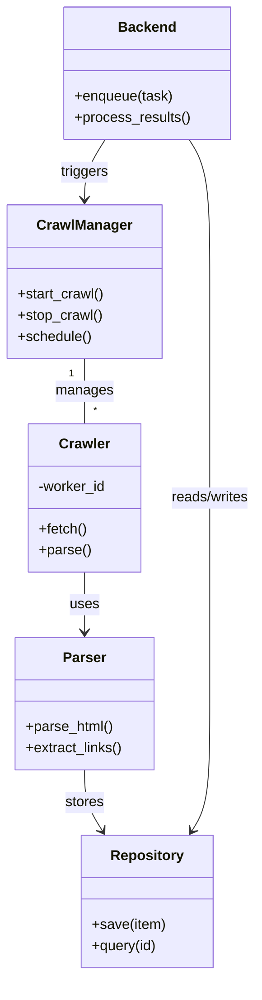
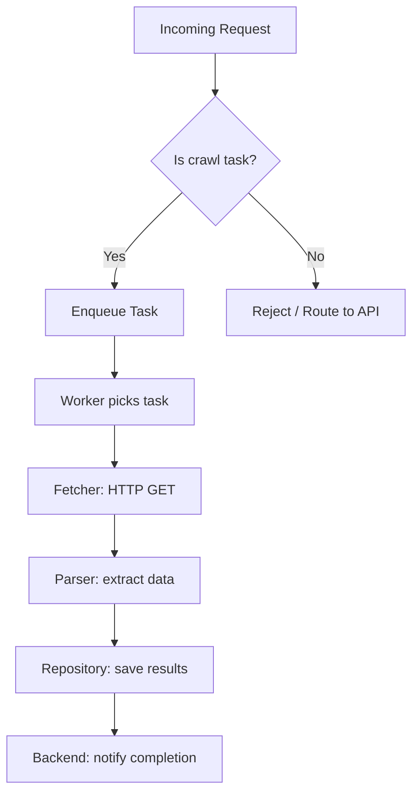

# Diagram: common/filter_service/config/config.prod-a.yml

> Auto-generated by Obscura crawlers

## Diagram 1

### SVG

<svg id="container" width="294.4140625" xmlns="http://www.w3.org/2000/svg" class="classDiagram" height="1104" viewBox="0 0 294.4140625 1104" role="graphics-document document" aria-roledescription="class"><g><defs><marker id="container_class-aggregationStart" class="marker aggregation class" refX="18" refY="7" markerWidth="190" markerHeight="240" orient="auto"><path d="M 18,7 L9,13 L1,7 L9,1 Z"></path></marker></defs><defs><marker id="container_class-aggregationEnd" class="marker aggregation class" refX="1" refY="7" markerWidth="20" markerHeight="28" orient="auto"><path d="M 18,7 L9,13 L1,7 L9,1 Z"></path></marker></defs><defs><marker id="container_class-extensionStart" class="marker extension class" refX="18" refY="7" markerWidth="190" markerHeight="240" orient="auto"><path d="M 1,7 L18,13 V 1 Z"></path></marker></defs><defs><marker id="container_class-extensionEnd" class="marker extension class" refX="1" refY="7" markerWidth="20" markerHeight="28" orient="auto"><path d="M 1,1 V 13 L18,7 Z"></path></marker></defs><defs><marker id="container_class-compositionStart" class="marker composition class" refX="18" refY="7" markerWidth="190" markerHeight="240" orient="auto"><path d="M 18,7 L9,13 L1,7 L9,1 Z"></path></marker></defs><defs><marker id="container_class-compositionEnd" class="marker composition class" refX="1" refY="7" markerWidth="20" markerHeight="28" orient="auto"><path d="M 18,7 L9,13 L1,7 L9,1 Z"></path></marker></defs><defs><marker id="container_class-dependencyStart" class="marker dependency class" refX="6" refY="7" markerWidth="190" markerHeight="240" orient="auto"><path d="M 5,7 L9,13 L1,7 L9,1 Z"></path></marker></defs><defs><marker id="container_class-dependencyEnd" class="marker dependency class" refX="13" refY="7" markerWidth="20" markerHeight="28" orient="auto"><path d="M 18,7 L9,13 L14,7 L9,1 Z"></path></marker></defs><defs><marker id="container_class-lollipopStart" class="marker lollipop class" refX="13" refY="7" markerWidth="190" markerHeight="240" orient="auto"><circle stroke="black" fill="transparent" cx="7" cy="7" r="6"></circle></marker></defs><defs><marker id="container_class-lollipopEnd" class="marker lollipop class" refX="1" refY="7" markerWidth="190" markerHeight="240" orient="auto"><circle stroke="black" fill="transparent" cx="7" cy="7" r="6"></circle></marker></defs><g class="root"><g class="clusters"></g><g class="edgePaths"><path d="M94.898,406L94.898,412.167C94.898,418.333,94.898,430.667,94.898,443C94.898,455.333,94.898,467.667,94.898,473.833L94.898,480" id="id_CrawlManager_Crawler_1" class="edge-thickness-normal edge-pattern-solid relation" style=";;;" data-edge="true" data-et="edge" data-id="id_CrawlManager_Crawler_1" data-points="W3sieCI6OTQuODk4NDM3NSwieSI6NDA2fSx7IngiOjk0Ljg5ODQzNzUsInkiOjQ0M30seyJ4Ijo5NC44OTg0Mzc1LCJ5Ijo0ODB9XQ=="></path><path d="M94.898,648L94.898,654.167C94.898,660.333,94.898,672.667,94.898,684C94.898,695.333,94.898,705.667,94.898,710.833L94.898,716" id="id_Crawler_Parser_2" class="edge-thickness-normal edge-pattern-solid relation" style=";;;" data-edge="true" data-et="edge" data-id="id_Crawler_Parser_2" data-points="W3sieCI6OTQuODk4NDM3NSwieSI6NjQ4fSx7IngiOjk0Ljg5ODQzNzUsInkiOjY4NX0seyJ4Ijo5NC44OTg0Mzc1LCJ5Ijo3MjJ9XQ==" marker-end="url(#container_class-dependencyEnd)"></path><path d="M94.898,872L94.898,878.167C94.898,884.333,94.898,896.667,98.361,908.162C101.824,919.656,108.749,930.313,112.211,935.641L115.674,940.969" id="id_Parser_Repository_3" class="edge-thickness-normal edge-pattern-solid relation" style=";;;" data-edge="true" data-et="edge" data-id="id_Parser_Repository_3" data-points="W3sieCI6OTQuODk4NDM3NSwieSI6ODcyfSx7IngiOjk0Ljg5ODQzNzUsInkiOjkwOX0seyJ4IjoxMTguOTQzNTMzNzYxMTYwNzIsInkiOjk0Nn1d" marker-end="url(#container_class-dependencyEnd)"></path><path d="M216.424,158L220.431,164.167C224.439,170.333,232.454,182.667,236.461,209.5C240.469,236.333,240.469,277.667,240.469,319C240.469,360.333,240.469,401.667,240.469,442.5C240.469,483.333,240.469,523.667,240.469,564C240.469,604.333,240.469,644.667,240.469,683.5C240.469,722.333,240.469,759.667,240.469,797C240.469,834.333,240.469,871.667,237.006,895.662C233.544,919.656,226.618,930.313,223.156,935.641L219.693,940.969" id="id_Backend_Repository_4" class="edge-thickness-normal edge-pattern-solid relation" style=";;;" data-edge="true" data-et="edge" data-id="id_Backend_Repository_4" data-points="W3sieCI6MjE2LjQyMzY1MzczODgzOTI4LCJ5IjoxNTh9LHsieCI6MjQwLjQ2ODc1LCJ5IjoxOTV9LHsieCI6MjQwLjQ2ODc1LCJ5IjozMTl9LHsieCI6MjQwLjQ2ODc1LCJ5Ijo0NDN9LHsieCI6MjQwLjQ2ODc1LCJ5Ijo1NjR9LHsieCI6MjQwLjQ2ODc1LCJ5Ijo2ODV9LHsieCI6MjQwLjQ2ODc1LCJ5Ijo3OTd9LHsieCI6MjQwLjQ2ODc1LCJ5Ijo5MDl9LHsieCI6MjE2LjQyMzY1MzczODgzOTI4LCJ5Ijo5NDZ9XQ==" marker-end="url(#container_class-dependencyEnd)"></path><path d="M118.944,158L114.936,164.167C110.929,170.333,102.913,182.667,98.906,194C94.898,205.333,94.898,215.667,94.898,220.833L94.898,226" id="id_Backend_CrawlManager_5" class="edge-thickness-normal edge-pattern-solid relation" style=";;;" data-edge="true" data-et="edge" data-id="id_Backend_CrawlManager_5" data-points="W3sieCI6MTE4Ljk0MzUzMzc2MTE2MDcyLCJ5IjoxNTh9LHsieCI6OTQuODk4NDM3NSwieSI6MTk1fSx7IngiOjk0Ljg5ODQzNzUsInkiOjIzMn1d" marker-end="url(#container_class-dependencyEnd)"></path></g><g class="edgeLabels"><g class="edgeLabel" transform="translate(94.8984375, 443)"><g class="label" data-id="id_CrawlManager_Crawler_1" transform="translate(-32.296875, -12)"><foreignObject width="64.59375" height="24">

manages

</foreignObject></g></g><g class="edgeLabel" transform="translate(94.8984375, 685)"><g class="label" data-id="id_Crawler_Parser_2" transform="translate(-16.4921875, -12)"><foreignObject width="32.984375" height="24">

uses

</foreignObject></g></g><g class="edgeLabel" transform="translate(94.8984375, 909)"><g class="label" data-id="id_Parser_Repository_3" transform="translate(-22.125, -12)"><foreignObject width="44.25" height="24">

stores

</foreignObject></g></g><g class="edgeLabel" transform="translate(240.46875, 564)"><g class="label" data-id="id_Backend_Repository_4" transform="translate(-45.9453125, -12)"><foreignObject width="91.890625" height="24">

reads/writes

</foreignObject></g></g><g class="edgeLabel" transform="translate(94.8984375, 195)"><g class="label" data-id="id_Backend_CrawlManager_5" transform="translate(-27.4921875, -12)"><foreignObject width="54.984375" height="24">

triggers

</foreignObject></g></g><g class="edgeTerminals" transform="translate(79.89843875000004, 423.5000010714286)"><g class="inner" transform="translate(0, 0)"><foreignObject style="width: 9px; height: 12px;">
1
</foreignObject></g></g><g class="edgeTerminals" transform="translate(104.89843874999995, 457.5000010714286)"><g class="inner" transform="translate(0, 0)"></g><foreignObject style="width: 9px; height: 12px;">
*
</foreignObject></g></g><g class="nodes"><g class="node default" id="classId-CrawlManager-0" transform="translate(94.8984375, 319)"><g class="basic label-container"><path d="M-86.8984375 -87 L86.8984375 -87 L86.8984375 87 L-86.8984375 87" stroke="none" stroke-width="0" fill="#ECECFF" style=""></path><path d="M-86.8984375 -87 C-46.83596909201545 -87, -6.773500684030907 -87, 86.8984375 -87 M-86.8984375 -87 C-26.46329292163636 -87, 33.97185165672728 -87, 86.8984375 -87 M86.8984375 -87 C86.8984375 -46.10927281313391, 86.8984375 -5.218545626267826, 86.8984375 87 M86.8984375 -87 C86.8984375 -22.404734165651234, 86.8984375 42.19053166869753, 86.8984375 87 M86.8984375 87 C24.447948814607535 87, -38.00253987078493 87, -86.8984375 87 M86.8984375 87 C48.7450466130113 87, 10.591655726022594 87, -86.8984375 87 M-86.8984375 87 C-86.8984375 48.46421818104443, -86.8984375 9.92843636208886, -86.8984375 -87 M-86.8984375 87 C-86.8984375 32.93041698217123, -86.8984375 -21.13916603565754, -86.8984375 -87" stroke="#9370DB" stroke-width="1.3" fill="none" stroke-dasharray="0 0" style=""></path></g><g class="annotation-group text" transform="translate(0, -63)"></g><g class="label-group text" transform="translate(-51.59375, -63)"><g class="label" style="font-weight: bolder" transform="translate(0,-12)"><foreignObject width="103.1875" height="24">

CrawlManager

</foreignObject></g></g><g class="members-group text" transform="translate(-74.8984375, -15)"></g><g class="methods-group text" transform="translate(-74.8984375, 15)"><g class="label" style="" transform="translate(0,-12)"><foreignObject width="98.203125" height="24">

+start_crawl()

</foreignObject></g><g class="label" style="" transform="translate(0,12)"><foreignObject width="95.9375" height="24">

+stop_crawl()

</foreignObject></g><g class="label" style="" transform="translate(0,36)"><foreignObject width="83.78125" height="24">

+schedule()

</foreignObject></g></g><g class="divider" style=""><path d="M-86.8984375 -39 C-45.083107519667266 -39, -3.2677775393345314 -39, 86.8984375 -39 M-86.8984375 -39 C-26.422301665716518 -39, 34.053834168566965 -39, 86.8984375 -39" stroke="#9370DB" stroke-width="1.3" fill="none" stroke-dasharray="0 0" style=""></path></g><g class="divider" style=""><path d="M-86.8984375 -15 C-25.5547422655709 -15, 35.7889529688582 -15, 86.8984375 -15 M-86.8984375 -15 C-37.49241535909865 -15, 11.913606781802699 -15, 86.8984375 -15" stroke="#9370DB" stroke-width="1.3" fill="none" stroke-dasharray="0 0" style=""></path></g></g><g class="node default" id="classId-Crawler-1" transform="translate(94.8984375, 564)"><g class="basic label-container"><path d="M-64.625 -84 L64.625 -84 L64.625 84 L-64.625 84" stroke="none" stroke-width="0" fill="#ECECFF" style=""></path><path d="M-64.625 -84 C-23.285437545145562 -84, 18.054124909708875 -84, 64.625 -84 M-64.625 -84 C-18.377505153453214 -84, 27.869989693093572 -84, 64.625 -84 M64.625 -84 C64.625 -34.34104133839787, 64.625 15.317917323204256, 64.625 84 M64.625 -84 C64.625 -26.26274483484228, 64.625 31.47451033031544, 64.625 84 M64.625 84 C13.840117314628138 84, -36.944765370743724 84, -64.625 84 M64.625 84 C36.32159108871035 84, 8.018182177420705 84, -64.625 84 M-64.625 84 C-64.625 41.6056886104587, -64.625 -0.7886227790826013, -64.625 -84 M-64.625 84 C-64.625 42.3084037994113, -64.625 0.6168075988226036, -64.625 -84" stroke="#9370DB" stroke-width="1.3" fill="none" stroke-dasharray="0 0" style=""></path></g><g class="annotation-group text" transform="translate(0, -60)"></g><g class="label-group text" transform="translate(-27.734375, -60)"><g class="label" style="font-weight: bolder" transform="translate(0,-12)"><foreignObject width="55.46875" height="24">

Crawler

</foreignObject></g></g><g class="members-group text" transform="translate(-52.625, -12)"><g class="label" style="" transform="translate(0,-12)"><foreignObject width="77.515625" height="24">

-worker_id

</foreignObject></g></g><g class="methods-group text" transform="translate(-52.625, 36)"><g class="label" style="" transform="translate(0,-12)"><foreignObject width="54.59375" height="24">

+fetch()

</foreignObject></g><g class="label" style="" transform="translate(0,12)"><foreignObject width="58.53125" height="24">

+parse()

</foreignObject></g></g><g class="divider" style=""><path d="M-64.625 -36 C-32.00701174225398 -36, 0.610976515492041 -36, 64.625 -36 M-64.625 -36 C-29.98005263932236 -36, 4.664894721355282 -36, 64.625 -36" stroke="#9370DB" stroke-width="1.3" fill="none" stroke-dasharray="0 0" style=""></path></g><g class="divider" style=""><path d="M-64.625 12 C-14.469962203041682 12, 35.685075593916636 12, 64.625 12 M-64.625 12 C-16.1360885145656 12, 32.3528229708688 12, 64.625 12" stroke="#9370DB" stroke-width="1.3" fill="none" stroke-dasharray="0 0" style=""></path></g></g><g class="node default" id="classId-Parser-2" transform="translate(94.8984375, 797)"><g class="basic label-container"><path d="M-78.953125 -75 L78.953125 -75 L78.953125 75 L-78.953125 75" stroke="none" stroke-width="0" fill="#ECECFF" style=""></path><path d="M-78.953125 -75 C-27.206959537323357 -75, 24.539205925353286 -75, 78.953125 -75 M-78.953125 -75 C-21.125646608732467 -75, 36.701831782535066 -75, 78.953125 -75 M78.953125 -75 C78.953125 -36.03199956492852, 78.953125 2.936000870142962, 78.953125 75 M78.953125 -75 C78.953125 -23.427748304540415, 78.953125 28.14450339091917, 78.953125 75 M78.953125 75 C16.23062901667818 75, -46.49186696664364 75, -78.953125 75 M78.953125 75 C38.15934524065756 75, -2.634434518684884 75, -78.953125 75 M-78.953125 75 C-78.953125 30.18772092331931, -78.953125 -14.624558153361377, -78.953125 -75 M-78.953125 75 C-78.953125 42.80684518595822, -78.953125 10.613690371916434, -78.953125 -75" stroke="#9370DB" stroke-width="1.3" fill="none" stroke-dasharray="0 0" style=""></path></g><g class="annotation-group text" transform="translate(0, -51)"></g><g class="label-group text" transform="translate(-23.375, -51)"><g class="label" style="font-weight: bolder" transform="translate(0,-12)"><foreignObject width="46.75" height="24">

Parser

</foreignObject></g></g><g class="members-group text" transform="translate(-66.953125, -3)"></g><g class="methods-group text" transform="translate(-66.953125, 27)"><g class="label" style="" transform="translate(0,-12)"><foreignObject width="100.09375" height="24">

+parse_html()

</foreignObject></g><g class="label" style="" transform="translate(0,12)"><foreignObject width="110.53125" height="24">

+extract_links()

</foreignObject></g></g><g class="divider" style=""><path d="M-78.953125 -27 C-29.37556734863857 -27, 20.201990302722862 -27, 78.953125 -27 M-78.953125 -27 C-31.159804585418613 -27, 16.633515829162775 -27, 78.953125 -27" stroke="#9370DB" stroke-width="1.3" fill="none" stroke-dasharray="0 0" style=""></path></g><g class="divider" style=""><path d="M-78.953125 -3 C-34.86188241350561 -3, 9.229360172988777 -3, 78.953125 -3 M-78.953125 -3 C-26.630043578063372 -3, 25.693037843873256 -3, 78.953125 -3" stroke="#9370DB" stroke-width="1.3" fill="none" stroke-dasharray="0 0" style=""></path></g></g><g class="node default" id="classId-Repository-3" transform="translate(167.68359375, 1021)"><g class="basic label-container"><path d="M-73.45703125 -75 L73.45703125 -75 L73.45703125 75 L-73.45703125 75" stroke="none" stroke-width="0" fill="#ECECFF" style=""></path><path d="M-73.45703125 -75 C-37.34689738058824 -75, -1.236763511176477 -75, 73.45703125 -75 M-73.45703125 -75 C-36.5327023619785 -75, 0.3916265260429981 -75, 73.45703125 -75 M73.45703125 -75 C73.45703125 -37.5034008606684, 73.45703125 -0.00680172133679946, 73.45703125 75 M73.45703125 -75 C73.45703125 -17.154273861181892, 73.45703125 40.691452277636216, 73.45703125 75 M73.45703125 75 C38.56102698857729 75, 3.6650227271545788 75, -73.45703125 75 M73.45703125 75 C26.98027974415161 75, -19.49647176169678 75, -73.45703125 75 M-73.45703125 75 C-73.45703125 36.32059319561278, -73.45703125 -2.3588136087744402, -73.45703125 -75 M-73.45703125 75 C-73.45703125 44.66789004878544, -73.45703125 14.335780097570868, -73.45703125 -75" stroke="#9370DB" stroke-width="1.3" fill="none" stroke-dasharray="0 0" style=""></path></g><g class="annotation-group text" transform="translate(0, -51)"></g><g class="label-group text" transform="translate(-39.7734375, -51)"><g class="label" style="font-weight: bolder" transform="translate(0,-12)"><foreignObject width="79.546875" height="24">

Repository

</foreignObject></g></g><g class="members-group text" transform="translate(-61.45703125, -3)"></g><g class="methods-group text" transform="translate(-61.45703125, 27)"><g class="label" style="" transform="translate(0,-12)"><foreignObject width="83.140625" height="24">

+save(item)

</foreignObject></g><g class="label" style="" transform="translate(0,12)"><foreignObject width="74.09375" height="24">

+query(id)

</foreignObject></g></g><g class="divider" style=""><path d="M-73.45703125 -27 C-35.40125279032245 -27, 2.6545256693550954 -27, 73.45703125 -27 M-73.45703125 -27 C-42.23636570920078 -27, -11.015700168401573 -27, 73.45703125 -27" stroke="#9370DB" stroke-width="1.3" fill="none" stroke-dasharray="0 0" style=""></path></g><g class="divider" style=""><path d="M-73.45703125 -3 C-34.221306204399696 -3, 5.014418841200609 -3, 73.45703125 -3 M-73.45703125 -3 C-20.73561498966758 -3, 31.985801270664837 -3, 73.45703125 -3" stroke="#9370DB" stroke-width="1.3" fill="none" stroke-dasharray="0 0" style=""></path></g></g><g class="node default" id="classId-Backend-4" transform="translate(167.68359375, 83)"><g class="basic label-container"><path d="M-93.0859375 -75 L93.0859375 -75 L93.0859375 75 L-93.0859375 75" stroke="none" stroke-width="0" fill="#ECECFF" style=""></path><path d="M-93.0859375 -75 C-22.569291934132323 -75, 47.94735363173535 -75, 93.0859375 -75 M-93.0859375 -75 C-41.95718036247823 -75, 9.171576775043533 -75, 93.0859375 -75 M93.0859375 -75 C93.0859375 -15.172554753259476, 93.0859375 44.65489049348105, 93.0859375 75 M93.0859375 -75 C93.0859375 -43.59866636056303, 93.0859375 -12.19733272112606, 93.0859375 75 M93.0859375 75 C29.819261240155818 75, -33.447415019688364 75, -93.0859375 75 M93.0859375 75 C46.04997242071284 75, -0.9859926585743182 75, -93.0859375 75 M-93.0859375 75 C-93.0859375 41.968206203018845, -93.0859375 8.93641240603769, -93.0859375 -75 M-93.0859375 75 C-93.0859375 16.677330531624577, -93.0859375 -41.645338936750846, -93.0859375 -75" stroke="#9370DB" stroke-width="1.3" fill="none" stroke-dasharray="0 0" style=""></path></g><g class="annotation-group text" transform="translate(0, -51)"></g><g class="label-group text" transform="translate(-31.296875, -51)"><g class="label" style="font-weight: bolder" transform="translate(0,-12)"><foreignObject width="62.59375" height="24">

Backend

</foreignObject></g></g><g class="members-group text" transform="translate(-81.0859375, -3)"></g><g class="methods-group text" transform="translate(-81.0859375, 27)"><g class="label" style="" transform="translate(0,-12)"><foreignObject width="111.953125" height="24">

+enqueue(task)

</foreignObject></g><g class="label" style="" transform="translate(0,12)"><foreignObject width="130.875" height="24">

+process_results()

</foreignObject></g></g><g class="divider" style=""><path d="M-93.0859375 -27 C-19.17728061751008 -27, 54.73137626497984 -27, 93.0859375 -27 M-93.0859375 -27 C-34.433446819594096 -27, 24.21904386081181 -27, 93.0859375 -27" stroke="#9370DB" stroke-width="1.3" fill="none" stroke-dasharray="0 0" style=""></path></g><g class="divider" style=""><path d="M-93.0859375 -3 C-37.138956862068135 -3, 18.80802377586373 -3, 93.0859375 -3 M-93.0859375 -3 C-37.52452978074866 -3, 18.036877938502684 -3, 93.0859375 -3" stroke="#9370DB" stroke-width="1.3" fill="none" stroke-dasharray="0 0" style=""></path></g></g></g></g></g></svg>

## Diagram 2

### SVG

<svg id="container" width="485.4453125" xmlns="http://www.w3.org/2000/svg" class="flowchart" height="917.546875" viewBox="0 0 485.4453125 917.546875" role="graphics-document document" aria-roledescription="flowchart-v2"><g><marker id="container_flowchart-v2-pointEnd" class="marker flowchart-v2" viewBox="0 0 10 10" refX="5" refY="5" markerUnits="userSpaceOnUse" markerWidth="8" markerHeight="8" orient="auto"><path d="M 0 0 L 10 5 L 0 10 z" class="arrowMarkerPath" style="stroke-width: 1; stroke-dasharray: 1, 0;"></path></marker><marker id="container_flowchart-v2-pointStart" class="marker flowchart-v2" viewBox="0 0 10 10" refX="4.5" refY="5" markerUnits="userSpaceOnUse" markerWidth="8" markerHeight="8" orient="auto"><path d="M 0 5 L 10 10 L 10 0 z" class="arrowMarkerPath" style="stroke-width: 1; stroke-dasharray: 1, 0;"></path></marker><marker id="container_flowchart-v2-circleEnd" class="marker flowchart-v2" viewBox="0 0 10 10" refX="11" refY="5" markerUnits="userSpaceOnUse" markerWidth="11" markerHeight="11" orient="auto"><circle cx="5" cy="5" r="5" class="arrowMarkerPath" style="stroke-width: 1; stroke-dasharray: 1, 0;"></circle></marker><marker id="container_flowchart-v2-circleStart" class="marker flowchart-v2" viewBox="0 0 10 10" refX="-1" refY="5" markerUnits="userSpaceOnUse" markerWidth="11" markerHeight="11" orient="auto"><circle cx="5" cy="5" r="5" class="arrowMarkerPath" style="stroke-width: 1; stroke-dasharray: 1, 0;"></circle></marker><marker id="container_flowchart-v2-crossEnd" class="marker cross flowchart-v2" viewBox="0 0 11 11" refX="12" refY="5.2" markerUnits="userSpaceOnUse" markerWidth="11" markerHeight="11" orient="auto"><path d="M 1,1 l 9,9 M 10,1 l -9,9" class="arrowMarkerPath" style="stroke-width: 2; stroke-dasharray: 1, 0;"></path></marker><marker id="container_flowchart-v2-crossStart" class="marker cross flowchart-v2" viewBox="0 0 11 11" refX="-1" refY="5.2" markerUnits="userSpaceOnUse" markerWidth="11" markerHeight="11" orient="auto"><path d="M 1,1 l 9,9 M 10,1 l -9,9" class="arrowMarkerPath" style="stroke-width: 2; stroke-dasharray: 1, 0;"></path></marker><g class="root"><g class="clusters"></g><g class="edgePaths"><path d="M254.746,62L254.746,66.167C254.746,70.333,254.746,78.667,254.746,86.333C254.746,94,254.746,101,254.746,104.5L254.746,108" id="L_A_B_0" class="edge-thickness-normal edge-pattern-solid edge-thickness-normal edge-pattern-solid flowchart-link" style=";" data-edge="true" data-et="edge" data-id="L_A_B_0" data-points="W3sieCI6MjU0Ljc0NjA5Mzc1LCJ5Ijo2Mn0seyJ4IjoyNTQuNzQ2MDkzNzUsInkiOjg3fSx7IngiOjI1NC43NDYwOTM3NSwieSI6MTEyfV0=" marker-end="url(#container_flowchart-v2-pointEnd)"></path><path d="M216.432,223.233L203.242,235.785C190.051,248.338,163.67,273.442,150.48,291.495C137.289,309.547,137.289,320.547,137.289,326.047L137.289,331.547" id="L_B_C_0" class="edge-thickness-normal edge-pattern-solid edge-thickness-normal edge-pattern-solid flowchart-link" style=";" data-edge="true" data-et="edge" data-id="L_B_C_0" data-points="W3sieCI6MjE2LjQzMjM5OTk2ODM2ODE3LCJ5IjoyMjMuMjMzMTgxMjE4MzY4MTd9LHsieCI6MTM3LjI4OTA2MjUsInkiOjI5OC41NDY4NzV9LHsieCI6MTM3LjI4OTA2MjUsInkiOjMzNS41NDY4NzV9XQ==" marker-end="url(#container_flowchart-v2-pointEnd)"></path><path d="M137.289,389.547L137.289,393.714C137.289,397.88,137.289,406.214,137.289,413.88C137.289,421.547,137.289,428.547,137.289,432.047L137.289,435.547" id="L_C_D_0" class="edge-thickness-normal edge-pattern-solid edge-thickness-normal edge-pattern-solid flowchart-link" style=";" data-edge="true" data-et="edge" data-id="L_C_D_0" data-points="W3sieCI6MTM3LjI4OTA2MjUsInkiOjM4OS41NDY4NzV9LHsieCI6MTM3LjI4OTA2MjUsInkiOjQxNC41NDY4NzV9LHsieCI6MTM3LjI4OTA2MjUsInkiOjQzOS41NDY4NzV9XQ==" marker-end="url(#container_flowchart-v2-pointEnd)"></path><path d="M137.289,493.547L137.289,497.714C137.289,501.88,137.289,510.214,137.289,517.88C137.289,525.547,137.289,532.547,137.289,536.047L137.289,539.547" id="L_D_E_0" class="edge-thickness-normal edge-pattern-solid edge-thickness-normal edge-pattern-solid flowchart-link" style=";" data-edge="true" data-et="edge" data-id="L_D_E_0" data-points="W3sieCI6MTM3LjI4OTA2MjUsInkiOjQ5My41NDY4NzV9LHsieCI6MTM3LjI4OTA2MjUsInkiOjUxOC41NDY4NzV9LHsieCI6MTM3LjI4OTA2MjUsInkiOjU0My41NDY4NzV9XQ==" marker-end="url(#container_flowchart-v2-pointEnd)"></path><path d="M137.289,597.547L137.289,601.714C137.289,605.88,137.289,614.214,137.289,621.88C137.289,629.547,137.289,636.547,137.289,640.047L137.289,643.547" id="L_E_F_0" class="edge-thickness-normal edge-pattern-solid edge-thickness-normal edge-pattern-solid flowchart-link" style=";" data-edge="true" data-et="edge" data-id="L_E_F_0" data-points="W3sieCI6MTM3LjI4OTA2MjUsInkiOjU5Ny41NDY4NzV9LHsieCI6MTM3LjI4OTA2MjUsInkiOjYyMi41NDY4NzV9LHsieCI6MTM3LjI4OTA2MjUsInkiOjY0Ny41NDY4NzV9XQ==" marker-end="url(#container_flowchart-v2-pointEnd)"></path><path d="M137.289,701.547L137.289,705.714C137.289,709.88,137.289,718.214,137.289,725.88C137.289,733.547,137.289,740.547,137.289,744.047L137.289,747.547" id="L_F_G_0" class="edge-thickness-normal edge-pattern-solid edge-thickness-normal edge-pattern-solid flowchart-link" style=";" data-edge="true" data-et="edge" data-id="L_F_G_0" data-points="W3sieCI6MTM3LjI4OTA2MjUsInkiOjcwMS41NDY4NzV9LHsieCI6MTM3LjI4OTA2MjUsInkiOjcyNi41NDY4NzV9LHsieCI6MTM3LjI4OTA2MjUsInkiOjc1MS41NDY4NzV9XQ==" marker-end="url(#container_flowchart-v2-pointEnd)"></path><path d="M137.289,805.547L137.289,809.714C137.289,813.88,137.289,822.214,137.289,829.88C137.289,837.547,137.289,844.547,137.289,848.047L137.289,851.547" id="L_G_H_0" class="edge-thickness-normal edge-pattern-solid edge-thickness-normal edge-pattern-solid flowchart-link" style=";" data-edge="true" data-et="edge" data-id="L_G_H_0" data-points="W3sieCI6MTM3LjI4OTA2MjUsInkiOjgwNS41NDY4NzV9LHsieCI6MTM3LjI4OTA2MjUsInkiOjgzMC41NDY4NzV9LHsieCI6MTM3LjI4OTA2MjUsInkiOjg1NS41NDY4NzV9XQ==" marker-end="url(#container_flowchart-v2-pointEnd)"></path><path d="M293.06,223.233L306.25,235.785C319.441,248.338,345.822,273.442,359.013,291.495C372.203,309.547,372.203,320.547,372.203,326.047L372.203,331.547" id="L_B_I_0" class="edge-thickness-normal edge-pattern-solid edge-thickness-normal edge-pattern-solid flowchart-link" style=";" data-edge="true" data-et="edge" data-id="L_B_I_0" data-points="W3sieCI6MjkzLjA1OTc4NzUzMTYzMTgsInkiOjIyMy4yMzMxODEyMTgzNjgxN30seyJ4IjozNzIuMjAzMTI1LCJ5IjoyOTguNTQ2ODc1fSx7IngiOjM3Mi4yMDMxMjUsInkiOjMzNS41NDY4NzV9XQ==" marker-end="url(#container_flowchart-v2-pointEnd)"></path></g><g class="edgeLabels"><g class="edgeLabel"><g class="label" data-id="L_A_B_0" transform="translate(0, 0)"><foreignObject width="0" height="0">

</foreignObject></g></g><g class="edgeLabel" transform="translate(137.2890625, 298.546875)"><g class="label" data-id="L_B_C_0" transform="translate(-12.03125, -12)"><foreignObject width="24.0625" height="24">

Yes

</foreignObject></g></g><g class="edgeLabel"><g class="label" data-id="L_C_D_0" transform="translate(0, 0)"><foreignObject width="0" height="0">

</foreignObject></g></g><g class="edgeLabel"><g class="label" data-id="L_D_E_0" transform="translate(0, 0)"><foreignObject width="0" height="0">

</foreignObject></g></g><g class="edgeLabel"><g class="label" data-id="L_E_F_0" transform="translate(0, 0)"><foreignObject width="0" height="0">

</foreignObject></g></g><g class="edgeLabel"><g class="label" data-id="L_F_G_0" transform="translate(0, 0)"><foreignObject width="0" height="0">

</foreignObject></g></g><g class="edgeLabel"><g class="label" data-id="L_G_H_0" transform="translate(0, 0)"><foreignObject width="0" height="0">

</foreignObject></g></g><g class="edgeLabel" transform="translate(372.203125, 298.546875)"><g class="label" data-id="L_B_I_0" transform="translate(-10.140625, -12)"><foreignObject width="20.28125" height="24">

No

</foreignObject></g></g></g><g class="nodes"><g class="node default" id="flowchart-A-0" transform="translate(254.74609375, 35)"><rect class="basic label-container" style="" x="-94.96875" y="-27" width="189.9375" height="54"></rect><g class="label" style="" transform="translate(-64.96875, -12)"><rect></rect><foreignObject width="129.9375" height="24">

Incoming Request

</foreignObject></g></g><g class="node default" id="flowchart-B-1" transform="translate(254.74609375, 186.7734375)"><polygon points="74.7734375,0 149.546875,-74.7734375 74.7734375,-149.546875 0,-74.7734375" class="label-container" transform="translate(-74.2734375, 74.7734375)"></polygon><g class="label" style="" transform="translate(-47.7734375, -12)"><rect></rect><foreignObject width="95.546875" height="24">

Is crawl task?

</foreignObject></g></g><g class="node default" id="flowchart-C-3" transform="translate(137.2890625, 362.546875)"><rect class="basic label-container" style="" x="-79.671875" y="-27" width="159.34375" height="54"></rect><g class="label" style="" transform="translate(-49.671875, -12)"><rect></rect><foreignObject width="99.34375" height="24">

Enqueue Task

</foreignObject></g></g><g class="node default" id="flowchart-D-5" transform="translate(137.2890625, 466.546875)"><rect class="basic label-container" style="" x="-93.5625" y="-27" width="187.125" height="54"></rect><g class="label" style="" transform="translate(-63.5625, -12)"><rect></rect><foreignObject width="127.125" height="24">

Worker picks task

</foreignObject></g></g><g class="node default" id="flowchart-E-7" transform="translate(137.2890625, 570.546875)"><rect class="basic label-container" style="" x="-94.8046875" y="-27" width="189.609375" height="54"></rect><g class="label" style="" transform="translate(-64.8046875, -12)"><rect></rect><foreignObject width="129.609375" height="24">

Fetcher: HTTP GET

</foreignObject></g></g><g class="node default" id="flowchart-F-9" transform="translate(137.2890625, 674.546875)"><rect class="basic label-container" style="" x="-100.203125" y="-27" width="200.40625" height="54"></rect><g class="label" style="" transform="translate(-70.203125, -12)"><rect></rect><foreignObject width="140.40625" height="24">

Parser: extract data

</foreignObject></g></g><g class="node default" id="flowchart-G-11" transform="translate(137.2890625, 778.546875)"><rect class="basic label-container" style="" x="-115.875" y="-27" width="231.75" height="54"></rect><g class="label" style="" transform="translate(-85.875, -12)"><rect></rect><foreignObject width="171.75" height="24">

Repository: save results

</foreignObject></g></g><g class="node default" id="flowchart-H-13" transform="translate(137.2890625, 882.546875)"><rect class="basic label-container" style="" x="-129.2890625" y="-27" width="258.578125" height="54"></rect><g class="label" style="" transform="translate(-99.2890625, -12)"><rect></rect><foreignObject width="198.578125" height="24">

Backend: notify completion

</foreignObject></g></g><g class="node default" id="flowchart-I-15" transform="translate(372.203125, 362.546875)"><rect class="basic label-container" style="" x="-105.2421875" y="-27" width="210.484375" height="54"></rect><g class="label" style="" transform="translate(-75.2421875, -12)"><rect></rect><foreignObject width="150.484375" height="24">

Reject / Route to API

</foreignObject></g></g></g></g></g></svg>
