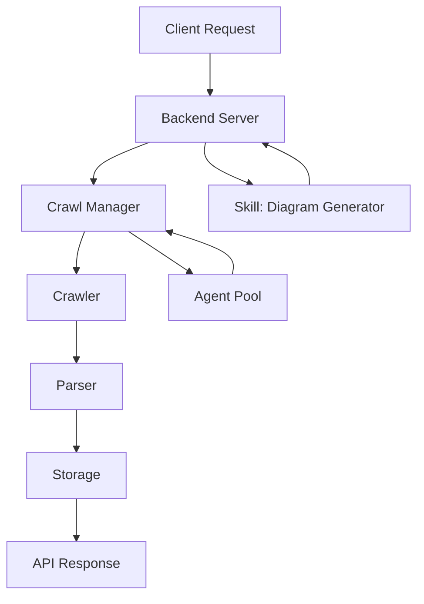

# Diagram: common/filter_service/config/config.prod-b.yml


> Auto-generated by Obscura crawlers

## Diagram 1

```mermaid
classDiagram
    class Crawler {
        +start()
        +stop()
        +crawl(url)
    }
    class CrawlManager {
        +start_crawl(url)
        +schedule(job)
        +get_status(id)
    }
    class BackendServer {
        +handle_request(req)
        +respond(res)
    }
    class Agent {
        +run()
        +dispatch(task)
    }
    class Skill {
        +generate_diagram(source)
    }
    CrawlManager --> Crawler : manages
    BackendServer --> CrawlManager : coordinates
    Agent --> CrawlManager : submits tasks
    BackendServer ..> Skill : uses
    Crawler --> Parser : produces
    Parser [Parser] --> Storage : saves
    class Parser {
        +parse(html)
    }
    class Storage {
        +save(data)
        +query(id)
    }
```

> SVG rendering failed for this diagram.

## Diagram 2



### SVG

<svg id="container" width="482.7265625" xmlns="http://www.w3.org/2000/svg" class="flowchart" height="694" viewBox="0 0 482.7265625 694" role="graphics-document document" aria-roledescription="flowchart-v2"><style>#container{font-family:"trebuchet ms",verdana,arial,sans-serif;font-size:16px;fill:#333;}@keyframes edge-animation-frame{from{stroke-dashoffset:0;}}@keyframes dash{to{stroke-dashoffset:0;}}#container .edge-animation-slow{stroke-dasharray:9,5!important;stroke-dashoffset:900;animation:dash 50s linear infinite;stroke-linecap:round;}#container .edge-animation-fast{stroke-dasharray:9,5!important;stroke-dashoffset:900;animation:dash 20s linear infinite;stroke-linecap:round;}#container .error-icon{fill:#552222;}#container .error-text{fill:#552222;stroke:#552222;}#container .edge-thickness-normal{stroke-width:1px;}#container .edge-thickness-thick{stroke-width:3.5px;}#container .edge-pattern-solid{stroke-dasharray:0;}#container .edge-thickness-invisible{stroke-width:0;fill:none;}#container .edge-pattern-dashed{stroke-dasharray:3;}#container .edge-pattern-dotted{stroke-dasharray:2;}#container .marker{fill:#333333;stroke:#333333;}#container .marker.cross{stroke:#333333;}#container svg{font-family:"trebuchet ms",verdana,arial,sans-serif;font-size:16px;}#container p{margin:0;}#container .label{font-family:"trebuchet ms",verdana,arial,sans-serif;color:#333;}#container .cluster-label text{fill:#333;}#container .cluster-label span{color:#333;}#container .cluster-label span p{background-color:transparent;}#container .label text,#container span{fill:#333;color:#333;}#container .node rect,#container .node circle,#container .node ellipse,#container .node polygon,#container .node path{fill:#ECECFF;stroke:#9370DB;stroke-width:1px;}#container .rough-node .label text,#container .node .label text,#container .image-shape .label,#container .icon-shape .label{text-anchor:middle;}#container .node .katex path{fill:#000;stroke:#000;stroke-width:1px;}#container .rough-node .label,#container .node .label,#container .image-shape .label,#container .icon-shape .label{text-align:center;}#container .node.clickable{cursor:pointer;}#container .root .anchor path{fill:#333333!important;stroke-width:0;stroke:#333333;}#container .arrowheadPath{fill:#333333;}#container .edgePath .path{stroke:#333333;stroke-width:2.0px;}#container .flowchart-link{stroke:#333333;fill:none;}#container .edgeLabel{background-color:rgba(232,232,232, 0.8);text-align:center;}#container .edgeLabel p{background-color:rgba(232,232,232, 0.8);}#container .edgeLabel rect{opacity:0.5;background-color:rgba(232,232,232, 0.8);fill:rgba(232,232,232, 0.8);}#container .labelBkg{background-color:rgba(232, 232, 232, 0.5);}#container .cluster rect{fill:#ffffde;stroke:#aaaa33;stroke-width:1px;}#container .cluster text{fill:#333;}#container .cluster span{color:#333;}#container div.mermaidTooltip{position:absolute;text-align:center;max-width:200px;padding:2px;font-family:"trebuchet ms",verdana,arial,sans-serif;font-size:12px;background:hsl(80, 100%, 96.2745098039%);border:1px solid #aaaa33;border-radius:2px;pointer-events:none;z-index:100;}#container .flowchartTitleText{text-anchor:middle;font-size:18px;fill:#333;}#container rect.text{fill:none;stroke-width:0;}#container .icon-shape,#container .image-shape{background-color:rgba(232,232,232, 0.8);text-align:center;}#container .icon-shape p,#container .image-shape p{background-color:rgba(232,232,232, 0.8);padding:2px;}#container .icon-shape rect,#container .image-shape rect{opacity:0.5;background-color:rgba(232,232,232, 0.8);fill:rgba(232,232,232, 0.8);}#container .label-icon{display:inline-block;height:1em;overflow:visible;vertical-align:-0.125em;}#container .node .label-icon path{fill:currentColor;stroke:revert;stroke-width:revert;}#container :root{--mermaid-font-family:"trebuchet ms",verdana,arial,sans-serif;}</style><g><marker id="container_flowchart-v2-pointEnd" class="marker flowchart-v2" viewBox="0 0 10 10" refX="5" refY="5" markerUnits="userSpaceOnUse" markerWidth="8" markerHeight="8" orient="auto"><path d="M 0 0 L 10 5 L 0 10 z" class="arrowMarkerPath" style="stroke-width: 1; stroke-dasharray: 1, 0;"></path></marker><marker id="container_flowchart-v2-pointStart" class="marker flowchart-v2" viewBox="0 0 10 10" refX="4.5" refY="5" markerUnits="userSpaceOnUse" markerWidth="8" markerHeight="8" orient="auto"><path d="M 0 5 L 10 10 L 10 0 z" class="arrowMarkerPath" style="stroke-width: 1; stroke-dasharray: 1, 0;"></path></marker><marker id="container_flowchart-v2-circleEnd" class="marker flowchart-v2" viewBox="0 0 10 10" refX="11" refY="5" markerUnits="userSpaceOnUse" markerWidth="11" markerHeight="11" orient="auto"><circle cx="5" cy="5" r="5" class="arrowMarkerPath" style="stroke-width: 1; stroke-dasharray: 1, 0;"></circle></marker><marker id="container_flowchart-v2-circleStart" class="marker flowchart-v2" viewBox="0 0 10 10" refX="-1" refY="5" markerUnits="userSpaceOnUse" markerWidth="11" markerHeight="11" orient="auto"><circle cx="5" cy="5" r="5" class="arrowMarkerPath" style="stroke-width: 1; stroke-dasharray: 1, 0;"></circle></marker><marker id="container_flowchart-v2-crossEnd" class="marker cross flowchart-v2" viewBox="0 0 11 11" refX="12" refY="5.2" markerUnits="userSpaceOnUse" markerWidth="11" markerHeight="11" orient="auto"><path d="M 1,1 l 9,9 M 10,1 l -9,9" class="arrowMarkerPath" style="stroke-width: 2; stroke-dasharray: 1, 0;"></path></marker><marker id="container_flowchart-v2-crossStart" class="marker cross flowchart-v2" viewBox="0 0 11 11" refX="-1" refY="5.2" markerUnits="userSpaceOnUse" markerWidth="11" markerHeight="11" orient="auto"><path d="M 1,1 l 9,9 M 10,1 l -9,9" class="arrowMarkerPath" style="stroke-width: 2; stroke-dasharray: 1, 0;"></path></marker><g class="root"><g class="clusters"></g><g class="edgePaths"><path d="M241.914,62L241.914,66.167C241.914,70.333,241.914,78.667,241.914,86.333C241.914,94,241.914,101,241.914,104.5L241.914,108" id="L_A_B_0" class="edge-thickness-normal edge-pattern-solid edge-thickness-normal edge-pattern-solid flowchart-link" style=";" data-edge="true" data-et="edge" data-id="L_A_B_0" data-points="W3sieCI6MjQxLjkxNDA2MjUsInkiOjYyfSx7IngiOjI0MS45MTQwNjI1LCJ5Ijo4N30seyJ4IjoyNDEuOTE0MDYyNSwieSI6MTEyfV0=" marker-end="url(#container_flowchart-v2-pointEnd)"></path><path d="M171.729,166L160.898,170.167C150.067,174.333,128.404,182.667,117.573,190.333C106.742,198,106.742,205,106.742,208.5L106.742,212" id="L_B_C_0" class="edge-thickness-normal edge-pattern-solid edge-thickness-normal edge-pattern-solid flowchart-link" style=";" data-edge="true" data-et="edge" data-id="L_B_C_0" data-points="W3sieCI6MTcxLjcyODY2NTg2NTM4NDYsInkiOjE2Nn0seyJ4IjoxMDYuNzQyMTg3NSwieSI6MTkxfSx7IngiOjEwNi43NDIxODc1LCJ5IjoyMTZ9XQ==" marker-end="url(#container_flowchart-v2-pointEnd)"></path><path d="M96.358,270L94.755,274.167C93.152,278.333,89.947,286.667,88.345,294.333C86.742,302,86.742,309,86.742,312.5L86.742,316" id="L_C_D_0" class="edge-thickness-normal edge-pattern-solid edge-thickness-normal edge-pattern-solid flowchart-link" style=";" data-edge="true" data-et="edge" data-id="L_C_D_0" data-points="W3sieCI6OTYuMzU3NTcyMTE1Mzg0NjEsInkiOjI3MH0seyJ4Ijo4Ni43NDIxODc1LCJ5IjoyOTV9LHsieCI6ODYuNzQyMTg3NSwieSI6MzIwfV0=" marker-end="url(#container_flowchart-v2-pointEnd)"></path><path d="M86.742,374L86.742,378.167C86.742,382.333,86.742,390.667,86.742,398.333C86.742,406,86.742,413,86.742,416.5L86.742,420" id="L_D_E_0" class="edge-thickness-normal edge-pattern-solid edge-thickness-normal edge-pattern-solid flowchart-link" style=";" data-edge="true" data-et="edge" data-id="L_D_E_0" data-points="W3sieCI6ODYuNzQyMTg3NSwieSI6Mzc0fSx7IngiOjg2Ljc0MjE4NzUsInkiOjM5OX0seyJ4Ijo4Ni43NDIxODc1LCJ5Ijo0MjR9XQ==" marker-end="url(#container_flowchart-v2-pointEnd)"></path><path d="M86.742,478L86.742,482.167C86.742,486.333,86.742,494.667,86.742,502.333C86.742,510,86.742,517,86.742,520.5L86.742,524" id="L_E_F_0" class="edge-thickness-normal edge-pattern-solid edge-thickness-normal edge-pattern-solid flowchart-link" style=";" data-edge="true" data-et="edge" data-id="L_E_F_0" data-points="W3sieCI6ODYuNzQyMTg3NSwieSI6NDc4fSx7IngiOjg2Ljc0MjE4NzUsInkiOjUwM30seyJ4Ijo4Ni43NDIxODc1LCJ5Ijo1Mjh9XQ==" marker-end="url(#container_flowchart-v2-pointEnd)"></path><path d="M86.742,582L86.742,586.167C86.742,590.333,86.742,598.667,86.742,606.333C86.742,614,86.742,621,86.742,624.5L86.742,628" id="L_F_G_0" class="edge-thickness-normal edge-pattern-solid edge-thickness-normal edge-pattern-solid flowchart-link" style=";" data-edge="true" data-et="edge" data-id="L_F_G_0" data-points="W3sieCI6ODYuNzQyMTg3NSwieSI6NTgyfSx7IngiOjg2Ljc0MjE4NzUsInkiOjYwN30seyJ4Ijo4Ni43NDIxODc1LCJ5Ijo2MzJ9XQ==" marker-end="url(#container_flowchart-v2-pointEnd)"></path><path d="M236.722,166L235.92,170.167C235.119,174.333,233.517,182.667,242.129,190.744C250.742,198.822,269.571,206.644,278.985,210.555L288.399,214.465" id="L_B_H_0" class="edge-thickness-normal edge-pattern-solid edge-thickness-normal edge-pattern-solid flowchart-link" style=";" data-edge="true" data-et="edge" data-id="L_B_H_0" data-points="W3sieCI6MjM2LjcyMTc1NDgwNzY5MjMyLCJ5IjoxNjZ9LHsieCI6MjMxLjkxNDA2MjUsInkiOjE5MX0seyJ4IjoyOTIuMDkyODQ4NTU3NjkyMywieSI6MjE2fV0=" marker-end="url(#container_flowchart-v2-pointEnd)"></path><path d="M357.086,216L357.086,211.833C357.086,207.667,357.086,199.333,348.465,191.274C339.844,183.215,322.602,175.431,313.981,171.538L305.36,167.646" id="L_H_B_0" class="edge-thickness-normal edge-pattern-solid edge-thickness-normal edge-pattern-solid flowchart-link" style=";" data-edge="true" data-et="edge" data-id="L_H_B_0" data-points="W3sieCI6MzU3LjA4NTkzNzUsInkiOjIxNn0seyJ4IjozNTcuMDg1OTM3NSwieSI6MTkxfSx7IngiOjMwMS43MTQ4NDM3NSwieSI6MTY2fV0=" marker-end="url(#container_flowchart-v2-pointEnd)"></path><path d="M147.175,270L153.415,274.167C159.655,278.333,172.134,286.667,184.059,294.63C195.984,302.593,207.354,310.186,213.04,313.982L218.725,317.779" id="L_C_I_0" class="edge-thickness-normal edge-pattern-solid edge-thickness-normal edge-pattern-solid flowchart-link" style=";" data-edge="true" data-et="edge" data-id="L_C_I_0" data-points="W3sieCI6MTQ3LjE3NTI1NTQwODY1Mzg0LCJ5IjoyNzB9LHsieCI6MTg0LjYxMzI4MTI1LCJ5IjoyOTV9LHsieCI6MjIyLjA1MTMwNzA5MTM0NjE2LCJ5IjozMjB9XQ==" marker-end="url(#container_flowchart-v2-pointEnd)"></path><path d="M267.677,320L268.478,315.833C269.279,311.667,270.882,303.333,258.479,295.024C246.077,286.715,219.669,278.43,206.466,274.287L193.262,270.145" id="L_I_C_0" class="edge-thickness-normal edge-pattern-solid edge-thickness-normal edge-pattern-solid flowchart-link" style=";" data-edge="true" data-et="edge" data-id="L_I_C_0" data-points="W3sieCI6MjY3LjY3NjY4MjY5MjMwNzcsInkiOjMyMH0seyJ4IjoyNzIuNDg0Mzc1LCJ5IjoyOTV9LHsieCI6MTg5LjQ0NTMxMjUsInkiOjI2OC45NDczMDE0Mzc2NjJ9XQ==" marker-end="url(#container_flowchart-v2-pointEnd)"></path></g><g class="edgeLabels"><g class="edgeLabel"><g class="label" data-id="L_A_B_0" transform="translate(0, 0)"><foreignObject width="0" height="0"><div xmlns="http://www.w3.org/1999/xhtml" class="labelBkg" style="display: table-cell; white-space: nowrap; line-height: 1.5; max-width: 200px; text-align: center;"><span class="edgeLabel"></span></div></foreignObject></g></g><g class="edgeLabel"><g class="label" data-id="L_B_C_0" transform="translate(0, 0)"><foreignObject width="0" height="0"><div xmlns="http://www.w3.org/1999/xhtml" class="labelBkg" style="display: table-cell; white-space: nowrap; line-height: 1.5; max-width: 200px; text-align: center;"><span class="edgeLabel"></span></div></foreignObject></g></g><g class="edgeLabel"><g class="label" data-id="L_C_D_0" transform="translate(0, 0)"><foreignObject width="0" height="0"><div xmlns="http://www.w3.org/1999/xhtml" class="labelBkg" style="display: table-cell; white-space: nowrap; line-height: 1.5; max-width: 200px; text-align: center;"><span class="edgeLabel"></span></div></foreignObject></g></g><g class="edgeLabel"><g class="label" data-id="L_D_E_0" transform="translate(0, 0)"><foreignObject width="0" height="0"><div xmlns="http://www.w3.org/1999/xhtml" class="labelBkg" style="display: table-cell; white-space: nowrap; line-height: 1.5; max-width: 200px; text-align: center;"><span class="edgeLabel"></span></div></foreignObject></g></g><g class="edgeLabel"><g class="label" data-id="L_E_F_0" transform="translate(0, 0)"><foreignObject width="0" height="0"><div xmlns="http://www.w3.org/1999/xhtml" class="labelBkg" style="display: table-cell; white-space: nowrap; line-height: 1.5; max-width: 200px; text-align: center;"><span class="edgeLabel"></span></div></foreignObject></g></g><g class="edgeLabel"><g class="label" data-id="L_F_G_0" transform="translate(0, 0)"><foreignObject width="0" height="0"><div xmlns="http://www.w3.org/1999/xhtml" class="labelBkg" style="display: table-cell; white-space: nowrap; line-height: 1.5; max-width: 200px; text-align: center;"><span class="edgeLabel"></span></div></foreignObject></g></g><g class="edgeLabel"><g class="label" data-id="L_B_H_0" transform="translate(0, 0)"><foreignObject width="0" height="0"><div xmlns="http://www.w3.org/1999/xhtml" class="labelBkg" style="display: table-cell; white-space: nowrap; line-height: 1.5; max-width: 200px; text-align: center;"><span class="edgeLabel"></span></div></foreignObject></g></g><g class="edgeLabel"><g class="label" data-id="L_H_B_0" transform="translate(0, 0)"><foreignObject width="0" height="0"><div xmlns="http://www.w3.org/1999/xhtml" class="labelBkg" style="display: table-cell; white-space: nowrap; line-height: 1.5; max-width: 200px; text-align: center;"><span class="edgeLabel"></span></div></foreignObject></g></g><g class="edgeLabel"><g class="label" data-id="L_C_I_0" transform="translate(0, 0)"><foreignObject width="0" height="0"><div xmlns="http://www.w3.org/1999/xhtml" class="labelBkg" style="display: table-cell; white-space: nowrap; line-height: 1.5; max-width: 200px; text-align: center;"><span class="edgeLabel"></span></div></foreignObject></g></g><g class="edgeLabel"><g class="label" data-id="L_I_C_0" transform="translate(0, 0)"><foreignObject width="0" height="0"><div xmlns="http://www.w3.org/1999/xhtml" class="labelBkg" style="display: table-cell; white-space: nowrap; line-height: 1.5; max-width: 200px; text-align: center;"><span class="edgeLabel"></span></div></foreignObject></g></g></g><g class="nodes"><g class="node default" id="flowchart-A-0" transform="translate(241.9140625, 35)"><rect class="basic label-container" style="" x="-82.5625" y="-27" width="165.125" height="54"></rect><g class="label" style="" transform="translate(-52.5625, -12)"><rect></rect><foreignObject width="105.125" height="24"><div xmlns="http://www.w3.org/1999/xhtml" style="display: table-cell; white-space: nowrap; line-height: 1.5; max-width: 200px; text-align: center;"><span class="nodeLabel"><p>Client Request</p></span></div></foreignObject></g></g><g class="node default" id="flowchart-B-1" transform="translate(241.9140625, 139)"><rect class="basic label-container" style="" x="-86.1796875" y="-27" width="172.359375" height="54"></rect><g class="label" style="" transform="translate(-56.1796875, -12)"><rect></rect><foreignObject width="112.359375" height="24"><div xmlns="http://www.w3.org/1999/xhtml" style="display: table-cell; white-space: nowrap; line-height: 1.5; max-width: 200px; text-align: center;"><span class="nodeLabel"><p>Backend Server</p></span></div></foreignObject></g></g><g class="node default" id="flowchart-C-3" transform="translate(106.7421875, 243)"><rect class="basic label-container" style="" x="-82.703125" y="-27" width="165.40625" height="54"></rect><g class="label" style="" transform="translate(-52.703125, -12)"><rect></rect><foreignObject width="105.40625" height="24"><div xmlns="http://www.w3.org/1999/xhtml" style="display: table-cell; white-space: nowrap; line-height: 1.5; max-width: 200px; text-align: center;"><span class="nodeLabel"><p>Crawl Manager</p></span></div></foreignObject></g></g><g class="node default" id="flowchart-D-5" transform="translate(86.7421875, 347)"><rect class="basic label-container" style="" x="-56.96875" y="-27" width="113.9375" height="54"></rect><g class="label" style="" transform="translate(-26.96875, -12)"><rect></rect><foreignObject width="53.9375" height="24"><div xmlns="http://www.w3.org/1999/xhtml" style="display: table-cell; white-space: nowrap; line-height: 1.5; max-width: 200px; text-align: center;"><span class="nodeLabel"><p>Crawler</p></span></div></foreignObject></g></g><g class="node default" id="flowchart-E-7" transform="translate(86.7421875, 451)"><rect class="basic label-container" style="" x="-52.71875" y="-27" width="105.4375" height="54"></rect><g class="label" style="" transform="translate(-22.71875, -12)"><rect></rect><foreignObject width="45.4375" height="24"><div xmlns="http://www.w3.org/1999/xhtml" style="display: table-cell; white-space: nowrap; line-height: 1.5; max-width: 200px; text-align: center;"><span class="nodeLabel"><p>Parser</p></span></div></foreignObject></g></g><g class="node default" id="flowchart-F-9" transform="translate(86.7421875, 555)"><rect class="basic label-container" style="" x="-57.2734375" y="-27" width="114.546875" height="54"></rect><g class="label" style="" transform="translate(-27.2734375, -12)"><rect></rect><foreignObject width="54.546875" height="24"><div xmlns="http://www.w3.org/1999/xhtml" style="display: table-cell; white-space: nowrap; line-height: 1.5; max-width: 200px; text-align: center;"><span class="nodeLabel"><p>Storage</p></span></div></foreignObject></g></g><g class="node default" id="flowchart-G-11" transform="translate(86.7421875, 659)"><rect class="basic label-container" style="" x="-78.7421875" y="-27" width="157.484375" height="54"></rect><g class="label" style="" transform="translate(-48.7421875, -12)"><rect></rect><foreignObject width="97.484375" height="24"><div xmlns="http://www.w3.org/1999/xhtml" style="display: table-cell; white-space: nowrap; line-height: 1.5; max-width: 200px; text-align: center;"><span class="nodeLabel"><p>API Response</p></span></div></foreignObject></g></g><g class="node default" id="flowchart-H-13" transform="translate(357.0859375, 243)"><rect class="basic label-container" style="" x="-117.640625" y="-27" width="235.28125" height="54"></rect><g class="label" style="" transform="translate(-87.640625, -12)"><rect></rect><foreignObject width="175.28125" height="24"><div xmlns="http://www.w3.org/1999/xhtml" style="display: table-cell; white-space: nowrap; line-height: 1.5; max-width: 200px; text-align: center;"><span class="nodeLabel"><p>Skill: Diagram Generator</p></span></div></foreignObject></g></g><g class="node default" id="flowchart-I-17" transform="translate(262.484375, 347)"><rect class="basic label-container" style="" x="-68.7734375" y="-27" width="137.546875" height="54"></rect><g class="label" style="" transform="translate(-38.7734375, -12)"><rect></rect><foreignObject width="77.546875" height="24"><div xmlns="http://www.w3.org/1999/xhtml" style="display: table-cell; white-space: nowrap; line-height: 1.5; max-width: 200px; text-align: center;"><span class="nodeLabel"><p>Agent Pool</p></span></div></foreignObject></g></g></g></g></g></svg>
