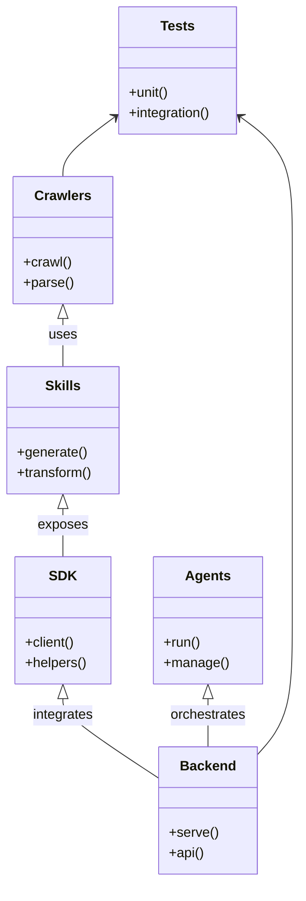

# Diagram: common/filter_service/config/config.qa.yml


> Auto-generated by Obscura crawlers

## Diagram 1



### SVG

<svg id="container" width="348" xmlns="http://www.w3.org/2000/svg" class="classDiagram" height="1038" viewBox="0 0 348 1038" role="graphics-document document" aria-roledescription="class"><style>#container{font-family:"trebuchet ms",verdana,arial,sans-serif;font-size:16px;fill:#333;}@keyframes edge-animation-frame{from{stroke-dashoffset:0;}}@keyframes dash{to{stroke-dashoffset:0;}}#container .edge-animation-slow{stroke-dasharray:9,5!important;stroke-dashoffset:900;animation:dash 50s linear infinite;stroke-linecap:round;}#container .edge-animation-fast{stroke-dasharray:9,5!important;stroke-dashoffset:900;animation:dash 20s linear infinite;stroke-linecap:round;}#container .error-icon{fill:#552222;}#container .error-text{fill:#552222;stroke:#552222;}#container .edge-thickness-normal{stroke-width:1px;}#container .edge-thickness-thick{stroke-width:3.5px;}#container .edge-pattern-solid{stroke-dasharray:0;}#container .edge-thickness-invisible{stroke-width:0;fill:none;}#container .edge-pattern-dashed{stroke-dasharray:3;}#container .edge-pattern-dotted{stroke-dasharray:2;}#container .marker{fill:#333333;stroke:#333333;}#container .marker.cross{stroke:#333333;}#container svg{font-family:"trebuchet ms",verdana,arial,sans-serif;font-size:16px;}#container p{margin:0;}#container g.classGroup text{fill:#9370DB;stroke:none;font-family:"trebuchet ms",verdana,arial,sans-serif;font-size:10px;}#container g.classGroup text .title{font-weight:bolder;}#container .nodeLabel,#container .edgeLabel{color:#131300;}#container .edgeLabel .label rect{fill:#ECECFF;}#container .label text{fill:#131300;}#container .labelBkg{background:#ECECFF;}#container .edgeLabel .label span{background:#ECECFF;}#container .classTitle{font-weight:bolder;}#container .node rect,#container .node circle,#container .node ellipse,#container .node polygon,#container .node path{fill:#ECECFF;stroke:#9370DB;stroke-width:1px;}#container .divider{stroke:#9370DB;stroke-width:1;}#container g.clickable{cursor:pointer;}#container g.classGroup rect{fill:#ECECFF;stroke:#9370DB;}#container g.classGroup line{stroke:#9370DB;stroke-width:1;}#container .classLabel .box{stroke:none;stroke-width:0;fill:#ECECFF;opacity:0.5;}#container .classLabel .label{fill:#9370DB;font-size:10px;}#container .relation{stroke:#333333;stroke-width:1;fill:none;}#container .dashed-line{stroke-dasharray:3;}#container .dotted-line{stroke-dasharray:1 2;}#container #compositionStart,#container .composition{fill:#333333!important;stroke:#333333!important;stroke-width:1;}#container #compositionEnd,#container .composition{fill:#333333!important;stroke:#333333!important;stroke-width:1;}#container #dependencyStart,#container .dependency{fill:#333333!important;stroke:#333333!important;stroke-width:1;}#container #dependencyStart,#container .dependency{fill:#333333!important;stroke:#333333!important;stroke-width:1;}#container #extensionStart,#container .extension{fill:transparent!important;stroke:#333333!important;stroke-width:1;}#container #extensionEnd,#container .extension{fill:transparent!important;stroke:#333333!important;stroke-width:1;}#container #aggregationStart,#container .aggregation{fill:transparent!important;stroke:#333333!important;stroke-width:1;}#container #aggregationEnd,#container .aggregation{fill:transparent!important;stroke:#333333!important;stroke-width:1;}#container #lollipopStart,#container .lollipop{fill:#ECECFF!important;stroke:#333333!important;stroke-width:1;}#container #lollipopEnd,#container .lollipop{fill:#ECECFF!important;stroke:#333333!important;stroke-width:1;}#container .edgeTerminals{font-size:11px;line-height:initial;}#container .classTitleText{text-anchor:middle;font-size:18px;fill:#333;}#container .label-icon{display:inline-block;height:1em;overflow:visible;vertical-align:-0.125em;}#container .node .label-icon path{fill:currentColor;stroke:revert;stroke-width:revert;}#container :root{--mermaid-font-family:"trebuchet ms",verdana,arial,sans-serif;}</style><g><defs><marker id="container_class-aggregationStart" class="marker aggregation class" refX="18" refY="7" markerWidth="190" markerHeight="240" orient="auto"><path d="M 18,7 L9,13 L1,7 L9,1 Z"></path></marker></defs><defs><marker id="container_class-aggregationEnd" class="marker aggregation class" refX="1" refY="7" markerWidth="20" markerHeight="28" orient="auto"><path d="M 18,7 L9,13 L1,7 L9,1 Z"></path></marker></defs><defs><marker id="container_class-extensionStart" class="marker extension class" refX="18" refY="7" markerWidth="190" markerHeight="240" orient="auto"><path d="M 1,7 L18,13 V 1 Z"></path></marker></defs><defs><marker id="container_class-extensionEnd" class="marker extension class" refX="1" refY="7" markerWidth="20" markerHeight="28" orient="auto"><path d="M 1,1 V 13 L18,7 Z"></path></marker></defs><defs><marker id="container_class-compositionStart" class="marker composition class" refX="18" refY="7" markerWidth="190" markerHeight="240" orient="auto"><path d="M 18,7 L9,13 L1,7 L9,1 Z"></path></marker></defs><defs><marker id="container_class-compositionEnd" class="marker composition class" refX="1" refY="7" markerWidth="20" markerHeight="28" orient="auto"><path d="M 18,7 L9,13 L1,7 L9,1 Z"></path></marker></defs><defs><marker id="container_class-dependencyStart" class="marker dependency class" refX="6" refY="7" markerWidth="190" markerHeight="240" orient="auto"><path d="M 5,7 L9,13 L1,7 L9,1 Z"></path></marker></defs><defs><marker id="container_class-dependencyEnd" class="marker dependency class" refX="13" refY="7" markerWidth="20" markerHeight="28" orient="auto"><path d="M 18,7 L9,13 L14,7 L9,1 Z"></path></marker></defs><defs><marker id="container_class-lollipopStart" class="marker lollipop class" refX="13" refY="7" markerWidth="190" markerHeight="240" orient="auto"><circle stroke="black" fill="transparent" cx="7" cy="7" r="6"></circle></marker></defs><defs><marker id="container_class-lollipopEnd" class="marker lollipop class" refX="1" refY="7" markerWidth="190" markerHeight="240" orient="auto"><circle stroke="black" fill="transparent" cx="7" cy="7" r="6"></circle></marker></defs><g class="root"><g class="clusters"></g><g class="edgePaths"><path d="M74.762,375.25L74.762,378.542C74.762,381.833,74.762,388.417,74.762,397.875C74.762,407.333,74.762,419.667,74.762,425.833L74.762,432" id="id_Crawlers_Skills_1" class="edge-thickness-normal edge-pattern-solid relation" style=";;;" data-edge="true" data-et="edge" data-id="id_Crawlers_Skills_1" data-points="W3sieCI6NzQuNzYxNzE4NzUsInkiOjM1OH0seyJ4Ijo3NC43NjE3MTg3NSwieSI6Mzk1fSx7IngiOjc0Ljc2MTcxODc1LCJ5Ijo0MzJ9XQ==" marker-start="url(#container_class-extensionStart)"></path><path d="M74.762,599.25L74.762,602.542C74.762,605.833,74.762,612.417,74.762,621.875C74.762,631.333,74.762,643.667,74.762,649.833L74.762,656" id="id_Skills_SDK_2" class="edge-thickness-normal edge-pattern-solid relation" style=";;;" data-edge="true" data-et="edge" data-id="id_Skills_SDK_2" data-points="W3sieCI6NzQuNzYxNzE4NzUsInkiOjU4Mn0seyJ4Ijo3NC43NjE3MTg3NSwieSI6NjE5fSx7IngiOjc0Ljc2MTcxODc1LCJ5Ijo2NTZ9XQ==" marker-start="url(#container_class-extensionStart)"></path><path d="M74.762,823.25L74.762,826.542C74.762,829.833,74.762,836.417,93.387,852.123C112.013,867.83,149.264,892.66,167.89,905.075L186.516,917.49" id="id_SDK_Backend_3" class="edge-thickness-normal edge-pattern-solid relation" style=";;;" data-edge="true" data-et="edge" data-id="id_SDK_Backend_3" data-points="W3sieCI6NzQuNzYxNzE4NzUsInkiOjgwNn0seyJ4Ijo3NC43NjE3MTg3NSwieSI6ODQzfSx7IngiOjE4Ni41MTU2MjUsInkiOjkxNy40OTA0ODAwNjUwOTM2fV0=" marker-start="url(#container_class-extensionStart)"></path><path d="M242.789,823.25L242.789,826.542C242.789,829.833,242.789,836.417,242.789,845.875C242.789,855.333,242.789,867.667,242.789,873.833L242.789,880" id="id_Agents_Backend_4" class="edge-thickness-normal edge-pattern-solid relation" style=";;;" data-edge="true" data-et="edge" data-id="id_Agents_Backend_4" data-points="W3sieCI6MjQyLjc4OTA2MjUsInkiOjgwNn0seyJ4IjoyNDIuNzg5MDYyNSwieSI6ODQzfSx7IngiOjI0Mi43ODkwNjI1LCJ5Ijo4ODB9XQ==" marker-start="url(#container_class-extensionStart)"></path><path d="M131.953,139.875L122.421,147.063C112.89,154.25,93.826,168.625,84.294,179.979C74.762,191.333,74.762,199.667,74.762,203.833L74.762,208" id="id_Tests_Crawlers_5" class="edge-thickness-normal edge-pattern-solid relation" style=";;;" data-edge="true" data-et="edge" data-id="id_Tests_Crawlers_5" data-points="W3sieCI6MTM2Ljc0NDE0MDYyNSwieSI6MTM2LjI2MjgzODU0NDM1MTMzfSx7IngiOjc0Ljc2MTcxODc1LCJ5IjoxODN9LHsieCI6NzQuNzYxNzE4NzUsInkiOjIwOH1d" marker-start="url(#container_class-dependencyStart)"></path><path d="M282.808,139.875L292.34,147.063C301.872,154.25,320.936,168.625,330.468,192.479C340,216.333,340,249.667,340,285C340,320.333,340,357.667,340,395C340,432.333,340,469.667,340,507C340,544.333,340,581.667,340,619C340,656.333,340,693.667,340,731C340,768.333,340,805.667,333.177,832.194C326.354,858.722,312.708,874.444,305.885,882.305L299.063,890.165" id="id_Tests_Backend_6" class="edge-thickness-normal edge-pattern-solid relation" style=";;;" data-edge="true" data-et="edge" data-id="id_Tests_Backend_6" data-points="W3sieCI6Mjc4LjAxNzU3ODEyNSwieSI6MTM2LjI2MjgzODU0NDM1MTMzfSx7IngiOjM0MCwieSI6MTgzfSx7IngiOjM0MCwieSI6MjgzfSx7IngiOjM0MCwieSI6Mzk1fSx7IngiOjM0MCwieSI6NTA3fSx7IngiOjM0MCwieSI6NjE5fSx7IngiOjM0MCwieSI6NzMxfSx7IngiOjM0MCwieSI6ODQzfSx7IngiOjI5OS4wNjI1LCJ5Ijo4OTAuMTY1NDc0NTY0MDExOX1d" marker-start="url(#container_class-dependencyStart)"></path></g><g class="edgeLabels"><g class="edgeLabel" transform="translate(74.76171875, 395)"><g class="label" data-id="id_Crawlers_Skills_1" transform="translate(-16.4921875, -12)"><foreignObject width="32.984375" height="24"><div xmlns="http://www.w3.org/1999/xhtml" class="labelBkg" style="display: table-cell; white-space: nowrap; line-height: 1.5; max-width: 200px; text-align: center;"><span class="edgeLabel"><p>uses</p></span></div></foreignObject></g></g><g class="edgeLabel" transform="translate(74.76171875, 619)"><g class="label" data-id="id_Skills_SDK_2" transform="translate(-29.4296875, -12)"><foreignObject width="58.859375" height="24"><div xmlns="http://www.w3.org/1999/xhtml" class="labelBkg" style="display: table-cell; white-space: nowrap; line-height: 1.5; max-width: 200px; text-align: center;"><span class="edgeLabel"><p>exposes</p></span></div></foreignObject></g></g><g class="edgeLabel" transform="translate(74.76171875, 843)"><g class="label" data-id="id_SDK_Backend_3" transform="translate(-36.2578125, -12)"><foreignObject width="72.515625" height="24"><div xmlns="http://www.w3.org/1999/xhtml" class="labelBkg" style="display: table-cell; white-space: nowrap; line-height: 1.5; max-width: 200px; text-align: center;"><span class="edgeLabel"><p>integrates</p></span></div></foreignObject></g></g><g class="edgeLabel" transform="translate(242.7890625, 843)"><g class="label" data-id="id_Agents_Backend_4" transform="translate(-45.046875, -12)"><foreignObject width="90.09375" height="24"><div xmlns="http://www.w3.org/1999/xhtml" class="labelBkg" style="display: table-cell; white-space: nowrap; line-height: 1.5; max-width: 200px; text-align: center;"><span class="edgeLabel"><p>orchestrates</p></span></div></foreignObject></g></g><g class="edgeLabel"><g class="label" data-id="id_Tests_Crawlers_5" transform="translate(0, 0)"><foreignObject width="0" height="0"><div xmlns="http://www.w3.org/1999/xhtml" class="labelBkg" style="display: table-cell; white-space: nowrap; line-height: 1.5; max-width: 200px; text-align: center;"><span class="edgeLabel"></span></div></foreignObject></g></g><g class="edgeLabel"><g class="label" data-id="id_Tests_Backend_6" transform="translate(0, 0)"><foreignObject width="0" height="0"><div xmlns="http://www.w3.org/1999/xhtml" class="labelBkg" style="display: table-cell; white-space: nowrap; line-height: 1.5; max-width: 200px; text-align: center;"><span class="edgeLabel"></span></div></foreignObject></g></g></g><g class="nodes"><g class="node default" id="classId-Crawlers-0" transform="translate(74.76171875, 283)"><g class="basic label-container"><path d="M-57.015625 -75 L57.015625 -75 L57.015625 75 L-57.015625 75" stroke="none" stroke-width="0" fill="#ECECFF" style=""></path><path d="M-57.015625 -75 C-23.1461073100808 -75, 10.723410379838398 -75, 57.015625 -75 M-57.015625 -75 C-14.47034210892248 -75, 28.07494078215504 -75, 57.015625 -75 M57.015625 -75 C57.015625 -23.81257389477844, 57.015625 27.374852210443123, 57.015625 75 M57.015625 -75 C57.015625 -35.02167214577341, 57.015625 4.956655708453184, 57.015625 75 M57.015625 75 C12.88505676685886 75, -31.24551146628228 75, -57.015625 75 M57.015625 75 C32.470780963794176 75, 7.925936927588353 75, -57.015625 75 M-57.015625 75 C-57.015625 18.686672089413392, -57.015625 -37.626655821173216, -57.015625 -75 M-57.015625 75 C-57.015625 26.008069060067932, -57.015625 -22.983861879864136, -57.015625 -75" stroke="#9370DB" stroke-width="1.3" fill="none" stroke-dasharray="0 0" style=""></path></g><g class="annotation-group text" transform="translate(0, -51)"></g><g class="label-group text" transform="translate(-31.5, -51)"><g class="label" style="font-weight: bolder" transform="translate(0,-12)"><foreignObject width="63" height="24"><div xmlns="http://www.w3.org/1999/xhtml" style="display: table-cell; white-space: nowrap; line-height: 1.5; max-width: 111px; text-align: center;"><span class="nodeLabel markdown-node-label" style=""><p>Crawlers</p></span></div></foreignObject></g></g><g class="members-group text" transform="translate(-45.015625, -3)"></g><g class="methods-group text" transform="translate(-45.015625, 27)"><g class="label" style="" transform="translate(0,-12)"><foreignObject width="56.40625" height="24"><div xmlns="http://www.w3.org/1999/xhtml" style="display: table-cell; white-space: nowrap; line-height: 1.5; max-width: 114px; text-align: center;"><span class="nodeLabel markdown-node-label" style=""><p>+crawl()</p></span></div></foreignObject></g><g class="label" style="" transform="translate(0,12)"><foreignObject width="58.53125" height="24"><div xmlns="http://www.w3.org/1999/xhtml" style="display: table-cell; white-space: nowrap; line-height: 1.5; max-width: 116px; text-align: center;"><span class="nodeLabel markdown-node-label" style=""><p>+parse()</p></span></div></foreignObject></g></g><g class="divider" style=""><path d="M-57.015625 -27 C-25.303329450842767 -27, 6.408966098314465 -27, 57.015625 -27 M-57.015625 -27 C-34.05928651655364 -27, -11.102948033107289 -27, 57.015625 -27" stroke="#9370DB" stroke-width="1.3" fill="none" stroke-dasharray="0 0" style=""></path></g><g class="divider" style=""><path d="M-57.015625 -3 C-32.0015618563378 -3, -6.98749871267561 -3, 57.015625 -3 M-57.015625 -3 C-19.353445199513388 -3, 18.308734600973224 -3, 57.015625 -3" stroke="#9370DB" stroke-width="1.3" fill="none" stroke-dasharray="0 0" style=""></path></g></g><g class="node default" id="classId-Backend-1" transform="translate(242.7890625, 955)"><g class="basic label-container"><path d="M-56.2734375 -75 L56.2734375 -75 L56.2734375 75 L-56.2734375 75" stroke="none" stroke-width="0" fill="#ECECFF" style=""></path><path d="M-56.2734375 -75 C-24.715510434244145 -75, 6.8424166315117105 -75, 56.2734375 -75 M-56.2734375 -75 C-23.95081311563618 -75, 8.37181126872764 -75, 56.2734375 -75 M56.2734375 -75 C56.2734375 -21.66317276107756, 56.2734375 31.673654477844877, 56.2734375 75 M56.2734375 -75 C56.2734375 -31.334227724391823, 56.2734375 12.331544551216354, 56.2734375 75 M56.2734375 75 C12.534414609453535 75, -31.20460828109293 75, -56.2734375 75 M56.2734375 75 C33.14027506227306 75, 10.007112624546131 75, -56.2734375 75 M-56.2734375 75 C-56.2734375 42.48213471094197, -56.2734375 9.964269421883941, -56.2734375 -75 M-56.2734375 75 C-56.2734375 43.61401887037495, -56.2734375 12.228037740749897, -56.2734375 -75" stroke="#9370DB" stroke-width="1.3" fill="none" stroke-dasharray="0 0" style=""></path></g><g class="annotation-group text" transform="translate(0, -51)"></g><g class="label-group text" transform="translate(-31.296875, -51)"><g class="label" style="font-weight: bolder" transform="translate(0,-12)"><foreignObject width="62.59375" height="24"><div xmlns="http://www.w3.org/1999/xhtml" style="display: table-cell; white-space: nowrap; line-height: 1.5; max-width: 112px; text-align: center;"><span class="nodeLabel markdown-node-label" style=""><p>Backend</p></span></div></foreignObject></g></g><g class="members-group text" transform="translate(-44.2734375, -3)"></g><g class="methods-group text" transform="translate(-44.2734375, 27)"><g class="label" style="" transform="translate(0,-12)"><foreignObject width="57.25" height="24"><div xmlns="http://www.w3.org/1999/xhtml" style="display: table-cell; white-space: nowrap; line-height: 1.5; max-width: 115px; text-align: center;"><span class="nodeLabel markdown-node-label" style=""><p>+serve()</p></span></div></foreignObject></g><g class="label" style="" transform="translate(0,12)"><foreignObject width="40.84375" height="24"><div xmlns="http://www.w3.org/1999/xhtml" style="display: table-cell; white-space: nowrap; line-height: 1.5; max-width: 98px; text-align: center;"><span class="nodeLabel markdown-node-label" style=""><p>+api()</p></span></div></foreignObject></g></g><g class="divider" style=""><path d="M-56.2734375 -27 C-23.567660888162834 -27, 9.138115723674332 -27, 56.2734375 -27 M-56.2734375 -27 C-26.129215413269446 -27, 4.015006673461109 -27, 56.2734375 -27" stroke="#9370DB" stroke-width="1.3" fill="none" stroke-dasharray="0 0" style=""></path></g><g class="divider" style=""><path d="M-56.2734375 -3 C-23.47530006392777 -3, 9.322837372144463 -3, 56.2734375 -3 M-56.2734375 -3 C-14.682245007094004 -3, 26.908947485811993 -3, 56.2734375 -3" stroke="#9370DB" stroke-width="1.3" fill="none" stroke-dasharray="0 0" style=""></path></g></g><g class="node default" id="classId-Agents-2" transform="translate(242.7890625, 731)"><g class="basic label-container"><path d="M-62.2109375 -75 L62.2109375 -75 L62.2109375 75 L-62.2109375 75" stroke="none" stroke-width="0" fill="#ECECFF" style=""></path><path d="M-62.2109375 -75 C-14.125533270787137 -75, 33.959870958425725 -75, 62.2109375 -75 M-62.2109375 -75 C-26.220396218702525 -75, 9.770145062594949 -75, 62.2109375 -75 M62.2109375 -75 C62.2109375 -32.300034864942106, 62.2109375 10.399930270115789, 62.2109375 75 M62.2109375 -75 C62.2109375 -44.20648049124075, 62.2109375 -13.412960982481493, 62.2109375 75 M62.2109375 75 C19.522393141243242 75, -23.166151217513516 75, -62.2109375 75 M62.2109375 75 C13.427028470637545 75, -35.35688055872491 75, -62.2109375 75 M-62.2109375 75 C-62.2109375 41.11897801971894, -62.2109375 7.237956039437876, -62.2109375 -75 M-62.2109375 75 C-62.2109375 39.771240399887134, -62.2109375 4.5424807997742676, -62.2109375 -75" stroke="#9370DB" stroke-width="1.3" fill="none" stroke-dasharray="0 0" style=""></path></g><g class="annotation-group text" transform="translate(0, -51)"></g><g class="label-group text" transform="translate(-24.9375, -51)"><g class="label" style="font-weight: bolder" transform="translate(0,-12)"><foreignObject width="49.875" height="24"><div xmlns="http://www.w3.org/1999/xhtml" style="display: table-cell; white-space: nowrap; line-height: 1.5; max-width: 99px; text-align: center;"><span class="nodeLabel markdown-node-label" style=""><p>Agents</p></span></div></foreignObject></g></g><g class="members-group text" transform="translate(-50.2109375, -3)"></g><g class="methods-group text" transform="translate(-50.2109375, 27)"><g class="label" style="" transform="translate(0,-12)"><foreignObject width="43.21875" height="24"><div xmlns="http://www.w3.org/1999/xhtml" style="display: table-cell; white-space: nowrap; line-height: 1.5; max-width: 101px; text-align: center;"><span class="nodeLabel markdown-node-label" style=""><p>+run()</p></span></div></foreignObject></g><g class="label" style="" transform="translate(0,12)"><foreignObject width="75.484375" height="24"><div xmlns="http://www.w3.org/1999/xhtml" style="display: table-cell; white-space: nowrap; line-height: 1.5; max-width: 133px; text-align: center;"><span class="nodeLabel markdown-node-label" style=""><p>+manage()</p></span></div></foreignObject></g></g><g class="divider" style=""><path d="M-62.2109375 -27 C-37.150078227998094 -27, -12.089218955996195 -27, 62.2109375 -27 M-62.2109375 -27 C-24.09633578427656 -27, 14.018265931446876 -27, 62.2109375 -27" stroke="#9370DB" stroke-width="1.3" fill="none" stroke-dasharray="0 0" style=""></path></g><g class="divider" style=""><path d="M-62.2109375 -3 C-12.758839643318879 -3, 36.69325821336224 -3, 62.2109375 -3 M-62.2109375 -3 C-33.03833958791099 -3, -3.8657416758219796 -3, 62.2109375 -3" stroke="#9370DB" stroke-width="1.3" fill="none" stroke-dasharray="0 0" style=""></path></g></g><g class="node default" id="classId-SDK-3" transform="translate(74.76171875, 731)"><g class="basic label-container"><path d="M-55.81640625 -75 L55.81640625 -75 L55.81640625 75 L-55.81640625 75" stroke="none" stroke-width="0" fill="#ECECFF" style=""></path><path d="M-55.81640625 -75 C-25.953441228108414 -75, 3.9095237937831726 -75, 55.81640625 -75 M-55.81640625 -75 C-29.990040062083924 -75, -4.1636738741678485 -75, 55.81640625 -75 M55.81640625 -75 C55.81640625 -29.557223758825998, 55.81640625 15.885552482348004, 55.81640625 75 M55.81640625 -75 C55.81640625 -20.03405043593235, 55.81640625 34.9318991281353, 55.81640625 75 M55.81640625 75 C14.966672439227892 75, -25.883061371544215 75, -55.81640625 75 M55.81640625 75 C19.56095662855011 75, -16.694492992899782 75, -55.81640625 75 M-55.81640625 75 C-55.81640625 23.495664610357423, -55.81640625 -28.008670779285154, -55.81640625 -75 M-55.81640625 75 C-55.81640625 31.378473771363183, -55.81640625 -12.243052457273635, -55.81640625 -75" stroke="#9370DB" stroke-width="1.3" fill="none" stroke-dasharray="0 0" style=""></path></g><g class="annotation-group text" transform="translate(0, -51)"></g><g class="label-group text" transform="translate(-14.8515625, -51)"><g class="label" style="font-weight: bolder" transform="translate(0,-12)"><foreignObject width="29.703125" height="24"><div xmlns="http://www.w3.org/1999/xhtml" style="display: table-cell; white-space: nowrap; line-height: 1.5; max-width: 79px; text-align: center;"><span class="nodeLabel markdown-node-label" style=""><p>SDK</p></span></div></foreignObject></g></g><g class="members-group text" transform="translate(-43.81640625, -3)"></g><g class="methods-group text" transform="translate(-43.81640625, 27)"><g class="label" style="" transform="translate(0,-12)"><foreignObject width="59.078125" height="24"><div xmlns="http://www.w3.org/1999/xhtml" style="display: table-cell; white-space: nowrap; line-height: 1.5; max-width: 116px; text-align: center;"><span class="nodeLabel markdown-node-label" style=""><p>+client()</p></span></div></foreignObject></g><g class="label" style="" transform="translate(0,12)"><foreignObject width="72.78125" height="24"><div xmlns="http://www.w3.org/1999/xhtml" style="display: table-cell; white-space: nowrap; line-height: 1.5; max-width: 130px; text-align: center;"><span class="nodeLabel markdown-node-label" style=""><p>+helpers()</p></span></div></foreignObject></g></g><g class="divider" style=""><path d="M-55.81640625 -27 C-29.36170969661097 -27, -2.9070131432219384 -27, 55.81640625 -27 M-55.81640625 -27 C-16.37648727504559 -27, 23.06343169990882 -27, 55.81640625 -27" stroke="#9370DB" stroke-width="1.3" fill="none" stroke-dasharray="0 0" style=""></path></g><g class="divider" style=""><path d="M-55.81640625 -3 C-15.049610008098867 -3, 25.717186233802266 -3, 55.81640625 -3 M-55.81640625 -3 C-30.321464473676276 -3, -4.8265226973525515 -3, 55.81640625 -3" stroke="#9370DB" stroke-width="1.3" fill="none" stroke-dasharray="0 0" style=""></path></g></g><g class="node default" id="classId-Skills-4" transform="translate(74.76171875, 507)"><g class="basic label-container"><path d="M-66.76171875 -75 L66.76171875 -75 L66.76171875 75 L-66.76171875 75" stroke="none" stroke-width="0" fill="#ECECFF" style=""></path><path d="M-66.76171875 -75 C-17.033406542729345 -75, 32.69490566454131 -75, 66.76171875 -75 M-66.76171875 -75 C-21.322871161004613 -75, 24.115976427990773 -75, 66.76171875 -75 M66.76171875 -75 C66.76171875 -18.36278752569433, 66.76171875 38.27442494861134, 66.76171875 75 M66.76171875 -75 C66.76171875 -29.145194779689596, 66.76171875 16.709610440620807, 66.76171875 75 M66.76171875 75 C34.44128776844859 75, 2.1208567868971784 75, -66.76171875 75 M66.76171875 75 C17.908054637678454 75, -30.945609474643092 75, -66.76171875 75 M-66.76171875 75 C-66.76171875 24.104738861393656, -66.76171875 -26.790522277212688, -66.76171875 -75 M-66.76171875 75 C-66.76171875 41.39825366147795, -66.76171875 7.796507322955904, -66.76171875 -75" stroke="#9370DB" stroke-width="1.3" fill="none" stroke-dasharray="0 0" style=""></path></g><g class="annotation-group text" transform="translate(0, -51)"></g><g class="label-group text" transform="translate(-19.8671875, -51)"><g class="label" style="font-weight: bolder" transform="translate(0,-12)"><foreignObject width="39.734375" height="24"><div xmlns="http://www.w3.org/1999/xhtml" style="display: table-cell; white-space: nowrap; line-height: 1.5; max-width: 88px; text-align: center;"><span class="nodeLabel markdown-node-label" style=""><p>Skills</p></span></div></foreignObject></g></g><g class="members-group text" transform="translate(-54.76171875, -3)"></g><g class="methods-group text" transform="translate(-54.76171875, 27)"><g class="label" style="" transform="translate(0,-12)"><foreignObject width="81.8125" height="24"><div xmlns="http://www.w3.org/1999/xhtml" style="display: table-cell; white-space: nowrap; line-height: 1.5; max-width: 139px; text-align: center;"><span class="nodeLabel markdown-node-label" style=""><p>+generate()</p></span></div></foreignObject></g><g class="label" style="" transform="translate(0,12)"><foreignObject width="89.65625" height="24"><div xmlns="http://www.w3.org/1999/xhtml" style="display: table-cell; white-space: nowrap; line-height: 1.5; max-width: 147px; text-align: center;"><span class="nodeLabel markdown-node-label" style=""><p>+transform()</p></span></div></foreignObject></g></g><g class="divider" style=""><path d="M-66.76171875 -27 C-34.967190989815705 -27, -3.1726632296314037 -27, 66.76171875 -27 M-66.76171875 -27 C-36.13224454656981 -27, -5.502770343139616 -27, 66.76171875 -27" stroke="#9370DB" stroke-width="1.3" fill="none" stroke-dasharray="0 0" style=""></path></g><g class="divider" style=""><path d="M-66.76171875 -3 C-29.575812928328972 -3, 7.610092893342056 -3, 66.76171875 -3 M-66.76171875 -3 C-24.65711237340365 -3, 17.447494003192702 -3, 66.76171875 -3" stroke="#9370DB" stroke-width="1.3" fill="none" stroke-dasharray="0 0" style=""></path></g></g><g class="node default" id="classId-Tests-5" transform="translate(207.380859375, 83)"><g class="basic label-container"><path d="M-70.63671875 -75 L70.63671875 -75 L70.63671875 75 L-70.63671875 75" stroke="none" stroke-width="0" fill="#ECECFF" style=""></path><path d="M-70.63671875 -75 C-18.129773572488666 -75, 34.37717160502267 -75, 70.63671875 -75 M-70.63671875 -75 C-18.90524596019135 -75, 32.8262268296173 -75, 70.63671875 -75 M70.63671875 -75 C70.63671875 -28.323039668111335, 70.63671875 18.35392066377733, 70.63671875 75 M70.63671875 -75 C70.63671875 -33.79767834214317, 70.63671875 7.404643315713656, 70.63671875 75 M70.63671875 75 C30.831449231593105 75, -8.97382028681379 75, -70.63671875 75 M70.63671875 75 C37.27774862479387 75, 3.918778499587745 75, -70.63671875 75 M-70.63671875 75 C-70.63671875 31.05045033124204, -70.63671875 -12.89909933751592, -70.63671875 -75 M-70.63671875 75 C-70.63671875 32.757239606555984, -70.63671875 -9.485520786888031, -70.63671875 -75" stroke="#9370DB" stroke-width="1.3" fill="none" stroke-dasharray="0 0" style=""></path></g><g class="annotation-group text" transform="translate(0, -51)"></g><g class="label-group text" transform="translate(-19.1171875, -51)"><g class="label" style="font-weight: bolder" transform="translate(0,-12)"><foreignObject width="38.234375" height="24"><div xmlns="http://www.w3.org/1999/xhtml" style="display: table-cell; white-space: nowrap; line-height: 1.5; max-width: 87px; text-align: center;"><span class="nodeLabel markdown-node-label" style=""><p>Tests</p></span></div></foreignObject></g></g><g class="members-group text" transform="translate(-58.63671875, -3)"></g><g class="methods-group text" transform="translate(-58.63671875, 27)"><g class="label" style="" transform="translate(0,-12)"><foreignObject width="47.328125" height="24"><div xmlns="http://www.w3.org/1999/xhtml" style="display: table-cell; white-space: nowrap; line-height: 1.5; max-width: 105px; text-align: center;"><span class="nodeLabel markdown-node-label" style=""><p>+unit()</p></span></div></foreignObject></g><g class="label" style="" transform="translate(0,12)"><foreignObject width="98.15625" height="24"><div xmlns="http://www.w3.org/1999/xhtml" style="display: table-cell; white-space: nowrap; line-height: 1.5; max-width: 156px; text-align: center;"><span class="nodeLabel markdown-node-label" style=""><p>+integration()</p></span></div></foreignObject></g></g><g class="divider" style=""><path d="M-70.63671875 -27 C-20.585657433666583 -27, 29.465403882666834 -27, 70.63671875 -27 M-70.63671875 -27 C-41.01360803059656 -27, -11.390497311193116 -27, 70.63671875 -27" stroke="#9370DB" stroke-width="1.3" fill="none" stroke-dasharray="0 0" style=""></path></g><g class="divider" style=""><path d="M-70.63671875 -3 C-21.895346003554017 -3, 26.846026742891965 -3, 70.63671875 -3 M-70.63671875 -3 C-23.30504615870447 -3, 24.02662643259106 -3, 70.63671875 -3" stroke="#9370DB" stroke-width="1.3" fill="none" stroke-dasharray="0 0" style=""></path></g></g></g></g></g></svg>

## Diagram 2

```mermaid
flowchart TD
    A[Repository Files] --> B[Crawler / Parsers]
    B --> C[Diagram Generator (copilot)]
    C --> D[Mermaid Output]
    D --> E[Renderer / Docs]
    Backend[Backend/API] -->|exposes| C
    Agents -->|triggers| B
    Tests -->|validate| D
```

> SVG rendering failed for this diagram.
