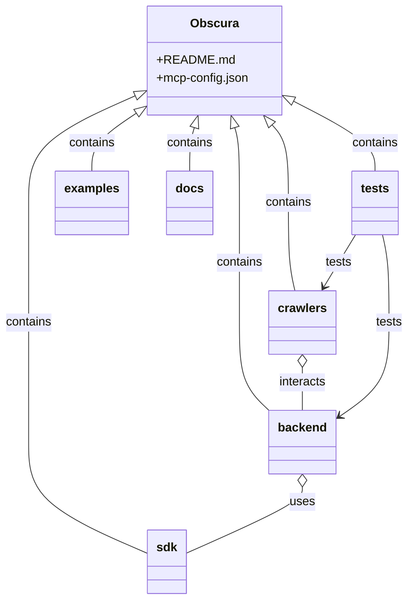

# Diagram: common/filter_service/config/config.qa2.yml

> Auto-generated by Obscura crawlers

## Mermaid

### SVG

<svg id="container" width="533.9296875" xmlns="http://www.w3.org/2000/svg" class="classDiagram" height="792" viewBox="0 0 533.9296875 792" role="graphics-document document" aria-roledescription="class"><g><defs><marker id="container_class-aggregationStart" class="marker aggregation class" refX="18" refY="7" markerWidth="190" markerHeight="240" orient="auto"><path d="M 18,7 L9,13 L1,7 L9,1 Z"></path></marker></defs><defs><marker id="container_class-aggregationEnd" class="marker aggregation class" refX="1" refY="7" markerWidth="20" markerHeight="28" orient="auto"><path d="M 18,7 L9,13 L1,7 L9,1 Z"></path></marker></defs><defs><marker id="container_class-extensionStart" class="marker extension class" refX="18" refY="7" markerWidth="190" markerHeight="240" orient="auto"><path d="M 1,7 L18,13 V 1 Z"></path></marker></defs><defs><marker id="container_class-extensionEnd" class="marker extension class" refX="1" refY="7" markerWidth="20" markerHeight="28" orient="auto"><path d="M 1,1 V 13 L18,7 Z"></path></marker></defs><defs><marker id="container_class-compositionStart" class="marker composition class" refX="18" refY="7" markerWidth="190" markerHeight="240" orient="auto"><path d="M 18,7 L9,13 L1,7 L9,1 Z"></path></marker></defs><defs><marker id="container_class-compositionEnd" class="marker composition class" refX="1" refY="7" markerWidth="20" markerHeight="28" orient="auto"><path d="M 18,7 L9,13 L1,7 L9,1 Z"></path></marker></defs><defs><marker id="container_class-dependencyStart" class="marker dependency class" refX="6" refY="7" markerWidth="190" markerHeight="240" orient="auto"><path d="M 5,7 L9,13 L1,7 L9,1 Z"></path></marker></defs><defs><marker id="container_class-dependencyEnd" class="marker dependency class" refX="13" refY="7" markerWidth="20" markerHeight="28" orient="auto"><path d="M 18,7 L9,13 L14,7 L9,1 Z"></path></marker></defs><defs><marker id="container_class-lollipopStart" class="marker lollipop class" refX="13" refY="7" markerWidth="190" markerHeight="240" orient="auto"><circle stroke="black" fill="transparent" cx="7" cy="7" r="6"></circle></marker></defs><defs><marker id="container_class-lollipopEnd" class="marker lollipop class" refX="1" refY="7" markerWidth="190" markerHeight="240" orient="auto"><circle stroke="black" fill="transparent" cx="7" cy="7" r="6"></circle></marker></defs><g class="root"><g class="clusters"></g><g class="edgePaths"><path d="M304.87,168.548L305.874,171.957C306.877,175.365,308.884,182.183,309.887,198.758C310.891,215.333,310.891,241.667,310.891,268C310.891,294.333,310.891,320.667,310.891,347C310.891,373.333,310.891,399.667,310.891,426C310.891,452.333,310.891,478.667,317.564,498.177C324.238,517.688,337.586,530.377,344.26,536.721L350.934,543.065" id="id_Obscura_backend_1" class="edge-thickness-normal edge-pattern-solid relation" style=";;;" data-edge="true" data-et="edge" data-id="id_Obscura_backend_1" data-points="W3sieCI6Mjk5Ljk5OTA2ODIzMzk0NDk3LCJ5IjoxNTJ9LHsieCI6MzEwLjg5MDYyNSwieSI6MTg5fSx7IngiOjMxMC44OTA2MjUsInkiOjI2OH0seyJ4IjozMTAuODkwNjI1LCJ5IjozNDd9LHsieCI6MzEwLjg5MDYyNSwieSI6NDI2fSx7IngiOjMxMC44OTA2MjUsInkiOjUwNX0seyJ4IjozNTAuOTMzNTkzNzUsInkiOjU0My4wNjQ4MTc4NjEzMzk2fV0=" marker-start="url(#container_class-extensionStart)"></path><path d="M353.943,164.919L357.494,168.932C361.045,172.946,368.148,180.973,371.699,198.153C375.25,215.333,375.25,241.667,375.25,268C375.25,294.333,375.25,320.667,376.713,340C378.177,359.333,381.103,371.667,382.567,377.833L384.03,384" id="id_Obscura_crawlers_2" class="edge-thickness-normal edge-pattern-solid relation" style=";;;" data-edge="true" data-et="edge" data-id="id_Obscura_crawlers_2" data-points="W3sieCI6MzQyLjUxMTY4MjkxMjg0NDA0LCJ5IjoxNTJ9LHsieCI6Mzc1LjI1LCJ5IjoxODl9LHsieCI6Mzc1LjI1LCJ5IjoyNjh9LHsieCI6Mzc1LjI1LCJ5IjozNDd9LHsieCI6Mzg0LjAyOTgxNjA2MDEyNjU2LCJ5IjozODR9XQ==" marker-start="url(#container_class-extensionStart)"></path><path d="M174.498,127.39L151.897,137.658C129.296,147.926,84.093,168.463,61.492,191.898C38.891,215.333,38.891,241.667,38.891,268C38.891,294.333,38.891,320.667,38.891,347C38.891,373.333,38.891,399.667,38.891,426C38.891,452.333,38.891,478.667,38.891,505C38.891,531.333,38.891,557.667,38.891,584C38.891,610.333,38.891,636.667,64.742,661.167C90.592,685.667,142.294,708.335,168.145,719.668L193.996,731.002" id="id_Obscura_sdk_3" class="edge-thickness-normal edge-pattern-solid relation" style=";;;" data-edge="true" data-et="edge" data-id="id_Obscura_sdk_3" data-points="W3sieCI6MTkwLjIwMzEyNSwieSI6MTIwLjI1NDI5MDI3MzIwOTgyfSx7IngiOjM4Ljg5MDYyNSwieSI6MTg5fSx7IngiOjM4Ljg5MDYyNSwieSI6MjY4fSx7IngiOjM4Ljg5MDYyNSwieSI6MzQ3fSx7IngiOjM4Ljg5MDYyNSwieSI6NDI2fSx7IngiOjM4Ljg5MDYyNSwieSI6NTA1fSx7IngiOjM4Ljg5MDYyNSwieSI6NTg0fSx7IngiOjM4Ljg5MDYyNSwieSI6NjYzfSx7IngiOjE5My45OTYwOTM3NSwieSI6NzMxLjAwMTc1NTk0NTI4Mzl9XQ==" marker-start="url(#container_class-extensionStart)"></path><path d="M382.73,133.716L400.557,142.93C418.384,152.144,454.038,170.572,471.865,185.953C489.691,201.333,489.691,213.667,489.691,219.833L489.691,226" id="id_Obscura_tests_4" class="edge-thickness-normal edge-pattern-solid relation" style=";;;" data-edge="true" data-et="edge" data-id="id_Obscura_tests_4" data-points="W3sieCI6MzY3LjQwNjI1LCJ5IjoxMjUuNzk1MDYxNzc0MTMwOH0seyJ4Ijo0ODkuNjkxNDA2MjUsInkiOjE4OX0seyJ4Ijo0ODkuNjkxNDA2MjUsInkiOjIyNn1d" marker-start="url(#container_class-extensionStart)"></path><path d="M176.002,150.883L166.788,157.235C157.574,163.588,139.146,176.294,129.933,188.814C120.719,201.333,120.719,213.667,120.719,219.833L120.719,226" id="id_Obscura_examples_5" class="edge-thickness-normal edge-pattern-solid relation" style=";;;" data-edge="true" data-et="edge" data-id="id_Obscura_examples_5" data-points="W3sieCI6MTkwLjIwMzEyNSwieSI6MTQxLjA5MDYzNTAzODI5OTk4fSx7IngiOjEyMC43MTg3NSwieSI6MTg5fSx7IngiOjEyMC43MTg3NSwieSI6MjI2fV0=" marker-start="url(#container_class-extensionStart)"></path><path d="M252.739,168.548L251.736,171.957C250.732,175.365,248.726,182.183,247.722,191.758C246.719,201.333,246.719,213.667,246.719,219.833L246.719,226" id="id_Obscura_docs_6" class="edge-thickness-normal edge-pattern-solid relation" style=";;;" data-edge="true" data-et="edge" data-id="id_Obscura_docs_6" data-points="W3sieCI6MjU3LjYxMDMwNjc2NjA1NTAzLCJ5IjoxNTJ9LHsieCI6MjQ2LjcxODc1LCJ5IjoxODl9LHsieCI6MjQ2LjcxODc1LCJ5IjoyMjZ9XQ==" marker-start="url(#container_class-extensionStart)"></path><path d="M393.996,643.25L393.996,646.542C393.996,649.833,393.996,656.417,369.025,670.987C344.053,685.557,294.111,708.113,269.139,719.392L244.168,730.67" id="id_backend_sdk_7" class="edge-thickness-normal edge-pattern-solid relation" style=";;;" data-edge="true" data-et="edge" data-id="id_backend_sdk_7" data-points="W3sieCI6MzkzLjk5NjA5Mzc1LCJ5Ijo2MjZ9LHsieCI6MzkzLjk5NjA5Mzc1LCJ5Ijo2NjN9LHsieCI6MjQ0LjE2Nzk2ODc1LCJ5Ijo3MzAuNjY5OTI3MTk2MzkxMX1d" marker-start="url(#container_class-aggregationStart)"></path><path d="M393.996,485.25L393.996,488.542C393.996,491.833,393.996,498.417,393.996,507.875C393.996,517.333,393.996,529.667,393.996,535.833L393.996,542" id="id_crawlers_backend_8" class="edge-thickness-normal edge-pattern-solid relation" style=";;;" data-edge="true" data-et="edge" data-id="id_crawlers_backend_8" data-points="W3sieCI6MzkzLjk5NjA5Mzc1LCJ5Ijo0Njh9LHsieCI6MzkzLjk5NjA5Mzc1LCJ5Ijo1MDV9LHsieCI6MzkzLjk5NjA5Mzc1LCJ5Ijo1NDJ9XQ==" marker-start="url(#container_class-aggregationStart)"></path><path d="M499.658,310L501.121,316.167C502.584,322.333,505.511,334.667,506.974,354C508.438,373.333,508.438,399.667,508.438,426C508.438,452.333,508.438,478.667,497.364,499.477C486.29,520.288,464.143,535.577,453.07,543.221L441.996,550.865" id="id_tests_backend_9" class="edge-thickness-normal edge-pattern-solid relation" style=";;;" data-edge="true" data-et="edge" data-id="id_tests_backend_9" data-points="W3sieCI6NDk5LjY1NzY4MzkzOTg3MzQ0LCJ5IjozMTB9LHsieCI6NTA4LjQzNzUsInkiOjM0N30seyJ4Ijo1MDguNDM3NSwieSI6NDI2fSx7IngiOjUwOC40Mzc1LCJ5Ijo1MDV9LHsieCI6NDM3LjA1ODU5Mzc1LCJ5Ijo1NTQuMjczNTQzMzY2MjE1fV0=" marker-end="url(#container_class-dependencyEnd)"></path><path d="M464.353,310L460.633,316.167C456.912,322.333,449.472,334.667,442.522,346.146C435.571,357.624,429.111,368.249,425.881,373.561L422.651,378.873" id="id_tests_crawlers_10" class="edge-thickness-normal edge-pattern-solid relation" style=";;;" data-edge="true" data-et="edge" data-id="id_tests_crawlers_10" data-points="W3sieCI6NDY0LjM1MzA5NTMzMjI3ODUsInkiOjMxMH0seyJ4Ijo0NDIuMDMxMjUsInkiOjM0N30seyJ4Ijo0MTkuNTMzNzcxNzU2MzI5MSwieSI6Mzg0fV0=" marker-end="url(#container_class-dependencyEnd)"></path></g><g class="edgeLabels"><g class="edgeLabel" transform="translate(310.890625, 347)"><g class="label" data-id="id_Obscura_backend_1" transform="translate(-30.890625, -12)"><foreignObject width="61.78125" height="24">

contains

</foreignObject></g></g><g class="edgeLabel" transform="translate(375.25, 268)"><g class="label" data-id="id_Obscura_crawlers_2" transform="translate(-30.890625, -12)"><foreignObject width="61.78125" height="24">

contains

</foreignObject></g></g><g class="edgeLabel" transform="translate(38.890625, 426)"><g class="label" data-id="id_Obscura_sdk_3" transform="translate(-30.890625, -12)"><foreignObject width="61.78125" height="24">

contains

</foreignObject></g></g><g class="edgeLabel" transform="translate(489.69140625, 189)"><g class="label" data-id="id_Obscura_tests_4" transform="translate(-30.890625, -12)"><foreignObject width="61.78125" height="24">

contains

</foreignObject></g></g><g class="edgeLabel" transform="translate(120.71875, 189)"><g class="label" data-id="id_Obscura_examples_5" transform="translate(-30.890625, -12)"><foreignObject width="61.78125" height="24">

contains

</foreignObject></g></g><g class="edgeLabel" transform="translate(246.71875, 189)"><g class="label" data-id="id_Obscura_docs_6" transform="translate(-30.890625, -12)"><foreignObject width="61.78125" height="24">

contains

</foreignObject></g></g><g class="edgeLabel" transform="translate(393.99609375, 663)"><g class="label" data-id="id_backend_sdk_7" transform="translate(-16.4921875, -12)"><foreignObject width="32.984375" height="24">

uses

</foreignObject></g></g><g class="edgeLabel" transform="translate(393.99609375, 505)"><g class="label" data-id="id_crawlers_backend_8" transform="translate(-31.6875, -12)"><foreignObject width="63.375" height="24">

interacts

</foreignObject></g></g><g class="edgeLabel" transform="translate(508.4375, 426)"><g class="label" data-id="id_tests_backend_9" transform="translate(-17.4921875, -12)"><foreignObject width="34.984375" height="24">

tests

</foreignObject></g></g><g class="edgeLabel" transform="translate(442.00761, 347.03887)"><g class="label" data-id="id_tests_crawlers_10" transform="translate(-17.4921875, -12)"><foreignObject width="34.984375" height="24">

tests

</foreignObject></g></g></g><g class="nodes"><g class="node default" id="classId-Obscura-0" transform="translate(278.8046875, 80)"><g class="basic label-container"><path d="M-88.6015625 -72 L88.6015625 -72 L88.6015625 72 L-88.6015625 72" stroke="none" stroke-width="0" fill="#ECECFF" style=""></path><path d="M-88.6015625 -72 C-22.806337557414523 -72, 42.988887385170955 -72, 88.6015625 -72 M-88.6015625 -72 C-24.1981970258217 -72, 40.2051684483566 -72, 88.6015625 -72 M88.6015625 -72 C88.6015625 -34.05869584776121, 88.6015625 3.8826083044775856, 88.6015625 72 M88.6015625 -72 C88.6015625 -14.897731857352582, 88.6015625 42.204536285294836, 88.6015625 72 M88.6015625 72 C37.92609005606969 72, -12.74938238786062 72, -88.6015625 72 M88.6015625 72 C44.11697377489901 72, -0.36761495020198254 72, -88.6015625 72 M-88.6015625 72 C-88.6015625 32.87678503993259, -88.6015625 -6.2464299201348155, -88.6015625 -72 M-88.6015625 72 C-88.6015625 32.46607922016479, -88.6015625 -7.067841559670427, -88.6015625 -72" stroke="#9370DB" stroke-width="1.3" fill="none" stroke-dasharray="0 0" style=""></path></g><g class="annotation-group text" transform="translate(0, -48)"></g><g class="label-group text" transform="translate(-29.8125, -48)"><g class="label" style="font-weight: bolder" transform="translate(0,-12)"><foreignObject width="59.625" height="24">

Obscura

</foreignObject></g></g><g class="members-group text" transform="translate(-76.6015625, 0)"><g class="label" style="" transform="translate(0,-12)"><foreignObject width="93.71875" height="24">

+README.md

</foreignObject></g><g class="label" style="" transform="translate(0,12)"><foreignObject width="123.390625" height="24">

+mcp-config.json

</foreignObject></g></g><g class="methods-group text" transform="translate(-76.6015625, 72)"></g><g class="divider" style=""><path d="M-88.6015625 -24 C-52.037501655610754 -24, -15.473440811221508 -24, 88.6015625 -24 M-88.6015625 -24 C-31.043934739418376 -24, 26.51369302116325 -24, 88.6015625 -24" stroke="#9370DB" stroke-width="1.3" fill="none" stroke-dasharray="0 0" style=""></path></g><g class="divider" style=""><path d="M-88.6015625 48 C-23.8768838637602 48, 40.8477947724796 48, 88.6015625 48 M-88.6015625 48 C-34.465680478818555 48, 19.67020154236289 48, 88.6015625 48" stroke="#9370DB" stroke-width="1.3" fill="none" stroke-dasharray="0 0" style=""></path></g></g><g class="node default" id="classId-backend-1" transform="translate(393.99609375, 584)"><g class="basic label-container"><path d="M-43.0625 -42 L43.0625 -42 L43.0625 42 L-43.0625 42" stroke="none" stroke-width="0" fill="#ECECFF" style=""></path><path d="M-43.0625 -42 C-25.575979897319502 -42, -8.089459794639005 -42, 43.0625 -42 M-43.0625 -42 C-18.81587156893903 -42, 5.430756862121939 -42, 43.0625 -42 M43.0625 -42 C43.0625 -12.209521316248058, 43.0625 17.580957367503885, 43.0625 42 M43.0625 -42 C43.0625 -22.860600751776982, 43.0625 -3.7212015035539636, 43.0625 42 M43.0625 42 C13.055977003504271 42, -16.950545992991458 42, -43.0625 42 M43.0625 42 C14.87170782597001 42, -13.319084348059981 42, -43.0625 42 M-43.0625 42 C-43.0625 20.51117432059512, -43.0625 -0.9776513588097586, -43.0625 -42 M-43.0625 42 C-43.0625 13.339854131529474, -43.0625 -15.320291736941051, -43.0625 -42" stroke="#9370DB" stroke-width="1.3" fill="none" stroke-dasharray="0 0" style=""></path></g><g class="annotation-group text" transform="translate(0, -18)"></g><g class="label-group text" transform="translate(-31.0625, -18)"><g class="label" style="font-weight: bolder" transform="translate(0,-12)"><foreignObject width="62.125" height="24">

backend

</foreignObject></g></g><g class="members-group text" transform="translate(-31.0625, 30)"></g><g class="methods-group text" transform="translate(-31.0625, 60)"></g><g class="divider" style=""><path d="M-43.0625 6 C-17.55270032056058 6, 7.957099358878843 6, 43.0625 6 M-43.0625 6 C-17.606399458130866 6, 7.8497010837382675 6, 43.0625 6" stroke="#9370DB" stroke-width="1.3" fill="none" stroke-dasharray="0 0" style=""></path></g><g class="divider" style=""><path d="M-43.0625 24 C-13.817860168315793 24, 15.426779663368414 24, 43.0625 24 M-43.0625 24 C-14.152985522657062 24, 14.756528954685876 24, 43.0625 24" stroke="#9370DB" stroke-width="1.3" fill="none" stroke-dasharray="0 0" style=""></path></g></g><g class="node default" id="classId-crawlers-2" transform="translate(393.99609375, 426)"><g class="basic label-container"><path d="M-42.828125 -42 L42.828125 -42 L42.828125 42 L-42.828125 42" stroke="none" stroke-width="0" fill="#ECECFF" style=""></path><path d="M-42.828125 -42 C-12.434238470910763 -42, 17.959648058178473 -42, 42.828125 -42 M-42.828125 -42 C-19.53253062883419 -42, 3.7630637423316173 -42, 42.828125 -42 M42.828125 -42 C42.828125 -23.49180319182613, 42.828125 -4.983606383652258, 42.828125 42 M42.828125 -42 C42.828125 -24.42214216919891, 42.828125 -6.84428433839782, 42.828125 42 M42.828125 42 C16.108626161906876 42, -10.610872676186247 42, -42.828125 42 M42.828125 42 C25.40368511461939 42, 7.979245229238778 42, -42.828125 42 M-42.828125 42 C-42.828125 23.356441215388205, -42.828125 4.712882430776411, -42.828125 -42 M-42.828125 42 C-42.828125 8.94966913168944, -42.828125 -24.10066173662112, -42.828125 -42" stroke="#9370DB" stroke-width="1.3" fill="none" stroke-dasharray="0 0" style=""></path></g><g class="annotation-group text" transform="translate(0, -18)"></g><g class="label-group text" transform="translate(-30.828125, -18)"><g class="label" style="font-weight: bolder" transform="translate(0,-12)"><foreignObject width="61.65625" height="24">

crawlers

</foreignObject></g></g><g class="members-group text" transform="translate(-30.828125, 30)"></g><g class="methods-group text" transform="translate(-30.828125, 60)"></g><g class="divider" style=""><path d="M-42.828125 6 C-21.43420099076693 6, -0.04027698153385728 6, 42.828125 6 M-42.828125 6 C-9.366823771579831 6, 24.094477456840337 6, 42.828125 6" stroke="#9370DB" stroke-width="1.3" fill="none" stroke-dasharray="0 0" style=""></path></g><g class="divider" style=""><path d="M-42.828125 24 C-19.327128680810418 24, 4.173867638379164 24, 42.828125 24 M-42.828125 24 C-21.995486478914334 24, -1.1628479578286672 24, 42.828125 24" stroke="#9370DB" stroke-width="1.3" fill="none" stroke-dasharray="0 0" style=""></path></g></g><g class="node default" id="classId-sdk-3" transform="translate(219.08203125, 742)"><g class="basic label-container"><path d="M-25.0859375 -42 L25.0859375 -42 L25.0859375 42 L-25.0859375 42" stroke="none" stroke-width="0" fill="#ECECFF" style=""></path><path d="M-25.0859375 -42 C-8.45749574139753 -42, 8.17094601720494 -42, 25.0859375 -42 M-25.0859375 -42 C-6.174363698180816 -42, 12.737210103638368 -42, 25.0859375 -42 M25.0859375 -42 C25.0859375 -21.827913780781486, 25.0859375 -1.6558275615629725, 25.0859375 42 M25.0859375 -42 C25.0859375 -21.031810437909115, 25.0859375 -0.06362087581823062, 25.0859375 42 M25.0859375 42 C7.849518349714685 42, -9.38690080057063 42, -25.0859375 42 M25.0859375 42 C5.610541953038236 42, -13.864853593923527 42, -25.0859375 42 M-25.0859375 42 C-25.0859375 12.415266070886954, -25.0859375 -17.169467858226092, -25.0859375 -42 M-25.0859375 42 C-25.0859375 11.495387999231916, -25.0859375 -19.009224001536168, -25.0859375 -42" stroke="#9370DB" stroke-width="1.3" fill="none" stroke-dasharray="0 0" style=""></path></g><g class="annotation-group text" transform="translate(0, -18)"></g><g class="label-group text" transform="translate(-13.0859375, -18)"><g class="label" style="font-weight: bolder" transform="translate(0,-12)"><foreignObject width="26.171875" height="24">

sdk

</foreignObject></g></g><g class="members-group text" transform="translate(-13.0859375, 30)"></g><g class="methods-group text" transform="translate(-13.0859375, 60)"></g><g class="divider" style=""><path d="M-25.0859375 6 C-14.747731953232767 6, -4.409526406465535 6, 25.0859375 6 M-25.0859375 6 C-10.956437566607747 6, 3.1730623667845066 6, 25.0859375 6" stroke="#9370DB" stroke-width="1.3" fill="none" stroke-dasharray="0 0" style=""></path></g><g class="divider" style=""><path d="M-25.0859375 24 C-8.72596381898515 24, 7.6340098620297 24, 25.0859375 24 M-25.0859375 24 C-9.284729509505901 24, 6.516478480988198 24, 25.0859375 24" stroke="#9370DB" stroke-width="1.3" fill="none" stroke-dasharray="0 0" style=""></path></g></g><g class="node default" id="classId-tests-4" transform="translate(489.69140625, 268)"><g class="basic label-container"><path d="M-30.1796875 -42 L30.1796875 -42 L30.1796875 42 L-30.1796875 42" stroke="none" stroke-width="0" fill="#ECECFF" style=""></path><path d="M-30.1796875 -42 C-17.68700343510038 -42, -5.1943193702007555 -42, 30.1796875 -42 M-30.1796875 -42 C-7.133592301456261 -42, 15.912502897087478 -42, 30.1796875 -42 M30.1796875 -42 C30.1796875 -19.70935925802546, 30.1796875 2.581281483949077, 30.1796875 42 M30.1796875 -42 C30.1796875 -13.964238606917746, 30.1796875 14.071522786164508, 30.1796875 42 M30.1796875 42 C8.688060005402793 42, -12.803567489194414 42, -30.1796875 42 M30.1796875 42 C12.857829737471867 42, -4.464028025056265 42, -30.1796875 42 M-30.1796875 42 C-30.1796875 16.722940297524186, -30.1796875 -8.554119404951628, -30.1796875 -42 M-30.1796875 42 C-30.1796875 16.282763383608277, -30.1796875 -9.434473232783446, -30.1796875 -42" stroke="#9370DB" stroke-width="1.3" fill="none" stroke-dasharray="0 0" style=""></path></g><g class="annotation-group text" transform="translate(0, -18)"></g><g class="label-group text" transform="translate(-18.1796875, -18)"><g class="label" style="font-weight: bolder" transform="translate(0,-12)"><foreignObject width="36.359375" height="24">

tests

</foreignObject></g></g><g class="members-group text" transform="translate(-18.1796875, 30)"></g><g class="methods-group text" transform="translate(-18.1796875, 60)"></g><g class="divider" style=""><path d="M-30.1796875 6 C-15.488828703301742 6, -0.797969906603484 6, 30.1796875 6 M-30.1796875 6 C-6.427112923783245 6, 17.32546165243351 6, 30.1796875 6" stroke="#9370DB" stroke-width="1.3" fill="none" stroke-dasharray="0 0" style=""></path></g><g class="divider" style=""><path d="M-30.1796875 24 C-6.402979077009867 24, 17.373729345980266 24, 30.1796875 24 M-30.1796875 24 C-17.268153080752562 24, -4.35661866150512 24, 30.1796875 24" stroke="#9370DB" stroke-width="1.3" fill="none" stroke-dasharray="0 0" style=""></path></g></g><g class="node default" id="classId-examples-5" transform="translate(120.71875, 268)"><g class="basic label-container"><path d="M-46.828125 -42 L46.828125 -42 L46.828125 42 L-46.828125 42" stroke="none" stroke-width="0" fill="#ECECFF" style=""></path><path d="M-46.828125 -42 C-12.976599015786533 -42, 20.874926968426934 -42, 46.828125 -42 M-46.828125 -42 C-20.93375328787612 -42, 4.9606184242477624 -42, 46.828125 -42 M46.828125 -42 C46.828125 -13.421777000802368, 46.828125 15.156445998395263, 46.828125 42 M46.828125 -42 C46.828125 -22.77956619636787, 46.828125 -3.559132392735741, 46.828125 42 M46.828125 42 C27.61204134316581 42, 8.39595768633162 42, -46.828125 42 M46.828125 42 C11.985613359543208 42, -22.856898280913583 42, -46.828125 42 M-46.828125 42 C-46.828125 10.90719223781856, -46.828125 -20.18561552436288, -46.828125 -42 M-46.828125 42 C-46.828125 19.527154674990303, -46.828125 -2.945690650019394, -46.828125 -42" stroke="#9370DB" stroke-width="1.3" fill="none" stroke-dasharray="0 0" style=""></path></g><g class="annotation-group text" transform="translate(0, -18)"></g><g class="label-group text" transform="translate(-34.828125, -18)"><g class="label" style="font-weight: bolder" transform="translate(0,-12)"><foreignObject width="69.65625" height="24">

examples

</foreignObject></g></g><g class="members-group text" transform="translate(-34.828125, 30)"></g><g class="methods-group text" transform="translate(-34.828125, 60)"></g><g class="divider" style=""><path d="M-46.828125 6 C-20.175655609733127 6, 6.476813780533746 6, 46.828125 6 M-46.828125 6 C-19.37247092337477 6, 8.08318315325046 6, 46.828125 6" stroke="#9370DB" stroke-width="1.3" fill="none" stroke-dasharray="0 0" style=""></path></g><g class="divider" style=""><path d="M-46.828125 24 C-14.016972428006305 24, 18.79418014398739 24, 46.828125 24 M-46.828125 24 C-25.034468525720595 24, -3.240812051441189 24, 46.828125 24" stroke="#9370DB" stroke-width="1.3" fill="none" stroke-dasharray="0 0" style=""></path></g></g><g class="node default" id="classId-docs-6" transform="translate(246.71875, 268)"><g class="basic label-container"><path d="M-29.171875 -42 L29.171875 -42 L29.171875 42 L-29.171875 42" stroke="none" stroke-width="0" fill="#ECECFF" style=""></path><path d="M-29.171875 -42 C-7.614378037160364 -42, 13.943118925679272 -42, 29.171875 -42 M-29.171875 -42 C-12.469621601768399 -42, 4.2326317964632025 -42, 29.171875 -42 M29.171875 -42 C29.171875 -11.340974477614413, 29.171875 19.318051044771174, 29.171875 42 M29.171875 -42 C29.171875 -24.955990121283442, 29.171875 -7.911980242566884, 29.171875 42 M29.171875 42 C10.675698745198154 42, -7.820477509603691 42, -29.171875 42 M29.171875 42 C16.60634048557209 42, 4.040805971144184 42, -29.171875 42 M-29.171875 42 C-29.171875 19.68858331223789, -29.171875 -2.6228333755242232, -29.171875 -42 M-29.171875 42 C-29.171875 14.506957919883398, -29.171875 -12.986084160233204, -29.171875 -42" stroke="#9370DB" stroke-width="1.3" fill="none" stroke-dasharray="0 0" style=""></path></g><g class="annotation-group text" transform="translate(0, -18)"></g><g class="label-group text" transform="translate(-17.171875, -18)"><g class="label" style="font-weight: bolder" transform="translate(0,-12)"><foreignObject width="34.34375" height="24">

docs

</foreignObject></g></g><g class="members-group text" transform="translate(-17.171875, 30)"></g><g class="methods-group text" transform="translate(-17.171875, 60)"></g><g class="divider" style=""><path d="M-29.171875 6 C-16.176262066431924 6, -3.180649132863845 6, 29.171875 6 M-29.171875 6 C-5.998151590867323 6, 17.175571818265354 6, 29.171875 6" stroke="#9370DB" stroke-width="1.3" fill="none" stroke-dasharray="0 0" style=""></path></g><g class="divider" style=""><path d="M-29.171875 24 C-11.99777785503035 24, 5.1763192899393005 24, 29.171875 24 M-29.171875 24 C-15.02294561310879 24, -0.8740162262175808 24, 29.171875 24" stroke="#9370DB" stroke-width="1.3" fill="none" stroke-dasharray="0 0" style=""></path></g></g></g></g></g></svg>
