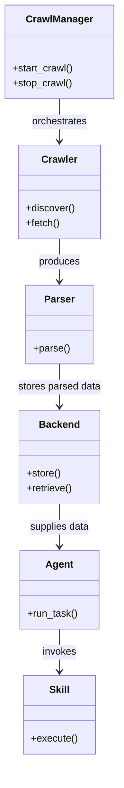
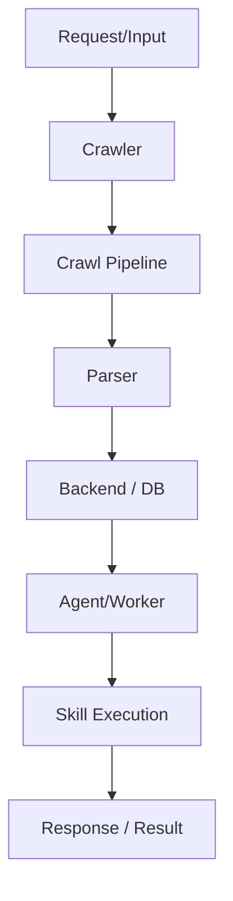

# Diagram: common/filter_service/config/config.staging.yml

> Auto-generated by Obscura crawlers

## Diagram 1

### SVG

<svg id="container" width="189.796875" xmlns="http://www.w3.org/2000/svg" class="classDiagram" height="1214" viewBox="0 0 189.796875 1214" role="graphics-document document" aria-roledescription="class"><g><defs><marker id="container_class-aggregationStart" class="marker aggregation class" refX="18" refY="7" markerWidth="190" markerHeight="240" orient="auto"><path d="M 18,7 L9,13 L1,7 L9,1 Z"></path></marker></defs><defs><marker id="container_class-aggregationEnd" class="marker aggregation class" refX="1" refY="7" markerWidth="20" markerHeight="28" orient="auto"><path d="M 18,7 L9,13 L1,7 L9,1 Z"></path></marker></defs><defs><marker id="container_class-extensionStart" class="marker extension class" refX="18" refY="7" markerWidth="190" markerHeight="240" orient="auto"><path d="M 1,7 L18,13 V 1 Z"></path></marker></defs><defs><marker id="container_class-extensionEnd" class="marker extension class" refX="1" refY="7" markerWidth="20" markerHeight="28" orient="auto"><path d="M 1,1 V 13 L18,7 Z"></path></marker></defs><defs><marker id="container_class-compositionStart" class="marker composition class" refX="18" refY="7" markerWidth="190" markerHeight="240" orient="auto"><path d="M 18,7 L9,13 L1,7 L9,1 Z"></path></marker></defs><defs><marker id="container_class-compositionEnd" class="marker composition class" refX="1" refY="7" markerWidth="20" markerHeight="28" orient="auto"><path d="M 18,7 L9,13 L1,7 L9,1 Z"></path></marker></defs><defs><marker id="container_class-dependencyStart" class="marker dependency class" refX="6" refY="7" markerWidth="190" markerHeight="240" orient="auto"><path d="M 5,7 L9,13 L1,7 L9,1 Z"></path></marker></defs><defs><marker id="container_class-dependencyEnd" class="marker dependency class" refX="13" refY="7" markerWidth="20" markerHeight="28" orient="auto"><path d="M 18,7 L9,13 L14,7 L9,1 Z"></path></marker></defs><defs><marker id="container_class-lollipopStart" class="marker lollipop class" refX="13" refY="7" markerWidth="190" markerHeight="240" orient="auto"><circle stroke="black" fill="transparent" cx="7" cy="7" r="6"></circle></marker></defs><defs><marker id="container_class-lollipopEnd" class="marker lollipop class" refX="1" refY="7" markerWidth="190" markerHeight="240" orient="auto"><circle stroke="black" fill="transparent" cx="7" cy="7" r="6"></circle></marker></defs><g class="root"><g class="clusters"></g><g class="edgePaths"><path d="M94.898,158L94.898,164.167C94.898,170.333,94.898,182.667,94.898,194C94.898,205.333,94.898,215.667,94.898,220.833L94.898,226" id="id_CrawlManager_Crawler_1" class="edge-thickness-normal edge-pattern-solid relation" style=";;;" data-edge="true" data-et="edge" data-id="id_CrawlManager_Crawler_1" data-points="W3sieCI6OTQuODk4NDM3NSwieSI6MTU4fSx7IngiOjk0Ljg5ODQzNzUsInkiOjE5NX0seyJ4Ijo5NC44OTg0Mzc1LCJ5IjoyMzJ9XQ==" marker-end="url(#container_class-dependencyEnd)"></path><path d="M94.898,382L94.898,388.167C94.898,394.333,94.898,406.667,94.898,418C94.898,429.333,94.898,439.667,94.898,444.833L94.898,450" id="id_Crawler_Parser_2" class="edge-thickness-normal edge-pattern-solid relation" style=";;;" data-edge="true" data-et="edge" data-id="id_Crawler_Parser_2" data-points="W3sieCI6OTQuODk4NDM3NSwieSI6MzgyfSx7IngiOjk0Ljg5ODQzNzUsInkiOjQxOX0seyJ4Ijo5NC44OTg0Mzc1LCJ5Ijo0NTZ9XQ==" marker-end="url(#container_class-dependencyEnd)"></path><path d="M94.898,582L94.898,588.167C94.898,594.333,94.898,606.667,94.898,618C94.898,629.333,94.898,639.667,94.898,644.833L94.898,650" id="id_Parser_Backend_3" class="edge-thickness-normal edge-pattern-solid relation" style=";;;" data-edge="true" data-et="edge" data-id="id_Parser_Backend_3" data-points="W3sieCI6OTQuODk4NDM3NSwieSI6NTgyfSx7IngiOjk0Ljg5ODQzNzUsInkiOjYxOX0seyJ4Ijo5NC44OTg0Mzc1LCJ5Ijo2NTZ9XQ==" marker-end="url(#container_class-dependencyEnd)"></path><path d="M94.898,806L94.898,812.167C94.898,818.333,94.898,830.667,94.898,842C94.898,853.333,94.898,863.667,94.898,868.833L94.898,874" id="id_Backend_Agent_4" class="edge-thickness-normal edge-pattern-solid relation" style=";;;" data-edge="true" data-et="edge" data-id="id_Backend_Agent_4" data-points="W3sieCI6OTQuODk4NDM3NSwieSI6ODA2fSx7IngiOjk0Ljg5ODQzNzUsInkiOjg0M30seyJ4Ijo5NC44OTg0Mzc1LCJ5Ijo4ODB9XQ==" marker-end="url(#container_class-dependencyEnd)"></path><path d="M94.898,1006L94.898,1012.167C94.898,1018.333,94.898,1030.667,94.898,1042C94.898,1053.333,94.898,1063.667,94.898,1068.833L94.898,1074" id="id_Agent_Skill_5" class="edge-thickness-normal edge-pattern-solid relation" style=";;;" data-edge="true" data-et="edge" data-id="id_Agent_Skill_5" data-points="W3sieCI6OTQuODk4NDM3NSwieSI6MTAwNn0seyJ4Ijo5NC44OTg0Mzc1LCJ5IjoxMDQzfSx7IngiOjk0Ljg5ODQzNzUsInkiOjEwODB9XQ==" marker-end="url(#container_class-dependencyEnd)"></path></g><g class="edgeLabels"><g class="edgeLabel" transform="translate(94.8984375, 195)"><g class="label" data-id="id_CrawlManager_Crawler_1" transform="translate(-45.046875, -12)"><foreignObject width="90.09375" height="24">

orchestrates

</foreignObject></g></g><g class="edgeLabel" transform="translate(94.8984375, 419)"><g class="label" data-id="id_Crawler_Parser_2" transform="translate(-33.4765625, -12)"><foreignObject width="66.953125" height="24">

produces

</foreignObject></g></g><g class="edgeLabel" transform="translate(94.8984375, 619)"><g class="label" data-id="id_Parser_Backend_3" transform="translate(-67.5546875, -12)"><foreignObject width="135.109375" height="24">

stores parsed data

</foreignObject></g></g><g class="edgeLabel" transform="translate(94.8984375, 843)"><g class="label" data-id="id_Backend_Agent_4" transform="translate(-49.0390625, -12)"><foreignObject width="98.078125" height="24">

supplies data

</foreignObject></g></g><g class="edgeLabel" transform="translate(94.8984375, 1043)"><g class="label" data-id="id_Agent_Skill_5" transform="translate(-27.5859375, -12)"><foreignObject width="55.171875" height="24">

invokes

</foreignObject></g></g></g><g class="nodes"><g class="node default" id="classId-CrawlManager-0" transform="translate(94.8984375, 83)"><g class="basic label-container"><path d="M-86.8984375 -75 L86.8984375 -75 L86.8984375 75 L-86.8984375 75" stroke="none" stroke-width="0" fill="#ECECFF" style=""></path><path d="M-86.8984375 -75 C-31.817998979840233 -75, 23.262439540319534 -75, 86.8984375 -75 M-86.8984375 -75 C-46.72830974691551 -75, -6.558181993831013 -75, 86.8984375 -75 M86.8984375 -75 C86.8984375 -18.491088080907737, 86.8984375 38.017823838184526, 86.8984375 75 M86.8984375 -75 C86.8984375 -22.359859710306374, 86.8984375 30.280280579387252, 86.8984375 75 M86.8984375 75 C46.81229417828878 75, 6.726150856577561 75, -86.8984375 75 M86.8984375 75 C24.168241269551444 75, -38.56195496089711 75, -86.8984375 75 M-86.8984375 75 C-86.8984375 37.126578387726276, -86.8984375 -0.7468432245474474, -86.8984375 -75 M-86.8984375 75 C-86.8984375 34.01290765936065, -86.8984375 -6.9741846812787, -86.8984375 -75" stroke="#9370DB" stroke-width="1.3" fill="none" stroke-dasharray="0 0" style=""></path></g><g class="annotation-group text" transform="translate(0, -51)"></g><g class="label-group text" transform="translate(-51.59375, -51)"><g class="label" style="font-weight: bolder" transform="translate(0,-12)"><foreignObject width="103.1875" height="24">

CrawlManager

</foreignObject></g></g><g class="members-group text" transform="translate(-74.8984375, -3)"></g><g class="methods-group text" transform="translate(-74.8984375, 27)"><g class="label" style="" transform="translate(0,-12)"><foreignObject width="98.203125" height="24">

+start_crawl()

</foreignObject></g><g class="label" style="" transform="translate(0,12)"><foreignObject width="95.9375" height="24">

+stop_crawl()

</foreignObject></g></g><g class="divider" style=""><path d="M-86.8984375 -27 C-25.03026585768138 -27, 36.83790578463724 -27, 86.8984375 -27 M-86.8984375 -27 C-34.12615873489863 -27, 18.646120030202738 -27, 86.8984375 -27" stroke="#9370DB" stroke-width="1.3" fill="none" stroke-dasharray="0 0" style=""></path></g><g class="divider" style=""><path d="M-86.8984375 -3 C-32.66951912272287 -3, 21.559399254554265 -3, 86.8984375 -3 M-86.8984375 -3 C-51.47561079467305 -3, -16.052784089346105 -3, 86.8984375 -3" stroke="#9370DB" stroke-width="1.3" fill="none" stroke-dasharray="0 0" style=""></path></g></g><g class="node default" id="classId-Crawler-1" transform="translate(94.8984375, 307)"><g class="basic label-container"><path d="M-65.4765625 -75 L65.4765625 -75 L65.4765625 75 L-65.4765625 75" stroke="none" stroke-width="0" fill="#ECECFF" style=""></path><path d="M-65.4765625 -75 C-19.592192612960247 -75, 26.292177274079506 -75, 65.4765625 -75 M-65.4765625 -75 C-16.77912475702626 -75, 31.91831298594748 -75, 65.4765625 -75 M65.4765625 -75 C65.4765625 -15.61670027594893, 65.4765625 43.76659944810214, 65.4765625 75 M65.4765625 -75 C65.4765625 -33.61949007303977, 65.4765625 7.761019853920459, 65.4765625 75 M65.4765625 75 C29.526493352485453 75, -6.423575795029095 75, -65.4765625 75 M65.4765625 75 C36.530088254520116 75, 7.583614009040232 75, -65.4765625 75 M-65.4765625 75 C-65.4765625 27.216417572704238, -65.4765625 -20.567164854591525, -65.4765625 -75 M-65.4765625 75 C-65.4765625 42.18968001222817, -65.4765625 9.379360024456346, -65.4765625 -75" stroke="#9370DB" stroke-width="1.3" fill="none" stroke-dasharray="0 0" style=""></path></g><g class="annotation-group text" transform="translate(0, -51)"></g><g class="label-group text" transform="translate(-27.734375, -51)"><g class="label" style="font-weight: bolder" transform="translate(0,-12)"><foreignObject width="55.46875" height="24">

Crawler

</foreignObject></g></g><g class="members-group text" transform="translate(-53.4765625, -3)"></g><g class="methods-group text" transform="translate(-53.4765625, 27)"><g class="label" style="" transform="translate(0,-12)"><foreignObject width="79.21875" height="24">

+discover()

</foreignObject></g><g class="label" style="" transform="translate(0,12)"><foreignObject width="54.59375" height="24">

+fetch()

</foreignObject></g></g><g class="divider" style=""><path d="M-65.4765625 -27 C-35.58393116715473 -27, -5.6912998343094685 -27, 65.4765625 -27 M-65.4765625 -27 C-13.524925507139123 -27, 38.42671148572175 -27, 65.4765625 -27" stroke="#9370DB" stroke-width="1.3" fill="none" stroke-dasharray="0 0" style=""></path></g><g class="divider" style=""><path d="M-65.4765625 -3 C-18.091090547799837 -3, 29.294381404400326 -3, 65.4765625 -3 M-65.4765625 -3 C-26.704654156091124 -3, 12.067254187817753 -3, 65.4765625 -3" stroke="#9370DB" stroke-width="1.3" fill="none" stroke-dasharray="0 0" style=""></path></g></g><g class="node default" id="classId-Parser-2" transform="translate(94.8984375, 519)"><g class="basic label-container"><path d="M-52.953125 -63 L52.953125 -63 L52.953125 63 L-52.953125 63" stroke="none" stroke-width="0" fill="#ECECFF" style=""></path><path d="M-52.953125 -63 C-14.896974362884109 -63, 23.159176274231783 -63, 52.953125 -63 M-52.953125 -63 C-31.498049224753224 -63, -10.042973449506448 -63, 52.953125 -63 M52.953125 -63 C52.953125 -22.432251525912974, 52.953125 18.13549694817405, 52.953125 63 M52.953125 -63 C52.953125 -13.97973324282497, 52.953125 35.04053351435006, 52.953125 63 M52.953125 63 C15.223027128429969 63, -22.507070743140062 63, -52.953125 63 M52.953125 63 C19.865418077978738 63, -13.222288844042524 63, -52.953125 63 M-52.953125 63 C-52.953125 37.0299636400139, -52.953125 11.059927280027793, -52.953125 -63 M-52.953125 63 C-52.953125 25.505149011848893, -52.953125 -11.989701976302214, -52.953125 -63" stroke="#9370DB" stroke-width="1.3" fill="none" stroke-dasharray="0 0" style=""></path></g><g class="annotation-group text" transform="translate(0, -39)"></g><g class="label-group text" transform="translate(-23.375, -39)"><g class="label" style="font-weight: bolder" transform="translate(0,-12)"><foreignObject width="46.75" height="24">

Parser

</foreignObject></g></g><g class="members-group text" transform="translate(-40.953125, 9)"></g><g class="methods-group text" transform="translate(-40.953125, 39)"><g class="label" style="" transform="translate(0,-12)"><foreignObject width="58.53125" height="24">

+parse()

</foreignObject></g></g><g class="divider" style=""><path d="M-52.953125 -15 C-20.741300942226715 -15, 11.47052311554657 -15, 52.953125 -15 M-52.953125 -15 C-28.04903935595102 -15, -3.1449537119020405 -15, 52.953125 -15" stroke="#9370DB" stroke-width="1.3" fill="none" stroke-dasharray="0 0" style=""></path></g><g class="divider" style=""><path d="M-52.953125 9 C-10.772041953026338 9, 31.409041093947323 9, 52.953125 9 M-52.953125 9 C-26.493184175767873 9, -0.03324335153574509 9, 52.953125 9" stroke="#9370DB" stroke-width="1.3" fill="none" stroke-dasharray="0 0" style=""></path></g></g><g class="node default" id="classId-Backend-3" transform="translate(94.8984375, 731)"><g class="basic label-container"><path d="M-64.859375 -75 L64.859375 -75 L64.859375 75 L-64.859375 75" stroke="none" stroke-width="0" fill="#ECECFF" style=""></path><path d="M-64.859375 -75 C-35.91149286924173 -75, -6.963610738483446 -75, 64.859375 -75 M-64.859375 -75 C-35.36599871294415 -75, -5.872622425888295 -75, 64.859375 -75 M64.859375 -75 C64.859375 -30.869154434156606, 64.859375 13.261691131686788, 64.859375 75 M64.859375 -75 C64.859375 -26.932134965996276, 64.859375 21.135730068007447, 64.859375 75 M64.859375 75 C31.79531081496917 75, -1.2687533700616598 75, -64.859375 75 M64.859375 75 C25.534272793737124 75, -13.790829412525753 75, -64.859375 75 M-64.859375 75 C-64.859375 27.522586294344975, -64.859375 -19.95482741131005, -64.859375 -75 M-64.859375 75 C-64.859375 17.640926644605187, -64.859375 -39.718146710789625, -64.859375 -75" stroke="#9370DB" stroke-width="1.3" fill="none" stroke-dasharray="0 0" style=""></path></g><g class="annotation-group text" transform="translate(0, -51)"></g><g class="label-group text" transform="translate(-31.296875, -51)"><g class="label" style="font-weight: bolder" transform="translate(0,-12)"><foreignObject width="62.59375" height="24">

Backend

</foreignObject></g></g><g class="members-group text" transform="translate(-52.859375, -3)"></g><g class="methods-group text" transform="translate(-52.859375, 27)"><g class="label" style="" transform="translate(0,-12)"><foreignObject width="55.125" height="24">

+store()

</foreignObject></g><g class="label" style="" transform="translate(0,12)"><foreignObject width="74.421875" height="24">

+retrieve()

</foreignObject></g></g><g class="divider" style=""><path d="M-64.859375 -27 C-27.75082231949878 -27, 9.357730361002439 -27, 64.859375 -27 M-64.859375 -27 C-23.359101921906415 -27, 18.14117115618717 -27, 64.859375 -27" stroke="#9370DB" stroke-width="1.3" fill="none" stroke-dasharray="0 0" style=""></path></g><g class="divider" style=""><path d="M-64.859375 -3 C-38.08084243803337 -3, -11.302309876066737 -3, 64.859375 -3 M-64.859375 -3 C-17.25010098267402 -3, 30.35917303465196 -3, 64.859375 -3" stroke="#9370DB" stroke-width="1.3" fill="none" stroke-dasharray="0 0" style=""></path></g></g><g class="node default" id="classId-Agent-4" transform="translate(94.8984375, 943)"><g class="basic label-container"><path d="M-63.0859375 -63 L63.0859375 -63 L63.0859375 63 L-63.0859375 63" stroke="none" stroke-width="0" fill="#ECECFF" style=""></path><path d="M-63.0859375 -63 C-23.54093847034371 -63, 16.004060559312578 -63, 63.0859375 -63 M-63.0859375 -63 C-22.563159660491678 -63, 17.959618179016644 -63, 63.0859375 -63 M63.0859375 -63 C63.0859375 -35.40659104147161, 63.0859375 -7.813182082943214, 63.0859375 63 M63.0859375 -63 C63.0859375 -31.14640513148571, 63.0859375 0.7071897370285782, 63.0859375 63 M63.0859375 63 C33.43754160076861 63, 3.7891457015372296 63, -63.0859375 63 M63.0859375 63 C22.649559592023444 63, -17.786818315953113 63, -63.0859375 63 M-63.0859375 63 C-63.0859375 14.72824019760074, -63.0859375 -33.54351960479852, -63.0859375 -63 M-63.0859375 63 C-63.0859375 26.30934311146605, -63.0859375 -10.381313777067902, -63.0859375 -63" stroke="#9370DB" stroke-width="1.3" fill="none" stroke-dasharray="0 0" style=""></path></g><g class="annotation-group text" transform="translate(0, -39)"></g><g class="label-group text" transform="translate(-21.078125, -39)"><g class="label" style="font-weight: bolder" transform="translate(0,-12)"><foreignObject width="42.15625" height="24">

Agent

</foreignObject></g></g><g class="members-group text" transform="translate(-51.0859375, 9)"></g><g class="methods-group text" transform="translate(-51.0859375, 39)"><g class="label" style="" transform="translate(0,-12)"><foreignObject width="81.09375" height="24">

+run_task()

</foreignObject></g></g><g class="divider" style=""><path d="M-63.0859375 -15 C-26.747784702152103 -15, 9.590368095695794 -15, 63.0859375 -15 M-63.0859375 -15 C-30.3132280705564 -15, 2.459481358887203 -15, 63.0859375 -15" stroke="#9370DB" stroke-width="1.3" fill="none" stroke-dasharray="0 0" style=""></path></g><g class="divider" style=""><path d="M-63.0859375 9 C-20.322303145842284 9, 22.441331208315432 9, 63.0859375 9 M-63.0859375 9 C-31.959658487543646 9, -0.8333794750872912 9, 63.0859375 9" stroke="#9370DB" stroke-width="1.3" fill="none" stroke-dasharray="0 0" style=""></path></g></g><g class="node default" id="classId-Skill-5" transform="translate(94.8984375, 1143)"><g class="basic label-container"><path d="M-57.16796875 -63 L57.16796875 -63 L57.16796875 63 L-57.16796875 63" stroke="none" stroke-width="0" fill="#ECECFF" style=""></path><path d="M-57.16796875 -63 C-17.607390709857498 -63, 21.953187330285004 -63, 57.16796875 -63 M-57.16796875 -63 C-23.870020829991248 -63, 9.427927090017505 -63, 57.16796875 -63 M57.16796875 -63 C57.16796875 -32.052883298924485, 57.16796875 -1.1057665978489624, 57.16796875 63 M57.16796875 -63 C57.16796875 -31.546438967718743, 57.16796875 -0.09287793543748535, 57.16796875 63 M57.16796875 63 C15.439333414400295 63, -26.28930192119941 63, -57.16796875 63 M57.16796875 63 C23.737883514898783 63, -9.692201720202434 63, -57.16796875 63 M-57.16796875 63 C-57.16796875 21.80314974744963, -57.16796875 -19.39370050510074, -57.16796875 -63 M-57.16796875 63 C-57.16796875 29.65021082479069, -57.16796875 -3.6995783504186193, -57.16796875 -63" stroke="#9370DB" stroke-width="1.3" fill="none" stroke-dasharray="0 0" style=""></path></g><g class="annotation-group text" transform="translate(0, -39)"></g><g class="label-group text" transform="translate(-16.0078125, -39)"><g class="label" style="font-weight: bolder" transform="translate(0,-12)"><foreignObject width="32.015625" height="24">

Skill

</foreignObject></g></g><g class="members-group text" transform="translate(-45.16796875, 9)"></g><g class="methods-group text" transform="translate(-45.16796875, 39)"><g class="label" style="" transform="translate(0,-12)"><foreignObject width="74.328125" height="24">

+execute()

</foreignObject></g></g><g class="divider" style=""><path d="M-57.16796875 -15 C-31.904509257969107 -15, -6.641049765938213 -15, 57.16796875 -15 M-57.16796875 -15 C-15.673735691567238 -15, 25.820497366865524 -15, 57.16796875 -15" stroke="#9370DB" stroke-width="1.3" fill="none" stroke-dasharray="0 0" style=""></path></g><g class="divider" style=""><path d="M-57.16796875 9 C-31.241072598305653 9, -5.314176446611306 9, 57.16796875 9 M-57.16796875 9 C-27.047401823953926 9, 3.0731651020921475 9, 57.16796875 9" stroke="#9370DB" stroke-width="1.3" fill="none" stroke-dasharray="0 0" style=""></path></g></g></g></g></g></svg>

## Diagram 2

### SVG

<svg id="container" width="208.265625" xmlns="http://www.w3.org/2000/svg" class="flowchart" height="798" viewBox="0 0 208.265625 798" role="graphics-document document" aria-roledescription="flowchart-v2"><g><marker id="container_flowchart-v2-pointEnd" class="marker flowchart-v2" viewBox="0 0 10 10" refX="5" refY="5" markerUnits="userSpaceOnUse" markerWidth="8" markerHeight="8" orient="auto"><path d="M 0 0 L 10 5 L 0 10 z" class="arrowMarkerPath" style="stroke-width: 1; stroke-dasharray: 1, 0;"></path></marker><marker id="container_flowchart-v2-pointStart" class="marker flowchart-v2" viewBox="0 0 10 10" refX="4.5" refY="5" markerUnits="userSpaceOnUse" markerWidth="8" markerHeight="8" orient="auto"><path d="M 0 5 L 10 10 L 10 0 z" class="arrowMarkerPath" style="stroke-width: 1; stroke-dasharray: 1, 0;"></path></marker><marker id="container_flowchart-v2-circleEnd" class="marker flowchart-v2" viewBox="0 0 10 10" refX="11" refY="5" markerUnits="userSpaceOnUse" markerWidth="11" markerHeight="11" orient="auto"><circle cx="5" cy="5" r="5" class="arrowMarkerPath" style="stroke-width: 1; stroke-dasharray: 1, 0;"></circle></marker><marker id="container_flowchart-v2-circleStart" class="marker flowchart-v2" viewBox="0 0 10 10" refX="-1" refY="5" markerUnits="userSpaceOnUse" markerWidth="11" markerHeight="11" orient="auto"><circle cx="5" cy="5" r="5" class="arrowMarkerPath" style="stroke-width: 1; stroke-dasharray: 1, 0;"></circle></marker><marker id="container_flowchart-v2-crossEnd" class="marker cross flowchart-v2" viewBox="0 0 11 11" refX="12" refY="5.2" markerUnits="userSpaceOnUse" markerWidth="11" markerHeight="11" orient="auto"><path d="M 1,1 l 9,9 M 10,1 l -9,9" class="arrowMarkerPath" style="stroke-width: 2; stroke-dasharray: 1, 0;"></path></marker><marker id="container_flowchart-v2-crossStart" class="marker cross flowchart-v2" viewBox="0 0 11 11" refX="-1" refY="5.2" markerUnits="userSpaceOnUse" markerWidth="11" markerHeight="11" orient="auto"><path d="M 1,1 l 9,9 M 10,1 l -9,9" class="arrowMarkerPath" style="stroke-width: 2; stroke-dasharray: 1, 0;"></path></marker><g class="root"><g class="clusters"></g><g class="edgePaths"><path d="M104.133,62L104.133,66.167C104.133,70.333,104.133,78.667,104.133,86.333C104.133,94,104.133,101,104.133,104.5L104.133,108" id="L_A_B_0" class="edge-thickness-normal edge-pattern-solid edge-thickness-normal edge-pattern-solid flowchart-link" style=";" data-edge="true" data-et="edge" data-id="L_A_B_0" data-points="W3sieCI6MTA0LjEzMjgxMjUsInkiOjYyfSx7IngiOjEwNC4xMzI4MTI1LCJ5Ijo4N30seyJ4IjoxMDQuMTMyODEyNSwieSI6MTEyfV0=" marker-end="url(#container_flowchart-v2-pointEnd)"></path><path d="M104.133,166L104.133,170.167C104.133,174.333,104.133,182.667,104.133,190.333C104.133,198,104.133,205,104.133,208.5L104.133,212" id="L_B_C_0" class="edge-thickness-normal edge-pattern-solid edge-thickness-normal edge-pattern-solid flowchart-link" style=";" data-edge="true" data-et="edge" data-id="L_B_C_0" data-points="W3sieCI6MTA0LjEzMjgxMjUsInkiOjE2Nn0seyJ4IjoxMDQuMTMyODEyNSwieSI6MTkxfSx7IngiOjEwNC4xMzI4MTI1LCJ5IjoyMTZ9XQ==" marker-end="url(#container_flowchart-v2-pointEnd)"></path><path d="M104.133,270L104.133,274.167C104.133,278.333,104.133,286.667,104.133,294.333C104.133,302,104.133,309,104.133,312.5L104.133,316" id="L_C_D_0" class="edge-thickness-normal edge-pattern-solid edge-thickness-normal edge-pattern-solid flowchart-link" style=";" data-edge="true" data-et="edge" data-id="L_C_D_0" data-points="W3sieCI6MTA0LjEzMjgxMjUsInkiOjI3MH0seyJ4IjoxMDQuMTMyODEyNSwieSI6Mjk1fSx7IngiOjEwNC4xMzI4MTI1LCJ5IjozMjB9XQ==" marker-end="url(#container_flowchart-v2-pointEnd)"></path><path d="M104.133,374L104.133,378.167C104.133,382.333,104.133,390.667,104.133,398.333C104.133,406,104.133,413,104.133,416.5L104.133,420" id="L_D_E_0" class="edge-thickness-normal edge-pattern-solid edge-thickness-normal edge-pattern-solid flowchart-link" style=";" data-edge="true" data-et="edge" data-id="L_D_E_0" data-points="W3sieCI6MTA0LjEzMjgxMjUsInkiOjM3NH0seyJ4IjoxMDQuMTMyODEyNSwieSI6Mzk5fSx7IngiOjEwNC4xMzI4MTI1LCJ5Ijo0MjR9XQ==" marker-end="url(#container_flowchart-v2-pointEnd)"></path><path d="M104.133,478L104.133,482.167C104.133,486.333,104.133,494.667,104.133,502.333C104.133,510,104.133,517,104.133,520.5L104.133,524" id="L_E_F_0" class="edge-thickness-normal edge-pattern-solid edge-thickness-normal edge-pattern-solid flowchart-link" style=";" data-edge="true" data-et="edge" data-id="L_E_F_0" data-points="W3sieCI6MTA0LjEzMjgxMjUsInkiOjQ3OH0seyJ4IjoxMDQuMTMyODEyNSwieSI6NTAzfSx7IngiOjEwNC4xMzI4MTI1LCJ5Ijo1Mjh9XQ==" marker-end="url(#container_flowchart-v2-pointEnd)"></path><path d="M104.133,582L104.133,586.167C104.133,590.333,104.133,598.667,104.133,606.333C104.133,614,104.133,621,104.133,624.5L104.133,628" id="L_F_G_0" class="edge-thickness-normal edge-pattern-solid edge-thickness-normal edge-pattern-solid flowchart-link" style=";" data-edge="true" data-et="edge" data-id="L_F_G_0" data-points="W3sieCI6MTA0LjEzMjgxMjUsInkiOjU4Mn0seyJ4IjoxMDQuMTMyODEyNSwieSI6NjA3fSx7IngiOjEwNC4xMzI4MTI1LCJ5Ijo2MzJ9XQ==" marker-end="url(#container_flowchart-v2-pointEnd)"></path><path d="M104.133,686L104.133,690.167C104.133,694.333,104.133,702.667,104.133,710.333C104.133,718,104.133,725,104.133,728.5L104.133,732" id="L_G_H_0" class="edge-thickness-normal edge-pattern-solid edge-thickness-normal edge-pattern-solid flowchart-link" style=";" data-edge="true" data-et="edge" data-id="L_G_H_0" data-points="W3sieCI6MTA0LjEzMjgxMjUsInkiOjY4Nn0seyJ4IjoxMDQuMTMyODEyNSwieSI6NzExfSx7IngiOjEwNC4xMzI4MTI1LCJ5Ijo3MzZ9XQ==" marker-end="url(#container_flowchart-v2-pointEnd)"></path></g><g class="edgeLabels"><g class="edgeLabel"><g class="label" data-id="L_A_B_0" transform="translate(0, 0)"><foreignObject width="0" height="0">

</foreignObject></g></g><g class="edgeLabel"><g class="label" data-id="L_B_C_0" transform="translate(0, 0)"><foreignObject width="0" height="0">

</foreignObject></g></g><g class="edgeLabel"><g class="label" data-id="L_C_D_0" transform="translate(0, 0)"><foreignObject width="0" height="0">

</foreignObject></g></g><g class="edgeLabel"><g class="label" data-id="L_D_E_0" transform="translate(0, 0)"><foreignObject width="0" height="0">

</foreignObject></g></g><g class="edgeLabel"><g class="label" data-id="L_E_F_0" transform="translate(0, 0)"><foreignObject width="0" height="0">

</foreignObject></g></g><g class="edgeLabel"><g class="label" data-id="L_F_G_0" transform="translate(0, 0)"><foreignObject width="0" height="0">

</foreignObject></g></g><g class="edgeLabel"><g class="label" data-id="L_G_H_0" transform="translate(0, 0)"><foreignObject width="0" height="0">

</foreignObject></g></g></g><g class="nodes"><g class="node default" id="flowchart-A-0" transform="translate(104.1328125, 35)"><rect class="basic label-container" style="" x="-83.015625" y="-27" width="166.03125" height="54"></rect><g class="label" style="" transform="translate(-53.015625, -12)"><rect></rect><foreignObject width="106.03125" height="24">

Request/Input

</foreignObject></g></g><g class="node default" id="flowchart-B-1" transform="translate(104.1328125, 139)"><rect class="basic label-container" style="" x="-56.96875" y="-27" width="113.9375" height="54"></rect><g class="label" style="" transform="translate(-26.96875, -12)"><rect></rect><foreignObject width="53.9375" height="24">

Crawler

</foreignObject></g></g><g class="node default" id="flowchart-C-3" transform="translate(104.1328125, 243)"><rect class="basic label-container" style="" x="-81.3515625" y="-27" width="162.703125" height="54"></rect><g class="label" style="" transform="translate(-51.3515625, -12)"><rect></rect><foreignObject width="102.703125" height="24">

Crawl Pipeline

</foreignObject></g></g><g class="node default" id="flowchart-D-5" transform="translate(104.1328125, 347)"><rect class="basic label-container" style="" x="-52.71875" y="-27" width="105.4375" height="54"></rect><g class="label" style="" transform="translate(-22.71875, -12)"><rect></rect><foreignObject width="45.4375" height="24">

Parser

</foreignObject></g></g><g class="node default" id="flowchart-E-7" transform="translate(104.1328125, 451)"><rect class="basic label-container" style="" x="-79.3125" y="-27" width="158.625" height="54"></rect><g class="label" style="" transform="translate(-49.3125, -12)"><rect></rect><foreignObject width="98.625" height="24">

Backend / DB

</foreignObject></g></g><g class="node default" id="flowchart-F-9" transform="translate(104.1328125, 555)"><rect class="basic label-container" style="" x="-80.4765625" y="-27" width="160.953125" height="54"></rect><g class="label" style="" transform="translate(-50.4765625, -12)"><rect></rect><foreignObject width="100.953125" height="24">

Agent/Worker

</foreignObject></g></g><g class="node default" id="flowchart-G-11" transform="translate(104.1328125, 659)"><rect class="basic label-container" style="" x="-82.875" y="-27" width="165.75" height="54"></rect><g class="label" style="" transform="translate(-52.875, -12)"><rect></rect><foreignObject width="105.75" height="24">

Skill Execution

</foreignObject></g></g><g class="node default" id="flowchart-H-13" transform="translate(104.1328125, 763)"><rect class="basic label-container" style="" x="-96.1328125" y="-27" width="192.265625" height="54"></rect><g class="label" style="" transform="translate(-66.1328125, -12)"><rect></rect><foreignObject width="132.265625" height="24">

Response / Result

</foreignObject></g></g></g></g></g></svg>
