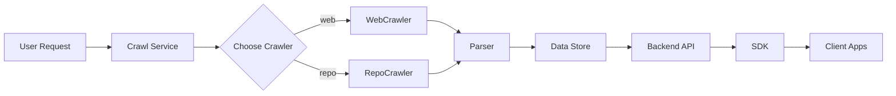
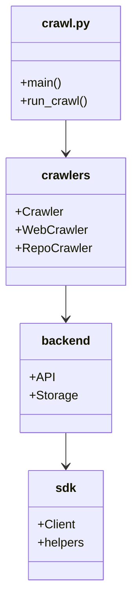

# Diagram: common/filter_service/config/config.staging1.yml

> Auto-generated by Obscura crawlers

## Diagram 1

### SVG

<svg id="container" width="1697.375" xmlns="http://www.w3.org/2000/svg" class="flowchart" height="181.234375" viewBox="0 0 1697.375 181.234375" role="graphics-document document" aria-roledescription="flowchart-v2"><g><marker id="container_flowchart-v2-pointEnd" class="marker flowchart-v2" viewBox="0 0 10 10" refX="5" refY="5" markerUnits="userSpaceOnUse" markerWidth="8" markerHeight="8" orient="auto"><path d="M 0 0 L 10 5 L 0 10 z" class="arrowMarkerPath" style="stroke-width: 1; stroke-dasharray: 1, 0;"></path></marker><marker id="container_flowchart-v2-pointStart" class="marker flowchart-v2" viewBox="0 0 10 10" refX="4.5" refY="5" markerUnits="userSpaceOnUse" markerWidth="8" markerHeight="8" orient="auto"><path d="M 0 5 L 10 10 L 10 0 z" class="arrowMarkerPath" style="stroke-width: 1; stroke-dasharray: 1, 0;"></path></marker><marker id="container_flowchart-v2-circleEnd" class="marker flowchart-v2" viewBox="0 0 10 10" refX="11" refY="5" markerUnits="userSpaceOnUse" markerWidth="11" markerHeight="11" orient="auto"><circle cx="5" cy="5" r="5" class="arrowMarkerPath" style="stroke-width: 1; stroke-dasharray: 1, 0;"></circle></marker><marker id="container_flowchart-v2-circleStart" class="marker flowchart-v2" viewBox="0 0 10 10" refX="-1" refY="5" markerUnits="userSpaceOnUse" markerWidth="11" markerHeight="11" orient="auto"><circle cx="5" cy="5" r="5" class="arrowMarkerPath" style="stroke-width: 1; stroke-dasharray: 1, 0;"></circle></marker><marker id="container_flowchart-v2-crossEnd" class="marker cross flowchart-v2" viewBox="0 0 11 11" refX="12" refY="5.2" markerUnits="userSpaceOnUse" markerWidth="11" markerHeight="11" orient="auto"><path d="M 1,1 l 9,9 M 10,1 l -9,9" class="arrowMarkerPath" style="stroke-width: 2; stroke-dasharray: 1, 0;"></path></marker><marker id="container_flowchart-v2-crossStart" class="marker cross flowchart-v2" viewBox="0 0 11 11" refX="-1" refY="5.2" markerUnits="userSpaceOnUse" markerWidth="11" markerHeight="11" orient="auto"><path d="M 1,1 l 9,9 M 10,1 l -9,9" class="arrowMarkerPath" style="stroke-width: 2; stroke-dasharray: 1, 0;"></path></marker><g class="root"><g class="clusters"></g><g class="edgePaths"><path d="M164.141,90.617L168.307,90.617C172.474,90.617,180.807,90.617,188.474,90.617C196.141,90.617,203.141,90.617,206.641,90.617L210.141,90.617" id="L_A_B_0" class="edge-thickness-normal edge-pattern-solid edge-thickness-normal edge-pattern-solid flowchart-link" style=";" data-edge="true" data-et="edge" data-id="L_A_B_0" data-points="W3sieCI6MTY0LjE0MDYyNSwieSI6OTAuNjE3MTg3NX0seyJ4IjoxODkuMTQwNjI1LCJ5Ijo5MC42MTcxODc1fSx7IngiOjIxNC4xNDA2MjUsInkiOjkwLjYxNzE4NzV9XQ==" marker-end="url(#container_flowchart-v2-pointEnd)"></path><path d="M369.563,90.617L373.729,90.617C377.896,90.617,386.229,90.617,393.896,90.617C401.563,90.617,408.563,90.617,412.063,90.617L415.563,90.617" id="L_B_C_0" class="edge-thickness-normal edge-pattern-solid edge-thickness-normal edge-pattern-solid flowchart-link" style=";" data-edge="true" data-et="edge" data-id="L_B_C_0" data-points="W3sieCI6MzY5LjU2MjUsInkiOjkwLjYxNzE4NzV9LHsieCI6Mzk0LjU2MjUsInkiOjkwLjYxNzE4NzV9LHsieCI6NDE5LjU2MjUsInkiOjkwLjYxNzE4NzV9XQ==" marker-end="url(#container_flowchart-v2-pointEnd)"></path><path d="M560.422,66.242L571.423,61.638C582.424,57.034,604.427,47.826,622.178,43.221C639.93,38.617,653.43,38.617,660.18,38.617L666.93,38.617" id="L_C_D_0" class="edge-thickness-normal edge-pattern-solid edge-thickness-normal edge-pattern-solid flowchart-link" style=";" data-edge="true" data-et="edge" data-id="L_C_D_0" data-points="W3sieCI6NTYwLjQyMTg3NSwieSI6NjYuMjQyMTg3NX0seyJ4Ijo2MjYuNDI5Njg3NSwieSI6MzguNjE3MTg3NX0seyJ4Ijo2NzAuOTI5Njg3NSwieSI6MzguNjE3MTg3NX1d" marker-end="url(#container_flowchart-v2-pointEnd)"></path><path d="M560.422,114.992L571.423,119.596C582.424,124.201,604.427,133.409,621.701,138.013C638.974,142.617,651.518,142.617,657.79,142.617L664.063,142.617" id="L_C_E_0" class="edge-thickness-normal edge-pattern-solid edge-thickness-normal edge-pattern-solid flowchart-link" style=";" data-edge="true" data-et="edge" data-id="L_C_E_0" data-points="W3sieCI6NTYwLjQyMTg3NSwieSI6MTE0Ljk5MjE4NzV9LHsieCI6NjI2LjQyOTY4NzUsInkiOjE0Mi42MTcxODc1fSx7IngiOjY2OC4wNjI1LCJ5IjoxNDIuNjE3MTg3NX1d" marker-end="url(#container_flowchart-v2-pointEnd)"></path><path d="M816.148,38.617L820.793,38.617C825.438,38.617,834.727,38.617,845.044,42.413C855.362,46.209,866.709,53.801,872.383,57.597L878.056,61.393" id="L_D_F_0" class="edge-thickness-normal edge-pattern-solid edge-thickness-normal edge-pattern-solid flowchart-link" style=";" data-edge="true" data-et="edge" data-id="L_D_F_0" data-points="W3sieCI6ODE2LjE0ODQzNzUsInkiOjM4LjYxNzE4NzV9LHsieCI6ODQ0LjAxNTYyNSwieSI6MzguNjE3MTg3NX0seyJ4Ijo4ODEuMzgwNDA4NjUzODQ2MiwieSI6NjMuNjE3MTg3NX1d" marker-end="url(#container_flowchart-v2-pointEnd)"></path><path d="M819.016,142.617L823.182,142.617C827.349,142.617,835.682,142.617,845.522,138.821C855.362,135.025,866.709,127.433,872.383,123.637L878.056,119.842" id="L_E_F_0" class="edge-thickness-normal edge-pattern-solid edge-thickness-normal edge-pattern-solid flowchart-link" style=";" data-edge="true" data-et="edge" data-id="L_E_F_0" data-points="W3sieCI6ODE5LjAxNTYyNSwieSI6MTQyLjYxNzE4NzV9LHsieCI6ODQ0LjAxNTYyNSwieSI6MTQyLjYxNzE4NzV9LHsieCI6ODgxLjM4MDQwODY1Mzg0NjIsInkiOjExNy42MTcxODc1fV0=" marker-end="url(#container_flowchart-v2-pointEnd)"></path><path d="M974.453,90.617L978.62,90.617C982.786,90.617,991.12,90.617,998.786,90.617C1006.453,90.617,1013.453,90.617,1016.953,90.617L1020.453,90.617" id="L_F_G_0" class="edge-thickness-normal edge-pattern-solid edge-thickness-normal edge-pattern-solid flowchart-link" style=";" data-edge="true" data-et="edge" data-id="L_F_G_0" data-points="W3sieCI6OTc0LjQ1MzEyNSwieSI6OTAuNjE3MTg3NX0seyJ4Ijo5OTkuNDUzMTI1LCJ5Ijo5MC42MTcxODc1fSx7IngiOjEwMjQuNDUzMTI1LCJ5Ijo5MC42MTcxODc1fV0=" marker-end="url(#container_flowchart-v2-pointEnd)"></path><path d="M1159.938,90.617L1164.104,90.617C1168.271,90.617,1176.604,90.617,1184.271,90.617C1191.938,90.617,1198.938,90.617,1202.438,90.617L1205.938,90.617" id="L_G_H_0" class="edge-thickness-normal edge-pattern-solid edge-thickness-normal edge-pattern-solid flowchart-link" style=";" data-edge="true" data-et="edge" data-id="L_G_H_0" data-points="W3sieCI6MTE1OS45Mzc1LCJ5Ijo5MC42MTcxODc1fSx7IngiOjExODQuOTM3NSwieSI6OTAuNjE3MTg3NX0seyJ4IjoxMjA5LjkzNzUsInkiOjkwLjYxNzE4NzV9XQ==" marker-end="url(#container_flowchart-v2-pointEnd)"></path><path d="M1359.156,90.617L1363.323,90.617C1367.49,90.617,1375.823,90.617,1383.49,90.617C1391.156,90.617,1398.156,90.617,1401.656,90.617L1405.156,90.617" id="L_H_I_0" class="edge-thickness-normal edge-pattern-solid edge-thickness-normal edge-pattern-solid flowchart-link" style=";" data-edge="true" data-et="edge" data-id="L_H_I_0" data-points="W3sieCI6MTM1OS4xNTYyNSwieSI6OTAuNjE3MTg3NX0seyJ4IjoxMzg0LjE1NjI1LCJ5Ijo5MC42MTcxODc1fSx7IngiOjE0MDkuMTU2MjUsInkiOjkwLjYxNzE4NzV9XQ==" marker-end="url(#container_flowchart-v2-pointEnd)"></path><path d="M1497.609,90.617L1501.776,90.617C1505.943,90.617,1514.276,90.617,1521.943,90.617C1529.609,90.617,1536.609,90.617,1540.109,90.617L1543.609,90.617" id="L_I_J_0" class="edge-thickness-normal edge-pattern-solid edge-thickness-normal edge-pattern-solid flowchart-link" style=";" data-edge="true" data-et="edge" data-id="L_I_J_0" data-points="W3sieCI6MTQ5Ny42MDkzNzUsInkiOjkwLjYxNzE4NzV9LHsieCI6MTUyMi42MDkzNzUsInkiOjkwLjYxNzE4NzV9LHsieCI6MTU0Ny42MDkzNzUsInkiOjkwLjYxNzE4NzV9XQ==" marker-end="url(#container_flowchart-v2-pointEnd)"></path></g><g class="edgeLabels"><g class="edgeLabel"><g class="label" data-id="L_A_B_0" transform="translate(0, 0)"><foreignObject width="0" height="0">

</foreignObject></g></g><g class="edgeLabel"><g class="label" data-id="L_B_C_0" transform="translate(0, 0)"><foreignObject width="0" height="0">

</foreignObject></g></g><g class="edgeLabel" transform="translate(626.4296875, 38.6171875)"><g class="label" data-id="L_C_D_0" transform="translate(-14.8515625, -12)"><foreignObject width="29.703125" height="24">

web

</foreignObject></g></g><g class="edgeLabel" transform="translate(626.4296875, 142.6171875)"><g class="label" data-id="L_C_E_0" transform="translate(-16.6328125, -12)"><foreignObject width="33.265625" height="24">

repo

</foreignObject></g></g><g class="edgeLabel"><g class="label" data-id="L_D_F_0" transform="translate(0, 0)"><foreignObject width="0" height="0">

</foreignObject></g></g><g class="edgeLabel"><g class="label" data-id="L_E_F_0" transform="translate(0, 0)"><foreignObject width="0" height="0">

</foreignObject></g></g><g class="edgeLabel"><g class="label" data-id="L_F_G_0" transform="translate(0, 0)"><foreignObject width="0" height="0">

</foreignObject></g></g><g class="edgeLabel"><g class="label" data-id="L_G_H_0" transform="translate(0, 0)"><foreignObject width="0" height="0">

</foreignObject></g></g><g class="edgeLabel"><g class="label" data-id="L_H_I_0" transform="translate(0, 0)"><foreignObject width="0" height="0">

</foreignObject></g></g><g class="edgeLabel"><g class="label" data-id="L_I_J_0" transform="translate(0, 0)"><foreignObject width="0" height="0">

</foreignObject></g></g></g><g class="nodes"><g class="node default" id="flowchart-A-0" transform="translate(86.0703125, 90.6171875)"><rect class="basic label-container" style="" x="-78.0703125" y="-27" width="156.140625" height="54"></rect><g class="label" style="" transform="translate(-48.0703125, -12)"><rect></rect><foreignObject width="96.140625" height="24">

User Request

</foreignObject></g></g><g class="node default" id="flowchart-B-1" transform="translate(291.8515625, 90.6171875)"><rect class="basic label-container" style="" x="-77.7109375" y="-27" width="155.421875" height="54"></rect><g class="label" style="" transform="translate(-47.7109375, -12)"><rect></rect><foreignObject width="95.421875" height="24">

Crawl Service

</foreignObject></g></g><g class="node default" id="flowchart-C-3" transform="translate(502.1796875, 90.6171875)"><polygon points="82.6171875,0 165.234375,-82.6171875 82.6171875,-165.234375 0,-82.6171875" class="label-container" transform="translate(-82.1171875, 82.6171875)"></polygon><g class="label" style="" transform="translate(-55.6171875, -12)"><rect></rect><foreignObject width="111.234375" height="24">

Choose Crawler

</foreignObject></g></g><g class="node default" id="flowchart-D-5" transform="translate(743.5390625, 38.6171875)"><rect class="basic label-container" style="" x="-72.609375" y="-27" width="145.21875" height="54"></rect><g class="label" style="" transform="translate(-42.609375, -12)"><rect></rect><foreignObject width="85.21875" height="24">

WebCrawler

</foreignObject></g></g><g class="node default" id="flowchart-E-7" transform="translate(743.5390625, 142.6171875)"><rect class="basic label-container" style="" x="-75.4765625" y="-27" width="150.953125" height="54"></rect><g class="label" style="" transform="translate(-45.4765625, -12)"><rect></rect><foreignObject width="90.953125" height="24">

RepoCrawler

</foreignObject></g></g><g class="node default" id="flowchart-F-9" transform="translate(921.734375, 90.6171875)"><rect class="basic label-container" style="" x="-52.71875" y="-27" width="105.4375" height="54"></rect><g class="label" style="" transform="translate(-22.71875, -12)"><rect></rect><foreignObject width="45.4375" height="24">

Parser

</foreignObject></g></g><g class="node default" id="flowchart-G-13" transform="translate(1092.1953125, 90.6171875)"><rect class="basic label-container" style="" x="-67.7421875" y="-27" width="135.484375" height="54"></rect><g class="label" style="" transform="translate(-37.7421875, -12)"><rect></rect><foreignObject width="75.484375" height="24">

Data Store

</foreignObject></g></g><g class="node default" id="flowchart-H-15" transform="translate(1284.546875, 90.6171875)"><rect class="basic label-container" style="" x="-74.609375" y="-27" width="149.21875" height="54"></rect><g class="label" style="" transform="translate(-44.609375, -12)"><rect></rect><foreignObject width="89.21875" height="24">

Backend API

</foreignObject></g></g><g class="node default" id="flowchart-I-17" transform="translate(1453.3828125, 90.6171875)"><rect class="basic label-container" style="" x="-44.2265625" y="-27" width="88.453125" height="54"></rect><g class="label" style="" transform="translate(-14.2265625, -12)"><rect></rect><foreignObject width="28.453125" height="24">

SDK

</foreignObject></g></g><g class="node default" id="flowchart-J-19" transform="translate(1618.4921875, 90.6171875)"><rect class="basic label-container" style="" x="-70.8828125" y="-27" width="141.765625" height="54"></rect><g class="label" style="" transform="translate(-40.8828125, -12)"><rect></rect><foreignObject width="81.765625" height="24">

Client Apps

</foreignObject></g></g></g></g></g></svg>

## Diagram 2

### SVG

<svg id="container" width="169.765625" xmlns="http://www.w3.org/2000/svg" class="classDiagram" height="772" viewBox="0 0 169.765625 772" role="graphics-document document" aria-roledescription="class"><g><defs><marker id="container_class-aggregationStart" class="marker aggregation class" refX="18" refY="7" markerWidth="190" markerHeight="240" orient="auto"><path d="M 18,7 L9,13 L1,7 L9,1 Z"></path></marker></defs><defs><marker id="container_class-aggregationEnd" class="marker aggregation class" refX="1" refY="7" markerWidth="20" markerHeight="28" orient="auto"><path d="M 18,7 L9,13 L1,7 L9,1 Z"></path></marker></defs><defs><marker id="container_class-extensionStart" class="marker extension class" refX="18" refY="7" markerWidth="190" markerHeight="240" orient="auto"><path d="M 1,7 L18,13 V 1 Z"></path></marker></defs><defs><marker id="container_class-extensionEnd" class="marker extension class" refX="1" refY="7" markerWidth="20" markerHeight="28" orient="auto"><path d="M 1,1 V 13 L18,7 Z"></path></marker></defs><defs><marker id="container_class-compositionStart" class="marker composition class" refX="18" refY="7" markerWidth="190" markerHeight="240" orient="auto"><path d="M 18,7 L9,13 L1,7 L9,1 Z"></path></marker></defs><defs><marker id="container_class-compositionEnd" class="marker composition class" refX="1" refY="7" markerWidth="20" markerHeight="28" orient="auto"><path d="M 18,7 L9,13 L1,7 L9,1 Z"></path></marker></defs><defs><marker id="container_class-dependencyStart" class="marker dependency class" refX="6" refY="7" markerWidth="190" markerHeight="240" orient="auto"><path d="M 5,7 L9,13 L1,7 L9,1 Z"></path></marker></defs><defs><marker id="container_class-dependencyEnd" class="marker dependency class" refX="13" refY="7" markerWidth="20" markerHeight="28" orient="auto"><path d="M 18,7 L9,13 L14,7 L9,1 Z"></path></marker></defs><defs><marker id="container_class-lollipopStart" class="marker lollipop class" refX="13" refY="7" markerWidth="190" markerHeight="240" orient="auto"><circle stroke="black" fill="transparent" cx="7" cy="7" r="6"></circle></marker></defs><defs><marker id="container_class-lollipopEnd" class="marker lollipop class" refX="1" refY="7" markerWidth="190" markerHeight="240" orient="auto"><circle stroke="black" fill="transparent" cx="7" cy="7" r="6"></circle></marker></defs><g class="root"><g class="clusters"></g><g class="edgePaths"><path d="M84.883,158L84.883,162.167C84.883,166.333,84.883,174.667,84.883,182C84.883,189.333,84.883,195.667,84.883,198.833L84.883,202" id="id_crawl.py_crawlers_1" class="edge-thickness-normal edge-pattern-solid relation" style=";;;" data-edge="true" data-et="edge" data-id="id_crawl.py_crawlers_1" data-points="W3sieCI6ODQuODgyODEyNSwieSI6MTU4fSx7IngiOjg0Ljg4MjgxMjUsInkiOjE4M30seyJ4Ijo4NC44ODI4MTI1LCJ5IjoyMDh9XQ==" marker-end="url(#container_class-dependencyEnd)"></path><path d="M84.883,376L84.883,380.167C84.883,384.333,84.883,392.667,84.883,400C84.883,407.333,84.883,413.667,84.883,416.833L84.883,420" id="id_crawlers_backend_2" class="edge-thickness-normal edge-pattern-solid relation" style=";;;" data-edge="true" data-et="edge" data-id="id_crawlers_backend_2" data-points="W3sieCI6ODQuODgyODEyNSwieSI6Mzc2fSx7IngiOjg0Ljg4MjgxMjUsInkiOjQwMX0seyJ4Ijo4NC44ODI4MTI1LCJ5Ijo0MjZ9XQ==" marker-end="url(#container_class-dependencyEnd)"></path><path d="M84.883,570L84.883,574.167C84.883,578.333,84.883,586.667,84.883,594C84.883,601.333,84.883,607.667,84.883,610.833L84.883,614" id="id_backend_sdk_3" class="edge-thickness-normal edge-pattern-solid relation" style=";;;" data-edge="true" data-et="edge" data-id="id_backend_sdk_3" data-points="W3sieCI6ODQuODgyODEyNSwieSI6NTcwfSx7IngiOjg0Ljg4MjgxMjUsInkiOjU5NX0seyJ4Ijo4NC44ODI4MTI1LCJ5Ijo2MjB9XQ==" marker-end="url(#container_class-dependencyEnd)"></path></g><g class="edgeLabels"><g class="edgeLabel"><g class="label" data-id="id_crawl.py_crawlers_1" transform="translate(0, 0)"><foreignObject width="0" height="0">

</foreignObject></g></g><g class="edgeLabel"><g class="label" data-id="id_crawlers_backend_2" transform="translate(0, 0)"><foreignObject width="0" height="0">

</foreignObject></g></g><g class="edgeLabel"><g class="label" data-id="id_backend_sdk_3" transform="translate(0, 0)"><foreignObject width="0" height="0">

</foreignObject></g></g></g><g class="nodes"><g class="node default" id="classId-crawl.py-0" transform="translate(84.8828125, 83)"><g class="basic label-container"><path d="M-71.7890625 -75 L71.7890625 -75 L71.7890625 75 L-71.7890625 75" stroke="none" stroke-width="0" fill="#ECECFF" style=""></path><path d="M-71.7890625 -75 C-19.581648951770944 -75, 32.62576459645811 -75, 71.7890625 -75 M-71.7890625 -75 C-23.638965823551906 -75, 24.511130852896187 -75, 71.7890625 -75 M71.7890625 -75 C71.7890625 -27.510404447376125, 71.7890625 19.97919110524775, 71.7890625 75 M71.7890625 -75 C71.7890625 -37.963049391534426, 71.7890625 -0.9260987830688521, 71.7890625 75 M71.7890625 75 C24.609953758302446 75, -22.56915498339511 75, -71.7890625 75 M71.7890625 75 C28.109471011171046 75, -15.570120477657909 75, -71.7890625 75 M-71.7890625 75 C-71.7890625 44.84754039590507, -71.7890625 14.695080791810142, -71.7890625 -75 M-71.7890625 75 C-71.7890625 40.30896202664822, -71.7890625 5.617924053296434, -71.7890625 -75" stroke="#9370DB" stroke-width="1.3" fill="none" stroke-dasharray="0 0" style=""></path></g><g class="annotation-group text" transform="translate(0, -51)"></g><g class="label-group text" transform="translate(-30.3125, -51)"><g class="label" style="font-weight: bolder" transform="translate(0,-12)"><foreignObject width="60.625" height="24">

crawl.py

</foreignObject></g></g><g class="members-group text" transform="translate(-59.7890625, -3)"></g><g class="methods-group text" transform="translate(-59.7890625, 27)"><g class="label" style="" transform="translate(0,-12)"><foreignObject width="54.65625" height="24">

+main()

</foreignObject></g><g class="label" style="" transform="translate(0,12)"><foreignObject width="89.265625" height="24">

+run_crawl()

</foreignObject></g></g><g class="divider" style=""><path d="M-71.7890625 -27 C-34.78040500922616 -27, 2.2282524815476847 -27, 71.7890625 -27 M-71.7890625 -27 C-18.791638144613543 -27, 34.205786210772914 -27, 71.7890625 -27" stroke="#9370DB" stroke-width="1.3" fill="none" stroke-dasharray="0 0" style=""></path></g><g class="divider" style=""><path d="M-71.7890625 -3 C-26.571735763872354 -3, 18.64559097225529 -3, 71.7890625 -3 M-71.7890625 -3 C-29.555154931240025 -3, 12.678752637519949 -3, 71.7890625 -3" stroke="#9370DB" stroke-width="1.3" fill="none" stroke-dasharray="0 0" style=""></path></g></g><g class="node default" id="classId-crawlers-1" transform="translate(84.8828125, 292)"><g class="basic label-container"><path d="M-76.8828125 -84 L76.8828125 -84 L76.8828125 84 L-76.8828125 84" stroke="none" stroke-width="0" fill="#ECECFF" style=""></path><path d="M-76.8828125 -84 C-29.011927653476548 -84, 18.858957193046905 -84, 76.8828125 -84 M-76.8828125 -84 C-44.001303313425545 -84, -11.11979412685109 -84, 76.8828125 -84 M76.8828125 -84 C76.8828125 -18.83256701122592, 76.8828125 46.33486597754816, 76.8828125 84 M76.8828125 -84 C76.8828125 -45.314740399797195, 76.8828125 -6.62948079959439, 76.8828125 84 M76.8828125 84 C38.09063765234988 84, -0.701537195300233 84, -76.8828125 84 M76.8828125 84 C45.553619773705805 84, 14.224427047411602 84, -76.8828125 84 M-76.8828125 84 C-76.8828125 33.60693758656359, -76.8828125 -16.786124826872822, -76.8828125 -84 M-76.8828125 84 C-76.8828125 39.537884873769045, -76.8828125 -4.924230252461911, -76.8828125 -84" stroke="#9370DB" stroke-width="1.3" fill="none" stroke-dasharray="0 0" style=""></path></g><g class="annotation-group text" transform="translate(0, -60)"></g><g class="label-group text" transform="translate(-30.828125, -60)"><g class="label" style="font-weight: bolder" transform="translate(0,-12)"><foreignObject width="61.65625" height="24">

crawlers

</foreignObject></g></g><g class="members-group text" transform="translate(-64.8828125, -12)"><g class="label" style="" transform="translate(0,-12)"><foreignObject width="61.921875" height="24">

+Crawler

</foreignObject></g><g class="label" style="" transform="translate(0,12)"><foreignObject width="93.203125" height="24">

+WebCrawler

</foreignObject></g><g class="label" style="" transform="translate(0,36)"><foreignObject width="98.9375" height="24">

+RepoCrawler

</foreignObject></g></g><g class="methods-group text" transform="translate(-64.8828125, 84)"></g><g class="divider" style=""><path d="M-76.8828125 -36 C-18.61820902738762 -36, 39.64639444522476 -36, 76.8828125 -36 M-76.8828125 -36 C-23.758613594917307 -36, 29.365585310165386 -36, 76.8828125 -36" stroke="#9370DB" stroke-width="1.3" fill="none" stroke-dasharray="0 0" style=""></path></g><g class="divider" style=""><path d="M-76.8828125 60 C-25.67937786952227 60, 25.52405676095546 60, 76.8828125 60 M-76.8828125 60 C-30.190297720507452 60, 16.502217058985096 60, 76.8828125 60" stroke="#9370DB" stroke-width="1.3" fill="none" stroke-dasharray="0 0" style=""></path></g></g><g class="node default" id="classId-backend-2" transform="translate(84.8828125, 498)"><g class="basic label-container"><path d="M-58.4765625 -72 L58.4765625 -72 L58.4765625 72 L-58.4765625 72" stroke="none" stroke-width="0" fill="#ECECFF" style=""></path><path d="M-58.4765625 -72 C-26.828173207815123 -72, 4.820216084369754 -72, 58.4765625 -72 M-58.4765625 -72 C-14.398801906396876 -72, 29.678958687206247 -72, 58.4765625 -72 M58.4765625 -72 C58.4765625 -31.550372316602434, 58.4765625 8.899255366795131, 58.4765625 72 M58.4765625 -72 C58.4765625 -36.65957561741025, 58.4765625 -1.3191512348204952, 58.4765625 72 M58.4765625 72 C24.446999975128996 72, -9.582562549742008 72, -58.4765625 72 M58.4765625 72 C18.235850744044512 72, -22.004861011910975 72, -58.4765625 72 M-58.4765625 72 C-58.4765625 31.79141004223544, -58.4765625 -8.417179915529118, -58.4765625 -72 M-58.4765625 72 C-58.4765625 32.35032129069672, -58.4765625 -7.2993574186065615, -58.4765625 -72" stroke="#9370DB" stroke-width="1.3" fill="none" stroke-dasharray="0 0" style=""></path></g><g class="annotation-group text" transform="translate(0, -48)"></g><g class="label-group text" transform="translate(-31.0625, -48)"><g class="label" style="font-weight: bolder" transform="translate(0,-12)"><foreignObject width="62.125" height="24">

backend

</foreignObject></g></g><g class="members-group text" transform="translate(-46.4765625, 0)"><g class="label" style="" transform="translate(0,-12)"><foreignObject width="31.015625" height="24">

+API

</foreignObject></g><g class="label" style="" transform="translate(0,12)"><foreignObject width="61.890625" height="24">

+Storage

</foreignObject></g></g><g class="methods-group text" transform="translate(-46.4765625, 72)"></g><g class="divider" style=""><path d="M-58.4765625 -24 C-32.93456749460189 -24, -7.392572489203786 -24, 58.4765625 -24 M-58.4765625 -24 C-18.80527459443322 -24, 20.866013311133557 -24, 58.4765625 -24" stroke="#9370DB" stroke-width="1.3" fill="none" stroke-dasharray="0 0" style=""></path></g><g class="divider" style=""><path d="M-58.4765625 48 C-24.016041972454083 48, 10.444478555091834 48, 58.4765625 48 M-58.4765625 48 C-12.201245655034946 48, 34.07407118993011 48, 58.4765625 48" stroke="#9370DB" stroke-width="1.3" fill="none" stroke-dasharray="0 0" style=""></path></g></g><g class="node default" id="classId-sdk-3" transform="translate(84.8828125, 692)"><g class="basic label-container"><path d="M-49.74609375 -72 L49.74609375 -72 L49.74609375 72 L-49.74609375 72" stroke="none" stroke-width="0" fill="#ECECFF" style=""></path><path d="M-49.74609375 -72 C-25.433588790779293 -72, -1.121083831558586 -72, 49.74609375 -72 M-49.74609375 -72 C-11.360369834867157 -72, 27.025354080265686 -72, 49.74609375 -72 M49.74609375 -72 C49.74609375 -42.635688850390174, 49.74609375 -13.271377700780349, 49.74609375 72 M49.74609375 -72 C49.74609375 -38.81489359651976, 49.74609375 -5.629787193039519, 49.74609375 72 M49.74609375 72 C21.35501560718798 72, -7.0360625356240405 72, -49.74609375 72 M49.74609375 72 C13.864874583053563 72, -22.016344583892874 72, -49.74609375 72 M-49.74609375 72 C-49.74609375 16.23240606217704, -49.74609375 -39.53518787564592, -49.74609375 -72 M-49.74609375 72 C-49.74609375 42.67518398929387, -49.74609375 13.350367978587741, -49.74609375 -72" stroke="#9370DB" stroke-width="1.3" fill="none" stroke-dasharray="0 0" style=""></path></g><g class="annotation-group text" transform="translate(0, -48)"></g><g class="label-group text" transform="translate(-13.0859375, -48)"><g class="label" style="font-weight: bolder" transform="translate(0,-12)"><foreignObject width="26.171875" height="24">

sdk

</foreignObject></g></g><g class="members-group text" transform="translate(-37.74609375, 0)"><g class="label" style="" transform="translate(0,-12)"><foreignObject width="49.859375" height="24">

+Client

</foreignObject></g><g class="label" style="" transform="translate(0,12)"><foreignObject width="62.40625" height="24">

+helpers

</foreignObject></g></g><g class="methods-group text" transform="translate(-37.74609375, 72)"></g><g class="divider" style=""><path d="M-49.74609375 -24 C-26.802206035098493 -24, -3.858318320196986 -24, 49.74609375 -24 M-49.74609375 -24 C-23.29591259410129 -24, 3.154268561797423 -24, 49.74609375 -24" stroke="#9370DB" stroke-width="1.3" fill="none" stroke-dasharray="0 0" style=""></path></g><g class="divider" style=""><path d="M-49.74609375 48 C-21.445543622469913 48, 6.8550065050601745 48, 49.74609375 48 M-49.74609375 48 C-19.756801895600592 48, 10.232489958798816 48, 49.74609375 48" stroke="#9370DB" stroke-width="1.3" fill="none" stroke-dasharray="0 0" style=""></path></g></g></g></g></g></svg>
