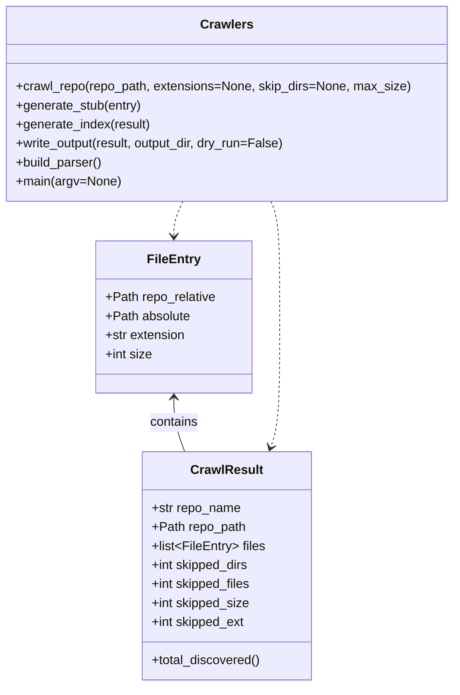

# Diagram: common/filter_service/config/config.test.yml


> Auto-generated by Obscura crawlers

## Diagram 1



### SVG

<svg id="container" width="569.6875" xmlns="http://www.w3.org/2000/svg" class="classDiagram" height="866" viewBox="0 0 569.6875 866" role="graphics-document document" aria-roledescription="class"><style>#container{font-family:"trebuchet ms",verdana,arial,sans-serif;font-size:16px;fill:#333;}@keyframes edge-animation-frame{from{stroke-dashoffset:0;}}@keyframes dash{to{stroke-dashoffset:0;}}#container .edge-animation-slow{stroke-dasharray:9,5!important;stroke-dashoffset:900;animation:dash 50s linear infinite;stroke-linecap:round;}#container .edge-animation-fast{stroke-dasharray:9,5!important;stroke-dashoffset:900;animation:dash 20s linear infinite;stroke-linecap:round;}#container .error-icon{fill:#552222;}#container .error-text{fill:#552222;stroke:#552222;}#container .edge-thickness-normal{stroke-width:1px;}#container .edge-thickness-thick{stroke-width:3.5px;}#container .edge-pattern-solid{stroke-dasharray:0;}#container .edge-thickness-invisible{stroke-width:0;fill:none;}#container .edge-pattern-dashed{stroke-dasharray:3;}#container .edge-pattern-dotted{stroke-dasharray:2;}#container .marker{fill:#333333;stroke:#333333;}#container .marker.cross{stroke:#333333;}#container svg{font-family:"trebuchet ms",verdana,arial,sans-serif;font-size:16px;}#container p{margin:0;}#container g.classGroup text{fill:#9370DB;stroke:none;font-family:"trebuchet ms",verdana,arial,sans-serif;font-size:10px;}#container g.classGroup text .title{font-weight:bolder;}#container .nodeLabel,#container .edgeLabel{color:#131300;}#container .edgeLabel .label rect{fill:#ECECFF;}#container .label text{fill:#131300;}#container .labelBkg{background:#ECECFF;}#container .edgeLabel .label span{background:#ECECFF;}#container .classTitle{font-weight:bolder;}#container .node rect,#container .node circle,#container .node ellipse,#container .node polygon,#container .node path{fill:#ECECFF;stroke:#9370DB;stroke-width:1px;}#container .divider{stroke:#9370DB;stroke-width:1;}#container g.clickable{cursor:pointer;}#container g.classGroup rect{fill:#ECECFF;stroke:#9370DB;}#container g.classGroup line{stroke:#9370DB;stroke-width:1;}#container .classLabel .box{stroke:none;stroke-width:0;fill:#ECECFF;opacity:0.5;}#container .classLabel .label{fill:#9370DB;font-size:10px;}#container .relation{stroke:#333333;stroke-width:1;fill:none;}#container .dashed-line{stroke-dasharray:3;}#container .dotted-line{stroke-dasharray:1 2;}#container #compositionStart,#container .composition{fill:#333333!important;stroke:#333333!important;stroke-width:1;}#container #compositionEnd,#container .composition{fill:#333333!important;stroke:#333333!important;stroke-width:1;}#container #dependencyStart,#container .dependency{fill:#333333!important;stroke:#333333!important;stroke-width:1;}#container #dependencyStart,#container .dependency{fill:#333333!important;stroke:#333333!important;stroke-width:1;}#container #extensionStart,#container .extension{fill:transparent!important;stroke:#333333!important;stroke-width:1;}#container #extensionEnd,#container .extension{fill:transparent!important;stroke:#333333!important;stroke-width:1;}#container #aggregationStart,#container .aggregation{fill:transparent!important;stroke:#333333!important;stroke-width:1;}#container #aggregationEnd,#container .aggregation{fill:transparent!important;stroke:#333333!important;stroke-width:1;}#container #lollipopStart,#container .lollipop{fill:#ECECFF!important;stroke:#333333!important;stroke-width:1;}#container #lollipopEnd,#container .lollipop{fill:#ECECFF!important;stroke:#333333!important;stroke-width:1;}#container .edgeTerminals{font-size:11px;line-height:initial;}#container .classTitleText{text-anchor:middle;font-size:18px;fill:#333;}#container .label-icon{display:inline-block;height:1em;overflow:visible;vertical-align:-0.125em;}#container .node .label-icon path{fill:currentColor;stroke:revert;stroke-width:revert;}#container :root{--mermaid-font-family:"trebuchet ms",verdana,arial,sans-serif;}</style><g><defs><marker id="container_class-aggregationStart" class="marker aggregation class" refX="18" refY="7" markerWidth="190" markerHeight="240" orient="auto"><path d="M 18,7 L9,13 L1,7 L9,1 Z"></path></marker></defs><defs><marker id="container_class-aggregationEnd" class="marker aggregation class" refX="1" refY="7" markerWidth="20" markerHeight="28" orient="auto"><path d="M 18,7 L9,13 L1,7 L9,1 Z"></path></marker></defs><defs><marker id="container_class-extensionStart" class="marker extension class" refX="18" refY="7" markerWidth="190" markerHeight="240" orient="auto"><path d="M 1,7 L18,13 V 1 Z"></path></marker></defs><defs><marker id="container_class-extensionEnd" class="marker extension class" refX="1" refY="7" markerWidth="20" markerHeight="28" orient="auto"><path d="M 1,1 V 13 L18,7 Z"></path></marker></defs><defs><marker id="container_class-compositionStart" class="marker composition class" refX="18" refY="7" markerWidth="190" markerHeight="240" orient="auto"><path d="M 18,7 L9,13 L1,7 L9,1 Z"></path></marker></defs><defs><marker id="container_class-compositionEnd" class="marker composition class" refX="1" refY="7" markerWidth="20" markerHeight="28" orient="auto"><path d="M 18,7 L9,13 L1,7 L9,1 Z"></path></marker></defs><defs><marker id="container_class-dependencyStart" class="marker dependency class" refX="6" refY="7" markerWidth="190" markerHeight="240" orient="auto"><path d="M 5,7 L9,13 L1,7 L9,1 Z"></path></marker></defs><defs><marker id="container_class-dependencyEnd" class="marker dependency class" refX="13" refY="7" markerWidth="20" markerHeight="28" orient="auto"><path d="M 18,7 L9,13 L14,7 L9,1 Z"></path></marker></defs><defs><marker id="container_class-lollipopStart" class="marker lollipop class" refX="13" refY="7" markerWidth="190" markerHeight="240" orient="auto"><circle stroke="black" fill="transparent" cx="7" cy="7" r="6"></circle></marker></defs><defs><marker id="container_class-lollipopEnd" class="marker lollipop class" refX="1" refY="7" markerWidth="190" markerHeight="240" orient="auto"><circle stroke="black" fill="transparent" cx="7" cy="7" r="6"></circle></marker></defs><g class="root"><g class="clusters"></g><g class="edgePaths"><path d="M218.301,502L218.301,507.167C218.301,512.333,218.301,522.667,220.568,534C222.835,545.333,227.369,557.667,229.636,563.833L231.903,570" id="id_FileEntry_CrawlResult_1" class="edge-thickness-normal edge-pattern-solid relation" style=";;;" data-edge="true" data-et="edge" data-id="id_FileEntry_CrawlResult_1" data-points="W3sieCI6MjE4LjMwMDc4MTI1LCJ5Ijo0OTZ9LHsieCI6MjE4LjMwMDc4MTI1LCJ5Ijo1MzN9LHsieCI6MjMxLjkwMzQ4NzU2OTA2MDc2LCJ5Ijo1NzB9XQ==" marker-start="url(#container_class-dependencyStart)"></path><path d="M229.541,254L227.668,258.167C225.794,262.333,222.048,270.667,220.174,278C218.301,285.333,218.301,291.667,218.301,294.833L218.301,298" id="id_Crawlers_FileEntry_2" class="edge-thickness-normal edge-pattern-dashed relation" style=";;;" data-edge="true" data-et="edge" data-id="id_Crawlers_FileEntry_2" data-points="W3sieCI6MjI5LjU0MTE0NzU5MjkwNTQyLCJ5IjoyNTR9LHsieCI6MjE4LjMwMDc4MTI1LCJ5IjoyNzl9LHsieCI6MjE4LjMwMDc4MTI1LCJ5IjozMDR9XQ==" marker-end="url(#container_class-dependencyEnd)"></path><path d="M340.146,254L342.02,258.167C343.893,262.333,347.64,270.667,349.513,295C351.387,319.333,351.387,359.667,351.387,402C351.387,444.333,351.387,488.667,349.465,516.061C347.543,543.456,343.698,553.912,341.776,559.14L339.854,564.369" id="id_Crawlers_CrawlResult_3" class="edge-thickness-normal edge-pattern-dashed relation" style=";;;" data-edge="true" data-et="edge" data-id="id_Crawlers_CrawlResult_3" data-points="W3sieCI6MzQwLjE0NjM1MjQwNzA5NDYsInkiOjI1NH0seyJ4IjozNTEuMzg2NzE4NzUsInkiOjI3OX0seyJ4IjozNTEuMzg2NzE4NzUsInkiOjQwMH0seyJ4IjozNTEuMzg2NzE4NzUsInkiOjUzM30seyJ4IjozMzcuNzg0MDEyNDMwOTM5MjQsInkiOjU3MH1d" marker-end="url(#container_class-dependencyEnd)"></path></g><g class="edgeLabels"><g class="edgeLabel" transform="translate(218.30078125, 533)"><g class="label" data-id="id_FileEntry_CrawlResult_1" transform="translate(-30.890625, -12)"><foreignObject width="61.78125" height="24"><div xmlns="http://www.w3.org/1999/xhtml" class="labelBkg" style="display: table-cell; white-space: nowrap; line-height: 1.5; max-width: 200px; text-align: center;"><span class="edgeLabel"><p>contains</p></span></div></foreignObject></g></g><g class="edgeLabel"><g class="label" data-id="id_Crawlers_FileEntry_2" transform="translate(0, 0)"><foreignObject width="0" height="0"><div xmlns="http://www.w3.org/1999/xhtml" class="labelBkg" style="display: table-cell; white-space: nowrap; line-height: 1.5; max-width: 200px; text-align: center;"><span class="edgeLabel"></span></div></foreignObject></g></g><g class="edgeLabel"><g class="label" data-id="id_Crawlers_CrawlResult_3" transform="translate(0, 0)"><foreignObject width="0" height="0"><div xmlns="http://www.w3.org/1999/xhtml" class="labelBkg" style="display: table-cell; white-space: nowrap; line-height: 1.5; max-width: 200px; text-align: center;"><span class="edgeLabel"></span></div></foreignObject></g></g></g><g class="nodes"><g class="node default" id="classId-FileEntry-0" transform="translate(218.30078125, 400)"><g class="basic label-container"><path d="M-98.0859375 -96 L98.0859375 -96 L98.0859375 96 L-98.0859375 96" stroke="none" stroke-width="0" fill="#ECECFF" style=""></path><path d="M-98.0859375 -96 C-43.94267013996161 -96, 10.200597220076773 -96, 98.0859375 -96 M-98.0859375 -96 C-47.976262142783895 -96, 2.1334132144322098 -96, 98.0859375 -96 M98.0859375 -96 C98.0859375 -40.46653859891968, 98.0859375 15.066922802160633, 98.0859375 96 M98.0859375 -96 C98.0859375 -22.400845019930784, 98.0859375 51.19830996013843, 98.0859375 96 M98.0859375 96 C49.52279258118697 96, 0.9596476623739392 96, -98.0859375 96 M98.0859375 96 C35.396299146021946 96, -27.29333920795611 96, -98.0859375 96 M-98.0859375 96 C-98.0859375 35.54284303772776, -98.0859375 -24.914313924544473, -98.0859375 -96 M-98.0859375 96 C-98.0859375 51.00471075936354, -98.0859375 6.0094215187270805, -98.0859375 -96" stroke="#9370DB" stroke-width="1.3" fill="none" stroke-dasharray="0 0" style=""></path></g><g class="annotation-group text" transform="translate(0, -72)"></g><g class="label-group text" transform="translate(-31.859375, -72)"><g class="label" style="font-weight: bolder" transform="translate(0,-12)"><foreignObject width="63.71875" height="24"><div xmlns="http://www.w3.org/1999/xhtml" style="display: table-cell; white-space: nowrap; line-height: 1.5; max-width: 113px; text-align: center;"><span class="nodeLabel markdown-node-label" style=""><p>FileEntry</p></span></div></foreignObject></g></g><g class="members-group text" transform="translate(-86.0859375, -24)"><g class="label" style="" transform="translate(0,-12)"><foreignObject width="140.3125" height="24"><div xmlns="http://www.w3.org/1999/xhtml" style="display: table-cell; white-space: nowrap; line-height: 1.5; max-width: 198px; text-align: center;"><span class="nodeLabel markdown-node-label" style=""><p>+Path repo_relative</p></span></div></foreignObject></g><g class="label" style="" transform="translate(0,12)"><foreignObject width="107.78125" height="24"><div xmlns="http://www.w3.org/1999/xhtml" style="display: table-cell; white-space: nowrap; line-height: 1.5; max-width: 165px; text-align: center;"><span class="nodeLabel markdown-node-label" style=""><p>+Path absolute</p></span></div></foreignObject></g><g class="label" style="" transform="translate(0,36)"><foreignObject width="102.328125" height="24"><div xmlns="http://www.w3.org/1999/xhtml" style="display: table-cell; white-space: nowrap; line-height: 1.5; max-width: 160px; text-align: center;"><span class="nodeLabel markdown-node-label" style=""><p>+str extension</p></span></div></foreignObject></g><g class="label" style="" transform="translate(0,60)"><foreignObject width="59.484375" height="24"><div xmlns="http://www.w3.org/1999/xhtml" style="display: table-cell; white-space: nowrap; line-height: 1.5; max-width: 117px; text-align: center;"><span class="nodeLabel markdown-node-label" style=""><p>+int size</p></span></div></foreignObject></g></g><g class="methods-group text" transform="translate(-86.0859375, 96)"></g><g class="divider" style=""><path d="M-98.0859375 -48 C-31.399074392236557 -48, 35.28778871552689 -48, 98.0859375 -48 M-98.0859375 -48 C-22.880465567132234 -48, 52.32500636573553 -48, 98.0859375 -48" stroke="#9370DB" stroke-width="1.3" fill="none" stroke-dasharray="0 0" style=""></path></g><g class="divider" style=""><path d="M-98.0859375 72 C-33.17105435768016 72, 31.743828784639675 72, 98.0859375 72 M-98.0859375 72 C-45.69347947521579 72, 6.698978549568423 72, 98.0859375 72" stroke="#9370DB" stroke-width="1.3" fill="none" stroke-dasharray="0 0" style=""></path></g></g><g class="node default" id="classId-CrawlResult-1" transform="translate(284.84375, 714)"><g class="basic label-container"><path d="M-105.3515625 -144 L105.3515625 -144 L105.3515625 144 L-105.3515625 144" stroke="none" stroke-width="0" fill="#ECECFF" style=""></path><path d="M-105.3515625 -144 C-45.09355063419407 -144, 15.164461231611867 -144, 105.3515625 -144 M-105.3515625 -144 C-27.016869107630555 -144, 51.31782428473889 -144, 105.3515625 -144 M105.3515625 -144 C105.3515625 -47.18263720083473, 105.3515625 49.63472559833053, 105.3515625 144 M105.3515625 -144 C105.3515625 -67.52430180209572, 105.3515625 8.951396395808558, 105.3515625 144 M105.3515625 144 C54.46785360725458 144, 3.584144714509165 144, -105.3515625 144 M105.3515625 144 C25.627336478533195 144, -54.09688954293361 144, -105.3515625 144 M-105.3515625 144 C-105.3515625 60.548710920825684, -105.3515625 -22.902578158348632, -105.3515625 -144 M-105.3515625 144 C-105.3515625 74.53486250428985, -105.3515625 5.069725008579695, -105.3515625 -144" stroke="#9370DB" stroke-width="1.3" fill="none" stroke-dasharray="0 0" style=""></path></g><g class="annotation-group text" transform="translate(0, -120)"></g><g class="label-group text" transform="translate(-43.28125, -120)"><g class="label" style="font-weight: bolder" transform="translate(0,-12)"><foreignObject width="86.5625" height="24"><div xmlns="http://www.w3.org/1999/xhtml" style="display: table-cell; white-space: nowrap; line-height: 1.5; max-width: 135px; text-align: center;"><span class="nodeLabel markdown-node-label" style=""><p>CrawlResult</p></span></div></foreignObject></g></g><g class="members-group text" transform="translate(-93.3515625, -72)"><g class="label" style="" transform="translate(0,-12)"><foreignObject width="113.4375" height="24"><div xmlns="http://www.w3.org/1999/xhtml" style="display: table-cell; white-space: nowrap; line-height: 1.5; max-width: 171px; text-align: center;"><span class="nodeLabel markdown-node-label" style=""><p>+str repo_name</p></span></div></foreignObject></g><g class="label" style="" transform="translate(0,12)"><foreignObject width="118.96875" height="24"><div xmlns="http://www.w3.org/1999/xhtml" style="display: table-cell; white-space: nowrap; line-height: 1.5; max-width: 176px; text-align: center;"><span class="nodeLabel markdown-node-label" style=""><p>+Path repo_path</p></span></div></foreignObject></g><g class="label" style="" transform="translate(0,36)"><foreignObject width="143.421875" height="24"><div xmlns="http://www.w3.org/1999/xhtml" style="display: table-cell; white-space: nowrap; line-height: 1.5; max-width: 240px; text-align: center;"><span class="nodeLabel markdown-node-label" style=""><p>+list&lt;FileEntry&gt; files</p></span></div></foreignObject></g><g class="label" style="" transform="translate(0,60)"><foreignObject width="124.859375" height="24"><div xmlns="http://www.w3.org/1999/xhtml" style="display: table-cell; white-space: nowrap; line-height: 1.5; max-width: 182px; text-align: center;"><span class="nodeLabel markdown-node-label" style=""><p>+int skipped_dirs</p></span></div></foreignObject></g><g class="label" style="" transform="translate(0,84)"><foreignObject width="127.375" height="24"><div xmlns="http://www.w3.org/1999/xhtml" style="display: table-cell; white-space: nowrap; line-height: 1.5; max-width: 185px; text-align: center;"><span class="nodeLabel markdown-node-label" style=""><p>+int skipped_files</p></span></div></foreignObject></g><g class="label" style="" transform="translate(0,108)"><foreignObject width="125.265625" height="24"><div xmlns="http://www.w3.org/1999/xhtml" style="display: table-cell; white-space: nowrap; line-height: 1.5; max-width: 183px; text-align: center;"><span class="nodeLabel markdown-node-label" style=""><p>+int skipped_size</p></span></div></foreignObject></g><g class="label" style="" transform="translate(0,132)"><foreignObject width="119.484375" height="24"><div xmlns="http://www.w3.org/1999/xhtml" style="display: table-cell; white-space: nowrap; line-height: 1.5; max-width: 177px; text-align: center;"><span class="nodeLabel markdown-node-label" style=""><p>+int skipped_ext</p></span></div></foreignObject></g></g><g class="methods-group text" transform="translate(-93.3515625, 120)"><g class="label" style="" transform="translate(0,-12)"><foreignObject width="138.734375" height="24"><div xmlns="http://www.w3.org/1999/xhtml" style="display: table-cell; white-space: nowrap; line-height: 1.5; max-width: 196px; text-align: center;"><span class="nodeLabel markdown-node-label" style=""><p>+total_discovered()</p></span></div></foreignObject></g></g><g class="divider" style=""><path d="M-105.3515625 -96 C-40.50489545724663 -96, 24.341771585506734 -96, 105.3515625 -96 M-105.3515625 -96 C-41.863401984418495 -96, 21.62475853116301 -96, 105.3515625 -96" stroke="#9370DB" stroke-width="1.3" fill="none" stroke-dasharray="0 0" style=""></path></g><g class="divider" style=""><path d="M-105.3515625 96 C-25.37529844670547 96, 54.60096560658906 96, 105.3515625 96 M-105.3515625 96 C-34.744516833491915 96, 35.86252883301617 96, 105.3515625 96" stroke="#9370DB" stroke-width="1.3" fill="none" stroke-dasharray="0 0" style=""></path></g></g><g class="node default" id="classId-Crawlers-2" transform="translate(284.84375, 131)"><g class="basic label-container"><path d="M-276.84375 -123 L276.84375 -123 L276.84375 123 L-276.84375 123" stroke="none" stroke-width="0" fill="#ECECFF" style=""></path><path d="M-276.84375 -123 C-60.196611794971204 -123, 156.4505264100576 -123, 276.84375 -123 M-276.84375 -123 C-160.39260789302904 -123, -43.9414657860581 -123, 276.84375 -123 M276.84375 -123 C276.84375 -30.66937630711915, 276.84375 61.6612473857617, 276.84375 123 M276.84375 -123 C276.84375 -42.77643432697667, 276.84375 37.44713134604666, 276.84375 123 M276.84375 123 C71.25775070025085 123, -134.3282485994983 123, -276.84375 123 M276.84375 123 C148.9135822832743 123, 20.98341456654859 123, -276.84375 123 M-276.84375 123 C-276.84375 69.7906704752929, -276.84375 16.581340950585783, -276.84375 -123 M-276.84375 123 C-276.84375 43.888016693311755, -276.84375 -35.22396661337649, -276.84375 -123" stroke="#9370DB" stroke-width="1.3" fill="none" stroke-dasharray="0 0" style=""></path></g><g class="annotation-group text" transform="translate(0, -99)"></g><g class="label-group text" transform="translate(-31.5, -99)"><g class="label" style="font-weight: bolder" transform="translate(0,-12)"><foreignObject width="63" height="24"><div xmlns="http://www.w3.org/1999/xhtml" style="display: table-cell; white-space: nowrap; line-height: 1.5; max-width: 111px; text-align: center;"><span class="nodeLabel markdown-node-label" style=""><p>Crawlers</p></span></div></foreignObject></g></g><g class="members-group text" transform="translate(-264.84375, -51)"></g><g class="methods-group text" transform="translate(-264.84375, -21)"><g class="label" style="" transform="translate(0,-12)"><foreignObject width="498.1875" height="24"><div xmlns="http://www.w3.org/1999/xhtml" style="display: table-cell; white-space: nowrap; line-height: 1.5; max-width: 556px; text-align: center;"><span class="nodeLabel markdown-node-label" style=""><p>+crawl_repo(repo_path, extensions=None, skip_dirs=None, max_size)</p></span></div></foreignObject></g><g class="label" style="" transform="translate(0,12)"><foreignObject width="159.796875" height="24"><div xmlns="http://www.w3.org/1999/xhtml" style="display: table-cell; white-space: nowrap; line-height: 1.5; max-width: 217px; text-align: center;"><span class="nodeLabel markdown-node-label" style=""><p>+generate_stub(entry)</p></span></div></foreignObject></g><g class="label" style="" transform="translate(0,36)"><foreignObject width="171.265625" height="24"><div xmlns="http://www.w3.org/1999/xhtml" style="display: table-cell; white-space: nowrap; line-height: 1.5; max-width: 229px; text-align: center;"><span class="nodeLabel markdown-node-label" style=""><p>+generate_index(result)</p></span></div></foreignObject></g><g class="label" style="" transform="translate(0,60)"><foreignObject width="346.015625" height="24"><div xmlns="http://www.w3.org/1999/xhtml" style="display: table-cell; white-space: nowrap; line-height: 1.5; max-width: 403px; text-align: center;"><span class="nodeLabel markdown-node-label" style=""><p>+write_output(result, output_dir, dry_run=False)</p></span></div></foreignObject></g><g class="label" style="" transform="translate(0,84)"><foreignObject width="110.53125" height="24"><div xmlns="http://www.w3.org/1999/xhtml" style="display: table-cell; white-space: nowrap; line-height: 1.5; max-width: 168px; text-align: center;"><span class="nodeLabel markdown-node-label" style=""><p>+build_parser()</p></span></div></foreignObject></g><g class="label" style="" transform="translate(0,108)"><foreignObject width="131.859375" height="24"><div xmlns="http://www.w3.org/1999/xhtml" style="display: table-cell; white-space: nowrap; line-height: 1.5; max-width: 189px; text-align: center;"><span class="nodeLabel markdown-node-label" style=""><p>+main(argv=None)</p></span></div></foreignObject></g></g><g class="divider" style=""><path d="M-276.84375 -75 C-79.48963321806463 -75, 117.86448356387075 -75, 276.84375 -75 M-276.84375 -75 C-101.33330241637393 -75, 74.17714516725215 -75, 276.84375 -75" stroke="#9370DB" stroke-width="1.3" fill="none" stroke-dasharray="0 0" style=""></path></g><g class="divider" style=""><path d="M-276.84375 -51 C-58.67769047222279 -51, 159.48836905555441 -51, 276.84375 -51 M-276.84375 -51 C-94.36170777038222 -51, 88.12033445923555 -51, 276.84375 -51" stroke="#9370DB" stroke-width="1.3" fill="none" stroke-dasharray="0 0" style=""></path></g></g></g></g></g></svg>

## Diagram 2

```mermaid
flowchart TD
    Start([Start]) --> CheckRepo{repo_path.is_dir()?}
    CheckRepo -- no --> Err[/"Error: not a directory"/]
    CheckRepo -- yes --> Init[Initialize CrawlResult]
    Init --> Walk[os.walk(repo_path)]
    Walk --> PruneDirs[Filter dirs by SKIP_DIRS]
    PruneDirs --> ForFiles[For each file in files]
    ForFiles --> CheckSkipFiles{fname in SKIP_FILES?}
    CheckSkipFiles -- yes --> IncrementSkippedFiles[skipped_files += 1] --> ForFiles
    CheckSkipFiles -- no --> CheckExt{ext in extensions?}
    CheckExt -- no --> IncrementSkippedExt[skipped_ext += 1] --> ForFiles
    CheckExt -- yes --> StatFile[stat() size]
    StatFile --> CheckSize{size > max_size?}
    CheckSize -- yes --> IncrementSkippedSize[skipped_size += 1] --> ForFiles
    CheckSize -- no --> CheckZero{size == 0?}
    CheckZero -- yes --> IncrementSkippedFiles2[skipped_files += 1] --> ForFiles
    CheckZero -- no --> Append[append FileEntry to result.files]
    Append --> ForFiles
    ForFiles --> EndLoop{done walking?}
    EndLoop -- yes --> ReturnResult[/return CrawlResult/]
    ReturnResult --> Done([Done])
```

> SVG rendering failed for this diagram.
