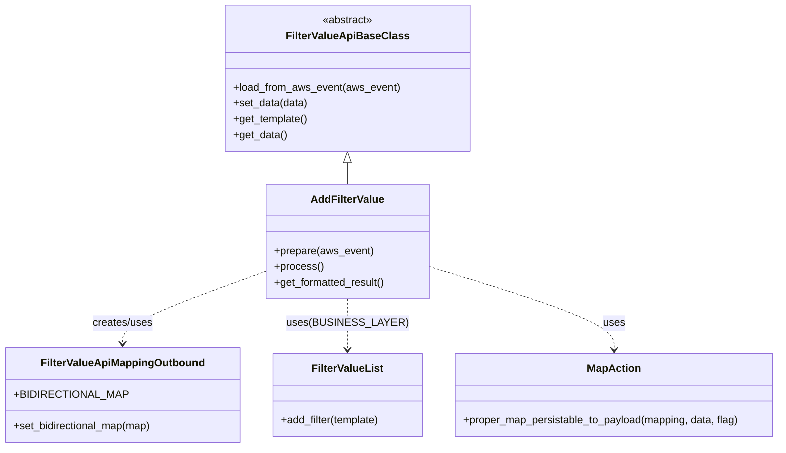

# Diagram: common/filter_service/filter_service/api/classes/AddFilterValue.py

> Auto-generated by Obscura crawlers

## Mermaid

### SVG

<svg id="container" width="1185.9921875" xmlns="http://www.w3.org/2000/svg" class="classDiagram" height="680" viewBox="0 0 1185.9921875 680" role="graphics-document document" aria-roledescription="class"><g><defs><marker id="container_class-aggregationStart" class="marker aggregation class" refX="18" refY="7" markerWidth="190" markerHeight="240" orient="auto"><path d="M 18,7 L9,13 L1,7 L9,1 Z"></path></marker></defs><defs><marker id="container_class-aggregationEnd" class="marker aggregation class" refX="1" refY="7" markerWidth="20" markerHeight="28" orient="auto"><path d="M 18,7 L9,13 L1,7 L9,1 Z"></path></marker></defs><defs><marker id="container_class-extensionStart" class="marker extension class" refX="18" refY="7" markerWidth="190" markerHeight="240" orient="auto"><path d="M 1,7 L18,13 V 1 Z"></path></marker></defs><defs><marker id="container_class-extensionEnd" class="marker extension class" refX="1" refY="7" markerWidth="20" markerHeight="28" orient="auto"><path d="M 1,1 V 13 L18,7 Z"></path></marker></defs><defs><marker id="container_class-compositionStart" class="marker composition class" refX="18" refY="7" markerWidth="190" markerHeight="240" orient="auto"><path d="M 18,7 L9,13 L1,7 L9,1 Z"></path></marker></defs><defs><marker id="container_class-compositionEnd" class="marker composition class" refX="1" refY="7" markerWidth="20" markerHeight="28" orient="auto"><path d="M 18,7 L9,13 L1,7 L9,1 Z"></path></marker></defs><defs><marker id="container_class-dependencyStart" class="marker dependency class" refX="6" refY="7" markerWidth="190" markerHeight="240" orient="auto"><path d="M 5,7 L9,13 L1,7 L9,1 Z"></path></marker></defs><defs><marker id="container_class-dependencyEnd" class="marker dependency class" refX="13" refY="7" markerWidth="20" markerHeight="28" orient="auto"><path d="M 18,7 L9,13 L14,7 L9,1 Z"></path></marker></defs><defs><marker id="container_class-lollipopStart" class="marker lollipop class" refX="13" refY="7" markerWidth="190" markerHeight="240" orient="auto"><circle stroke="black" fill="transparent" cx="7" cy="7" r="6"></circle></marker></defs><defs><marker id="container_class-lollipopEnd" class="marker lollipop class" refX="1" refY="7" markerWidth="190" markerHeight="240" orient="auto"><circle stroke="black" fill="transparent" cx="7" cy="7" r="6"></circle></marker></defs><g class="root"><g class="clusters"></g><g class="edgePaths"><path d="M528.578,247.25L528.578,248.542C528.578,249.833,528.578,252.417,528.578,257.875C528.578,263.333,528.578,271.667,528.578,275.833L528.578,280" id="id_FilterValueApiBaseClass_AddFilterValue_1" class="edge-thickness-normal edge-pattern-solid relation" style=";;;" data-edge="true" data-et="edge" data-id="id_FilterValueApiBaseClass_AddFilterValue_1" data-points="W3sieCI6NTI4LjU3ODEyNSwieSI6MjMwfSx7IngiOjUyOC41NzgxMjUsInkiOjI1NX0seyJ4Ijo1MjguNTc4MTI1LCJ5IjoyODB9XQ==" marker-start="url(#container_class-extensionStart)"></path><path d="M404.207,412.009L367.829,425.174C331.451,438.34,258.694,464.67,222.316,483.002C185.938,501.333,185.938,511.667,185.938,516.833L185.938,522" id="id_AddFilterValue_FilterValueApiMappingOutbound_2" class="edge-thickness-normal edge-pattern-dashed relation" style=";;;" data-edge="true" data-et="edge" data-id="id_AddFilterValue_FilterValueApiMappingOutbound_2" data-points="W3sieCI6NDA0LjIwNzAzMTI1LCJ5Ijo0MTIuMDA5MzAyNzQ5NzgzNH0seyJ4IjoxODUuOTM3NSwieSI6NDkxfSx7IngiOjE4NS45Mzc1LCJ5Ijo1Mjh9XQ==" marker-end="url(#container_class-dependencyEnd)"></path><path d="M528.578,454L528.578,460.167C528.578,466.333,528.578,478.667,528.578,491.5C528.578,504.333,528.578,517.667,528.578,524.333L528.578,531" id="id_AddFilterValue_FilterValueList_3" class="edge-thickness-normal edge-pattern-dashed relation" style=";;;" data-edge="true" data-et="edge" data-id="id_AddFilterValue_FilterValueList_3" data-points="W3sieCI6NTI4LjU3ODEyNSwieSI6NDU0fSx7IngiOjUyOC41NzgxMjUsInkiOjQ5MX0seyJ4Ijo1MjguNTc4MTI1LCJ5Ijo1Mzd9XQ==" marker-end="url(#container_class-dependencyEnd)"></path><path d="M652.949,404.886L700.064,419.239C747.178,433.591,841.408,462.295,888.522,483.314C935.637,504.333,935.637,517.667,935.637,524.333L935.637,531" id="id_AddFilterValue_MapAction_4" class="edge-thickness-normal edge-pattern-dashed relation" style=";;;" data-edge="true" data-et="edge" data-id="id_AddFilterValue_MapAction_4" data-points="W3sieCI6NjUyLjk0OTIxODc1LCJ5Ijo0MDQuODg2NDc1OTU2NTA5Nn0seyJ4Ijo5MzUuNjM2NzE4NzUsInkiOjQ5MX0seyJ4Ijo5MzUuNjM2NzE4NzUsInkiOjUzN31d" marker-end="url(#container_class-dependencyEnd)"></path></g><g class="edgeLabels"><g class="edgeLabel"><g class="label" data-id="id_FilterValueApiBaseClass_AddFilterValue_1" transform="translate(0, 0)"><foreignObject width="0" height="0">

</foreignObject></g></g><g class="edgeLabel" transform="translate(185.9375, 491)"><g class="label" data-id="id_AddFilterValue_FilterValueApiMappingOutbound_2" transform="translate(-46.578125, -12)"><foreignObject width="93.15625" height="24">

creates/uses

</foreignObject></g></g><g class="edgeLabel" transform="translate(528.578125, 491)"><g class="label" data-id="id_AddFilterValue_FilterValueList_3" transform="translate(-82.40625, -12)"><foreignObject width="164.8125" height="24">

uses(BUSINESS_LAYER)

</foreignObject></g></g><g class="edgeLabel" transform="translate(935.63671875, 491)"><g class="label" data-id="id_AddFilterValue_MapAction_4" transform="translate(-16.4921875, -12)"><foreignObject width="32.984375" height="24">

uses

</foreignObject></g></g></g><g class="nodes"><g class="node default" id="classId-FilterValueApiBaseClass-0" transform="translate(528.578125, 119)"><g class="basic label-container"><path d="M-181.29296875 -111 L181.29296875 -111 L181.29296875 111 L-181.29296875 111" stroke="none" stroke-width="0" fill="#ECECFF" style=""></path><path d="M-181.29296875 -111 C-76.86579533622508 -111, 27.561378077549847 -111, 181.29296875 -111 M-181.29296875 -111 C-65.94883534935508 -111, 49.39529805128984 -111, 181.29296875 -111 M181.29296875 -111 C181.29296875 -41.68286371046621, 181.29296875 27.634272579067584, 181.29296875 111 M181.29296875 -111 C181.29296875 -44.85788367768498, 181.29296875 21.284232644630038, 181.29296875 111 M181.29296875 111 C60.52968743500119 111, -60.23359387999761 111, -181.29296875 111 M181.29296875 111 C74.32042498968606 111, -32.65211877062788 111, -181.29296875 111 M-181.29296875 111 C-181.29296875 60.142648126872125, -181.29296875 9.28529625374425, -181.29296875 -111 M-181.29296875 111 C-181.29296875 39.53432137932211, -181.29296875 -31.931357241355784, -181.29296875 -111" stroke="#9370DB" stroke-width="1.3" fill="none" stroke-dasharray="0 0" style=""></path></g><g class="annotation-group text" transform="translate(-38.609375, -87)"><g class="label" style="" transform="translate(0,-12)"><foreignObject width="77.21875" height="24">

«abstract»

</foreignObject></g></g><g class="label-group text" transform="translate(-86.8828125, -63)"><g class="label" style="font-weight: bolder" transform="translate(0,-12)"><foreignObject width="173.765625" height="24">

FilterValueApiBaseClass

</foreignObject></g></g><g class="members-group text" transform="translate(-169.29296875, -15)"></g><g class="methods-group text" transform="translate(-169.29296875, 15)"><g class="label" style="" transform="translate(0,-12)"><foreignObject width="251.703125" height="24">

+load_from_aws_event(aws_event)

</foreignObject></g><g class="label" style="" transform="translate(0,12)"><foreignObject width="113.609375" height="24">

+set_data(data)

</foreignObject></g><g class="label" style="" transform="translate(0,36)"><foreignObject width="113.953125" height="24">

+get_template()

</foreignObject></g><g class="label" style="" transform="translate(0,60)"><foreignObject width="81.5625" height="24">

+get_data()

</foreignObject></g></g><g class="divider" style=""><path d="M-181.29296875 -39 C-49.18788610809773 -39, 82.91719653380454 -39, 181.29296875 -39 M-181.29296875 -39 C-59.3754272218104 -39, 62.542114306379204 -39, 181.29296875 -39" stroke="#9370DB" stroke-width="1.3" fill="none" stroke-dasharray="0 0" style=""></path></g><g class="divider" style=""><path d="M-181.29296875 -15 C-51.753514881166495 -15, 77.78593898766701 -15, 181.29296875 -15 M-181.29296875 -15 C-41.60908854193514 -15, 98.07479166612973 -15, 181.29296875 -15" stroke="#9370DB" stroke-width="1.3" fill="none" stroke-dasharray="0 0" style=""></path></g></g><g class="node default" id="classId-AddFilterValue-1" transform="translate(528.578125, 367)"><g class="basic label-container"><path d="M-124.37109375 -87 L124.37109375 -87 L124.37109375 87 L-124.37109375 87" stroke="none" stroke-width="0" fill="#ECECFF" style=""></path><path d="M-124.37109375 -87 C-36.983048743984185 -87, 50.40499626203163 -87, 124.37109375 -87 M-124.37109375 -87 C-32.62640121711547 -87, 59.118291315769056 -87, 124.37109375 -87 M124.37109375 -87 C124.37109375 -50.371162757261786, 124.37109375 -13.742325514523571, 124.37109375 87 M124.37109375 -87 C124.37109375 -44.50556450963925, 124.37109375 -2.011129019278499, 124.37109375 87 M124.37109375 87 C42.34643525875572 87, -39.67822323248856 87, -124.37109375 87 M124.37109375 87 C62.22050956402114 87, 0.06992537804228505 87, -124.37109375 87 M-124.37109375 87 C-124.37109375 43.41965787270204, -124.37109375 -0.16068425459592106, -124.37109375 -87 M-124.37109375 87 C-124.37109375 21.935370835838185, -124.37109375 -43.12925832832363, -124.37109375 -87" stroke="#9370DB" stroke-width="1.3" fill="none" stroke-dasharray="0 0" style=""></path></g><g class="annotation-group text" transform="translate(0, -63)"></g><g class="label-group text" transform="translate(-53.1015625, -63)"><g class="label" style="font-weight: bolder" transform="translate(0,-12)"><foreignObject width="106.203125" height="24">

AddFilterValue

</foreignObject></g></g><g class="members-group text" transform="translate(-112.37109375, -15)"></g><g class="methods-group text" transform="translate(-112.37109375, 15)"><g class="label" style="" transform="translate(0,-12)"><foreignObject width="150.328125" height="24">

+prepare(aws_event)

</foreignObject></g><g class="label" style="" transform="translate(0,12)"><foreignObject width="73.734375" height="24">

+process()

</foreignObject></g><g class="label" style="" transform="translate(0,36)"><foreignObject width="171.640625" height="24">

+get_formatted_result()

</foreignObject></g></g><g class="divider" style=""><path d="M-124.37109375 -39 C-36.32852612746598 -39, 51.714041495068045 -39, 124.37109375 -39 M-124.37109375 -39 C-70.78187528151861 -39, -17.192656813037203 -39, 124.37109375 -39" stroke="#9370DB" stroke-width="1.3" fill="none" stroke-dasharray="0 0" style=""></path></g><g class="divider" style=""><path d="M-124.37109375 -15 C-55.65376020284326 -15, 13.063573344313482 -15, 124.37109375 -15 M-124.37109375 -15 C-42.11233357652891 -15, 40.14642659694218 -15, 124.37109375 -15" stroke="#9370DB" stroke-width="1.3" fill="none" stroke-dasharray="0 0" style=""></path></g></g><g class="node default" id="classId-FilterValueApiMappingOutbound-2" transform="translate(185.9375, 600)"><g class="basic label-container"><path d="M-177.9375 -72 L177.9375 -72 L177.9375 72 L-177.9375 72" stroke="none" stroke-width="0" fill="#ECECFF" style=""></path><path d="M-177.9375 -72 C-90.8273573116683 -72, -3.717214623336588 -72, 177.9375 -72 M-177.9375 -72 C-82.61214783176328 -72, 12.713204336473439 -72, 177.9375 -72 M177.9375 -72 C177.9375 -40.967228976275294, 177.9375 -9.93445795255058, 177.9375 72 M177.9375 -72 C177.9375 -35.831424142551214, 177.9375 0.3371517148975727, 177.9375 72 M177.9375 72 C63.81076167753079 72, -50.31597664493842 72, -177.9375 72 M177.9375 72 C41.49851005369803 72, -94.94047989260395 72, -177.9375 72 M-177.9375 72 C-177.9375 18.260586658917347, -177.9375 -35.478826682165305, -177.9375 -72 M-177.9375 72 C-177.9375 25.939726466181703, -177.9375 -20.120547067636593, -177.9375 -72" stroke="#9370DB" stroke-width="1.3" fill="none" stroke-dasharray="0 0" style=""></path></g><g class="annotation-group text" transform="translate(0, -48)"></g><g class="label-group text" transform="translate(-118.671875, -48)"><g class="label" style="font-weight: bolder" transform="translate(0,-12)"><foreignObject width="237.34375" height="24">

FilterValueApiMappingOutbound

</foreignObject></g></g><g class="members-group text" transform="translate(-165.9375, 0)"><g class="label" style="" transform="translate(0,-12)"><foreignObject width="155.671875" height="24">

+BIDIRECTIONAL_MAP

</foreignObject></g></g><g class="methods-group text" transform="translate(-165.9375, 48)"><g class="label" style="" transform="translate(0,-12)"><foreignObject width="213.203125" height="24">

+set_bidirectional_map(map)

</foreignObject></g></g><g class="divider" style=""><path d="M-177.9375 -24 C-49.85939252327691 -24, 78.21871495344618 -24, 177.9375 -24 M-177.9375 -24 C-43.893531724760464 -24, 90.15043655047907 -24, 177.9375 -24" stroke="#9370DB" stroke-width="1.3" fill="none" stroke-dasharray="0 0" style=""></path></g><g class="divider" style=""><path d="M-177.9375 24 C-39.27221614838052 24, 99.39306770323896 24, 177.9375 24 M-177.9375 24 C-51.34949304728271 24, 75.23851390543459 24, 177.9375 24" stroke="#9370DB" stroke-width="1.3" fill="none" stroke-dasharray="0 0" style=""></path></g></g><g class="node default" id="classId-MapAction-3" transform="translate(935.63671875, 600)"><g class="basic label-container"><path d="M-242.35546875 -63 L242.35546875 -63 L242.35546875 63 L-242.35546875 63" stroke="none" stroke-width="0" fill="#ECECFF" style=""></path><path d="M-242.35546875 -63 C-115.15326745004087 -63, 12.048933849918257 -63, 242.35546875 -63 M-242.35546875 -63 C-82.82344970008873 -63, 76.70856934982254 -63, 242.35546875 -63 M242.35546875 -63 C242.35546875 -36.55959989737768, 242.35546875 -10.119199794755353, 242.35546875 63 M242.35546875 -63 C242.35546875 -30.7684247798826, 242.35546875 1.4631504402347986, 242.35546875 63 M242.35546875 63 C143.5411994766134 63, 44.7269302032268 63, -242.35546875 63 M242.35546875 63 C50.274979945573335 63, -141.80550885885333 63, -242.35546875 63 M-242.35546875 63 C-242.35546875 15.785333700773343, -242.35546875 -31.429332598453314, -242.35546875 -63 M-242.35546875 63 C-242.35546875 16.414556676555712, -242.35546875 -30.170886646888576, -242.35546875 -63" stroke="#9370DB" stroke-width="1.3" fill="none" stroke-dasharray="0 0" style=""></path></g><g class="annotation-group text" transform="translate(0, -39)"></g><g class="label-group text" transform="translate(-38.6328125, -39)"><g class="label" style="font-weight: bolder" transform="translate(0,-12)"><foreignObject width="77.265625" height="24">

MapAction

</foreignObject></g></g><g class="members-group text" transform="translate(-230.35546875, 9)"></g><g class="methods-group text" transform="translate(-230.35546875, 39)"><g class="label" style="" transform="translate(0,-12)"><foreignObject width="422.078125" height="24">

+proper_map_persistable_to_payload(mapping, data, flag)

</foreignObject></g></g><g class="divider" style=""><path d="M-242.35546875 -15 C-144.83370322167605 -15, -47.31193769335212 -15, 242.35546875 -15 M-242.35546875 -15 C-97.0011495194338 -15, 48.35316971113241 -15, 242.35546875 -15" stroke="#9370DB" stroke-width="1.3" fill="none" stroke-dasharray="0 0" style=""></path></g><g class="divider" style=""><path d="M-242.35546875 9 C-97.01982755178955 9, 48.31581364642091 9, 242.35546875 9 M-242.35546875 9 C-84.86795861628738 9, 72.61955151742524 9, 242.35546875 9" stroke="#9370DB" stroke-width="1.3" fill="none" stroke-dasharray="0 0" style=""></path></g></g><g class="node default" id="classId-FilterValueList-4" transform="translate(528.578125, 600)"><g class="basic label-container"><path d="M-114.703125 -63 L114.703125 -63 L114.703125 63 L-114.703125 63" stroke="none" stroke-width="0" fill="#ECECFF" style=""></path><path d="M-114.703125 -63 C-45.12571104336239 -63, 24.451702913275227 -63, 114.703125 -63 M-114.703125 -63 C-50.83794481267622 -63, 13.02723537464756 -63, 114.703125 -63 M114.703125 -63 C114.703125 -14.668750507107085, 114.703125 33.66249898578583, 114.703125 63 M114.703125 -63 C114.703125 -19.332793579889923, 114.703125 24.334412840220153, 114.703125 63 M114.703125 63 C32.571290701681846 63, -49.56054359663631 63, -114.703125 63 M114.703125 63 C40.13161759382112 63, -34.43988981235776 63, -114.703125 63 M-114.703125 63 C-114.703125 20.32023740009393, -114.703125 -22.35952519981214, -114.703125 -63 M-114.703125 63 C-114.703125 27.307004861547583, -114.703125 -8.385990276904835, -114.703125 -63" stroke="#9370DB" stroke-width="1.3" fill="none" stroke-dasharray="0 0" style=""></path></g><g class="annotation-group text" transform="translate(0, -39)"></g><g class="label-group text" transform="translate(-52.09375, -39)"><g class="label" style="font-weight: bolder" transform="translate(0,-12)"><foreignObject width="104.1875" height="24">

FilterValueList

</foreignObject></g></g><g class="members-group text" transform="translate(-102.703125, 9)"></g><g class="methods-group text" transform="translate(-102.703125, 39)"><g class="label" style="" transform="translate(0,-12)"><foreignObject width="153.3125" height="24">

+add_filter(template)

</foreignObject></g></g><g class="divider" style=""><path d="M-114.703125 -15 C-26.91241430245043 -15, 60.87829639509914 -15, 114.703125 -15 M-114.703125 -15 C-55.39050928930667 -15, 3.9221064213866583 -15, 114.703125 -15" stroke="#9370DB" stroke-width="1.3" fill="none" stroke-dasharray="0 0" style=""></path></g><g class="divider" style=""><path d="M-114.703125 9 C-40.81580601416479 9, 33.071512971670415 9, 114.703125 9 M-114.703125 9 C-35.721737727678175 9, 43.25964954464365 9, 114.703125 9" stroke="#9370DB" stroke-width="1.3" fill="none" stroke-dasharray="0 0" style=""></path></g></g></g></g></g></svg>
