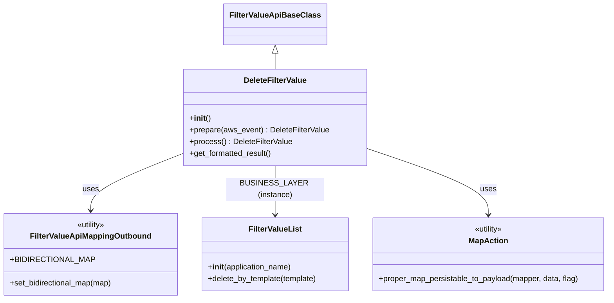

# Diagram: common/filter_service/filter_service/api/classes/DeleteFilterValue.py


> Auto-generated by Obscura crawlers

## Diagram 1



### SVG

<svg id="container" width="1251.2265625" xmlns="http://www.w3.org/2000/svg" class="classDiagram" height="590" viewBox="0 0 1251.2265625 590" role="graphics-document document" aria-roledescription="class"><style>#container{font-family:"trebuchet ms",verdana,arial,sans-serif;font-size:16px;fill:#333;}@keyframes edge-animation-frame{from{stroke-dashoffset:0;}}@keyframes dash{to{stroke-dashoffset:0;}}#container .edge-animation-slow{stroke-dasharray:9,5!important;stroke-dashoffset:900;animation:dash 50s linear infinite;stroke-linecap:round;}#container .edge-animation-fast{stroke-dasharray:9,5!important;stroke-dashoffset:900;animation:dash 20s linear infinite;stroke-linecap:round;}#container .error-icon{fill:#552222;}#container .error-text{fill:#552222;stroke:#552222;}#container .edge-thickness-normal{stroke-width:1px;}#container .edge-thickness-thick{stroke-width:3.5px;}#container .edge-pattern-solid{stroke-dasharray:0;}#container .edge-thickness-invisible{stroke-width:0;fill:none;}#container .edge-pattern-dashed{stroke-dasharray:3;}#container .edge-pattern-dotted{stroke-dasharray:2;}#container .marker{fill:#333333;stroke:#333333;}#container .marker.cross{stroke:#333333;}#container svg{font-family:"trebuchet ms",verdana,arial,sans-serif;font-size:16px;}#container p{margin:0;}#container g.classGroup text{fill:#9370DB;stroke:none;font-family:"trebuchet ms",verdana,arial,sans-serif;font-size:10px;}#container g.classGroup text .title{font-weight:bolder;}#container .nodeLabel,#container .edgeLabel{color:#131300;}#container .edgeLabel .label rect{fill:#ECECFF;}#container .label text{fill:#131300;}#container .labelBkg{background:#ECECFF;}#container .edgeLabel .label span{background:#ECECFF;}#container .classTitle{font-weight:bolder;}#container .node rect,#container .node circle,#container .node ellipse,#container .node polygon,#container .node path{fill:#ECECFF;stroke:#9370DB;stroke-width:1px;}#container .divider{stroke:#9370DB;stroke-width:1;}#container g.clickable{cursor:pointer;}#container g.classGroup rect{fill:#ECECFF;stroke:#9370DB;}#container g.classGroup line{stroke:#9370DB;stroke-width:1;}#container .classLabel .box{stroke:none;stroke-width:0;fill:#ECECFF;opacity:0.5;}#container .classLabel .label{fill:#9370DB;font-size:10px;}#container .relation{stroke:#333333;stroke-width:1;fill:none;}#container .dashed-line{stroke-dasharray:3;}#container .dotted-line{stroke-dasharray:1 2;}#container #compositionStart,#container .composition{fill:#333333!important;stroke:#333333!important;stroke-width:1;}#container #compositionEnd,#container .composition{fill:#333333!important;stroke:#333333!important;stroke-width:1;}#container #dependencyStart,#container .dependency{fill:#333333!important;stroke:#333333!important;stroke-width:1;}#container #dependencyStart,#container .dependency{fill:#333333!important;stroke:#333333!important;stroke-width:1;}#container #extensionStart,#container .extension{fill:transparent!important;stroke:#333333!important;stroke-width:1;}#container #extensionEnd,#container .extension{fill:transparent!important;stroke:#333333!important;stroke-width:1;}#container #aggregationStart,#container .aggregation{fill:transparent!important;stroke:#333333!important;stroke-width:1;}#container #aggregationEnd,#container .aggregation{fill:transparent!important;stroke:#333333!important;stroke-width:1;}#container #lollipopStart,#container .lollipop{fill:#ECECFF!important;stroke:#333333!important;stroke-width:1;}#container #lollipopEnd,#container .lollipop{fill:#ECECFF!important;stroke:#333333!important;stroke-width:1;}#container .edgeTerminals{font-size:11px;line-height:initial;}#container .classTitleText{text-anchor:middle;font-size:18px;fill:#333;}#container .label-icon{display:inline-block;height:1em;overflow:visible;vertical-align:-0.125em;}#container .node .label-icon path{fill:currentColor;stroke:revert;stroke-width:revert;}#container :root{--mermaid-font-family:"trebuchet ms",verdana,arial,sans-serif;}</style><g><defs><marker id="container_class-aggregationStart" class="marker aggregation class" refX="18" refY="7" markerWidth="190" markerHeight="240" orient="auto"><path d="M 18,7 L9,13 L1,7 L9,1 Z"></path></marker></defs><defs><marker id="container_class-aggregationEnd" class="marker aggregation class" refX="1" refY="7" markerWidth="20" markerHeight="28" orient="auto"><path d="M 18,7 L9,13 L1,7 L9,1 Z"></path></marker></defs><defs><marker id="container_class-extensionStart" class="marker extension class" refX="18" refY="7" markerWidth="190" markerHeight="240" orient="auto"><path d="M 1,7 L18,13 V 1 Z"></path></marker></defs><defs><marker id="container_class-extensionEnd" class="marker extension class" refX="1" refY="7" markerWidth="20" markerHeight="28" orient="auto"><path d="M 1,1 V 13 L18,7 Z"></path></marker></defs><defs><marker id="container_class-compositionStart" class="marker composition class" refX="18" refY="7" markerWidth="190" markerHeight="240" orient="auto"><path d="M 18,7 L9,13 L1,7 L9,1 Z"></path></marker></defs><defs><marker id="container_class-compositionEnd" class="marker composition class" refX="1" refY="7" markerWidth="20" markerHeight="28" orient="auto"><path d="M 18,7 L9,13 L1,7 L9,1 Z"></path></marker></defs><defs><marker id="container_class-dependencyStart" class="marker dependency class" refX="6" refY="7" markerWidth="190" markerHeight="240" orient="auto"><path d="M 5,7 L9,13 L1,7 L9,1 Z"></path></marker></defs><defs><marker id="container_class-dependencyEnd" class="marker dependency class" refX="13" refY="7" markerWidth="20" markerHeight="28" orient="auto"><path d="M 18,7 L9,13 L14,7 L9,1 Z"></path></marker></defs><defs><marker id="container_class-lollipopStart" class="marker lollipop class" refX="13" refY="7" markerWidth="190" markerHeight="240" orient="auto"><circle stroke="black" fill="transparent" cx="7" cy="7" r="6"></circle></marker></defs><defs><marker id="container_class-lollipopEnd" class="marker lollipop class" refX="1" refY="7" markerWidth="190" markerHeight="240" orient="auto"><circle stroke="black" fill="transparent" cx="7" cy="7" r="6"></circle></marker></defs><g class="root"><g class="clusters"></g><g class="edgePaths"><path d="M565.492,109.25L565.492,110.542C565.492,111.833,565.492,114.417,565.492,119.875C565.492,125.333,565.492,133.667,565.492,137.833L565.492,142" id="id_FilterValueApiBaseClass_DeleteFilterValue_1" class="edge-thickness-normal edge-pattern-solid relation" style=";;;" data-edge="true" data-et="edge" data-id="id_FilterValueApiBaseClass_DeleteFilterValue_1" data-points="W3sieCI6NTY1LjQ5MjE4NzUsInkiOjkyfSx7IngiOjU2NS40OTIxODc1LCJ5IjoxMTd9LHsieCI6NTY1LjQ5MjE4NzUsInkiOjE0Mn1d" marker-start="url(#container_class-extensionStart)"></path><path d="M379.383,307.686L347.142,319.238C314.901,330.79,250.419,353.895,218.178,370.614C185.938,387.333,185.938,397.667,185.938,402.833L185.938,408" id="id_DeleteFilterValue_FilterValueApiMappingOutbound_2" class="edge-thickness-normal edge-pattern-solid relation" style=";;;" data-edge="true" data-et="edge" data-id="id_DeleteFilterValue_FilterValueApiMappingOutbound_2" data-points="W3sieCI6Mzc5LjM4MjgxMjUsInkiOjMwNy42ODU3MTMxMDk1MjM5M30seyJ4IjoxODUuOTM3NSwieSI6Mzc3fSx7IngiOjE4NS45Mzc1LCJ5Ijo0MTR9XQ==" marker-end="url(#container_class-dependencyEnd)"></path><path d="M565.492,340L565.492,346.167C565.492,352.333,565.492,364.667,565.492,377.5C565.492,390.333,565.492,403.667,565.492,410.333L565.492,417" id="id_DeleteFilterValue_FilterValueList_3" class="edge-thickness-normal edge-pattern-solid relation" style=";;;" data-edge="true" data-et="edge" data-id="id_DeleteFilterValue_FilterValueList_3" data-points="W3sieCI6NTY1LjQ5MjE4NzUsInkiOjM0MH0seyJ4Ijo1NjUuNDkyMTg3NSwieSI6Mzc3fSx7IngiOjU2NS40OTIxODc1LCJ5Ijo0MjN9XQ==" marker-end="url(#container_class-dependencyEnd)"></path><path d="M751.602,298.567L793.863,311.639C836.124,324.711,920.646,350.856,962.907,370.595C1005.168,390.333,1005.168,403.667,1005.168,410.333L1005.168,417" id="id_DeleteFilterValue_MapAction_4" class="edge-thickness-normal edge-pattern-solid relation" style=";;;" data-edge="true" data-et="edge" data-id="id_DeleteFilterValue_MapAction_4" data-points="W3sieCI6NzUxLjYwMTU2MjUsInkiOjI5OC41NjcxMzQ4NzM4ODYxfSx7IngiOjEwMDUuMTY3OTY4NzUsInkiOjM3N30seyJ4IjoxMDA1LjE2Nzk2ODc1LCJ5Ijo0MjN9XQ==" marker-end="url(#container_class-dependencyEnd)"></path></g><g class="edgeLabels"><g class="edgeLabel"><g class="label" data-id="id_FilterValueApiBaseClass_DeleteFilterValue_1" transform="translate(0, 0)"><foreignObject width="0" height="0"><div xmlns="http://www.w3.org/1999/xhtml" class="labelBkg" style="display: table-cell; white-space: nowrap; line-height: 1.5; max-width: 200px; text-align: center;"><span class="edgeLabel"></span></div></foreignObject></g></g><g class="edgeLabel" transform="translate(185.9375, 377)"><g class="label" data-id="id_DeleteFilterValue_FilterValueApiMappingOutbound_2" transform="translate(-16.4921875, -12)"><foreignObject width="32.984375" height="24"><div xmlns="http://www.w3.org/1999/xhtml" class="labelBkg" style="display: table-cell; white-space: nowrap; line-height: 1.5; max-width: 200px; text-align: center;"><span class="edgeLabel"><p>uses</p></span></div></foreignObject></g></g><g class="edgeLabel" transform="translate(565.4921875, 377)"><g class="label" data-id="id_DeleteFilterValue_FilterValueList_3" transform="translate(-98.609375, -12)"><foreignObject width="197.21875" height="24"><div xmlns="http://www.w3.org/1999/xhtml" class="labelBkg" style="display: table-cell; white-space: nowrap; line-height: 1.5; max-width: 200px; text-align: center;"><span class="edgeLabel"><p>BUSINESS_LAYER (instance)</p></span></div></foreignObject></g></g><g class="edgeLabel" transform="translate(1005.16796875, 377)"><g class="label" data-id="id_DeleteFilterValue_MapAction_4" transform="translate(-16.4921875, -12)"><foreignObject width="32.984375" height="24"><div xmlns="http://www.w3.org/1999/xhtml" class="labelBkg" style="display: table-cell; white-space: nowrap; line-height: 1.5; max-width: 200px; text-align: center;"><span class="edgeLabel"><p>uses</p></span></div></foreignObject></g></g></g><g class="nodes"><g class="node default" id="classId-FilterValueApiBaseClass-0" transform="translate(565.4921875, 50)"><g class="basic label-container"><path d="M-98.8828125 -42 L98.8828125 -42 L98.8828125 42 L-98.8828125 42" stroke="none" stroke-width="0" fill="#ECECFF" style=""></path><path d="M-98.8828125 -42 C-25.054415896430413 -42, 48.773980707139174 -42, 98.8828125 -42 M-98.8828125 -42 C-20.129198594488756 -42, 58.62441531102249 -42, 98.8828125 -42 M98.8828125 -42 C98.8828125 -15.198230081481025, 98.8828125 11.60353983703795, 98.8828125 42 M98.8828125 -42 C98.8828125 -21.279349678964103, 98.8828125 -0.5586993579282051, 98.8828125 42 M98.8828125 42 C34.66488270478567 42, -29.553047090428663 42, -98.8828125 42 M98.8828125 42 C38.29165614541961 42, -22.299500209160783 42, -98.8828125 42 M-98.8828125 42 C-98.8828125 17.172970029218753, -98.8828125 -7.654059941562494, -98.8828125 -42 M-98.8828125 42 C-98.8828125 15.572953516770749, -98.8828125 -10.854092966458502, -98.8828125 -42" stroke="#9370DB" stroke-width="1.3" fill="none" stroke-dasharray="0 0" style=""></path></g><g class="annotation-group text" transform="translate(0, -18)"></g><g class="label-group text" transform="translate(-86.8828125, -18)"><g class="label" style="font-weight: bolder" transform="translate(0,-12)"><foreignObject width="173.765625" height="24"><div xmlns="http://www.w3.org/1999/xhtml" style="display: table-cell; white-space: nowrap; line-height: 1.5; max-width: 221px; text-align: center;"><span class="nodeLabel markdown-node-label" style=""><p>FilterValueApiBaseClass</p></span></div></foreignObject></g></g><g class="members-group text" transform="translate(-86.8828125, 30)"></g><g class="methods-group text" transform="translate(-86.8828125, 60)"></g><g class="divider" style=""><path d="M-98.8828125 6 C-20.91102921670152 6, 57.06075406659696 6, 98.8828125 6 M-98.8828125 6 C-32.496642819806226 6, 33.88952686038755 6, 98.8828125 6" stroke="#9370DB" stroke-width="1.3" fill="none" stroke-dasharray="0 0" style=""></path></g><g class="divider" style=""><path d="M-98.8828125 24 C-44.03942070804991 24, 10.80397108390018 24, 98.8828125 24 M-98.8828125 24 C-38.618146173801044 24, 21.646520152397912 24, 98.8828125 24" stroke="#9370DB" stroke-width="1.3" fill="none" stroke-dasharray="0 0" style=""></path></g></g><g class="node default" id="classId-FilterValueApiMappingOutbound-1" transform="translate(185.9375, 498)"><g class="basic label-container"><path d="M-177.9375 -84 L177.9375 -84 L177.9375 84 L-177.9375 84" stroke="none" stroke-width="0" fill="#ECECFF" style=""></path><path d="M-177.9375 -84 C-99.9309504877641 -84, -21.924400975528187 -84, 177.9375 -84 M-177.9375 -84 C-100.15462252476763 -84, -22.371745049535264 -84, 177.9375 -84 M177.9375 -84 C177.9375 -22.685710462337752, 177.9375 38.628579075324495, 177.9375 84 M177.9375 -84 C177.9375 -32.90767277689857, 177.9375 18.184654446202856, 177.9375 84 M177.9375 84 C70.0921080734207 84, -37.75328385315859 84, -177.9375 84 M177.9375 84 C76.80253656537681 84, -24.332426869246376 84, -177.9375 84 M-177.9375 84 C-177.9375 41.134481867396744, -177.9375 -1.7310362652065123, -177.9375 -84 M-177.9375 84 C-177.9375 31.36080971841244, -177.9375 -21.27838056317512, -177.9375 -84" stroke="#9370DB" stroke-width="1.3" fill="none" stroke-dasharray="0 0" style=""></path></g><g class="annotation-group text" transform="translate(-30.3125, -60)"><g class="label" style="" transform="translate(0,-12)"><foreignObject width="60.625" height="24"><div xmlns="http://www.w3.org/1999/xhtml" style="display: table-cell; white-space: nowrap; line-height: 1.5; max-width: 111px; text-align: center;"><span class="nodeLabel markdown-node-label" style=""><p>«utility»</p></span></div></foreignObject></g></g><g class="label-group text" transform="translate(-118.671875, -36)"><g class="label" style="font-weight: bolder" transform="translate(0,-12)"><foreignObject width="237.34375" height="24"><div xmlns="http://www.w3.org/1999/xhtml" style="display: table-cell; white-space: nowrap; line-height: 1.5; max-width: 285px; text-align: center;"><span class="nodeLabel markdown-node-label" style=""><p>FilterValueApiMappingOutbound</p></span></div></foreignObject></g></g><g class="members-group text" transform="translate(-165.9375, 12)"><g class="label" style="" transform="translate(0,-12)"><foreignObject width="155.671875" height="24"><div xmlns="http://www.w3.org/1999/xhtml" style="display: table-cell; white-space: nowrap; line-height: 1.5; max-width: 213px; text-align: center;"><span class="nodeLabel markdown-node-label" style=""><p>+BIDIRECTIONAL_MAP</p></span></div></foreignObject></g></g><g class="methods-group text" transform="translate(-165.9375, 60)"><g class="label" style="" transform="translate(0,-12)"><foreignObject width="213.203125" height="24"><div xmlns="http://www.w3.org/1999/xhtml" style="display: table-cell; white-space: nowrap; line-height: 1.5; max-width: 271px; text-align: center;"><span class="nodeLabel markdown-node-label" style=""><p>+set_bidirectional_map(map)</p></span></div></foreignObject></g></g><g class="divider" style=""><path d="M-177.9375 -12 C-83.72987028248095 -12, 10.47775943503811 -12, 177.9375 -12 M-177.9375 -12 C-101.92676361758384 -12, -25.91602723516769 -12, 177.9375 -12" stroke="#9370DB" stroke-width="1.3" fill="none" stroke-dasharray="0 0" style=""></path></g><g class="divider" style=""><path d="M-177.9375 36 C-93.44690740504349 36, -8.95631481008698 36, 177.9375 36 M-177.9375 36 C-80.04038332143881 36, 17.85673335712238 36, 177.9375 36" stroke="#9370DB" stroke-width="1.3" fill="none" stroke-dasharray="0 0" style=""></path></g></g><g class="node default" id="classId-FilterValueList-2" transform="translate(565.4921875, 498)"><g class="basic label-container"><path d="M-151.6171875 -75 L151.6171875 -75 L151.6171875 75 L-151.6171875 75" stroke="none" stroke-width="0" fill="#ECECFF" style=""></path><path d="M-151.6171875 -75 C-74.21228162612088 -75, 3.192624247758232 -75, 151.6171875 -75 M-151.6171875 -75 C-88.34245326918355 -75, -25.067719038367116 -75, 151.6171875 -75 M151.6171875 -75 C151.6171875 -38.145606939560516, 151.6171875 -1.291213879121031, 151.6171875 75 M151.6171875 -75 C151.6171875 -22.489285834075964, 151.6171875 30.02142833184807, 151.6171875 75 M151.6171875 75 C53.03518453352987 75, -45.546818432940256 75, -151.6171875 75 M151.6171875 75 C86.05535238199235 75, 20.4935172639847 75, -151.6171875 75 M-151.6171875 75 C-151.6171875 30.507965429426513, -151.6171875 -13.984069141146975, -151.6171875 -75 M-151.6171875 75 C-151.6171875 18.678699526701642, -151.6171875 -37.642600946596716, -151.6171875 -75" stroke="#9370DB" stroke-width="1.3" fill="none" stroke-dasharray="0 0" style=""></path></g><g class="annotation-group text" transform="translate(0, -51)"></g><g class="label-group text" transform="translate(-52.09375, -51)"><g class="label" style="font-weight: bolder" transform="translate(0,-12)"><foreignObject width="104.1875" height="24"><div xmlns="http://www.w3.org/1999/xhtml" style="display: table-cell; white-space: nowrap; line-height: 1.5; max-width: 152px; text-align: center;"><span class="nodeLabel markdown-node-label" style=""><p>FilterValueList</p></span></div></foreignObject></g></g><g class="members-group text" transform="translate(-139.6171875, -3)"></g><g class="methods-group text" transform="translate(-139.6171875, 27)"><g class="label" style="" transform="translate(0,-12)"><foreignObject width="173.734375" height="24"><div xmlns="http://www.w3.org/1999/xhtml" style="display: table-cell; white-space: nowrap; line-height: 1.5; max-width: 263px; text-align: center;"><span class="nodeLabel markdown-node-label" style=""><p>+<strong>init</strong>(application_name)</p></span></div></foreignObject></g><g class="label" style="" transform="translate(0,12)"><foreignObject width="227.140625" height="24"><div xmlns="http://www.w3.org/1999/xhtml" style="display: table-cell; white-space: nowrap; line-height: 1.5; max-width: 285px; text-align: center;"><span class="nodeLabel markdown-node-label" style=""><p>+delete_by_template(template)</p></span></div></foreignObject></g></g><g class="divider" style=""><path d="M-151.6171875 -27 C-53.30456385080694 -27, 45.008059798386114 -27, 151.6171875 -27 M-151.6171875 -27 C-44.05437135829361 -27, 63.508444783412784 -27, 151.6171875 -27" stroke="#9370DB" stroke-width="1.3" fill="none" stroke-dasharray="0 0" style=""></path></g><g class="divider" style=""><path d="M-151.6171875 -3 C-32.68529944664451 -3, 86.24658860671099 -3, 151.6171875 -3 M-151.6171875 -3 C-56.9263770459515 -3, 37.764433408097005 -3, 151.6171875 -3" stroke="#9370DB" stroke-width="1.3" fill="none" stroke-dasharray="0 0" style=""></path></g></g><g class="node default" id="classId-MapAction-3" transform="translate(1005.16796875, 498)"><g class="basic label-container"><path d="M-238.05859375 -75 L238.05859375 -75 L238.05859375 75 L-238.05859375 75" stroke="none" stroke-width="0" fill="#ECECFF" style=""></path><path d="M-238.05859375 -75 C-103.00693818876047 -75, 32.044717372479056 -75, 238.05859375 -75 M-238.05859375 -75 C-49.77471359961035 -75, 138.5091665507793 -75, 238.05859375 -75 M238.05859375 -75 C238.05859375 -19.148523249511577, 238.05859375 36.70295350097685, 238.05859375 75 M238.05859375 -75 C238.05859375 -31.24736517419433, 238.05859375 12.505269651611343, 238.05859375 75 M238.05859375 75 C63.36390200583108 75, -111.33078973833784 75, -238.05859375 75 M238.05859375 75 C64.06361954076098 75, -109.93135466847804 75, -238.05859375 75 M-238.05859375 75 C-238.05859375 27.755609185150348, -238.05859375 -19.488781629699304, -238.05859375 -75 M-238.05859375 75 C-238.05859375 17.55234651058852, -238.05859375 -39.89530697882296, -238.05859375 -75" stroke="#9370DB" stroke-width="1.3" fill="none" stroke-dasharray="0 0" style=""></path></g><g class="annotation-group text" transform="translate(-30.3125, -51)"><g class="label" style="" transform="translate(0,-12)"><foreignObject width="60.625" height="24"><div xmlns="http://www.w3.org/1999/xhtml" style="display: table-cell; white-space: nowrap; line-height: 1.5; max-width: 111px; text-align: center;"><span class="nodeLabel markdown-node-label" style=""><p>«utility»</p></span></div></foreignObject></g></g><g class="label-group text" transform="translate(-38.6328125, -27)"><g class="label" style="font-weight: bolder" transform="translate(0,-12)"><foreignObject width="77.265625" height="24"><div xmlns="http://www.w3.org/1999/xhtml" style="display: table-cell; white-space: nowrap; line-height: 1.5; max-width: 126px; text-align: center;"><span class="nodeLabel markdown-node-label" style=""><p>MapAction</p></span></div></foreignObject></g></g><g class="members-group text" transform="translate(-226.05859375, 21)"></g><g class="methods-group text" transform="translate(-226.05859375, 51)"><g class="label" style="" transform="translate(0,-12)"><foreignObject width="413.484375" height="24"><div xmlns="http://www.w3.org/1999/xhtml" style="display: table-cell; white-space: nowrap; line-height: 1.5; max-width: 471px; text-align: center;"><span class="nodeLabel markdown-node-label" style=""><p>+proper_map_persistable_to_payload(mapper, data, flag)</p></span></div></foreignObject></g></g><g class="divider" style=""><path d="M-238.05859375 -3 C-117.0136644288291 -3, 4.031264892341795 -3, 238.05859375 -3 M-238.05859375 -3 C-121.95027767121094 -3, -5.841961592421882 -3, 238.05859375 -3" stroke="#9370DB" stroke-width="1.3" fill="none" stroke-dasharray="0 0" style=""></path></g><g class="divider" style=""><path d="M-238.05859375 21 C-119.95625100685582 21, -1.853908263711645 21, 238.05859375 21 M-238.05859375 21 C-88.3152401849351 21, 61.42811338012979 21, 238.05859375 21" stroke="#9370DB" stroke-width="1.3" fill="none" stroke-dasharray="0 0" style=""></path></g></g><g class="node default" id="classId-DeleteFilterValue-4" transform="translate(565.4921875, 241)"><g class="basic label-container"><path d="M-186.109375 -99 L186.109375 -99 L186.109375 99 L-186.109375 99" stroke="none" stroke-width="0" fill="#ECECFF" style=""></path><path d="M-186.109375 -99 C-89.66479790184971 -99, 6.779779196300581 -99, 186.109375 -99 M-186.109375 -99 C-74.1908839343983 -99, 37.7276071312034 -99, 186.109375 -99 M186.109375 -99 C186.109375 -28.891769454315735, 186.109375 41.21646109136853, 186.109375 99 M186.109375 -99 C186.109375 -52.08044596394114, 186.109375 -5.160891927882275, 186.109375 99 M186.109375 99 C56.58693237634833 99, -72.93551024730334 99, -186.109375 99 M186.109375 99 C103.40359524549717 99, 20.697815490994344 99, -186.109375 99 M-186.109375 99 C-186.109375 38.13218879620137, -186.109375 -22.735622407597262, -186.109375 -99 M-186.109375 99 C-186.109375 43.43695016509513, -186.109375 -12.126099669809733, -186.109375 -99" stroke="#9370DB" stroke-width="1.3" fill="none" stroke-dasharray="0 0" style=""></path></g><g class="annotation-group text" transform="translate(0, -75)"></g><g class="label-group text" transform="translate(-62.515625, -75)"><g class="label" style="font-weight: bolder" transform="translate(0,-12)"><foreignObject width="125.03125" height="24"><div xmlns="http://www.w3.org/1999/xhtml" style="display: table-cell; white-space: nowrap; line-height: 1.5; max-width: 173px; text-align: center;"><span class="nodeLabel markdown-node-label" style=""><p>DeleteFilterValue</p></span></div></foreignObject></g></g><g class="members-group text" transform="translate(-174.109375, -27)"></g><g class="methods-group text" transform="translate(-174.109375, 3)"><g class="label" style="" transform="translate(0,-12)"><foreignObject width="42.796875" height="24"><div xmlns="http://www.w3.org/1999/xhtml" style="display: table-cell; white-space: nowrap; line-height: 1.5; max-width: 132px; text-align: center;"><span class="nodeLabel markdown-node-label" style=""><p>+<strong>init</strong>()</p></span></div></foreignObject></g><g class="label" style="" transform="translate(0,12)"><foreignObject width="285.703125" height="24"><div xmlns="http://www.w3.org/1999/xhtml" style="display: table-cell; white-space: nowrap; line-height: 1.5; max-width: 343px; text-align: center;"><span class="nodeLabel markdown-node-label" style=""><p>+prepare(aws_event) : DeleteFilterValue</p></span></div></foreignObject></g><g class="label" style="" transform="translate(0,36)"><foreignObject width="209.109375" height="24"><div xmlns="http://www.w3.org/1999/xhtml" style="display: table-cell; white-space: nowrap; line-height: 1.5; max-width: 266px; text-align: center;"><span class="nodeLabel markdown-node-label" style=""><p>+process() : DeleteFilterValue</p></span></div></foreignObject></g><g class="label" style="" transform="translate(0,60)"><foreignObject width="171.640625" height="24"><div xmlns="http://www.w3.org/1999/xhtml" style="display: table-cell; white-space: nowrap; line-height: 1.5; max-width: 229px; text-align: center;"><span class="nodeLabel markdown-node-label" style=""><p>+get_formatted_result()</p></span></div></foreignObject></g></g><g class="divider" style=""><path d="M-186.109375 -51 C-98.80504708141028 -51, -11.500719162820559 -51, 186.109375 -51 M-186.109375 -51 C-92.40131422250717 -51, 1.306746554985665 -51, 186.109375 -51" stroke="#9370DB" stroke-width="1.3" fill="none" stroke-dasharray="0 0" style=""></path></g><g class="divider" style=""><path d="M-186.109375 -27 C-71.85446532409311 -27, 42.400444351813775 -27, 186.109375 -27 M-186.109375 -27 C-105.93872003364442 -27, -25.76806506728883 -27, 186.109375 -27" stroke="#9370DB" stroke-width="1.3" fill="none" stroke-dasharray="0 0" style=""></path></g></g></g></g></g></svg>

## Diagram 2

```mermaid
flowchart TD
    A[AWS Event] --> B[DeleteFilterValue.prepare(aws_event)]
    B --> C[load_from_aws_event -> set internal template/state]
    C --> D[DeleteFilterValue.process()]
    D --> E[BUSINESS_LAYER.delete_by_template(template)]
    E --> F[DeleteFilterValue.set_data(result)]
    F --> G[DeleteFilterValue.get_formatted_result()]
    G --> H[FilterValueApiMappingOutbound.set_bidirectional_map(BIDIRECTIONAL_MAP)]
    H --> I[MapAction.proper_map_persistable_to_payload(mapping, data, False)]
    I --> J[Payload (formatted result)]
```

> SVG rendering failed for this diagram.
