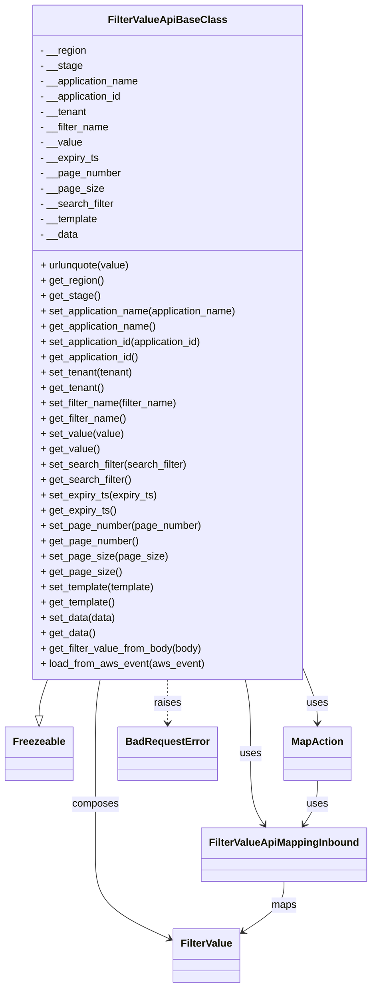

# Diagram: common/filter_service/filter_service/api/classes/FilterValueApiBaseClass.py


> Auto-generated by Obscura crawlers

## Diagram 1



### SVG

<svg id="container" width="563.9453125" xmlns="http://www.w3.org/2000/svg" class="classDiagram" height="1546" viewBox="0 0 563.9453125 1546" role="graphics-document document" aria-roledescription="class"><style>#container{font-family:"trebuchet ms",verdana,arial,sans-serif;font-size:16px;fill:#333;}@keyframes edge-animation-frame{from{stroke-dashoffset:0;}}@keyframes dash{to{stroke-dashoffset:0;}}#container .edge-animation-slow{stroke-dasharray:9,5!important;stroke-dashoffset:900;animation:dash 50s linear infinite;stroke-linecap:round;}#container .edge-animation-fast{stroke-dasharray:9,5!important;stroke-dashoffset:900;animation:dash 20s linear infinite;stroke-linecap:round;}#container .error-icon{fill:#552222;}#container .error-text{fill:#552222;stroke:#552222;}#container .edge-thickness-normal{stroke-width:1px;}#container .edge-thickness-thick{stroke-width:3.5px;}#container .edge-pattern-solid{stroke-dasharray:0;}#container .edge-thickness-invisible{stroke-width:0;fill:none;}#container .edge-pattern-dashed{stroke-dasharray:3;}#container .edge-pattern-dotted{stroke-dasharray:2;}#container .marker{fill:#333333;stroke:#333333;}#container .marker.cross{stroke:#333333;}#container svg{font-family:"trebuchet ms",verdana,arial,sans-serif;font-size:16px;}#container p{margin:0;}#container g.classGroup text{fill:#9370DB;stroke:none;font-family:"trebuchet ms",verdana,arial,sans-serif;font-size:10px;}#container g.classGroup text .title{font-weight:bolder;}#container .nodeLabel,#container .edgeLabel{color:#131300;}#container .edgeLabel .label rect{fill:#ECECFF;}#container .label text{fill:#131300;}#container .labelBkg{background:#ECECFF;}#container .edgeLabel .label span{background:#ECECFF;}#container .classTitle{font-weight:bolder;}#container .node rect,#container .node circle,#container .node ellipse,#container .node polygon,#container .node path{fill:#ECECFF;stroke:#9370DB;stroke-width:1px;}#container .divider{stroke:#9370DB;stroke-width:1;}#container g.clickable{cursor:pointer;}#container g.classGroup rect{fill:#ECECFF;stroke:#9370DB;}#container g.classGroup line{stroke:#9370DB;stroke-width:1;}#container .classLabel .box{stroke:none;stroke-width:0;fill:#ECECFF;opacity:0.5;}#container .classLabel .label{fill:#9370DB;font-size:10px;}#container .relation{stroke:#333333;stroke-width:1;fill:none;}#container .dashed-line{stroke-dasharray:3;}#container .dotted-line{stroke-dasharray:1 2;}#container #compositionStart,#container .composition{fill:#333333!important;stroke:#333333!important;stroke-width:1;}#container #compositionEnd,#container .composition{fill:#333333!important;stroke:#333333!important;stroke-width:1;}#container #dependencyStart,#container .dependency{fill:#333333!important;stroke:#333333!important;stroke-width:1;}#container #dependencyStart,#container .dependency{fill:#333333!important;stroke:#333333!important;stroke-width:1;}#container #extensionStart,#container .extension{fill:transparent!important;stroke:#333333!important;stroke-width:1;}#container #extensionEnd,#container .extension{fill:transparent!important;stroke:#333333!important;stroke-width:1;}#container #aggregationStart,#container .aggregation{fill:transparent!important;stroke:#333333!important;stroke-width:1;}#container #aggregationEnd,#container .aggregation{fill:transparent!important;stroke:#333333!important;stroke-width:1;}#container #lollipopStart,#container .lollipop{fill:#ECECFF!important;stroke:#333333!important;stroke-width:1;}#container #lollipopEnd,#container .lollipop{fill:#ECECFF!important;stroke:#333333!important;stroke-width:1;}#container .edgeTerminals{font-size:11px;line-height:initial;}#container .classTitleText{text-anchor:middle;font-size:18px;fill:#333;}#container .label-icon{display:inline-block;height:1em;overflow:visible;vertical-align:-0.125em;}#container .node .label-icon path{fill:currentColor;stroke:revert;stroke-width:revert;}#container :root{--mermaid-font-family:"trebuchet ms",verdana,arial,sans-serif;}</style><g><defs><marker id="container_class-aggregationStart" class="marker aggregation class" refX="18" refY="7" markerWidth="190" markerHeight="240" orient="auto"><path d="M 18,7 L9,13 L1,7 L9,1 Z"></path></marker></defs><defs><marker id="container_class-aggregationEnd" class="marker aggregation class" refX="1" refY="7" markerWidth="20" markerHeight="28" orient="auto"><path d="M 18,7 L9,13 L1,7 L9,1 Z"></path></marker></defs><defs><marker id="container_class-extensionStart" class="marker extension class" refX="18" refY="7" markerWidth="190" markerHeight="240" orient="auto"><path d="M 1,7 L18,13 V 1 Z"></path></marker></defs><defs><marker id="container_class-extensionEnd" class="marker extension class" refX="1" refY="7" markerWidth="20" markerHeight="28" orient="auto"><path d="M 1,1 V 13 L18,7 Z"></path></marker></defs><defs><marker id="container_class-compositionStart" class="marker composition class" refX="18" refY="7" markerWidth="190" markerHeight="240" orient="auto"><path d="M 18,7 L9,13 L1,7 L9,1 Z"></path></marker></defs><defs><marker id="container_class-compositionEnd" class="marker composition class" refX="1" refY="7" markerWidth="20" markerHeight="28" orient="auto"><path d="M 18,7 L9,13 L1,7 L9,1 Z"></path></marker></defs><defs><marker id="container_class-dependencyStart" class="marker dependency class" refX="6" refY="7" markerWidth="190" markerHeight="240" orient="auto"><path d="M 5,7 L9,13 L1,7 L9,1 Z"></path></marker></defs><defs><marker id="container_class-dependencyEnd" class="marker dependency class" refX="13" refY="7" markerWidth="20" markerHeight="28" orient="auto"><path d="M 18,7 L9,13 L14,7 L9,1 Z"></path></marker></defs><defs><marker id="container_class-lollipopStart" class="marker lollipop class" refX="13" refY="7" markerWidth="190" markerHeight="240" orient="auto"><circle stroke="black" fill="transparent" cx="7" cy="7" r="6"></circle></marker></defs><defs><marker id="container_class-lollipopEnd" class="marker lollipop class" refX="1" refY="7" markerWidth="190" markerHeight="240" orient="auto"><circle stroke="black" fill="transparent" cx="7" cy="7" r="6"></circle></marker></defs><g class="root"><g class="clusters"></g><g class="edgePaths"><path d="M71.996,1064L69.863,1070.167C67.729,1076.333,63.462,1088.667,61.329,1098.125C59.195,1107.583,59.195,1114.167,59.195,1117.458L59.195,1120.75" id="id_FilterValueApiBaseClass_Freezeable_1" class="edge-thickness-normal edge-pattern-solid relation" style=";;;" data-edge="true" data-et="edge" data-id="id_FilterValueApiBaseClass_Freezeable_1" data-points="W3sieCI6NzEuOTk2NDMyNTIyMTIzODgsInkiOjEwNjR9LHsieCI6NTkuMTk1MzEyNSwieSI6MTEwMX0seyJ4Ijo1OS4xOTUzMTI1LCJ5IjoxMTM4fV0=" marker-end="url(#container_class-extensionEnd)"></path><path d="M152.547,1064L151.354,1070.167C150.162,1076.333,147.776,1088.667,146.583,1108C145.391,1127.333,145.391,1153.667,145.391,1180C145.391,1206.333,145.391,1232.667,145.391,1259C145.391,1285.333,145.391,1311.667,145.391,1338C145.391,1364.333,145.391,1390.667,164.12,1412.61C182.849,1434.553,220.308,1452.106,239.037,1460.882L257.766,1469.658" id="id_FilterValueApiBaseClass_FilterValue_2" class="edge-thickness-normal edge-pattern-solid relation" style=";;;" data-edge="true" data-et="edge" data-id="id_FilterValueApiBaseClass_FilterValue_2" data-points="W3sieCI6MTUyLjU0NzA5NjIzODkzODA1LCJ5IjoxMDY0fSx7IngiOjE0NS4zOTA2MjUsInkiOjExMDF9LHsieCI6MTQ1LjM5MDYyNSwieSI6MTE4MH0seyJ4IjoxNDUuMzkwNjI1LCJ5IjoxMjU5fSx7IngiOjE0NS4zOTA2MjUsInkiOjEzMzh9LHsieCI6MTQ1LjM5MDYyNSwieSI6MTQxN30seyJ4IjoyNjMuMTk5MjE4NzUsInkiOjE0NzIuMjA0MjY3OTM5NDc5N31d" marker-end="url(#container_class-dependencyEnd)"></path><path d="M372.209,1064L373.582,1070.167C374.954,1076.333,377.7,1088.667,379.073,1108C380.445,1127.333,380.445,1153.667,380.445,1180C380.445,1206.333,380.445,1232.667,383.888,1251.16C387.331,1269.654,394.218,1280.307,397.661,1285.634L401.104,1290.961" id="id_FilterValueApiBaseClass_FilterValueApiMappingInbound_3" class="edge-thickness-normal edge-pattern-solid relation" style=";;;" data-edge="true" data-et="edge" data-id="id_FilterValueApiBaseClass_FilterValueApiMappingInbound_3" data-points="W3sieCI6MzcyLjIwODgyMTkwMjY1NDg1LCJ5IjoxMDY0fSx7IngiOjM4MC40NDUzMTI1LCJ5IjoxMTAxfSx7IngiOjM4MC40NDUzMTI1LCJ5IjoxMTgwfSx7IngiOjM4MC40NDUzMTI1LCJ5IjoxMjU5fSx7IngiOjQwNC4zNjA2NjA2MDEyNjU4LCJ5IjoxMjk2fV0=" marker-end="url(#container_class-dependencyEnd)"></path><path d="M467.34,1063.241L469.878,1069.534C472.417,1075.827,477.493,1088.414,480.032,1099.874C482.57,1111.333,482.57,1121.667,482.57,1126.833L482.57,1132" id="id_FilterValueApiBaseClass_MapAction_4" class="edge-thickness-normal edge-pattern-solid relation" style=";;;" data-edge="true" data-et="edge" data-id="id_FilterValueApiBaseClass_MapAction_4" data-points="W3sieCI6NDY3LjMzOTg0Mzc1LCJ5IjoxMDYzLjI0MTAwOTkwNzA5OTR9LHsieCI6NDgyLjU3MDMxMjUsInkiOjExMDF9LHsieCI6NDgyLjU3MDMxMjUsInkiOjExMzh9XQ==" marker-end="url(#container_class-dependencyEnd)"></path><path d="M254.672,1064L254.672,1070.167C254.672,1076.333,254.672,1088.667,254.672,1100C254.672,1111.333,254.672,1121.667,254.672,1126.833L254.672,1132" id="id_FilterValueApiBaseClass_BadRequestError_5" class="edge-thickness-normal edge-pattern-dashed relation" style=";;;" data-edge="true" data-et="edge" data-id="id_FilterValueApiBaseClass_BadRequestError_5" data-points="W3sieCI6MjU0LjY3MTg3NSwieSI6MTA2NH0seyJ4IjoyNTQuNjcxODc1LCJ5IjoxMTAxfSx7IngiOjI1NC42NzE4NzUsInkiOjExMzh9XQ==" marker-end="url(#container_class-dependencyEnd)"></path><path d="M431.508,1380L431.508,1386.167C431.508,1392.333,431.508,1404.667,421.213,1417.753C410.919,1430.839,390.33,1444.679,380.036,1451.599L369.741,1458.518" id="id_FilterValueApiMappingInbound_FilterValue_6" class="edge-thickness-normal edge-pattern-solid relation" style=";;;" data-edge="true" data-et="edge" data-id="id_FilterValueApiMappingInbound_FilterValue_6" data-points="W3sieCI6NDMxLjUwNzgxMjUsInkiOjEzODB9LHsieCI6NDMxLjUwNzgxMjUsInkiOjE0MTd9LHsieCI6MzY0Ljc2MTcxODc1LCJ5IjoxNDYxLjg2NTY1NjI2MzUwMjZ9XQ==" marker-end="url(#container_class-dependencyEnd)"></path><path d="M482.57,1222L482.57,1228.167C482.57,1234.333,482.57,1246.667,479.127,1258.16C475.684,1269.654,468.798,1280.307,465.355,1285.634L461.912,1290.961" id="id_MapAction_FilterValueApiMappingInbound_7" class="edge-thickness-normal edge-pattern-solid relation" style=";;;" data-edge="true" data-et="edge" data-id="id_MapAction_FilterValueApiMappingInbound_7" data-points="W3sieCI6NDgyLjU3MDMxMjUsInkiOjEyMjJ9LHsieCI6NDgyLjU3MDMxMjUsInkiOjEyNTl9LHsieCI6NDU4LjY1NDk2NDM5ODczNDIsInkiOjEyOTZ9XQ==" marker-end="url(#container_class-dependencyEnd)"></path></g><g class="edgeLabels"><g class="edgeLabel"><g class="label" data-id="id_FilterValueApiBaseClass_Freezeable_1" transform="translate(0, 0)"><foreignObject width="0" height="0"><div xmlns="http://www.w3.org/1999/xhtml" class="labelBkg" style="display: table-cell; white-space: nowrap; line-height: 1.5; max-width: 200px; text-align: center;"><span class="edgeLabel"></span></div></foreignObject></g></g><g class="edgeLabel" transform="translate(145.390625, 1259)"><g class="label" data-id="id_FilterValueApiBaseClass_FilterValue_2" transform="translate(-36.453125, -12)"><foreignObject width="72.90625" height="24"><div xmlns="http://www.w3.org/1999/xhtml" class="labelBkg" style="display: table-cell; white-space: nowrap; line-height: 1.5; max-width: 200px; text-align: center;"><span class="edgeLabel"><p>composes</p></span></div></foreignObject></g></g><g class="edgeLabel" transform="translate(380.4453125, 1180)"><g class="label" data-id="id_FilterValueApiBaseClass_FilterValueApiMappingInbound_3" transform="translate(-16.4921875, -12)"><foreignObject width="32.984375" height="24"><div xmlns="http://www.w3.org/1999/xhtml" class="labelBkg" style="display: table-cell; white-space: nowrap; line-height: 1.5; max-width: 200px; text-align: center;"><span class="edgeLabel"><p>uses</p></span></div></foreignObject></g></g><g class="edgeLabel" transform="translate(482.5703125, 1101)"><g class="label" data-id="id_FilterValueApiBaseClass_MapAction_4" transform="translate(-16.4921875, -12)"><foreignObject width="32.984375" height="24"><div xmlns="http://www.w3.org/1999/xhtml" class="labelBkg" style="display: table-cell; white-space: nowrap; line-height: 1.5; max-width: 200px; text-align: center;"><span class="edgeLabel"><p>uses</p></span></div></foreignObject></g></g><g class="edgeLabel" transform="translate(254.671875, 1101)"><g class="label" data-id="id_FilterValueApiBaseClass_BadRequestError_5" transform="translate(-21.25, -12)"><foreignObject width="42.5" height="24"><div xmlns="http://www.w3.org/1999/xhtml" class="labelBkg" style="display: table-cell; white-space: nowrap; line-height: 1.5; max-width: 200px; text-align: center;"><span class="edgeLabel"><p>raises</p></span></div></foreignObject></g></g><g class="edgeLabel" transform="translate(431.5078125, 1417)"><g class="label" data-id="id_FilterValueApiMappingInbound_FilterValue_6" transform="translate(-19.703125, -12)"><foreignObject width="39.40625" height="24"><div xmlns="http://www.w3.org/1999/xhtml" class="labelBkg" style="display: table-cell; white-space: nowrap; line-height: 1.5; max-width: 200px; text-align: center;"><span class="edgeLabel"><p>maps</p></span></div></foreignObject></g></g><g class="edgeLabel" transform="translate(482.5703125, 1259)"><g class="label" data-id="id_MapAction_FilterValueApiMappingInbound_7" transform="translate(-16.4921875, -12)"><foreignObject width="32.984375" height="24"><div xmlns="http://www.w3.org/1999/xhtml" class="labelBkg" style="display: table-cell; white-space: nowrap; line-height: 1.5; max-width: 200px; text-align: center;"><span class="edgeLabel"><p>uses</p></span></div></foreignObject></g></g></g><g class="nodes"><g class="node default" id="classId-FilterValueApiBaseClass-0" transform="translate(254.671875, 536)"><g class="basic label-container"><path d="M-212.66796875 -528 L212.66796875 -528 L212.66796875 528 L-212.66796875 528" stroke="none" stroke-width="0" fill="#ECECFF" style=""></path><path d="M-212.66796875 -528 C-72.65769108969786 -528, 67.35258657060427 -528, 212.66796875 -528 M-212.66796875 -528 C-67.43284975987211 -528, 77.80226923025577 -528, 212.66796875 -528 M212.66796875 -528 C212.66796875 -161.88699288207846, 212.66796875 204.22601423584308, 212.66796875 528 M212.66796875 -528 C212.66796875 -110.8763157425933, 212.66796875 306.2473685148134, 212.66796875 528 M212.66796875 528 C55.78409382206942 528, -101.09978110586115 528, -212.66796875 528 M212.66796875 528 C56.97405302506772 528, -98.71986269986456 528, -212.66796875 528 M-212.66796875 528 C-212.66796875 165.7366091061487, -212.66796875 -196.5267817877026, -212.66796875 -528 M-212.66796875 528 C-212.66796875 187.8657302534421, -212.66796875 -152.26853949311578, -212.66796875 -528" stroke="#9370DB" stroke-width="1.3" fill="none" stroke-dasharray="0 0" style=""></path></g><g class="annotation-group text" transform="translate(0, -504)"></g><g class="label-group text" transform="translate(-86.8828125, -504)"><g class="label" style="font-weight: bolder" transform="translate(0,-12)"><foreignObject width="173.765625" height="24"><div xmlns="http://www.w3.org/1999/xhtml" style="display: table-cell; white-space: nowrap; line-height: 1.5; max-width: 221px; text-align: center;"><span class="nodeLabel markdown-node-label" style=""><p>FilterValueApiBaseClass</p></span></div></foreignObject></g></g><g class="members-group text" transform="translate(-200.66796875, -456)"><g class="label" style="" transform="translate(0,-12)"><foreignObject width="73.140625" height="24"><div xmlns="http://www.w3.org/1999/xhtml" style="display: table-cell; white-space: nowrap; line-height: 1.5; max-width: 131px; text-align: center;"><span class="nodeLabel markdown-node-label" style=""><p>- __region</p></span></div></foreignObject></g><g class="label" style="" transform="translate(0,12)"><foreignObject width="65.640625" height="24"><div xmlns="http://www.w3.org/1999/xhtml" style="display: table-cell; white-space: nowrap; line-height: 1.5; max-width: 123px; text-align: center;"><span class="nodeLabel markdown-node-label" style=""><p>- __stage</p></span></div></foreignObject></g><g class="label" style="" transform="translate(0,36)"><foreignObject width="157.796875" height="24"><div xmlns="http://www.w3.org/1999/xhtml" style="display: table-cell; white-space: nowrap; line-height: 1.5; max-width: 215px; text-align: center;"><span class="nodeLabel markdown-node-label" style=""><p>- __application_name</p></span></div></foreignObject></g><g class="label" style="" transform="translate(0,60)"><foreignObject width="131.375" height="24"><div xmlns="http://www.w3.org/1999/xhtml" style="display: table-cell; white-space: nowrap; line-height: 1.5; max-width: 189px; text-align: center;"><span class="nodeLabel markdown-node-label" style=""><p>- __application_id</p></span></div></foreignObject></g><g class="label" style="" transform="translate(0,84)"><foreignObject width="74.34375" height="24"><div xmlns="http://www.w3.org/1999/xhtml" style="display: table-cell; white-space: nowrap; line-height: 1.5; max-width: 132px; text-align: center;"><span class="nodeLabel markdown-node-label" style=""><p>- __tenant</p></span></div></foreignObject></g><g class="label" style="" transform="translate(0,108)"><foreignObject width="108.734375" height="24"><div xmlns="http://www.w3.org/1999/xhtml" style="display: table-cell; white-space: nowrap; line-height: 1.5; max-width: 166px; text-align: center;"><span class="nodeLabel markdown-node-label" style=""><p>- __filter_name</p></span></div></foreignObject></g><g class="label" style="" transform="translate(0,132)"><foreignObject width="65.578125" height="24"><div xmlns="http://www.w3.org/1999/xhtml" style="display: table-cell; white-space: nowrap; line-height: 1.5; max-width: 123px; text-align: center;"><span class="nodeLabel markdown-node-label" style=""><p>- __value</p></span></div></foreignObject></g><g class="label" style="" transform="translate(0,156)"><foreignObject width="92.03125" height="24"><div xmlns="http://www.w3.org/1999/xhtml" style="display: table-cell; white-space: nowrap; line-height: 1.5; max-width: 149px; text-align: center;"><span class="nodeLabel markdown-node-label" style=""><p>- __expiry_ts</p></span></div></foreignObject></g><g class="label" style="" transform="translate(0,180)"><foreignObject width="126.640625" height="24"><div xmlns="http://www.w3.org/1999/xhtml" style="display: table-cell; white-space: nowrap; line-height: 1.5; max-width: 185px; text-align: center;"><span class="nodeLabel markdown-node-label" style=""><p>- __page_number</p></span></div></foreignObject></g><g class="label" style="" transform="translate(0,204)"><foreignObject width="97.4375" height="24"><div xmlns="http://www.w3.org/1999/xhtml" style="display: table-cell; white-space: nowrap; line-height: 1.5; max-width: 155px; text-align: center;"><span class="nodeLabel markdown-node-label" style=""><p>- __page_size</p></span></div></foreignObject></g><g class="label" style="" transform="translate(0,228)"><foreignObject width="116.953125" height="24"><div xmlns="http://www.w3.org/1999/xhtml" style="display: table-cell; white-space: nowrap; line-height: 1.5; max-width: 175px; text-align: center;"><span class="nodeLabel markdown-node-label" style=""><p>- __search_filter</p></span></div></foreignObject></g><g class="label" style="" transform="translate(0,252)"><foreignObject width="91.890625" height="24"><div xmlns="http://www.w3.org/1999/xhtml" style="display: table-cell; white-space: nowrap; line-height: 1.5; max-width: 149px; text-align: center;"><span class="nodeLabel markdown-node-label" style=""><p>- __template</p></span></div></foreignObject></g><g class="label" style="" transform="translate(0,276)"><foreignObject width="59.5" height="24"><div xmlns="http://www.w3.org/1999/xhtml" style="display: table-cell; white-space: nowrap; line-height: 1.5; max-width: 117px; text-align: center;"><span class="nodeLabel markdown-node-label" style=""><p>- __data</p></span></div></foreignObject></g></g><g class="methods-group text" transform="translate(-200.66796875, -120)"><g class="label" style="" transform="translate(0,-12)"><foreignObject width="142.828125" height="24"><div xmlns="http://www.w3.org/1999/xhtml" style="display: table-cell; white-space: nowrap; line-height: 1.5; max-width: 200px; text-align: center;"><span class="nodeLabel markdown-node-label" style=""><p>+ urlunquote(value)</p></span></div></foreignObject></g><g class="label" style="" transform="translate(0,12)"><foreignObject width="99.453125" height="24"><div xmlns="http://www.w3.org/1999/xhtml" style="display: table-cell; white-space: nowrap; line-height: 1.5; max-width: 157px; text-align: center;"><span class="nodeLabel markdown-node-label" style=""><p>+ get_region()</p></span></div></foreignObject></g><g class="label" style="" transform="translate(0,36)"><foreignObject width="91.9375" height="24"><div xmlns="http://www.w3.org/1999/xhtml" style="display: table-cell; white-space: nowrap; line-height: 1.5; max-width: 149px; text-align: center;"><span class="nodeLabel markdown-node-label" style=""><p>+ get_stage()</p></span></div></foreignObject></g><g class="label" style="" transform="translate(0,60)"><foreignObject width="314.453125" height="24"><div xmlns="http://www.w3.org/1999/xhtml" style="display: table-cell; white-space: nowrap; line-height: 1.5; max-width: 372px; text-align: center;"><span class="nodeLabel markdown-node-label" style=""><p>+ set_application_name(application_name)</p></span></div></foreignObject></g><g class="label" style="" transform="translate(0,84)"><foreignObject width="184.109375" height="24"><div xmlns="http://www.w3.org/1999/xhtml" style="display: table-cell; white-space: nowrap; line-height: 1.5; max-width: 241px; text-align: center;"><span class="nodeLabel markdown-node-label" style=""><p>+ get_application_name()</p></span></div></foreignObject></g><g class="label" style="" transform="translate(0,108)"><foreignObject width="261.59375" height="24"><div xmlns="http://www.w3.org/1999/xhtml" style="display: table-cell; white-space: nowrap; line-height: 1.5; max-width: 319px; text-align: center;"><span class="nodeLabel markdown-node-label" style=""><p>+ set_application_id(application_id)</p></span></div></foreignObject></g><g class="label" style="" transform="translate(0,132)"><foreignObject width="157.671875" height="24"><div xmlns="http://www.w3.org/1999/xhtml" style="display: table-cell; white-space: nowrap; line-height: 1.5; max-width: 215px; text-align: center;"><span class="nodeLabel markdown-node-label" style=""><p>+ get_application_id()</p></span></div></foreignObject></g><g class="label" style="" transform="translate(0,156)"><foreignObject width="147.546875" height="24"><div xmlns="http://www.w3.org/1999/xhtml" style="display: table-cell; white-space: nowrap; line-height: 1.5; max-width: 205px; text-align: center;"><span class="nodeLabel markdown-node-label" style=""><p>+ set_tenant(tenant)</p></span></div></foreignObject></g><g class="label" style="" transform="translate(0,180)"><foreignObject width="100.640625" height="24"><div xmlns="http://www.w3.org/1999/xhtml" style="display: table-cell; white-space: nowrap; line-height: 1.5; max-width: 158px; text-align: center;"><span class="nodeLabel markdown-node-label" style=""><p>+ get_tenant()</p></span></div></foreignObject></g><g class="label" style="" transform="translate(0,204)"><foreignObject width="216.3125" height="24"><div xmlns="http://www.w3.org/1999/xhtml" style="display: table-cell; white-space: nowrap; line-height: 1.5; max-width: 274px; text-align: center;"><span class="nodeLabel markdown-node-label" style=""><p>+ set_filter_name(filter_name)</p></span></div></foreignObject></g><g class="label" style="" transform="translate(0,228)"><foreignObject width="135.03125" height="24"><div xmlns="http://www.w3.org/1999/xhtml" style="display: table-cell; white-space: nowrap; line-height: 1.5; max-width: 192px; text-align: center;"><span class="nodeLabel markdown-node-label" style=""><p>+ get_filter_name()</p></span></div></foreignObject></g><g class="label" style="" transform="translate(0,252)"><foreignObject width="130.171875" height="24"><div xmlns="http://www.w3.org/1999/xhtml" style="display: table-cell; white-space: nowrap; line-height: 1.5; max-width: 188px; text-align: center;"><span class="nodeLabel markdown-node-label" style=""><p>+ set_value(value)</p></span></div></foreignObject></g><g class="label" style="" transform="translate(0,276)"><foreignObject width="91.875" height="24"><div xmlns="http://www.w3.org/1999/xhtml" style="display: table-cell; white-space: nowrap; line-height: 1.5; max-width: 149px; text-align: center;"><span class="nodeLabel markdown-node-label" style=""><p>+ get_value()</p></span></div></foreignObject></g><g class="label" style="" transform="translate(0,300)"><foreignObject width="232.4375" height="24"><div xmlns="http://www.w3.org/1999/xhtml" style="display: table-cell; white-space: nowrap; line-height: 1.5; max-width: 290px; text-align: center;"><span class="nodeLabel markdown-node-label" style=""><p>+ set_search_filter(search_filter)</p></span></div></foreignObject></g><g class="label" style="" transform="translate(0,324)"><foreignObject width="143.25" height="24"><div xmlns="http://www.w3.org/1999/xhtml" style="display: table-cell; white-space: nowrap; line-height: 1.5; max-width: 201px; text-align: center;"><span class="nodeLabel markdown-node-label" style=""><p>+ get_search_filter()</p></span></div></foreignObject></g><g class="label" style="" transform="translate(0,348)"><foreignObject width="182.90625" height="24"><div xmlns="http://www.w3.org/1999/xhtml" style="display: table-cell; white-space: nowrap; line-height: 1.5; max-width: 240px; text-align: center;"><span class="nodeLabel markdown-node-label" style=""><p>+ set_expiry_ts(expiry_ts)</p></span></div></foreignObject></g><g class="label" style="" transform="translate(0,372)"><foreignObject width="118.328125" height="24"><div xmlns="http://www.w3.org/1999/xhtml" style="display: table-cell; white-space: nowrap; line-height: 1.5; max-width: 176px; text-align: center;"><span class="nodeLabel markdown-node-label" style=""><p>+ get_expiry_ts()</p></span></div></foreignObject></g><g class="label" style="" transform="translate(0,396)"><foreignObject width="251.828125" height="24"><div xmlns="http://www.w3.org/1999/xhtml" style="display: table-cell; white-space: nowrap; line-height: 1.5; max-width: 309px; text-align: center;"><span class="nodeLabel markdown-node-label" style=""><p>+ set_page_number(page_number)</p></span></div></foreignObject></g><g class="label" style="" transform="translate(0,420)"><foreignObject width="152.953125" height="24"><div xmlns="http://www.w3.org/1999/xhtml" style="display: table-cell; white-space: nowrap; line-height: 1.5; max-width: 210px; text-align: center;"><span class="nodeLabel markdown-node-label" style=""><p>+ get_page_number()</p></span></div></foreignObject></g><g class="label" style="" transform="translate(0,444)"><foreignObject width="193.40625" height="24"><div xmlns="http://www.w3.org/1999/xhtml" style="display: table-cell; white-space: nowrap; line-height: 1.5; max-width: 251px; text-align: center;"><span class="nodeLabel markdown-node-label" style=""><p>+ set_page_size(page_size)</p></span></div></foreignObject></g><g class="label" style="" transform="translate(0,468)"><foreignObject width="123.734375" height="24"><div xmlns="http://www.w3.org/1999/xhtml" style="display: table-cell; white-space: nowrap; line-height: 1.5; max-width: 181px; text-align: center;"><span class="nodeLabel markdown-node-label" style=""><p>+ get_page_size()</p></span></div></foreignObject></g><g class="label" style="" transform="translate(0,492)"><foreignObject width="182.640625" height="24"><div xmlns="http://www.w3.org/1999/xhtml" style="display: table-cell; white-space: nowrap; line-height: 1.5; max-width: 240px; text-align: center;"><span class="nodeLabel markdown-node-label" style=""><p>+ set_template(template)</p></span></div></foreignObject></g><g class="label" style="" transform="translate(0,516)"><foreignObject width="118.203125" height="24"><div xmlns="http://www.w3.org/1999/xhtml" style="display: table-cell; white-space: nowrap; line-height: 1.5; max-width: 176px; text-align: center;"><span class="nodeLabel markdown-node-label" style=""><p>+ get_template()</p></span></div></foreignObject></g><g class="label" style="" transform="translate(0,540)"><foreignObject width="117.84375" height="24"><div xmlns="http://www.w3.org/1999/xhtml" style="display: table-cell; white-space: nowrap; line-height: 1.5; max-width: 175px; text-align: center;"><span class="nodeLabel markdown-node-label" style=""><p>+ set_data(data)</p></span></div></foreignObject></g><g class="label" style="" transform="translate(0,564)"><foreignObject width="85.796875" height="24"><div xmlns="http://www.w3.org/1999/xhtml" style="display: table-cell; white-space: nowrap; line-height: 1.5; max-width: 143px; text-align: center;"><span class="nodeLabel markdown-node-label" style=""><p>+ get_data()</p></span></div></foreignObject></g><g class="label" style="" transform="translate(0,588)"><foreignObject width="255.609375" height="24"><div xmlns="http://www.w3.org/1999/xhtml" style="display: table-cell; white-space: nowrap; line-height: 1.5; max-width: 313px; text-align: center;"><span class="nodeLabel markdown-node-label" style=""><p>+ get_filter_value_from_body(body)</p></span></div></foreignObject></g><g class="label" style="" transform="translate(0,612)"><foreignObject width="255.9375" height="24"><div xmlns="http://www.w3.org/1999/xhtml" style="display: table-cell; white-space: nowrap; line-height: 1.5; max-width: 313px; text-align: center;"><span class="nodeLabel markdown-node-label" style=""><p>+ load_from_aws_event(aws_event)</p></span></div></foreignObject></g></g><g class="divider" style=""><path d="M-212.66796875 -480 C-123.74789226329123 -480, -34.82781577658247 -480, 212.66796875 -480 M-212.66796875 -480 C-103.10894738552146 -480, 6.450073978957079 -480, 212.66796875 -480" stroke="#9370DB" stroke-width="1.3" fill="none" stroke-dasharray="0 0" style=""></path></g><g class="divider" style=""><path d="M-212.66796875 -144 C-82.32795651504745 -144, 48.012055719905106 -144, 212.66796875 -144 M-212.66796875 -144 C-117.13090705139327 -144, -21.59384535278653 -144, 212.66796875 -144" stroke="#9370DB" stroke-width="1.3" fill="none" stroke-dasharray="0 0" style=""></path></g></g><g class="node default" id="classId-Freezeable-1" transform="translate(59.1953125, 1180)"><g class="basic label-container"><path d="M-51.1953125 -42 L51.1953125 -42 L51.1953125 42 L-51.1953125 42" stroke="none" stroke-width="0" fill="#ECECFF" style=""></path><path d="M-51.1953125 -42 C-23.27024808230298 -42, 4.654816335394038 -42, 51.1953125 -42 M-51.1953125 -42 C-20.395836712112654 -42, 10.403639075774691 -42, 51.1953125 -42 M51.1953125 -42 C51.1953125 -24.884488696086862, 51.1953125 -7.768977392173724, 51.1953125 42 M51.1953125 -42 C51.1953125 -14.366412901845393, 51.1953125 13.267174196309213, 51.1953125 42 M51.1953125 42 C20.310472657796776 42, -10.574367184406448 42, -51.1953125 42 M51.1953125 42 C12.056754355062573 42, -27.081803789874854 42, -51.1953125 42 M-51.1953125 42 C-51.1953125 13.22573084480197, -51.1953125 -15.548538310396061, -51.1953125 -42 M-51.1953125 42 C-51.1953125 23.578323090993283, -51.1953125 5.1566461819865665, -51.1953125 -42" stroke="#9370DB" stroke-width="1.3" fill="none" stroke-dasharray="0 0" style=""></path></g><g class="annotation-group text" transform="translate(0, -18)"></g><g class="label-group text" transform="translate(-39.1953125, -18)"><g class="label" style="font-weight: bolder" transform="translate(0,-12)"><foreignObject width="78.390625" height="24"><div xmlns="http://www.w3.org/1999/xhtml" style="display: table-cell; white-space: nowrap; line-height: 1.5; max-width: 127px; text-align: center;"><span class="nodeLabel markdown-node-label" style=""><p>Freezeable</p></span></div></foreignObject></g></g><g class="members-group text" transform="translate(-39.1953125, 30)"></g><g class="methods-group text" transform="translate(-39.1953125, 60)"></g><g class="divider" style=""><path d="M-51.1953125 6 C-12.677591743162147 6, 25.840129013675707 6, 51.1953125 6 M-51.1953125 6 C-29.852632023757916 6, -8.509951547515833 6, 51.1953125 6" stroke="#9370DB" stroke-width="1.3" fill="none" stroke-dasharray="0 0" style=""></path></g><g class="divider" style=""><path d="M-51.1953125 24 C-13.655488923513644 24, 23.88433465297271 24, 51.1953125 24 M-51.1953125 24 C-17.492638269345278 24, 16.210035961309444 24, 51.1953125 24" stroke="#9370DB" stroke-width="1.3" fill="none" stroke-dasharray="0 0" style=""></path></g></g><g class="node default" id="classId-FilterValue-2" transform="translate(313.98046875, 1496)"><g class="basic label-container"><path d="M-50.78125 -42 L50.78125 -42 L50.78125 42 L-50.78125 42" stroke="none" stroke-width="0" fill="#ECECFF" style=""></path><path d="M-50.78125 -42 C-12.34291046993333 -42, 26.09542906013334 -42, 50.78125 -42 M-50.78125 -42 C-28.071467830020715 -42, -5.361685660041431 -42, 50.78125 -42 M50.78125 -42 C50.78125 -16.449239935769242, 50.78125 9.101520128461516, 50.78125 42 M50.78125 -42 C50.78125 -21.4636615378736, 50.78125 -0.9273230757472035, 50.78125 42 M50.78125 42 C29.601649073303033 42, 8.422048146606066 42, -50.78125 42 M50.78125 42 C24.378163455386208 42, -2.0249230892275847 42, -50.78125 42 M-50.78125 42 C-50.78125 11.147014441331901, -50.78125 -19.705971117336198, -50.78125 -42 M-50.78125 42 C-50.78125 17.6107909786414, -50.78125 -6.778418042717199, -50.78125 -42" stroke="#9370DB" stroke-width="1.3" fill="none" stroke-dasharray="0 0" style=""></path></g><g class="annotation-group text" transform="translate(0, -18)"></g><g class="label-group text" transform="translate(-38.78125, -18)"><g class="label" style="font-weight: bolder" transform="translate(0,-12)"><foreignObject width="77.5625" height="24"><div xmlns="http://www.w3.org/1999/xhtml" style="display: table-cell; white-space: nowrap; line-height: 1.5; max-width: 126px; text-align: center;"><span class="nodeLabel markdown-node-label" style=""><p>FilterValue</p></span></div></foreignObject></g></g><g class="members-group text" transform="translate(-38.78125, 30)"></g><g class="methods-group text" transform="translate(-38.78125, 60)"></g><g class="divider" style=""><path d="M-50.78125 6 C-11.350958904671828 6, 28.079332190656345 6, 50.78125 6 M-50.78125 6 C-24.14602689122981 6, 2.489196217540382 6, 50.78125 6" stroke="#9370DB" stroke-width="1.3" fill="none" stroke-dasharray="0 0" style=""></path></g><g class="divider" style=""><path d="M-50.78125 24 C-14.959246411741084 24, 20.86275717651783 24, 50.78125 24 M-50.78125 24 C-25.735456669414265 24, -0.6896633388285309 24, 50.78125 24" stroke="#9370DB" stroke-width="1.3" fill="none" stroke-dasharray="0 0" style=""></path></g></g><g class="node default" id="classId-FilterValueApiMappingInbound-3" transform="translate(431.5078125, 1338)"><g class="basic label-container"><path d="M-124.4375 -42 L124.4375 -42 L124.4375 42 L-124.4375 42" stroke="none" stroke-width="0" fill="#ECECFF" style=""></path><path d="M-124.4375 -42 C-41.1832585688136 -42, 42.0709828623728 -42, 124.4375 -42 M-124.4375 -42 C-28.987326055709204 -42, 66.46284788858159 -42, 124.4375 -42 M124.4375 -42 C124.4375 -10.104693045914956, 124.4375 21.790613908170087, 124.4375 42 M124.4375 -42 C124.4375 -22.671815927241784, 124.4375 -3.3436318544835686, 124.4375 42 M124.4375 42 C29.822476653438386 42, -64.79254669312323 42, -124.4375 42 M124.4375 42 C61.939616670234415 42, -0.5582666595311707 42, -124.4375 42 M-124.4375 42 C-124.4375 14.705030109798958, -124.4375 -12.589939780402084, -124.4375 -42 M-124.4375 42 C-124.4375 17.791257707688036, -124.4375 -6.417484584623928, -124.4375 -42" stroke="#9370DB" stroke-width="1.3" fill="none" stroke-dasharray="0 0" style=""></path></g><g class="annotation-group text" transform="translate(0, -18)"></g><g class="label-group text" transform="translate(-112.4375, -18)"><g class="label" style="font-weight: bolder" transform="translate(0,-12)"><foreignObject width="224.875" height="24"><div xmlns="http://www.w3.org/1999/xhtml" style="display: table-cell; white-space: nowrap; line-height: 1.5; max-width: 273px; text-align: center;"><span class="nodeLabel markdown-node-label" style=""><p>FilterValueApiMappingInbound</p></span></div></foreignObject></g></g><g class="members-group text" transform="translate(-112.4375, 30)"></g><g class="methods-group text" transform="translate(-112.4375, 60)"></g><g class="divider" style=""><path d="M-124.4375 6 C-66.83060919626972 6, -9.223718392539439 6, 124.4375 6 M-124.4375 6 C-44.07322767620765 6, 36.2910446475847 6, 124.4375 6" stroke="#9370DB" stroke-width="1.3" fill="none" stroke-dasharray="0 0" style=""></path></g><g class="divider" style=""><path d="M-124.4375 24 C-29.000256909003696 24, 66.43698618199261 24, 124.4375 24 M-124.4375 24 C-31.572784894088258 24, 61.291930211823484 24, 124.4375 24" stroke="#9370DB" stroke-width="1.3" fill="none" stroke-dasharray="0 0" style=""></path></g></g><g class="node default" id="classId-MapAction-4" transform="translate(482.5703125, 1180)"><g class="basic label-container"><path d="M-50.6328125 -42 L50.6328125 -42 L50.6328125 42 L-50.6328125 42" stroke="none" stroke-width="0" fill="#ECECFF" style=""></path><path d="M-50.6328125 -42 C-12.648439742407497 -42, 25.335933015185006 -42, 50.6328125 -42 M-50.6328125 -42 C-28.091972455512803 -42, -5.5511324110256055 -42, 50.6328125 -42 M50.6328125 -42 C50.6328125 -23.155878802503594, 50.6328125 -4.3117576050071875, 50.6328125 42 M50.6328125 -42 C50.6328125 -22.681422445221287, 50.6328125 -3.362844890442574, 50.6328125 42 M50.6328125 42 C15.818343224757072 42, -18.996126050485856 42, -50.6328125 42 M50.6328125 42 C24.526224537056798 42, -1.5803634258864037 42, -50.6328125 42 M-50.6328125 42 C-50.6328125 14.773415465115022, -50.6328125 -12.453169069769956, -50.6328125 -42 M-50.6328125 42 C-50.6328125 8.578993890874706, -50.6328125 -24.842012218250588, -50.6328125 -42" stroke="#9370DB" stroke-width="1.3" fill="none" stroke-dasharray="0 0" style=""></path></g><g class="annotation-group text" transform="translate(0, -18)"></g><g class="label-group text" transform="translate(-38.6328125, -18)"><g class="label" style="font-weight: bolder" transform="translate(0,-12)"><foreignObject width="77.265625" height="24"><div xmlns="http://www.w3.org/1999/xhtml" style="display: table-cell; white-space: nowrap; line-height: 1.5; max-width: 126px; text-align: center;"><span class="nodeLabel markdown-node-label" style=""><p>MapAction</p></span></div></foreignObject></g></g><g class="members-group text" transform="translate(-38.6328125, 30)"></g><g class="methods-group text" transform="translate(-38.6328125, 60)"></g><g class="divider" style=""><path d="M-50.6328125 6 C-21.452638704609914 6, 7.727535090780172 6, 50.6328125 6 M-50.6328125 6 C-12.271501717827427 6, 26.089809064345147 6, 50.6328125 6" stroke="#9370DB" stroke-width="1.3" fill="none" stroke-dasharray="0 0" style=""></path></g><g class="divider" style=""><path d="M-50.6328125 24 C-20.067730325887837 24, 10.497351848224326 24, 50.6328125 24 M-50.6328125 24 C-29.72203894534762 24, -8.81126539069524 24, 50.6328125 24" stroke="#9370DB" stroke-width="1.3" fill="none" stroke-dasharray="0 0" style=""></path></g></g><g class="node default" id="classId-BadRequestError-5" transform="translate(254.671875, 1180)"><g class="basic label-container"><path d="M-74.28125 -42 L74.28125 -42 L74.28125 42 L-74.28125 42" stroke="none" stroke-width="0" fill="#ECECFF" style=""></path><path d="M-74.28125 -42 C-44.5493439326153 -42, -14.817437865230609 -42, 74.28125 -42 M-74.28125 -42 C-16.104470014953257 -42, 42.072309970093485 -42, 74.28125 -42 M74.28125 -42 C74.28125 -12.25334513279033, 74.28125 17.49330973441934, 74.28125 42 M74.28125 -42 C74.28125 -12.588299328658572, 74.28125 16.823401342682857, 74.28125 42 M74.28125 42 C24.141812969137263 42, -25.997624061725475 42, -74.28125 42 M74.28125 42 C26.92417196729817 42, -20.432906065403657 42, -74.28125 42 M-74.28125 42 C-74.28125 10.214539304764969, -74.28125 -21.570921390470062, -74.28125 -42 M-74.28125 42 C-74.28125 14.166429258852144, -74.28125 -13.667141482295712, -74.28125 -42" stroke="#9370DB" stroke-width="1.3" fill="none" stroke-dasharray="0 0" style=""></path></g><g class="annotation-group text" transform="translate(0, -18)"></g><g class="label-group text" transform="translate(-62.28125, -18)"><g class="label" style="font-weight: bolder" transform="translate(0,-12)"><foreignObject width="124.5625" height="24"><div xmlns="http://www.w3.org/1999/xhtml" style="display: table-cell; white-space: nowrap; line-height: 1.5; max-width: 174px; text-align: center;"><span class="nodeLabel markdown-node-label" style=""><p>BadRequestError</p></span></div></foreignObject></g></g><g class="members-group text" transform="translate(-62.28125, 30)"></g><g class="methods-group text" transform="translate(-62.28125, 60)"></g><g class="divider" style=""><path d="M-74.28125 6 C-26.546172600508257 6, 21.188904798983486 6, 74.28125 6 M-74.28125 6 C-39.17617629621865 6, -4.071102592437299 6, 74.28125 6" stroke="#9370DB" stroke-width="1.3" fill="none" stroke-dasharray="0 0" style=""></path></g><g class="divider" style=""><path d="M-74.28125 24 C-38.92389289700007 24, -3.5665357940001456 24, 74.28125 24 M-74.28125 24 C-39.43279643317213 24, -4.584342866344258 24, 74.28125 24" stroke="#9370DB" stroke-width="1.3" fill="none" stroke-dasharray="0 0" style=""></path></g></g></g></g></g></svg>

## Diagram 2

```mermaid
flowchart TD
  Start([start]) --> A[get_path_parameter: applicationId, tenant, filterName, label]
  A --> B[get_query_parameter: expiryTs, pageNumber, pageSize, query]
  B --> C[get_event_body]
  C --> D{value present?}
  D -- dict --> D1[value_str = json.dumps(value)]
  D -- non-str --> D2[value_str = str(value)]
  D -- str --> D3[value_str = value]
  D -- none --> D4[value_str = None]
  D1 --> E[parse pageNumber -> temp_page_number]
  D2 --> E
  D3 --> E
  D4 --> E
  E --> F{temp_page_number < 0?}
  F -- yes --> G[raise BadRequestError("Invalid pageNumber")]
  F -- no --> H[set __page_number and __page_size]
  H --> I[assert applicationId, tenant, filterName types]
  I --> J[set_application_id, set_tenant, set_filter_name, set_search_filter, set_expiry_ts]
  J --> K[create FilterValue template and set fields (application, tenant, name, value, expiryTs)]
  K --> L{label present?}
  L -- yes --> M[template.set_label(label)]
  L -- no and search_filter present --> N[template.set_label("%" + search_filter + "%")]
  L -- neither --> O[leave label unset]
  M --> End([return self])
  N --> End
  O --> End
```

> SVG rendering failed for this diagram.
