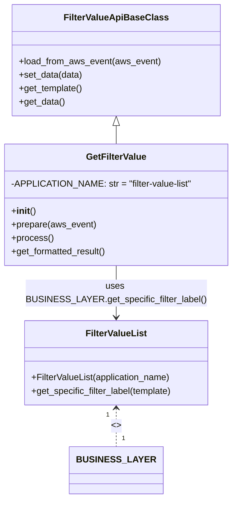

# Diagram: common/filter_service/filter_service/api/classes/GetFilterValue.py

> Auto-generated by Obscura crawlers

## Mermaid

### SVG

<svg id="container" width="404.3046875" xmlns="http://www.w3.org/2000/svg" class="classDiagram" height="886" viewBox="0 0 404.3046875 886" role="graphics-document document" aria-roledescription="class"><g><defs><marker id="container_class-aggregationStart" class="marker aggregation class" refX="18" refY="7" markerWidth="190" markerHeight="240" orient="auto"><path d="M 18,7 L9,13 L1,7 L9,1 Z"></path></marker></defs><defs><marker id="container_class-aggregationEnd" class="marker aggregation class" refX="1" refY="7" markerWidth="20" markerHeight="28" orient="auto"><path d="M 18,7 L9,13 L1,7 L9,1 Z"></path></marker></defs><defs><marker id="container_class-extensionStart" class="marker extension class" refX="18" refY="7" markerWidth="190" markerHeight="240" orient="auto"><path d="M 1,7 L18,13 V 1 Z"></path></marker></defs><defs><marker id="container_class-extensionEnd" class="marker extension class" refX="1" refY="7" markerWidth="20" markerHeight="28" orient="auto"><path d="M 1,1 V 13 L18,7 Z"></path></marker></defs><defs><marker id="container_class-compositionStart" class="marker composition class" refX="18" refY="7" markerWidth="190" markerHeight="240" orient="auto"><path d="M 18,7 L9,13 L1,7 L9,1 Z"></path></marker></defs><defs><marker id="container_class-compositionEnd" class="marker composition class" refX="1" refY="7" markerWidth="20" markerHeight="28" orient="auto"><path d="M 18,7 L9,13 L1,7 L9,1 Z"></path></marker></defs><defs><marker id="container_class-dependencyStart" class="marker dependency class" refX="6" refY="7" markerWidth="190" markerHeight="240" orient="auto"><path d="M 5,7 L9,13 L1,7 L9,1 Z"></path></marker></defs><defs><marker id="container_class-dependencyEnd" class="marker dependency class" refX="13" refY="7" markerWidth="20" markerHeight="28" orient="auto"><path d="M 18,7 L9,13 L14,7 L9,1 Z"></path></marker></defs><defs><marker id="container_class-lollipopStart" class="marker lollipop class" refX="13" refY="7" markerWidth="190" markerHeight="240" orient="auto"><circle stroke="black" fill="transparent" cx="7" cy="7" r="6"></circle></marker></defs><defs><marker id="container_class-lollipopEnd" class="marker lollipop class" refX="1" refY="7" markerWidth="190" markerHeight="240" orient="auto"><circle stroke="black" fill="transparent" cx="7" cy="7" r="6"></circle></marker></defs><g class="root"><g class="clusters"></g><g class="edgePaths"><path d="M202.152,223.25L202.152,224.542C202.152,225.833,202.152,228.417,202.152,233.875C202.152,239.333,202.152,247.667,202.152,251.833L202.152,256" id="id_FilterValueApiBaseClass_GetFilterValue_1" class="edge-thickness-normal edge-pattern-solid relation" style=";;;" data-edge="true" data-et="edge" data-id="id_FilterValueApiBaseClass_GetFilterValue_1" data-points="W3sieCI6MjAyLjE1MjM0Mzc1LCJ5IjoyMDZ9LHsieCI6MjAyLjE1MjM0Mzc1LCJ5IjoyMzF9LHsieCI6MjAyLjE1MjM0Mzc1LCJ5IjoyNTZ9XQ==" marker-start="url(#container_class-extensionStart)"></path><path d="M202.152,726L202.152,731.167C202.152,736.333,202.152,746.667,202.152,758C202.152,769.333,202.152,781.667,202.152,787.833L202.152,794" id="id_FilterValueList_BUSINESS_LAYER_2" class="edge-thickness-normal edge-pattern-dashed relation" style=";;;" data-edge="true" data-et="edge" data-id="id_FilterValueList_BUSINESS_LAYER_2" data-points="W3sieCI6MjAyLjE1MjM0Mzc1LCJ5Ijo3MjB9LHsieCI6MjAyLjE1MjM0Mzc1LCJ5Ijo3NTd9LHsieCI6MjAyLjE1MjM0Mzc1LCJ5Ijo3OTR9XQ==" marker-start="url(#container_class-dependencyStart)"></path><path d="M202.152,472L202.152,480.167C202.152,488.333,202.152,504.667,202.152,520C202.152,535.333,202.152,549.667,202.152,556.833L202.152,564" id="id_GetFilterValue_FilterValueList_3" class="edge-thickness-normal edge-pattern-solid relation" style=";;;" data-edge="true" data-et="edge" data-id="id_GetFilterValue_FilterValueList_3" data-points="W3sieCI6MjAyLjE1MjM0Mzc1LCJ5Ijo0NzJ9LHsieCI6MjAyLjE1MjM0Mzc1LCJ5Ijo1MjF9LHsieCI6MjAyLjE1MjM0Mzc1LCJ5Ijo1NzB9XQ==" marker-end="url(#container_class-dependencyEnd)"></path></g><g class="edgeLabels"><g class="edgeLabel"><g class="label" data-id="id_FilterValueApiBaseClass_GetFilterValue_1" transform="translate(0, 0)"><foreignObject width="0" height="0">

</foreignObject></g></g><g class="edgeLabel" transform="translate(202.15234375, 757)"><g class="label" data-id="id_FilterValueList_BUSINESS_LAYER_2" transform="translate(-8.0078125, -12)"><foreignObject width="16.015625" height="24">

&lt;&gt;

</foreignObject></g></g><g class="edgeLabel" transform="translate(202.15234375, 521)"><g class="label" data-id="id_GetFilterValue_FilterValueList_3" transform="translate(-153.2578125, -24)"><foreignObject width="306.515625" height="48">

uses BUSINESS_LAYER.get_specific_filter_label()

</foreignObject></g></g><g class="edgeTerminals" transform="translate(187.15234187500008, 737.4999983928572)"><g class="inner" transform="translate(0, 0)"><foreignObject style="width: 9px; height: 12px;">
1
</foreignObject></g></g><g class="edgeTerminals" transform="translate(212.1523418749999, 771.4999983928572)"><g class="inner" transform="translate(0, 0)"></g><foreignObject style="width: 9px; height: 12px;">
1
</foreignObject></g></g><g class="nodes"><g class="node default" id="classId-FilterValueApiBaseClass-0" transform="translate(202.15234375, 107)"><g class="basic label-container"><path d="M-181.29296875 -99 L181.29296875 -99 L181.29296875 99 L-181.29296875 99" stroke="none" stroke-width="0" fill="#ECECFF" style=""></path><path d="M-181.29296875 -99 C-76.55600710795899 -99, 28.18095453408202 -99, 181.29296875 -99 M-181.29296875 -99 C-51.916408481621005 -99, 77.46015178675799 -99, 181.29296875 -99 M181.29296875 -99 C181.29296875 -34.91102790357412, 181.29296875 29.177944192851754, 181.29296875 99 M181.29296875 -99 C181.29296875 -43.091657231292444, 181.29296875 12.816685537415111, 181.29296875 99 M181.29296875 99 C54.82213090056723 99, -71.64870694886554 99, -181.29296875 99 M181.29296875 99 C83.48700662665622 99, -14.31895549668755 99, -181.29296875 99 M-181.29296875 99 C-181.29296875 25.16790528201558, -181.29296875 -48.66418943596884, -181.29296875 -99 M-181.29296875 99 C-181.29296875 43.38058217709855, -181.29296875 -12.238835645802894, -181.29296875 -99" stroke="#9370DB" stroke-width="1.3" fill="none" stroke-dasharray="0 0" style=""></path></g><g class="annotation-group text" transform="translate(0, -75)"></g><g class="label-group text" transform="translate(-86.8828125, -75)"><g class="label" style="font-weight: bolder" transform="translate(0,-12)"><foreignObject width="173.765625" height="24">

FilterValueApiBaseClass

</foreignObject></g></g><g class="members-group text" transform="translate(-169.29296875, -27)"></g><g class="methods-group text" transform="translate(-169.29296875, 3)"><g class="label" style="" transform="translate(0,-12)"><foreignObject width="251.703125" height="24">

+load_from_aws_event(aws_event)

</foreignObject></g><g class="label" style="" transform="translate(0,12)"><foreignObject width="113.609375" height="24">

+set_data(data)

</foreignObject></g><g class="label" style="" transform="translate(0,36)"><foreignObject width="113.953125" height="24">

+get_template()

</foreignObject></g><g class="label" style="" transform="translate(0,60)"><foreignObject width="81.5625" height="24">

+get_data()

</foreignObject></g></g><g class="divider" style=""><path d="M-181.29296875 -51 C-63.31360204244014 -51, 54.665764665119724 -51, 181.29296875 -51 M-181.29296875 -51 C-98.12772470179124 -51, -14.962480653582475 -51, 181.29296875 -51" stroke="#9370DB" stroke-width="1.3" fill="none" stroke-dasharray="0 0" style=""></path></g><g class="divider" style=""><path d="M-181.29296875 -27 C-85.1150006016595 -27, 11.062967546680994 -27, 181.29296875 -27 M-181.29296875 -27 C-97.36170869948052 -27, -13.430448648961033 -27, 181.29296875 -27" stroke="#9370DB" stroke-width="1.3" fill="none" stroke-dasharray="0 0" style=""></path></g></g><g class="node default" id="classId-FilterValueList-1" transform="translate(202.15234375, 645)"><g class="basic label-container"><path d="M-165.25 -75 L165.25 -75 L165.25 75 L-165.25 75" stroke="none" stroke-width="0" fill="#ECECFF" style=""></path><path d="M-165.25 -75 C-36.31168166337545 -75, 92.6266366732491 -75, 165.25 -75 M-165.25 -75 C-84.71264954975699 -75, -4.175299099513978 -75, 165.25 -75 M165.25 -75 C165.25 -20.76040390954587, 165.25 33.47919218090826, 165.25 75 M165.25 -75 C165.25 -28.61046065469955, 165.25 17.779078690600898, 165.25 75 M165.25 75 C66.88631387222766 75, -31.47737225554468 75, -165.25 75 M165.25 75 C68.92622355133628 75, -27.397552897327444 75, -165.25 75 M-165.25 75 C-165.25 15.942266377402788, -165.25 -43.115467245194424, -165.25 -75 M-165.25 75 C-165.25 29.85138777185464, -165.25 -15.29722445629072, -165.25 -75" stroke="#9370DB" stroke-width="1.3" fill="none" stroke-dasharray="0 0" style=""></path></g><g class="annotation-group text" transform="translate(0, -51)"></g><g class="label-group text" transform="translate(-52.09375, -51)"><g class="label" style="font-weight: bolder" transform="translate(0,-12)"><foreignObject width="104.1875" height="24">

FilterValueList

</foreignObject></g></g><g class="members-group text" transform="translate(-153.25, -3)"></g><g class="methods-group text" transform="translate(-153.25, 27)"><g class="label" style="" transform="translate(0,-12)"><foreignObject width="251.484375" height="24">

+FilterValueList(application_name)

</foreignObject></g><g class="label" style="" transform="translate(0,12)"><foreignObject width="254.40625" height="24">

+get_specific_filter_label(template)

</foreignObject></g></g><g class="divider" style=""><path d="M-165.25 -27 C-85.29936460792972 -27, -5.348729215859436 -27, 165.25 -27 M-165.25 -27 C-43.10535996882105 -27, 79.0392800623579 -27, 165.25 -27" stroke="#9370DB" stroke-width="1.3" fill="none" stroke-dasharray="0 0" style=""></path></g><g class="divider" style=""><path d="M-165.25 -3 C-94.45358338228586 -3, -23.657166764571713 -3, 165.25 -3 M-165.25 -3 C-74.61526814019065 -3, 16.0194637196187 -3, 165.25 -3" stroke="#9370DB" stroke-width="1.3" fill="none" stroke-dasharray="0 0" style=""></path></g></g><g class="node default" id="classId-GetFilterValue-2" transform="translate(202.15234375, 364)"><g class="basic label-container"><path d="M-194.15234375 -108 L194.15234375 -108 L194.15234375 108 L-194.15234375 108" stroke="none" stroke-width="0" fill="#ECECFF" style=""></path><path d="M-194.15234375 -108 C-110.69056641909806 -108, -27.228789088196123 -108, 194.15234375 -108 M-194.15234375 -108 C-96.61526463522347 -108, 0.9218144795530634 -108, 194.15234375 -108 M194.15234375 -108 C194.15234375 -27.14856718140706, 194.15234375 53.70286563718588, 194.15234375 108 M194.15234375 -108 C194.15234375 -36.61997544935099, 194.15234375 34.76004910129802, 194.15234375 108 M194.15234375 108 C112.51089446478242 108, 30.86944517956485 108, -194.15234375 108 M194.15234375 108 C74.6672280016592 108, -44.817887746681606 108, -194.15234375 108 M-194.15234375 108 C-194.15234375 54.902436945608486, -194.15234375 1.804873891216971, -194.15234375 -108 M-194.15234375 108 C-194.15234375 30.73221280747657, -194.15234375 -46.53557438504686, -194.15234375 -108" stroke="#9370DB" stroke-width="1.3" fill="none" stroke-dasharray="0 0" style=""></path></g><g class="annotation-group text" transform="translate(0, -84)"></g><g class="label-group text" transform="translate(-51.4453125, -84)"><g class="label" style="font-weight: bolder" transform="translate(0,-12)"><foreignObject width="102.890625" height="24">

GetFilterValue

</foreignObject></g></g><g class="members-group text" transform="translate(-182.15234375, -36)"><g class="label" style="" transform="translate(0,-12)"><foreignObject width="312.859375" height="24">

-APPLICATION_NAME: str = "filter-value-list"

</foreignObject></g></g><g class="methods-group text" transform="translate(-182.15234375, 12)"><g class="label" style="" transform="translate(0,-12)"><foreignObject width="42.796875" height="24">

+<strong>init</strong>()

</foreignObject></g><g class="label" style="" transform="translate(0,12)"><foreignObject width="150.328125" height="24">

+prepare(aws_event)

</foreignObject></g><g class="label" style="" transform="translate(0,36)"><foreignObject width="73.734375" height="24">

+process()

</foreignObject></g><g class="label" style="" transform="translate(0,60)"><foreignObject width="171.640625" height="24">

+get_formatted_result()

</foreignObject></g></g><g class="divider" style=""><path d="M-194.15234375 -60 C-92.88645846513744 -60, 8.379426819725126 -60, 194.15234375 -60 M-194.15234375 -60 C-80.79972210921431 -60, 32.55289953157137 -60, 194.15234375 -60" stroke="#9370DB" stroke-width="1.3" fill="none" stroke-dasharray="0 0" style=""></path></g><g class="divider" style=""><path d="M-194.15234375 -12 C-112.29633914661953 -12, -30.44033454323906 -12, 194.15234375 -12 M-194.15234375 -12 C-80.31756619324779 -12, 33.51721136350443 -12, 194.15234375 -12" stroke="#9370DB" stroke-width="1.3" fill="none" stroke-dasharray="0 0" style=""></path></g></g><g class="node default" id="classId-BUSINESS_LAYER-3" transform="translate(202.15234375, 836)"><g class="basic label-container"><path d="M-73.7109375 -42 L73.7109375 -42 L73.7109375 42 L-73.7109375 42" stroke="none" stroke-width="0" fill="#ECECFF" style=""></path><path d="M-73.7109375 -42 C-42.56940711159631 -42, -11.427876723192625 -42, 73.7109375 -42 M-73.7109375 -42 C-16.55739283764477 -42, 40.59615182471046 -42, 73.7109375 -42 M73.7109375 -42 C73.7109375 -12.02168577111215, 73.7109375 17.9566284577757, 73.7109375 42 M73.7109375 -42 C73.7109375 -20.989750897245234, 73.7109375 0.020498205509532852, 73.7109375 42 M73.7109375 42 C31.65977306956956 42, -10.39139136086088 42, -73.7109375 42 M73.7109375 42 C30.41223165223297 42, -12.886474195534063 42, -73.7109375 42 M-73.7109375 42 C-73.7109375 20.1207431666936, -73.7109375 -1.7585136666127994, -73.7109375 -42 M-73.7109375 42 C-73.7109375 22.263131848571017, -73.7109375 2.526263697142035, -73.7109375 -42" stroke="#9370DB" stroke-width="1.3" fill="none" stroke-dasharray="0 0" style=""></path></g><g class="annotation-group text" transform="translate(0, -18)"></g><g class="label-group text" transform="translate(-61.7109375, -18)"><g class="label" style="font-weight: bolder" transform="translate(0,-12)"><foreignObject width="123.421875" height="24">

BUSINESS_LAYER

</foreignObject></g></g><g class="members-group text" transform="translate(-61.7109375, 30)"></g><g class="methods-group text" transform="translate(-61.7109375, 60)"></g><g class="divider" style=""><path d="M-73.7109375 6 C-31.860971337148435 6, 9.98899482570313 6, 73.7109375 6 M-73.7109375 6 C-16.526981943647264 6, 40.65697361270547 6, 73.7109375 6" stroke="#9370DB" stroke-width="1.3" fill="none" stroke-dasharray="0 0" style=""></path></g><g class="divider" style=""><path d="M-73.7109375 24 C-24.241111589845723 24, 25.228714320308555 24, 73.7109375 24 M-73.7109375 24 C-40.89772756011266 24, -8.084517620225327 24, 73.7109375 24" stroke="#9370DB" stroke-width="1.3" fill="none" stroke-dasharray="0 0" style=""></path></g></g></g></g></g></svg>
