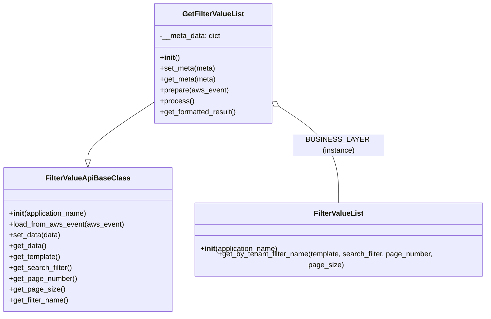

# Diagram: common/filter_service/filter_service/api/classes/GetFilterValueList.py

> Auto-generated by Obscura crawlers

## Mermaid

### SVG

<svg id="container" width="1062.1796875" xmlns="http://www.w3.org/2000/svg" class="classDiagram" height="672" viewBox="0 0 1062.1796875 672" role="graphics-document document" aria-roledescription="class"><g><defs><marker id="container_class-aggregationStart" class="marker aggregation class" refX="18" refY="7" markerWidth="190" markerHeight="240" orient="auto"><path d="M 18,7 L9,13 L1,7 L9,1 Z"></path></marker></defs><defs><marker id="container_class-aggregationEnd" class="marker aggregation class" refX="1" refY="7" markerWidth="20" markerHeight="28" orient="auto"><path d="M 18,7 L9,13 L1,7 L9,1 Z"></path></marker></defs><defs><marker id="container_class-extensionStart" class="marker extension class" refX="18" refY="7" markerWidth="190" markerHeight="240" orient="auto"><path d="M 1,7 L18,13 V 1 Z"></path></marker></defs><defs><marker id="container_class-extensionEnd" class="marker extension class" refX="1" refY="7" markerWidth="20" markerHeight="28" orient="auto"><path d="M 1,1 V 13 L18,7 Z"></path></marker></defs><defs><marker id="container_class-compositionStart" class="marker composition class" refX="18" refY="7" markerWidth="190" markerHeight="240" orient="auto"><path d="M 18,7 L9,13 L1,7 L9,1 Z"></path></marker></defs><defs><marker id="container_class-compositionEnd" class="marker composition class" refX="1" refY="7" markerWidth="20" markerHeight="28" orient="auto"><path d="M 18,7 L9,13 L1,7 L9,1 Z"></path></marker></defs><defs><marker id="container_class-dependencyStart" class="marker dependency class" refX="6" refY="7" markerWidth="190" markerHeight="240" orient="auto"><path d="M 5,7 L9,13 L1,7 L9,1 Z"></path></marker></defs><defs><marker id="container_class-dependencyEnd" class="marker dependency class" refX="13" refY="7" markerWidth="20" markerHeight="28" orient="auto"><path d="M 18,7 L9,13 L14,7 L9,1 Z"></path></marker></defs><defs><marker id="container_class-lollipopStart" class="marker lollipop class" refX="13" refY="7" markerWidth="190" markerHeight="240" orient="auto"><circle stroke="black" fill="transparent" cx="7" cy="7" r="6"></circle></marker></defs><defs><marker id="container_class-lollipopEnd" class="marker lollipop class" refX="1" refY="7" markerWidth="190" markerHeight="240" orient="auto"><circle stroke="black" fill="transparent" cx="7" cy="7" r="6"></circle></marker></defs><g class="root"><g class="clusters"></g><g class="edgePaths"><path d="M333.139,220.292L309.164,235.077C285.19,249.861,237.242,279.431,213.267,297.507C189.293,315.583,189.293,322.167,189.293,325.458L189.293,328.75" id="id_GetFilterValueList_FilterValueApiBaseClass_1" class="edge-thickness-normal edge-pattern-solid relation" style=";;;" data-edge="true" data-et="edge" data-id="id_GetFilterValueList_FilterValueApiBaseClass_1" data-points="W3sieCI6MzMzLjEzODY3MTg3NSwieSI6MjIwLjI5MjE5Mzc2OTU1NDc5fSx7IngiOjE4OS4yOTI5Njg3NSwieSI6MzA5fSx7IngiOjE4OS4yOTI5Njg3NSwieSI6MzQ2fV0=" marker-end="url(#container_class-extensionEnd)"></path><path d="M608.22,229.347L629.747,242.622C651.274,255.898,694.328,282.449,715.856,315.891C737.383,349.333,737.383,389.667,737.383,409.833L737.383,430" id="id_GetFilterValueList_FilterValueList_2" class="edge-thickness-normal edge-pattern-solid relation" style=";;;" data-edge="true" data-et="edge" data-id="id_GetFilterValueList_FilterValueList_2" data-points="W3sieCI6NTkzLjUzNzEwOTM3NSwieSI6MjIwLjI5MjE5Mzc2OTU1NDc5fSx7IngiOjczNy4zODI4MTI1LCJ5IjozMDl9LHsieCI6NzM3LjM4MjgxMjUsInkiOjQzMH1d" marker-start="url(#container_class-aggregationStart)"></path></g><g class="edgeLabels"><g class="edgeLabel"><g class="label" data-id="id_GetFilterValueList_FilterValueApiBaseClass_1" transform="translate(0, 0)"><foreignObject width="0" height="0">

</foreignObject></g></g><g class="edgeLabel" transform="translate(737.3828125, 309)"><g class="label" data-id="id_GetFilterValueList_FilterValueList_2" transform="translate(-98.609375, -12)"><foreignObject width="197.21875" height="24">

BUSINESS_LAYER (instance)

</foreignObject></g></g></g><g class="nodes"><g class="node default" id="classId-FilterValueApiBaseClass-0" transform="translate(189.29296875, 505)"><g class="basic label-container"><path d="M-181.29296875 -159 L181.29296875 -159 L181.29296875 159 L-181.29296875 159" stroke="none" stroke-width="0" fill="#ECECFF" style=""></path><path d="M-181.29296875 -159 C-104.79933603971575 -159, -28.30570332943151 -159, 181.29296875 -159 M-181.29296875 -159 C-65.78601233228112 -159, 49.720944085437765 -159, 181.29296875 -159 M181.29296875 -159 C181.29296875 -36.708619658411465, 181.29296875 85.58276068317707, 181.29296875 159 M181.29296875 -159 C181.29296875 -55.32817739303313, 181.29296875 48.34364521393374, 181.29296875 159 M181.29296875 159 C95.68087228690514 159, 10.068775823810284 159, -181.29296875 159 M181.29296875 159 C85.9863500984385 159, -9.320268553122986 159, -181.29296875 159 M-181.29296875 159 C-181.29296875 88.69274067187636, -181.29296875 18.38548134375273, -181.29296875 -159 M-181.29296875 159 C-181.29296875 54.02692468510064, -181.29296875 -50.94615062979872, -181.29296875 -159" stroke="#9370DB" stroke-width="1.3" fill="none" stroke-dasharray="0 0" style=""></path></g><g class="annotation-group text" transform="translate(0, -135)"></g><g class="label-group text" transform="translate(-86.8828125, -135)"><g class="label" style="font-weight: bolder" transform="translate(0,-12)"><foreignObject width="173.765625" height="24">

FilterValueApiBaseClass

</foreignObject></g></g><g class="members-group text" transform="translate(-169.29296875, -87)"></g><g class="methods-group text" transform="translate(-169.29296875, -57)"><g class="label" style="" transform="translate(0,-12)"><foreignObject width="173.734375" height="24">

+<strong>init</strong>(application_name)

</foreignObject></g><g class="label" style="" transform="translate(0,12)"><foreignObject width="251.703125" height="24">

+load_from_aws_event(aws_event)

</foreignObject></g><g class="label" style="" transform="translate(0,36)"><foreignObject width="113.609375" height="24">

+set_data(data)

</foreignObject></g><g class="label" style="" transform="translate(0,60)"><foreignObject width="81.5625" height="24">

+get_data()

</foreignObject></g><g class="label" style="" transform="translate(0,84)"><foreignObject width="113.953125" height="24">

+get_template()

</foreignObject></g><g class="label" style="" transform="translate(0,108)"><foreignObject width="139.015625" height="24">

+get_search_filter()

</foreignObject></g><g class="label" style="" transform="translate(0,132)"><foreignObject width="148.71875" height="24">

+get_page_number()

</foreignObject></g><g class="label" style="" transform="translate(0,156)"><foreignObject width="119.5" height="24">

+get_page_size()

</foreignObject></g><g class="label" style="" transform="translate(0,180)"><foreignObject width="130.796875" height="24">

+get_filter_name()

</foreignObject></g></g><g class="divider" style=""><path d="M-181.29296875 -111 C-58.271093265004 -111, 64.750782219992 -111, 181.29296875 -111 M-181.29296875 -111 C-50.25182871923539 -111, 80.78931131152922 -111, 181.29296875 -111" stroke="#9370DB" stroke-width="1.3" fill="none" stroke-dasharray="0 0" style=""></path></g><g class="divider" style=""><path d="M-181.29296875 -87 C-77.60635328749837 -87, 26.08026217500327 -87, 181.29296875 -87 M-181.29296875 -87 C-61.705278063928816 -87, 57.88241262214237 -87, 181.29296875 -87" stroke="#9370DB" stroke-width="1.3" fill="none" stroke-dasharray="0 0" style=""></path></g></g><g class="node default" id="classId-FilterValueList-1" transform="translate(737.3828125, 505)"><g class="basic label-container"><path d="M-316.796875 -75 L316.796875 -75 L316.796875 75 L-316.796875 75" stroke="none" stroke-width="0" fill="#ECECFF" style=""></path><path d="M-316.796875 -75 C-73.52003097433123 -75, 169.75681305133753 -75, 316.796875 -75 M-316.796875 -75 C-118.69561143961573 -75, 79.40565212076854 -75, 316.796875 -75 M316.796875 -75 C316.796875 -29.3358659613408, 316.796875 16.3282680773184, 316.796875 75 M316.796875 -75 C316.796875 -25.570522704186402, 316.796875 23.858954591627196, 316.796875 75 M316.796875 75 C85.50555849141179 75, -145.78575801717642 75, -316.796875 75 M316.796875 75 C88.16513063071386 75, -140.46661373857228 75, -316.796875 75 M-316.796875 75 C-316.796875 33.43697628853024, -316.796875 -8.126047422939521, -316.796875 -75 M-316.796875 75 C-316.796875 22.460248286900395, -316.796875 -30.07950342619921, -316.796875 -75" stroke="#9370DB" stroke-width="1.3" fill="none" stroke-dasharray="0 0" style=""></path></g><g class="annotation-group text" transform="translate(0, -51)"></g><g class="label-group text" transform="translate(-52.09375, -51)"><g class="label" style="font-weight: bolder" transform="translate(0,-12)"><foreignObject width="104.1875" height="24">

FilterValueList

</foreignObject></g></g><g class="members-group text" transform="translate(-304.796875, -3)"></g><g class="methods-group text" transform="translate(-304.796875, 27)"><g class="label" style="" transform="translate(0,-12)"><foreignObject width="173.734375" height="24">

+<strong>init</strong>(application_name)

</foreignObject></g><g class="label" style="" transform="translate(0,12)"><foreignObject width="557.5" height="24">

+get_by_tenant_filter_name(template, search_filter, page_number, page_size)

</foreignObject></g></g><g class="divider" style=""><path d="M-316.796875 -27 C-177.5435244670879 -27, -38.29017393417581 -27, 316.796875 -27 M-316.796875 -27 C-77.44925162590602 -27, 161.89837174818797 -27, 316.796875 -27" stroke="#9370DB" stroke-width="1.3" fill="none" stroke-dasharray="0 0" style=""></path></g><g class="divider" style=""><path d="M-316.796875 -3 C-89.77940078155123 -3, 137.23807343689754 -3, 316.796875 -3 M-316.796875 -3 C-82.54531462462339 -3, 151.70624575075323 -3, 316.796875 -3" stroke="#9370DB" stroke-width="1.3" fill="none" stroke-dasharray="0 0" style=""></path></g></g><g class="node default" id="classId-GetFilterValueList-2" transform="translate(463.337890625, 140)"><g class="basic label-container"><path d="M-130.19921875 -132 L130.19921875 -132 L130.19921875 132 L-130.19921875 132" stroke="none" stroke-width="0" fill="#ECECFF" style=""></path><path d="M-130.19921875 -132 C-76.17225874490396 -132, -22.145298739807913 -132, 130.19921875 -132 M-130.19921875 -132 C-44.27038643117986 -132, 41.65844588764028 -132, 130.19921875 -132 M130.19921875 -132 C130.19921875 -34.40627667486034, 130.19921875 63.18744665027933, 130.19921875 132 M130.19921875 -132 C130.19921875 -75.67288342980054, 130.19921875 -19.34576685960107, 130.19921875 132 M130.19921875 132 C69.48377547582145 132, 8.768332201642892 132, -130.19921875 132 M130.19921875 132 C59.87689516833137 132, -10.445428413337254 132, -130.19921875 132 M-130.19921875 132 C-130.19921875 70.12615763898955, -130.19921875 8.252315277979093, -130.19921875 -132 M-130.19921875 132 C-130.19921875 43.38179270618835, -130.19921875 -45.2364145876233, -130.19921875 -132" stroke="#9370DB" stroke-width="1.3" fill="none" stroke-dasharray="0 0" style=""></path></g><g class="annotation-group text" transform="translate(0, -108)"></g><g class="label-group text" transform="translate(-64.7578125, -108)"><g class="label" style="font-weight: bolder" transform="translate(0,-12)"><foreignObject width="129.515625" height="24">

GetFilterValueList

</foreignObject></g></g><g class="members-group text" transform="translate(-118.19921875, -60)"><g class="label" style="" transform="translate(0,-12)"><foreignObject width="134.6875" height="24">

-__meta_data: dict

</foreignObject></g></g><g class="methods-group text" transform="translate(-118.19921875, -12)"><g class="label" style="" transform="translate(0,-12)"><foreignObject width="42.796875" height="24">

+<strong>init</strong>()

</foreignObject></g><g class="label" style="" transform="translate(0,12)"><foreignObject width="122.25" height="24">

+set_meta(meta)

</foreignObject></g><g class="label" style="" transform="translate(0,36)"><foreignObject width="122.84375" height="24">

+get_meta(meta)

</foreignObject></g><g class="label" style="" transform="translate(0,60)"><foreignObject width="150.328125" height="24">

+prepare(aws_event)

</foreignObject></g><g class="label" style="" transform="translate(0,84)"><foreignObject width="73.734375" height="24">

+process()

</foreignObject></g><g class="label" style="" transform="translate(0,108)"><foreignObject width="171.640625" height="24">

+get_formatted_result()

</foreignObject></g></g><g class="divider" style=""><path d="M-130.19921875 -84 C-71.97997001891954 -84, -13.760721287839104 -84, 130.19921875 -84 M-130.19921875 -84 C-34.67756352722414 -84, 60.844091695551725 -84, 130.19921875 -84" stroke="#9370DB" stroke-width="1.3" fill="none" stroke-dasharray="0 0" style=""></path></g><g class="divider" style=""><path d="M-130.19921875 -36 C-51.66052665453762 -36, 26.87816544092476 -36, 130.19921875 -36 M-130.19921875 -36 C-73.44000628356201 -36, -16.680793817124012 -36, 130.19921875 -36" stroke="#9370DB" stroke-width="1.3" fill="none" stroke-dasharray="0 0" style=""></path></g></g></g></g></g></svg>
