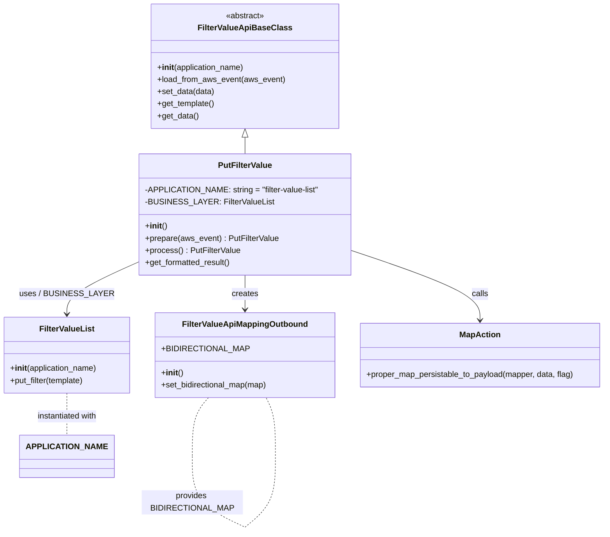

# Diagram: common/filter_service/filter_service/api/classes/PutFilterValue.py

> Auto-generated by Obscura crawlers

## Mermaid

### SVG

<svg id="container" width="1197.8203125" xmlns="http://www.w3.org/2000/svg" class="classDiagram" height="1050.1500244140625" viewBox="0 0 1197.8203125 1050.1500244140625" role="graphics-document document" aria-roledescription="class"><g><defs><marker id="container_class-aggregationStart" class="marker aggregation class" refX="18" refY="7" markerWidth="190" markerHeight="240" orient="auto"><path d="M 18,7 L9,13 L1,7 L9,1 Z"></path></marker></defs><defs><marker id="container_class-aggregationEnd" class="marker aggregation class" refX="1" refY="7" markerWidth="20" markerHeight="28" orient="auto"><path d="M 18,7 L9,13 L1,7 L9,1 Z"></path></marker></defs><defs><marker id="container_class-extensionStart" class="marker extension class" refX="18" refY="7" markerWidth="190" markerHeight="240" orient="auto"><path d="M 1,7 L18,13 V 1 Z"></path></marker></defs><defs><marker id="container_class-extensionEnd" class="marker extension class" refX="1" refY="7" markerWidth="20" markerHeight="28" orient="auto"><path d="M 1,1 V 13 L18,7 Z"></path></marker></defs><defs><marker id="container_class-compositionStart" class="marker composition class" refX="18" refY="7" markerWidth="190" markerHeight="240" orient="auto"><path d="M 18,7 L9,13 L1,7 L9,1 Z"></path></marker></defs><defs><marker id="container_class-compositionEnd" class="marker composition class" refX="1" refY="7" markerWidth="20" markerHeight="28" orient="auto"><path d="M 18,7 L9,13 L1,7 L9,1 Z"></path></marker></defs><defs><marker id="container_class-dependencyStart" class="marker dependency class" refX="6" refY="7" markerWidth="190" markerHeight="240" orient="auto"><path d="M 5,7 L9,13 L1,7 L9,1 Z"></path></marker></defs><defs><marker id="container_class-dependencyEnd" class="marker dependency class" refX="13" refY="7" markerWidth="20" markerHeight="28" orient="auto"><path d="M 18,7 L9,13 L14,7 L9,1 Z"></path></marker></defs><defs><marker id="container_class-lollipopStart" class="marker lollipop class" refX="13" refY="7" markerWidth="190" markerHeight="240" orient="auto"><circle stroke="black" fill="transparent" cx="7" cy="7" r="6"></circle></marker></defs><defs><marker id="container_class-lollipopEnd" class="marker lollipop class" refX="1" refY="7" markerWidth="190" markerHeight="240" orient="auto"><circle stroke="black" fill="transparent" cx="7" cy="7" r="6"></circle></marker></defs><g class="root"><g class="clusters"></g><g class="edgePaths"><path d="M485.766,271.25L485.766,272.542C485.766,273.833,485.766,276.417,485.766,281.875C485.766,287.333,485.766,295.667,485.766,299.833L485.766,304" id="id_FilterValueApiBaseClass_PutFilterValue_1" class="edge-thickness-normal edge-pattern-solid relation" style=";;;" data-edge="true" data-et="edge" data-id="id_FilterValueApiBaseClass_PutFilterValue_1" data-points="W3sieCI6NDg1Ljc2NTYyNSwieSI6MjU0fSx7IngiOjQ4NS43NjU2MjUsInkiOjI3OX0seyJ4Ijo0ODUuNzY1NjI1LCJ5IjozMDR9XQ==" marker-start="url(#container_class-extensionStart)"></path><path d="M280.715,515.237L256.081,526.197C231.448,537.158,182.181,559.079,157.548,576.706C132.914,594.333,132.914,607.667,132.914,614.333L132.914,621" id="id_PutFilterValue_FilterValueList_2" class="edge-thickness-normal edge-pattern-solid relation" style=";;;" data-edge="true" data-et="edge" data-id="id_PutFilterValue_FilterValueList_2" data-points="W3sieCI6MjgwLjcxNDg0Mzc1LCJ5Ijo1MTUuMjM2NTg4MDY1OTgwM30seyJ4IjoxMzIuOTE0MDYyNSwieSI6NTgxfSx7IngiOjEzMi45MTQwNjI1LCJ5Ijo2Mjd9XQ==" marker-end="url(#container_class-dependencyEnd)"></path><path d="M485.766,544L485.766,550.167C485.766,556.333,485.766,568.667,485.766,580C485.766,591.333,485.766,601.667,485.766,606.833L485.766,612" id="id_PutFilterValue_FilterValueApiMappingOutbound_3" class="edge-thickness-normal edge-pattern-solid relation" style=";;;" data-edge="true" data-et="edge" data-id="id_PutFilterValue_FilterValueApiMappingOutbound_3" data-points="W3sieCI6NDg1Ljc2NTYyNSwieSI6NTQ0fSx7IngiOjQ4NS43NjU2MjUsInkiOjU4MX0seyJ4Ijo0ODUuNzY1NjI1LCJ5Ijo2MTh9XQ==" marker-end="url(#container_class-dependencyEnd)"></path><path d="M690.816,493.084L734.307,507.737C777.798,522.389,864.78,551.695,908.271,575.014C951.762,598.333,951.762,615.667,951.762,624.333L951.762,633" id="id_PutFilterValue_MapAction_4" class="edge-thickness-normal edge-pattern-solid relation" style=";;;" data-edge="true" data-et="edge" data-id="id_PutFilterValue_MapAction_4" data-points="W3sieCI6NjkwLjgxNjQwNjI1LCJ5Ijo0OTMuMDg0MjExNDA4NjkyNzR9LHsieCI6OTUxLjc2MTcxODc1LCJ5Ijo1ODF9LHsieCI6OTUxLjc2MTcxODc1LCJ5Ijo2Mzl9XQ==" marker-end="url(#container_class-dependencyEnd)"></path><path d="M132.914,777L132.914,784.667C132.914,792.333,132.914,807.667,132.914,821.5C132.914,835.333,132.914,847.667,132.914,853.833L132.914,860" id="id_FilterValueList_APPLICATION_NAME_5" class="edge-thickness-normal edge-pattern-dashed relation" style=";;;" data-edge="true" data-et="edge" data-id="id_FilterValueList_APPLICATION_NAME_5" data-points="W3sieCI6MTMyLjkxNDA2MjUsInkiOjc3N30seyJ4IjoxMzIuOTE0MDYyNSwieSI6ODIzfSx7IngiOjEzMi45MTQwNjI1LCJ5Ijo4NjB9XQ=="></path><path d="M409.772,786L404.193,792.167C398.614,798.333,387.456,810.667,381.877,829.992C376.298,849.317,376.298,875.633,376.298,888.792L376.298,901.95" id="FilterValueApiMappingOutbound-cyclic-special-1" class="edge-thickness-normal edge-pattern-dashed relation" style=";;;" data-edge="true" data-et="edge" data-id="FilterValueApiMappingOutbound-cyclic-special-1" data-points="W3sieCI6NDA5Ljc3MTg3NTAwMDI1ODYsInkiOjc4Nn0seyJ4IjozNzYuMjk4NDM3NTAwMzcyNTMsInkiOjgyM30seyJ4IjozNzYuMjk4NDM3NTAwMzcyNTMsInkiOjkwMS45NDk5OTk5OTkyNTQ5fV0="></path><path d="M376.298,902.05L376.298,917.208C376.298,932.367,376.298,962.683,394.535,986.013C412.771,1009.343,449.243,1025.685,467.479,1033.856L485.716,1042.028" id="FilterValueApiMappingOutbound-cyclic-special-mid" class="edge-thickness-normal edge-pattern-dashed relation" style=";;;" data-edge="true" data-et="edge" data-id="FilterValueApiMappingOutbound-cyclic-special-mid" data-points="W3sieCI6Mzc2LjI5ODQzNzUwMDM3MjUzLCJ5Ijo5MDIuMDUwMDAwMDAwNzQ1MX0seyJ4IjozNzYuMjk4NDM3NTAwMzcyNTMsInkiOjk5M30seyJ4Ijo0ODUuNzE1NjI0OTk5MjU0OTQsInkiOjEwNDIuMDI3NTk2MDI2NjE3Mn1d"></path><path d="M485.816,1042.009L495.807,1033.841C505.799,1025.673,525.782,1009.336,535.774,986.002C545.766,962.667,545.766,932.333,545.766,904C545.766,875.667,545.766,849.333,542.708,830C539.65,810.667,533.534,798.333,530.476,792.167L527.419,786" id="FilterValueApiMappingOutbound-cyclic-special-2" class="edge-thickness-normal edge-pattern-dashed relation" style=";;;" data-edge="true" data-et="edge" data-id="FilterValueApiMappingOutbound-cyclic-special-2" data-points="W3sieCI6NDg1LjgxNTYyNTAwMDc0NTA2LCJ5IjoxMDQyLjAwOTEyNTAwMDEzNTN9LHsieCI6NTQ1Ljc2NTYyNSwieSI6OTkzfSx7IngiOjU0NS43NjU2MjUsInkiOjkwMn0seyJ4Ijo1NDUuNzY1NjI1LCJ5Ijo4MjN9LHsieCI6NTI3LjQxODUxNzU2MTk4MzQsInkiOjc4Nn1d"></path></g><g class="edgeLabels"><g class="edgeLabel"><g class="label" data-id="id_FilterValueApiBaseClass_PutFilterValue_1" transform="translate(0, 0)"><foreignObject width="0" height="0">

</foreignObject></g></g><g class="edgeLabel" transform="translate(132.9140625, 581)"><g class="label" data-id="id_PutFilterValue_FilterValueList_2" transform="translate(-85.6171875, -12)"><foreignObject width="171.234375" height="24">

uses / BUSINESS_LAYER

</foreignObject></g></g><g class="edgeLabel" transform="translate(485.765625, 581)"><g class="label" data-id="id_PutFilterValue_FilterValueApiMappingOutbound_3" transform="translate(-26.171875, -12)"><foreignObject width="52.34375" height="24">

creates

</foreignObject></g></g><g class="edgeLabel" transform="translate(951.76171875, 581)"><g class="label" data-id="id_PutFilterValue_MapAction_4" transform="translate(-16.4453125, -12)"><foreignObject width="32.890625" height="24">

calls

</foreignObject></g></g><g class="edgeLabel" transform="translate(132.9140625, 823)"><g class="label" data-id="id_FilterValueList_APPLICATION_NAME_5" transform="translate(-61.6484375, -12)"><foreignObject width="123.296875" height="24">

instantiated with

</foreignObject></g></g><g class="edgeLabel"><g class="label" data-id="FilterValueApiMappingOutbound-cyclic-special-1" transform="translate(0, 0)"><foreignObject width="0" height="0">

</foreignObject></g></g><g class="edgeLabel" transform="translate(376.29843750037253, 993)"><g class="label" data-id="FilterValueApiMappingOutbound-cyclic-special-mid" transform="translate(-100, -24)"><foreignObject width="200" height="48">

provides BIDIRECTIONAL_MAP

</foreignObject></g></g><g class="edgeLabel"><g class="label" data-id="FilterValueApiMappingOutbound-cyclic-special-2" transform="translate(0, 0)"><foreignObject width="0" height="0">

</foreignObject></g></g></g><g class="nodes"><g class="node default" id="classId-FilterValueApiBaseClass-0" transform="translate(485.765625, 131)"><g class="basic label-container"><path d="M-181.29296875 -123 L181.29296875 -123 L181.29296875 123 L-181.29296875 123" stroke="none" stroke-width="0" fill="#ECECFF" style=""></path><path d="M-181.29296875 -123 C-77.43383622023238 -123, 26.42529630953524 -123, 181.29296875 -123 M-181.29296875 -123 C-45.5605850266337 -123, 90.1717986967326 -123, 181.29296875 -123 M181.29296875 -123 C181.29296875 -52.66560928671778, 181.29296875 17.668781426564436, 181.29296875 123 M181.29296875 -123 C181.29296875 -32.77402825814241, 181.29296875 57.45194348371518, 181.29296875 123 M181.29296875 123 C47.360720845756845 123, -86.57152705848631 123, -181.29296875 123 M181.29296875 123 C36.56147739140681 123, -108.17001396718638 123, -181.29296875 123 M-181.29296875 123 C-181.29296875 28.946956943124718, -181.29296875 -65.10608611375056, -181.29296875 -123 M-181.29296875 123 C-181.29296875 73.25088025358457, -181.29296875 23.501760507169138, -181.29296875 -123" stroke="#9370DB" stroke-width="1.3" fill="none" stroke-dasharray="0 0" style=""></path></g><g class="annotation-group text" transform="translate(-38.609375, -99)"><g class="label" style="" transform="translate(0,-12)"><foreignObject width="77.21875" height="24">

«abstract»

</foreignObject></g></g><g class="label-group text" transform="translate(-86.8828125, -75)"><g class="label" style="font-weight: bolder" transform="translate(0,-12)"><foreignObject width="173.765625" height="24">

FilterValueApiBaseClass

</foreignObject></g></g><g class="members-group text" transform="translate(-169.29296875, -27)"></g><g class="methods-group text" transform="translate(-169.29296875, 3)"><g class="label" style="" transform="translate(0,-12)"><foreignObject width="173.734375" height="24">

+<strong>init</strong>(application_name)

</foreignObject></g><g class="label" style="" transform="translate(0,12)"><foreignObject width="251.703125" height="24">

+load_from_aws_event(aws_event)

</foreignObject></g><g class="label" style="" transform="translate(0,36)"><foreignObject width="113.609375" height="24">

+set_data(data)

</foreignObject></g><g class="label" style="" transform="translate(0,60)"><foreignObject width="113.953125" height="24">

+get_template()

</foreignObject></g><g class="label" style="" transform="translate(0,84)"><foreignObject width="81.5625" height="24">

+get_data()

</foreignObject></g></g><g class="divider" style=""><path d="M-181.29296875 -51 C-76.21644036661995 -51, 28.860088016760102 -51, 181.29296875 -51 M-181.29296875 -51 C-88.27277714374762 -51, 4.747414462504764 -51, 181.29296875 -51" stroke="#9370DB" stroke-width="1.3" fill="none" stroke-dasharray="0 0" style=""></path></g><g class="divider" style=""><path d="M-181.29296875 -27 C-74.56892751672304 -27, 32.15511371655393 -27, 181.29296875 -27 M-181.29296875 -27 C-65.5168485168899 -27, 50.25927171622021 -27, 181.29296875 -27" stroke="#9370DB" stroke-width="1.3" fill="none" stroke-dasharray="0 0" style=""></path></g></g><g class="node default" id="classId-PutFilterValue-1" transform="translate(485.765625, 424)"><g class="basic label-container"><path d="M-205.05078125 -120 L205.05078125 -120 L205.05078125 120 L-205.05078125 120" stroke="none" stroke-width="0" fill="#ECECFF" style=""></path><path d="M-205.05078125 -120 C-57.50018009300595 -120, 90.0504210639881 -120, 205.05078125 -120 M-205.05078125 -120 C-83.08065638504452 -120, 38.88946847991096 -120, 205.05078125 -120 M205.05078125 -120 C205.05078125 -68.09292596847692, 205.05078125 -16.185851936953824, 205.05078125 120 M205.05078125 -120 C205.05078125 -30.859955406000168, 205.05078125 58.280089187999664, 205.05078125 120 M205.05078125 120 C44.251279244161594 120, -116.54822276167681 120, -205.05078125 120 M205.05078125 120 C89.47859996986291 120, -26.093581310274175 120, -205.05078125 120 M-205.05078125 120 C-205.05078125 57.818675846963316, -205.05078125 -4.362648306073368, -205.05078125 -120 M-205.05078125 120 C-205.05078125 58.06281198367729, -205.05078125 -3.874376032645415, -205.05078125 -120" stroke="#9370DB" stroke-width="1.3" fill="none" stroke-dasharray="0 0" style=""></path></g><g class="annotation-group text" transform="translate(0, -96)"></g><g class="label-group text" transform="translate(-51.0390625, -96)"><g class="label" style="font-weight: bolder" transform="translate(0,-12)"><foreignObject width="102.078125" height="24">

PutFilterValue

</foreignObject></g></g><g class="members-group text" transform="translate(-193.05078125, -48)"><g class="label" style="" transform="translate(0,-12)"><foreignObject width="335.0625" height="24">

-APPLICATION_NAME: string = "filter-value-list"

</foreignObject></g><g class="label" style="" transform="translate(0,12)"><foreignObject width="238.171875" height="24">

-BUSINESS_LAYER: FilterValueList

</foreignObject></g></g><g class="methods-group text" transform="translate(-193.05078125, 24)"><g class="label" style="" transform="translate(0,-12)"><foreignObject width="42.796875" height="24">

+<strong>init</strong>()

</foreignObject></g><g class="label" style="" transform="translate(0,12)"><foreignObject width="263.046875" height="24">

+prepare(aws_event) : PutFilterValue

</foreignObject></g><g class="label" style="" transform="translate(0,36)"><foreignObject width="186.453125" height="24">

+process() : PutFilterValue

</foreignObject></g><g class="label" style="" transform="translate(0,60)"><foreignObject width="171.640625" height="24">

+get_formatted_result()

</foreignObject></g></g><g class="divider" style=""><path d="M-205.05078125 -72 C-115.55317481174069 -72, -26.05556837348138 -72, 205.05078125 -72 M-205.05078125 -72 C-100.91328437927297 -72, 3.224212491454068 -72, 205.05078125 -72" stroke="#9370DB" stroke-width="1.3" fill="none" stroke-dasharray="0 0" style=""></path></g><g class="divider" style=""><path d="M-205.05078125 0 C-50.459334358055315 0, 104.13211253388937 0, 205.05078125 0 M-205.05078125 0 C-85.8805797385795 0, 33.289621772841 0, 205.05078125 0" stroke="#9370DB" stroke-width="1.3" fill="none" stroke-dasharray="0 0" style=""></path></g></g><g class="node default" id="classId-FilterValueList-2" transform="translate(132.9140625, 702)"><g class="basic label-container"><path d="M-124.9140625 -75 L124.9140625 -75 L124.9140625 75 L-124.9140625 75" stroke="none" stroke-width="0" fill="#ECECFF" style=""></path><path d="M-124.9140625 -75 C-53.843856090079655 -75, 17.22635031984069 -75, 124.9140625 -75 M-124.9140625 -75 C-36.360267250440856 -75, 52.19352799911829 -75, 124.9140625 -75 M124.9140625 -75 C124.9140625 -36.308264900924556, 124.9140625 2.3834701981508886, 124.9140625 75 M124.9140625 -75 C124.9140625 -42.952003044288986, 124.9140625 -10.904006088577972, 124.9140625 75 M124.9140625 75 C74.43619913920672 75, 23.958335778413442 75, -124.9140625 75 M124.9140625 75 C26.31446815279665 75, -72.2851261944067 75, -124.9140625 75 M-124.9140625 75 C-124.9140625 28.847229929097246, -124.9140625 -17.30554014180551, -124.9140625 -75 M-124.9140625 75 C-124.9140625 23.53903123136444, -124.9140625 -27.92193753727112, -124.9140625 -75" stroke="#9370DB" stroke-width="1.3" fill="none" stroke-dasharray="0 0" style=""></path></g><g class="annotation-group text" transform="translate(0, -51)"></g><g class="label-group text" transform="translate(-52.09375, -51)"><g class="label" style="font-weight: bolder" transform="translate(0,-12)"><foreignObject width="104.1875" height="24">

FilterValueList

</foreignObject></g></g><g class="members-group text" transform="translate(-112.9140625, -3)"></g><g class="methods-group text" transform="translate(-112.9140625, 27)"><g class="label" style="" transform="translate(0,-12)"><foreignObject width="173.734375" height="24">

+<strong>init</strong>(application_name)

</foreignObject></g><g class="label" style="" transform="translate(0,12)"><foreignObject width="150.3125" height="24">

+put_filter(template)

</foreignObject></g></g><g class="divider" style=""><path d="M-124.9140625 -27 C-60.000224916160874 -27, 4.913612667678251 -27, 124.9140625 -27 M-124.9140625 -27 C-71.10418266155028 -27, -17.29430282310055 -27, 124.9140625 -27" stroke="#9370DB" stroke-width="1.3" fill="none" stroke-dasharray="0 0" style=""></path></g><g class="divider" style=""><path d="M-124.9140625 -3 C-39.04001979239085 -3, 46.8340229152183 -3, 124.9140625 -3 M-124.9140625 -3 C-37.309181658798835 -3, 50.29569918240233 -3, 124.9140625 -3" stroke="#9370DB" stroke-width="1.3" fill="none" stroke-dasharray="0 0" style=""></path></g></g><g class="node default" id="classId-FilterValueApiMappingOutbound-3" transform="translate(485.765625, 702)"><g class="basic label-container"><path d="M-177.9375 -84 L177.9375 -84 L177.9375 84 L-177.9375 84" stroke="none" stroke-width="0" fill="#ECECFF" style=""></path><path d="M-177.9375 -84 C-90.97878380094282 -84, -4.020067601885643 -84, 177.9375 -84 M-177.9375 -84 C-79.90531342397792 -84, 18.12687315204417 -84, 177.9375 -84 M177.9375 -84 C177.9375 -29.51837719193891, 177.9375 24.96324561612218, 177.9375 84 M177.9375 -84 C177.9375 -27.339690150731315, 177.9375 29.32061969853737, 177.9375 84 M177.9375 84 C45.39287983887971 84, -87.15174032224058 84, -177.9375 84 M177.9375 84 C44.4725669886941 84, -88.9923660226118 84, -177.9375 84 M-177.9375 84 C-177.9375 29.722319972585147, -177.9375 -24.555360054829706, -177.9375 -84 M-177.9375 84 C-177.9375 19.853402714337122, -177.9375 -44.293194571325756, -177.9375 -84" stroke="#9370DB" stroke-width="1.3" fill="none" stroke-dasharray="0 0" style=""></path></g><g class="annotation-group text" transform="translate(0, -60)"></g><g class="label-group text" transform="translate(-118.671875, -60)"><g class="label" style="font-weight: bolder" transform="translate(0,-12)"><foreignObject width="237.34375" height="24">

FilterValueApiMappingOutbound

</foreignObject></g></g><g class="members-group text" transform="translate(-165.9375, -12)"><g class="label" style="" transform="translate(0,-12)"><foreignObject width="155.671875" height="24">

+BIDIRECTIONAL_MAP

</foreignObject></g></g><g class="methods-group text" transform="translate(-165.9375, 36)"><g class="label" style="" transform="translate(0,-12)"><foreignObject width="42.796875" height="24">

+<strong>init</strong>()

</foreignObject></g><g class="label" style="" transform="translate(0,12)"><foreignObject width="213.203125" height="24">

+set_bidirectional_map(map)

</foreignObject></g></g><g class="divider" style=""><path d="M-177.9375 -36 C-41.29219680974296 -36, 95.35310638051408 -36, 177.9375 -36 M-177.9375 -36 C-99.95503515371861 -36, -21.972570307437223 -36, 177.9375 -36" stroke="#9370DB" stroke-width="1.3" fill="none" stroke-dasharray="0 0" style=""></path></g><g class="divider" style=""><path d="M-177.9375 12 C-101.03321128079254 12, -24.128922561585085 12, 177.9375 12 M-177.9375 12 C-93.47403468697738 12, -9.010569373954752 12, 177.9375 12" stroke="#9370DB" stroke-width="1.3" fill="none" stroke-dasharray="0 0" style=""></path></g></g><g class="node default" id="classId-MapAction-4" transform="translate(951.76171875, 702)"><g class="basic label-container"><path d="M-238.05859375 -63 L238.05859375 -63 L238.05859375 63 L-238.05859375 63" stroke="none" stroke-width="0" fill="#ECECFF" style=""></path><path d="M-238.05859375 -63 C-85.36042578333888 -63, 67.33774218332223 -63, 238.05859375 -63 M-238.05859375 -63 C-119.46107478099182 -63, -0.8635558119836446 -63, 238.05859375 -63 M238.05859375 -63 C238.05859375 -26.63406064887277, 238.05859375 9.731878702254463, 238.05859375 63 M238.05859375 -63 C238.05859375 -30.773245295084344, 238.05859375 1.4535094098313124, 238.05859375 63 M238.05859375 63 C128.67776994733686 63, 19.296946144673683 63, -238.05859375 63 M238.05859375 63 C109.34771100144187 63, -19.36317174711627 63, -238.05859375 63 M-238.05859375 63 C-238.05859375 32.25474071902718, -238.05859375 1.5094814380543653, -238.05859375 -63 M-238.05859375 63 C-238.05859375 22.308666995023103, -238.05859375 -18.382666009953795, -238.05859375 -63" stroke="#9370DB" stroke-width="1.3" fill="none" stroke-dasharray="0 0" style=""></path></g><g class="annotation-group text" transform="translate(0, -39)"></g><g class="label-group text" transform="translate(-38.6328125, -39)"><g class="label" style="font-weight: bolder" transform="translate(0,-12)"><foreignObject width="77.265625" height="24">

MapAction

</foreignObject></g></g><g class="members-group text" transform="translate(-226.05859375, 9)"></g><g class="methods-group text" transform="translate(-226.05859375, 39)"><g class="label" style="" transform="translate(0,-12)"><foreignObject width="413.484375" height="24">

+proper_map_persistable_to_payload(mapper, data, flag)

</foreignObject></g></g><g class="divider" style=""><path d="M-238.05859375 -15 C-112.71009810148149 -15, 12.638397547037016 -15, 238.05859375 -15 M-238.05859375 -15 C-101.784840794617 -15, 34.488912160766006 -15, 238.05859375 -15" stroke="#9370DB" stroke-width="1.3" fill="none" stroke-dasharray="0 0" style=""></path></g><g class="divider" style=""><path d="M-238.05859375 9 C-69.3101872914894 9, 99.4382191670212 9, 238.05859375 9 M-238.05859375 9 C-101.22472589653631 9, 35.609141956927374 9, 238.05859375 9" stroke="#9370DB" stroke-width="1.3" fill="none" stroke-dasharray="0 0" style=""></path></g></g><g class="node default" id="classId-APPLICATION_NAME-5" transform="translate(132.9140625, 902)"><g class="basic label-container"><path d="M-83.8671875 -42 L83.8671875 -42 L83.8671875 42 L-83.8671875 42" stroke="none" stroke-width="0" fill="#ECECFF" style=""></path><path d="M-83.8671875 -42 C-36.56162759861091 -42, 10.743932302778177 -42, 83.8671875 -42 M-83.8671875 -42 C-22.12004543010451 -42, 39.62709663979098 -42, 83.8671875 -42 M83.8671875 -42 C83.8671875 -18.962114415191653, 83.8671875 4.075771169616694, 83.8671875 42 M83.8671875 -42 C83.8671875 -23.43042145858921, 83.8671875 -4.860842917178417, 83.8671875 42 M83.8671875 42 C21.051768075173122 42, -41.763651349653756 42, -83.8671875 42 M83.8671875 42 C49.48438831015675 42, 15.101589120313506 42, -83.8671875 42 M-83.8671875 42 C-83.8671875 15.123452189803835, -83.8671875 -11.75309562039233, -83.8671875 -42 M-83.8671875 42 C-83.8671875 13.237752094596011, -83.8671875 -15.524495810807977, -83.8671875 -42" stroke="#9370DB" stroke-width="1.3" fill="none" stroke-dasharray="0 0" style=""></path></g><g class="annotation-group text" transform="translate(0, -18)"></g><g class="label-group text" transform="translate(-71.8671875, -18)"><g class="label" style="font-weight: bolder" transform="translate(0,-12)"><foreignObject width="143.734375" height="24">

APPLICATION_NAME

</foreignObject></g></g><g class="members-group text" transform="translate(-71.8671875, 30)"></g><g class="methods-group text" transform="translate(-71.8671875, 60)"></g><g class="divider" style=""><path d="M-83.8671875 6 C-34.411864265903695 6, 15.04345896819261 6, 83.8671875 6 M-83.8671875 6 C-48.76400239081352 6, -13.660817281627047 6, 83.8671875 6" stroke="#9370DB" stroke-width="1.3" fill="none" stroke-dasharray="0 0" style=""></path></g><g class="divider" style=""><path d="M-83.8671875 24 C-28.384115704505504 24, 27.09895609098899 24, 83.8671875 24 M-83.8671875 24 C-25.71332495502346 24, 32.44053758995308 24, 83.8671875 24" stroke="#9370DB" stroke-width="1.3" fill="none" stroke-dasharray="0 0" style=""></path></g></g><g class="label edgeLabel" id="FilterValueApiMappingOutbound---FilterValueApiMappingOutbound---1" transform="translate(376.29843750037253, 902)"><rect width="0.1" height="0.1"></rect><g class="label" style="" transform="translate(0, 0)"><rect></rect><foreignObject width="0" height="0">

</foreignObject></g></g><g class="label edgeLabel" id="FilterValueApiMappingOutbound---FilterValueApiMappingOutbound---2" transform="translate(485.765625, 1042.050000000745)"><rect width="0.1" height="0.1"></rect><g class="label" style="" transform="translate(0, 0)"><rect></rect><foreignObject width="0" height="0">

</foreignObject></g></g></g></g></g></svg>
