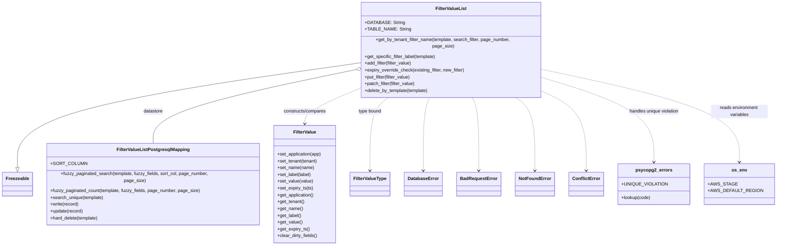

# Diagram: common/filter_service/filter_service/business/FilterValueList.py

> Auto-generated by Obscura crawlers

## Mermaid

### SVG

<svg id="container" width="2646.375" xmlns="http://www.w3.org/2000/svg" class="classDiagram" height="840" viewBox="0 0 2646.375 840" role="graphics-document document" aria-roledescription="class"><g><defs><marker id="container_class-aggregationStart" class="marker aggregation class" refX="18" refY="7" markerWidth="190" markerHeight="240" orient="auto"><path d="M 18,7 L9,13 L1,7 L9,1 Z"></path></marker></defs><defs><marker id="container_class-aggregationEnd" class="marker aggregation class" refX="1" refY="7" markerWidth="20" markerHeight="28" orient="auto"><path d="M 18,7 L9,13 L1,7 L9,1 Z"></path></marker></defs><defs><marker id="container_class-extensionStart" class="marker extension class" refX="18" refY="7" markerWidth="190" markerHeight="240" orient="auto"><path d="M 1,7 L18,13 V 1 Z"></path></marker></defs><defs><marker id="container_class-extensionEnd" class="marker extension class" refX="1" refY="7" markerWidth="20" markerHeight="28" orient="auto"><path d="M 1,1 V 13 L18,7 Z"></path></marker></defs><defs><marker id="container_class-compositionStart" class="marker composition class" refX="18" refY="7" markerWidth="190" markerHeight="240" orient="auto"><path d="M 18,7 L9,13 L1,7 L9,1 Z"></path></marker></defs><defs><marker id="container_class-compositionEnd" class="marker composition class" refX="1" refY="7" markerWidth="20" markerHeight="28" orient="auto"><path d="M 18,7 L9,13 L1,7 L9,1 Z"></path></marker></defs><defs><marker id="container_class-dependencyStart" class="marker dependency class" refX="6" refY="7" markerWidth="190" markerHeight="240" orient="auto"><path d="M 5,7 L9,13 L1,7 L9,1 Z"></path></marker></defs><defs><marker id="container_class-dependencyEnd" class="marker dependency class" refX="13" refY="7" markerWidth="20" markerHeight="28" orient="auto"><path d="M 18,7 L9,13 L14,7 L9,1 Z"></path></marker></defs><defs><marker id="container_class-lollipopStart" class="marker lollipop class" refX="13" refY="7" markerWidth="190" markerHeight="240" orient="auto"><circle stroke="black" fill="transparent" cx="7" cy="7" r="6"></circle></marker></defs><defs><marker id="container_class-lollipopEnd" class="marker lollipop class" refX="1" refY="7" markerWidth="190" markerHeight="240" orient="auto"><circle stroke="black" fill="transparent" cx="7" cy="7" r="6"></circle></marker></defs><g class="root"><g class="clusters"></g><g class="edgePaths"><path d="M1254.281,206.955L1055.1,233.963C855.919,260.97,457.557,314.985,258.376,374.784C59.195,434.583,59.195,500.167,59.195,532.958L59.195,565.75" id="id_FilterValueList_Freezeable_1" class="edge-thickness-normal edge-pattern-solid relation" style=";;;" data-edge="true" data-et="edge" data-id="id_FilterValueList_Freezeable_1" data-points="W3sieCI6MTI1NC4yODEyNSwieSI6MjA2Ljk1NTI4NjUwNjM3NH0seyJ4Ijo1OS4xOTUzMTI1LCJ5IjozNjl9LHsieCI6NTkuMTk1MzEyNSwieSI6NTgzfV0=" marker-end="url(#container_class-extensionEnd)"></path><path d="M1237.358,229.891L1119.933,253.076C1002.508,276.261,767.658,322.63,650.233,366.482C532.809,410.333,532.809,451.667,532.809,472.333L532.809,493" id="id_FilterValueList_FilterValueListPostgresqlMapping_2" class="edge-thickness-normal edge-pattern-solid relation" style=";;;" data-edge="true" data-et="edge" data-id="id_FilterValueList_FilterValueListPostgresqlMapping_2" data-points="W3sieCI6MTI1NC4yODEyNSwieSI6MjI2LjU0OTYxNDkzMTY5Nn0seyJ4Ijo1MzIuODA4NTkzNzUsInkiOjM2OX0seyJ4Ijo1MzIuODA4NTkzNzUsInkiOjQ5M31d" marker-start="url(#container_class-aggregationStart)"></path><path d="M1254.281,292.503L1222.85,305.253C1191.419,318.002,1128.557,343.501,1097.126,363.417C1065.695,383.333,1065.695,397.667,1065.695,404.833L1065.695,412" id="id_FilterValueList_FilterValue_3" class="edge-thickness-normal edge-pattern-dashed relation" style=";;;" data-edge="true" data-et="edge" data-id="id_FilterValueList_FilterValue_3" data-points="W3sieCI6MTI1NC4yODEyNSwieSI6MjkyLjUwMzMwMDQwNjU2MDZ9LHsieCI6MTA2NS42OTUzMTI1LCJ5IjozNjl9LHsieCI6MTA2NS42OTUzMTI1LCJ5Ijo0MTh9XQ==" marker-end="url(#container_class-dependencyEnd)"></path><path d="M1360.442,320L1349.416,328.167C1338.389,336.333,1316.335,352.667,1305.308,395.5C1294.281,438.333,1294.281,507.667,1294.281,542.333L1294.281,577" id="id_FilterValueList_FilterValueType_4" class="edge-thickness-normal edge-pattern-dashed relation" style=";;;" data-edge="true" data-et="edge" data-id="id_FilterValueList_FilterValueType_4" data-points="W3sieCI6MTM2MC40NDI0NTQyNjgyOTI3LCJ5IjozMjB9LHsieCI6MTI5NC4yODEyNSwieSI6MzY5fSx7IngiOjEyOTQuMjgxMjUsInkiOjU4M31d" marker-end="url(#container_class-dependencyEnd)"></path><path d="M1499.303,320L1495.545,328.167C1491.788,336.333,1484.273,352.667,1480.515,395.5C1476.758,438.333,1476.758,507.667,1476.758,542.333L1476.758,577" id="id_FilterValueList_DatabaseError_5" class="edge-thickness-normal edge-pattern-dashed relation" style=";;;" data-edge="true" data-et="edge" data-id="id_FilterValueList_DatabaseError_5" data-points="W3sieCI6MTQ5OS4zMDI2Njc2ODI5MjY4LCJ5IjozMjB9LHsieCI6MTQ3Ni43NTc4MTI1LCJ5IjozNjl9LHsieCI6MTQ3Ni43NTc4MTI1LCJ5Ijo1ODN9XQ==" marker-end="url(#container_class-dependencyEnd)"></path><path d="M1642.854,320L1646.611,328.167C1650.369,336.333,1657.883,352.667,1661.641,395.5C1665.398,438.333,1665.398,507.667,1665.398,542.333L1665.398,577" id="id_FilterValueList_BadRequestError_6" class="edge-thickness-normal edge-pattern-dashed relation" style=";;;" data-edge="true" data-et="edge" data-id="id_FilterValueList_BadRequestError_6" data-points="W3sieCI6MTY0Mi44NTM1ODIzMTcwNzMyLCJ5IjozMjB9LHsieCI6MTY2NS4zOTg0Mzc1LCJ5IjozNjl9LHsieCI6MTY2NS4zOTg0Mzc1LCJ5Ijo1ODN9XQ==" marker-end="url(#container_class-dependencyEnd)"></path><path d="M1787.296,320L1798.615,328.167C1809.934,336.333,1832.573,352.667,1843.892,395.5C1855.211,438.333,1855.211,507.667,1855.211,542.333L1855.211,577" id="id_FilterValueList_NotFoundError_7" class="edge-thickness-normal edge-pattern-dashed relation" style=";;;" data-edge="true" data-et="edge" data-id="id_FilterValueList_NotFoundError_7" data-points="W3sieCI6MTc4Ny4yOTYyNjUyNDM5MDIzLCJ5IjozMjB9LHsieCI6MTg1NS4yMTA5Mzc1LCJ5IjozNjl9LHsieCI6MTg1NS4yMTA5Mzc1LCJ5Ijo1ODN9XQ==" marker-end="url(#container_class-dependencyEnd)"></path><path d="M1887.875,305.858L1911.376,316.382C1934.878,326.905,1981.88,347.953,2005.382,393.143C2028.883,438.333,2028.883,507.667,2028.883,542.333L2028.883,577" id="id_FilterValueList_ConflictError_8" class="edge-thickness-normal edge-pattern-dashed relation" style=";;;" data-edge="true" data-et="edge" data-id="id_FilterValueList_ConflictError_8" data-points="W3sieCI6MTg4Ny44NzUsInkiOjMwNS44NTgyMjI4MzY1NjcxN30seyJ4IjoyMDI4Ljg4MjgxMjUsInkiOjM2OX0seyJ4IjoyMDI4Ljg4MjgxMjUsInkiOjU4M31d" marker-end="url(#container_class-dependencyEnd)"></path><path d="M1887.875,259.201L1948.77,277.501C2009.665,295.801,2131.456,332.4,2192.351,380.367C2253.246,428.333,2253.246,487.667,2253.246,517.333L2253.246,547" id="id_FilterValueList_psycopg2_errors_9" class="edge-thickness-normal edge-pattern-dashed relation" style=";;;" data-edge="true" data-et="edge" data-id="id_FilterValueList_psycopg2_errors_9" data-points="W3sieCI6MTg4Ny44NzUsInkiOjI1OS4yMDE0MjAxMDQ3OX0seyJ4IjoyMjUzLjI0NjA5Mzc1LCJ5IjozNjl9LHsieCI6MjI1My4yNDYwOTM3NSwieSI6NTUzfV0=" marker-end="url(#container_class-dependencyEnd)"></path><path d="M1887.875,231.802L1994.716,254.668C2101.557,277.534,2315.24,323.267,2422.081,375.8C2528.922,428.333,2528.922,487.667,2528.922,517.333L2528.922,547" id="id_FilterValueList_os_env_10" class="edge-thickness-normal edge-pattern-dashed relation" style=";;;" data-edge="true" data-et="edge" data-id="id_FilterValueList_os_env_10" data-points="W3sieCI6MTg4Ny44NzUsInkiOjIzMS44MDE2MjE0ODA1Mzg5OH0seyJ4IjoyNTI4LjkyMTg3NSwieSI6MzY5fSx7IngiOjI1MjguOTIxODc1LCJ5Ijo1NTN9XQ==" marker-end="url(#container_class-dependencyEnd)"></path></g><g class="edgeLabels"><g class="edgeLabel"><g class="label" data-id="id_FilterValueList_Freezeable_1" transform="translate(0, 0)"><foreignObject width="0" height="0">

</foreignObject></g></g><g class="edgeLabel" transform="translate(532.80859375, 369)"><g class="label" data-id="id_FilterValueList_FilterValueListPostgresqlMapping_2" transform="translate(-34.625, -12)"><foreignObject width="69.25" height="24">

datastore

</foreignObject></g></g><g class="edgeLabel" transform="translate(1065.6953125, 369)"><g class="label" data-id="id_FilterValueList_FilterValue_3" transform="translate(-76.765625, -12)"><foreignObject width="153.53125" height="24">

constructs/compares

</foreignObject></g></g><g class="edgeLabel" transform="translate(1294.28125, 369)"><g class="label" data-id="id_FilterValueList_FilterValueType_4" transform="translate(-41.5703125, -12)"><foreignObject width="83.140625" height="24">

type bound

</foreignObject></g></g><g class="edgeLabel"><g class="label" data-id="id_FilterValueList_DatabaseError_5" transform="translate(0, 0)"><foreignObject width="0" height="0">

</foreignObject></g></g><g class="edgeLabel"><g class="label" data-id="id_FilterValueList_BadRequestError_6" transform="translate(0, 0)"><foreignObject width="0" height="0">

</foreignObject></g></g><g class="edgeLabel"><g class="label" data-id="id_FilterValueList_NotFoundError_7" transform="translate(0, 0)"><foreignObject width="0" height="0">

</foreignObject></g></g><g class="edgeLabel"><g class="label" data-id="id_FilterValueList_ConflictError_8" transform="translate(0, 0)"><foreignObject width="0" height="0">

</foreignObject></g></g><g class="edgeLabel" transform="translate(2253.24609375, 369)"><g class="label" data-id="id_FilterValueList_psycopg2_errors_9" transform="translate(-90.578125, -12)"><foreignObject width="181.15625" height="24">

handles unique violation

</foreignObject></g></g><g class="edgeLabel" transform="translate(2528.921875, 369)"><g class="label" data-id="id_FilterValueList_os_env_10" transform="translate(-100, -24)"><foreignObject width="200" height="48">

reads environment variables

</foreignObject></g></g></g><g class="nodes"><g class="node default" id="classId-FilterValueList-0" transform="translate(1571.078125, 164)"><g class="basic label-container"><path d="M-316.796875 -156 L316.796875 -156 L316.796875 156 L-316.796875 156" stroke="none" stroke-width="0" fill="#ECECFF" style=""></path><path d="M-316.796875 -156 C-148.2831002746898 -156, 20.230674450620427 -156, 316.796875 -156 M-316.796875 -156 C-175.87948360203026 -156, -34.962092204060525 -156, 316.796875 -156 M316.796875 -156 C316.796875 -64.83339447257738, 316.796875 26.333211054845236, 316.796875 156 M316.796875 -156 C316.796875 -61.14087977504239, 316.796875 33.718240449915214, 316.796875 156 M316.796875 156 C149.6228338751117 156, -17.55120724977661 156, -316.796875 156 M316.796875 156 C79.7009973086688 156, -157.3948803826624 156, -316.796875 156 M-316.796875 156 C-316.796875 46.21415649345319, -316.796875 -63.57168701309362, -316.796875 -156 M-316.796875 156 C-316.796875 59.2900774932329, -316.796875 -37.4198450135342, -316.796875 -156" stroke="#9370DB" stroke-width="1.3" fill="none" stroke-dasharray="0 0" style=""></path></g><g class="annotation-group text" transform="translate(0, -132)"></g><g class="label-group text" transform="translate(-52.09375, -132)"><g class="label" style="font-weight: bolder" transform="translate(0,-12)"><foreignObject width="104.1875" height="24">

FilterValueList

</foreignObject></g></g><g class="members-group text" transform="translate(-304.796875, -84)"><g class="label" style="" transform="translate(0,-12)"><foreignObject width="130.203125" height="24">

+DATABASE: String

</foreignObject></g><g class="label" style="" transform="translate(0,12)"><foreignObject width="150.46875" height="24">

+TABLE_NAME: String

</foreignObject></g></g><g class="methods-group text" transform="translate(-304.796875, -12)"><g class="label" style="" transform="translate(0,-12)"><foreignObject width="557.5" height="24">

+get_by_tenant_filter_name(template, search_filter, page_number, page_size)

</foreignObject></g><g class="label" style="" transform="translate(0,12)"><foreignObject width="254.40625" height="24">

+get_specific_filter_label(template)

</foreignObject></g><g class="label" style="" transform="translate(0,36)"><foreignObject width="168.046875" height="24">

+add_filter(filter_value)

</foreignObject></g><g class="label" style="" transform="translate(0,60)"><foreignObject width="357.5625" height="24">

+expiry_override_check(existing_filter, new_filter)

</foreignObject></g><g class="label" style="" transform="translate(0,84)"><foreignObject width="165.03125" height="24">

+put_filter(filter_value)

</foreignObject></g><g class="label" style="" transform="translate(0,108)"><foreignObject width="181.046875" height="24">

+patch_filter(filter_value)

</foreignObject></g><g class="label" style="" transform="translate(0,132)"><foreignObject width="227.140625" height="24">

+delete_by_template(template)

</foreignObject></g></g><g class="divider" style=""><path d="M-316.796875 -108 C-157.34443537629008 -108, 2.108004247419842 -108, 316.796875 -108 M-316.796875 -108 C-138.85204500887147 -108, 39.09278498225706 -108, 316.796875 -108" stroke="#9370DB" stroke-width="1.3" fill="none" stroke-dasharray="0 0" style=""></path></g><g class="divider" style=""><path d="M-316.796875 -36 C-102.82061040258878 -36, 111.15565419482243 -36, 316.796875 -36 M-316.796875 -36 C-146.2165668300167 -36, 24.363741339966623 -36, 316.796875 -36" stroke="#9370DB" stroke-width="1.3" fill="none" stroke-dasharray="0 0" style=""></path></g></g><g class="node default" id="classId-Freezeable-1" transform="translate(59.1953125, 625)"><g class="basic label-container"><path d="M-51.1953125 -42 L51.1953125 -42 L51.1953125 42 L-51.1953125 42" stroke="none" stroke-width="0" fill="#ECECFF" style=""></path><path d="M-51.1953125 -42 C-11.79005859707597 -42, 27.61519530584806 -42, 51.1953125 -42 M-51.1953125 -42 C-12.711816499923444 -42, 25.771679500153112 -42, 51.1953125 -42 M51.1953125 -42 C51.1953125 -14.985469892961024, 51.1953125 12.029060214077951, 51.1953125 42 M51.1953125 -42 C51.1953125 -22.21506172419432, 51.1953125 -2.430123448388642, 51.1953125 42 M51.1953125 42 C30.59172690773134 42, 9.988141315462677 42, -51.1953125 42 M51.1953125 42 C13.614412197325684 42, -23.96648810534863 42, -51.1953125 42 M-51.1953125 42 C-51.1953125 21.843594859031597, -51.1953125 1.6871897180631947, -51.1953125 -42 M-51.1953125 42 C-51.1953125 23.815974186724002, -51.1953125 5.6319483734480045, -51.1953125 -42" stroke="#9370DB" stroke-width="1.3" fill="none" stroke-dasharray="0 0" style=""></path></g><g class="annotation-group text" transform="translate(0, -18)"></g><g class="label-group text" transform="translate(-39.1953125, -18)"><g class="label" style="font-weight: bolder" transform="translate(0,-12)"><foreignObject width="78.390625" height="24">

Freezeable

</foreignObject></g></g><g class="members-group text" transform="translate(-39.1953125, 30)"></g><g class="methods-group text" transform="translate(-39.1953125, 60)"></g><g class="divider" style=""><path d="M-51.1953125 6 C-18.057390670248353 6, 15.080531159503295 6, 51.1953125 6 M-51.1953125 6 C-19.844064101504856 6, 11.507184296990289 6, 51.1953125 6" stroke="#9370DB" stroke-width="1.3" fill="none" stroke-dasharray="0 0" style=""></path></g><g class="divider" style=""><path d="M-51.1953125 24 C-12.086093490374274 24, 27.02312551925145 24, 51.1953125 24 M-51.1953125 24 C-22.37379026588522 24, 6.4477319682295615 24, 51.1953125 24" stroke="#9370DB" stroke-width="1.3" fill="none" stroke-dasharray="0 0" style=""></path></g></g><g class="node default" id="classId-FilterValueListPostgresqlMapping-2" transform="translate(532.80859375, 625)"><g class="basic label-container"><path d="M-372.41796875 -132 L372.41796875 -132 L372.41796875 132 L-372.41796875 132" stroke="none" stroke-width="0" fill="#ECECFF" style=""></path><path d="M-372.41796875 -132 C-187.68376929121953 -132, -2.9495698324390673 -132, 372.41796875 -132 M-372.41796875 -132 C-90.93005333777904 -132, 190.5578620744419 -132, 372.41796875 -132 M372.41796875 -132 C372.41796875 -51.480603987961544, 372.41796875 29.038792024076912, 372.41796875 132 M372.41796875 -132 C372.41796875 -74.90746223176262, 372.41796875 -17.814924463525244, 372.41796875 132 M372.41796875 132 C101.75370989001635 132, -168.9105489699673 132, -372.41796875 132 M372.41796875 132 C119.01104043375688 132, -134.39588788248625 132, -372.41796875 132 M-372.41796875 132 C-372.41796875 61.861444341948925, -372.41796875 -8.27711131610215, -372.41796875 -132 M-372.41796875 132 C-372.41796875 54.96105349722016, -372.41796875 -22.077893005559673, -372.41796875 -132" stroke="#9370DB" stroke-width="1.3" fill="none" stroke-dasharray="0 0" style=""></path></g><g class="annotation-group text" transform="translate(0, -108)"></g><g class="label-group text" transform="translate(-122.4921875, -108)"><g class="label" style="font-weight: bolder" transform="translate(0,-12)"><foreignObject width="244.984375" height="24">

FilterValueListPostgresqlMapping

</foreignObject></g></g><g class="members-group text" transform="translate(-360.41796875, -60)"><g class="label" style="" transform="translate(0,-12)"><foreignObject width="112.90625" height="24">

+SORT_COLUMN

</foreignObject></g></g><g class="methods-group text" transform="translate(-360.41796875, -12)"><g class="label" style="" transform="translate(0,-12)"><foreignObject width="598.34375" height="24">

+fuzzy_paginated_search(template, fuzzy_fields, sort_col, page_number, page_size)

</foreignObject></g><g class="label" style="" transform="translate(0,12)"><foreignObject width="525.4375" height="24">

+fuzzy_paginated_count(template, fuzzy_fields, page_number, page_size)

</foreignObject></g><g class="label" style="" transform="translate(0,36)"><foreignObject width="189.65625" height="24">

+search_unique(template)

</foreignObject></g><g class="label" style="" transform="translate(0,60)"><foreignObject width="101.125" height="24">

+write(record)

</foreignObject></g><g class="label" style="" transform="translate(0,84)"><foreignObject width="116.0625" height="24">

+update(record)

</foreignObject></g><g class="label" style="" transform="translate(0,108)"><foreignObject width="170.609375" height="24">

+hard_delete(template)

</foreignObject></g></g><g class="divider" style=""><path d="M-372.41796875 -84 C-202.23823006795166 -84, -32.058491385903324 -84, 372.41796875 -84 M-372.41796875 -84 C-137.26495748618078 -84, 97.88805377763845 -84, 372.41796875 -84" stroke="#9370DB" stroke-width="1.3" fill="none" stroke-dasharray="0 0" style=""></path></g><g class="divider" style=""><path d="M-372.41796875 -36 C-83.69030419278545 -36, 205.0373603644291 -36, 372.41796875 -36 M-372.41796875 -36 C-157.0635243888903 -36, 58.2909199722194 -36, 372.41796875 -36" stroke="#9370DB" stroke-width="1.3" fill="none" stroke-dasharray="0 0" style=""></path></g></g><g class="node default" id="classId-FilterValue-3" transform="translate(1065.6953125, 625)"><g class="basic label-container"><path d="M-110.46875 -207 L110.46875 -207 L110.46875 207 L-110.46875 207" stroke="none" stroke-width="0" fill="#ECECFF" style=""></path><path d="M-110.46875 -207 C-28.57373838218892 -207, 53.32127323562216 -207, 110.46875 -207 M-110.46875 -207 C-42.63176151517085 -207, 25.2052269696583 -207, 110.46875 -207 M110.46875 -207 C110.46875 -78.5453652749477, 110.46875 49.9092694501046, 110.46875 207 M110.46875 -207 C110.46875 -42.62423145290256, 110.46875 121.75153709419487, 110.46875 207 M110.46875 207 C52.529180622528656 207, -5.410388754942687 207, -110.46875 207 M110.46875 207 C61.809365774771756 207, 13.149981549543512 207, -110.46875 207 M-110.46875 207 C-110.46875 114.91040359092288, -110.46875 22.820807181845765, -110.46875 -207 M-110.46875 207 C-110.46875 54.75778375763099, -110.46875 -97.48443248473802, -110.46875 -207" stroke="#9370DB" stroke-width="1.3" fill="none" stroke-dasharray="0 0" style=""></path></g><g class="annotation-group text" transform="translate(0, -183)"></g><g class="label-group text" transform="translate(-38.78125, -183)"><g class="label" style="font-weight: bolder" transform="translate(0,-12)"><foreignObject width="77.5625" height="24">

FilterValue

</foreignObject></g></g><g class="members-group text" transform="translate(-98.46875, -135)"></g><g class="methods-group text" transform="translate(-98.46875, -105)"><g class="label" style="" transform="translate(0,-12)"><foreignObject width="158.15625" height="24">

+set_application(app)

</foreignObject></g><g class="label" style="" transform="translate(0,12)"><foreignObject width="143.296875" height="24">

+set_tenant(tenant)

</foreignObject></g><g class="label" style="" transform="translate(0,36)"><foreignObject width="129.671875" height="24">

+set_name(name)

</foreignObject></g><g class="label" style="" transform="translate(0,60)"><foreignObject width="120.9375" height="24">

+set_label(label)

</foreignObject></g><g class="label" style="" transform="translate(0,84)"><foreignObject width="125.921875" height="24">

+set_value(value)

</foreignObject></g><g class="label" style="" transform="translate(0,108)"><foreignObject width="126.75" height="24">

+set_expiry_ts(ts)

</foreignObject></g><g class="label" style="" transform="translate(0,132)"><foreignObject width="131.03125" height="24">

+get_application()

</foreignObject></g><g class="label" style="" transform="translate(0,156)"><foreignObject width="96.40625" height="24">

+get_tenant()

</foreignObject></g><g class="label" style="" transform="translate(0,180)"><foreignObject width="89.75" height="24">

+get_name()

</foreignObject></g><g class="label" style="" transform="translate(0,204)"><foreignObject width="85.296875" height="24">

+get_label()

</foreignObject></g><g class="label" style="" transform="translate(0,228)"><foreignObject width="87.640625" height="24">

+get_value()

</foreignObject></g><g class="label" style="" transform="translate(0,252)"><foreignObject width="114.09375" height="24">

+get_expiry_ts()

</foreignObject></g><g class="label" style="" transform="translate(0,276)"><foreignObject width="141.6875" height="24">

+clear_dirty_fields()

</foreignObject></g></g><g class="divider" style=""><path d="M-110.46875 -159 C-51.73554800603155 -159, 6.9976539879369 -159, 110.46875 -159 M-110.46875 -159 C-63.09839964703654 -159, -15.728049294073074 -159, 110.46875 -159" stroke="#9370DB" stroke-width="1.3" fill="none" stroke-dasharray="0 0" style=""></path></g><g class="divider" style=""><path d="M-110.46875 -135 C-38.9016083321968 -135, 32.6655333356064 -135, 110.46875 -135 M-110.46875 -135 C-27.811446427266958 -135, 54.845857145466084 -135, 110.46875 -135" stroke="#9370DB" stroke-width="1.3" fill="none" stroke-dasharray="0 0" style=""></path></g></g><g class="node default" id="classId-FilterValueType-4" transform="translate(1294.28125, 625)"><g class="basic label-container"><path d="M-68.1171875 -42 L68.1171875 -42 L68.1171875 42 L-68.1171875 42" stroke="none" stroke-width="0" fill="#ECECFF" style=""></path><path d="M-68.1171875 -42 C-28.1759286565366 -42, 11.765330186926803 -42, 68.1171875 -42 M-68.1171875 -42 C-18.445360054514353 -42, 31.226467390971294 -42, 68.1171875 -42 M68.1171875 -42 C68.1171875 -20.72562904177515, 68.1171875 0.5487419164496998, 68.1171875 42 M68.1171875 -42 C68.1171875 -8.755189362068897, 68.1171875 24.489621275862206, 68.1171875 42 M68.1171875 42 C40.01762413047399 42, 11.91806076094798 42, -68.1171875 42 M68.1171875 42 C27.05701490473153 42, -14.003157690536938 42, -68.1171875 42 M-68.1171875 42 C-68.1171875 24.387024982193015, -68.1171875 6.77404996438603, -68.1171875 -42 M-68.1171875 42 C-68.1171875 18.292389832519667, -68.1171875 -5.415220334960665, -68.1171875 -42" stroke="#9370DB" stroke-width="1.3" fill="none" stroke-dasharray="0 0" style=""></path></g><g class="annotation-group text" transform="translate(0, -18)"></g><g class="label-group text" transform="translate(-56.1171875, -18)"><g class="label" style="font-weight: bolder" transform="translate(0,-12)"><foreignObject width="112.234375" height="24">

FilterValueType

</foreignObject></g></g><g class="members-group text" transform="translate(-56.1171875, 30)"></g><g class="methods-group text" transform="translate(-56.1171875, 60)"></g><g class="divider" style=""><path d="M-68.1171875 6 C-17.11279404597147 6, 33.89159940805706 6, 68.1171875 6 M-68.1171875 6 C-26.66479199054276 6, 14.78760351891448 6, 68.1171875 6" stroke="#9370DB" stroke-width="1.3" fill="none" stroke-dasharray="0 0" style=""></path></g><g class="divider" style=""><path d="M-68.1171875 24 C-13.9801101710691 24, 40.1569671578618 24, 68.1171875 24 M-68.1171875 24 C-31.90711419369395 24, 4.3029591126121005 24, 68.1171875 24" stroke="#9370DB" stroke-width="1.3" fill="none" stroke-dasharray="0 0" style=""></path></g></g><g class="node default" id="classId-DatabaseError-5" transform="translate(1476.7578125, 625)"><g class="basic label-container"><path d="M-64.359375 -42 L64.359375 -42 L64.359375 42 L-64.359375 42" stroke="none" stroke-width="0" fill="#ECECFF" style=""></path><path d="M-64.359375 -42 C-16.770727282673754 -42, 30.817920434652493 -42, 64.359375 -42 M-64.359375 -42 C-25.597350212803967 -42, 13.164674574392066 -42, 64.359375 -42 M64.359375 -42 C64.359375 -20.327361259141565, 64.359375 1.3452774817168702, 64.359375 42 M64.359375 -42 C64.359375 -16.793019976340904, 64.359375 8.413960047318191, 64.359375 42 M64.359375 42 C37.95387741382118 42, 11.548379827642364 42, -64.359375 42 M64.359375 42 C37.221344364528925 42, 10.08331372905785 42, -64.359375 42 M-64.359375 42 C-64.359375 14.41704023532407, -64.359375 -13.16591952935186, -64.359375 -42 M-64.359375 42 C-64.359375 17.081196393251723, -64.359375 -7.837607213496554, -64.359375 -42" stroke="#9370DB" stroke-width="1.3" fill="none" stroke-dasharray="0 0" style=""></path></g><g class="annotation-group text" transform="translate(0, -18)"></g><g class="label-group text" transform="translate(-52.359375, -18)"><g class="label" style="font-weight: bolder" transform="translate(0,-12)"><foreignObject width="104.71875" height="24">

DatabaseError

</foreignObject></g></g><g class="members-group text" transform="translate(-52.359375, 30)"></g><g class="methods-group text" transform="translate(-52.359375, 60)"></g><g class="divider" style=""><path d="M-64.359375 6 C-13.155297873817808 6, 38.04877925236438 6, 64.359375 6 M-64.359375 6 C-27.31509074344747 6, 9.72919351310506 6, 64.359375 6" stroke="#9370DB" stroke-width="1.3" fill="none" stroke-dasharray="0 0" style=""></path></g><g class="divider" style=""><path d="M-64.359375 24 C-32.8285908827544 24, -1.2978067655087884 24, 64.359375 24 M-64.359375 24 C-35.91772649793003 24, -7.4760779958600665 24, 64.359375 24" stroke="#9370DB" stroke-width="1.3" fill="none" stroke-dasharray="0 0" style=""></path></g></g><g class="node default" id="classId-BadRequestError-6" transform="translate(1665.3984375, 625)"><g class="basic label-container"><path d="M-74.28125 -42 L74.28125 -42 L74.28125 42 L-74.28125 42" stroke="none" stroke-width="0" fill="#ECECFF" style=""></path><path d="M-74.28125 -42 C-44.01480454322147 -42, -13.748359086442953 -42, 74.28125 -42 M-74.28125 -42 C-37.10882123053827 -42, 0.06360753892346338 -42, 74.28125 -42 M74.28125 -42 C74.28125 -17.203646470486202, 74.28125 7.592707059027596, 74.28125 42 M74.28125 -42 C74.28125 -20.076624595364542, 74.28125 1.8467508092709153, 74.28125 42 M74.28125 42 C37.638977716126576 42, 0.996705432253151 42, -74.28125 42 M74.28125 42 C22.875062655003624 42, -28.53112468999275 42, -74.28125 42 M-74.28125 42 C-74.28125 18.976753227167052, -74.28125 -4.046493545665896, -74.28125 -42 M-74.28125 42 C-74.28125 23.893499886033496, -74.28125 5.7869997720669915, -74.28125 -42" stroke="#9370DB" stroke-width="1.3" fill="none" stroke-dasharray="0 0" style=""></path></g><g class="annotation-group text" transform="translate(0, -18)"></g><g class="label-group text" transform="translate(-62.28125, -18)"><g class="label" style="font-weight: bolder" transform="translate(0,-12)"><foreignObject width="124.5625" height="24">

BadRequestError

</foreignObject></g></g><g class="members-group text" transform="translate(-62.28125, 30)"></g><g class="methods-group text" transform="translate(-62.28125, 60)"></g><g class="divider" style=""><path d="M-74.28125 6 C-15.694448696787987 6, 42.892352606424026 6, 74.28125 6 M-74.28125 6 C-28.878567102094024 6, 16.52411579581195 6, 74.28125 6" stroke="#9370DB" stroke-width="1.3" fill="none" stroke-dasharray="0 0" style=""></path></g><g class="divider" style=""><path d="M-74.28125 24 C-29.40616915136129 24, 15.46891169727742 24, 74.28125 24 M-74.28125 24 C-29.02824034387099 24, 16.22476931225802 24, 74.28125 24" stroke="#9370DB" stroke-width="1.3" fill="none" stroke-dasharray="0 0" style=""></path></g></g><g class="node default" id="classId-NotFoundError-7" transform="translate(1855.2109375, 625)"><g class="basic label-container"><path d="M-65.53125 -42 L65.53125 -42 L65.53125 42 L-65.53125 42" stroke="none" stroke-width="0" fill="#ECECFF" style=""></path><path d="M-65.53125 -42 C-14.818480762851657 -42, 35.89428847429669 -42, 65.53125 -42 M-65.53125 -42 C-34.27856154631824 -42, -3.0258730926364734 -42, 65.53125 -42 M65.53125 -42 C65.53125 -21.146513447499153, 65.53125 -0.2930268949983059, 65.53125 42 M65.53125 -42 C65.53125 -11.592414549352881, 65.53125 18.815170901294238, 65.53125 42 M65.53125 42 C22.972556676790497 42, -19.586136646419007 42, -65.53125 42 M65.53125 42 C29.914597381214307 42, -5.702055237571386 42, -65.53125 42 M-65.53125 42 C-65.53125 14.089007058711513, -65.53125 -13.821985882576975, -65.53125 -42 M-65.53125 42 C-65.53125 8.439883599238598, -65.53125 -25.120232801522803, -65.53125 -42" stroke="#9370DB" stroke-width="1.3" fill="none" stroke-dasharray="0 0" style=""></path></g><g class="annotation-group text" transform="translate(0, -18)"></g><g class="label-group text" transform="translate(-53.53125, -18)"><g class="label" style="font-weight: bolder" transform="translate(0,-12)"><foreignObject width="107.0625" height="24">

NotFoundError

</foreignObject></g></g><g class="members-group text" transform="translate(-53.53125, 30)"></g><g class="methods-group text" transform="translate(-53.53125, 60)"></g><g class="divider" style=""><path d="M-65.53125 6 C-22.58745722024713 6, 20.356335559505737 6, 65.53125 6 M-65.53125 6 C-31.080329426600642 6, 3.3705911467987164 6, 65.53125 6" stroke="#9370DB" stroke-width="1.3" fill="none" stroke-dasharray="0 0" style=""></path></g><g class="divider" style=""><path d="M-65.53125 24 C-38.00527380530936 24, -10.479297610618715 24, 65.53125 24 M-65.53125 24 C-25.02881703064554 24, 15.473615938708917 24, 65.53125 24" stroke="#9370DB" stroke-width="1.3" fill="none" stroke-dasharray="0 0" style=""></path></g></g><g class="node default" id="classId-ConflictError-8" transform="translate(2028.8828125, 625)"><g class="basic label-container"><path d="M-58.140625 -42 L58.140625 -42 L58.140625 42 L-58.140625 42" stroke="none" stroke-width="0" fill="#ECECFF" style=""></path><path d="M-58.140625 -42 C-23.155204522845423 -42, 11.830215954309153 -42, 58.140625 -42 M-58.140625 -42 C-34.40150262902651 -42, -10.662380258053027 -42, 58.140625 -42 M58.140625 -42 C58.140625 -19.179778586701776, 58.140625 3.6404428265964484, 58.140625 42 M58.140625 -42 C58.140625 -13.911728239256707, 58.140625 14.176543521486586, 58.140625 42 M58.140625 42 C20.35504250823962 42, -17.43053998352076 42, -58.140625 42 M58.140625 42 C22.686265267392983 42, -12.768094465214034 42, -58.140625 42 M-58.140625 42 C-58.140625 22.049533522225346, -58.140625 2.099067044450692, -58.140625 -42 M-58.140625 42 C-58.140625 15.196636641599941, -58.140625 -11.606726716800118, -58.140625 -42" stroke="#9370DB" stroke-width="1.3" fill="none" stroke-dasharray="0 0" style=""></path></g><g class="annotation-group text" transform="translate(0, -18)"></g><g class="label-group text" transform="translate(-46.140625, -18)"><g class="label" style="font-weight: bolder" transform="translate(0,-12)"><foreignObject width="92.28125" height="24">

ConflictError

</foreignObject></g></g><g class="members-group text" transform="translate(-46.140625, 30)"></g><g class="methods-group text" transform="translate(-46.140625, 60)"></g><g class="divider" style=""><path d="M-58.140625 6 C-16.376750462727244 6, 25.38712407454551 6, 58.140625 6 M-58.140625 6 C-29.781500175236626 6, -1.4223753504732528 6, 58.140625 6" stroke="#9370DB" stroke-width="1.3" fill="none" stroke-dasharray="0 0" style=""></path></g><g class="divider" style=""><path d="M-58.140625 24 C-13.008358525883637 24, 32.12390794823273 24, 58.140625 24 M-58.140625 24 C-32.13552968946582 24, -6.130434378931639 24, 58.140625 24" stroke="#9370DB" stroke-width="1.3" fill="none" stroke-dasharray="0 0" style=""></path></g></g><g class="node default" id="classId-psycopg2_errors-9" transform="translate(2253.24609375, 625)"><g class="basic label-container"><path d="M-116.22265625 -72 L116.22265625 -72 L116.22265625 72 L-116.22265625 72" stroke="none" stroke-width="0" fill="#ECECFF" style=""></path><path d="M-116.22265625 -72 C-33.77726578385236 -72, 48.668124682295286 -72, 116.22265625 -72 M-116.22265625 -72 C-51.630060183756086 -72, 12.962535882487828 -72, 116.22265625 -72 M116.22265625 -72 C116.22265625 -40.202162587570314, 116.22265625 -8.404325175140627, 116.22265625 72 M116.22265625 -72 C116.22265625 -21.761350779226348, 116.22265625 28.477298441547305, 116.22265625 72 M116.22265625 72 C37.81885462158813 72, -40.58494700682374 72, -116.22265625 72 M116.22265625 72 C42.54036726754347 72, -31.141921714913053 72, -116.22265625 72 M-116.22265625 72 C-116.22265625 24.368206257448506, -116.22265625 -23.26358748510299, -116.22265625 -72 M-116.22265625 72 C-116.22265625 18.741543809954976, -116.22265625 -34.51691238009005, -116.22265625 -72" stroke="#9370DB" stroke-width="1.3" fill="none" stroke-dasharray="0 0" style=""></path></g><g class="annotation-group text" transform="translate(0, -48)"></g><g class="label-group text" transform="translate(-60.4765625, -48)"><g class="label" style="font-weight: bolder" transform="translate(0,-12)"><foreignObject width="120.953125" height="24">

psycopg2_errors

</foreignObject></g></g><g class="members-group text" transform="translate(-104.22265625, 0)"><g class="label" style="" transform="translate(0,-12)"><foreignObject width="147.96875" height="24">

+UNIQUE_VIOLATION

</foreignObject></g></g><g class="methods-group text" transform="translate(-104.22265625, 48)"><g class="label" style="" transform="translate(0,-12)"><foreignObject width="103.515625" height="24">

+lookup(code)

</foreignObject></g></g><g class="divider" style=""><path d="M-116.22265625 -24 C-45.089732911863564 -24, 26.043190426272872 -24, 116.22265625 -24 M-116.22265625 -24 C-43.87658373093038 -24, 28.469488788139245 -24, 116.22265625 -24" stroke="#9370DB" stroke-width="1.3" fill="none" stroke-dasharray="0 0" style=""></path></g><g class="divider" style=""><path d="M-116.22265625 24 C-30.111169522394235 24, 56.00031720521153 24, 116.22265625 24 M-116.22265625 24 C-51.933509460874205 24, 12.35563732825159 24, 116.22265625 24" stroke="#9370DB" stroke-width="1.3" fill="none" stroke-dasharray="0 0" style=""></path></g></g><g class="node default" id="classId-os_env-10" transform="translate(2528.921875, 625)"><g class="basic label-container"><path d="M-109.453125 -72 L109.453125 -72 L109.453125 72 L-109.453125 72" stroke="none" stroke-width="0" fill="#ECECFF" style=""></path><path d="M-109.453125 -72 C-44.03102531424031 -72, 21.39107437151938 -72, 109.453125 -72 M-109.453125 -72 C-63.626915852761364 -72, -17.800706705522728 -72, 109.453125 -72 M109.453125 -72 C109.453125 -26.10914587535683, 109.453125 19.78170824928634, 109.453125 72 M109.453125 -72 C109.453125 -39.60095431923478, 109.453125 -7.201908638469561, 109.453125 72 M109.453125 72 C53.84875579202951 72, -1.755613415940985 72, -109.453125 72 M109.453125 72 C45.4838827530757 72, -18.485359493848605 72, -109.453125 72 M-109.453125 72 C-109.453125 41.089380760703364, -109.453125 10.178761521406734, -109.453125 -72 M-109.453125 72 C-109.453125 34.41774788506054, -109.453125 -3.164504229878915, -109.453125 -72" stroke="#9370DB" stroke-width="1.3" fill="none" stroke-dasharray="0 0" style=""></path></g><g class="annotation-group text" transform="translate(0, -48)"></g><g class="label-group text" transform="translate(-25.46875, -48)"><g class="label" style="font-weight: bolder" transform="translate(0,-12)"><foreignObject width="50.9375" height="24">

os_env

</foreignObject></g></g><g class="members-group text" transform="translate(-97.453125, 0)"><g class="label" style="" transform="translate(0,-12)"><foreignObject width="89.796875" height="24">

+AWS_STAGE

</foreignObject></g><g class="label" style="" transform="translate(0,12)"><foreignObject width="169.4375" height="24">

+AWS_DEFAULT_REGION

</foreignObject></g></g><g class="methods-group text" transform="translate(-97.453125, 72)"></g><g class="divider" style=""><path d="M-109.453125 -24 C-51.064585845042664 -24, 7.323953309914671 -24, 109.453125 -24 M-109.453125 -24 C-37.85226138276988 -24, 33.748602234460236 -24, 109.453125 -24" stroke="#9370DB" stroke-width="1.3" fill="none" stroke-dasharray="0 0" style=""></path></g><g class="divider" style=""><path d="M-109.453125 48 C-62.14996229192802 48, -14.84679958385604 48, 109.453125 48 M-109.453125 48 C-62.893743091354246 48, -16.33436118270849 48, 109.453125 48" stroke="#9370DB" stroke-width="1.3" fill="none" stroke-dasharray="0 0" style=""></path></g></g></g></g></g></svg>
