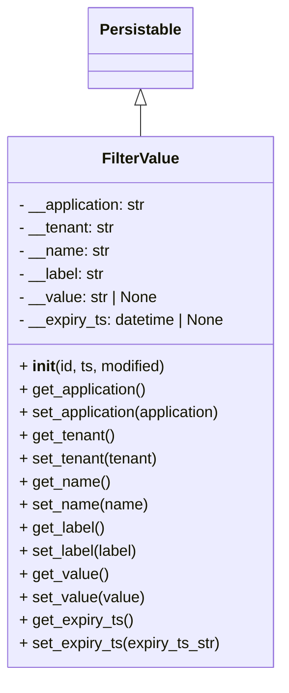

# Diagram: common/filter_service/filter_service/data_model/FilterValue.py


> Auto-generated by Obscura crawlers

## Diagram 1



### SVG

<svg id="container" width="297.421875" xmlns="http://www.w3.org/2000/svg" class="classDiagram" height="702" viewBox="0 0 297.421875 702" role="graphics-document document" aria-roledescription="class"><style>#container{font-family:"trebuchet ms",verdana,arial,sans-serif;font-size:16px;fill:#333;}@keyframes edge-animation-frame{from{stroke-dashoffset:0;}}@keyframes dash{to{stroke-dashoffset:0;}}#container .edge-animation-slow{stroke-dasharray:9,5!important;stroke-dashoffset:900;animation:dash 50s linear infinite;stroke-linecap:round;}#container .edge-animation-fast{stroke-dasharray:9,5!important;stroke-dashoffset:900;animation:dash 20s linear infinite;stroke-linecap:round;}#container .error-icon{fill:#552222;}#container .error-text{fill:#552222;stroke:#552222;}#container .edge-thickness-normal{stroke-width:1px;}#container .edge-thickness-thick{stroke-width:3.5px;}#container .edge-pattern-solid{stroke-dasharray:0;}#container .edge-thickness-invisible{stroke-width:0;fill:none;}#container .edge-pattern-dashed{stroke-dasharray:3;}#container .edge-pattern-dotted{stroke-dasharray:2;}#container .marker{fill:#333333;stroke:#333333;}#container .marker.cross{stroke:#333333;}#container svg{font-family:"trebuchet ms",verdana,arial,sans-serif;font-size:16px;}#container p{margin:0;}#container g.classGroup text{fill:#9370DB;stroke:none;font-family:"trebuchet ms",verdana,arial,sans-serif;font-size:10px;}#container g.classGroup text .title{font-weight:bolder;}#container .nodeLabel,#container .edgeLabel{color:#131300;}#container .edgeLabel .label rect{fill:#ECECFF;}#container .label text{fill:#131300;}#container .labelBkg{background:#ECECFF;}#container .edgeLabel .label span{background:#ECECFF;}#container .classTitle{font-weight:bolder;}#container .node rect,#container .node circle,#container .node ellipse,#container .node polygon,#container .node path{fill:#ECECFF;stroke:#9370DB;stroke-width:1px;}#container .divider{stroke:#9370DB;stroke-width:1;}#container g.clickable{cursor:pointer;}#container g.classGroup rect{fill:#ECECFF;stroke:#9370DB;}#container g.classGroup line{stroke:#9370DB;stroke-width:1;}#container .classLabel .box{stroke:none;stroke-width:0;fill:#ECECFF;opacity:0.5;}#container .classLabel .label{fill:#9370DB;font-size:10px;}#container .relation{stroke:#333333;stroke-width:1;fill:none;}#container .dashed-line{stroke-dasharray:3;}#container .dotted-line{stroke-dasharray:1 2;}#container #compositionStart,#container .composition{fill:#333333!important;stroke:#333333!important;stroke-width:1;}#container #compositionEnd,#container .composition{fill:#333333!important;stroke:#333333!important;stroke-width:1;}#container #dependencyStart,#container .dependency{fill:#333333!important;stroke:#333333!important;stroke-width:1;}#container #dependencyStart,#container .dependency{fill:#333333!important;stroke:#333333!important;stroke-width:1;}#container #extensionStart,#container .extension{fill:transparent!important;stroke:#333333!important;stroke-width:1;}#container #extensionEnd,#container .extension{fill:transparent!important;stroke:#333333!important;stroke-width:1;}#container #aggregationStart,#container .aggregation{fill:transparent!important;stroke:#333333!important;stroke-width:1;}#container #aggregationEnd,#container .aggregation{fill:transparent!important;stroke:#333333!important;stroke-width:1;}#container #lollipopStart,#container .lollipop{fill:#ECECFF!important;stroke:#333333!important;stroke-width:1;}#container #lollipopEnd,#container .lollipop{fill:#ECECFF!important;stroke:#333333!important;stroke-width:1;}#container .edgeTerminals{font-size:11px;line-height:initial;}#container .classTitleText{text-anchor:middle;font-size:18px;fill:#333;}#container .label-icon{display:inline-block;height:1em;overflow:visible;vertical-align:-0.125em;}#container .node .label-icon path{fill:currentColor;stroke:revert;stroke-width:revert;}#container :root{--mermaid-font-family:"trebuchet ms",verdana,arial,sans-serif;}</style><g><defs><marker id="container_class-aggregationStart" class="marker aggregation class" refX="18" refY="7" markerWidth="190" markerHeight="240" orient="auto"><path d="M 18,7 L9,13 L1,7 L9,1 Z"></path></marker></defs><defs><marker id="container_class-aggregationEnd" class="marker aggregation class" refX="1" refY="7" markerWidth="20" markerHeight="28" orient="auto"><path d="M 18,7 L9,13 L1,7 L9,1 Z"></path></marker></defs><defs><marker id="container_class-extensionStart" class="marker extension class" refX="18" refY="7" markerWidth="190" markerHeight="240" orient="auto"><path d="M 1,7 L18,13 V 1 Z"></path></marker></defs><defs><marker id="container_class-extensionEnd" class="marker extension class" refX="1" refY="7" markerWidth="20" markerHeight="28" orient="auto"><path d="M 1,1 V 13 L18,7 Z"></path></marker></defs><defs><marker id="container_class-compositionStart" class="marker composition class" refX="18" refY="7" markerWidth="190" markerHeight="240" orient="auto"><path d="M 18,7 L9,13 L1,7 L9,1 Z"></path></marker></defs><defs><marker id="container_class-compositionEnd" class="marker composition class" refX="1" refY="7" markerWidth="20" markerHeight="28" orient="auto"><path d="M 18,7 L9,13 L1,7 L9,1 Z"></path></marker></defs><defs><marker id="container_class-dependencyStart" class="marker dependency class" refX="6" refY="7" markerWidth="190" markerHeight="240" orient="auto"><path d="M 5,7 L9,13 L1,7 L9,1 Z"></path></marker></defs><defs><marker id="container_class-dependencyEnd" class="marker dependency class" refX="13" refY="7" markerWidth="20" markerHeight="28" orient="auto"><path d="M 18,7 L9,13 L14,7 L9,1 Z"></path></marker></defs><defs><marker id="container_class-lollipopStart" class="marker lollipop class" refX="13" refY="7" markerWidth="190" markerHeight="240" orient="auto"><circle stroke="black" fill="transparent" cx="7" cy="7" r="6"></circle></marker></defs><defs><marker id="container_class-lollipopEnd" class="marker lollipop class" refX="1" refY="7" markerWidth="190" markerHeight="240" orient="auto"><circle stroke="black" fill="transparent" cx="7" cy="7" r="6"></circle></marker></defs><g class="root"><g class="clusters"></g><g class="edgePaths"><path d="M148.711,109.25L148.711,110.542C148.711,111.833,148.711,114.417,148.711,119.875C148.711,125.333,148.711,133.667,148.711,137.833L148.711,142" id="id_Persistable_FilterValue_1" class="edge-thickness-normal edge-pattern-solid relation" style=";;;" data-edge="true" data-et="edge" data-id="id_Persistable_FilterValue_1" data-points="W3sieCI6MTQ4LjcxMDkzNzUsInkiOjkyfSx7IngiOjE0OC43MTA5Mzc1LCJ5IjoxMTd9LHsieCI6MTQ4LjcxMDkzNzUsInkiOjE0Mn1d" marker-start="url(#container_class-extensionStart)"></path></g><g class="edgeLabels"><g class="edgeLabel"><g class="label" data-id="id_Persistable_FilterValue_1" transform="translate(0, 0)"><foreignObject width="0" height="0"><div xmlns="http://www.w3.org/1999/xhtml" class="labelBkg" style="display: table-cell; white-space: nowrap; line-height: 1.5; max-width: 200px; text-align: center;"><span class="edgeLabel"></span></div></foreignObject></g></g></g><g class="nodes"><g class="node default" id="classId-Persistable-0" transform="translate(148.7109375, 50)"><g class="basic label-container"><path d="M-52.9765625 -42 L52.9765625 -42 L52.9765625 42 L-52.9765625 42" stroke="none" stroke-width="0" fill="#ECECFF" style=""></path><path d="M-52.9765625 -42 C-15.01127522110307 -42, 22.95401205779386 -42, 52.9765625 -42 M-52.9765625 -42 C-15.66922870643625 -42, 21.6381050871275 -42, 52.9765625 -42 M52.9765625 -42 C52.9765625 -13.317583450280456, 52.9765625 15.364833099439089, 52.9765625 42 M52.9765625 -42 C52.9765625 -12.291870107593201, 52.9765625 17.416259784813597, 52.9765625 42 M52.9765625 42 C25.903627539827166 42, -1.1693074203456675 42, -52.9765625 42 M52.9765625 42 C24.92802844717886 42, -3.120505605642279 42, -52.9765625 42 M-52.9765625 42 C-52.9765625 13.139841118976392, -52.9765625 -15.720317762047216, -52.9765625 -42 M-52.9765625 42 C-52.9765625 13.60095520737374, -52.9765625 -14.79808958525252, -52.9765625 -42" stroke="#9370DB" stroke-width="1.3" fill="none" stroke-dasharray="0 0" style=""></path></g><g class="annotation-group text" transform="translate(0, -18)"></g><g class="label-group text" transform="translate(-40.9765625, -18)"><g class="label" style="font-weight: bolder" transform="translate(0,-12)"><foreignObject width="81.953125" height="24"><div xmlns="http://www.w3.org/1999/xhtml" style="display: table-cell; white-space: nowrap; line-height: 1.5; max-width: 130px; text-align: center;"><span class="nodeLabel markdown-node-label" style=""><p>Persistable</p></span></div></foreignObject></g></g><g class="members-group text" transform="translate(-40.9765625, 30)"></g><g class="methods-group text" transform="translate(-40.9765625, 60)"></g><g class="divider" style=""><path d="M-52.9765625 6 C-27.942177379054968 6, -2.907792258109936 6, 52.9765625 6 M-52.9765625 6 C-16.648852904571086 6, 19.678856690857828 6, 52.9765625 6" stroke="#9370DB" stroke-width="1.3" fill="none" stroke-dasharray="0 0" style=""></path></g><g class="divider" style=""><path d="M-52.9765625 24 C-25.2275320055049 24, 2.521498488990197 24, 52.9765625 24 M-52.9765625 24 C-14.42899724722347 24, 24.11856800555306 24, 52.9765625 24" stroke="#9370DB" stroke-width="1.3" fill="none" stroke-dasharray="0 0" style=""></path></g></g><g class="node default" id="classId-FilterValue-1" transform="translate(148.7109375, 418)"><g class="basic label-container"><path d="M-140.7109375 -276 L140.7109375 -276 L140.7109375 276 L-140.7109375 276" stroke="none" stroke-width="0" fill="#ECECFF" style=""></path><path d="M-140.7109375 -276 C-46.480416942363235 -276, 47.75010361527353 -276, 140.7109375 -276 M-140.7109375 -276 C-63.44077189821512 -276, 13.829393703569764 -276, 140.7109375 -276 M140.7109375 -276 C140.7109375 -117.4337662932571, 140.7109375 41.13246741348581, 140.7109375 276 M140.7109375 -276 C140.7109375 -87.72688583212712, 140.7109375 100.54622833574575, 140.7109375 276 M140.7109375 276 C60.796813907962985 276, -19.11730968407403 276, -140.7109375 276 M140.7109375 276 C38.71340850298027 276, -63.284120494039456 276, -140.7109375 276 M-140.7109375 276 C-140.7109375 73.9565174291389, -140.7109375 -128.0869651417222, -140.7109375 -276 M-140.7109375 276 C-140.7109375 155.66727901762056, -140.7109375 35.33455803524109, -140.7109375 -276" stroke="#9370DB" stroke-width="1.3" fill="none" stroke-dasharray="0 0" style=""></path></g><g class="annotation-group text" transform="translate(0, -252)"></g><g class="label-group text" transform="translate(-38.78125, -252)"><g class="label" style="font-weight: bolder" transform="translate(0,-12)"><foreignObject width="77.5625" height="24"><div xmlns="http://www.w3.org/1999/xhtml" style="display: table-cell; white-space: nowrap; line-height: 1.5; max-width: 126px; text-align: center;"><span class="nodeLabel markdown-node-label" style=""><p>FilterValue</p></span></div></foreignObject></g></g><g class="members-group text" transform="translate(-128.7109375, -204)"><g class="label" style="" transform="translate(0,-12)"><foreignObject width="136.46875" height="24"><div xmlns="http://www.w3.org/1999/xhtml" style="display: table-cell; white-space: nowrap; line-height: 1.5; max-width: 195px; text-align: center;"><span class="nodeLabel markdown-node-label" style=""><p>- __application: str</p></span></div></foreignObject></g><g class="label" style="" transform="translate(0,12)"><foreignObject width="101.90625" height="24"><div xmlns="http://www.w3.org/1999/xhtml" style="display: table-cell; white-space: nowrap; line-height: 1.5; max-width: 160px; text-align: center;"><span class="nodeLabel markdown-node-label" style=""><p>- __tenant: str</p></span></div></foreignObject></g><g class="label" style="" transform="translate(0,36)"><foreignObject width="95.1875" height="24"><div xmlns="http://www.w3.org/1999/xhtml" style="display: table-cell; white-space: nowrap; line-height: 1.5; max-width: 153px; text-align: center;"><span class="nodeLabel markdown-node-label" style=""><p>- __name: str</p></span></div></foreignObject></g><g class="label" style="" transform="translate(0,60)"><foreignObject width="90.90625" height="24"><div xmlns="http://www.w3.org/1999/xhtml" style="display: table-cell; white-space: nowrap; line-height: 1.5; max-width: 149px; text-align: center;"><span class="nodeLabel markdown-node-label" style=""><p>- __label: str</p></span></div></foreignObject></g><g class="label" style="" transform="translate(0,84)"><foreignObject width="146.375" height="24"><div xmlns="http://www.w3.org/1999/xhtml" style="display: table-cell; white-space: nowrap; line-height: 1.5; max-width: 204px; text-align: center;"><span class="nodeLabel markdown-node-label" style=""><p>- __value: str | None</p></span></div></foreignObject></g><g class="label" style="" transform="translate(0,108)"><foreignObject width="218.640625" height="24"><div xmlns="http://www.w3.org/1999/xhtml" style="display: table-cell; white-space: nowrap; line-height: 1.5; max-width: 276px; text-align: center;"><span class="nodeLabel markdown-node-label" style=""><p>- __expiry_ts: datetime | None</p></span></div></foreignObject></g></g><g class="methods-group text" transform="translate(-128.7109375, -36)"><g class="label" style="" transform="translate(0,-12)"><foreignObject width="155.15625" height="24"><div xmlns="http://www.w3.org/1999/xhtml" style="display: table-cell; white-space: nowrap; line-height: 1.5; max-width: 245px; text-align: center;"><span class="nodeLabel markdown-node-label" style=""><p>+ <strong>init</strong>(id, ts, modified)</p></span></div></foreignObject></g><g class="label" style="" transform="translate(0,12)"><foreignObject width="135.265625" height="24"><div xmlns="http://www.w3.org/1999/xhtml" style="display: table-cell; white-space: nowrap; line-height: 1.5; max-width: 193px; text-align: center;"><span class="nodeLabel markdown-node-label" style=""><p>+ get_application()</p></span></div></foreignObject></g><g class="label" style="" transform="translate(0,36)"><foreignObject width="216.796875" height="24"><div xmlns="http://www.w3.org/1999/xhtml" style="display: table-cell; white-space: nowrap; line-height: 1.5; max-width: 274px; text-align: center;"><span class="nodeLabel markdown-node-label" style=""><p>+ set_application(application)</p></span></div></foreignObject></g><g class="label" style="" transform="translate(0,60)"><foreignObject width="100.640625" height="24"><div xmlns="http://www.w3.org/1999/xhtml" style="display: table-cell; white-space: nowrap; line-height: 1.5; max-width: 158px; text-align: center;"><span class="nodeLabel markdown-node-label" style=""><p>+ get_tenant()</p></span></div></foreignObject></g><g class="label" style="" transform="translate(0,84)"><foreignObject width="147.546875" height="24"><div xmlns="http://www.w3.org/1999/xhtml" style="display: table-cell; white-space: nowrap; line-height: 1.5; max-width: 205px; text-align: center;"><span class="nodeLabel markdown-node-label" style=""><p>+ set_tenant(tenant)</p></span></div></foreignObject></g><g class="label" style="" transform="translate(0,108)"><foreignObject width="93.984375" height="24"><div xmlns="http://www.w3.org/1999/xhtml" style="display: table-cell; white-space: nowrap; line-height: 1.5; max-width: 151px; text-align: center;"><span class="nodeLabel markdown-node-label" style=""><p>+ get_name()</p></span></div></foreignObject></g><g class="label" style="" transform="translate(0,132)"><foreignObject width="133.90625" height="24"><div xmlns="http://www.w3.org/1999/xhtml" style="display: table-cell; white-space: nowrap; line-height: 1.5; max-width: 191px; text-align: center;"><span class="nodeLabel markdown-node-label" style=""><p>+ set_name(name)</p></span></div></foreignObject></g><g class="label" style="" transform="translate(0,156)"><foreignObject width="89.546875" height="24"><div xmlns="http://www.w3.org/1999/xhtml" style="display: table-cell; white-space: nowrap; line-height: 1.5; max-width: 147px; text-align: center;"><span class="nodeLabel markdown-node-label" style=""><p>+ get_label()</p></span></div></foreignObject></g><g class="label" style="" transform="translate(0,180)"><foreignObject width="125.171875" height="24"><div xmlns="http://www.w3.org/1999/xhtml" style="display: table-cell; white-space: nowrap; line-height: 1.5; max-width: 183px; text-align: center;"><span class="nodeLabel markdown-node-label" style=""><p>+ set_label(label)</p></span></div></foreignObject></g><g class="label" style="" transform="translate(0,204)"><foreignObject width="91.875" height="24"><div xmlns="http://www.w3.org/1999/xhtml" style="display: table-cell; white-space: nowrap; line-height: 1.5; max-width: 149px; text-align: center;"><span class="nodeLabel markdown-node-label" style=""><p>+ get_value()</p></span></div></foreignObject></g><g class="label" style="" transform="translate(0,228)"><foreignObject width="130.171875" height="24"><div xmlns="http://www.w3.org/1999/xhtml" style="display: table-cell; white-space: nowrap; line-height: 1.5; max-width: 188px; text-align: center;"><span class="nodeLabel markdown-node-label" style=""><p>+ set_value(value)</p></span></div></foreignObject></g><g class="label" style="" transform="translate(0,252)"><foreignObject width="118.328125" height="24"><div xmlns="http://www.w3.org/1999/xhtml" style="display: table-cell; white-space: nowrap; line-height: 1.5; max-width: 176px; text-align: center;"><span class="nodeLabel markdown-node-label" style=""><p>+ get_expiry_ts()</p></span></div></foreignObject></g><g class="label" style="" transform="translate(0,276)"><foreignObject width="210.328125" height="24"><div xmlns="http://www.w3.org/1999/xhtml" style="display: table-cell; white-space: nowrap; line-height: 1.5; max-width: 268px; text-align: center;"><span class="nodeLabel markdown-node-label" style=""><p>+ set_expiry_ts(expiry_ts_str)</p></span></div></foreignObject></g></g><g class="divider" style=""><path d="M-140.7109375 -228 C-57.38134867168142 -228, 25.948240156637155 -228, 140.7109375 -228 M-140.7109375 -228 C-61.42440482744044 -228, 17.86212784511912 -228, 140.7109375 -228" stroke="#9370DB" stroke-width="1.3" fill="none" stroke-dasharray="0 0" style=""></path></g><g class="divider" style=""><path d="M-140.7109375 -60 C-57.20403017037977 -60, 26.302877159240467 -60, 140.7109375 -60 M-140.7109375 -60 C-49.04252909482955 -60, 42.625879310340906 -60, 140.7109375 -60" stroke="#9370DB" stroke-width="1.3" fill="none" stroke-dasharray="0 0" style=""></path></g></g></g></g></g></svg>

## Diagram 2

```mermaid
flowchart TD
    A[set_application(application)] --> B{application != __application?}
    B -- yes --> C[assert application is non-empty string]
    C --> D[add_dirty_field("application", application)]
    D --> E[__application = application]
    B -- no --> F[return self]
    E --> F
    subgraph Tenant_Setter
        T1[set_tenant(tenant)] --> T2{tenant != __tenant?}
        T2 -- yes --> T3[assert tenant is non-empty string]
        T3 --> T4[add_dirty_field("tenant", tenant)]
        T4 --> T5[__tenant = tenant]
        T2 -- no --> T5
        T5 --> F
    end
    subgraph Label_Setter
        L1[set_label(label)] --> L2{label != __label?}
        L2 -- yes --> L3[assert label is non-empty string]
        L3 --> L4[upper_label = label.upper()]
        L4 --> L5[add_dirty_field("label", upper_label)]
        L5 --> L6[__label = upper_label]
        L2 -- no --> L6
        L6 --> F
    end
    subgraph Value_Setter
        V1[set_value(value)] --> V2{value != __value?}
        V2 -- yes --> V3[assert value is None or str]
        V3 --> V4[add_dirty_field("value", value)]
        V4 --> V5[__value = value]
        V2 -- no --> V5
        V5 --> F
    end
    subgraph Expiry_Setter
        X1[set_expiry_ts(expiry_ts_str)] --> X2{expiry_ts_str type?}
        X2 -- datetime --> X3[expiry_ts = expiry_ts_str.with_utc()]
        X2 -- string --> X4[convert string -> datetime or raise BadRequestError]
        X4 --> X3
        X3 --> X5{__expiry_ts != expiry_ts AND (expiry_ts is None OR __expiry_ts is None OR __expiry_ts < expiry_ts)?}
        X5 -- yes --> X6[assert expiry_ts is datetime or None]
        X6 --> X7[add_dirty_field("expiry_ts", expiry_ts)]
        X7 --> X8[__expiry_ts = expiry_ts]
        X5 -- no --> X8
        X8 --> F
    end
```

> SVG rendering failed for this diagram.
