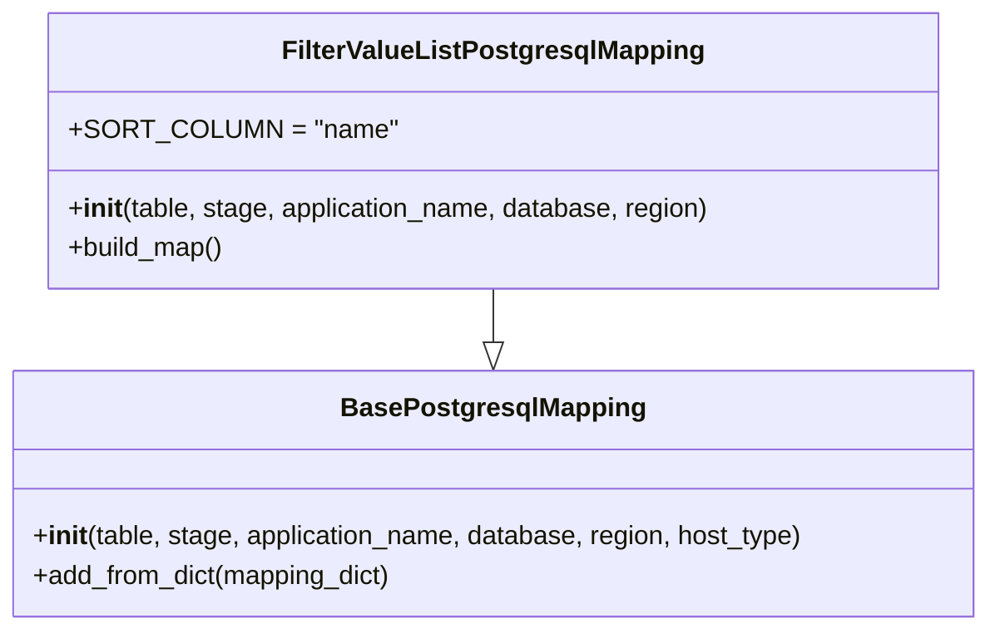

# Diagram: common/filter_service/filter_service/persistence/postgresql/FilterValueListPostgresqlMapping.py


> Auto-generated by Obscura crawlers

## Diagram 1



### SVG

<svg id="container" width="601.53125" xmlns="http://www.w3.org/2000/svg" class="classDiagram" height="384" viewBox="0 0 601.53125 384" role="graphics-document document" aria-roledescription="class"><style>#container{font-family:"trebuchet ms",verdana,arial,sans-serif;font-size:16px;fill:#333;}@keyframes edge-animation-frame{from{stroke-dashoffset:0;}}@keyframes dash{to{stroke-dashoffset:0;}}#container .edge-animation-slow{stroke-dasharray:9,5!important;stroke-dashoffset:900;animation:dash 50s linear infinite;stroke-linecap:round;}#container .edge-animation-fast{stroke-dasharray:9,5!important;stroke-dashoffset:900;animation:dash 20s linear infinite;stroke-linecap:round;}#container .error-icon{fill:#552222;}#container .error-text{fill:#552222;stroke:#552222;}#container .edge-thickness-normal{stroke-width:1px;}#container .edge-thickness-thick{stroke-width:3.5px;}#container .edge-pattern-solid{stroke-dasharray:0;}#container .edge-thickness-invisible{stroke-width:0;fill:none;}#container .edge-pattern-dashed{stroke-dasharray:3;}#container .edge-pattern-dotted{stroke-dasharray:2;}#container .marker{fill:#333333;stroke:#333333;}#container .marker.cross{stroke:#333333;}#container svg{font-family:"trebuchet ms",verdana,arial,sans-serif;font-size:16px;}#container p{margin:0;}#container g.classGroup text{fill:#9370DB;stroke:none;font-family:"trebuchet ms",verdana,arial,sans-serif;font-size:10px;}#container g.classGroup text .title{font-weight:bolder;}#container .nodeLabel,#container .edgeLabel{color:#131300;}#container .edgeLabel .label rect{fill:#ECECFF;}#container .label text{fill:#131300;}#container .labelBkg{background:#ECECFF;}#container .edgeLabel .label span{background:#ECECFF;}#container .classTitle{font-weight:bolder;}#container .node rect,#container .node circle,#container .node ellipse,#container .node polygon,#container .node path{fill:#ECECFF;stroke:#9370DB;stroke-width:1px;}#container .divider{stroke:#9370DB;stroke-width:1;}#container g.clickable{cursor:pointer;}#container g.classGroup rect{fill:#ECECFF;stroke:#9370DB;}#container g.classGroup line{stroke:#9370DB;stroke-width:1;}#container .classLabel .box{stroke:none;stroke-width:0;fill:#ECECFF;opacity:0.5;}#container .classLabel .label{fill:#9370DB;font-size:10px;}#container .relation{stroke:#333333;stroke-width:1;fill:none;}#container .dashed-line{stroke-dasharray:3;}#container .dotted-line{stroke-dasharray:1 2;}#container #compositionStart,#container .composition{fill:#333333!important;stroke:#333333!important;stroke-width:1;}#container #compositionEnd,#container .composition{fill:#333333!important;stroke:#333333!important;stroke-width:1;}#container #dependencyStart,#container .dependency{fill:#333333!important;stroke:#333333!important;stroke-width:1;}#container #dependencyStart,#container .dependency{fill:#333333!important;stroke:#333333!important;stroke-width:1;}#container #extensionStart,#container .extension{fill:transparent!important;stroke:#333333!important;stroke-width:1;}#container #extensionEnd,#container .extension{fill:transparent!important;stroke:#333333!important;stroke-width:1;}#container #aggregationStart,#container .aggregation{fill:transparent!important;stroke:#333333!important;stroke-width:1;}#container #aggregationEnd,#container .aggregation{fill:transparent!important;stroke:#333333!important;stroke-width:1;}#container #lollipopStart,#container .lollipop{fill:#ECECFF!important;stroke:#333333!important;stroke-width:1;}#container #lollipopEnd,#container .lollipop{fill:#ECECFF!important;stroke:#333333!important;stroke-width:1;}#container .edgeTerminals{font-size:11px;line-height:initial;}#container .classTitleText{text-anchor:middle;font-size:18px;fill:#333;}#container .label-icon{display:inline-block;height:1em;overflow:visible;vertical-align:-0.125em;}#container .node .label-icon path{fill:currentColor;stroke:revert;stroke-width:revert;}#container :root{--mermaid-font-family:"trebuchet ms",verdana,arial,sans-serif;}</style><g><defs><marker id="container_class-aggregationStart" class="marker aggregation class" refX="18" refY="7" markerWidth="190" markerHeight="240" orient="auto"><path d="M 18,7 L9,13 L1,7 L9,1 Z"></path></marker></defs><defs><marker id="container_class-aggregationEnd" class="marker aggregation class" refX="1" refY="7" markerWidth="20" markerHeight="28" orient="auto"><path d="M 18,7 L9,13 L1,7 L9,1 Z"></path></marker></defs><defs><marker id="container_class-extensionStart" class="marker extension class" refX="18" refY="7" markerWidth="190" markerHeight="240" orient="auto"><path d="M 1,7 L18,13 V 1 Z"></path></marker></defs><defs><marker id="container_class-extensionEnd" class="marker extension class" refX="1" refY="7" markerWidth="20" markerHeight="28" orient="auto"><path d="M 1,1 V 13 L18,7 Z"></path></marker></defs><defs><marker id="container_class-compositionStart" class="marker composition class" refX="18" refY="7" markerWidth="190" markerHeight="240" orient="auto"><path d="M 18,7 L9,13 L1,7 L9,1 Z"></path></marker></defs><defs><marker id="container_class-compositionEnd" class="marker composition class" refX="1" refY="7" markerWidth="20" markerHeight="28" orient="auto"><path d="M 18,7 L9,13 L1,7 L9,1 Z"></path></marker></defs><defs><marker id="container_class-dependencyStart" class="marker dependency class" refX="6" refY="7" markerWidth="190" markerHeight="240" orient="auto"><path d="M 5,7 L9,13 L1,7 L9,1 Z"></path></marker></defs><defs><marker id="container_class-dependencyEnd" class="marker dependency class" refX="13" refY="7" markerWidth="20" markerHeight="28" orient="auto"><path d="M 18,7 L9,13 L14,7 L9,1 Z"></path></marker></defs><defs><marker id="container_class-lollipopStart" class="marker lollipop class" refX="13" refY="7" markerWidth="190" markerHeight="240" orient="auto"><circle stroke="black" fill="transparent" cx="7" cy="7" r="6"></circle></marker></defs><defs><marker id="container_class-lollipopEnd" class="marker lollipop class" refX="1" refY="7" markerWidth="190" markerHeight="240" orient="auto"><circle stroke="black" fill="transparent" cx="7" cy="7" r="6"></circle></marker></defs><g class="root"><g class="clusters"></g><g class="edgePaths"><path d="M300.766,176L300.766,180.167C300.766,184.333,300.766,192.667,300.766,198.125C300.766,203.583,300.766,206.167,300.766,207.458L300.766,208.75" id="id_FilterValueListPostgresqlMapping_BasePostgresqlMapping_1" class="edge-thickness-normal edge-pattern-solid relation" style=";;;" data-edge="true" data-et="edge" data-id="id_FilterValueListPostgresqlMapping_BasePostgresqlMapping_1" data-points="W3sieCI6MzAwLjc2NTYyNSwieSI6MTc2fSx7IngiOjMwMC43NjU2MjUsInkiOjIwMX0seyJ4IjozMDAuNzY1NjI1LCJ5IjoyMjZ9XQ==" marker-end="url(#container_class-extensionEnd)"></path></g><g class="edgeLabels"><g class="edgeLabel"><g class="label" data-id="id_FilterValueListPostgresqlMapping_BasePostgresqlMapping_1" transform="translate(0, 0)"><foreignObject width="0" height="0"><div xmlns="http://www.w3.org/1999/xhtml" class="labelBkg" style="display: table-cell; white-space: nowrap; line-height: 1.5; max-width: 200px; text-align: center;"><span class="edgeLabel"></span></div></foreignObject></g></g></g><g class="nodes"><g class="node default" id="classId-BasePostgresqlMapping-0" transform="translate(300.765625, 301)"><g class="basic label-container"><path d="M-292.765625 -75 L292.765625 -75 L292.765625 75 L-292.765625 75" stroke="none" stroke-width="0" fill="#ECECFF" style=""></path><path d="M-292.765625 -75 C-158.77028600528004 -75, -24.774947010560084 -75, 292.765625 -75 M-292.765625 -75 C-79.52204043033285 -75, 133.7215441393343 -75, 292.765625 -75 M292.765625 -75 C292.765625 -17.086334708719583, 292.765625 40.82733058256083, 292.765625 75 M292.765625 -75 C292.765625 -32.575442823162376, 292.765625 9.849114353675247, 292.765625 75 M292.765625 75 C145.18730975504513 75, -2.3910054899097304 75, -292.765625 75 M292.765625 75 C167.39924264206903 75, 42.03286028413805 75, -292.765625 75 M-292.765625 75 C-292.765625 26.65736180355787, -292.765625 -21.685276392884262, -292.765625 -75 M-292.765625 75 C-292.765625 20.326733092422074, -292.765625 -34.34653381515585, -292.765625 -75" stroke="#9370DB" stroke-width="1.3" fill="none" stroke-dasharray="0 0" style=""></path></g><g class="annotation-group text" transform="translate(0, -51)"></g><g class="label-group text" transform="translate(-87.921875, -51)"><g class="label" style="font-weight: bolder" transform="translate(0,-12)"><foreignObject width="175.84375" height="24"><div xmlns="http://www.w3.org/1999/xhtml" style="display: table-cell; white-space: nowrap; line-height: 1.5; max-width: 223px; text-align: center;"><span class="nodeLabel markdown-node-label" style=""><p>BasePostgresqlMapping</p></span></div></foreignObject></g></g><g class="members-group text" transform="translate(-280.765625, -3)"></g><g class="methods-group text" transform="translate(-280.765625, 27)"><g class="label" style="" transform="translate(0,-12)"><foreignObject width="473.609375" height="24"><div xmlns="http://www.w3.org/1999/xhtml" style="display: table-cell; white-space: nowrap; line-height: 1.5; max-width: 562px; text-align: center;"><span class="nodeLabel markdown-node-label" style=""><p>+<strong>init</strong>(table, stage, application_name, database, region, host_type)</p></span></div></foreignObject></g><g class="label" style="" transform="translate(0,12)"><foreignObject width="222.78125" height="24"><div xmlns="http://www.w3.org/1999/xhtml" style="display: table-cell; white-space: nowrap; line-height: 1.5; max-width: 280px; text-align: center;"><span class="nodeLabel markdown-node-label" style=""><p>+add_from_dict(mapping_dict)</p></span></div></foreignObject></g></g><g class="divider" style=""><path d="M-292.765625 -27 C-98.72160671973532 -27, 95.32241156052936 -27, 292.765625 -27 M-292.765625 -27 C-59.09834480578314 -27, 174.56893538843372 -27, 292.765625 -27" stroke="#9370DB" stroke-width="1.3" fill="none" stroke-dasharray="0 0" style=""></path></g><g class="divider" style=""><path d="M-292.765625 -3 C-96.00039230914345 -3, 100.7648403817131 -3, 292.765625 -3 M-292.765625 -3 C-63.76777954926419 -3, 165.23006590147162 -3, 292.765625 -3" stroke="#9370DB" stroke-width="1.3" fill="none" stroke-dasharray="0 0" style=""></path></g></g><g class="node default" id="classId-FilterValueListPostgresqlMapping-1" transform="translate(300.765625, 92)"><g class="basic label-container"><path d="M-270.13671875 -84 L270.13671875 -84 L270.13671875 84 L-270.13671875 84" stroke="none" stroke-width="0" fill="#ECECFF" style=""></path><path d="M-270.13671875 -84 C-77.39131429230076 -84, 115.35409016539847 -84, 270.13671875 -84 M-270.13671875 -84 C-131.21593627813547 -84, 7.704846193729054 -84, 270.13671875 -84 M270.13671875 -84 C270.13671875 -42.38233305337404, 270.13671875 -0.7646661067480807, 270.13671875 84 M270.13671875 -84 C270.13671875 -20.81617990772508, 270.13671875 42.36764018454984, 270.13671875 84 M270.13671875 84 C114.81362129700207 84, -40.509476155995856 84, -270.13671875 84 M270.13671875 84 C82.62779352833857 84, -104.88113169332286 84, -270.13671875 84 M-270.13671875 84 C-270.13671875 16.847885768864998, -270.13671875 -50.304228462270004, -270.13671875 -84 M-270.13671875 84 C-270.13671875 28.43041114244678, -270.13671875 -27.13917771510644, -270.13671875 -84" stroke="#9370DB" stroke-width="1.3" fill="none" stroke-dasharray="0 0" style=""></path></g><g class="annotation-group text" transform="translate(0, -60)"></g><g class="label-group text" transform="translate(-122.4921875, -60)"><g class="label" style="font-weight: bolder" transform="translate(0,-12)"><foreignObject width="244.984375" height="24"><div xmlns="http://www.w3.org/1999/xhtml" style="display: table-cell; white-space: nowrap; line-height: 1.5; max-width: 291px; text-align: center;"><span class="nodeLabel markdown-node-label" style=""><p>FilterValueListPostgresqlMapping</p></span></div></foreignObject></g></g><g class="members-group text" transform="translate(-258.13671875, -12)"><g class="label" style="" transform="translate(0,-12)"><foreignObject width="182.5" height="24"><div xmlns="http://www.w3.org/1999/xhtml" style="display: table-cell; white-space: nowrap; line-height: 1.5; max-width: 240px; text-align: center;"><span class="nodeLabel markdown-node-label" style=""><p>+SORT_COLUMN = "name"</p></span></div></foreignObject></g></g><g class="methods-group text" transform="translate(-258.13671875, 36)"><g class="label" style="" transform="translate(0,-12)"><foreignObject width="393.78125" height="24"><div xmlns="http://www.w3.org/1999/xhtml" style="display: table-cell; white-space: nowrap; line-height: 1.5; max-width: 483px; text-align: center;"><span class="nodeLabel markdown-node-label" style=""><p>+<strong>init</strong>(table, stage, application_name, database, region)</p></span></div></foreignObject></g><g class="label" style="" transform="translate(0,12)"><foreignObject width="96.109375" height="24"><div xmlns="http://www.w3.org/1999/xhtml" style="display: table-cell; white-space: nowrap; line-height: 1.5; max-width: 153px; text-align: center;"><span class="nodeLabel markdown-node-label" style=""><p>+build_map()</p></span></div></foreignObject></g></g><g class="divider" style=""><path d="M-270.13671875 -36 C-69.3845881927615 -36, 131.367542364477 -36, 270.13671875 -36 M-270.13671875 -36 C-129.0132224536023 -36, 12.11027384279538 -36, 270.13671875 -36" stroke="#9370DB" stroke-width="1.3" fill="none" stroke-dasharray="0 0" style=""></path></g><g class="divider" style=""><path d="M-270.13671875 12 C-105.87765514878325 12, 58.381408452433504 12, 270.13671875 12 M-270.13671875 12 C-92.3599009224211 12, 85.41691690515779 12, 270.13671875 12" stroke="#9370DB" stroke-width="1.3" fill="none" stroke-dasharray="0 0" style=""></path></g></g></g></g></g></svg>

## Diagram 2

```mermaid
flowchart TD
    A[Instantiate FilterValueListPostgresqlMapping] --> B[BasePostgresqlMapping.__init__ called (host_type=PROXY_HOST)]
    B --> C[FilterValueListPostgresqlMapping.build_map()]
    C --> D[try: add_from_dict({...})]
    D --> E[Mapping added successfully]
    D -->|TypeError| F[except TypeError: print(error)]
    E --> G[build_map returns]
    F --> G
```

> SVG rendering failed for this diagram.
