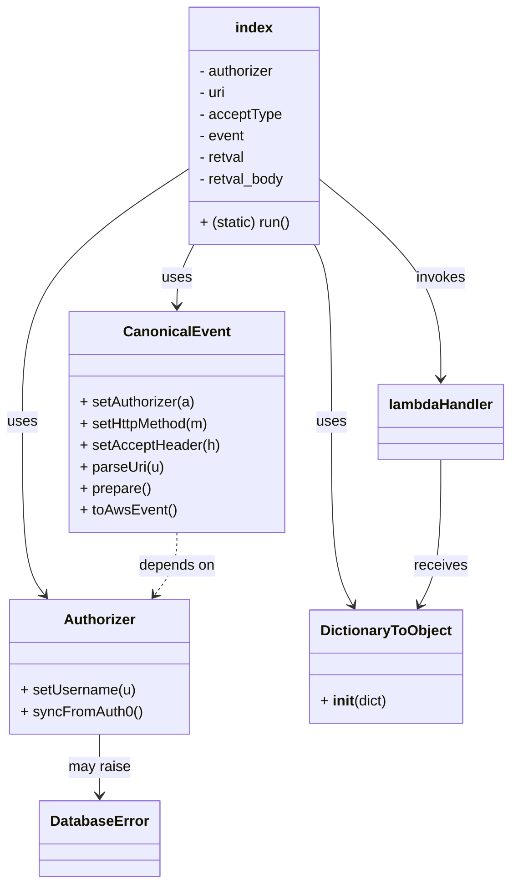

# Diagram: common/filter_service/filter_service_tests/old/index.py


> Auto-generated by Obscura crawlers

## Diagram 1



### SVG

<svg id="container" width="558.1171875" xmlns="http://www.w3.org/2000/svg" class="classDiagram" height="982" viewBox="0 0 558.1171875 982" role="graphics-document document" aria-roledescription="class"><style>#container{font-family:"trebuchet ms",verdana,arial,sans-serif;font-size:16px;fill:#333;}@keyframes edge-animation-frame{from{stroke-dashoffset:0;}}@keyframes dash{to{stroke-dashoffset:0;}}#container .edge-animation-slow{stroke-dasharray:9,5!important;stroke-dashoffset:900;animation:dash 50s linear infinite;stroke-linecap:round;}#container .edge-animation-fast{stroke-dasharray:9,5!important;stroke-dashoffset:900;animation:dash 20s linear infinite;stroke-linecap:round;}#container .error-icon{fill:#552222;}#container .error-text{fill:#552222;stroke:#552222;}#container .edge-thickness-normal{stroke-width:1px;}#container .edge-thickness-thick{stroke-width:3.5px;}#container .edge-pattern-solid{stroke-dasharray:0;}#container .edge-thickness-invisible{stroke-width:0;fill:none;}#container .edge-pattern-dashed{stroke-dasharray:3;}#container .edge-pattern-dotted{stroke-dasharray:2;}#container .marker{fill:#333333;stroke:#333333;}#container .marker.cross{stroke:#333333;}#container svg{font-family:"trebuchet ms",verdana,arial,sans-serif;font-size:16px;}#container p{margin:0;}#container g.classGroup text{fill:#9370DB;stroke:none;font-family:"trebuchet ms",verdana,arial,sans-serif;font-size:10px;}#container g.classGroup text .title{font-weight:bolder;}#container .nodeLabel,#container .edgeLabel{color:#131300;}#container .edgeLabel .label rect{fill:#ECECFF;}#container .label text{fill:#131300;}#container .labelBkg{background:#ECECFF;}#container .edgeLabel .label span{background:#ECECFF;}#container .classTitle{font-weight:bolder;}#container .node rect,#container .node circle,#container .node ellipse,#container .node polygon,#container .node path{fill:#ECECFF;stroke:#9370DB;stroke-width:1px;}#container .divider{stroke:#9370DB;stroke-width:1;}#container g.clickable{cursor:pointer;}#container g.classGroup rect{fill:#ECECFF;stroke:#9370DB;}#container g.classGroup line{stroke:#9370DB;stroke-width:1;}#container .classLabel .box{stroke:none;stroke-width:0;fill:#ECECFF;opacity:0.5;}#container .classLabel .label{fill:#9370DB;font-size:10px;}#container .relation{stroke:#333333;stroke-width:1;fill:none;}#container .dashed-line{stroke-dasharray:3;}#container .dotted-line{stroke-dasharray:1 2;}#container #compositionStart,#container .composition{fill:#333333!important;stroke:#333333!important;stroke-width:1;}#container #compositionEnd,#container .composition{fill:#333333!important;stroke:#333333!important;stroke-width:1;}#container #dependencyStart,#container .dependency{fill:#333333!important;stroke:#333333!important;stroke-width:1;}#container #dependencyStart,#container .dependency{fill:#333333!important;stroke:#333333!important;stroke-width:1;}#container #extensionStart,#container .extension{fill:transparent!important;stroke:#333333!important;stroke-width:1;}#container #extensionEnd,#container .extension{fill:transparent!important;stroke:#333333!important;stroke-width:1;}#container #aggregationStart,#container .aggregation{fill:transparent!important;stroke:#333333!important;stroke-width:1;}#container #aggregationEnd,#container .aggregation{fill:transparent!important;stroke:#333333!important;stroke-width:1;}#container #lollipopStart,#container .lollipop{fill:#ECECFF!important;stroke:#333333!important;stroke-width:1;}#container #lollipopEnd,#container .lollipop{fill:#ECECFF!important;stroke:#333333!important;stroke-width:1;}#container .edgeTerminals{font-size:11px;line-height:initial;}#container .classTitleText{text-anchor:middle;font-size:18px;fill:#333;}#container .label-icon{display:inline-block;height:1em;overflow:visible;vertical-align:-0.125em;}#container .node .label-icon path{fill:currentColor;stroke:revert;stroke-width:revert;}#container :root{--mermaid-font-family:"trebuchet ms",verdana,arial,sans-serif;}</style><g><defs><marker id="container_class-aggregationStart" class="marker aggregation class" refX="18" refY="7" markerWidth="190" markerHeight="240" orient="auto"><path d="M 18,7 L9,13 L1,7 L9,1 Z"></path></marker></defs><defs><marker id="container_class-aggregationEnd" class="marker aggregation class" refX="1" refY="7" markerWidth="20" markerHeight="28" orient="auto"><path d="M 18,7 L9,13 L1,7 L9,1 Z"></path></marker></defs><defs><marker id="container_class-extensionStart" class="marker extension class" refX="18" refY="7" markerWidth="190" markerHeight="240" orient="auto"><path d="M 1,7 L18,13 V 1 Z"></path></marker></defs><defs><marker id="container_class-extensionEnd" class="marker extension class" refX="1" refY="7" markerWidth="20" markerHeight="28" orient="auto"><path d="M 1,1 V 13 L18,7 Z"></path></marker></defs><defs><marker id="container_class-compositionStart" class="marker composition class" refX="18" refY="7" markerWidth="190" markerHeight="240" orient="auto"><path d="M 18,7 L9,13 L1,7 L9,1 Z"></path></marker></defs><defs><marker id="container_class-compositionEnd" class="marker composition class" refX="1" refY="7" markerWidth="20" markerHeight="28" orient="auto"><path d="M 18,7 L9,13 L1,7 L9,1 Z"></path></marker></defs><defs><marker id="container_class-dependencyStart" class="marker dependency class" refX="6" refY="7" markerWidth="190" markerHeight="240" orient="auto"><path d="M 5,7 L9,13 L1,7 L9,1 Z"></path></marker></defs><defs><marker id="container_class-dependencyEnd" class="marker dependency class" refX="13" refY="7" markerWidth="20" markerHeight="28" orient="auto"><path d="M 18,7 L9,13 L14,7 L9,1 Z"></path></marker></defs><defs><marker id="container_class-lollipopStart" class="marker lollipop class" refX="13" refY="7" markerWidth="190" markerHeight="240" orient="auto"><circle stroke="black" fill="transparent" cx="7" cy="7" r="6"></circle></marker></defs><defs><marker id="container_class-lollipopEnd" class="marker lollipop class" refX="1" refY="7" markerWidth="190" markerHeight="240" orient="auto"><circle stroke="black" fill="transparent" cx="7" cy="7" r="6"></circle></marker></defs><g class="root"><g class="clusters"></g><g class="edgePaths"><path d="M211.476,272L208.402,278.167C205.327,284.333,199.177,296.667,196.102,308C193.027,319.333,193.027,329.667,193.027,334.833L193.027,340" id="id_index_CanonicalEvent_1" class="edge-thickness-normal edge-pattern-solid relation" style=";;;" data-edge="true" data-et="edge" data-id="id_index_CanonicalEvent_1" data-points="W3sieCI6MjExLjQ3NjQ1ODQ4NzQyNjA0LCJ5IjoyNzJ9LHsieCI6MTkzLjAyNzM0Mzc1LCJ5IjozMDl9LHsieCI6MTkzLjAyNzM0Mzc1LCJ5IjozNDZ9XQ==" marker-end="url(#container_class-dependencyEnd)"></path><path d="M204.33,188.777L174.357,208.814C144.384,228.852,84.438,268.926,54.465,315.63C24.492,362.333,24.492,415.667,24.492,469C24.492,522.333,24.492,575.667,28.531,607.701C32.569,639.735,40.646,650.47,44.685,655.838L48.723,661.206" id="id_index_Authorizer_2" class="edge-thickness-normal edge-pattern-solid relation" style=";;;" data-edge="true" data-et="edge" data-id="id_index_Authorizer_2" data-points="W3sieCI6MjA0LjMzMDA3ODEyNSwieSI6MTg4Ljc3NzM5NDA1ODc5NH0seyJ4IjoyNC40OTIxODc1LCJ5IjozMDl9LHsieCI6MjQuNDkyMTg3NSwieSI6NDY5fSx7IngiOjI0LjQ5MjE4NzUsInkiOjYyOX0seyJ4Ijo1Mi4zMzA1ODM4NDQ4NjYwNywieSI6NjY2fV0=" marker-end="url(#container_class-dependencyEnd)"></path><path d="M343.113,272L346.188,278.167C349.263,284.333,355.413,296.667,358.488,329.5C361.563,362.333,361.563,415.667,361.563,469C361.563,522.333,361.563,575.667,365.466,609.619C369.37,643.57,377.177,658.141,381.08,665.426L384.984,672.711" id="id_index_DictionaryToObject_3" class="edge-thickness-normal edge-pattern-solid relation" style=";;;" data-edge="true" data-et="edge" data-id="id_index_DictionaryToObject_3" data-points="W3sieCI6MzQzLjExMzM4NTI2MjU3Mzk2LCJ5IjoyNzJ9LHsieCI6MzYxLjU2MjUsInkiOjMwOX0seyJ4IjozNjEuNTYyNSwieSI6NDY5fSx7IngiOjM2MS41NjI1LCJ5Ijo2Mjl9LHsieCI6Mzg3LjgxNzYyNjk1MzEyNSwieSI6Njc4fV0=" marker-end="url(#container_class-dependencyEnd)"></path><path d="M350.26,200.36L372.147,218.467C394.035,236.574,437.811,272.787,459.698,309.56C481.586,346.333,481.586,383.667,481.586,402.333L481.586,421" id="id_index_lambdaHandler_4" class="edge-thickness-normal edge-pattern-solid relation" style=";;;" data-edge="true" data-et="edge" data-id="id_index_lambdaHandler_4" data-points="W3sieCI6MzUwLjI1OTc2NTYyNSwieSI6MjAwLjM2MDI1ODg5ODQzODc2fSx7IngiOjQ4MS41ODU5Mzc1LCJ5IjozMDl9LHsieCI6NDgxLjU4NTkzNzUsInkiOjQyN31d" marker-end="url(#container_class-dependencyEnd)"></path><path d="M108.76,816L108.76,822.167C108.76,828.333,108.76,840.667,108.76,852C108.76,863.333,108.76,873.667,108.76,878.833L108.76,884" id="id_Authorizer_DatabaseError_5" class="edge-thickness-normal edge-pattern-solid relation" style=";;;" data-edge="true" data-et="edge" data-id="id_Authorizer_DatabaseError_5" data-points="W3sieCI6MTA4Ljc1OTc2NTYyNSwieSI6ODE2fSx7IngiOjEwOC43NTk3NjU2MjUsInkiOjg1M30seyJ4IjoxMDguNzU5NzY1NjI1LCJ5Ijo4OTB9XQ==" marker-end="url(#container_class-dependencyEnd)"></path><path d="M193.027,592L193.027,598.167C193.027,604.333,193.027,616.667,188.989,628.201C184.95,639.735,176.873,650.47,172.835,655.838L168.796,661.206" id="id_CanonicalEvent_Authorizer_6" class="edge-thickness-normal edge-pattern-dashed relation" style=";;;" data-edge="true" data-et="edge" data-id="id_CanonicalEvent_Authorizer_6" data-points="W3sieCI6MTkzLjAyNzM0Mzc1LCJ5Ijo1OTJ9LHsieCI6MTkzLjAyNzM0Mzc1LCJ5Ijo2Mjl9LHsieCI6MTY1LjE4ODk0NzQwNTEzMzk0LCJ5Ijo2NjZ9XQ==" marker-end="url(#container_class-dependencyEnd)"></path><path d="M481.586,511L481.586,530.667C481.586,550.333,481.586,589.667,477.682,616.619C473.779,643.57,465.972,658.141,462.068,665.426L458.165,672.711" id="id_lambdaHandler_DictionaryToObject_7" class="edge-thickness-normal edge-pattern-solid relation" style=";;;" data-edge="true" data-et="edge" data-id="id_lambdaHandler_DictionaryToObject_7" data-points="W3sieCI6NDgxLjU4NTkzNzUsInkiOjUxMX0seyJ4Ijo0ODEuNTg1OTM3NSwieSI6NjI5fSx7IngiOjQ1NS4zMzA4MTA1NDY4NzUsInkiOjY3OH1d" marker-end="url(#container_class-dependencyEnd)"></path></g><g class="edgeLabels"><g class="edgeLabel" transform="translate(193.02734375, 309)"><g class="label" data-id="id_index_CanonicalEvent_1" transform="translate(-16.4921875, -12)"><foreignObject width="32.984375" height="24"><div xmlns="http://www.w3.org/1999/xhtml" class="labelBkg" style="display: table-cell; white-space: nowrap; line-height: 1.5; max-width: 200px; text-align: center;"><span class="edgeLabel"><p>uses</p></span></div></foreignObject></g></g><g class="edgeLabel" transform="translate(24.4921875, 469)"><g class="label" data-id="id_index_Authorizer_2" transform="translate(-16.4921875, -12)"><foreignObject width="32.984375" height="24"><div xmlns="http://www.w3.org/1999/xhtml" class="labelBkg" style="display: table-cell; white-space: nowrap; line-height: 1.5; max-width: 200px; text-align: center;"><span class="edgeLabel"><p>uses</p></span></div></foreignObject></g></g><g class="edgeLabel" transform="translate(361.5625, 469)"><g class="label" data-id="id_index_DictionaryToObject_3" transform="translate(-16.4921875, -12)"><foreignObject width="32.984375" height="24"><div xmlns="http://www.w3.org/1999/xhtml" class="labelBkg" style="display: table-cell; white-space: nowrap; line-height: 1.5; max-width: 200px; text-align: center;"><span class="edgeLabel"><p>uses</p></span></div></foreignObject></g></g><g class="edgeLabel" transform="translate(481.5859375, 309)"><g class="label" data-id="id_index_lambdaHandler_4" transform="translate(-27.5859375, -12)"><foreignObject width="55.171875" height="24"><div xmlns="http://www.w3.org/1999/xhtml" class="labelBkg" style="display: table-cell; white-space: nowrap; line-height: 1.5; max-width: 200px; text-align: center;"><span class="edgeLabel"><p>invokes</p></span></div></foreignObject></g></g><g class="edgeLabel" transform="translate(108.759765625, 853)"><g class="label" data-id="id_Authorizer_DatabaseError_5" transform="translate(-34.65625, -12)"><foreignObject width="69.3125" height="24"><div xmlns="http://www.w3.org/1999/xhtml" class="labelBkg" style="display: table-cell; white-space: nowrap; line-height: 1.5; max-width: 200px; text-align: center;"><span class="edgeLabel"><p>may raise</p></span></div></foreignObject></g></g><g class="edgeLabel" transform="translate(193.02734375, 629)"><g class="label" data-id="id_CanonicalEvent_Authorizer_6" transform="translate(-42.9453125, -12)"><foreignObject width="85.890625" height="24"><div xmlns="http://www.w3.org/1999/xhtml" class="labelBkg" style="display: table-cell; white-space: nowrap; line-height: 1.5; max-width: 200px; text-align: center;"><span class="edgeLabel"><p>depends on</p></span></div></foreignObject></g></g><g class="edgeLabel" transform="translate(481.5859375, 629)"><g class="label" data-id="id_lambdaHandler_DictionaryToObject_7" transform="translate(-29.4921875, -12)"><foreignObject width="58.984375" height="24"><div xmlns="http://www.w3.org/1999/xhtml" class="labelBkg" style="display: table-cell; white-space: nowrap; line-height: 1.5; max-width: 200px; text-align: center;"><span class="edgeLabel"><p>receives</p></span></div></foreignObject></g></g></g><g class="nodes"><g class="node default" id="classId-index-0" transform="translate(277.294921875, 140)"><g class="basic label-container"><path d="M-72.96484375 -132 L72.96484375 -132 L72.96484375 132 L-72.96484375 132" stroke="none" stroke-width="0" fill="#ECECFF" style=""></path><path d="M-72.96484375 -132 C-21.816376878770633 -132, 29.332089992458734 -132, 72.96484375 -132 M-72.96484375 -132 C-41.988437178577335 -132, -11.01203060715467 -132, 72.96484375 -132 M72.96484375 -132 C72.96484375 -59.63109965982922, 72.96484375 12.737800680341564, 72.96484375 132 M72.96484375 -132 C72.96484375 -28.173002407196392, 72.96484375 75.65399518560722, 72.96484375 132 M72.96484375 132 C25.969655325375463 132, -21.025533099249074 132, -72.96484375 132 M72.96484375 132 C27.494958071314322 132, -17.974927607371356 132, -72.96484375 132 M-72.96484375 132 C-72.96484375 63.63819806085324, -72.96484375 -4.723603878293517, -72.96484375 -132 M-72.96484375 132 C-72.96484375 69.25012150532102, -72.96484375 6.500243010642038, -72.96484375 -132" stroke="#9370DB" stroke-width="1.3" fill="none" stroke-dasharray="0 0" style=""></path></g><g class="annotation-group text" transform="translate(0, -108)"></g><g class="label-group text" transform="translate(-20.0859375, -108)"><g class="label" style="font-weight: bolder" transform="translate(0,-12)"><foreignObject width="40.171875" height="24"><div xmlns="http://www.w3.org/1999/xhtml" style="display: table-cell; white-space: nowrap; line-height: 1.5; max-width: 90px; text-align: center;"><span class="nodeLabel markdown-node-label" style=""><p>index</p></span></div></foreignObject></g></g><g class="members-group text" transform="translate(-60.96484375, -60)"><g class="label" style="" transform="translate(0,-12)"><foreignObject width="85.671875" height="24"><div xmlns="http://www.w3.org/1999/xhtml" style="display: table-cell; white-space: nowrap; line-height: 1.5; max-width: 144px; text-align: center;"><span class="nodeLabel markdown-node-label" style=""><p>- authorizer</p></span></div></foreignObject></g><g class="label" style="" transform="translate(0,12)"><foreignObject width="30.703125" height="24"><div xmlns="http://www.w3.org/1999/xhtml" style="display: table-cell; white-space: nowrap; line-height: 1.5; max-width: 88px; text-align: center;"><span class="nodeLabel markdown-node-label" style=""><p>- uri</p></span></div></foreignObject></g><g class="label" style="" transform="translate(0,36)"><foreignObject width="91.78125" height="24"><div xmlns="http://www.w3.org/1999/xhtml" style="display: table-cell; white-space: nowrap; line-height: 1.5; max-width: 149px; text-align: center;"><span class="nodeLabel markdown-node-label" style=""><p>- acceptType</p></span></div></foreignObject></g><g class="label" style="" transform="translate(0,60)"><foreignObject width="51.03125" height="24"><div xmlns="http://www.w3.org/1999/xhtml" style="display: table-cell; white-space: nowrap; line-height: 1.5; max-width: 109px; text-align: center;"><span class="nodeLabel markdown-node-label" style=""><p>- event</p></span></div></foreignObject></g><g class="label" style="" transform="translate(0,84)"><foreignObject width="51.65625" height="24"><div xmlns="http://www.w3.org/1999/xhtml" style="display: table-cell; white-space: nowrap; line-height: 1.5; max-width: 109px; text-align: center;"><span class="nodeLabel markdown-node-label" style=""><p>- retval</p></span></div></foreignObject></g><g class="label" style="" transform="translate(0,108)"><foreignObject width="96.265625" height="24"><div xmlns="http://www.w3.org/1999/xhtml" style="display: table-cell; white-space: nowrap; line-height: 1.5; max-width: 154px; text-align: center;"><span class="nodeLabel markdown-node-label" style=""><p>- retval_body</p></span></div></foreignObject></g></g><g class="methods-group text" transform="translate(-60.96484375, 108)"><g class="label" style="" transform="translate(0,-12)"><foreignObject width="101.84375" height="24"><div xmlns="http://www.w3.org/1999/xhtml" style="display: table-cell; white-space: nowrap; line-height: 1.5; max-width: 159px; text-align: center;"><span class="nodeLabel markdown-node-label" style=""><p>+ (static) run()</p></span></div></foreignObject></g></g><g class="divider" style=""><path d="M-72.96484375 -84 C-37.629702140670645 -84, -2.29456053134129 -84, 72.96484375 -84 M-72.96484375 -84 C-30.718181416570474 -84, 11.528480916859053 -84, 72.96484375 -84" stroke="#9370DB" stroke-width="1.3" fill="none" stroke-dasharray="0 0" style=""></path></g><g class="divider" style=""><path d="M-72.96484375 84 C-28.974399045064295 84, 15.01604565987141 84, 72.96484375 84 M-72.96484375 84 C-21.885408253674193 84, 29.194027242651615 84, 72.96484375 84" stroke="#9370DB" stroke-width="1.3" fill="none" stroke-dasharray="0 0" style=""></path></g></g><g class="node default" id="classId-CanonicalEvent-1" transform="translate(193.02734375, 469)"><g class="basic label-container"><path d="M-117.04296875 -123 L117.04296875 -123 L117.04296875 123 L-117.04296875 123" stroke="none" stroke-width="0" fill="#ECECFF" style=""></path><path d="M-117.04296875 -123 C-61.20172231471429 -123, -5.360475879428577 -123, 117.04296875 -123 M-117.04296875 -123 C-48.712984467074364 -123, 19.616999815851273 -123, 117.04296875 -123 M117.04296875 -123 C117.04296875 -36.13776385659371, 117.04296875 50.724472286812585, 117.04296875 123 M117.04296875 -123 C117.04296875 -40.57016762662498, 117.04296875 41.85966474675004, 117.04296875 123 M117.04296875 123 C24.61637620978489 123, -67.81021633043022 123, -117.04296875 123 M117.04296875 123 C36.85161137229848 123, -43.33974600540304 123, -117.04296875 123 M-117.04296875 123 C-117.04296875 35.57019394254074, -117.04296875 -51.85961211491852, -117.04296875 -123 M-117.04296875 123 C-117.04296875 69.74257760313628, -117.04296875 16.48515520627255, -117.04296875 -123" stroke="#9370DB" stroke-width="1.3" fill="none" stroke-dasharray="0 0" style=""></path></g><g class="annotation-group text" transform="translate(0, -99)"></g><g class="label-group text" transform="translate(-55.7109375, -99)"><g class="label" style="font-weight: bolder" transform="translate(0,-12)"><foreignObject width="111.421875" height="24"><div xmlns="http://www.w3.org/1999/xhtml" style="display: table-cell; white-space: nowrap; line-height: 1.5; max-width: 161px; text-align: center;"><span class="nodeLabel markdown-node-label" style=""><p>CanonicalEvent</p></span></div></foreignObject></g></g><g class="members-group text" transform="translate(-105.04296875, -51)"></g><g class="methods-group text" transform="translate(-105.04296875, -21)"><g class="label" style="" transform="translate(0,-12)"><foreignObject width="128.71875" height="24"><div xmlns="http://www.w3.org/1999/xhtml" style="display: table-cell; white-space: nowrap; line-height: 1.5; max-width: 186px; text-align: center;"><span class="nodeLabel markdown-node-label" style=""><p>+ setAuthorizer(a)</p></span></div></foreignObject></g><g class="label" style="" transform="translate(0,12)"><foreignObject width="145.453125" height="24"><div xmlns="http://www.w3.org/1999/xhtml" style="display: table-cell; white-space: nowrap; line-height: 1.5; max-width: 203px; text-align: center;"><span class="nodeLabel markdown-node-label" style=""><p>+ setHttpMethod(m)</p></span></div></foreignObject></g><g class="label" style="" transform="translate(0,36)"><foreignObject width="154.375" height="24"><div xmlns="http://www.w3.org/1999/xhtml" style="display: table-cell; white-space: nowrap; line-height: 1.5; max-width: 212px; text-align: center;"><span class="nodeLabel markdown-node-label" style=""><p>+ setAcceptHeader(h)</p></span></div></foreignObject></g><g class="label" style="" transform="translate(0,60)"><foreignObject width="93.375" height="24"><div xmlns="http://www.w3.org/1999/xhtml" style="display: table-cell; white-space: nowrap; line-height: 1.5; max-width: 151px; text-align: center;"><span class="nodeLabel markdown-node-label" style=""><p>+ parseUri(u)</p></span></div></foreignObject></g><g class="label" style="" transform="translate(0,84)"><foreignObject width="78.984375" height="24"><div xmlns="http://www.w3.org/1999/xhtml" style="display: table-cell; white-space: nowrap; line-height: 1.5; max-width: 136px; text-align: center;"><span class="nodeLabel markdown-node-label" style=""><p>+ prepare()</p></span></div></foreignObject></g><g class="label" style="" transform="translate(0,108)"><foreignObject width="105.515625" height="24"><div xmlns="http://www.w3.org/1999/xhtml" style="display: table-cell; white-space: nowrap; line-height: 1.5; max-width: 163px; text-align: center;"><span class="nodeLabel markdown-node-label" style=""><p>+ toAwsEvent()</p></span></div></foreignObject></g></g><g class="divider" style=""><path d="M-117.04296875 -75 C-62.819427109482746 -75, -8.595885468965491 -75, 117.04296875 -75 M-117.04296875 -75 C-30.949784654867756 -75, 55.14339944026449 -75, 117.04296875 -75" stroke="#9370DB" stroke-width="1.3" fill="none" stroke-dasharray="0 0" style=""></path></g><g class="divider" style=""><path d="M-117.04296875 -51 C-27.827360768073362 -51, 61.388247213853276 -51, 117.04296875 -51 M-117.04296875 -51 C-63.8996991173741 -51, -10.756429484748196 -51, 117.04296875 -51" stroke="#9370DB" stroke-width="1.3" fill="none" stroke-dasharray="0 0" style=""></path></g></g><g class="node default" id="classId-Authorizer-2" transform="translate(108.759765625, 741)"><g class="basic label-container"><path d="M-97.83203125 -75 L97.83203125 -75 L97.83203125 75 L-97.83203125 75" stroke="none" stroke-width="0" fill="#ECECFF" style=""></path><path d="M-97.83203125 -75 C-30.682302194079313 -75, 36.467426861841375 -75, 97.83203125 -75 M-97.83203125 -75 C-23.615019193568656 -75, 50.60199286286269 -75, 97.83203125 -75 M97.83203125 -75 C97.83203125 -22.297133396239957, 97.83203125 30.405733207520086, 97.83203125 75 M97.83203125 -75 C97.83203125 -37.90092445548018, 97.83203125 -0.8018489109603593, 97.83203125 75 M97.83203125 75 C29.597129405000132 75, -38.637772439999736 75, -97.83203125 75 M97.83203125 75 C58.36714204941403 75, 18.902252848828056 75, -97.83203125 75 M-97.83203125 75 C-97.83203125 25.079460786310847, -97.83203125 -24.841078427378307, -97.83203125 -75 M-97.83203125 75 C-97.83203125 26.16423676820674, -97.83203125 -22.671526463586517, -97.83203125 -75" stroke="#9370DB" stroke-width="1.3" fill="none" stroke-dasharray="0 0" style=""></path></g><g class="annotation-group text" transform="translate(0, -51)"></g><g class="label-group text" transform="translate(-38.3671875, -51)"><g class="label" style="font-weight: bolder" transform="translate(0,-12)"><foreignObject width="76.734375" height="24"><div xmlns="http://www.w3.org/1999/xhtml" style="display: table-cell; white-space: nowrap; line-height: 1.5; max-width: 126px; text-align: center;"><span class="nodeLabel markdown-node-label" style=""><p>Authorizer</p></span></div></foreignObject></g></g><g class="members-group text" transform="translate(-85.83203125, -3)"></g><g class="methods-group text" transform="translate(-85.83203125, 27)"><g class="label" style="" transform="translate(0,-12)"><foreignObject width="127.265625" height="24"><div xmlns="http://www.w3.org/1999/xhtml" style="display: table-cell; white-space: nowrap; line-height: 1.5; max-width: 185px; text-align: center;"><span class="nodeLabel markdown-node-label" style=""><p>+ setUsername(u)</p></span></div></foreignObject></g><g class="label" style="" transform="translate(0,12)"><foreignObject width="133.296875" height="24"><div xmlns="http://www.w3.org/1999/xhtml" style="display: table-cell; white-space: nowrap; line-height: 1.5; max-width: 191px; text-align: center;"><span class="nodeLabel markdown-node-label" style=""><p>+ syncFromAuth0()</p></span></div></foreignObject></g></g><g class="divider" style=""><path d="M-97.83203125 -27 C-31.657367544127055 -27, 34.51729616174589 -27, 97.83203125 -27 M-97.83203125 -27 C-51.74446261871099 -27, -5.656893987421981 -27, 97.83203125 -27" stroke="#9370DB" stroke-width="1.3" fill="none" stroke-dasharray="0 0" style=""></path></g><g class="divider" style=""><path d="M-97.83203125 -3 C-49.638812636139996 -3, -1.445594022279991 -3, 97.83203125 -3 M-97.83203125 -3 C-26.967591658636422 -3, 43.896847932727155 -3, 97.83203125 -3" stroke="#9370DB" stroke-width="1.3" fill="none" stroke-dasharray="0 0" style=""></path></g></g><g class="node default" id="classId-DictionaryToObject-3" transform="translate(421.57421875, 741)"><g class="basic label-container"><path d="M-84.328125 -63 L84.328125 -63 L84.328125 63 L-84.328125 63" stroke="none" stroke-width="0" fill="#ECECFF" style=""></path><path d="M-84.328125 -63 C-43.499486801276795 -63, -2.6708486025535905 -63, 84.328125 -63 M-84.328125 -63 C-26.834440622786936 -63, 30.65924375442613 -63, 84.328125 -63 M84.328125 -63 C84.328125 -23.915974588766424, 84.328125 15.168050822467151, 84.328125 63 M84.328125 -63 C84.328125 -25.83381394008486, 84.328125 11.332372119830282, 84.328125 63 M84.328125 63 C34.141408452128346 63, -16.04530809574331 63, -84.328125 63 M84.328125 63 C23.52736558851076 63, -37.27339382297848 63, -84.328125 63 M-84.328125 63 C-84.328125 34.60681630576582, -84.328125 6.2136326115316365, -84.328125 -63 M-84.328125 63 C-84.328125 15.549532467557512, -84.328125 -31.900935064884976, -84.328125 -63" stroke="#9370DB" stroke-width="1.3" fill="none" stroke-dasharray="0 0" style=""></path></g><g class="annotation-group text" transform="translate(0, -39)"></g><g class="label-group text" transform="translate(-70.109375, -39)"><g class="label" style="font-weight: bolder" transform="translate(0,-12)"><foreignObject width="140.21875" height="24"><div xmlns="http://www.w3.org/1999/xhtml" style="display: table-cell; white-space: nowrap; line-height: 1.5; max-width: 188px; text-align: center;"><span class="nodeLabel markdown-node-label" style=""><p>DictionaryToObject</p></span></div></foreignObject></g></g><g class="members-group text" transform="translate(-72.328125, 9)"></g><g class="methods-group text" transform="translate(-72.328125, 39)"><g class="label" style="" transform="translate(0,-12)"><foreignObject width="74.546875" height="24"><div xmlns="http://www.w3.org/1999/xhtml" style="display: table-cell; white-space: nowrap; line-height: 1.5; max-width: 165px; text-align: center;"><span class="nodeLabel markdown-node-label" style=""><p>+ <strong>init</strong>(dict)</p></span></div></foreignObject></g></g><g class="divider" style=""><path d="M-84.328125 -15 C-33.70998347746992 -15, 16.908158045060162 -15, 84.328125 -15 M-84.328125 -15 C-42.458989398736776 -15, -0.5898537974735518 -15, 84.328125 -15" stroke="#9370DB" stroke-width="1.3" fill="none" stroke-dasharray="0 0" style=""></path></g><g class="divider" style=""><path d="M-84.328125 9 C-18.093181393470573 9, 48.141762213058854 9, 84.328125 9 M-84.328125 9 C-27.01510898112828 9, 30.297907037743443 9, 84.328125 9" stroke="#9370DB" stroke-width="1.3" fill="none" stroke-dasharray="0 0" style=""></path></g></g><g class="node default" id="classId-DatabaseError-4" transform="translate(108.759765625, 932)"><g class="basic label-container"><path d="M-64.359375 -42 L64.359375 -42 L64.359375 42 L-64.359375 42" stroke="none" stroke-width="0" fill="#ECECFF" style=""></path><path d="M-64.359375 -42 C-17.200180553128277 -42, 29.959013893743446 -42, 64.359375 -42 M-64.359375 -42 C-37.33813137279088 -42, -10.316887745581766 -42, 64.359375 -42 M64.359375 -42 C64.359375 -22.55658377824001, 64.359375 -3.113167556480022, 64.359375 42 M64.359375 -42 C64.359375 -23.67801086534937, 64.359375 -5.3560217306987425, 64.359375 42 M64.359375 42 C16.15469145443366 42, -32.04999209113268 42, -64.359375 42 M64.359375 42 C16.12361076030647 42, -32.11215347938706 42, -64.359375 42 M-64.359375 42 C-64.359375 21.669457583955772, -64.359375 1.3389151679115443, -64.359375 -42 M-64.359375 42 C-64.359375 9.001907978458362, -64.359375 -23.996184043083275, -64.359375 -42" stroke="#9370DB" stroke-width="1.3" fill="none" stroke-dasharray="0 0" style=""></path></g><g class="annotation-group text" transform="translate(0, -18)"></g><g class="label-group text" transform="translate(-52.359375, -18)"><g class="label" style="font-weight: bolder" transform="translate(0,-12)"><foreignObject width="104.71875" height="24"><div xmlns="http://www.w3.org/1999/xhtml" style="display: table-cell; white-space: nowrap; line-height: 1.5; max-width: 154px; text-align: center;"><span class="nodeLabel markdown-node-label" style=""><p>DatabaseError</p></span></div></foreignObject></g></g><g class="members-group text" transform="translate(-52.359375, 30)"></g><g class="methods-group text" transform="translate(-52.359375, 60)"></g><g class="divider" style=""><path d="M-64.359375 6 C-15.827180976355635 6, 32.70501304728873 6, 64.359375 6 M-64.359375 6 C-35.63233771391564 6, -6.905300427831278 6, 64.359375 6" stroke="#9370DB" stroke-width="1.3" fill="none" stroke-dasharray="0 0" style=""></path></g><g class="divider" style=""><path d="M-64.359375 24 C-22.744493781081736 24, 18.870387437836527 24, 64.359375 24 M-64.359375 24 C-30.727193271470178 24, 2.9049884570596447 24, 64.359375 24" stroke="#9370DB" stroke-width="1.3" fill="none" stroke-dasharray="0 0" style=""></path></g></g><g class="node default" id="classId-lambdaHandler-5" transform="translate(481.5859375, 469)"><g class="basic label-container"><path d="M-68.53125 -42 L68.53125 -42 L68.53125 42 L-68.53125 42" stroke="none" stroke-width="0" fill="#ECECFF" style=""></path><path d="M-68.53125 -42 C-34.1466926855891 -42, 0.2378646288217965 -42, 68.53125 -42 M-68.53125 -42 C-37.93384437812824 -42, -7.3364387562564914 -42, 68.53125 -42 M68.53125 -42 C68.53125 -21.127795711444982, 68.53125 -0.25559142288996384, 68.53125 42 M68.53125 -42 C68.53125 -22.58429553777787, 68.53125 -3.1685910755557387, 68.53125 42 M68.53125 42 C24.648098291307377 42, -19.235053417385245 42, -68.53125 42 M68.53125 42 C29.689144020917652 42, -9.152961958164695 42, -68.53125 42 M-68.53125 42 C-68.53125 10.633414205351983, -68.53125 -20.733171589296035, -68.53125 -42 M-68.53125 42 C-68.53125 11.45630641209712, -68.53125 -19.08738717580576, -68.53125 -42" stroke="#9370DB" stroke-width="1.3" fill="none" stroke-dasharray="0 0" style=""></path></g><g class="annotation-group text" transform="translate(0, -18)"></g><g class="label-group text" transform="translate(-56.53125, -18)"><g class="label" style="font-weight: bolder" transform="translate(0,-12)"><foreignObject width="113.0625" height="24"><div xmlns="http://www.w3.org/1999/xhtml" style="display: table-cell; white-space: nowrap; line-height: 1.5; max-width: 164px; text-align: center;"><span class="nodeLabel markdown-node-label" style=""><p>lambdaHandler</p></span></div></foreignObject></g></g><g class="members-group text" transform="translate(-56.53125, 30)"></g><g class="methods-group text" transform="translate(-56.53125, 60)"></g><g class="divider" style=""><path d="M-68.53125 6 C-16.835616112323045 6, 34.86001777535391 6, 68.53125 6 M-68.53125 6 C-16.84386158628206 6, 34.84352682743588 6, 68.53125 6" stroke="#9370DB" stroke-width="1.3" fill="none" stroke-dasharray="0 0" style=""></path></g><g class="divider" style=""><path d="M-68.53125 24 C-30.863812292694227 24, 6.803625414611545 24, 68.53125 24 M-68.53125 24 C-24.664313289316624 24, 19.202623421366752 24, 68.53125 24" stroke="#9370DB" stroke-width="1.3" fill="none" stroke-dasharray="0 0" style=""></path></g></g></g></g></g></svg>

## Diagram 2

```mermaid
flowchart TD
    Start([Start]) --> InitAuthorizer[Create Authorizer\nsetUsername(...)\nsyncFromAuth0()]
    InitAuthorizer --> BuildURI[Set URI and Accept Header]
    BuildURI --> BuildEvent[CanonicalEvent builder\nsetAuthorizer -> setHttpMethod -> setAcceptHeader\nparseUri -> prepare -> toAwsEvent]
    BuildEvent --> InvokeLambda[Invoke lambdaHandler(event, context)]
    InvokeLambda --> ParseResponse[Parse JSON body of retval]
    ParseResponse --> End([End])
    BuildEvent -.->|DatabaseError| ErrorHandler[Print error] --> End
```

> SVG rendering failed for this diagram.
