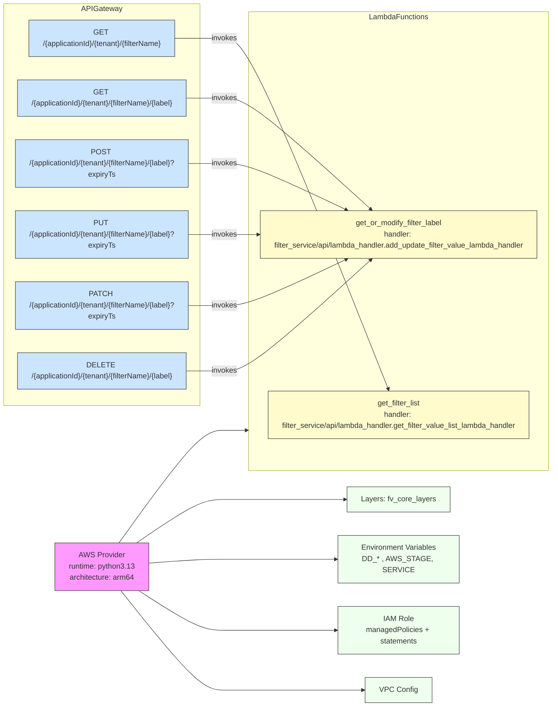

# Diagram: common/filter_service/serverless.filter_service.yml

> Auto-generated by Obscura crawlers

## Mermaid

### SVG

<svg id="container" width="1234.609375" xmlns="http://www.w3.org/2000/svg" class="flowchart" height="1488" viewBox="0 0 1234.609375 1488" role="graphics-document document" aria-roledescription="flowchart-v2"><g><marker id="container_flowchart-v2-pointEnd" class="marker flowchart-v2" viewBox="0 0 10 10" refX="5" refY="5" markerUnits="userSpaceOnUse" markerWidth="8" markerHeight="8" orient="auto"><path d="M 0 0 L 10 5 L 0 10 z" class="arrowMarkerPath" style="stroke-width: 1; stroke-dasharray: 1, 0;"></path></marker><marker id="container_flowchart-v2-pointStart" class="marker flowchart-v2" viewBox="0 0 10 10" refX="4.5" refY="5" markerUnits="userSpaceOnUse" markerWidth="8" markerHeight="8" orient="auto"><path d="M 0 5 L 10 10 L 10 0 z" class="arrowMarkerPath" style="stroke-width: 1; stroke-dasharray: 1, 0;"></path></marker><marker id="container_flowchart-v2-circleEnd" class="marker flowchart-v2" viewBox="0 0 10 10" refX="11" refY="5" markerUnits="userSpaceOnUse" markerWidth="11" markerHeight="11" orient="auto"><circle cx="5" cy="5" r="5" class="arrowMarkerPath" style="stroke-width: 1; stroke-dasharray: 1, 0;"></circle></marker><marker id="container_flowchart-v2-circleStart" class="marker flowchart-v2" viewBox="0 0 10 10" refX="-1" refY="5" markerUnits="userSpaceOnUse" markerWidth="11" markerHeight="11" orient="auto"><circle cx="5" cy="5" r="5" class="arrowMarkerPath" style="stroke-width: 1; stroke-dasharray: 1, 0;"></circle></marker><marker id="container_flowchart-v2-crossEnd" class="marker cross flowchart-v2" viewBox="0 0 11 11" refX="12" refY="5.2" markerUnits="userSpaceOnUse" markerWidth="11" markerHeight="11" orient="auto"><path d="M 1,1 l 9,9 M 10,1 l -9,9" class="arrowMarkerPath" style="stroke-width: 2; stroke-dasharray: 1, 0;"></path></marker><marker id="container_flowchart-v2-crossStart" class="marker cross flowchart-v2" viewBox="0 0 11 11" refX="-1" refY="5.2" markerUnits="userSpaceOnUse" markerWidth="11" markerHeight="11" orient="auto"><path d="M 1,1 l 9,9 M 10,1 l -9,9" class="arrowMarkerPath" style="stroke-width: 2; stroke-dasharray: 1, 0;"></path></marker><g class="root"><g class="clusters"><g class="cluster" id="APIGateway" data-look="classic"><rect style="" x="8" y="8" width="448.40625" height="860"></rect><g class="cluster-label" transform="translate(190.2734375, 8)"><foreignObject width="83.859375" height="24">

APIGateway

</foreignObject></g></g><g class="cluster" id="LambdaFunctions" data-look="classic"><rect style="" x="561.578125" y="25" width="665.03125" height="982"></rect><g class="cluster-label" transform="translate(830.046875, 25)"><foreignObject width="128.09375" height="24">

LambdaFunctions

</foreignObject></g></g></g><g class="edgePaths"><path d="M277.578,1252L307.382,1285.5C337.187,1319,396.797,1386,435.366,1419.5C473.935,1453,491.464,1453,508.992,1453C526.521,1453,544.049,1453,596.21,1453C648.37,1453,735.161,1453,778.557,1453L821.953,1453" id="L_Provider_VPC_0" class="edge-thickness-normal edge-pattern-solid edge-thickness-normal edge-pattern-solid flowchart-link" style=";" data-edge="true" data-et="edge" data-id="L_Provider_VPC_0" data-points="W3sieCI6Mjc3LjU3NzU2Njk2NDI4NTcsInkiOjEyNTJ9LHsieCI6NDU2LjQwNjI1LCJ5IjoxNDUzfSx7IngiOjUwOC45OTIxODc1LCJ5IjoxNDUzfSx7IngiOjU2MS41NzgxMjUsInkiOjE0NTN9LHsieCI6ODI1Ljk1MzEyNSwieSI6MTQ1M31d" marker-end="url(#container_flowchart-v2-pointEnd)"></path><path d="M324.416,1252L346.414,1264.167C368.413,1276.333,412.409,1300.667,443.172,1312.833C473.935,1325,491.464,1325,508.992,1325C526.521,1325,544.049,1325,585.9,1325C627.75,1325,693.922,1325,727.008,1325L760.094,1325" id="L_Provider_IAM_0" class="edge-thickness-normal edge-pattern-solid edge-thickness-normal edge-pattern-solid flowchart-link" style=";" data-edge="true" data-et="edge" data-id="L_Provider_IAM_0" data-points="W3sieCI6MzI0LjQxNTcwMDYwNDgzODcsInkiOjEyNTJ9LHsieCI6NDU2LjQwNjI1LCJ5IjoxMzI1fSx7IngiOjUwOC45OTIxODc1LCJ5IjoxMzI1fSx7IngiOjU2MS41NzgxMjUsInkiOjEzMjV9LHsieCI6NzY0LjA5Mzc1LCJ5IjoxMzI1fV0=" marker-end="url(#container_flowchart-v2-pointEnd)"></path><path d="M333.195,1193.793L353.73,1192.327C374.266,1190.862,415.336,1187.931,444.635,1186.465C473.935,1185,491.464,1185,508.992,1185C526.521,1185,544.049,1185,586.393,1185C628.737,1185,695.896,1185,729.475,1185L763.055,1185" id="L_Provider_Env_0" class="edge-thickness-normal edge-pattern-solid edge-thickness-normal edge-pattern-solid flowchart-link" style=";" data-edge="true" data-et="edge" data-id="L_Provider_Env_0" data-points="W3sieCI6MzMzLjE5NTMxMjUsInkiOjExOTMuNzkyODA3ODYxMTc1fSx7IngiOjQ1Ni40MDYyNSwieSI6MTE4NX0seyJ4Ijo1MDguOTkyMTg3NSwieSI6MTE4NX0seyJ4Ijo1NjEuNTc4MTI1LCJ5IjoxMTg1fSx7IngiOjc2Ny4wNTQ2ODc1LCJ5IjoxMTg1fV0=" marker-end="url(#container_flowchart-v2-pointEnd)"></path><path d="M318.827,1150L341.757,1136.5C364.687,1123,410.547,1096,442.241,1082.5C473.935,1069,491.464,1069,508.992,1069C526.521,1069,544.049,1069,589.484,1069C634.919,1069,708.26,1069,744.931,1069L781.602,1069" id="L_Provider_Layers_0" class="edge-thickness-normal edge-pattern-solid edge-thickness-normal edge-pattern-solid flowchart-link" style=";" data-edge="true" data-et="edge" data-id="L_Provider_Layers_0" data-points="W3sieCI6MzE4LjgyNzA1OTY1OTA5MDksInkiOjExNTB9LHsieCI6NDU2LjQwNjI1LCJ5IjoxMDY5fSx7IngiOjUwOC45OTIxODc1LCJ5IjoxMDY5fSx7IngiOjU2MS41NzgxMjUsInkiOjEwNjl9LHsieCI6Nzg1LjYwMTU2MjUsInkiOjEwNjl9XQ==" marker-end="url(#container_flowchart-v2-pointEnd)"></path><path d="M400.281,82L409.635,82C418.99,82,437.698,82,455.816,82C473.935,82,491.464,82,508.992,82C526.521,82,544.049,82,604.472,207.217C664.895,332.434,768.212,582.868,819.87,708.085L871.528,833.302" id="L_API1_F1_0" class="edge-thickness-normal edge-pattern-solid edge-thickness-normal edge-pattern-solid flowchart-link" style=";" data-edge="true" data-et="edge" data-id="L_API1_F1_0" data-points="W3sieCI6NDAwLjI4MTI1LCJ5Ijo4Mn0seyJ4Ijo0NTYuNDA2MjUsInkiOjgyfSx7IngiOjUwOC45OTIxODc1LCJ5Ijo4Mn0seyJ4Ijo1NjEuNTc4MTI1LCJ5Ijo4Mn0seyJ4Ijo4NzMuMDUzNjc5NDM1NDgzOSwieSI6ODM3fV0=" marker-end="url(#container_flowchart-v2-pointEnd)"></path><path d="M427.734,210L432.513,210C437.292,210,446.849,210,460.392,210C473.935,210,491.464,210,508.992,210C526.521,210,544.049,210,598.053,249.727C652.056,289.454,742.534,368.907,787.773,408.634L833.012,448.361" id="L_API2_get_F2_0" class="edge-thickness-normal edge-pattern-solid edge-thickness-normal edge-pattern-solid flowchart-link" style=";" data-edge="true" data-et="edge" data-id="L_API2_get_F2_0" data-points="W3sieCI6NDI3LjczNDM3NSwieSI6MjEwfSx7IngiOjQ1Ni40MDYyNSwieSI6MjEwfSx7IngiOjUwOC45OTIxODc1LCJ5IjoyMTB9LHsieCI6NTYxLjU3ODEyNSwieSI6MjEwfSx7IngiOjgzNi4wMTczOTA4MzkwNDExLCJ5Ijo0NTF9XQ==" marker-end="url(#container_flowchart-v2-pointEnd)"></path><path d="M431.406,350L435.573,350C439.74,350,448.073,350,461.004,350C473.935,350,491.464,350,508.992,350C526.521,350,544.049,350,589.032,366.556C634.015,383.112,706.451,416.225,742.67,432.781L778.888,449.337" id="L_API2_post_F2_0" class="edge-thickness-normal edge-pattern-solid edge-thickness-normal edge-pattern-solid flowchart-link" style=";" data-edge="true" data-et="edge" data-id="L_API2_post_F2_0" data-points="W3sieCI6NDMxLjQwNjI1LCJ5IjozNTB9LHsieCI6NDU2LjQwNjI1LCJ5IjozNTB9LHsieCI6NTA4Ljk5MjE4NzUsInkiOjM1MH0seyJ4Ijo1NjEuNTc4MTI1LCJ5IjozNTB9LHsieCI6NzgyLjUyNjAwNzQwMTMxNTgsInkiOjQ1MX1d" marker-end="url(#container_flowchart-v2-pointEnd)"></path><path d="M431.406,502L435.573,502C439.74,502,448.073,502,461.004,502C473.935,502,491.464,502,508.992,502C526.521,502,544.049,502,556.314,502C568.578,502,575.578,502,579.078,502L582.578,502" id="L_API2_put_F2_0" class="edge-thickness-normal edge-pattern-solid edge-thickness-normal edge-pattern-solid flowchart-link" style=";" data-edge="true" data-et="edge" data-id="L_API2_put_F2_0" data-points="W3sieCI6NDMxLjQwNjI1LCJ5Ijo1MDJ9LHsieCI6NDU2LjQwNjI1LCJ5Ijo1MDJ9LHsieCI6NTA4Ljk5MjE4NzUsInkiOjUwMn0seyJ4Ijo1NjEuNTc4MTI1LCJ5Ijo1MDJ9LHsieCI6NTg2LjU3ODEyNSwieSI6NTAyfV0=" marker-end="url(#container_flowchart-v2-pointEnd)"></path><path d="M431.406,654L435.573,654C439.74,654,448.073,654,461.004,654C473.935,654,491.464,654,508.992,654C526.521,654,544.049,654,589.032,637.444C634.015,620.888,706.451,587.775,742.67,571.219L778.888,554.663" id="L_API2_patch_F2_0" class="edge-thickness-normal edge-pattern-solid edge-thickness-normal edge-pattern-solid flowchart-link" style=";" data-edge="true" data-et="edge" data-id="L_API2_patch_F2_0" data-points="W3sieCI6NDMxLjQwNjI1LCJ5Ijo2NTR9LHsieCI6NDU2LjQwNjI1LCJ5Ijo2NTR9LHsieCI6NTA4Ljk5MjE4NzUsInkiOjY1NH0seyJ4Ijo1NjEuNTc4MTI1LCJ5Ijo2NTR9LHsieCI6NzgyLjUyNjAwNzQwMTMxNTgsInkiOjU1M31d" marker-end="url(#container_flowchart-v2-pointEnd)"></path><path d="M427.734,794L432.513,794C437.292,794,446.849,794,460.392,794C473.935,794,491.464,794,508.992,794C526.521,794,544.049,794,598.053,754.273C652.056,714.546,742.534,635.093,787.773,595.366L833.012,555.639" id="L_API2_delete_F2_0" class="edge-thickness-normal edge-pattern-solid edge-thickness-normal edge-pattern-solid flowchart-link" style=";" data-edge="true" data-et="edge" data-id="L_API2_delete_F2_0" data-points="W3sieCI6NDI3LjczNDM3NSwieSI6Nzk0fSx7IngiOjQ1Ni40MDYyNSwieSI6Nzk0fSx7IngiOjUwOC45OTIxODc1LCJ5Ijo3OTR9LHsieCI6NTYxLjU3ODEyNSwieSI6Nzk0fSx7IngiOjgzNi4wMTczOTA4MzkwNDExLCJ5Ijo1NTN9XQ==" marker-end="url(#container_flowchart-v2-pointEnd)"></path><path d="M273.04,1150L303.601,1111.833C334.162,1073.667,395.284,997.333,434.61,959.167C473.935,921,491.464,921,508.326,921C525.188,921,541.383,921,549.48,921L557.578,921" id="L_Provider_LambdaFunctions_0" class="edge-thickness-normal edge-pattern-solid edge-thickness-normal edge-pattern-solid flowchart-link" style=";" data-edge="true" data-et="edge" data-id="L_Provider_LambdaFunctions_0" data-points="W3sieCI6MjczLjA0MDEyMjc2Nzg1NzE2LCJ5IjoxMTUwfSx7IngiOjQ1Ni40MDYyNSwieSI6OTIxfSx7IngiOjUwOC45OTIxODc1LCJ5Ijo5MjF9LHsieCI6NTYxLjU3ODEyNSwieSI6OTIxfSx7IngiOjYwMy41LCJ5Ijo5MTYuODM5NTI4MjE3NjU5fV0=" marker-end="url(#container_flowchart-v2-pointEnd)"></path></g><g class="edgeLabels"><g class="edgeLabel"><g class="label" data-id="L_Provider_VPC_0" transform="translate(0, 0)"><foreignObject width="0" height="0">

</foreignObject></g></g><g class="edgeLabel"><g class="label" data-id="L_Provider_IAM_0" transform="translate(0, 0)"><foreignObject width="0" height="0">

</foreignObject></g></g><g class="edgeLabel"><g class="label" data-id="L_Provider_Env_0" transform="translate(0, 0)"><foreignObject width="0" height="0">

</foreignObject></g></g><g class="edgeLabel"><g class="label" data-id="L_Provider_Layers_0" transform="translate(0, 0)"><foreignObject width="0" height="0">

</foreignObject></g></g><g class="edgeLabel" transform="translate(508.9921875, 82)"><g class="label" data-id="L_API1_F1_0" transform="translate(-27.5859375, -12)"><foreignObject width="55.171875" height="24">

invokes

</foreignObject></g></g><g class="edgeLabel" transform="translate(508.9921875, 210)"><g class="label" data-id="L_API2_get_F2_0" transform="translate(-27.5859375, -12)"><foreignObject width="55.171875" height="24">

invokes

</foreignObject></g></g><g class="edgeLabel" transform="translate(508.9921875, 350)"><g class="label" data-id="L_API2_post_F2_0" transform="translate(-27.5859375, -12)"><foreignObject width="55.171875" height="24">

invokes

</foreignObject></g></g><g class="edgeLabel" transform="translate(508.9921875, 502)"><g class="label" data-id="L_API2_put_F2_0" transform="translate(-27.5859375, -12)"><foreignObject width="55.171875" height="24">

invokes

</foreignObject></g></g><g class="edgeLabel" transform="translate(508.9921875, 654)"><g class="label" data-id="L_API2_patch_F2_0" transform="translate(-27.5859375, -12)"><foreignObject width="55.171875" height="24">

invokes

</foreignObject></g></g><g class="edgeLabel" transform="translate(508.9921875, 794)"><g class="label" data-id="L_API2_delete_F2_0" transform="translate(-27.5859375, -12)"><foreignObject width="55.171875" height="24">

invokes

</foreignObject></g></g><g class="edgeLabel"><g class="label" data-id="L_Provider_LambdaFunctions_0" transform="translate(0, 0)"><foreignObject width="0" height="0">

</foreignObject></g></g></g><g class="nodes"><g class="node default provider" id="flowchart-Provider-0" transform="translate(232.203125, 1201)"><rect class="basic label-container" style="fill:#f9f !important;stroke:#333 !important;stroke-width:1px !important" x="-100.9921875" y="-51" width="201.984375" height="102"></rect><g class="label" style="" transform="translate(-70.9921875, -36)"><rect></rect><foreignObject width="141.984375" height="72">

AWS Provider runtime: python3.13 architecture: arm64

</foreignObject></g></g><g class="node default config" id="flowchart-VPC-1" transform="translate(894.09375, 1453)"><rect class="basic label-container" style="fill:#efe !important;stroke:#333 !important;stroke-width:1px !important" x="-68.140625" y="-27" width="136.28125" height="54"></rect><g class="label" style="" transform="translate(-38.140625, -12)"><rect></rect><foreignObject width="76.28125" height="24">

VPC Config

</foreignObject></g></g><g class="node default config" id="flowchart-IAM-2" transform="translate(894.09375, 1325)"><rect class="basic label-container" style="fill:#efe !important;stroke:#333 !important;stroke-width:1px !important" x="-130" y="-51" width="260" height="102"></rect><g class="label" style="" transform="translate(-100, -36)"><rect></rect><foreignObject width="200" height="72">

IAM Role managedPolicies + statements

</foreignObject></g></g><g class="node default config" id="flowchart-Env-3" transform="translate(894.09375, 1185)"><rect class="basic label-container" style="fill:#efe !important;stroke:#333 !important;stroke-width:1px !important" x="-127.0390625" y="-39" width="254.078125" height="78"></rect><g class="label" style="" transform="translate(-97.0390625, -24)"><rect></rect><foreignObject width="194.078125" height="48">

Environment Variables DD_* , AWS_STAGE, SERVICE

</foreignObject></g></g><g class="node default config" id="flowchart-Layers-4" transform="translate(894.09375, 1069)"><rect class="basic label-container" style="fill:#efe !important;stroke:#333 !important;stroke-width:1px !important" x="-108.4921875" y="-27" width="216.984375" height="54"></rect><g class="label" style="" transform="translate(-78.4921875, -12)"><rect></rect><foreignObject width="156.984375" height="24">

Layers: fv_core_layers

</foreignObject></g></g><g class="node default lambda" id="flowchart-F1-13" transform="translate(894.09375, 888)"><rect class="basic label-container" style="fill:#fffbcc !important;stroke:#333 !important;stroke-width:1px !important" x="-290.59375" y="-51" width="581.1875" height="102"></rect><g class="label" style="" transform="translate(-260.59375, -36)"><rect></rect><foreignObject width="521.1875" height="72">

get_filter_list handler: filter_service/api/lambda_handler.get_filter_value_list_lambda_handler

</foreignObject></g></g><g class="node default lambda" id="flowchart-F2-14" transform="translate(894.09375, 502)"><rect class="basic label-container" style="fill:#fffbcc !important;stroke:#333 !important;stroke-width:1px !important" x="-307.515625" y="-51" width="615.03125" height="102"></rect><g class="label" style="" transform="translate(-277.515625, -36)"><rect></rect><foreignObject width="555.03125" height="72">

get_or_modify_filter_label handler: filter_service/api/lambda_handler.add_update_filter_value_lambda_handler

</foreignObject></g></g><g class="node default api" id="flowchart-API1-17" transform="translate(232.203125, 82)"><rect class="basic label-container" style="fill:#cce5ff !important;stroke:#333 !important;stroke-width:1px !important" x="-168.078125" y="-39" width="336.15625" height="78"></rect><g class="label" style="" transform="translate(-138.078125, -24)"><rect></rect><foreignObject width="276.15625" height="48">

GET /{applicationId}/{tenant}/{filterName}

</foreignObject></g></g><g class="node default api" id="flowchart-API2_get-18" transform="translate(232.203125, 210)"><rect class="basic label-container" style="fill:#cce5ff !important;stroke:#333 !important;stroke-width:1px !important" x="-195.53125" y="-39" width="391.0625" height="78"></rect><g class="label" style="" transform="translate(-165.53125, -24)"><rect></rect><foreignObject width="331.0625" height="48">

GET /{applicationId}/{tenant}/{filterName}/{label}

</foreignObject></g></g><g class="node default api" id="flowchart-API2_post-19" transform="translate(232.203125, 350)"><rect class="basic label-container" style="fill:#cce5ff !important;stroke:#333 !important;stroke-width:1px !important" x="-199.203125" y="-51" width="398.40625" height="102"></rect><g class="label" style="" transform="translate(-169.203125, -36)"><rect></rect><foreignObject width="338.40625" height="72">

POST /{applicationId}/{tenant}/{filterName}/{label}?expiryTs

</foreignObject></g></g><g class="node default api" id="flowchart-API2_put-20" transform="translate(232.203125, 502)"><rect class="basic label-container" style="fill:#cce5ff !important;stroke:#333 !important;stroke-width:1px !important" x="-199.203125" y="-51" width="398.40625" height="102"></rect><g class="label" style="" transform="translate(-169.203125, -36)"><rect></rect><foreignObject width="338.40625" height="72">

PUT /{applicationId}/{tenant}/{filterName}/{label}?expiryTs

</foreignObject></g></g><g class="node default api" id="flowchart-API2_patch-21" transform="translate(232.203125, 654)"><rect class="basic label-container" style="fill:#cce5ff !important;stroke:#333 !important;stroke-width:1px !important" x="-199.203125" y="-51" width="398.40625" height="102"></rect><g class="label" style="" transform="translate(-169.203125, -36)"><rect></rect><foreignObject width="338.40625" height="72">

PATCH /{applicationId}/{tenant}/{filterName}/{label}?expiryTs

</foreignObject></g></g><g class="node default api" id="flowchart-API2_delete-22" transform="translate(232.203125, 794)"><rect class="basic label-container" style="fill:#cce5ff !important;stroke:#333 !important;stroke-width:1px !important" x="-195.53125" y="-39" width="391.0625" height="78"></rect><g class="label" style="" transform="translate(-165.53125, -24)"><rect></rect><foreignObject width="331.0625" height="48">

DELETE /{applicationId}/{tenant}/{filterName}/{label}

</foreignObject></g></g></g></g></g></svg>
