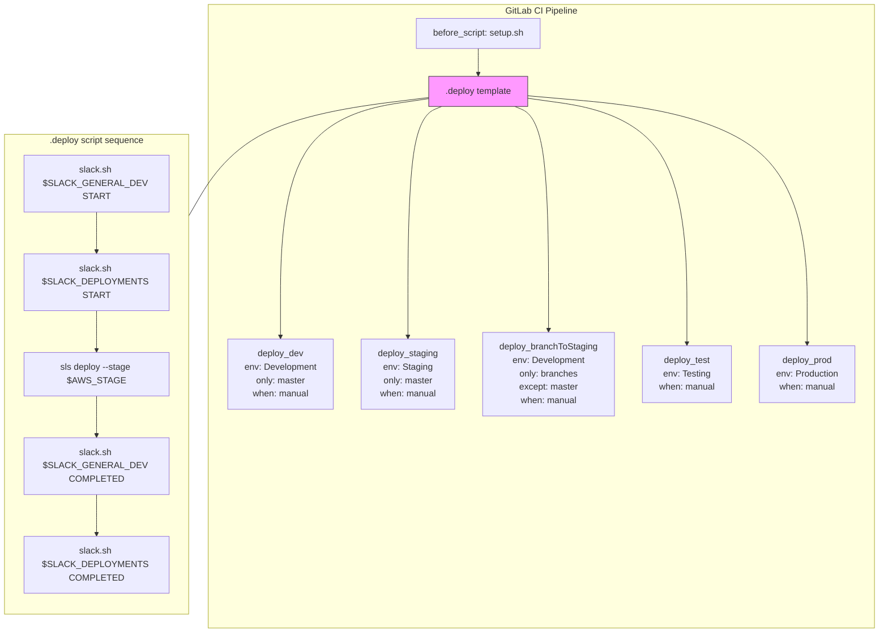

# Diagram: common/fv/.gitlab-ci.yml

> Auto-generated by Obscura crawlers

## Mermaid

### SVG

<svg id="container" width="1583.890625" xmlns="http://www.w3.org/2000/svg" class="flowchart" height="1135" viewBox="0 0 1583.890625 1135" role="graphics-document document" aria-roledescription="flowchart-v2"><g><marker id="container_flowchart-v2-pointEnd" class="marker flowchart-v2" viewBox="0 0 10 10" refX="5" refY="5" markerUnits="userSpaceOnUse" markerWidth="8" markerHeight="8" orient="auto"><path d="M 0 0 L 10 5 L 0 10 z" class="arrowMarkerPath" style="stroke-width: 1; stroke-dasharray: 1, 0;"></path></marker><marker id="container_flowchart-v2-pointStart" class="marker flowchart-v2" viewBox="0 0 10 10" refX="4.5" refY="5" markerUnits="userSpaceOnUse" markerWidth="8" markerHeight="8" orient="auto"><path d="M 0 5 L 10 10 L 10 0 z" class="arrowMarkerPath" style="stroke-width: 1; stroke-dasharray: 1, 0;"></path></marker><marker id="container_flowchart-v2-circleEnd" class="marker flowchart-v2" viewBox="0 0 10 10" refX="11" refY="5" markerUnits="userSpaceOnUse" markerWidth="11" markerHeight="11" orient="auto"><circle cx="5" cy="5" r="5" class="arrowMarkerPath" style="stroke-width: 1; stroke-dasharray: 1, 0;"></circle></marker><marker id="container_flowchart-v2-circleStart" class="marker flowchart-v2" viewBox="0 0 10 10" refX="-1" refY="5" markerUnits="userSpaceOnUse" markerWidth="11" markerHeight="11" orient="auto"><circle cx="5" cy="5" r="5" class="arrowMarkerPath" style="stroke-width: 1; stroke-dasharray: 1, 0;"></circle></marker><marker id="container_flowchart-v2-crossEnd" class="marker cross flowchart-v2" viewBox="0 0 11 11" refX="12" refY="5.2" markerUnits="userSpaceOnUse" markerWidth="11" markerHeight="11" orient="auto"><path d="M 1,1 l 9,9 M 10,1 l -9,9" class="arrowMarkerPath" style="stroke-width: 2; stroke-dasharray: 1, 0;"></path></marker><marker id="container_flowchart-v2-crossStart" class="marker cross flowchart-v2" viewBox="0 0 11 11" refX="-1" refY="5.2" markerUnits="userSpaceOnUse" markerWidth="11" markerHeight="11" orient="auto"><path d="M 1,1 l 9,9 M 10,1 l -9,9" class="arrowMarkerPath" style="stroke-width: 2; stroke-dasharray: 1, 0;"></path></marker><g class="root"><g class="clusters"><g class="cluster" id="Pipeline" data-look="classic"><rect style="" x="373" y="8" width="1202.890625" height="1119"></rect><g class="cluster-label" transform="translate(910.5, 8)"><foreignObject width="127.890625" height="24">

GitLab CI Pipeline

</foreignObject></g></g></g><g class="edgePaths"><path d="M860.191,87L860.191,91.167C860.191,95.333,860.191,103.667,860.191,111.333C860.191,119,860.191,126,860.191,129.5L860.191,133" id="L_A_B_0" class="edge-thickness-normal edge-pattern-solid edge-thickness-normal edge-pattern-solid flowchart-link" style=";" data-edge="true" data-et="edge" data-id="L_A_B_0" data-points="W3sieCI6ODYwLjE5MTQwNjI1LCJ5Ijo4N30seyJ4Ijo4NjAuMTkxNDA2MjUsInkiOjExMn0seyJ4Ijo4NjAuMTkxNDA2MjUsInkiOjEzN31d" marker-end="url(#container_flowchart-v2-pointEnd)"></path><path d="M768.934,177.295L724.656,183.746C680.378,190.197,591.822,203.098,547.544,274.299C503.266,345.5,503.266,475,503.266,539.75L503.266,604.5" id="L_B_D_dev_0" class="edge-thickness-normal edge-pattern-solid edge-thickness-normal edge-pattern-solid flowchart-link" style=";" data-edge="true" data-et="edge" data-id="L_B_D_dev_0" data-points="W3sieCI6NzY4LjkzMzU5Mzc1LCJ5IjoxNzcuMjk1MjE4NDk5OTk0NTJ9LHsieCI6NTAzLjI2NTYyNSwieSI6MjE2fSx7IngiOjUwMy4yNjU2MjUsInkiOjYwOC41fV0=" marker-end="url(#container_flowchart-v2-pointEnd)"></path><path d="M794.324,191L784.159,195.167C773.995,199.333,753.665,207.667,743.501,276.583C733.336,345.5,733.336,475,733.336,539.75L733.336,604.5" id="L_B_D_stage_0" class="edge-thickness-normal edge-pattern-solid edge-thickness-normal edge-pattern-solid flowchart-link" style=";" data-edge="true" data-et="edge" data-id="L_B_D_stage_0" data-points="W3sieCI6Nzk0LjMyNDE0MzYyOTgwNzcsInkiOjE5MX0seyJ4Ijo3MzMuMzM1OTM3NSwieSI6MjE2fSx7IngiOjczMy4zMzU5Mzc1LCJ5Ijo2MDguNX1d" marker-end="url(#container_flowchart-v2-pointEnd)"></path><path d="M926.059,191L936.223,195.167C946.388,199.333,966.717,207.667,976.882,274.583C987.047,341.5,987.047,467,987.047,529.75L987.047,592.5" id="L_B_D_branch_0" class="edge-thickness-normal edge-pattern-solid edge-thickness-normal edge-pattern-solid flowchart-link" style=";" data-edge="true" data-et="edge" data-id="L_B_D_branch_0" data-points="W3sieCI6OTI2LjA1ODY2ODg3MDE5MjMsInkiOjE5MX0seyJ4Ijo5ODcuMDQ2ODc1LCJ5IjoyMTZ9LHsieCI6OTg3LjA0Njg3NSwieSI6NTk2LjV9XQ==" marker-end="url(#container_flowchart-v2-pointEnd)"></path><path d="M951.449,176.606L998.981,183.171C1046.513,189.737,1141.577,202.869,1189.109,276.184C1236.641,349.5,1236.641,483,1236.641,549.75L1236.641,616.5" id="L_B_D_test_0" class="edge-thickness-normal edge-pattern-solid edge-thickness-normal edge-pattern-solid flowchart-link" style=";" data-edge="true" data-et="edge" data-id="L_B_D_test_0" data-points="W3sieCI6OTUxLjQ0OTIxODc1LCJ5IjoxNzYuNjA1NzAwODg1MTIxMDV9LHsieCI6MTIzNi42NDA2MjUsInkiOjIxNn0seyJ4IjoxMjM2LjY0MDYyNSwieSI6NjIwLjV9XQ==" marker-end="url(#container_flowchart-v2-pointEnd)"></path><path d="M951.449,171.99L1035.226,179.325C1119.003,186.66,1286.556,201.33,1370.333,275.415C1454.109,349.5,1454.109,483,1454.109,549.75L1454.109,616.5" id="L_B_D_prod_0" class="edge-thickness-normal edge-pattern-solid edge-thickness-normal edge-pattern-solid flowchart-link" style=";" data-edge="true" data-et="edge" data-id="L_B_D_prod_0" data-points="W3sieCI6OTUxLjQ0OTIxODc1LCJ5IjoxNzEuOTkwMDAyODI4MTQ3M30seyJ4IjoxNDU0LjEwOTM3NSwieSI6MjE2fSx7IngiOjE0NTQuMTA5Mzc1LCJ5Ijo2MjAuNX1d" marker-end="url(#container_flowchart-v2-pointEnd)"></path><path d="M768.934,175.243L713.8,182.036C658.667,188.829,548.4,202.414,476.577,237.879C404.755,273.343,371.378,330.686,354.689,359.357L338,388.029" id="L_B_DeployTemplate_0" class="edge-thickness-normal edge-pattern-solid edge-thickness-normal edge-pattern-solid flowchart-link" style=";" data-edge="true" data-et="edge" data-id="L_B_DeployTemplate_0" data-points="W3sieCI6NzY4LjkzMzU5Mzc1LCJ5IjoxNzUuMjQzNDc3Mzc1NTg2NTZ9LHsieCI6NDM4LjEzMjgxMjUsInkiOjIxNn0seyJ4IjozMzgsInkiOjM4OC4wMjg4NjIzMDM2ODAzNH1d"></path></g><g class="edgeLabels"><g class="edgeLabel"><g class="label" data-id="L_A_B_0" transform="translate(0, 0)"><foreignObject width="0" height="0">

</foreignObject></g></g><g class="edgeLabel"><g class="label" data-id="L_B_D_dev_0" transform="translate(0, 0)"><foreignObject width="0" height="0">

</foreignObject></g></g><g class="edgeLabel"><g class="label" data-id="L_B_D_stage_0" transform="translate(0, 0)"><foreignObject width="0" height="0">

</foreignObject></g></g><g class="edgeLabel"><g class="label" data-id="L_B_D_branch_0" transform="translate(0, 0)"><foreignObject width="0" height="0">

</foreignObject></g></g><g class="edgeLabel"><g class="label" data-id="L_B_D_test_0" transform="translate(0, 0)"><foreignObject width="0" height="0">

</foreignObject></g></g><g class="edgeLabel"><g class="label" data-id="L_B_D_prod_0" transform="translate(0, 0)"><foreignObject width="0" height="0">

</foreignObject></g></g><g class="edgeLabel"><g class="label" data-id="L_B_DeployTemplate_0" transform="translate(0, 0)"><foreignObject width="0" height="0">

</foreignObject></g></g></g><g class="nodes"><g class="root" transform="translate(0, 233)"><g class="clusters"><g class="cluster" id="DeployTemplate" data-look="classic"><rect style="" x="8" y="8" width="330" height="861"></rect><g class="cluster-label" transform="translate(86.984375, 8)"><foreignObject width="172.03125" height="24">

.deploy script sequence

</foreignObject></g></g></g><g class="edgePaths"><path d="M173,147.5L173,153.75C173,160,173,172.5,173,184.333C173,196.167,173,207.333,173,212.917L173,218.5" id="L_S1_S2_0" class="edge-thickness-normal edge-pattern-solid edge-thickness-normal edge-pattern-solid flowchart-link" style=";" data-edge="true" data-et="edge" data-id="L_S1_S2_0" data-points="W3sieCI6MTczLCJ5IjoxNDcuNX0seyJ4IjoxNzMsInkiOjE4NX0seyJ4IjoxNzMsInkiOjIyMi41fV0=" marker-end="url(#container_flowchart-v2-pointEnd)"></path><path d="M173,324.5L173,330.75C173,337,173,349.5,173,361.333C173,373.167,173,384.333,173,389.917L173,395.5" id="L_S2_S3_0" class="edge-thickness-normal edge-pattern-solid edge-thickness-normal edge-pattern-solid flowchart-link" style=";" data-edge="true" data-et="edge" data-id="L_S2_S3_0" data-points="W3sieCI6MTczLCJ5IjozMjQuNX0seyJ4IjoxNzMsInkiOjM2Mn0seyJ4IjoxNzMsInkiOjM5OS41fV0=" marker-end="url(#container_flowchart-v2-pointEnd)"></path><path d="M173,477.5L173,483.75C173,490,173,502.5,173,514.333C173,526.167,173,537.333,173,542.917L173,548.5" id="L_S3_S4_0" class="edge-thickness-normal edge-pattern-solid edge-thickness-normal edge-pattern-solid flowchart-link" style=";" data-edge="true" data-et="edge" data-id="L_S3_S4_0" data-points="W3sieCI6MTczLCJ5Ijo0NzcuNX0seyJ4IjoxNzMsInkiOjUxNX0seyJ4IjoxNzMsInkiOjU1Mi41fV0=" marker-end="url(#container_flowchart-v2-pointEnd)"></path><path d="M173,654.5L173,660.75C173,667,173,679.5,173,691.333C173,703.167,173,714.333,173,719.917L173,725.5" id="L_S4_S5_0" class="edge-thickness-normal edge-pattern-solid edge-thickness-normal edge-pattern-solid flowchart-link" style=";" data-edge="true" data-et="edge" data-id="L_S4_S5_0" data-points="W3sieCI6MTczLCJ5Ijo2NTQuNX0seyJ4IjoxNzMsInkiOjY5Mn0seyJ4IjoxNzMsInkiOjcyOS41fV0=" marker-end="url(#container_flowchart-v2-pointEnd)"></path></g><g class="edgeLabels"><g class="edgeLabel"><g class="label" data-id="L_S1_S2_0" transform="translate(0, 0)"><foreignObject width="0" height="0">

</foreignObject></g></g><g class="edgeLabel"><g class="label" data-id="L_S2_S3_0" transform="translate(0, 0)"><foreignObject width="0" height="0">

</foreignObject></g></g><g class="edgeLabel"><g class="label" data-id="L_S3_S4_0" transform="translate(0, 0)"><foreignObject width="0" height="0">

</foreignObject></g></g><g class="edgeLabel"><g class="label" data-id="L_S4_S5_0" transform="translate(0, 0)"><foreignObject width="0" height="0">

</foreignObject></g></g></g><g class="nodes"><g class="node default" id="flowchart-S1-12" transform="translate(173, 96.5)"><rect class="basic label-container" style="" x="-130" y="-51" width="260" height="102"></rect><g class="label" style="" transform="translate(-100, -36)"><rect></rect><foreignObject width="200" height="72">

slack.sh $SLACK_GENERAL_DEV START

</foreignObject></g></g><g class="node default" id="flowchart-S2-13" transform="translate(173, 273.5)"><rect class="basic label-container" style="" x="-130" y="-51" width="260" height="102"></rect><g class="label" style="" transform="translate(-100, -36)"><rect></rect><foreignObject width="200" height="72">

slack.sh $SLACK_DEPLOYMENTS START

</foreignObject></g></g><a xlink:href="https://example.com/docs/serverless-deploy" transform="translate(173, 438.5)"><g class="node default clickable" id="flowchart-S3-15" title="Serverless deploy docs"><rect class="basic label-container" style="" x="-130" y="-39" width="260" height="78"></rect><g class="label" style="" transform="translate(-100, -24)"><rect></rect><foreignObject width="200" height="48">

sls deploy --stage $AWS_STAGE

</foreignObject></g></g></a><g class="node default" id="flowchart-S4-17" transform="translate(173, 603.5)"><rect class="basic label-container" style="" x="-130" y="-51" width="260" height="102"></rect><g class="label" style="" transform="translate(-100, -36)"><rect></rect><foreignObject width="200" height="72">

slack.sh $SLACK_GENERAL_DEV COMPLETED

</foreignObject></g></g><g class="node default" id="flowchart-S5-19" transform="translate(173, 780.5)"><rect class="basic label-container" style="" x="-130" y="-51" width="260" height="102"></rect><g class="label" style="" transform="translate(-100, -36)"><rect></rect><foreignObject width="200" height="72">

slack.sh $SLACK_DEPLOYMENTS COMPLETED

</foreignObject></g></g></g></g><g class="node default" id="flowchart-A-0" transform="translate(860.19140625, 60)"><rect class="basic label-container" style="" x="-112.8984375" y="-27" width="225.796875" height="54"></rect><g class="label" style="" transform="translate(-82.8984375, -12)"><rect></rect><foreignObject width="165.796875" height="24">

before_script: setup.sh

</foreignObject></g></g><g class="node default template" id="flowchart-B-1" transform="translate(860.19140625, 164)"><rect class="basic label-container" style="fill:#f9f !important;stroke:#333 !important;stroke-width:1px !important" x="-91.2578125" y="-27" width="182.515625" height="54"></rect><g class="label" style="" transform="translate(-61.2578125, -12)"><rect></rect><foreignObject width="122.515625" height="24">

.deploy template

</foreignObject></g></g><g class="node default" id="flowchart-D_dev-3" transform="translate(503.265625, 671.5)"><rect class="basic label-container" style="" x="-95.265625" y="-63" width="190.53125" height="126"></rect><g class="label" style="" transform="translate(-65.265625, -48)"><rect></rect><foreignObject width="130.53125" height="96">

deploy_dev env: Development only: master when: manual

</foreignObject></g></g><g class="node default" id="flowchart-D_stage-5" transform="translate(733.3359375, 671.5)"><rect class="basic label-container" style="" x="-84.8046875" y="-63" width="169.609375" height="126"></rect><g class="label" style="" transform="translate(-54.8046875, -48)"><rect></rect><foreignObject width="109.609375" height="96">

deploy_staging env: Staging only: master when: manual

</foreignObject></g></g><g class="node default" id="flowchart-D_branch-7" transform="translate(987.046875, 671.5)"><rect class="basic label-container" style="" x="-118.90625" y="-75" width="237.8125" height="150"></rect><g class="label" style="" transform="translate(-88.90625, -60)"><rect></rect><foreignObject width="177.8125" height="120">

deploy_branchToStaging env: Development only: branches except: master when: manual

</foreignObject></g></g><g class="node default" id="flowchart-D_test-9" transform="translate(1236.640625, 671.5)"><rect class="basic label-container" style="" x="-80.6875" y="-51" width="161.375" height="102"></rect><g class="label" style="" transform="translate(-50.6875, -36)"><rect></rect><foreignObject width="101.375" height="72">

deploy_test env: Testing when: manual

</foreignObject></g></g><g class="node default" id="flowchart-D_prod-11" transform="translate(1454.109375, 671.5)"><rect class="basic label-container" style="" x="-86.78125" y="-51" width="173.5625" height="102"></rect><g class="label" style="" transform="translate(-56.78125, -36)"><rect></rect><foreignObject width="113.5625" height="72">

deploy_prod env: Production when: manual

</foreignObject></g></g></g></g></g></svg>
