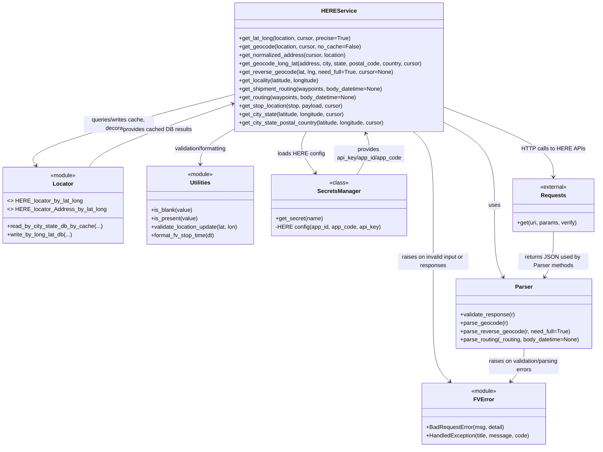

# Diagram: common/fv/python/fv/HERE/HERE.py

> Auto-generated by Obscura crawlers

## Mermaid

### SVG

<svg id="container" width="1696.98828125" xmlns="http://www.w3.org/2000/svg" class="classDiagram" height="1270" viewBox="41.84765625 0 1696.98828125 1270" role="graphics-document document" aria-roledescription="class"><g><defs><marker id="container_class-aggregationStart" class="marker aggregation class" refX="18" refY="7" markerWidth="190" markerHeight="240" orient="auto"><path d="M 18,7 L9,13 L1,7 L9,1 Z"></path></marker></defs><defs><marker id="container_class-aggregationEnd" class="marker aggregation class" refX="1" refY="7" markerWidth="20" markerHeight="28" orient="auto"><path d="M 18,7 L9,13 L1,7 L9,1 Z"></path></marker></defs><defs><marker id="container_class-extensionStart" class="marker extension class" refX="18" refY="7" markerWidth="190" markerHeight="240" orient="auto"><path d="M 1,7 L18,13 V 1 Z"></path></marker></defs><defs><marker id="container_class-extensionEnd" class="marker extension class" refX="1" refY="7" markerWidth="20" markerHeight="28" orient="auto"><path d="M 1,1 V 13 L18,7 Z"></path></marker></defs><defs><marker id="container_class-compositionStart" class="marker composition class" refX="18" refY="7" markerWidth="190" markerHeight="240" orient="auto"><path d="M 18,7 L9,13 L1,7 L9,1 Z"></path></marker></defs><defs><marker id="container_class-compositionEnd" class="marker composition class" refX="1" refY="7" markerWidth="20" markerHeight="28" orient="auto"><path d="M 18,7 L9,13 L1,7 L9,1 Z"></path></marker></defs><defs><marker id="container_class-dependencyStart" class="marker dependency class" refX="6" refY="7" markerWidth="190" markerHeight="240" orient="auto"><path d="M 5,7 L9,13 L1,7 L9,1 Z"></path></marker></defs><defs><marker id="container_class-dependencyEnd" class="marker dependency class" refX="13" refY="7" markerWidth="20" markerHeight="28" orient="auto"><path d="M 18,7 L9,13 L14,7 L9,1 Z"></path></marker></defs><defs><marker id="container_class-lollipopStart" class="marker lollipop class" refX="13" refY="7" markerWidth="190" markerHeight="240" orient="auto"><circle stroke="black" fill="transparent" cx="7" cy="7" r="6"></circle></marker></defs><defs><marker id="container_class-lollipopEnd" class="marker lollipop class" refX="1" refY="7" markerWidth="190" markerHeight="240" orient="auto"><circle stroke="black" fill="transparent" cx="7" cy="7" r="6"></circle></marker></defs><g class="root"><g class="clusters"></g><g class="edgePaths"><path d="M1303.125,347.722L1326.872,360.268C1350.62,372.815,1398.115,397.907,1421.862,437.12C1445.609,476.333,1445.609,529.667,1445.609,583C1445.609,636.333,1445.609,689.667,1449.76,723.631C1453.911,757.595,1462.212,772.19,1466.363,779.487L1470.513,786.785" id="id_HEREService_Parser_1" class="edge-thickness-normal edge-pattern-solid relation" style=";;;" data-edge="true" data-et="edge" data-id="id_HEREService_Parser_1" data-points="W3sieCI6MTMwMy4xMjUsInkiOjM0Ny43MjIxNzQ3NzkzOTA4fSx7IngiOjE0NDUuNjA5Mzc1LCJ5Ijo0MjN9LHsieCI6MTQ0NS42MDkzNzUsInkiOjU4M30seyJ4IjoxNDQ1LjYwOTM3NSwieSI6NzQzfSx7IngiOjE0NzMuNDc5Njc2OTQyNTY3NSwieSI6NzkyfV0=" marker-end="url(#container_class-dependencyEnd)"></path><path d="M709.844,267.596L609.536,293.497C509.229,319.398,308.615,371.199,213.649,404.94C118.683,438.68,129.366,454.361,134.708,462.201L140.049,470.041" id="id_HEREService_Locator_2" class="edge-thickness-normal edge-pattern-solid relation" style=";;;" data-edge="true" data-et="edge" data-id="id_HEREService_Locator_2" data-points="W3sieCI6NzA5Ljg0Mzc1LCJ5IjoyNjcuNTk2MzUxNDk0NzA0Nn0seyJ4IjoxMDgsInkiOjQyM30seyJ4IjoxNDMuNDI3NTM5MDYyNSwieSI6NDc1fV0=" marker-end="url(#container_class-dependencyEnd)"></path><path d="M709.844,365.169L693.428,374.808C677.012,384.446,644.18,403.723,627.764,420.528C611.348,437.333,611.348,451.667,611.348,458.833L611.348,466" id="id_HEREService_Utilities_3" class="edge-thickness-normal edge-pattern-solid relation" style=";;;" data-edge="true" data-et="edge" data-id="id_HEREService_Utilities_3" data-points="W3sieCI6NzA5Ljg0Mzc1LCJ5IjozNjUuMTY5MTQ2MzU5NTQ3Mn0seyJ4Ijo2MTEuMzQ3NjU2MjUsInkiOjQyM30seyJ4Ijo2MTEuMzQ3NjU2MjUsInkiOjQ3Mn1d" marker-end="url(#container_class-dependencyEnd)"></path><path d="M915.06,374L910.98,382.167C906.9,390.333,898.74,406.667,902.887,426.19C907.034,445.714,923.488,468.427,931.715,479.784L939.942,491.141" id="id_HEREService_SecretsManager_4" class="edge-thickness-normal edge-pattern-solid relation" style=";;;" data-edge="true" data-et="edge" data-id="id_HEREService_SecretsManager_4" data-points="W3sieCI6OTE1LjA1OTg2NDk2NDk3ODUsInkiOjM3NH0seyJ4Ijo4OTAuNTgwMDc4MTI1LCJ5Ijo0MjN9LHsieCI6OTQzLjQ2MTQxMzU3NDIxODgsInkiOjQ5Nn1d" marker-end="url(#container_class-dependencyEnd)"></path><path d="M1303.125,304.288L1354.932,324.073C1406.74,343.859,1510.354,383.429,1562.161,416.381C1613.969,449.333,1613.969,475.667,1613.969,488.833L1613.969,502" id="id_HEREService_Requests_5" class="edge-thickness-normal edge-pattern-solid relation" style=";;;" data-edge="true" data-et="edge" data-id="id_HEREService_Requests_5" data-points="W3sieCI6MTMwMy4xMjUsInkiOjMwNC4yODc4OTMyMDcxMjk4fSx7IngiOjE2MTMuOTY4NzUsInkiOjQyM30seyJ4IjoxNjEzLjk2ODc1LCJ5Ijo1MDh9XQ==" marker-end="url(#container_class-dependencyEnd)"></path><path d="M1214.717,374L1224.009,382.167C1233.302,390.333,1251.887,406.667,1261.18,441.5C1270.473,476.333,1270.473,529.667,1270.473,583C1270.473,636.333,1270.473,689.667,1270.473,741C1270.473,792.333,1270.473,841.667,1270.473,891C1270.473,940.333,1270.473,989.667,1278.403,1021.814C1286.333,1053.961,1302.194,1068.922,1310.125,1076.402L1318.055,1083.883" id="id_HEREService_FVError_6" class="edge-thickness-normal edge-pattern-solid relation" style=";;;" data-edge="true" data-et="edge" data-id="id_HEREService_FVError_6" data-points="W3sieCI6MTIxNC43MTY1MTA2NDExNjM3LCJ5IjozNzR9LHsieCI6MTI3MC40NzI2NTYyNSwieSI6NDIzfSx7IngiOjEyNzAuNDcyNjU2MjUsInkiOjU4M30seyJ4IjoxMjcwLjQ3MjY1NjI1LCJ5Ijo3NDN9LHsieCI6MTI3MC40NzI2NTYyNSwieSI6ODkxfSx7IngiOjEyNzAuNDcyNjU2MjUsInkiOjEwMzl9LHsieCI6MTMyMi40MTk3NDk1NDA0NDEyLCJ5IjoxMDg4fV0=" marker-end="url(#container_class-dependencyEnd)"></path><path d="M1529.789,990L1529.789,998.167C1529.789,1006.333,1529.789,1022.667,1523.521,1038.237C1517.254,1053.807,1504.718,1068.614,1498.451,1076.017L1492.183,1083.421" id="id_Parser_FVError_7" class="edge-thickness-normal edge-pattern-solid relation" style=";;;" data-edge="true" data-et="edge" data-id="id_Parser_FVError_7" data-points="W3sieCI6MTUyOS43ODkwNjI1LCJ5Ijo5OTB9LHsieCI6MTUyOS43ODkwNjI1LCJ5IjoxMDM5fSx7IngiOjE0ODguMzA1OTgwMDA5MTkxMiwieSI6MTA4OH1d" marker-end="url(#container_class-dependencyEnd)"></path><path d="M290.588,475L296.493,466.333C302.397,457.667,314.206,440.333,383.136,410.179C452.065,380.024,578.115,337.049,641.14,315.561L704.165,294.073" id="id_Locator_HEREService_8" class="edge-thickness-normal edge-pattern-solid relation" style=";;;" data-edge="true" data-et="edge" data-id="id_Locator_HEREService_8" data-points="W3sieCI6MjkwLjU4ODA4NTkzNzUsInkiOjQ3NX0seyJ4IjozMjYuMDE1NjI1LCJ5Ijo0MjN9LHsieCI6NzA5Ljg0Mzc1LCJ5IjoyOTIuMTM3MDgzODExNzEwN31d" marker-end="url(#container_class-dependencyEnd)"></path><path d="M1056.681,496L1063.701,483.833C1070.721,471.667,1084.761,447.333,1088.901,427.929C1093.041,408.525,1087.281,394.05,1084.401,386.812L1081.521,379.575" id="id_SecretsManager_HEREService_9" class="edge-thickness-normal edge-pattern-solid relation" style=";;;" data-edge="true" data-et="edge" data-id="id_SecretsManager_HEREService_9" data-points="W3sieCI6MTA1Ni42ODE0MjA4OTg0Mzc0LCJ5Ijo0OTZ9LHsieCI6MTA5OC44MDA3ODEyNSwieSI6NDIzfSx7IngiOjEwNzkuMzAyOTE5NTg1MTI5MywieSI6Mzc0fV0=" marker-end="url(#container_class-dependencyEnd)"></path><path d="M1613.969,658L1613.969,672.167C1613.969,686.333,1613.969,714.667,1609.818,736.131C1605.667,757.595,1597.366,772.19,1593.216,779.487L1589.065,786.785" id="id_Requests_Parser_10" class="edge-thickness-normal edge-pattern-solid relation" style=";;;" data-edge="true" data-et="edge" data-id="id_Requests_Parser_10" data-points="W3sieCI6MTYxMy45Njg3NSwieSI6NjU4fSx7IngiOjE2MTMuOTY4NzUsInkiOjc0M30seyJ4IjoxNTg2LjA5ODQ0ODA1NzQzMjUsInkiOjc5Mn1d" marker-end="url(#container_class-dependencyEnd)"></path></g><g class="edgeLabels"><g class="edgeLabel" transform="translate(1445.609375, 583)"><g class="label" data-id="id_HEREService_Parser_1" transform="translate(-16.4921875, -12)"><foreignObject width="32.984375" height="24">

uses

</foreignObject></g></g><g class="edgeLabel" transform="translate(378.46025, 353.16375)"><g class="label" data-id="id_HEREService_Locator_2" transform="translate(-100, -24)"><foreignObject width="200" height="48">

queries/writes cache, decorators

</foreignObject></g></g><g class="edgeLabel" transform="translate(611.34765625, 423)"><g class="label" data-id="id_HEREService_Utilities_3" transform="translate(-78.6953125, -12)"><foreignObject width="157.390625" height="24">

validation/formatting

</foreignObject></g></g><g class="edgeLabel" transform="translate(900.95398, 437.32064)"><g class="label" data-id="id_HEREService_SecretsManager_4" transform="translate(-64.6328125, -12)"><foreignObject width="129.265625" height="24">

loads HERE config

</foreignObject></g></g><g class="edgeLabel" transform="translate(1613.96875, 423)"><g class="label" data-id="id_HEREService_Requests_5" transform="translate(-84.890625, -12)"><foreignObject width="169.78125" height="24">

HTTP calls to HERE APIs

</foreignObject></g></g><g class="edgeLabel" transform="translate(1270.47265625, 743)"><g class="label" data-id="id_HEREService_FVError_6" transform="translate(-100, -24)"><foreignObject width="200" height="48">

raises on invalid input or responses

</foreignObject></g></g><g class="edgeLabel" transform="translate(1529.7890625, 1039)"><g class="label" data-id="id_Parser_FVError_7" transform="translate(-100, -24)"><foreignObject width="200" height="48">

raises on validation/parsing errors

</foreignObject></g></g><g class="edgeLabel" transform="translate(488.15208, 367.72096)"><g class="label" data-id="id_Locator_HEREService_8" transform="translate(-98.015625, -12)"><foreignObject width="196.03125" height="24">

provides cached DB results

</foreignObject></g></g><g class="edgeLabel" transform="translate(1090.91891, 436.66062)"><g class="label" data-id="id_SecretsManager_HEREService_9" transform="translate(-100, -24)"><foreignObject width="200" height="48">

provides api_key/app_id/app_code

</foreignObject></g></g><g class="edgeLabel" transform="translate(1613.96875, 743)"><g class="label" data-id="id_Requests_Parser_10" transform="translate(-100, -24)"><foreignObject width="200" height="48">

returns JSON used by Parser methods

</foreignObject></g></g></g><g class="nodes"><g class="node default" id="classId-HEREService-0" transform="translate(1006.484375, 191)"><g class="basic label-container"><path d="M-296.640625 -183 L296.640625 -183 L296.640625 183 L-296.640625 183" stroke="none" stroke-width="0" fill="#ECECFF" style=""></path><path d="M-296.640625 -183 C-69.8159461897464 -183, 157.0087326205072 -183, 296.640625 -183 M-296.640625 -183 C-123.89844021822003 -183, 48.84374456355994 -183, 296.640625 -183 M296.640625 -183 C296.640625 -51.96391298582904, 296.640625 79.07217402834192, 296.640625 183 M296.640625 -183 C296.640625 -41.476388614866124, 296.640625 100.04722277026775, 296.640625 183 M296.640625 183 C79.7263540729432 183, -137.1879168541136 183, -296.640625 183 M296.640625 183 C123.23670667423607 183, -50.16721165152785 183, -296.640625 183 M-296.640625 183 C-296.640625 36.86481999028035, -296.640625 -109.2703600194393, -296.640625 -183 M-296.640625 183 C-296.640625 57.6689841208953, -296.640625 -67.6620317582094, -296.640625 -183" stroke="#9370DB" stroke-width="1.3" fill="none" stroke-dasharray="0 0" style=""></path></g><g class="annotation-group text" transform="translate(0, -159)"></g><g class="label-group text" transform="translate(-45.25, -159)"><g class="label" style="font-weight: bolder" transform="translate(0,-12)"><foreignObject width="90.5" height="24">

HEREService

</foreignObject></g></g><g class="members-group text" transform="translate(-284.640625, -111)"></g><g class="methods-group text" transform="translate(-284.640625, -81)"><g class="label" style="" transform="translate(0,-12)"><foreignObject width="320.015625" height="24">

+get_lat_long(location, cursor, precise=True)

</foreignObject></g><g class="label" style="" transform="translate(0,12)"><foreignObject width="342.890625" height="24">

+get_geocode(location, cursor, no_cache=False)

</foreignObject></g><g class="label" style="" transform="translate(0,36)"><foreignObject width="307.484375" height="24">

+get_normalized_address(cursor, location)

</foreignObject></g><g class="label" style="" transform="translate(0,60)"><foreignObject width="524.03125" height="24">

+get_geocode_long_lat(address, city, state, postal_code, country, cursor)

</foreignObject></g><g class="label" style="" transform="translate(0,84)"><foreignObject width="437.625" height="24">

+get_reverse_geocode(lat, lng, need_full=True, cursor=None)

</foreignObject></g><g class="label" style="" transform="translate(0,108)"><foreignObject width="236.265625" height="24">

+get_locality(latitude, longitude)

</foreignObject></g><g class="label" style="" transform="translate(0,132)"><foreignObject width="415.453125" height="24">

+get_shipment_routing(waypoints, body_datetime=None)

</foreignObject></g><g class="label" style="" transform="translate(0,156)"><foreignObject width="338.6875" height="24">

+get_routing(waypoints, body_datetime=None)

</foreignObject></g><g class="label" style="" transform="translate(0,180)"><foreignObject width="299.421875" height="24">

+get_stop_location(stop, payload, cursor)

</foreignObject></g><g class="label" style="" transform="translate(0,204)"><foreignObject width="306.671875" height="24">

+get_city_state(latitude, longitude, cursor)

</foreignObject></g><g class="label" style="" transform="translate(0,228)"><foreignObject width="423.0625" height="24">

+get_city_state_postal_country(latitude, longitude, cursor)

</foreignObject></g></g><g class="divider" style=""><path d="M-296.640625 -135 C-130.93294974260547 -135, 34.774725514789054 -135, 296.640625 -135 M-296.640625 -135 C-109.75816847926856 -135, 77.12428804146288 -135, 296.640625 -135" stroke="#9370DB" stroke-width="1.3" fill="none" stroke-dasharray="0 0" style=""></path></g><g class="divider" style=""><path d="M-296.640625 -111 C-101.35600487299192 -111, 93.92861525401617 -111, 296.640625 -111 M-296.640625 -111 C-163.8431472189478 -111, -31.045669437895583 -111, 296.640625 -111" stroke="#9370DB" stroke-width="1.3" fill="none" stroke-dasharray="0 0" style=""></path></g></g><g class="node default" id="classId-Parser-1" transform="translate(1529.7890625, 891)"><g class="basic label-container"><path d="M-195.2734375 -99 L195.2734375 -99 L195.2734375 99 L-195.2734375 99" stroke="none" stroke-width="0" fill="#ECECFF" style=""></path><path d="M-195.2734375 -99 C-39.60318231779999 -99, 116.06707286440002 -99, 195.2734375 -99 M-195.2734375 -99 C-42.99535431949067 -99, 109.28272886101865 -99, 195.2734375 -99 M195.2734375 -99 C195.2734375 -41.80025341818425, 195.2734375 15.399493163631504, 195.2734375 99 M195.2734375 -99 C195.2734375 -53.30883196489094, 195.2734375 -7.617663929781884, 195.2734375 99 M195.2734375 99 C89.36193598883159 99, -16.54956552233682 99, -195.2734375 99 M195.2734375 99 C77.1592867836852 99, -40.95486393262959 99, -195.2734375 99 M-195.2734375 99 C-195.2734375 55.42685064029874, -195.2734375 11.853701280597477, -195.2734375 -99 M-195.2734375 99 C-195.2734375 38.673234114915125, -195.2734375 -21.65353177016975, -195.2734375 -99" stroke="#9370DB" stroke-width="1.3" fill="none" stroke-dasharray="0 0" style=""></path></g><g class="annotation-group text" transform="translate(0, -75)"></g><g class="label-group text" transform="translate(-23.375, -75)"><g class="label" style="font-weight: bolder" transform="translate(0,-12)"><foreignObject width="46.75" height="24">

Parser

</foreignObject></g></g><g class="members-group text" transform="translate(-183.2734375, -27)"></g><g class="methods-group text" transform="translate(-183.2734375, 3)"><g class="label" style="" transform="translate(0,-12)"><foreignObject width="156.5625" height="24">

+validate_response(r)

</foreignObject></g><g class="label" style="" transform="translate(0,12)"><foreignObject width="133.9375" height="24">

+parse_geocode(r)

</foreignObject></g><g class="label" style="" transform="translate(0,36)"><foreignObject width="310.1875" height="24">

+parse_reverse_geocode(r, need_full=True)

</foreignObject></g><g class="label" style="" transform="translate(0,60)"><foreignObject width="343.171875" height="24">

+parse_routing(_routing, body_datetime=None)

</foreignObject></g></g><g class="divider" style=""><path d="M-195.2734375 -51 C-80.85235579539133 -51, 33.568725909217335 -51, 195.2734375 -51 M-195.2734375 -51 C-40.45751035273247 -51, 114.35841679453506 -51, 195.2734375 -51" stroke="#9370DB" stroke-width="1.3" fill="none" stroke-dasharray="0 0" style=""></path></g><g class="divider" style=""><path d="M-195.2734375 -27 C-86.0067710715331 -27, 23.25989535693381 -27, 195.2734375 -27 M-195.2734375 -27 C-54.53494573001507 -27, 86.20354603996986 -27, 195.2734375 -27" stroke="#9370DB" stroke-width="1.3" fill="none" stroke-dasharray="0 0" style=""></path></g></g><g class="node default" id="classId-Locator-2" transform="translate(217.0078125, 583)"><g class="basic label-container"><path d="M-167.16015625 -108 L167.16015625 -108 L167.16015625 108 L-167.16015625 108" stroke="none" stroke-width="0" fill="#ECECFF" style=""></path><path d="M-167.16015625 -108 C-39.98267922134923 -108, 87.19479780730154 -108, 167.16015625 -108 M-167.16015625 -108 C-87.48825837231165 -108, -7.8163604946232965 -108, 167.16015625 -108 M167.16015625 -108 C167.16015625 -29.03032948983764, 167.16015625 49.93934102032472, 167.16015625 108 M167.16015625 -108 C167.16015625 -48.63460574020098, 167.16015625 10.730788519598036, 167.16015625 108 M167.16015625 108 C50.85509709487104 108, -65.44996206025792 108, -167.16015625 108 M167.16015625 108 C81.9386867531543 108, -3.282782743691399 108, -167.16015625 108 M-167.16015625 108 C-167.16015625 36.142088522693996, -167.16015625 -35.71582295461201, -167.16015625 -108 M-167.16015625 108 C-167.16015625 44.15723230135115, -167.16015625 -19.6855353972977, -167.16015625 -108" stroke="#9370DB" stroke-width="1.3" fill="none" stroke-dasharray="0 0" style=""></path></g><g class="annotation-group text" transform="translate(-36.6015625, -84)"><g class="label" style="" transform="translate(0,-12)"><foreignObject width="73.203125" height="24">

«module»

</foreignObject></g></g><g class="label-group text" transform="translate(-27.5390625, -60)"><g class="label" style="font-weight: bolder" transform="translate(0,-12)"><foreignObject width="55.078125" height="24">

Locator

</foreignObject></g></g><g class="members-group text" transform="translate(-155.16015625, -12)"><g class="label" style="" transform="translate(0,-12)"><foreignObject width="208.21875" height="24">

&lt;&gt; HERE_locator_by_lat_long

</foreignObject></g><g class="label" style="" transform="translate(0,12)"><foreignObject width="273.71875" height="24">

&lt;&gt; HERE_locator_Address_by_lat_long

</foreignObject></g></g><g class="methods-group text" transform="translate(-155.16015625, 60)"><g class="label" style="" transform="translate(0,-12)"><foreignObject width="266.75" height="24">

+read_by_city_state_db_by_cache(...)

</foreignObject></g><g class="label" style="" transform="translate(0,12)"><foreignObject width="185.3125" height="24">

+write_by_long_lat_db(...)

</foreignObject></g></g><g class="divider" style=""><path d="M-167.16015625 -36 C-36.25701693629489 -36, 94.64612237741022 -36, 167.16015625 -36 M-167.16015625 -36 C-39.826895954317905 -36, 87.50636434136419 -36, 167.16015625 -36" stroke="#9370DB" stroke-width="1.3" fill="none" stroke-dasharray="0 0" style=""></path></g><g class="divider" style=""><path d="M-167.16015625 36 C-36.64490873173523 36, 93.87033878652954 36, 167.16015625 36 M-167.16015625 36 C-36.643380294193264 36, 93.87339566161347 36, 167.16015625 36" stroke="#9370DB" stroke-width="1.3" fill="none" stroke-dasharray="0 0" style=""></path></g></g><g class="node default" id="classId-Utilities-3" transform="translate(611.34765625, 583)"><g class="basic label-container"><path d="M-156.79296875 -111 L156.79296875 -111 L156.79296875 111 L-156.79296875 111" stroke="none" stroke-width="0" fill="#ECECFF" style=""></path><path d="M-156.79296875 -111 C-81.25928851446965 -111, -5.725608278939291 -111, 156.79296875 -111 M-156.79296875 -111 C-61.49885725372873 -111, 33.79525424254254 -111, 156.79296875 -111 M156.79296875 -111 C156.79296875 -26.990471843318247, 156.79296875 57.01905631336351, 156.79296875 111 M156.79296875 -111 C156.79296875 -60.56730527159346, 156.79296875 -10.134610543186923, 156.79296875 111 M156.79296875 111 C61.0557713052759 111, -34.681426139448206 111, -156.79296875 111 M156.79296875 111 C84.70989378902249 111, 12.626818828044975 111, -156.79296875 111 M-156.79296875 111 C-156.79296875 54.37204832569541, -156.79296875 -2.2559033486091806, -156.79296875 -111 M-156.79296875 111 C-156.79296875 39.99197791471666, -156.79296875 -31.016044170566687, -156.79296875 -111" stroke="#9370DB" stroke-width="1.3" fill="none" stroke-dasharray="0 0" style=""></path></g><g class="annotation-group text" transform="translate(-36.6015625, -87)"><g class="label" style="" transform="translate(0,-12)"><foreignObject width="73.203125" height="24">

«module»

</foreignObject></g></g><g class="label-group text" transform="translate(-28.8125, -63)"><g class="label" style="font-weight: bolder" transform="translate(0,-12)"><foreignObject width="57.625" height="24">

Utilities

</foreignObject></g></g><g class="members-group text" transform="translate(-144.79296875, -15)"></g><g class="methods-group text" transform="translate(-144.79296875, 15)"><g class="label" style="" transform="translate(0,-12)"><foreignObject width="117.609375" height="24">

+is_blank(value)

</foreignObject></g><g class="label" style="" transform="translate(0,12)"><foreignObject width="132.484375" height="24">

+is_present(value)

</foreignObject></g><g class="label" style="" transform="translate(0,36)"><foreignObject width="252.984375" height="24">

+validate_location_update(lat, lon)

</foreignObject></g><g class="label" style="" transform="translate(0,60)"><foreignObject width="183.703125" height="24">

+format_fv_stop_time(dt)

</foreignObject></g></g><g class="divider" style=""><path d="M-156.79296875 -39 C-66.08826771259879 -39, 24.616433324802415 -39, 156.79296875 -39 M-156.79296875 -39 C-49.25826123000864 -39, 58.276446289982715 -39, 156.79296875 -39" stroke="#9370DB" stroke-width="1.3" fill="none" stroke-dasharray="0 0" style=""></path></g><g class="divider" style=""><path d="M-156.79296875 -15 C-71.8164249621265 -15, 13.160118825746991 -15, 156.79296875 -15 M-156.79296875 -15 C-67.3376604354718 -15, 22.117647879056392 -15, 156.79296875 -15" stroke="#9370DB" stroke-width="1.3" fill="none" stroke-dasharray="0 0" style=""></path></g></g><g class="node default" id="classId-SecretsManager-4" transform="translate(1006.484375, 583)"><g class="basic label-container"><path d="M-188.34375 -87 L188.34375 -87 L188.34375 87 L-188.34375 87" stroke="none" stroke-width="0" fill="#ECECFF" style=""></path><path d="M-188.34375 -87 C-84.357365575038 -87, 19.629018849923995 -87, 188.34375 -87 M-188.34375 -87 C-90.90300420665052 -87, 6.5377415866989566 -87, 188.34375 -87 M188.34375 -87 C188.34375 -49.75649965327637, 188.34375 -12.512999306552743, 188.34375 87 M188.34375 -87 C188.34375 -38.060199253195385, 188.34375 10.87960149360923, 188.34375 87 M188.34375 87 C57.33081434382325 87, -73.6821213123535 87, -188.34375 87 M188.34375 87 C79.81736860641556 87, -28.709012787168888 87, -188.34375 87 M-188.34375 87 C-188.34375 50.42650009141435, -188.34375 13.853000182828694, -188.34375 -87 M-188.34375 87 C-188.34375 31.277028533662453, -188.34375 -24.445942932675095, -188.34375 -87" stroke="#9370DB" stroke-width="1.3" fill="none" stroke-dasharray="0 0" style=""></path></g><g class="annotation-group text" transform="translate(-26.765625, -63)"><g class="label" style="" transform="translate(0,-12)"><foreignObject width="53.53125" height="24">

«class»

</foreignObject></g></g><g class="label-group text" transform="translate(-58.609375, -39)"><g class="label" style="font-weight: bolder" transform="translate(0,-12)"><foreignObject width="117.21875" height="24">

SecretsManager

</foreignObject></g></g><g class="members-group text" transform="translate(-176.34375, 9)"></g><g class="methods-group text" transform="translate(-176.34375, 39)"><g class="label" style="" transform="translate(0,-12)"><foreignObject width="133.78125" height="24">

+get_secret(name)

</foreignObject></g><g class="label" style="" transform="translate(0,12)"><foreignObject width="294.078125" height="24">

-HERE config(app_id, app_code, api_key)

</foreignObject></g></g><g class="divider" style=""><path d="M-188.34375 -15 C-63.36861417833275 -15, 61.6065216433345 -15, 188.34375 -15 M-188.34375 -15 C-45.08887929953613 -15, 98.16599140092774 -15, 188.34375 -15" stroke="#9370DB" stroke-width="1.3" fill="none" stroke-dasharray="0 0" style=""></path></g><g class="divider" style=""><path d="M-188.34375 9 C-92.17878914337531 9, 3.9861717132493766 9, 188.34375 9 M-188.34375 9 C-109.08058275933111 9, -29.817415518662216 9, 188.34375 9" stroke="#9370DB" stroke-width="1.3" fill="none" stroke-dasharray="0 0" style=""></path></g></g><g class="node default" id="classId-Requests-5" transform="translate(1613.96875, 583)"><g class="basic label-container"><path d="M-116.8671875 -75 L116.8671875 -75 L116.8671875 75 L-116.8671875 75" stroke="none" stroke-width="0" fill="#ECECFF" style=""></path><path d="M-116.8671875 -75 C-42.64407175858793 -75, 31.579043982824146 -75, 116.8671875 -75 M-116.8671875 -75 C-44.976292914490344 -75, 26.914601671019312 -75, 116.8671875 -75 M116.8671875 -75 C116.8671875 -24.777892307522784, 116.8671875 25.444215384954433, 116.8671875 75 M116.8671875 -75 C116.8671875 -28.867694916329285, 116.8671875 17.26461016734143, 116.8671875 75 M116.8671875 75 C25.043103807062224 75, -66.78097988587555 75, -116.8671875 75 M116.8671875 75 C28.373057115887406 75, -60.12107326822519 75, -116.8671875 75 M-116.8671875 75 C-116.8671875 25.700088511404253, -116.8671875 -23.599822977191494, -116.8671875 -75 M-116.8671875 75 C-116.8671875 41.28333418556812, -116.8671875 7.566668371136245, -116.8671875 -75" stroke="#9370DB" stroke-width="1.3" fill="none" stroke-dasharray="0 0" style=""></path></g><g class="annotation-group text" transform="translate(-38.65625, -51)"><g class="label" style="" transform="translate(0,-12)"><foreignObject width="77.3125" height="24">

«external»

</foreignObject></g></g><g class="label-group text" transform="translate(-33.84375, -27)"><g class="label" style="font-weight: bolder" transform="translate(0,-12)"><foreignObject width="67.6875" height="24">

Requests

</foreignObject></g></g><g class="members-group text" transform="translate(-104.8671875, 21)"></g><g class="methods-group text" transform="translate(-104.8671875, 51)"><g class="label" style="" transform="translate(0,-12)"><foreignObject width="171.078125" height="24">

+get(uri, params, verify)

</foreignObject></g></g><g class="divider" style=""><path d="M-116.8671875 -3 C-39.408755804705294 -3, 38.04967589058941 -3, 116.8671875 -3 M-116.8671875 -3 C-64.16548718193845 -3, -11.46378686387689 -3, 116.8671875 -3" stroke="#9370DB" stroke-width="1.3" fill="none" stroke-dasharray="0 0" style=""></path></g><g class="divider" style=""><path d="M-116.8671875 21 C-29.584653539008457 21, 57.697880421983086 21, 116.8671875 21 M-116.8671875 21 C-24.784630913708313 21, 67.29792567258337 21, 116.8671875 21" stroke="#9370DB" stroke-width="1.3" fill="none" stroke-dasharray="0 0" style=""></path></g></g><g class="node default" id="classId-FVError-6" transform="translate(1414.65234375, 1175)"><g class="basic label-container"><path d="M-176.76953125 -87 L176.76953125 -87 L176.76953125 87 L-176.76953125 87" stroke="none" stroke-width="0" fill="#ECECFF" style=""></path><path d="M-176.76953125 -87 C-43.10102680702107 -87, 90.56747763595786 -87, 176.76953125 -87 M-176.76953125 -87 C-70.4675849043246 -87, 35.83436144135081 -87, 176.76953125 -87 M176.76953125 -87 C176.76953125 -49.59141497968654, 176.76953125 -12.18282995937308, 176.76953125 87 M176.76953125 -87 C176.76953125 -19.974796282268997, 176.76953125 47.050407435462006, 176.76953125 87 M176.76953125 87 C36.304629251542224 87, -104.16027274691555 87, -176.76953125 87 M176.76953125 87 C81.98174696235249 87, -12.806037325295023 87, -176.76953125 87 M-176.76953125 87 C-176.76953125 27.685716703192867, -176.76953125 -31.628566593614266, -176.76953125 -87 M-176.76953125 87 C-176.76953125 29.97016588407078, -176.76953125 -27.05966823185844, -176.76953125 -87" stroke="#9370DB" stroke-width="1.3" fill="none" stroke-dasharray="0 0" style=""></path></g><g class="annotation-group text" transform="translate(-36.6015625, -63)"><g class="label" style="" transform="translate(0,-12)"><foreignObject width="73.203125" height="24">

«module»

</foreignObject></g></g><g class="label-group text" transform="translate(-26.640625, -39)"><g class="label" style="font-weight: bolder" transform="translate(0,-12)"><foreignObject width="53.28125" height="24">

FVError

</foreignObject></g></g><g class="members-group text" transform="translate(-164.76953125, 9)"></g><g class="methods-group text" transform="translate(-164.76953125, 39)"><g class="label" style="" transform="translate(0,-12)"><foreignObject width="220.59375" height="24">

+BadRequestError(msg, detail)

</foreignObject></g><g class="label" style="" transform="translate(0,12)"><foreignObject width="292.9375" height="24">

+HandledException(title, message, code)

</foreignObject></g></g><g class="divider" style=""><path d="M-176.76953125 -15 C-56.918867596775286 -15, 62.93179605644943 -15, 176.76953125 -15 M-176.76953125 -15 C-77.3528170576559 -15, 22.063897134688204 -15, 176.76953125 -15" stroke="#9370DB" stroke-width="1.3" fill="none" stroke-dasharray="0 0" style=""></path></g><g class="divider" style=""><path d="M-176.76953125 9 C-86.63273467819643 9, 3.504061893607144 9, 176.76953125 9 M-176.76953125 9 C-62.009318272374756 9, 52.75089470525049 9, 176.76953125 9" stroke="#9370DB" stroke-width="1.3" fill="none" stroke-dasharray="0 0" style=""></path></g></g></g></g></g></svg>
