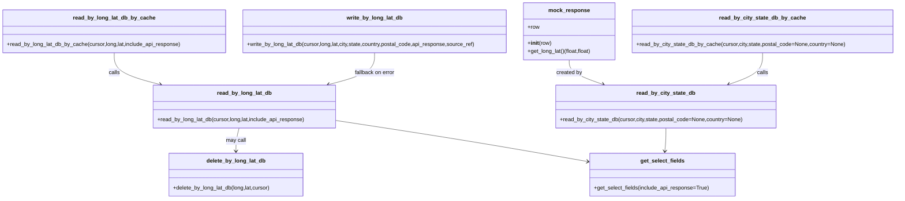

# Diagram: common/fv/python/fv/HERE/HERE_locator.py


> Auto-generated by Obscura crawlers

## Diagram 1

```mermaid
flowchart LR
  subgraph Cache_Read_LongLat
    A[extract_key] --> B[read_by_long_lat_db_by_cache]
    B --> C[read_by_long_lat_db]
    C --> D{row exists?}
    D -- yes --> E[return api/json result]
    D -- no --> F[return None]
    E --> G[maybe delete_by_long_lat_db if Country missing]
    G --> H[delete_by_long_lat_db]
  end

  subgraph Cache_Read_CityState
    I[extract_city_state_zip_country] --> J[read_by_city_state_db_by_cache]
    J --> K[read_by_city_state_db]
    K --> L{city/state valid?}
    L -- yes --> M[mock_response(row)]
    L -- no --> N[return None]
  end

  O[write_by_long_lat_db] -->|inserts| P[geo_location table]
  O -->|on duplicate error| C
  C -->|uses| Q[get_select_fields]
  Q --> R{include_api_response?}
  R -- true --> S[select api_response or built json]
  R -- false --> T[select built json]
  U[HERE_locator_by_lat_long decorator] --> B
  U --> O
  V[HERE_locator_Address_by_lat_long decorator] --> B
  V --> O
```

> SVG rendering failed for this diagram.

## Diagram 2



### SVG

<svg id="container" width="2620.953125" xmlns="http://www.w3.org/2000/svg" class="classDiagram" height="584" viewBox="0 0 2620.953125 584" role="graphics-document document" aria-roledescription="class"><style>#container{font-family:"trebuchet ms",verdana,arial,sans-serif;font-size:16px;fill:#333;}@keyframes edge-animation-frame{from{stroke-dashoffset:0;}}@keyframes dash{to{stroke-dashoffset:0;}}#container .edge-animation-slow{stroke-dasharray:9,5!important;stroke-dashoffset:900;animation:dash 50s linear infinite;stroke-linecap:round;}#container .edge-animation-fast{stroke-dasharray:9,5!important;stroke-dashoffset:900;animation:dash 20s linear infinite;stroke-linecap:round;}#container .error-icon{fill:#552222;}#container .error-text{fill:#552222;stroke:#552222;}#container .edge-thickness-normal{stroke-width:1px;}#container .edge-thickness-thick{stroke-width:3.5px;}#container .edge-pattern-solid{stroke-dasharray:0;}#container .edge-thickness-invisible{stroke-width:0;fill:none;}#container .edge-pattern-dashed{stroke-dasharray:3;}#container .edge-pattern-dotted{stroke-dasharray:2;}#container .marker{fill:#333333;stroke:#333333;}#container .marker.cross{stroke:#333333;}#container svg{font-family:"trebuchet ms",verdana,arial,sans-serif;font-size:16px;}#container p{margin:0;}#container g.classGroup text{fill:#9370DB;stroke:none;font-family:"trebuchet ms",verdana,arial,sans-serif;font-size:10px;}#container g.classGroup text .title{font-weight:bolder;}#container .nodeLabel,#container .edgeLabel{color:#131300;}#container .edgeLabel .label rect{fill:#ECECFF;}#container .label text{fill:#131300;}#container .labelBkg{background:#ECECFF;}#container .edgeLabel .label span{background:#ECECFF;}#container .classTitle{font-weight:bolder;}#container .node rect,#container .node circle,#container .node ellipse,#container .node polygon,#container .node path{fill:#ECECFF;stroke:#9370DB;stroke-width:1px;}#container .divider{stroke:#9370DB;stroke-width:1;}#container g.clickable{cursor:pointer;}#container g.classGroup rect{fill:#ECECFF;stroke:#9370DB;}#container g.classGroup line{stroke:#9370DB;stroke-width:1;}#container .classLabel .box{stroke:none;stroke-width:0;fill:#ECECFF;opacity:0.5;}#container .classLabel .label{fill:#9370DB;font-size:10px;}#container .relation{stroke:#333333;stroke-width:1;fill:none;}#container .dashed-line{stroke-dasharray:3;}#container .dotted-line{stroke-dasharray:1 2;}#container #compositionStart,#container .composition{fill:#333333!important;stroke:#333333!important;stroke-width:1;}#container #compositionEnd,#container .composition{fill:#333333!important;stroke:#333333!important;stroke-width:1;}#container #dependencyStart,#container .dependency{fill:#333333!important;stroke:#333333!important;stroke-width:1;}#container #dependencyStart,#container .dependency{fill:#333333!important;stroke:#333333!important;stroke-width:1;}#container #extensionStart,#container .extension{fill:transparent!important;stroke:#333333!important;stroke-width:1;}#container #extensionEnd,#container .extension{fill:transparent!important;stroke:#333333!important;stroke-width:1;}#container #aggregationStart,#container .aggregation{fill:transparent!important;stroke:#333333!important;stroke-width:1;}#container #aggregationEnd,#container .aggregation{fill:transparent!important;stroke:#333333!important;stroke-width:1;}#container #lollipopStart,#container .lollipop{fill:#ECECFF!important;stroke:#333333!important;stroke-width:1;}#container #lollipopEnd,#container .lollipop{fill:#ECECFF!important;stroke:#333333!important;stroke-width:1;}#container .edgeTerminals{font-size:11px;line-height:initial;}#container .classTitleText{text-anchor:middle;font-size:18px;fill:#333;}#container .label-icon{display:inline-block;height:1em;overflow:visible;vertical-align:-0.125em;}#container .node .label-icon path{fill:currentColor;stroke:revert;stroke-width:revert;}#container :root{--mermaid-font-family:"trebuchet ms",verdana,arial,sans-serif;}</style><g><defs><marker id="container_class-aggregationStart" class="marker aggregation class" refX="18" refY="7" markerWidth="190" markerHeight="240" orient="auto"><path d="M 18,7 L9,13 L1,7 L9,1 Z"></path></marker></defs><defs><marker id="container_class-aggregationEnd" class="marker aggregation class" refX="1" refY="7" markerWidth="20" markerHeight="28" orient="auto"><path d="M 18,7 L9,13 L1,7 L9,1 Z"></path></marker></defs><defs><marker id="container_class-extensionStart" class="marker extension class" refX="18" refY="7" markerWidth="190" markerHeight="240" orient="auto"><path d="M 1,7 L18,13 V 1 Z"></path></marker></defs><defs><marker id="container_class-extensionEnd" class="marker extension class" refX="1" refY="7" markerWidth="20" markerHeight="28" orient="auto"><path d="M 1,1 V 13 L18,7 Z"></path></marker></defs><defs><marker id="container_class-compositionStart" class="marker composition class" refX="18" refY="7" markerWidth="190" markerHeight="240" orient="auto"><path d="M 18,7 L9,13 L1,7 L9,1 Z"></path></marker></defs><defs><marker id="container_class-compositionEnd" class="marker composition class" refX="1" refY="7" markerWidth="20" markerHeight="28" orient="auto"><path d="M 18,7 L9,13 L1,7 L9,1 Z"></path></marker></defs><defs><marker id="container_class-dependencyStart" class="marker dependency class" refX="6" refY="7" markerWidth="190" markerHeight="240" orient="auto"><path d="M 5,7 L9,13 L1,7 L9,1 Z"></path></marker></defs><defs><marker id="container_class-dependencyEnd" class="marker dependency class" refX="13" refY="7" markerWidth="20" markerHeight="28" orient="auto"><path d="M 18,7 L9,13 L14,7 L9,1 Z"></path></marker></defs><defs><marker id="container_class-lollipopStart" class="marker lollipop class" refX="13" refY="7" markerWidth="190" markerHeight="240" orient="auto"><circle stroke="black" fill="transparent" cx="7" cy="7" r="6"></circle></marker></defs><defs><marker id="container_class-lollipopEnd" class="marker lollipop class" refX="1" refY="7" markerWidth="190" markerHeight="240" orient="auto"><circle stroke="black" fill="transparent" cx="7" cy="7" r="6"></circle></marker></defs><g class="root"><g class="clusters"></g><g class="edgePaths"><path d="M1672.297,176L1672.297,182.167C1672.297,188.333,1672.297,200.667,1688.706,212.665C1705.115,224.664,1737.932,236.327,1754.341,242.159L1770.75,247.991" id="id_mock_response_read_by_city_state_db_1" class="edge-thickness-normal edge-pattern-solid relation" style=";;;" data-edge="true" data-et="edge" data-id="id_mock_response_read_by_city_state_db_1" data-points="W3sieCI6MTY3Mi4yOTY4NzUsInkiOjE3Nn0seyJ4IjoxNjcyLjI5Njg3NSwieSI6MjEzfSx7IngiOjE3NzYuNDAzNDU3MDMxMjUwMSwieSI6MjUwfV0=" marker-end="url(#container_class-dependencyEnd)"></path><path d="M332.566,155L332.566,164.667C332.566,174.333,332.566,193.667,355.178,209.247C377.79,224.827,423.014,236.655,445.626,242.568L468.238,248.482" id="id_read_by_long_lat_db_by_cache_read_by_long_lat_db_2" class="edge-thickness-normal edge-pattern-solid relation" style=";;;" data-edge="true" data-et="edge" data-id="id_read_by_long_lat_db_by_cache_read_by_long_lat_db_2" data-points="W3sieCI6MzMyLjU2NjQwNjI1LCJ5IjoxNTV9LHsieCI6MzMyLjU2NjQwNjI1LCJ5IjoyMTN9LHsieCI6NDc0LjA0Mjk4ODI4MTI1LCJ5IjoyNTB9XQ==" marker-end="url(#container_class-dependencyEnd)"></path><path d="M2235.035,155L2235.035,164.667C2235.035,174.333,2235.035,193.667,2218.626,209.165C2202.217,224.664,2169.4,236.327,2152.991,242.159L2136.582,247.991" id="id_read_by_city_state_db_by_cache_read_by_city_state_db_3" class="edge-thickness-normal edge-pattern-solid relation" style=";;;" data-edge="true" data-et="edge" data-id="id_read_by_city_state_db_by_cache_read_by_city_state_db_3" data-points="W3sieCI6MjIzNS4wMzUxNTYyNSwieSI6MTU1fSx7IngiOjIyMzUuMDM1MTU2MjUsInkiOjIxM30seyJ4IjoyMTMwLjkyODU3NDIxODc1LCJ5IjoyNTB9XQ==" marker-end="url(#container_class-dependencyEnd)"></path><path d="M1097.305,155L1097.305,164.667C1097.305,174.333,1097.305,193.667,1074.693,209.247C1052.081,224.827,1006.857,236.655,984.245,242.568L961.633,248.482" id="id_write_by_long_lat_db_read_by_long_lat_db_4" class="edge-thickness-normal edge-pattern-solid relation" style=";;;" data-edge="true" data-et="edge" data-id="id_write_by_long_lat_db_read_by_long_lat_db_4" data-points="W3sieCI6MTA5Ny4zMDQ2ODc1LCJ5IjoxNTV9LHsieCI6MTA5Ny4zMDQ2ODc1LCJ5IjoyMTN9LHsieCI6OTU1LjgyODEwNTQ2ODc1LCJ5IjoyNTB9XQ==" marker-end="url(#container_class-dependencyEnd)"></path><path d="M699.232,376L697.695,382.167C696.158,388.333,693.084,400.667,691.547,412C690.01,423.333,690.01,433.667,690.01,438.833L690.01,444" id="id_read_by_long_lat_db_delete_by_long_lat_db_5" class="edge-thickness-normal edge-pattern-solid relation" style=";;;" data-edge="true" data-et="edge" data-id="id_read_by_long_lat_db_delete_by_long_lat_db_5" data-points="W3sieCI6Njk5LjIzMjMwNDY4NzUsInkiOjM3Nn0seyJ4Ijo2OTAuMDA5NzY1NjI1LCJ5Ijo0MTN9LHsieCI6NjkwLjAwOTc2NTYyNSwieSI6NDUwfV0=" marker-end="url(#container_class-dependencyEnd)"></path><path d="M983.311,353.671L1048.559,363.559C1113.807,373.447,1244.304,393.224,1367.99,413.385C1491.677,433.545,1608.553,454.091,1666.991,464.364L1725.429,474.636" id="id_read_by_long_lat_db_get_select_fields_6" class="edge-thickness-normal edge-pattern-solid relation" style=";;;" data-edge="true" data-et="edge" data-id="id_read_by_long_lat_db_get_select_fields_6" data-points="W3sieCI6OTgzLjMxMDU0Njg3NSwieSI6MzUzLjY3MTE4MzQ1MDY5Mjc1fSx7IngiOjEzNzQuODAwNzgxMjUsInkiOjQxM30seyJ4IjoxNzMxLjMzNzg5MDYyNSwieSI6NDc1LjY3NTE0NDgwMjM5MjM3fV0=" marker-end="url(#container_class-dependencyEnd)"></path><path d="M1953.666,376L1953.666,382.167C1953.666,388.333,1953.666,400.667,1953.149,412.005C1952.632,423.343,1951.597,433.687,1951.08,438.858L1950.563,444.03" id="id_read_by_city_state_db_get_select_fields_7" class="edge-thickness-normal edge-pattern-solid relation" style=";;;" data-edge="true" data-et="edge" data-id="id_read_by_city_state_db_get_select_fields_7" data-points="W3sieCI6MTk1My42NjYwMTU2MjUsInkiOjM3Nn0seyJ4IjoxOTUzLjY2NjAxNTYyNSwieSI6NDEzfSx7IngiOjE5NDkuOTY2MDE1NjI1LCJ5Ijo0NTB9XQ==" marker-end="url(#container_class-dependencyEnd)"></path></g><g class="edgeLabels"><g class="edgeLabel" transform="translate(1672.296875, 213)"><g class="label" data-id="id_mock_response_read_by_city_state_db_1" transform="translate(-37.9921875, -12)"><foreignObject width="75.984375" height="24"><div xmlns="http://www.w3.org/1999/xhtml" class="labelBkg" style="display: table-cell; white-space: nowrap; line-height: 1.5; max-width: 200px; text-align: center;"><span class="edgeLabel"><p>created by</p></span></div></foreignObject></g></g><g class="edgeLabel" transform="translate(332.56640625, 213)"><g class="label" data-id="id_read_by_long_lat_db_by_cache_read_by_long_lat_db_2" transform="translate(-16.4453125, -12)"><foreignObject width="32.890625" height="24"><div xmlns="http://www.w3.org/1999/xhtml" class="labelBkg" style="display: table-cell; white-space: nowrap; line-height: 1.5; max-width: 200px; text-align: center;"><span class="edgeLabel"><p>calls</p></span></div></foreignObject></g></g><g class="edgeLabel" transform="translate(2235.03515625, 213)"><g class="label" data-id="id_read_by_city_state_db_by_cache_read_by_city_state_db_3" transform="translate(-16.4453125, -12)"><foreignObject width="32.890625" height="24"><div xmlns="http://www.w3.org/1999/xhtml" class="labelBkg" style="display: table-cell; white-space: nowrap; line-height: 1.5; max-width: 200px; text-align: center;"><span class="edgeLabel"><p>calls</p></span></div></foreignObject></g></g><g class="edgeLabel" transform="translate(1097.3046875, 213)"><g class="label" data-id="id_write_by_long_lat_db_read_by_long_lat_db_4" transform="translate(-60.0703125, -12)"><foreignObject width="120.140625" height="24"><div xmlns="http://www.w3.org/1999/xhtml" class="labelBkg" style="display: table-cell; white-space: nowrap; line-height: 1.5; max-width: 200px; text-align: center;"><span class="edgeLabel"><p>fallback on error</p></span></div></foreignObject></g></g><g class="edgeLabel" transform="translate(690.009765625, 413)"><g class="label" data-id="id_read_by_long_lat_db_delete_by_long_lat_db_5" transform="translate(-29.8515625, -12)"><foreignObject width="59.703125" height="24"><div xmlns="http://www.w3.org/1999/xhtml" class="labelBkg" style="display: table-cell; white-space: nowrap; line-height: 1.5; max-width: 200px; text-align: center;"><span class="edgeLabel"><p>may call</p></span></div></foreignObject></g></g><g class="edgeLabel"><g class="label" data-id="id_read_by_long_lat_db_get_select_fields_6" transform="translate(0, 0)"><foreignObject width="0" height="0"><div xmlns="http://www.w3.org/1999/xhtml" class="labelBkg" style="display: table-cell; white-space: nowrap; line-height: 1.5; max-width: 200px; text-align: center;"><span class="edgeLabel"></span></div></foreignObject></g></g><g class="edgeLabel"><g class="label" data-id="id_read_by_city_state_db_get_select_fields_7" transform="translate(0, 0)"><foreignObject width="0" height="0"><div xmlns="http://www.w3.org/1999/xhtml" class="labelBkg" style="display: table-cell; white-space: nowrap; line-height: 1.5; max-width: 200px; text-align: center;"><span class="edgeLabel"></span></div></foreignObject></g></g></g><g class="nodes"><g class="node default" id="classId-mock_response-0" transform="translate(1672.296875, 92)"><g class="basic label-container"><path d="M-134.8203125 -84 L134.8203125 -84 L134.8203125 84 L-134.8203125 84" stroke="none" stroke-width="0" fill="#ECECFF" style=""></path><path d="M-134.8203125 -84 C-35.72224017678789 -84, 63.375832146424216 -84, 134.8203125 -84 M-134.8203125 -84 C-69.74462119833974 -84, -4.6689298966794865 -84, 134.8203125 -84 M134.8203125 -84 C134.8203125 -34.2444572383332, 134.8203125 15.511085523333605, 134.8203125 84 M134.8203125 -84 C134.8203125 -23.82428104010574, 134.8203125 36.35143791978852, 134.8203125 84 M134.8203125 84 C44.42852798119954 84, -45.96325653760093 84, -134.8203125 84 M134.8203125 84 C72.57438446054779 84, 10.32845642109558 84, -134.8203125 84 M-134.8203125 84 C-134.8203125 37.63674787742795, -134.8203125 -8.726504245144099, -134.8203125 -84 M-134.8203125 84 C-134.8203125 37.4042696009041, -134.8203125 -9.191460798191798, -134.8203125 -84" stroke="#9370DB" stroke-width="1.3" fill="none" stroke-dasharray="0 0" style=""></path></g><g class="annotation-group text" transform="translate(0, -60)"></g><g class="label-group text" transform="translate(-57.4375, -60)"><g class="label" style="font-weight: bolder" transform="translate(0,-12)"><foreignObject width="114.875" height="24"><div xmlns="http://www.w3.org/1999/xhtml" style="display: table-cell; white-space: nowrap; line-height: 1.5; max-width: 164px; text-align: center;"><span class="nodeLabel markdown-node-label" style=""><p>mock_response</p></span></div></foreignObject></g></g><g class="members-group text" transform="translate(-122.8203125, -12)"><g class="label" style="" transform="translate(0,-12)"><foreignObject width="34.5" height="24"><div xmlns="http://www.w3.org/1999/xhtml" style="display: table-cell; white-space: nowrap; line-height: 1.5; max-width: 92px; text-align: center;"><span class="nodeLabel markdown-node-label" style=""><p>+row</p></span></div></foreignObject></g></g><g class="methods-group text" transform="translate(-122.8203125, 36)"><g class="label" style="" transform="translate(0,-12)"><foreignObject width="69.3125" height="24"><div xmlns="http://www.w3.org/1999/xhtml" style="display: table-cell; white-space: nowrap; line-height: 1.5; max-width: 158px; text-align: center;"><span class="nodeLabel markdown-node-label" style=""><p>+<strong>init</strong>(row)</p></span></div></foreignObject></g><g class="label" style="" transform="translate(0,12)"><foreignObject width="188.203125" height="24"><div xmlns="http://www.w3.org/1999/xhtml" style="display: table-cell; white-space: nowrap; line-height: 1.5; max-width: 246px; text-align: center;"><span class="nodeLabel markdown-node-label" style=""><p>+get_long_lat()(float,float)</p></span></div></foreignObject></g></g><g class="divider" style=""><path d="M-134.8203125 -36 C-58.49336724956689 -36, 17.833578000866225 -36, 134.8203125 -36 M-134.8203125 -36 C-40.35117702154666 -36, 54.11795845690668 -36, 134.8203125 -36" stroke="#9370DB" stroke-width="1.3" fill="none" stroke-dasharray="0 0" style=""></path></g><g class="divider" style=""><path d="M-134.8203125 12 C-43.51809542252971 12, 47.78412165494058 12, 134.8203125 12 M-134.8203125 12 C-73.51576196295173 12, -12.211211425903471 12, 134.8203125 12" stroke="#9370DB" stroke-width="1.3" fill="none" stroke-dasharray="0 0" style=""></path></g></g><g class="node default" id="classId-read_by_long_lat_db-1" transform="translate(714.935546875, 313)"><g class="basic label-container"><path d="M-268.375 -63 L268.375 -63 L268.375 63 L-268.375 63" stroke="none" stroke-width="0" fill="#ECECFF" style=""></path><path d="M-268.375 -63 C-115.62113335838478 -63, 37.132733283230436 -63, 268.375 -63 M-268.375 -63 C-78.83568020664066 -63, 110.70363958671868 -63, 268.375 -63 M268.375 -63 C268.375 -28.918779556725198, 268.375 5.162440886549604, 268.375 63 M268.375 -63 C268.375 -34.904858586599744, 268.375 -6.8097171731994806, 268.375 63 M268.375 63 C108.77706263850362 63, -50.820874722992755 63, -268.375 63 M268.375 63 C146.51881916251835 63, 24.66263832503668 63, -268.375 63 M-268.375 63 C-268.375 13.74384672419793, -268.375 -35.51230655160414, -268.375 -63 M-268.375 63 C-268.375 28.62422332830449, -268.375 -5.7515533433910235, -268.375 -63" stroke="#9370DB" stroke-width="1.3" fill="none" stroke-dasharray="0 0" style=""></path></g><g class="annotation-group text" transform="translate(0, -39)"></g><g class="label-group text" transform="translate(-76.90625, -39)"><g class="label" style="font-weight: bolder" transform="translate(0,-12)"><foreignObject width="153.8125" height="24"><div xmlns="http://www.w3.org/1999/xhtml" style="display: table-cell; white-space: nowrap; line-height: 1.5; max-width: 202px; text-align: center;"><span class="nodeLabel markdown-node-label" style=""><p>read_by_long_lat_db</p></span></div></foreignObject></g></g><g class="members-group text" transform="translate(-256.375, 9)"></g><g class="methods-group text" transform="translate(-256.375, 39)"><g class="label" style="" transform="translate(0,-12)"><foreignObject width="435.84375" height="24"><div xmlns="http://www.w3.org/1999/xhtml" style="display: table-cell; white-space: nowrap; line-height: 1.5; max-width: 493px; text-align: center;"><span class="nodeLabel markdown-node-label" style=""><p>+read_by_long_lat_db(cursor,long,lat,include_api_response)</p></span></div></foreignObject></g></g><g class="divider" style=""><path d="M-268.375 -15 C-135.43276351478357 -15, -2.490527029567147 -15, 268.375 -15 M-268.375 -15 C-88.24658797327555 -15, 91.8818240534489 -15, 268.375 -15" stroke="#9370DB" stroke-width="1.3" fill="none" stroke-dasharray="0 0" style=""></path></g><g class="divider" style=""><path d="M-268.375 9 C-69.95302597981325 9, 128.4689480403735 9, 268.375 9 M-268.375 9 C-156.05202732930644 9, -43.72905465861288 9, 268.375 9" stroke="#9370DB" stroke-width="1.3" fill="none" stroke-dasharray="0 0" style=""></path></g></g><g class="node default" id="classId-read_by_long_lat_db_by_cache-2" transform="translate(332.56640625, 92)"><g class="basic label-container"><path d="M-324.56640625 -63 L324.56640625 -63 L324.56640625 63 L-324.56640625 63" stroke="none" stroke-width="0" fill="#ECECFF" style=""></path><path d="M-324.56640625 -63 C-126.94932477947094 -63, 70.66775669105812 -63, 324.56640625 -63 M-324.56640625 -63 C-153.9864704013274 -63, 16.59346544734518 -63, 324.56640625 -63 M324.56640625 -63 C324.56640625 -25.655030746803526, 324.56640625 11.689938506392949, 324.56640625 63 M324.56640625 -63 C324.56640625 -15.785746006324459, 324.56640625 31.428507987351082, 324.56640625 63 M324.56640625 63 C100.01853208640651 63, -124.52934207718698 63, -324.56640625 63 M324.56640625 63 C142.69719831939082 63, -39.17200961121836 63, -324.56640625 63 M-324.56640625 63 C-324.56640625 22.77233416908738, -324.56640625 -17.45533166182524, -324.56640625 -63 M-324.56640625 63 C-324.56640625 36.173265855795606, -324.56640625 9.346531711591204, -324.56640625 -63" stroke="#9370DB" stroke-width="1.3" fill="none" stroke-dasharray="0 0" style=""></path></g><g class="annotation-group text" transform="translate(0, -39)"></g><g class="label-group text" transform="translate(-114.5234375, -39)"><g class="label" style="font-weight: bolder" transform="translate(0,-12)"><foreignObject width="229.046875" height="24"><div xmlns="http://www.w3.org/1999/xhtml" style="display: table-cell; white-space: nowrap; line-height: 1.5; max-width: 277px; text-align: center;"><span class="nodeLabel markdown-node-label" style=""><p>read_by_long_lat_db_by_cache</p></span></div></foreignObject></g></g><g class="members-group text" transform="translate(-312.56640625, 9)"></g><g class="methods-group text" transform="translate(-312.56640625, 39)"><g class="label" style="" transform="translate(0,-12)"><foreignObject width="510.609375" height="24"><div xmlns="http://www.w3.org/1999/xhtml" style="display: table-cell; white-space: nowrap; line-height: 1.5; max-width: 568px; text-align: center;"><span class="nodeLabel markdown-node-label" style=""><p>+read_by_long_lat_db_by_cache(cursor,long,lat,include_api_response)</p></span></div></foreignObject></g></g><g class="divider" style=""><path d="M-324.56640625 -15 C-176.7213644136343 -15, -28.87632257726858 -15, 324.56640625 -15 M-324.56640625 -15 C-94.33387495281636 -15, 135.89865634436728 -15, 324.56640625 -15" stroke="#9370DB" stroke-width="1.3" fill="none" stroke-dasharray="0 0" style=""></path></g><g class="divider" style=""><path d="M-324.56640625 9 C-132.78916842773256 9, 58.988069394534875 9, 324.56640625 9 M-324.56640625 9 C-103.50407994363354 9, 117.55824636273292 9, 324.56640625 9" stroke="#9370DB" stroke-width="1.3" fill="none" stroke-dasharray="0 0" style=""></path></g></g><g class="node default" id="classId-write_by_long_lat_db-3" transform="translate(1097.3046875, 92)"><g class="basic label-container"><path d="M-390.171875 -63 L390.171875 -63 L390.171875 63 L-390.171875 63" stroke="none" stroke-width="0" fill="#ECECFF" style=""></path><path d="M-390.171875 -63 C-92.99916685053785 -63, 204.1735412989243 -63, 390.171875 -63 M-390.171875 -63 C-154.52902940248737 -63, 81.11381619502527 -63, 390.171875 -63 M390.171875 -63 C390.171875 -13.690092219128921, 390.171875 35.61981556174216, 390.171875 63 M390.171875 -63 C390.171875 -37.18933476777785, 390.171875 -11.378669535555694, 390.171875 63 M390.171875 63 C217.59783532107406 63, 45.023795642148116 63, -390.171875 63 M390.171875 63 C178.7876668130395 63, -32.59654137392101 63, -390.171875 63 M-390.171875 63 C-390.171875 34.562664526143365, -390.171875 6.125329052286737, -390.171875 -63 M-390.171875 63 C-390.171875 13.924240998594108, -390.171875 -35.151518002811784, -390.171875 -63" stroke="#9370DB" stroke-width="1.3" fill="none" stroke-dasharray="0 0" style=""></path></g><g class="annotation-group text" transform="translate(0, -39)"></g><g class="label-group text" transform="translate(-79.078125, -39)"><g class="label" style="font-weight: bolder" transform="translate(0,-12)"><foreignObject width="158.15625" height="24"><div xmlns="http://www.w3.org/1999/xhtml" style="display: table-cell; white-space: nowrap; line-height: 1.5; max-width: 205px; text-align: center;"><span class="nodeLabel markdown-node-label" style=""><p>write_by_long_lat_db</p></span></div></foreignObject></g></g><g class="members-group text" transform="translate(-378.171875, 9)"></g><g class="methods-group text" transform="translate(-378.171875, 39)"><g class="label" style="" transform="translate(0,-12)"><foreignObject width="677.265625" height="24"><div xmlns="http://www.w3.org/1999/xhtml" style="display: table-cell; white-space: nowrap; line-height: 1.5; max-width: 735px; text-align: center;"><span class="nodeLabel markdown-node-label" style=""><p>+write_by_long_lat_db(cursor,long,lat,city,state,country,postal_code,api_response,source_ref)</p></span></div></foreignObject></g></g><g class="divider" style=""><path d="M-390.171875 -15 C-102.04439899102982 -15, 186.08307701794035 -15, 390.171875 -15 M-390.171875 -15 C-111.60388839554292 -15, 166.96409820891415 -15, 390.171875 -15" stroke="#9370DB" stroke-width="1.3" fill="none" stroke-dasharray="0 0" style=""></path></g><g class="divider" style=""><path d="M-390.171875 9 C-144.38059510387592 9, 101.41068479224816 9, 390.171875 9 M-390.171875 9 C-196.78700341324267 9, -3.402131826485345 9, 390.171875 9" stroke="#9370DB" stroke-width="1.3" fill="none" stroke-dasharray="0 0" style=""></path></g></g><g class="node default" id="classId-read_by_city_state_db-4" transform="translate(1953.666015625, 313)"><g class="basic label-container"><path d="M-321.7265625 -63 L321.7265625 -63 L321.7265625 63 L-321.7265625 63" stroke="none" stroke-width="0" fill="#ECECFF" style=""></path><path d="M-321.7265625 -63 C-185.4511776801327 -63, -49.1757928602654 -63, 321.7265625 -63 M-321.7265625 -63 C-140.85206812085713 -63, 40.02242625828575 -63, 321.7265625 -63 M321.7265625 -63 C321.7265625 -36.43450705007865, 321.7265625 -9.869014100157308, 321.7265625 63 M321.7265625 -63 C321.7265625 -27.260996833250793, 321.7265625 8.478006333498413, 321.7265625 63 M321.7265625 63 C126.67513881777433 63, -68.37628486445135 63, -321.7265625 63 M321.7265625 63 C115.68065941964917 63, -90.36524366070165 63, -321.7265625 63 M-321.7265625 63 C-321.7265625 18.06662420140089, -321.7265625 -26.866751597198217, -321.7265625 -63 M-321.7265625 63 C-321.7265625 23.022490262834964, -321.7265625 -16.955019474330072, -321.7265625 -63" stroke="#9370DB" stroke-width="1.3" fill="none" stroke-dasharray="0 0" style=""></path></g><g class="annotation-group text" transform="translate(0, -39)"></g><g class="label-group text" transform="translate(-82.484375, -39)"><g class="label" style="font-weight: bolder" transform="translate(0,-12)"><foreignObject width="164.96875" height="24"><div xmlns="http://www.w3.org/1999/xhtml" style="display: table-cell; white-space: nowrap; line-height: 1.5; max-width: 212px; text-align: center;"><span class="nodeLabel markdown-node-label" style=""><p>read_by_city_state_db</p></span></div></foreignObject></g></g><g class="members-group text" transform="translate(-309.7265625, 9)"></g><g class="methods-group text" transform="translate(-309.7265625, 39)"><g class="label" style="" transform="translate(0,-12)"><foreignObject width="536.96875" height="24"><div xmlns="http://www.w3.org/1999/xhtml" style="display: table-cell; white-space: nowrap; line-height: 1.5; max-width: 594px; text-align: center;"><span class="nodeLabel markdown-node-label" style=""><p>+read_by_city_state_db(cursor,city,state,postal_code=None,country=None)</p></span></div></foreignObject></g></g><g class="divider" style=""><path d="M-321.7265625 -15 C-90.93986810840218 -15, 139.84682628319564 -15, 321.7265625 -15 M-321.7265625 -15 C-134.23488295851737 -15, 53.25679658296525 -15, 321.7265625 -15" stroke="#9370DB" stroke-width="1.3" fill="none" stroke-dasharray="0 0" style=""></path></g><g class="divider" style=""><path d="M-321.7265625 9 C-88.05765945717513 9, 145.61124358564973 9, 321.7265625 9 M-321.7265625 9 C-160.71693737712934 9, 0.2926877457413184 9, 321.7265625 9" stroke="#9370DB" stroke-width="1.3" fill="none" stroke-dasharray="0 0" style=""></path></g></g><g class="node default" id="classId-read_by_city_state_db_by_cache-5" transform="translate(2235.03515625, 92)"><g class="basic label-container"><path d="M-377.91796875 -63 L377.91796875 -63 L377.91796875 63 L-377.91796875 63" stroke="none" stroke-width="0" fill="#ECECFF" style=""></path><path d="M-377.91796875 -63 C-139.7235531518361 -63, 98.47086244632783 -63, 377.91796875 -63 M-377.91796875 -63 C-211.67381339214683 -63, -45.42965803429365 -63, 377.91796875 -63 M377.91796875 -63 C377.91796875 -15.053867841948154, 377.91796875 32.89226431610369, 377.91796875 63 M377.91796875 -63 C377.91796875 -23.619216570415183, 377.91796875 15.761566859169633, 377.91796875 63 M377.91796875 63 C98.69821389085467 63, -180.52154096829065 63, -377.91796875 63 M377.91796875 63 C121.02593477462034 63, -135.86609920075932 63, -377.91796875 63 M-377.91796875 63 C-377.91796875 16.516638695166378, -377.91796875 -29.966722609667244, -377.91796875 -63 M-377.91796875 63 C-377.91796875 34.37191878871576, -377.91796875 5.7438375774315205, -377.91796875 -63" stroke="#9370DB" stroke-width="1.3" fill="none" stroke-dasharray="0 0" style=""></path></g><g class="annotation-group text" transform="translate(0, -39)"></g><g class="label-group text" transform="translate(-120.1015625, -39)"><g class="label" style="font-weight: bolder" transform="translate(0,-12)"><foreignObject width="240.203125" height="24"><div xmlns="http://www.w3.org/1999/xhtml" style="display: table-cell; white-space: nowrap; line-height: 1.5; max-width: 287px; text-align: center;"><span class="nodeLabel markdown-node-label" style=""><p>read_by_city_state_db_by_cache</p></span></div></foreignObject></g></g><g class="members-group text" transform="translate(-365.91796875, 9)"></g><g class="methods-group text" transform="translate(-365.91796875, 39)"><g class="label" style="" transform="translate(0,-12)"><foreignObject width="611.734375" height="24"><div xmlns="http://www.w3.org/1999/xhtml" style="display: table-cell; white-space: nowrap; line-height: 1.5; max-width: 669px; text-align: center;"><span class="nodeLabel markdown-node-label" style=""><p>+read_by_city_state_db_by_cache(cursor,city,state,postal_code=None,country=None)</p></span></div></foreignObject></g></g><g class="divider" style=""><path d="M-377.91796875 -15 C-166.2685518378261 -15, 45.38086507434781 -15, 377.91796875 -15 M-377.91796875 -15 C-218.93236736573766 -15, -59.94676598147532 -15, 377.91796875 -15" stroke="#9370DB" stroke-width="1.3" fill="none" stroke-dasharray="0 0" style=""></path></g><g class="divider" style=""><path d="M-377.91796875 9 C-141.8207211493971 9, 94.27652645120583 9, 377.91796875 9 M-377.91796875 9 C-139.75670216355422 9, 98.40456442289155 9, 377.91796875 9" stroke="#9370DB" stroke-width="1.3" fill="none" stroke-dasharray="0 0" style=""></path></g></g><g class="node default" id="classId-delete_by_long_lat_db-6" transform="translate(690.009765625, 513)"><g class="basic label-container"><path d="M-197.44140625 -63 L197.44140625 -63 L197.44140625 63 L-197.44140625 63" stroke="none" stroke-width="0" fill="#ECECFF" style=""></path><path d="M-197.44140625 -63 C-102.45385584762826 -63, -7.466305445256523 -63, 197.44140625 -63 M-197.44140625 -63 C-71.88967268384808 -63, 53.66206088230385 -63, 197.44140625 -63 M197.44140625 -63 C197.44140625 -15.174146106198748, 197.44140625 32.651707787602504, 197.44140625 63 M197.44140625 -63 C197.44140625 -33.702295181383114, 197.44140625 -4.404590362766228, 197.44140625 63 M197.44140625 63 C51.951075319925394 63, -93.53925561014921 63, -197.44140625 63 M197.44140625 63 C41.10296117169378 63, -115.23548390661244 63, -197.44140625 63 M-197.44140625 63 C-197.44140625 26.32542221761411, -197.44140625 -10.349155564771777, -197.44140625 -63 M-197.44140625 63 C-197.44140625 36.724379272545164, -197.44140625 10.448758545090328, -197.44140625 -63" stroke="#9370DB" stroke-width="1.3" fill="none" stroke-dasharray="0 0" style=""></path></g><g class="annotation-group text" transform="translate(0, -39)"></g><g class="label-group text" transform="translate(-83.5859375, -39)"><g class="label" style="font-weight: bolder" transform="translate(0,-12)"><foreignObject width="167.171875" height="24"><div xmlns="http://www.w3.org/1999/xhtml" style="display: table-cell; white-space: nowrap; line-height: 1.5; max-width: 215px; text-align: center;"><span class="nodeLabel markdown-node-label" style=""><p>delete_by_long_lat_db</p></span></div></foreignObject></g></g><g class="members-group text" transform="translate(-185.44140625, 9)"></g><g class="methods-group text" transform="translate(-185.44140625, 39)"><g class="label" style="" transform="translate(0,-12)"><foreignObject width="287.296875" height="24"><div xmlns="http://www.w3.org/1999/xhtml" style="display: table-cell; white-space: nowrap; line-height: 1.5; max-width: 345px; text-align: center;"><span class="nodeLabel markdown-node-label" style=""><p>+delete_by_long_lat_db(long,lat,cursor)</p></span></div></foreignObject></g></g><g class="divider" style=""><path d="M-197.44140625 -15 C-91.08088541397625 -15, 15.279635422047505 -15, 197.44140625 -15 M-197.44140625 -15 C-41.57760425884396 -15, 114.28619773231208 -15, 197.44140625 -15" stroke="#9370DB" stroke-width="1.3" fill="none" stroke-dasharray="0 0" style=""></path></g><g class="divider" style=""><path d="M-197.44140625 9 C-46.99060990097556 9, 103.46018644804889 9, 197.44140625 9 M-197.44140625 9 C-54.75732579716643 9, 87.92675465566714 9, 197.44140625 9" stroke="#9370DB" stroke-width="1.3" fill="none" stroke-dasharray="0 0" style=""></path></g></g><g class="node default" id="classId-get_select_fields-7" transform="translate(1943.666015625, 513)"><g class="basic label-container"><path d="M-212.328125 -63 L212.328125 -63 L212.328125 63 L-212.328125 63" stroke="none" stroke-width="0" fill="#ECECFF" style=""></path><path d="M-212.328125 -63 C-47.8390311136132 -63, 116.6500627727736 -63, 212.328125 -63 M-212.328125 -63 C-71.48110296802002 -63, 69.36591906395995 -63, 212.328125 -63 M212.328125 -63 C212.328125 -36.49556101685826, 212.328125 -9.991122033716529, 212.328125 63 M212.328125 -63 C212.328125 -15.62191132274571, 212.328125 31.75617735450858, 212.328125 63 M212.328125 63 C45.15424737369801 63, -122.01963025260397 63, -212.328125 63 M212.328125 63 C105.99312686969391 63, -0.3418712606121801 63, -212.328125 63 M-212.328125 63 C-212.328125 17.417804547282252, -212.328125 -28.164390905435496, -212.328125 -63 M-212.328125 63 C-212.328125 26.332119262443804, -212.328125 -10.335761475112392, -212.328125 -63" stroke="#9370DB" stroke-width="1.3" fill="none" stroke-dasharray="0 0" style=""></path></g><g class="annotation-group text" transform="translate(0, -39)"></g><g class="label-group text" transform="translate(-62.0625, -39)"><g class="label" style="font-weight: bolder" transform="translate(0,-12)"><foreignObject width="124.125" height="24"><div xmlns="http://www.w3.org/1999/xhtml" style="display: table-cell; white-space: nowrap; line-height: 1.5; max-width: 171px; text-align: center;"><span class="nodeLabel markdown-node-label" style=""><p>get_select_fields</p></span></div></foreignObject></g></g><g class="members-group text" transform="translate(-200.328125, 9)"></g><g class="methods-group text" transform="translate(-200.328125, 39)"><g class="label" style="" transform="translate(0,-12)"><foreignObject width="338.59375" height="24"><div xmlns="http://www.w3.org/1999/xhtml" style="display: table-cell; white-space: nowrap; line-height: 1.5; max-width: 396px; text-align: center;"><span class="nodeLabel markdown-node-label" style=""><p>+get_select_fields(include_api_response=True)</p></span></div></foreignObject></g></g><g class="divider" style=""><path d="M-212.328125 -15 C-47.88036513402716 -15, 116.56739473194568 -15, 212.328125 -15 M-212.328125 -15 C-43.25458826368691 -15, 125.81894847262618 -15, 212.328125 -15" stroke="#9370DB" stroke-width="1.3" fill="none" stroke-dasharray="0 0" style=""></path></g><g class="divider" style=""><path d="M-212.328125 9 C-77.56099293005411 9, 57.206139139891775 9, 212.328125 9 M-212.328125 9 C-112.00636874379121 9, -11.684612487582427 9, 212.328125 9" stroke="#9370DB" stroke-width="1.3" fill="none" stroke-dasharray="0 0" style=""></path></g></g></g></g></g></svg>
