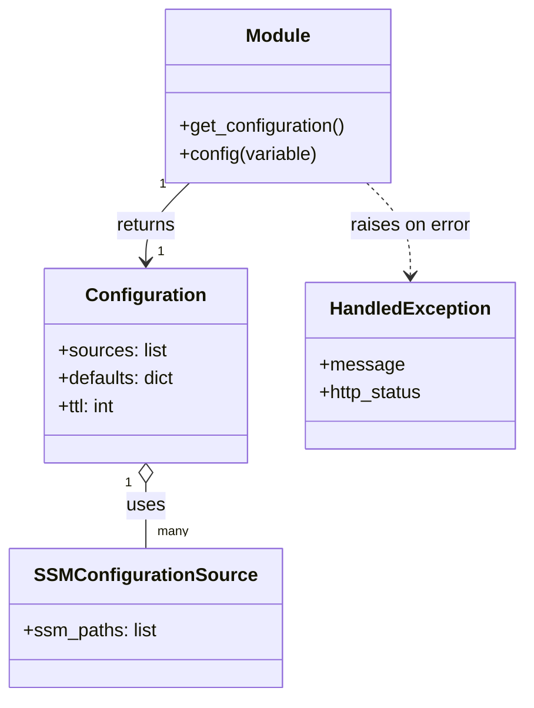

# Diagram: common/fv/python/fv/HERE/__init__.py


> Auto-generated by Obscura crawlers

## Diagram 1

```mermaid
flowchart LR
  Start(("start"))
  A[get_configuration()]
  Start --> A
  A --> B{AWS_STAGE in env?}
  B -- "prod or staging" --> C[aws_stage unchanged]
  B -- "other or missing" --> D[aws_stage = "test"]
  C --> E{aws_stage falsy?}
  D --> E
  E -- "true" --> F[/raise HandledException (HTTP 500)/]
  E -- "false" --> G[return Configuration(...)]
  G --> H[Configuration created with:
  - sources: [SSMConfigurationSource(ssm_paths=["/fv/here/config"])]
  - defaults: {"LOG_LEVEL":"INFO","DB_APPLICATION_NAME":"loc"}
  - ttl: 30]
  F --> End(("end"))
  H --> End
```

> SVG rendering failed for this diagram.

## Diagram 2



### SVG

<svg id="container" width="450.04296875" xmlns="http://www.w3.org/2000/svg" class="classDiagram" height="602" viewBox="0 0 450.04296875 602" role="graphics-document document" aria-roledescription="class"><style>#container{font-family:"trebuchet ms",verdana,arial,sans-serif;font-size:16px;fill:#333;}@keyframes edge-animation-frame{from{stroke-dashoffset:0;}}@keyframes dash{to{stroke-dashoffset:0;}}#container .edge-animation-slow{stroke-dasharray:9,5!important;stroke-dashoffset:900;animation:dash 50s linear infinite;stroke-linecap:round;}#container .edge-animation-fast{stroke-dasharray:9,5!important;stroke-dashoffset:900;animation:dash 20s linear infinite;stroke-linecap:round;}#container .error-icon{fill:#552222;}#container .error-text{fill:#552222;stroke:#552222;}#container .edge-thickness-normal{stroke-width:1px;}#container .edge-thickness-thick{stroke-width:3.5px;}#container .edge-pattern-solid{stroke-dasharray:0;}#container .edge-thickness-invisible{stroke-width:0;fill:none;}#container .edge-pattern-dashed{stroke-dasharray:3;}#container .edge-pattern-dotted{stroke-dasharray:2;}#container .marker{fill:#333333;stroke:#333333;}#container .marker.cross{stroke:#333333;}#container svg{font-family:"trebuchet ms",verdana,arial,sans-serif;font-size:16px;}#container p{margin:0;}#container g.classGroup text{fill:#9370DB;stroke:none;font-family:"trebuchet ms",verdana,arial,sans-serif;font-size:10px;}#container g.classGroup text .title{font-weight:bolder;}#container .nodeLabel,#container .edgeLabel{color:#131300;}#container .edgeLabel .label rect{fill:#ECECFF;}#container .label text{fill:#131300;}#container .labelBkg{background:#ECECFF;}#container .edgeLabel .label span{background:#ECECFF;}#container .classTitle{font-weight:bolder;}#container .node rect,#container .node circle,#container .node ellipse,#container .node polygon,#container .node path{fill:#ECECFF;stroke:#9370DB;stroke-width:1px;}#container .divider{stroke:#9370DB;stroke-width:1;}#container g.clickable{cursor:pointer;}#container g.classGroup rect{fill:#ECECFF;stroke:#9370DB;}#container g.classGroup line{stroke:#9370DB;stroke-width:1;}#container .classLabel .box{stroke:none;stroke-width:0;fill:#ECECFF;opacity:0.5;}#container .classLabel .label{fill:#9370DB;font-size:10px;}#container .relation{stroke:#333333;stroke-width:1;fill:none;}#container .dashed-line{stroke-dasharray:3;}#container .dotted-line{stroke-dasharray:1 2;}#container #compositionStart,#container .composition{fill:#333333!important;stroke:#333333!important;stroke-width:1;}#container #compositionEnd,#container .composition{fill:#333333!important;stroke:#333333!important;stroke-width:1;}#container #dependencyStart,#container .dependency{fill:#333333!important;stroke:#333333!important;stroke-width:1;}#container #dependencyStart,#container .dependency{fill:#333333!important;stroke:#333333!important;stroke-width:1;}#container #extensionStart,#container .extension{fill:transparent!important;stroke:#333333!important;stroke-width:1;}#container #extensionEnd,#container .extension{fill:transparent!important;stroke:#333333!important;stroke-width:1;}#container #aggregationStart,#container .aggregation{fill:transparent!important;stroke:#333333!important;stroke-width:1;}#container #aggregationEnd,#container .aggregation{fill:transparent!important;stroke:#333333!important;stroke-width:1;}#container #lollipopStart,#container .lollipop{fill:#ECECFF!important;stroke:#333333!important;stroke-width:1;}#container #lollipopEnd,#container .lollipop{fill:#ECECFF!important;stroke:#333333!important;stroke-width:1;}#container .edgeTerminals{font-size:11px;line-height:initial;}#container .classTitleText{text-anchor:middle;font-size:18px;fill:#333;}#container .label-icon{display:inline-block;height:1em;overflow:visible;vertical-align:-0.125em;}#container .node .label-icon path{fill:currentColor;stroke:revert;stroke-width:revert;}#container :root{--mermaid-font-family:"trebuchet ms",verdana,arial,sans-serif;}</style><g><defs><marker id="container_class-aggregationStart" class="marker aggregation class" refX="18" refY="7" markerWidth="190" markerHeight="240" orient="auto"><path d="M 18,7 L9,13 L1,7 L9,1 Z"></path></marker></defs><defs><marker id="container_class-aggregationEnd" class="marker aggregation class" refX="1" refY="7" markerWidth="20" markerHeight="28" orient="auto"><path d="M 18,7 L9,13 L1,7 L9,1 Z"></path></marker></defs><defs><marker id="container_class-extensionStart" class="marker extension class" refX="18" refY="7" markerWidth="190" markerHeight="240" orient="auto"><path d="M 1,7 L18,13 V 1 Z"></path></marker></defs><defs><marker id="container_class-extensionEnd" class="marker extension class" refX="1" refY="7" markerWidth="20" markerHeight="28" orient="auto"><path d="M 1,1 V 13 L18,7 Z"></path></marker></defs><defs><marker id="container_class-compositionStart" class="marker composition class" refX="18" refY="7" markerWidth="190" markerHeight="240" orient="auto"><path d="M 18,7 L9,13 L1,7 L9,1 Z"></path></marker></defs><defs><marker id="container_class-compositionEnd" class="marker composition class" refX="1" refY="7" markerWidth="20" markerHeight="28" orient="auto"><path d="M 18,7 L9,13 L1,7 L9,1 Z"></path></marker></defs><defs><marker id="container_class-dependencyStart" class="marker dependency class" refX="6" refY="7" markerWidth="190" markerHeight="240" orient="auto"><path d="M 5,7 L9,13 L1,7 L9,1 Z"></path></marker></defs><defs><marker id="container_class-dependencyEnd" class="marker dependency class" refX="13" refY="7" markerWidth="20" markerHeight="28" orient="auto"><path d="M 18,7 L9,13 L14,7 L9,1 Z"></path></marker></defs><defs><marker id="container_class-lollipopStart" class="marker lollipop class" refX="13" refY="7" markerWidth="190" markerHeight="240" orient="auto"><circle stroke="black" fill="transparent" cx="7" cy="7" r="6"></circle></marker></defs><defs><marker id="container_class-lollipopEnd" class="marker lollipop class" refX="1" refY="7" markerWidth="190" markerHeight="240" orient="auto"><circle stroke="black" fill="transparent" cx="7" cy="7" r="6"></circle></marker></defs><g class="root"><g class="clusters"></g><g class="edgePaths"><path d="M160.508,158L154.212,164.167C147.915,170.333,135.323,182.667,129.027,194C122.73,205.333,122.73,215.667,122.73,220.833L122.73,226" id="id_Module_Configuration_1" class="edge-thickness-normal edge-pattern-solid relation" style=";;;" data-edge="true" data-et="edge" data-id="id_Module_Configuration_1" data-points="W3sieCI6MTYwLjUwNzk2OTQ0NzU0NDY0LCJ5IjoxNTh9LHsieCI6MTIyLjczMDQ2ODc1LCJ5IjoxOTV9LHsieCI6MTIyLjczMDQ2ODc1LCJ5IjoyMzJ9XQ==" marker-end="url(#container_class-dependencyEnd)"></path><path d="M122.73,417.25L122.73,420.542C122.73,423.833,122.73,430.417,122.73,439.875C122.73,449.333,122.73,461.667,122.73,467.833L122.73,474" id="id_Configuration_SSMConfigurationSource_2" class="edge-thickness-normal edge-pattern-solid relation" style=";;;" data-edge="true" data-et="edge" data-id="id_Configuration_SSMConfigurationSource_2" data-points="W3sieCI6MTIyLjczMDQ2ODc1LCJ5Ijo0MDB9LHsieCI6MTIyLjczMDQ2ODc1LCJ5Ijo0Mzd9LHsieCI6MTIyLjczMDQ2ODc1LCJ5Ijo0NzR9XQ==" marker-start="url(#container_class-aggregationStart)"></path><path d="M313.66,158L319.956,164.167C326.252,170.333,338.845,182.667,345.141,196C351.438,209.333,351.438,223.667,351.438,230.833L351.438,238" id="id_Module_HandledException_3" class="edge-thickness-normal edge-pattern-dashed relation" style=";;;" data-edge="true" data-et="edge" data-id="id_Module_HandledException_3" data-points="W3sieCI6MzEzLjY1OTk5OTMwMjQ1NTQsInkiOjE1OH0seyJ4IjozNTEuNDM3NSwieSI6MTk1fSx7IngiOjM1MS40Mzc1LCJ5IjoyNDR9XQ==" marker-end="url(#container_class-dependencyEnd)"></path></g><g class="edgeLabels"><g class="edgeLabel" transform="translate(122.73046875, 195)"><g class="label" data-id="id_Module_Configuration_1" transform="translate(-26.265625, -12)"><foreignObject width="52.53125" height="24"><div xmlns="http://www.w3.org/1999/xhtml" class="labelBkg" style="display: table-cell; white-space: nowrap; line-height: 1.5; max-width: 200px; text-align: center;"><span class="edgeLabel"><p>returns</p></span></div></foreignObject></g></g><g class="edgeLabel" transform="translate(122.73046875, 437)"><g class="label" data-id="id_Configuration_SSMConfigurationSource_2" transform="translate(-16.4921875, -12)"><foreignObject width="32.984375" height="24"><div xmlns="http://www.w3.org/1999/xhtml" class="labelBkg" style="display: table-cell; white-space: nowrap; line-height: 1.5; max-width: 200px; text-align: center;"><span class="edgeLabel"><p>uses</p></span></div></foreignObject></g></g><g class="edgeLabel" transform="translate(351.4375, 195)"><g class="label" data-id="id_Module_HandledException_3" transform="translate(-52.90625, -12)"><foreignObject width="105.8125" height="24"><div xmlns="http://www.w3.org/1999/xhtml" class="labelBkg" style="display: table-cell; white-space: nowrap; line-height: 1.5; max-width: 200px; text-align: center;"><span class="edgeLabel"><p>raises on error</p></span></div></foreignObject></g></g><g class="edgeTerminals" transform="translate(137.50986187847138, 159.52874096314304)"><g class="inner" transform="translate(0, 0)"><foreignObject style="width: 9px; height: 12px;"><div xmlns="http://www.w3.org/1999/xhtml" style="display: inline-block; padding-right: 1px; white-space: nowrap;"><span class="edgeLabel">1</span></div></foreignObject></g></g><g class="edgeTerminals" transform="translate(107.73046937500001, 417.50000053571426)"><g class="inner" transform="translate(0, 0)"><foreignObject style="width: 9px; height: 12px;"><div xmlns="http://www.w3.org/1999/xhtml" style="display: inline-block; padding-right: 1px; white-space: nowrap;"><span class="edgeLabel">1</span></div></foreignObject></g></g><g class="edgeTerminals" transform="translate(132.73046937499998, 209.5000005357143)"><g class="inner" transform="translate(0, 0)"></g><foreignObject style="width: 9px; height: 12px;"><div xmlns="http://www.w3.org/1999/xhtml" style="display: inline-block; padding-right: 1px; white-space: nowrap;"><span class="edgeLabel">1</span></div></foreignObject></g><g class="edgeTerminals" transform="translate(132.73046937499998, 451.50000053571426)"><g class="inner" transform="translate(0, 0)"></g><foreignObject style="width: 36px; height: 12px;"><div xmlns="http://www.w3.org/1999/xhtml" style="display: inline-block; padding-right: 1px; white-space: nowrap;"><span class="edgeLabel">many</span></div></foreignObject></g></g><g class="nodes"><g class="node default" id="classId-Module-0" transform="translate(237.083984375, 83)"><g class="basic label-container"><path d="M-98.03125 -75 L98.03125 -75 L98.03125 75 L-98.03125 75" stroke="none" stroke-width="0" fill="#ECECFF" style=""></path><path d="M-98.03125 -75 C-32.395120970827705 -75, 33.24100805834459 -75, 98.03125 -75 M-98.03125 -75 C-38.839675857217344 -75, 20.351898285565312 -75, 98.03125 -75 M98.03125 -75 C98.03125 -34.55878452706923, 98.03125 5.882430945861543, 98.03125 75 M98.03125 -75 C98.03125 -35.580453601976004, 98.03125 3.839092796047993, 98.03125 75 M98.03125 75 C27.50533956446742 75, -43.02057087106516 75, -98.03125 75 M98.03125 75 C55.8559985758489 75, 13.680747151697801 75, -98.03125 75 M-98.03125 75 C-98.03125 44.51704429123801, -98.03125 14.03408858247601, -98.03125 -75 M-98.03125 75 C-98.03125 20.116547653306178, -98.03125 -34.766904693387644, -98.03125 -75" stroke="#9370DB" stroke-width="1.3" fill="none" stroke-dasharray="0 0" style=""></path></g><g class="annotation-group text" transform="translate(0, -51)"></g><g class="label-group text" transform="translate(-27.09375, -51)"><g class="label" style="font-weight: bolder" transform="translate(0,-12)"><foreignObject width="54.1875" height="24"><div xmlns="http://www.w3.org/1999/xhtml" style="display: table-cell; white-space: nowrap; line-height: 1.5; max-width: 104px; text-align: center;"><span class="nodeLabel markdown-node-label" style=""><p>Module</p></span></div></foreignObject></g></g><g class="members-group text" transform="translate(-86.03125, -3)"></g><g class="methods-group text" transform="translate(-86.03125, 27)"><g class="label" style="" transform="translate(0,-12)"><foreignObject width="144.96875" height="24"><div xmlns="http://www.w3.org/1999/xhtml" style="display: table-cell; white-space: nowrap; line-height: 1.5; max-width: 202px; text-align: center;"><span class="nodeLabel markdown-node-label" style=""><p>+get_configuration()</p></span></div></foreignObject></g><g class="label" style="" transform="translate(0,12)"><foreignObject width="120.46875" height="24"><div xmlns="http://www.w3.org/1999/xhtml" style="display: table-cell; white-space: nowrap; line-height: 1.5; max-width: 178px; text-align: center;"><span class="nodeLabel markdown-node-label" style=""><p>+config(variable)</p></span></div></foreignObject></g></g><g class="divider" style=""><path d="M-98.03125 -27 C-41.10399449993712 -27, 15.823261000125754 -27, 98.03125 -27 M-98.03125 -27 C-54.58482123220772 -27, -11.138392464415446 -27, 98.03125 -27" stroke="#9370DB" stroke-width="1.3" fill="none" stroke-dasharray="0 0" style=""></path></g><g class="divider" style=""><path d="M-98.03125 -3 C-39.09698918529889 -3, 19.837271629402224 -3, 98.03125 -3 M-98.03125 -3 C-45.321387765291426 -3, 7.388474469417147 -3, 98.03125 -3" stroke="#9370DB" stroke-width="1.3" fill="none" stroke-dasharray="0 0" style=""></path></g></g><g class="node default" id="classId-Configuration-1" transform="translate(122.73046875, 316)"><g class="basic label-container"><path d="M-88.1015625 -84 L88.1015625 -84 L88.1015625 84 L-88.1015625 84" stroke="none" stroke-width="0" fill="#ECECFF" style=""></path><path d="M-88.1015625 -84 C-40.671741239682234 -84, 6.758080020635532 -84, 88.1015625 -84 M-88.1015625 -84 C-26.9017857636617 -84, 34.2979909726766 -84, 88.1015625 -84 M88.1015625 -84 C88.1015625 -34.55839795955424, 88.1015625 14.883204080891517, 88.1015625 84 M88.1015625 -84 C88.1015625 -48.36215568696963, 88.1015625 -12.724311373939258, 88.1015625 84 M88.1015625 84 C27.005064276798784 84, -34.09143394640243 84, -88.1015625 84 M88.1015625 84 C29.967506503513043 84, -28.166549492973914 84, -88.1015625 84 M-88.1015625 84 C-88.1015625 48.48228250378959, -88.1015625 12.964565007579182, -88.1015625 -84 M-88.1015625 84 C-88.1015625 43.88266837906679, -88.1015625 3.7653367581335857, -88.1015625 -84" stroke="#9370DB" stroke-width="1.3" fill="none" stroke-dasharray="0 0" style=""></path></g><g class="annotation-group text" transform="translate(0, -60)"></g><g class="label-group text" transform="translate(-49.375, -60)"><g class="label" style="font-weight: bolder" transform="translate(0,-12)"><foreignObject width="98.75" height="24"><div xmlns="http://www.w3.org/1999/xhtml" style="display: table-cell; white-space: nowrap; line-height: 1.5; max-width: 147px; text-align: center;"><span class="nodeLabel markdown-node-label" style=""><p>Configuration</p></span></div></foreignObject></g></g><g class="members-group text" transform="translate(-76.1015625, -12)"><g class="label" style="" transform="translate(0,-12)"><foreignObject width="93.859375" height="24"><div xmlns="http://www.w3.org/1999/xhtml" style="display: table-cell; white-space: nowrap; line-height: 1.5; max-width: 151px; text-align: center;"><span class="nodeLabel markdown-node-label" style=""><p>+sources: list</p></span></div></foreignObject></g><g class="label" style="" transform="translate(0,12)"><foreignObject width="102.828125" height="24"><div xmlns="http://www.w3.org/1999/xhtml" style="display: table-cell; white-space: nowrap; line-height: 1.5; max-width: 160px; text-align: center;"><span class="nodeLabel markdown-node-label" style=""><p>+defaults: dict</p></span></div></foreignObject></g><g class="label" style="" transform="translate(0,36)"><foreignObject width="51.890625" height="24"><div xmlns="http://www.w3.org/1999/xhtml" style="display: table-cell; white-space: nowrap; line-height: 1.5; max-width: 109px; text-align: center;"><span class="nodeLabel markdown-node-label" style=""><p>+ttl: int</p></span></div></foreignObject></g></g><g class="methods-group text" transform="translate(-76.1015625, 84)"></g><g class="divider" style=""><path d="M-88.1015625 -36 C-24.785834147414604 -36, 38.52989420517079 -36, 88.1015625 -36 M-88.1015625 -36 C-19.035984254121004 -36, 50.02959399175799 -36, 88.1015625 -36" stroke="#9370DB" stroke-width="1.3" fill="none" stroke-dasharray="0 0" style=""></path></g><g class="divider" style=""><path d="M-88.1015625 60 C-29.06238496831582 60, 29.976792563368363 60, 88.1015625 60 M-88.1015625 60 C-35.917172765020666 60, 16.267216969958668 60, 88.1015625 60" stroke="#9370DB" stroke-width="1.3" fill="none" stroke-dasharray="0 0" style=""></path></g></g><g class="node default" id="classId-SSMConfigurationSource-2" transform="translate(122.73046875, 534)"><g class="basic label-container"><path d="M-114.73046875 -60 L114.73046875 -60 L114.73046875 60 L-114.73046875 60" stroke="none" stroke-width="0" fill="#ECECFF" style=""></path><path d="M-114.73046875 -60 C-29.3230707523321 -60, 56.0843272453358 -60, 114.73046875 -60 M-114.73046875 -60 C-30.078876261383513 -60, 54.57271622723297 -60, 114.73046875 -60 M114.73046875 -60 C114.73046875 -23.514358979152554, 114.73046875 12.971282041694892, 114.73046875 60 M114.73046875 -60 C114.73046875 -26.934844987177, 114.73046875 6.130310025645997, 114.73046875 60 M114.73046875 60 C39.849052294837335 60, -35.03236416032533 60, -114.73046875 60 M114.73046875 60 C36.03948601045683 60, -42.65149672908635 60, -114.73046875 60 M-114.73046875 60 C-114.73046875 15.179527145107961, -114.73046875 -29.640945709784077, -114.73046875 -60 M-114.73046875 60 C-114.73046875 26.99410763774234, -114.73046875 -6.011784724515323, -114.73046875 -60" stroke="#9370DB" stroke-width="1.3" fill="none" stroke-dasharray="0 0" style=""></path></g><g class="annotation-group text" transform="translate(0, -36)"></g><g class="label-group text" transform="translate(-89.4453125, -36)"><g class="label" style="font-weight: bolder" transform="translate(0,-12)"><foreignObject width="178.890625" height="24"><div xmlns="http://www.w3.org/1999/xhtml" style="display: table-cell; white-space: nowrap; line-height: 1.5; max-width: 226px; text-align: center;"><span class="nodeLabel markdown-node-label" style=""><p>SSMConfigurationSource</p></span></div></foreignObject></g></g><g class="members-group text" transform="translate(-102.73046875, 12)"><g class="label" style="" transform="translate(0,-12)"><foreignObject width="116.015625" height="24"><div xmlns="http://www.w3.org/1999/xhtml" style="display: table-cell; white-space: nowrap; line-height: 1.5; max-width: 174px; text-align: center;"><span class="nodeLabel markdown-node-label" style=""><p>+ssm_paths: list</p></span></div></foreignObject></g></g><g class="methods-group text" transform="translate(-102.73046875, 60)"></g><g class="divider" style=""><path d="M-114.73046875 -12 C-28.755056745601436 -12, 57.22035525879713 -12, 114.73046875 -12 M-114.73046875 -12 C-25.08794072420413 -12, 64.55458730159174 -12, 114.73046875 -12" stroke="#9370DB" stroke-width="1.3" fill="none" stroke-dasharray="0 0" style=""></path></g><g class="divider" style=""><path d="M-114.73046875 36 C-48.23481859245379 36, 18.260831565092417 36, 114.73046875 36 M-114.73046875 36 C-34.183626225904646 36, 46.36321629819071 36, 114.73046875 36" stroke="#9370DB" stroke-width="1.3" fill="none" stroke-dasharray="0 0" style=""></path></g></g><g class="node default" id="classId-HandledException-3" transform="translate(351.4375, 316)"><g class="basic label-container"><path d="M-90.60546875 -72 L90.60546875 -72 L90.60546875 72 L-90.60546875 72" stroke="none" stroke-width="0" fill="#ECECFF" style=""></path><path d="M-90.60546875 -72 C-44.38242654102975 -72, 1.8406156679404972 -72, 90.60546875 -72 M-90.60546875 -72 C-32.809059963685215 -72, 24.98734882262957 -72, 90.60546875 -72 M90.60546875 -72 C90.60546875 -23.398711717194075, 90.60546875 25.20257656561185, 90.60546875 72 M90.60546875 -72 C90.60546875 -40.46881345942265, 90.60546875 -8.937626918845304, 90.60546875 72 M90.60546875 72 C28.037403420583736 72, -34.53066190883253 72, -90.60546875 72 M90.60546875 72 C24.786864793942996 72, -41.03173916211401 72, -90.60546875 72 M-90.60546875 72 C-90.60546875 18.754350521951267, -90.60546875 -34.49129895609747, -90.60546875 -72 M-90.60546875 72 C-90.60546875 34.3223069120585, -90.60546875 -3.355386175882998, -90.60546875 -72" stroke="#9370DB" stroke-width="1.3" fill="none" stroke-dasharray="0 0" style=""></path></g><g class="annotation-group text" transform="translate(0, -48)"></g><g class="label-group text" transform="translate(-66.3828125, -48)"><g class="label" style="font-weight: bolder" transform="translate(0,-12)"><foreignObject width="132.765625" height="24"><div xmlns="http://www.w3.org/1999/xhtml" style="display: table-cell; white-space: nowrap; line-height: 1.5; max-width: 182px; text-align: center;"><span class="nodeLabel markdown-node-label" style=""><p>HandledException</p></span></div></foreignObject></g></g><g class="members-group text" transform="translate(-78.60546875, 0)"><g class="label" style="" transform="translate(0,-12)"><foreignObject width="70.375" height="24"><div xmlns="http://www.w3.org/1999/xhtml" style="display: table-cell; white-space: nowrap; line-height: 1.5; max-width: 128px; text-align: center;"><span class="nodeLabel markdown-node-label" style=""><p>+message</p></span></div></foreignObject></g><g class="label" style="" transform="translate(0,12)"><foreignObject width="90.828125" height="24"><div xmlns="http://www.w3.org/1999/xhtml" style="display: table-cell; white-space: nowrap; line-height: 1.5; max-width: 148px; text-align: center;"><span class="nodeLabel markdown-node-label" style=""><p>+http_status</p></span></div></foreignObject></g></g><g class="methods-group text" transform="translate(-78.60546875, 72)"></g><g class="divider" style=""><path d="M-90.60546875 -24 C-53.76323320510033 -24, -16.920997660200655 -24, 90.60546875 -24 M-90.60546875 -24 C-46.07241446715847 -24, -1.5393601843169336 -24, 90.60546875 -24" stroke="#9370DB" stroke-width="1.3" fill="none" stroke-dasharray="0 0" style=""></path></g><g class="divider" style=""><path d="M-90.60546875 48 C-21.482797765108444 48, 47.63987321978311 48, 90.60546875 48 M-90.60546875 48 C-23.570017693172503 48, 43.465433363654995 48, 90.60546875 48" stroke="#9370DB" stroke-width="1.3" fill="none" stroke-dasharray="0 0" style=""></path></g></g></g></g></g></svg>
