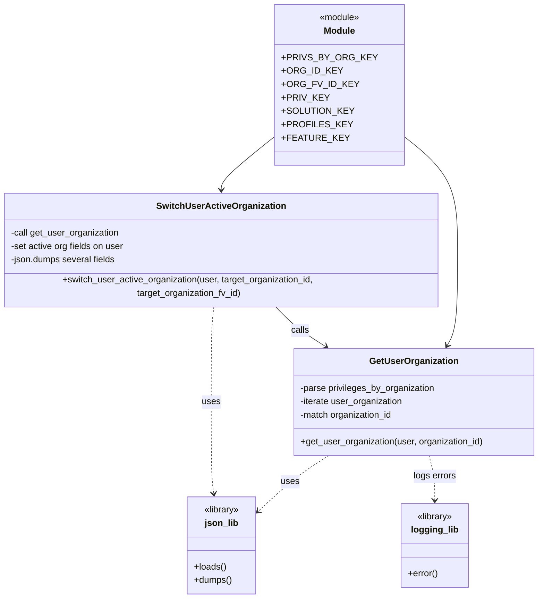

# Diagram: common/fv/python/fv/authorization/__init__.py

> Auto-generated by Obscura crawlers

## Mermaid

### SVG

<svg id="container" width="966.177734375" xmlns="http://www.w3.org/2000/svg" class="classDiagram" height="1060" viewBox="0 0 966.177734375 1060" role="graphics-document document" aria-roledescription="class"><g><defs><marker id="container_class-aggregationStart" class="marker aggregation class" refX="18" refY="7" markerWidth="190" markerHeight="240" orient="auto"><path d="M 18,7 L9,13 L1,7 L9,1 Z"></path></marker></defs><defs><marker id="container_class-aggregationEnd" class="marker aggregation class" refX="1" refY="7" markerWidth="20" markerHeight="28" orient="auto"><path d="M 18,7 L9,13 L1,7 L9,1 Z"></path></marker></defs><defs><marker id="container_class-extensionStart" class="marker extension class" refX="18" refY="7" markerWidth="190" markerHeight="240" orient="auto"><path d="M 1,7 L18,13 V 1 Z"></path></marker></defs><defs><marker id="container_class-extensionEnd" class="marker extension class" refX="1" refY="7" markerWidth="20" markerHeight="28" orient="auto"><path d="M 1,1 V 13 L18,7 Z"></path></marker></defs><defs><marker id="container_class-compositionStart" class="marker composition class" refX="18" refY="7" markerWidth="190" markerHeight="240" orient="auto"><path d="M 18,7 L9,13 L1,7 L9,1 Z"></path></marker></defs><defs><marker id="container_class-compositionEnd" class="marker composition class" refX="1" refY="7" markerWidth="20" markerHeight="28" orient="auto"><path d="M 18,7 L9,13 L1,7 L9,1 Z"></path></marker></defs><defs><marker id="container_class-dependencyStart" class="marker dependency class" refX="6" refY="7" markerWidth="190" markerHeight="240" orient="auto"><path d="M 5,7 L9,13 L1,7 L9,1 Z"></path></marker></defs><defs><marker id="container_class-dependencyEnd" class="marker dependency class" refX="13" refY="7" markerWidth="20" markerHeight="28" orient="auto"><path d="M 18,7 L9,13 L14,7 L9,1 Z"></path></marker></defs><defs><marker id="container_class-lollipopStart" class="marker lollipop class" refX="13" refY="7" markerWidth="190" markerHeight="240" orient="auto"><circle stroke="black" fill="transparent" cx="7" cy="7" r="6"></circle></marker></defs><defs><marker id="container_class-lollipopEnd" class="marker lollipop class" refX="1" refY="7" markerWidth="190" markerHeight="240" orient="auto"><circle stroke="black" fill="transparent" cx="7" cy="7" r="6"></circle></marker></defs><g class="root"><g class="clusters"></g><g class="edgePaths"><path d="M714.627,234.589L732.743,248.991C750.858,263.393,787.089,292.196,805.205,326.765C823.32,361.333,823.32,401.667,823.32,444C823.32,486.333,823.32,530.667,820.143,558.142C816.966,585.617,810.611,596.234,807.434,601.543L804.256,606.852" id="id_Module_GetUserOrganization_1" class="edge-thickness-normal edge-pattern-solid relation" style=";;;" data-edge="true" data-et="edge" data-id="id_Module_GetUserOrganization_1" data-points="W3sieCI6NzE0LjYyNjk1MzEyNSwieSI6MjM0LjU4OTM3MzQ4OTc2OTQ5fSx7IngiOjgyMy4zMjAzMTI1LCJ5IjozMjF9LHsieCI6ODIzLjMyMDMxMjUsInkiOjQ0Mn0seyJ4Ijo4MjMuMzIwMzEyNSwieSI6NTc1fSx7IngiOjgwMS4xNzQ5NzM1NjY3Mjk0LCJ5Ijo2MTJ9XQ==" marker-end="url(#container_class-dependencyEnd)"></path><path d="M506.854,234.589L488.738,248.991C470.622,263.393,434.391,292.196,416.276,309.765C398.16,327.333,398.16,333.667,398.16,336.833L398.16,340" id="id_Module_SwitchUserActiveOrganization_2" class="edge-thickness-normal edge-pattern-solid relation" style=";;;" data-edge="true" data-et="edge" data-id="id_Module_SwitchUserActiveOrganization_2" data-points="W3sieCI6NTA2Ljg1MzUxNTYyNSwieSI6MjM0LjU4OTM3MzQ4OTc2OTQ5fSx7IngiOjM5OC4xNjAxNTYyNSwieSI6MzIxfSx7IngiOjM5OC4xNjAxNTYyNSwieSI6MzQ2fV0=" marker-end="url(#container_class-dependencyEnd)"></path><path d="M494.143,538L500.309,544.167C506.474,550.333,518.806,562.667,533.98,574.47C549.154,586.273,567.172,597.545,576.18,603.181L585.189,608.818" id="id_SwitchUserActiveOrganization_GetUserOrganization_3" class="edge-thickness-normal edge-pattern-solid relation" style=";;;" data-edge="true" data-et="edge" data-id="id_SwitchUserActiveOrganization_GetUserOrganization_3" data-points="W3sieCI6NDk0LjE0MzIzODk1Njc2Njk0LCJ5Ijo1Mzh9LHsieCI6NTMxLjEzNjcxODc1LCJ5Ijo1NzV9LHsieCI6NTkwLjI3NTUzNzQ3NjUwMzgsInkiOjYxMn1d" marker-end="url(#container_class-dependencyEnd)"></path><path d="M590.292,804L580.437,810.167C570.582,816.333,550.871,828.667,529.966,845.137C509.062,861.607,486.963,882.213,475.914,892.517L464.865,902.82" id="id_GetUserOrganization_json_lib_4" class="edge-thickness-normal edge-pattern-dashed relation" style=";;;" data-edge="true" data-et="edge" data-id="id_GetUserOrganization_json_lib_4" data-points="W3sieCI6NTkwLjI5MjQ1NDc2OTczNjksInkiOjgwNH0seyJ4Ijo1MzEuMTYwMTU2MjUsInkiOjg0MX0seyJ4Ijo0NjAuNDc2NTYyNSwieSI6OTA2LjkxMjEwODU3MTc2NDN9XQ==" marker-end="url(#container_class-dependencyEnd)"></path><path d="M770.821,804L772.562,810.167C774.303,816.333,777.785,828.667,779.527,842C781.268,855.333,781.268,869.667,781.268,876.833L781.268,884" id="id_GetUserOrganization_logging_lib_5" class="edge-thickness-normal edge-pattern-dashed relation" style=";;;" data-edge="true" data-et="edge" data-id="id_GetUserOrganization_logging_lib_5" data-points="W3sieCI6NzcwLjgyMTEyMDE4MzI3MDYsInkiOjgwNH0seyJ4Ijo3ODEuMjY3NTc4MTI1LCJ5Ijo4NDF9LHsieCI6NzgxLjI2NzU3ODEyNSwieSI6ODkwfV0=" marker-end="url(#container_class-dependencyEnd)"></path><path d="M385.007,538L384.162,544.167C383.317,550.333,381.627,562.667,380.782,591C379.938,619.333,379.938,663.667,379.938,708C379.938,752.333,379.938,796.667,380.699,824.011C381.461,851.355,382.985,861.709,383.747,866.887L384.508,872.064" id="id_SwitchUserActiveOrganization_json_lib_6" class="edge-thickness-normal edge-pattern-dashed relation" style=";;;" data-edge="true" data-et="edge" data-id="id_SwitchUserActiveOrganization_json_lib_6" data-points="W3sieCI6Mzg1LjAwNjk2MDc2MTI3ODIsInkiOjUzOH0seyJ4IjozNzkuOTM3NSwieSI6NTc1fSx7IngiOjM3OS45Mzc1LCJ5Ijo3MDh9LHsieCI6Mzc5LjkzNzUsInkiOjg0MX0seyJ4IjozODUuMzgxODk4OTQxNTMyMjYsInkiOjg3OH1d" marker-end="url(#container_class-dependencyEnd)"></path></g><g class="edgeLabels"><g class="edgeLabel"><g class="label" data-id="id_Module_GetUserOrganization_1" transform="translate(0, 0)"><foreignObject width="0" height="0">

</foreignObject></g></g><g class="edgeLabel"><g class="label" data-id="id_Module_SwitchUserActiveOrganization_2" transform="translate(0, 0)"><foreignObject width="0" height="0">

</foreignObject></g></g><g class="edgeLabel" transform="translate(538.52839, 579.62458)"><g class="label" data-id="id_SwitchUserActiveOrganization_GetUserOrganization_3" transform="translate(-16.4453125, -12)"><foreignObject width="32.890625" height="24">

calls

</foreignObject></g></g><g class="edgeLabel" transform="translate(521.32606, 850.17025)"><g class="label" data-id="id_GetUserOrganization_json_lib_4" transform="translate(-16.4921875, -12)"><foreignObject width="32.984375" height="24">

uses

</foreignObject></g></g><g class="edgeLabel" transform="translate(781.267578125, 841)"><g class="label" data-id="id_GetUserOrganization_logging_lib_5" transform="translate(-38.609375, -12)"><foreignObject width="77.21875" height="24">

logs errors

</foreignObject></g></g><g class="edgeLabel" transform="translate(379.9375, 708)"><g class="label" data-id="id_SwitchUserActiveOrganization_json_lib_6" transform="translate(-16.4921875, -12)"><foreignObject width="32.984375" height="24">

uses

</foreignObject></g></g></g><g class="nodes"><g class="node default" id="classId-Module-0" transform="translate(610.740234375, 152)"><g class="basic label-container"><path d="M-103.88671875 -144 L103.88671875 -144 L103.88671875 144 L-103.88671875 144" stroke="none" stroke-width="0" fill="#ECECFF" style=""></path><path d="M-103.88671875 -144 C-33.713007559838374 -144, 36.46070363032325 -144, 103.88671875 -144 M-103.88671875 -144 C-35.775477733861365 -144, 32.33576328227727 -144, 103.88671875 -144 M103.88671875 -144 C103.88671875 -67.70846026919014, 103.88671875 8.583079461619718, 103.88671875 144 M103.88671875 -144 C103.88671875 -71.72247720627728, 103.88671875 0.5550455874454485, 103.88671875 144 M103.88671875 144 C60.20280423643804 144, 16.518889722876082 144, -103.88671875 144 M103.88671875 144 C41.25422393225389 144, -21.378270885492213 144, -103.88671875 144 M-103.88671875 144 C-103.88671875 46.182458813544216, -103.88671875 -51.63508237291157, -103.88671875 -144 M-103.88671875 144 C-103.88671875 36.22854205261041, -103.88671875 -71.54291589477918, -103.88671875 -144" stroke="#9370DB" stroke-width="1.3" fill="none" stroke-dasharray="0 0" style=""></path></g><g class="annotation-group text" transform="translate(-36.6015625, -120)"><g class="label" style="" transform="translate(0,-12)"><foreignObject width="73.203125" height="24">

«module»

</foreignObject></g></g><g class="label-group text" transform="translate(-27.09375, -96)"><g class="label" style="font-weight: bolder" transform="translate(0,-12)"><foreignObject width="54.1875" height="24">

Module

</foreignObject></g></g><g class="members-group text" transform="translate(-91.88671875, -48)"><g class="label" style="" transform="translate(0,-12)"><foreignObject width="147.171875" height="24">

+PRIVS_BY_ORG_KEY

</foreignObject></g><g class="label" style="" transform="translate(0,12)"><foreignObject width="96.421875" height="24">

+ORG_ID_KEY

</foreignObject></g><g class="label" style="" transform="translate(0,36)"><foreignObject width="120.703125" height="24">

+ORG_FV_ID_KEY

</foreignObject></g><g class="label" style="" transform="translate(0,60)"><foreignObject width="74.8125" height="24">

+PRIV_KEY

</foreignObject></g><g class="label" style="" transform="translate(0,84)"><foreignObject width="115.3125" height="24">

+SOLUTION_KEY

</foreignObject></g><g class="label" style="" transform="translate(0,108)"><foreignObject width="110.109375" height="24">

+PROFILES_KEY

</foreignObject></g><g class="label" style="" transform="translate(0,132)"><foreignObject width="104.90625" height="24">

+FEATURE_KEY

</foreignObject></g></g><g class="methods-group text" transform="translate(-91.88671875, 144)"></g><g class="divider" style=""><path d="M-103.88671875 -72 C-28.023769161660738 -72, 47.839180426678524 -72, 103.88671875 -72 M-103.88671875 -72 C-58.29775753541696 -72, -12.708796320833926 -72, 103.88671875 -72" stroke="#9370DB" stroke-width="1.3" fill="none" stroke-dasharray="0 0" style=""></path></g><g class="divider" style=""><path d="M-103.88671875 120 C-46.248361192816304 120, 11.389996364367391 120, 103.88671875 120 M-103.88671875 120 C-33.63750458735015 120, 36.6117095752997 120, 103.88671875 120" stroke="#9370DB" stroke-width="1.3" fill="none" stroke-dasharray="0 0" style=""></path></g></g><g class="node default" id="classId-GetUserOrganization-1" transform="translate(743.716796875, 708)"><g class="basic label-container"><path d="M-214.4609375 -96 L214.4609375 -96 L214.4609375 96 L-214.4609375 96" stroke="none" stroke-width="0" fill="#ECECFF" style=""></path><path d="M-214.4609375 -96 C-68.04484239150011 -96, 78.37125271699978 -96, 214.4609375 -96 M-214.4609375 -96 C-84.22996411985807 -96, 46.001009260283865 -96, 214.4609375 -96 M214.4609375 -96 C214.4609375 -40.59877883472987, 214.4609375 14.80244233054026, 214.4609375 96 M214.4609375 -96 C214.4609375 -38.455972388007396, 214.4609375 19.088055223985208, 214.4609375 96 M214.4609375 96 C54.57463567189495 96, -105.3116661562101 96, -214.4609375 96 M214.4609375 96 C86.86686495445208 96, -40.72720759109583 96, -214.4609375 96 M-214.4609375 96 C-214.4609375 40.71826502559523, -214.4609375 -14.56346994880954, -214.4609375 -96 M-214.4609375 96 C-214.4609375 21.399645423533258, -214.4609375 -53.200709152933484, -214.4609375 -96" stroke="#9370DB" stroke-width="1.3" fill="none" stroke-dasharray="0 0" style=""></path></g><g class="annotation-group text" transform="translate(0, -72)"></g><g class="label-group text" transform="translate(-76.015625, -72)"><g class="label" style="font-weight: bolder" transform="translate(0,-12)"><foreignObject width="152.03125" height="24">

GetUserOrganization

</foreignObject></g></g><g class="members-group text" transform="translate(-202.4609375, -24)"><g class="label" style="" transform="translate(0,-12)"><foreignObject width="244.21875" height="24">

-parse privileges_by_organization

</foreignObject></g><g class="label" style="" transform="translate(0,12)"><foreignObject width="186.796875" height="24">

-iterate user_organization

</foreignObject></g><g class="label" style="" transform="translate(0,36)"><foreignObject width="168.421875" height="24">

-match organization_id

</foreignObject></g></g><g class="methods-group text" transform="translate(-202.4609375, 72)"><g class="label" style="" transform="translate(0,-12)"><foreignObject width="328.90625" height="24">

+get_user_organization(user, organization_id)

</foreignObject></g></g><g class="divider" style=""><path d="M-214.4609375 -48 C-113.11227583279148 -48, -11.763614165582965 -48, 214.4609375 -48 M-214.4609375 -48 C-114.04949736192088 -48, -13.63805722384177 -48, 214.4609375 -48" stroke="#9370DB" stroke-width="1.3" fill="none" stroke-dasharray="0 0" style=""></path></g><g class="divider" style=""><path d="M-214.4609375 48 C-109.63359278066059 48, -4.806248061321185 48, 214.4609375 48 M-214.4609375 48 C-100.64288847540374 48, 13.175160549192526 48, 214.4609375 48" stroke="#9370DB" stroke-width="1.3" fill="none" stroke-dasharray="0 0" style=""></path></g></g><g class="node default" id="classId-SwitchUserActiveOrganization-2" transform="translate(398.16015625, 442)"><g class="basic label-container"><path d="M-390.16015625 -96 L390.16015625 -96 L390.16015625 96 L-390.16015625 96" stroke="none" stroke-width="0" fill="#ECECFF" style=""></path><path d="M-390.16015625 -96 C-216.19647411228146 -96, -42.23279197456293 -96, 390.16015625 -96 M-390.16015625 -96 C-223.78212812624838 -96, -57.40410000249676 -96, 390.16015625 -96 M390.16015625 -96 C390.16015625 -31.453590422487196, 390.16015625 33.09281915502561, 390.16015625 96 M390.16015625 -96 C390.16015625 -22.195571079266216, 390.16015625 51.60885784146757, 390.16015625 96 M390.16015625 96 C164.19714261417775 96, -61.7658710216445 96, -390.16015625 96 M390.16015625 96 C210.589705786034 96, 31.019255322067977 96, -390.16015625 96 M-390.16015625 96 C-390.16015625 56.62617532437465, -390.16015625 17.2523506487493, -390.16015625 -96 M-390.16015625 96 C-390.16015625 38.904652127675774, -390.16015625 -18.19069574464845, -390.16015625 -96" stroke="#9370DB" stroke-width="1.3" fill="none" stroke-dasharray="0 0" style=""></path></g><g class="annotation-group text" transform="translate(0, -72)"></g><g class="label-group text" transform="translate(-109.9140625, -72)"><g class="label" style="font-weight: bolder" transform="translate(0,-12)"><foreignObject width="219.828125" height="24">

SwitchUserActiveOrganization

</foreignObject></g></g><g class="members-group text" transform="translate(-378.16015625, -24)"><g class="label" style="" transform="translate(0,-12)"><foreignObject width="195.421875" height="24">

-call get_user_organization

</foreignObject></g><g class="label" style="" transform="translate(0,12)"><foreignObject width="206.359375" height="24">

-set active org fields on user

</foreignObject></g><g class="label" style="" transform="translate(0,36)"><foreignObject width="189.765625" height="24">

-json.dumps several fields

</foreignObject></g></g><g class="methods-group text" transform="translate(-378.16015625, 72)"><g class="label" style="" transform="translate(0,-12)"><foreignObject width="646.40625" height="24">

+switch_user_active_organization(user, target_organization_id, target_organization_fv_id)

</foreignObject></g></g><g class="divider" style=""><path d="M-390.16015625 -48 C-183.41260721666518 -48, 23.33494181666964 -48, 390.16015625 -48 M-390.16015625 -48 C-123.36028849805473 -48, 143.43957925389054 -48, 390.16015625 -48" stroke="#9370DB" stroke-width="1.3" fill="none" stroke-dasharray="0 0" style=""></path></g><g class="divider" style=""><path d="M-390.16015625 48 C-91.71204641703349 48, 206.73606341593302 48, 390.16015625 48 M-390.16015625 48 C-91.72162450473587 48, 206.71690724052826 48, 390.16015625 48" stroke="#9370DB" stroke-width="1.3" fill="none" stroke-dasharray="0 0" style=""></path></g></g><g class="node default" id="classId-json_lib-3" transform="translate(398.18359375, 965)"><g class="basic label-container"><path d="M-62.29296875 -87 L62.29296875 -87 L62.29296875 87 L-62.29296875 87" stroke="none" stroke-width="0" fill="#ECECFF" style=""></path><path d="M-62.29296875 -87 C-20.51279966204939 -87, 21.267369425901222 -87, 62.29296875 -87 M-62.29296875 -87 C-23.394187344987408 -87, 15.504594060025184 -87, 62.29296875 -87 M62.29296875 -87 C62.29296875 -46.563457221799545, 62.29296875 -6.126914443599091, 62.29296875 87 M62.29296875 -87 C62.29296875 -50.78220136844979, 62.29296875 -14.56440273689958, 62.29296875 87 M62.29296875 87 C13.188871481825792 87, -35.915225786348415 87, -62.29296875 87 M62.29296875 87 C35.71355670975926 87, 9.134144669518513 87, -62.29296875 87 M-62.29296875 87 C-62.29296875 28.238077200870734, -62.29296875 -30.523845598258532, -62.29296875 -87 M-62.29296875 87 C-62.29296875 21.329128203716678, -62.29296875 -44.341743592566644, -62.29296875 -87" stroke="#9370DB" stroke-width="1.3" fill="none" stroke-dasharray="0 0" style=""></path></g><g class="annotation-group text" transform="translate(-32.6640625, -63)"><g class="label" style="" transform="translate(0,-12)"><foreignObject width="65.328125" height="24">

«library»

</foreignObject></g></g><g class="label-group text" transform="translate(-28.890625, -39)"><g class="label" style="font-weight: bolder" transform="translate(0,-12)"><foreignObject width="57.78125" height="24">

json_lib

</foreignObject></g></g><g class="members-group text" transform="translate(-50.29296875, 9)"></g><g class="methods-group text" transform="translate(-50.29296875, 39)"><g class="label" style="" transform="translate(0,-12)"><foreignObject width="57.890625" height="24">

+loads()

</foreignObject></g><g class="label" style="" transform="translate(0,12)"><foreignObject width="67.921875" height="24">

+dumps()

</foreignObject></g></g><g class="divider" style=""><path d="M-62.29296875 -15 C-14.153188834814898 -15, 33.986591080370204 -15, 62.29296875 -15 M-62.29296875 -15 C-22.710607802003082 -15, 16.871753145993836 -15, 62.29296875 -15" stroke="#9370DB" stroke-width="1.3" fill="none" stroke-dasharray="0 0" style=""></path></g><g class="divider" style=""><path d="M-62.29296875 9 C-35.61942099781549 9, -8.945873245630978 9, 62.29296875 9 M-62.29296875 9 C-20.49772098223579 9, 21.29752678552842 9, 62.29296875 9" stroke="#9370DB" stroke-width="1.3" fill="none" stroke-dasharray="0 0" style=""></path></g></g><g class="node default" id="classId-logging_lib-4" transform="translate(781.267578125, 965)"><g class="basic label-container"><path d="M-59.5625 -75 L59.5625 -75 L59.5625 75 L-59.5625 75" stroke="none" stroke-width="0" fill="#ECECFF" style=""></path><path d="M-59.5625 -75 C-34.37871131170608 -75, -9.194922623412154 -75, 59.5625 -75 M-59.5625 -75 C-32.638553614984716 -75, -5.714607229969438 -75, 59.5625 -75 M59.5625 -75 C59.5625 -18.50316523301371, 59.5625 37.99366953397258, 59.5625 75 M59.5625 -75 C59.5625 -36.38719872399786, 59.5625 2.2256025520042755, 59.5625 75 M59.5625 75 C33.86172407560342 75, 8.160948151206831 75, -59.5625 75 M59.5625 75 C15.623257621243127 75, -28.315984757513746 75, -59.5625 75 M-59.5625 75 C-59.5625 31.929578298021767, -59.5625 -11.140843403956467, -59.5625 -75 M-59.5625 75 C-59.5625 28.58261542123094, -59.5625 -17.83476915753812, -59.5625 -75" stroke="#9370DB" stroke-width="1.3" fill="none" stroke-dasharray="0 0" style=""></path></g><g class="annotation-group text" transform="translate(-32.6640625, -51)"><g class="label" style="" transform="translate(0,-12)"><foreignObject width="65.328125" height="24">

«library»

</foreignObject></g></g><g class="label-group text" transform="translate(-40.65625, -27)"><g class="label" style="font-weight: bolder" transform="translate(0,-12)"><foreignObject width="81.3125" height="24">

logging_lib

</foreignObject></g></g><g class="members-group text" transform="translate(-47.5625, 21)"></g><g class="methods-group text" transform="translate(-47.5625, 51)"><g class="label" style="" transform="translate(0,-12)"><foreignObject width="54.46875" height="24">

+error()

</foreignObject></g></g><g class="divider" style=""><path d="M-59.5625 -3 C-22.428446615675718 -3, 14.705606768648565 -3, 59.5625 -3 M-59.5625 -3 C-21.28660425113805 -3, 16.989291497723897 -3, 59.5625 -3" stroke="#9370DB" stroke-width="1.3" fill="none" stroke-dasharray="0 0" style=""></path></g><g class="divider" style=""><path d="M-59.5625 21 C-17.679727309208737 21, 24.203045381582527 21, 59.5625 21 M-59.5625 21 C-30.558308122863956 21, -1.5541162457279114 21, 59.5625 21" stroke="#9370DB" stroke-width="1.3" fill="none" stroke-dasharray="0 0" style=""></path></g></g></g></g></g></svg>
