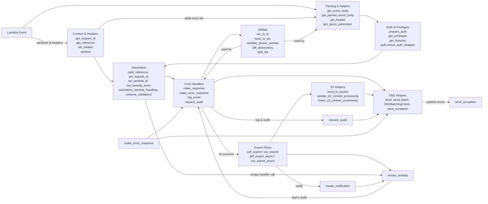

# Diagram: common/fv/python/fv/aws/lambdas/__init__.py

> Auto-generated by Obscura crawlers

## Mermaid

### SVG

<svg id="container" width="4811.421875" xmlns="http://www.w3.org/2000/svg" class="flowchart" height="825" viewBox="0 -12 4811.421875 825" role="graphics-document document" aria-roledescription="flowchart-v2"><g><marker id="container_flowchart-v2-pointEnd" class="marker flowchart-v2" viewBox="0 0 10 10" refX="5" refY="5" markerUnits="userSpaceOnUse" markerWidth="8" markerHeight="8" orient="auto"><path d="M 0 0 L 10 5 L 0 10 z" class="arrowMarkerPath" style="stroke-width: 1; stroke-dasharray: 1, 0;"></path></marker><marker id="container_flowchart-v2-pointStart" class="marker flowchart-v2" viewBox="0 0 10 10" refX="4.5" refY="5" markerUnits="userSpaceOnUse" markerWidth="8" markerHeight="8" orient="auto"><path d="M 0 5 L 10 10 L 10 0 z" class="arrowMarkerPath" style="stroke-width: 1; stroke-dasharray: 1, 0;"></path></marker><marker id="container_flowchart-v2-circleEnd" class="marker flowchart-v2" viewBox="0 0 10 10" refX="11" refY="5" markerUnits="userSpaceOnUse" markerWidth="11" markerHeight="11" orient="auto"><circle cx="5" cy="5" r="5" class="arrowMarkerPath" style="stroke-width: 1; stroke-dasharray: 1, 0;"></circle></marker><marker id="container_flowchart-v2-circleStart" class="marker flowchart-v2" viewBox="0 0 10 10" refX="-1" refY="5" markerUnits="userSpaceOnUse" markerWidth="11" markerHeight="11" orient="auto"><circle cx="5" cy="5" r="5" class="arrowMarkerPath" style="stroke-width: 1; stroke-dasharray: 1, 0;"></circle></marker><marker id="container_flowchart-v2-crossEnd" class="marker cross flowchart-v2" viewBox="0 0 11 11" refX="12" refY="5.2" markerUnits="userSpaceOnUse" markerWidth="11" markerHeight="11" orient="auto"><path d="M 1,1 l 9,9 M 10,1 l -9,9" class="arrowMarkerPath" style="stroke-width: 2; stroke-dasharray: 1, 0;"></path></marker><marker id="container_flowchart-v2-crossStart" class="marker cross flowchart-v2" viewBox="0 0 11 11" refX="-1" refY="5.2" markerUnits="userSpaceOnUse" markerWidth="11" markerHeight="11" orient="auto"><path d="M 1,1 l 9,9 M 10,1 l -9,9" class="arrowMarkerPath" style="stroke-width: 2; stroke-dasharray: 1, 0;"></path></marker><g class="root"><g class="clusters"></g><g class="edgePaths"><path d="M170.172,106.954L186.151,110.295C202.13,113.636,234.089,120.318,265.38,123.659C296.672,127,327.297,127,342.609,127L357.922,127" id="L_Event_Context_0" class="edge-thickness-normal edge-pattern-solid edge-thickness-normal edge-pattern-solid flowchart-link" style=";" data-edge="true" data-et="edge" data-id="L_Event_Context_0" data-points="W3sieCI6MTcwLjE3MTg3NSwieSI6MTA2Ljk1MzkwOTMxOTY3Njg0fSx7IngiOjI2Ni4wNDY4NzUsInkiOjEyN30seyJ4IjozNjEuOTIxODc1LCJ5IjoxMjd9XQ==" marker-end="url(#container_flowchart-v2-pointEnd)"></path><path d="M735.789,166L766.507,177.167C797.224,188.333,858.659,210.667,892.876,221.833C927.094,233,934.094,233,937.594,233L941.094,233" id="L_Context_Decorators_0" class="edge-thickness-normal edge-pattern-solid edge-thickness-normal edge-pattern-solid flowchart-link" style=";" data-edge="true" data-et="edge" data-id="L_Context_Decorators_0" data-points="W3sieCI6NzM1Ljc4OTQzMTAxNDE1MSwieSI6MTY2fSx7IngiOjkyMC4wOTM3NSwieSI6MjMzfSx7IngiOjk0NS4wOTM3NSwieSI6MjMzfV0=" marker-end="url(#container_flowchart-v2-pointEnd)"></path><path d="M139.915,63L160.937,51.833C181.959,40.667,224.003,18.333,305.435,7.167C386.867,-4,507.688,-4,616.695,-4C725.703,-4,822.898,-4,911.389,-4C999.88,-4,1079.667,-4,1159.453,-4C1239.24,-4,1319.026,-4,1415.986,-4C1512.945,-4,1627.078,-4,1747.703,-4C1868.328,-4,1995.445,-4,2129.134,-4C2262.823,-4,2403.083,-4,2543.749,-4C2684.414,-4,2825.484,-4,2912.101,-2.079C2998.717,-0.158,3030.879,3.684,3046.96,5.605L3063.041,7.526" id="L_Event_Parse_0" class="edge-thickness-normal edge-pattern-solid edge-thickness-normal edge-pattern-solid flowchart-link" style=";" data-edge="true" data-et="edge" data-id="L_Event_Parse_0" data-points="W3sieCI6MTM5LjkxNTE0Mjk1MjEyNzY3LCJ5Ijo2M30seyJ4IjoyNjYuMDQ2ODc1LCJ5IjotNH0seyJ4Ijo2MjguNTA3ODEyNSwieSI6LTR9LHsieCI6OTIwLjA5Mzc1LCJ5IjotNH0seyJ4IjoxMTU5LjQ1MzEyNSwieSI6LTR9LHsieCI6MTM5OC44MTI1LCJ5IjotNH0seyJ4IjoxNzQxLjIxMDkzNzUsInkiOi00fSx7IngiOjIxMjIuNTYyNSwieSI6LTR9LHsieCI6MjU0My4zNDM3NSwieSI6LTR9LHsieCI6Mjk2Ni41NTQ2ODc1LCJ5IjotNH0seyJ4IjozMDY3LjAxMjQwODA4ODIzNSwieSI6OH1d" marker-end="url(#container_flowchart-v2-pointEnd)"></path><path d="M3748.977,47L3753.991,47C3759.005,47,3769.034,47,3795.758,50.721C3822.482,54.441,3865.901,61.883,3887.611,65.604L3909.32,69.324" id="L_Parse_Auth_0" class="edge-thickness-normal edge-pattern-solid edge-thickness-normal edge-pattern-solid flowchart-link" style=";" data-edge="true" data-et="edge" data-id="L_Parse_Auth_0" data-points="W3sieCI6Mzc0OC45NzY1NjI1LCJ5Ijo0N30seyJ4IjozNzc5LjA2MjUsInkiOjQ3fSx7IngiOjM5MTMuMjYyOTc4ODMwNjQ1NCwieSI6NzB9XQ==" marker-end="url(#container_flowchart-v2-pointEnd)"></path><path d="M3942.108,148L3914.934,153.333C3887.76,158.667,3833.411,169.333,3741.976,174.667C3650.542,180,3522.021,180,3386.603,180C3251.185,180,3108.87,180,2967.177,180C2825.484,180,2684.414,180,2543.749,180C2403.083,180,2262.823,180,2129.134,180C1995.445,180,1868.328,180,1747.703,180C1627.078,180,1512.945,180,1452.363,180.778C1391.781,181.557,1384.749,183.114,1381.234,183.892L1377.718,184.671" id="L_Auth_Decorators_0" class="edge-thickness-normal edge-pattern-solid edge-thickness-normal edge-pattern-solid flowchart-link" style=";" data-edge="true" data-et="edge" data-id="L_Auth_Decorators_0" data-points="W3sieCI6Mzk0Mi4xMDgyNzQ2NDc4ODc0LCJ5IjoxNDh9LHsieCI6Mzc3OS4wNjI1LCJ5IjoxODB9LHsieCI6MzM5My41LCJ5IjoxODB9LHsieCI6Mjk2Ni41NTQ2ODc1LCJ5IjoxODB9LHsieCI6MjU0My4zNDM3NSwieSI6MTgwfSx7IngiOjIxMjIuNTYyNSwieSI6MTgwfSx7IngiOjE3NDEuMjEwOTM3NSwieSI6MTgwfSx7IngiOjEzOTguODEyNSwieSI6MTgwfSx7IngiOjEzNzMuODEyNSwieSI6MTg1LjUzNTYwOTM3Mzk4MDA0fV0=" marker-end="url(#container_flowchart-v2-pointEnd)"></path><path d="M1373.813,227.627L1377.979,227.522C1382.146,227.418,1390.479,227.209,1425.485,234.94C1460.49,242.672,1522.168,258.343,1553.006,266.179L1583.845,274.015" id="L_Decorators_Handlers_0" class="edge-thickness-normal edge-pattern-solid edge-thickness-normal edge-pattern-solid flowchart-link" style=";" data-edge="true" data-et="edge" data-id="L_Decorators_Handlers_0" data-points="W3sieCI6MTM3My44MTI1LCJ5IjoyMjcuNjI2NjcyNzU5MzE4NX0seyJ4IjoxMzk4LjgxMjUsInkiOjIyN30seyJ4IjoxNTg3LjcyMTk4Mjc1ODYyMDcsInkiOjI3NX1d" marker-end="url(#container_flowchart-v2-pointEnd)"></path><path d="M1799.081,353L1852.995,389.333C1906.908,425.667,2014.735,498.333,2114.247,534.667C2213.758,571,2304.953,571,2350.551,571L2396.148,571" id="L_Handlers_Exports_0" class="edge-thickness-normal edge-pattern-solid edge-thickness-normal edge-pattern-solid flowchart-link" style=";" data-edge="true" data-et="edge" data-id="L_Handlers_Exports_0" data-points="W3sieCI6MTc5OS4wODE0MDgwNzM5Mjk5LCJ5IjozNTN9LHsieCI6MjEyMi41NjI1LCJ5Ijo1NzF9LHsieCI6MjQwMC4xNDg0Mzc1LCJ5Ijo1NzF9XQ==" marker-end="url(#container_flowchart-v2-pointEnd)"></path><path d="M2623.284,520L2680.495,483.5C2737.707,447,2852.131,374,2919.74,337.5C2987.349,301,3008.143,301,3018.54,301L3028.938,301" id="L_Exports_S3_0" class="edge-thickness-normal edge-pattern-solid edge-thickness-normal edge-pattern-solid flowchart-link" style=";" data-edge="true" data-et="edge" data-id="L_Exports_S3_0" data-points="W3sieCI6MjYyMy4yODM1OTM3NSwieSI6NTIwfSx7IngiOjI5NjYuNTU0Njg3NSwieSI6MzAxfSx7IngiOjMwMzIuOTM3NSwieSI6MzAxfV0=" marker-end="url(#container_flowchart-v2-pointEnd)"></path><path d="M2686.539,571L2733.208,571C2779.878,571,2873.216,571,2991.043,571C3108.87,571,3251.185,571,3386.603,571C3522.021,571,3650.542,571,3761.009,586.455C3871.476,601.91,3963.89,632.821,4010.097,648.276L4056.304,663.731" id="L_Exports_Invoke_0" class="edge-thickness-normal edge-pattern-solid edge-thickness-normal edge-pattern-solid flowchart-link" style=";" data-edge="true" data-et="edge" data-id="L_Exports_Invoke_0" data-points="W3sieCI6MjY4Ni41MzkwNjI1LCJ5Ijo1NzF9LHsieCI6Mjk2Ni41NTQ2ODc1LCJ5Ijo1NzF9LHsieCI6MzM5My41LCJ5Ijo1NzF9LHsieCI6Mzc3OS4wNjI1LCJ5Ijo1NzF9LHsieCI6NDA2MC4wOTc0OTQ4MzQ3MTA3LCJ5Ijo2NjV9XQ==" marker-end="url(#container_flowchart-v2-pointEnd)"></path><path d="M4055.648,715.779L4009.551,728.649C3963.453,741.52,3871.258,767.26,3760.9,780.13C3650.542,793,3522.021,793,3386.603,793C3251.185,793,3108.87,793,2967.177,793C2825.484,793,2684.414,793,2543.749,793C2403.083,793,2262.823,793,2134.724,720.188C2006.626,647.376,1890.689,501.753,1832.72,428.941L1774.752,356.129" id="L_Invoke_Handlers_0" class="edge-thickness-normal edge-pattern-solid edge-thickness-normal edge-pattern-solid flowchart-link" style=";" data-edge="true" data-et="edge" data-id="L_Invoke_Handlers_0" data-points="W3sieCI6NDA1NS42NDg0Mzc1LCJ5Ijo3MTUuNzc5MzMyNjg1NDU1Mn0seyJ4IjozNzc5LjA2MjUsInkiOjc5M30seyJ4IjozMzkzLjUsInkiOjc5M30seyJ4IjoyOTY2LjU1NDY4NzUsInkiOjc5M30seyJ4IjoyNTQzLjM0Mzc1LCJ5Ijo3OTN9LHsieCI6MjEyMi41NjI1LCJ5Ijo3OTN9LHsieCI6MTc3Mi4yNjA0Mzg0MTMzNjEzLCJ5IjozNTN9XQ==" marker-end="url(#container_flowchart-v2-pointEnd)"></path><path d="M1912.162,275L1947.228,267C1982.295,259,2052.429,243,2157.626,235C2262.823,227,2403.083,227,2543.749,227C2684.414,227,2825.484,227,2967.177,227C3108.87,227,3251.185,227,3386.603,227C3522.021,227,3650.542,227,3752.798,240.024C3855.054,253.048,3931.045,279.095,3969.041,292.119L4007.036,305.143" id="L_Handlers_SNS_0" class="edge-thickness-normal edge-pattern-solid edge-thickness-normal edge-pattern-solid flowchart-link" style=";" data-edge="true" data-et="edge" data-id="L_Handlers_SNS_0" data-points="W3sieCI6MTkxMi4xNjE2Mzc5MzEwMzQ0LCJ5IjoyNzV9LHsieCI6MjEyMi41NjI1LCJ5IjoyMjd9LHsieCI6MjU0My4zNDM3NSwieSI6MjI3fSx7IngiOjI5NjYuNTU0Njg3NSwieSI6MjI3fSx7IngiOjMzOTMuNSwieSI6MjI3fSx7IngiOjM3NzkuMDYyNSwieSI6MjI3fSx7IngiOjQwMTAuODIwMzEyNSwieSI6MzA2LjQzOTgwMTMxNzM1MjM2fV0=" marker-end="url(#container_flowchart-v2-pointEnd)"></path><path d="M1807.607,275L1860.1,244.167C1912.592,213.333,2017.577,151.667,2080.063,121.332C2142.549,90.997,2162.535,91.995,2172.528,92.494L2182.521,92.992" id="L_Handlers_Utils_0" class="edge-thickness-normal edge-pattern-solid edge-thickness-normal edge-pattern-solid flowchart-link" style=";" data-edge="true" data-et="edge" data-id="L_Handlers_Utils_0" data-points="W3sieCI6MTgwNy42MDY5Njg0NzA5ODIsInkiOjI3NX0seyJ4IjoyMTIyLjU2MjUsInkiOjkwfSx7IngiOjIxODYuNTE1NjI1LCJ5Ijo5My4xOTE3MTkyNzIxODcxNn1d" marker-end="url(#container_flowchart-v2-pointEnd)"></path><path d="M3754.063,301L3758.229,301C3762.396,301,3770.729,301,3812.862,306.247C3854.994,311.495,3930.926,321.99,3968.892,327.237L4006.858,332.485" id="L_S3_SNS_0" class="edge-thickness-normal edge-pattern-solid edge-thickness-normal edge-pattern-solid flowchart-link" style=";" data-edge="true" data-et="edge" data-id="L_S3_SNS_0" data-points="W3sieCI6Mzc1NC4wNjI1LCJ5IjozMDF9LHsieCI6Mzc3OS4wNjI1LCJ5IjozMDF9LHsieCI6NDAxMC44MjAzMTI1LCJ5IjozMzMuMDMyMTc3OTUwNTQ1M31d" marker-end="url(#container_flowchart-v2-pointEnd)"></path><path d="M4270.82,351L4317.943,351C4365.065,351,4459.31,351,4518.428,351C4577.547,351,4601.539,351,4613.535,351L4625.531,351" id="L_SNS_send_exception_0" class="edge-thickness-normal edge-pattern-solid edge-thickness-normal edge-pattern-solid flowchart-link" style=";" data-edge="true" data-et="edge" data-id="L_SNS_send_exception_0" data-points="W3sieCI6NDI3MC44MjAzMTI1LCJ5IjozNTF9LHsieCI6NDU1My41NTQ2ODc1LCJ5IjozNTF9LHsieCI6NDYyOS41MzEyNSwieSI6MzUxfV0=" marker-end="url(#container_flowchart-v2-pointEnd)"></path><path d="M774.301,88L798.6,81.5C822.898,75,871.496,62,935.688,55.5C999.88,49,1079.667,49,1159.453,49C1239.24,49,1319.026,49,1415.986,49C1512.945,49,1627.078,49,1747.703,49C1868.328,49,1995.445,49,2129.134,49C2262.823,49,2403.083,49,2543.749,49C2684.414,49,2825.484,49,2907.264,48.947C2989.044,48.895,3011.534,48.789,3022.779,48.737L3034.023,48.684" id="L_Context_Parse_0" class="edge-thickness-normal edge-pattern-solid edge-thickness-normal edge-pattern-solid flowchart-link" style=";" data-edge="true" data-et="edge" data-id="L_Context_Parse_0" data-points="W3sieCI6Nzc0LjMwMDc4MTI1LCJ5Ijo4OH0seyJ4Ijo5MjAuMDkzNzUsInkiOjQ5fSx7IngiOjExNTkuNDUzMTI1LCJ5Ijo0OX0seyJ4IjoxMzk4LjgxMjUsInkiOjQ5fSx7IngiOjE3NDEuMjEwOTM3NSwieSI6NDl9LHsieCI6MjEyMi41NjI1LCJ5Ijo0OX0seyJ4IjoyNTQzLjM0Mzc1LCJ5Ijo0OX0seyJ4IjoyOTY2LjU1NDY4NzUsInkiOjQ5fSx7IngiOjMwMzguMDIzNDM3NSwieSI6NDguNjY1MjA4ODc4NDc5MDJ9XQ==" marker-end="url(#container_flowchart-v2-pointEnd)"></path><path d="M1194.039,296L1228.168,358.167C1262.297,420.333,1330.555,544.667,1421.75,606.833C1512.945,669,1627.078,669,1747.703,669C1868.328,669,1995.445,669,2129.134,669C2262.823,669,2403.083,669,2543.749,669C2684.414,669,2825.484,669,2967.177,669C3108.87,669,3251.185,669,3386.603,669C3522.021,669,3650.542,669,3760.234,671.889C3869.927,674.777,3960.792,680.554,4006.224,683.443L4051.656,686.331" id="L_Decorators_Invoke_0" class="edge-thickness-normal edge-pattern-solid edge-thickness-normal edge-pattern-solid flowchart-link" style=";" data-edge="true" data-et="edge" data-id="L_Decorators_Invoke_0" data-points="W3sieCI6MTE5NC4wMzk0NTY3MDg3MTU1LCJ5IjoyOTZ9LHsieCI6MTM5OC44MTI1LCJ5Ijo2Njl9LHsieCI6MTc0MS4yMTA5Mzc1LCJ5Ijo2Njl9LHsieCI6MjEyMi41NjI1LCJ5Ijo2Njl9LHsieCI6MjU0My4zNDM3NSwieSI6NjY5fSx7IngiOjI5NjYuNTU0Njg3NSwieSI6NjY5fSx7IngiOjMzOTMuNSwieSI6NjY5fSx7IngiOjM3NzkuMDYyNSwieSI6NjY5fSx7IngiOjQwNTUuNjQ4NDM3NSwieSI6Njg2LjU4NDkwNDQzNzk2NTZ9XQ==" marker-end="url(#container_flowchart-v2-pointEnd)"></path><path d="M1885.606,353L1925.099,363.667C1964.592,374.333,2043.577,395.667,2153.2,406.333C2262.823,417,2403.083,417,2543.749,417C2684.414,417,2825.484,417,2953.082,417C3080.68,417,3194.805,417,3251.867,417L3308.93,417" id="L_Handlers_request_audit_0" class="edge-thickness-normal edge-pattern-solid edge-thickness-normal edge-pattern-solid flowchart-link" style=";" data-edge="true" data-et="edge" data-id="L_Handlers_request_audit_0" data-points="W3sieCI6MTg4NS42MDYxODkzMjAzODgyLCJ5IjozNTN9LHsieCI6MjEyMi41NjI1LCJ5Ijo0MTd9LHsieCI6MjU0My4zNDM3NSwieSI6NDE3fSx7IngiOjI5NjYuNTU0Njg3NSwieSI6NDE3fSx7IngiOjMzMTIuOTI5Njg3NSwieSI6NDE3fV0=" marker-end="url(#container_flowchart-v2-pointEnd)"></path><path d="M3474.07,417L3524.902,417C3575.734,417,3677.398,417,3766.201,410.073C3855.003,403.145,3930.944,389.29,3968.915,382.363L4006.885,375.435" id="L_request_audit_SNS_0" class="edge-thickness-normal edge-pattern-solid edge-thickness-normal edge-pattern-solid flowchart-link" style=";" data-edge="true" data-et="edge" data-id="L_request_audit_SNS_0" data-points="W3sieCI6MzQ3NC4wNzAzMTI1LCJ5Ijo0MTd9LHsieCI6Mzc3OS4wNjI1LCJ5Ijo0MTd9LHsieCI6NDAxMC44MjAzMTI1LCJ5IjozNzQuNzE3NTI1MTA1MjgwMjN9XQ==" marker-end="url(#container_flowchart-v2-pointEnd)"></path><path d="M1267.617,494.318L1289.483,492.765C1311.349,491.212,1355.081,488.106,1434.013,486.553C1512.945,485,1627.078,485,1747.703,485C1868.328,485,1995.445,485,2129.134,485C2262.823,485,2403.083,485,2543.749,485C2684.414,485,2825.484,485,2967.177,485C3108.87,485,3251.185,485,3386.603,485C3522.021,485,3650.542,485,3752.803,470.924C3855.065,456.848,3931.067,428.695,3969.068,414.619L4007.069,400.543" id="L_make_error_response_SNS_0" class="edge-thickness-normal edge-pattern-solid edge-thickness-normal edge-pattern-solid flowchart-link" style=";" data-edge="true" data-et="edge" data-id="L_make_error_response_SNS_0" data-points="W3sieCI6MTI2Ny42MTcxODc1LCJ5Ijo0OTQuMzE3ODczMjI5MzIzMX0seyJ4IjoxMzk4LjgxMjUsInkiOjQ4NX0seyJ4IjoxNzQxLjIxMDkzNzUsInkiOjQ4NX0seyJ4IjoyMTIyLjU2MjUsInkiOjQ4NX0seyJ4IjoyNTQzLjM0Mzc1LCJ5Ijo0ODV9LHsieCI6Mjk2Ni41NTQ2ODc1LCJ5Ijo0ODV9LHsieCI6MzM5My41LCJ5Ijo0ODV9LHsieCI6Mzc3OS4wNjI1LCJ5Ijo0ODV9LHsieCI6NDAxMC44MjAzMTI1LCJ5IjozOTkuMTUzNzYzMDkyNTM4Nn1d" marker-end="url(#container_flowchart-v2-pointEnd)"></path><path d="M1260.433,475L1283.496,468.833C1306.559,462.667,1352.686,450.333,1414.241,430.227C1475.795,410.121,1552.778,382.241,1591.269,368.302L1629.76,354.362" id="L_make_error_response_Handlers_0" class="edge-thickness-normal edge-pattern-solid edge-thickness-normal edge-pattern-solid flowchart-link" style=";" data-edge="true" data-et="edge" data-id="L_make_error_response_Handlers_0" data-points="W3sieCI6MTI2MC40MzI4NjEzMjgxMjUsInkiOjQ3NX0seyJ4IjoxMzk4LjgxMjUsInkiOjQzOH0seyJ4IjoxNjMzLjUyMTEwNjM1MDgwNjMsInkiOjM1M31d" marker-end="url(#container_flowchart-v2-pointEnd)"></path><path d="M2678.242,622L2726.294,640.167C2774.346,658.333,2870.451,694.667,2972.637,712.833C3074.823,731,3183.091,731,3237.225,731L3291.359,731" id="L_Exports_create_notification_0" class="edge-thickness-normal edge-pattern-solid edge-thickness-normal edge-pattern-solid flowchart-link" style=";" data-edge="true" data-et="edge" data-id="L_Exports_create_notification_0" data-points="W3sieCI6MjY3OC4yNDIyMzYzMjgxMjUsInkiOjYyMn0seyJ4IjoyOTY2LjU1NDY4NzUsInkiOjczMX0seyJ4IjozMjk1LjM1OTM3NSwieSI6NzMxfV0=" marker-end="url(#container_flowchart-v2-pointEnd)"></path><path d="M3491.641,731L3539.544,731C3587.448,731,3683.255,731,3776.594,726.102C3869.932,721.204,3960.802,711.407,4006.237,706.509L4051.671,701.611" id="L_create_notification_Invoke_0" class="edge-thickness-normal edge-pattern-solid edge-thickness-normal edge-pattern-solid flowchart-link" style=";" data-edge="true" data-et="edge" data-id="L_create_notification_Invoke_0" data-points="W3sieCI6MzQ5MS42NDA2MjUsInkiOjczMX0seyJ4IjozNzc5LjA2MjUsInkiOjczMX0seyJ4Ijo0MDU1LjY0ODQzNzUsInkiOjcwMS4xODIxMTg1NjE3MTA0fV0=" marker-end="url(#container_flowchart-v2-pointEnd)"></path><path d="M2900.172,111L2911.236,111C2922.299,111,2944.427,111,2982.628,106.932C3020.828,102.864,3075.101,94.729,3102.238,90.661L3129.374,86.593" id="L_Utils_Parse_0" class="edge-thickness-normal edge-pattern-solid edge-thickness-normal edge-pattern-solid flowchart-link" style=";" data-edge="true" data-et="edge" data-id="L_Utils_Parse_0" data-points="W3sieCI6MjkwMC4xNzE4NzUsInkiOjExMX0seyJ4IjoyOTY2LjU1NDY4NzUsInkiOjExMX0seyJ4IjozMTMzLjMzMDIwMDE5NTMxMjUsInkiOjg2fV0=" marker-end="url(#container_flowchart-v2-pointEnd)"></path><path d="M2186.516,124.568L2175.857,124.974C2165.198,125.379,2143.88,126.189,2083.517,150.968C2023.154,175.746,1923.745,224.493,1874.04,248.866L1824.336,273.239" id="L_Utils_Handlers_0" class="edge-thickness-normal edge-pattern-solid edge-thickness-normal edge-pattern-solid flowchart-link" style=";" data-edge="true" data-et="edge" data-id="L_Utils_Handlers_0" data-points="W3sieCI6MjE4Ni41MTU2MjUsInkiOjEyNC41NjgyMTM4ODc4NTc0MX0seyJ4IjoyMTIyLjU2MjUsInkiOjEyN30seyJ4IjoxODIwLjc0NDE1MTA2OTUxODcsInkiOjI3NX1d" marker-end="url(#container_flowchart-v2-pointEnd)"></path></g><g class="edgeLabels"><g class="edgeLabel" transform="translate(266.046875, 127)"><g class="label" data-id="L_Event_Context_0" transform="translate(-70.875, -12)"><foreignObject width="141.75" height="24">

sanitizes &amp; headers

</foreignObject></g></g><g class="edgeLabel"><g class="label" data-id="L_Context_Decorators_0" transform="translate(0, 0)"><foreignObject width="0" height="0">

</foreignObject></g></g><g class="edgeLabel"><g class="label" data-id="L_Event_Parse_0" transform="translate(0, 0)"><foreignObject width="0" height="0">

</foreignObject></g></g><g class="edgeLabel"><g class="label" data-id="L_Parse_Auth_0" transform="translate(0, 0)"><foreignObject width="0" height="0">

</foreignObject></g></g><g class="edgeLabel"><g class="label" data-id="L_Auth_Decorators_0" transform="translate(0, 0)"><foreignObject width="0" height="0">

</foreignObject></g></g><g class="edgeLabel"><g class="label" data-id="L_Decorators_Handlers_0" transform="translate(0, 0)"><foreignObject width="0" height="0">

</foreignObject></g></g><g class="edgeLabel" transform="translate(2122.5625, 571)"><g class="label" data-id="L_Handlers_Exports_0" transform="translate(-38.953125, -12)"><foreignObject width="77.90625" height="24">

on success

</foreignObject></g></g><g class="edgeLabel"><g class="label" data-id="L_Exports_S3_0" transform="translate(0, 0)"><foreignObject width="0" height="0">

</foreignObject></g></g><g class="edgeLabel"><g class="label" data-id="L_Exports_Invoke_0" transform="translate(0, 0)"><foreignObject width="0" height="0">

</foreignObject></g></g><g class="edgeLabel" transform="translate(2966.5546875, 793)"><g class="label" data-id="L_Invoke_Handlers_0" transform="translate(-41.3828125, -12)"><foreignObject width="82.765625" height="24">

async audit

</foreignObject></g></g><g class="edgeLabel"><g class="label" data-id="L_Handlers_SNS_0" transform="translate(0, 0)"><foreignObject width="0" height="0">

</foreignObject></g></g><g class="edgeLabel"><g class="label" data-id="L_Handlers_Utils_0" transform="translate(0, 0)"><foreignObject width="0" height="0">

</foreignObject></g></g><g class="edgeLabel"><g class="label" data-id="L_S3_SNS_0" transform="translate(0, 0)"><foreignObject width="0" height="0">

</foreignObject></g></g><g class="edgeLabel" transform="translate(4553.5546875, 351)"><g class="label" data-id="L_SNS_send_exception_0" transform="translate(-50.9765625, -12)"><foreignObject width="101.953125" height="24">

publish errors

</foreignObject></g></g><g class="edgeLabel" transform="translate(1741.2109375, 49)"><g class="label" data-id="L_Context_Parse_0" transform="translate(-50.75, -12)"><foreignObject width="101.5" height="24">

adds trace ids

</foreignObject></g></g><g class="edgeLabel" transform="translate(2543.34375, 669)"><g class="label" data-id="L_Decorators_Invoke_0" transform="translate(-66.59375, -12)"><foreignObject width="133.1875" height="24">

wraps handler call

</foreignObject></g></g><g class="edgeLabel" transform="translate(2543.34375, 417)"><g class="label" data-id="L_Handlers_request_audit_0" transform="translate(-40.1484375, -12)"><foreignObject width="80.296875" height="24">

log &amp; audit

</foreignObject></g></g><g class="edgeLabel"><g class="label" data-id="L_request_audit_SNS_0" transform="translate(0, 0)"><foreignObject width="0" height="0">

</foreignObject></g></g><g class="edgeLabel"><g class="label" data-id="L_make_error_response_SNS_0" transform="translate(0, 0)"><foreignObject width="0" height="0">

</foreignObject></g></g><g class="edgeLabel"><g class="label" data-id="L_make_error_response_Handlers_0" transform="translate(0, 0)"><foreignObject width="0" height="0">

</foreignObject></g></g><g class="edgeLabel" transform="translate(2966.5546875, 731)"><g class="label" data-id="L_Exports_create_notification_0" transform="translate(-21.125, -12)"><foreignObject width="42.25" height="24">

notify

</foreignObject></g></g><g class="edgeLabel"><g class="label" data-id="L_create_notification_Invoke_0" transform="translate(0, 0)"><foreignObject width="0" height="0">

</foreignObject></g></g><g class="edgeLabel" transform="translate(2966.5546875, 111)"><g class="label" data-id="L_Utils_Parse_0" transform="translate(-28.3125, -12)"><foreignObject width="56.625" height="24">

used by

</foreignObject></g></g><g class="edgeLabel" transform="translate(2000.38462, 186.91129)"><g class="label" data-id="L_Utils_Handlers_0" transform="translate(-28.3125, -12)"><foreignObject width="56.625" height="24">

used by

</foreignObject></g></g></g><g class="nodes"><g class="node default" id="flowchart-Event-0" transform="translate(89.0859375, 90)"><rect class="basic label-container" style="" x="-81.0859375" y="-27" width="162.171875" height="54"></rect><g class="label" style="" transform="translate(-51.0859375, -12)"><rect></rect><foreignObject width="102.171875" height="24">

Lambda Event

</foreignObject></g></g><g class="node default" id="flowchart-Decorators-1" transform="translate(1159.453125, 233)"><rect class="basic label-container" style="" x="-214.359375" y="-63" width="428.71875" height="126"></rect><g class="label" style="" transform="translate(-184.359375, -48)"><rect></rect><foreignObject width="368.71875" height="96">

Decorators\n(add_reference, set_request_id,\nset_lambda_id, set_lambda_level,\nmandatory_lambda_handling, schema_validation)

</foreignObject></g></g><g class="node default" id="flowchart-Parse-2" transform="translate(3393.5, 47)"><rect class="basic label-container" style="" x="-355.4765625" y="-39" width="710.953125" height="78"></rect><g class="label" style="" transform="translate(-325.4765625, -24)"><rect></rect><foreignObject width="650.953125" height="48">

Parsing &amp; Helpers\nget_event_body\nget_parsed_event_body\nget_header\nget_query_parameter

</foreignObject></g></g><g class="node default" id="flowchart-Auth-3" transform="translate(4140.8203125, 109)"><rect class="basic label-container" style="" x="-336.7578125" y="-39" width="673.515625" height="78"></rect><g class="label" style="" transform="translate(-306.7578125, -24)"><rect></rect><foreignObject width="613.515625" height="48">

Auth &amp; Privileges\nprepare_auth\nget_privileges\nget_features\nauth.check_auth_wrapper

</foreignObject></g></g><g class="node default" id="flowchart-Handlers-4" transform="translate(1741.2109375, 314)"><rect class="basic label-container" style="" x="-317.3984375" y="-39" width="634.796875" height="78"></rect><g class="label" style="" transform="translate(-287.3984375, -24)"><rect></rect><foreignObject width="574.796875" height="48">

Core Handlers\nmake_response\nmake_error_response\nlog_event\nrequest_audit

</foreignObject></g></g><g class="node default" id="flowchart-Exports-5" transform="translate(2543.34375, 571)"><rect class="basic label-container" style="" x="-143.1953125" y="-51" width="286.390625" height="102"></rect><g class="label" style="" transform="translate(-113.1953125, -36)"><rect></rect><foreignObject width="226.390625" height="72">

Export Flows\npdf_export / csv_export\npdf_export_async / csv_export_async

</foreignObject></g></g><g class="node default" id="flowchart-S3-6" transform="translate(3393.5, 301)"><rect class="basic label-container" style="" x="-360.5625" y="-39" width="721.125" height="78"></rect><g class="label" style="" transform="translate(-330.5625, -24)"><rect></rect><foreignObject width="661.125" height="48">

S3 Helpers\nsend_to_bucket\nupdate_s3_content_processing\ninsert_s3_content_processing

</foreignObject></g></g><g class="node default" id="flowchart-SNS-7" transform="translate(4140.8203125, 351)"><rect class="basic label-container" style="" x="-130" y="-63" width="260" height="126"></rect><g class="label" style="" transform="translate(-100, -48)"><rect></rect><foreignObject width="200" height="96">

SNS Helpers\nsend, send_batch, SNSBatchingClient, send_exception

</foreignObject></g></g><g class="node default" id="flowchart-Invoke-8" transform="translate(4140.8203125, 692)"><rect class="basic label-container" style="" x="-85.171875" y="-27" width="170.34375" height="54"></rect><g class="label" style="" transform="translate(-55.171875, -12)"><rect></rect><foreignObject width="110.34375" height="24">

invoke_lambda

</foreignObject></g></g><g class="node default" id="flowchart-Utils-9" transform="translate(2543.34375, 111)"><rect class="basic label-container" style="" x="-356.828125" y="-27" width="713.65625" height="54"></rect><g class="label" style="" transform="translate(-326.828125, -12)"><rect></rect><foreignObject width="653.65625" height="24">

Utilities\nutc_to_tz\nlocal_to_utc\nvalidate_phone_number\ndiff_dictionaries\nsplit_list

</foreignObject></g></g><g class="node default" id="flowchart-Context-10" transform="translate(628.5078125, 127)"><rect class="basic label-container" style="" x="-266.5859375" y="-39" width="533.171875" height="78"></rect><g class="label" style="" transform="translate(-236.5859375, -24)"><rect></rect><foreignObject width="473.171875" height="48">

Context &amp; Headers\nget_request_id\nget_reference\nset_header\nsanitize

</foreignObject></g></g><g class="node default" id="flowchart-send_exception-38" transform="translate(4716.4765625, 351)"><rect class="basic label-container" style="" x="-86.9453125" y="-27" width="173.890625" height="54"></rect><g class="label" style="" transform="translate(-56.9453125, -12)"><rect></rect><foreignObject width="113.890625" height="24">

send_exception

</foreignObject></g></g><g class="node default" id="flowchart-request_audit-44" transform="translate(3393.5, 417)"><rect class="basic label-container" style="" x="-80.5703125" y="-27" width="161.140625" height="54"></rect><g class="label" style="" transform="translate(-50.5703125, -12)"><rect></rect><foreignObject width="101.140625" height="24">

request_audit

</foreignObject></g></g><g class="node default" id="flowchart-make_error_response-47" transform="translate(1159.453125, 502)"><rect class="basic label-container" style="" x="-108.1640625" y="-27" width="216.328125" height="54"></rect><g class="label" style="" transform="translate(-78.1640625, -12)"><rect></rect><foreignObject width="156.328125" height="24">

make_error_response

</foreignObject></g></g><g class="node default" id="flowchart-create_notification-52" transform="translate(3393.5, 731)"><rect class="basic label-container" style="" x="-98.140625" y="-27" width="196.28125" height="54"></rect><g class="label" style="" transform="translate(-68.140625, -12)"><rect></rect><foreignObject width="136.28125" height="24">

create_notification

</foreignObject></g></g></g></g></g></svg>
