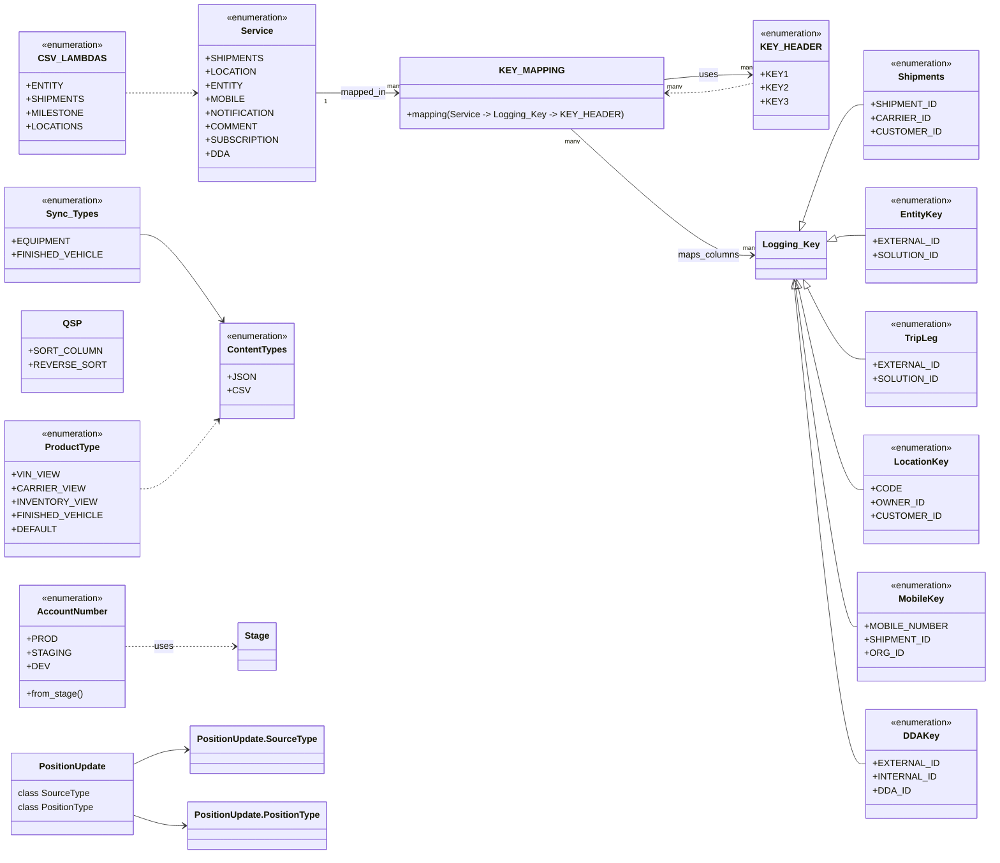

# Diagram: common/fv/python/fv/aws/lambdas/constants.py

> Auto-generated by Obscura crawlers

## Mermaid

```mermaid
classDiagram
direction LR
class AccountNumber <<enumeration>> {
  +PROD
  +STAGING
  +DEV
  +from_stage()
}
class Service <<enumeration>> {
  +SHIPMENTS
  +LOCATION
  +ENTITY
  +MOBILE
  +NOTIFICATION
  +COMMENT
  +SUBSCRIPTION
  +DDA
}
class CSV_LAMBDAS <<enumeration>> {
  +ENTITY
  +SHIPMENTS
  +MILESTONE
  +LOCATIONS
}
class KEY_HEADER <<enumeration>> {
  +KEY1
  +KEY2
  +KEY3
}
class Logging_Key {
}
class Shipments <<enumeration>> {
  +SHIPMENT_ID
  +CARRIER_ID
  +CUSTOMER_ID
}
class EntityKey <<enumeration>> {
  +EXTERNAL_ID
  +SOLUTION_ID
}
class TripLeg <<enumeration>> {
  +EXTERNAL_ID
  +SOLUTION_ID
}
class LocationKey <<enumeration>> {
  +CODE
  +OWNER_ID
  +CUSTOMER_ID
}
class MobileKey <<enumeration>> {
  +MOBILE_NUMBER
  +SHIPMENT_ID
  +ORG_ID
}
class DDAKey <<enumeration>> {
  +EXTERNAL_ID
  +INTERNAL_ID
  +DDA_ID
}
class KEY_MAPPING {
  +mapping(Service -> Logging_Key -> KEY_HEADER)
}
class QSP {
  +SORT_COLUMN
  +REVERSE_SORT
}
class PositionUpdate {
  class SourceType
  class PositionType
}
class Sync_Types <<enumeration>> {
  +EQUIPMENT
  +FINISHED_VEHICLE
}
class ContentTypes <<enumeration>> {
  +JSON
  +CSV
}
class ProductType <<enumeration>> {
  +VIN_VIEW
  +CARRIER_VIEW
  +INVENTORY_VIEW
  +FINISHED_VEHICLE
  +DEFAULT
}

Logging_Key <|-- Shipments
Logging_Key <|-- EntityKey
Logging_Key <|-- TripLeg
Logging_Key <|-- LocationKey
Logging_Key <|-- MobileKey
Logging_Key <|-- DDAKey

Service "1" --> "many" KEY_MAPPING : mapped_in
KEY_MAPPING "many" --> "many" KEY_HEADER : uses
KEY_MAPPING "many" --> "many" Logging_Key : maps_columns
AccountNumber ..> Stage : uses
PositionUpdate --> PositionUpdate.SourceType
PositionUpdate --> PositionUpdate.PositionType
Sync_Types --> ContentTypes
ProductType ..> ContentTypes
CSV_LAMBDAS ..> Service
KEY_HEADER ..> KEY_MAPPING
```

> SVG rendering failed for this diagram.
