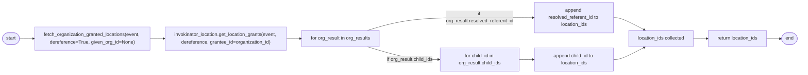
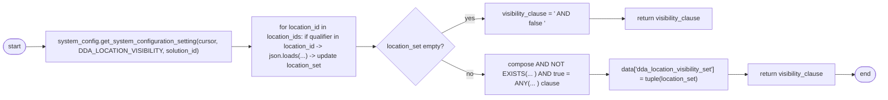

# Diagram: common/fv/python/fv/aws/lambdas/entity/__init__.py

> Auto-generated by Obscura crawlers

## Diagram 1

### SVG

<svg id="container" width="2679.1318359375" xmlns="http://www.w3.org/2000/svg" class="flowchart" height="246" viewBox="-0.0000019073486328125 0 2679.1318359375 246" role="graphics-document document" aria-roledescription="flowchart-v2"><g><marker id="container_flowchart-v2-pointEnd" class="marker flowchart-v2" viewBox="0 0 10 10" refX="5" refY="5" markerUnits="userSpaceOnUse" markerWidth="8" markerHeight="8" orient="auto"><path d="M 0 0 L 10 5 L 0 10 z" class="arrowMarkerPath" style="stroke-width: 1; stroke-dasharray: 1, 0;"></path></marker><marker id="container_flowchart-v2-pointStart" class="marker flowchart-v2" viewBox="0 0 10 10" refX="4.5" refY="5" markerUnits="userSpaceOnUse" markerWidth="8" markerHeight="8" orient="auto"><path d="M 0 5 L 10 10 L 10 0 z" class="arrowMarkerPath" style="stroke-width: 1; stroke-dasharray: 1, 0;"></path></marker><marker id="container_flowchart-v2-circleEnd" class="marker flowchart-v2" viewBox="0 0 10 10" refX="11" refY="5" markerUnits="userSpaceOnUse" markerWidth="11" markerHeight="11" orient="auto"><circle cx="5" cy="5" r="5" class="arrowMarkerPath" style="stroke-width: 1; stroke-dasharray: 1, 0;"></circle></marker><marker id="container_flowchart-v2-circleStart" class="marker flowchart-v2" viewBox="0 0 10 10" refX="-1" refY="5" markerUnits="userSpaceOnUse" markerWidth="11" markerHeight="11" orient="auto"><circle cx="5" cy="5" r="5" class="arrowMarkerPath" style="stroke-width: 1; stroke-dasharray: 1, 0;"></circle></marker><marker id="container_flowchart-v2-crossEnd" class="marker cross flowchart-v2" viewBox="0 0 11 11" refX="12" refY="5.2" markerUnits="userSpaceOnUse" markerWidth="11" markerHeight="11" orient="auto"><path d="M 1,1 l 9,9 M 10,1 l -9,9" class="arrowMarkerPath" style="stroke-width: 2; stroke-dasharray: 1, 0;"></path></marker><marker id="container_flowchart-v2-crossStart" class="marker cross flowchart-v2" viewBox="0 0 11 11" refX="-1" refY="5.2" markerUnits="userSpaceOnUse" markerWidth="11" markerHeight="11" orient="auto"><path d="M 1,1 l 9,9 M 10,1 l -9,9" class="arrowMarkerPath" style="stroke-width: 2; stroke-dasharray: 1, 0;"></path></marker><g class="root"><g class="clusters"></g><g class="edgePaths"><path d="M67.027,129.5L71.11,129.417C75.194,129.333,83.36,129.167,90.944,129.083C98.527,129,105.527,129,109.027,129L112.527,129" id="L_Start_FetchOrg_0" class="edge-thickness-normal edge-pattern-solid edge-thickness-normal edge-pattern-solid flowchart-link" style=";" data-edge="true" data-et="edge" data-id="L_Start_FetchOrg_0" data-points="W3sieCI6NjcuMDI2ODM3NDMxODI1OTgsInkiOjEyOS41fSx7IngiOjkxLjUyNjgzNjM5NTI2MzY3LCJ5IjoxMjl9LHsieCI6MTE2LjUyNjgzNjM5NTI2MzY3LCJ5IjoxMjl9XQ==" marker-end="url(#container_flowchart-v2-pointEnd)"></path><path d="M504.121,129L508.287,129C512.454,129,520.787,129,528.454,129C536.121,129,543.121,129,546.621,129L550.121,129" id="L_FetchOrg_GetGrants_0" class="edge-thickness-normal edge-pattern-solid edge-thickness-normal edge-pattern-solid flowchart-link" style=";" data-edge="true" data-et="edge" data-id="L_FetchOrg_GetGrants_0" data-points="W3sieCI6NTA0LjEyMDU4NjM5NTI2MzcsInkiOjEyOX0seyJ4Ijo1MjkuMTIwNTg2Mzk1MjYzNywieSI6MTI5fSx7IngiOjU1NC4xMjA1ODYzOTUyNjM3LCJ5IjoxMjl9XQ==" marker-end="url(#container_flowchart-v2-pointEnd)"></path><path d="M963.871,129L968.037,129C972.204,129,980.537,129,988.204,129C995.871,129,1002.871,129,1006.371,129L1009.871,129" id="L_GetGrants_IterateResults_0" class="edge-thickness-normal edge-pattern-solid edge-thickness-normal edge-pattern-solid flowchart-link" style=";" data-edge="true" data-et="edge" data-id="L_GetGrants_IterateResults_0" data-points="W3sieCI6OTYzLjg3MDU4NjM5NTI2MzcsInkiOjEyOX0seyJ4Ijo5ODguODcwNTg2Mzk1MjYzNywieSI6MTI5fSx7IngiOjEwMTMuODcwNTg2Mzk1MjYzNywieSI6MTI5fV0=" marker-end="url(#container_flowchart-v2-pointEnd)"></path><path d="M1273.871,90.036L1291.128,84.863C1308.386,79.69,1342.902,69.345,1399.084,64.173C1455.266,59,1533.115,59,1597.873,59C1662.631,59,1714.298,59,1743.631,59C1772.964,59,1779.964,59,1783.464,59L1786.964,59" id="L_IterateResults_AddResolved_0" class="edge-thickness-normal edge-pattern-solid edge-thickness-normal edge-pattern-solid flowchart-link" style=";" data-edge="true" data-et="edge" data-id="L_IterateResults_AddResolved_0" data-points="W3sieCI6MTI3My44NzA1ODYzOTUyNjM3LCJ5Ijo5MC4wMzU2NTkzMjk2MzEzNn0seyJ4IjoxMzc3LjQxNzQ2MTM5NTI2MzcsInkiOjU5fSx7IngiOjE2MTAuOTY0MzM2Mzk1MjYzNywieSI6NTl9LHsieCI6MTc2NS45NjQzMzYzOTUyNjM3LCJ5Ijo1OX0seyJ4IjoxNzkwLjk2NDMzNjM5NTI2MzcsInkiOjU5fV0=" marker-end="url(#container_flowchart-v2-pointEnd)"></path><path d="M1273.871,167.964L1291.128,173.137C1308.386,178.31,1342.902,188.655,1376.751,193.827C1410.6,199,1443.782,199,1460.373,199L1476.964,199" id="L_IterateResults_IterateChildren_0" class="edge-thickness-normal edge-pattern-solid edge-thickness-normal edge-pattern-solid flowchart-link" style=";" data-edge="true" data-et="edge" data-id="L_IterateResults_IterateChildren_0" data-points="W3sieCI6MTI3My44NzA1ODYzOTUyNjM3LCJ5IjoxNjcuOTY0MzQwNjcwMzY4NjR9LHsieCI6MTM3Ny40MTc0NjEzOTUyNjM3LCJ5IjoxOTl9LHsieCI6MTQ4MC45NjQzMzYzOTUyNjM3LCJ5IjoxOTl9XQ==" marker-end="url(#container_flowchart-v2-pointEnd)"></path><path d="M1740.964,199L1745.131,199C1749.298,199,1757.631,199,1765.298,199C1772.964,199,1779.964,199,1783.464,199L1786.964,199" id="L_IterateChildren_AddChild_0" class="edge-thickness-normal edge-pattern-solid edge-thickness-normal edge-pattern-solid flowchart-link" style=";" data-edge="true" data-et="edge" data-id="L_IterateChildren_AddChild_0" data-points="W3sieCI6MTc0MC45NjQzMzYzOTUyNjM3LCJ5IjoxOTl9LHsieCI6MTc2NS45NjQzMzYzOTUyNjM3LCJ5IjoxOTl9LHsieCI6MTc5MC45NjQzMzYzOTUyNjM3LCJ5IjoxOTl9XQ==" marker-end="url(#container_flowchart-v2-pointEnd)"></path><path d="M2050.964,59L2055.131,59C2059.298,59,2067.631,59,2084.999,65.859C2102.366,72.719,2128.769,86.437,2141.97,93.296L2155.171,100.156" id="L_AddResolved_Collected_0" class="edge-thickness-normal edge-pattern-solid edge-thickness-normal edge-pattern-solid flowchart-link" style=";" data-edge="true" data-et="edge" data-id="L_AddResolved_Collected_0" data-points="W3sieCI6MjA1MC45NjQzMzYzOTUyNjM3LCJ5Ijo1OX0seyJ4IjoyMDc1Ljk2NDMzNjM5NTI2MzcsInkiOjU5fSx7IngiOjIxNTguNzIwMTM5OTY2NjkyNCwieSI6MTAyfV0=" marker-end="url(#container_flowchart-v2-pointEnd)"></path><path d="M2050.964,199L2055.131,199C2059.298,199,2067.631,199,2084.999,192.141C2102.366,185.281,2128.769,171.563,2141.97,164.704L2155.171,157.844" id="L_AddChild_Collected_0" class="edge-thickness-normal edge-pattern-solid edge-thickness-normal edge-pattern-solid flowchart-link" style=";" data-edge="true" data-et="edge" data-id="L_AddChild_Collected_0" data-points="W3sieCI6MjA1MC45NjQzMzYzOTUyNjM3LCJ5IjoxOTl9LHsieCI6MjA3NS45NjQzMzYzOTUyNjM3LCJ5IjoxOTl9LHsieCI6MjE1OC43MjAxMzk5NjY2OTI0LCJ5IjoxNTZ9XQ==" marker-end="url(#container_flowchart-v2-pointEnd)"></path><path d="M2320.402,129L2324.569,129C2328.735,129,2337.069,129,2344.735,129C2352.402,129,2359.402,129,2362.902,129L2366.402,129" id="L_Collected_ReturnIDs_0" class="edge-thickness-normal edge-pattern-solid edge-thickness-normal edge-pattern-solid flowchart-link" style=";" data-edge="true" data-et="edge" data-id="L_Collected_ReturnIDs_0" data-points="W3sieCI6MjMyMC40MDE4MzYzOTUyNjM3LCJ5IjoxMjl9LHsieCI6MjM0NS40MDE4MzYzOTUyNjM3LCJ5IjoxMjl9LHsieCI6MjM3MC40MDE4MzYzOTUyNjM3LCJ5IjoxMjl9XQ==" marker-end="url(#container_flowchart-v2-pointEnd)"></path><path d="M2568.73,129L2572.897,129C2577.063,129,2585.397,129,2593.147,129.07C2600.897,129.141,2608.064,129.281,2611.647,129.351L2615.231,129.422" id="L_ReturnIDs_End_0" class="edge-thickness-normal edge-pattern-solid edge-thickness-normal edge-pattern-solid flowchart-link" style=";" data-edge="true" data-et="edge" data-id="L_ReturnIDs_End_0" data-points="W3sieCI6MjU2OC43Mjk5NjEzOTUyNjM3LCJ5IjoxMjl9LHsieCI6MjU5My43Mjk5NjEzOTUyNjM3LCJ5IjoxMjl9LHsieCI6MjYxOS4yMjk5NjEzOTUyMzM3LCJ5IjoxMjkuNX1d" marker-end="url(#container_flowchart-v2-pointEnd)"></path></g><g class="edgeLabels"><g class="edgeLabel"><g class="label" data-id="L_Start_FetchOrg_0" transform="translate(0, 0)"><foreignObject width="0" height="0">

</foreignObject></g></g><g class="edgeLabel"><g class="label" data-id="L_FetchOrg_GetGrants_0" transform="translate(0, 0)"><foreignObject width="0" height="0">

</foreignObject></g></g><g class="edgeLabel"><g class="label" data-id="L_GetGrants_IterateResults_0" transform="translate(0, 0)"><foreignObject width="0" height="0">

</foreignObject></g></g><g class="edgeLabel" transform="translate(1610.9643363952637, 59)"><g class="label" data-id="L_IterateResults_AddResolved_0" transform="translate(-114.015625, -24)"><foreignObject width="228.03125" height="48">

if org_result.resolved_referent_id

</foreignObject></g></g><g class="edgeLabel" transform="translate(1377.4174613952637, 199)"><g class="label" data-id="L_IterateResults_IterateChildren_0" transform="translate(-78.546875, -12)"><foreignObject width="157.09375" height="24">

if org_result.child_ids

</foreignObject></g></g><g class="edgeLabel"><g class="label" data-id="L_IterateChildren_AddChild_0" transform="translate(0, 0)"><foreignObject width="0" height="0">

</foreignObject></g></g><g class="edgeLabel"><g class="label" data-id="L_AddResolved_Collected_0" transform="translate(0, 0)"><foreignObject width="0" height="0">

</foreignObject></g></g><g class="edgeLabel"><g class="label" data-id="L_AddChild_Collected_0" transform="translate(0, 0)"><foreignObject width="0" height="0">

</foreignObject></g></g><g class="edgeLabel"><g class="label" data-id="L_Collected_ReturnIDs_0" transform="translate(0, 0)"><foreignObject width="0" height="0">

</foreignObject></g></g><g class="edgeLabel"><g class="label" data-id="L_ReturnIDs_End_0" transform="translate(0, 0)"><foreignObject width="0" height="0">

</foreignObject></g></g></g><g class="nodes"><g class="node default" id="flowchart-Start-0" transform="translate(37.263418197631836, 129)"><g class="basic label-container outer-path"><path d="M-9.7734375 -19.5 C-2.5189644736313292 -19.5, 4.7355085527373415 -19.5, 9.7734375 -19.5 C9.7734375 -19.5, 9.7734375 -19.5, 9.773437499999998 -19.5 C10.15109295916862 -19.487889324486222, 10.528748418337242 -19.47577864897244, 11.0228067896239 -19.45993515863156 C11.308112067634536 -19.43241210159167, 11.59341734564517 -19.404889044551783, 12.267042152847864 -19.3399052695533 C12.723178314534373 -19.26616071232059, 13.179314476220881 -19.19241615508788, 13.501030759676757 -19.140403561325776 C13.982435356299817 -19.03052610360514, 14.463839952922878 -18.9206486458845, 14.71970188623539 -18.862249829261074 C14.962604860796088 -18.790157501435193, 15.205507835356785 -18.718065173609308, 15.918047751460602 -18.50658706670804 C16.318956162941937 -18.35904906532618, 16.719864574423273 -18.211511063944315, 17.091144095147794 -18.074876768247425 C17.376624209381845 -17.948503190142713, 17.662104323615896 -17.822129612038, 18.23417041279238 -17.568892924097174 C18.593771904837435 -17.38128905603302, 18.953373396882487 -17.193685187968864, 19.342429764076783 -16.990714730406097 C19.70922441015747 -16.76836166042738, 20.07601905623816 -16.54600859044867, 20.411368073605697 -16.342718045390892 C20.752821930192876 -16.104534616334895, 21.094275786780052 -15.8663511872789, 21.436592844578712 -15.627565626425154 C21.63661761631491 -15.46805119384826, 21.836642388051107 -15.308536761271363, 22.41389120850187 -14.848196188198123 C22.73041682716171 -14.560735996140199, 23.046942445821553 -14.273275804082276, 23.339247236767985 -14.007812326905688 C23.653641907777434 -13.683174016805896, 23.968036578786887 -13.358535706706107, 24.208858442968648 -13.10986736009568 C24.421181845425945 -12.860460210025485, 24.633505247883246 -12.611053059955287, 25.019151408126582 -12.158051136245305 C25.265552514560017 -11.827896101227086, 25.511953620993456 -11.497741066208865, 25.766796464640635 -11.156274872382312 C25.948989631630816 -10.87637724216981, 26.131182798620998 -10.596479611957308, 26.448721378604247 -10.108655082055241 C26.58783946125981 -9.861636839066849, 26.72695754391538 -9.614618596078456, 27.0621239742735 -9.019496659696287 C27.252098608567355 -8.625010266779096, 27.442073242861206 -8.230523873861907, 27.60448364880834 -7.893275190886684 C27.760987663304405 -7.506707249282125, 27.917491677800474 -7.120139307677567, 28.073571729970325 -6.734618561215508 C28.15565638422808 -6.487392661004718, 28.237741038485836 -6.2401667607939295, 28.46746063421488 -5.548287939305138 C28.58726139427477 -5.091435719218938, 28.707062154334654 -4.634583499132739, 28.78453178754556 -4.339158212148133 C28.849884062171224 -4.003588094153492, 28.915236336796884 -3.6680179761588505, 29.023482276581777 -3.1121979531509023 C29.07640530378078 -2.7017374050292178, 29.129328330979785 -2.2912768569075332, 29.183330202509367 -1.872449005199798 C29.212649962190106 -1.41577008168825, 29.24196972187084 -0.9590911581767018, 29.263418715913414 -0.6250057626472757 C29.263418715913414 -0.24685170722685096, 29.263418715913414 0.13130234819357378, 29.263418715913414 0.625005762647271 C29.236266946806847 1.0479164829956347, 29.209115177700276 1.4708272033439982, 29.183330202509367 1.8724490051997846 C29.14271454361998 2.187456035076835, 29.102098884730594 2.5024630649538855, 29.023482276581777 3.1121979531508885 C28.929534498427444 3.594599938103443, 28.835586720273113 4.077001923055998, 28.78453178754556 4.339158212148129 C28.665695065206258 4.7923341385891565, 28.54685834286695 5.245510065030183, 28.467460634214884 5.548287939305125 C28.370350040503915 5.840769575090658, 28.273239446792946 6.133251210876191, 28.07357172997033 6.734618561215495 C27.930548831947718 7.087887884490966, 27.787525933925107 7.4411572077664365, 27.604483648808344 7.893275190886679 C27.480475259963818 8.1507812636768, 27.35646687111929 8.408287336466922, 27.062123974273504 9.019496659696284 C26.91934417064469 9.273016659062137, 26.776564367015872 9.526536658427988, 26.44872137860425 10.108655082055236 C26.21843043155625 10.462443818498912, 25.988139484508253 10.816232554942586, 25.76679646464064 11.156274872382301 C25.50004513359135 11.513697354442163, 25.23329380254206 11.871119836502025, 25.019151408126582 12.158051136245302 C24.785395014479747 12.432634697338477, 24.55163862083291 12.707218258431652, 24.20885844296866 13.10986736009567 C23.94622334925177 13.381059657100565, 23.68358825553488 13.652251954105461, 23.33924723676799 14.007812326905684 C22.993561330424857 14.321755120698638, 22.64787542408173 14.635697914491594, 22.413891208501887 14.848196188198111 C22.201710148217067 15.017404937400107, 21.98952908793225 15.186613686602104, 21.436592844578715 15.627565626425152 C21.10485821850454 15.858969341013987, 20.773123592430366 16.09037305560282, 20.411368073605708 16.34271804539089 C20.182579787565533 16.48141084889765, 19.953791501525355 16.62010365240441, 19.342429764076787 16.990714730406093 C19.037472224310978 17.149810883567287, 18.73251468454517 17.308907036728485, 18.234170412792388 17.56889292409717 C17.962381835565353 17.689205664913892, 17.690593258338314 17.80951840573061, 17.091144095147804 18.07487676824742 C16.838242253601972 18.167946983735284, 16.585340412056137 18.261017199223147, 15.918047751460616 18.506587066708033 C15.672873753223554 18.579353422440214, 15.427699754986492 18.6521197781724, 14.719701886235413 18.86224982926107 C14.450717009340972 18.923643872121865, 14.18173213244653 18.98503791498266, 13.501030759676766 19.140403561325773 C13.025235407991111 19.21732646393825, 12.549440056305455 19.294249366550726, 12.267042152847878 19.3399052695533 C11.915965731466299 19.37377318969281, 11.56488931008472 19.40764110983232, 11.0228067896239 19.45993515863156 C10.660327467311566 19.471559164974916, 10.297848144999234 19.483183171318274, 9.773437500000004 19.5 C9.773437500000002 19.5, 9.7734375 19.5, 9.7734375 19.5 C4.822811421930534 19.5, -0.1278146561389324 19.5, -9.773437499999996 19.5 C-10.24757876347285 19.48479521254041, -10.721720026945704 19.469590425080817, -11.022806789623893 19.45993515863156 C-11.3770396787123 19.42576273784858, -11.731272567800708 19.3915903170656, -12.267042152847871 19.3399052695533 C-12.525917029737398 19.298052387062455, -12.784791906626925 19.256199504571608, -13.501030759676759 19.140403561325773 C-13.816228189138506 19.06846180490658, -14.131425618600256 18.996520048487387, -14.719701886235388 18.862249829261074 C-15.163614289452777 18.730498958129907, -15.607526692670167 18.598748086998743, -15.918047751460593 18.506587066708043 C-16.34264844134692 18.350330087864123, -16.76724913123325 18.194073109020202, -17.091144095147797 18.074876768247425 C-17.48812179627603 17.89914651588306, -17.885099497404266 17.723416263518693, -18.23417041279238 17.568892924097174 C-18.5692934064344 17.394059472970653, -18.90441640007642 17.219226021844136, -19.34242976407678 16.990714730406097 C-19.616476431512766 16.824586030129424, -19.890523098948755 16.65845732985275, -20.411368073605686 16.3427180453909 C-20.781797281814008 16.08432266536675, -21.152226490022333 15.8259272853426, -21.436592844578712 15.627565626425156 C-21.800820037767263 15.337104132349957, -22.16504723095581 15.046642638274758, -22.41389120850187 14.848196188198125 C-22.75512625792045 14.53829554490083, -23.096361307339023 14.228394901603533, -23.339247236767974 14.007812326905697 C-23.67326154225756 13.66291513340322, -24.007275847747145 13.318017939900745, -24.208858442968655 13.109867360095677 C-24.511780497711996 12.754037877840936, -24.814702552455337 12.398208395586195, -25.01915140812658 12.158051136245307 C-25.182212205445104 11.939564522982717, -25.34527300276363 11.721077909720126, -25.766796464640635 11.156274872382316 C-26.014971928437724 10.775010715546852, -26.263147392234817 10.393746558711388, -26.448721378604244 10.108655082055249 C-26.613763359024226 9.815606333506828, -26.77880533944421 9.52255758495841, -27.0621239742735 9.019496659696289 C-27.200464617764748 8.732229353471132, -27.33880526125599 8.444962047245975, -27.60448364880834 7.893275190886686 C-27.775160496400037 7.471700077522835, -27.945837343991734 7.050124964158982, -28.073571729970325 6.73461856121551 C-28.211647167489193 6.31875734274208, -28.349722605008058 5.902896124268651, -28.46746063421488 5.5482879393051325 C-28.544443267576558 5.2547197938127015, -28.621425900938238 4.96115164832027, -28.784531787545557 4.339158212148136 C-28.83312497741842 4.089642452325302, -28.881718167291282 3.8401266925024684, -29.023482276581777 3.112197953150904 C-29.083343510383333 2.6479260447236914, -29.14320474418489 2.183654136296479, -29.183330202509364 1.872449005199809 C-29.210059540869594 1.4561179847056402, -29.236788879229824 1.0397869642114714, -29.263418715913414 0.6250057626472781 C-29.263418715913414 0.2814386362603522, -29.263418715913414 -0.06212849012657373, -29.263418715913414 -0.6250057626472687 C-29.24353767929676 -0.9346689556355503, -29.22365664268011 -1.244332148623832, -29.183330202509367 -1.8724490051997822 C-29.13442336885537 -2.251760749273529, -29.085516535201368 -2.631072493347276, -29.023482276581777 -3.112197953150895 C-28.94339563637049 -3.5234259243184507, -28.863308996159205 -3.9346538954860066, -28.78453178754556 -4.339158212148126 C-28.711789217180993 -4.6165571597776545, -28.63904664681642 -4.893956107407182, -28.467460634214884 -5.548287939305123 C-28.34777166853204 -5.908772034094901, -28.2280827028492 -6.269256128884679, -28.073571729970332 -6.734618561215485 C-27.964226755997338 -7.004702760970042, -27.85488178202434 -7.274786960724597, -27.604483648808344 -7.893275190886676 C-27.403230636845517 -8.311181376352113, -27.20197762488269 -8.729087561817552, -27.062123974273504 -9.019496659696282 C-26.914823936806975 -9.281042791964305, -26.767523899340446 -9.542588924232327, -26.448721378604247 -10.108655082055243 C-26.298858462806656 -10.338884764547904, -26.14899554700906 -10.569114447040567, -25.76679646464064 -11.156274872382308 C-25.566966324243364 -11.42402905561436, -25.367136183846085 -11.691783238846412, -25.019151408126586 -12.158051136245302 C-24.795569049428725 -12.420683696968421, -24.571986690730867 -12.683316257691542, -24.208858442968662 -13.10986736009567 C-23.987587031952483 -13.338348258690575, -23.766315620936304 -13.56682915728548, -23.339247236767996 -14.007812326905677 C-23.073688600403223 -14.248985654155677, -22.808129964038447 -14.490158981405674, -22.413891208501887 -14.848196188198107 C-22.174933220213433 -15.038758824919025, -21.935975231924974 -15.229321461639943, -21.43659284457872 -15.627565626425149 C-21.18549109466122 -15.802723337148038, -20.934389344743717 -15.977881047870925, -20.41136807360571 -16.342718045390885 C-20.196621734191687 -16.472898538333236, -19.981875394777667 -16.603079031275584, -19.34242976407679 -16.99071473040609 C-19.031054752046465 -17.153158874737098, -18.71967974001614 -17.315603019068103, -18.234170412792388 -17.56889292409717 C-17.968608038770956 -17.686449509448526, -17.703045664749524 -17.80400609479988, -17.091144095147804 -18.07487676824742 C-16.786772239112562 -18.186888424850984, -16.48240038307732 -18.298900081454548, -15.918047751460618 -18.506587066708033 C-15.465214191514878 -18.640985690328066, -15.012380631569139 -18.775384313948102, -14.719701886235413 -18.862249829261067 C-14.372725434207664 -18.94144494020345, -14.025748982179914 -19.02064005114583, -13.501030759676768 -19.140403561325773 C-13.24383332844726 -19.18198524741109, -12.986635897217749 -19.22356693349641, -12.26704215284788 -19.3399052695533 C-11.930620800991225 -19.37235943276104, -11.594199449134567 -19.40481359596878, -11.022806789623903 -19.45993515863156 C-10.714964863821244 -19.46980705001409, -10.407122938018587 -19.479678941396624, -9.773437500000005 -19.5 C-9.773437500000004 -19.5, -9.773437500000002 -19.5, -9.7734375 -19.5" stroke="none" stroke-width="0" fill="#ECECFF" style=""></path><path d="M-9.7734375 -19.5 C-3.8707633997369495 -19.5, 2.031910700526101 -19.5, 9.7734375 -19.5 M-9.7734375 -19.5 C-3.1474499432135072 -19.5, 3.4785376135729855 -19.5, 9.7734375 -19.5 M9.7734375 -19.5 C9.7734375 -19.5, 9.773437499999998 -19.5, 9.773437499999998 -19.5 M9.7734375 -19.5 C9.7734375 -19.5, 9.773437499999998 -19.5, 9.773437499999998 -19.5 M9.773437499999998 -19.5 C10.202956284750536 -19.486226168580647, 10.632475069501075 -19.472452337161297, 11.0228067896239 -19.45993515863156 M9.773437499999998 -19.5 C10.19021257839879 -19.48663483443923, 10.60698765679758 -19.47326966887846, 11.0228067896239 -19.45993515863156 M11.0228067896239 -19.45993515863156 C11.464787236175466 -19.417297836511985, 11.90676768272703 -19.374660514392414, 12.267042152847864 -19.3399052695533 M11.0228067896239 -19.45993515863156 C11.28668462577429 -19.43447918113766, 11.550562461924681 -19.40902320364376, 12.267042152847864 -19.3399052695533 M12.267042152847864 -19.3399052695533 C12.735780535882688 -19.26412328290468, 13.204518918917513 -19.188341296256063, 13.501030759676757 -19.140403561325776 M12.267042152847864 -19.3399052695533 C12.660475991540299 -19.276297937638493, 13.053909830232735 -19.21269060572369, 13.501030759676757 -19.140403561325776 M13.501030759676757 -19.140403561325776 C13.75861958065188 -19.08161059386235, 14.016208401627003 -19.022817626398925, 14.71970188623539 -18.862249829261074 M13.501030759676757 -19.140403561325776 C13.94918664595746 -19.03811490477267, 14.397342532238163 -18.935826248219566, 14.71970188623539 -18.862249829261074 M14.71970188623539 -18.862249829261074 C15.103226504027427 -18.7484217358622, 15.486751121819466 -18.634593642463322, 15.918047751460602 -18.50658706670804 M14.71970188623539 -18.862249829261074 C15.15329541723509 -18.73356154523925, 15.586888948234792 -18.60487326121743, 15.918047751460602 -18.50658706670804 M15.918047751460602 -18.50658706670804 C16.231044885337628 -18.391401228127506, 16.544042019214654 -18.276215389546973, 17.091144095147794 -18.074876768247425 M15.918047751460602 -18.50658706670804 C16.341167234130282 -18.350875185811976, 16.764286716799962 -18.195163304915912, 17.091144095147794 -18.074876768247425 M17.091144095147794 -18.074876768247425 C17.466014422798356 -17.90893279432969, 17.84088475044892 -17.74298882041196, 18.23417041279238 -17.568892924097174 M17.091144095147794 -18.074876768247425 C17.34453648511405 -17.962707473827546, 17.59792887508031 -17.850538179407664, 18.23417041279238 -17.568892924097174 M18.23417041279238 -17.568892924097174 C18.53372940490049 -17.412613189791063, 18.833288397008605 -17.256333455484956, 19.342429764076783 -16.990714730406097 M18.23417041279238 -17.568892924097174 C18.607929342830218 -17.373903129700455, 18.981688272868055 -17.178913335303736, 19.342429764076783 -16.990714730406097 M19.342429764076783 -16.990714730406097 C19.630390319221142 -16.81615134963353, 19.918350874365498 -16.64158796886096, 20.411368073605697 -16.342718045390892 M19.342429764076783 -16.990714730406097 C19.619933310264894 -16.82249044991501, 19.897436856453005 -16.654266169423924, 20.411368073605697 -16.342718045390892 M20.411368073605697 -16.342718045390892 C20.769865796617616 -16.092645552934083, 21.12836351962953 -15.842573060477276, 21.436592844578712 -15.627565626425154 M20.411368073605697 -16.342718045390892 C20.8176377165836 -16.059321929578896, 21.223907359561508 -15.7759258137669, 21.436592844578712 -15.627565626425154 M21.436592844578712 -15.627565626425154 C21.820503863750865 -15.32140680493664, 22.204414882923015 -15.015247983448127, 22.41389120850187 -14.848196188198123 M21.436592844578712 -15.627565626425154 C21.759784597359108 -15.369828804076526, 22.082976350139507 -15.112091981727898, 22.41389120850187 -14.848196188198123 M22.41389120850187 -14.848196188198123 C22.67634830246778 -14.609839599692458, 22.93880539643369 -14.371483011186793, 23.339247236767985 -14.007812326905688 M22.41389120850187 -14.848196188198123 C22.727299061096847 -14.56356746878874, 23.040706913691825 -14.278938749379355, 23.339247236767985 -14.007812326905688 M23.339247236767985 -14.007812326905688 C23.684676285411093 -13.651128473929354, 24.030105334054205 -13.294444620953021, 24.208858442968648 -13.10986736009568 M23.339247236767985 -14.007812326905688 C23.565488397792887 -13.774199753402712, 23.79172955881779 -13.540587179899736, 24.208858442968648 -13.10986736009568 M24.208858442968648 -13.10986736009568 C24.50023913988085 -12.767595013471263, 24.791619836793053 -12.425322666846846, 25.019151408126582 -12.158051136245305 M24.208858442968648 -13.10986736009568 C24.465485805831552 -12.808418257166295, 24.72211316869446 -12.50696915423691, 25.019151408126582 -12.158051136245305 M25.019151408126582 -12.158051136245305 C25.27449270438569 -11.815917061328735, 25.529834000644797 -11.473782986412164, 25.766796464640635 -11.156274872382312 M25.019151408126582 -12.158051136245305 C25.290579016318205 -11.79436286883233, 25.562006624509827 -11.430674601419355, 25.766796464640635 -11.156274872382312 M25.766796464640635 -11.156274872382312 C25.936083720450014 -10.896204187465921, 26.105370976259394 -10.63613350254953, 26.448721378604247 -10.108655082055241 M25.766796464640635 -11.156274872382312 C25.940366739940114 -10.88962431937736, 26.113937015239593 -10.622973766372406, 26.448721378604247 -10.108655082055241 M26.448721378604247 -10.108655082055241 C26.690137393674853 -9.67999650127502, 26.931553408745458 -9.251337920494798, 27.0621239742735 -9.019496659696287 M26.448721378604247 -10.108655082055241 C26.575867111849533 -9.882894957776639, 26.70301284509482 -9.657134833498038, 27.0621239742735 -9.019496659696287 M27.0621239742735 -9.019496659696287 C27.26992579989798 -8.587991722540265, 27.477727625522455 -8.156486785384244, 27.60448364880834 -7.893275190886684 M27.0621239742735 -9.019496659696287 C27.224929587930596 -8.681427319455238, 27.38773520158769 -8.34335797921419, 27.60448364880834 -7.893275190886684 M27.60448364880834 -7.893275190886684 C27.770652828457788 -7.48283410449002, 27.936822008107235 -7.072393018093354, 28.073571729970325 -6.734618561215508 M27.60448364880834 -7.893275190886684 C27.741930474512966 -7.553778874042664, 27.87937730021759 -7.214282557198644, 28.073571729970325 -6.734618561215508 M28.073571729970325 -6.734618561215508 C28.195452791267087 -6.367532223699615, 28.31733385256385 -6.000445886183721, 28.46746063421488 -5.548287939305138 M28.073571729970325 -6.734618561215508 C28.209247467343534 -6.3259848572405115, 28.34492320471674 -5.917351153265516, 28.46746063421488 -5.548287939305138 M28.46746063421488 -5.548287939305138 C28.53567651224115 -5.288151231442426, 28.603892390267415 -5.0280145235797145, 28.78453178754556 -4.339158212148133 M28.46746063421488 -5.548287939305138 C28.585691909866565 -5.09742084348626, 28.70392318551825 -4.646553747667382, 28.78453178754556 -4.339158212148133 M28.78453178754556 -4.339158212148133 C28.865227121709594 -3.9248047261807346, 28.945922455873628 -3.5104512402133365, 29.023482276581777 -3.1121979531509023 M28.78453178754556 -4.339158212148133 C28.844418177512825 -4.031654256659232, 28.90430456748009 -3.724150301170332, 29.023482276581777 -3.1121979531509023 M29.023482276581777 -3.1121979531509023 C29.079515755222772 -2.677613357873253, 29.135549233863767 -2.2430287625956034, 29.183330202509367 -1.872449005199798 M29.023482276581777 -3.1121979531509023 C29.057570322002324 -2.8478178043151043, 29.091658367422866 -2.5834376554793064, 29.183330202509367 -1.872449005199798 M29.183330202509367 -1.872449005199798 C29.207514500399114 -1.4957590443530604, 29.231698798288864 -1.119069083506323, 29.263418715913414 -0.6250057626472757 M29.183330202509367 -1.872449005199798 C29.202748515511352 -1.5699931060137255, 29.222166828513338 -1.2675372068276531, 29.263418715913414 -0.6250057626472757 M29.263418715913414 -0.6250057626472757 C29.263418715913414 -0.2789171953452218, 29.263418715913414 0.0671713719568321, 29.263418715913414 0.625005762647271 M29.263418715913414 -0.6250057626472757 C29.263418715913414 -0.18433250488860842, 29.263418715913414 0.25634075287005886, 29.263418715913414 0.625005762647271 M29.263418715913414 0.625005762647271 C29.244229295939714 0.9238964681586476, 29.225039875966015 1.222787173670024, 29.183330202509367 1.8724490051997846 M29.263418715913414 0.625005762647271 C29.245805661743706 0.8993432983419246, 29.228192607573998 1.173680834036578, 29.183330202509367 1.8724490051997846 M29.183330202509367 1.8724490051997846 C29.148907941215707 2.1394212663490624, 29.11448567992205 2.40639352749834, 29.023482276581777 3.1121979531508885 M29.183330202509367 1.8724490051997846 C29.12833243208827 2.2990008520476195, 29.073334661667175 2.725552698895454, 29.023482276581777 3.1121979531508885 M29.023482276581777 3.1121979531508885 C28.940668011817216 3.537431699915853, 28.85785374705266 3.9626654466808175, 28.78453178754556 4.339158212148129 M29.023482276581777 3.1121979531508885 C28.964438310070715 3.4153762422384464, 28.905394343559657 3.7185545313260047, 28.78453178754556 4.339158212148129 M28.78453178754556 4.339158212148129 C28.69048236843305 4.697809408500224, 28.596432949320537 5.056460604852321, 28.467460634214884 5.548287939305125 M28.78453178754556 4.339158212148129 C28.706093579132872 4.638277096160275, 28.627655370720188 4.93739598017242, 28.467460634214884 5.548287939305125 M28.467460634214884 5.548287939305125 C28.33387528702142 5.95062572111718, 28.200289939827954 6.352963502929235, 28.07357172997033 6.734618561215495 M28.467460634214884 5.548287939305125 C28.382575651611592 5.803947982320942, 28.297690669008297 6.059608025336758, 28.07357172997033 6.734618561215495 M28.07357172997033 6.734618561215495 C27.886053715269497 7.19779168294073, 27.698535700568666 7.660964804665966, 27.604483648808344 7.893275190886679 M28.07357172997033 6.734618561215495 C27.923524156856676 7.105238967778694, 27.773476583743022 7.4758593743418915, 27.604483648808344 7.893275190886679 M27.604483648808344 7.893275190886679 C27.3994150222925 8.319104581612528, 27.19434639577666 8.744933972338378, 27.062123974273504 9.019496659696284 M27.604483648808344 7.893275190886679 C27.411184579328594 8.2946648445989, 27.21788550984885 8.69605449831112, 27.062123974273504 9.019496659696284 M27.062123974273504 9.019496659696284 C26.88695170611817 9.33053275992168, 26.711779437962843 9.641568860147077, 26.44872137860425 10.108655082055236 M27.062123974273504 9.019496659696284 C26.920305905539923 9.271309001369431, 26.77848783680634 9.523121343042579, 26.44872137860425 10.108655082055236 M26.44872137860425 10.108655082055236 C26.1867547568488 10.511106160959185, 25.924788135093344 10.913557239863136, 25.76679646464064 11.156274872382301 M26.44872137860425 10.108655082055236 C26.194576840554564 10.499089339863552, 25.940432302504878 10.889523597671868, 25.76679646464064 11.156274872382301 M25.76679646464064 11.156274872382301 C25.5886417154427 11.394986006076001, 25.410486966244765 11.633697139769701, 25.019151408126582 12.158051136245302 M25.76679646464064 11.156274872382301 C25.570793858608187 11.418900508261043, 25.374791252575733 11.681526144139786, 25.019151408126582 12.158051136245302 M25.019151408126582 12.158051136245302 C24.69813835666211 12.535131332655556, 24.377125305197637 12.91221152906581, 24.20885844296866 13.10986736009567 M25.019151408126582 12.158051136245302 C24.770797683973935 12.44978155236224, 24.522443959821288 12.741511968479177, 24.20885844296866 13.10986736009567 M24.20885844296866 13.10986736009567 C24.003789090541574 13.321618302983586, 23.79871973811449 13.533369245871501, 23.33924723676799 14.007812326905684 M24.20885844296866 13.10986736009567 C23.946757697877548 13.380507898273612, 23.684656952786433 13.651148436451555, 23.33924723676799 14.007812326905684 M23.33924723676799 14.007812326905684 C22.98787855916427 14.326916063199617, 22.63650988156055 14.646019799493551, 22.413891208501887 14.848196188198111 M23.33924723676799 14.007812326905684 C23.06126723117775 14.260266413034827, 22.783287225587518 14.51272049916397, 22.413891208501887 14.848196188198111 M22.413891208501887 14.848196188198111 C22.13985600934958 15.066731967139168, 21.86582081019727 15.285267746080224, 21.436592844578715 15.627565626425152 M22.413891208501887 14.848196188198111 C22.215851940399226 15.006127234463733, 22.01781267229656 15.164058280729353, 21.436592844578715 15.627565626425152 M21.436592844578715 15.627565626425152 C21.17912230972248 15.807165925821046, 20.92165177486624 15.986766225216941, 20.411368073605708 16.34271804539089 M21.436592844578715 15.627565626425152 C21.177437196714376 15.808341387708134, 20.918281548850036 15.989117148991115, 20.411368073605708 16.34271804539089 M20.411368073605708 16.34271804539089 C19.99222422153722 16.596805511677488, 19.57308036946873 16.850892977964087, 19.342429764076787 16.990714730406093 M20.411368073605708 16.34271804539089 C20.079456938556472 16.54392452598407, 19.747545803507236 16.74513100657725, 19.342429764076787 16.990714730406093 M19.342429764076787 16.990714730406093 C19.065743723185417 17.135061660713255, 18.789057682294047 17.279408591020413, 18.234170412792388 17.56889292409717 M19.342429764076787 16.990714730406093 C18.984986287383627 17.17719276324344, 18.627542810690464 17.36367079608079, 18.234170412792388 17.56889292409717 M18.234170412792388 17.56889292409717 C17.997104303340215 17.67383505843537, 17.760038193888047 17.778777192773568, 17.091144095147804 18.07487676824742 M18.234170412792388 17.56889292409717 C17.925853414031653 17.705375713549735, 17.617536415270916 17.8418585030023, 17.091144095147804 18.07487676824742 M17.091144095147804 18.07487676824742 C16.851164910263773 18.16319132662801, 16.611185725379745 18.2515058850086, 15.918047751460616 18.506587066708033 M17.091144095147804 18.07487676824742 C16.63798299208806 18.241644243148723, 16.184821889028317 18.408411718050026, 15.918047751460616 18.506587066708033 M15.918047751460616 18.506587066708033 C15.506505680850665 18.628730593036657, 15.094963610240715 18.75087411936528, 14.719701886235413 18.86224982926107 M15.918047751460616 18.506587066708033 C15.545663008760632 18.617108903653985, 15.17327826606065 18.727630740599942, 14.719701886235413 18.86224982926107 M14.719701886235413 18.86224982926107 C14.242235598219727 18.97122839374194, 13.764769310204041 19.080206958222806, 13.501030759676766 19.140403561325773 M14.719701886235413 18.86224982926107 C14.2469830167239 18.970144826448163, 13.774264147212387 19.07803982363525, 13.501030759676766 19.140403561325773 M13.501030759676766 19.140403561325773 C13.235384910335698 19.18335112213291, 12.969739060994632 19.22629868294004, 12.267042152847878 19.3399052695533 M13.501030759676766 19.140403561325773 C13.208561476981302 19.187687726818815, 12.916092194285838 19.234971892311854, 12.267042152847878 19.3399052695533 M12.267042152847878 19.3399052695533 C11.88870602797567 19.376402900503958, 11.510369903103461 19.41290053145462, 11.0228067896239 19.45993515863156 M12.267042152847878 19.3399052695533 C11.86392619480319 19.378793381208, 11.460810236758501 19.417681492862698, 11.0228067896239 19.45993515863156 M11.0228067896239 19.45993515863156 C10.572897759467546 19.47436286553387, 10.12298872931119 19.488790572436184, 9.773437500000004 19.5 M11.0228067896239 19.45993515863156 C10.56000314049081 19.474776370866604, 10.09719949135772 19.489617583101644, 9.773437500000004 19.5 M9.773437500000004 19.5 C9.773437500000002 19.5, 9.773437500000002 19.5, 9.7734375 19.5 M9.773437500000004 19.5 C9.773437500000002 19.5, 9.773437500000002 19.5, 9.7734375 19.5 M9.7734375 19.5 C2.5339853822030145 19.5, -4.705466735593971 19.5, -9.773437499999996 19.5 M9.7734375 19.5 C2.599798832534489 19.5, -4.573839834931022 19.5, -9.773437499999996 19.5 M-9.773437499999996 19.5 C-10.204553441917938 19.486174950858967, -10.635669383835877 19.472349901717934, -11.022806789623893 19.45993515863156 M-9.773437499999996 19.5 C-10.234984898747516 19.48519907326968, -10.696532297495034 19.47039814653936, -11.022806789623893 19.45993515863156 M-11.022806789623893 19.45993515863156 C-11.410951453023344 19.422491309765668, -11.799096116422797 19.385047460899777, -12.267042152847871 19.3399052695533 M-11.022806789623893 19.45993515863156 C-11.452928947854708 19.41844179132461, -11.883051106085526 19.376948424017662, -12.267042152847871 19.3399052695533 M-12.267042152847871 19.3399052695533 C-12.712996584992364 19.26780681539245, -13.158951017136857 19.1957083612316, -13.501030759676759 19.140403561325773 M-12.267042152847871 19.3399052695533 C-12.592231873370853 19.28733111742309, -12.917421593893833 19.23475696529288, -13.501030759676759 19.140403561325773 M-13.501030759676759 19.140403561325773 C-13.94908007391293 19.038139229146385, -14.3971293881491 18.935874896966997, -14.719701886235388 18.862249829261074 M-13.501030759676759 19.140403561325773 C-13.903630075494883 19.048512894696348, -14.306229391313007 18.956622228066923, -14.719701886235388 18.862249829261074 M-14.719701886235388 18.862249829261074 C-15.138630408347426 18.737914042898907, -15.557558930459464 18.61357825653674, -15.918047751460593 18.506587066708043 M-14.719701886235388 18.862249829261074 C-15.048907993577588 18.76454318464003, -15.378114100919786 18.666836540018988, -15.918047751460593 18.506587066708043 M-15.918047751460593 18.506587066708043 C-16.194050141453747 18.405015635852436, -16.470052531446903 18.30344420499683, -17.091144095147797 18.074876768247425 M-15.918047751460593 18.506587066708043 C-16.31684137827967 18.359827325630746, -16.715635005098747 18.213067584553453, -17.091144095147797 18.074876768247425 M-17.091144095147797 18.074876768247425 C-17.45648802207565 17.913149849338996, -17.821831949003503 17.75142293043057, -18.23417041279238 17.568892924097174 M-17.091144095147797 18.074876768247425 C-17.46533058735993 17.909235507993028, -17.83951707957206 17.743594247738628, -18.23417041279238 17.568892924097174 M-18.23417041279238 17.568892924097174 C-18.564788923806447 17.396409458672398, -18.895407434820513 17.223925993247626, -19.34242976407678 16.990714730406097 M-18.23417041279238 17.568892924097174 C-18.61432456085185 17.370566748554904, -18.99447870891132 17.17224057301263, -19.34242976407678 16.990714730406097 M-19.34242976407678 16.990714730406097 C-19.646244312772744 16.80654056557414, -19.950058861468708 16.622366400742177, -20.411368073605686 16.3427180453909 M-19.34242976407678 16.990714730406097 C-19.64827112346054 16.805311901024332, -19.9541124828443 16.61990907164257, -20.411368073605686 16.3427180453909 M-20.411368073605686 16.3427180453909 C-20.635413680848476 16.18643352855635, -20.859459288091266 16.030149011721804, -21.436592844578712 15.627565626425156 M-20.411368073605686 16.3427180453909 C-20.686021122471704 16.151131968040826, -20.96067417133772 15.959545890690755, -21.436592844578712 15.627565626425156 M-21.436592844578712 15.627565626425156 C-21.786537887065325 15.348493767470758, -22.13648292955194 15.069421908516361, -22.41389120850187 14.848196188198125 M-21.436592844578712 15.627565626425156 C-21.796374479107467 15.34064934707986, -22.156156113636218 15.053733067734564, -22.41389120850187 14.848196188198125 M-22.41389120850187 14.848196188198125 C-22.768505724924943 14.526144666968644, -23.12312024134802 14.204093145739161, -23.339247236767974 14.007812326905697 M-22.41389120850187 14.848196188198125 C-22.625298775597532 14.656201429299553, -22.836706342693194 14.464206670400984, -23.339247236767974 14.007812326905697 M-23.339247236767974 14.007812326905697 C-23.51574274416802 13.825566224964506, -23.692238251568067 13.643320123023313, -24.208858442968655 13.109867360095677 M-23.339247236767974 14.007812326905697 C-23.6034444177845 13.735007046514175, -23.867641598801026 13.462201766122655, -24.208858442968655 13.109867360095677 M-24.208858442968655 13.109867360095677 C-24.516926147499056 12.74799350480529, -24.824993852029454 12.386119649514903, -25.01915140812658 12.158051136245307 M-24.208858442968655 13.109867360095677 C-24.50119527556414 12.766471882092013, -24.793532108159624 12.423076404088349, -25.01915140812658 12.158051136245307 M-25.01915140812658 12.158051136245307 C-25.303374260279963 11.777218407594276, -25.58759711243335 11.396385678943245, -25.766796464640635 11.156274872382316 M-25.01915140812658 12.158051136245307 C-25.174148809819414 11.950368738530688, -25.32914621151225 11.74268634081607, -25.766796464640635 11.156274872382316 M-25.766796464640635 11.156274872382316 C-25.985272882007475 10.820636426174332, -26.203749299374316 10.484997979966348, -26.448721378604244 10.108655082055249 M-25.766796464640635 11.156274872382316 C-26.008759142618256 10.784555222932141, -26.25072182059588 10.412835573481965, -26.448721378604244 10.108655082055249 M-26.448721378604244 10.108655082055249 C-26.573649127617397 9.886833213376052, -26.698576876630554 9.665011344696858, -27.0621239742735 9.019496659696289 M-26.448721378604244 10.108655082055249 C-26.622005103505373 9.800972281613431, -26.795288828406502 9.493289481171612, -27.0621239742735 9.019496659696289 M-27.0621239742735 9.019496659696289 C-27.222342847484537 8.686798741338864, -27.38256172069557 8.354100822981438, -27.60448364880834 7.893275190886686 M-27.0621239742735 9.019496659696289 C-27.242041746539737 8.645893555961822, -27.421959518805973 8.272290452227354, -27.60448364880834 7.893275190886686 M-27.60448364880834 7.893275190886686 C-27.734623995929695 7.5718260174045, -27.86476434305105 7.250376843922313, -28.073571729970325 6.73461856121551 M-27.60448364880834 7.893275190886686 C-27.78865453414125 7.4383695434125645, -27.97282541947416 6.983463895938443, -28.073571729970325 6.73461856121551 M-28.073571729970325 6.73461856121551 C-28.18271927369466 6.40588354981726, -28.291866817418992 6.07714853841901, -28.46746063421488 5.5482879393051325 M-28.073571729970325 6.73461856121551 C-28.219331577682368 6.295613123584733, -28.365091425394407 5.856607685953957, -28.46746063421488 5.5482879393051325 M-28.46746063421488 5.5482879393051325 C-28.560075933569998 5.1951056631394215, -28.652691232925115 4.84192338697371, -28.784531787545557 4.339158212148136 M-28.46746063421488 5.5482879393051325 C-28.586788467974145 5.093239192170753, -28.706116301733413 4.638190445036374, -28.784531787545557 4.339158212148136 M-28.784531787545557 4.339158212148136 C-28.834343689936702 4.083384621118914, -28.884155592327843 3.827611030089693, -29.023482276581777 3.112197953150904 M-28.784531787545557 4.339158212148136 C-28.838525985440793 4.061909417633865, -28.892520183336032 3.7846606231195947, -29.023482276581777 3.112197953150904 M-29.023482276581777 3.112197953150904 C-29.068599234049476 2.7622797403824078, -29.11371619151717 2.4123615276139114, -29.183330202509364 1.872449005199809 M-29.023482276581777 3.112197953150904 C-29.08664856695815 2.622292678586655, -29.14981485733452 2.1323874040224062, -29.183330202509364 1.872449005199809 M-29.183330202509364 1.872449005199809 C-29.20962492174107 1.4628875284506135, -29.23591964097278 1.053326051701418, -29.263418715913414 0.6250057626472781 M-29.183330202509364 1.872449005199809 C-29.213112028823474 1.4085730209000122, -29.242893855137584 0.9446970366002154, -29.263418715913414 0.6250057626472781 M-29.263418715913414 0.6250057626472781 C-29.263418715913414 0.30134077365899115, -29.263418715913414 -0.02232421532929585, -29.263418715913414 -0.6250057626472687 M-29.263418715913414 0.6250057626472781 C-29.263418715913414 0.22201306583388192, -29.263418715913414 -0.1809796309795143, -29.263418715913414 -0.6250057626472687 M-29.263418715913414 -0.6250057626472687 C-29.238541017843527 -1.0124959910022056, -29.21366331977364 -1.3999862193571424, -29.183330202509367 -1.8724490051997822 M-29.263418715913414 -0.6250057626472687 C-29.241607210327626 -0.9647375680763657, -29.219795704741834 -1.3044693735054627, -29.183330202509367 -1.8724490051997822 M-29.183330202509367 -1.8724490051997822 C-29.13309018488001 -2.2621006609194545, -29.082850167250655 -2.6517523166391266, -29.023482276581777 -3.112197953150895 M-29.183330202509367 -1.8724490051997822 C-29.14518732455562 -2.168277634445833, -29.107044446601876 -2.464106263691884, -29.023482276581777 -3.112197953150895 M-29.023482276581777 -3.112197953150895 C-28.939075821090306 -3.545607262788914, -28.854669365598834 -3.979016572426933, -28.78453178754556 -4.339158212148126 M-29.023482276581777 -3.112197953150895 C-28.975025700552017 -3.361012229762743, -28.926569124522256 -3.6098265063745916, -28.78453178754556 -4.339158212148126 M-28.78453178754556 -4.339158212148126 C-28.72012317057844 -4.5847761835149345, -28.65571455361132 -4.830394154881743, -28.467460634214884 -5.548287939305123 M-28.78453178754556 -4.339158212148126 C-28.703113691205314 -4.649640700319656, -28.621695594865066 -4.960123188491187, -28.467460634214884 -5.548287939305123 M-28.467460634214884 -5.548287939305123 C-28.316330055652095 -6.0034691625485985, -28.165199477089306 -6.458650385792074, -28.073571729970332 -6.734618561215485 M-28.467460634214884 -5.548287939305123 C-28.359053863993818 -5.874791858937758, -28.250647093772756 -6.201295778570393, -28.073571729970332 -6.734618561215485 M-28.073571729970332 -6.734618561215485 C-27.900788142231 -7.161397363475049, -27.72800455449167 -7.588176165734613, -27.604483648808344 -7.893275190886676 M-28.073571729970332 -6.734618561215485 C-27.944347936132477 -7.053803830367081, -27.81512414229462 -7.372989099518677, -27.604483648808344 -7.893275190886676 M-27.604483648808344 -7.893275190886676 C-27.46695282139351 -8.17886089670188, -27.329421993978674 -8.464446602517082, -27.062123974273504 -9.019496659696282 M-27.604483648808344 -7.893275190886676 C-27.422339913325057 -8.27150055486933, -27.240196177841774 -8.649725918851987, -27.062123974273504 -9.019496659696282 M-27.062123974273504 -9.019496659696282 C-26.88602073887045 -9.332185786540666, -26.7099175034674 -9.644874913385049, -26.448721378604247 -10.108655082055243 M-27.062123974273504 -9.019496659696282 C-26.893791318840744 -9.318388334946862, -26.725458663407988 -9.61728001019744, -26.448721378604247 -10.108655082055243 M-26.448721378604247 -10.108655082055243 C-26.304036190175573 -10.330930384894772, -26.159351001746895 -10.553205687734303, -25.76679646464064 -11.156274872382308 M-26.448721378604247 -10.108655082055243 C-26.2544527693891 -10.407103834235551, -26.060184160173954 -10.70555258641586, -25.76679646464064 -11.156274872382308 M-25.76679646464064 -11.156274872382308 C-25.5582867311459 -11.435658919637765, -25.349776997651155 -11.715042966893224, -25.019151408126586 -12.158051136245302 M-25.76679646464064 -11.156274872382308 C-25.600572285137435 -11.379000129582325, -25.43434810563423 -11.601725386782341, -25.019151408126586 -12.158051136245302 M-25.019151408126586 -12.158051136245302 C-24.71876231399879 -12.510905258831478, -24.418373219870997 -12.863759381417653, -24.208858442968662 -13.10986736009567 M-25.019151408126586 -12.158051136245302 C-24.69946779132745 -12.533569703050677, -24.379784174528314 -12.909088269856051, -24.208858442968662 -13.10986736009567 M-24.208858442968662 -13.10986736009567 C-23.989165423974413 -13.336718439339538, -23.76947240498016 -13.563569518583405, -23.339247236767996 -14.007812326905677 M-24.208858442968662 -13.10986736009567 C-24.015214825493725 -13.309820293575207, -23.82157120801879 -13.509773227054742, -23.339247236767996 -14.007812326905677 M-23.339247236767996 -14.007812326905677 C-23.103977539202678 -14.221478041339415, -22.86870784163736 -14.435143755773154, -22.413891208501887 -14.848196188198107 M-23.339247236767996 -14.007812326905677 C-23.072825224867135 -14.249769748973884, -22.806403212966273 -14.491727171042093, -22.413891208501887 -14.848196188198107 M-22.413891208501887 -14.848196188198107 C-22.20954721744166 -15.011155083246663, -22.005203226381436 -15.174113978295217, -21.43659284457872 -15.627565626425149 M-22.413891208501887 -14.848196188198107 C-22.137596370495928 -15.068533968993437, -21.861301532489968 -15.288871749788765, -21.43659284457872 -15.627565626425149 M-21.43659284457872 -15.627565626425149 C-21.18531443723908 -15.802846565718346, -20.934036029899442 -15.97812750501154, -20.41136807360571 -16.342718045390885 M-21.43659284457872 -15.627565626425149 C-21.21550439404688 -15.781787358751387, -20.994415943515047 -15.936009091077628, -20.41136807360571 -16.342718045390885 M-20.41136807360571 -16.342718045390885 C-20.097621027533688 -16.532913348502046, -19.783873981461664 -16.723108651613206, -19.34242976407679 -16.99071473040609 M-20.41136807360571 -16.342718045390885 C-20.041224211210626 -16.567101429981566, -19.671080348815543 -16.791484814572247, -19.34242976407679 -16.99071473040609 M-19.34242976407679 -16.99071473040609 C-19.054092016418608 -17.141140348670223, -18.765754268760425 -17.291565966934353, -18.234170412792388 -17.56889292409717 M-19.34242976407679 -16.99071473040609 C-19.047980532810676 -17.14432870575389, -18.753531301544562 -17.297942681101684, -18.234170412792388 -17.56889292409717 M-18.234170412792388 -17.56889292409717 C-17.83321767217536 -17.746382808527866, -17.432264931558333 -17.923872692958565, -17.091144095147804 -18.07487676824742 M-18.234170412792388 -17.56889292409717 C-17.931510159743684 -17.702871640024416, -17.62884990669498 -17.836850355951665, -17.091144095147804 -18.07487676824742 M-17.091144095147804 -18.07487676824742 C-16.749214153516732 -18.200710147533385, -16.40728421188566 -18.326543526819354, -15.918047751460618 -18.506587066708033 M-17.091144095147804 -18.07487676824742 C-16.851409482604765 -18.163101321745724, -16.611674870061723 -18.251325875244028, -15.918047751460618 -18.506587066708033 M-15.918047751460618 -18.506587066708033 C-15.467232221141696 -18.640386749727682, -15.016416690822775 -18.774186432747328, -14.719701886235413 -18.862249829261067 M-15.918047751460618 -18.506587066708033 C-15.624640611020144 -18.593668765865257, -15.331233470579669 -18.68075046502248, -14.719701886235413 -18.862249829261067 M-14.719701886235413 -18.862249829261067 C-14.37303407455356 -18.941374495058565, -14.026366262871708 -19.020499160856062, -13.501030759676768 -19.140403561325773 M-14.719701886235413 -18.862249829261067 C-14.328186384257721 -18.95161068771006, -13.93667088228003 -19.040971546159053, -13.501030759676768 -19.140403561325773 M-13.501030759676768 -19.140403561325773 C-13.036787455693002 -19.215458818453275, -12.572544151709234 -19.29051407558078, -12.26704215284788 -19.3399052695533 M-13.501030759676768 -19.140403561325773 C-13.027916550519969 -19.216892997606756, -12.554802341363168 -19.29338243388774, -12.26704215284788 -19.3399052695533 M-12.26704215284788 -19.3399052695533 C-11.987457193021301 -19.36687649437766, -11.70787223319472 -19.39384771920202, -11.022806789623903 -19.45993515863156 M-12.26704215284788 -19.3399052695533 C-11.867502965871397 -19.378448334404744, -11.467963778894914 -19.416991399256194, -11.022806789623903 -19.45993515863156 M-11.022806789623903 -19.45993515863156 C-10.741872190019471 -19.468944184434847, -10.46093759041504 -19.477953210238137, -9.773437500000005 -19.5 M-11.022806789623903 -19.45993515863156 C-10.772689027089823 -19.467955948451337, -10.522571264555744 -19.475976738271115, -9.773437500000005 -19.5 M-9.773437500000005 -19.5 C-9.773437500000004 -19.5, -9.773437500000002 -19.5, -9.7734375 -19.5 M-9.773437500000005 -19.5 C-9.773437500000004 -19.5, -9.773437500000004 -19.5, -9.7734375 -19.5" stroke="#9370DB" stroke-width="1.3" fill="none" stroke-dasharray="0 0" style=""></path></g><g class="label" style="" transform="translate(-16.8984375, -12)"><rect></rect><foreignObject width="33.796875" height="24">

start

</foreignObject></g></g><g class="node default" id="flowchart-FetchOrg-1" transform="translate(310.3237113952637, 129)"><rect class="basic label-container" style="" x="-193.796875" y="-39" width="387.59375" height="78"></rect><g class="label" style="" transform="translate(-163.796875, -24)"><rect></rect><foreignObject width="327.59375" height="48">

fetch_organization_granted_locations(event, dereference=True, given_org_id=None)

</foreignObject></g></g><g class="node default" id="flowchart-GetGrants-3" transform="translate(758.9955863952637, 129)"><rect class="basic label-container" style="" x="-204.875" y="-39" width="409.75" height="78"></rect><g class="label" style="" transform="translate(-174.875, -24)"><rect></rect><foreignObject width="349.75" height="48">

invokinator_location.get_location_grants(event, dereference, grantee_id=organization_id)

</foreignObject></g></g><g class="node default" id="flowchart-IterateResults-5" transform="translate(1143.8705863952637, 129)"><rect class="basic label-container" style="" x="-130" y="-39" width="260" height="78"></rect><g class="label" style="" transform="translate(-100, -24)"><rect></rect><foreignObject width="200" height="48">

for org_result in org_results

</foreignObject></g></g><g class="node default" id="flowchart-AddResolved-7" transform="translate(1920.9643363952637, 59)"><rect class="basic label-container" style="" x="-130" y="-51" width="260" height="102"></rect><g class="label" style="" transform="translate(-100, -36)"><rect></rect><foreignObject width="200" height="72">

append resolved_referent_id to location_ids

</foreignObject></g></g><g class="node default" id="flowchart-IterateChildren-9" transform="translate(1610.9643363952637, 199)"><rect class="basic label-container" style="" x="-130" y="-39" width="260" height="78"></rect><g class="label" style="" transform="translate(-100, -24)"><rect></rect><foreignObject width="200" height="48">

for child_id in org_result.child_ids

</foreignObject></g></g><g class="node default" id="flowchart-AddChild-11" transform="translate(1920.9643363952637, 199)"><rect class="basic label-container" style="" x="-130" y="-39" width="260" height="78"></rect><g class="label" style="" transform="translate(-100, -24)"><rect></rect><foreignObject width="200" height="48">

append child_id to location_ids

</foreignObject></g></g><g class="node default" id="flowchart-Collected-13" transform="translate(2210.6830863952637, 129)"><rect class="basic label-container" style="" x="-109.71875" y="-27" width="219.4375" height="54"></rect><g class="label" style="" transform="translate(-79.71875, -12)"><rect></rect><foreignObject width="159.4375" height="24">

location_ids collected

</foreignObject></g></g><g class="node default" id="flowchart-ReturnIDs-17" transform="translate(2469.5658988952637, 129)"><rect class="basic label-container" style="" x="-99.1640625" y="-27" width="198.328125" height="54"></rect><g class="label" style="" transform="translate(-69.1640625, -12)"><rect></rect><foreignObject width="138.328125" height="24">

return location_ids

</foreignObject></g></g><g class="node default" id="flowchart-End-19" transform="translate(2644.9308795928955, 129)"><g class="basic label-container outer-path"><path d="M-6.7109375 -19.5 C-1.4562013349446863 -19.5, 3.7985348301106274 -19.5, 6.7109375 -19.5 C6.7109375 -19.5, 6.710937499999999 -19.5, 6.710937499999999 -19.5 C7.012553153738267 -19.49032777304387, 7.314168807476536 -19.48065554608774, 7.9603067896239 -19.45993515863156 C8.226388332170801 -19.434266592231932, 8.492469874717703 -19.40859802583231, 9.204542152847864 -19.3399052695533 C9.556095007590184 -19.283068930331666, 9.907647862332503 -19.226232591110037, 10.438530759676757 -19.140403561325776 C10.861744797833195 -19.043807718846264, 11.284958835989634 -18.947211876366755, 11.65720188623539 -18.862249829261074 C12.041804635264988 -18.748101752170115, 12.426407384294585 -18.63395367507916, 12.855547751460602 -18.50658706670804 C13.154168171942947 -18.39669199155363, 13.452788592425293 -18.28679691639922, 14.028644095147794 -18.074876768247425 C14.444772878702338 -17.89066889978961, 14.860901662256882 -17.706461031331795, 15.171670412792382 -17.568892924097174 C15.421112656659904 -17.43875906524687, 15.670554900527426 -17.308625206396567, 16.279929764076783 -16.990714730406097 C16.653819078081824 -16.764060831038744, 17.027708392086865 -16.53740693167139, 17.348868073605697 -16.342718045390892 C17.60552972682718 -16.163681986807482, 17.86219138004866 -15.984645928224072, 18.374092844578712 -15.627565626425154 C18.708363851684517 -15.360993393583353, 19.042634858790322 -15.094421160741554, 19.35139120850187 -14.848196188198123 C19.718129802487272 -14.51513390051205, 20.084868396472675 -14.182071612825974, 20.276747236767985 -14.007812326905688 C20.602450792376327 -13.671496664980847, 20.928154347984673 -13.335181003056006, 21.146358442968648 -13.10986736009568 C21.354432364444737 -12.865451892188332, 21.562506285920822 -12.621036424280984, 21.956651408126582 -12.158051136245305 C22.107550458491104 -11.955860155943137, 22.25844950885563 -11.75366917564097, 22.704296464640635 -11.156274872382312 C22.88346616449915 -10.88102209959865, 23.062635864357667 -10.605769326814992, 23.386221378604247 -10.108655082055241 C23.62930081500184 -9.677042928269278, 23.872380251399434 -9.245430774483317, 23.9996239742735 -9.019496659696287 C24.141186684981452 -8.725538661954445, 24.282749395689404 -8.431580664212603, 24.54198364880834 -7.893275190886684 C24.64448779714614 -7.640087962709425, 24.746991945483945 -7.3869007345321664, 25.011071729970325 -6.734618561215508 C25.126527340474208 -6.386884657731209, 25.24198295097809 -6.0391507542469105, 25.40496063421488 -5.548287939305138 C25.469343431564226 -5.3027684293311985, 25.533726228913572 -5.057248919357259, 25.72203178754556 -4.339158212148133 C25.79049002042285 -3.9876396549758906, 25.85894825330014 -3.6361210978036476, 25.960982276581777 -3.1121979531509023 C26.00218165841835 -2.792663683364583, 26.04338104025493 -2.4731294135782633, 26.120830202509367 -1.872449005199798 C26.150309822397965 -1.413280129913973, 26.179789442286566 -0.954111254628148, 26.200918715913414 -0.6250057626472757 C26.200918715913414 -0.3520208555368433, 26.200918715913414 -0.07903594842641093, 26.200918715913414 0.625005762647271 C26.18375511467549 0.8923427061375206, 26.166591513437563 1.1596796496277704, 26.120830202509367 1.8724490051997846 C26.088813593254475 2.120763504186109, 26.056796983999586 2.3690780031724334, 25.960982276581777 3.1121979531508885 C25.913078810259126 3.358172128316515, 25.865175343936475 3.604146303482141, 25.72203178754556 4.339158212148129 C25.617993075787357 4.73590291074506, 25.513954364029157 5.1326476093419915, 25.404960634214884 5.548287939305125 C25.29023879650766 5.8938118360367096, 25.175516958800433 6.239335732768295, 25.01107172997033 6.734618561215495 C24.90231457526588 7.003250836012026, 24.79355742056143 7.271883110808558, 24.541983648808344 7.893275190886679 C24.422984775773134 8.140378896912287, 24.303985902737924 8.387482602937894, 23.999623974273504 9.019496659696284 C23.76357943719458 9.43861763738115, 23.527534900115654 9.857738615066015, 23.38622137860425 10.108655082055236 C23.216929557798366 10.368732780032134, 23.047637736992478 10.628810478009031, 22.70429646464064 11.156274872382301 C22.429759411757356 11.524129512405866, 22.15522235887407 11.891984152429428, 21.956651408126582 12.158051136245302 C21.722321926107533 12.433307879550132, 21.487992444088484 12.708564622854963, 21.14635844296866 13.10986736009567 C20.956601174763954 13.305807318878482, 20.766843906559252 13.501747277661297, 20.27674723676799 14.007812326905684 C19.953708943093062 14.301187158096372, 19.630670649418132 14.59456198928706, 19.351391208501887 14.848196188198111 C18.98661354626278 15.139096666692534, 18.62183588402367 15.429997145186956, 18.374092844578715 15.627565626425152 C17.9940833841191 15.892643775697369, 17.614073923659486 16.157721924969586, 17.348868073605708 16.34271804539089 C17.05354966302487 16.52174180136861, 16.758231252444034 16.700765557346326, 16.279929764076787 16.990714730406093 C16.056334780300965 17.107364090222518, 15.832739796525145 17.22401345003894, 15.171670412792386 17.56889292409717 C14.859568079980562 17.707051368646205, 14.547465747168737 17.845209813195243, 14.028644095147804 18.07487676824742 C13.763461341525336 18.172466472902993, 13.498278587902867 18.270056177558562, 12.855547751460616 18.506587066708033 C12.427928672602613 18.63350216469474, 12.00030959374461 18.760417262681447, 11.657201886235413 18.86224982926107 C11.260820632308146 18.952721263840555, 10.864439378380878 19.043192698420036, 10.438530759676766 19.140403561325773 C10.189318468603375 19.180694271876337, 9.940106177529984 19.220984982426902, 9.204542152847878 19.3399052695533 C8.87274826659627 19.37191302671946, 8.540954380344662 19.403920783885624, 7.960306789623901 19.45993515863156 C7.590907941772671 19.47178106069091, 7.2215090939214415 19.483626962750257, 6.7109375000000036 19.5 C6.710937500000003 19.5, 6.710937500000001 19.5, 6.7109375 19.5 C1.9189401007677205 19.5, -2.873057298464559 19.5, -6.7109374999999964 19.5 C-6.993581942844815 19.490936142852, -7.276226385689635 19.481872285704, -7.9603067896238935 19.45993515863156 C-8.351092507542464 19.42223653041254, -8.741878225461035 19.384537902193525, -9.204542152847871 19.3399052695533 C-9.456621991871007 19.299150956088386, -9.708701830894144 19.258396642623474, -10.438530759676759 19.140403561325773 C-10.77791489958299 19.062941346080663, -11.117299039489222 18.98547913083555, -11.657201886235388 18.862249829261074 C-11.942133438548169 18.77768364017088, -12.22706499086095 18.693117451080685, -12.855547751460593 18.506587066708043 C-13.190749650468792 18.38322966930064, -13.525951549476993 18.259872271893233, -14.028644095147797 18.074876768247425 C-14.4425720507053 17.891643141058655, -14.856500006262804 17.708409513869885, -15.17167041279238 17.568892924097174 C-15.450550325918513 17.42340145205038, -15.729430239044648 17.277909980003585, -16.27992976407678 16.990714730406097 C-16.65583556196405 16.76283842665916, -17.03174135985132 16.534962122912226, -17.348868073605686 16.3427180453909 C-17.665136072673803 16.122103180262002, -17.98140407174192 15.901488315133102, -18.374092844578712 15.627565626425156 C-18.579309759118605 15.463910598131037, -18.784526673658497 15.300255569836917, -19.35139120850187 14.848196188198125 C-19.54147768059277 14.675564683657617, -19.73156415268367 14.502933179117111, -20.276747236767974 14.007812326905697 C-20.54138146247821 13.734555761985884, -20.80601568818844 13.461299197066074, -21.146358442968655 13.109867360095677 C-21.335276390871943 12.88795358875271, -21.524194338775235 12.666039817409743, -21.95665140812658 12.158051136245307 C-22.194153911915226 11.839819418091727, -22.431656415703877 11.521587699938147, -22.704296464640635 11.156274872382316 C-22.89504702812011 10.863230783179555, -23.085797591599583 10.570186693976794, -23.386221378604244 10.108655082055249 C-23.593786339196427 9.740102476292428, -23.80135129978861 9.37154987052961, -23.9996239742735 9.019496659696289 C-24.213766879083096 8.574824335935014, -24.427909783892687 8.13015201217374, -24.54198364880834 7.893275190886686 C-24.654307331051086 7.615833524116444, -24.766631013293832 7.338391857346202, -25.011071729970325 6.73461856121551 C-25.107815480299628 6.443241799246993, -25.204559230628934 6.1518650372784744, -25.40496063421488 5.5482879393051325 C-25.50513589928437 5.16627623736065, -25.60531116435386 4.784264535416168, -25.722031787545557 4.339158212148136 C-25.777819575317498 4.0526997126923385, -25.833607363089442 3.7662412132365417, -25.960982276581777 3.112197953150904 C-26.006762649502594 2.757134421134202, -26.052543022423414 2.4020708891175, -26.120830202509364 1.872449005199809 C-26.150061920013457 1.4171414096558899, -26.17929363751755 0.9618338141119708, -26.200918715913414 0.6250057626472781 C-26.200918715913414 0.1579135640722404, -26.200918715913414 -0.30917863450279737, -26.200918715913414 -0.6250057626472687 C-26.179707893551427 -0.9553814420028846, -26.158497071189437 -1.2857571213585004, -26.120830202509367 -1.8724490051997822 C-26.087973048588783 -2.1272826026289064, -26.055115894668198 -2.382116200058031, -25.960982276581777 -3.112197953150895 C-25.897093102321243 -3.440255359996971, -25.833203928060712 -3.768312766843047, -25.72203178754556 -4.339158212148126 C-25.611778679546006 -4.759601096949703, -25.501525571546452 -5.180043981751282, -25.404960634214884 -5.548287939305123 C-25.31298444831755 -5.825305556812776, -25.22100826242022 -6.1023231743204285, -25.011071729970332 -6.734618561215485 C-24.87168017124987 -7.078918406207479, -24.73228861252941 -7.423218251199474, -24.541983648808344 -7.893275190886676 C-24.377089108660257 -8.235682231682134, -24.212194568512174 -8.57808927247759, -23.999623974273504 -9.019496659696282 C-23.85886786890042 -9.269423377887419, -23.718111763527332 -9.519350096078554, -23.386221378604247 -10.108655082055243 C-23.149314946032582 -10.472606980769868, -22.912408513460917 -10.836558879484492, -22.70429646464064 -11.156274872382308 C-22.483302156411238 -11.452387112414057, -22.26230784818183 -11.748499352445807, -21.956651408126586 -12.158051136245302 C-21.701406855774284 -12.457875911264786, -21.446162303421982 -12.75770068628427, -21.146358442968662 -13.10986736009567 C-20.890799405520312 -13.373753048048272, -20.635240368071965 -13.637638736000874, -20.276747236767996 -14.007812326905677 C-19.934566936740918 -14.318571421795651, -19.592386636713844 -14.629330516685625, -19.351391208501887 -14.848196188198107 C-18.977835063326935 -15.146097273228625, -18.604278918151984 -15.443998358259142, -18.37409284457872 -15.627565626425149 C-18.10383262988964 -15.816087452816118, -17.83357241520056 -16.004609279207088, -17.34886807360571 -16.342718045390885 C-17.091223084376946 -16.49890395195138, -16.83357809514818 -16.655089858511875, -16.27992976407679 -16.99071473040609 C-15.926954675287208 -17.174861608136283, -15.573979586497625 -17.35900848586647, -15.17167041279239 -17.56889292409717 C-14.94120452322509 -17.6709133368809, -14.71073863365779 -17.772933749664634, -14.028644095147806 -18.07487676824742 C-13.671527553171765 -18.206298956843728, -13.314411011195727 -18.33772114544004, -12.855547751460618 -18.506587066708033 C-12.469079909792086 -18.621288693504155, -12.082612068123554 -18.735990320300278, -11.657201886235413 -18.862249829261067 C-11.239222389800993 -18.957650921751107, -10.821242893366573 -19.053052014241143, -10.438530759676768 -19.140403561325773 C-9.965137903506164 -19.216938047095006, -9.491745047335563 -19.293472532864243, -9.20454215284788 -19.3399052695533 C-8.750443505714271 -19.383711619908752, -8.29634485858066 -19.42751797026421, -7.960306789623903 -19.45993515863156 C-7.4752915053019935 -19.475488654774782, -6.990276220980084 -19.491042150918005, -6.710937500000006 -19.5 C-6.710937500000004 -19.5, -6.710937500000003 -19.5, -6.7109375 -19.5" stroke="none" stroke-width="0" fill="#ECECFF" style=""></path><path d="M-6.7109375 -19.5 C-2.3666495247781114 -19.5, 1.9776384504437772 -19.5, 6.7109375 -19.5 M-6.7109375 -19.5 C-1.5812165460116931 -19.5, 3.5485044079766137 -19.5, 6.7109375 -19.5 M6.7109375 -19.5 C6.7109375 -19.5, 6.710937499999999 -19.5, 6.710937499999999 -19.5 M6.7109375 -19.5 C6.7109375 -19.5, 6.710937499999999 -19.5, 6.710937499999999 -19.5 M6.710937499999999 -19.5 C7.174092268032142 -19.485147528065276, 7.637247036064284 -19.470295056130553, 7.9603067896239 -19.45993515863156 M6.710937499999999 -19.5 C7.1368635633224375 -19.48634138016404, 7.562789626644876 -19.472682760328077, 7.9603067896239 -19.45993515863156 M7.9603067896239 -19.45993515863156 C8.45139361530072 -19.412560603176836, 8.94248044097754 -19.36518604772211, 9.204542152847864 -19.3399052695533 M7.9603067896239 -19.45993515863156 C8.455768902874457 -19.41213852444665, 8.951231016125012 -19.364341890261738, 9.204542152847864 -19.3399052695533 M9.204542152847864 -19.3399052695533 C9.675168147128906 -19.263818108557036, 10.145794141409947 -19.187730947560773, 10.438530759676757 -19.140403561325776 M9.204542152847864 -19.3399052695533 C9.48299812097319 -19.29488666808508, 9.761454089098516 -19.249868066616862, 10.438530759676757 -19.140403561325776 M10.438530759676757 -19.140403561325776 C10.860468474772718 -19.04409903125603, 11.282406189868677 -18.947794501186287, 11.65720188623539 -18.862249829261074 M10.438530759676757 -19.140403561325776 C10.706864185790499 -19.07915820785456, 10.97519761190424 -19.01791285438335, 11.65720188623539 -18.862249829261074 M11.65720188623539 -18.862249829261074 C11.958236345321877 -18.772904381966327, 12.259270804408363 -18.683558934671577, 12.855547751460602 -18.50658706670804 M11.65720188623539 -18.862249829261074 C12.074994739650872 -18.7382511034068, 12.492787593066355 -18.614252377552525, 12.855547751460602 -18.50658706670804 M12.855547751460602 -18.50658706670804 C13.18620933862728 -18.384900546028497, 13.51687092579396 -18.263214025348955, 14.028644095147794 -18.074876768247425 M12.855547751460602 -18.50658706670804 C13.171891623622017 -18.39016959750194, 13.48823549578343 -18.273752128295843, 14.028644095147794 -18.074876768247425 M14.028644095147794 -18.074876768247425 C14.435091429826812 -17.894954590016827, 14.841538764505833 -17.71503241178623, 15.171670412792382 -17.568892924097174 M14.028644095147794 -18.074876768247425 C14.426551942460932 -17.89873476775881, 14.824459789774073 -17.722592767270193, 15.171670412792382 -17.568892924097174 M15.171670412792382 -17.568892924097174 C15.531461574079156 -17.381190105711102, 15.891252735365928 -17.19348728732503, 16.279929764076783 -16.990714730406097 M15.171670412792382 -17.568892924097174 C15.44706713430671 -17.42521863088317, 15.722463855821037 -17.281544337669164, 16.279929764076783 -16.990714730406097 M16.279929764076783 -16.990714730406097 C16.619084314595053 -16.785117248788552, 16.958238865113323 -16.579519767171007, 17.348868073605697 -16.342718045390892 M16.279929764076783 -16.990714730406097 C16.685807017119092 -16.744669554412358, 17.0916842701614 -16.498624378418615, 17.348868073605697 -16.342718045390892 M17.348868073605697 -16.342718045390892 C17.555693588328516 -16.198445519652484, 17.762519103051336 -16.054172993914076, 18.374092844578712 -15.627565626425154 M17.348868073605697 -16.342718045390892 C17.63376378946371 -16.14398712694511, 17.91865950532172 -15.94525620849933, 18.374092844578712 -15.627565626425154 M18.374092844578712 -15.627565626425154 C18.707877655302077 -15.36138112226012, 19.041662466025443 -15.095196618095086, 19.35139120850187 -14.848196188198123 M18.374092844578712 -15.627565626425154 C18.650157465910947 -15.4074114373008, 18.92622208724318 -15.187257248176444, 19.35139120850187 -14.848196188198123 M19.35139120850187 -14.848196188198123 C19.694704708292267 -14.536407951265925, 20.038018208082665 -14.224619714333727, 20.276747236767985 -14.007812326905688 M19.35139120850187 -14.848196188198123 C19.626700759826907 -14.598167337976287, 19.902010311151944 -14.34813848775445, 20.276747236767985 -14.007812326905688 M20.276747236767985 -14.007812326905688 C20.514315563742837 -13.76250352458177, 20.75188389071769 -13.517194722257853, 21.146358442968648 -13.10986736009568 M20.276747236767985 -14.007812326905688 C20.477383368939346 -13.800639047905957, 20.67801950111071 -13.593465768906226, 21.146358442968648 -13.10986736009568 M21.146358442968648 -13.10986736009568 C21.30937878243941 -12.918374393233227, 21.472399121910172 -12.726881426370776, 21.956651408126582 -12.158051136245305 M21.146358442968648 -13.10986736009568 C21.469950679362938 -12.729757506307083, 21.793542915757232 -12.349647652518483, 21.956651408126582 -12.158051136245305 M21.956651408126582 -12.158051136245305 C22.182411272713168 -11.855553484846046, 22.408171137299757 -11.55305583344679, 22.704296464640635 -11.156274872382312 M21.956651408126582 -12.158051136245305 C22.18542400360374 -11.851516699918115, 22.414196599080896 -11.544982263590924, 22.704296464640635 -11.156274872382312 M22.704296464640635 -11.156274872382312 C22.84642480071567 -10.937927581368964, 22.98855313679071 -10.719580290355614, 23.386221378604247 -10.108655082055241 M22.704296464640635 -11.156274872382312 C22.888681478122184 -10.873009977365877, 23.073066491603733 -10.589745082349443, 23.386221378604247 -10.108655082055241 M23.386221378604247 -10.108655082055241 C23.617916604691743 -9.697256746451153, 23.84961183077924 -9.285858410847064, 23.9996239742735 -9.019496659696287 M23.386221378604247 -10.108655082055241 C23.599311087617888 -9.730292726028683, 23.81240079663153 -9.351930370002123, 23.9996239742735 -9.019496659696287 M23.9996239742735 -9.019496659696287 C24.197839119795937 -8.607898668894252, 24.39605426531837 -8.196300678092218, 24.54198364880834 -7.893275190886684 M23.9996239742735 -9.019496659696287 C24.12871913784445 -8.751427790347206, 24.257814301415397 -8.483358920998125, 24.54198364880834 -7.893275190886684 M24.54198364880834 -7.893275190886684 C24.659368856737604 -7.603331457812797, 24.77675406466687 -7.313387724738911, 25.011071729970325 -6.734618561215508 M24.54198364880834 -7.893275190886684 C24.72407004846472 -7.443518263334375, 24.906156448121106 -6.993761335782066, 25.011071729970325 -6.734618561215508 M25.011071729970325 -6.734618561215508 C25.125407084742918 -6.39025868950534, 25.239742439515513 -6.045898817795171, 25.40496063421488 -5.548287939305138 M25.011071729970325 -6.734618561215508 C25.135319274219537 -6.360404754094687, 25.25956681846875 -5.986190946973865, 25.40496063421488 -5.548287939305138 M25.40496063421488 -5.548287939305138 C25.52030100737189 -5.108445107623514, 25.635641380528902 -4.66860227594189, 25.72203178754556 -4.339158212148133 M25.40496063421488 -5.548287939305138 C25.474652257200383 -5.282523576320949, 25.544343880185888 -5.016759213336759, 25.72203178754556 -4.339158212148133 M25.72203178754556 -4.339158212148133 C25.787007462546825 -4.005521853630416, 25.85198313754809 -3.6718854951126985, 25.960982276581777 -3.1121979531509023 M25.72203178754556 -4.339158212148133 C25.797713310722486 -3.9505495859302115, 25.87339483389941 -3.5619409597122895, 25.960982276581777 -3.1121979531509023 M25.960982276581777 -3.1121979531509023 C25.999493641488826 -2.81351141186101, 26.038005006395874 -2.5148248705711174, 26.120830202509367 -1.872449005199798 M25.960982276581777 -3.1121979531509023 C25.997200004343984 -2.831300408626517, 26.03341773210619 -2.5504028641021326, 26.120830202509367 -1.872449005199798 M26.120830202509367 -1.872449005199798 C26.146501896977952 -1.472591642032743, 26.17217359144654 -1.0727342788656882, 26.200918715913414 -0.6250057626472757 M26.120830202509367 -1.872449005199798 C26.141861173903784 -1.5448746498371642, 26.162892145298205 -1.2173002944745301, 26.200918715913414 -0.6250057626472757 M26.200918715913414 -0.6250057626472757 C26.200918715913414 -0.3286895074891349, 26.200918715913414 -0.032373252330994085, 26.200918715913414 0.625005762647271 M26.200918715913414 -0.6250057626472757 C26.200918715913414 -0.24000684317194831, 26.200918715913414 0.14499207630337907, 26.200918715913414 0.625005762647271 M26.200918715913414 0.625005762647271 C26.169175782989864 1.1194275653658323, 26.13743285006632 1.6138493680843937, 26.120830202509367 1.8724490051997846 M26.200918715913414 0.625005762647271 C26.175413500863275 1.0222700744922086, 26.14990828581314 1.4195343863371463, 26.120830202509367 1.8724490051997846 M26.120830202509367 1.8724490051997846 C26.071547035598243 2.254679515700391, 26.022263868687116 2.636910026200998, 25.960982276581777 3.1121979531508885 M26.120830202509367 1.8724490051997846 C26.067824025177146 2.283554449334855, 26.014817847844924 2.6946598934699257, 25.960982276581777 3.1121979531508885 M25.960982276581777 3.1121979531508885 C25.871488957080246 3.571727234371484, 25.781995637578714 4.03125651559208, 25.72203178754556 4.339158212148129 M25.960982276581777 3.1121979531508885 C25.886628376983225 3.4939895128872047, 25.812274477384676 3.875781072623521, 25.72203178754556 4.339158212148129 M25.72203178754556 4.339158212148129 C25.623943118705878 4.713212818331828, 25.5258544498662 5.0872674245155265, 25.404960634214884 5.548287939305125 M25.72203178754556 4.339158212148129 C25.625485803602164 4.707329892218426, 25.52893981965877 5.075501572288722, 25.404960634214884 5.548287939305125 M25.404960634214884 5.548287939305125 C25.26224545801068 5.97812331145682, 25.119530281806476 6.4079586836085145, 25.01107172997033 6.734618561215495 M25.404960634214884 5.548287939305125 C25.26183856935735 5.979348795251738, 25.118716504499822 6.410409651198352, 25.01107172997033 6.734618561215495 M25.01107172997033 6.734618561215495 C24.881623937269946 7.054357111888251, 24.752176144569567 7.3740956625610075, 24.541983648808344 7.893275190886679 M25.01107172997033 6.734618561215495 C24.867330032344917 7.089663333406932, 24.7235883347195 7.4447081055983695, 24.541983648808344 7.893275190886679 M24.541983648808344 7.893275190886679 C24.42224877564255 8.141907216931324, 24.302513902476758 8.390539242975969, 23.999623974273504 9.019496659696284 M24.541983648808344 7.893275190886679 C24.402660762935017 8.182582144434845, 24.263337877061694 8.471889097983011, 23.999623974273504 9.019496659696284 M23.999623974273504 9.019496659696284 C23.81321056096873 9.350492551423894, 23.626797147663954 9.681488443151505, 23.38622137860425 10.108655082055236 M23.999623974273504 9.019496659696284 C23.809699540223562 9.356726724286345, 23.619775106173616 9.693956788876404, 23.38622137860425 10.108655082055236 M23.38622137860425 10.108655082055236 C23.204419445480074 10.38795167198855, 23.0226175123559 10.667248261921863, 22.70429646464064 11.156274872382301 M23.38622137860425 10.108655082055236 C23.153701619747757 10.465867871956526, 22.921181860891267 10.823080661857817, 22.70429646464064 11.156274872382301 M22.70429646464064 11.156274872382301 C22.544041035551846 11.371002547791354, 22.383785606463054 11.58573022320041, 21.956651408126582 12.158051136245302 M22.70429646464064 11.156274872382301 C22.53685193672684 11.380635285276488, 22.36940740881304 11.604995698170674, 21.956651408126582 12.158051136245302 M21.956651408126582 12.158051136245302 C21.6942041734998 12.466336591708625, 21.431756938873015 12.774622047171949, 21.14635844296866 13.10986736009567 M21.956651408126582 12.158051136245302 C21.640945986408585 12.528896688742659, 21.32524056469059 12.899742241240016, 21.14635844296866 13.10986736009567 M21.14635844296866 13.10986736009567 C20.8165753689094 13.450395459755773, 20.486792294850144 13.790923559415878, 20.27674723676799 14.007812326905684 M21.14635844296866 13.10986736009567 C20.844631436224777 13.421425266806683, 20.542904429480895 13.732983173517697, 20.27674723676799 14.007812326905684 M20.27674723676799 14.007812326905684 C20.058365219742548 14.206141096696648, 19.83998320271711 14.40446986648761, 19.351391208501887 14.848196188198111 M20.27674723676799 14.007812326905684 C19.925095257371858 14.327173350391732, 19.573443277975727 14.646534373877778, 19.351391208501887 14.848196188198111 M19.351391208501887 14.848196188198111 C18.987960029718987 15.138022881967636, 18.624528850936088 15.427849575737163, 18.374092844578715 15.627565626425152 M19.351391208501887 14.848196188198111 C19.064883516464295 15.076678448308206, 18.778375824426703 15.3051607084183, 18.374092844578715 15.627565626425152 M18.374092844578715 15.627565626425152 C18.07180309782754 15.838429867846544, 17.769513351076363 16.049294109267937, 17.348868073605708 16.34271804539089 M18.374092844578715 15.627565626425152 C18.1425129526286 15.789105734117605, 17.91093306067848 15.950645841810058, 17.348868073605708 16.34271804539089 M17.348868073605708 16.34271804539089 C17.02539405619266 16.538809895691006, 16.701920038779612 16.734901745991124, 16.279929764076787 16.990714730406093 M17.348868073605708 16.34271804539089 C16.943684527573314 16.58834269211854, 16.53850098154092 16.833967338846197, 16.279929764076787 16.990714730406093 M16.279929764076787 16.990714730406093 C15.934350045937054 17.17100344800522, 15.588770327797322 17.35129216560434, 15.171670412792386 17.56889292409717 M16.279929764076787 16.990714730406093 C15.851207063188042 17.214379088849757, 15.422484362299297 17.438043447293417, 15.171670412792386 17.56889292409717 M15.171670412792386 17.56889292409717 C14.760243661129545 17.75101934251735, 14.348816909466706 17.93314576093753, 14.028644095147804 18.07487676824742 M15.171670412792386 17.56889292409717 C14.922707127380823 17.679101585315404, 14.673743841969262 17.78931024653364, 14.028644095147804 18.07487676824742 M14.028644095147804 18.07487676824742 C13.663894890420538 18.20910784729174, 13.299145685693274 18.343338926336063, 12.855547751460616 18.506587066708033 M14.028644095147804 18.07487676824742 C13.612971849181363 18.22784799719519, 13.197299603214924 18.38081922614296, 12.855547751460616 18.506587066708033 M12.855547751460616 18.506587066708033 C12.516334471149204 18.60726378773762, 12.177121190837791 18.707940508767205, 11.657201886235413 18.86224982926107 M12.855547751460616 18.506587066708033 C12.492419364091168 18.614361665979484, 12.12929097672172 18.72213626525094, 11.657201886235413 18.86224982926107 M11.657201886235413 18.86224982926107 C11.39176485991003 18.922834098381365, 11.126327833584648 18.98341836750166, 10.438530759676766 19.140403561325773 M11.657201886235413 18.86224982926107 C11.256289689944357 18.95375542186793, 10.8553774936533 19.045261014474782, 10.438530759676766 19.140403561325773 M10.438530759676766 19.140403561325773 C9.995338170557279 19.212055502124752, 9.552145581437792 19.28370744292373, 9.204542152847878 19.3399052695533 M10.438530759676766 19.140403561325773 C10.181718254982455 19.18192301547403, 9.924905750288143 19.223442469622288, 9.204542152847878 19.3399052695533 M9.204542152847878 19.3399052695533 C8.855418529648002 19.373584805600803, 8.506294906448124 19.407264341648307, 7.960306789623901 19.45993515863156 M9.204542152847878 19.3399052695533 C8.774292734502533 19.381410913490445, 8.344043316157187 19.422916557427587, 7.960306789623901 19.45993515863156 M7.960306789623901 19.45993515863156 C7.568988769058959 19.472483965896757, 7.177670748494018 19.485032773161954, 6.7109375000000036 19.5 M7.960306789623901 19.45993515863156 C7.6920370340348185 19.468538047537898, 7.4237672784457365 19.47714093644424, 6.7109375000000036 19.5 M6.7109375000000036 19.5 C6.710937500000003 19.5, 6.710937500000001 19.5, 6.7109375 19.5 M6.7109375000000036 19.5 C6.710937500000003 19.5, 6.710937500000001 19.5, 6.7109375 19.5 M6.7109375 19.5 C1.4767899977808714 19.5, -3.7573575044382572 19.5, -6.7109374999999964 19.5 M6.7109375 19.5 C1.5219597338600703 19.5, -3.6670180322798593 19.5, -6.7109374999999964 19.5 M-6.7109374999999964 19.5 C-7.018613122819101 19.490133441630462, -7.326288745638205 19.48026688326092, -7.9603067896238935 19.45993515863156 M-6.7109374999999964 19.5 C-7.006867898455934 19.490510088115094, -7.302798296911871 19.481020176230192, -7.9603067896238935 19.45993515863156 M-7.9603067896238935 19.45993515863156 C-8.312180912475387 19.425990285190622, -8.664055035326882 19.392045411749688, -9.204542152847871 19.3399052695533 M-7.9603067896238935 19.45993515863156 C-8.266921240855241 19.4303564312791, -8.57353569208659 19.40077770392664, -9.204542152847871 19.3399052695533 M-9.204542152847871 19.3399052695533 C-9.593058081380777 19.27709302721412, -9.981574009913684 19.214280784874948, -10.438530759676759 19.140403561325773 M-9.204542152847871 19.3399052695533 C-9.59468866180365 19.27682940761669, -9.984835170759428 19.21375354568009, -10.438530759676759 19.140403561325773 M-10.438530759676759 19.140403561325773 C-10.682682259389464 19.08467757475378, -10.926833759102172 19.028951588181787, -11.657201886235388 18.862249829261074 M-10.438530759676759 19.140403561325773 C-10.822468239304742 19.052772337026884, -11.206405718932723 18.965141112728, -11.657201886235388 18.862249829261074 M-11.657201886235388 18.862249829261074 C-12.040972023915534 18.74834886684817, -12.42474216159568 18.634447904435262, -12.855547751460593 18.506587066708043 M-11.657201886235388 18.862249829261074 C-11.899101763148145 18.790455215551734, -12.141001640060905 18.71866060184239, -12.855547751460593 18.506587066708043 M-12.855547751460593 18.506587066708043 C-13.121234990118655 18.408811706895964, -13.386922228776717 18.31103634708389, -14.028644095147797 18.074876768247425 M-12.855547751460593 18.506587066708043 C-13.25638439191458 18.35907547772769, -13.657221032368566 18.211563888747335, -14.028644095147797 18.074876768247425 M-14.028644095147797 18.074876768247425 C-14.261099703208826 17.97197556610942, -14.493555311269855 17.869074363971418, -15.17167041279238 17.568892924097174 M-14.028644095147797 18.074876768247425 C-14.35747778085337 17.929311850090276, -14.686311466558944 17.783746931933127, -15.17167041279238 17.568892924097174 M-15.17167041279238 17.568892924097174 C-15.607896724989711 17.341313936440116, -16.044123037187042 17.11373494878306, -16.27992976407678 16.990714730406097 M-15.17167041279238 17.568892924097174 C-15.421403969122073 17.43860708772195, -15.671137525451766 17.308321251346726, -16.27992976407678 16.990714730406097 M-16.27992976407678 16.990714730406097 C-16.581714620131166 16.80777097718126, -16.88349947618555 16.624827223956423, -17.348868073605686 16.3427180453909 M-16.27992976407678 16.990714730406097 C-16.51392849613392 16.84886332390387, -16.747927228191067 16.707011917401644, -17.348868073605686 16.3427180453909 M-17.348868073605686 16.3427180453909 C-17.691149578631023 16.10395728461277, -18.033431083656357 15.865196523834639, -18.374092844578712 15.627565626425156 M-17.348868073605686 16.3427180453909 C-17.69020239329418 16.10461800010076, -18.031536712982668 15.86651795481062, -18.374092844578712 15.627565626425156 M-18.374092844578712 15.627565626425156 C-18.7340588817171 15.340502290905835, -19.09402491885549 15.053438955386516, -19.35139120850187 14.848196188198125 M-18.374092844578712 15.627565626425156 C-18.61025404875309 15.439233350609662, -18.846415252927475 15.25090107479417, -19.35139120850187 14.848196188198125 M-19.35139120850187 14.848196188198125 C-19.54792434367848 14.669709994812532, -19.744457478855093 14.491223801426939, -20.276747236767974 14.007812326905697 M-19.35139120850187 14.848196188198125 C-19.614671435714655 14.609092051856559, -19.87795166292744 14.369987915514994, -20.276747236767974 14.007812326905697 M-20.276747236767974 14.007812326905697 C-20.46965969746871 13.808614372824612, -20.662572158169443 13.609416418743526, -21.146358442968655 13.109867360095677 M-20.276747236767974 14.007812326905697 C-20.45895523066839 13.81966761364901, -20.641163224568807 13.631522900392321, -21.146358442968655 13.109867360095677 M-21.146358442968655 13.109867360095677 C-21.380028368367896 12.835385369526309, -21.613698293767136 12.56090337895694, -21.95665140812658 12.158051136245307 M-21.146358442968655 13.109867360095677 C-21.36580563995173 12.85209219562011, -21.585252836934806 12.594317031144541, -21.95665140812658 12.158051136245307 M-21.95665140812658 12.158051136245307 C-22.11540533948584 11.945335331004573, -22.274159270845097 11.732619525763841, -22.704296464640635 11.156274872382316 M-21.95665140812658 12.158051136245307 C-22.185880464292236 11.850905084179953, -22.415109520457893 11.543759032114597, -22.704296464640635 11.156274872382316 M-22.704296464640635 11.156274872382316 C-22.85854519831097 10.91930739588012, -23.012793931981307 10.682339919377924, -23.386221378604244 10.108655082055249 M-22.704296464640635 11.156274872382316 C-22.846179219424986 10.938304860179272, -22.988061974209334 10.720334847976229, -23.386221378604244 10.108655082055249 M-23.386221378604244 10.108655082055249 C-23.56230630294131 9.795998468362727, -23.73839122727837 9.483341854670204, -23.9996239742735 9.019496659696289 M-23.386221378604244 10.108655082055249 C-23.568124412184282 9.785667826254379, -23.75002744576432 9.462680570453509, -23.9996239742735 9.019496659696289 M-23.9996239742735 9.019496659696289 C-24.122528252303056 8.764283296637645, -24.245432530332607 8.509069933579003, -24.54198364880834 7.893275190886686 M-23.9996239742735 9.019496659696289 C-24.141502114051857 8.724883666740649, -24.283380253830217 8.430270673785008, -24.54198364880834 7.893275190886686 M-24.54198364880834 7.893275190886686 C-24.639692064506708 7.651933515048018, -24.73740048020507 7.410591839209349, -25.011071729970325 6.73461856121551 M-24.54198364880834 7.893275190886686 C-24.643951144413883 7.641413505333581, -24.745918640019426 7.389551819780476, -25.011071729970325 6.73461856121551 M-25.011071729970325 6.73461856121551 C-25.137421386462815 6.354073526944039, -25.2637710429553 5.973528492672569, -25.40496063421488 5.5482879393051325 M-25.011071729970325 6.73461856121551 C-25.111110844619876 6.433316686959416, -25.211149959269424 6.132014812703322, -25.40496063421488 5.5482879393051325 M-25.40496063421488 5.5482879393051325 C-25.510354641079655 5.146374913078223, -25.615748647944432 4.744461886851313, -25.722031787545557 4.339158212148136 M-25.40496063421488 5.5482879393051325 C-25.471732531047245 5.293657757560179, -25.53850442787961 5.039027575815226, -25.722031787545557 4.339158212148136 M-25.722031787545557 4.339158212148136 C-25.790207143142585 3.9890921700239117, -25.858382498739612 3.639026127899687, -25.960982276581777 3.112197953150904 M-25.722031787545557 4.339158212148136 C-25.78472619614253 4.017235674470638, -25.8474206047395 3.6953131367931404, -25.960982276581777 3.112197953150904 M-25.960982276581777 3.112197953150904 C-26.02011004539955 2.653614654298839, -26.07923781421733 2.1950313554467735, -26.120830202509364 1.872449005199809 M-25.960982276581777 3.112197953150904 C-26.021012496334087 2.6466154230596985, -26.081042716086394 2.181032892968493, -26.120830202509364 1.872449005199809 M-26.120830202509364 1.872449005199809 C-26.14454075559421 1.503138002089367, -26.168251308679054 1.133826998978925, -26.200918715913414 0.6250057626472781 M-26.120830202509364 1.872449005199809 C-26.149528330456157 1.4254524977165528, -26.178226458402953 0.9784559902332968, -26.200918715913414 0.6250057626472781 M-26.200918715913414 0.6250057626472781 C-26.200918715913414 0.15309151433898627, -26.200918715913414 -0.3188227339693056, -26.200918715913414 -0.6250057626472687 M-26.200918715913414 0.6250057626472781 C-26.200918715913414 0.3700889832009957, -26.200918715913414 0.11517220375471326, -26.200918715913414 -0.6250057626472687 M-26.200918715913414 -0.6250057626472687 C-26.177443742997532 -0.9906474144692343, -26.153968770081647 -1.3562890662912, -26.120830202509367 -1.8724490051997822 M-26.200918715913414 -0.6250057626472687 C-26.176597130385414 -1.0038340892763553, -26.152275544857414 -1.382662415905442, -26.120830202509367 -1.8724490051997822 M-26.120830202509367 -1.8724490051997822 C-26.088651138484003 -2.12202347130557, -26.05647207445864 -2.371597937411358, -25.960982276581777 -3.112197953150895 M-26.120830202509367 -1.8724490051997822 C-26.067240857237515 -2.288077384715092, -26.013651511965662 -2.7037057642304028, -25.960982276581777 -3.112197953150895 M-25.960982276581777 -3.112197953150895 C-25.86772273059323 -3.5910660113900588, -25.774463184604684 -4.069934069629222, -25.72203178754556 -4.339158212148126 M-25.960982276581777 -3.112197953150895 C-25.88040950363461 -3.5259221131730114, -25.799836730687442 -3.9396462731951276, -25.72203178754556 -4.339158212148126 M-25.72203178754556 -4.339158212148126 C-25.626168364550836 -4.7047269914973535, -25.53030494155611 -5.070295770846581, -25.404960634214884 -5.548287939305123 M-25.72203178754556 -4.339158212148126 C-25.625289199077745 -4.70807963047897, -25.528546610609933 -5.077001048809814, -25.404960634214884 -5.548287939305123 M-25.404960634214884 -5.548287939305123 C-25.320098427195603 -5.803879385890694, -25.235236220176322 -6.059470832476265, -25.011071729970332 -6.734618561215485 M-25.404960634214884 -5.548287939305123 C-25.31837475113521 -5.809070823554116, -25.23178886805553 -6.069853707803109, -25.011071729970332 -6.734618561215485 M-25.011071729970332 -6.734618561215485 C-24.84091799772824 -7.154901569552072, -24.67076426548615 -7.575184577888658, -24.541983648808344 -7.893275190886676 M-25.011071729970332 -6.734618561215485 C-24.851577530705658 -7.128572317009801, -24.692083331440983 -7.522526072804117, -24.541983648808344 -7.893275190886676 M-24.541983648808344 -7.893275190886676 C-24.367435988487447 -8.25572714226466, -24.19288832816655 -8.618179093642645, -23.999623974273504 -9.019496659696282 M-24.541983648808344 -7.893275190886676 C-24.381280873036165 -8.226977943266178, -24.22057809726398 -8.560680695645678, -23.999623974273504 -9.019496659696282 M-23.999623974273504 -9.019496659696282 C-23.860477473126963 -9.266565362593088, -23.72133097198042 -9.513634065489892, -23.386221378604247 -10.108655082055243 M-23.999623974273504 -9.019496659696282 C-23.7949957743436 -9.382834749523958, -23.590367574413698 -9.746172839351637, -23.386221378604247 -10.108655082055243 M-23.386221378604247 -10.108655082055243 C-23.177329463960778 -10.429569158280783, -22.968437549317308 -10.750483234506323, -22.70429646464064 -11.156274872382308 M-23.386221378604247 -10.108655082055243 C-23.213133927822152 -10.37456388694496, -23.040046477040054 -10.640472691834677, -22.70429646464064 -11.156274872382308 M-22.70429646464064 -11.156274872382308 C-22.430420315530135 -11.52324396155992, -22.15654416641963 -11.89021305073753, -21.956651408126586 -12.158051136245302 M-22.70429646464064 -11.156274872382308 C-22.52903169141194 -11.391113701559457, -22.35376691818324 -11.625952530736605, -21.956651408126586 -12.158051136245302 M-21.956651408126586 -12.158051136245302 C-21.685416929229838 -12.476658588836486, -21.414182450333094 -12.79526604142767, -21.146358442968662 -13.10986736009567 M-21.956651408126586 -12.158051136245302 C-21.66649605910522 -12.498884119512873, -21.376340710083856 -12.839717102780442, -21.146358442968662 -13.10986736009567 M-21.146358442968662 -13.10986736009567 C-20.88456820175218 -13.380187277530212, -20.6227779605357 -13.650507194964753, -20.276747236767996 -14.007812326905677 M-21.146358442968662 -13.10986736009567 C-20.832199826586965 -13.434261924411858, -20.51804121020527 -13.758656488728048, -20.276747236767996 -14.007812326905677 M-20.276747236767996 -14.007812326905677 C-19.950868359085966 -14.30376690133388, -19.624989481403937 -14.599721475762083, -19.351391208501887 -14.848196188198107 M-20.276747236767996 -14.007812326905677 C-20.061554893482192 -14.203244319400444, -19.84636255019639 -14.398676311895212, -19.351391208501887 -14.848196188198107 M-19.351391208501887 -14.848196188198107 C-19.046090984040788 -15.09166499282566, -18.74079075957969 -15.335133797453212, -18.37409284457872 -15.627565626425149 M-19.351391208501887 -14.848196188198107 C-18.968006114495545 -15.153935598362347, -18.584621020489198 -15.459675008526586, -18.37409284457872 -15.627565626425149 M-18.37409284457872 -15.627565626425149 C-17.988387235644055 -15.896617162291268, -17.60268162670939 -16.165668698157386, -17.34886807360571 -16.342718045390885 M-18.37409284457872 -15.627565626425149 C-18.04758727314533 -15.855321778858698, -17.721081701711935 -16.083077931292248, -17.34886807360571 -16.342718045390885 M-17.34886807360571 -16.342718045390885 C-16.997919492499094 -16.555465137660505, -16.646970911392472 -16.76821222993012, -16.27992976407679 -16.99071473040609 M-17.34886807360571 -16.342718045390885 C-17.023777976533733 -16.539789572677385, -16.69868787946175 -16.736861099963885, -16.27992976407679 -16.99071473040609 M-16.27992976407679 -16.99071473040609 C-15.907051338557766 -17.185245166159337, -15.53417291303874 -17.37977560191258, -15.17167041279239 -17.56889292409717 M-16.27992976407679 -16.99071473040609 C-15.948565578798515 -17.163587213616875, -15.617201393520238 -17.336459696827664, -15.17167041279239 -17.56889292409717 M-15.17167041279239 -17.56889292409717 C-14.862026619642883 -17.705963046067687, -14.552382826493378 -17.8430331680382, -14.028644095147806 -18.07487676824742 M-15.17167041279239 -17.56889292409717 C-14.825853460146014 -17.721975830738298, -14.48003650749964 -17.875058737379426, -14.028644095147806 -18.07487676824742 M-14.028644095147806 -18.07487676824742 C-13.72986198229851 -18.184831347687535, -13.431079869449217 -18.294785927127652, -12.855547751460618 -18.506587066708033 M-14.028644095147806 -18.07487676824742 C-13.789329275606097 -18.16294683404071, -13.550014456064389 -18.251016899834, -12.855547751460618 -18.506587066708033 M-12.855547751460618 -18.506587066708033 C-12.496140308928766 -18.613257309083323, -12.136732866396914 -18.719927551458614, -11.657201886235413 -18.862249829261067 M-12.855547751460618 -18.506587066708033 C-12.380261404989113 -18.647649559511834, -11.904975058517609 -18.78871205231563, -11.657201886235413 -18.862249829261067 M-11.657201886235413 -18.862249829261067 C-11.223504154136716 -18.9612385064704, -10.789806422038021 -19.06022718367974, -10.438530759676768 -19.140403561325773 M-11.657201886235413 -18.862249829261067 C-11.236849414621133 -18.9581925378508, -10.816496943006852 -19.05413524644053, -10.438530759676768 -19.140403561325773 M-10.438530759676768 -19.140403561325773 C-10.179178081893545 -19.18233369095971, -9.919825404110323 -19.224263820593645, -9.20454215284788 -19.3399052695533 M-10.438530759676768 -19.140403561325773 C-9.954293050410762 -19.21869135884038, -9.470055341144754 -19.296979156354986, -9.20454215284788 -19.3399052695533 M-9.20454215284788 -19.3399052695533 C-8.723010829187006 -19.38635801722072, -8.241479505526133 -19.432810764888135, -7.960306789623903 -19.45993515863156 M-9.20454215284788 -19.3399052695533 C-8.871747435912933 -19.37200957565181, -8.538952718977985 -19.40411388175032, -7.960306789623903 -19.45993515863156 M-7.960306789623903 -19.45993515863156 C-7.55032353508272 -19.4730825236207, -7.140340280541537 -19.48622988860984, -6.710937500000006 -19.5 M-7.960306789623903 -19.45993515863156 C-7.706419201730062 -19.468076839413104, -7.452531613836222 -19.47621852019465, -6.710937500000006 -19.5 M-6.710937500000006 -19.5 C-6.7109375000000036 -19.5, -6.710937500000002 -19.5, -6.7109375 -19.5 M-6.710937500000006 -19.5 C-6.710937500000004 -19.5, -6.710937500000003 -19.5, -6.7109375 -19.5" stroke="#9370DB" stroke-width="1.3" fill="none" stroke-dasharray="0 0" style=""></path></g><g class="label" style="" transform="translate(-13.8359375, -12)"><rect></rect><foreignObject width="27.671875" height="24">

end

</foreignObject></g></g></g></g></g></svg>

## Diagram 2

### SVG

<svg id="container" width="2220.4912109375" xmlns="http://www.w3.org/2000/svg" class="flowchart" height="246" viewBox="-0.0000019073486328125 0 2220.4912109375 246" role="graphics-document document" aria-roledescription="flowchart-v2"><g><marker id="container_flowchart-v2-pointEnd" class="marker flowchart-v2" viewBox="0 0 10 10" refX="5" refY="5" markerUnits="userSpaceOnUse" markerWidth="8" markerHeight="8" orient="auto"><path d="M 0 0 L 10 5 L 0 10 z" class="arrowMarkerPath" style="stroke-width: 1; stroke-dasharray: 1, 0;"></path></marker><marker id="container_flowchart-v2-pointStart" class="marker flowchart-v2" viewBox="0 0 10 10" refX="4.5" refY="5" markerUnits="userSpaceOnUse" markerWidth="8" markerHeight="8" orient="auto"><path d="M 0 5 L 10 10 L 10 0 z" class="arrowMarkerPath" style="stroke-width: 1; stroke-dasharray: 1, 0;"></path></marker><marker id="container_flowchart-v2-circleEnd" class="marker flowchart-v2" viewBox="0 0 10 10" refX="11" refY="5" markerUnits="userSpaceOnUse" markerWidth="11" markerHeight="11" orient="auto"><circle cx="5" cy="5" r="5" class="arrowMarkerPath" style="stroke-width: 1; stroke-dasharray: 1, 0;"></circle></marker><marker id="container_flowchart-v2-circleStart" class="marker flowchart-v2" viewBox="0 0 10 10" refX="-1" refY="5" markerUnits="userSpaceOnUse" markerWidth="11" markerHeight="11" orient="auto"><circle cx="5" cy="5" r="5" class="arrowMarkerPath" style="stroke-width: 1; stroke-dasharray: 1, 0;"></circle></marker><marker id="container_flowchart-v2-crossEnd" class="marker cross flowchart-v2" viewBox="0 0 11 11" refX="12" refY="5.2" markerUnits="userSpaceOnUse" markerWidth="11" markerHeight="11" orient="auto"><path d="M 1,1 l 9,9 M 10,1 l -9,9" class="arrowMarkerPath" style="stroke-width: 2; stroke-dasharray: 1, 0;"></path></marker><marker id="container_flowchart-v2-crossStart" class="marker cross flowchart-v2" viewBox="0 0 11 11" refX="-1" refY="5.2" markerUnits="userSpaceOnUse" markerWidth="11" markerHeight="11" orient="auto"><path d="M 1,1 l 9,9 M 10,1 l -9,9" class="arrowMarkerPath" style="stroke-width: 2; stroke-dasharray: 1, 0;"></path></marker><g class="root"><g class="clusters"></g><g class="edgePaths"><path d="M67.027,117.5L71.11,117.417C75.194,117.333,83.36,117.167,90.944,117.083C98.527,117,105.527,117,109.027,117L112.527,117" id="L_S_GetSetting_0" class="edge-thickness-normal edge-pattern-solid edge-thickness-normal edge-pattern-solid flowchart-link" style=";" data-edge="true" data-et="edge" data-id="L_S_GetSetting_0" data-points="W3sieCI6NjcuMDI2ODM3NDMxODI2NzIsInkiOjExNy41MDAwMDAwMDAwMDAwM30seyJ4Ijo5MS41MjY4MzYzOTUyNjM2NywieSI6MTE3fSx7IngiOjExNi41MjY4MzYzOTUyNjM2NywieSI6MTE3fV0=" marker-end="url(#container_flowchart-v2-pointEnd)"></path><path d="M583.496,117L587.662,117C591.829,117,600.162,117,607.829,117C615.496,117,622.496,117,625.996,117L629.496,117" id="L_GetSetting_BuildSet_0" class="edge-thickness-normal edge-pattern-solid edge-thickness-normal edge-pattern-solid flowchart-link" style=";" data-edge="true" data-et="edge" data-id="L_GetSetting_BuildSet_0" data-points="W3sieCI6NTgzLjQ5NTU4NjM5NTI2MzcsInkiOjExN30seyJ4Ijo2MDguNDk1NTg2Mzk1MjYzNywieSI6MTE3fSx7IngiOjYzMy40OTU1ODYzOTUyNjM3LCJ5IjoxMTd9XQ==" marker-end="url(#container_flowchart-v2-pointEnd)"></path><path d="M893.496,117L897.662,117C901.829,117,910.162,117,917.829,117C925.496,117,932.496,117,935.996,117L939.496,117" id="L_BuildSet_IsEmpty_0" class="edge-thickness-normal edge-pattern-solid edge-thickness-normal edge-pattern-solid flowchart-link" style=";" data-edge="true" data-et="edge" data-id="L_BuildSet_IsEmpty_0" data-points="W3sieCI6ODkzLjQ5NTU4NjM5NTI2MzcsInkiOjExN30seyJ4Ijo5MTguNDk1NTg2Mzk1MjYzNywieSI6MTE3fSx7IngiOjk0My40OTU1ODYzOTUyNjM3LCJ5IjoxMTd9XQ==" marker-end="url(#container_flowchart-v2-pointEnd)"></path><path d="M1109.737,83.179L1121.542,77.149C1133.347,71.12,1156.956,59.06,1174.262,53.03C1191.569,47,1202.571,47,1208.072,47L1213.574,47" id="L_IsEmpty_ClauseFalse_0" class="edge-thickness-normal edge-pattern-solid edge-thickness-normal edge-pattern-solid flowchart-link" style=";" data-edge="true" data-et="edge" data-id="L_IsEmpty_ClauseFalse_0" data-points="W3sieCI6MTEwOS43Mzc0NzU4NTIyNjUzLCJ5Ijo4My4xNzkzODk0NTcwMDE2Mn0seyJ4IjoxMTgwLjU2NTg5ODg5NTI2MzcsInkiOjQ3fSx7IngiOjEyMTcuNTczNzExMzk1MjYzNywieSI6NDd9XQ==" marker-end="url(#container_flowchart-v2-pointEnd)"></path><path d="M1477.574,47L1481.74,47C1485.907,47,1494.24,47,1508.877,47C1523.514,47,1544.454,47,1554.924,47L1565.394,47" id="L_ClauseFalse_ReturnFalse_0" class="edge-thickness-normal edge-pattern-solid edge-thickness-normal edge-pattern-solid flowchart-link" style=";" data-edge="true" data-et="edge" data-id="L_ClauseFalse_ReturnFalse_0" data-points="W3sieCI6MTQ3Ny41NzM3MTEzOTUyNjM3LCJ5Ijo0N30seyJ4IjoxNTAyLjU3MzcxMTM5NTI2MzcsInkiOjQ3fSx7IngiOjE1NjkuMzk0MDIzODk1MjYzNywieSI6NDd9XQ==" marker-end="url(#container_flowchart-v2-pointEnd)"></path><path d="M1109.737,150.821L1121.542,156.851C1133.347,162.88,1156.956,174.94,1174.262,180.97C1191.569,187,1202.571,187,1208.072,187L1213.574,187" id="L_IsEmpty_ClauseBuild_0" class="edge-thickness-normal edge-pattern-solid edge-thickness-normal edge-pattern-solid flowchart-link" style=";" data-edge="true" data-et="edge" data-id="L_IsEmpty_ClauseBuild_0" data-points="W3sieCI6MTEwOS43Mzc0NzU4NTIyNjUzLCJ5IjoxNTAuODIwNjEwNTQyOTk4Mzd9LHsieCI6MTE4MC41NjU4OTg4OTUyNjM3LCJ5IjoxODd9LHsieCI6MTIxNy41NzM3MTEzOTUyNjM3LCJ5IjoxODd9XQ==" marker-end="url(#container_flowchart-v2-pointEnd)"></path><path d="M1477.574,187L1481.74,187C1485.907,187,1494.24,187,1501.907,187C1509.574,187,1516.574,187,1520.074,187L1523.574,187" id="L_ClauseBuild_BindData_0" class="edge-thickness-normal edge-pattern-solid edge-thickness-normal edge-pattern-solid flowchart-link" style=";" data-edge="true" data-et="edge" data-id="L_ClauseBuild_BindData_0" data-points="W3sieCI6MTQ3Ny41NzM3MTEzOTUyNjM3LCJ5IjoxODd9LHsieCI6MTUwMi41NzM3MTEzOTUyNjM3LCJ5IjoxODd9LHsieCI6MTUyNy41NzM3MTEzOTUyNjM3LCJ5IjoxODd9XQ==" marker-end="url(#container_flowchart-v2-pointEnd)"></path><path d="M1835.652,187L1839.819,187C1843.985,187,1852.319,187,1859.985,187C1867.652,187,1874.652,187,1878.152,187L1881.652,187" id="L_BindData_ReturnClause_0" class="edge-thickness-normal edge-pattern-solid edge-thickness-normal edge-pattern-solid flowchart-link" style=";" data-edge="true" data-et="edge" data-id="L_BindData_ReturnClause_0" data-points="W3sieCI6MTgzNS42NTE4MzYzOTUyNjM3LCJ5IjoxODd9LHsieCI6MTg2MC42NTE4MzYzOTUyNjM3LCJ5IjoxODd9LHsieCI6MTg4NS42NTE4MzYzOTUyNjM3LCJ5IjoxODd9XQ==" marker-end="url(#container_flowchart-v2-pointEnd)"></path><path d="M2110.089,187L2114.256,187C2118.423,187,2126.756,187,2134.506,187.07C2142.256,187.141,2149.423,187.281,2153.007,187.351L2156.59,187.422" id="L_ReturnClause_E_0" class="edge-thickness-normal edge-pattern-solid edge-thickness-normal edge-pattern-solid flowchart-link" style=";" data-edge="true" data-et="edge" data-id="L_ReturnClause_E_0" data-points="W3sieCI6MjExMC4wODkzMzYzOTUyNjM3LCJ5IjoxODd9LHsieCI6MjEzNS4wODkzMzYzOTUyNjM3LCJ5IjoxODd9LHsieCI6MjE2MC41ODkzMzYzOTUyMjczLCJ5IjoxODcuNX1d" marker-end="url(#container_flowchart-v2-pointEnd)"></path></g><g class="edgeLabels"><g class="edgeLabel"><g class="label" data-id="L_S_GetSetting_0" transform="translate(0, 0)"><foreignObject width="0" height="0">

</foreignObject></g></g><g class="edgeLabel"><g class="label" data-id="L_GetSetting_BuildSet_0" transform="translate(0, 0)"><foreignObject width="0" height="0">

</foreignObject></g></g><g class="edgeLabel"><g class="label" data-id="L_BuildSet_IsEmpty_0" transform="translate(0, 0)"><foreignObject width="0" height="0">

</foreignObject></g></g><g class="edgeLabel" transform="translate(1180.5658988952637, 47)"><g class="label" data-id="L_IsEmpty_ClauseFalse_0" transform="translate(-12.0078125, -12)"><foreignObject width="24.015625" height="24">

yes

</foreignObject></g></g><g class="edgeLabel"><g class="label" data-id="L_ClauseFalse_ReturnFalse_0" transform="translate(0, 0)"><foreignObject width="0" height="0">

</foreignObject></g></g><g class="edgeLabel" transform="translate(1180.5658988952637, 187)"><g class="label" data-id="L_IsEmpty_ClauseBuild_0" transform="translate(-9.3671875, -12)"><foreignObject width="18.734375" height="24">

no

</foreignObject></g></g><g class="edgeLabel"><g class="label" data-id="L_ClauseBuild_BindData_0" transform="translate(0, 0)"><foreignObject width="0" height="0">

</foreignObject></g></g><g class="edgeLabel"><g class="label" data-id="L_BindData_ReturnClause_0" transform="translate(0, 0)"><foreignObject width="0" height="0">

</foreignObject></g></g><g class="edgeLabel"><g class="label" data-id="L_ReturnClause_E_0" transform="translate(0, 0)"><foreignObject width="0" height="0">

</foreignObject></g></g></g><g class="nodes"><g class="node default" id="flowchart-S-0" transform="translate(37.263418197631836, 117)"><g class="basic label-container outer-path"><path d="M-9.7734375 -19.5 C-5.485884239134525 -19.5, -1.19833097826905 -19.5, 9.7734375 -19.5 C9.7734375 -19.5, 9.773437499999998 -19.5, 9.773437499999998 -19.5 C10.06201133050769 -19.490745998930503, 10.350585161015383 -19.48149199786101, 11.0228067896239 -19.45993515863156 C11.456157471799255 -19.41813033950255, 11.88950815397461 -19.376325520373538, 12.267042152847864 -19.3399052695533 C12.72015970553533 -19.26664873761389, 13.173277258222795 -19.19339220567449, 13.501030759676757 -19.140403561325776 C13.827810579502614 -19.065818199888135, 14.154590399328473 -18.991232838450493, 14.71970188623539 -18.862249829261074 C15.136165115688001 -18.73864572881964, 15.552628345140615 -18.615041628378204, 15.918047751460602 -18.50658706670804 C16.28525228667059 -18.37145240334925, 16.652456821880584 -18.236317739990458, 17.091144095147794 -18.074876768247425 C17.334537726564466 -17.967133627634812, 17.577931357981143 -17.8593904870222, 18.23417041279238 -17.568892924097174 C18.471485968902606 -17.44508555048234, 18.70880152501283 -17.3212781768675, 19.342429764076783 -16.990714730406097 C19.723757356460098 -16.75955170297366, 20.10508494884341 -16.528388675541223, 20.411368073605697 -16.342718045390892 C20.799917846072827 -16.071682544166382, 21.188467618539956 -15.800647042941872, 21.436592844578712 -15.627565626425154 C21.746986475373767 -15.380034965787507, 22.057380106168825 -15.13250430514986, 22.41389120850187 -14.848196188198123 C22.775323325245328 -14.51995310274149, 23.136755441988786 -14.191710017284855, 23.339247236767985 -14.007812326905688 C23.649379353605674 -13.687575453950448, 23.959511470443363 -13.367338580995206, 24.208858442968648 -13.10986736009568 C24.43394104466064 -12.845472528585411, 24.65902364635263 -12.581077697075143, 25.019151408126582 -12.158051136245305 C25.28018346889502 -11.80829195532554, 25.541215529663464 -11.458532774405777, 25.766796464640635 -11.156274872382312 C25.955298598623283 -10.866684974674532, 26.143800732605932 -10.577095076966755, 26.448721378604247 -10.108655082055241 C26.58358236622756 -9.86919574237423, 26.718443353850876 -9.629736402693215, 27.0621239742735 -9.019496659696287 C27.20399606021884 -8.724896237654438, 27.345868146164182 -8.43029581561259, 27.60448364880834 -7.893275190886684 C27.718608809608394 -7.611383837250669, 27.83273397040845 -7.329492483614654, 28.073571729970325 -6.734618561215508 C28.191173291401935 -6.380421395447745, 28.308774852833544 -6.026224229679983, 28.46746063421488 -5.548287939305138 C28.53419700271972 -5.29379324247112, 28.600933371224556 -5.039298545637102, 28.78453178754556 -4.339158212148133 C28.869059138373746 -3.9051281305073213, 28.953586489201932 -3.4710980488665095, 29.023482276581777 -3.1121979531509023 C29.075216353480677 -2.7109586687720255, 29.12695043037958 -2.3097193843931487, 29.183330202509367 -1.872449005199798 C29.20766599931688 -1.4933993264211682, 29.23200179612439 -1.1143496476425385, 29.263418715913414 -0.6250057626472757 C29.263418715913414 -0.32457434357323917, 29.263418715913414 -0.024142924499202634, 29.263418715913414 0.625005762647271 C29.241152292535713 0.9718232798884241, 29.21888586915801 1.318640797129577, 29.183330202509367 1.8724490051997846 C29.13797274370513 2.2242324988421043, 29.092615284900898 2.5760159924844244, 29.023482276581777 3.1121979531508885 C28.95922002129321 3.4421710522252216, 28.89495776600464 3.772144151299554, 28.78453178754556 4.339158212148129 C28.66005494420112 4.81384236442564, 28.535578100856682 5.288526516703151, 28.467460634214884 5.548287939305125 C28.374826761752242 5.827286403959365, 28.2821928892896 6.106284868613604, 28.07357172997033 6.734618561215495 C27.9356431245314 7.075304883317827, 27.79771451909247 7.41599120542016, 27.604483648808344 7.893275190886679 C27.451068201584995 8.211845649610678, 27.297652754361643 8.530416108334679, 27.062123974273504 9.019496659696284 C26.856396792787294 9.384786102561133, 26.650669611301083 9.750075545425982, 26.44872137860425 10.108655082055236 C26.310596301327116 10.320852292529503, 26.172471224049982 10.533049503003769, 25.76679646464064 11.156274872382301 C25.568277927185814 11.422271627160955, 25.36975938973099 11.688268381939606, 25.019151408126582 12.158051136245302 C24.7767006125464 12.442847636574873, 24.534249816966216 12.727644136904445, 24.20885844296866 13.10986736009567 C23.911302845429592 13.417117944323644, 23.61374724789053 13.72436852855162, 23.33924723676799 14.007812326905684 C23.07998822191992 14.243264504573066, 22.820729207071846 14.478716682240448, 22.413891208501887 14.848196188198111 C22.065777480687025 15.125807622435117, 21.71766375287216 15.403419056672124, 21.436592844578715 15.627565626425152 C21.16175591890799 15.819279968274294, 20.88691899323726 16.010994310123436, 20.411368073605708 16.34271804539089 C20.1143742338542 16.522757456377786, 19.817380394102692 16.70279686736468, 19.342429764076787 16.990714730406093 C19.0217724449652 17.15800144839579, 18.70111512585362 17.32528816638549, 18.234170412792388 17.56889292409717 C17.908515972356835 17.713050484682242, 17.582861531921285 17.857208045267313, 17.091144095147804 18.07487676824742 C16.738971645915193 18.204479485011454, 16.38679919668258 18.33408220177549, 15.918047751460616 18.506587066708033 C15.581037524061175 18.606609933197404, 15.244027296661733 18.70663279968678, 14.719701886235413 18.86224982926107 C14.408835797382958 18.93320298545083, 14.097969708530503 19.004156141640593, 13.501030759676766 19.140403561325773 C13.011987608175934 19.219468265474145, 12.522944456675104 19.298532969622517, 12.267042152847878 19.3399052695533 C11.843515029039278 19.380762421821224, 11.419987905230675 19.421619574089153, 11.0228067896239 19.45993515863156 C10.652603527112909 19.47180685670335, 10.282400264601918 19.48367855477514, 9.773437500000004 19.5 C9.773437500000002 19.5, 9.773437500000002 19.5, 9.7734375 19.5 C4.696710200650584 19.5, -0.3800170986988327 19.5, -9.773437499999996 19.5 C-10.1523526932051 19.487848927267592, -10.531267886410202 19.475697854535188, -11.022806789623893 19.45993515863156 C-11.510188654790136 19.412918016261422, -11.99757051995638 19.365900873891288, -12.267042152847871 19.3399052695533 C-12.641781284856858 19.27932035283546, -13.016520416865843 19.218735436117615, -13.501030759676759 19.140403561325773 C-13.832172325781366 19.064822659763063, -14.163313891885974 18.98924175820035, -14.719701886235388 18.862249829261074 C-15.155925488018433 18.73278095403628, -15.59214908980148 18.603312078811484, -15.918047751460593 18.506587066708043 C-16.183502878318848 18.408897126183913, -16.448958005177104 18.311207185659782, -17.091144095147797 18.074876768247425 C-17.51260665199883 17.888307796572015, -17.934069208849866 17.701738824896605, -18.23417041279238 17.568892924097174 C-18.628143953717224 17.363357180148782, -19.022117494642067 17.157821436200386, -19.34242976407678 16.990714730406097 C-19.71992246830499 16.76187643470959, -20.097415172533196 16.53303813901308, -20.411368073605686 16.3427180453909 C-20.810142277263047 16.064550423576577, -21.208916480920404 15.786382801762256, -21.436592844578712 15.627565626425156 C-21.748175403267275 15.379086827431136, -22.05975796195584 15.130608028437116, -22.41389120850187 14.848196188198125 C-22.780253446577582 14.515475696991398, -23.146615684653295 14.182755205784673, -23.339247236767974 14.007812326905697 C-23.562189326263496 13.777606315615618, -23.78513141575902 13.547400304325537, -24.208858442968655 13.109867360095677 C-24.464245352435967 12.809875364308553, -24.719632261903275 12.50988336852143, -25.01915140812658 12.158051136245307 C-25.240018847652358 11.862108888718442, -25.460886287178138 11.566166641191575, -25.766796464640635 11.156274872382316 C-26.034984645034967 10.744265808686627, -26.303172825429304 10.33225674499094, -26.448721378604244 10.108655082055249 C-26.648039255727692 9.754746008098925, -26.84735713285114 9.400836934142601, -27.0621239742735 9.019496659696289 C-27.21004192505765 8.712341869955871, -27.357959875841797 8.405187080215455, -27.60448364880834 7.893275190886686 C-27.791113764044894 7.43229519800459, -27.977743879281448 6.971315205122495, -28.073571729970325 6.73461856121551 C-28.206198201325755 6.335168760651492, -28.338824672681188 5.935718960087475, -28.46746063421488 5.5482879393051325 C-28.576967777576595 5.130689740970758, -28.686474920938313 4.713091542636382, -28.784531787545557 4.339158212148136 C-28.856566913374017 3.969273065648242, -28.928602039202474 3.599387919148348, -29.023482276581777 3.112197953150904 C-29.058063586997456 2.843992138419028, -29.092644897413138 2.5757863236871517, -29.183330202509364 1.872449005199809 C-29.210349183219858 1.4516065713051987, -29.23736816393035 1.030764137410588, -29.263418715913414 0.6250057626472781 C-29.263418715913414 0.20790804533290164, -29.263418715913414 -0.20918967198147487, -29.263418715913414 -0.6250057626472687 C-29.240678337493865 -0.9792055122348066, -29.21793795907432 -1.3334052618223444, -29.183330202509367 -1.8724490051997822 C-29.127069766575296 -2.308793836424747, -29.070809330641225 -2.7451386676497114, -29.023482276581777 -3.112197953150895 C-28.971043725257324 -3.381458831310213, -28.91860517393287 -3.6507197094695307, -28.78453178754556 -4.339158212148126 C-28.70101573929863 -4.657641100197947, -28.6174996910517 -4.9761239882477675, -28.467460634214884 -5.548287939305123 C-28.34016955998594 -5.931668373804243, -28.212878485757 -6.315048808303363, -28.073571729970332 -6.734618561215485 C-27.890412844707832 -7.18702454895001, -27.707253959445328 -7.639430536684535, -27.604483648808344 -7.893275190886676 C-27.424880005126433 -8.266225999894518, -27.24527636144452 -8.639176808902361, -27.062123974273504 -9.019496659696282 C-26.83183325278999 -9.428401155154486, -26.601542531306478 -9.83730565061269, -26.448721378604247 -10.108655082055243 C-26.270146299407248 -10.382994357824812, -26.091571220210245 -10.65733363359438, -25.76679646464064 -11.156274872382308 C-25.478535938033367 -11.542517716961843, -25.190275411426093 -11.928760561541376, -25.019151408126586 -12.158051136245302 C-24.724228455983827 -12.504484417423564, -24.429305503841068 -12.850917698601826, -24.208858442968662 -13.10986736009567 C-23.907373616622877 -13.421175195662265, -23.605888790277096 -13.732483031228861, -23.339247236767996 -14.007812326905677 C-22.99187695127263 -14.32328482927846, -22.644506665777264 -14.638757331651243, -22.413891208501887 -14.848196188198107 C-22.18225728499345 -15.032918078158508, -21.950623361485018 -15.217639968118908, -21.43659284457872 -15.627565626425149 C-21.04163330352646 -15.903072304740236, -20.6466737624742 -16.178578983055324, -20.41136807360571 -16.342718045390885 C-20.03417414072302 -16.571375224141963, -19.65698020784033 -16.80003240289304, -19.34242976407679 -16.99071473040609 C-19.03004569990851 -17.15368529659114, -18.717661635740228 -17.316655862776187, -18.234170412792388 -17.56889292409717 C-17.980394130122814 -17.681232156429036, -17.726617847453237 -17.793571388760903, -17.091144095147804 -18.07487676824742 C-16.82454666679159 -18.17298708628212, -16.557949238435377 -18.27109740431682, -15.918047751460618 -18.506587066708033 C-15.483452915339745 -18.635572532833862, -15.04885807921887 -18.764557998959692, -14.719701886235413 -18.862249829261067 C-14.363851146908813 -18.943470438369275, -14.008000407582214 -19.024691047477482, -13.501030759676768 -19.140403561325773 C-13.196404410364346 -19.189653187069982, -12.891778061051927 -19.238902812814196, -12.26704215284788 -19.3399052695533 C-11.934470864080653 -19.37198802180518, -11.601899575313427 -19.40407077405706, -11.022806789623903 -19.45993515863156 C-10.612531000837595 -19.473091904624557, -10.202255212051288 -19.486248650617558, -9.773437500000005 -19.5 C-9.773437500000004 -19.5, -9.773437500000002 -19.5, -9.7734375 -19.5" stroke="none" stroke-width="0" fill="#ECECFF" style=""></path><path d="M-9.7734375 -19.5 C-2.0032392686975182 -19.5, 5.7669589626049635 -19.5, 9.7734375 -19.5 M-9.7734375 -19.5 C-4.049840563753216 -19.5, 1.6737563724935676 -19.5, 9.7734375 -19.5 M9.7734375 -19.5 C9.7734375 -19.5, 9.773437499999998 -19.5, 9.773437499999998 -19.5 M9.7734375 -19.5 C9.7734375 -19.5, 9.773437499999998 -19.5, 9.773437499999998 -19.5 M9.773437499999998 -19.5 C10.167351418780113 -19.487367947331652, 10.561265337560226 -19.474735894663304, 11.0228067896239 -19.45993515863156 M9.773437499999998 -19.5 C10.211160788320472 -19.485963066120256, 10.648884076640945 -19.471926132240515, 11.0228067896239 -19.45993515863156 M11.0228067896239 -19.45993515863156 C11.290345692359042 -19.434126002447307, 11.557884595094182 -19.40831684626305, 12.267042152847864 -19.3399052695533 M11.0228067896239 -19.45993515863156 C11.380706944803332 -19.42540896109931, 11.738607099982763 -19.390882763567063, 12.267042152847864 -19.3399052695533 M12.267042152847864 -19.3399052695533 C12.63951196318881 -19.279687239163895, 13.011981773529754 -19.21946920877449, 13.501030759676757 -19.140403561325776 M12.267042152847864 -19.3399052695533 C12.64155813542418 -19.27935642990518, 13.016074118000496 -19.218807590257068, 13.501030759676757 -19.140403561325776 M13.501030759676757 -19.140403561325776 C13.861328846065598 -19.058167874272264, 14.221626932454438 -18.975932187218753, 14.71970188623539 -18.862249829261074 M13.501030759676757 -19.140403561325776 C13.74600322451734 -19.084490194820642, 13.990975689357922 -19.028576828315508, 14.71970188623539 -18.862249829261074 M14.71970188623539 -18.862249829261074 C15.16477506639188 -18.730154445627424, 15.609848246548369 -18.598059061993776, 15.918047751460602 -18.50658706670804 M14.71970188623539 -18.862249829261074 C15.14523986684469 -18.735952390310675, 15.57077784745399 -18.609654951360277, 15.918047751460602 -18.50658706670804 M15.918047751460602 -18.50658706670804 C16.3869648870275 -18.334021226196935, 16.8558820225944 -18.161455385685834, 17.091144095147794 -18.074876768247425 M15.918047751460602 -18.50658706670804 C16.213254677267216 -18.3979481891483, 16.50846160307383 -18.289309311588553, 17.091144095147794 -18.074876768247425 M17.091144095147794 -18.074876768247425 C17.520334761388114 -17.884886791791597, 17.949525427628434 -17.694896815335774, 18.23417041279238 -17.568892924097174 M17.091144095147794 -18.074876768247425 C17.408766766629334 -17.934274633524335, 17.72638943811087 -17.793672498801246, 18.23417041279238 -17.568892924097174 M18.23417041279238 -17.568892924097174 C18.52300219263734 -17.418209569557643, 18.8118339724823 -17.267526215018112, 19.342429764076783 -16.990714730406097 M18.23417041279238 -17.568892924097174 C18.557437369443093 -17.400244759874866, 18.880704326093806 -17.231596595652558, 19.342429764076783 -16.990714730406097 M19.342429764076783 -16.990714730406097 C19.661520260037918 -16.79728019657056, 19.98061075599905 -16.603845662735026, 20.411368073605697 -16.342718045390892 M19.342429764076783 -16.990714730406097 C19.723625820669398 -16.75963144074297, 20.10482187726201 -16.528548151079846, 20.411368073605697 -16.342718045390892 M20.411368073605697 -16.342718045390892 C20.638345371528654 -16.184388508048702, 20.865322669451615 -16.02605897070651, 21.436592844578712 -15.627565626425154 M20.411368073605697 -16.342718045390892 C20.667888365359246 -16.163780594448074, 20.924408657112796 -15.984843143505252, 21.436592844578712 -15.627565626425154 M21.436592844578712 -15.627565626425154 C21.655683649086477 -15.452846540081376, 21.874774453594238 -15.278127453737596, 22.41389120850187 -14.848196188198123 M21.436592844578712 -15.627565626425154 C21.67541353255223 -15.437112483051685, 21.914234220525746 -15.246659339678217, 22.41389120850187 -14.848196188198123 M22.41389120850187 -14.848196188198123 C22.780004610348985 -14.515701683470365, 23.146118012196098 -14.183207178742608, 23.339247236767985 -14.007812326905688 M22.41389120850187 -14.848196188198123 C22.677343441446904 -14.608935840801552, 22.94079567439194 -14.36967549340498, 23.339247236767985 -14.007812326905688 M23.339247236767985 -14.007812326905688 C23.53707907093522 -13.803534715832365, 23.73491090510246 -13.599257104759042, 24.208858442968648 -13.10986736009568 M23.339247236767985 -14.007812326905688 C23.56335103435116 -13.776406756637098, 23.787454831934337 -13.545001186368506, 24.208858442968648 -13.10986736009568 M24.208858442968648 -13.10986736009568 C24.398083139523813 -12.88759326433173, 24.587307836078978 -12.665319168567779, 25.019151408126582 -12.158051136245305 M24.208858442968648 -13.10986736009568 C24.388786314707016 -12.898513843765858, 24.568714186445384 -12.687160327436036, 25.019151408126582 -12.158051136245305 M25.019151408126582 -12.158051136245305 C25.310819912291322 -11.767241912211912, 25.602488416456058 -11.376432688178518, 25.766796464640635 -11.156274872382312 M25.019151408126582 -12.158051136245305 C25.255776170847327 -11.840995511158859, 25.49240093356807 -11.52393988607241, 25.766796464640635 -11.156274872382312 M25.766796464640635 -11.156274872382312 C25.951542653940567 -10.872455114319552, 26.1362888432405 -10.588635356256791, 26.448721378604247 -10.108655082055241 M25.766796464640635 -11.156274872382312 C26.033176851135934 -10.747043065576174, 26.299557237631234 -10.337811258770037, 26.448721378604247 -10.108655082055241 M26.448721378604247 -10.108655082055241 C26.582125371988162 -9.871782783182946, 26.715529365372078 -9.634910484310652, 27.0621239742735 -9.019496659696287 M26.448721378604247 -10.108655082055241 C26.661716126563217 -9.730461338997099, 26.87471087452219 -9.352267595938955, 27.0621239742735 -9.019496659696287 M27.0621239742735 -9.019496659696287 C27.231516879534052 -8.667748667495205, 27.4009097847946 -8.316000675294122, 27.60448364880834 -7.893275190886684 M27.0621239742735 -9.019496659696287 C27.196386147309703 -8.740698384636318, 27.330648320345905 -8.461900109576348, 27.60448364880834 -7.893275190886684 M27.60448364880834 -7.893275190886684 C27.763279790353526 -7.501045651155537, 27.922075931898714 -7.108816111424389, 28.073571729970325 -6.734618561215508 M27.60448364880834 -7.893275190886684 C27.731407884503597 -7.579769874806246, 27.858332120198853 -7.266264558725807, 28.073571729970325 -6.734618561215508 M28.073571729970325 -6.734618561215508 C28.158967952281195 -6.477418745655459, 28.244364174592064 -6.2202189300954105, 28.46746063421488 -5.548287939305138 M28.073571729970325 -6.734618561215508 C28.17650984216107 -6.424585368257868, 28.279447954351813 -6.114552175300228, 28.46746063421488 -5.548287939305138 M28.46746063421488 -5.548287939305138 C28.53607838259642 -5.286618725606064, 28.604696130977956 -5.024949511906991, 28.78453178754556 -4.339158212148133 M28.46746063421488 -5.548287939305138 C28.545135499125163 -5.252080014902825, 28.62281036403545 -4.955872090500512, 28.78453178754556 -4.339158212148133 M28.78453178754556 -4.339158212148133 C28.849962499284825 -4.00318533615283, 28.915393211024092 -3.667212460157527, 29.023482276581777 -3.1121979531509023 M28.78453178754556 -4.339158212148133 C28.848783954632058 -4.009236913859287, 28.91303612171856 -3.679315615570441, 29.023482276581777 -3.1121979531509023 M29.023482276581777 -3.1121979531509023 C29.074715230358347 -2.714845280750865, 29.12594818413492 -2.3174926083508285, 29.183330202509367 -1.872449005199798 M29.023482276581777 -3.1121979531509023 C29.06682508219552 -2.776039711815768, 29.110167887809265 -2.4398814704806338, 29.183330202509367 -1.872449005199798 M29.183330202509367 -1.872449005199798 C29.20201114532434 -1.5814782418709417, 29.220692088139312 -1.2905074785420856, 29.263418715913414 -0.6250057626472757 M29.183330202509367 -1.872449005199798 C29.199987177487312 -1.61300317465008, 29.21664415246526 -1.3535573441003619, 29.263418715913414 -0.6250057626472757 M29.263418715913414 -0.6250057626472757 C29.263418715913414 -0.22041062247282361, 29.263418715913414 0.18418451770162847, 29.263418715913414 0.625005762647271 M29.263418715913414 -0.6250057626472757 C29.263418715913414 -0.179006261793849, 29.263418715913414 0.2669932390595777, 29.263418715913414 0.625005762647271 M29.263418715913414 0.625005762647271 C29.243182614316027 0.9401993793137899, 29.22294651271864 1.255392995980309, 29.183330202509367 1.8724490051997846 M29.263418715913414 0.625005762647271 C29.240896177178364 0.9758124833117554, 29.21837363844331 1.32661920397624, 29.183330202509367 1.8724490051997846 M29.183330202509367 1.8724490051997846 C29.146768800434476 2.156012019827187, 29.110207398359584 2.439575034454589, 29.023482276581777 3.1121979531508885 M29.183330202509367 1.8724490051997846 C29.121507513574254 2.351933572309728, 29.059684824639145 2.831418139419671, 29.023482276581777 3.1121979531508885 M29.023482276581777 3.1121979531508885 C28.945850412078517 3.510821169874752, 28.86821854757526 3.909444386598615, 28.78453178754556 4.339158212148129 M29.023482276581777 3.1121979531508885 C28.93578033636813 3.562528880336351, 28.84807839615448 4.012859807521813, 28.78453178754556 4.339158212148129 M28.78453178754556 4.339158212148129 C28.66979371542562 4.776704208936488, 28.555055643305675 5.214250205724848, 28.467460634214884 5.548287939305125 M28.78453178754556 4.339158212148129 C28.67444742559392 4.758957595134008, 28.56436306364228 5.178756978119889, 28.467460634214884 5.548287939305125 M28.467460634214884 5.548287939305125 C28.339781352607577 5.932837592575437, 28.212102071000267 6.317387245845749, 28.07357172997033 6.734618561215495 M28.467460634214884 5.548287939305125 C28.314113819534388 6.010144112625861, 28.16076700485389 6.472000285946596, 28.07357172997033 6.734618561215495 M28.07357172997033 6.734618561215495 C27.97499748432814 6.9780988537550925, 27.876423238685952 7.22157914629469, 27.604483648808344 7.893275190886679 M28.07357172997033 6.734618561215495 C27.94003211345398 7.064463995823725, 27.80649249693763 7.394309430431955, 27.604483648808344 7.893275190886679 M27.604483648808344 7.893275190886679 C27.43267028657902 8.250049313772902, 27.2608569243497 8.606823436659123, 27.062123974273504 9.019496659696284 M27.604483648808344 7.893275190886679 C27.447334572794766 8.219598609680448, 27.290185496781188 8.545922028474216, 27.062123974273504 9.019496659696284 M27.062123974273504 9.019496659696284 C26.89492211455302 9.316380492654238, 26.727720254832533 9.613264325612192, 26.44872137860425 10.108655082055236 M27.062123974273504 9.019496659696284 C26.860569904104587 9.377376320843936, 26.65901583393567 9.73525598199159, 26.44872137860425 10.108655082055236 M26.44872137860425 10.108655082055236 C26.19044319390407 10.505439731158255, 25.932165009203892 10.902224380261275, 25.76679646464064 11.156274872382301 M26.44872137860425 10.108655082055236 C26.271179085586752 10.381407720911167, 26.093636792569256 10.654160359767095, 25.76679646464064 11.156274872382301 M25.76679646464064 11.156274872382301 C25.593886689584398 11.387958218553104, 25.420976914528154 11.619641564723908, 25.019151408126582 12.158051136245302 M25.76679646464064 11.156274872382301 C25.47528870826799 11.546868709018723, 25.18378095189534 11.937462545655144, 25.019151408126582 12.158051136245302 M25.019151408126582 12.158051136245302 C24.704567336786557 12.527579486782049, 24.38998326544653 12.897107837318798, 24.20885844296866 13.10986736009567 M25.019151408126582 12.158051136245302 C24.791271618696946 12.425731703636703, 24.563391829267307 12.693412271028105, 24.20885844296866 13.10986736009567 M24.20885844296866 13.10986736009567 C23.959716791657947 13.367126569983963, 23.71057514034723 13.624385779872258, 23.33924723676799 14.007812326905684 M24.20885844296866 13.10986736009567 C23.988598846791444 13.337303476797802, 23.76833925061423 13.564739593499933, 23.33924723676799 14.007812326905684 M23.33924723676799 14.007812326905684 C23.111874807548798 14.214305951177739, 22.88450237832961 14.420799575449795, 22.413891208501887 14.848196188198111 M23.33924723676799 14.007812326905684 C23.03224710856091 14.286621720565078, 22.725246980353827 14.565431114224472, 22.413891208501887 14.848196188198111 M22.413891208501887 14.848196188198111 C22.17673643864285 15.037320806207225, 21.93958166878381 15.22644542421634, 21.436592844578715 15.627565626425152 M22.413891208501887 14.848196188198111 C22.046239523876793 15.14138862306441, 21.678587839251698 15.43458105793071, 21.436592844578715 15.627565626425152 M21.436592844578715 15.627565626425152 C21.101001133856837 15.86165987629372, 20.76540942313496 16.095754126162287, 20.411368073605708 16.34271804539089 M21.436592844578715 15.627565626425152 C21.033608839719104 15.90866982331881, 20.630624834859493 16.189774020212468, 20.411368073605708 16.34271804539089 M20.411368073605708 16.34271804539089 C19.99125350009791 16.597393968718592, 19.57113892659011 16.85206989204629, 19.342429764076787 16.990714730406093 M20.411368073605708 16.34271804539089 C20.146424203706175 16.503328576306988, 19.881480333806646 16.663939107223083, 19.342429764076787 16.990714730406093 M19.342429764076787 16.990714730406093 C19.05456135026579 17.140895497502772, 18.76669293645479 17.29107626459945, 18.234170412792388 17.56889292409717 M19.342429764076787 16.990714730406093 C18.91537923547142 17.213506717640595, 18.488328706866053 17.436298704875096, 18.234170412792388 17.56889292409717 M18.234170412792388 17.56889292409717 C17.817512622185415 17.75333496828466, 17.400854831578442 17.93777701247215, 17.091144095147804 18.07487676824742 M18.234170412792388 17.56889292409717 C17.893561987614163 17.719670170133625, 17.55295356243594 17.87044741617008, 17.091144095147804 18.07487676824742 M17.091144095147804 18.07487676824742 C16.660273775570943 18.233441028773278, 16.229403455994085 18.392005289299135, 15.918047751460616 18.506587066708033 M17.091144095147804 18.07487676824742 C16.679985072363937 18.226187089344226, 16.26882604958007 18.37749741044103, 15.918047751460616 18.506587066708033 M15.918047751460616 18.506587066708033 C15.518229202431947 18.62525111336935, 15.118410653403275 18.743915160030674, 14.719701886235413 18.86224982926107 M15.918047751460616 18.506587066708033 C15.490137765752324 18.633588504320905, 15.062227780044033 18.760589941933777, 14.719701886235413 18.86224982926107 M14.719701886235413 18.86224982926107 C14.470784963197652 18.919063492609716, 14.221868040159888 18.975877155958358, 13.501030759676766 19.140403561325773 M14.719701886235413 18.86224982926107 C14.411704412240315 18.9325482428291, 14.103706938245217 19.002846656397132, 13.501030759676766 19.140403561325773 M13.501030759676766 19.140403561325773 C13.248660490483227 19.181204829288315, 12.996290221289687 19.222006097250862, 12.267042152847878 19.3399052695533 M13.501030759676766 19.140403561325773 C13.146934520535542 19.19765109521278, 12.792838281394316 19.254898629099785, 12.267042152847878 19.3399052695533 M12.267042152847878 19.3399052695533 C11.93354499461475 19.372077339319034, 11.60004783638162 19.40424940908477, 11.0228067896239 19.45993515863156 M12.267042152847878 19.3399052695533 C11.950814706276956 19.370411351004847, 11.634587259706034 19.4009174324564, 11.0228067896239 19.45993515863156 M11.0228067896239 19.45993515863156 C10.595092861889256 19.473651111799352, 10.16737893415461 19.487367064967145, 9.773437500000004 19.5 M11.0228067896239 19.45993515863156 C10.685999661070833 19.47073590768895, 10.349192532517767 19.481536656746343, 9.773437500000004 19.5 M9.773437500000004 19.5 C9.773437500000002 19.5, 9.773437500000002 19.5, 9.7734375 19.5 M9.773437500000004 19.5 C9.773437500000002 19.5, 9.773437500000002 19.5, 9.7734375 19.5 M9.7734375 19.5 C5.523877752717836 19.5, 1.2743180054356724 19.5, -9.773437499999996 19.5 M9.7734375 19.5 C4.491668422950474 19.5, -0.7901006540990512 19.5, -9.773437499999996 19.5 M-9.773437499999996 19.5 C-10.144277632506576 19.488107878747044, -10.515117765013155 19.476215757494085, -11.022806789623893 19.45993515863156 M-9.773437499999996 19.5 C-10.094970664356836 19.489689057245414, -10.416503828713676 19.479378114490828, -11.022806789623893 19.45993515863156 M-11.022806789623893 19.45993515863156 C-11.375522729599675 19.425909076105075, -11.728238669575457 19.391882993578594, -12.267042152847871 19.3399052695533 M-11.022806789623893 19.45993515863156 C-11.418443943405629 19.421768518229527, -11.814081097187364 19.383601877827495, -12.267042152847871 19.3399052695533 M-12.267042152847871 19.3399052695533 C-12.552033182530868 19.293830130012594, -12.837024212213866 19.24775499047189, -13.501030759676759 19.140403561325773 M-12.267042152847871 19.3399052695533 C-12.584372832739247 19.288601706164638, -12.901703512630624 19.237298142775977, -13.501030759676759 19.140403561325773 M-13.501030759676759 19.140403561325773 C-13.797752633384828 19.07267872994309, -14.094474507092896 19.004953898560405, -14.719701886235388 18.862249829261074 M-13.501030759676759 19.140403561325773 C-13.877701396312656 19.054430946519247, -14.254372032948552 18.96845833171272, -14.719701886235388 18.862249829261074 M-14.719701886235388 18.862249829261074 C-14.96836961276074 18.788446553311882, -15.217037339286094 18.71464327736269, -15.918047751460593 18.506587066708043 M-14.719701886235388 18.862249829261074 C-15.024345999596049 18.771833055525214, -15.32899011295671 18.681416281789353, -15.918047751460593 18.506587066708043 M-15.918047751460593 18.506587066708043 C-16.27133493278195 18.37657411823088, -16.624622114103307 18.246561169753715, -17.091144095147797 18.074876768247425 M-15.918047751460593 18.506587066708043 C-16.268223963325468 18.377718983748352, -16.618400175190345 18.248850900788657, -17.091144095147797 18.074876768247425 M-17.091144095147797 18.074876768247425 C-17.33241034181607 17.9680753577563, -17.573676588484346 17.86127394726518, -18.23417041279238 17.568892924097174 M-17.091144095147797 18.074876768247425 C-17.423642165783317 17.927689735581904, -17.756140236418837 17.780502702916387, -18.23417041279238 17.568892924097174 M-18.23417041279238 17.568892924097174 C-18.60827464955987 17.373722983400775, -18.98237888632736 17.178553042704376, -19.34242976407678 16.990714730406097 M-18.23417041279238 17.568892924097174 C-18.660373728877833 17.346542927091647, -19.086577044963285 17.12419293008612, -19.34242976407678 16.990714730406097 M-19.34242976407678 16.990714730406097 C-19.583072048135413 16.84483596363872, -19.82371433219405 16.698957196871344, -20.411368073605686 16.3427180453909 M-19.34242976407678 16.990714730406097 C-19.72678912282817 16.757713828384695, -20.11114848157956 16.524712926363293, -20.411368073605686 16.3427180453909 M-20.411368073605686 16.3427180453909 C-20.81622407734945 16.060308023113183, -21.221080081093216 15.77789800083547, -21.436592844578712 15.627565626425156 M-20.411368073605686 16.3427180453909 C-20.761697735839416 16.098343238543304, -21.11202739807315 15.853968431695707, -21.436592844578712 15.627565626425156 M-21.436592844578712 15.627565626425156 C-21.80315481731224 15.335242207793929, -22.16971679004577 15.042918789162702, -22.41389120850187 14.848196188198125 M-21.436592844578712 15.627565626425156 C-21.757214106554084 15.371878702089903, -22.077835368529453 15.11619177775465, -22.41389120850187 14.848196188198125 M-22.41389120850187 14.848196188198125 C-22.750250031522288 14.542724004697757, -23.086608854542707 14.237251821197388, -23.339247236767974 14.007812326905697 M-22.41389120850187 14.848196188198125 C-22.606658027564144 14.67313046345631, -22.79942484662642 14.498064738714493, -23.339247236767974 14.007812326905697 M-23.339247236767974 14.007812326905697 C-23.55280075582473 13.787300785409611, -23.76635427488149 13.566789243913526, -24.208858442968655 13.109867360095677 M-23.339247236767974 14.007812326905697 C-23.603028582977334 13.735436430093246, -23.866809929186697 13.463060533280796, -24.208858442968655 13.109867360095677 M-24.208858442968655 13.109867360095677 C-24.403882579396335 12.880780912259992, -24.598906715824015 12.651694464424306, -25.01915140812658 12.158051136245307 M-24.208858442968655 13.109867360095677 C-24.50633142423928 12.760438669603053, -24.803804405509908 12.411009979110428, -25.01915140812658 12.158051136245307 M-25.01915140812658 12.158051136245307 C-25.259557945095548 11.835928278192963, -25.499964482064517 11.513805420140617, -25.766796464640635 11.156274872382316 M-25.01915140812658 12.158051136245307 C-25.218412488500864 11.891059441601634, -25.417673568875145 11.62406774695796, -25.766796464640635 11.156274872382316 M-25.766796464640635 11.156274872382316 C-25.985995608103455 10.819526124811778, -26.205194751566275 10.48277737724124, -26.448721378604244 10.108655082055249 M-25.766796464640635 11.156274872382316 C-25.94710948048541 10.879265659220435, -26.127422496330183 10.602256446058552, -26.448721378604244 10.108655082055249 M-26.448721378604244 10.108655082055249 C-26.606921172941743 9.82775532774275, -26.765120967279245 9.546855573430252, -27.0621239742735 9.019496659696289 M-26.448721378604244 10.108655082055249 C-26.630197516411215 9.786425822927344, -26.811673654218186 9.46419656379944, -27.0621239742735 9.019496659696289 M-27.0621239742735 9.019496659696289 C-27.173228206342017 8.788786344556273, -27.284332438410537 8.558076029416258, -27.60448364880834 7.893275190886686 M-27.0621239742735 9.019496659696289 C-27.24410730649543 8.64160437651792, -27.42609063871736 8.263712093339551, -27.60448364880834 7.893275190886686 M-27.60448364880834 7.893275190886686 C-27.773899590542406 7.47481453936914, -27.94331553227647 7.056353887851595, -28.073571729970325 6.73461856121551 M-27.60448364880834 7.893275190886686 C-27.76606722656828 7.4941606298136865, -27.92765080432822 7.095046068740687, -28.073571729970325 6.73461856121551 M-28.073571729970325 6.73461856121551 C-28.167798280407844 6.450823204259716, -28.262024830845363 6.167027847303921, -28.46746063421488 5.5482879393051325 M-28.073571729970325 6.73461856121551 C-28.195575779938913 6.367161801415655, -28.3175798299075 5.9997050416158, -28.46746063421488 5.5482879393051325 M-28.46746063421488 5.5482879393051325 C-28.58062566468575 5.11674063208525, -28.69379069515662 4.685193324865367, -28.784531787545557 4.339158212148136 M-28.46746063421488 5.5482879393051325 C-28.54584766354384 5.249364223320395, -28.6242346928728 4.9504405073356565, -28.784531787545557 4.339158212148136 M-28.784531787545557 4.339158212148136 C-28.84748017053711 4.015931569631975, -28.91042855352866 3.6927049271158134, -29.023482276581777 3.112197953150904 M-28.784531787545557 4.339158212148136 C-28.856915941135167 3.9674808818617646, -28.92930009472478 3.5958035515753934, -29.023482276581777 3.112197953150904 M-29.023482276581777 3.112197953150904 C-29.065697580314957 2.7847843937509853, -29.107912884048137 2.4573708343510665, -29.183330202509364 1.872449005199809 M-29.023482276581777 3.112197953150904 C-29.084927066728106 2.635644294422208, -29.14637185687443 2.159090635693512, -29.183330202509364 1.872449005199809 M-29.183330202509364 1.872449005199809 C-29.204815234297417 1.53780229269537, -29.22630026608547 1.203155580190931, -29.263418715913414 0.6250057626472781 M-29.183330202509364 1.872449005199809 C-29.211655655381815 1.4312572128173684, -29.239981108254263 0.9900654204349276, -29.263418715913414 0.6250057626472781 M-29.263418715913414 0.6250057626472781 C-29.263418715913414 0.2889970004716686, -29.263418715913414 -0.047011761703940946, -29.263418715913414 -0.6250057626472687 M-29.263418715913414 0.6250057626472781 C-29.263418715913414 0.2660192775848803, -29.263418715913414 -0.09296720747751752, -29.263418715913414 -0.6250057626472687 M-29.263418715913414 -0.6250057626472687 C-29.245108526807957 -0.9102017376834057, -29.226798337702498 -1.1953977127195428, -29.183330202509367 -1.8724490051997822 M-29.263418715913414 -0.6250057626472687 C-29.24587642712071 -0.898241070474275, -29.22833413832801 -1.1714763783012814, -29.183330202509367 -1.8724490051997822 M-29.183330202509367 -1.8724490051997822 C-29.123921264306585 -2.333212998278778, -29.064512326103802 -2.793976991357774, -29.023482276581777 -3.112197953150895 M-29.183330202509367 -1.8724490051997822 C-29.14552178148395 -2.1656836525557015, -29.107713360458536 -2.4589182999116206, -29.023482276581777 -3.112197953150895 M-29.023482276581777 -3.112197953150895 C-28.9515003483389 -3.481809941292142, -28.879518420096026 -3.851421929433389, -28.78453178754556 -4.339158212148126 M-29.023482276581777 -3.112197953150895 C-28.95052530236439 -3.486816596295209, -28.877568328147007 -3.861435239439523, -28.78453178754556 -4.339158212148126 M-28.78453178754556 -4.339158212148126 C-28.719416092490476 -4.58747257871392, -28.654300397435392 -4.835786945279715, -28.467460634214884 -5.548287939305123 M-28.78453178754556 -4.339158212148126 C-28.69989818100987 -4.661902834305815, -28.615264574474182 -4.984647456463504, -28.467460634214884 -5.548287939305123 M-28.467460634214884 -5.548287939305123 C-28.31902845481552 -5.995342014199881, -28.170596275416155 -6.442396089094641, -28.073571729970332 -6.734618561215485 M-28.467460634214884 -5.548287939305123 C-28.325088438637703 -5.977090308454764, -28.182716243060522 -6.405892677604406, -28.073571729970332 -6.734618561215485 M-28.073571729970332 -6.734618561215485 C-27.918890895090627 -7.116683213918855, -27.76421006021092 -7.498747866622226, -27.604483648808344 -7.893275190886676 M-28.073571729970332 -6.734618561215485 C-27.979315046672312 -6.9674343912905945, -27.88505836337429 -7.200250221365705, -27.604483648808344 -7.893275190886676 M-27.604483648808344 -7.893275190886676 C-27.420461614422443 -8.27540088272977, -27.236439580036542 -8.657526574572865, -27.062123974273504 -9.019496659696282 M-27.604483648808344 -7.893275190886676 C-27.39858494768098 -8.320828249304098, -27.19268624655362 -8.74838130772152, -27.062123974273504 -9.019496659696282 M-27.062123974273504 -9.019496659696282 C-26.88917847366794 -9.326578908652401, -26.716232973062375 -9.633661157608522, -26.448721378604247 -10.108655082055243 M-27.062123974273504 -9.019496659696282 C-26.858274319901323 -9.381452363049936, -26.654424665529145 -9.743408066403589, -26.448721378604247 -10.108655082055243 M-26.448721378604247 -10.108655082055243 C-26.310875918645017 -10.320422725241448, -26.173030458685783 -10.532190368427653, -25.76679646464064 -11.156274872382308 M-26.448721378604247 -10.108655082055243 C-26.287947402794344 -10.355647082756667, -26.127173426984445 -10.602639083458092, -25.76679646464064 -11.156274872382308 M-25.76679646464064 -11.156274872382308 C-25.58688467449227 -11.397340280879861, -25.4069728843439 -11.638405689377416, -25.019151408126586 -12.158051136245302 M-25.76679646464064 -11.156274872382308 C-25.492188725082233 -11.524224226110848, -25.217580985523824 -11.892173579839387, -25.019151408126586 -12.158051136245302 M-25.019151408126586 -12.158051136245302 C-24.73488503982177 -12.49196658767072, -24.45061867151695 -12.82588203909614, -24.208858442968662 -13.10986736009567 M-25.019151408126586 -12.158051136245302 C-24.768386301038394 -12.452614099969907, -24.517621193950202 -12.747177063694512, -24.208858442968662 -13.10986736009567 M-24.208858442968662 -13.10986736009567 C-24.01042693848814 -13.314764180001305, -23.811995434007624 -13.51966099990694, -23.339247236767996 -14.007812326905677 M-24.208858442968662 -13.10986736009567 C-23.96646786317164 -13.360155534372797, -23.72407728337462 -13.610443708649925, -23.339247236767996 -14.007812326905677 M-23.339247236767996 -14.007812326905677 C-23.134964655776773 -14.193336361940998, -22.930682074785548 -14.378860396976322, -22.413891208501887 -14.848196188198107 M-23.339247236767996 -14.007812326905677 C-23.08882112000454 -14.235242700238286, -22.838395003241082 -14.462673073570897, -22.413891208501887 -14.848196188198107 M-22.413891208501887 -14.848196188198107 C-22.20182431713945 -15.017313890722667, -21.989757425777015 -15.186431593247228, -21.43659284457872 -15.627565626425149 M-22.413891208501887 -14.848196188198107 C-22.142934672362763 -15.064276815312814, -21.87197813622364 -15.280357442427519, -21.43659284457872 -15.627565626425149 M-21.43659284457872 -15.627565626425149 C-21.17537429346066 -15.809780379716281, -20.9141557423426 -15.991995133007416, -20.41136807360571 -16.342718045390885 M-21.43659284457872 -15.627565626425149 C-21.05252078107753 -15.89547767171192, -20.668448717576336 -16.16338971699869, -20.41136807360571 -16.342718045390885 M-20.41136807360571 -16.342718045390885 C-20.16613083823492 -16.49138229864662, -19.92089360286413 -16.64004655190236, -19.34242976407679 -16.99071473040609 M-20.41136807360571 -16.342718045390885 C-20.152554545192398 -16.499612327272153, -19.893741016779085 -16.65650660915342, -19.34242976407679 -16.99071473040609 M-19.34242976407679 -16.99071473040609 C-18.99526405993223 -17.17183085588806, -18.648098355787667 -17.35294698137003, -18.234170412792388 -17.56889292409717 M-19.34242976407679 -16.99071473040609 C-19.0907103172948 -17.122036604558254, -18.838990870512813 -17.253358478710418, -18.234170412792388 -17.56889292409717 M-18.234170412792388 -17.56889292409717 C-17.956293034465098 -17.691900996543108, -17.678415656137805 -17.814909068989042, -17.091144095147804 -18.07487676824742 M-18.234170412792388 -17.56889292409717 C-17.97686062453628 -17.682796334534476, -17.719550836280174 -17.79669974497178, -17.091144095147804 -18.07487676824742 M-17.091144095147804 -18.07487676824742 C-16.737782623649917 -18.20491705619628, -16.38442115215203 -18.334957344145135, -15.918047751460618 -18.506587066708033 M-17.091144095147804 -18.07487676824742 C-16.675466308366687 -18.22785003626621, -16.259788521585566 -18.380823304285002, -15.918047751460618 -18.506587066708033 M-15.918047751460618 -18.506587066708033 C-15.609270742142572 -18.59823046227003, -15.300493732824526 -18.689873857832033, -14.719701886235413 -18.862249829261067 M-15.918047751460618 -18.506587066708033 C-15.481713703162022 -18.6360887218789, -15.045379654863426 -18.765590377049765, -14.719701886235413 -18.862249829261067 M-14.719701886235413 -18.862249829261067 C-14.380181322776385 -18.939743182291856, -14.040660759317358 -19.01723653532265, -13.501030759676768 -19.140403561325773 M-14.719701886235413 -18.862249829261067 C-14.320391839111482 -18.953389741775528, -13.92108179198755 -19.04452965428999, -13.501030759676768 -19.140403561325773 M-13.501030759676768 -19.140403561325773 C-13.239729629764117 -19.182648701589525, -12.978428499851468 -19.224893841853273, -12.26704215284788 -19.3399052695533 M-13.501030759676768 -19.140403561325773 C-13.239957050805568 -19.18261193391922, -12.978883341934369 -19.22482030651266, -12.26704215284788 -19.3399052695533 M-12.26704215284788 -19.3399052695533 C-12.007118729777021 -19.364979769573292, -11.74719530670616 -19.390054269593286, -11.022806789623903 -19.45993515863156 M-12.26704215284788 -19.3399052695533 C-11.785743154800972 -19.38633560504815, -11.304444156754066 -19.432765940543003, -11.022806789623903 -19.45993515863156 M-11.022806789623903 -19.45993515863156 C-10.683150005232141 -19.47082729060518, -10.34349322084038 -19.4817194225788, -9.773437500000005 -19.5 M-11.022806789623903 -19.45993515863156 C-10.680956943969377 -19.47089761781134, -10.339107098314853 -19.481860076991122, -9.773437500000005 -19.5 M-9.773437500000005 -19.5 C-9.773437500000004 -19.5, -9.773437500000002 -19.5, -9.7734375 -19.5 M-9.773437500000005 -19.5 C-9.773437500000004 -19.5, -9.773437500000002 -19.5, -9.7734375 -19.5" stroke="#9370DB" stroke-width="1.3" fill="none" stroke-dasharray="0 0" style=""></path></g><g class="label" style="" transform="translate(-16.8984375, -12)"><rect></rect><foreignObject width="33.796875" height="24">

start

</foreignObject></g></g><g class="node default" id="flowchart-GetSetting-1" transform="translate(350.0112113952637, 117)"><rect class="basic label-container" style="" x="-233.484375" y="-39" width="466.96875" height="78"></rect><g class="label" style="" transform="translate(-203.484375, -24)"><rect></rect><foreignObject width="406.96875" height="48">

system_config.get_system_configuration_setting(cursor, DDA_LOCATION_VISIBILITY, solution_id)

</foreignObject></g></g><g class="node default" id="flowchart-BuildSet-3" transform="translate(763.4955863952637, 117)"><rect class="basic label-container" style="" x="-130" y="-75" width="260" height="150"></rect><g class="label" style="" transform="translate(-100, -60)"><rect></rect><foreignObject width="200" height="120">

for location_id in location_ids: if qualifier in location_id -&gt; json.loads(...) -&gt; update location_set

</foreignObject></g></g><g class="node default" id="flowchart-IsEmpty-5" transform="translate(1043.5268363952637, 117)"><polygon points="100.03125,0 200.0625,-100.03125 100.03125,-200.0625 0,-100.03125" class="label-container" transform="translate(-99.53125, 100.03125)"></polygon><g class="label" style="" transform="translate(-73.03125, -12)"><rect></rect><foreignObject width="146.0625" height="24">

location_set empty?

</foreignObject></g></g><g class="node default" id="flowchart-ClauseFalse-7" transform="translate(1347.5737113952637, 47)"><rect class="basic label-container" style="" x="-130" y="-39" width="260" height="78"></rect><g class="label" style="" transform="translate(-100, -24)"><rect></rect><foreignObject width="200" height="48">

visibility_clause = ' AND false '

</foreignObject></g></g><g class="node default" id="flowchart-ReturnFalse-9" transform="translate(1681.6127738952637, 47)"><rect class="basic label-container" style="" x="-112.21875" y="-27" width="224.4375" height="54"></rect><g class="label" style="" transform="translate(-82.21875, -12)"><rect></rect><foreignObject width="164.4375" height="24">

return visibility_clause

</foreignObject></g></g><g class="node default" id="flowchart-ClauseBuild-11" transform="translate(1347.5737113952637, 187)"><rect class="basic label-container" style="" x="-130" y="-51" width="260" height="102"></rect><g class="label" style="" transform="translate(-100, -36)"><rect></rect><foreignObject width="200" height="72">

compose AND NOT EXISTS(... ) AND true = ANY(... ) clause

</foreignObject></g></g><g class="node default" id="flowchart-BindData-13" transform="translate(1681.6127738952637, 187)"><rect class="basic label-container" style="" x="-154.0390625" y="-39" width="308.078125" height="78"></rect><g class="label" style="" transform="translate(-124.0390625, -24)"><rect></rect><foreignObject width="248.078125" height="48">

data['dda_location_visibility_set'] = tuple(location_set)

</foreignObject></g></g><g class="node default" id="flowchart-ReturnClause-15" transform="translate(1997.8705863952637, 187)"><rect class="basic label-container" style="" x="-112.21875" y="-27" width="224.4375" height="54"></rect><g class="label" style="" transform="translate(-82.21875, -12)"><rect></rect><foreignObject width="164.4375" height="24">

return visibility_clause

</foreignObject></g></g><g class="node default" id="flowchart-E-17" transform="translate(2186.2902545928955, 187)"><g class="basic label-container outer-path"><path d="M-6.7109375 -19.5 C-2.2251793514528213 -19.5, 2.2605787970943574 -19.5, 6.7109375 -19.5 C6.7109375 -19.5, 6.7109375 -19.5, 6.710937499999999 -19.5 C7.0577160804975145 -19.488879485887004, 7.404494660995029 -19.47775897177401, 7.9603067896239 -19.45993515863156 C8.357480278530122 -19.42162030982778, 8.754653767436347 -19.383305461024005, 9.204542152847864 -19.3399052695533 C9.483513070802488 -19.294803414990177, 9.76248398875711 -19.249701560427052, 10.438530759676757 -19.140403561325776 C10.860874593293985 -19.044006337353725, 11.283218426911215 -18.94760911338167, 11.65720188623539 -18.862249829261074 C12.130400349311822 -18.72180700928941, 12.603598812388253 -18.581364189317743, 12.855547751460602 -18.50658706670804 C13.17169532261305 -18.390241838087828, 13.4878428937655 -18.273896609467613, 14.028644095147794 -18.074876768247425 C14.295434696943216 -17.956776482894607, 14.562225298738639 -17.838676197541787, 15.171670412792382 -17.568892924097174 C15.532395771890036 -17.380702735311548, 15.893121130987689 -17.192512546525922, 16.279929764076783 -16.990714730406097 C16.599508868802957 -16.79698399906581, 16.919087973529127 -16.603253267725524, 17.348868073605697 -16.342718045390892 C17.613861064185283 -16.15787040652425, 17.87885405476487 -15.973022767657607, 18.374092844578712 -15.627565626425154 C18.578497487424894 -15.46455836319131, 18.78290213027108 -15.301551099957468, 19.35139120850187 -14.848196188198123 C19.714504602297772 -14.518426211406615, 20.07761799609367 -14.188656234615104, 20.276747236767985 -14.007812326905688 C20.610905134316916 -13.662766862812807, 20.94506303186585 -13.317721398719927, 21.146358442968648 -13.10986736009568 C21.423821196716485 -12.783943821465527, 21.701283950464322 -12.458020282835376, 21.956651408126582 -12.158051136245305 C22.24640488695171 -11.769807871704595, 22.536158365776835 -11.381564607163885, 22.704296464640635 -11.156274872382312 C22.932858899398486 -10.805141594986845, 23.161421334156337 -10.454008317591379, 23.386221378604247 -10.108655082055241 C23.55328377681513 -9.812018877129589, 23.72034617502602 -9.515382672203936, 23.9996239742735 -9.019496659696287 C24.15274547930164 -8.701536578229994, 24.305866984329782 -8.383576496763702, 24.54198364880834 -7.893275190886684 C24.7233844399877 -7.445211729527955, 24.904785231167065 -6.997148268169226, 25.011071729970325 -6.734618561215508 C25.148376129027127 -6.3210795877415205, 25.285680528083933 -5.907540614267534, 25.40496063421488 -5.548287939305138 C25.50561318229609 -5.164456150381199, 25.606265730377302 -4.780624361457261, 25.72203178754556 -4.339158212148133 C25.78856339954733 -3.9975324459802244, 25.8550950115491 -3.655906679812316, 25.960982276581777 -3.1121979531509023 C26.02237024143382 -2.6360850201832644, 26.08375820628586 -2.159972087215626, 26.120830202509367 -1.872449005199798 C26.14461476243434 -1.5019852858171037, 26.168399322359313 -1.1315215664344094, 26.200918715913414 -0.6250057626472757 C26.200918715913414 -0.3503423457481858, 26.200918715913414 -0.07567892884909588, 26.200918715913414 0.625005762647271 C26.173361093231275 1.0542379800342403, 26.145803470549136 1.4834701974212097, 26.120830202509367 1.8724490051997846 C26.072889810842806 2.2442652160645062, 26.02494941917625 2.616081426929228, 25.960982276581777 3.1121979531508885 C25.91252596985122 3.361010846968256, 25.86406966312066 3.6098237407856226, 25.72203178754556 4.339158212148129 C25.611857920632037 4.759298916345362, 25.501684053718517 5.179439620542594, 25.404960634214884 5.548287939305125 C25.26129982571402 5.980971405268313, 25.117639017213158 6.4136548712315005, 25.01107172997033 6.734618561215495 C24.88062062349299 7.0568353163150865, 24.750169517015653 7.379052071414678, 24.541983648808344 7.893275190886679 C24.3959814415238 8.196451898259824, 24.249979234239255 8.499628605632969, 23.999623974273504 9.019496659696284 C23.865635858618045 9.257406126810498, 23.731647742962586 9.495315593924712, 23.38622137860425 10.108655082055236 C23.170403597514298 10.440209148998118, 22.954585816424345 10.771763215941, 22.70429646464064 11.156274872382301 C22.52559147444037 11.395723278891142, 22.3468864842401 11.63517168539998, 21.956651408126582 12.158051136245302 C21.645746262447155 12.52325801136431, 21.334841116767727 12.888464886483321, 21.14635844296866 13.10986736009567 C20.969830703368917 13.292146744429362, 20.793302963769175 13.474426128763053, 20.27674723676799 14.007812326905684 C20.072600047356545 14.193213402890516, 19.8684528579451 14.378614478875349, 19.351391208501887 14.848196188198111 C19.020748461098727 15.111874980479099, 18.690105713695562 15.375553772760087, 18.374092844578715 15.627565626425152 C18.053296179452097 15.851339492953668, 17.73249951432548 16.075113359482184, 17.348868073605708 16.34271804539089 C17.081390435623106 16.50486456140902, 16.813912797640505 16.667011077427144, 16.279929764076787 16.990714730406093 C15.976673376329739 17.14892339364874, 15.673416988582689 17.30713205689139, 15.171670412792386 17.56889292409717 C14.823055496914332 17.723214406062333, 14.474440581036278 17.877535888027495, 14.028644095147804 18.07487676824742 C13.577587134219495 18.24086989939388, 13.126530173291185 18.406863030540336, 12.855547751460616 18.506587066708033 C12.448795467771044 18.62730900942079, 12.042043184081471 18.748030952133554, 11.657201886235413 18.86224982926107 C11.346918539397366 18.93306997838879, 11.03663519255932 19.00389012751651, 10.438530759676766 19.140403561325773 C10.069621586102825 19.20004593557584, 9.700712412528882 19.259688309825904, 9.204542152847878 19.3399052695533 C8.8615799644711 19.372990419393627, 8.518617776094322 19.40607556923396, 7.960306789623901 19.45993515863156 C7.576493713027327 19.472243296951177, 7.192680636430754 19.4845514352708, 6.7109375000000036 19.5 C6.710937500000002 19.5, 6.710937500000001 19.5, 6.7109375 19.5 C2.2093016802966963 19.5, -2.2923341394066075 19.5, -6.7109374999999964 19.5 C-6.986710907639008 19.49115648357739, -7.2624843152780185 19.482312967154783, -7.9603067896238935 19.45993515863156 C-8.38632265294578 19.418837920655932, -8.812338516267667 19.377740682680308, -9.204542152847871 19.3399052695533 C-9.62486488774375 19.271950749426825, -10.045187622639627 19.20399622930035, -10.438530759676759 19.140403561325773 C-10.793118808426641 19.059471153101875, -11.147706857176523 18.97853874487798, -11.657201886235388 18.862249829261074 C-11.969845051620897 18.76945897887212, -12.282488217006406 18.676668128483165, -12.855547751460593 18.506587066708043 C-13.222995201081602 18.37136300860052, -13.590442650702613 18.236138950493, -14.028644095147797 18.074876768247425 C-14.4744430733443 17.877534784756666, -14.920242051540802 17.680192801265907, -15.17167041279238 17.568892924097174 C-15.577833985075848 17.356997648597073, -15.983997557359316 17.14510237309697, -16.27992976407678 16.990714730406097 C-16.703770304969055 16.73378010375371, -17.127610845861334 16.47684547710132, -17.348868073605686 16.3427180453909 C-17.606733968407717 16.162841960011676, -17.864599863209747 15.982965874632454, -18.374092844578712 15.627565626425156 C-18.615340972213 15.435176664519105, -18.856589099847287 15.242787702613054, -19.35139120850187 14.848196188198125 C-19.71800393750758 14.515248207756404, -20.084616666513284 14.182300227314684, -20.276747236767974 14.007812326905697 C-20.463624812398557 13.81484588713282, -20.650502388029143 13.621879447359944, -21.146358442968655 13.109867360095677 C-21.37536643090689 12.840861546539761, -21.604374418845126 12.571855732983847, -21.95665140812658 12.158051136245307 C-22.229926678754644 11.791887169493013, -22.503201949382706 11.425723202740718, -22.704296464640635 11.156274872382316 C-22.862589486233098 10.913094283588363, -23.020882507825565 10.66991369479441, -23.386221378604244 10.108655082055249 C-23.57197964496344 9.77882247007033, -23.757737911322643 9.44898985808541, -23.9996239742735 9.019496659696289 C-24.112859460552972 8.784360749585694, -24.226094946832443 8.5492248394751, -24.54198364880834 7.893275190886686 C-24.665986355776397 7.58698610724634, -24.789989062744457 7.280697023605995, -25.011071729970325 6.73461856121551 C-25.115208333917906 6.420975702040007, -25.219344937865486 6.107332842864503, -25.40496063421488 5.5482879393051325 C-25.512287082758114 5.139005675432738, -25.61961353130135 4.729723411560345, -25.722031787545557 4.339158212148136 C-25.793974655038326 3.9697467927032055, -25.865917522531092 3.6003353732582752, -25.960982276581777 3.112197953150904 C-26.014880190418214 2.694176376782422, -26.06877810425465 2.276154800413939, -26.120830202509364 1.872449005199809 C-26.148046597885045 1.4485316785446305, -26.175262993260727 1.024614351889452, -26.200918715913414 0.6250057626472781 C-26.200918715913414 0.12599221372783798, -26.200918715913414 -0.3730213351916022, -26.200918715913414 -0.6250057626472687 C-26.17662826279244 -1.0033491769072926, -26.15233780967147 -1.3816925911673166, -26.120830202509367 -1.8724490051997822 C-26.069886906919237 -2.2675551459052667, -26.018943611329107 -2.662661286610751, -25.960982276581777 -3.112197953150895 C-25.89086786923479 -3.472220616192431, -25.820753461887804 -3.8322432792339667, -25.72203178754556 -4.339158212148126 C-25.658565176171745 -4.581183907919856, -25.595098564797926 -4.823209603691587, -25.404960634214884 -5.548287939305123 C-25.275396372082067 -5.938514853587412, -25.145832109949247 -6.328741767869702, -25.011071729970332 -6.734618561215485 C-24.84890451497643 -7.135174717540239, -24.686737299982525 -7.535730873864992, -24.541983648808344 -7.893275190886676 C-24.3616913655968 -8.267655974612325, -24.18139908238526 -8.642036758337971, -23.999623974273504 -9.019496659696282 C-23.80369490168686 -9.367388568043841, -23.607765829100217 -9.715280476391401, -23.386221378604247 -10.108655082055243 C-23.159633403385442 -10.456755059382116, -22.933045428166633 -10.80485503670899, -22.70429646464064 -11.156274872382308 C-22.45756811942107 -11.486868377561883, -22.210839774201496 -11.817461882741458, -21.956651408126586 -12.158051136245302 C-21.723239487342436 -12.432230059912904, -21.48982756655829 -12.706408983580506, -21.146358442968662 -13.10986736009567 C-20.890979609658643 -13.373566972480413, -20.63560077634862 -13.637266584865156, -20.276747236767996 -14.007812326905677 C-20.04049272803707 -14.222372420783344, -19.804238219306146 -14.436932514661011, -19.351391208501887 -14.848196188198107 C-19.12397672903631 -15.029553183818448, -18.896562249570735 -15.21091017943879, -18.37409284457872 -15.627565626425149 C-18.06817095603543 -15.840963492727834, -17.762249067492142 -16.05436135903052, -17.34886807360571 -16.342718045390885 C-17.092441655758982 -16.49816524681847, -16.83601523791225 -16.653612448246058, -16.27992976407679 -16.99071473040609 C-15.913482106894339 -17.181890238437248, -15.547034449711887 -17.37306574646841, -15.17167041279239 -17.56889292409717 C-14.849602304483557 -17.711462921834503, -14.527534196174726 -17.85403291957184, -14.028644095147806 -18.07487676824742 C-13.58154255472891 -18.239414268082907, -13.134441014310015 -18.403951767918393, -12.855547751460618 -18.506587066708033 C-12.452186911818739 -18.626302446629488, -12.048826072176858 -18.746017826550947, -11.657201886235413 -18.862249829261067 C-11.344913455037192 -18.9335276258096, -11.032625023838971 -19.00480542235813, -10.438530759676768 -19.140403561325773 C-10.160961992897679 -19.185278726960682, -9.883393226118592 -19.230153892595588, -9.20454215284788 -19.3399052695533 C-8.869142301024226 -19.37226088988139, -8.53374244920057 -19.40461651020948, -7.960306789623903 -19.45993515863156 C-7.571187949193065 -19.4724134424703, -7.182069108762226 -19.48489172630904, -6.710937500000006 -19.5 C-6.710937500000004 -19.5, -6.710937500000002 -19.5, -6.7109375 -19.5" stroke="none" stroke-width="0" fill="#ECECFF" style=""></path><path d="M-6.7109375 -19.5 C-3.2649593132901336 -19.5, 0.18101887341973288 -19.5, 6.7109375 -19.5 M-6.7109375 -19.5 C-1.6947214775550234 -19.5, 3.321494544889953 -19.5, 6.7109375 -19.5 M6.7109375 -19.5 C6.7109375 -19.5, 6.710937499999999 -19.5, 6.710937499999999 -19.5 M6.7109375 -19.5 C6.7109375 -19.5, 6.7109375 -19.5, 6.710937499999999 -19.5 M6.710937499999999 -19.5 C6.987061563625304 -19.49114523872242, 7.263185627250611 -19.482290477444845, 7.9603067896239 -19.45993515863156 M6.710937499999999 -19.5 C7.133363565198799 -19.48645361829153, 7.555789630397599 -19.47290723658306, 7.9603067896239 -19.45993515863156 M7.9603067896239 -19.45993515863156 C8.346984415793047 -19.422632833082904, 8.733662041962194 -19.385330507534253, 9.204542152847864 -19.3399052695533 M7.9603067896239 -19.45993515863156 C8.2178896699039 -19.435086447959684, 8.475472550183902 -19.410237737287808, 9.204542152847864 -19.3399052695533 M9.204542152847864 -19.3399052695533 C9.50357625507888 -19.291559754948686, 9.802610357309895 -19.243214240344074, 10.438530759676757 -19.140403561325776 M9.204542152847864 -19.3399052695533 C9.585613494197938 -19.27829661033621, 9.966684835548012 -19.21668795111912, 10.438530759676757 -19.140403561325776 M10.438530759676757 -19.140403561325776 C10.809068797109653 -19.055830672268385, 11.179606834542549 -18.97125778321099, 11.65720188623539 -18.862249829261074 M10.438530759676757 -19.140403561325776 C10.766344382123684 -19.065582241186068, 11.094158004570613 -18.99076092104636, 11.65720188623539 -18.862249829261074 M11.65720188623539 -18.862249829261074 C11.985902051137879 -18.76469334570039, 12.314602216040367 -18.667136862139706, 12.855547751460602 -18.50658706670804 M11.65720188623539 -18.862249829261074 C11.898492268275902 -18.790636110430512, 12.139782650316414 -18.71902239159995, 12.855547751460602 -18.50658706670804 M12.855547751460602 -18.50658706670804 C13.302592340340471 -18.34207052556537, 13.749636929220339 -18.177553984422698, 14.028644095147794 -18.074876768247425 M12.855547751460602 -18.50658706670804 C13.120538028980228 -18.409068195037545, 13.385528306499852 -18.31154932336705, 14.028644095147794 -18.074876768247425 M14.028644095147794 -18.074876768247425 C14.417970334587862 -17.902533590999866, 14.807296574027932 -17.730190413752304, 15.171670412792382 -17.568892924097174 M14.028644095147794 -18.074876768247425 C14.438540258649624 -17.89342789580284, 14.848436422151456 -17.711979023358253, 15.171670412792382 -17.568892924097174 M15.171670412792382 -17.568892924097174 C15.458531983031524 -17.41923742664702, 15.745393553270663 -17.269581929196864, 16.279929764076783 -16.990714730406097 M15.171670412792382 -17.568892924097174 C15.597646840288617 -17.34666129472331, 16.02362326778485 -17.124429665349453, 16.279929764076783 -16.990714730406097 M16.279929764076783 -16.990714730406097 C16.513844010657486 -16.848914539496178, 16.747758257238193 -16.70711434858626, 17.348868073605697 -16.342718045390892 M16.279929764076783 -16.990714730406097 C16.63424076846357 -16.775929317384247, 16.98855177285036 -16.561143904362396, 17.348868073605697 -16.342718045390892 M17.348868073605697 -16.342718045390892 C17.58543521400714 -16.1776990490733, 17.822002354408585 -16.01268005275571, 18.374092844578712 -15.627565626425154 M17.348868073605697 -16.342718045390892 C17.57900070516519 -16.182187483896048, 17.809133336724685 -16.021656922401203, 18.374092844578712 -15.627565626425154 M18.374092844578712 -15.627565626425154 C18.676974714508432 -15.386025395181258, 18.979856584438156 -15.144485163937365, 19.35139120850187 -14.848196188198123 M18.374092844578712 -15.627565626425154 C18.634439317926645 -15.419946242040796, 18.894785791274575 -15.212326857656437, 19.35139120850187 -14.848196188198123 M19.35139120850187 -14.848196188198123 C19.608913903416248 -14.614320890354016, 19.866436598330623 -14.380445592509908, 20.276747236767985 -14.007812326905688 M19.35139120850187 -14.848196188198123 C19.69966764404844 -14.531900744324254, 20.04794407959501 -14.215605300450383, 20.276747236767985 -14.007812326905688 M20.276747236767985 -14.007812326905688 C20.455360627012425 -13.823379337046243, 20.633974017256868 -13.638946347186796, 21.146358442968648 -13.10986736009568 M20.276747236767985 -14.007812326905688 C20.467476625425743 -13.810868573942525, 20.658206014083497 -13.613924820979362, 21.146358442968648 -13.10986736009568 M21.146358442968648 -13.10986736009568 C21.412097001237665 -12.797715728600572, 21.67783555950668 -12.485564097105465, 21.956651408126582 -12.158051136245305 M21.146358442968648 -13.10986736009568 C21.397302386719996 -12.815094324650442, 21.64824633047134 -12.520321289205201, 21.956651408126582 -12.158051136245305 M21.956651408126582 -12.158051136245305 C22.107350426696872 -11.95612818032414, 22.25804944526716 -11.754205224402973, 22.704296464640635 -11.156274872382312 M21.956651408126582 -12.158051136245305 C22.22345690272453 -11.800556079964645, 22.490262397322475 -11.443061023683983, 22.704296464640635 -11.156274872382312 M22.704296464640635 -11.156274872382312 C22.941914464969653 -10.791229814509697, 23.179532465298674 -10.426184756637081, 23.386221378604247 -10.108655082055241 M22.704296464640635 -11.156274872382312 C22.86442714269986 -10.910271149775562, 23.02455782075908 -10.664267427168813, 23.386221378604247 -10.108655082055241 M23.386221378604247 -10.108655082055241 C23.60418455493491 -9.721639391315232, 23.82214773126557 -9.334623700575223, 23.9996239742735 -9.019496659696287 M23.386221378604247 -10.108655082055241 C23.572508140400966 -9.777884072905037, 23.758794902197685 -9.447113063754832, 23.9996239742735 -9.019496659696287 M23.9996239742735 -9.019496659696287 C24.12829171034647 -8.752315352692241, 24.25695944641944 -8.485134045688197, 24.54198364880834 -7.893275190886684 M23.9996239742735 -9.019496659696287 C24.204416303517934 -8.594241006166332, 24.409208632762372 -8.168985352636376, 24.54198364880834 -7.893275190886684 M24.54198364880834 -7.893275190886684 C24.664641322233802 -7.590308366101003, 24.787298995659267 -7.287341541315323, 25.011071729970325 -6.734618561215508 M24.54198364880834 -7.893275190886684 C24.644793678824563 -7.639332429049906, 24.747603708840785 -7.385389667213128, 25.011071729970325 -6.734618561215508 M25.011071729970325 -6.734618561215508 C25.116931570760535 -6.415785587230517, 25.22279141155074 -6.096952613245525, 25.40496063421488 -5.548287939305138 M25.011071729970325 -6.734618561215508 C25.159510961688987 -6.2875432458586635, 25.307950193407645 -5.84046793050182, 25.40496063421488 -5.548287939305138 M25.40496063421488 -5.548287939305138 C25.49336464464675 -5.2111651329879365, 25.58176865507862 -4.874042326670736, 25.72203178754556 -4.339158212148133 M25.40496063421488 -5.548287939305138 C25.47086608604601 -5.296961887869536, 25.53677153787714 -5.045635836433934, 25.72203178754556 -4.339158212148133 M25.72203178754556 -4.339158212148133 C25.784750666001834 -4.0171100269148345, 25.847469544458104 -3.695061841681535, 25.960982276581777 -3.1121979531509023 M25.72203178754556 -4.339158212148133 C25.78861785214197 -3.997252843415299, 25.855203916738382 -3.6553474746824652, 25.960982276581777 -3.1121979531509023 M25.960982276581777 -3.1121979531509023 C26.015007247052292 -2.693190950618696, 26.069032217522807 -2.2741839480864896, 26.120830202509367 -1.872449005199798 M25.960982276581777 -3.1121979531509023 C25.993795119026494 -2.8577080267783117, 26.02660796147121 -2.6032181004057215, 26.120830202509367 -1.872449005199798 M26.120830202509367 -1.872449005199798 C26.137566233989865 -1.6117718058095576, 26.154302265470363 -1.3510946064193172, 26.200918715913414 -0.6250057626472757 M26.120830202509367 -1.872449005199798 C26.152662882560502 -1.3766293185264844, 26.184495562611637 -0.880809631853171, 26.200918715913414 -0.6250057626472757 M26.200918715913414 -0.6250057626472757 C26.200918715913414 -0.28674688332695897, 26.200918715913414 0.05151199599335776, 26.200918715913414 0.625005762647271 M26.200918715913414 -0.6250057626472757 C26.200918715913414 -0.2167381712860576, 26.200918715913414 0.1915294200751605, 26.200918715913414 0.625005762647271 M26.200918715913414 0.625005762647271 C26.17370861458514 1.0488250544335915, 26.14649851325687 1.4726443462199121, 26.120830202509367 1.8724490051997846 M26.200918715913414 0.625005762647271 C26.17907104417515 0.9653008850939502, 26.157223372436885 1.3055960075406294, 26.120830202509367 1.8724490051997846 M26.120830202509367 1.8724490051997846 C26.07278498339264 2.2450782370674878, 26.02473976427591 2.617707468935191, 25.960982276581777 3.1121979531508885 M26.120830202509367 1.8724490051997846 C26.08136032902042 2.178569549771967, 26.04189045553147 2.48469009434415, 25.960982276581777 3.1121979531508885 M25.960982276581777 3.1121979531508885 C25.896705913486148 3.442243492832791, 25.832429550390522 3.7722890325146934, 25.72203178754556 4.339158212148129 M25.960982276581777 3.1121979531508885 C25.90030782882712 3.4237484188219884, 25.83963338107246 3.735298884493088, 25.72203178754556 4.339158212148129 M25.72203178754556 4.339158212148129 C25.598528235508535 4.810130782843349, 25.475024683471513 5.281103353538571, 25.404960634214884 5.548287939305125 M25.72203178754556 4.339158212148129 C25.60822422976932 4.773155754456493, 25.494416671993076 5.207153296764858, 25.404960634214884 5.548287939305125 M25.404960634214884 5.548287939305125 C25.268175600032805 5.960262668525994, 25.13139056585073 6.372237397746862, 25.01107172997033 6.734618561215495 M25.404960634214884 5.548287939305125 C25.27067351308639 5.952739352396995, 25.1363863919579 6.357190765488865, 25.01107172997033 6.734618561215495 M25.01107172997033 6.734618561215495 C24.82686464380775 7.189613625438803, 24.64265755764517 7.6446086896621095, 24.541983648808344 7.893275190886679 M25.01107172997033 6.734618561215495 C24.85984828442682 7.108143395414383, 24.708624838883313 7.4816682296132715, 24.541983648808344 7.893275190886679 M24.541983648808344 7.893275190886679 C24.431549518710685 8.12259402494632, 24.321115388613027 8.35191285900596, 23.999623974273504 9.019496659696284 M24.541983648808344 7.893275190886679 C24.363124651861334 8.264679725016615, 24.18426565491432 8.63608425914655, 23.999623974273504 9.019496659696284 M23.999623974273504 9.019496659696284 C23.797758971095902 9.377928413886238, 23.5958939679183 9.736360168076194, 23.38622137860425 10.108655082055236 M23.999623974273504 9.019496659696284 C23.843767689355253 9.296235275728847, 23.687911404437 9.572973891761409, 23.38622137860425 10.108655082055236 M23.38622137860425 10.108655082055236 C23.245847899485387 10.324306441538829, 23.105474420366527 10.539957801022421, 22.70429646464064 11.156274872382301 M23.38622137860425 10.108655082055236 C23.189098291972616 10.411489078081779, 22.991975205340985 10.71432307410832, 22.70429646464064 11.156274872382301 M22.70429646464064 11.156274872382301 C22.42205958454188 11.53444657940591, 22.139822704443123 11.91261828642952, 21.956651408126582 12.158051136245302 M22.70429646464064 11.156274872382301 C22.426435086489285 11.528583805412818, 22.148573708337928 11.900892738443337, 21.956651408126582 12.158051136245302 M21.956651408126582 12.158051136245302 C21.72553944163214 12.429528402733109, 21.494427475137698 12.701005669220915, 21.14635844296866 13.10986736009567 M21.956651408126582 12.158051136245302 C21.783768864927847 12.361128808781922, 21.61088632172911 12.564206481318545, 21.14635844296866 13.10986736009567 M21.14635844296866 13.10986736009567 C20.892406711199975 13.372093372971767, 20.638454979431295 13.634319385847864, 20.27674723676799 14.007812326905684 M21.14635844296866 13.10986736009567 C20.907758900489217 13.356240977092444, 20.669159358009775 13.60261459408922, 20.27674723676799 14.007812326905684 M20.27674723676799 14.007812326905684 C19.964592094939334 14.291303367542005, 19.652436953110684 14.574794408178324, 19.351391208501887 14.848196188198111 M20.27674723676799 14.007812326905684 C19.92425064460174 14.327940405362321, 19.571754052435494 14.648068483818957, 19.351391208501887 14.848196188198111 M19.351391208501887 14.848196188198111 C19.027890087846444 15.106179723194462, 18.704388967191004 15.364163258190812, 18.374092844578715 15.627565626425152 M19.351391208501887 14.848196188198111 C18.991399370076174 15.135280099557473, 18.631407531650456 15.422364010916834, 18.374092844578715 15.627565626425152 M18.374092844578715 15.627565626425152 C18.019147033951906 15.875160458561918, 17.664201223325097 16.122755290698684, 17.348868073605708 16.34271804539089 M18.374092844578715 15.627565626425152 C18.144672199983525 15.78759953663512, 17.915251555388334 15.947633446845089, 17.348868073605708 16.34271804539089 M17.348868073605708 16.34271804539089 C17.094541819581366 16.49689211516741, 16.840215565557024 16.651066184943932, 16.279929764076787 16.990714730406093 M17.348868073605708 16.34271804539089 C17.08972266603917 16.49981351436518, 16.83057725847263 16.65690898333947, 16.279929764076787 16.990714730406093 M16.279929764076787 16.990714730406093 C16.016659604507232 17.128062604020943, 15.753389444937676 17.265410477635797, 15.171670412792386 17.56889292409717 M16.279929764076787 16.990714730406093 C15.923831082835045 17.17649118431782, 15.567732401593304 17.362267638229543, 15.171670412792386 17.56889292409717 M15.171670412792386 17.56889292409717 C14.85656655426763 17.708380055042223, 14.541462695742872 17.84786718598728, 14.028644095147804 18.07487676824742 M15.171670412792386 17.56889292409717 C14.750429014759066 17.755363995324423, 14.329187616725743 17.941835066551672, 14.028644095147804 18.07487676824742 M14.028644095147804 18.07487676824742 C13.705152440218965 18.193924687585312, 13.381660785290128 18.3129726069232, 12.855547751460616 18.506587066708033 M14.028644095147804 18.07487676824742 C13.789370888203942 18.16293152022004, 13.55009768126008 18.25098627219266, 12.855547751460616 18.506587066708033 M12.855547751460616 18.506587066708033 C12.4828706218041 18.617195682567914, 12.110193492147582 18.7278042984278, 11.657201886235413 18.86224982926107 M12.855547751460616 18.506587066708033 C12.496337871955008 18.613198673414164, 12.1371279924494 18.719810280120296, 11.657201886235413 18.86224982926107 M11.657201886235413 18.86224982926107 C11.250964419401392 18.954970880118722, 10.844726952567369 19.04769193097637, 10.438530759676766 19.140403561325773 M11.657201886235413 18.86224982926107 C11.25396822527164 18.9542852810305, 10.850734564307865 19.04632073279993, 10.438530759676766 19.140403561325773 M10.438530759676766 19.140403561325773 C10.11975698980735 19.191940432310755, 9.800983219937933 19.243477303295734, 9.204542152847878 19.3399052695533 M10.438530759676766 19.140403561325773 C10.105200398125763 19.19429382916578, 9.77187003657476 19.248184097005783, 9.204542152847878 19.3399052695533 M9.204542152847878 19.3399052695533 C8.885875307249577 19.370646676895213, 8.567208461651276 19.401388084237126, 7.960306789623901 19.45993515863156 M9.204542152847878 19.3399052695533 C8.766812474724517 19.3821325251549, 8.329082796601156 19.4243597807565, 7.960306789623901 19.45993515863156 M7.960306789623901 19.45993515863156 C7.664304394375446 19.469427379313466, 7.368301999126991 19.478919599995375, 6.7109375000000036 19.5 M7.960306789623901 19.45993515863156 C7.4967275872268235 19.474801241350256, 7.033148384829746 19.48966732406895, 6.7109375000000036 19.5 M6.7109375000000036 19.5 C6.710937500000003 19.5, 6.710937500000001 19.5, 6.7109375 19.5 M6.7109375000000036 19.5 C6.710937500000003 19.5, 6.710937500000002 19.5, 6.7109375 19.5 M6.7109375 19.5 C2.6821658715163164 19.5, -1.3466057569673673 19.5, -6.7109374999999964 19.5 M6.7109375 19.5 C2.0875576594622585 19.5, -2.535822181075483 19.5, -6.7109374999999964 19.5 M-6.7109374999999964 19.5 C-7.116255313027997 19.487002246639456, -7.521573126055997 19.474004493278912, -7.9603067896238935 19.45993515863156 M-6.7109374999999964 19.5 C-7.011287353497951 19.490368364793845, -7.311637206995906 19.48073672958769, -7.9603067896238935 19.45993515863156 M-7.9603067896238935 19.45993515863156 C-8.306452235275348 19.426542923790368, -8.652597680926803 19.393150688949177, -9.204542152847871 19.3399052695533 M-7.9603067896238935 19.45993515863156 C-8.222506851774085 19.43464103397764, -8.484706913924276 19.409346909323723, -9.204542152847871 19.3399052695533 M-9.204542152847871 19.3399052695533 C-9.512701694557986 19.290084424662545, -9.820861236268101 19.240263579771792, -10.438530759676759 19.140403561325773 M-9.204542152847871 19.3399052695533 C-9.632159550151476 19.270771404979694, -10.05977694745508 19.201637540406093, -10.438530759676759 19.140403561325773 M-10.438530759676759 19.140403561325773 C-10.689489131960238 19.083123950508494, -10.94044750424372 19.025844339691215, -11.657201886235388 18.862249829261074 M-10.438530759676759 19.140403561325773 C-10.859249339773111 19.04437729086409, -11.279967919869463 18.94835102040241, -11.657201886235388 18.862249829261074 M-11.657201886235388 18.862249829261074 C-11.908090938819784 18.787787275397537, -12.158979991404179 18.713324721534, -12.855547751460593 18.506587066708043 M-11.657201886235388 18.862249829261074 C-11.97373561184575 18.76830428101935, -12.290269337456113 18.674358732777627, -12.855547751460593 18.506587066708043 M-12.855547751460593 18.506587066708043 C-13.257482106241413 18.358671508708255, -13.659416461022234 18.210755950708467, -14.028644095147797 18.074876768247425 M-12.855547751460593 18.506587066708043 C-13.198663906841828 18.380317149796777, -13.541780062223062 18.25404723288551, -14.028644095147797 18.074876768247425 M-14.028644095147797 18.074876768247425 C-14.4313958854088 17.89659049790625, -14.834147675669804 17.718304227565078, -15.17167041279238 17.568892924097174 M-14.028644095147797 18.074876768247425 C-14.444169827181804 17.890935852808862, -14.859695559215812 17.7069949373703, -15.17167041279238 17.568892924097174 M-15.17167041279238 17.568892924097174 C-15.611407115285935 17.339482568071087, -16.05114381777949 17.110072212045, -16.27992976407678 16.990714730406097 M-15.17167041279238 17.568892924097174 C-15.49205749564413 17.401747188191138, -15.812444578495876 17.2346014522851, -16.27992976407678 16.990714730406097 M-16.27992976407678 16.990714730406097 C-16.686981189703037 16.743957764091764, -17.094032615329294 16.49720079777743, -17.348868073605686 16.3427180453909 M-16.27992976407678 16.990714730406097 C-16.676754879049156 16.750157013706616, -17.073579994021536 16.50959929700714, -17.348868073605686 16.3427180453909 M-17.348868073605686 16.3427180453909 C-17.732228693552187 16.07530227232999, -18.11558931349869 15.807886499269076, -18.374092844578712 15.627565626425156 M-17.348868073605686 16.3427180453909 C-17.675229054538324 16.115062753031452, -18.001590035470965 15.887407460672009, -18.374092844578712 15.627565626425156 M-18.374092844578712 15.627565626425156 C-18.57835983809497 15.464668134868926, -18.782626831611225 15.301770643312699, -19.35139120850187 14.848196188198125 M-18.374092844578712 15.627565626425156 C-18.59705758625977 15.449757178275473, -18.82002232794083 15.27194873012579, -19.35139120850187 14.848196188198125 M-19.35139120850187 14.848196188198125 C-19.71869068414771 14.514624522628157, -20.08599015979355 14.181052857058189, -20.276747236767974 14.007812326905697 M-19.35139120850187 14.848196188198125 C-19.544501037212097 14.672818951169578, -19.73761086592232 14.497441714141033, -20.276747236767974 14.007812326905697 M-20.276747236767974 14.007812326905697 C-20.58757514796459 13.686856989149089, -20.8984030591612 13.36590165139248, -21.146358442968655 13.109867360095677 M-20.276747236767974 14.007812326905697 C-20.540567144676878 13.735396611972494, -20.80438705258578 13.462980897039293, -21.146358442968655 13.109867360095677 M-21.146358442968655 13.109867360095677 C-21.404690467092376 12.806415865051362, -21.663022491216097 12.502964370007046, -21.95665140812658 12.158051136245307 M-21.146358442968655 13.109867360095677 C-21.41290885211348 12.796762082366222, -21.6794592612583 12.483656804636764, -21.95665140812658 12.158051136245307 M-21.95665140812658 12.158051136245307 C-22.133147751551743 11.921562115203251, -22.30964409497691 11.685073094161194, -22.704296464640635 11.156274872382316 M-21.95665140812658 12.158051136245307 C-22.186772308872662 11.849710093690893, -22.416893209618745 11.541369051136481, -22.704296464640635 11.156274872382316 M-22.704296464640635 11.156274872382316 C-22.94103165508359 10.792586047562342, -23.177766845526545 10.428897222742366, -23.386221378604244 10.108655082055249 M-22.704296464640635 11.156274872382316 C-22.91941665664422 10.825792489604991, -23.13453684864781 10.495310106827667, -23.386221378604244 10.108655082055249 M-23.386221378604244 10.108655082055249 C-23.603090650649563 9.723581729143689, -23.819959922694878 9.33850837623213, -23.9996239742735 9.019496659696289 M-23.386221378604244 10.108655082055249 C-23.583155565568763 9.758978491350904, -23.780089752533286 9.40930190064656, -23.9996239742735 9.019496659696289 M-23.9996239742735 9.019496659696289 C-24.184766081826908 8.635045111955142, -24.369908189380315 8.250593564213997, -24.54198364880834 7.893275190886686 M-23.9996239742735 9.019496659696289 C-24.118337582316112 8.772985312531505, -24.237051190358724 8.526473965366721, -24.54198364880834 7.893275190886686 M-24.54198364880834 7.893275190886686 C-24.663977058330502 7.591949110784829, -24.785970467852664 7.290623030682972, -25.011071729970325 6.73461856121551 M-24.54198364880834 7.893275190886686 C-24.71357036477654 7.469452685041758, -24.885157080744744 7.04563017919683, -25.011071729970325 6.73461856121551 M-25.011071729970325 6.73461856121551 C-25.15145388610736 6.311809873789859, -25.291836042244395 5.889001186364208, -25.40496063421488 5.5482879393051325 M-25.011071729970325 6.73461856121551 C-25.10514052042079 6.451298352205081, -25.199209310871254 6.167978143194651, -25.40496063421488 5.5482879393051325 M-25.40496063421488 5.5482879393051325 C-25.478424244086387 5.268139355535152, -25.551887853957894 4.987990771765173, -25.722031787545557 4.339158212148136 M-25.40496063421488 5.5482879393051325 C-25.472273683124932 5.291594110151169, -25.53958673203498 5.034900280997206, -25.722031787545557 4.339158212148136 M-25.722031787545557 4.339158212148136 C-25.813806888780533 3.867912463981064, -25.905581990015506 3.3966667158139914, -25.960982276581777 3.112197953150904 M-25.722031787545557 4.339158212148136 C-25.80891018883984 3.893055983258628, -25.895788590134117 3.44695375436912, -25.960982276581777 3.112197953150904 M-25.960982276581777 3.112197953150904 C-26.013699434380168 2.70333408744686, -26.06641659217856 2.2944702217428157, -26.120830202509364 1.872449005199809 M-25.960982276581777 3.112197953150904 C-26.012502377606598 2.7126182233970737, -26.06402247863142 2.3130384936432438, -26.120830202509364 1.872449005199809 M-26.120830202509364 1.872449005199809 C-26.149524967272786 1.425504882012291, -26.178219732036208 0.9785607588247732, -26.200918715913414 0.6250057626472781 M-26.120830202509364 1.872449005199809 C-26.139980040350167 1.5741748233583936, -26.159129878190974 1.2759006415169782, -26.200918715913414 0.6250057626472781 M-26.200918715913414 0.6250057626472781 C-26.200918715913414 0.2291623848582992, -26.200918715913414 -0.16668099293067973, -26.200918715913414 -0.6250057626472687 M-26.200918715913414 0.6250057626472781 C-26.200918715913414 0.3711577878549149, -26.200918715913414 0.11730981306255162, -26.200918715913414 -0.6250057626472687 M-26.200918715913414 -0.6250057626472687 C-26.16937949522309 -1.1162545828998156, -26.137840274532763 -1.6075034031523627, -26.120830202509367 -1.8724490051997822 M-26.200918715913414 -0.6250057626472687 C-26.18193534720688 -0.9206870533509159, -26.162951978500352 -1.2163683440545632, -26.120830202509367 -1.8724490051997822 M-26.120830202509367 -1.8724490051997822 C-26.08204758851495 -2.173239300847129, -26.04326497452053 -2.4740295964944767, -25.960982276581777 -3.112197953150895 M-26.120830202509367 -1.8724490051997822 C-26.06647457875852 -2.2940204892793816, -26.012118955007672 -2.7155919733589813, -25.960982276581777 -3.112197953150895 M-25.960982276581777 -3.112197953150895 C-25.878986472692933 -3.533229076300829, -25.796990668804085 -3.9542601994507636, -25.72203178754556 -4.339158212148126 M-25.960982276581777 -3.112197953150895 C-25.906263242721664 -3.3931686271506747, -25.85154420886155 -3.674139301150454, -25.72203178754556 -4.339158212148126 M-25.72203178754556 -4.339158212148126 C-25.61040736002754 -4.76483053260725, -25.49878293250952 -5.1905028530663735, -25.404960634214884 -5.548287939305123 M-25.72203178754556 -4.339158212148126 C-25.622177589460414 -4.719945546530004, -25.522323391375263 -5.100732880911882, -25.404960634214884 -5.548287939305123 M-25.404960634214884 -5.548287939305123 C-25.26221624124407 -5.97821130770279, -25.119471848273253 -6.408134676100458, -25.011071729970332 -6.734618561215485 M-25.404960634214884 -5.548287939305123 C-25.285220995691024 -5.9089246526184285, -25.16548135716716 -6.269561365931734, -25.011071729970332 -6.734618561215485 M-25.011071729970332 -6.734618561215485 C-24.88028184596872 -7.057672103349848, -24.749491961967113 -7.38072564548421, -24.541983648808344 -7.893275190886676 M-25.011071729970332 -6.734618561215485 C-24.84132498350821 -7.1538963068070105, -24.671578237046088 -7.573174052398537, -24.541983648808344 -7.893275190886676 M-24.541983648808344 -7.893275190886676 C-24.367653241352343 -8.255276012042236, -24.193322833896342 -8.617276833197797, -23.999623974273504 -9.019496659696282 M-24.541983648808344 -7.893275190886676 C-24.3418303997531 -8.308897695143362, -24.14167715069786 -8.724520199400047, -23.999623974273504 -9.019496659696282 M-23.999623974273504 -9.019496659696282 C-23.873788909858273 -9.242929558747509, -23.747953845443046 -9.466362457798734, -23.386221378604247 -10.108655082055243 M-23.999623974273504 -9.019496659696282 C-23.81537226713773 -9.346654223224352, -23.631120560001953 -9.67381178675242, -23.386221378604247 -10.108655082055243 M-23.386221378604247 -10.108655082055243 C-23.12821194713495 -10.505026854025283, -22.87020251566565 -10.901398625995323, -22.70429646464064 -11.156274872382308 M-23.386221378604247 -10.108655082055243 C-23.18198195942295 -10.422421675880928, -22.97774254024165 -10.736188269706615, -22.70429646464064 -11.156274872382308 M-22.70429646464064 -11.156274872382308 C-22.460881949013885 -11.482428147803596, -22.217467433387128 -11.808581423224883, -21.956651408126586 -12.158051136245302 M-22.70429646464064 -11.156274872382308 C-22.541835408284708 -11.373957887392551, -22.37937435192877 -11.591640902402796, -21.956651408126586 -12.158051136245302 M-21.956651408126586 -12.158051136245302 C-21.766555921379208 -12.381348111718394, -21.576460434631827 -12.604645087191486, -21.146358442968662 -13.10986736009567 M-21.956651408126586 -12.158051136245302 C-21.728054108192197 -12.426574532303087, -21.49945680825781 -12.695097928360875, -21.146358442968662 -13.10986736009567 M-21.146358442968662 -13.10986736009567 C-20.960449241825177 -13.301833873705592, -20.774540040681696 -13.493800387315511, -20.276747236767996 -14.007812326905677 M-21.146358442968662 -13.10986736009567 C-20.91117979343035 -13.352708624270194, -20.676001143892037 -13.595549888444719, -20.276747236767996 -14.007812326905677 M-20.276747236767996 -14.007812326905677 C-19.965352488062376 -14.290612798626558, -19.653957739356752 -14.573413270347439, -19.351391208501887 -14.848196188198107 M-20.276747236767996 -14.007812326905677 C-20.030692366785214 -14.231272849568933, -19.78463749680243 -14.454733372232187, -19.351391208501887 -14.848196188198107 M-19.351391208501887 -14.848196188198107 C-18.969482158423176 -15.152758492609237, -18.58757310834447 -15.457320797020367, -18.37409284457872 -15.627565626425149 M-19.351391208501887 -14.848196188198107 C-19.113720810274337 -15.037732006109662, -18.876050412046787 -15.227267824021217, -18.37409284457872 -15.627565626425149 M-18.37409284457872 -15.627565626425149 C-18.071984964349245 -15.838303005633875, -17.769877084119774 -16.049040384842602, -17.34886807360571 -16.342718045390885 M-18.37409284457872 -15.627565626425149 C-18.03701925576278 -15.862693570302666, -17.69994566694684 -16.097821514180183, -17.34886807360571 -16.342718045390885 M-17.34886807360571 -16.342718045390885 C-17.100370776017094 -16.49335856752132, -16.85187347842848 -16.643999089651754, -16.27992976407679 -16.99071473040609 M-17.34886807360571 -16.342718045390885 C-17.079028108157672 -16.50629661820114, -16.809188142709633 -16.669875191011393, -16.27992976407679 -16.99071473040609 M-16.27992976407679 -16.99071473040609 C-16.04562421677045 -17.112951784355943, -15.811318669464107 -17.235188838305795, -15.17167041279239 -17.56889292409717 M-16.27992976407679 -16.99071473040609 C-15.860460303246093 -17.20955167943845, -15.440990842415395 -17.428388628470817, -15.17167041279239 -17.56889292409717 M-15.17167041279239 -17.56889292409717 C-14.832056263457776 -17.719230033711803, -14.492442114123163 -17.86956714332644, -14.028644095147806 -18.07487676824742 M-15.17167041279239 -17.56889292409717 C-14.884833539286998 -17.69586709928447, -14.597996665781604 -17.82284127447177, -14.028644095147806 -18.07487676824742 M-14.028644095147806 -18.07487676824742 C-13.775598678148231 -18.167999820829458, -13.522553261148657 -18.261122873411495, -12.855547751460618 -18.506587066708033 M-14.028644095147806 -18.07487676824742 C-13.765362784650314 -18.17176672425625, -13.502081474152824 -18.268656680265085, -12.855547751460618 -18.506587066708033 M-12.855547751460618 -18.506587066708033 C-12.420458633353771 -18.63571923313276, -11.985369515246925 -18.764851399557486, -11.657201886235413 -18.862249829261067 M-12.855547751460618 -18.506587066708033 C-12.605863938919605 -18.58069191165313, -12.356180126378591 -18.654796756598223, -11.657201886235413 -18.862249829261067 M-11.657201886235413 -18.862249829261067 C-11.247543810270164 -18.95575161183136, -10.837885734304917 -19.049253394401653, -10.438530759676768 -19.140403561325773 M-11.657201886235413 -18.862249829261067 C-11.191589778142003 -18.96852275453043, -10.725977670048595 -19.07479567979979, -10.438530759676768 -19.140403561325773 M-10.438530759676768 -19.140403561325773 C-10.082718146931928 -19.197928585186336, -9.726905534187086 -19.2554536090469, -9.20454215284788 -19.3399052695533 M-10.438530759676768 -19.140403561325773 C-9.953277105792898 -19.218855608887427, -9.468023451909026 -19.297307656449085, -9.20454215284788 -19.3399052695533 M-9.20454215284788 -19.3399052695533 C-8.927204075178926 -19.366659740358184, -8.649865997509972 -19.39341421116307, -7.960306789623903 -19.45993515863156 M-9.20454215284788 -19.3399052695533 C-8.771104963533206 -19.381718433922, -8.337667774218533 -19.423531598290698, -7.960306789623903 -19.45993515863156 M-7.960306789623903 -19.45993515863156 C-7.476687376314573 -19.475443891908306, -6.9930679630052435 -19.490952625185056, -6.710937500000006 -19.5 M-7.960306789623903 -19.45993515863156 C-7.506565880032331 -19.47448574644906, -7.052824970440759 -19.489036334266558, -6.710937500000006 -19.5 M-6.710937500000006 -19.5 C-6.7109375000000036 -19.5, -6.710937500000002 -19.5, -6.7109375 -19.5 M-6.710937500000006 -19.5 C-6.710937500000004 -19.5, -6.710937500000002 -19.5, -6.7109375 -19.5" stroke="#9370DB" stroke-width="1.3" fill="none" stroke-dasharray="0 0" style=""></path></g><g class="label" style="" transform="translate(-13.8359375, -12)"><rect></rect><foreignObject width="27.671875" height="24">

end

</foreignObject></g></g></g></g></g></svg>
