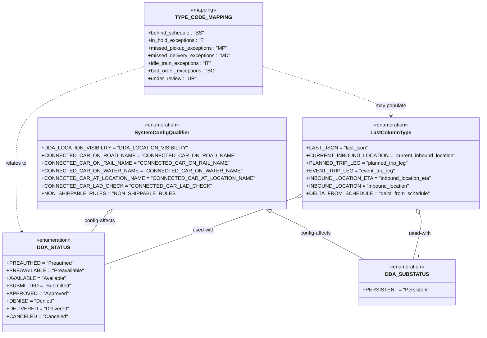

# Diagram: common/fv/python/fv/aws/lambdas/entity/constants.py

> Auto-generated by Obscura crawlers

## Mermaid

### SVG

<svg id="container" width="1389.0546875" xmlns="http://www.w3.org/2000/svg" class="classDiagram" height="1052" viewBox="0 0 1389.0546875 1052" role="graphics-document document" aria-roledescription="class"><g><defs><marker id="container_class-aggregationStart" class="marker aggregation class" refX="18" refY="7" markerWidth="190" markerHeight="240" orient="auto"><path d="M 18,7 L9,13 L1,7 L9,1 Z"></path></marker></defs><defs><marker id="container_class-aggregationEnd" class="marker aggregation class" refX="1" refY="7" markerWidth="20" markerHeight="28" orient="auto"><path d="M 18,7 L9,13 L1,7 L9,1 Z"></path></marker></defs><defs><marker id="container_class-extensionStart" class="marker extension class" refX="18" refY="7" markerWidth="190" markerHeight="240" orient="auto"><path d="M 1,7 L18,13 V 1 Z"></path></marker></defs><defs><marker id="container_class-extensionEnd" class="marker extension class" refX="1" refY="7" markerWidth="20" markerHeight="28" orient="auto"><path d="M 1,1 V 13 L18,7 Z"></path></marker></defs><defs><marker id="container_class-compositionStart" class="marker composition class" refX="18" refY="7" markerWidth="190" markerHeight="240" orient="auto"><path d="M 18,7 L9,13 L1,7 L9,1 Z"></path></marker></defs><defs><marker id="container_class-compositionEnd" class="marker composition class" refX="1" refY="7" markerWidth="20" markerHeight="28" orient="auto"><path d="M 18,7 L9,13 L1,7 L9,1 Z"></path></marker></defs><defs><marker id="container_class-dependencyStart" class="marker dependency class" refX="6" refY="7" markerWidth="190" markerHeight="240" orient="auto"><path d="M 5,7 L9,13 L1,7 L9,1 Z"></path></marker></defs><defs><marker id="container_class-dependencyEnd" class="marker dependency class" refX="13" refY="7" markerWidth="20" markerHeight="28" orient="auto"><path d="M 18,7 L9,13 L14,7 L9,1 Z"></path></marker></defs><defs><marker id="container_class-lollipopStart" class="marker lollipop class" refX="13" refY="7" markerWidth="190" markerHeight="240" orient="auto"><circle stroke="black" fill="transparent" cx="7" cy="7" r="6"></circle></marker></defs><defs><marker id="container_class-lollipopEnd" class="marker lollipop class" refX="1" refY="7" markerWidth="190" markerHeight="240" orient="auto"><circle stroke="black" fill="transparent" cx="7" cy="7" r="6"></circle></marker></defs><g class="root"><g class="clusters"></g><g class="edgePaths"><path d="M398.066,213.013L338.77,233.011C279.474,253.008,160.882,293.004,101.585,343.169C42.289,393.333,42.289,453.667,42.289,514C42.289,574.333,42.289,634.667,45.654,670.155C49.019,705.643,55.749,716.286,59.114,721.607L62.478,726.929" id="id_TYPE_CODE_MAPPING_DDA_STATUS_1" class="edge-thickness-normal edge-pattern-dashed relation" style=";;;" data-edge="true" data-et="edge" data-id="id_TYPE_CODE_MAPPING_DDA_STATUS_1" data-points="W3sieCI6Mzk4LjA2NjQwNjI1LCJ5IjoyMTMuMDEyNjcxNzcxMjgyMTZ9LHsieCI6NDIuMjg5MDYyNSwieSI6MzMzfSx7IngiOjQyLjI4OTA2MjUsInkiOjUxNH0seyJ4Ijo0Mi4yODkwNjI1LCJ5Ijo2OTV9LHsieCI6NjUuNjg1MTUyMjAyMDcyNTQsInkiOjczMn1d" marker-end="url(#container_class-dependencyEnd)"></path><path d="M759.887,213.013L819.183,233.011C878.479,253.008,997.072,293.004,1056.368,318.169C1115.664,343.333,1115.664,353.667,1115.664,358.833L1115.664,364" id="id_TYPE_CODE_MAPPING_LastColumnType_2" class="edge-thickness-normal edge-pattern-dashed relation" style=";;;" data-edge="true" data-et="edge" data-id="id_TYPE_CODE_MAPPING_LastColumnType_2" data-points="W3sieCI6NzU5Ljg4NjcxODc1LCJ5IjoyMTMuMDEyNjcxNzcxMjgyMTZ9LHsieCI6MTExNS42NjQwNjI1LCJ5IjozMzN9LHsieCI6MTExNS42NjQwNjI1LCJ5IjozNzB9XQ==" marker-end="url(#container_class-dependencyEnd)"></path><path d="M307.042,670.498L303.157,674.582C299.272,678.665,291.502,686.833,283.802,697.083C276.102,707.333,268.472,719.667,264.657,725.833L260.841,732" id="id_SystemConfigQualifier_DDA_STATUS_3" class="edge-thickness-normal edge-pattern-solid relation" style=";;;" data-edge="true" data-et="edge" data-id="id_SystemConfigQualifier_DDA_STATUS_3" data-points="W3sieCI6MzE4LjkzMjE2OTM3MTU0NjkzLCJ5Ijo2NTh9LHsieCI6MjgzLjczMjQyMTg3NSwieSI6Njk1fSx7IngiOjI2MC44NDE0NDI2ODEzNDcxMywieSI6NzMyfV0=" marker-start="url(#container_class-extensionStart)"></path><path d="M775.955,665.376L786.393,670.313C796.831,675.251,817.708,685.125,862.614,710.229C907.52,735.333,976.457,775.667,1010.925,795.833L1045.393,816" id="id_SystemConfigQualifier_DDA_SUBSTATUS_4" class="edge-thickness-normal edge-pattern-solid relation" style=";;;" data-edge="true" data-et="edge" data-id="id_SystemConfigQualifier_DDA_SUBSTATUS_4" data-points="W3sieCI6NzYwLjM2MTAzNjc3NDg2MTksInkiOjY1OH0seyJ4Ijo4MzguNTgzOTg0Mzc1LCJ5Ijo2OTV9LHsieCI6MTA0NS4zOTMxMzQ3MTUwMjYsInkiOjgxNn1d" marker-start="url(#container_class-extensionStart)"></path><path d="M834.273,627.365L806.293,638.637C778.312,649.91,722.351,672.455,636.339,706.036C550.327,739.617,434.263,784.233,376.231,806.541L318.199,828.85" id="id_LastColumnType_DDA_STATUS_5" class="edge-thickness-normal edge-pattern-solid relation" style=";;;" data-edge="true" data-et="edge" data-id="id_LastColumnType_DDA_STATUS_5" data-points="W3sieCI6ODUwLjI3MzQzNzUsInkiOjYyMC45MTg2MzU5OTIxNH0seyJ4Ijo2NjYuMzkwNjI1LCJ5Ijo2OTV9LHsieCI6MzE4LjE5OTIxODc1LCJ5Ijo4MjguODQ5NzUyNTgzMDk0OH1d" marker-start="url(#container_class-aggregationStart)"></path><path d="M1208.351,672.9L1210.5,676.584C1212.648,680.267,1216.945,687.633,1213.578,711.483C1210.21,735.333,1199.178,775.667,1193.662,795.833L1188.146,816" id="id_LastColumnType_DDA_SUBSTATUS_6" class="edge-thickness-normal edge-pattern-solid relation" style=";;;" data-edge="true" data-et="edge" data-id="id_LastColumnType_DDA_SUBSTATUS_6" data-points="W3sieCI6MTE5OS42NTk5MTg4NTM1OTEsInkiOjY1OH0seyJ4IjoxMjIxLjI0MjE4NzUsInkiOjY5NX0seyJ4IjoxMTg4LjE0NjQ1NDAxNTU0NDEsInkiOjgxNn1d" marker-start="url(#container_class-aggregationStart)"></path></g><g class="edgeLabels"><g class="edgeLabel" transform="translate(42.2890625, 514)"><g class="label" data-id="id_TYPE_CODE_MAPPING_DDA_STATUS_1" transform="translate(-34.2890625, -12)"><foreignObject width="68.578125" height="24">

relates to

</foreignObject></g></g><g class="edgeLabel" transform="translate(1115.6640625, 333)"><g class="label" data-id="id_TYPE_CODE_MAPPING_LastColumnType_2" transform="translate(-49.765625, -12)"><foreignObject width="99.53125" height="24">

may populate

</foreignObject></g></g><g class="edgeLabel" transform="translate(283.732421875, 695)"><g class="label" data-id="id_SystemConfigQualifier_DDA_STATUS_3" transform="translate(-49.25, -12)"><foreignObject width="98.5" height="24">

config-affects

</foreignObject></g></g><g class="edgeLabel" transform="translate(904.64462, 733.65079)"><g class="label" data-id="id_SystemConfigQualifier_DDA_SUBSTATUS_4" transform="translate(-49.25, -12)"><foreignObject width="98.5" height="24">

config-affects

</foreignObject></g></g><g class="edgeLabel" transform="translate(584.81654, 726.35825)"><g class="label" data-id="id_LastColumnType_DDA_STATUS_5" transform="translate(-36.328125, -12)"><foreignObject width="72.65625" height="24">

used-with

</foreignObject></g></g><g class="edgeLabel" transform="translate(1210.34478, 734.84157)"><g class="label" data-id="id_LastColumnType_DDA_SUBSTATUS_6" transform="translate(-36.328125, -12)"><foreignObject width="72.65625" height="24">

used-with

</foreignObject></g></g><g class="edgeTerminals" transform="translate(334.91610139221604, 831.5716090501551)"><g class="inner" transform="translate(0, 0)"></g><foreignObject style="width: 9px; height: 12px;">
1
</foreignObject></g><g class="edgeTerminals" transform="translate(1202.2319846318726, 798.0774445157078)"><g class="inner" transform="translate(0, 0)"></g><foreignObject style="width: 9px; height: 12px;">
1
</foreignObject></g></g><g class="nodes"><g class="node default" id="classId-TYPE_CODE_MAPPING-0" transform="translate(578.9765625, 152)"><g class="basic label-container"><path d="M-180.91015625 -144 L180.91015625 -144 L180.91015625 144 L-180.91015625 144" stroke="none" stroke-width="0" fill="#ECECFF" style=""></path><path d="M-180.91015625 -144 C-39.66861088432083 -144, 101.57293448135835 -144, 180.91015625 -144 M-180.91015625 -144 C-64.33030205882146 -144, 52.24955213235708 -144, 180.91015625 -144 M180.91015625 -144 C180.91015625 -31.516868523010245, 180.91015625 80.96626295397951, 180.91015625 144 M180.91015625 -144 C180.91015625 -31.783352480375257, 180.91015625 80.43329503924949, 180.91015625 144 M180.91015625 144 C44.82588386582299 144, -91.25838851835402 144, -180.91015625 144 M180.91015625 144 C79.25281934436545 144, -22.404517561269103 144, -180.91015625 144 M-180.91015625 144 C-180.91015625 71.45387812223264, -180.91015625 -1.0922437555347244, -180.91015625 -144 M-180.91015625 144 C-180.91015625 54.34630403394931, -180.91015625 -35.30739193210138, -180.91015625 -144" stroke="#9370DB" stroke-width="1.3" fill="none" stroke-dasharray="0 0" style=""></path></g><g class="annotation-group text" transform="translate(-40.9453125, -120)"><g class="label" style="" transform="translate(0,-12)"><foreignObject width="81.890625" height="24">

«mapping»

</foreignObject></g></g><g class="label-group text" transform="translate(-78.8828125, -96)"><g class="label" style="font-weight: bolder" transform="translate(0,-12)"><foreignObject width="157.765625" height="24">

TYPE_CODE_MAPPING

</foreignObject></g></g><g class="members-group text" transform="translate(-168.91015625, -48)"><g class="label" style="" transform="translate(0,-12)"><foreignObject width="175.84375" height="24">

+behind_schedule : "BS"

</foreignObject></g><g class="label" style="" transform="translate(0,12)"><foreignObject width="183" height="24">

+in_hold_exceptions : "T"

</foreignObject></g><g class="label" style="" transform="translate(0,36)"><foreignObject width="248.90625" height="24">

+missed_pickup_exceptions : "MP"

</foreignObject></g><g class="label" style="" transform="translate(0,60)"><foreignObject width="258.9375" height="24">

+missed_delivery_exceptions : "MD"

</foreignObject></g><g class="label" style="" transform="translate(0,84)"><foreignObject width="201.53125" height="24">

+idle_train_exceptions : "IT"

</foreignObject></g><g class="label" style="" transform="translate(0,108)"><foreignObject width="213.9375" height="24">

+bad_order_exceptions : "BO"

</foreignObject></g><g class="label" style="" transform="translate(0,132)"><foreignObject width="150.46875" height="24">

+under_review : "UR"

</foreignObject></g></g><g class="methods-group text" transform="translate(-168.91015625, 144)"></g><g class="divider" style=""><path d="M-180.91015625 -72 C-82.2874849237142 -72, 16.335186402571594 -72, 180.91015625 -72 M-180.91015625 -72 C-55.40621481916975 -72, 70.0977266116605 -72, 180.91015625 -72" stroke="#9370DB" stroke-width="1.3" fill="none" stroke-dasharray="0 0" style=""></path></g><g class="divider" style=""><path d="M-180.91015625 120 C-76.30029122345114 120, 28.30957380309772 120, 180.91015625 120 M-180.91015625 120 C-107.84458858548174 120, -34.77902092096349 120, 180.91015625 120" stroke="#9370DB" stroke-width="1.3" fill="none" stroke-dasharray="0 0" style=""></path></g></g><g class="node default" id="classId-SystemConfigQualifier-1" transform="translate(455.92578125, 514)"><g class="basic label-container"><path d="M-344.34765625 -144 L344.34765625 -144 L344.34765625 144 L-344.34765625 144" stroke="none" stroke-width="0" fill="#ECECFF" style=""></path><path d="M-344.34765625 -144 C-108.17459692097995 -144, 127.9984624080401 -144, 344.34765625 -144 M-344.34765625 -144 C-81.23380304208877 -144, 181.88005016582247 -144, 344.34765625 -144 M344.34765625 -144 C344.34765625 -48.77367001653268, 344.34765625 46.45265996693465, 344.34765625 144 M344.34765625 -144 C344.34765625 -63.948104217257466, 344.34765625 16.103791565485068, 344.34765625 144 M344.34765625 144 C167.97050988704063 144, -8.40663647591873 144, -344.34765625 144 M344.34765625 144 C116.96201803436875 144, -110.42362018126249 144, -344.34765625 144 M-344.34765625 144 C-344.34765625 62.35293260174696, -344.34765625 -19.294134796506086, -344.34765625 -144 M-344.34765625 144 C-344.34765625 77.49323273811089, -344.34765625 10.986465476221781, -344.34765625 -144" stroke="#9370DB" stroke-width="1.3" fill="none" stroke-dasharray="0 0" style=""></path></g><g class="annotation-group text" transform="translate(-55.5546875, -120)"><g class="label" style="" transform="translate(0,-12)"><foreignObject width="111.109375" height="24">

«enumeration»

</foreignObject></g></g><g class="label-group text" transform="translate(-80.9296875, -96)"><g class="label" style="font-weight: bolder" transform="translate(0,-12)"><foreignObject width="161.859375" height="24">

SystemConfigQualifier

</foreignObject></g></g><g class="members-group text" transform="translate(-332.34765625, -48)"><g class="label" style="" transform="translate(0,-12)"><foreignObject width="412.125" height="24">

+DDA_LOCATION_VISIBILITY = "DDA_LOCATION_VISIBILITY"

</foreignObject></g><g class="label" style="" transform="translate(0,12)"><foreignObject width="532.09375" height="24">

+CONNECTED_CAR_ON_ROAD_NAME = "CONNECTED_CAR_ON_ROAD_NAME"

</foreignObject></g><g class="label" style="" transform="translate(0,36)"><foreignObject width="516.59375" height="24">

+CONNECTED_CAR_ON_RAIL_NAME = "CONNECTED_CAR_ON_RAIL_NAME"

</foreignObject></g><g class="label" style="" transform="translate(0,60)"><foreignObject width="547.796875" height="24">

+CONNECTED_CAR_ON_WATER_NAME = "CONNECTED_CAR_ON_WATER_NAME"

</foreignObject></g><g class="label" style="" transform="translate(0,84)"><foreignObject width="583.765625" height="24">

+CONNECTED_CAR_AT_LOCATION_NAME = "CONNECTED_CAR_AT_LOCATION_NAME"

</foreignObject></g><g class="label" style="" transform="translate(0,108)"><foreignObject width="457.46875" height="24">

+CONNECTED_CAR_LAD_CHECK = "CONNECTED_CAR_LAD_CHECK"

</foreignObject></g><g class="label" style="" transform="translate(0,132)"><foreignObject width="380.828125" height="24">

+NON_SHIPPABLE_RULES = "NON_SHIPPABLE_RULES"

</foreignObject></g></g><g class="methods-group text" transform="translate(-332.34765625, 144)"></g><g class="divider" style=""><path d="M-344.34765625 -72 C-87.0655835659648 -72, 170.2164891180704 -72, 344.34765625 -72 M-344.34765625 -72 C-136.22462235040706 -72, 71.89841154918588 -72, 344.34765625 -72" stroke="#9370DB" stroke-width="1.3" fill="none" stroke-dasharray="0 0" style=""></path></g><g class="divider" style=""><path d="M-344.34765625 120 C-104.24366607544732 120, 135.86032409910536 120, 344.34765625 120 M-344.34765625 120 C-160.80956375535536 120, 22.72852873928929 120, 344.34765625 120" stroke="#9370DB" stroke-width="1.3" fill="none" stroke-dasharray="0 0" style=""></path></g></g><g class="node default" id="classId-DDA_STATUS-2" transform="translate(164.328125, 888)"><g class="basic label-container"><path d="M-153.87109375 -156 L153.87109375 -156 L153.87109375 156 L-153.87109375 156" stroke="none" stroke-width="0" fill="#ECECFF" style=""></path><path d="M-153.87109375 -156 C-73.6826634221686 -156, 6.505766905662796 -156, 153.87109375 -156 M-153.87109375 -156 C-33.59491204548323 -156, 86.68126965903355 -156, 153.87109375 -156 M153.87109375 -156 C153.87109375 -45.58427606395715, 153.87109375 64.8314478720857, 153.87109375 156 M153.87109375 -156 C153.87109375 -84.69902602269909, 153.87109375 -13.398052045398174, 153.87109375 156 M153.87109375 156 C35.16512775185838 156, -83.54083824628324 156, -153.87109375 156 M153.87109375 156 C49.75431536724682 156, -54.362463015506364 156, -153.87109375 156 M-153.87109375 156 C-153.87109375 62.223779167485986, -153.87109375 -31.552441665028027, -153.87109375 -156 M-153.87109375 156 C-153.87109375 53.93548661892666, -153.87109375 -48.12902676214668, -153.87109375 -156" stroke="#9370DB" stroke-width="1.3" fill="none" stroke-dasharray="0 0" style=""></path></g><g class="annotation-group text" transform="translate(-55.5546875, -132)"><g class="label" style="" transform="translate(0,-12)"><foreignObject width="111.109375" height="24">

«enumeration»

</foreignObject></g></g><g class="label-group text" transform="translate(-45.765625, -108)"><g class="label" style="font-weight: bolder" transform="translate(0,-12)"><foreignObject width="91.53125" height="24">

DDA_STATUS

</foreignObject></g></g><g class="members-group text" transform="translate(-141.87109375, -60)"><g class="label" style="" transform="translate(0,-12)"><foreignObject width="197.078125" height="24">

+PREAUTHED = "Preauthed"

</foreignObject></g><g class="label" style="" transform="translate(0,12)"><foreignObject width="228.1875" height="24">

+PREAVAILABLE = "Preavailable"

</foreignObject></g><g class="label" style="" transform="translate(0,36)"><foreignObject width="177.484375" height="24">

+AVAILABLE = "Available"

</foreignObject></g><g class="label" style="" transform="translate(0,60)"><foreignObject width="193.578125" height="24">

+SUBMITTED = "Submitted"

</foreignObject></g><g class="label" style="" transform="translate(0,84)"><foreignObject width="181.890625" height="24">

+APPROVED = "Approved"

</foreignObject></g><g class="label" style="" transform="translate(0,108)"><foreignObject width="141.8125" height="24">

+DENIED = "Denied"

</foreignObject></g><g class="label" style="" transform="translate(0,132)"><foreignObject width="183.53125" height="24">

+DELIVERED = "Delivered"

</foreignObject></g><g class="label" style="" transform="translate(0,156)"><foreignObject width="176.46875" height="24">

+CANCELED = "Canceled"

</foreignObject></g></g><g class="methods-group text" transform="translate(-141.87109375, 156)"></g><g class="divider" style=""><path d="M-153.87109375 -84 C-75.2729565373571 -84, 3.325180675285793 -84, 153.87109375 -84 M-153.87109375 -84 C-75.6717982836483 -84, 2.5274971827033994 -84, 153.87109375 -84" stroke="#9370DB" stroke-width="1.3" fill="none" stroke-dasharray="0 0" style=""></path></g><g class="divider" style=""><path d="M-153.87109375 132 C-78.19682879124642 132, -2.5225638324928354 132, 153.87109375 132 M-153.87109375 132 C-60.45168387062171 132, 32.967726008756586 132, 153.87109375 132" stroke="#9370DB" stroke-width="1.3" fill="none" stroke-dasharray="0 0" style=""></path></g></g><g class="node default" id="classId-DDA_SUBSTATUS-3" transform="translate(1168.453125, 888)"><g class="basic label-container"><path d="M-139.45703125 -72 L139.45703125 -72 L139.45703125 72 L-139.45703125 72" stroke="none" stroke-width="0" fill="#ECECFF" style=""></path><path d="M-139.45703125 -72 C-43.94445262903527 -72, 51.56812599192946 -72, 139.45703125 -72 M-139.45703125 -72 C-73.95362825519747 -72, -8.450225260394944 -72, 139.45703125 -72 M139.45703125 -72 C139.45703125 -39.2718384050952, 139.45703125 -6.543676810190405, 139.45703125 72 M139.45703125 -72 C139.45703125 -28.171315867713453, 139.45703125 15.657368264573094, 139.45703125 72 M139.45703125 72 C79.61238420073292 72, 19.767737151465823 72, -139.45703125 72 M139.45703125 72 C58.53506570842069 72, -22.386899833158623 72, -139.45703125 72 M-139.45703125 72 C-139.45703125 23.820601981228762, -139.45703125 -24.358796037542476, -139.45703125 -72 M-139.45703125 72 C-139.45703125 38.20482234083202, -139.45703125 4.409644681664034, -139.45703125 -72" stroke="#9370DB" stroke-width="1.3" fill="none" stroke-dasharray="0 0" style=""></path></g><g class="annotation-group text" transform="translate(-55.5546875, -48)"><g class="label" style="" transform="translate(0,-12)"><foreignObject width="111.109375" height="24">

«enumeration»

</foreignObject></g></g><g class="label-group text" transform="translate(-60.3203125, -24)"><g class="label" style="font-weight: bolder" transform="translate(0,-12)"><foreignObject width="120.640625" height="24">

DDA_SUBSTATUS

</foreignObject></g></g><g class="members-group text" transform="translate(-127.45703125, 24)"><g class="label" style="" transform="translate(0,-12)"><foreignObject width="194.59375" height="24">

+PERSISTENT = "Persistent"

</foreignObject></g></g><g class="methods-group text" transform="translate(-127.45703125, 72)"></g><g class="divider" style=""><path d="M-139.45703125 0 C-30.88373635222125 0, 77.6895585455575 0, 139.45703125 0 M-139.45703125 0 C-73.72981306477591 0, -8.002594879551822 0, 139.45703125 0" stroke="#9370DB" stroke-width="1.3" fill="none" stroke-dasharray="0 0" style=""></path></g><g class="divider" style=""><path d="M-139.45703125 48 C-32.95244223856456 48, 73.55214677287088 48, 139.45703125 48 M-139.45703125 48 C-78.51542718595505 48, -17.57382312191008 48, 139.45703125 48" stroke="#9370DB" stroke-width="1.3" fill="none" stroke-dasharray="0 0" style=""></path></g></g><g class="node default" id="classId-LastColumnType-4" transform="translate(1115.6640625, 514)"><g class="basic label-container"><path d="M-265.390625 -144 L265.390625 -144 L265.390625 144 L-265.390625 144" stroke="none" stroke-width="0" fill="#ECECFF" style=""></path><path d="M-265.390625 -144 C-141.36963504435906 -144, -17.348645088718115 -144, 265.390625 -144 M-265.390625 -144 C-60.53738784645412 -144, 144.31584930709175 -144, 265.390625 -144 M265.390625 -144 C265.390625 -47.070220719581656, 265.390625 49.85955856083669, 265.390625 144 M265.390625 -144 C265.390625 -54.22815582545087, 265.390625 35.54368834909826, 265.390625 144 M265.390625 144 C100.79579590845483 144, -63.79903318309033 144, -265.390625 144 M265.390625 144 C54.041548941403306 144, -157.3075271171934 144, -265.390625 144 M-265.390625 144 C-265.390625 66.07668344681653, -265.390625 -11.846633106366937, -265.390625 -144 M-265.390625 144 C-265.390625 33.293378124086715, -265.390625 -77.41324375182657, -265.390625 -144" stroke="#9370DB" stroke-width="1.3" fill="none" stroke-dasharray="0 0" style=""></path></g><g class="annotation-group text" transform="translate(-55.5546875, -120)"><g class="label" style="" transform="translate(0,-12)"><foreignObject width="111.109375" height="24">

«enumeration»

</foreignObject></g></g><g class="label-group text" transform="translate(-60.0625, -96)"><g class="label" style="font-weight: bolder" transform="translate(0,-12)"><foreignObject width="120.125" height="24">

LastColumnType

</foreignObject></g></g><g class="members-group text" transform="translate(-253.390625, -48)"><g class="label" style="" transform="translate(0,-12)"><foreignObject width="180.328125" height="24">

+LAST_JSON = "last_json"

</foreignObject></g><g class="label" style="" transform="translate(0,12)"><foreignObject width="446.71875" height="24">

+CURRENT_INBOUND_LOCATION = "current_inbound_location"

</foreignObject></g><g class="label" style="" transform="translate(0,36)"><foreignObject width="299.703125" height="24">

+PLANNED_TRIP_LEG = "planned_trip_leg"

</foreignObject></g><g class="label" style="" transform="translate(0,60)"><foreignObject width="257.921875" height="24">

+EVENT_TRIP_LEG = "event_trip_leg"

</foreignObject></g><g class="label" style="" transform="translate(0,84)"><foreignObject width="376.578125" height="24">

+INBOUND_LOCATION_ETA = "inbound_location_eta"

</foreignObject></g><g class="label" style="" transform="translate(0,108)"><foreignObject width="311.96875" height="24">

+INBOUND_LOCATION = "inbound_location"

</foreignObject></g><g class="label" style="" transform="translate(0,132)"><foreignObject width="363.921875" height="24">

+DELTA_FROM_SCHEDULE = "delta_from_schedule"

</foreignObject></g></g><g class="methods-group text" transform="translate(-253.390625, 144)"></g><g class="divider" style=""><path d="M-265.390625 -72 C-103.41607405157802 -72, 58.558476896843956 -72, 265.390625 -72 M-265.390625 -72 C-157.68713372558707 -72, -49.98364245117415 -72, 265.390625 -72" stroke="#9370DB" stroke-width="1.3" fill="none" stroke-dasharray="0 0" style=""></path></g><g class="divider" style=""><path d="M-265.390625 120 C-154.9415315947812 120, -44.49243818956239 120, 265.390625 120 M-265.390625 120 C-143.51412930657477 120, -21.637633613149546 120, 265.390625 120" stroke="#9370DB" stroke-width="1.3" fill="none" stroke-dasharray="0 0" style=""></path></g></g></g></g></g></svg>
