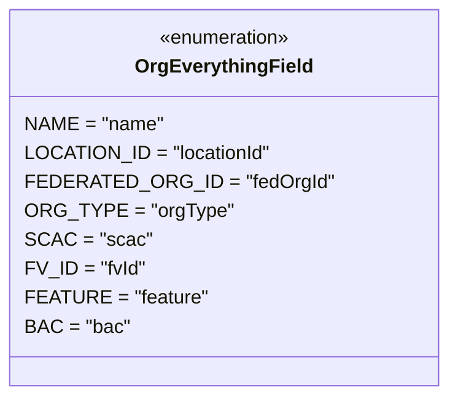

# Diagram: common/fv/python/fv/aws/lambdas/iam/constants.py

> Auto-generated by Obscura crawlers

## Mermaid

### SVG

<svg id="container" width="343.2734375" xmlns="http://www.w3.org/2000/svg" class="classDiagram" height="328" viewBox="0 0 343.2734375 328" role="graphics-document document" aria-roledescription="class"><g><defs><marker id="container_class-aggregationStart" class="marker aggregation class" refX="18" refY="7" markerWidth="190" markerHeight="240" orient="auto"><path d="M 18,7 L9,13 L1,7 L9,1 Z"></path></marker></defs><defs><marker id="container_class-aggregationEnd" class="marker aggregation class" refX="1" refY="7" markerWidth="20" markerHeight="28" orient="auto"><path d="M 18,7 L9,13 L1,7 L9,1 Z"></path></marker></defs><defs><marker id="container_class-extensionStart" class="marker extension class" refX="18" refY="7" markerWidth="190" markerHeight="240" orient="auto"><path d="M 1,7 L18,13 V 1 Z"></path></marker></defs><defs><marker id="container_class-extensionEnd" class="marker extension class" refX="1" refY="7" markerWidth="20" markerHeight="28" orient="auto"><path d="M 1,1 V 13 L18,7 Z"></path></marker></defs><defs><marker id="container_class-compositionStart" class="marker composition class" refX="18" refY="7" markerWidth="190" markerHeight="240" orient="auto"><path d="M 18,7 L9,13 L1,7 L9,1 Z"></path></marker></defs><defs><marker id="container_class-compositionEnd" class="marker composition class" refX="1" refY="7" markerWidth="20" markerHeight="28" orient="auto"><path d="M 18,7 L9,13 L1,7 L9,1 Z"></path></marker></defs><defs><marker id="container_class-dependencyStart" class="marker dependency class" refX="6" refY="7" markerWidth="190" markerHeight="240" orient="auto"><path d="M 5,7 L9,13 L1,7 L9,1 Z"></path></marker></defs><defs><marker id="container_class-dependencyEnd" class="marker dependency class" refX="13" refY="7" markerWidth="20" markerHeight="28" orient="auto"><path d="M 18,7 L9,13 L14,7 L9,1 Z"></path></marker></defs><defs><marker id="container_class-lollipopStart" class="marker lollipop class" refX="13" refY="7" markerWidth="190" markerHeight="240" orient="auto"><circle stroke="black" fill="transparent" cx="7" cy="7" r="6"></circle></marker></defs><defs><marker id="container_class-lollipopEnd" class="marker lollipop class" refX="1" refY="7" markerWidth="190" markerHeight="240" orient="auto"><circle stroke="black" fill="transparent" cx="7" cy="7" r="6"></circle></marker></defs><g class="root"><g class="clusters"></g><g class="edgePaths"></g><g class="edgeLabels"></g><g class="nodes"><g class="node default" id="classId-OrgEverythingField-0" transform="translate(171.63671875, 164)"><g class="basic label-container"><path d="M-163.63671875 -156 L163.63671875 -156 L163.63671875 156 L-163.63671875 156" stroke="none" stroke-width="0" fill="#ECECFF" style=""></path><path d="M-163.63671875 -156 C-53.43135076288975 -156, 56.7740172242205 -156, 163.63671875 -156 M-163.63671875 -156 C-67.24330025728987 -156, 29.15011823542025 -156, 163.63671875 -156 M163.63671875 -156 C163.63671875 -32.89649956525318, 163.63671875 90.20700086949364, 163.63671875 156 M163.63671875 -156 C163.63671875 -93.58605145536829, 163.63671875 -31.172102910736584, 163.63671875 156 M163.63671875 156 C64.92337749494278 156, -33.78996376011443 156, -163.63671875 156 M163.63671875 156 C77.7040965678929 156, -8.228525614214192 156, -163.63671875 156 M-163.63671875 156 C-163.63671875 62.65835850770617, -163.63671875 -30.683282984587663, -163.63671875 -156 M-163.63671875 156 C-163.63671875 51.45077893986584, -163.63671875 -53.09844212026832, -163.63671875 -156" stroke="#9370DB" stroke-width="1.3" fill="none" stroke-dasharray="0 0" style=""></path></g><g class="annotation-group text" transform="translate(-55.5546875, -132)"><g class="label" style="" transform="translate(0,-12)"><foreignObject width="111.109375" height="24">

«enumeration»

</foreignObject></g></g><g class="label-group text" transform="translate(-69.3671875, -108)"><g class="label" style="font-weight: bolder" transform="translate(0,-12)"><foreignObject width="138.734375" height="24">

OrgEverythingField

</foreignObject></g></g><g class="members-group text" transform="translate(-151.63671875, -60)"><g class="label" style="" transform="translate(0,-12)"><foreignObject width="110.71875" height="24">

NAME = "name"

</foreignObject></g><g class="label" style="" transform="translate(0,12)"><foreignObject width="196.6875" height="24">

LOCATION_ID = "locationId"

</foreignObject></g><g class="label" style="" transform="translate(0,36)"><foreignObject width="233.90625" height="24">

FEDERATED_ORG_ID = "fedOrgId"

</foreignObject></g><g class="label" style="" transform="translate(0,60)"><foreignObject width="159.421875" height="24">

ORG_TYPE = "orgType"

</foreignObject></g><g class="label" style="" transform="translate(0,84)"><foreignObject width="96.0625" height="24">

SCAC = "scac"

</foreignObject></g><g class="label" style="" transform="translate(0,108)"><foreignObject width="96.078125" height="24">

FV_ID = "fvId"

</foreignObject></g><g class="label" style="" transform="translate(0,132)"><foreignObject width="142.953125" height="24">

FEATURE = "feature"

</foreignObject></g><g class="label" style="" transform="translate(0,156)"><foreignObject width="82.5625" height="24">

BAC = "bac"

</foreignObject></g></g><g class="methods-group text" transform="translate(-151.63671875, 156)"></g><g class="divider" style=""><path d="M-163.63671875 -84 C-60.38197340922565 -84, 42.8727719315487 -84, 163.63671875 -84 M-163.63671875 -84 C-44.22477798211888 -84, 75.18716278576224 -84, 163.63671875 -84" stroke="#9370DB" stroke-width="1.3" fill="none" stroke-dasharray="0 0" style=""></path></g><g class="divider" style=""><path d="M-163.63671875 132 C-83.32046630710627 132, -3.004213864212545 132, 163.63671875 132 M-163.63671875 132 C-78.36430966440487 132, 6.908099421190258 132, 163.63671875 132" stroke="#9370DB" stroke-width="1.3" fill="none" stroke-dasharray="0 0" style=""></path></g></g></g></g></g></svg>
