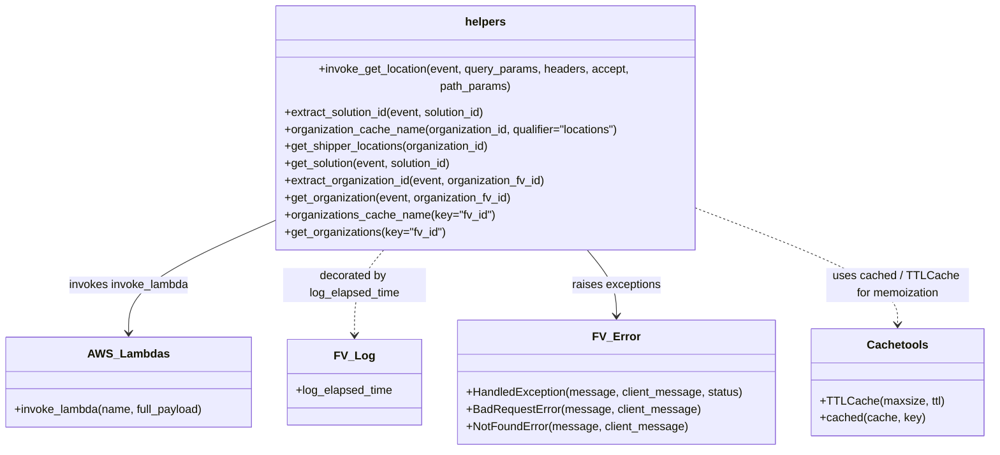

# Diagram: common/fv/python/fv/aws/lambdas/invokinator.py

> Auto-generated by Obscura crawlers

## Mermaid

### SVG

<svg id="container" width="1365.15625" xmlns="http://www.w3.org/2000/svg" class="classDiagram" height="606" viewBox="0 0 1365.15625 606" role="graphics-document document" aria-roledescription="class"><g><defs><marker id="container_class-aggregationStart" class="marker aggregation class" refX="18" refY="7" markerWidth="190" markerHeight="240" orient="auto"><path d="M 18,7 L9,13 L1,7 L9,1 Z"></path></marker></defs><defs><marker id="container_class-aggregationEnd" class="marker aggregation class" refX="1" refY="7" markerWidth="20" markerHeight="28" orient="auto"><path d="M 18,7 L9,13 L1,7 L9,1 Z"></path></marker></defs><defs><marker id="container_class-extensionStart" class="marker extension class" refX="18" refY="7" markerWidth="190" markerHeight="240" orient="auto"><path d="M 1,7 L18,13 V 1 Z"></path></marker></defs><defs><marker id="container_class-extensionEnd" class="marker extension class" refX="1" refY="7" markerWidth="20" markerHeight="28" orient="auto"><path d="M 1,1 V 13 L18,7 Z"></path></marker></defs><defs><marker id="container_class-compositionStart" class="marker composition class" refX="18" refY="7" markerWidth="190" markerHeight="240" orient="auto"><path d="M 18,7 L9,13 L1,7 L9,1 Z"></path></marker></defs><defs><marker id="container_class-compositionEnd" class="marker composition class" refX="1" refY="7" markerWidth="20" markerHeight="28" orient="auto"><path d="M 18,7 L9,13 L1,7 L9,1 Z"></path></marker></defs><defs><marker id="container_class-dependencyStart" class="marker dependency class" refX="6" refY="7" markerWidth="190" markerHeight="240" orient="auto"><path d="M 5,7 L9,13 L1,7 L9,1 Z"></path></marker></defs><defs><marker id="container_class-dependencyEnd" class="marker dependency class" refX="13" refY="7" markerWidth="20" markerHeight="28" orient="auto"><path d="M 18,7 L9,13 L14,7 L9,1 Z"></path></marker></defs><defs><marker id="container_class-lollipopStart" class="marker lollipop class" refX="13" refY="7" markerWidth="190" markerHeight="240" orient="auto"><circle stroke="black" fill="transparent" cx="7" cy="7" r="6"></circle></marker></defs><defs><marker id="container_class-lollipopEnd" class="marker lollipop class" refX="1" refY="7" markerWidth="190" markerHeight="240" orient="auto"><circle stroke="black" fill="transparent" cx="7" cy="7" r="6"></circle></marker></defs><g class="root"><g class="clusters"></g><g class="edgePaths"><path d="M379.84,291.198L346.538,305.165C313.237,319.132,246.634,347.066,213.333,372.2C180.031,397.333,180.031,419.667,180.031,430.833L180.031,442" id="id_helpers_AWS_Lambdas_1" class="edge-thickness-normal edge-pattern-solid relation" style=";;;" data-edge="true" data-et="edge" data-id="id_helpers_AWS_Lambdas_1" data-points="W3sieCI6Mzc5LjgzOTg0Mzc1LCJ5IjoyOTEuMTk4MDc5Njk1MDE5NjZ9LHsieCI6MTgwLjAzMTI1LCJ5IjozNzV9LHsieCI6MTgwLjAzMTI1LCJ5Ijo0NDh9XQ==" marker-end="url(#container_class-dependencyEnd)"></path><path d="M537.506,326L530.394,334.167C523.282,342.333,509.059,358.667,501.948,378.5C494.836,398.333,494.836,421.667,494.836,433.333L494.836,445" id="id_helpers_FV_Log_2" class="edge-thickness-normal edge-pattern-dashed relation" style=";;;" data-edge="true" data-et="edge" data-id="id_helpers_FV_Log_2" data-points="W3sieCI6NTM3LjUwNTcyNzkxNDY2MzUsInkiOjMyNn0seyJ4Ijo0OTQuODM1OTM3NSwieSI6Mzc1fSx7IngiOjQ5NC44MzU5Mzc1LCJ5Ijo0NTF9XQ==" marker-end="url(#container_class-dependencyEnd)"></path><path d="M814.424,326L821.536,334.167C828.647,342.333,842.87,358.667,849.982,374C857.094,389.333,857.094,403.667,857.094,410.833L857.094,418" id="id_helpers_FV_Error_3" class="edge-thickness-normal edge-pattern-solid relation" style=";;;" data-edge="true" data-et="edge" data-id="id_helpers_FV_Error_3" data-points="W3sieCI6ODE0LjQyMzk1OTU4NTMzNjUsInkiOjMyNn0seyJ4Ijo4NTcuMDkzNzUsInkiOjM3NX0seyJ4Ijo4NTcuMDkzNzUsInkiOjQyNH1d" marker-end="url(#container_class-dependencyEnd)"></path><path d="M972.09,275.842L1017.053,292.368C1062.016,308.895,1151.941,341.947,1196.904,367.64C1241.867,393.333,1241.867,411.667,1241.867,420.833L1241.867,430" id="id_helpers_Cachetools_4" class="edge-thickness-normal edge-pattern-dashed relation" style=";;;" data-edge="true" data-et="edge" data-id="id_helpers_Cachetools_4" data-points="W3sieCI6OTcyLjA4OTg0Mzc1LCJ5IjoyNzUuODQyMTAwOTAzNTYyNX0seyJ4IjoxMjQxLjg2NzE4NzUsInkiOjM3NX0seyJ4IjoxMjQxLjg2NzE4NzUsInkiOjQzNn1d" marker-end="url(#container_class-dependencyEnd)"></path></g><g class="edgeLabels"><g class="edgeLabel" transform="translate(180.03125, 375)"><g class="label" data-id="id_helpers_AWS_Lambdas_1" transform="translate(-84.875, -12)"><foreignObject width="169.75" height="24">

invokes invoke_lambda

</foreignObject></g></g><g class="edgeLabel" transform="translate(494.8359375, 375)"><g class="label" data-id="id_helpers_FV_Log_2" transform="translate(-100, -24)"><foreignObject width="200" height="48">

decorated by log_elapsed_time

</foreignObject></g></g><g class="edgeLabel" transform="translate(857.09375, 375)"><g class="label" data-id="id_helpers_FV_Error_3" transform="translate(-62.484375, -12)"><foreignObject width="124.96875" height="24">

raises exceptions

</foreignObject></g></g><g class="edgeLabel" transform="translate(1241.8671875, 375)"><g class="label" data-id="id_helpers_Cachetools_4" transform="translate(-100, -24)"><foreignObject width="200" height="48">

uses cached / TTLCache for memoization

</foreignObject></g></g></g><g class="nodes"><g class="node default" id="classId-helpers-0" transform="translate(675.96484375, 167)"><g class="basic label-container"><path d="M-296.125 -159 L296.125 -159 L296.125 159 L-296.125 159" stroke="none" stroke-width="0" fill="#ECECFF" style=""></path><path d="M-296.125 -159 C-103.33037331915457 -159, 89.46425336169085 -159, 296.125 -159 M-296.125 -159 C-123.22508702381347 -159, 49.674825952373055 -159, 296.125 -159 M296.125 -159 C296.125 -61.1603938200946, 296.125 36.679212359810805, 296.125 159 M296.125 -159 C296.125 -91.71752639420505, 296.125 -24.435052788410104, 296.125 159 M296.125 159 C161.04984119825775 159, 25.974682396515504 159, -296.125 159 M296.125 159 C137.48945259359562 159, -21.14609481280877 159, -296.125 159 M-296.125 159 C-296.125 77.064560999736, -296.125 -4.870878000527995, -296.125 -159 M-296.125 159 C-296.125 49.61616255948327, -296.125 -59.76767488103346, -296.125 -159" stroke="#9370DB" stroke-width="1.3" fill="none" stroke-dasharray="0 0" style=""></path></g><g class="annotation-group text" transform="translate(0, -135)"></g><g class="label-group text" transform="translate(-27.578125, -135)"><g class="label" style="font-weight: bolder" transform="translate(0,-12)"><foreignObject width="55.15625" height="24">

helpers

</foreignObject></g></g><g class="members-group text" transform="translate(-284.125, -87)"></g><g class="methods-group text" transform="translate(-284.125, -57)"><g class="label" style="" transform="translate(0,-12)"><foreignObject width="540.671875" height="24">

+invoke_get_location(event, query_params, headers, accept, path_params)

</foreignObject></g><g class="label" style="" transform="translate(0,12)"><foreignObject width="289.46875" height="24">

+extract_solution_id(event, solution_id)

</foreignObject></g><g class="label" style="" transform="translate(0,36)"><foreignObject width="475.859375" height="24">

+organization_cache_name(organization_id, qualifier="locations")

</foreignObject></g><g class="label" style="" transform="translate(0,60)"><foreignObject width="290.765625" height="24">

+get_shipper_locations(organization_id)

</foreignObject></g><g class="label" style="" transform="translate(0,84)"><foreignObject width="239.765625" height="24">

+get_solution(event, solution_id)

</foreignObject></g><g class="label" style="" transform="translate(0,108)"><foreignObject width="370.953125" height="24">

+extract_organization_id(event, organization_fv_id)

</foreignObject></g><g class="label" style="" transform="translate(0,132)"><foreignObject width="321.25" height="24">

+get_organization(event, organization_fv_id)

</foreignObject></g><g class="label" style="" transform="translate(0,156)"><foreignObject width="294.8125" height="24">

+organizations_cache_name(key="fv_id")

</foreignObject></g><g class="label" style="" transform="translate(0,180)"><foreignObject width="227.234375" height="24">

+get_organizations(key="fv_id")

</foreignObject></g></g><g class="divider" style=""><path d="M-296.125 -111 C-161.60696981010994 -111, -27.08893962021989 -111, 296.125 -111 M-296.125 -111 C-146.78781288856138 -111, 2.5493742228772476 -111, 296.125 -111" stroke="#9370DB" stroke-width="1.3" fill="none" stroke-dasharray="0 0" style=""></path></g><g class="divider" style=""><path d="M-296.125 -87 C-164.53980086347974 -87, -32.95460172695948 -87, 296.125 -87 M-296.125 -87 C-136.68111432865294 -87, 22.762771342694123 -87, 296.125 -87" stroke="#9370DB" stroke-width="1.3" fill="none" stroke-dasharray="0 0" style=""></path></g></g><g class="node default" id="classId-AWS_Lambdas-1" transform="translate(180.03125, 511)"><g class="basic label-container"><path d="M-172.03125 -63 L172.03125 -63 L172.03125 63 L-172.03125 63" stroke="none" stroke-width="0" fill="#ECECFF" style=""></path><path d="M-172.03125 -63 C-68.44940756083072 -63, 35.13243487833856 -63, 172.03125 -63 M-172.03125 -63 C-100.90792182297676 -63, -29.78459364595352 -63, 172.03125 -63 M172.03125 -63 C172.03125 -36.3587250029111, 172.03125 -9.717450005822194, 172.03125 63 M172.03125 -63 C172.03125 -22.766520221652335, 172.03125 17.46695955669533, 172.03125 63 M172.03125 63 C76.8290731154258 63, -18.3731037691484 63, -172.03125 63 M172.03125 63 C59.921800522299094 63, -52.18764895540181 63, -172.03125 63 M-172.03125 63 C-172.03125 22.664819298691995, -172.03125 -17.67036140261601, -172.03125 -63 M-172.03125 63 C-172.03125 34.30711129427988, -172.03125 5.6142225885597625, -172.03125 -63" stroke="#9370DB" stroke-width="1.3" fill="none" stroke-dasharray="0 0" style=""></path></g><g class="annotation-group text" transform="translate(0, -39)"></g><g class="label-group text" transform="translate(-52.828125, -39)"><g class="label" style="font-weight: bolder" transform="translate(0,-12)"><foreignObject width="105.65625" height="24">

AWS_Lambdas

</foreignObject></g></g><g class="members-group text" transform="translate(-160.03125, 9)"></g><g class="methods-group text" transform="translate(-160.03125, 39)"><g class="label" style="" transform="translate(0,-12)"><foreignObject width="267.234375" height="24">

+invoke_lambda(name, full_payload)

</foreignObject></g></g><g class="divider" style=""><path d="M-172.03125 -15 C-48.1878001035258 -15, 75.6556497929484 -15, 172.03125 -15 M-172.03125 -15 C-45.59758587634775 -15, 80.8360782473045 -15, 172.03125 -15" stroke="#9370DB" stroke-width="1.3" fill="none" stroke-dasharray="0 0" style=""></path></g><g class="divider" style=""><path d="M-172.03125 9 C-67.70936635538204 9, 36.61251728923591 9, 172.03125 9 M-172.03125 9 C-62.3067455046766 9, 47.4177589906468 9, 172.03125 9" stroke="#9370DB" stroke-width="1.3" fill="none" stroke-dasharray="0 0" style=""></path></g></g><g class="node default" id="classId-FV_Log-2" transform="translate(494.8359375, 511)"><g class="basic label-container"><path d="M-92.7734375 -60 L92.7734375 -60 L92.7734375 60 L-92.7734375 60" stroke="none" stroke-width="0" fill="#ECECFF" style=""></path><path d="M-92.7734375 -60 C-37.12580551364257 -60, 18.521826472714864 -60, 92.7734375 -60 M-92.7734375 -60 C-31.415748951865396 -60, 29.941939596269208 -60, 92.7734375 -60 M92.7734375 -60 C92.7734375 -12.076357758395972, 92.7734375 35.84728448320806, 92.7734375 60 M92.7734375 -60 C92.7734375 -30.772997785374226, 92.7734375 -1.5459955707484525, 92.7734375 60 M92.7734375 60 C44.72368456222009 60, -3.3260683755598137 60, -92.7734375 60 M92.7734375 60 C52.03550227838957 60, 11.297567056779144 60, -92.7734375 60 M-92.7734375 60 C-92.7734375 35.2832994910043, -92.7734375 10.5665989820086, -92.7734375 -60 M-92.7734375 60 C-92.7734375 29.216163877038486, -92.7734375 -1.5676722459230277, -92.7734375 -60" stroke="#9370DB" stroke-width="1.3" fill="none" stroke-dasharray="0 0" style=""></path></g><g class="annotation-group text" transform="translate(0, -36)"></g><g class="label-group text" transform="translate(-25.203125, -36)"><g class="label" style="font-weight: bolder" transform="translate(0,-12)"><foreignObject width="50.40625" height="24">

FV_Log

</foreignObject></g></g><g class="members-group text" transform="translate(-80.7734375, 12)"><g class="label" style="" transform="translate(0,-12)"><foreignObject width="136.34375" height="24">

+log_elapsed_time

</foreignObject></g></g><g class="methods-group text" transform="translate(-80.7734375, 60)"></g><g class="divider" style=""><path d="M-92.7734375 -12 C-47.6189805336462 -12, -2.464523567292403 -12, 92.7734375 -12 M-92.7734375 -12 C-24.400165315381685 -12, 43.97310686923663 -12, 92.7734375 -12" stroke="#9370DB" stroke-width="1.3" fill="none" stroke-dasharray="0 0" style=""></path></g><g class="divider" style=""><path d="M-92.7734375 36 C-30.30889925719171 36, 32.15563898561658 36, 92.7734375 36 M-92.7734375 36 C-46.51621563586188 36, -0.25899377172376603 36, 92.7734375 36" stroke="#9370DB" stroke-width="1.3" fill="none" stroke-dasharray="0 0" style=""></path></g></g><g class="node default" id="classId-FV_Error-3" transform="translate(857.09375, 511)"><g class="basic label-container"><path d="M-219.484375 -87 L219.484375 -87 L219.484375 87 L-219.484375 87" stroke="none" stroke-width="0" fill="#ECECFF" style=""></path><path d="M-219.484375 -87 C-101.41497145490685 -87, 16.654432090186305 -87, 219.484375 -87 M-219.484375 -87 C-45.14907795331749 -87, 129.18621909336503 -87, 219.484375 -87 M219.484375 -87 C219.484375 -27.172427604364046, 219.484375 32.65514479127191, 219.484375 87 M219.484375 -87 C219.484375 -49.074341660563626, 219.484375 -11.148683321127251, 219.484375 87 M219.484375 87 C118.76608340003636 87, 18.04779180007273 87, -219.484375 87 M219.484375 87 C47.692753299906 87, -124.098868400188 87, -219.484375 87 M-219.484375 87 C-219.484375 24.90074813762353, -219.484375 -37.19850372475294, -219.484375 -87 M-219.484375 87 C-219.484375 39.79954252439334, -219.484375 -7.400914951213323, -219.484375 -87" stroke="#9370DB" stroke-width="1.3" fill="none" stroke-dasharray="0 0" style=""></path></g><g class="annotation-group text" transform="translate(0, -63)"></g><g class="label-group text" transform="translate(-30.40625, -63)"><g class="label" style="font-weight: bolder" transform="translate(0,-12)"><foreignObject width="60.8125" height="24">

FV_Error

</foreignObject></g></g><g class="members-group text" transform="translate(-207.484375, -15)"></g><g class="methods-group text" transform="translate(-207.484375, 15)"><g class="label" style="" transform="translate(0,-12)"><foreignObject width="384.5625" height="24">

+HandledException(message, client_message, status)

</foreignObject></g><g class="label" style="" transform="translate(0,12)"><foreignObject width="322.890625" height="24">

+BadRequestError(message, client_message)

</foreignObject></g><g class="label" style="" transform="translate(0,36)"><foreignObject width="306.828125" height="24">

+NotFoundError(message, client_message)

</foreignObject></g></g><g class="divider" style=""><path d="M-219.484375 -39 C-92.42394815172835 -39, 34.63647869654329 -39, 219.484375 -39 M-219.484375 -39 C-110.6922807816158 -39, -1.900186563231614 -39, 219.484375 -39" stroke="#9370DB" stroke-width="1.3" fill="none" stroke-dasharray="0 0" style=""></path></g><g class="divider" style=""><path d="M-219.484375 -15 C-94.94762021252038 -15, 29.589134574959246 -15, 219.484375 -15 M-219.484375 -15 C-71.87972349607347 -15, 75.72492800785307 -15, 219.484375 -15" stroke="#9370DB" stroke-width="1.3" fill="none" stroke-dasharray="0 0" style=""></path></g></g><g class="node default" id="classId-Cachetools-4" transform="translate(1241.8671875, 511)"><g class="basic label-container"><path d="M-115.2890625 -75 L115.2890625 -75 L115.2890625 75 L-115.2890625 75" stroke="none" stroke-width="0" fill="#ECECFF" style=""></path><path d="M-115.2890625 -75 C-62.72556776995175 -75, -10.162073039903504 -75, 115.2890625 -75 M-115.2890625 -75 C-35.155061466611315 -75, 44.97893956677737 -75, 115.2890625 -75 M115.2890625 -75 C115.2890625 -34.46576682221898, 115.2890625 6.0684663555620375, 115.2890625 75 M115.2890625 -75 C115.2890625 -30.89162501390752, 115.2890625 13.216749972184957, 115.2890625 75 M115.2890625 75 C67.77789098494219 75, 20.266719469884364 75, -115.2890625 75 M115.2890625 75 C62.84873587680871 75, 10.408409253617421 75, -115.2890625 75 M-115.2890625 75 C-115.2890625 34.73532842651549, -115.2890625 -5.529343146969026, -115.2890625 -75 M-115.2890625 75 C-115.2890625 21.51908108258963, -115.2890625 -31.96183783482074, -115.2890625 -75" stroke="#9370DB" stroke-width="1.3" fill="none" stroke-dasharray="0 0" style=""></path></g><g class="annotation-group text" transform="translate(0, -51)"></g><g class="label-group text" transform="translate(-40.296875, -51)"><g class="label" style="font-weight: bolder" transform="translate(0,-12)"><foreignObject width="80.59375" height="24">

Cachetools

</foreignObject></g></g><g class="members-group text" transform="translate(-103.2890625, -3)"></g><g class="methods-group text" transform="translate(-103.2890625, 27)"><g class="label" style="" transform="translate(0,-12)"><foreignObject width="166.28125" height="24">

+TTLCache(maxsize, ttl)

</foreignObject></g><g class="label" style="" transform="translate(0,12)"><foreignObject width="144.296875" height="24">

+cached(cache, key)

</foreignObject></g></g><g class="divider" style=""><path d="M-115.2890625 -27 C-36.41063924061487 -27, 42.46778401877026 -27, 115.2890625 -27 M-115.2890625 -27 C-45.77737677647366 -27, 23.734308947052682 -27, 115.2890625 -27" stroke="#9370DB" stroke-width="1.3" fill="none" stroke-dasharray="0 0" style=""></path></g><g class="divider" style=""><path d="M-115.2890625 -3 C-39.9281185258413 -3, 35.4328254483174 -3, 115.2890625 -3 M-115.2890625 -3 C-59.59755020347171 -3, -3.906037906943425 -3, 115.2890625 -3" stroke="#9370DB" stroke-width="1.3" fill="none" stroke-dasharray="0 0" style=""></path></g></g></g></g></g></svg>
