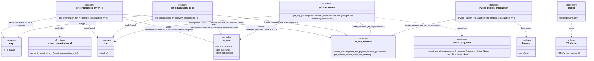

# Diagram: common/fv/python/fv/aws/lambdas/invokinators/invokinator_organization.py

> Auto-generated by Obscura crawlers

## Mermaid

```mermaid
classDiagram
class extract_organization_id <<function>> {
  +extract_organization_id(event, organization_fv_id)
}
class get_organization_by_fv_id <<function>> {
  +get_organization_by_fv_id(event, organization_fv_id)
}
class get_organization_by_id <<function>> {
  +get_organization_by_id(event, organization_id)
}
class extract_org_data <<function>> {
  +extract_org_data(event, search_params=None, everything=None, everything_fields=None)
}
class get_org_params <<function>> {
  +get_org_params(event, search_params=None, everything=None, everything_fields=None)
}
class invoke_publish_organization <<function>> {
  +invoke_publish_organization(http_method, organization_fv_id)
}
class fv_aws_lambdas <<module>> {
  +invoke_lambda(name, full_payload, invoke_type=None)
  +get_sample_admin_event(http_method)
}
class fv_error <<module>> {
  +BadRequestError
  +NotFoundError
  +HandledException
}
class TTLCache <<class>> {
  +TTLCache(maxsize, ttl)
}
class cached <<decorator>> {
  +cached(cache, key)
}
class logging <<module>> {
  +error(msg)
}
class http <<module>> {
  +HTTPStatus
}
class json <<module>> {
  +loads(s)
}

cached ..> TTLCache : uses
get_organization_by_fv_id ..> extract_organization_id : cache key
get_org_params ..> extract_org_data : cache key
get_organization_by_fv_id --> fv_aws_lambdas : invoke_lambda("get_organizations")
get_organization_by_id --> fv_aws_lambdas : invoke_lambda("get_organizations")
get_org_params --> fv_aws_lambdas : invoke_lambda("get_organizations")
invoke_publish_organization --> fv_aws_lambdas : invoke_lambda("publish_organization")
get_organization_by_fv_id --> fv_error : raises BadRequestError/NotFoundError/HandledException
get_organization_by_id --> fv_error : raises BadRequestError/NotFoundError/HandledException
get_org_params --> fv_error : raises NotFoundError/HandledException
invoke_publish_organization --> logging : logs errors
get_organization_by_fv_id --> json : loads(body)
get_organization_by_id --> json : loads(body)
get_org_params --> json : loads(body)
get_organization_by_fv_id --> http : uses HTTPStatus for error mapping
get_organization_by_id --> http : uses HTTPStatus for error mapping
```

> SVG rendering failed for this diagram.
